# II. Software Design Document

## 1. System Design

### 1.1 System Architecture

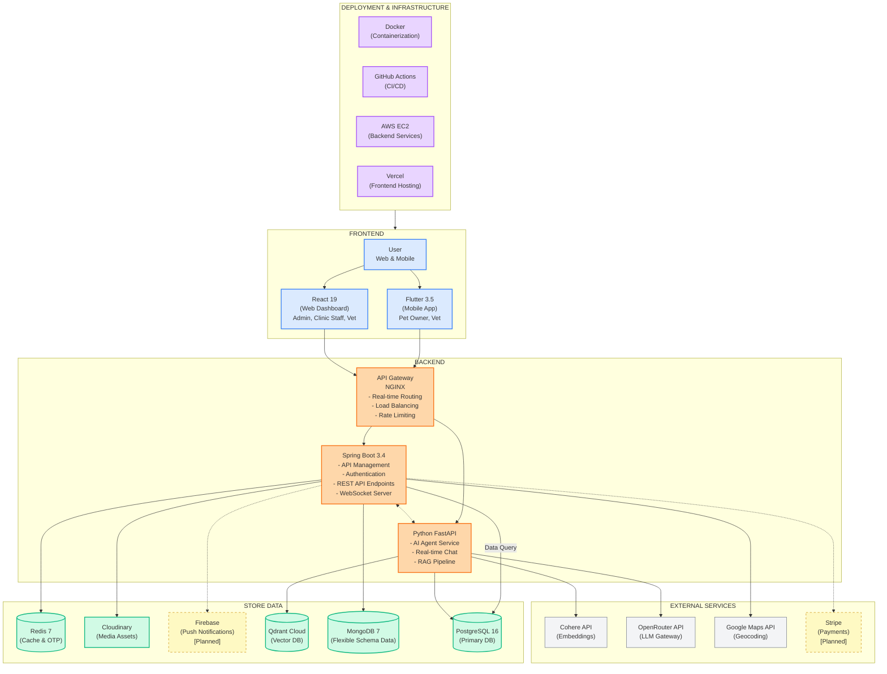

**The Petties Platform** is designed with a modern, scalable, and modular architecture, clearly separating frontend and backend responsibilities. This ensures high performance, flexibility for scaling, and easy integration with third-party services.

**1. User Role:**
- **Guest** - Can view clinic listings, search clinics, and view basic information
- **Pet Owner** - Can register pets, book appointments, chat with AI assistant, view EMR history, and manage profile (Mobile only)
- **Vet** - Can view appointments, manage schedule, create EMR records, and access patient history (Web + Mobile)
- **Clinic Manager** - Manages clinic operations, staff scheduling, booking management, and patient records (Web only)
- **Clinic Owner** - Manages clinic profile, services, pricing, staff, and views analytics (Web only)
- **Admin** - Manages the system, user accounts, clinic approvals, AI agent configuration, and oversees system operations (Web only)

**2. Frontend Layer:**
- Built with **React 19** (Web Dashboard) and **Flutter 3.5** (Mobile App) for responsive and real-time user experiences
- Uses **WebSocket clients** to receive live AI chat streaming
- Integrates **Neobrutalism design system** for consistent UI/UX
- Static assets are distributed through **Cloudinary CDN** to improve performance

**3. Backend Layer:**
- **Spring Boot 3.4 Server:** Handles API management, authentication (JWT), REST API endpoints, and business logic for clinics, bookings, users, pets, and EMR
- **Python FastAPI Service:** Processes AI chat requests, runs Single Agent with ReAct pattern, performs RAG queries, and supports real-time WebSocket streaming
- **API Gateway (NGINX):** Manages real-time routing, SSL termination, load balancing, and rate limiting

**4. Store Data:**
- **PostgreSQL 16** - Primary relational database storing users, clinics, bookings, pets, EMR, and AI agent configurations (shared by both services)
- **MongoDB 7** - Used for auditing, logs, and flexible schema data (e.g., patient records or specialized logs)
- **Redis 7** - Caches OTP codes, session data, and rate limiting counters with TTL-based expiration
- **Qdrant Cloud** - Stores vector embeddings for RAG knowledge base (1024 dimensions, Binary Quantization)
- **Cloudinary** - Manages media assets (images, avatars, clinic photos) efficiently with CDN delivery
- **Firebase** - Used for push notifications to mobile devices [Planned]

**5. Deployment & Infrastructure:**
- **Vercel** - Used for frontend (React) deployment with automatic preview deployments
- **AWS EC2** - Provides backend infrastructure and scalable cloud hosting for Spring Boot and FastAPI services
- **Docker** - Containerizes backend services (Spring Boot, FastAPI, NGINX), enabling flexible deployment and CI/CD pipelines
- **GitHub Actions** - Automated CI/CD for building, testing, and deploying all services

---

### 1.2 Package Diagram

#### 1.2.1 Back-End Package Diagram

##### Spring Boot Service (backend-spring)

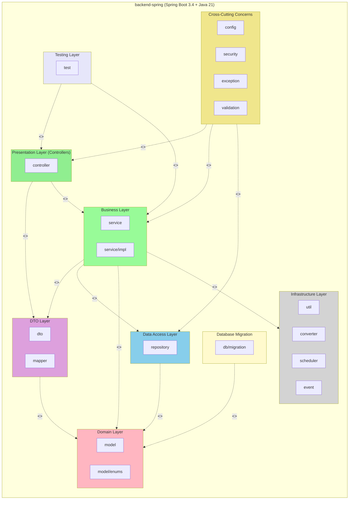

##### Python AI Agent Service (petties-agent-serivce)

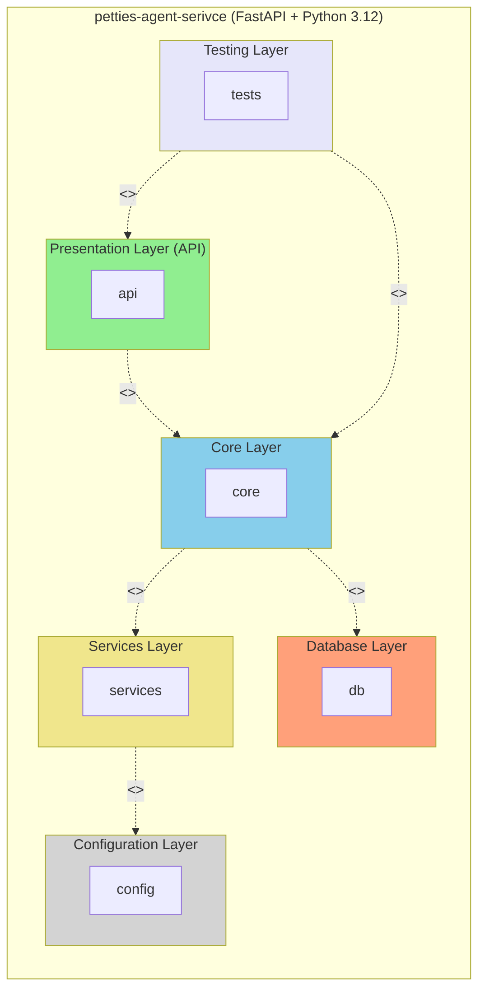

##### Package Descriptions - Spring Boot Service:

| No | Package | Layer Responsibility |
|----|---------|---------------------|
| **Presentation Layer** |
| 01 | controller | **REST API Layer** - Handles HTTP requests and maps them to service methods. Responsible for request validation, authentication checks, and response formatting. Implements `@RestController` pattern with route mapping to `/api/*` endpoints. |
| **Business Layer** |
| 02 | service | **Business Logic Layer** - Contains core business rules, transaction management (`@Transactional`), and orchestration of operations. Implements Interface-Implementation pattern for testability. Coordinates between repositories and external integrations. |
| 03 | service/impl | **Service Implementations** - Concrete implementations of service interfaces. Separates contract from implementation for dependency injection and mocking in tests. |
| **Data Access Layer** |
| 04 | repository | **Data Access Layer** - Provides CRUD operations and custom query methods using Spring Data JPA. Abstracts database interactions with PostgreSQL. Implements Repository pattern with method naming conventions for query generation. |
| **Domain Layer** |
| 05 | model | **Domain Entity Layer** - JPA entities mapped to PostgreSQL tables. Defines data structure, relationships (`@OneToMany`, `@ManyToOne`, `@ManyToMany`), and lifecycle hooks. Uses Hibernate for ORM with auditing fields (createdAt, updatedAt). |
| 06 | model/enums | **Enumeration Types** - Type-safe constants for domain concepts (Role, Status, Type). Ensures data integrity and provides readable code instead of magic strings/numbers. |
| **DTO Layer** |
| 07 | dto | **Data Transfer Objects** - Defines API contracts between client and server. Handles request validation (Jakarta Bean Validation annotations), response shaping, and prevents entity exposure. Organized by feature domain. |
| 08 | mapper | **Object Mapping Layer** - MapStruct-based mappers for Entity ↔ DTO conversion. Eliminates boilerplate mapping code and ensures type-safe transformations between layers. |
| **Cross-Cutting Concerns** |
| 09 | config | **Configuration Layer** - Spring beans for cross-cutting concerns: Security (JWT filter, authentication), external services (Redis, Cloudinary, Google Maps), JPA/Hibernate settings, WebSocket, Swagger/OpenAPI, and CORS configuration. |
| 10 | security | **Security Layer** - JWT token provider, authentication filter, custom `UserDetailsService`, and role-based access control. Implements Spring Security 6.x with stateless session management. |
| 11 | exception | **Error Handling Layer** - Centralized exception handling with `@ControllerAdvice`. Defines custom exceptions (BadRequest, NotFound, Unauthorized, Forbidden) and standardized error responses with Vietnamese messages. |
| 12 | validation | **Custom Validation Layer** - Custom Bean Validation annotations and validators for business rules not covered by standard annotations (e.g., phone format, date range validation). |
| **Infrastructure Layer** |
| 13 | util | **Utility Layer** - Stateless helper classes for common operations (token manipulation, date formatting, string processing, slug generation). Shared across multiple services without business logic. |
| 14 | converter | **Data Conversion Layer** - JPA `AttributeConverter` implementations for complex type mappings (JSON ↔ Object, Enum ↔ String). Enables storing structured data in database columns. |
| 15 | scheduler | **Scheduled Tasks Layer** - Spring `@Scheduled` jobs for background processing (appointment reminders, expired token cleanup, report generation). Implements cron-based and fixed-rate scheduling. |
| 16 | event | **Event Handling Layer** - Spring Application Events for decoupled communication between components. Implements async event publishing and listeners for notifications, audit logging, and side effects. |
| **Database Migration** |
| 17 | db/migration | **Schema Migration Layer** - Flyway SQL migration scripts with versioned naming (`V{timestamp}__{description}.sql`). Manages database schema evolution across environments. |
| **Testing Layer** |
| 18 | test | **Testing Layer** - JUnit 5 + Mockito test suites organized by component type (controller, service, repository). Includes unit tests with mocked dependencies and integration tests with `@SpringBootTest`. Follows Arrange-Act-Assert pattern with test fixtures for data setup. |

##### Package Descriptions - Python AI Agent Service:

| No | Package | Layer Responsibility |
|----|---------|---------------------|
| **API Layer** |
| 01 | api/routes | **REST Endpoint Layer** - FastAPI route handlers exposing AI service capabilities. Manages HTTP endpoints for chat sessions, agent configuration, tool registry, knowledge base, and settings. Uses Pydantic for request/response validation. |
| 02 | api/websocket | **Real-time Communication Layer** - WebSocket endpoints for bidirectional streaming. Enables real-time AI chat with token-by-token streaming and ReAct trace visualization. Handles connection lifecycle and message protocols. |
| 03 | api/middleware | **Request Interception Layer** - Cross-cutting middleware for authentication (JWT validation), logging, and request preprocessing. Integrates with Spring Boot's auth system for user context extraction. |
| 04 | api/schemas | **API Contract Layer** - Pydantic models defining request/response structures. Provides runtime validation, serialization, and OpenAPI documentation generation for all API endpoints. |
| 05 | api/dependencies | **Dependency Injection Layer** - FastAPI dependencies for common operations (database sessions, current user, pagination). Enables reusable request-scoped resources across routes. |
| **Core - Agent Layer** |
| 06 | core/agents | **AI Agent Orchestration** - Implements Single Agent with ReAct pattern (Thought → Action → Observation loop) using LangGraph StateGraph. Manages agent state, decision-making, and response generation. |
| 07 | core/agents/state | **Agent State Management** - TypedDict definitions for ReAct state (messages, steps, current thought, tool calls). Enables stateful conversation and reasoning trace tracking. |
| 08 | core/agents/factory | **Agent Construction Layer** - Factory pattern for dynamic agent instantiation. Loads configuration (prompts, parameters, enabled tools) from PostgreSQL database at runtime. |
| **Core - Tool Layer** |
| 09 | core/tools | **Tool Infrastructure Layer** - FastMCP server setup for tool registration and execution. Provides decorator-based tool definition (`@mcp.tool`) with semantic descriptions for LLM function calling. |
| 10 | core/tools/mcp_tools | **Tool Implementation Layer** - Code-based tools with semantic descriptions. Each tool is a function decorated with `@mcp.tool()` providing capabilities like Q&A, symptom search, clinic lookup, booking creation. |
| 11 | core/tools/scanner | **Tool Discovery Layer** - Auto-scans Python modules for `@mcp.tool` decorated functions. Syncs discovered tools to database for admin management (enable/disable, assign to agents). |
| 12 | core/tools/executor | **Tool Execution Layer** - Validates tool parameters against schema and executes through MCP server. Handles tool errors gracefully and returns structured results to agent. |
| **Core - RAG Layer** |
| 13 | core/rag | **Knowledge Retrieval Layer** - LlamaIndex-based RAG engine with Cohere embeddings (1024 dims) and Qdrant Cloud vector storage. Handles document chunking, embedding, indexing, and semantic search for context augmentation. |
| **Core - Utilities** |
| 14 | core/config_helper | **Dynamic Configuration Layer** - Loads API keys, model settings, and prompts from PostgreSQL. Enables runtime configuration changes without service restart. |
| 15 | core/init_db | **Database Initialization** - Seed data scripts and initial setup for agents, tools, and system settings. Runs on application startup. |
| 16 | core/sentry | **Error Monitoring Layer** - Sentry SDK integration for error tracking, performance monitoring, and distributed tracing across async operations. |
| **Services Layer** |
| 17 | services | **External Integration Layer** - Clients for external APIs (OpenRouter LLM, Cohere embeddings). Handles streaming responses, retry logic, and error handling for cloud AI providers. |
| **Database Layer** |
| 18 | db/postgres/models | **ORM Model Layer** - SQLAlchemy ORM models defining entities (Agent, Tool, ChatSession, ChatMessage, KnowledgeDocument, SystemSetting). Maps Python classes to PostgreSQL tables. |
| 19 | db/postgres/session | **Session Management Layer** - AsyncSession factory for database connections. Manages connection pooling and transaction scopes for async operations. |
| 20 | db/migrations | **Schema Migration Layer** - Alembic migration scripts for database schema versioning. Enables safe schema evolution across environments with up/down migrations. |
| **Configuration Layer** |
| 21 | config | **Environment Configuration** - Pydantic Settings for environment variables. Centralized configuration for database URLs, API keys, and logging setup with validation. |
| 22 | config/logging | **Logging Configuration** - Structured logging setup with JSON formatting for production. Configures log levels, handlers, and formatters per environment. |
| **Testing Layer** |
| 23 | tests | **Testing Layer** - pytest test suites for API endpoints, agent logic, tool execution, and RAG pipeline. Includes unit tests with mocks and integration tests with test database. Uses pytest-asyncio for async testing. |

---

#### 1.2.2 Front-End Package Diagram

##### React Web Dashboard (petties-web)

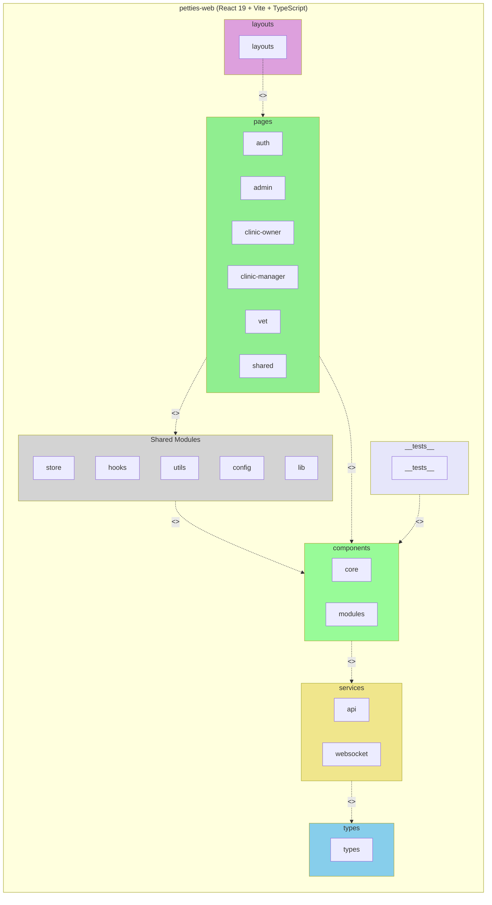

##### Flutter Mobile App (petties_mobile)

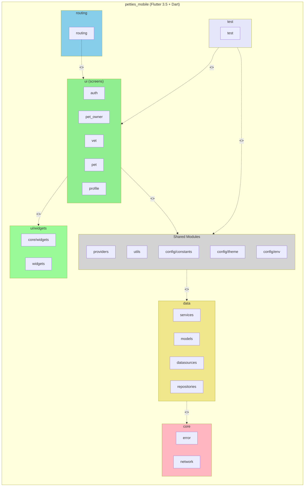

##### Package Descriptions - React Web Dashboard:

| No | Package | Layer Responsibility |
|----|---------|---------------------|
| **Pages Layer** |
| 01 | pages | **Route Page Layer** - Top-level page components mapping to routes. Each page represents a complete view for a specific role (Admin, Clinic Owner, Clinic Manager, Vet). Organized by role and feature domain. |
| 02 | pages/auth | **Authentication Pages** - Login, registration, and password recovery flows with OTP verification. Handles unauthenticated user journeys. |
| 03 | pages/admin | **Admin Dashboard Pages** - System administration views including clinic approvals, AI agent configuration, tool management, knowledge base, and system settings. |
| 04 | pages/clinic-owner | **Clinic Owner Pages** - Clinic management views for owners including profile editing, service configuration, pricing, and staff management. |
| 05 | pages/clinic-manager | **Clinic Manager Pages** - Operational views for daily clinic management including bookings, schedules, and patient records. |
| 06 | pages/vet | **Veterinarian Pages** - Vet-specific views for appointments, patient records, and schedule management. |
| 07 | pages/shared | **Shared Pages** - Cross-role pages like profile management accessible by all authenticated users. |
| **Components Layer** |
| 08 | components | **Reusable UI Components** - Modular, composable UI building blocks organized by domain (auth, clinic, profile, dashboard). Follows atomic design principles with consistent Neobrutalism styling. |
| 09 | components/common | **Shared Components** - Generic UI components used across multiple features (modals, inputs, dialogs, loading states). Framework-agnostic and highly reusable. |
| **Layouts Layer** |
| 10 | layouts | **Page Layout Layer** - Role-based layout wrappers providing consistent navigation, sidebar, and header structure. Implements layout composition pattern for DRY page structure. |
| **Services Layer** |
| 11 | services/api | **API Client Layer** - Axios-based HTTP client with interceptors for JWT handling, error transformation, and request/response logging. Provides typed service methods for each API domain. |
| 12 | services/websocket | **WebSocket Client Layer** - Real-time communication for AI chat streaming. Manages connection lifecycle, reconnection, and message handling. |
| **State Management** |
| 13 | store | **Global State Layer** - Zustand stores for application-wide state (auth, user profile, clinic data). Provides selectors, actions, and persistence for client-side state management. |
| **Hooks Layer** |
| 14 | hooks | **Custom React Hooks** - Reusable stateful logic encapsulation (useAuth, useToast, useDebounce). Abstracts common patterns and side effects for clean component code. |
| **Types Layer** |
| 15 | types | **TypeScript Definitions** - Shared type definitions for API responses, domain models, and component props. Ensures type safety across the application. |
| **Utils Layer** |
| 16 | utils | **Utility Functions** - Pure helper functions for common operations (date formatting, validation, token handling, error processing). Stateless and side-effect free. |
| **Config Layer** |
| 17 | config | **Environment Configuration** - Environment-specific settings (API URLs, feature flags). Centralizes configuration management with type-safe access. |
| **Lib Layer** |
| 18 | lib | **Third-party Integrations** - Wrappers and configurations for external libraries (Sentry error tracking). Isolates vendor-specific code from application logic. |
| **Testing Layer** |
| 19 | __tests__ | **Testing Layer** - Vitest/Jest test suites for components and hooks. Includes unit tests with React Testing Library and integration tests for user flows. Uses MSW for API mocking. |

##### Package Descriptions - Flutter Mobile App:

| No | Package | Layer Responsibility |
|----|---------|---------------------|
| **UI Layer - Screens** |
| 01 | ui/screens | **Screen Layer** - Full-page widget compositions representing complete views. Each screen corresponds to a route and composes widgets for specific user flows. Organized by user role (pet_owner, vet) and feature domain (auth, pet, profile). |
| 02 | ui/auth | **Authentication Screens** - Login, registration, password recovery flows with OTP verification. Handles unauthenticated user journeys with form validation. |
| 03 | ui/pet_owner | **Pet Owner Screens** - Home and feature screens exclusive to pet owners including booking, AI chat, and pet management. |
| 04 | ui/vet | **Veterinarian Screens** - Vet-specific screens for appointments, patient records, and schedule management. |
| **UI Layer - Widgets** |
| 05 | ui/core/widgets | **Core Widgets** - Foundational reusable widgets (buttons, text fields, loaders). Implements Neobrutalism design system with consistent styling across the app. |
| 06 | ui/widgets | **Feature Widgets** - Domain-specific widgets organized by feature (profile, pet, booking). Composable building blocks for screens. |
| **Data Layer** |
| 07 | data/services | **API Service Layer** - Dio-based HTTP services for backend communication. Handles request construction, response parsing, and error transformation. Implements service classes per domain (auth, user, pet). |
| 08 | data/models | **Data Model Layer** - Dart classes representing API responses and domain entities. Provides fromJson/toJson methods for serialization. Immutable data structures with factory constructors. |
| 09 | data/datasources | **Data Source Layer** - Abstracts data retrieval from local (SharedPreferences, Hive) and remote (API) sources. Implements Repository pattern's data source abstraction. |
| 10 | data/repositories | **Repository Layer** - Orchestrates between local and remote data sources. Implements caching strategies, offline-first logic, and data synchronization. Single source of truth for data access. |
| **State Management** |
| 11 | providers | **State Provider Layer** - Provider/Riverpod state management. Exposes reactive state to widgets with notifyListeners for UI updates. Handles async state loading and error states. |
| **Routing Layer** |
| 12 | routing | **Navigation Layer** - GoRouter configuration with role-based route guards. Defines route paths, redirects, and deep linking. Implements declarative navigation pattern. |
| **Config Layer** |
| 13 | config/constants | **App Constants** - Static configuration values (colors, strings, dimensions). Centralizes magic values for consistent UI and easy theming. |
| 14 | config/theme | **Theme Configuration** - MaterialApp theme definition with Neobrutalism styling. Defines colors, typography, component themes, and dark mode support. |
| 15 | config/env | **Environment Configuration** - Environment-specific settings (dev, test, prod). Manages API URLs and feature flags per build configuration. |
| **Core Layer** |
| 16 | core/error | **Error Handling Layer** - Custom exception classes and failure types. Standardizes error representation for consistent handling across the app. |
| 17 | core/network | **Network Layer** - Dio client setup with interceptors for JWT injection, token refresh, and error mapping. Centralizes HTTP configuration. |
| **Utils Layer** |
| 18 | utils | **Utility Layer** - Stateless helper functions for common operations (validators, date formatters, storage helpers, permission handling, API error processing). Shared across all layers without business logic. |
| **Entry Points** |
| 19 | main.dart | **Application Entry** - App initialization including Provider setup, Firebase init, GoRouter configuration, and theme application. |
| **Testing Layer** |
| 20 | test | **Testing Layer** - Flutter test suites for widgets, providers, and services. Includes unit tests with mocktail/mockito, widget tests with WidgetTester, and integration tests with flutter_driver. |

---

## 2. API DESIGN SPECIFICATIONS

> **Note:** API version prefix `/api/v1` (Backend) has been simplified to `/api`. AI Service is accessed via `/ai` prefix through NGINX.

### 2.1 Implemented Modules (Backend - Spring Boot)

> **Base Path:** `/api`
> **Access:** Requires JWT, Public for Auth/Search

#### 2.1.1 Authentication (`/auth`)
| Method | Endpoint | Description | Access |
|--------|----------|-------------|--------|
| POST | `/api/auth/login` | Email/Password login | Public |
| POST | `/api/auth/google` | Google OAuth login/register | Public |
| POST | `/api/auth/register/send-otp` | Init registration with Email OTP | Public |
| POST | `/api/auth/register/verify-otp` | Complete registration | Public |
| POST | `/api/auth/refresh` | Refresh Access Token (Rotation) | Public |
| GET | `/api/auth/me` | Get current user basic info | Auth |
| POST | `/api/auth/forgot-password` | Request password reset OTP | Public |
| POST | `/api/auth/logout` | Revoke token | Auth |

#### 2.1.2 User Profile (`/users`)
| Method | Endpoint | Description | Access |
|--------|----------|-------------|--------|
| GET | `/api/users/profile` | Get detailed profile | Auth |
| PUT | `/api/users/profile` | Update profile info | Auth |
| POST | `/api/users/profile/avatar` | Upload avatar | Auth |
| DELETE | `/api/users/profile/avatar` | Delete avatar | Auth |
| PUT | `/api/users/profile/password` | Change password | Auth |
| POST | `/api/users/profile/email/request-change` | Request email change (Step 1) | Auth |
| POST | `/api/users/profile/email/verify-change` | Verify email change (Step 2) | Auth |

#### 2.1.3 Clinic Management (`/clinics`)
| Method | Endpoint | Description | Access |
|--------|----------|-------------|--------|
| GET | `/api/clinics` | List all clinics (Filter/Page) | Public |
| GET | `/api/clinics/{id}` | Get details | Public |
| POST | `/api/clinics` | Create clinic | Clinic Owner |
| PUT | `/api/clinics/{id}` | Update profile | Clinic Owner |
| POST | `/api/clinics/{id}/images` | Upload gallery image | Clinic Owner |
| POST | `/api/clinics/{id}/logo` | Upload logo | Clinic Owner |
| DELETE | `/api/clinics/{id}/images/{imageId}` | Delete gallery image | Clinic Owner |
| GET | `/api/clinics/nearby` | Geo-search nearby | Public |
| GET | `/api/clinics/search` | Name search | Public |
| GET | `/api/clinics/owner/my-clinics` | Get my clinics | Clinic Owner |

#### 2.1.4 Clinic Staff Management (`/clinics/{id}/staff`)
| Method | Endpoint | Description | Access |
|--------|----------|-------------|--------|
| GET | `/api/clinics/{id}/staff` | List all staff | CM, CO, Admin |
| GET | `/api/clinics/{id}/staff/has-manager` | Check manager logic | CM, CO |
| POST | `/api/clinics/{id}/staff/quick-add` | Quick add Vet/Manager | CM, CO |
| DELETE | `/api/clinics/{id}/staff/{userId}` | Remove staff | CM, CO |

#### 2.1.5 Clinic Services (`/services`)
| Method | Endpoint | Description | Access |
|--------|----------|-------------|--------|
| GET | `/api/services` | List own services | Clinic Owner |
| POST | `/api/services` | Create service | Clinic Owner |
| PUT | `/api/services/{id}` | Update service | Clinic Owner |
| DELETE | `/api/services/{id}` | Delete service | Clinic Owner |
| PATCH | `/api/services/{id}/status` | Toggle active | Clinic Owner |
| PATCH | `/api/services/{id}/home-visit` | Toggle Home Visit | Clinic Owner |

#### 2.1.6 File Management (`/files`)
| Method | Endpoint | Description | Access |
|--------|----------|-------------|--------|
| POST | `/api/files/upload` | Upload generic file | Auth |
| POST | `/api/files/upload/avatar` | Upload avatar (resize) | Auth |

### 2.2 Implemented Modules (AI Service - Python)

> **Base Path:** `/ai` (Mapped via NGINX to Internal Port 8000)

#### 2.2.1 Chat & Sessions (`/ai/chat`)
| Method | Endpoint | Description | Access |
|--------|----------|-------------|--------|
| POST | `/ai/chat/sessions` | Create new chat session | Auth |
| GET | `/ai/chat/sessions` | List history sessions | Auth |
| GET | `/ai/chat/sessions/{id}` | Get session details | Auth |
| WS | `/ws/chat/{session_id}` | WebSocket Real-time Chat | Auth |

#### 2.2.2 Agent Management (`/ai/agents`)
| Method | Endpoint | Description | Access |
|--------|----------|-------------|--------|
| GET | `/ai/agents` | List agents (Single/Multi) | Auth |
| GET | `/ai/agents/{id}` | Get agent detail | Auth |
| PUT | `/ai/agents/{id}` | Update config (Temp, Model, Params) | Admin |
| PUT | `/ai/agents/{id}/prompt` | Update System Prompt (Versioning) | Admin |
| GET | `/ai/agents/{id}/prompt-history` | View Prompt History | Admin |
| POST | `/ai/agents/{id}/test` | Test Agent (ReAct Trace) | Admin |

#### 2.2.3 Tool Registry (`/ai/tools`)
| Method | Endpoint | Description | Access |
|--------|----------|-------------|--------|
| POST | `/ai/tools/scan` | Scan & Sync Code-based Tools (FastMCP) | Admin |
| GET | `/ai/tools` | List Registered Tools | Admin |
| PUT | `/ai/tools/{id}/enable` | Enable/Disable Tool | Admin |
| POST | `/ai/tools/{id}/assign` | Assign tool to Agent | Admin |

#### 2.2.4 Knowledge Base RAG (`/ai/knowledge`)
| Method | Endpoint | Description | Access |
|--------|----------|-------------|--------|
| POST | `/ai/knowledge/upload` | Upload PDF/Docx | Admin |
| POST | `/ai/knowledge/documents/{id}/process` | Index to Qdrant (Cohere Embedding) | Admin |
| GET | `/ai/knowledge/documents` | List documents status | Admin |
| POST | `/ai/knowledge/query` | Test RAG Retrieval | Admin |
| GET | `/ai/knowledge/status` | KB Status & Stats | Admin |

### 2.3 Planned Modules (Backend)

#### 2.3.1 Patient Management Module

> **Status:** Design Approved. Endpoint paths finalized.

| Method | Endpoint | Description | Access |
|--------|----------|-------------|--------|
| GET | `/api/clinics/{id}/patients` | List patients of clinic | CM, VET |
| GET | `/api/patients/{id}` | Get Patient & Owner details | CM, VET |
| PUT | `/api/pets/{id}` | Update Patient Info | CM, VET |
| GET | `/api/patients/{id}/emrs` | Get EMR History (Shared) | CM, VET |
| POST | `/api/bookings/{id}/emr` | Create EMR for Booking | VET |
| PUT | `/api/emrs/{id}` | Update EMR Content | VET |
| GET | `/api/patients/{id}/vaccinations` | Get Vaccination History | CM, VET |
| POST | `/api/patients/{id}/vaccinations` | Add Vaccination Record | VET |
| PUT | `/api/vaccinations/{id}` | Edit Vaccination Record | VET |
| DELETE | `/api/vaccinations/{id}` | Delete Vaccination Record | VET |

#### 2.3.2 Shift & Slot Management Module
| Method | Endpoint | Description | Access |
|--------|----------|-------------|--------|
| GET | `/api/clinics/{id}/shifts` | Get shift list (filter: dateRange, vetId) | CM, CO |
| POST | `/api/clinics/{id}/shifts` | Create new shift (Auto-generate 30min slots) | CM, CO |
| PUT | `/api/shifts/{id}` | Update shift time | CM, CO |
| DELETE | `/api/shifts/{id}` | Delete shift (Delete unbooked slots) | CM, CO |
| GET | `/api/shifts/my-shifts` | View own schedule | VET |
| GET | `/api/clinics/{id}/slots` | Get slots for the day | CM, VET, Public |
| PATCH | `/api/slots/{id}/block` | Block/Unblock slot manually | CM, VET |

#### 2.3.3 Discovery & Search Module
| Method | Endpoint | Description | Access |
|--------|----------|-------------|--------|
| GET | `/api/discovery/nearby` | Find clinics by coordinates (lat, lng, radius) | Public |
| GET | `/api/discovery/search` | Search by keyword, service, area | Public |
| GET | `/api/discovery/geocoding` | Convert address to coordinates (Map API proxy) | Public |

#### 2.3.4 Vaccination History Module (Merged)
| Method | Endpoint | Description | Access |
|--------|----------|-------------|--------|
| GET | `/api/pets/{petId}/vaccinations` | Get full vaccination history | Auth |
| POST | `/api/bookings/{bookingId}/vaccinations` | Add new vaccination record (Must link to Booking) | VET |
| PUT | `/api/vaccinations/{id}` | Edit record | VET |
| DELETE | `/api/vaccinations/{id}` | Delete record | VET |

---

## 3. DETAILED DESIGN

### 3.1 Authentication & Authorization

This feature provides mechanisms for account registration, user authentication (Login), session management (Refresh Token), and logout (Logout). The system utilizes JWT (JSON Web Token) to secure APIs and supports Google OAuth 2.0 sign-in.

#### 3.1.1 Class Diagram

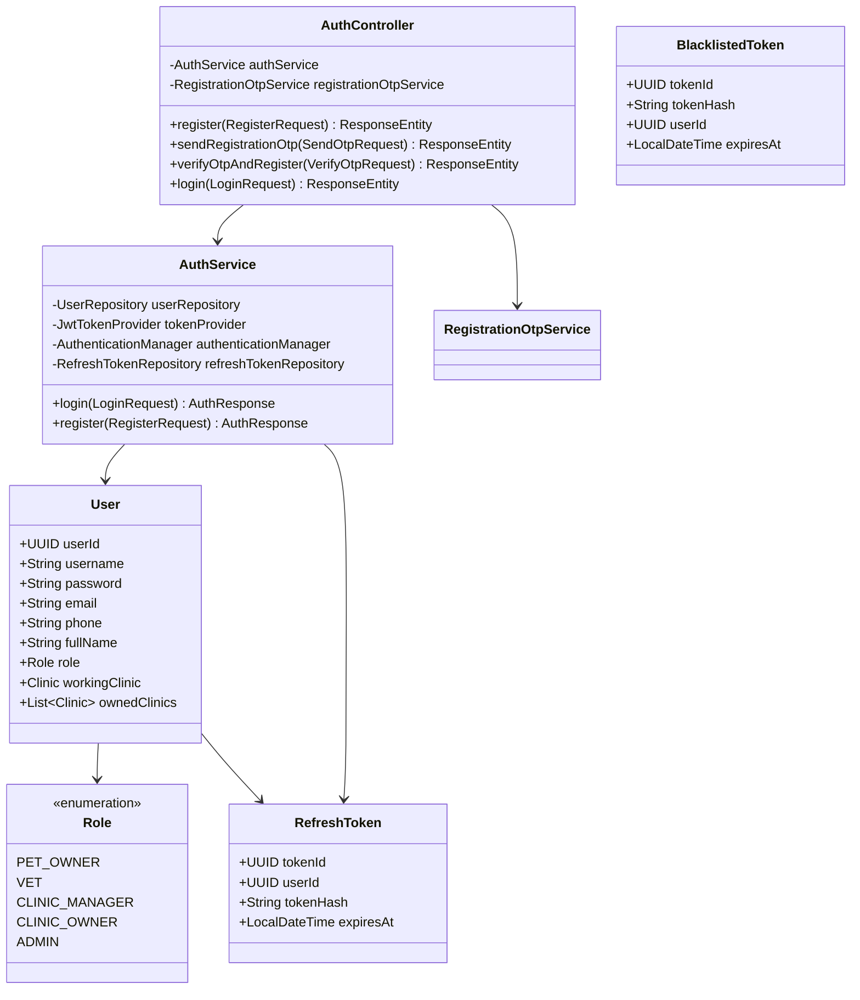

#### 3.1.2 Class Specifications

**1. AuthController**
- **Responsibility:** Receives authentication-related HTTP requests and routes them to the appropriate Services.
- **Key Methods:**
    - `login(LoginRequest)`: Authenticates login credentials and returns Access Token/Refresh Token.
    - `register(RegisterRequest)`: Handles new user registration (legacy/direct version).
    - `sendRegistrationOtp(SendOtpRequest)`: Sends an OTP via Email to initiate the registration process.
    - `verifyOtpAndRegister(VerifyOtpRequest)`: Verifies the OTP and completes the account registration.

**2. AuthService**
- **Responsibility:** Handles business logic for authentication, token generation/management, and token blacklisting.
- **Key Methods:**
    - `authenticateUser(String, String)`: Uses Spring Security to verify account details.
    - `generateTokenPair(User)`: Creates an Access Token and Refresh Token pair for the user.
    - `logout(String)`: Invalidates the Access Token by blacklisting it and deleting the Refresh Token.

#### 3.1.3 Sequence Diagram: User Registration with OTP

The registration process starts from the Register Screen on the Mobile app, involving OTP verification and data storage in the database.

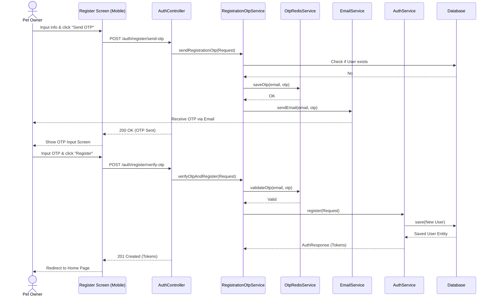

#### 3.1.4 Sequence Diagram: Login Flow

The login flow starts from the Login Screen, authenticates information, and persists the Refresh Token in the DB.

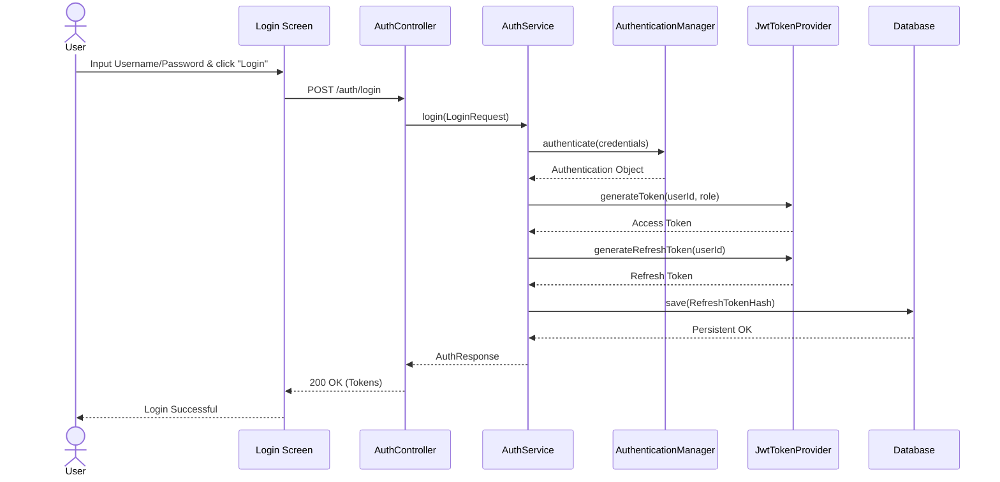

### 3.2 Clinic Management

This feature is for Clinic Owners to register and manage clinic information, and for Admins to review and approve clinic profiles.

#### 3.2.1 Class Diagram

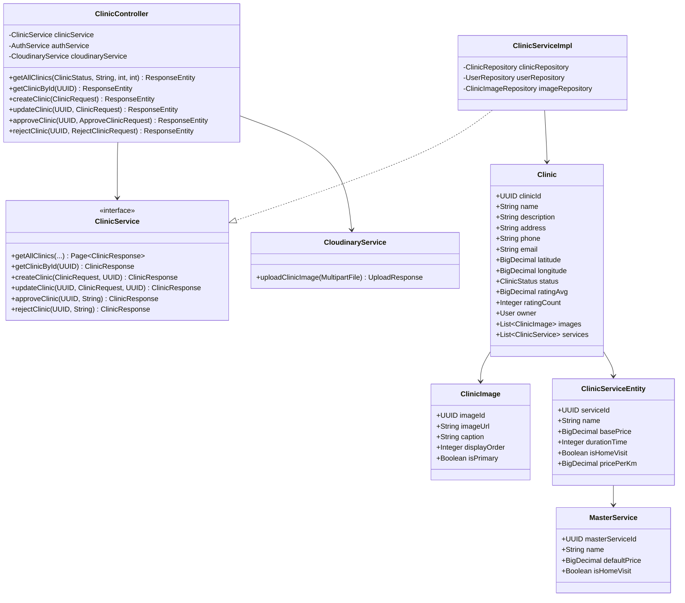

#### 3.2.2 Class Specifications

**1. ClinicController**
- **Responsibility:** Provides RESTful APIs for managing the lifecycle of a clinic.
- **Key Methods:**
    - `createClinic(ClinicRequest)`: Receives a new clinic registration profile from a user with CLINIC_OWNER role.
    - `approveClinic(UUID, ...)`: Allows an Admin to approve a clinic for display on the system.
    - `uploadClinicImage(UUID, ...)`: Handles uploading clinic images via Cloudinary.

**2. ClinicService (ClinicServiceImpl)**
- **Responsibility:** Implements business rules for clinic management, distance calculation, and geographic data processing.
- **Key Methods:**
    - `createClinic(ClinicRequest, UUID ownerId)`: Initializes a Clinic entity with a PENDING status.
    - `findNearbyClinics(BigDecimal, BigDecimal, double)`: Searches for clinics within a certain radius using the Haversine formula (or Spatial Query).

#### 3.2.3 Sequence Diagram: Clinic Registration

The clinic registration flow starts from the Clinic Owner's Register Clinic screen, with information stored in the DB with a PENDING status.

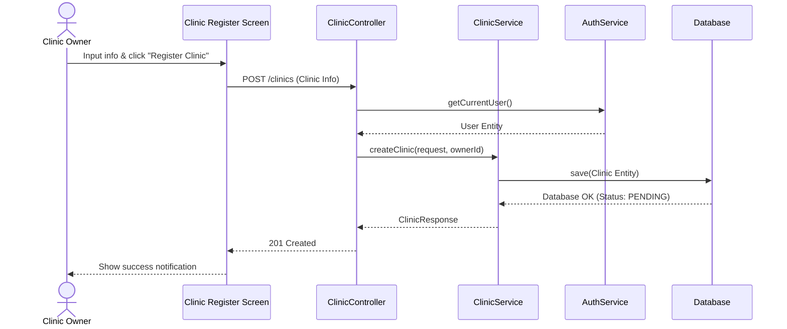

#### 3.2.4 Sequence Diagram: Clinic Approval (Admin)

The clinic approval flow starts from the Admin Dashboard to activate a clinic on the system.

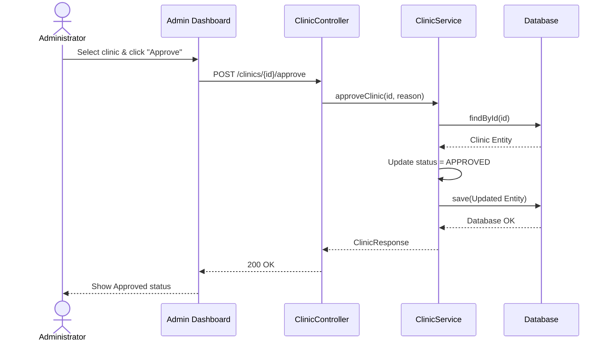

### 3.3 Pet Management

This feature allows Pet Owners to manage their pets' information, including creating, updating, and deleting pet profiles.

#### 3.3.1 Class Diagram

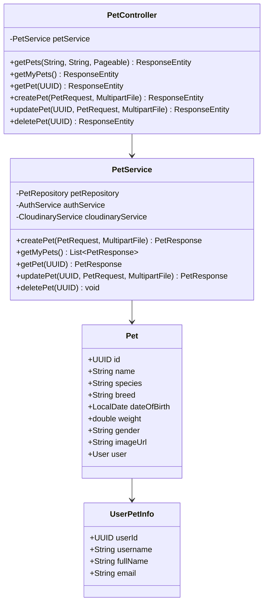

#### 3.3.2 Class Specifications

**1. PetController**
- **Responsibility:** Provides API endpoints for users to interact with pet data. Uses `@ModelAttribute` to receive form-data (including image files).
- **Key Methods:**
    - `createPet(PetRequest, MultipartFile)`: Receives pet information and an optional image file to create a new profile.
    - `getMyPets()`: Retrieves a list of all pets owned by the current user.

**2. PetService**
- **Responsibility:** Manages business logic related to pets, validates ownership, and manages image files via Cloudinary.
- **Key Methods:**
    - `createPet(...)`: Saves pet information to the database and uploads the image to Cloudinary if provided.
    - `validateOwnership(Pet, User)`: Checks if the pet belongs to the current user before allowing any edit or delete operations.

#### 3.3.3 Sequence Diagram: Create Pet

The pet profile creation flow from the Mobile app, including image processing and database storage.

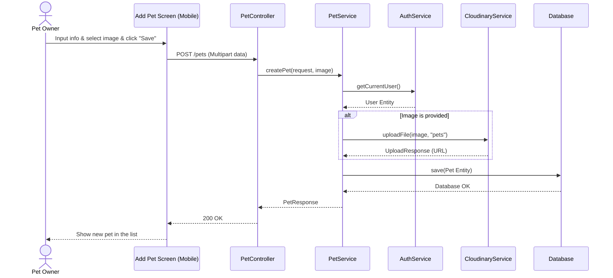

---

## 4. TECHNOLOGY STACK SUMMARY

### Frontend (petties-web)
- **Framework:** React 19 + Vite (rolldown-vite)
- **Language:** TypeScript 5.9.x
- **State Management:** Zustand 5.x
- **Routing:** React Router v7.9
- **Styling:** Tailwind CSS v4 (Neobrutalism design)
- **HTTP Client:** Axios
- **Real-time:** Native WebSocket API

### Backend (backend-spring)
- **Framework:** Spring Boot 3.4.x
- **Language:** Java 21
- **Architecture:** Layered (Controller -> Service -> Repository)
- **Security:** Spring Security 6.x + JWT
- **Database Access:** Spring Data JPA + Hibernate
- **Validation:** Jakarta Bean Validation
- **Caching:** Spring Data Redis
- **Image Upload:** Cloudinary SDK

### AI Agent Service (petties-agent-serivce)
- **Framework:** FastAPI 0.115.x
- **Language:** Python 3.12
- **Agent Framework:** LangGraph 0.2.x (Single Agent + ReAct Pattern)
- **RAG Framework:** LlamaIndex 0.11.x
- **Tool Protocol:** FastMCP 2.3.x (@mcp.tool() decorator)
- **LLM Provider:** OpenRouter API (Gemini 2.0 Flash, Llama 3.3 70B)
- **Embeddings:** Cohere embed-multilingual-v3.0 (1024 dimensions)
- **Vector DB:** Qdrant Cloud (Binary Quantization)

### Mobile (petties_mobile)
- **Framework:** Flutter 3.x
- **Language:** Dart SDK 3.x
- **State Management:** Provider 6.x
- **Routing:** GoRouter 14.x
- **HTTP Client:** Dio 5.x
- **Local Storage:** SharedPreferences, Hive
- **Auth:** Google Sign-In, JWT

### Databases
- **PostgreSQL 16:** Primary relational database (Neon Cloud)
- **Redis 7:** OTP, session caching (Upstash Cloud)
- **Qdrant Cloud:** Vector embeddings (1024 dimensions)

### Infrastructure
- **Development:** Docker Compose (local databases)
- **Test Environment:** AWS EC2, Neon Test Branch
- **Production:** AWS EC2 (backend + AI), Vercel (frontend), Neon Main
- **CI/CD:** GitHub Actions
- **Reverse Proxy:** NGINX with SSL (Let's Encrypt)
- **Image Storage:** Cloudinary
- **Push Notifications:** Firebase [Planned]
- **Payments:** Stripe [Planned]

---

**Prepared by:** Petties Development Team
**Document Version:** 2.5
**Last Updated:** 2025-12-31
