# II. Software Design Document

**Project:** Petties - Veterinary Appointment Booking Platform
**Version:** 3.2.1 (Normalized staff and scheduling design to match codebase)
**Last Updated:** 2026-03-09
**Document Status:** In Progress

## TABLE OF CONTENTS
- [1. System Design](#1-system-design)
    - [1.1 System Architecture](#11-system-architecture)
    - [1.2 Package Diagram](#12-package-diagram)
    - [1.3 UML Diagram Standards](#13-uml-diagram-standards)
- [2. Database Design](#2-database-design)
    - [2.1 Relational Database Design (PostgreSQL)](#21-relational-database-design-postgresql)
    - [2.2 NoSQL Database Design (MongoDB)](#22-nosql-database-design-mongodb)
- [3. API Design Specifications](#3-api-design-specifications)
    - [3.1 Implemented Modules (Backend - Spring Boot)](#31-implemented-modules-backend---spring-boot)
    - [3.2 Implemented Modules (AI Service - Python)](#32-implemented-modules-ai-service---python)
    - [3.3 Planned Modules (Backend)](#33-planned-modules-backend)
- [4. Detailed Design](#4-detailed-design)
    - [4.1 Authentication](#41-authentication)
    - [4.2 User Profile Management](#42-user-profile-management)
### 4.3 Staff and Scheduling Management

This module covers clinic roster management and staff shift scheduling. The current design is centered around two controllers and two services: one pair manages clinic staff assignment by email and roster removal, while the other pair manages shift creation, schedule viewing, shift detail lookup, and shift deletion.

#### 4.3.1 Class Diagram

The class diagram below is intentionally simplified to keep Staff and Scheduling readable. The sequence diagrams in this section use the same set of core classes only: controller, service, repositories, and the main scheduling entities.

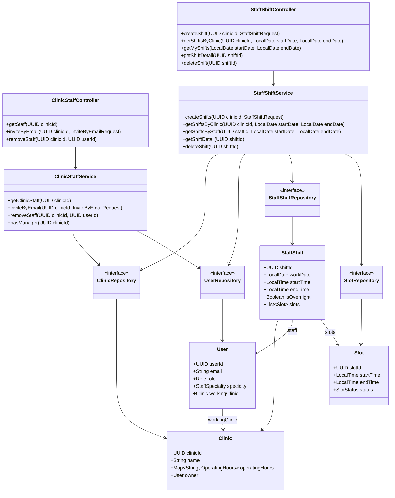
```mermaid
classDiagram
    class ClinicStaffController {
        +getStaff(UUID clinicId)
        +inviteByEmail(UUID clinicId, InviteByEmailRequest)
        +removeStaff(UUID clinicId, UUID userId)
    }

    class StaffShiftController {
        +createShift(UUID clinicId, StaffShiftRequest)
        +getShiftsByClinic(UUID clinicId, LocalDate startDate, LocalDate endDate)
        +getMyShifts(LocalDate startDate, LocalDate endDate)
        +getShiftDetail(UUID shiftId)
        +deleteShift(UUID shiftId)
    }

    class ClinicStaffService {
        +getClinicStaff(UUID clinicId)
        +inviteByEmail(UUID clinicId, InviteByEmailRequest)
        +removeStaff(UUID clinicId, UUID userId)
        +hasManager(UUID clinicId)
    }

    class StaffShiftService {
        +createShifts(UUID clinicId, StaffShiftRequest)
        +getShiftsByClinic(UUID clinicId, LocalDate startDate, LocalDate endDate)
        +getShiftsByStaff(UUID staffId, LocalDate startDate, LocalDate endDate)
        +getShiftDetail(UUID shiftId)
        +deleteShift(UUID shiftId)
    }

    class ClinicRepository {
        <<interface>>
    }

    class UserRepository {
        <<interface>>
    }

    class StaffShiftRepository {
        <<interface>>
    }

    class SlotRepository {
        <<interface>>
    }

    class User {
        +UUID userId
        +String email
        +Role role
        +StaffSpecialty specialty
        +Clinic workingClinic
    }

    class Clinic {
        +UUID clinicId
        +String name
        +Map~String, OperatingHours~ operatingHours
        +User owner
    }

    class StaffShift {
        +UUID shiftId
        +LocalDate workDate
        +LocalTime startTime
        +LocalTime endTime
        +Boolean isOvernight
        +List~Slot~ slots
    }

    class Slot {
        +UUID slotId
        +LocalTime startTime
        +LocalTime endTime
        +SlotStatus status
    }

    ClinicStaffController --> ClinicStaffService
    StaffShiftController --> StaffShiftService

    ClinicStaffService --> ClinicRepository
    ClinicStaffService --> UserRepository
    StaffShiftService --> ClinicRepository
    StaffShiftService --> UserRepository
    StaffShiftService --> StaffShiftRepository
    StaffShiftService --> SlotRepository

    ClinicRepository --> Clinic
    UserRepository --> User
    StaffShiftRepository --> StaffShift
    SlotRepository --> Slot

    User --> Clinic : workingClinic
    StaffShift --> Clinic
    StaffShift --> User : staff
    StaffShift --> Slot : slots
```

#### 4.3.2 Class Specifications

**1. `ClinicStaffController`**
- **Responsibility:** Expose staff roster APIs for clinic-level web operations.
- **Key Methods:** `getStaff()`, `inviteByEmail()`, `removeStaff()`.

**2. `ClinicStaffService`**
- **Responsibility:** Enforce clinic-level authorization and maintain the relationship between `User` and `Clinic` for staff membership.
- **Key Methods:** `getClinicStaff()`, `inviteByEmail()`, `removeStaff()`, `hasManager()`.

**3. `StaffShiftController`**
- **Responsibility:** Expose schedule APIs for clinic-wide shift management and staff self-view.
- **Key Methods:** `createShift()`, `getShiftsByClinic()`, `getMyShifts()`, `getShiftDetail()`, `deleteShift()`.

**4. `StaffShiftService`**
- **Responsibility:** Handle shift validation, slot generation, overnight continuation logic, slot statistics, and shift deletion rules.
- **Key Methods:** `createShifts()`, `getShiftsByClinic()`, `getShiftsByStaff()`, `getShiftDetail()`, `deleteShift()`.

**5. `User` / `Clinic`**
- **Responsibility:** Store clinic membership, role, specialty, and ownership context used by staff management flows.

**6. `StaffShift` / `Slot`**
- **Responsibility:** Represent scheduled work periods and 30-minute booking capacity generated for each shift.

#### 4.3.3 Sequence Diagram: Invite Staff by Email (UC-STAFF-01)

This flow creates or reuses a user account and associates it with the target clinic.

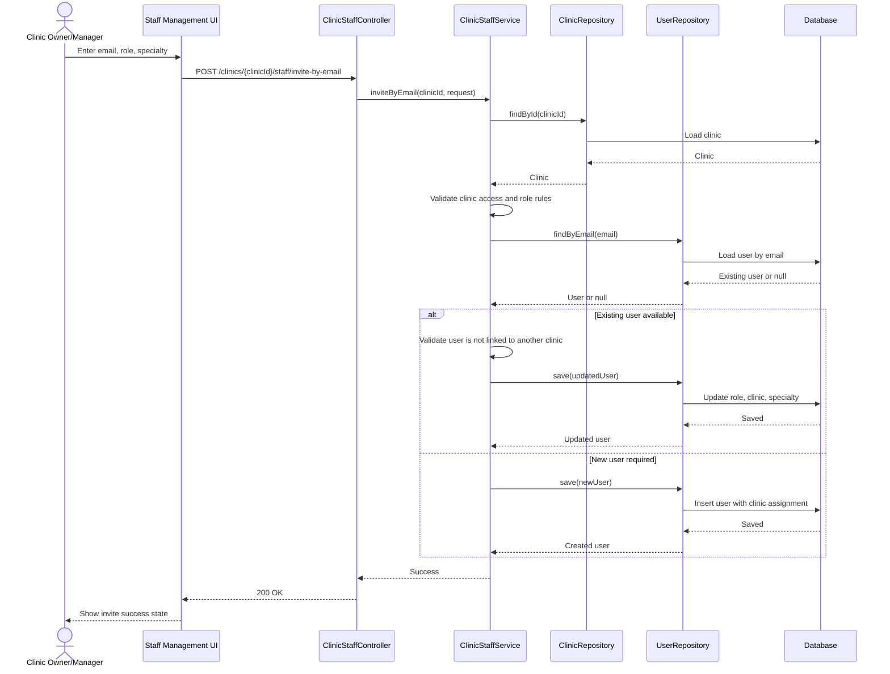
```mermaid
sequenceDiagram
    actor Manager as Clinic Owner/Manager
    participant UI as Staff Management UI
    participant CSC as ClinicStaffController
    participant CSS as ClinicStaffService
    participant CR as ClinicRepository
    participant UR as UserRepository
    participant DB as Database

    Manager->>UI: Enter email, role, specialty
    UI->>CSC: POST /clinics/{clinicId}/staff/invite-by-email
    CSC->>CSS: inviteByEmail(clinicId, request)
    CSS->>CR: findById(clinicId)
    CR->>DB: Load clinic
    DB-->>CR: Clinic
    CR-->>CSS: Clinic
    CSS->>CSS: Validate clinic access and role rules
    CSS->>UR: findByEmail(email)
    UR->>DB: Load user by email
    DB-->>UR: Existing user or null
    UR-->>CSS: User or null

    alt Existing user available
        CSS->>CSS: Validate user is not linked to another clinic
        CSS->>UR: save(updatedUser)
        UR->>DB: Update role, clinic, specialty
        DB-->>UR: Saved
        UR-->>CSS: Updated user
    else New user required
        CSS->>UR: save(newUser)
        UR->>DB: Insert user with clinic assignment
        DB-->>UR: Saved
        UR-->>CSS: Created user
    end

    CSS-->>CSC: Success
    CSC-->>UI: 200 OK
    UI-->>Manager: Show invite success state
```

#### 4.3.4 Sequence Diagram: Delete Staff (UC-STAFF-02)

This flow removes a user's clinic association after authorization checks.

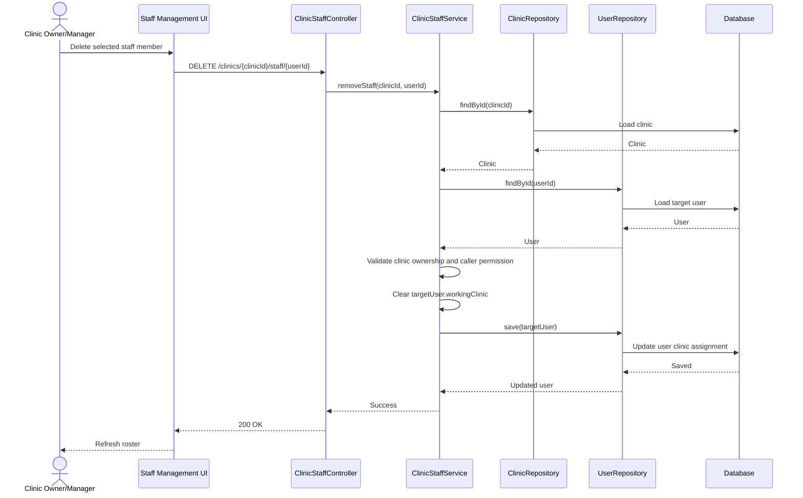
```mermaid
sequenceDiagram
    actor Manager as Clinic Owner/Manager
    participant UI as Staff Management UI
    participant CSC as ClinicStaffController
    participant CSS as ClinicStaffService
    participant CR as ClinicRepository
    participant UR as UserRepository
    participant DB as Database

    Manager->>UI: Delete selected staff member
    UI->>CSC: DELETE /clinics/{clinicId}/staff/{userId}
    CSC->>CSS: removeStaff(clinicId, userId)
    CSS->>CR: findById(clinicId)
    CR->>DB: Load clinic
    DB-->>CR: Clinic
    CR-->>CSS: Clinic
    CSS->>UR: findById(userId)
    UR->>DB: Load target user
    DB-->>UR: User
    UR-->>CSS: User
    CSS->>CSS: Validate clinic ownership and caller permission
    CSS->>CSS: Clear targetUser.workingClinic
    CSS->>UR: save(targetUser)
    UR->>DB: Update user clinic assignment
    DB-->>UR: Saved
    UR-->>CSS: Updated user
    CSS-->>CSC: Success
    CSC-->>UI: 200 OK
    UI-->>Manager: Refresh roster
```

#### 4.3.5 Sequence Diagram: View Own Work Schedule (UC-STAFF-04)

This flow returns shifts for the authenticated staff member, including overnight continuation items.

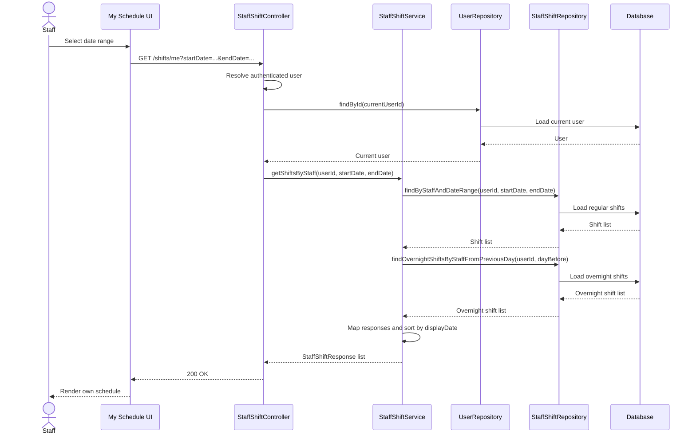
```mermaid
sequenceDiagram
    actor Staff
    participant UI as My Schedule UI
    participant SSC as StaffShiftController
    participant SSS as StaffShiftService
    participant UR as UserRepository
    participant SSR as StaffShiftRepository
    participant DB as Database

    Staff->>UI: Select date range
    UI->>SSC: GET /shifts/me?startDate=...&endDate=...
    SSC->>SSC: Resolve authenticated user
    SSC->>UR: findById(currentUserId)
    UR->>DB: Load current user
    DB-->>UR: User
    UR-->>SSC: Current user
    SSC->>SSS: getShiftsByStaff(userId, startDate, endDate)
    SSS->>SSR: findByStaffAndDateRange(userId, startDate, endDate)
    SSR->>DB: Load regular shifts
    DB-->>SSR: Shift list
    SSR-->>SSS: Shift list
    SSS->>SSR: findOvernightShiftsByStaffFromPreviousDay(userId, dayBefore)
    SSR->>DB: Load overnight shifts
    DB-->>SSR: Overnight shift list
    SSR-->>SSS: Overnight shift list
    SSS->>SSS: Map responses and sort by displayDate
    SSS-->>SSC: StaffShiftResponse list
    SSC-->>UI: 200 OK
    UI-->>Staff: Render own schedule
```

#### 4.3.6 Sequence Diagram: Create Staff Shift (UC-STAFF-05)

This flow validates requested dates and creates or updates shifts with generated slots.

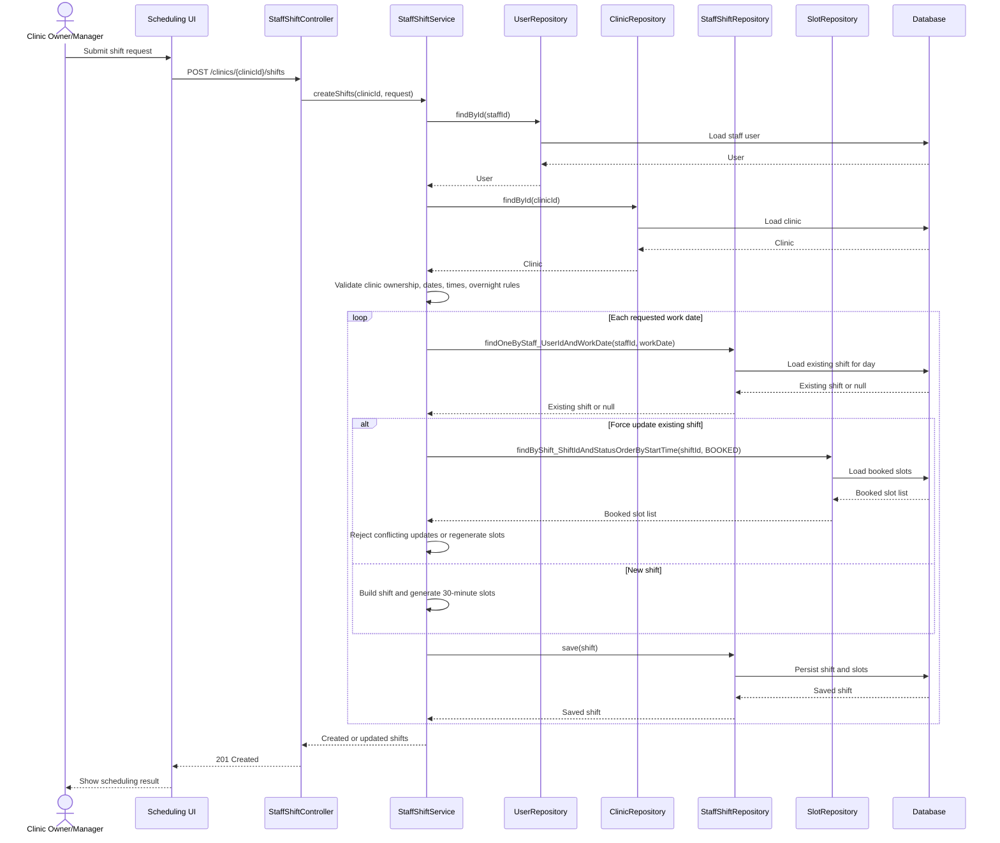
```mermaid
sequenceDiagram
    actor Manager as Clinic Owner/Manager
    participant UI as Scheduling UI
    participant SSC as StaffShiftController
    participant SSS as StaffShiftService
    participant UR as UserRepository
    participant CR as ClinicRepository
    participant SSR as StaffShiftRepository
    participant SR as SlotRepository
    participant DB as Database

    Manager->>UI: Submit shift request
    UI->>SSC: POST /clinics/{clinicId}/shifts
    SSC->>SSS: createShifts(clinicId, request)
    SSS->>UR: findById(staffId)
    UR->>DB: Load staff user
    DB-->>UR: User
    UR-->>SSS: User
    SSS->>CR: findById(clinicId)
    CR->>DB: Load clinic
    DB-->>CR: Clinic
    CR-->>SSS: Clinic
    SSS->>SSS: Validate clinic ownership, dates, times, overnight rules

    loop Each requested work date
        SSS->>SSR: findOneByStaff_UserIdAndWorkDate(staffId, workDate)
        SSR->>DB: Load existing shift for day
        DB-->>SSR: Existing shift or null
        SSR-->>SSS: Existing shift or null
        alt Force update existing shift
            SSS->>SR: findByShift_ShiftIdAndStatusOrderByStartTime(shiftId, BOOKED)
            SR->>DB: Load booked slots
            DB-->>SR: Booked slot list
            SR-->>SSS: Booked slot list
            SSS->>SSS: Reject conflicting updates or regenerate slots
        else New shift
            SSS->>SSS: Build shift and generate 30-minute slots
        end
        SSS->>SSR: save(shift)
        SSR->>DB: Persist shift and slots
        DB-->>SSR: Saved shift
        SSR-->>SSS: Saved shift
    end

    SSS-->>SSC: Created or updated shifts
    SSC-->>UI: 201 Created
    UI-->>Manager: Show scheduling result
```

#### 4.3.7 Sequence Diagram: View Staff Shift (UC-STAFF-06)

This flow supports both clinic-wide schedule viewing and single-shift inspection.

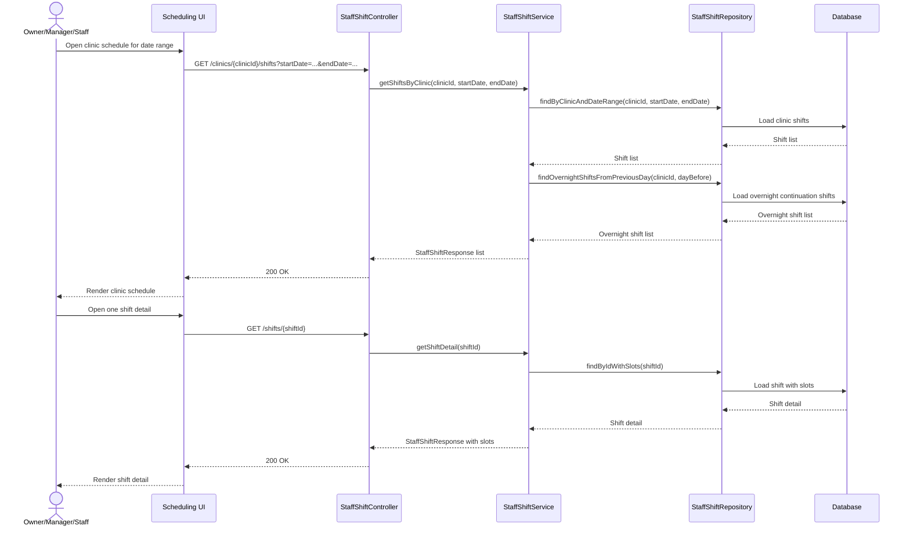
```mermaid
sequenceDiagram
    actor User as Owner/Manager/Staff
    participant UI as Scheduling UI
    participant SSC as StaffShiftController
    participant SSS as StaffShiftService
    participant SSR as StaffShiftRepository
    participant DB as Database

    User->>UI: Open clinic schedule for date range
    UI->>SSC: GET /clinics/{clinicId}/shifts?startDate=...&endDate=...
    SSC->>SSS: getShiftsByClinic(clinicId, startDate, endDate)
    SSS->>SSR: findByClinicAndDateRange(clinicId, startDate, endDate)
    SSR->>DB: Load clinic shifts
    DB-->>SSR: Shift list
    SSR-->>SSS: Shift list
    SSS->>SSR: findOvernightShiftsFromPreviousDay(clinicId, dayBefore)
    SSR->>DB: Load overnight continuation shifts
    DB-->>SSR: Overnight shift list
    SSR-->>SSS: Overnight shift list
    SSS-->>SSC: StaffShiftResponse list
    SSC-->>UI: 200 OK
    UI-->>User: Render clinic schedule

    User->>UI: Open one shift detail
    UI->>SSC: GET /shifts/{shiftId}
    SSC->>SSS: getShiftDetail(shiftId)
    SSS->>SSR: findByIdWithSlots(shiftId)
    SSR->>DB: Load shift with slots
    DB-->>SSR: Shift detail
    SSR-->>SSS: Shift detail
    SSS-->>SSC: StaffShiftResponse with slots
    SSC-->>UI: 200 OK
    UI-->>User: Render shift detail
```

#### 4.3.8 Sequence Diagram: Delete Staff Shift (UC-STAFF-07)

This flow deletes a shift only when no booked slot exists.

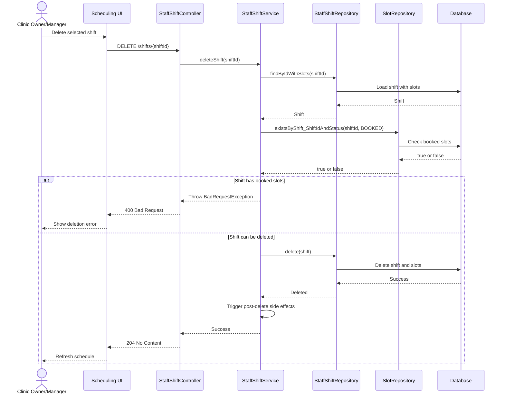
```mermaid
sequenceDiagram
    actor Manager as Clinic Owner/Manager
    participant UI as Scheduling UI
    participant SSC as StaffShiftController
    participant SSS as StaffShiftService
    participant SSR as StaffShiftRepository
    participant SR as SlotRepository
    participant DB as Database

    Manager->>UI: Delete selected shift
    UI->>SSC: DELETE /shifts/{shiftId}
    SSC->>SSS: deleteShift(shiftId)
    SSS->>SSR: findByIdWithSlots(shiftId)
    SSR->>DB: Load shift with slots
    DB-->>SSR: Shift
    SSR-->>SSS: Shift
    SSS->>SR: existsByShift_ShiftIdAndStatus(shiftId, BOOKED)
    SR->>DB: Check booked slots
    DB-->>SR: true or false
    SR-->>SSS: true or false

    alt Shift has booked slots
        SSS-->>SSC: Throw BadRequestException
        SSC-->>UI: 400 Bad Request
        UI-->>Manager: Show deletion error
    else Shift can be deleted
        SSS->>SSR: delete(shift)
        SSR->>DB: Delete shift and slots
        DB-->>SSR: Success
        SSR-->>SSS: Deleted
        SSS->>SSS: Trigger post-delete side effects
        SSS-->>SSC: Success
        SSC-->>UI: 204 No Content
        UI-->>Manager: Refresh schedule
    end
```

#### 4.3.9 Cross-Reference to SRS

| SDD Section | SRS Reference | Description |
|-------------|---------------|-------------|
| 4.3.1 Class Diagram | 3.7.1 - 3.7.7 | Overall staff and scheduling structure |
| 4.3.3 Invite Staff by Email | 3.7.1 | Staff invitation and clinic assignment |
| 4.3.4 Delete Staff | 3.7.2 | Remove clinic association from staff |
| 4.3.5 View Own Work Schedule | 3.7.4 | Staff self-schedule lookup |
| 4.3.6 Create Staff Shift | 3.7.5 | Multi-date shift creation with slots |
| 4.3.7 View Staff Shift | 3.7.6 | Clinic shift list and shift detail |
| 4.3.8 Delete Staff Shift | 3.7.7 | Shift deletion with booking guard |

---


## 1. System Design

### 1.1 System Architecture

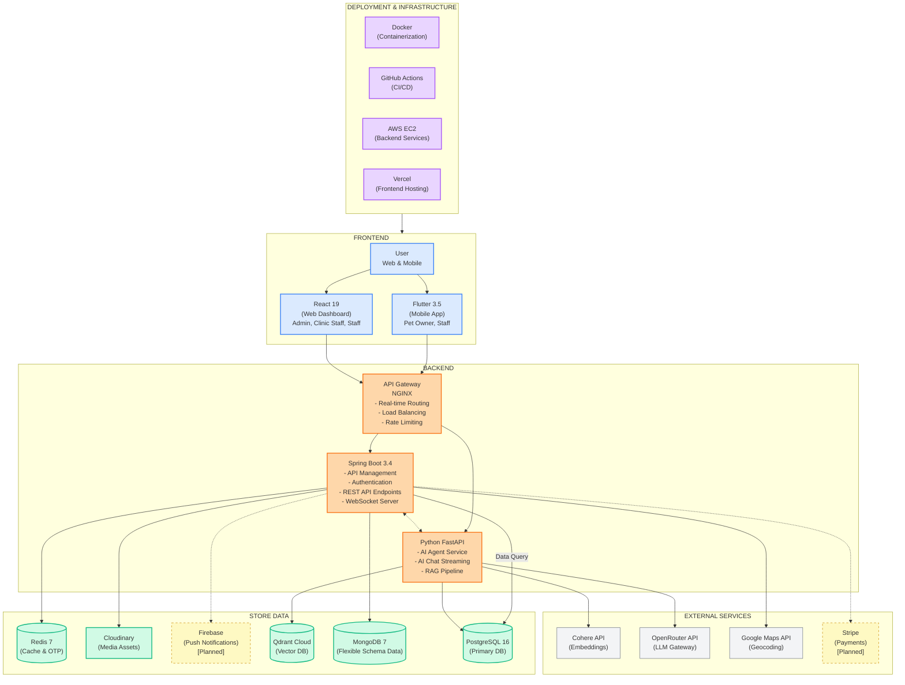
```mermaid
flowchart TD
    subgraph INFRA["DEPLOYMENT & INFRASTRUCTURE"]
        direction LR
        Docker["Docker<br/>(Containerization)"]
        GitHub["GitHub Actions<br/>(CI/CD)"]
        AWS["AWS EC2<br/>(Backend Services)"]
        Vercel["Vercel<br/>(Frontend Hosting)"]
    end

    subgraph FRONTEND["FRONTEND"]
        direction TB
        User["User<br/>Web & Mobile"]
        User --> Flutter
        User --> React
        Flutter["Flutter 3.5<br/>(Mobile App)<br/>Pet Owner, Staff"]
        React["React 19<br/>(Web Dashboard)<br/>Admin, Clinic Staff, Staff"]
    end

    subgraph BACKEND["BACKEND"]
        direction TB
        APIGateway["API Gateway<br/>NGINX<br/>- Real-time Routing<br/>- Load Balancing<br/>- Rate Limiting"]
        APIGateway --> SpringBoot
        APIGateway --> Python
        SpringBoot["Spring Boot 3.4<br/>- API Management<br/>- Authentication<br/>- REST API Endpoints<br/>- WebSocket Server"]
        Python["Python FastAPI<br/>- AI Agent Service<br/>- AI Chat Streaming<br/>- RAG Pipeline"]
        SpringBoot <-.-> Python
    end

    subgraph STORAGE["STORE DATA"]
        direction LR
        Redis[("Redis 7<br/>(Cache & OTP)")]
        Cloudinary["Cloudinary<br/>(Media Assets)"]
        Firebase["Firebase<br/>(Push Notifications)<br/>[Planned]"]
        QdrantCloud[("Qdrant Cloud<br/>(Vector DB)")]
        MongoDB[("MongoDB 7<br/>(Flexible Schema Data)")]
        PostgreSQL[("PostgreSQL 16<br/>(Primary DB)")]
    end

    subgraph EXTERNAL["EXTERNAL SERVICES"]
        direction LR
        Cohere["Cohere API<br/>(Embeddings)"]
        OpenRouter["OpenRouter API<br/>(LLM Gateway)"]
        GoogleMaps["Google Maps API<br/>(Geocoding)"]
        Stripe["Stripe<br/>(Payments)<br/>[Planned]"]
    end

    %% Main Flow Connections
    INFRA --> FRONTEND
    Flutter --> APIGateway
    React --> APIGateway

    %% Backend to Storage - Data Query
    SpringBoot -->|"Data Query"| PostgreSQL
    SpringBoot --> Redis
    SpringBoot --> MongoDB
    SpringBoot --> Cloudinary
    SpringBoot -.-> Firebase
    Python --> PostgreSQL
    Python --> QdrantCloud

    %% Backend to External Services
    Python --> Cohere
    Python --> OpenRouter
    SpringBoot --> GoogleMaps
    SpringBoot -.-> Stripe

    %% Styling
    classDef frontend fill:#dbeafe,stroke:#3b82f6,stroke-width:2px
    classDef backend fill:#fed7aa,stroke:#f97316,stroke-width:2px
    classDef storage fill:#d1fae5,stroke:#10b981,stroke-width:2px
    classDef infra fill:#e9d5ff,stroke:#a855f7,stroke-width:2px
    classDef external fill:#f3f4f6,stroke:#6b7280,stroke-width:1px
    classDef planned fill:#fef9c3,stroke:#ca8a04,stroke-width:1px,stroke-dasharray:5,5

    class User,Flutter,React frontend
    class APIGateway,SpringBoot,Python backend
    class Redis,Cloudinary,QdrantCloud,PostgreSQL,MongoDB storage
    class Docker,GitHub,AWS,Vercel infra
    class Cohere,OpenRouter,GoogleMaps external
    class Firebase,Stripe planned
```

**Layered view (FE → BE → AI → DB)** – Sơ đồ dưới thể hiện cùng kiến trúc theo luồng từ trái sang phải: Frontend → Core Backend → AI Agent Service (cùng cấp với Backend) → Data & External. AI được tách thành một layer độc lập để làm rõ trách nhiệm và luồng request.

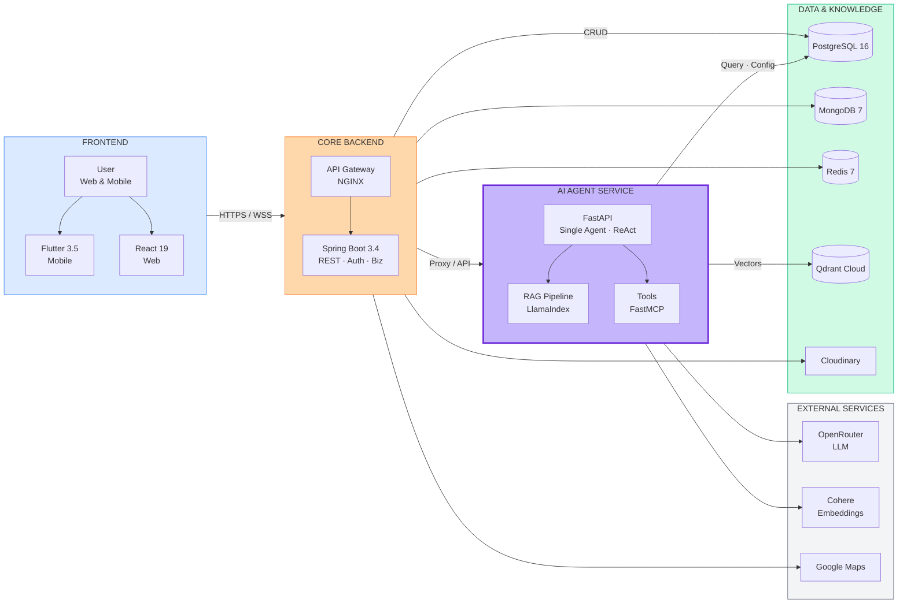
```mermaid
flowchart LR
    subgraph FE["FRONTEND"]
        direction TB
        U["User<br/>Web & Mobile"]
        F["Flutter 3.5<br/>Mobile"]
        R["React 19<br/>Web"]
        U --> F
        U --> R
    end

    subgraph BE["CORE BACKEND"]
        direction TB
        NGINX["API Gateway<br/>NGINX"]
        SB["Spring Boot 3.4<br/>REST · Auth · Biz"]
        NGINX --> SB
    end

    subgraph AI["AI AGENT SERVICE"]
        direction TB
        FA["FastAPI<br/>Single Agent · ReAct"]
        RAG["RAG Pipeline<br/>LlamaIndex"]
        MCP["Tools<br/>FastMCP"]
        FA --> RAG
        FA --> MCP
    end

    subgraph DB["DATA & KNOWLEDGE"]
        direction TB
        PG[("PostgreSQL 16")]
        MDB[("MongoDB 7")]
        RD[("Redis 7")]
        QD[("Qdrant Cloud")]
        CL["Cloudinary"]
        PG
        MDB
        RD
        QD
        CL
    end

    subgraph EXT["EXTERNAL SERVICES"]
        direction TB
        OR["OpenRouter<br/>LLM"]
        CO["Cohere<br/>Embeddings"]
        GM["Google Maps"]
        OR
        CO
        GM
    end

    FE -->|"HTTPS / WSS"| BE
    BE -->|"Proxy / API"| AI
    AI -->|"Query · Config"| PG
    AI -->|"Vectors"| QD
    BE -->|"CRUD"| PG
    BE --> RD
    BE --> MDB
    BE --> CL
    BE --> GM
    AI --> OR
    AI --> CO

    style AI fill:#c4b5fd,stroke:#6d28d9,stroke-width:3px
    style FE fill:#dbeafe,stroke:#3b82f6
    style BE fill:#fed7aa,stroke:#f97316
    style DB fill:#d1fae5,stroke:#10b981
    style EXT fill:#f3f4f6,stroke:#6b7280
```

**The Petties Platform** is designed with a modern, scalable, and modular architecture, clearly separating frontend and backend responsibilities. This ensures high performance, flexibility for scaling, and easy integration with third-party services.

**1. User Role:**
- **Guest** - Can view clinic listings, search clinics, and view basic information
- **Pet Owner** - Can register pets, book appointments, chat with AI assistant, view EMR history, and manage profile (Mobile only)
- **Staff** - Can view appointments, manage schedule, create EMR records, and access patient history (Web + Mobile)
- **Clinic Manager** - Manages clinic operations, staff scheduling, booking management, and patient records (Web only)
- **Clinic Owner** - Manages clinic profile, services, pricing, staff, and views analytics (Web only)
- **Admin** - Manages the system, user accounts, clinic approvals, AI agent configuration, and oversees system operations (Web only)

**2. Frontend Layer:**
- Built with **React 19** (Web Dashboard) and **Flutter 3.5** (Mobile App) for responsive and real-time user experiences
- Uses **WebSocket clients** to receive live AI chat streaming
- Integrates **Neobrutalism design system** for consistent UI/UX
- Static assets are distributed through **Cloudinary CDN** to improve performance

**3. Backend Layer:**
- **Spring Boot 3.4 Server:** Handles API management, authentication (JWT), REST API endpoints, and business logic for clinics, bookings, users, pets, and EMR
- **Python FastAPI Service:** Processes AI chat requests, runs Single Agent with ReAct pattern, performs RAG queries, and supports real-time WebSocket streaming
- **API Gateway (NGINX):** Manages real-time routing, SSL termination, load balancing, and rate limiting

**4. Store Data:**
- **PostgreSQL 16** - Primary relational database storing users, clinics, bookings, pets, EMR, and AI agent configurations (shared by both services)
- **MongoDB 7** - Used for auditing, logs, and flexible schema data (e.g., patient records or specialized logs)
- **Redis 7** - Caches OTP codes, session data, and rate limiting counters with TTL-based expiration
- **Qdrant Cloud** - Stores vector embeddings for RAG knowledge base (1024 dimensions, Binary Quantization)
- **Cloudinary** - Manages media assets (images, avatars, clinic photos) efficiently with CDN delivery
- **Firebase** - Used for push notifications to mobile devices [Planned]

**5. Deployment & Infrastructure:**
- **Vercel** - Used for frontend (React) deployment with automatic preview deployments
- **AWS EC2** - Provides backend infrastructure and scalable cloud hosting for Spring Boot and FastAPI services
- **Docker** - Containerizes backend services (Spring Boot, FastAPI, NGINX), enabling flexible deployment and CI/CD pipelines
- **GitHub Actions** - Automated CI/CD for building, testing, and deploying all services

---

### 1.2 Package Diagram

#### 1.2.1 Back-End Package Diagram

##### Spring Boot Service (backend-spring)

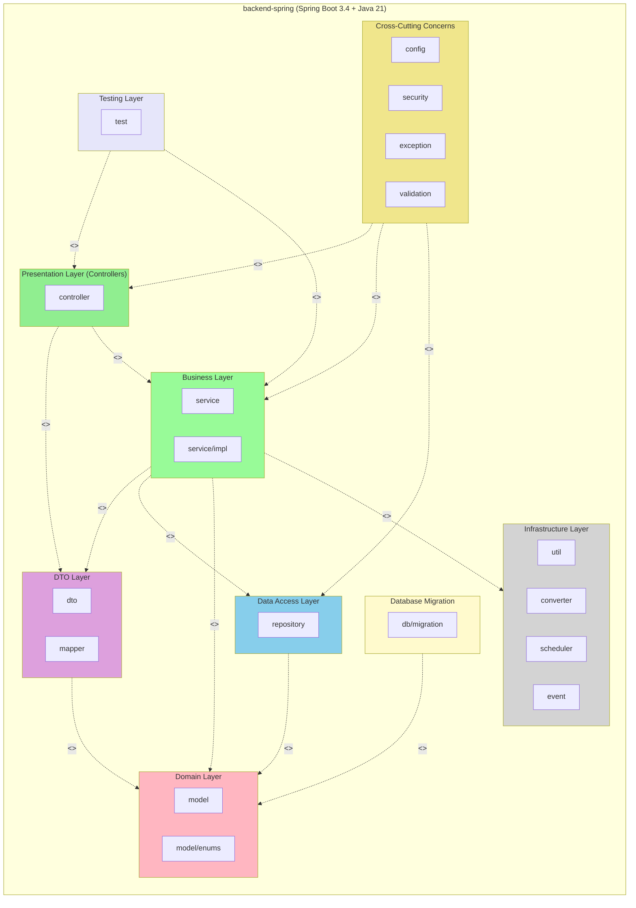
```mermaid
flowchart TB
    subgraph BACKEND["backend-spring (Spring Boot 3.4 + Java 21)"]
        direction TB

        subgraph PRESENTATION["Presentation Layer (Controllers)"]
            style PRESENTATION fill:#90EE90
            direction LR
            controller["controller"]
        end

        subgraph BUSINESS["Business Layer"]
            style BUSINESS fill:#98FB98
            direction LR
            service["service"]
            serviceImpl["service/impl"]
        end

        subgraph DATA_ACCESS["Data Access Layer"]
            style DATA_ACCESS fill:#87CEEB
            direction LR
            repository["repository"]
        end

        subgraph DOMAIN["Domain Layer"]
            style DOMAIN fill:#FFB6C1
            direction LR
            model["model"]
            enums["model/enums"]
        end

        subgraph DTO_LAYER["DTO Layer"]
            style DTO_LAYER fill:#DDA0DD
            direction LR
            dto["dto"]
            mapper["mapper"]
        end

        subgraph CROSS_CUTTING["Cross-Cutting Concerns"]
            style CROSS_CUTTING fill:#F0E68C
            direction LR
            config["config"]
            security["security"]
            exception["exception"]
            validation["validation"]
        end

        subgraph INFRASTRUCTURE["Infrastructure Layer"]
            style INFRASTRUCTURE fill:#D3D3D3
            direction LR
            util["util"]
            converter["converter"]
            scheduler["scheduler"]
            event["event"]
        end

        subgraph MIGRATION["Database Migration"]
            style MIGRATION fill:#FFFACD
            direction LR
            dbMigration["db/migration"]
        end

        subgraph TESTING["Testing Layer"]
            style TESTING fill:#E6E6FA
            direction LR
            test["test"]
        end
    end

    %% Layer dependencies with <<import>> and <<use>> stereotypes
    %% Flow: Controller → DTO → Service → Repository → Entity
    PRESENTATION -.->|"<<use>>"| DTO_LAYER
    PRESENTATION -.->|"<<import>>"| BUSINESS
    BUSINESS -.->|"<<use>>"| DTO_LAYER
    BUSINESS -.->|"<<import>>"| DATA_ACCESS
    BUSINESS -.->|"<<use>>"| DOMAIN
    DATA_ACCESS -.->|"<<import>>"| DOMAIN
    DTO_LAYER -.->|"<<use>>"| DOMAIN

    %% Cross-Cutting Concerns (applies to all layers)
    CROSS_CUTTING -.->|"<<configure>>"| PRESENTATION
    CROSS_CUTTING -.->|"<<configure>>"| BUSINESS
    CROSS_CUTTING -.->|"<<configure>>"| DATA_ACCESS

    %% Infrastructure dependencies
    BUSINESS -.->|"<<use>>"| INFRASTRUCTURE

    %% Migration applies to Domain
    MIGRATION -.->|"<<migrate>>"| DOMAIN

    %% Testing dependencies
    TESTING -.->|"<<import>>"| PRESENTATION
    TESTING -.->|"<<import>>"| BUSINESS
```

##### Python AI Agent Service (petties-agent-serivce)

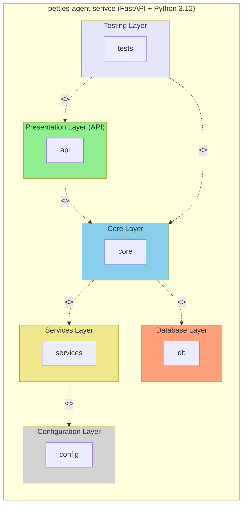
```mermaid
flowchart TB
    subgraph AI_SERVICE["petties-agent-serivce (FastAPI + Python 3.12)"]
        direction TB

        subgraph PRESENTATION["Presentation Layer (API)"]
            style PRESENTATION fill:#90EE90
            direction LR
            api["api"]
        end

        subgraph CORE["Core Layer"]
            style CORE fill:#87CEEB
            direction LR
            core["core"]
        end

        subgraph SERVICES["Services Layer"]
            style SERVICES fill:#F0E68C
            direction LR
            services["services"]
        end

        subgraph DATABASE["Database Layer"]
            style DATABASE fill:#FFA07A
            direction LR
            db["db"]
        end

        subgraph CONFIG["Configuration Layer"]
            style CONFIG fill:#D3D3D3
            direction LR
            config["config"]
        end

        subgraph TESTING["Testing Layer"]
            style TESTING fill:#E6E6FA
            direction LR
            tests["tests"]
        end
    end

    %% Layer dependencies
    PRESENTATION -.->|"<<import>>"| CORE
    CORE -.->|"<<import>>"| SERVICES
    CORE -.->|"<<use>>"| DATABASE
    SERVICES -.->|"<<use>>"| CONFIG
    TESTING -.->|"<<import>>"| PRESENTATION
    TESTING -.->|"<<import>>"| CORE
```

##### Package Descriptions - Spring Boot Service:

| No | Package | Layer Responsibility |
|----|---------|---------------------|
| **Presentation Layer** |
| 01 | controller | **REST API Layer** - Handles HTTP requests and maps them to service methods. Responsible for request validation, authentication checks, and response formatting. Implements `@RestController` pattern with route mapping to `/api/*` endpoints. |
| **Business Layer** |
| 02 | service | **Business Logic Layer** - Contains core business rules, transaction management (`@Transactional`), and orchestration of operations. Implements concrete Service classes for simplicity and direct implementation. Coordinates between repositories and external integrations. |

| **Data Access Layer** |
| 04 | repository | **Data Access Layer** - Provides CRUD operations and custom query methods using Spring Data JPA. Abstracts database interactions with PostgreSQL. Implements Repository pattern with method naming conventions for query generation. |
| **Domain Layer** |
| 05 | model | **Domain Entity Layer** - JPA entities mapped to PostgreSQL tables. Defines data structure, relationships (`@OneToMany`, `@ManyToOne`, `@ManyToMany`), and lifecycle hooks. Uses Hibernate for ORM with auditing fields (createdAt, updatedAt). |
| 06 | model/enums | **Enumeration Types** - Type-safe constants for domain concepts (Role, Status, Type). Ensures data integrity and provides readable code instead of magic strings/numbers. |
| **DTO Layer** |
| 07 | dto | **Data Transfer Objects** - Defines API contracts between client and server. Handles request validation (Jakarta Bean Validation annotations), response shaping, and prevents entity exposure. Organized by feature domain. |
| 08 | mapper | **Object Mapping Layer** - MapStruct-based mappers for Entity ↔ DTO conversion. Eliminates boilerplate mapping code and ensures type-safe transformations between layers. |
| **Cross-Cutting Concerns** |
| 09 | config | **Configuration Layer** - Spring beans for cross-cutting concerns: Security (JWT filter, authentication), external services (Redis, Cloudinary, Google Maps), JPA/Hibernate settings, WebSocket, Swagger/OpenAPI, and CORS configuration. |
| 10 | security | **Security Layer** - JWT token provider, authentication filter, custom `UserDetailsService`, and role-based access control. Implements Spring Security 6.x with stateless session management. |
| 11 | exception | **Error Handling Layer** - Centralized exception handling with `@ControllerAdvice`. Defines custom exceptions (BadRequest, NotFound, Unauthorized, Forbidden) and standardized error responses with Vietnamese messages. |
| 12 | validation | **Custom Validation Layer** - Custom Bean Validation annotations and validators for business rules not covered by standard annotations (e.g., phone format, date range validation). |
| **Infrastructure Layer** |
| 13 | util | **Utility Layer** - Stateless helper classes for common operations (token manipulation, date formatting, string processing, slug generation). Shared across multiple services without business logic. |
| 14 | converter | **Data Conversion Layer** - JPA `AttributeConverter` implementations for complex type mappings (JSON ↔ Object, Enum ↔ String). Enables storing structured data in database columns. |
| 15 | scheduler | **Scheduled Tasks Layer** - Spring `@Scheduled` jobs for background processing (appointment reminders, expired token cleanup, report generation). Implements cron-based and fixed-rate scheduling. |
| 16 | event | **Event Handling Layer** - Spring Application Events for decoupled communication between components. Implements async event publishing and listeners for notifications, audit logging, and side effects. |
| **Database Migration** |
| 17 | db/migration | **Schema Migration Layer** - Flyway SQL migration scripts with versioned naming (`V{timestamp}__{description}.sql`). Manages database schema evolution across environments. |
| **Testing Layer** |
| 18 | test | **Testing Layer** - JUnit 5 + Mockito test suites organized by component type (controller, service, repository). Includes unit tests with mocked dependencies and integration tests with `@SpringBootTest`. Follows Arrange-Act-Assert pattern with test fixtures for data setup. |

##### Package Descriptions - Python AI Agent Service:

| No | Package | Layer Responsibility |
|----|---------|---------------------|
| **API Layer** |
| 01 | api/routes | **REST Endpoint Layer** - FastAPI route handlers exposing AI service capabilities. Manages HTTP endpoints for chat sessions, agent configuration, tool registry, knowledge base, and settings. Uses Pydantic for request/response validation. |
| 02 | api/websocket | **Real-time Communication Layer** - WebSocket endpoints for bidirectional streaming. Enables real-time AI chat with token-by-token streaming and ReAct trace visualization. Handles connection lifecycle and message protocols. |
| 03 | api/middleware | **Request Interception Layer** - Cross-cutting middleware for authentication (JWT validation), logging, and request preprocessing. Integrates with Spring Boot's auth system for user context extraction. |
| 04 | api/schemas | **API Contract Layer** - Pydantic models defining request/response structures. Provides runtime validation, serialization, and OpenAPI documentation generation for all API endpoints. |
| 05 | api/dependencies | **Dependency Injection Layer** - FastAPI dependencies for common operations (database sessions, current user, pagination). Enables reusable request-scoped resources across routes. |
| **Core - Agent Layer** |
| 06 | core/agents | **AI Agent Orchestration** - Implements Single Agent with ReAct pattern (Thought → Action → Observation loop) using LangGraph StateGraph. Manages agent state, decision-making, and response generation. |
| 07 | core/agents/state | **Agent State Management** - TypedDict definitions for ReAct state (messages, steps, current thought, tool calls). Enables stateful conversation and reasoning trace tracking. |
| 08 | core/agents/factory | **Agent Construction Layer** - Factory pattern for dynamic agent instantiation. Loads configuration (prompts, parameters, enabled tools) from PostgreSQL database at runtime. |
| **Core - Tool Layer** |
| 09 | core/tools | **Tool Infrastructure Layer** - FastMCP server setup for tool registration and execution. Provides decorator-based tool definition (`@mcp.tool`) with semantic descriptions for LLM function calling. |
| 10 | core/tools/mcp_tools | **Tool Implementation Layer** - Code-based tools with semantic descriptions. Each tool is a function decorated with `@mcp.tool()` providing capabilities like Q&A, symptom search, clinic lookup, booking creation. |
| 11 | core/tools/scanner | **Tool Discovery Layer** - Auto-scans Python modules for `@mcp.tool` decorated functions. Syncs discovered tools to database for admin management (enable/disable, assign to agents). |
| 12 | core/tools/executor | **Tool Execution Layer** - Validates tool parameters against schema and executes through MCP server. Handles tool errors gracefully and returns structured results to agent. |
| **Core - RAG Layer** |
| 13 | core/rag | **Knowledge Retrieval Layer** - LlamaIndex-based RAG engine with Cohere embeddings (1024 dims) and Qdrant Cloud vector storage. Handles document chunking, embedding, indexing, and semantic search for context augmentation. |
| **Core - Utilities** |
| 14 | core/config_helper | **Dynamic Configuration Layer** - Loads API keys, model settings, and prompts from PostgreSQL. Enables runtime configuration changes without service restart. |
| 15 | core/init_db | **Database Initialization** - Seed data scripts and initial setup for agents, tools, and system settings. Runs on application startup. |
| 16 | core/sentry | **Error Monitoring Layer** - Sentry SDK integration for error tracking, performance monitoring, and distributed tracing across async operations. |
| **Services Layer** |
| 17 | services | **External Integration Layer** - Clients for external APIs (OpenRouter LLM, Cohere embeddings). Handles streaming responses, retry logic, and error handling for cloud AI providers. |
| **Database Layer** |
| 18 | db/postgres/models | **ORM Model Layer** - SQLAlchemy ORM models defining entities (Agent, Tool, KnowledgeDocument, SystemSetting). AI chat session/message không thuộc PostgreSQL scope; toàn bộ AI chat history lưu trên MongoDB. |
| 19 | db/postgres/session | **Session Management Layer** - AsyncSession factory for database connections. Manages connection pooling and transaction scopes for async operations. |
| 20 | db/migrations | **Schema Migration Layer** - Alembic migration scripts for database schema versioning. Enables safe schema evolution across environments with up/down migrations. |
| **Configuration Layer** |
| 21 | config | **Environment Configuration** - Pydantic Settings for environment variables. Centralized configuration for database URLs, API keys, and logging setup with validation. |
| 22 | config/logging | **Logging Configuration** - Structured logging setup with JSON formatting for production. Configures log levels, handlers, and formatters per environment. |
| **Testing Layer** |
| 23 | tests | **Testing Layer** - pytest test suites for API endpoints, agent logic, tool execution, and RAG pipeline. Includes unit tests with mocks and integration tests with test database. Uses pytest-asyncio for async testing. |

---

#### 1.2.2 Front-End Package Diagram

##### React Web Dashboard (petties-web)

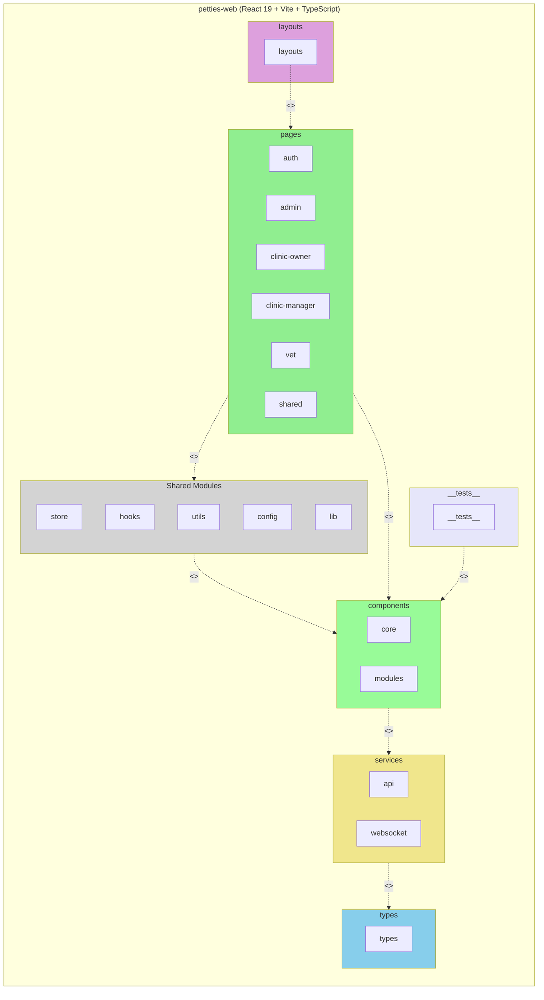
```mermaid
flowchart TB
    subgraph WEB["petties-web (React 19 + Vite + TypeScript)"]
        direction TB

        subgraph SIDE_PANELS["Shared Modules"]
            style SIDE_PANELS fill:#D3D3D3
            direction TB
            store["store"]
            hooks["hooks"]
            utils["utils"]
            config["config"]
            lib["lib"]
        end

        subgraph PAGES["pages"]
            style PAGES fill:#90EE90
            direction LR
            pagesAuth["auth"]
            pagesAdmin["admin"]
            pagesClinicOwner["clinic-owner"]
            pagesClinicManager["clinic-manager"]
            pagesVet["vet"]
            pagesShared["shared"]
        end

        subgraph COMPONENTS["components"]
            style COMPONENTS fill:#98FB98
            direction LR
            compCore["core"]
            compModules["modules"]
        end

        subgraph LAYOUTS["layouts"]
            style LAYOUTS fill:#DDA0DD
            direction LR
            layouts["layouts"]
        end

        subgraph SERVICES["services"]
            style SERVICES fill:#F0E68C
            direction LR
            servicesApi["api"]
            servicesWebsocket["websocket"]
        end

        subgraph TYPES["types"]
            style TYPES fill:#87CEEB
            direction LR
            types["types"]
        end

        subgraph TESTING["__tests__"]
            style TESTING fill:#E6E6FA
            direction LR
            tests["__tests__"]
        end
    end

    %% Layer dependencies with <<import>> and <<use>> stereotypes
    %% Flow: Layouts → Pages → Components → Services → Types
    SIDE_PANELS -.->|"<<use>>"| COMPONENTS
    layouts -.->|"<<import>>"| PAGES
    PAGES -.->|"<<use>>"| COMPONENTS
    PAGES -.->|"<<use>>"| SIDE_PANELS
    COMPONENTS -.->|"<<import>>"| SERVICES
    SERVICES -.->|"<<use>>"| TYPES
    TESTING -.->|"<<import>>"| COMPONENTS
```

##### Flutter Mobile App (petties_mobile)

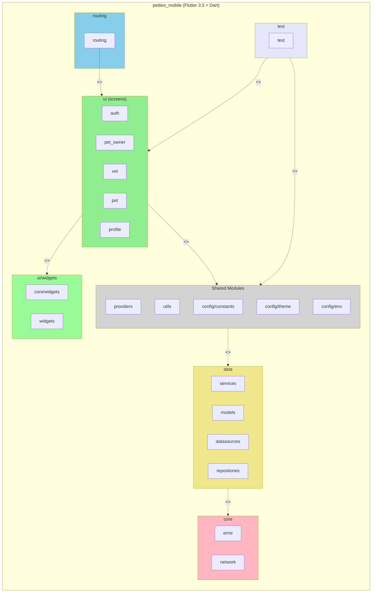
```mermaid
flowchart TB
    subgraph MOBILE["petties_mobile (Flutter 3.5 + Dart)"]
        direction TB

        subgraph SIDE_PANELS["Shared Modules"]
            style SIDE_PANELS fill:#D3D3D3
            direction TB
            providers["providers"]
            utils["utils"]
            cfgConstants["config/constants"]
            cfgTheme["config/theme"]
            cfgEnv["config/env"]
        end

        subgraph UI_SCREENS["ui (screens)"]
            style UI_SCREENS fill:#90EE90
            direction LR
            uiAuth["auth"]
            uiPetOwner["pet_owner"]
            uiVet["vet"]
            uiPet["pet"]
            uiProfile["profile"]
        end

        subgraph UI_WIDGETS["ui/widgets"]
            style UI_WIDGETS fill:#98FB98
            direction LR
            coreWidgets["core/widgets"]
            widgets["widgets"]
        end

        subgraph DATA["data"]
            style DATA fill:#F0E68C
            direction LR
            dataServices["services"]
            dataModels["models"]
            dataDatasources["datasources"]
            dataRepositories["repositories"]
        end

        subgraph ROUTING["routing"]
            style ROUTING fill:#87CEEB
            direction LR
            routing["routing"]
        end

        subgraph CORE["core"]
            style CORE fill:#FFB6C1
            direction LR
            coreError["error"]
            coreNetwork["network"]
        end

        subgraph TESTING["test"]
            style TESTING fill:#E6E6FA
            direction LR
            test["test"]
        end
    end

    %% Layer dependencies with <<import>> and <<use>> stereotypes
    %% Flow: Routing → Screens → Widgets → Providers → Data → Core
    routing -.->|"<<import>>"| UI_SCREENS
    UI_SCREENS -.->|"<<use>>"| UI_WIDGETS
    UI_SCREENS -.->|"<<use>>"| SIDE_PANELS
    SIDE_PANELS -.->|"<<import>>"| DATA
    DATA -.->|"<<use>>"| CORE
    TESTING -.->|"<<import>>"| UI_SCREENS
    TESTING -.->|"<<import>>"| SIDE_PANELS
```

##### Package Descriptions - React Web Dashboard:

| No | Package | Layer Responsibility |
|----|---------|---------------------|
| **Pages Layer** |
| 01 | pages | **Route Page Layer** - Top-level page components mapping to routes. Each page represents a complete view for a specific role (Admin, Clinic Owner, Clinic Manager, Staff). Organized by role and feature domain. |
| 02 | pages/auth | **Authentication Pages** - Login, registration, and password recovery flows with OTP verification. Handles unauthenticated user journeys. |
| 03 | pages/admin | **Admin Dashboard Pages** - System administration views including clinic approvals, AI agent configuration, tool management, knowledge base, and system settings. |
| 04 | pages/clinic-owner | **Clinic Owner Pages** - Clinic management views for owners including profile editing, service configuration, pricing, and staff management. |
| 05 | pages/clinic-manager | **Clinic Manager Pages** - Operational views for daily clinic management including bookings, schedules, and patient records. |
| 06 | pages/vet | **Veterinarian Pages** - Staff-specific views for appointments, patient records, and schedule management. |
| 07 | pages/shared | **Shared Pages** - Cross-role pages like profile management accessible by all authenticated users. |
| **Components Layer** |
| 08 | components | **Reusable UI Components** - Modular, composable UI building blocks organized by domain (auth, clinic, profile, dashboard). Follows atomic design principles with consistent Neobrutalism styling. |
| 09 | components/common | **Shared Components** - Generic UI components used across multiple features (modals, inputs, dialogs, loading states). Framework-agnostic and highly reusable. |
| **Layouts Layer** |
| 10 | layouts | **Page Layout Layer** - Role-based layout wrappers providing consistent navigation, sidebar, and header structure. Implements layout composition pattern for DRY page structure. |
| **Services Layer** |
| 11 | services/api | **API Client Layer** - Axios-based HTTP client with interceptors for JWT handling, error transformation, and request/response logging. Provides typed service methods for each API domain. |
| 12 | services/websocket | **WebSocket Client Layer** - Real-time communication for AI chat streaming. Manages connection lifecycle, reconnection, and message handling. |
| **State Management** |
| 13 | store | **Global State Layer** - Zustand stores for application-wide state (auth, user profile, clinic data). Provides selectors, actions, and persistence for client-side state management. |
| **Hooks Layer** |
| 14 | hooks | **Custom React Hooks** - Reusable stateful logic encapsulation (useAuth, useToast, useDebounce). Abstracts common patterns and side effects for clean component code. |
| **Types Layer** |
| 15 | types | **TypeScript Definitions** - Shared type definitions for API responses, domain models, and component props. Ensures type safety across the application. |
| **Utils Layer** |
| 16 | utils | **Utility Functions** - Pure helper functions for common operations (date formatting, validation, token handling, error processing). Stateless and side-effect free. |
| **Config Layer** |
| 17 | config | **Environment Configuration** - Environment-specific settings (API URLs, feature flags). Centralizes configuration management with type-safe access. |
| **Lib Layer** |
| 18 | lib | **Third-party Integrations** - Wrappers and configurations for external libraries (Sentry error tracking). Isolates vendor-specific code from application logic. |
| **Testing Layer** |
| 19 | __tests__ | **Testing Layer** - Vitest/Jest test suites for components and hooks. Includes unit tests with React Testing Library and integration tests for user flows. Uses MSW for API mocking. |

##### Package Descriptions - Flutter Mobile App:

| No | Package | Layer Responsibility |
|----|---------|---------------------|
| **UI Layer - Screens** |
| 01 | ui/screens | **Screen Layer** - Full-page widget compositions representing complete views. Each screen corresponds to a route and composes widgets for specific user flows. Organized by user role (pet_owner, vet) and feature domain (auth, pet, profile). |
| 02 | ui/auth | **Authentication Screens** - Login, registration, password recovery flows with OTP verification. Handles unauthenticated user journeys with form validation. |
| 03 | ui/pet_owner | **Pet Owner Screens** - Home and feature screens exclusive to pet owners including booking, AI chat, and pet management. |
| 04 | ui/vet | **Veterinarian Screens** - Staff-specific screens for appointments, patient records, and schedule management. |
| **UI Layer - Widgets** |
| 05 | ui/core/widgets | **Core Widgets** - Foundational reusable widgets (buttons, text fields, loaders). Implements Neobrutalism design system with consistent styling across the app. |
| 06 | ui/widgets | **Feature Widgets** - Domain-specific widgets organized by feature (profile, pet, booking). Composable building blocks for screens. |
| **Data Layer** |
| 07 | data/services | **API Service Layer** - Dio-based HTTP services for backend communication. Handles request construction, response parsing, and error transformation. Implements service classes per domain (auth, user, pet). |
| 08 | data/models | **Data Model Layer** - Dart classes representing API responses and domain entities. Provides fromJson/toJson methods for serialization. Immutable data structures with factory constructors. |
| 09 | data/datasources | **Data Source Layer** - Abstracts data retrieval from local (SharedPreferences, Hive) and remote (API) sources. Implements Repository pattern's data source abstraction. |
| 10 | data/repositories | **Repository Layer** - Orchestrates between local and remote data sources. Implements caching strategies, offline-first logic, and data synchronization. Single source of truth for data access. |
| **State Management** |
| 11 | providers | **State Provider Layer** - Provider/Riverpod state management. Exposes reactive state to widgets with notifyListeners for UI updates. Handles async state loading and error states. |
| **Routing Layer** |
| 12 | routing | **Navigation Layer** - GoRouter configuration with role-based route guards. Defines route paths, redirects, and deep linking. Implements declarative navigation pattern. |
| **Config Layer** |
| 13 | config/constants | **App Constants** - Static configuration values (colors, strings, dimensions). Centralizes magic values for consistent UI and easy theming. |
| 14 | config/theme | **Theme Configuration** - MaterialApp theme definition with Neobrutalism styling. Defines colors, typography, component themes, and dark mode support. |
| 15 | config/env | **Environment Configuration** - Environment-specific settings (dev, test, prod). Manages API URLs and feature flags per build configuration. |
| **Core Layer** |
| 16 | core/error | **Error Handling Layer** - Custom exception classes and failure types. Standardizes error representation for consistent handling across the app. |
| 17 | core/network | **Network Layer** - Dio client setup with interceptors for JWT injection, token refresh, and error mapping. Centralizes HTTP configuration. |
| **Utils Layer** |
| 18 | utils | **Utility Layer** - Stateless helper functions for common operations (validators, date formatters, storage helpers, permission handling, API error processing). Shared across all layers without business logic. |
| **Entry Points** |
| 19 | main.dart | **Application Entry** - App initialization including Provider setup, Firebase init, GoRouter configuration, and theme application. |
| **Testing Layer** |
| 20 | test | **Testing Layer** - Flutter test suites for widgets, providers, and services. Includes unit tests with mocktail/mockito, widget tests with WidgetTester, and integration tests with flutter_driver. |

---

### 1.3 UML Diagram Standards

Tài liệu này định nghĩa các quy tắc chuẩn hóa khi viết Class Diagram và Sequence Diagram cho Petties SDD.

#### 1.3.1 Class Diagram Rules

**1. Class Structure:**
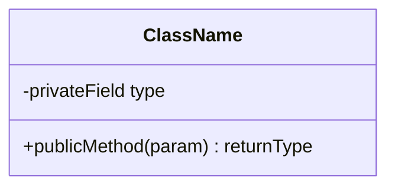
```mermaid
classDiagram
    class ClassName {
        -privateField type
        +publicMethod(param) returnType
    }
```
- `-` : private field
- `+` : public method
- Không cần ghi getter/setter

**2. Class Types:**
| Type | Content |
|------|---------|
| Controller | Methods là các API endpoints |
| Service | Methods là business logic |
| Repository | Interface với `<<interface>>`, methods là query |
| Entity | Fields đầy đủ, không có methods (trừ isExpired, etc.) |
| Enum | Dùng `<<enumeration>>` stereotype |

**3. Stereotypes:**
- `<<interface>>` : cho Repository interfaces
- `<<enumeration>>` : cho Enum types
- `<<abstract>>` : cho abstract classes

**4. Relationships:**
| Symbol | Meaning |
|--------|---------|
| `-->` | Dependency (Controller --> Service, Service --> Repository) |
| `--o` | Aggregation |
| `--*` | Composition |
| `--|>` | Inheritance |
| `..|>` | Implementation |

**5. Field Naming:**
- Fields viết camelCase
- Type viết sau field: `+UUID userId`
- Generic types dùng `~`: `Optional~User~`, `List~Pet~`

**6. Method Signatures:**
- Format: `+methodName(paramType) ReturnType`
- Nhiều params: `+method(String, UUID) ResponseEntity`
- Không có return: `+method(param) void`

**7. Dependency Grouping:**
- Nhóm dependencies theo comment: `%% Controller Dependencies`
- Thứ tự: Controller → Service → Repository → Entity

**8. Classes bắt buộc cho mỗi module:**
- 1 Controller
- 1+ Services
- 1+ Repositories
- 1+ Entities
- 1+ Enums (nếu có)

**9. Naming Convention:**
| Type | Pattern |
|------|---------|
| Controller | `[Feature]Controller` |
| Service | `[Feature]Service` |
| Repository | `[Entity]Repository` |
| Entity | `[EntityName]` (singular) |

---

#### 1.3.2 Sequence Diagram Rules

**1. Participants bắt buộc:**
```
actor User as [Tên Role]           %% Pet Owner, Staff, Clinic Manager
participant UI as [Tên Screen]     %% Mobile/Web
participant [Abbrev] as [ControllerName]
participant [Abbrev] as [ServiceName]
participant [Abbrev] as [RepositoryName]
participant DB as Database          %% BẮT BUỘC có
```

**2. Message Numbering:**
- Đánh số thứ tự liên tục trước mỗi message: `1.`, `2.`, `3....`
- Số bắt đầu từ 1, liên tục đến hết sequence
- **KHÔNG dùng `autonumber`**

**3. Database Actions:**
Khi Repository gọi Database, ghi rõ hành động thực hiện (thay vì câu SQL cụ thể):
```
Check if user exists by email
Save new user record
Update user profile status
Soft delete user record
```

**4. Activation Boxes:**
- Mỗi `activate` phải có `deactivate` tương ứng
- Activate khi bắt đầu xử lý, deactivate khi trả về

**5. Arrow Types:**
| Arrow | Meaning |
|-------|---------|
| `->>` | Synchronous request (gọi method) |
| `-->>` | Response (trả về kết quả) |
| `->` | Async message (không đợi response) |

**6. Flow Pattern chuẩn:**
```
User → UI → Controller → Service → Repository → Database
(Response ngược lại cùng thứ tự)
```

**7. Error Handling:** Dùng `alt`/`else` block cho success/error cases

**8. Naming Convention viết tắt:**
| Abbreviation | Full Name |
|--------------|-----------|
| AC | AuthController |
| AS | AuthService |
| UR | UserRepository |
| CR | ClinicRepository |
| DB | Database |
| ES | EmailService |
| JTP | JwtTokenProvider |

**9. Role Abbreviations:**
| Abbrev | Role |
|--------|------|
| PO | Pet Owner |
| V | Staff |
| CM | Clinic Manager |
| CO | Clinic Owner |
| A | Admin |

---

**Complete Example - Delete Flow with alt/else + activate/deactivate:**

```mermaid
sequenceDiagram
    actor CM as Clinic Manager
    participant UI as Manager Dashboard (Web)
    participant C as VetShiftController
    participant S as VetShiftService
    participant R as VetShiftRepository
    participant DB as Database

    CM->>UI: 1. Select the vet shift to delete
    UI->>C: 2. DELETE /api/v1/vet-shifts/{id}
    activate C
    C->>S: 3. deleteVetShift(id)
    activate S
    S->>R: 4. findById(id)
    activate R
    R->>DB: 5. Find vet shift record by ID
    
    alt [Staff Shift does not exist]
        DB-->>R: 6. Return null
        deactivate R
        R-->>S: 7. Optional.empty()
        S-->>C: 8. Throw NotFoundException
        deactivate S
        C-->>UI: 9. HTTP 404 Not Found
        deactivate C
        UI-->>CM: 10. Display error "Staff shift not found"
    else [Staff Shift exists]
        DB-->>R: 6. Return vet shift record
        deactivate R
        R-->>S: 7. VetShift Entity
        S->>R: 8. softDelete(vetShift)
        activate R
        R->>DB: 9. Update deleted status to true
        DB-->>R: 10. Return success
        deactivate R
        R-->>S: 11. Success
        deactivate S
        S-->>C: 12. void
        C-->>UI: 13. HTTP 200 OK
        deactivate C
        UI-->>CM: 14. Display success "Delete vet shift success"
    end
```

---

## 2. DATABASE DESIGN

Petties uses a **Polyglot Persistence** architecture with multiple database types serving different purposes:

| Database | Type | Use Case | Tables/Collections |
|----------|------|----------|-------------------|
| **PostgreSQL 16** (Backend) | Relational (RDBMS) | Structured data with strict relationships | 17 tables |
| **PostgreSQL 16** (AI Service) | Relational (RDBMS) | Agent configuration, tool governance, RAG metadata | 5 tables |
| **MongoDB 7** | Document (NoSQL) | Flexible, nested, schema-less data, AI chat history | 6 collections |

---

### 2.1 Relational Database Design (PostgreSQL)

PostgreSQL is used as the primary relational database for both Spring Boot Backend and AI Agent Service, providing foreign keys, ACID transactions, and complex queries.

> **Database Architecture:**
> - **Shared PostgreSQL Instance**: Both services connect to the same PostgreSQL server
> - **Separate Schemas (optional)**: AI Service tables can use `ai_` prefix for logical separation
> - **Total Tables**: 22 tables (17 Backend + 5 AI Service)

#### 2.1.1 Entity Relationship Diagram (Conceptual)

> **Lưu ý:** ERD ở mức Conceptual tập trung vào **dữ liệu** và **quan hệ** giữa các đối tượng trong hệ thống, không đi sâu vào chi tiết database design (columns, types, constraints).

##### A. Core Business Entities (Dữ liệu cốt lõi)

| Entity | Description | Key Relationships |
|--------|-------------|-------------------|
| **User** | Người dùng hệ thống (Pet Owner, Staff, Manager, Owner, Admin) | 1 User → N Pets (owns), 1 User → 1 Clinic (works_at) |
| **Pet** | Thú cưng được đăng ký trong hệ thống | 1 Pet → 1 Owner, 1 Pet → N EMRs, 1 Pet → N Vaccinations |
| **Clinic** | Phòng khám thú y đã đăng ký và được duyệt | 1 Clinic → N Services, N Staff, N Bookings |
| **ClinicService** | Dịch vụ do phòng khám cung cấp | 1 Service → 1 Clinic, N Weight Prices |
| **Booking** | Lịch hẹn khám/dịch vụ | 1 Booking → 1 Pet, 1 Clinic, N Services, 1 Assigned Staff |
| **EMRRecord** | Hồ sơ bệnh án điện tử (MongoDB) | 1 EMR → 1 Pet, 1 Staff, 1 Booking (optional) |
| **Vaccination** | Sổ tiêm chủng (MongoDB) | 1 Vaccination → 1 Pet, 1 Staff |
| **StaffShift** | Lịch làm việc của nhân viên | 1 Shift → 1 Staff, 1 Clinic, N Slots |
| **Slot** | Khung giờ khám (30 phút) | 1 Slot → 1 Shift, N Bookings |
| **Agent** | AI Agent configuration | 1 Agent → N Tools, N PromptVersions |
| **Tool** | MCP Tools cho AI Agent | N Tools → M Agents (many-to-many) |
| **AIChatSession** (MongoDB) | Phiên chat với AI | 1 Session → 1 User, N Messages (document-based) |
| **KnowledgeDocument** | Tài liệu RAG Knowledge Base | Standalone |

##### B. Entity Relationships Diagram (ERD)

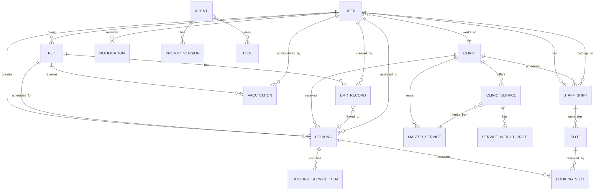
```mermaid
erDiagram
    USER ||--o{ PET : owns
    USER ||--o{ BOOKING : creates
    USER }o--|| CLINIC : works_at
    USER ||--o{ STAFF_SHIFT : has

    PET ||--o{ BOOKING : scheduled_for
    PET ||--o{ EMR_RECORD : has
    PET ||--o{ VACCINATION : receives

    CLINIC ||--o{ CLINIC_SERVICE : offers
    CLINIC ||--o{ STAFF_SHIFT : schedules
    CLINIC ||--o{ BOOKING : receives
    CLINIC ||--o{ MASTER_SERVICE : owns

    CLINIC_SERVICE ||--o{ SERVICE_WEIGHT_PRICE : has
    CLINIC_SERVICE }o--|| MASTER_SERVICE : inherits_from

    BOOKING ||--o{ BOOKING_SERVICE_ITEM : contains
    BOOKING }o--|| USER : assigned_to
    BOOKING ||--o{ BOOKING_SLOT : occupies

    EMR_RECORD }o--|| BOOKING : linked_to
    EMR_RECORD }o--|| USER : created_by

    VACCINATION }o--|| USER : administered_by

    STAFF_SHIFT }o--|| USER : belongs_to
    STAFF_SHIFT ||--o{ SLOT : generates

    SLOT ||--o{ BOOKING_SLOT : reserved_by

    USER ||--o{ NOTIFICATION : receives

    AGENT ||--o{ PROMPT_VERSION : has
    AGENT }o--o{ TOOL : uses
```

##### C. Entity Groups by Domain

| Domain | Entities | Purpose |
|--------|----------|---------|
| **User Management** | User, RefreshToken, BlacklistedToken | Người dùng, xác thực, phân quyền |
| **Pet Health** | Pet, EMRRecord (MongoDB), Vaccination (MongoDB) | Thông tin thú cưng, hồ sơ sức khỏe |
| **Clinic Operations** | Clinic, ClinicImage, ClinicPricePerKm | Phòng khám, hình ảnh, cấu hình khoảng cách |
| **Services & Pricing** | MasterService, ClinicService, ServiceWeightPrice | Dịch vụ, bảng giá theo cân nặng |
| **Scheduling** | StaffShift, Slot | Lịch làm việc nhân viên, khung giờ |
| **Booking** | Booking, BookingServiceItem, BookingSlot, Payment | Đặt lịch, chi tiết dịch vụ, thanh toán |
| **Notifications** | Notification | Thông báo hệ thống |
| **AI Service** | Agent, Tool, PromptVersion, KnowledgeDocument, SystemSetting, AIChatSession (Mongo), AIChatMessage (Mongo) | AI chatbot, RAG, cấu hình |

##### D. Detailed ERD (Database Design)

> **Note:** ERD chi tiết (với columns, types, constraints) được generate từ [dbdiagram.io](https://dbdiagram.io/).
> DBML source code: [`docs-references/database/PETTIES_DBML.dbml`](../../database/PETTIES_DBML.dbml)

**Instructions to generate Detailed ERD:**
1. Visit https://dbdiagram.io/
2. Copy content from `PETTIES_DBML.dbml`
3. Paste into editor
4. Export PNG/PDF

```
[Detailed ERD Diagram - Paste screenshot from dbdiagram.io here]
```

#### 2.1.2 Table Groups

##### Spring Boot Backend Tables (17 tables)

| Group | Tables | Description |
|-------|--------|-------------|
| **Auth & User** | users, refresh_tokens, blacklisted_tokens | User management and authentication |
| **Pet** | pets | Pet profiles |
| **Clinic** | clinics, clinic_images, clinic_price_per_km | Clinic management |
| **Services** | master_services, clinic_services, service_weight_prices | Services and pricing |
| **Scheduling** | vet_shifts, slots | Staff work schedules |
| **Booking** | bookings, booking_service_items, booking_slots, payments | Appointments and payments |
| **Notification** | notifications | System notifications |

##### AI Agent Service Tables (5 tables)

| Group | Tables | Description |
|-------|--------|-------------|
| **Agent Config** | agents, tools, prompt_versions | Single Agent and Tools configuration |
| **Knowledge Base** | knowledge_documents | RAG documents |
| **Settings** | system_settings | API keys, LLM configs |

#### 2.1.3 Table Descriptions

##### 2.1.3.1 Spring Boot Backend Tables

###### Auth & User Tables

**Table: users**

**Description:** Stores all user accounts with different roles (Pet Owner, Staff, Clinic Manager, Clinic Owner, Admin). Supports soft delete for data retention.

| Column | Type | Constraints | Description |
|--------|------|-------------|-------------|
| user_id | UUID | PK | Primary Key |
| username | VARCHAR(50) | UNIQUE, NOT NULL | Login username |
| password | VARCHAR(255) | NOT NULL | Password (hashed) |
| phone | VARCHAR(20) | UNIQUE | Phone number |
| email | VARCHAR(100) | UNIQUE, NOT NULL | Email address |
| full_name | VARCHAR(100) | | Full name |
| avatar | VARCHAR(500) | | Avatar URL (Cloudinary) |
| avatar_public_id | VARCHAR(100) | | Cloudinary public ID |
| role | ENUM | NOT NULL | PET_OWNER, STAFF, CLINIC_MANAGER, CLINIC_OWNER, ADMIN |
| specialty | ENUM | | VET, GROOMER |
| rating_avg | DECIMAL(2,1) | DEFAULT 0.0 | Average rating |
| rating_count | INT | DEFAULT 0 | Number of ratings |
| fcm_token | VARCHAR(500) | | Firebase Cloud Messaging token |
| address | VARCHAR(500) | | Default address (Pet Owner) |
| working_clinic_id | UUID | FK→clinics | Working clinic |
| created_at | TIMESTAMP | DEFAULT now() | Created date |
| updated_at | TIMESTAMP | DEFAULT now() | Updated date |
| deleted_at | TIMESTAMP | | Soft delete timestamp |

**Table: refresh_tokens**

**Description:** JWT refresh tokens for multi-device authentication. Allows users to stay logged in across sessions without re-entering credentials.

| Column | Type | Constraints | Description |
|--------|------|-------------|-------------|
| token_id | UUID | PK | Primary Key |
| user_id | UUID | FK→users, NOT NULL | Token owner |
| token_hash | VARCHAR(255) | UNIQUE, NOT NULL | Refresh token hash |
| expires_at | TIMESTAMP | NOT NULL | Expiration time |
| created_at | TIMESTAMP | DEFAULT now() | Created date |

**Table: blacklisted_tokens**

**Description:** Invalidated tokens after logout to prevent reuse until expiration. Ensures security when users explicitly log out.

| Column | Type | Constraints | Description |
|--------|------|-------------|-------------|
| token_id | UUID | PK | Primary Key |
| token_hash | VARCHAR(255) | UNIQUE, NOT NULL | Blacklisted token hash |
| user_id | UUID | NOT NULL | Token owner |
| expires_at | TIMESTAMP | NOT NULL | Expiration time |
| created_at | TIMESTAMP | DEFAULT now() | Created date |

###### Pet Table

**Table: pets**

**Description:** Pet profiles belonging to Pet Owners. Contains medical information like allergies, weight, and species for veterinary services.

| Column | Type | Constraints | Description |
|--------|------|-------------|-------------|
| id | UUID | PK | Primary Key |
| user_id | UUID | FK→users, NOT NULL | Owner (Pet Owner) |
| name | VARCHAR(100) | NOT NULL | Pet name |
| species | VARCHAR(50) | | Species (Dog, Cat, Other) |
| breed | VARCHAR(100) | | Breed |
| date_of_birth | DATE | | Birth date |
| weight | DECIMAL(5,2) | | Weight (kg) |
| gender | VARCHAR(10) | | Gender |
| color | VARCHAR(100) | | Fur color |
| allergies | TEXT | | Allergies (if any) |
| image_url | VARCHAR(500) | | Pet image |
| image_public_id | VARCHAR(100) | | Cloudinary public ID |
| created_at | TIMESTAMP | DEFAULT now() | Created date |
| updated_at | TIMESTAMP | DEFAULT now() | Updated date |

###### Clinic Tables

**Table: clinics**

**Description:** Veterinary clinic profiles registered by Clinic Owners. Requires admin approval before becoming visible to users. Supports soft delete for data retention.

| Column | Type | Constraints | Description |
|--------|------|-------------|-------------|
| clinic_id | UUID | PK | Primary Key |
| owner_id | UUID | FK→users, NOT NULL | Clinic owner |
| name | VARCHAR(200) | NOT NULL | Clinic name |
| description | TEXT | | Description |
| address | VARCHAR(500) | NOT NULL | Full address |
| ward | VARCHAR(100) | | Ward |
| district | VARCHAR(100) | | District |
| province | VARCHAR(100) | | Province/City |
| specific_location | VARCHAR(200) | | Specific location |
| phone | VARCHAR(20) | | Phone number |
| email | VARCHAR(100) | | Contact email |
| latitude | DECIMAL(10,8) | | Latitude |
| longitude | DECIMAL(11,8) | | Longitude |
| logo | VARCHAR(500) | | Logo URL |
| operating_hours | JSONB | | Operating hours (JSON) |
| status | ENUM | NOT NULL, DEFAULT 'PENDING' | PENDING, APPROVED, REJECTED, SUSPENDED |
| rejection_reason | TEXT | | Rejection reason |
| rating_avg | DECIMAL(2,1) | DEFAULT 0.0 | Rating score |
| rating_count | INT | DEFAULT 0 | Number of ratings |
| approved_at | TIMESTAMP | | Approval date |
| created_at | TIMESTAMP | DEFAULT now() | Created date |
| updated_at | TIMESTAMP | DEFAULT now() | Updated date |
| deleted_at | TIMESTAMP | | Soft delete |

**operating_hours JSONB Structure:**
```json
{
  "monday": {"open_time": "08:00", "close_time": "18:00", "break_start": "12:00", "break_end": "13:00", "is_closed": false},
  "tuesday": {...},
  "sunday": {"is_closed": true}
}
```

**Table: clinic_images**

**Description:** Gallery images for clinic profiles with ordering support. Clinics can upload multiple images to showcase their facilities.

| Column | Type | Constraints | Description |
|--------|------|-------------|-------------|
| image_id | UUID | PK | Primary Key |
| clinic_id | UUID | FK→clinics, NOT NULL | Clinic |
| image_url | VARCHAR(500) | NOT NULL | Image URL |
| caption | VARCHAR(200) | | Image caption |
| display_order | INT | DEFAULT 0 | Display order |
| is_primary | BOOLEAN | DEFAULT false | Primary image |
| created_at | TIMESTAMP | DEFAULT now() | Created date |

**Table: clinic_price_per_km**

**Description:** Travel pricing for Home Visit services. One-to-one relationship with clinics. Used to calculate distance-based fees.

| Column | Type | Constraints | Description |
|--------|------|-------------|-------------|
| clinic_id | UUID | PK, FK→clinics | 1:1 with clinics |
| price_per_km | DECIMAL(12,2) | NOT NULL | Travel price per km |
| created_at | TIMESTAMP | DEFAULT now() | Created date |
| updated_at | TIMESTAMP | DEFAULT now() | Updated date |

###### Service Tables

**Table: master_services**

**Description:** Service templates created by Clinic Owner, inherited by individual clinic services. Defines default pricing, duration, and categories.

| Column | Type | Constraints | Description |
|--------|------|-------------|-------------|
| master_service_id | UUID | PK | Primary Key |
| name | VARCHAR(200) | NOT NULL | Service name |
| description | TEXT | | Description |
| default_price | DECIMAL(19,2) | | Default price |
| duration_time | INT | | Duration (minutes) |
| slots_required | INT | DEFAULT 1 | Required slots |
| is_home_visit | BOOLEAN | DEFAULT false | Supports Home Visit |
| default_price_per_km | DECIMAL(19,2) | | Default price/km |
| service_category | VARCHAR(100) | | Category |
| pet_type | VARCHAR(100) | | Pet type (Dog, Cat, All) |
| icon | VARCHAR(100) | | Icon identifier |
| created_at | TIMESTAMP | DEFAULT now() | Created date |
| updated_at | TIMESTAMP | DEFAULT now() | Updated date |

**Table: clinic_services**

**Description:** Actual services offered by clinics, either inherited from master_services or custom created. Clinics can customize pricing and availability.

| Column | Type | Constraints | Description |
|--------|------|-------------|-------------|
| service_id | UUID | PK | Primary Key |
| clinic_id | UUID | FK→clinics, NOT NULL | Clinic |
| master_service_id | UUID | FK→master_services | Template (nullable) |
| is_custom | BOOLEAN | DEFAULT false | true=Custom, false=Inherited |
| name | VARCHAR(200) | NOT NULL | Service name |
| description | TEXT | | Description |
| base_price | DECIMAL(19,2) | | Base price |
| duration_time | INT | | Duration (minutes) |
| slots_required | INT | DEFAULT 1 | Required slots |
| is_active | BOOLEAN | DEFAULT true | Is active |
| is_home_visit | BOOLEAN | DEFAULT false | Supports Home Visit |
| price_per_km | DECIMAL(19,2) | | Travel price |
| service_category | ENUM | | GROOMING_SPA, VACCINATION, CHECK_UP, SURGERY, DENTAL, DERMATOLOGY, OTHER |
| pet_type | VARCHAR(100) | | Pet type |
| created_at | TIMESTAMP | DEFAULT now() | Created date |
| updated_at | TIMESTAMP | DEFAULT now() | Updated date |

**Table: service_weight_prices**

**Description:** Weight-based pricing tiers for services (e.g., grooming costs more for larger pets). Links to either clinic services or master services.

| Column | Type | Constraints | Description |
|--------|------|-------------|-------------|
| weight_price_id | UUID | PK | Primary Key |
| service_id | UUID | FK→clinic_services | Clinic service (nullable) |
| master_service_id | UUID | FK→master_services | Master template (nullable) |
| min_weight | DECIMAL(10,2) | NOT NULL | Minimum weight (kg) |
| max_weight | DECIMAL(10,2) | NOT NULL | Maximum weight (kg) |
| price | DECIMAL(19,2) | NOT NULL | Price for weight range |
| created_at | TIMESTAMP | DEFAULT now() | Created date |
| updated_at | TIMESTAMP | DEFAULT now() | Updated date |

###### Scheduling Tables

**Table: vet_shifts**

**Description:** Work schedules for veterinarians at specific clinics. Auto-generates 30-minute slots for booking. Supports overnight shifts and break times.

| Column | Type | Constraints | Description |
|--------|------|-------------|-------------|
| shift_id | UUID | PK | Primary Key |
| vet_id | UUID | FK→users, NOT NULL | Veterinarian |
| clinic_id | UUID | FK→clinics, NOT NULL | Clinic |
| work_date | DATE | NOT NULL | Work date |
| start_time | TIME | NOT NULL | Shift start time |
| end_time | TIME | NOT NULL | Shift end time |
| break_start | TIME | | Lunch break start |
| break_end | TIME | | Lunch break end |
| is_overnight | BOOLEAN | DEFAULT false | Overnight shift flag |
| notes | VARCHAR(500) | | Notes |
| created_at | TIMESTAMP | DEFAULT now() | Created date |
| updated_at | TIMESTAMP | DEFAULT now() | Updated date |

**Table: slots**

**Description:** 30-minute time blocks auto-generated from vet_shifts. Used for booking appointments. Status tracks availability.

| Column | Type | Constraints | Description |
|--------|------|-------------|-------------|
| slot_id | UUID | PK | Primary Key |
| shift_id | UUID | FK→vet_shifts, NOT NULL | Parent shift |
| start_time | TIME | NOT NULL | Slot start time |
| end_time | TIME | NOT NULL | Slot end time |
| status | ENUM | NOT NULL, DEFAULT 'AVAILABLE' | AVAILABLE, BOOKED, BLOCKED |
| created_at | TIMESTAMP | DEFAULT now() | Created date |
| updated_at | TIMESTAMP | DEFAULT now() | Updated date |

###### Booking Tables

**Table: bookings**

**Description:** Appointment records connecting pets, pet owners, clinics, and optional vets. Core booking entity supporting IN_CLINIC, HOME_VISIT, and SOS types.

| Column | Type | Constraints | Description |
|--------|------|-------------|-------------|
| booking_id | UUID | PK | Primary Key |
| booking_code | VARCHAR(20) | UNIQUE, NOT NULL | Booking code (BK-YYYYMMDD-XXXX) |
| pet_id | UUID | FK→pets, NOT NULL | Pet being treated |
| pet_owner_id | UUID | FK→users, NOT NULL | Pet owner |
| clinic_id | UUID | FK→clinics, NOT NULL | Target clinic |
| assigned_staff_id | UUID | FK→users | Assigned staff |
| booking_date | DATE | NOT NULL | Appointment date |
| booking_time | TIME | NOT NULL | Appointment time |
| type | ENUM | NOT NULL, DEFAULT 'IN_CLINIC' | IN_CLINIC, HOME_VISIT, SOS |
| home_address | VARCHAR(500) | | Address (Home Visit/SOS only) |
| home_lat | DECIMAL(10,7) | | Home latitude |
| home_long | DECIMAL(10,7) | | Home longitude |
| distance_km | DECIMAL(5,2) | | Distance in km |
| distance_fee | DECIMAL(12,2) | | Travel fee |
| total_price | DECIMAL(12,2) | | Total price |
| status | ENUM | NOT NULL, DEFAULT 'PENDING' | (See State Machine below) |
| cancellation_reason | TEXT | | Cancellation reason |
| cancelled_by | UUID | | Cancelled by user |
| notes | TEXT | | Notes |
| created_at | TIMESTAMP | DEFAULT now() | Created date |

**Booking Status State Machine:**
```
PENDING → CONFIRMED → IN_PROGRESS → COMPLETED
```
Alternative paths: CANCELLED, NO_SHOW

**Table: booking_service_items**

**Description:** Junction table linking bookings to specific clinic services (Many-to-Many). Captures price snapshot at booking time for historical accuracy.

| Column | Type | Constraints | Description |
|--------|------|-------------|-------------|
| booking_service_id | UUID | PK | Primary Key |
| booking_id | UUID | FK→bookings, NOT NULL | Parent booking |
| service_id | UUID | FK→clinic_services, NOT NULL | Clinic service |
| assigned_staff_id | UUID | FK→users | Staff assigned to this service |
| unit_price | DECIMAL(12,2) | | Price snapshot at booking time |
| base_price | DECIMAL(12,2) | | Base price |
| weight_price | DECIMAL(12,2) | | Weight-based price |
| quantity | INT | DEFAULT 1 | Quantity |
| created_at | TIMESTAMP | DEFAULT now() | Created date |

**Table: booking_slots**

**Description:** Junction table linking bookings to specific time slots (Many-to-Many). Allows services to occupy multiple consecutive slots.

| Column | Type | Constraints | Description |
|--------|------|-------------|-------------|
| booking_slot_id | UUID | PK | Primary Key |
| booking_id | UUID | FK→bookings, NOT NULL | Parent booking |
| slot_id | UUID | FK→slots, NOT NULL | Reserved slot |
| booking_service_id | UUID | FK→booking_service_items | Associated service item |
| created_at | TIMESTAMP | DEFAULT now() | Created date |

**Table: payments**

**Description:** Payment records with 1:1 relationship to bookings. Supports multiple payment methods (CASH, QR, CARD) with Stripe integration.

| Column | Type | Constraints | Description |
|--------|------|-------------|-------------|
| payment_id | UUID | PK | Primary Key |
| booking_id | UUID | FK→bookings, UNIQUE, NOT NULL | 1:1 with Booking |
| amount | DECIMAL(12,2) | NOT NULL | Payment amount |
| method | ENUM | NOT NULL, DEFAULT 'CASH' | CASH, QR, CARD |
| status | ENUM | NOT NULL, DEFAULT 'PENDING' | PENDING, PAID, REFUNDED, FAILED |
| stripe_payment_id | VARCHAR(255) | | Stripe transaction ID |
| paid_at | TIMESTAMP | | Payment timestamp |
| created_at | TIMESTAMP | DEFAULT now() | Created date |

###### Notification Table

**Table: notifications**

**Description:** In-app notifications for users about clinic approvals, shift assignments, booking updates, and medical reminders. Supports read/unread status.

| Column | Type | Constraints | Description |
|--------|------|-------------|-------------|
| notification_id | UUID | PK | Primary Key |
| user_id | UUID | FK→users, NOT NULL | Notification recipient |
| clinic_id | UUID | FK→clinics | Related clinic (optional) |
| shift_id | UUID | FK→vet_shifts | Related shift (optional) |
| type | ENUM | NOT NULL | (See Notification Types) |
| emr_id | VARCHAR(50) | | MongoDB ObjectId |
| message | TEXT | NOT NULL | Notification content |
| reason | TEXT | | Reason (for rejection) |
| read | BOOLEAN | DEFAULT false | Read status |
| created_at | TIMESTAMP | DEFAULT now() | Created date |

**Notification Types:**
- Clinic: APPROVED, REJECTED, PENDING, CLINIC_PENDING_APPROVAL, CLINIC_VERIFIED
- VetShift: VET_SHIFT_ASSIGNED, VET_SHIFT_UPDATED, VET_SHIFT_DELETED
- Booking: BOOKING_CREATED, BOOKING_CONFIRMED, BOOKING_ASSIGNED, BOOKING_CANCELLED, BOOKING_CHECKIN, BOOKING_COMPLETED, VET_ON_WAY
- Medical: RE_EXAMINATION_REMINDER

##### 2.1.3.2 AI Agent Service Tables

###### Table: agents

**Purpose:** Stores Single Agent configuration for the Petties AI Assistant using ReAct pattern (Reasoning + Acting). This table enables dynamic agent behavior modification through Admin Dashboard without code deployment.

| Column | Type | Constraints | Purpose & Business Context |
|--------|------|-------------|---------------------------|
| id | INT | PK, AUTO_INCREMENT | Auto-increment primary key for internal references |
| name | VARCHAR(100) | UNIQUE, NOT NULL | Unique agent identifier (e.g., "petties_agent"). Used for tool assignment and logging |
| description | TEXT | | Human-readable description of agent's capabilities for Admin Dashboard display |
| temperature | FLOAT | DEFAULT 0.7 | Controls LLM response randomness (0.0=deterministic, 1.0=creative). Lower values for factual Q&A, higher for creative suggestions |
| max_tokens | INT | DEFAULT 2000 | Maximum response length limit. Prevents excessive token usage and controls cost |
| top_p | FLOAT | DEFAULT 0.9 | Nucleus sampling parameter (0.0-1.0). Works with temperature to control output diversity |
| model | VARCHAR(100) | DEFAULT 'google/gemini-2.0-flash-exp:free' | OpenRouter model ID. Enables model switching without code changes |
| system_prompt | TEXT | | Defines agent personality, capabilities, and behavior rules. Core of ReAct pattern implementation |
| enabled | BOOLEAN | DEFAULT true | Master switch to enable/disable agent. Useful for maintenance or A/B testing |
| created_at | TIMESTAMPTZ | DEFAULT now() | Record creation timestamp for audit trail |
| updated_at | TIMESTAMPTZ | DEFAULT now() | Last modification timestamp for change tracking |

###### Table: tools

**Purpose:** Stores metadata for code-based tools decorated with `@mcp.tool`. Admin can enable/disable individual tools and assign them to specific agents. Tools provide the "Acting" capability in ReAct pattern.

| Column | Type | Constraints | Purpose & Business Context |
|--------|------|-------------|---------------------------|
| id | INT | PK, AUTO_INCREMENT | Auto-increment primary key |
| name | VARCHAR(100) | UNIQUE, NOT NULL | Unique tool identifier matching the Python function name (e.g., "check_slot", "create_booking") |
| description | TEXT | | Semantic description used by LLM to decide when to invoke this tool. Critical for accurate tool selection |
| tool_type | VARCHAR(20) | DEFAULT 'code_based' | Distinguishes `code_based` (FastMCP @mcp.tool) from `api_based` (direct Spring Boot API calls) |
| input_schema | JSON | | JSON Schema defining expected input parameters. Used for validation and LLM function calling format |
| output_schema | JSON | | JSON Schema defining output structure. Helps LLM interpret tool results correctly |
| enabled | BOOLEAN | DEFAULT false | Admin toggle to enable/disable tool. Default false - admin must explicitly enable after deployment |
| assigned_agents | JSON | | Array of agent names allowed to use this tool (e.g., ["petties_agent"]). Enables tool governance |
| created_at | TIMESTAMPTZ | DEFAULT now() | Record creation timestamp |
| updated_at | TIMESTAMPTZ | DEFAULT now() | Last modification timestamp |

**Tool Types:**
- `code_based`: FastMCP @mcp.tool decorators (default)
- `api_based`: Spring Boot API calls

###### Table: prompt_versions

**Purpose:** Version control for system prompts enabling rollback, A/B testing, and audit trail. Only one version can be active per agent at a time.

**Có cần thiết không?**
- **MVP nhỏ (1 prompt ổn định, ít thay đổi):** Có thể chạy mà không cần quy trình version đầy đủ.
- **Môi trường thực tế (nhiều lần tuning prompt, nhiều admin):** **Nên có** để rollback nhanh khi prompt mới làm giảm chất lượng.
- **Với Petties:** Khuyến nghị giữ `prompt_versions` vì có dashboard admin, nhiều tool và cần truy vết thay đổi hành vi agent theo thời gian.

| Column | Type | Constraints | Purpose & Business Context |
|--------|------|-------------|---------------------------|
| id | INT | PK, AUTO_INCREMENT | Auto-increment primary key |
| agent_id | INT | FK→agents, NOT NULL | Foreign key to agents table. Links version to specific agent |
| version | INT | NOT NULL | Sequential version number (1, 2, 3...). Higher number = newer version |
| prompt_text | TEXT | NOT NULL | Full system prompt content. May include ReAct instructions, persona, constraints |
| is_active | BOOLEAN | DEFAULT false | Indicates currently active version. Only one active version per agent |
| created_by | VARCHAR(100) | | Admin username who created this version. For accountability |
| notes | TEXT | | Change notes describing what was modified. Helps with version comparison |
| created_at | TIMESTAMPTZ | DEFAULT now() | Version creation timestamp |

###### AI Chat History Storage (MongoDB)

**Decision:** Chat giữa AI và người dùng được lưu tại MongoDB để phù hợp dữ liệu hội thoại có cấu trúc linh hoạt, nested metadata (thought/tool_calls/sources), và tốc độ ghi cao theo luồng streaming.

**Scope:**
- PostgreSQL giữ phần cấu hình và quản trị (agents/tools/prompt_versions/knowledge_documents/system_settings).
- MongoDB giữ lịch sử chat AI-user (sessions + messages + trace metadata).

###### Table: knowledge_documents

**Purpose:** Tracks documents uploaded for RAG (Retrieval-Augmented Generation) knowledge base. Enables pet care Q&A by indexing veterinary information.

| Column | Type | Constraints | Purpose & Business Context |
|--------|------|-------------|---------------------------|
| id | INT | PK, AUTO_INCREMENT | Auto-increment primary key |
| filename | VARCHAR(255) | NOT NULL | Original uploaded filename. Displayed in Admin Dashboard |
| file_path | VARCHAR(500) | NOT NULL | Storage path (local or cloud). Used for reprocessing if needed |
| file_type | VARCHAR(10) | | File extension (pdf, docx, txt, md). Determines parsing strategy |
| file_size | INT | | File size in bytes. For storage management and upload limits |
| processed | BOOLEAN | DEFAULT false | Whether document has been chunked and embedded. False until processing completes |
| vector_count | INT | DEFAULT 0 | Number of vector embeddings created. Indicates document coverage in knowledge base |
| uploaded_by | VARCHAR(100) | | Admin username who uploaded. For audit trail |
| notes | TEXT | | Optional notes about document content or source |
| uploaded_at | TIMESTAMPTZ | DEFAULT now() | Upload timestamp |
| processed_at | TIMESTAMPTZ | | Processing completion timestamp. NULL if not yet processed |

###### Table: system_settings

**Purpose:** Runtime-configurable settings for AI service (API keys, model configs) editable via Admin Dashboard. Eliminates need for .env file changes and redeployment.

| Column | Type | Constraints | Purpose & Business Context |
|--------|------|-------------|---------------------------|
| id | INT | PK, AUTO_INCREMENT | Auto-increment primary key |
| key | VARCHAR(100) | UNIQUE, NOT NULL | Unique setting identifier (e.g., "OPENROUTER_API_KEY", "COHERE_EMBEDDING_MODEL") |
| value | TEXT | NOT NULL | Setting value. Encrypted in database if is_sensitive=true |
| category | VARCHAR(50) | DEFAULT 'general' | Groups settings: `llm` (OpenRouter), `rag` (Cohere), `embeddings`, `vector_db` (Qdrant), `general` |
| is_sensitive | BOOLEAN | DEFAULT false | If true, value is encrypted and masked in UI. Used for API keys and secrets |
| description | TEXT | | Human-readable description for Admin Dashboard tooltip |
| created_at | TIMESTAMPTZ | DEFAULT now() | Record creation timestamp |
| updated_at | TIMESTAMPTZ | DEFAULT now() | Last modification timestamp |

**Setting Categories:**
- `llm`: OpenRouter API settings
- `rag`: RAG pipeline settings
- `embeddings`: Cohere embedding settings
- `vector_db`: Qdrant Cloud settings
- `general`: General settings (JWT, etc.)

**Default Settings (seeded on init):**
```
OPENROUTER_API_KEY, OPENROUTER_DEFAULT_MODEL, OPENROUTER_FALLBACK_MODEL
DEEPSEEK_API_KEY, DEEPSEEK_MODEL, DEEPSEEK_BASE_URL
COHERE_API_KEY, COHERE_EMBEDDING_MODEL
OPENAI_API_KEY, OPENAI_EMBEDDING_MODEL
QDRANT_URL, QDRANT_API_KEY, QDRANT_COLLECTION_NAME
JWT_SECRET
```

#### 2.1.4 Enum Types Summary

##### Spring Boot Backend Enums

| Enum | Values |
|------|--------|
| **role** | PET_OWNER, STAFF, CLINIC_MANAGER, CLINIC_OWNER, ADMIN |
| **staff_specialty** | VET, GROOMER |
| **clinic_status** | PENDING, APPROVED, REJECTED, SUSPENDED |
| **booking_type** | IN_CLINIC, HOME_VISIT, SOS |
| **booking_status** | PENDING, SEARCHING, PENDING_CLINIC_CONFIRM, CONFIRMED, IN_PROGRESS, COMPLETED, CANCELLED, NO_SHOW |
| **slot_status** | AVAILABLE, BOOKED, BLOCKED |
| **service_category** | GROOMING_SPA, VACCINATION, CHECK_UP, SURGERY, DENTAL, DERMATOLOGY, OTHER |
| **payment_method** | CASH, QR, CARD |
| **payment_status** | PENDING, PAID, REFUNDED, FAILED |
| **notification_type** | (See full list above) |

##### AI Agent Service Enums

| Enum | Values |
|------|--------|
| **tool_type** | code_based, api_based |
| **setting_category** | llm, rag, embeddings, vector_db, general |
| **message_role** | user, assistant, system, tool |
| **file_type** | pdf, docx, txt, md |

#### 2.1.5 Index Strategy

##### Spring Boot Backend Indexes

| Table | Index Name | Columns | Type | Purpose |
|-------|------------|---------|------|---------|
| users | idx_users_email | email | UNIQUE | Email lookup |
| users | idx_users_phone | phone | UNIQUE | Phone lookup |
| users | idx_users_role | role | B-TREE | Role filtering |
| clinics | idx_clinics_status | status | B-TREE | Status filtering |
| clinics | idx_clinics_location | (latitude, longitude) | B-TREE | Geo queries |
| bookings | idx_bookings_code | booking_code | UNIQUE | Code lookup |
| bookings | idx_bookings_status | status | B-TREE | Status filtering |
| bookings | idx_bookings_date | booking_date | B-TREE | Date range queries |
| vet_shifts | idx_shift_vet_date | (vet_id, work_date) | COMPOSITE | Staff schedule lookup |
| vet_shifts | idx_shift_clinic_date | (clinic_id, work_date) | COMPOSITE | Clinic schedule |
| slots | idx_slot_shift | shift_id | B-TREE | Shift lookup |
| slots | idx_slot_status | status | B-TREE | Available slots |

##### AI Agent Service Indexes

| Table | Index Name | Columns | Type | Purpose |
|-------|------------|---------|------|---------|
| agents | idx_agents_name | name | UNIQUE | Agent lookup by name |
| tools | idx_tools_name | name | UNIQUE | Tool lookup by name |
| tools | idx_tools_enabled | enabled | B-TREE | Filter enabled tools |
| system_settings | idx_system_settings_key | key | UNIQUE | Setting lookup |

##### Cross-Service References

> **Note:** Với quyết định lưu AI chat trên MongoDB, mapping `user_id` từ Spring Boot backend được lưu như logical reference trong document Mongo (`ai_chat_sessions.user_id`).

#### 2.1.6 Complete ERD (All Tables)

> **Note:** Complete ERD bao gồm tất cả 24 tables (17 Backend + 7 AI Service).
> ERD này là **Database Design** chi tiết với columns, types, constraints.
> DBML source code: [`docs-references/database/PETTIES_DBML.dbml`](../../database/PETTIES_DBML.dbml)

**Instructions to generate Complete ERD:**
1. Visit https://dbdiagram.io/
2. Copy content from `PETTIES_DBML.dbml`
3. Paste into editor
4. Export PNG/PDF

```
[Complete ERD Diagram - Paste screenshot from dbdiagram.io here]
```

---

### 2.2 NoSQL Database Design (MongoDB)

MongoDB is used for flexible data with nested documents, no strict schema required.

#### 2.2.1 Collections Overview

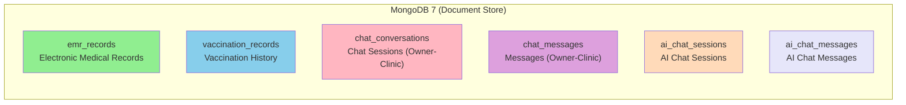
```mermaid
flowchart LR
    subgraph MongoDB["MongoDB 7 (Document Store)"]
        direction TB
        EMR["emr_records<br/>Electronic Medical Records"]
        VAX["vaccination_records<br/>Vaccination History"]
        CONV["chat_conversations<br/>Chat Sessions (Owner-Clinic)"]
        MSG["chat_messages<br/>Messages (Owner-Clinic)"]
        AICONV["ai_chat_sessions<br/>AI Chat Sessions"]
        AIMSG["ai_chat_messages<br/>AI Chat Messages"]
    end

    style EMR fill:#90EE90
    style VAX fill:#87CEEB
    style CONV fill:#FFB6C1
    style MSG fill:#DDA0DD
    style AICONV fill:#FFDAB9
    style AIMSG fill:#E6E6FA
```

| Collection | Description | Avg Doc Size | Reference to PostgreSQL |
|------------|-------------|--------------|------------------------|
| emr_records | Electronic Medical Records (SOAP format) | ~2KB | pet_id, booking_id, vet_id, clinic_id |
| vaccination_records | Vaccination history | ~500B | pet_id, booking_id, vet_id |
| chat_conversations | 1-1 chat sessions | ~300B | pet_owner_id, clinic_id |
| chat_messages | Messages | ~200B | sender_id, chat_box_id (MongoDB _id) |
| ai_chat_sessions | AI-user chat sessions | ~500B | user_id, agent_id (logical ref) |
| ai_chat_messages | AI-user chat messages + metadata | ~1KB | session_id (MongoDB _id) |

#### 2.2.2 Collection Descriptions

##### Collection: emr_records

**Description:** Electronic Medical Records in SOAP format (Subjective, Objective, Assessment, Plan) with embedded prescriptions and images.

**Sample Document:**
```json
{
  "_id": ObjectId("507f1f77bcf86cd799439011"),
  "pet_id": "550e8400-e29b-41d4-a716-446655440000",
  "booking_id": "550e8400-e29b-41d4-a716-446655440001",
  "vet_id": "550e8400-e29b-41d4-a716-446655440002",
  "clinic_id": "550e8400-e29b-41d4-a716-446655440003",

  "subjective": "Owner reports pet stopped eating for 2 days, lethargic, vomited once this morning.",

  "objective": "Temperature: 39.5°C (mild fever). Heart: normal. Breathing: normal. Abdomen: slightly distended, tender in epigastric region. Mucous membranes: slightly pale.",

  "assessment": "Acute gastritis. Suspected ingestion of inappropriate food.",

  "plan": "Medical treatment for 5 days. Rest, feed soft and digestible food. Follow-up in 5 days if no improvement.",

  "weight_kg": 4.5,
  "temperature_c": 39.5,

  "prescriptions": [
    {
      "medicine_name": "Amoxicillin 250mg",
      "dosage": "1 tablet",
      "frequency": "Twice daily",
      "duration_days": 5,
      "instructions": "Take after meals"
    },
    {
      "medicine_name": "Omeprazole 20mg",
      "dosage": "1/2 tablet",
      "frequency": "Once daily (morning)",
      "duration_days": 5,
      "instructions": "Take 30 minutes before meals"
    },
    {
      "medicine_name": "Metoclopramide 10mg",
      "dosage": "1/4 tablet",
      "frequency": "Three times daily",
      "duration_days": 3,
      "instructions": "Take 15 minutes before meals, stop when vomiting ceases"
    }
  ],

  "images": [
    {
      "url": "https://res.cloudinary.com/petties/emr/xray-abdomen-001.jpg",
      "description": "Abdominal X-ray - No foreign body detected"
    }
  ],

  "re_examination_date": ISODate("2025-01-31T00:00:00Z"),
  "created_at": ISODate("2025-01-26T10:30:00Z"),
  "updated_at": ISODate("2025-01-26T10:30:00Z")
}
```

**Indexes:**
- `{ pet_id: 1 }` - Find EMR by pet
- `{ booking_id: 1 }` - Find by booking
- `{ vet_id: 1, created_at: -1 }` - Staff's EMR records by time
- `{ clinic_id: 1, created_at: -1 }` - Clinic's EMR records

##### Collection: vaccination_records

**Description:** Pet vaccination history, tracking administered vaccines and booster schedules.

**Sample Document:**
```json
{
  "_id": ObjectId("507f1f77bcf86cd799439012"),
  "pet_id": "550e8400-e29b-41d4-a716-446655440000",
  "booking_id": "550e8400-e29b-41d4-a716-446655440001",
  "vet_id": "550e8400-e29b-41d4-a716-446655440002",

  "vaccine_name": "5-in-1 Vaccine (DHPP+Lepto)",
  "batch_number": "VN2025-001234",
  "manufacturer": "MSD Animal Health",

  "vaccination_date": ISODate("2025-01-26T10:00:00Z"),
  "next_due_date": ISODate("2026-01-26T00:00:00Z"),

  "dose_number": 2,
  "total_doses": 3,

  "notes": "Booster dose 2. Pet is healthy, no adverse reactions. Schedule dose 3 in 1 year.",

  "created_at": ISODate("2025-01-26T10:15:00Z")
}
```

**Indexes:**
- `{ pet_id: 1, vaccination_date: -1 }` - Pet's vaccination history
- `{ next_due_date: 1 }` - Find upcoming vaccinations

##### Collection: chat_conversations

**Description:** 1-1 chat sessions between Pet Owner and Clinic.

**Sample Document:**
```json
{
  "_id": ObjectId("507f1f77bcf86cd799439013"),
  "pet_owner_id": "550e8400-e29b-41d4-a716-446655440000",
  "clinic_id": "550e8400-e29b-41d4-a716-446655440001",

  "clinic_name": "ABC Veterinary Clinic",
  "pet_owner_name": "John Smith",
  "pet_owner_avatar": "https://res.cloudinary.com/petties/avatars/user-001.jpg",
  "clinic_logo": "https://res.cloudinary.com/petties/clinics/clinic-001-logo.jpg",

  "last_message": "Thank you doctor, I'll bring my pet tomorrow!",
  "last_message_at": ISODate("2025-01-26T15:30:00Z"),
  "last_sender_type": "PET_OWNER",

  "unread_count_pet_owner": 0,
  "unread_count_clinic": 1,

  "status": "ACTIVE",
  "created_at": ISODate("2025-01-20T08:00:00Z")
}
```

**Indexes:**
- `{ pet_owner_id: 1, last_message_at: -1 }` - Pet owner's chat list
- `{ clinic_id: 1, last_message_at: -1 }` - Clinic's chat list

##### Collection: chat_messages

**Description:** Messages within a conversation.

**Sample Document:**
```json
{
  "_id": ObjectId("507f1f77bcf86cd799439014"),
  "chat_box_id": ObjectId("507f1f77bcf86cd799439013"),

  "sender_id": "550e8400-e29b-41d4-a716-446655440000",
  "sender_type": "PET_OWNER",

  "content": "Hello, I'd like to ask about the vaccination schedule for my pet?",
  "message_type": "TEXT",

  "status": "DELIVERED",
  "is_read": true,
  "read_at": ISODate("2025-01-26T14:35:00Z"),

  "created_at": ISODate("2025-01-26T14:30:00Z")
}
```

**Message Types:** TEXT, IMAGE, SYSTEM

**Message Status:** SENT, DELIVERED, READ

##### Collection: ai_chat_sessions

**Description:** Session-level data cho hội thoại AI với người dùng.

**Sample Document:**
```json
{
    "_id": ObjectId("507f1f77bcf86cd799439015"),
    "session_id": "ai-sess-9e5a",
    "user_id": "550e8400-e29b-41d4-a716-446655440000",
    "agent_name": "petties_agent",
    "started_at": ISODate("2026-03-04T09:00:00Z"),
    "ended_at": null,
    "status": "ACTIVE"
}
```

**Indexes:**
- `{ session_id: 1 }` unique - session lookup
- `{ user_id: 1, started_at: -1 }` - user session history

##### Collection: ai_chat_messages

**Description:** Message-level data cho chat AI-user, bao gồm trace metadata từ ReAct/tool execution.

**Sample Document:**
```json
{
    "_id": ObjectId("507f1f77bcf86cd799439016"),
    "session_id": ObjectId("507f1f77bcf86cd799439015"),
    "role": "assistant",
    "content": "Bé có thể đang bị viêm dạ dày nhẹ...",
    "message_metadata": {
        "tool_calls": ["symptom_search"],
        "sources": ["doc_12_chunk_3"]
    },
    "timestamp": ISODate("2026-03-04T09:00:05Z")
}
```

**Indexes:**
- `{ session_id: 1, timestamp: 1 }` - ordered conversation replay
- `{ role: 1, timestamp: -1 }` - analytics by role

**Indexes:**
- `{ chat_box_id: 1, created_at: -1 }` - Messages in conversation
- `{ sender_id: 1, created_at: -1 }` - User's messages

---

## 3. API DESIGN SPECIFICATIONS

> **Note:** API version prefix `/api/v1` (Backend) has been simplified to `/api`. AI Service is accessed via `/ai` prefix through NGINX.

### 3.1 Implemented Modules (Backend - Spring Boot)

> **Base Path:** `/api`
> **Access:** Requires JWT, Public for Auth/Search

#### 3.1.1 Authentication (`/auth`)
| Method | Endpoint | Description | Access |
|--------|----------|-------------|--------|
| POST | `/api/auth/login` | Username/Password login | Public |
| POST | `/api/auth/google` | Google OAuth login/register | Public |
| POST | `/api/auth/register/send-otp` | Init registration with Email OTP | Public |
| POST | `/api/auth/register/verify-otp` | Complete registration | Public |
| POST | `/api/auth/refresh` | Refresh Access Token (Rotation) | Public |
| GET | `/api/auth/me` | Get current user basic info | Auth |
| POST | `/api/auth/forgot-password` | Request password reset OTP | Public |
| POST | `/api/auth/logout` | Revoke token | Auth |

#### 3.1.2 User Profile (`/users`)
| Method | Endpoint | Description | Access |
|--------|----------|-------------|--------|
| GET | `/api/users/profile` | Get detailed profile | Auth |
| PUT | `/api/users/profile` | Update profile info | Auth |
| POST | `/api/users/profile/avatar` | Upload avatar | Auth |
| DELETE | `/api/users/profile/avatar` | Delete avatar | Auth |
| PUT | `/api/users/profile/password` | Change password | Auth |
| POST | `/api/users/profile/email/request-change` | Request email change (Step 1) | Auth |
| POST | `/api/users/profile/email/verify-change` | Verify email change (Step 2) | Auth |

#### 3.1.3 Clinic Management (`/clinics`)
| Method | Endpoint | Description | Access |
|--------|----------|-------------|--------|
| GET | `/api/clinics` | List all clinics (Filter/Page) | Public |
| GET | `/api/clinics/{id}` | Get details | Public |
| POST | `/api/clinics` | Create clinic | Clinic Owner |
| PUT | `/api/clinics/{id}` | Update profile | Clinic Owner |
| POST | `/api/clinics/{id}/images` | Upload gallery image | Clinic Owner |
| POST | `/api/clinics/{id}/logo` | Upload logo | Clinic Owner |
| DELETE | `/api/clinics/{id}/images/{imageId}` | Delete gallery image | Clinic Owner |
| GET | `/api/clinics/nearby` | Geo-search nearby | Public |
| GET | `/api/clinics/search` | Name search | Public |
| GET | `/api/clinics/owner/my-clinics` | Get my clinics | Clinic Owner |

#### 3.1.4 Clinic Staff Management (`/clinics/{id}/staff`)
| Method | Endpoint | Description | Access |
|--------|----------|-------------|--------|
| GET | `/api/clinics/{id}/staff` | List all staff | CM, CO, Admin |
| GET | `/api/clinics/{id}/staff/has-manager` | Check manager logic | CM, CO |
| POST | `/api/clinics/{id}/staff/invite-by-email` | Invite staff by email (Google OAuth) | CM, CO |
| PATCH | `/api/clinics/{id}/staff/{userId}/specialty` | Update staff specialty | CM, CO |
| DELETE | `/api/clinics/{id}/staff/{userId}` | Remove staff | CM, CO |

#### 3.1.5 Shift & Slot Management (`/shifts`, `/slots`)
| Method | Endpoint | Description | Access |
|--------|----------|-------------|--------|
| GET | `/api/clinics/{id}/shifts` | Get shifts in date range (Week/Month) | CM, CO, STAFF |
| POST | `/api/clinics/{id}/shifts` | Create shifts (Auto-gen slots, Break sync, Repeat weeks, Overnight) | CM, CO |
| GET | `/api/shifts/me` | Get shifts of logged-in vet | STAFF |
| GET | `/api/shifts/{id}` | Get shift detail with Slots & Bookings | CM, CO, STAFF |
| DELETE | `/api/shifts/{id}` | Delete individual shift (blocked if has bookings) | CM, CO |
| DELETE | `/api/shifts/bulk` | Delete multiple shifts (Bulk) | CM, CO |
| PATCH | `/api/slots/{id}/block` | Manually block slot | CM, CO |
| PATCH | `/api/slots/{id}/unblock` | Unblock slot | CM, CO |

#### 3.1.6 Clinic Services (`/services`)
| Method | Endpoint | Description | Access |
|--------|----------|-------------|--------|
| GET | `/api/services` | List own services | Clinic Owner |
| POST | `/api/services` | Create service | Clinic Owner |
| PUT | `/api/services/{id}` | Update service | Clinic Owner |
| DELETE | `/api/services/{id}` | Delete service | Clinic Owner |
| PATCH | `/api/services/{id}/status` | Toggle active | Clinic Owner |
| PATCH | `/api/services/{id}/home-visit` | Toggle Home Visit | Clinic Owner |

#### 3.1.7 File Management (`/files`)
| Method | Endpoint | Description | Access |
|--------|----------|-------------|--------|
| POST | `/api/files/upload` | Upload generic file | Auth |
| POST | `/api/files/upload/avatar` | Upload avatar (resize) | Auth |

### 3.2 Implemented Modules (AI Service - Python)

> **Base Path:** `/ai` (Mapped via NGINX to Internal Port 8000)

#### 3.2.1 Chat & Sessions (`/ai/chat`)
| Method | Endpoint | Description | Access |
|--------|----------|-------------|--------|
| POST | `/ai/chat/sessions` | Create new chat session | Auth |
| GET | `/ai/chat/sessions` | List history sessions | Auth |
| GET | `/ai/chat/sessions/{id}` | Get session details | Auth |
| WS | `/ws/chat/{session_id}` | WebSocket Real-time Chat | Auth |

#### 3.2.2 Agent Management (`/ai/agents`)
| Method | Endpoint | Description | Access |
|--------|----------|-------------|--------|
| GET | `/ai/agents` | List agents (Single/Multi) | Auth |
| GET | `/ai/agents/{id}` | Get agent detail | Auth |
| PUT | `/ai/agents/{id}` | Update config (Temp, Model, Params) | Admin |
| PUT | `/ai/agents/{id}/prompt` | Update System Prompt (Versioning) | Admin |
| GET | `/ai/agents/{id}/prompt-history` | View Prompt History | Admin |
| POST | `/ai/agents/{id}/test` | Test Agent (ReAct Trace) | Admin |

#### 3.2.3 Tool Registry (`/ai/tools`)
| Method | Endpoint | Description | Access |
|--------|----------|-------------|--------|
| POST | `/ai/tools/scan` | Scan & Sync Code-based Tools (FastMCP) | Admin |
| GET | `/ai/tools` | List Registered Tools | Admin |
| PUT | `/ai/tools/{id}/enable` | Enable/Disable Tool | Admin |
| POST | `/ai/tools/{id}/assign` | Assign tool to Agent | Admin |

#### 3.2.4 Knowledge Base RAG (`/ai/knowledge`)
| Method | Endpoint | Description | Access |
|--------|----------|-------------|--------|
| POST | `/ai/knowledge/upload` | Upload PDF/Docx | Admin |
| POST | `/ai/knowledge/documents/{id}/process` | Index to Qdrant (Cohere Embedding) | Admin |
| GET | `/ai/knowledge/documents` | List documents status | Admin |
| POST | `/ai/knowledge/query` | Test RAG Retrieval | Admin |
| GET | `/ai/knowledge/status` | KB Status & Stats | Admin |

### 3.3 Implemented Modules (Backend) - Previously Planned

> **Note:** These modules were originally marked as "Planned" but are now **FULLY IMPLEMENTED** and functional in production.

#### 3.3.1 Patient Management Module

> **Status:** ✅ **IMPLEMENTED** (Sprint 7-8). All endpoints functional.

| Method | Endpoint | Description | Access |
|--------|----------|-------------|--------|
| GET | `/api/clinics/{id}/patients` | List patients of clinic | CM, STAFF |
| GET | `/api/patients/{id}` | Get Patient & Owner details | CM, STAFF |
| PUT | `/api/pets/{id}` | Update Patient Info | CM, STAFF |
| GET | `/api/patients/{id}/emrs` | Get EMR History (Shared) | CM, STAFF |
| POST | `/api/bookings/{id}/emr` | Create EMR for Booking | STAFF |
| PUT | `/api/emrs/{id}` | Update EMR Content | STAFF |
| GET | `/api/patients/{id}/vaccinations` | Get Vaccination History | CM, STAFF |
| POST | `/api/patients/{id}/vaccinations` | Add Vaccination Record | STAFF |
| PUT | `/api/vaccinations/{id}` | Edit Vaccination Record | STAFF |
| DELETE | `/api/vaccinations/{id}` | Delete Vaccination Record | STAFF |

#### 3.3.2 Booking Management Module

> **Status:** ✅ **IMPLEMENTED** (Sprint 6-7). Full booking lifecycle supported.

| Method | Endpoint | Description | Access |
|--------|----------|-------------|--------|
| POST | `/api/bookings` | Create new booking (Select slot) | Pet Owner |
| GET | `/api/bookings/my-bookings` | List own bookings | Pet Owner |
| GET | `/api/clinics/{id}/bookings` | List clinic bookings | CM, STAFF |
| PATCH | `/api/bookings/{id}/status` | Update booking status | CM, STAFF |

#### 3.3.3 Clinic Discovery & Search Module

> **Status:** ✅ **IMPLEMENTED** (Sprint 4-5). Integrated with Goong Maps API. Endpoints are under `/api/clinics`.

| Method | Endpoint | Description | Access |
|--------|----------|-------------|--------|
| GET | `/api/clinics/nearby` | Find clinics by coordinates (lat, lng, radius) | Public |
| GET | `/api/clinics/search` | Search by keyword, service, area | Public |
| GET | `/api/clinics/{id}/distance` | Get distance from point to clinic | Public |

#### 3.3.4 Vaccination History Module (Merged)

> **Status:** ✅ **IMPLEMENTED** (Sprint 7). Fully integrated with EMR module.

| Method | Endpoint | Description | Access |
|--------|----------|-------------|--------|
| GET | `/api/pets/{petId}/vaccinations` | Get full vaccination history | Auth |
| POST | `/api/bookings/{bookingId}/vaccinations` | Add new vaccination record (Must link to Booking) | STAFF |
| PUT | `/api/vaccinations/{id}` | Edit record | STAFF |
| DELETE | `/api/vaccinations/{id}` | Delete record | STAFF |

---

## 4. DETAILED DESIGN

### 4.1 Authentication

#### 4.1.1 Class Diagram - Authentication


```mermaid
classDiagram
    class AuthController {
        -AuthService authService
        -UserService userService
        -RegistrationOtpService registrationOtpService
        -PasswordResetService passwordResetService
        +register(RegisterRequest) ResponseEntity
        +sendRegistrationOtp(SendOtpRequest) ResponseEntity
        +verifyOtpAndRegister(VerifyOtpRequest) ResponseEntity
        +resendOtp(String email) ResponseEntity
        +login(LoginRequest) ResponseEntity
        +googleSignIn(GoogleSignInRequest) ResponseEntity
        +refreshToken(String) ResponseEntity
        +logout(String) ResponseEntity
        +getCurrentUser() ResponseEntity
        +forgotPassword(ForgotPasswordRequest) ResponseEntity
        +resetPassword(ResetPasswordRequest) ResponseEntity
        +resendPasswordResetOtp(String email) ResponseEntity
    }

    class AuthService {
        -UserRepository userRepository
        -PasswordEncoder passwordEncoder
        -JwtTokenProvider tokenProvider
        -AuthenticationManager authenticationManager
        -RefreshTokenRepository refreshTokenRepository
        -BlacklistedTokenRepository blacklistedTokenRepository
        -GoogleAuthService googleAuthService
        +register(RegisterRequest) AuthResponse
        +login(LoginRequest) AuthResponse
        +loginWithGoogle(GoogleSignInRequest) AuthResponse
        +refreshToken(String refreshToken) AuthResponse
        +logout(String accessToken) void
        +getCurrentUser() User
        -saveRefreshToken(UUID, String) void
        -findOrCreateGoogleUser(GoogleUserInfo, String) User
        -createUserFromGoogle(GoogleUserInfo, String) User
        -validateRolePlatformAccess(Role, String) void
    }

    class RegistrationOtpService {
        -UserRepository userRepository
        -PasswordEncoder passwordEncoder
        -JwtTokenProvider tokenProvider
        -RefreshTokenRepository refreshTokenRepository
        -OtpService otpService
        -EmailService emailService
        -OtpRedisService otpRedisService
        +sendRegistrationOtp(SendOtpRequest) SendOtpResponse
        +verifyOtpAndRegister(VerifyOtpRequest) AuthResponse
        +resendOtp(String email) SendOtpResponse
        -saveRefreshToken(UUID, String) void
    }

    class PasswordResetService {
        -UserRepository userRepository
        -PasswordEncoder passwordEncoder
        -OtpService otpService
        -EmailService emailService
        -OtpRedisService otpRedisService
        +sendPasswordResetOtp(ForgotPasswordRequest) SendOtpResponse
        +verifyOtpAndResetPassword(ResetPasswordRequest) MessageResponse
        +resendPasswordResetOtp(String email) SendOtpResponse
    }

    class UserService {
        -UserRepository userRepository
        +getUserById(UUID) UserResponse
        +updateProfile(UUID, ProfileRequest) UserResponse
    }

    class OtpService {
        +generateOtp() String
        +getExpiryMinutes() int
    }

    class OtpRedisService {
        -RedisTemplate redisTemplate
        +savePendingRegistration(PendingRegistrationData) void
        +getPendingRegistration(String email) Optional
        +deletePendingRegistration(String email) void
        +savePasswordResetOtp(String, String) void
        +getPasswordResetOtp(String) Optional
        +deletePasswordResetOtp(String) void
        +incrementPasswordResetAttempts(String) void
        +getPasswordResetCooldownRemaining(String) long
    }

    class EmailService {
        +sendRegistrationOtpEmail(String, String) void
        +sendPasswordResetOtpEmail(String, String) void
    }

    class GoogleAuthService {
        +verifyIdToken(String idToken) GoogleUserInfo
    }

    class JwtTokenProvider {
        +generateToken(UUID, String, String) String
        +generateRefreshToken(UUID, String) String
        +validateToken(String) boolean
        +getUserIdFromToken(String) UUID
        +getUsernameFromToken(String) String
        +getTokenType(String) String
        +getExpirationDateFromToken(String) Date
    }

    class UserRepository {
        <<interface>>
        +findByUsername(String) Optional~User~
        +findByEmail(String) Optional~User~
        +findById(UUID) Optional~User~
        +findByIdWithWorkingClinic(UUID) Optional~User~
        +existsByUsername(String) boolean
        +existsByEmail(String) boolean
        +save(User) User
    }

    class RefreshTokenRepository {
        <<interface>>
        +findByTokenHash(String) Optional~RefreshToken~
        +deleteAllByUserId(UUID) void
        +delete(RefreshToken) void
        +save(RefreshToken) RefreshToken
    }

    class BlacklistedTokenRepository {
        <<interface>>
        +existsByTokenHash(String) boolean
        +save(BlacklistedToken) BlacklistedToken
    }

    class User {
        +UUID userId
        +String username
        +String email
        +String password
        +String fullName
        +String phone
        +String avatar
        +Role role
        +Clinic workingClinic
    }

    class RefreshToken {
        +Long id
        +UUID userId
        +String tokenHash
        +LocalDateTime expiresAt
        +isExpired() boolean
    }

    class BlacklistedToken {
        +Long id
        +String tokenHash
        +UUID userId
        +LocalDateTime expiresAt
    }

    class Role {
        <<enumeration>>
        PET_OWNER
        STAFF
        CLINIC_MANAGER
        CLINIC_OWNER
        ADMIN
    }

    %% Controller Dependencies
    AuthController --> AuthService
    AuthController --> UserService
    AuthController --> RegistrationOtpService
    AuthController --> PasswordResetService

    %% AuthService Dependencies
    AuthService --> UserRepository
    AuthService --> RefreshTokenRepository
    AuthService --> BlacklistedTokenRepository
    AuthService --> GoogleAuthService
    AuthService --> JwtTokenProvider

    %% RegistrationOtpService Dependencies
    RegistrationOtpService --> UserRepository
    RegistrationOtpService --> RefreshTokenRepository
    RegistrationOtpService --> OtpService
    RegistrationOtpService --> OtpRedisService
    RegistrationOtpService --> EmailService
    RegistrationOtpService --> JwtTokenProvider

    %% PasswordResetService Dependencies
    PasswordResetService --> UserRepository
    PasswordResetService --> OtpService
    PasswordResetService --> OtpRedisService
    PasswordResetService --> EmailService

    %% UserService Dependencies
    UserService --> UserRepository

    %% Repository to Entity relationships
    UserRepository ..> User
    RefreshTokenRepository ..> RefreshToken
    BlacklistedTokenRepository ..> BlacklistedToken
    User --> Role
```

#### 4.1.2 User Registration with OTP (UC-PO-01)

**Sequence Diagram:**

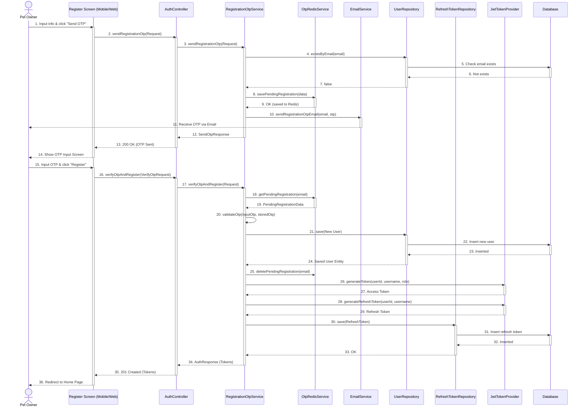
```mermaid
sequenceDiagram
    actor User as Pet Owner
    participant UI as Register Screen (Mobile/Web)
    participant AC as AuthController
    participant ROS as RegistrationOtpService
    participant ORS as OtpRedisService
    participant ES as EmailService
    participant UR as UserRepository
    participant RTR as RefreshTokenRepository
    participant JTP as JwtTokenProvider
    participant DB as Database

    User->>UI: 1. Input info & click "Send OTP"
    activate UI
    UI->>AC: 2. sendRegistrationOtp(Request)
    activate AC
    AC->>ROS: 3. sendRegistrationOtp(Request)
    activate ROS
    ROS->>UR: 4. existsByEmail(email)
    activate UR
    UR->>DB: 5. Check email exists
    activate DB
    DB-->>UR: 6. Not exists
    deactivate DB
    UR-->>ROS: 7. false
    deactivate UR
    ROS->>ORS: 8. savePendingRegistration(data)
    activate ORS
    ORS-->>ROS: 9. OK (saved to Redis)
    deactivate ORS
    ROS->>ES: 10. sendRegistrationOtpEmail(email, otp)
    activate ES
    ES-->>User: 11. Receive OTP via Email
    deactivate ES
    ROS-->>AC: 12. SendOtpResponse
    deactivate ROS
    AC-->>UI: 13. 200 OK (OTP Sent)
    deactivate AC
    UI-->>User: 14. Show OTP Input Screen
    deactivate UI

    User->>UI: 15. Input OTP & click "Register"
    activate UI
    UI->>AC: 16. verifyOtpAndRegister(VerifyOtpRequest)
    activate AC
    AC->>ROS: 17. verifyOtpAndRegister(Request)
    activate ROS
    ROS->>ORS: 18. getPendingRegistration(email)
    activate ORS
    ORS-->>ROS: 19. PendingRegistrationData
    deactivate ORS
    ROS->>ROS: 20. validateOtp(inputOtp, storedOtp)
    ROS->>UR: 21. save(New User)
    activate UR
    UR->>DB: 22. Insert new user
    activate DB
    DB-->>UR: 23. Inserted
    deactivate DB
    UR-->>ROS: 24. Saved User Entity
    deactivate UR
    ROS->>ORS: 25. deletePendingRegistration(email)
    ROS->>JTP: 26. generateToken(userId, username, role)
    activate JTP
    JTP-->>ROS: 27. Access Token
    deactivate JTP
    ROS->>JTP: 28. generateRefreshToken(userId, username)
    activate JTP
    JTP-->>ROS: 29. Refresh Token
    deactivate JTP
    ROS->>RTR: 30. save(RefreshToken)
    activate RTR
    RTR->>DB: 31. Insert refresh token
    activate DB
    DB-->>RTR: 32. Inserted
    deactivate DB
    RTR-->>ROS: 33. OK
    deactivate RTR
    ROS-->>AC: 34. AuthResponse (Tokens)
    deactivate ROS
    AC-->>UI: 35. 201 Created (Tokens)
    deactivate AC
    UI-->>User: 36. Redirect to Home Page
    deactivate UI
```

#### 4.1.3 Login with Username/Password

**Sequence Diagram:**

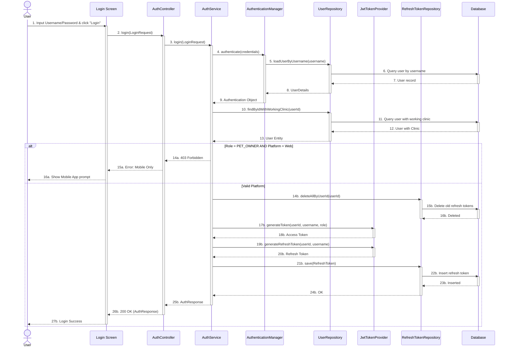
```mermaid
sequenceDiagram
    actor User as User
    participant UI as Login Screen
    participant AC as AuthController
    participant AS as AuthService
    participant AM as AuthenticationManager
    participant UR as UserRepository
    participant JTP as JwtTokenProvider
    participant RTR as RefreshTokenRepository
    participant DB as Database

    User->>UI: 1. Input Username/Password & click "Login"
    activate UI
    UI->>AC: 2. login(LoginRequest)
    activate AC
    AC->>AS: 3. login(LoginRequest)
    activate AS
    AS->>AM: 4. authenticate(credentials)
    activate AM
    AM->>UR: 5. loadUserByUsername(username)
    activate UR
    UR->>DB: 6. Query user by username
    activate DB
    DB-->>UR: 7. User record
    deactivate DB
    UR-->>AM: 8. UserDetails
    deactivate UR
    AM-->>AS: 9. Authentication Object
    deactivate AM
    
    AS->>UR: 10. findByIdWithWorkingClinic(userId)
    activate UR
    UR->>DB: 11. Query user with working clinic
    activate DB
    DB-->>UR: 12. User with Clinic
    deactivate DB
    UR-->>AS: 13. User Entity
    deactivate UR
    
    alt Role = PET_OWNER AND Platform = Web
        AS-->>AC: 14a. 403 Forbidden
        AC-->>UI: 15a. Error: Mobile Only
        UI-->>User: 16a. Show Mobile App prompt
    else Valid Platform
        AS->>RTR: 14b. deleteAllByUserId(userId)
        activate RTR
        RTR->>DB: 15b. Delete old refresh tokens
        activate DB
        DB-->>RTR: 16b. Deleted
        deactivate DB
        deactivate RTR
        AS->>JTP: 17b. generateToken(userId, username, role)
        activate JTP
        JTP-->>AS: 18b. Access Token
        deactivate JTP
        AS->>JTP: 19b. generateRefreshToken(userId, username)
        activate JTP
        JTP-->>AS: 20b. Refresh Token
        deactivate JTP
        AS->>RTR: 21b. save(RefreshToken)
        activate RTR
        RTR->>DB: 22b. Insert refresh token
        activate DB
        DB-->>RTR: 23b. Inserted
        deactivate DB
        RTR-->>AS: 24b. OK
        deactivate RTR
        AS-->>AC: 25b. AuthResponse
        deactivate AS
        AC-->>UI: 26b. 200 OK (AuthResponse)
        deactivate AC
        UI-->>User: 27b. Login Success
        deactivate UI
    end
```

#### 4.1.4 Sign in with Google Account

**Sequence Diagram:**

```mermaid
sequenceDiagram
    actor User as User
    participant UI as Login Screen
    participant AC as AuthController
    participant AS as AuthService
    participant GAS as GoogleAuthService
    participant UR as UserRepository
    participant RTR as RefreshTokenRepository
    participant JTP as JwtTokenProvider
    participant DB as Database

    User->>UI: 1. Click "Sign in with Google"
    activate UI
    UI->>GAS: 2. Redirect to Google Sign-In
    GAS-->>UI: 3. Return ID Token
    UI->>AC: 4. googleSignIn(idToken, platform)
    activate AC
    AC->>AS: 5. loginWithGoogle(request)
    activate AS
    AS->>GAS: 6. verifyIdToken(idToken)
    activate GAS
    GAS-->>AS: 7. GoogleUserInfo (email, name, picture)
    deactivate GAS
    AS->>UR: 8. findByEmail(email)
    activate UR
    UR->>DB: 9. Query user by email
    activate DB
    DB-->>UR: 10. Result Set
    deactivate DB
    UR-->>AS: 11. Optional~User~
    deactivate UR
    
    alt User not exists
        AS->>AS: 12a. createUserFromGoogle(info, platform)
        AS->>UR: 13a. save(New User)
        activate UR
        UR->>DB: 14a. Insert new user
        activate DB
        DB-->>UR: 15a. Inserted
        deactivate DB
        UR-->>AS: 16a. Saved User
        deactivate UR
    end
    
    AS->>AS: 17. validateRolePlatformAccess(role, platform)
    
    alt Role-Platform Mismatch
        AS-->>AC: 18a. 403 Forbidden
        AC-->>UI: 19a. Error (Role mismatch)
        UI-->>User: 20a. Show error message
    else Valid Access
        AS->>RTR: 18b. deleteAllByUserId(userId)
        activate RTR
        RTR->>DB: 19b. Delete old refresh tokens
        activate DB
        DB-->>RTR: 20b. Deleted
        deactivate DB
        deactivate RTR
        AS->>JTP: 21b. generateToken(userId, username, role)
        activate JTP
        JTP-->>AS: 22b. Access Token
        deactivate JTP
        AS->>JTP: 23b. generateRefreshToken(userId, username)
        activate JTP
        JTP-->>AS: 24b. Refresh Token
        deactivate JTP
        AS->>RTR: 25b. save(RefreshToken)
        activate RTR
        RTR->>DB: 26b. Insert refresh token
        activate DB
        DB-->>RTR: 27b. Inserted
        deactivate DB
        RTR-->>AS: 28b. OK
        deactivate RTR
        AS-->>AC: 29b. AuthResponse
        AC-->>UI: 30b. 200 OK (tokens)
        UI-->>User: 31b. Login Successful
    end
    deactivate AS
    deactivate AC
    deactivate UI
```

#### 4.1.5 Forgot & Reset Password

**Sequence Diagram:**

```mermaid
sequenceDiagram
    actor User as User
    participant UI as Forgot Password Screen
    participant AC as AuthController
    participant PS as PasswordResetService
    participant ORS as OtpRedisService
    participant ES as EmailService
    participant UR as UserRepository
    participant DB as Database

    User->>UI: 1. Input Email & click "Send OTP"
    activate UI
    UI->>AC: 2. forgotPassword(ForgotPasswordRequest)
    activate AC
    AC->>PS: 3. sendPasswordResetOtp(request)
    activate PS
    PS->>UR: 4. findByEmail(email)
    activate UR
    UR->>DB: 5. Query user by email
    activate DB
    DB-->>UR: 6. User record
    deactivate DB
    UR-->>PS: 7. User Entity
    deactivate UR
    PS->>ORS: 8. getPasswordResetCooldownRemaining(email)
    activate ORS
    ORS-->>PS: 9. 0 (no cooldown)
    deactivate ORS
    PS->>ORS: 10. savePasswordResetOtp(email, otp)
    activate ORS
    ORS-->>PS: 11. OK (saved to Redis)
    deactivate ORS
    PS->>ES: 12. sendPasswordResetOtpEmail(email, otp)
    activate ES
    ES-->>User: 13. Receive OTP via Email
    deactivate ES
    PS-->>AC: 14. SendOtpResponse
    deactivate PS
    AC-->>UI: 15. 200 OK (OTP Sent)
    deactivate AC
    UI-->>User: 16. Show Reset Password Form
    deactivate UI

    User->>UI: 17. Input OTP & New Password
    activate UI
    UI->>AC: 18. resetPassword(ResetPasswordRequest)
    activate AC
    AC->>PS: 19. verifyOtpAndResetPassword(request)
    activate PS
    PS->>ORS: 20. getPasswordResetOtp(email)
    activate ORS
    ORS-->>PS: 21. PasswordResetOtpData
    deactivate ORS
    PS->>PS: 22. validateOtp(inputOtp, storedOtp)
    PS->>UR: 23. findByEmail(email)
    activate UR
    UR->>DB: 24. Query user by email
    activate DB
    DB-->>UR: 25. User record
    deactivate DB
    UR-->>PS: 26. User Entity
    deactivate UR
    PS->>PS: 27. passwordEncoder.encode(newPassword)
    PS->>UR: 28. save(User with new password)
    activate UR
    UR->>DB: 29. Update user password
    activate DB
    DB-->>UR: 30. Updated
    deactivate DB
    UR-->>PS: 31. OK
    deactivate UR
    PS->>ORS: 32. deletePasswordResetOtp(email)
    PS-->>AC: 33. MessageResponse (Success)
    deactivate PS
    AC-->>UI: 34. 200 OK (Password Reset Success)
    deactivate AC
    UI-->>User: 35. Redirect to Login
    deactivate UI
```

#### 4.1.6 Logout & Session Management

**Sequence Diagram:**

```mermaid
sequenceDiagram
    actor User as User
    participant UI as App/Web
    participant AC as AuthController
    participant AS as AuthService
    participant JTP as JwtTokenProvider
    participant BTR as BlacklistedTokenRepository
    participant RTR as RefreshTokenRepository
    participant DB as Database

    User->>UI: 1. Click "Logout"
    activate UI
    UI->>AC: 2. logout(Authorization: Bearer accessToken)
    activate AC
    AC->>AS: 3. logout(accessToken)
    activate AS
    AS->>JTP: 4. validateToken(accessToken)
    activate JTP
    JTP-->>AS: 5. Valid
    deactivate JTP
    AS->>JTP: 6. getUserIdFromToken(accessToken)
    activate JTP
    JTP-->>AS: 7. userId
    deactivate JTP
    AS->>AS: 8. Create BlacklistedToken (hash token)
    AS->>BTR: 9. save(BlacklistedToken)
    activate BTR
    BTR->>DB: 10. Insert blacklisted token
    activate DB
    DB-->>BTR: 11. Inserted
    deactivate DB
    BTR-->>AS: 12. OK
    deactivate BTR
    AS->>RTR: 13. deleteAllByUserId(userId)
    activate RTR
    RTR->>DB: 14. Delete all refresh tokens
    activate DB
    DB-->>RTR: 15. Deleted
    deactivate DB
    RTR-->>AS: 16. OK
    deactivate RTR
    AS-->>AC: 17. Success
    deactivate AS
    AC-->>UI: 18. 200 OK
    deactivate AC
    UI->>UI: 19. Clear local storage (tokens)
    UI-->>User: 20. Redirect to Login Screen
    deactivate UI
```

---

### 4.2 User Profile Management

#### 4.2.1 Class Diagram - User Profile

```mermaid
classDiagram
    class UserController {
        -UserService userService
        -AuthService authService
        -EmailChangeService emailChangeService
        +getProfile() ResponseEntity
        +updateProfile(UpdateProfileRequest) ResponseEntity
        +uploadAvatar(MultipartFile) ResponseEntity
        +deleteAvatar() ResponseEntity
        +changePassword(ChangePasswordRequest) ResponseEntity
        +requestEmailChange(EmailChangeRequest) ResponseEntity
        +verifyEmailChange(VerifyRequest) ResponseEntity
        +resendEmailChangeOtp() ResponseEntity
        +cancelEmailChange() ResponseEntity
    }

    class UserService {
        -UserRepository userRepository
        -CloudinaryService cloudinaryService
        -PasswordEncoder passwordEncoder
        +getUserById(UUID) UserResponse
        +updateProfile(UUID, UpdateProfileRequest) UserResponse
        +uploadAvatar(UUID, MultipartFile) UserResponse
        +deleteAvatar(UUID) UserResponse
        +changePassword(UUID, ChangePasswordRequest) void
    }

    class EmailChangeService {
        -UserRepository userRepository
        -OtpService otpService
        -EmailService emailService
        -OtpRedisService otpRedisService
        +requestEmailChange(UUID, String) String
        +verifyAndChangeEmail(UUID, String, String) UserResponse
        +resendEmailChangeOtp(UUID) String
        +cancelEmailChange(UUID) String
    }

    class UserRepository {
        <<interface>>
        +findById(UUID) Optional~User~
        +findByEmail(String) Optional~User~
        +existsByEmailAndUserIdNot(String, UUID) boolean
        +save(User) User
    }

    class User {
        +UUID userId
        +String username
        +String email
        +String phone
        +String fullName
        +String avatar
        +Role role
        +Clinic workingClinic
        +StaffSpecialty specialty
        +BigDecimal ratingAvg
        +Integer ratingCount
    }

    class AuthService {
        +getCurrentUser() User
    }

    class CloudinaryService {
        +uploadImage(MultipartFile, String folder) UploadResponse
        +deleteImage(String publicId) void
    }

    UserController --> UserService
    UserController --> AuthService
    UserController --> EmailChangeService
    UserService --> UserRepository
    UserService --> CloudinaryService
    EmailChangeService --> UserRepository
    EmailChangeService --> OtpRedisService
    EmailChangeService --> EmailService
    EmailChangeService --> OtpService
```

#### 4.2.2 Sequence Diagram: View & Update Profile (UC-PO-03, UC-VT-02, UC-CM-02)

```mermaid
sequenceDiagram
    actor U as User
    participant UI as Web/Mobile App
    participant UC as UserController
    participant AS as AuthService
    participant US as UserService
    participant CS as CloudinaryService
    participant UR as UserRepository
    participant DB as Database

    U->>UI: 1. Edit info or select new Avatar
    UI->>UC: 2. updateProfile(UserRequest) or uploadAvatar(file)
    activate UC
    UC->>AS: 3. getCurrentUser()
    activate AS
    AS-->>UC: 4. Current User Entity
    deactivate AS
    UC->>US: 5. updateProfile / uploadAvatar(userId, request)
    activate US
    
    alt is Avatar Upload
        US->>CS: 6a. uploadImage(file, "avatars")
        activate CS
        CS-->>US: 7a. URL + PublicID
        deactivate CS
    end

    US->>UR: 8. save(Updated User Entity)
    activate UR
    UR->>DB: 9. Update User Profile Data
    activate DB
    DB-->>UR: 10. Success
    deactivate DB
    UR-->>US: 11. Saved User
    deactivate UR
    US-->>UC: 12. UserResponse
    deactivate US
    UC-->>UI: 13. 200 OK (User Data)
    deactivate UC
    UI-->>U: 14. Update UI state
```

#### 4.2.3 Sequence Diagram: Change Password or Change Email (UC-PO-04, UC-VT-03)

##### Change Email with OTP Flow

```mermaid
sequenceDiagram
    actor U as User
    participant UI as Web/Mobile App
    participant UC as UserController
    participant AS as AuthService
    participant ECS as EmailChangeService
    participant ORS as OtpRedisService
    participant ES as EmailService
    participant UR as UserRepository
    participant DB as Database

    U->>UI: 1. Input new Email & click "Change"
    UI->>UC: 2. requestEmailChange(emailRequest)
    activate UC
    UC->>AS: 3. getCurrentUser()
    UC->>ECS: 4. requestEmailChange(userId, newEmail)
    activate ECS
    ECS->>ORS: 5. Check Cooldown (60s)
    Note over ECS, ORS: If cooldown active -> Error 400
    ECS->>ORS: 6. saveEmailChangeOtp(userId, newEmail, otp)
    ECS->>ES: 7. sendEmailChangeOtpEmail(newEmail, otp)
    ECS-->>UC: 8. Success message
    deactivate ECS
    UC-->>UI: 9. Show OTP Input
    deactivate UC

    U->>UI: 10. Input OTP
    UI->>UC: 11. verifyEmailChange(verifyRequest)
    activate UC
    UC->>AS: 12. getCurrentUser()
    UC->>ECS: 13. verifyEmailChange(userId, newEmail, otp)
    activate ECS
    ECS->>ORS: 14. getEmailChangeOtp(userId)
    Note over ECS, ORS: Validate OTP & Max Attempts (3 times)
    ORS-->>ECS: 15. Valid
    ECS->>UR: 16. save(Updated User Email)
    activate UR
    UR->>DB: 17. Update User Email
    activate DB
    DB-->>UR: 18. Success
    deactivate DB
    UR-->>ECS: 19. Saved User
    deactivate UR
    ECS->>ORS: 20. deleteEmailChangeOtp(userId)
    ECS-->>UC: 21. UserResponse
    deactivate ECS
    UC-->>UI: 22. 200 OK (Updated Profile)
    deactivate UC
```

##### Change Password Flow

```mermaid
sequenceDiagram
    actor U as User
    participant UI as Change Password Screen
    participant UC as UserController
    participant US as UserService
    participant AS as AuthService
    participant UR as UserRepository
    participant DB as Database

    U->>UI: 1. Input Current & New Password
    UI->>UC: 2. changePassword(request)
    activate UC
    UC->>AS: 3. getCurrentUser()
    activate AS
    AS-->>UC: 4. User Entity
    deactivate AS
    UC->>US: 5. changePassword(userId, request)
    activate US
    US->>UR: 6. findById(userId)
    activate UR
    UR-->>US: 7. User Entity
    deactivate UR
    US->>US: 8. Verify matches(currentPass, storedPass)
    alt Password Mismatch
        US-->>UC: 9a. Throw BadRequestException
        UC-->>UI: 10a. Error: Incorrect Password
    else Valid Matches
        US->>US: 9b. passwordEncoder.encode(newPass)
        US->>UR: 10b. save(User)
        activate UR
        UR->>DB: 11b. Update Password
        activate DB
        DB-->>UR: 12b. Updated
        deactivate DB
        UR-->>US: 13b. OK
        deactivate UR
        US-->>UC: 14b. Success
        deactivate US
        UC-->>UI: 15b. 200 OK
        deactivate UC
        UI-->>U: 16b. Success Message
    end
```

#### 4.2.4 Cross-Reference to SRS

| SDD Section | SRS Reference | Description |
|-------------|---------------|-------------|
| 4.2.1 Class Diagram | 3.3 User Profile & Account Setup | Overall module structure |
| 4.2.2 View & Update Profile | 3.3.1 (UC-PO-03, UC-VT-02, UC-CM-02) | View and update personal info & avatar |
| 4.2.3 Change Password or Change Email | 3.3.2 (UC-PO-04, UC-VT-03) | Change password and email with OTP |

---

### 4.4 Pet Profile Management

#### 4.4.1 Class Diagram - Pet Records

```mermaid
classDiagram
    class PetController {
        -PetService petService
        +getPets(String species, String breed, Pageable) ResponseEntity
        +getMyPets() ResponseEntity
        +getPet(UUID) ResponseEntity
        +createPet(PetRequest, MultipartFile) ResponseEntity
        +updatePet(UUID, PetRequest, MultipartFile) ResponseEntity
        +deletePet(UUID) ResponseEntity
    }

    class PetService {
        -PetRepository petRepository
        -AuthService authService
        -CloudinaryService cloudinaryService
        +createPet(PetRequest, MultipartFile) PetResponse
        +getMyPets() List~PetResponse~
        +getPet(UUID) PetResponse
        +updatePet(UUID, PetRequest, MultipartFile) PetResponse
        +deletePet(UUID) void
    }

    class PetRepository {
        <<interface>>
        +findById(UUID) Optional~Pet~
        +findByOwner(User) List~Pet~
        +save(Pet) Pet
        +delete(Pet) void
    }

    class Pet {
        +UUID id
        +String name
        +String species
        +String breed
        +LocalDate dateOfBirth
        +Double weight
        +String gender
        +String imageUrl
        +User owner
    }

    class CloudinaryService {
        +uploadImage(MultipartFile, String folder) UploadResponse
        +deleteImage(String publicId) void
    }

    PetController --> PetService
    PetService --> PetRepository
    PetRepository ..> Pet
    PetService --> CloudinaryService
```

#### 4.4.2 Add New Pet Record (UC-PO-04)

```mermaid
sequenceDiagram
    actor Owner as Pet Owner
    participant UI as Add Pet Screen (Mobile)
    participant PC as PetController
    participant PS as PetService
    participant AS as AuthService
    participant CS as CloudinaryService
    participant DB as Database

    Owner->>UI: 1. Input pet info & select image & click "Save"
    activate UI
    UI->>PC: 2. createPet(petRequest, imageFile)
    activate PC
    PC->>PS: 3. createPet(request, image)
    activate PS
    PS->>AS: 4. getCurrentUser()
    activate AS
    AS-->>PS: 5. User Entity
    deactivate AS
    alt Image is provided
        PS->>CS: 6a. uploadImage(image, "pets")
        activate CS
        CS-->>PS: 7a. UploadResponse (URL)
        deactivate CS
    end
    PS->>PR: 8. save(Pet Entity)
    activate PR
    PR-->>PS: 9. Saved Pet
    deactivate PR
    PS-->>PC: 10. PetResponse
    deactivate PS
    PC-->>UI: 11. PetResponse(created)
    deactivate PC
    UI-->>Owner: 12. Show new pet in list
    deactivate UI
```

#### 4.4.3 Update Pet Info (UC-PO-11)

```mermaid
sequenceDiagram
    actor Owner as Pet Owner
    participant UI as Edit Pet Screen (Mobile)
    participant PC as PetController
    participant PS as PetService
    participant CS as CloudinaryService
    participant DB as Database

    Owner->>UI: 1. Edit pet info & click "Save"
    activate UI
    UI->>PC: 2. updatePet(petId, petRequest, imageFile)
    activate PC
    PC->>PS: 3. updatePet(id, request, image)
    activate PS
    PS->>DB: 4. findById(id)
    activate DB
    DB-->>PS: 5. Pet Entity
    deactivate DB
    PS->>PS: 6. validateOwnership(pet, currentUser)
    alt New image provided
        PS->>CS: 7a. deleteImage(oldPublicId)
        activate CS
        CS-->>PS: 8a. OK
        PS->>CS: 9a. uploadImage(newImage, "pets")
        CS-->>PS: 10a. New URL
        deactivate CS
    end
    PS->>DB: 11. save(Updated Pet)
    activate DB
    DB-->>PS: 12. OK
    deactivate DB
    PS-->>PC: 13. PetResponse
    deactivate PS
    PC-->>UI: 14. PetResponse(updated)
    deactivate PC
    UI-->>Owner: 15. Show updated pet
    deactivate UI
```

#### 4.4.4 Delete Pet (UC-PO-26)

```mermaid
sequenceDiagram
    actor Owner as Pet Owner
    participant UI as Pet Detail Screen (Mobile)
    participant PC as PetController
    participant PS as PetService
    participant CS as CloudinaryService
    participant DB as Database

    Owner->>UI: 1. Click "Delete" & confirm
    activate UI
    UI->>PC: 2. deletePet(petId)
    activate PC
    PC->>PS: 3. deletePet(id)
    activate PS
    PS->>DB: 4. findById(id)
    activate DB
    DB-->>PS: 5. Pet Entity
    deactivate DB
    PS->>PS: 6. validateOwnership(pet, currentUser)
    alt Pet has image
        PS->>CS: 7a. deleteImage(publicId)
        activate CS
        CS-->>PS: 8a. OK
        deactivate CS
    end
    PS->>DB: 9. delete(Pet)
    activate DB
    DB-->>PS: 10. OK
    deactivate DB
    PS-->>PC: 11. 204 No Content
    deactivate PS
    PC-->>UI: 12. Success
    deactivate PC
    UI-->>Owner: 13. Remove pet from list
    deactivate UI
```


---

### 4.5 Patient Management

Module quản lý bệnh nhân (Patient) tại phòng khám. Cho phép Staff và Clinic Manager tìm kiếm, xem danh sách và chi tiết hồ sơ bệnh nhân.

#### 4.5.1 Class Diagram - Patient Management

```mermaid
classDiagram
    class PatientController {
        -PatientService patientService
        +searchPatients(UUID, String) ResponseEntity
        +getClinicPatients(UUID, Pageable) ResponseEntity
        +getPatientDetail(UUID) ResponseEntity
    }

    class PatientService {
        -PetRepository petRepository
        -BookingRepository bookingRepository
        -UserRepository userRepository
        +searchPatients(UUID, String) List~PatientResponse~
        +getClinicPatients(UUID, Pageable) Page~PatientResponse~
        +getPatientDetail(UUID) PatientDetailResponse
    }

    class PetRepository {
        <<interface>>
        +findById(UUID) Optional~Pet~
        +findByUserId(UUID) List~Pet~
    }

    class Pet {
        +UUID id
        +UUID userId
        +String name
        +String species
        +String breed
        +BigDecimal weight
        +String imageUrl
    }

    PatientController --> PatientService
    PatientService --> PetRepository
    PetRepository ..> Pet
```


#### 4.5.2 Lookup Patient (UC-VT-12)

```mermaid
sequenceDiagram
    actor V as Staff
    participant UI as Search Interface
    participant PC as PatientController
    participant PS as PatientService
    participant PR as PetRepository
    participant UR as UserRepository
    participant DB as PostgreSQL

    V->>UI: 1. Enter search query (name/owner/bookingId)
    activate UI
    UI->>PC: 2. GET /patients/search?q=query&clinicId=xxx
    activate PC
    PC->>PS: 3. searchPatients(clinicId, query)
    activate PS
    PS->>PR: 4. findByNameContainingAndClinicId(query, clinicId)
    activate PR
    PR->>DB: 5. SELECT pets WHERE name LIKE %query%
    activate DB
    DB-->>PR: 6. List<Pet>
    deactivate DB
    PR-->>PS: 7. Pets matching name
    deactivate PR
    PS->>UR: 8. findByNameContaining(query)
    activate UR
    UR->>DB: 9. SELECT users WHERE fullName LIKE %query%
    activate DB
    DB-->>UR: 10. List<User> (Owners)
    deactivate DB
    UR-->>PS: 11. Users matching
    deactivate UR
    PS->>PS: 12. Merge & filter by clinic visits
    PS-->>PC: 13. List<PatientSearchResponse>
    deactivate PS
    PC-->>UI: 14. 200 OK (paginated results)
    deactivate PC
    UI-->>V: 15. Display patient cards
    deactivate UI
```

#### 4.5.3 View Patient List (UC-CM-08)

```mermaid
sequenceDiagram
    actor M as Manager
    participant UI as Patient List Page
    participant PC as PatientController
    participant PS as PatientService
    participant BR as BookingRepository
    participant PR as PetRepository
    participant DB as PostgreSQL

    M->>UI: 1. Navigate to Patients Tab
    activate UI
    UI->>PC: 2. GET /patients?clinicId=xxx&page=0&size=20
    activate PC
    PC->>PS: 3. getPatientList(clinicId, filters, pageable)
    activate PS
    PS->>BR: 4. findDistinctPetsByClinicId(clinicId)
    activate BR
    BR->>DB: 5. SELECT DISTINCT pet_id FROM bookings WHERE clinic_id=xxx
    activate DB
    DB-->>BR: 6. List<UUID> petIds
    deactivate DB
    BR-->>PS: 7. Pet IDs
    deactivate BR
    PS->>PR: 8. findAllById(petIds)
    activate PR
    PR->>DB: 9. SELECT * FROM pets WHERE id IN (...)
    activate DB
    DB-->>PR: 10. List<Pet>
    deactivate DB
    PR-->>PS: 11. Pets with owner info
    deactivate PR
    PS->>PS: 12. Aggregate visit counts & last visit dates
    PS-->>PC: 13. Page<PatientListResponse>
    deactivate PS
    PC-->>UI: 14. 200 OK (paginated list)
    deactivate PC
    UI-->>M: 15. Render patient table with filters
    deactivate UI
```

#### 4.5.4 View Patient Records (UC-CM-09)

```mermaid
sequenceDiagram
    actor M as Manager
    participant UI as Patient Detail Page
    participant PC as PatientController
    participant PS as PatientService
    participant PR as PetRepository
    participant ER as EMRRepository
    participant VR as VaccinationRepository
    participant PG as PostgreSQL
    participant MG as MongoDB

    M->>UI: 1. Click patient row -> View Records
    activate UI
    UI->>PC: 2. GET /patients/{petId}/records?clinicId=xxx
    activate PC
    PC->>PS: 3. getPatientRecords(petId, clinicId)
    activate PS
    PS->>PR: 4. findById(petId)
    activate PR
    PR->>PG: 5. Query pet profile
    activate PG
    PG-->>PR: 6. Pet Entity
    deactivate PG
    PR-->>PS: 7. Pet with owner
    deactivate PR
    PS->>ER: 8. findByPetIdAndClinicId(petId, clinicId)
    activate ER
    ER->>MG: 9. Query EMR documents
    activate MG
    MG-->>ER: 10. List<EMRRecord>
    deactivate MG
    ER-->>PS: 11. EMR history
    deactivate ER
    PS->>VR: 12. findByPetId(petId)
    activate VR
    VR->>MG: 13. Query vaccination documents
    activate MG
    MG-->>VR: 14. List<VaccinationRecord>
    deactivate MG
    VR-->>PS: 15. Vaccination history
    deactivate VR
    PS->>PS: 16. Build timeline & aggregate
    PS-->>PC: 17. PatientRecordsResponse
    deactivate PS
    PC-->>UI: 18. 200 OK (full history)
    deactivate PC
    UI-->>M: 19. Render timeline, tabs, export button
    deactivate UI
```

---

### 4.6 EMR & Vaccination Management

#### 4.6.1 Class Diagram - EMR

```mermaid
classDiagram
    class PatientController {
        -PatientService patientService
        +searchPatients(UUID, String) ResponseEntity
        +getPetMedicalHistory(UUID) ResponseEntity
        +createEMR(UUID, EMRRequest) ResponseEntity
        +addVaccinationRecord(UUID, VaccinationRequest) ResponseEntity
    }

    class PatientService {
        -PetRepository petRepository
        -EMRRepository emrRepository
        -VaccinationRepository vaccinationRepository
        -BookingRepository bookingRepository
        +searchPatients(UUID, String) List~PatientResponse~
        +getPetMedicalHistory(UUID, UUID) PetHistoryResponse
        +createEMR(UUID, EMRRequest) EMRResponse
        +addVaccinationRecord(UUID, VaccinationRequest) VaccinationResponse
    }

    class EMRRepository {
        <<interface>>
        +findById(UUID) Optional~EMR~
        +findByPet(Pet) List~EMR~
        +save(EMR) EMR
    }

    class VaccinationRepository {
        <<interface>>
        +findByPet(Pet) List~Vaccination~
        +save(Vaccination) Vaccination
    }

    class EMR {
        +UUID emrId
        +Booking booking
        +Pet pet
        +String subjective
        +String objective
        +String assessment
        +String plan
        +List~ClinicService~ additionalServices
        +List~IncurredCost~ miscCosts
    }

    class IncurredCost {
        +UUID costId
        +String itemName
        +BigDecimal amount
        +Integer quantity
    }

    class Vaccination {
        +UUID vaccinationId
        +Pet pet
        +String vaccineName
        +LocalDate administeredDate
        +LocalDate nextDueDate
    }

    PatientController --> PatientService
    PatientService --> EMRRepository
    PatientService --> VaccinationRepository
    EMRRepository ..> EMR
    EMR --> IncurredCost
    VaccinationRepository ..> Vaccination
```

#### 4.6.2 View Pet Medical History (Cross-Clinic) (UC-VT-02)

```mermaid
sequenceDiagram
    actor V as Staff
    participant UI as Staff Dashboard
    participant PC as PatientController
    participant PS as PatientService
    participant BR as BookingRepository
    participant EMRR as EMRRepository
    participant VR as VaccinationRepository
    participant DB as Database

    V->>UI: 1. Search Pet or Select from Booking
    activate UI
    UI->>PC: 2. getPetMedicalHistory(petId)
    activate PC
    PC->>PS: 3. getPetMedicalHistory(petId, clinicId)
    activate PS
    PS->>BR: 4. Check entitlement (petId, clinicId)
    activate BR
    BR->>DB: 5. Query pet bookings for clinic
    activate DB
    DB-->>BR: 6. Booking exists
    deactivate DB
    BR-->>PS: 7. Confirmed
    deactivate BR
    PS->>EMRR: 8. findByPet(petId)
    activate EMRR
    EMRR->>DB: 9. Query EMR records for pet
    activate DB
    DB-->>EMRR: 10. EMR List
    deactivate DB
    EMRR-->>PS: 11. List<EMR>
    deactivate EMRR
    PS->>VR: 12. findByPet(petId)
    activate VR
    VR->>DB: 13. Query vaccination records for pet
    activate DB
    DB-->>VR: 14. Vaccination List
    deactivate DB
    VR-->>PS: 15. List<Vaccination>
    deactivate VR
    PS-->>PC: 16. PetHistoryResponse
    deactivate PS
    PC-->>UI: 17. 200 OK
    deactivate PC
    UI-->>V: 18. Display history timeline
    deactivate UI
```

#### 4.6.3 Create EMR (SOAP Notes) (EMR-2, UC-VT-06)

```mermaid
sequenceDiagram
    actor V as Staff
    participant UI as EMR Form (Mobile/Web)
    participant PC as PatientController
    participant PS as PatientService
    participant BR as BookingRepository
    participant PR as PetRepository
    participant EMRR as EMRRepository
    participant DB as Database

    V->>UI: 1. Fill SOAP form (S, O, A, P + Weight)
    activate UI
    UI->>PC: 2. createEMR(bookingId, EMRRequest)
    activate PC
    PC->>PS: 3. createEMR(bookingId, request)
    activate PS
    PS->>BR: 4. findById(bookingId)
    activate BR
    BR->>DB: 5. Query booking by ID
    activate DB
    DB-->>BR: 6. Booking Entity
    deactivate DB
    BR-->>PS: 7. Booking
    deactivate BR
    PS->>PS: 8. Validate status == IN_PROGRESS
    PS->>PS: 9. Validate Staff is assigned
    PS->>EMRR: 10. save(EMR: subjective, objective, assessment, plan)
    activate EMRR
    EMRR->>DB: 11. Insert new EMR record
    activate DB
    DB-->>EMRR: 12. Inserted
    deactivate DB
    EMRR-->>PS: 13. Saved EMR
    deactivate EMRR
    PS->>PR: 14. updatePetWeight(petId, newWeight)
    activate PR
    PR->>DB: 15. Update pet weight
    activate DB
    DB-->>PR: 16. Updated
    deactivate DB
    PR-->>PS: 17. OK
    deactivate PR
    PS-->>PC: 18. EMRResponse
    deactivate PS
    PC-->>UI: 19. 201 Created
    deactivate PC
    UI-->>V: 20. Show success & update medical timeline
    deactivate UI
```

#### 4.6.4 Add Vaccination Record (UC-VT-08)

```mermaid
sequenceDiagram
    actor V as Staff
    participant UI as Vaccination Form
    participant PC as PatientController
    participant PS as PatientService
    participant PR as PetRepository
    participant VR as VaccinationRepository
    participant DB as Database

    V->>UI: 1. Fill vaccine info & click "Add"
    activate UI
    UI->>PC: 2. addVaccinationRecord(petId, vaccinationRequest)
    activate PC
    PC->>PS: 3. addVaccinationRecord(petId, request)
    activate PS
    PS->>PR: 4. findById(petId)
    activate PR
    PR->>DB: 5. Query pet by ID
    activate DB
    DB-->>PR: 6. Pet Entity
    deactivate DB
    PR-->>PS: 7. Pet
    deactivate PR
    PS->>PS: 8. Validate entitlement
    PS->>VR: 9. save(Vaccination entity)
    activate VR
    VR->>DB: 10. Insert vaccination record
    activate DB
    DB-->>VR: 11. Inserted
    deactivate DB
    VR-->>PS: 12. Saved Vaccination
    deactivate VR
    PS-->>PC: 13. VaccinationResponse
    deactivate PS
    PC-->>UI: 14. 201 Created
    deactivate PC
    UI-->>V: 15. Update vaccination card
    deactivate UI
```

#### 4.6.5 Additional Service & Incurred Costs (UC-VT-10)

```mermaid
sequenceDiagram
    actor V as Staff
    participant UI as EMR Interface
    participant PC as PatientController
    participant PS as PatientService
    participant SR as ServiceRepository
    participant BR as BookingRepository
    participant DB as Database

    alt Standard Service
        V->>UI: 1a. Select from Clinic Catalog
        UI->>PC: 2a. addAdditionalService(bookingId, serviceId)
        PC->>PS: 3a. addAdditionalService(...)
        PS->>SR: 4a. findById(serviceId)
        activate SR
        SR->>DB: 5a. Query clinic service by ID
        activate DB
        DB-->>SR: 6a. Service Entity (Price)
        deactivate DB
        SR-->>PS: 7a. Service
        deactivate SR
    else Custom Incurred Cost
        V->>UI: 1b. Type name & manual price
        UI->>PC: 2b. addIncurredCost(bookingId, costRequest)
        PC->>PS: 3b. addIncurredCost(...)
        Note over PS: Create IncurredCost entity
    end

    PS->>BR: 8. findById(bookingId)
    activate BR
    BR->>DB: 9. Query booking by ID
    activate DB
    DB-->>BR: 10. Booking Entity
    deactivate DB
    BR-->>PS: 11. Booking
    deactivate BR
    
    PS->>PS: 12. Recalculate totalPrice
    Note over PS: Total = Base + Surcharge + Services + Misc
    
    PS->>BR: 13. save(Updated Booking)
    activate BR
    BR->>DB: 14. Update booking total price
    activate DB
    DB-->>BR: 15. Updated
    deactivate DB
    BR-->>PS: 16. OK
    deactivate BR
    
    PS-->>PC: 17. Success
    PC-->>UI: 18. 200 OK (Updated Balance)
    UI-->>V: 19. Update UI with new Total
```

#### 4.6.6 Add Vaccination Record (UC-VT-08)

```mermaid
sequenceDiagram
    actor V as Staff
    participant UI as EMR/Health Hub
    participant PC as PatientController
    participant PS as PatientService
    participant VR as VaccinationRepository
    participant PR as PetRepository
    participant DB as MongoDB

    V->>UI: 1. Click "Add Vaccination"
    activate UI
    V->>UI: 2. Enter: VaccineName, BatchNo, Date, NextDue
    UI->>PC: 3. POST /vaccinations (VaccinationRequest)
    activate PC
    PC->>PS: 4. addVaccinationRecord(petId, request)
    activate PS
    PS->>PR: 5. findById(petId)
    activate PR
    PR-->>PS: 6. Pet Entity
    deactivate PR
    PS->>VR: 7. save(VaccinationRecord)
    activate VR
    VR->>DB: 8. Insert vaccination document
    activate DB
    DB-->>VR: 9. Saved
    deactivate DB
    VR-->>PS: 10. VaccinationRecord
    deactivate VR
    PS->>PS: 11. Schedule reminder notification
    PS-->>PC: 12. VaccinationResponse
    deactivate PS
    PC-->>UI: 13. 201 Created
    deactivate PC
    UI-->>V: 14. Show success & update Health Badge
    deactivate UI
```

---

### 4.7 Service Management

Module quản lý dịch vụ phòng khám (Clinic Services) và dịch vụ mẫu hệ thống (Master Services). Cho phép Clinic Owner tạo, chỉnh sửa, xóa dịch vụ của phòng khám; Admin quản lý danh sách dịch vụ mẫu.

#### 4.7.1 Class Diagram - Service Management

```mermaid
classDiagram
    class ClinicServiceController {
        -ClinicServiceService clinicServiceService
        -VaccineDosePriceService vaccineDosePriceService
        +createService(ClinicServiceRequest) ResponseEntity
        +getAllServices() ResponseEntity
        +getServiceById(UUID) ResponseEntity
        +updateService(UUID, ClinicServiceUpdateRequest) ResponseEntity
        +deleteService(UUID, UUID) ResponseEntity
        +updateServiceStatus(UUID, Boolean) ResponseEntity
        +updateHomeVisitStatus(UUID, Boolean) ResponseEntity
        +inheritFromMasterService(UUID, UUID, BigDecimal, BigDecimal) ResponseEntity
        +getServicesByClinicId(UUID) ResponseEntity
        +getCompatibleServices(UUID, PetSpecies, Boolean) ResponseEntity
        +getDosePrices(UUID) ResponseEntity
        +setDosePrice(UUID, Integer, String, BigDecimal) ResponseEntity
    }

    class MasterServiceController {
        -MasterServiceService masterServiceService
        +createMasterService(MasterServiceRequest) ResponseEntity
        +getAllMasterServices() ResponseEntity
        +getMasterServiceById(UUID) ResponseEntity
        +updateMasterService(UUID, MasterServiceUpdateRequest) ResponseEntity
        +deleteMasterService(UUID) ResponseEntity
        +searchMasterServices(String) ResponseEntity
        +getMasterServicesByCategory(String) ResponseEntity
        +getMasterServicesByPetType(String) ResponseEntity
    }

    class ClinicServiceService {
        -ClinicServiceRepository serviceRepository
        -MasterServiceRepository masterServiceRepository
        +createService(ClinicServiceRequest) ClinicServiceResponse
        +getAllServices() List~ClinicServiceResponse~
        +getServiceById(UUID) ClinicServiceResponse
        +updateService(UUID, ClinicServiceUpdateRequest) ClinicServiceResponse
        +deleteService(UUID, UUID) void
        +updateServiceStatus(UUID, Boolean) ClinicServiceResponse
        +inheritFromMasterService(UUID, UUID, BigDecimal, BigDecimal) ClinicServiceResponse
        +getCompatibleServices(UUID, PetSpecies, Boolean) List~ClinicServiceResponse~
    }

    class MasterServiceService {
        -MasterServiceRepository masterServiceRepository
        +createMasterService(MasterServiceRequest) MasterServiceResponse
        +getAllMasterServices() List~MasterServiceResponse~
        +getMasterServiceById(UUID) MasterServiceResponse
        +updateMasterService(UUID, MasterServiceUpdateRequest) MasterServiceResponse
        +deleteMasterService(UUID) void
        +searchMasterServicesByName(String) List~MasterServiceResponse~
    }

    class VaccineDosePriceService {
        -VaccineDosePriceRepository dosePriceRepository
        +getDosePrices(UUID) List~VaccineDosePriceDTO~
        +setDosePrice(UUID, Integer, String, BigDecimal) VaccineDosePriceDTO
        +deleteDosePrice(UUID, Integer) void
    }

    class ClinicServiceRepository {
        <<interface>>
        +findById(UUID) Optional~ClinicService~
        +findByClinicId(UUID) List~ClinicService~
        +save(ClinicService) ClinicService
        +deleteById(UUID) void
    }

    class MasterServiceRepository {
        <<interface>>
        +findById(UUID) Optional~MasterService~
        +findAll() List~MasterService~
        +findByNameContaining(String) List~MasterService~
    }

    class ClinicService {
        +UUID serviceId
        +UUID clinicId
        +UUID masterServiceId
        +Boolean isCustom
        +String name
        +String description
        +BigDecimal basePrice
        +Integer durationTime
        +Integer slotsRequired
        +Boolean isActive
        +Boolean isHomeVisit
        +ServiceCategory serviceCategory
    }

    class MasterService {
        +UUID masterServiceId
        +String name
        +String description
        +BigDecimal defaultPrice
        +Integer durationTime
        +Boolean isHomeVisit
        +String serviceCategory
        +String petType
    }

    class ServiceCategory {
        <<enumeration>>
        GROOMING_SPA
        VACCINATION
        CHECK_UP
        SURGERY
        DENTAL
        DERMATOLOGY
        OTHER
    }

    ClinicServiceController --> ClinicServiceService
    ClinicServiceController --> VaccineDosePriceService
    MasterServiceController --> MasterServiceService
    ClinicServiceService --> ClinicServiceRepository
    MasterServiceService --> MasterServiceRepository
    ClinicServiceRepository ..> ClinicService
    MasterServiceRepository ..> MasterService
    ClinicService --> ServiceCategory
```

#### 4.7.2 Create Service

> **Sequence Diagram:** TODO - Clinic Owner tạo dịch vụ mới cho phòng khám.

#### 4.7.3 Create Master Service

> **Sequence Diagram:** TODO - Admin tạo dịch vụ mẫu hệ thống.

#### 4.7.4 Update Service

> **Sequence Diagram:** TODO - Clinic Owner cập nhật thông tin dịch vụ.

#### 4.7.5 Update Master Service

> **Sequence Diagram:** TODO - Admin cập nhật dịch vụ mẫu.

#### 4.7.6 Delete Service

> **Sequence Diagram:** TODO - Clinic Owner xóa dịch vụ phòng khám.

#### 4.7.7 Delete Master Service

> **Sequence Diagram:** TODO - Admin xóa dịch vụ mẫu.

#### 4.7.8 View All Service

> **Sequence Diagram:** TODO - Xem danh sách dịch vụ của phòng khám.

#### 4.7.9 View All Master Service

> **Sequence Diagram:** TODO - Xem danh sách dịch vụ mẫu hệ thống.

#### 4.7.10 View Detail Service

> **Sequence Diagram:** TODO - Xem chi tiết dịch vụ phòng khám.

#### 4.7.11 View Detail Master Service

> **Sequence Diagram:** TODO - Xem chi tiết dịch vụ mẫu.

#### 4.7.12 Inheritance Master Service For Clinics

> **Sequence Diagram:** TODO - Clinic Owner kế thừa dịch vụ mẫu cho phòng khám.


---

### 4.8 Chat Management

Module quản lý tin nhắn giữa Pet Owner và Clinic (1-1 chat). Hỗ trợ gửi tin nhắn text, hình ảnh, đánh dấu đã đọc, và WebSocket real-time.

#### 4.8.1 Class Diagram - Chat Management

```mermaid
classDiagram
    class ChatController {
        -ChatService chatService
        -AuthService authService
        -CloudinaryService cloudinaryService
        +createOrGetConversation(CreateConversationRequest) ResponseEntity
        +getConversations(int, int) ResponseEntity
        +getConversation(String) ResponseEntity
        +getMessages(String, int, int) ResponseEntity
        +sendMessage(String, SendMessageRequest) ResponseEntity
        +sendMessageWithFile(String, String, MultipartFile) ResponseEntity
        +uploadImage(String, MultipartFile) ResponseEntity
        +markAsRead(String) ResponseEntity
        +getUnreadCount() ResponseEntity
    }

    class ChatService {
        -ChatConversationRepository conversationRepo
        -ChatMessageRepository messageRepo
        -SimpMessagingTemplate messagingTemplate
        +createOrGetConversation(UUID, CreateConversationRequest) ConversationResponse
        +getConversations(UUID, Role, Pageable) Page~ConversationResponse~
        +getConversation(String, UUID) ConversationResponse
        +sendMessage(String, UUID, SenderType, SendMessageRequest) MessageResponse
        +getMessages(String, UUID, Pageable) Page~MessageResponse~
        +markAsRead(String, UUID) void
        +getUnreadCount(UUID, Role) UnreadCountResponse
    }

    class ChatConversationRepository {
        <<interface>>
        +findByPetOwnerIdAndClinicId(UUID, UUID) Optional~ChatConversation~
        +findByPetOwnerId(UUID) List~ChatConversation~
        +findByClinicId(UUID) List~ChatConversation~
    }

    class ChatConversation {
        +ObjectId id
        +UUID petOwnerId
        +UUID clinicId
        +String lastMessage
        +DateTime lastMessageAt
        +String status
    }

    class ChatMessage {
        +ObjectId id
        +ObjectId chatBoxId
        +UUID senderId
        +String senderType
        +String content
        +String messageType
        +Boolean isRead
    }

    ChatController --> ChatService
    ChatService --> ChatConversationRepository
    ChatConversationRepository ..> ChatConversation
    ChatConversation --* ChatMessage
```

#### 4.8.2 Create Conversation

> **Sequence Diagram:** TODO - Pet Owner tạo cuộc hội thoại mới với phòng khám.

#### 4.8.3 View All Conversation

> **Sequence Diagram:** TODO - Xem danh sách tất cả cuộc hội thoại.

#### 4.8.4 Delete Message

> **Sequence Diagram:** TODO - Xóa tin nhắn trong cuộc hội thoại.

#### 4.8.5 Send Message

> **Sequence Diagram:** TODO - Gửi tin nhắn text/hình ảnh trong cuộc hội thoại.

#### 4.8.6 View Chat History

> **Sequence Diagram:** TODO - Xem lịch sử tin nhắn trong cuộc hội thoại.

#### 4.8.7 Create Auto Reply

> **Sequence Diagram:** TODO - Clinic tạo tin nhắn tự động trả lời.

#### 4.8.8 Update Auto Reply Message

> **Sequence Diagram:** TODO - Clinic cập nhật tin nhắn tự động trả lời.


---

### 4.9 Booking Review Management

Module quản lý đánh giá (review) sau khi hoàn tất booking. Pet Owner có thể đánh giá phòng khám theo rating (1-5 sao) và nhận xét. Điểm đánh giá trung bình được cập nhật vào Clinic profile.

#### 4.9.1 Class Diagram - Booking Review Management

```mermaid
classDiagram
    class ReviewController {
        -ReviewService reviewService
        -UserRepository userRepository
        +createReview(ReviewRequestDTO) ResponseEntity
        +updateReview(UUID, ReviewRequestDTO) ResponseEntity
        +deleteReview(UUID) ResponseEntity
        +getClinicReviews(UUID) ResponseEntity
    }

    class ReviewService {
        -ReviewRepository reviewRepository
        -BookingRepository bookingRepository
        -ClinicRepository clinicRepository
        +createReview(User, ReviewRequestDTO) ReviewResponseDTO
        +updateReview(UUID, User, ReviewRequestDTO) ReviewResponseDTO
        +deleteReview(UUID, User) void
        +getClinicReviews(UUID) List~ReviewResponseDTO~
    }

    class ReviewRepository {
        <<interface>>
        +findById(UUID) Optional~Review~
        +findByClinicId(UUID) List~Review~
        +findByBookingId(UUID) Optional~Review~
        +save(Review) Review
        +deleteById(UUID) void
    }

    class Review {
        +UUID reviewId
        +UUID bookingId
        +UUID petOwnerId
        +UUID clinicId
        +Integer rating
        +String comment
        +LocalDateTime createdAt
        +LocalDateTime updatedAt
    }

    ReviewController --> ReviewService
    ReviewService --> ReviewRepository
    ReviewRepository ..> Review
```

#### 4.9.2 Create Review

> **Sequence Diagram:** TODO - Pet Owner tạo đánh giá sau khi hoàn tất booking.

#### 4.9.3 Delete Review

> **Sequence Diagram:** TODO - Pet Owner xóa đánh giá đã tạo.

#### 4.9.4 Update Review

> **Sequence Diagram:** TODO - Pet Owner cập nhật nội dung đánh giá.

#### 4.9.5 View Clinic Review

> **Sequence Diagram:** TODO - Xem danh sách đánh giá của phòng khám.


---

### 4.10 Clinic Management

#### 4.10.1 Class Diagram - Clinic & Services

```mermaid
classDiagram
    class ClinicController {
        -ClinicService clinicService
        -CloudinaryService cloudinaryService
        +getAllClinics(ClinicStatus, String, Pageable) ResponseEntity
        +getClinicById(UUID) ResponseEntity
        +createClinic(ClinicRequest) ResponseEntity
        +updateClinic(UUID, ClinicRequest) ResponseEntity
        +approveClinic(UUID, ApproveRequest) ResponseEntity
        +rejectClinic(UUID, RejectRequest) ResponseEntity
        +uploadClinicImage(UUID, MultipartFile) ResponseEntity
        +searchNearby(BigDecimal lat, BigDecimal lng, Double radius) ResponseEntity
    }

    class ClinicService {
        -ClinicRepository clinicRepository
        -UserRepository userRepository
        -ClinicImageRepository imageRepository
        +getAllClinics(...) Page~ClinicResponse~
        +getClinicById(UUID) ClinicResponse
        +createClinic(ClinicRequest) ClinicResponse
        +updateClinic(UUID, ClinicRequest) ClinicResponse
        +approveClinic(UUID, String) ClinicResponse
        +rejectClinic(UUID, String) ClinicResponse
        +findNearbyClinics(BigDecimal, BigDecimal, Double) List~ClinicResponse~
    }

    class ClinicRepository {
        <<interface>>
        +findById(UUID) Optional~Clinic~
        +findAll(Specification, Pageable) Page~Clinic~
        +save(Clinic) Clinic
        +findNearby(BigDecimal, BigDecimal, Double) List~Clinic~
    }

    class ClinicImageRepository {
        <<interface>>
        +save(ClinicImage) ClinicImage
        +deleteById(UUID) void
    }

    class Clinic {
        +UUID clinicId
        +String name
        +String address
        +BigDecimal latitude
        +BigDecimal longitude
        +BigDecimal ratingAvg
        +Integer ratingCount
        +ClinicStatus status
        +User owner
    }

    class ClinicImage {
        +UUID imageId
        +String imageUrl
        +Boolean isPrimary
    }

    class ClinicStatus {
        <<enumeration>>
        PENDING
        APPROVED
        REJECTED
        SUSPENDED
    }

    class CloudinaryService {
        +uploadImage(MultipartFile, String folder) UploadResponse
        +deleteImage(String publicId) void
    }

    ClinicController --> ClinicService
    ClinicController --> CloudinaryService
    ClinicService --> ClinicRepository
    ClinicService --> ClinicImageRepository
    ClinicRepository ..> Clinic
    ClinicImageRepository ..> ClinicImage
```

#### 4.10.2 Create Clinic (UC-CO-03)

```mermaid
sequenceDiagram
    actor Owner as Clinic Owner
    participant UI as Clinic Register Screen (Web)
    participant CC as ClinicController
    participant CS as ClinicService
    participant AS as AuthService
    participant DB as Database

    Owner->>UI: 1. Input clinic info & click "Register"
    activate UI
    UI->>CC: 2. createClinic(clinicRequest)
    activate CC
    CC->>AS: 3. getCurrentUser()
    activate AS
    AS-->>CC: 4. User Entity (CLINIC_OWNER)
    deactivate AS
    CC->>CS: 5. createClinic(request, ownerId)
    activate CS
    CS->>CR: 6. save(Clinic Entity with status=PENDING)
    activate CR
    CR-->>CS: 7. Saved Clinic
    deactivate CR
    CS-->>CC: 8. ClinicResponse
    deactivate CS
    CC-->>UI: 9. ClinicResponse(created)
    deactivate CC
    UI-->>Owner: 10. Show "Pending Approval" notification
    deactivate UI
```

#### 4.10.3 Approve/Reject Clinic (Admin Approval Flow)

```mermaid
sequenceDiagram
    actor Admin as Administrator
    participant UI as Admin Dashboard
    participant CC as ClinicController
    participant CS as ClinicService
    participant DB as Database

    Admin->>UI: 1. Select clinic & click "Approve"
    activate UI
    UI->>CC: 2. approveClinic(clinicId, reason)
    activate CC
    CC->>CS: 3. approveClinic(id, reason)
    activate CS
    CS->>CR: 4. findById(id)
    activate CR
    CR-->>CS: 5. Clinic Entity
    deactivate CR
    CS->>CS: 6. Validate status == PENDING
    CS->>CR: 7. save(Updated Clinic)
    activate CR
    CR-->>CS: 8. OK
    deactivate CR
    CS-->>CC: 9. ClinicResponse
    deactivate CS
    CC-->>UI: 10. ApproveResponse(success)
    deactivate CC
    UI-->>Admin: 11. Show "Approved" status
    deactivate UI
```

#### 4.10.4 Upload Clinic Image

```mermaid
sequenceDiagram
    actor Owner as Clinic Owner
    participant UI as Clinic Edit Screen
    participant CC as ClinicController
    participant CS as ClinicService
    participant Cloud as CloudinaryService
    participant CIR as ClinicImageRepository

    Owner->>UI: 1. Select image & click "Upload"
    activate UI
    UI->>CC: 2. uploadClinicImage(clinicId, imageFile)
    activate CC
    CC->>CS: 3. uploadClinicImage(clinicId, file)
    activate CS
    CS->>Cloud: 4. uploadImage(file, "clinics")
    activate Cloud
    Cloud-->>CS: 5. Image URL
    deactivate Cloud
    CS->>CIR: 6. save(ClinicImage)
    activate CIR
    CIR-->>CS: 7. Saved Image
    deactivate CIR
    CS-->>CC: 8. ClinicResponse
    deactivate CS
    CC-->>UI: 9. Updated Clinic Data
    deactivate CC
    UI-->>Owner: 10. Show uploaded image
    deactivate UI
```

---

### 4.11 SOS Emergency Booking

The SOS Emergency Booking module provides real-time emergency veterinary care matching, connecting pet owners in urgent situations with nearby available clinics. The system uses GPS-based proximity search, automated escalation, and WebSocket notifications to ensure rapid response.

#### Cross-Reference to SRS

| SDD Section | SRS Reference | Description |
|-------------|---------------|-------------|
| 4.11.1 Class Diagram | 3.10 SOS Emergency Flow | Overall module structure |
| 4.11.2 Class Specifications | 3.10.1 - 3.10.6 | Detailed class responsibilities |
| 4.11.3 Start SOS Matching | UC-PO-15, 3.10.1 | Pet Owner initiates SOS request |
| 4.11.4 Confirm SOS Request | UC-CM-20, 3.10.3 | Clinic Manager accepts request |
| 4.11.5 Decline & Escalate | UC-CM-20, 3.10.3 | Auto-escalation logic |
| 4.11.6 Receive SOS alert | UC-CM-20, 3.10.3 | Clinic manager receives SOS alert |
| 4.11.7 Cancel SOS Matching | UC-PO-18, 3.10.4 | Pet Owner cancels before confirmation |
| 4.11.8 Checkout with Custom Fee | UC-STAFF-10, 3.10.5 | Staff checkout with optional SOS fee override |

#### 4.11.1 Class Diagram

```mermaid
classDiagram
    %% Controllers
    class SosController {
        +startMatching(SosMatchRequest, UserPrincipal)
        +confirmSos(UUID, SosConfirmRequest, UserPrincipal)
        +getStatus(UUID)
        +getActiveSosBooking(UserPrincipal)
        +getActiveSosAlerts(UserPrincipal)
        +cancelMatching(UUID, UserPrincipal)
    }

    class BookingController {
        +checkout(UUID, CheckoutRequest, UserPrincipal)
        +complete(UUID, UserPrincipal)
    }

    %% Services
    class SosMatchingService {
        +startMatching(SosMatchRequest, UUID)
        +processConfirmation(SosConfirmRequest, UUID)
        +escalateToNextClinic(UUID)
        +checkTimeouts()
        +getActiveSosBooking(UUID)
        +getMatchingStatus(UUID)
        +getActiveSosAlertsForManager(UUID)
        +cancelMatching(UUID, UUID)
    }

    class SosSessionManager {
        +acquireUserLock(UUID)
        +releaseUserLock(UUID)
        +acquireBookingLock(UUID)
        +releaseBookingLock(UUID)
        +createSession(UUID, List~Clinic~)
        +clearSession(UUID)
        +hasCurrentClinicTimedOut(UUID)
    }

    class SosNotificationService {
        +notifyOwnerClinicContacted(UUID, Clinic, int, int, double)
        +notifyOwnerWaitingNext(UUID, Clinic, int, int)
        +notifyOwnerConfirmed(UUID, Clinic, User, Double, Integer)
        +notifyOwnerNoClinic(UUID)
        +notifyOwnerCancelled(UUID)
        +alertClinic(Booking, Clinic, int, int)
        +notifyClinicStaleAlert(UUID, UUID, MatchingEvent)
    }

    class BookingService {
        +processCheckoutAuthorized(UUID, CheckoutRequest, User)
        +complete(UUID, User)
    }

    class LocationService {
        +calculateDistance(BigDecimal, BigDecimal, BigDecimal, BigDecimal) double
    }

    class ClinicPriceService {
        +getSosFee(UUID) Optional~BigDecimal~
    }

    %% Repositories
    class BookingRepository {
        <<interface>>
        +findActiveSosBookingsByPetOwner(UUID)
        +findByStatusAndBookingType(BookingStatus, BookingType)
        +findByClinicIdAndStatusAndType(UUID, BookingStatus, BookingType, Pageable)
    }

    class ClinicRepository {
        <<interface>>
        +findNearbyClinics(BigDecimal, BigDecimal, double) List~Clinic~
    }

    class PetRepository {
        <<interface>>
        +findById(UUID) Optional~Pet~
    }

    class UserRepository {
        <<interface>>
        +findById(UUID) Optional~User~
    }


```

#### 4.11.2 Class Specifications

**1. SosController**
- **Responsibility:** REST API endpoints for SOS emergency booking operations.
- **Key Methods:**
    - `startMatching(SosMatchRequest, UserPrincipal)`: Initiates SOS matching process for pet owner.
    - `confirmMatching(UUID, SosConfirmRequest, UserPrincipal)`: Clinic manager accepts or declines SOS request.
    - `getMatchingStatus(UUID)`: Retrieves current matching status for a booking.
    - `getActiveSosAlertsForManager(UserPrincipal)`: Returns active SOS alerts for logged-in clinic manager (catch-up mechanism).
    - `cancelMatching(UUID, UserPrincipal)`: Pet owner cancels SOS request before confirmation.

**2. SosMatchingService**
- **Responsibility:** Core business logic for SOS matching, escalation, and timeout handling.
- **Key Methods:**
    - `startMatching(SosMatchRequest, UUID)`: Creates SOS booking, finds nearby clinics, notifies first clinic.
    - `processConfirmation(SosConfirmRequest, UUID)`: Handles clinic acceptance/decline with staff assignment validation.
    - `escalateToNextClinic(UUID)`: Moves to next clinic when current times out or declines.
    - `checkTimeouts()`: Scheduled job checks for timed-out bookings (runs every 5 seconds).
    - `getActiveSosBooking(UUID)`: Retrieves active SOS booking for pet owner (prevents duplicates).
    - `getActiveSosAlertsForManager(UUID)`: Fetches active alerts for clinic manager (WebSocket catch-up).
    - `cancelMatching(UUID, UUID)`: Cancels SOS matching and clears Redis session.
    - `confirmSos(Booking, User, UUID)`: Confirms SOS, assigns staff, applies SOS fee, notifies owner.
    - `declineSos(Booking, String)`: Logs decline reason and escalates to next clinic.

**3. SosSessionManager**
- **Responsibility:** Manages Redis-based SOS matching sessions with distributed locking.
- **Key Methods:**
    - `createSession(UUID, List<Clinic>)`: Stores clinic list and initial index in Redis.
    - `sessionExists(UUID)`: Checks if session exists for booking.
    - `getCurrentIndex(UUID)`: Retrieves current clinic index from session.
    - `getClinicIds(UUID)`: Retrieves clinic ID list from session.
    - `updateIndex(UUID, int)`: Updates current clinic index when escalating.
    - `updateNotifiedAt(UUID)`: Updates timestamp when clinic is notified (for timeout calculation).
    - `getElapsedSeconds(UUID)`: Calculates elapsed time since last notification.
    - `hasCurrentClinicTimedOut(UUID)`: Checks if 60-second timeout exceeded.
    - `clearSession(UUID)`: Deletes session from Redis (on completion/cancellation).
    - `acquireBookingLock(UUID)`: Acquires distributed lock for booking (prevents race conditions).
    - `releaseBookingLock(UUID)`: Releases distributed lock.
    - `acquireUserLock(UUID)`: Acquires lock for user (prevents duplicate SOS requests).
    - `releaseUserLock(UUID)`: Releases user lock.

**4. SosNotificationService**
- **Responsibility:** WebSocket broadcasting for real-time SOS status updates.
- **WebSocket Topics:**
    - `/topic/sos-matching/{bookingId}` - Pet owner subscribes for status updates
    - `/topic/clinic/{clinicId}/sos-alert` - Clinic managers subscribe for SOS alerts
- **Key Methods:**
    - `notifyOwnerClinicContacted(UUID, Clinic, int, int, double)`: Notifies owner that clinic is being contacted.
    - `notifyOwnerWaitingNext(UUID, Clinic, int, int)`: Notifies owner about escalation to next clinic.
    - `notifyOwnerConfirmed(UUID, Clinic, User, Double, Integer)`: Notifies owner of confirmation with staff details.
    - `notifyOwnerNoClinic(UUID)`: Notifies owner that no clinics are available.
    - `notifyOwnerCancelled(UUID)`: Notifies owner that request was cancelled.
    - `alertClinic(Booking, Clinic, int, int)`: Sends SOS alert to clinic managers.
    - `notifyClinicStaleAlert(UUID, UUID, MatchingEvent)`: Notifies clinic that alert is no longer active (handled/timed out).

**5. BookingService**
- **Responsibility:** General booking operations including checkout and completion.
- **Key Methods:**
    - `processCheckoutAuthorized(UUID, CheckoutRequest, User)`: Processes checkout for bookings including SOS fee calculation.
    - `complete(UUID, User)`: Marks booking as completed after payment confirmation.

**6. SosSessionManager (Redis Data Structure)**
- **Session Format:**
    ```
    sos:session:{bookingId} -> {
      "clinicIds": ["uuid1", "uuid2", ...],
      "currentIndex": 0,
      "notifiedAt": 1234567890,
      "maxClinics": 5,
      "timeoutSeconds": 60
    }
    sos:lock:booking:{bookingId} -> 1 (TTL: 10s)
    sos:lock:user:{userId} -> 1 (TTL: 10s)
    ```

**Business Rules:**
- **BR-59:** Search radius 10km from user location
- **BR-60:** Max 5 clinics to try
- **BR-61:** 60 seconds timeout per clinic
- **BR-62:** No duplicate active SOS bookings per user (enforced by user lock)
- **BR-63:** Distributed lock prevents race conditions during confirmation
- **BR-64:** Status flow: SEARCHING → PENDING_CLINIC_CONFIRM → CONFIRMED → IN_PROGRESS → COMPLETED/CANCELLED
- **BR-65:** Session TTL = 60s × 5 clinics + 60s buffer = 360 seconds
- **BR-66:** Unique booking code format: `SOS-{timestamp}-{random}`
- **BR-67:** Clinic manager must assign staff when accepting SOS
- **BR-68:** Pet owner can only cancel SOS before clinic confirmation
- **BR-69:** After cancellation, Redis session is cleared and matching stops immediately
- **BR-70:** SOS fee is configured per clinic via ClinicPriceService (default: 50,000 VND)
- **BR-71:** SOS fee is added to booking.totalPrice during confirmation, not checkout
- **BR-72:** Checkout updates status to COMPLETED and records payment method

#### 4.11.3 Sequence Diagram: Start SOS Matching

Pet Owner submits an SOS request. The system validates the request, finds nearby clinics, creates the SOS booking, and starts the matching process.

```mermaid
sequenceDiagram
    actor PO as Pet Owner
    participant UI as Mobile SOS Screen
    participant SC as SosController
    participant MS as SosMatchingService
    participant SN as SosNotificationService
    participant DB as Database

    PO->>UI: Fill pet, symptoms, and location
    UI->>SC: POST /api/sos/start
    SC->>MS: startMatching(request, petOwnerId)
    MS->>DB: Check active SOS, find nearby clinics, create booking
    MS->>SN: alertClinic(booking, firstClinic,...)
    MS->>SN: notifyOwnerClinicContacted(...)
    MS-->>SC: SosMatchResponse
    SC-->>UI: 201 Created
    UI-->>PO: Open radar screen and wait for confirmation
```

#### 4.11.4 Sequence Diagram: Confirm SOS Request (Accept)

Clinic Manager reviews SOS alert and accepts the request by assigning a staff member. System updates booking, applies SOS fee, and notifies pet owner.

```mermaid
sequenceDiagram
    actor CM as Clinic Manager
    participant UI as SosAlertModal (Web)
    participant SC as SosController
    participant MS as SosMatchingService
    participant SM as SosSessionManager
    participant BR as BookingRepository
    participant UR as UserRepository
    participant CPS as ClinicPriceService
    participant SN as SosNotificationService
    participant NS as NotificationService
    participant DB as Database

    CM->>UI: 1. Review alert & click "Accept" + select staff
    activate UI
    UI->>SC: 2. POST /api/sos/{bookingId}/confirm + request
    activate SC
    SC->>MS: 3. processConfirmation(request, clinicManagerId)
    activate MS

    MS->>SM: 4. acquireBookingLock(bookingId)
    activate SM
    SM->>DB: 5. Acquire Redis Booking Lock
    activate DB
    DB-->>SM: 6. Success
    deactivate DB
    SM-->>MS: 7. true
    deactivate SM

    MS->>BR: 8. findById(bookingId)
    activate BR
    BR->>DB: 9. Get Booking Details
    activate DB
    DB-->>BR: 10. Booking (PENDING_CLINIC_CONFIRM)
    deactivate DB
    BR-->>MS: 11. Booking
    deactivate BR

    MS->>MS: 12. Validate Status

    MS->>UR: 13. findById(clinicManagerId)
    activate UR
    UR->>DB: 14. Get Manager Details
    activate DB
    DB-->>UR: 15. Manager User
    deactivate DB
    UR-->>MS: 16. Manager User
    deactivate UR

    MS->>MS: 17. Validate Manager Role & Clinic

    MS->>UR: 19. findById(assignedStaffId)
    activate UR
    UR->>DB: 20. Get Staff Details
    activate DB
    DB-->>UR: 21. Staff User
    deactivate DB
    UR-->>MS: 22. Staff User
    deactivate UR

    MS->>MS: 23. validateAssignedStaffForSos(staff, clinic) - Check staff.role == STAFF and staff.workingClinic == manager.workingClinic

    MS->>CPS: 24. getSosFee()
    activate CPS
    CPS->>DB: 25. Query Clinic Prices
    activate DB
    DB-->>CPS: 26. SOS Fee Amount
    deactivate DB
    CPS-->>MS: 27. SOS Fee Amount
    deactivate CPS

    MS->>BR: 28. save(Booking)
    activate BR
    BR->>DB: 29. Update Booking Status & Assigned Staff & Total Price
    activate DB
    DB-->>BR: 30. Success
    deactivate DB
    BR-->>MS: 31. Booking
    deactivate BR

    MS->>NS: 32. sendBookingAssignedNotificationToStaff()
    activate NS
    NS-->>MS: 33. void
    deactivate NS

    MS->>SM: 34. clearSession()
    activate SM
    SM->>DB: 35. Delete Redis Session
    activate DB
    DB-->>SM: 36. Success
    deactivate DB
    SM-->>MS: 37. void
    deactivate SM

    MS->>SN: 38. notifyOwnerConfirmed()
    activate SN
    SN->>SN: 39. broadcast to /topic/sos-matching/{bookingId}
    SN-->>MS: 40. void
    deactivate SN

    MS->>SN: 41. notifyClinicStaleAlert()
    activate SN
    SN->>SN: 42. broadcast to /topic/clinic/{clinicId}/sos-alert
    SN-->>MS: 43. void
    deactivate SN

    MS->>MS: 44. Build SosMatchResponse
    MS-->>SC: 45. SosMatchResponse (CONFIRMED)
    deactivate MS
    SC-->>UI: 46. HTTP 200 OK
    deactivate SC
    UI-->>CM: 47. Close modal, show toast "Đã xác nhận SOS"
    deactivate UI

    MS->>SM: 48. releaseBookingLock()
    activate SM
    SM->>DB: 49. Release Redis Booking Lock
    deactivate SM
```

#### 4.11.5 Sequence Diagram: Decline & Escalate to Next Clinic

Clinic Manager declines SOS request. System escalates to the next clinic in the list and notifies both parties.

```mermaid
sequenceDiagram
    actor CM as Clinic Manager
    participant UI as SosAlertModal (Web)
    participant SC as SosController
    participant MS as SosMatchingService
    participant SM as SosSessionManager
    participant BR as BookingRepository
    participant CR as ClinicRepository
    participant SN as SosNotificationService
    participant DB as Database

    CM->>UI: 1. Click "Decline" + optional reason
    activate UI
    UI->>SC: 2. POST /api/sos/{bookingId}/confirm + request (accepted=false)
    activate SC
    SC->>MS: 3. processConfirmation(request, clinicManagerId)
    activate MS

    MS->>SM: 4. acquireBookingLock(bookingId)
    activate SM
    SM->>DB: 5. Acquire Redis Booking Lock
    activate DB
    DB-->>SM: 6. Success
    deactivate DB
    SM-->>MS: 7. true
    deactivate SM

    MS->>BR: 8. findById(bookingId)
    activate BR
    BR->>DB: 9. Get Booking Details
    activate DB
    DB-->>BR: 10. Booking
    deactivate DB
    BR-->>MS: 11. Booking
    deactivate BR

    MS->>MS: 12. Validate manager authorization
    MS->>MS: 13. declineSos(booking, reason) - Log reason

    MS->>BR: 14. save(Booking)
    activate BR
    BR->>DB: 15. Clear Clinic ID from Booking
    activate DB
    DB-->>BR: 16. Success
    deactivate DB
    BR-->>MS: 17. Booking
    deactivate BR

    MS->>MS: 18. escalateToNextClinic(bookingId)

    MS->>SM: 19. getCurrentIndex(bookingId)
    activate SM
    SM->>DB: 20. Get Current Index from Session
    activate DB
    DB-->>SM: 21. Integer
    deactivate DB
    SM-->>MS: 22. Integer
    deactivate SM

    MS->>SM: 23. getClinicIds(bookingId)
    activate SM
    SM->>DB: 24. Get Clinic List from Session
    activate DB
    DB-->>SM: 25. Array
    deactivate DB
    SM-->>MS: 26. List of Clinics
    deactivate SM

    MS->>SN: 27. notifyClinicStaleAlert()
    activate SN
    SN->>SN: 28. broadcast to /topic/clinic/{oldClinicId}/sos-alert
    SN-->>MS: 29. void
    deactivate SN

    MS->>MS: 30. Calculate nextIndex = currentIndex + 1

    alt All clinics exhausted
        MS->>BR: 31a. save(Booking)
        activate BR
        BR->>DB: 32a. Update Booking Status (CANCELLED)
        deactivate BR
        MS->>SM: 33a. clearSession(bookingId)
        MS->>SN: 34a. notifyOwnerNoClinic(bookingId)
        MS-->>SC: 35a. SosMatchResponse (CANCELLED)
    else Next clinic available
        MS->>CR: 31b. findById(nextClinicId)
        activate CR
        CR->>DB: 32b. Get Clinic Details
        activate DB
        DB-->>CR: 33b. Clinic Data
        deactivate DB
        CR-->>MS: 34b. Clinic
        deactivate CR

        MS->>SM: 35b. updateIndex(nextIndex)
        activate SM
        SM->>DB: 36b. Update Session Index
        deactivate SM

        MS->>SM: 37b. updateNotifiedAt()
        activate SM
        SM->>DB: 38b. Update Session Timestamp
        deactivate SM

        MS->>BR: 39b. save(Booking)
        activate BR
        BR->>DB: 40b. Update Booking Clinic ID
        activate DB
        DB-->>BR: 41b. Success
        deactivate DB
        BR-->>MS: 42b. Booking
        deactivate BR

        MS->>SN: 43b. notifyOwnerWaitingNext()
        activate SN
        SN->>SN: 44b. broadcast to /topic/sos-matching/{bookingId}
        SN-->>MS: 45b. void
        deactivate SN

        MS->>SN: 46b. alertClinic()
        activate SN
        SN->>SN: 47b. broadcast to /topic/clinic/{nextClinicId}/sos-alert
        SN-->>MS: 48b. void
        deactivate SN

        MS-->>SC: 49b. SosMatchResponse (PENDING_CLINIC_CONFIRM)
        deactivate MS
    end

    SC-->>UI: 50. HTTP 200 OK + SosMatchResponse
    deactivate SC
    UI-->>CM: 51. Close modal, show toast "Đã từ chối yêu cầu"
    deactivate UI

    MS->>SM: 52. releaseBookingLock(bookingId)
    activate SM
    SM->>DB: 53. Release Redis Booking Lock
    deactivate SM
```

#### 4.11.6 Sequence Diagram: Receive SOS alert

Clinic Manager receives the SOS alert in real time. When the dashboard reloads or reconnects, the system loads the currently active SOS alerts for synchronization.

```mermaid
sequenceDiagram
    actor CM as Clinic Manager
    participant SN as SosNotificationService
    participant UI as Manager Dashboard
    participant SC as SosController
    participant MS as SosMatchingService
    participant DB as Database

    SN-->>UI: /topic/clinic/{clinicId}/sos-alert
    UI-->>CM: Show SOS alert with countdown

    alt Page reload or reconnect
        UI->>SC: GET /api/sos/alerts/active
        SC->>MS: getActiveSosAlertsForManager(managerId)
        MS->>DB: Load active SOS alerts for the clinic
        MS-->>SC: Active alert list
        SC-->>UI: 200 OK
        UI-->>CM: Sync visible SOS alerts
    end
```

#### 4.11.7 Sequence Diagram: Cancel SOS Matching

Pet Owner cancels the SOS request before clinic confirmation. The system updates the booking, stops the matching process, and notifies related clients.

```mermaid
sequenceDiagram
    actor PO as Pet Owner
    participant UI as Radar Map Screen
    participant SC as SosController
    participant MS as SosMatchingService
    participant SN as SosNotificationService
    participant DB as Database

    PO->>UI: Tap "Cancel SOS"
    UI->>SC: DELETE /api/sos/{bookingId}
    SC->>MS: cancelMatching(bookingId, petOwnerId)
    MS->>DB: Update booking to CANCELLED and clear matching session
    MS->>SN: notifyOwnerCancelled(bookingId)
    MS->>SN: notifyClinicStaleAlert(...)
    MS-->>SC: Success
    SC-->>UI: 204 No Content
    UI-->>PO: Return to Home and show success message
```

#### 4.11.8 Sequence Diagram: Checkout with Custom Fee

Staff finalizes the SOS booking, optionally overrides the SOS fee, and completes the booking checkout flow.

```mermaid
sequenceDiagram
    actor S as Staff
    participant UI as Staff Booking Detail
    participant BC as BookingController
    participant BS as BookingService
    participant CPS as ClinicPriceService
    participant BNS as BookingNotificationService
    participant DB as Database

    S->>UI: Enter custom SOS fee if needed
    UI->>BC: POST /api/bookings/{id}/checkout
    BC->>BS: processCheckoutAuthorized(bookingId, request, currentUser)
    BS->>DB: Load booking and validate permission/status

    alt Custom SOS fee provided
        BS->>BS: Apply overridden fee
    else No custom fee
        BS->>CPS: getSosFee(clinicId)
    end

    BS->>DB: Save COMPLETED status, totalPrice, and sosFee
    BS->>BNS: pushBookingUpdateToUsers(booking, "COMPLETED")
    BS-->>BC: BookingResponse
    BC-->>UI: 200 OK
    UI-->>S: Show checkout success
```

---

### 4.12 Booking Management

This section documents the standard booking management module implemented in `BookingController` and `BookingService`. SOS-specific matching and emergency flows are documented separately in Section 4.11.

**Last Updated:** 2026-03-09

#### 4.12.0 API Specification Table

| # | Method | Endpoint | Role | Description | Status |
|---|--------|----------|------|-------------|--------|
| 0 | GET | `/bookings/public/available-slots` | Public | View available slots for a clinic date and service set | Done |
| 1 | POST | `/bookings/public/estimated-completion` | Public | Calculate estimated completion before booking | Done |
| 2 | POST | `/bookings` | PET_OWNER | Book an appointment | Done |
| 3 | POST | `/bookings/proxy` | PET_OWNER | Book on behalf of another recipient | Done |
| 4 | GET | `/bookings/my-bookings` | PET_OWNER | View my bookings and booking history | Done |
| 5 | GET | `/bookings/my/proxy` | PET_OWNER | View my proxy bookings | Done |
| 6 | GET | `/bookings/{bookingId}` | PET_OWNER, STAFF, CLINIC_MANAGER, ADMIN | View booking details | Done |
| 7 | GET | `/bookings/code/{bookingCode}` | PET_OWNER, STAFF, CLINIC_MANAGER, ADMIN | View booking by code | Done |
| 8 | POST | `/bookings/{bookingId}/cancel` | PET_OWNER, CLINIC_MANAGER, ADMIN | Cancel booking | Done |
| 9 | GET | `/bookings/clinic/{clinicId}` | CLINIC_MANAGER, CLINIC_OWNER, ADMIN | View new bookings and clinic bookings | Done |
| 10 | GET | `/bookings/{bookingId}/availability` | CLINIC_MANAGER, ADMIN | Check staff availability for booking | Done |
| 11 | GET | `/bookings/{bookingId}/staff-options` | CLINIC_MANAGER, ADMIN | Get staff options for assignment | Done |
| 12 | POST | `/bookings/{bookingId}/confirm` | CLINIC_MANAGER, ADMIN | Assign staff to booking during confirmation | Done |
| 13 | GET | `/bookings/{bookingId}/services/{serviceId}/available-staff` | CLINIC_MANAGER, CLINIC_OWNER, ADMIN | Get reassignment candidates for service item | Done |
| 14 | PUT | `/bookings/{bookingId}/services/{serviceId}/reassign` | CLINIC_MANAGER, ADMIN | Reassign staff for service item | Done |
| 15 | GET | `/bookings/staff/{staffId}` | STAFF, CLINIC_MANAGER, ADMIN | View assigned bookings | Done |
| 16 | GET | `/bookings/staff/home-summary` | STAFF, ADMIN | View staff home summary | Done |
| 17 | POST | `/bookings/{bookingId}/check-in` | STAFF, ADMIN | Start execution for in-clinic booking | Done |
| 18 | POST | `/bookings/{bookingId}/start-moving` | STAFF, CLINIC_MANAGER, ADMIN | Start movement for home-visit execution | Done |
| 19 | POST | `/bookings/{bookingId}/arrived` | STAFF, CLINIC_MANAGER, ADMIN | Mark arrival for home-visit execution | Done |
| 20 | POST | `/bookings/{bookingId}/checkout` | STAFF, CLINIC_MANAGER | Checkout and complete booking | Done |
| 21 | GET | `/bookings/{bookingId}/available-add-ons` | STAFF, CLINIC_MANAGER, ADMIN | View available add-on services | Done |
| 22 | POST | `/bookings/{bookingId}/services` | STAFF, CLINIC_MANAGER, ADMIN | Add service to booking | Done |
| 23 | DELETE | `/bookings/{bookingId}/services/{serviceId}` | STAFF, CLINIC_MANAGER, ADMIN | Remove add-on service from booking | Done |
| 24 | GET | `/bookings/clinic/{clinicId}/today` | STAFF | View clinic today bookings with shared visibility | Done |
| 25 | POST | `/bookings/{bookingId}/notify-on-way` | CLINIC_MANAGER, ADMIN | Notify owner that staff is on the way | Done |

**Booking Status Flow:**
```
PENDING -> CONFIRMED -> IN_PROGRESS -> COMPLETED
          \\            \\
           CANCELLED    NO_SHOW
```

#### 4.12.1 Class Diagram

The class diagram below is intentionally simplified to focus on the controller-facing structure of Booking Management. The sequence diagrams in this section use the same set of core classes only: controller, service, repositories, `StaffAssignmentService`, and the main domain entities.

```mermaid
classDiagram
    class BookingController {
        +getAvailableSlots(UUID, LocalDate, List~UUID~) ResponseEntity
        +getEstimatedCompletion(UUID, EstimatedCompletionRequest) ResponseEntity
        +createBooking(BookingRequest, UserDetails) ResponseEntity
        +createProxyBooking(ProxyBookingRequest, UserDetails) ResponseEntity
        +getMyBookings(UserDetails, Pageable) ResponseEntity
        +getMyProxyBookings(UserDetails, Pageable) ResponseEntity
        +getBookingsByClinic(UUID, BookingStatus, BookingType, Pageable) ResponseEntity
        +getBookingsByStaff(UUID, BookingStatus, Pageable) ResponseEntity
        +getBookingById(UUID) ResponseEntity
        +getBookingByCode(String) ResponseEntity
        +getStaffAvailability(UUID) ResponseEntity
        +getStaffOptions(UUID) ResponseEntity
        +confirmBooking(UUID, BookingConfirmRequest) ResponseEntity
        +reassignStaff(UUID, UUID, ReassignStaffRequest) ResponseEntity
        +cancelBooking(UUID, String, UserDetails) ResponseEntity
        +checkIn(UUID, UserDetails) ResponseEntity
        +startMoving(UUID, UserDetails) ResponseEntity
        +arrived(UUID, UserDetails) ResponseEntity
        +checkout(UUID, CheckoutRequest, UserDetails) ResponseEntity
        +getAvailableAddOns(UUID, UserDetails) ResponseEntity
        +addService(UUID, AddServiceRequest, UserDetails) ResponseEntity
        +removeServiceFromBooking(UUID, UUID, UserDetails) ResponseEntity
        +getStaffHomeSummary(UserDetails) ResponseEntity
        +getClinicTodayBookings(UUID, UserDetails) ResponseEntity
    }

    class BookingService {
        +createBooking(BookingRequest, UUID) BookingResponse
        +createProxyBooking(ProxyBookingRequest, UUID) BookingResponse
        +getMyBookings(UUID, Pageable) Page~BookingResponse~
        +getMyProxyBookings(UUID, Pageable) Page~BookingResponse~
        +getBookingsByClinic(UUID, BookingStatus, BookingType, Pageable) Page~BookingResponse~
        +getBookingsByStaff(UUID, BookingStatus, Pageable) Page~BookingResponse~
        +getBookingById(UUID) BookingResponse
        +getBookingByCode(String) BookingResponse
        +checkStaffAvailability(UUID) StaffAvailabilityCheckResponse
        +getAvailableStaffForConfirm(UUID) List~StaffOptionDTO~
        +confirmBooking(UUID, BookingConfirmRequest) BookingResponse
        +getAvailableStaffForReassign(UUID, UUID) List~AvailableStaffResponse~
        +reassignStaffForService(UUID, UUID, UUID) BookingResponse
        +cancelBooking(UUID, String, UUID) BookingResponse
        +checkIn(UUID, User) BookingResponse
        +startMoving(UUID, User) BookingResponse
        +arrived(UUID, User) BookingResponse
        +processCheckoutAuthorized(UUID, CheckoutRequest, User) BookingResponse
        +getAvailableServicesForAddOn(UUID, User) List~ClinicServiceResponse~
        +addServiceToBooking(UUID, UUID, User) BookingResponse
        +removeServiceFromBooking(UUID, UUID, User) BookingResponse
        +getStaffHomeSummary(UUID) StaffHomeSummaryResponse
        +getClinicTodayBookings(UUID, User) List~ClinicTodayBookingResponse~
    }

    class BookingRepository {
        <<interface>>
        +findById(UUID) Optional~Booking~
        +findByIdWithDetails(UUID) Optional~Booking~
        +findByBookingCode(String) Optional~Booking~
        +findByClinicIdAndStatusAndType(UUID, BookingStatus, BookingType, Pageable) Page~Booking~
        +findByAssignedStaffIdAndStatus(UUID, BookingStatus, Pageable) Page~Booking~
        +findByPetOwnerId(UUID, Pageable) Page~Booking~
        +findByProxyBookerId(UUID, Pageable) Page~Booking~
        +findByAssignedStaffIdAndBookingDate(UUID, LocalDate) List~Booking~
        +findByAssignedStaffIdAndBookingDateBetweenAndStatusIn(UUID, LocalDate, LocalDate, List~BookingStatus~) List~Booking~
        +findByClinicIdAndDateWithDetails(UUID, LocalDate) List~Booking~
        +save(Booking) Booking
    }

    class BookingServiceItemRepository {
        <<interface>>
        +findById(UUID) Optional~BookingServiceItem~
        +delete(BookingServiceItem) void
    }

    class PetRepository {
        <<interface>>
        +findById(UUID) Optional~Pet~
        +save(Pet) Pet
    }

    class ClinicRepository {
        <<interface>>
        +findById(UUID) Optional~Clinic~
    }

    class ClinicServiceRepository {
        <<interface>>
        +findById(UUID) Optional~ClinicService~
        +findAllById(Iterable~UUID~) List~ClinicService~
        +findByClinicClinicIdAndIsActiveTrue(UUID) List~ClinicService~
    }

    class UserRepository {
        <<interface>>
        +findById(UUID) Optional~User~
        +save(User) User
    }

    class StaffAssignmentService {
        +checkStaffAvailabilityForBooking(Booking) StaffAvailabilityCheckResponse
        +getAvailableStaffForBookingConfirm(Booking) List~StaffOptionDTO~
        +assignStaffToAllServices(Booking) Map~UUID, User~
        +reserveSlotsForBooking(Booking) void
        +getAvailableStaffForReassign(UUID, LocalDate, LocalTime, StaffSpecialty, int, UUID) List~AvailableStaffResponse~
        +reassignStaffForService(UUID, UUID, BookingServiceItemRepository) void
        +releaseSlotsForBooking(Booking) void
        +findAvailableSlots(UUID, LocalDate, List~UUID~) List~LocalTime~
    }

    class Booking {
        +UUID bookingId
        +String bookingCode
        +BookingStatus status
        +BookingType type
        +BigDecimal totalPrice
        +BigDecimal distanceFee
        +LocalDate bookingDate
        +LocalTime bookingTime
        +LocalDateTime arrivedAt
    }

    class BookingServiceItem {
        +UUID bookingServiceId
        +ClinicService service
        +Pet pet
        +User assignedStaff
        +Boolean isAddOn
        +BigDecimal weightPrice
    }

    class ClinicService {
        +UUID serviceId
        +String name
        +BigDecimal basePrice
        +Integer durationTime
        +Boolean isHomeVisit
    }

    class Pet {
        +UUID id
        +String name
        +Species species
        +Double weight
    }

    class Clinic {
        +UUID clinicId
        +String name
    }

    class User {
        +UUID userId
        +Role role
        +StaffSpecialty specialty
    }

    BookingController --> BookingService
    BookingService --> BookingRepository
    BookingService --> BookingServiceItemRepository
    BookingService --> PetRepository
    BookingService --> ClinicRepository
    BookingService --> ClinicServiceRepository
    BookingService --> UserRepository
    BookingService --> StaffAssignmentService
    BookingService --> Booking
    BookingRepository --> Booking
    BookingServiceItemRepository --> BookingServiceItem
    PetRepository --> Pet
    ClinicRepository --> Clinic
    ClinicServiceRepository --> ClinicService
    UserRepository --> User
    Booking "1" *-- "many" BookingServiceItem
    Booking --> Pet
    Booking --> Clinic
    Booking --> User : petOwner
    Booking --> User : assignedStaff
    BookingServiceItem --> ClinicService
    BookingServiceItem --> Pet
    BookingServiceItem --> User : assignedStaff
```

#### 4.12.2 Class Specifications

**1. BookingController**
- **Responsibility:** Exposes REST endpoints for booking creation, lookup, assignment, execution, checkout, and service management.
- **Key Methods:** `createBooking()`, `createProxyBooking()`, `getMyBookings()`, `getBookingsByClinic()`, `confirmBooking()`, `cancelBooking()`, `checkIn()`, `startMoving()`, `arrived()`, `checkout()`.

**2. BookingService**
- **Responsibility:** Implements booking business rules, permission checks, assignment coordination, status transitions, and price updates.
- **Key Methods:** `createBooking()`, `createProxyBooking()`, `confirmBooking()`, `reassignStaffForService()`, `cancelBooking()`, `addServiceToBooking()`, `removeServiceFromBooking()`, `processCheckoutAuthorized()`.

**3. StaffAssignmentService**
- **Responsibility:** Resolves assignment and reassignment options based on clinic, specialty, and availability constraints.
- **Key Methods:** `checkStaffAvailabilityForBooking()`, `getAvailableStaffForBookingConfirm()`, `assignStaffToAllServices()`, `reserveSlotsForBooking()`, `getAvailableStaffForReassign()`, `findAvailableSlots()`.

**4. BookingRepository**
- **Responsibility:** Main persistence gateway for booking list, detail, summary, and status-transition queries.
- **Key Queries:** `findByClinicIdAndStatusAndType()`, `findByAssignedStaffIdAndStatus()`, `findByPetOwnerId()`, `findByProxyBookerId()`, `findByIdWithDetails()`, `findByAssignedStaffIdAndBookingDateBetweenAndStatusIn()`.

**5. BookingServiceItemRepository**
- **Responsibility:** Persists and removes individual booking service items, especially for reassignment and add-on updates.
- **Key Methods:** `findById()`, `delete()`.

**6. PetRepository / ClinicRepository / ClinicServiceRepository / UserRepository**
- **Responsibility:** Provide the booking module with pet ownership, clinic context, service catalog, and user/staff lookup data.
- **Key Queries:** `findById()`, `findAllById()`, `findByClinicClinicIdAndIsActiveTrue()`, `save()`.

**7. Booking / BookingServiceItem / ClinicService / Pet / Clinic / User**
- **Responsibility:** Represent the booking aggregate and the main domain data loaded and updated by Booking Management flows.

#### 4.12.3 Sequence Diagram: Book an Appointment

```mermaid
sequenceDiagram
    actor PO as Pet Owner
    participant UI as Mobile Booking Wizard
    participant BC as BookingController
    participant BS as BookingService
    participant SAS as StaffAssignmentService
    participant CR as ClinicRepository
    participant CSR as ClinicServiceRepository
    participant UR as UserRepository
    participant PR as PetRepository
    participant BR as BookingRepository
    participant DB as Database

    PO->>UI: Select clinic, services, and date
    UI->>BC: GET /bookings/public/available-slots
    BC->>BS: getAvailableSlots(clinicId, date, serviceIds)
    BS->>SAS: findAvailableSlots(clinicId, date, serviceIds)
    SAS->>DB: Read shift and slot availability
    SAS-->>BS: Available slot list
    BS-->>BC: AvailableSlotsResponse
    BC-->>UI: 200 OK

    PO->>UI: Request estimated completion
    UI->>BC: POST /bookings/public/estimated-completion
    BC->>BS: calculateEstimatedCompletion(...)
    BS->>CR: findById(clinicId)
    CR->>DB: Load clinic and operating hours
    DB-->>CR: Clinic
    CR-->>BS: Clinic
    BS->>CSR: findAllById(serviceIds)
    CSR->>DB: Load clinic services
    DB-->>CSR: Service list
    CSR-->>BS: Service list
    BS-->>BC: EstimatedCompletionResponse
    BC-->>UI: 200 OK

    PO->>UI: Confirm booking
    UI->>BC: POST /bookings
    BC->>BS: createBooking(request, ownerId)
    BS->>UR: findById(ownerId)
    UR->>DB: Load pet owner
    DB-->>UR: User
    UR-->>BS: Pet owner
    BS->>CR: findById(clinicId)
    CR->>DB: Load clinic
    DB-->>CR: Clinic
    CR-->>BS: Clinic
    BS->>PR: findById(petId)
    PR->>DB: Load pet
    DB-->>PR: Pet
    PR-->>BS: Pet
    BS->>CSR: findAllById(serviceIds)
    CSR->>DB: Load clinic services
    DB-->>CSR: Service list
    CSR-->>BS: Service list
    BS->>BS: Calculate service price, distance fee, and final totals
    BS->>BR: save(booking)
    BR->>DB: Insert booking and booking service items
    DB-->>BR: Saved booking
    BR-->>BS: Saved booking
    BS->>BS: Trigger post-create side effects
    BS-->>BC: BookingResponse
    BC-->>UI: 201 Created
```

#### 4.12.4 Sequence Diagram: Book on Behalf

```mermaid
sequenceDiagram
    actor PO as Pet Owner
    participant UI as Proxy Booking Screen
    participant BC as BookingController
    participant BS as BookingService
    participant UR as UserRepository
    participant PR as PetRepository
    participant CR as ClinicRepository
    participant CSR as ClinicServiceRepository
    participant BR as BookingRepository
    participant DB as Database

    PO->>UI: Fill recipient, proxy pet, service, and schedule
    UI->>BC: POST /bookings/proxy
    BC->>BS: createProxyBooking(request, proxyBookerId)
    BS->>UR: findById(proxyBookerId)
    UR->>DB: Load proxy booker
    DB-->>UR: User
    UR-->>BS: Proxy booker
    BS->>UR: save(newRecipientUser)
    UR->>DB: Insert guest recipient user
    DB-->>UR: Saved recipient
    UR-->>BS: Recipient user
    BS->>CR: findById(clinicId)
    CR->>DB: Load clinic
    DB-->>CR: Clinic
    CR-->>BS: Clinic
    loop For each proxy pet
        BS->>PR: save(newPet)
        PR->>DB: Insert recipient pet
        DB-->>PR: Saved pet
        PR-->>BS: Pet
    end
    BS->>CSR: findAllById(serviceIds)
    CSR->>DB: Load clinic services
    DB-->>CSR: Service list
    CSR-->>BS: Service list
    BS->>BS: Calculate booking totals
    BS->>BR: save(booking)
    BR->>DB: Insert proxy booking and service items
    DB-->>BR: Saved booking
    BR-->>BS: Saved booking
    BS->>BS: Trigger post-create side effects
    BS-->>BC: BookingResponse
    BC-->>UI: 201 Created
```

#### 4.12.5 Sequence Diagram: View My Bookings and Booking Details

```mermaid
sequenceDiagram
    actor PO as Pet Owner
    participant UI as My Bookings Screen
    participant BC as BookingController
    participant BS as BookingService
    participant BR as BookingRepository
    participant DB as Database

    PO->>UI: Open My Bookings
    UI->>BC: GET /bookings/my-bookings
    BC->>BS: getMyBookings(ownerId, pageable)
    BS->>BR: findByPetOwnerId(ownerId, pageable)
    BR->>DB: Load owner bookings
    DB-->>BR: Booking page
    BR-->>BS: Booking page
    BS-->>BC: Page~BookingResponse~
    BC-->>UI: 200 OK

    PO->>UI: Select one booking
    UI->>BC: GET /bookings/{bookingId}
    BC->>BS: getBookingById(bookingId)
    BS->>BR: findById(bookingId)
    BR->>DB: Load booking detail
    DB-->>BR: Booking
    BR-->>BS: Booking
    BS-->>BC: BookingResponse
    BC-->>UI: 200 OK
```

#### 4.12.6 Sequence Diagram: Cancel Booking

```mermaid
sequenceDiagram
    actor U as Pet Owner or Clinic Manager
    participant UI as Booking Detail Screen
    participant BC as BookingController
    participant BS as BookingService
    participant BR as BookingRepository
    participant SAS as StaffAssignmentService
    participant DB as Database

    U->>UI: Enter cancellation reason
    UI->>BC: POST /bookings/{bookingId}/cancel
    BC->>BS: cancelBooking(bookingId, reason, currentUserId)
    BS->>BR: findById(bookingId)
    BR->>DB: Load booking
    DB-->>BR: Booking
    BR-->>BS: Booking
    BS->>BS: Validate status and cancellation rule
    BS->>SAS: releaseSlotsForBooking(booking)
    BS->>BR: save(cancelledBooking)
    BR->>DB: Update booking status and cancellation fields
    DB-->>BR: Saved booking
    BR-->>BS: Saved booking
    BS->>BS: Trigger post-cancel side effects
    BS-->>BC: BookingResponse
    BC-->>UI: 200 OK
```

#### 4.12.7 Sequence Diagram: View New Bookings (Manager)

```mermaid
sequenceDiagram
    actor CM as Clinic Manager
    participant UI as Manager Booking Dashboard
    participant BC as BookingController
    participant BS as BookingService
    participant BR as BookingRepository
    participant DB as Database

    CM->>UI: Open clinic booking dashboard
    UI->>BC: GET /bookings/clinic/{clinicId}
    BC->>BS: getBookingsByClinic(clinicId, status, type, pageable)
    BS->>BR: findByClinicIdAndStatusAndType(clinicId, status, type, pageable)
    BR->>DB: Load clinic bookings by filters
    DB-->>BR: Booking page
    BR-->>BS: Booking page
    BS-->>BC: Page~BookingResponse~
    BC-->>UI: 200 OK
    UI-->>CM: Show manager booking list with new or actionable items by filter
```

#### 4.12.8 Sequence Diagram: Assign Staff to Booking

```mermaid
sequenceDiagram
    actor CM as Clinic Manager
    participant UI as Assignment Modal
    participant BC as BookingController
    participant BS as BookingService
    participant BR as BookingRepository
    participant BSI as BookingServiceItemRepository
    participant SAS as StaffAssignmentService
    participant UR as UserRepository
    participant DB as Database

    CM->>UI: Open assignment modal
    UI->>BC: GET /bookings/{bookingId}/availability
    BC->>BS: checkStaffAvailability(bookingId)
    BS->>BR: findById(bookingId)
    BR->>DB: Load pending booking
    DB-->>BR: Booking
    BR-->>BS: Booking
    BS->>SAS: checkStaffAvailabilityForBooking(booking)
    SAS->>DB: Read booking services, staff, shifts, and slots
    SAS-->>BS: StaffAvailabilityCheckResponse
    BS-->>BC: Availability result
    BC-->>UI: 200 OK

    UI->>BC: GET /bookings/{bookingId}/staff-options
    BC->>BS: getAvailableStaffForConfirm(bookingId)
    BS->>BR: findById(bookingId)
    BR->>DB: Load booking
    DB-->>BR: Booking
    BR-->>BS: Booking
    BS->>SAS: getAvailableStaffForBookingConfirm(booking)
    SAS->>DB: Load assignment candidates
    SAS-->>BS: List~StaffOptionDTO~
    BS-->>BC: Staff options
    BC-->>UI: 200 OK

    CM->>UI: Confirm assignment
    UI->>BC: POST /bookings/{bookingId}/confirm
    BC->>BS: confirmBooking(bookingId, request)
    BS->>BR: findById(bookingId)
    BR->>DB: Load booking
    DB-->>BR: Booking
    BR-->>BS: Booking
    opt removeUnavailableServices = true
        BS->>SAS: checkStaffAvailabilityForBooking(booking)
        BS->>BSI: delete(unavailableItems)
    end
    alt Manual assignment
        BS->>UR: findById(selectedStaffId)
        UR->>DB: Load chosen staff
        DB-->>UR: User
        UR-->>BS: Staff
        BS->>SAS: reserveSlotsForBooking(booking)
    else Auto assignment
        BS->>SAS: assignStaffToAllServices(booking)
        BS->>SAS: reserveSlotsForBooking(booking)
    end
    BS->>BR: save(confirmedBooking)
    BR->>DB: Persist booking and service assignments
    DB-->>BR: Saved booking
    BR-->>BS: Saved booking
    BS->>BS: Trigger post-confirm side effects
    BS-->>BC: BookingResponse
    BC-->>UI: 200 OK
```

#### 4.12.9 Sequence Diagram: Reassign Staff for Service Item

```mermaid
sequenceDiagram
    actor CM as Clinic Manager
    participant UI as Reassign Modal
    participant BC as BookingController
    participant BS as BookingService
    participant BR as BookingRepository
    participant BSI as BookingServiceItemRepository
    participant SAS as StaffAssignmentService
    participant UR as UserRepository
    participant DB as Database

    CM->>UI: Open service item reassignment
    UI->>BC: GET /bookings/{bookingId}/services/{serviceId}/available-staff
    BC->>BS: getAvailableStaffForReassign(bookingId, serviceId)
    BS->>BR: findById(bookingId)
    BR->>DB: Load booking
    DB-->>BR: Booking
    BR-->>BS: Booking
    BS->>BSI: findById(serviceId)
    BSI->>DB: Load booking service item
    DB-->>BSI: Service item
    BSI-->>BS: Service item
    BS->>SAS: getAvailableStaffForReassign(clinicId, bookingDate, startTime, specialty, slotsNeeded, currentStaffId)
    SAS->>DB: Read reassignment candidates
    SAS-->>BS: List~AvailableStaffResponse~
    BS-->>BC: Candidate list
    BC-->>UI: 200 OK

    CM->>UI: Select replacement staff
    UI->>BC: PUT /bookings/{bookingId}/services/{serviceId}/reassign
    BC->>BS: reassignStaffForService(bookingId, serviceId, newStaffId)
    BS->>BR: findById(bookingId)
    BR->>DB: Load booking
    DB-->>BR: Booking
    BR-->>BS: Booking
    BS->>SAS: reassignStaffForService(serviceId, newStaffId, bookingServiceItemRepository)
    BS->>BR: findById(bookingId)
    BR->>DB: Reload updated booking
    DB-->>BR: Updated booking
    BR-->>BS: Updated booking
    BS->>UR: findById(newStaffId)
    UR->>DB: Load new staff
    DB-->>UR: User
    UR-->>BS: New staff
    BS->>BS: Trigger post-reassign side effects
    BS-->>BC: BookingResponse
    BC-->>UI: 200 OK
```

#### 4.12.10 Sequence Diagram: Update Booking Progress

```mermaid
sequenceDiagram
    actor O as Staff or Clinic Manager
    participant UI as Booking Detail Screen
    participant BC as BookingController
    participant BS as BookingService
    participant BR as BookingRepository
    participant DB as Database

    alt Check-in
        O->>UI: Start in-clinic execution
        UI->>BC: POST /bookings/{bookingId}/check-in
        BC->>BS: checkIn(bookingId, currentUser)
        BS->>BR: findByIdWithDetails(bookingId)
        BR->>DB: Load booking with details
        DB-->>BR: Booking
        BR-->>BS: Booking
        BS->>BR: save(status = IN_PROGRESS)
        BR->>DB: Update booking
        DB-->>BR: Saved booking
        BR-->>BS: Saved booking
        BS->>BS: Trigger post-check-in side effects
        BS-->>BC: BookingResponse
        BC-->>UI: 200 OK
    else Start moving
        O->>UI: Start movement
        UI->>BC: POST /bookings/{bookingId}/start-moving
        BC->>BS: startMoving(bookingId, currentUser)
        BS->>BR: findById(bookingId)
        BR->>DB: Load booking
        DB-->>BR: Booking
        BR-->>BS: Booking
        BS->>BR: save(status = IN_PROGRESS)
        BR->>DB: Update booking
        DB-->>BR: Saved booking
        BR-->>BS: Saved booking
        BS->>BS: Trigger post-start-moving side effects
        BS-->>BC: BookingResponse
        BC-->>UI: 200 OK
    else Arrived
        O->>UI: Mark arrival
        UI->>BC: POST /bookings/{bookingId}/arrived
        BC->>BS: arrived(bookingId, currentUser)
        BS->>BR: findById(bookingId)
        BR->>DB: Load booking
        DB-->>BR: Booking
        BR-->>BS: Booking
        BS->>BR: save(arrivedAt = now)
        BR->>DB: Update booking arrival
        DB-->>BR: Saved booking
        BR-->>BS: Saved booking
        BS->>BS: Trigger post-arrival side effects
        BS-->>BC: BookingResponse
        BC-->>UI: 200 OK
    else Checkout
        O->>UI: Complete execution
        UI->>BC: POST /bookings/{bookingId}/checkout
        BC->>BS: processCheckoutAuthorized(bookingId, request, currentUser)
        BS->>BR: findById(bookingId)
        BR->>DB: Load booking
        DB-->>BR: Booking
        BR-->>BS: Booking
        BS->>BS: Recalculate final totals if needed
        BS->>BR: save(status = COMPLETED, final totals)
        BR->>DB: Update booking completion
        DB-->>BR: Saved booking
        BR-->>BS: Saved booking
        BS->>BS: Trigger post-checkout side effects
        BS-->>BC: BookingResponse
        BC-->>UI: 200 OK
    end
```

#### 4.12.11 Sequence Diagram: View Assigned Bookings and Staff Home Summary

```mermaid
sequenceDiagram
    actor S as Staff
    participant HomeUI as Staff Home
    participant ListUI as Assigned Bookings Screen
    participant BC as BookingController
    participant BS as BookingService
    participant BR as BookingRepository
    participant DB as Database

    S->>HomeUI: Open staff home
    HomeUI->>BC: GET /bookings/staff/home-summary
    BC->>BS: getStaffHomeSummary(staffId)
    BS->>BR: findByAssignedStaffIdAndBookingDate(staffId, today)
    BR->>DB: Load today's assigned bookings
    DB-->>BR: Today's bookings
    BR-->>BS: Today's bookings
    BS->>BR: findByAssignedStaffIdAndBookingDateBetweenAndStatusIn(staffId, today, next7Days, activeStatuses)
    BR->>DB: Load upcoming assigned bookings
    DB-->>BR: Upcoming bookings
    BR-->>BS: Upcoming bookings
    BS-->>BC: StaffHomeSummaryResponse
    BC-->>HomeUI: 200 OK

    S->>ListUI: Open assigned bookings
    ListUI->>BC: GET /bookings/staff/{staffId}
    BC->>BS: getBookingsByStaff(staffId, status, pageable)
    BS->>BR: findByAssignedStaffIdAndStatus(staffId, status, pageable)
    BR->>DB: Load assigned bookings
    DB-->>BR: Booking page
    BR-->>BS: Booking page
    BS-->>BC: Page~BookingResponse~
    BC-->>ListUI: 200 OK
```

#### 4.12.12 Sequence Diagram: Add Add-on Service

```mermaid
sequenceDiagram
    actor O as Staff or Clinic Manager
    participant UI as Booking Detail Screen
    participant BC as BookingController
    participant BS as BookingService
    participant BR as BookingRepository
    participant CSR as ClinicServiceRepository
    participant BSI as BookingServiceItemRepository
    participant DB as Database

    O->>UI: Open add-on service management
    UI->>BC: GET /bookings/{bookingId}/available-add-ons
    BC->>BS: getAvailableServicesForAddOn(bookingId, currentUser)
    BS->>BR: findById(bookingId)
    BR->>DB: Load booking
    DB-->>BR: Booking
    BR-->>BS: Booking
    BS->>CSR: findByClinicClinicIdAndIsActiveTrue(clinicId)
    CSR->>DB: Load active clinic services
    DB-->>CSR: Service list
    CSR-->>BS: Service list
    BS-->>BC: List~ClinicServiceResponse~
    BC-->>UI: 200 OK

    O->>UI: Select one service
    UI->>BC: POST /bookings/{bookingId}/services
    BC->>BS: addServiceToBooking(bookingId, serviceId, currentUser)
    BS->>BR: findById(bookingId)
    BR->>DB: Load booking
    DB-->>BR: Booking
    BR-->>BS: Booking
    BS->>CSR: findById(serviceId)
    CSR->>DB: Load clinic service
    DB-->>CSR: Clinic service
    CSR-->>BS: Clinic service
    BS->>BS: Calculate additional service price
    BS->>BR: save(updatedBooking)
    BR->>DB: Persist add-on item and new total
    DB-->>BR: Saved booking
    BR-->>BS: Saved booking
    BS->>BS: Trigger post-add-service side effects
    BS-->>BC: BookingResponse
    BC-->>UI: 200 OK
```

#### 4.12.13 Sequence Diagram: Remove Add-on Service

```mermaid
sequenceDiagram
    actor O as Staff or Clinic Manager
    participant UI as Booking Detail Screen
    participant BC as BookingController
    participant BS as BookingService
    participant BR as BookingRepository
    participant BSI as BookingServiceItemRepository
    participant DB as Database

    O->>UI: Remove existing add-on item
    UI->>BC: DELETE /bookings/{bookingId}/services/{serviceId}
    BC->>BS: removeServiceFromBooking(bookingId, serviceId, currentUser)
    BS->>BR: findById(bookingId)
    BR->>DB: Load booking
    DB-->>BR: Booking
    BR-->>BS: Booking
    BS->>BSI: delete(itemToRemove)
    BSI->>DB: Delete add-on service item
    DB-->>BSI: Deleted
    BSI-->>BS: Success
    BS->>BR: save(updatedBooking)
    BR->>DB: Persist new total
    DB-->>BR: Saved booking
    BR-->>BS: Saved booking
    BS->>BS: Trigger post-remove-service side effects
    BS-->>BC: BookingResponse
    BC-->>UI: 200 OK
```

#### 4.12.14 Cross-Reference to SRS

| SRS Section | Use Case | Main Backend Flow |
|-------------|----------|-------------------|
| 3.8.1 | Book an Appointment | `GET /bookings/public/available-slots`, `POST /bookings/public/estimated-completion`, `POST /bookings` |
| 3.8.2 | Book on Behalf | `POST /bookings/proxy` |
| 3.8.3 | View My Bookings, Booking History, and Booking Details | `GET /bookings/my-bookings`, `GET /bookings/{bookingId}`, `GET /bookings/code/{bookingCode}` |
| 3.8.4 | Cancel Booking | `POST /bookings/{bookingId}/cancel` |
| 3.8.5 | View New Bookings | `GET /bookings/clinic/{clinicId}` |
| 3.8.6 | Assign Staff to Booking | `GET /bookings/{bookingId}/availability`, `GET /bookings/{bookingId}/staff-options`, `POST /bookings/{bookingId}/confirm` |
| 3.8.7 | Reassign Staff for Service Item | `GET /bookings/{bookingId}/services/{serviceId}/available-staff`, `PUT /bookings/{bookingId}/services/{serviceId}/reassign` |
| 3.8.8 | Update Booking Progress | `POST /bookings/{bookingId}/check-in`, `POST /bookings/{bookingId}/start-moving`, `POST /bookings/{bookingId}/arrived`, `POST /bookings/{bookingId}/checkout` |
| 3.8.9 | View Assigned Bookings | `GET /bookings/staff/{staffId}` |
| 3.8.10 | View Staff Home Summary | `GET /bookings/staff/home-summary` |
| 3.8.11 | Add Add-on Service | `GET /bookings/{bookingId}/available-add-ons`, `POST /bookings/{bookingId}/services` |
| 3.8.12 | Remove Add-on Service | `DELETE /bookings/{bookingId}/services/{serviceId}` |

---

### 4.13 Clinic Discovery Management

#### 4.13.1 Class Diagram - Clinic Discovery
*(Logic maps to Clinic Service `findNearbyClinics`)*

#### 4.13.2 Search Nearby Clinics (UC-PO-05)

```mermaid
sequenceDiagram
    actor User as Pet Owner
    participant UI as Clinic Search Screen (Mobile)
    participant CC as ClinicController
    participant CS as ClinicService
    participant CR as ClinicRepository

    User->>UI: 1. Allow location access
    activate UI
    UI->>UI: 2. Get current coordinates (lat, lng)
    UI->>CC: 3. findNearbyClinics(lat, lng, radius)
    activate CC
    CC->>CS: 4. findNearbyClinics(lat, lng, radius)
    activate CS
    CS->>CR: 5. findNearby(lat, lng, radius)
    activate CR
    CR-->>CS: 6. List of Clinics (Spatial Query)
    deactivate CR
    CS-->>CC: 7. List~ClinicResponse~
    deactivate CS
    CC-->>UI: 8. List<ClinicResponse>
    deactivate CC
    UI-->>User: 9. Display clinics on map & list
    deactivate UI
```

---

### 4.14 Notification Management

Firebase Cloud Messaging (FCM) enables real-time push notifications to mobile devices. This module handles FCM token management and notification delivery across Android and iOS platforms.

**Key Features:**
- Token registration on app startup
- Token removal on logout
- Single-user push notifications
- Batch notifications to multiple users
- Automatic token cleanup for invalid/expired tokens
- Platform-specific configuration (Android channel, iOS sound)

#### 4.14.1 Class Diagram - FCM Push Notifications

```mermaid
classDiagram
    class FcmController {
        -FcmService fcmService
        -JwtTokenProvider jwtTokenProvider
        +registerToken(String, FcmTokenRequest) ResponseEntity~Map~
        +removeToken(String) ResponseEntity~Map~
    }
    class FcmService {
        -FirebaseMessaging firebaseMessaging
        -UserRepository userRepository
        +registerToken(UUID, String) void
        +removeToken(UUID) void
        +sendToUser(User, String, String, Map) boolean
        +sendToUsers(List~User~, String, String, Map) int
        +sendToUser(UUID, String, String, Map) boolean
        -handleFcmError(User, FirebaseMessagingException) void
    }
    class FcmTokenRequest {
        +String fcmToken
    }
    class UserRepository {
        <<interface>>
        +findById(UUID) Optional~User~
        +save(User) User
    }
    class FirebaseMessaging {
        <<external>>
        +send(Message) String
        +sendEachForMulticast(MulticastMessage) BatchResponse
    }

    FcmController --> FcmService
    FcmService --> UserRepository
    FcmService --> FirebaseMessaging
```

#### 4.14.2 Class Specifications

**1. FcmController**
- **Responsibility:** Handle FCM token registration/removal endpoints
- **Key Methods:**
  - `registerToken()`: Register FCM token for authenticated user
  - `removeToken()`: Remove FCM token on logout

**2. FcmService**
- **Responsibility:** Manage FCM token lifecycle and send push notifications
- **Key Methods:**
  - `registerToken()`: Store FCM token in user entity
  - `removeToken()`: Clear FCM token from user entity
  - `sendToUser()`: Send notification to a single user
  - `sendToUsers()`: Send batch notifications
  - `handleFcmError()`: Handle FCM errors and invalid tokens

**Business Rules:**
- **BR-FCM-01:** FCM token must be non-empty
- **BR-FCM-02:** Invalid/expired tokens are automatically removed
- **BR-FCM-03:** Android notifications use `petties_notifications` channel
- **BR-FCM-04:** Batch notifications report success count

#### 4.14.3 Sequence Diagram: Register FCM Token

```mermaid
sequenceDiagram
    actor U as User (Mobile)
    participant MA as Mobile App
    participant FC as FcmController
    participant FS as FcmService
    participant UR as UserRepository
    participant DB as Database

    U->>MA: 1. Open app & login
    activate MA
    MA->>MA: 2. Request FCM token from Firebase SDK
    MA->>FC: 3. POST /api/fcm/token (JWT, fcmToken)
    activate FC
    FC->>FC: 4. Extract userId from JWT
    FC->>FS: 5. registerToken(userId, fcmToken)
    activate FS

    alt Empty FCM token
        FS-->>FC: 6a. Log warning, return
        FC-->>MA: 7a. 200 OK (silently ignore)
    else Valid FCM token
        FS->>UR: 6b. findById(userId)
        activate UR
        UR->>DB: 7b. SELECT * FROM users WHERE user_id = ?
        activate DB
        DB-->>UR: 8b. User entity
        deactivate DB
        UR-->>FS: 9b. Optional~User~
        deactivate UR

        FS->>FS: 10b. user.setFcmToken(fcmToken)
        FS->>UR: 11b. save(user)
        activate UR
        UR->>DB: 12b. UPDATE users SET fcm_token = ? WHERE user_id = ?
        activate DB
        DB-->>UR: 13b. Updated
        deactivate DB
        UR-->>FS: 14b. User
        deactivate UR

        FS-->>FC: 15b. void (success)
        deactivate FS
        FC-->>MA: 16b. 200 OK {"message": "FCM token registered"}
        deactivate FC
        MA-->>U: 17b. Ready to receive push notifications
        deactivate MA
    end
```

#### 4.14.4 Sequence Diagram: Send Push Notification

```mermaid
sequenceDiagram
    participant BS as BookingService
    participant FS as FcmService
    participant UR as UserRepository
    participant DB as Database
    participant FCM as Firebase Cloud Messaging
    participant Device as User Device

    Note over BS: Booking confirmed event
    BS->>FS: 1. sendToUser(userId, title, body, data)
    activate FS
    FS->>UR: 2. findById(userId)
    activate UR
    UR->>DB: 3. SELECT * FROM users WHERE user_id = ?
    activate DB
    DB-->>UR: 4. User entity
    deactivate DB
    UR-->>FS: 5. Optional~User~
    deactivate UR

    alt User has no FCM token
        FS-->>BS: 6a. return false (skip)
    else User has FCM token
        FS->>FS: 6b. Build FCM Message (title, body, data, Android/iOS config)
        FS->>FCM: 7b. send(message)
        activate FCM

        alt Token valid
            FCM->>Device: 8b. Push notification
            activate Device
            Device-->>U: 9b. Show notification
            deactivate Device
            FCM-->>FS: 10b. Response (messageId)
            deactivate FCM
            FS-->>BS: 11b. return true (success)
        else Token invalid/expired
            FCM-->>FS: 8c. FirebaseMessagingException (UNREGISTERED)
            deactivate FCM
            FS->>FS: 9c. handleFcmError() - Clear token
            FS->>UR: 10c. save(user with fcmToken=null)
            UR->>DB: 11c. UPDATE users SET fcm_token = NULL
            FS-->>BS: 12c. return false
        end
    end
    deactivate FS
```

#### 4.14.5 Cross-Reference to SRS

| Requirement | Description | Implementation |
|------------|-------------|----------------|
| FR-NOTIF-01 | Push notifications for booking updates | `FcmService.sendToUser()` after booking status changes |
| FR-NOTIF-02 | Push notifications for SOS alerts | `SosNotificationService` calls `FcmService.sendToUser()` |
| FR-NOTIF-03 | Token registration on app startup | `FcmController.registerToken()` |
| FR-NOTIF-04 | Token cleanup on logout | `FcmController.removeToken()` |
| NFR-NOTIF-01 | Support Android and iOS | `AndroidConfig` and `ApnsConfig` in message |

---


Server-Sent Events (SSE) provide unidirectional real-time updates from server to client. Unlike WebSocket (bidirectional), SSE is ideal for push notifications, live status updates, and event streaming.

**Key Features:**
- Long-lived HTTP connections (30 minutes timeout)
- Multi-tab/device support per user
- Automatic heartbeat (30 seconds)
- Connection lifecycle management
- Event types: CONNECTED, HEARTBEAT, NOTIFICATION, SHIFT_UPDATE

**Advantages over WebSocket:**
- Simpler protocol (HTTP-based)
- Auto-reconnect in browsers
- Better for one-way push notifications
- No need for bidirectional communication

#### 4.14.6 Class Diagram - SSE Real-time

```mermaid
classDiagram
    class SseController {
        -SseEmitterService sseEmitterService
        -AuthService authService
        -JwtTokenProvider jwtTokenProvider
        +subscribe(String) SseEmitter
        +getStats() Map~String,Object~
    }
    class SseEmitterService {
        -Map~UUID,List~SseEmitter~~ emitters
        +subscribe(UUID) SseEmitter
        +pushToUser(UUID, SseEventDto) void
        +pushToUsers(List~UUID~, SseEventDto) void
        +sendHeartbeats() void
        +disconnectUser(UUID) void
        +getConnectionCount(UUID) int
        +getTotalConnectionCount() int
        +isUserConnected(UUID) boolean
        -removeEmitter(UUID, SseEmitter) void
        -sendHeartbeat(UUID, SseEmitter) void
    }
    class SseEventDto {
        +String type
        +Object data
        +LocalDateTime timestamp
        +heartbeat() SseEventDto
    }
    class SseEmitter {
        <<Spring>>
        +send(SseEventBuilder) void
        +complete() void
        +onCompletion(Runnable) void
        +onTimeout(Runnable) void
        +onError(Consumer) void
    }

    SseController --> SseEmitterService
    SseEmitterService --> SseEmitter
```

#### 4.14.7 Class Specifications

**1. SseController**
- **Responsibility:** Handle SSE subscription endpoint
- **Key Methods:**
  - `subscribe()`: Create SSE connection for authenticated user
  - `getStats()`: Return connection statistics (Admin only)

**2. SseEmitterService**
- **Responsibility:** Manage SSE connections and push events
- **Key Methods:**
  - `subscribe()`: Create SseEmitter and register callbacks
  - `pushToUser()`: Push event to all user connections
  - `pushToUsers()`: Batch push to multiple users
  - `sendHeartbeats()`: Scheduled task to keep connections alive
  - `disconnectUser()`: Close all user connections (on logout)

**3. SseEventDto**
- **Responsibility:** Standard event format for SSE messages
- **Fields:**
  - `type`: Event type (CONNECTED, HEARTBEAT, NOTIFICATION, SHIFT_UPDATE)
  - `data`: Event payload (varies by type)
  - `timestamp`: Event timestamp

**Business Rules:**
- **BR-SSE-01:** Connection timeout 30 minutes
- **BR-SSE-02:** Heartbeat every 30 seconds
- **BR-SSE-03:** Users can have multiple connections (multi-tab)
- **BR-SSE-04:** Auto-cleanup on timeout/error/completion
- **BR-SSE-05:** Initial CONNECTED event sent on subscription

#### 4.14.8 Sequence Diagram: SSE Subscription

```mermaid
sequenceDiagram
    actor U as User
    participant UI as Web Dashboard
    participant SC as SseController
    participant AS as AuthService
    participant JTP as JwtTokenProvider
    participant SS as SseEmitterService

    U->>UI: 1. Open dashboard page
    activate UI
    UI->>UI: 2. Create EventSource connection
    UI->>SC: 3. GET /api/sse/subscribe?token=JWT
    activate SC

    SC->>JTP: 4. validateToken(token)
    activate JTP
    JTP-->>SC: 5. true
    deactivate JTP

    SC->>JTP: 6. getUserIdFromToken(token)
    activate JTP
    JTP-->>SC: 7. userId
    deactivate JTP

    SC->>SS: 8. subscribe(userId)
    activate SS
    SS->>SS: 9. Create SseEmitter (timeout=30min)
    SS->>SS: 10. Add to emitters map
    SS->>SS: 11. Register onCompletion/onTimeout/onError callbacks
    SS->>UI: 12. Send CONNECTED event
    SS-->>SC: 13. SseEmitter
    deactivate SS
    SC-->>UI: 14. SSE stream started (200 OK)
    deactivate SC
    UI-->>U: 15. Connected (ready to receive events)
    deactivate UI

    Note over SS: Every 30 seconds
    SS->>UI: 16. HEARTBEAT event
    Note over UI: Connection stays alive
```

#### 4.14.9 Sequence Diagram: Push Notification via SSE

```mermaid
sequenceDiagram
    participant BS as BookingService
    participant SS as SseEmitterService
    participant E1 as SseEmitter (Tab 1)
    participant E2 as SseEmitter (Tab 2)
    participant U1 as User Browser Tab 1
    participant U2 as User Browser Tab 2

    Note over BS: Booking status changed to CONFIRMED
    BS->>BS: 1. Prepare event data
    BS->>SS: 2. pushToUser(userId, SseEventDto{type:"NOTIFICATION", data:{...}})
    activate SS

    SS->>SS: 3. Get all emitters for userId
    alt User has 2 active connections
        SS->>E1: 4a. send(event: "NOTIFICATION", data: {...})
        activate E1
        E1->>U1: 5a. Dispatch event
        activate U1
        U1->>U1: 6a. Show notification badge
        deactivate U1
        deactivate E1

        SS->>E2: 4b. send(event: "NOTIFICATION", data: {...})
        activate E2
        E2->>U2: 5b. Dispatch event
        activate U2
        U2->>U2: 6b. Show notification badge
        deactivate U2
        deactivate E2
    else Connection error on Tab 2
        SS->>E2: 7. send(event) throws IOException
        SS->>SS: 8. removeEmitter(userId, E2)
        SS->>SS: 9. E2.complete()
    end
    deactivate SS
```

#### 4.14.10 Sequence Diagram: Connection Timeout

```mermaid
sequenceDiagram
    participant UI as Web Dashboard
    participant E as SseEmitter
    participant SS as SseEmitterService

    Note over E: 30 minutes elapsed
    E->>E: 1. Timeout triggered
    E->>SS: 2. onTimeout() callback
    activate SS
    SS->>SS: 3. removeEmitter(userId, emitter)
    SS->>SS: 4. Clean up empty list
    deactivate SS
    E->>UI: 5. EventSource error event
    activate UI
    UI->>UI: 6. Auto-reconnect (browser behavior)
    UI->>SC: 7. GET /api/sse/subscribe?token=JWT
    Note over UI: New connection created
    deactivate UI
```

#### 4.14.11 Cross-Reference to SRS

| Requirement | Description | Implementation |
|------------|-------------|----------------|
| FR-SSE-01 | Real-time notifications | `SseEmitterService.pushToUser()` |
| FR-SSE-02 | Multi-tab support | `Map<UUID, List<SseEmitter>>` |
| FR-SSE-03 | Connection heartbeat | `@Scheduled` task `sendHeartbeats()` |
| FR-SSE-04 | Auto-reconnect on timeout | Browser EventSource auto-reconnect |
| FR-SSE-05 | Shift update notifications | `pushToUser()` with `SHIFT_UPDATE` event |
| NFR-SSE-01 | Connection timeout 30 minutes | `SSE_TIMEOUT` constant |
| NFR-SSE-02 | Graceful disconnect | `onCompletion/onTimeout/onError` callbacks |

---

### 4.15 Payment Management

Module quản lý thanh toán cho các booking. Hỗ trợ thanh toán QR (SePay), kiểm tra trạng thái, xem lịch sử giao dịch, và quản lý ví phòng khám.

#### 4.15.1 Class Diagram - Payment Management

```mermaid
classDiagram
    class PaymentController {
        -QrPaymentService qrPaymentService
        -PaymentHistoryService paymentHistoryService
        -TransactionService transactionService
        -AuthService authService
        +checkPaymentStatus(UUID) ResponseEntity
        +getPaymentMethod(UUID) ResponseEntity
        +getBookingTotal(UUID) ResponseEntity
        +getPaymentDescription(UUID) ResponseEntity
        +getMyPayments(Integer, String) ResponseEntity
        +getMyClinicPayments(Integer, String) ResponseEntity
        +getClinicPayments(UUID, Integer, String) ResponseEntity
        +listSePayTransactions(Integer, String, String, String, String) ResponseEntity
    }

    class QrPaymentService {
        -PaymentRepository paymentRepository
        -SePayClient sePayClient
        +checkQrStatus(UUID) QrStatusResult
    }

    class PaymentHistoryService {
        -PaymentRepository paymentRepository
        -BookingRepository bookingRepository
        +getPaymentHistoryByPetOwnerId(UUID, Integer, String) List~Map~
        +getPaymentHistoryByClinicId(UUID, Integer, String) List~Map~
    }

    class TransactionService {
        -BookingRepository bookingRepository
        -PaymentRepository paymentRepository
        +generatePaymentDescription(UUID) String
        +getBookingTotalPrice(UUID) BigDecimal
        +isQrPayment(UUID) boolean
        +getAllBookings() List~Booking~
    }

    class PaymentRepository {
        <<interface>>
        +findByBookingId(UUID) Optional~Payment~
        +findByStatus(PaymentStatus) List~Payment~
    }

    class Payment {
        +UUID paymentId
        +UUID bookingId
        +BigDecimal amount
        +PaymentMethod method
        +PaymentStatus status
        +String stripePaymentId
        +LocalDateTime paidAt
    }

    class PaymentStatus {
        <<enumeration>>
        PENDING
        PAID
        REFUNDED
        FAILED
    }

    class PaymentMethod {
        <<enumeration>>
        CASH
        QR
        CARD
    }

    PaymentController --> QrPaymentService
    PaymentController --> PaymentHistoryService
    PaymentController --> TransactionService
    QrPaymentService --> PaymentRepository
    PaymentHistoryService --> PaymentRepository
    TransactionService --> PaymentRepository
    PaymentRepository ..> Payment
    Payment --> PaymentStatus
    Payment --> PaymentMethod
```

#### 4.15.2 Create QR Payment

> **Sequence Diagram:** TODO - Tạo mã QR thanh toán cho booking.

#### 4.15.3 View Invoice

> **Sequence Diagram:** TODO - Xem hóa đơn chi tiết của booking.

#### 4.15.4 View Payment Transactions History

> **Sequence Diagram:** TODO - Xem lịch sử giao dịch thanh toán.

#### 4.15.5 Process Withdraw

> **Sequence Diagram:** TODO - Xử lý yêu cầu rút tiền từ ví phòng khám.

#### 4.15.6 View List Withdraw Request

> **Sequence Diagram:** TODO - Xem danh sách yêu cầu rút tiền.

#### 4.15.7 View Wallet's Clinic

> **Sequence Diagram:** TODO - Xem thông tin ví của phòng khám.


---

### 4.16 System Management

Module quản lý hệ thống dành cho Admin. Cung cấp thống kê tổng quan nền tảng (số lượng users, clinics, bookings, revenue).

#### 4.16.1 Class Diagram - System Management

> **TODO:** Class diagram sẽ được bổ sung khi implement AdminDashboardController.

#### 4.16.2 View Platform Statistics

> **Sequence Diagram:** TODO - Admin xem thống kê tổng quan nền tảng (users, clinics, bookings, revenue).


---

### 4.17 Report Management

#### 4.17.1 Class Diagram - Reporting

```mermaid
classDiagram
    class ReportController {
        -ReportService reportService
        +submitReport(ReportRequest) ResponseEntity
        +getMyReports(UUID, Pageable) ResponseEntity
        +getPendingReports(Pageable) ResponseEntity
        +processReport(UUID, ProcessRequest) ResponseEntity
    }

    class ReportService {
        -ReportRepository reportRepository
        -UserRepository userRepository
        -NotificationService notificationService
        +createReport(ReportRequest) ReportResponse
        +getUserReports(UUID, Pageable) Page~ReportResponse~
        +getPendingReports(Pageable) Page~ReportResponse~
        +processReport(UUID, ProcessRequest) void
    }

    class Report {
        +UUID reportId
        +User reporter
        +User reportedUser
        +Clinic reportedClinic
        +Booking relatedBooking
        +ReportCategory category
        +String description
        +List~String~ evidenceUrls
        +ReportStatus status
        +String adminNotes
        +LocalDateTime createdAt
        +LocalDateTime processedAt
    }

    class ReportRepository {
        <<interface>>
        +findById(UUID) Optional~Report~
        +findByReporter(User, Pageable) Page~Report~
        +findByStatus(ReportStatus, Pageable) Page~Report~
        +save(Report) Report
    }

    ReportController --> ReportService
    ReportService --> ReportRepository
    ReportService --> NotificationService
    ReportRepository ..> Report
```

#### 4.17.2 Submit Platform Violation Report (UC-PO-16)

```mermaid
sequenceDiagram
    actor U as User (Pet Owner/Manager)
    participant UI as Report Form
    participant RC as ReportController
    participant RS as ReportService
    participant CS as CloudinaryService
    participant RR as ReportRepository
    participant NS as NotificationService
    participant DB as Database

    U->>UI: 1. Click "Report Issue" on Booking Detail
    activate UI
    U->>UI: 2. Select category (Abuse, Hygiene, No-show...)
    U->>UI: 3. Enter description & upload evidence photos
    UI->>CS: 4. Upload photos
    activate CS
    CS-->>UI: 5. Evidence URLs
    deactivate CS
    UI->>RC: 6. POST /reports (ReportRequest)
    activate RC
    RC->>RS: 7. createReport(request)
    activate RS
    RS->>RS: 8. Validate & enrich with user context
    RS->>RR: 9. save(Report)
    activate RR
    RR->>DB: 10. INSERT report
    activate DB
    DB-->>RR: 11. Saved
    deactivate DB
    RR-->>RS: 12. Report Entity
    deactivate RR
    RS->>NS: 13. notifyAdmins(NEW_REPORT_ALERT)
    activate NS
    NS-->>RS: 14. Sent
    deactivate NS
    RS-->>RC: 15. ReportResponse
    deactivate RS
    RC-->>UI: 16. 201 Created
    deactivate RC
    UI-->>U: 17. Show success message
    deactivate UI
```

#### 4.17.3 Admin Process Report

```mermaid
sequenceDiagram
    actor A as Admin
    participant UI as Admin Dashboard
    participant RC as ReportController
    participant RS as ReportService
    participant RR as ReportRepository
    participant UR as UserRepository
    participant NS as NotificationService
    participant DB as Database

    A->>UI: 1. Navigate to Pending Reports
    activate UI
    UI->>RC: 2. GET /admin/reports?status=PENDING
    activate RC
    RC->>RS: 3. getPendingReports(pageable)
    activate RS
    RS->>RR: 4. findByStatus(PENDING, pageable)
    activate RR
    RR-->>RS: 5. Page<Report>
    deactivate RR
    RS-->>RC: 6. Page<ReportResponse>
    deactivate RS
    RC-->>UI: 7. 200 OK (list)
    deactivate RC
    UI-->>A: 8. Display reports table
    
    A->>UI: 9. Click report -> Review details
    A->>UI: 10. Enter admin notes & select action
    UI->>RC: 11. PATCH /admin/reports/{id}/process
    activate RC
    RC->>RS: 12. processReport(id, ProcessRequest)
    activate RS
    RS->>RR: 13. findById(id)
    activate RR
    RR-->>RS: 14. Report
    deactivate RR
    
    alt Action: WARN_USER
        RS->>UR: 15a. Update user warning count
        RS->>NS: 16a. Notify reported user (WARNING)
    else Action: BAN_USER
        RS->>UR: 15b. Update user status = BANNED
        RS->>NS: 16b. Notify user (ACCOUNT_BANNED)
    else Action: SUSPEND_CLINIC
        RS->>DB: 15c. Update clinic status = SUSPENDED
        RS->>NS: 16c. Notify clinic owner
    else Action: DISMISS
        Note over RS: No action on reported entity
    end
    
    RS->>RR: 17. save(updatedReport with status=PROCESSED)
    RS->>NS: 18. Notify reporter (REPORT_PROCESSED)
    RS-->>RC: 19. OK
    deactivate RS
    RC-->>UI: 20. 200 OK
    deactivate RC
    UI-->>A: 21. Refresh list
    deactivate UI
 ```

---

### 4.18 AI Assistant

#### 4.18.1 Class Diagram - AI Service

```mermaid
classDiagram
    class AgentController {
        -AgentService agentService
        +chat(ChatRequest) StreamingResponse
        +clearHistory(UUID) void
    }

    class AgentService {
        -LangGraphEngine engine
        -ToolRegistry toolRegistry
        -RAGEngine ragEngine
        +processQuery(userId, query) Stream
    }

    class LangGraphEngine {
        -StateStore stateStore
        +runReActLoop(prompt) Node
    }

    class ToolRegistry {
        -FastMCPProtocol mcp
        +callTool(toolName, args) ToolOutput
    }

    class RAGEngine {
        -QdrantClient vectorDb
        -CohereEmbedding embedding
        +retrieveContext(query) List~Node~
    }

    AgentController --> AgentService
    AgentService --> LangGraphEngine
    AgentService --> ToolRegistry
    AgentService --> RAGEngine
```

#### 4.18.2 Sequence Diagram: AI ReAct Loop

```mermaid
sequenceDiagram
    actor PO as Pet Owner
    participant UI as Chat UI (Mobile)
    participant AC as AgentController
    participant AS as AgentService
    participant LG as LangGraphEngine
    participant TR as ToolRegistry
    participant RE as RAGEngine

    PO->>UI: 1. Send "Book Staff for Bella tomorrow"
    activate UI
    UI->>AC: 2. chatRequest(query)
    activate AC
    AC->>AS: 3. processQuery(userId, query)
    activate AS
    AS->>LG: 4. runReActLoop(state)
    activate LG
    
    Note over LG: Step 1: Reasoning (Thought)
    LG-->>AS: 5. Request Tool: "find_slots"
    AS->>TR: 6. callTool("find_slots", {pet: "Bella", date: "tomorrow"})
    activate TR
    Note right of TR: Call fast-mcp plugin link to Spring Boot
    TR-->>AS: 7. Observation: "Available slots: 09:00, 10:00"
    deactivate TR
    AS->>LG: 8. Update State with Observation
    
    Note over LG: Step 2: Reasoning (Thought)
    LG-->>AS: 9. Final Answer: "Tôi tìm thấy 2 khung giờ..."
    deactivate LG
    
    AS-->>AC: 10. StreamingResponse (Chunks)
    deactivate AS
    AC-->>UI: 11. WebSocket / SSE Stream
    deactivate AC
    UI-->>PO: 12. Display text progressively
    deactivate UI
```

#### 4.18.3 AI Vision Pet Health Analysis (UC-PO-14d)

```mermaid
classDiagram
    %% === AI SERVICE LAYER ===
    class ChatWebSocket {
        <<FastAPI WebSocket>>
        +connect(websocket, user_id)
        +receive_message(message)
        +send_stream_response(chunks)
    }

    class SingleAgent {
        -llm_client: OpenRouterClient
        -enabled_tools: List~str~
        -system_prompt: str
        +invoke(message: str, context: dict) str
        +stream(message: str) AsyncIterator
        -_think_node(state) dict
        -_act_node(state) dict
        -_observe_node(state) dict
    }

    class OpenRouterClient {
        -api_key: str
        -model: str
        +generate(prompt: str) LLMResponse
        +generate_with_image(prompt: str, image_url: str) LLMResponse
        +stream(prompt: str) AsyncIterator
    }

    %% === VISION TOOLS ===
    class VisionTools {
        <<@mcp.tool>>
        +analyze_pet_image(image_url, pet_type, symptoms) VisionAnalysisResult
    }

    class VisionAnalysisResult {
        +detected_issues: List~DetectedIssue~
        +severity: SeverityLevel
        +recommended_services: List~UUID~
        +urgent_warning: str
        +next_steps: str
    }

    class DetectedIssue {
        +name: str
        +description: str
        +confidence: float
        +affected_area: str
    }

    class SeverityLevel {
        <<enumeration>>
        MILD
        MODERATE
        SEVERE
        URGENT
    }

    %% === BOOKING TOOLS ===
    class BookingTools {
        <<@mcp.tool>>
        +search_nearby_clinics(lat, lng, radius_km) List~ClinicResult~
        +get_user_pets(user_id) List~PetSummary~
        +create_booking_suggestion(pet_id, clinic_id, service_ids, urgency) BookingSuggestion
    }

    class ClinicResult {
        +clinic_id: UUID
        +name: str
        +address: str
        +distance_km: float
        +rating: float
        +available_services: List~str~
    }

    class PetSummary {
        +pet_id: UUID
        +name: str
        +species: str
        +breed: str
        +image_url: str
    }

    class BookingSuggestion {
        +pet_id: UUID
        +clinic_id: UUID
        +clinic_name: str
        +clinic_address: str
        +services: List~ServiceInfo~
        +suggested_date: date
        +suggested_time: time
        +estimated_price: int
        +urgency: str
        +warning_message: str
        +confirmation_action: dict
    }

    %% === WEBSOCKET SCHEMAS ===
    class ImageMessage {
        +type: str = "image"
        +image_url: str
        +latitude: float
        +longitude: float
        +text: str
    }

    class BookingSuggestionMessage {
        +type: str = "booking_suggestion"
        +suggestion: BookingSuggestion
    }

    %% === RELATIONSHIPS ===
    ChatWebSocket --> SingleAgent : uses
    SingleAgent --> OpenRouterClient : uses
    SingleAgent --> VisionTools : calls
    SingleAgent --> BookingTools : calls
    VisionTools --> VisionAnalysisResult : returns
    VisionTools --> OpenRouterClient : calls generate_with_image
    BookingTools --> ClinicResult : returns
    BookingTools --> PetSummary : returns
    BookingTools --> BookingSuggestion : returns
    VisionAnalysisResult --> DetectedIssue : contains
    VisionAnalysisResult --> SeverityLevel : has
    ChatWebSocket --> ImageMessage : receives
    ChatWebSocket --> BookingSuggestionMessage : sends
```

#### 4.18.4 Class Specifications

**1. OpenRouterClient (Extended)**
- **Responsibility:** Giao tiếp với OpenRouter API, hỗ trợ cả text và multimodal (image) input.
- **Key Methods:**
    - `generate_with_image(prompt, image_url)`: Gửi prompt kèm hình ảnh đến Vision LLM (Gemini 2.0 Flash).
    - Trả về structured response với detected issues.

**2. VisionTools (@mcp.tool)**
- **Responsibility:** Phân tích hình ảnh thú cưng để nhận diện vấn đề sức khỏe.
- **Key Methods:**
    - `analyze_pet_image(image_url, pet_type, symptoms_description)`:
        - Gọi Vision LLM với prompt chuyên biệt cho pet health analysis.
        - Parse response để trích xuất detected issues, severity.
        - Map issues sang recommended service categories.

**3. BookingTools (@mcp.tool)**
- **Responsibility:** Hỗ trợ tìm clinic và tạo booking suggestion.
- **Key Methods:**
    - `search_nearby_clinics(lat, lng, radius_km)`: Gọi Spring Boot API `/clinics/nearby` với Haversine distance.
    - `get_user_pets(user_id)`: Gọi API `/pets/my` để lấy danh sách pet của user.
    - `create_booking_suggestion(...)`: Tạo booking suggestion object với thông tin đã điền sẵn.

**4. BookingSuggestion**
- **Responsibility:** Data object chứa thông tin booking được AI đề xuất.
- **Fields:**
    - `confirmation_action`: Deep link params để mobile app navigate đến booking screen.

#### 4.18.5 Sequence Diagram: AI Vision Analysis to Booking

```mermaid
sequenceDiagram
    actor PO as Pet Owner
    participant UI as Chat UI (Mobile)
    participant CD as Cloudinary
    participant WS as ChatWebSocket (FastAPI)
    participant SA as SingleAgent
    participant VT as VisionTools
    participant LLM as OpenRouter (Gemini 2.0)
    participant BT as BookingTools
    participant API as Spring Boot API

    Note over PO, UI: Step 1: Upload Image
    PO->>UI: 1. Tap camera icon, select pet photo
    activate UI
    UI->>CD: 2. Upload image
    activate CD
    CD-->>UI: 3. Return image_url
    deactivate CD

    Note over UI, WS: Step 2: Send Image Message
    UI->>WS: 4. WebSocket: {type: "image", image_url, lat, lng}
    activate WS
    WS->>SA: 5. invoke(message, context)
    activate SA

    Note over SA: Step 3: ReAct - Thought
    SA->>SA: 6. Detect image in message
    SA->>SA: 7. Decide to call analyze_pet_image tool

    Note over SA, LLM: Step 4: Vision Analysis
    SA->>VT: 8. analyze_pet_image(image_url, pet_type)
    activate VT
    VT->>LLM: 9. generate_with_image(prompt, image_url)
    activate LLM
    Note right of LLM: Vision LLM analyzes image
    LLM-->>VT: 10. Analysis result (JSON)
    deactivate LLM
    VT-->>SA: 11. VisionAnalysisResult {issues, severity: "moderate", services}
    deactivate VT

    Note over SA: Step 5: ReAct - Observe & Think
    SA->>SA: 12. Severity >= moderate → Need booking

    Note over SA, API: Step 6: Find Nearby Clinics
    SA->>BT: 13. search_nearby_clinics(lat, lng)
    activate BT
    BT->>API: 14. GET /clinics/nearby?lat=...&lng=...
    activate API
    API-->>BT: 15. List of clinics
    deactivate API
    BT-->>SA: 16. [Clinic A, Clinic B, ...]
    deactivate BT

    Note over SA, API: Step 7: Get User Pets
    SA->>BT: 17. get_user_pets(user_id)
    activate BT
    BT->>API: 18. GET /pets/my
    activate API
    API-->>BT: 19. [Lucky, Mimi, Bella]
    deactivate API
    BT-->>SA: 20. List of pets
    deactivate BT

    Note over SA, UI: Step 8: Ask Pet Selection (if multiple)
    SA-->>WS: 21. Stream: "Bạn muốn đặt lịch cho bé nào?"
    WS-->>UI: 22. Display pet selection
    UI-->>PO: 23. Show pet options
    PO->>UI: 24. Select "Lucky"
    UI->>WS: 25. {type: "text", content: "Lucky"}
    WS->>SA: 26. Continue with pet selection

    Note over SA, BT: Step 9: Create Booking Suggestion
    SA->>BT: 27. create_booking_suggestion(pet_id, clinic_id, services, urgency)
    activate BT
    BT-->>SA: 28. BookingSuggestion object
    deactivate BT

    Note over SA, UI: Step 10: Return Final Response
    SA-->>WS: 29. Stream: Warning + BookingSuggestion
    deactivate SA
    WS-->>UI: 30. {type: "booking_suggestion", suggestion: {...}}
    deactivate WS
    UI-->>PO: 31. Display warning + "Đặt lịch ngay" button
    deactivate UI

    Note over PO, UI: Step 11: Confirm Booking
    PO->>UI: 32. Tap "Đặt lịch ngay"
    UI->>UI: 33. Navigate to BookingScreen with params
```

#### 4.18.6 WebSocket Message Schemas

**1. Image Message (Client → Server)**
```json
{
  "type": "image",
  "image_url": "https://res.cloudinary.com/petties/image/upload/v123/pet_photo.jpg",
  "text": "Bé nhà mình bị như này có sao không?",
  "latitude": 10.7769,
  "longitude": 106.7009
}
```

**2. Booking Suggestion Message (Server → Client)**
```json
{
  "type": "booking_suggestion",
  "warning_message": "⚠️ CẢNH BÁO: Phát hiện dấu hiệu viêm da, nghi ngờ nhiễm nấm. Nên đưa đến nhân viên thú y trong 24-48h.",
  "suggestion": {
    "pet_id": "uuid-pet",
    "pet_name": "Lucky",
    "clinic_id": "uuid-clinic",
    "clinic_name": "Phòng khám ABC",
    "clinic_address": "123 Nguyễn Văn A, Quận 7",
    "services": [
      {"id": "uuid-service", "name": "Khám da liễu", "price": 200000}
    ],
    "suggested_date": "2026-01-16",
    "suggested_time": "09:00",
    "estimated_price": 200000,
    "urgency": "moderate",
    "confirmation_action": {
      "action": "open_booking",
      "params": {
        "pet_id": "uuid-pet",
        "clinic_id": "uuid-clinic",
        "service_ids": ["uuid-service"],
        "date": "2026-01-16",
        "time": "09:00"
      }
    }
  }
}
```

**3. Pet Selection Message (Server → Client)**
```json
{
  "type": "pet_selection",
  "message": "Bạn muốn đặt lịch cho bé nào?",
  "pets": [
    {"pet_id": "uuid-1", "name": "Lucky", "species": "Chó", "image_url": "..."},
    {"pet_id": "uuid-2", "name": "Mimi", "species": "Mèo", "image_url": "..."}
  ]
}
```

#### 4.18.7 Severity Mapping to Actions

| Severity | Description | AI Action |
|----------|-------------|-----------|
| `MILD` | Không phát hiện vấn đề nghiêm trọng | Chỉ đưa lời khuyên, không đề xuất booking |
| `MODERATE` | Vấn đề cần theo dõi | Đề xuất booking trong 24-48h |
| `SEVERE` | Vấn đề nghiêm trọng | Đề xuất booking trong ngày |
| `URGENT` | Cấp cứu | Cảnh báo mạnh + đề xuất SOS hoặc booking ngay |

---


#### 4.18.8 Overview

**Feature Description:**

Clinic Setup AI Agent là một AI-powered wizard giúp Clinic Owner thiết lập nhanh chóng và chuyên nghiệp thông tin phòng khám trên nền tảng Petties. Agent sử dụng ReAct pattern để:
- Generate danh sách services phù hợp với loại hình phòng khám.
- Tạo mô tả chi tiết, chuyên nghiệp cho từng service.
- Đề xuất giá cả dựa trên phân tích thị trường.
- Cấu hình weight-based pricing tiers.
- Hỗ trợ đa ngôn ngữ (Vietnamese/English).

#### 4.18.9 Class Diagram

```mermaid
classDiagram
    class ClinicSetupController {
        <<REST Controller>>
        +initSetup(clinicId)
        +generateServices(request)
        +updateService(serviceData)
        +saveServices(clinicId, services)
        +getPricingSuggestions(request)
        +translateDescriptions(request)
    }

    class ClinicSetupService {
        <<Business Logic>>
        -agentService: AgentService
        -clinicService: ClinicService
        -clinicServiceRepository: ClinicServiceRepository
        -masterServiceRepository: MasterServiceRepository
        
        +initSetup(clinicId)
        +generateClinicServices(request)
        +saveGeneratedServices(clinicId, services)
        +getMarketPricingAnalysis(request)
        +translateServiceContent(request)
    }

    class AgentService {
        <<AI Service>>
        -agent: CompiledStateGraph
        -chatHistoryService: ChatHistoryService
        
        +executeClinicSetupTask(taskType, params)
        +generateServices(params)
        +analyzePricing(params)
        +translateContent(params)
    }

    class ClinicSetupAgentTools {
        <<FastMCP Tools>>
        +generate_clinic_services()
        +generate_service_description()
        +analyze_market_pricing()
        +suggest_weight_tiers()
        +translate_service_descriptions()
        +import_master_services()
    }

    class ClinicService {
        <<Entity>>
        -clinicServiceId: UUID
        -name: String
        -description: String
        -basePrice: BigDecimal
        -duration: Integer
        -category: ServiceCategory
        -isAiGenerated: Boolean
        -aiConfidenceScore: Float
    }

    class ServicePricingTier {
        <<Entity>>
        -tierId: UUID
        -weightRange: String
        -multiplier: Float
        -finalPrice: BigDecimal
    }

    class MasterService {
        <<Entity>>
        -masterServiceId: UUID
        -name: String
        -description: String
        -basePrice: BigDecimal
        -category: ServiceCategory
    }

    ClinicSetupController --> ClinicSetupService
    ClinicSetupService --> AgentService
    ClinicSetupService --> ClinicService
    ClinicSetupService --> MasterService
    
    AgentService --> ClinicSetupAgentTools
    AgentService --> ChatHistoryService
    
    ClinicService "1" --> "*" ServicePricingTier
```

#### 4.18.10 Class Specifications

**1. ClinicSetupController**

- **Responsibility:** REST API endpoints cho AI-assisted clinic setup wizard.
- **Key Methods:**

| Method | HTTP | Path | Description |
|--------|------|------|-------------|
| `initSetup` | POST | `/api/ai/clinic-setup/init` | Khởi tạo setup session cho clinic |
| `generateServices` | POST | `/api/ai/clinic-setup/services` | Generate services theo loại hình |
| `updateService` | PUT | `/api/ai/clinic-setup/services/{id}` | Update một service |
| `saveServices` | POST | `/api/ai/clinic-setup/save` | Lưu tất cả services đã approve |
| `getPricingSuggestions` | POST | `/api/ai/clinic-setup/pricing` | Lấy gợi ý pricing |
| `translateDescriptions` | POST | `/api/ai/clinic-setup/translate` | Dịch service descriptions |

**2. ClinicSetupService**

- **Responsibility:** Business logic cho clinic setup workflow.
- **Key Methods:**

| Method | Description |
|--------|-------------|
| `initSetup(clinicId)` | Khởi tạo session, lấy clinic profile |
| `generateClinicServices(request)` | Gọi AI Agent để generate services |
| `saveGeneratedServices(clinicId, services)` | Save services với metadata (ai_generated=true) |
| `getMarketPricingAnalysis(request)` | Phân tích market pricing |
| `translateServiceContent(request)` | Translate descriptions |

**3. AgentService (Clinic Setup Methods)**

- **Responsibility:** Handle AI operations cho clinic setup.
- **Key Methods:**

| Method | Description |
|--------|-------------|
| `executeClinicSetupTask(taskType, params)` | Execute clinic setup task via ReAct agent |
| `generateServices(params)` | Generate services list |
| `analyzePricing(params)` | Analyze market pricing |
| `translateContent(params)` | Translate content |

**4. ClinicSetupAgentTools**

- **Responsibility:** FastMCP tools cho clinic setup operations.

| Tool Name | Description |
|-----------|-------------|
| `generate_clinic_services` | Generate services based on clinic type |
| `generate_service_description` | Generate professional descriptions |
| `analyze_market_pricing` | Analyze regional pricing data |
| `suggest_weight_tiers` | Suggest weight-based pricing tiers |
| `translate_service_descriptions` | Translate to target language |
| `import_master_services` | Import from master service templates |

#### 4.18.11 Sequence Diagram: AI Clinic Setup Flow

```mermaid
sequenceDiagram
    participant CO as Clinic Owner
    participant UI as Web Dashboard
    participant CSC as ClinicSetupController
    participant CSS as ClinicSetupService
    participant AS as AgentService
    participant KB as Knowledge Base (Qdrant)
    participant DB as PostgreSQL
    participant MR as MasterServiceRepository

    CO->>UI: 1. Click "Start AI Setup"
    UI->>CSC: 2. POST /api/ai/clinic-setup/init {clinicId}
    activate CSC
    CSC->>CSS: 3. initSetup(clinicId)
    activate CSS
    CSS->>DB: 4. getClinicById(clinicId)
    DB-->>CSS: 5. Clinic entity
    CSS-->>CSC: 6. SetupResponse
    CSC-->>UI: 7. 200 OK
    UI-->>CO: 8. Display wizard step 1
    
    CO->>UI: 9. Select clinic type & pets
    UI->>CSC: 10. POST /api/ai/clinic-setup/services {clinicType, pets, location}
    CSC->>CSS: 11. generateClinicServices(request)
    activate CSS
    CSS->>AS: 12. generateServices(params)
    activate AS
    
    AS->>KB: 13. Query standard services by type
    KB-->>AS: 14. Service templates
    
    AS->>AS: 15. Generate descriptions (LLM)
    AS->>KB: 16. Query pricing data (optional)
    KB-->>AS: 17. Market pricing ranges
    
    AS-->>CSS: 18. Generated services array
    CSS-->>CSC: 19. ServicesResponse
    CSC-->>UI: 20. 200 OK
    
    UI-->>CO: 21. Display service cards
    
    loop Review Loop
        CO->>UI: 22. Edit/Regenerate service
        UI->>CSC: 23. PUT /api/ai/clinic-setup/services/{id}
        CSC->>CSS: 24. updateService(data)
        CSS->>AS: 25. generateServiceDescription()
        AS-->>CSS: 26. Regenerated content
        CSS-->>CSC: 27. Updated service
        CSC-->>UI: 28. 200 OK
        UI-->>CO: 29. Updated card
    end
    
    CO->>UI: 30. Click "Save All"
    UI->>CSC: 31. POST /api/ai/clinic-setup/save {services[]}
    CSC->>CSS: 32. saveGeneratedServices(clinicId, services)
    activate CSS
    
    loop Each Service
        CSS->>DB: 33a. save(service with ai_metadata)
    end
    
    DB-->>CSS: 34. Saved confirmations
    CSS-->>CSC: 35. SaveResult
    CSC-->>UI: 36. 200 OK
    UI-->>CO: 37. Success message
    
    deactivate CSS
    deactivate CSC
```

#### 4.18.12 API Endpoints

**Clinic Setup API**

| Method | Endpoint | Description | Request | Response |
|--------|----------|-------------|---------|----------|
| `POST` | `/api/ai/clinic-setup/init` | Initialize setup session | `{clinicId}` | `{sessionId, clinicInfo, steps[]}` |
| `POST` | `/api/ai/clinic-setup/services` | Generate services | `{clinicType, petTypes[], location, language}` | `{services: [{name, description, category, price, duration, aiConfidence}]}` |
| `PUT` | `/api/ai/clinic-setup/services/{id}` | Update service | `{name, description, price, duration}` | `{updated}` |
| `POST` | `/api/ai/clinic-setup/save` | Save all services | `{services[], pricingTiers[]}` | `{savedCount, serviceIds[]}` |
| `POST` | `/api/ai/clinic-setup/pricing` | Get pricing suggestions | `{serviceCategory, region}` | `{marketAvg, priceRange, suggestion}` |
| `POST` | `/api/ai/clinic-setup/translate` | Translate descriptions | `{serviceIds[], targetLang}` | `{translations: [{serviceId, name, description}]}` |
| `GET` | `/api/ai/clinic-setup/{sessionId}` | Get session status | - | `{step, services[], progress}` |

**Request/Response Objects**

```typescript
// Generate Services Request
interface GenerateServicesRequest {
    clinicType: 'GENERAL_PRACTICE' | 'SPECIALTY' | 'EMERGENCY' | 'MULTI_SPECIALTY' | 'MOBILE_CLINIC';
    petTypes: ('DOG' | 'CAT' | 'EXOTIC')[];
    location: string;  // e.g., "Ho Chi Minh City, District 7"
    language: 'VI' | 'EN';
    operatingHours?: string;
}

// Generated Service
interface GeneratedService {
    id?: UUID;
    name: string;
    description: string;
    category: ServiceCategory;
    basePrice: number;  // VND
    duration: number;   // minutes
    weightTiers?: WeightTier[];
    aiConfidence: number;  // 0.0 - 1.0
    isAiGenerated: boolean;
}

// Weight Tier
interface WeightTier {
    weightRange: string;      // "<5kg", "5-15kg", ">15kg"
    multiplier: number;       // 1.0, 1.2, 1.5
    finalPrice: number;
}

// Pricing Suggestion
interface PricingSuggestion {
    serviceCategory: string;
    marketAverage: number;
    priceRangeLow: number;
    priceRangeHigh: number;
    recommendation: string;
    confidence: number;
}

// Save Request
interface SaveServicesRequest {
    clinicId: UUID;
    services: GeneratedService[];
    pricingTiers: ServicePricingTier[];
}
```

#### 4.18.13 Database Schema Additions

**New/Modified Tables:**

| Table | Type | Description |
|-------|------|-------------|
| `clinic_services` | Modified | Add `is_ai_generated`, `ai_confidence_score`, `ai_prompt_version` columns |
| `service_pricing_tiers` | Existing | Already exists, used for weight-based pricing |
| `ai_setup_sessions` | New | Track setup wizard sessions |
| `ai_generated_content_log` | New | Audit log for AI-generated content |

**AI Setup Session Table:**

```sql
CREATE TABLE ai_setup_sessions (
    session_id UUID PRIMARY KEY DEFAULT gen_random_uuid(),
    clinic_id UUID NOT NULL REFERENCES clinics(clinic_id),
    step VARCHAR(50) NOT NULL,
    clinic_type VARCHAR(50),
    pet_types JSONB,
    language VARCHAR(10) DEFAULT 'VI',
    status VARCHAR(20) DEFAULT 'IN_PROGRESS',
    created_at TIMESTAMP DEFAULT NOW(),
    completed_at TIMESTAMP,
    metadata JSONB
);
```

**AI Content Audit Log:**

```sql
CREATE TABLE ai_generated_content_log (
    log_id UUID PRIMARY KEY DEFAULT gen_random_uuid(),
    entity_type VARCHAR(50) NOT NULL,
    entity_id UUID NOT NULL,
    content_type VARCHAR(50) NOT NULL,
    original_content TEXT,
    generated_content TEXT,
    ai_prompt TEXT,
    confidence_score FLOAT,
    owner_approved BOOLEAN DEFAULT FALSE,
    approved_by UUID,
    approved_at TIMESTAMP,
    created_at TIMESTAMP DEFAULT NOW()
);
```

#### 4.18.14 Role-Based AI Chat Context Isolation

This design bổ sung lớp isolation cho AI Assistant để tách hoàn toàn giữa business chat và admin playground. Mỗi session phải mang đầy đủ ownership metadata (`user_id`, `user_role`, `clinic_id`, `context_type`) và được kiểm tra trước khi nạp history hoặc mở WebSocket. MongoDB là nguồn lưu trữ chính cho session/messages nhằm hỗ trợ ReAct trace, streaming persistence, và resume multi-turn conversation mà không lẫn context.

#### 4.18.15 Class Diagram - Chat Session Isolation

```mermaid
classDiagram
    class ChatSessionController {
        +createSession(CreateChatSessionRequest) ChatSessionResponse
        +listSessions(ChatSessionFilter) SessionListResponse
        +getSession(String) ChatSessionDetailResponse
        +deleteSession(String) void
    }

    class PlaygroundWebSocketController {
        +connect(WebSocket, String) void
        +handleMessage(String, CurrentUser) void
    }

    class BusinessChatWebSocketController {
        +connect(WebSocket, String) void
        +handleMessage(String, CurrentUser) void
    }

    class ChatSessionService {
        +createSession(CurrentUser, String, String, Integer) ChatSessionDocument
        +validateSessionAccess(String, CurrentUser, String) ChatSessionDocument
        +listUserSessions(CurrentUser, String) List~ChatSessionDocument~
        +appendMessage(ChatMessageDocument) void
        +loadHistory(String, CurrentUser, String) List~ChatMessageDocument~
    }

    class ContextPolicyService {
        +resolveContextType(Boolean) ChatContextType
        +resolveClinicScope(CurrentUser) String
        +getAllowedTools(String, String) List~String~
        +buildPromptContext(CurrentUser, String) dict
    }

    class ChatSessionRepository {
        <<interface>>
        +save(ChatSessionDocument) ChatSessionDocument
        +findBySessionId(String) Optional~ChatSessionDocument~
        +findByOwner(String, String, String) List~ChatSessionDocument~
        +delete(String) void
    }

    class ChatMessageRepository {
        <<interface>>
        +save(ChatMessageDocument) ChatMessageDocument
        +findBySessionId(String, Integer) List~ChatMessageDocument~
    }

    class ChatSessionDocument {
        +String sessionId
        +String userId
        +String userRole
        +String clinicId
        +ChatContextType contextType
        +Integer agentId
        +datetime createdAt
        +datetime updatedAt
    }

    class ChatMessageDocument {
        +String messageId
        +String sessionId
        +String userId
        +String role
        +String content
        +ChatContextType contextType
        +dict reactTrace
        +dict toolCalls
        +datetime timestamp
    }

    class ChatContextType {
        <<enumeration>>
        BUSINESS_CHAT
        PLAYGROUND_TEST
    }

    ChatSessionController --> ChatSessionService
    PlaygroundWebSocketController --> ChatSessionService
    PlaygroundWebSocketController --> ContextPolicyService
    BusinessChatWebSocketController --> ChatSessionService
    BusinessChatWebSocketController --> ContextPolicyService
    ChatSessionService --> ChatSessionRepository
    ChatSessionService --> ChatMessageRepository
    ChatSessionService --> ChatSessionDocument
    ChatSessionService --> ChatMessageDocument
    ContextPolicyService --> ChatContextType
    ChatSessionDocument --> ChatContextType
    ChatMessageDocument --> ChatContextType
```

#### 4.18.16 Class Specifications

**1. ChatSessionController**
- **Responsibility:** Expose REST endpoints để tạo, liệt kê, xem chi tiết, xóa session theo đúng ownership và context.
- **Key Methods:**
    - `createSession(...)`: Tạo session mới với `BUSINESS_CHAT` hoặc `PLAYGROUND_TEST`.
    - `listSessions(...)`: Chỉ trả về sessions thuộc user hiện tại và đúng context filter.

**2. BusinessChatWebSocketController**
- **Responsibility:** Quản lý real-time business AI chat cho người dùng nghiệp vụ.
- **Key Methods:**
    - `connect(...)`: Xác thực JWT, validate session ownership, nạp history business.
    - `handleMessage(...)`: Stream ReAct response và persist cả user/assistant messages.

**3. PlaygroundWebSocketController**
- **Responsibility:** Quản lý sandbox test riêng cho admin.
- **Key Methods:**
    - `connect(...)`: Chỉ chấp nhận `ADMIN` với session `PLAYGROUND_TEST`.
    - `handleMessage(...)`: Cho phép provider/model override, log trace đầy đủ cho debug.

**4. ChatSessionService**
- **Responsibility:** Trung tâm điều phối session lifecycle, ownership check, Mongo persistence, history loading.
- **Key Methods:**
    - `validateSessionAccess(...)`: Từ chối truy cập chéo user/context.
    - `appendMessage(...)`: Lưu message với metadata trace/tool calls.

**5. ContextPolicyService**
- **Responsibility:** Xây dựng role-aware prompt context và tool governance.
- **Key Methods:**
    - `getAllowedTools(userRole, contextType)`: Trả về danh sách tool được phép dùng.
    - `resolveClinicScope(user)`: Suy ra `clinic_id` cho role clinic-scoped.

#### 4.18.17 Sequence Diagram: Business AI Chat Session Flow

```mermaid
sequenceDiagram
    actor PO as Pet Owner
    participant UI as AI Chat Screen
    participant CC as ChatSessionController
    participant BWS as BusinessChatWebSocketController
    participant CSS as ChatSessionService
    participant CPS as ContextPolicyService
    participant CSR as ChatSessionRepository
    participant CMR as ChatMessageRepository
    participant DB as MongoDB

    PO->>UI: 1. Mở AI chat nghiệp vụ
    activate UI
    UI->>CC: 2. Tạo session BUSINESS_CHAT
    activate CC
    CC->>CSS: 3. createSession(currentUser, BUSINESS_CHAT, clinicId, agentId)
    activate CSS
    CSS->>CPS: 4. resolveClinicScope(currentUser)
    activate CPS
    CPS-->>CSS: 5. clinicId hoặc null
    deactivate CPS
    CSS->>CSR: 6. save(sessionDocument)
    activate CSR
    CSR->>DB: 7. Insert ai_chat_sessions document
    activate DB
    DB-->>CSR: 8. Session saved
    deactivate DB
    CSR-->>CSS: 9. ChatSessionDocument
    deactivate CSR
    CSS-->>CC: 10. ChatSessionResponse
    deactivate CSS
    CC-->>UI: 11. session_id
    deactivate CC
    UI->>BWS: 12. Open WebSocket /ws/chat/{session_id}
    activate BWS
    BWS->>CSS: 13. validateSessionAccess(session_id, currentUser, BUSINESS_CHAT)
    activate CSS
    CSS->>CSR: 14. findBySessionId(session_id)
    activate CSR
    CSR->>DB: 15. Find session by session_id
    activate DB
    DB-->>CSR: 16. Session document
    deactivate DB
    CSR-->>CSS: 17. Session document
    deactivate CSR
    CSS->>CMR: 18. findBySessionId(session_id, 50)
    activate CMR
    CMR->>DB: 19. Query ai_chat_messages by session_id
    activate DB
    DB-->>CMR: 20. Message history
    deactivate DB
    CMR-->>CSS: 21. Message history
    deactivate CMR
    CSS-->>BWS: 22. Access granted + history
    deactivate CSS
    UI->>BWS: 23. Gửi user message
    BWS->>CPS: 24. getAllowedTools(userRole, BUSINESS_CHAT)
    activate CPS
    CPS-->>BWS: 25. Allowed tools + prompt context
    deactivate CPS
    BWS->>CMR: 26. save(user message)
    activate CMR
    CMR->>DB: 27. Insert user message document
    activate DB
    DB-->>CMR: 28. Saved
    deactivate DB
    CMR-->>BWS: 29. Saved
    deactivate CMR
    BWS->>CMR: 30. save(assistant message + react_trace)
    activate CMR
    CMR->>DB: 31. Insert assistant message document
    activate DB
    DB-->>CMR: 32. Saved
    deactivate DB
    CMR-->>BWS: 33. Saved
    deactivate CMR
    BWS-->>UI: 34. Stream response
    UI-->>PO: 35. Hiển thị hội thoại
    deactivate BWS
    deactivate UI
```

#### 4.18.18 Sequence Diagram: Admin Playground Test Flow

```mermaid
sequenceDiagram
    actor A as Admin
    participant UI as Playground Page
    participant CC as ChatSessionController
    participant PWS as PlaygroundWebSocketController
    participant CSS as ChatSessionService
    participant CPS as ContextPolicyService
    participant CMR as ChatMessageRepository
    participant DB as MongoDB

    A->>UI: 1. Mở Playground
    activate UI
    UI->>CC: 2. Tạo session PLAYGROUND_TEST
    activate CC
    CC->>CSS: 3. createSession(adminUser, PLAYGROUND_TEST, null, agentId)
    activate CSS
    CSS-->>CC: 4. Playground session response
    deactivate CSS
    CC-->>UI: 5. session_id
    deactivate CC
    UI->>PWS: 6. Open WebSocket playground session
    activate PWS
    PWS->>CSS: 7. validateSessionAccess(session_id, adminUser, PLAYGROUND_TEST)
    activate CSS
    CSS-->>PWS: 8. Access granted
    deactivate CSS
    UI->>PWS: 9. Gửi test prompt + provider/model override
    PWS->>CPS: 10. getAllowedTools(ADMIN, PLAYGROUND_TEST)
    activate CPS
    CPS-->>PWS: 11. Admin tool set + debug context
    deactivate CPS
    PWS->>CMR: 12. save(test message)
    activate CMR
    CMR->>DB: 13. Insert PLAYGROUND_TEST message
    activate DB
    DB-->>CMR: 14. Saved
    deactivate DB
    CMR-->>PWS: 15. Saved
    deactivate CMR
    PWS->>CMR: 16. save(response + react_trace + tool logs)
    activate CMR
    CMR->>DB: 17. Insert assistant debug message
    activate DB
    DB-->>CMR: 18. Saved
    deactivate DB
    CMR-->>PWS: 19. Saved
    deactivate CMR
    PWS-->>UI: 20. Stream trace + final answer
    UI-->>A: 21. Hiển thị kết quả test
    deactivate PWS
    deactivate UI
```

#### 4.18.19 MongoDB Document Model for AI Session Isolation

**Collection: `ai_chat_sessions`**

| Field | Type | Required | Description |
|-------|------|----------|-------------|
| `session_id` | string | Yes | Public session identifier |
| `user_id` | string | Yes | Owner của session |
| `user_role` | string | Yes | Vai trò tạo session |
| `clinic_id` | string/null | Conditional | Clinic scope cho Staff, Clinic Manager, Clinic Owner |
| `context_type` | string | Yes | `BUSINESS_CHAT` hoặc `PLAYGROUND_TEST` |
| `agent_id` | int/null | No | Agent đang được dùng |
| `created_at` | datetime | Yes | Thời điểm tạo |
| `updated_at` | datetime | Yes | Thời điểm cập nhật cuối |

**Collection: `ai_chat_messages`**

| Field | Type | Required | Description |
|-------|------|----------|-------------|
| `message_id` | string | Yes | Message identifier |
| `session_id` | string | Yes | Reference tới `ai_chat_sessions.session_id` |
| `user_id` | string | Yes | Owner để phục vụ ownership check nhanh |
| `role` | string | Yes | `user`, `assistant`, `system`, `tool` |
| `content` | string | Yes | Nội dung message |
| `context_type` | string | Yes | Đồng bộ với session context |
| `react_trace` | object/null | No | Thought/Action/Observation trace |
| `tool_calls` | array/object/null | No | Log tool calls |
| `sources` | array/null | No | Citation/RAG sources |
| `timestamp` | datetime | Yes | Thời điểm lưu |

**Required Indexes**
- `ai_chat_sessions`: unique(`session_id`), index(`user_id`), index(`context_type`), index(`user_id`, `context_type`, `updated_at`)
- `ai_chat_messages`: unique(`message_id`), index(`session_id`, `timestamp`), index(`user_id`, `context_type`)

#### 4.18.20 Cross-Reference to SRS

| SDD Section | SRS Reference | Description |
|-------------|---------------|-------------|
| 4.18.15 Class Diagram - Chat Session Isolation | 3.11.5 | Overall class structure for role-based session isolation |
| 4.18.17 Business AI Chat Session Flow | 3.11.1, 3.11.5 | Business chat ownership, history loading, Mongo persistence |
| 4.18.18 Admin Playground Test Flow | 3.11.4, 3.11.5 | Admin-only isolated test environment |
| 4.18.19 MongoDB Document Model | 3.11.1, 3.11.4, 3.11.5 | Session/message fields and indexes for context isolation |

---

---


## 5. TECHNOLOGY STACK SUMMARY


### Frontend (petties-web)
- **Framework:** React 19 + Vite (rolldown-vite)
- **Language:** TypeScript 5.9.x
- **State Management:** Zustand 5.x
- **Routing:** React Router v7.9
- **Styling:** Tailwind CSS v4 (Neobrutalism design)
- **HTTP Client:** Axios
- **Real-time:** Native WebSocket API

### Backend (backend-spring)
- **Framework:** Spring Boot 3.4.x
- **Language:** Java 21
- **Architecture:** Layered (Controller -> Service -> Repository)
- **Security:** Spring Security 6.x + JWT
- **Database Access:** Spring Data JPA + Hibernate
- **Validation:** Jakarta Bean Validation
- **Caching:** Spring Data Redis
- **Image Upload:** Cloudinary SDK

### AI Agent Service (petties-agent-serivce)
- **Framework:** FastAPI 0.115.x
- **Language:** Python 3.12
- **Agent Framework:** LangGraph 0.2.x (Single Agent + ReAct Pattern)
- **RAG Framework:** LlamaIndex 0.11.x
- **Tool Protocol:** FastMCP 2.3.x (@mcp.tool() decorator)
- **LLM Provider:** OpenRouter API (Gemini 2.0 Flash, Llama 3.3 70B)
- **Embeddings:** Cohere embed-multilingual-v3.0 (1024 dimensions)
- **Vector DB:** Qdrant Cloud (Binary Quantization)

### Mobile (petties_mobile)
- **Framework:** Flutter 3.x
- **Language:** Dart SDK 3.x
- **State Management:** Provider 6.x
- **Routing:** GoRouter 14.x
- **HTTP Client:** Dio 5.x
- **Local Storage:** SharedPreferences, Hive
- **Auth:** Google Sign-In, JWT

### Databases
- **PostgreSQL 16:** Primary relational database (Neon Cloud)
- **Redis 7:** OTP, session caching (Upstash Cloud)
- **Qdrant Cloud:** Vector embeddings (1024 dimensions)

### Infrastructure
- **Development:** Docker Compose (local databases)
- **Test Environment:** AWS EC2, Neon Test Branch
- **Production:** AWS EC2 (backend + AI), Vercel (frontend), Neon Main
- **CI/CD:** GitHub Actions
- **Reverse Proxy:** NGINX with SSL (Let's Encrypt)
- **Image Storage:** Cloudinary
- **Push Notifications:** Firebase [Planned]
- **Payments:** Stripe [Planned]

---

**Prepared by:** Petties Development Team
**Document Version:** 3.0.0 (Restructured Section 4 to match SRS 2.2 feature structure 1:1)
**Last Updated:** 2026-03-05

---

## Appendix A: File Upload & Media Management

Cloudinary-based file upload service for handling images and documents. Supports multiple use cases with optimized transformations for avatars, clinic images, and clinical photos.

**Key Features:**
- Multi-format support (JPEG, PNG, GIF, WEBP, PDF)
- Automatic image optimization (quality, format, size)
- Use-case specific transformations (avatar resize, clinic image limits)
- File validation (size, content type)
- Cloudinary folder organization
- Secure file deletion

#### A.1 Class Diagram - File Upload

```mermaid
classDiagram
    class FileController {
        -CloudinaryService cloudinaryService
        +uploadAvatar(MultipartFile) ResponseEntity~UploadResponse~
        +uploadClinicImage(MultipartFile) ResponseEntity~UploadResponse~
        +uploadEmrImage(MultipartFile) ResponseEntity~UploadResponse~
        +deleteFile(String) ResponseEntity~Map~
    }
    class CloudinaryService {
        -Cloudinary cloudinary
        +uploadFile(MultipartFile, String) UploadResponse
        +uploadAvatar(MultipartFile) UploadResponse
        +uploadClinicImage(MultipartFile) UploadResponse
        +uploadEmrImage(MultipartFile) UploadResponse
        +deleteFile(String) boolean
        -validateFile(MultipartFile) void
        -checkCloudinaryConfig() void
        -mapUploadResult(Map) UploadResponse
    }
    class UploadResponse {
        +String url
        +String publicId
        +String format
        +int width
        +int height
        +long bytes
    }
    class Cloudinary {
        <<external>>
        +uploader() Uploader
        +config CloudinaryConfig
    }

    FileController --> CloudinaryService
    CloudinaryService --> Cloudinary
```

#### A.2 Class Specifications

**1. FileController**
- **Responsibility:** Handle file upload endpoints for different use cases
- **Key Methods:**
  - `uploadAvatar()`: Upload user avatar (300x300 crop)
  - `uploadClinicImage()`: Upload clinic photo (1200x800 limit)
  - `uploadEmrImage()`: Upload clinical image (1600x1200 limit)
  - `deleteFile()`: Delete file from Cloudinary

**2. CloudinaryService**
- **Responsibility:** Manage file upload/deletion with Cloudinary
- **Key Methods:**
  - `uploadFile()`: Generic upload with folder path
  - `uploadAvatar()`: Avatar-specific transformation (face detection crop)
  - `uploadClinicImage()`: Clinic image transformation (limit dimensions)
  - `uploadEmrImage()`: Clinical image transformation (high quality)
  - `deleteFile()`: Delete file by publicId

**Business Rules:**
- **BR-FILE-01:** Max file size 10MB
- **BR-FILE-02:** Allowed formats: JPEG, PNG, GIF, WEBP, PDF
- **BR-FILE-03:** Avatar auto-cropped to 300x300 with face detection
- **BR-FILE-04:** Clinic images limited to 1200x800
- **BR-FILE-05:** EMR images limited to 1600x1200 for quality
- **BR-FILE-06:** Files organized in folders: `petties/avatars/`, `petties/clinics/`, `petties/emr/`

#### A.3 Sequence Diagram: Upload Avatar

```mermaid
sequenceDiagram
    actor U as User
    participant UI as Web/Mobile
    participant FC as FileController
    participant CS as CloudinaryService
    participant C as Cloudinary API
    participant UR as UserRepository
    participant DB as Database

    U->>UI: 1. Select avatar image
    activate UI
    UI->>FC: 2. POST /api/files/upload/avatar (file)
    activate FC
    FC->>CS: 3. uploadAvatar(file)
    activate CS

    CS->>CS: 4. validateFile(file)
    alt File invalid (size > 10MB or wrong format)
        CS-->>FC: 5a. throw BadRequestException
        FC-->>UI: 6a. 400 Bad Request
        UI-->>U: 7a. "File không hợp lệ"
    else File valid
        CS->>CS: 5b. checkCloudinaryConfig()
        CS->>C: 6b. upload(file, folder="petties/avatars", transformation={width:300, height:300, crop:"fill", gravity:"face"})
        activate C
        C->>C: 7b. Resize & optimize image
        C-->>CS: 8b. Upload result (url, publicId, format, dimensions)
        deactivate C

        CS->>CS: 9b. mapUploadResult()
        CS-->>FC: 10b. UploadResponse
        deactivate CS
        FC-->>UI: 11b. 200 OK (url, publicId)
        deactivate FC

        UI->>UR: 12b. Update user.avatar = url
        UR->>DB: 13b. UPDATE users SET avatar = ?
        UI-->>U: 14b. Show new avatar
        deactivate UI
    end
```

#### A.4 Sequence Diagram: Delete Old File

```mermaid
sequenceDiagram
    actor U as Clinic Owner
    participant UI as Web Dashboard
    participant FC as FileController
    participant CS as CloudinaryService
    participant C as Cloudinary API

    U->>UI: 1. Upload new clinic image
    activate UI
    UI->>UI: 2. Check if old image exists (publicId)

    alt Has old image
        UI->>FC: 3. DELETE /api/files/delete?publicId=old_image_id
        activate FC
        FC->>CS: 4. deleteFile(publicId)
        activate CS
        CS->>CS: 5. checkCloudinaryConfig()
        CS->>C: 6. destroy(publicId)
        activate C
        C-->>CS: 7. {"result": "ok"}
        deactivate C
        CS-->>FC: 8. return true
        deactivate CS
        FC-->>UI: 9. 200 OK {"message": "Deleted"}
        deactivate FC
    end

    UI->>FC: 10. POST /api/files/upload/clinic (newFile)
    FC->>CS: 11. uploadClinicImage(newFile)
    CS->>C: 12. upload(file, transformation={width:1200, height:800, crop:"limit"})
    C-->>CS: 13. Upload result
    CS-->>FC: 14. UploadResponse
    FC-->>UI: 15. 200 OK (newUrl, newPublicId)
    UI-->>U: 16. Display new clinic image
    deactivate UI
```

#### A.5 Cross-Reference to SRS

| Requirement | Description | Implementation |
|------------|-------------|----------------|
| FR-FILE-01 | Upload avatar with face crop | `CloudinaryService.uploadAvatar()` with gravity:"face" |
| FR-FILE-02 | Upload clinic images | `CloudinaryService.uploadClinicImage()` |
| FR-FILE-03 | Upload clinical photos (EMR) | `CloudinaryService.uploadEmrImage()` |
| FR-FILE-04 | Delete old files | `CloudinaryService.deleteFile()` |
| NFR-FILE-01 | Max file size 10MB | Validation in `validateFile()` |
| NFR-FILE-02 | Auto image optimization | Cloudinary transformation `quality:"auto:good"` |

---

