# PETTIES - SOFTWARE DESIGN DOCUMENT (SDD)
## REPORT 4: SYSTEM DESIGN

**Dự án:** Petties - Nền tảng Đặt lịch Khám Thú y
**Tài liệu:** Software Design Document - System Design & Package Diagrams
**Phiên bản:** 1.4 (Single Agent + 100% LlamaIndex RAG)
**Last Updated:** 2025-12-27

---

> **Lưu ý về Phạm vi Tài liệu:**
> 
> Tài liệu này mô tả **kiến trúc mục tiêu (Target Architecture)** của hệ thống Petties.
> - **Đã implement:** Auth, User Management, AI Agent Service, File Upload
> - **Đang phát triển:** Clinic, Booking, Vet, Pet, EMR modules
> - **Kế hoạch:** Payment (Stripe), Firebase Push Notifications
>
> Các phần được đánh dấu `[MVP]` là đã có trong code hiện tại.

---

## NỘI DUNG

1. [System Design](#1-system-design)
   - 1.1 [System Architecture](#11-system-architecture)
   - 1.2 [Package Diagram](#12-package-diagram)

---

## 1. SYSTEM DESIGN

### 1.1 System Architecture

#### 1.1.1 System Architecture Diagram

Petties được xây dựng theo kiến trúc **Multi-Service với Polyglot Backend** (Java + Python), tổ chức code theo mô hình **Monorepo** (tất cả services trong 1 Git repository).

```mermaid
flowchart TB
    subgraph "CLIENT LAYER"
        direction LR
        Web["🖥️ Web Frontend<br/>(React 19 + Vite + TypeScript)<br/>Admin, Clinic Staff, Vet"]
        Mobile["📱 Mobile App<br/>(Flutter 3.5)<br/>Pet Owner"]
    end

    subgraph "API GATEWAY"
        NGINX["🔀 NGINX Reverse Proxy<br/>SSL + Load Balancer + Routing"]
    end

    subgraph "APPLICATION LAYER"
        direction TB

        subgraph "Backend Services"
            direction LR
            SpringBoot["☕ Backend API<br/>(Spring Boot 3.x + Java 21)<br/>Port 8080<br/>Business Logic"]
            AI["🤖 AI Agent Service<br/>(FastAPI + Python 3.12)<br/>Port 8000<br/>Single Agent + RAG"]
        end

        SpringBoot <-->|"Internal API Calls"| AI
    end

    subgraph "DATA LAYER"
        direction TB

        subgraph "Primary Databases"
            direction LR
            PG[("🐘 PostgreSQL 16<br/>(Shared by both services)<br/>Users, Bookings, Clinics,<br/>AI Agents, Tools, Documents")]
            Redis[("⚡ Redis 7<br/>(Cache + OTP)<br/>TTL-based storage")]
        end

        subgraph "Vector Database"
            Qdrant[("🔷 Qdrant Cloud<br/>Vector Embeddings<br/>RAG Knowledge Base")]
        end
    end

    subgraph "EXTERNAL SERVICES"
        direction TB

        subgraph "AI/LLM Services [MVP]"
            direction LR
            OpenRouter["🧠 OpenRouter API<br/>(LLM Gateway)<br/>Gemini 2.0 Flash<br/>Llama 3.3 70B<br/>Claude 3.5 Sonnet"]
            DeepSeek["🧠 DeepSeek API<br/>(Alternative LLM)<br/>deepseek-chat"]
            Cohere["📊 Cohere API<br/>(Embeddings)<br/>embed-multilingual-v3.0<br/>1024 dimensions"]
        end

        subgraph "Search & Utility [MVP]"
            DuckDuckGo["🔍 DuckDuckGo<br/>Web Search (Free)"]
            Cloudinary["☁️ Cloudinary<br/>Image Storage & CDN"]
        end

        subgraph "Planned Services"
            Firebase["📲 Firebase<br/>(Push Notifications)<br/>[Planned]"]
            Stripe["💳 Stripe<br/>(Payments)<br/>[Planned]"]
        end
    end

    %% Client to Gateway
    Web -->|"HTTPS"| NGINX
    Mobile -->|"HTTPS"| NGINX

    %% Gateway to Services
    NGINX -->|"/api/*"| SpringBoot
    NGINX -->|"/ai/*<br/>/ws/*"| AI

    %% Backend to Databases
    SpringBoot -->|"JDBC"| PG
    SpringBoot -->|"Spring Data Redis"| Redis
    AI -->|"SQLAlchemy Async"| PG
    AI -->|"HTTP + API Key"| Qdrant

    %% AI to External APIs
    AI -->|"LLM Inference"| OpenRouter
    AI -->|"LLM Inference"| DeepSeek
    AI -->|"Embeddings"| Cohere
    AI -->|"Web Search"| DuckDuckGo

    %% Backend to External Services
    SpringBoot -->|"REST API"| Cloudinary
    SpringBoot -.->|"[Planned]"| Firebase
    SpringBoot -.->|"[Planned]"| Stripe

    %% Styling
    classDef clientStyle fill:#fef3c7,stroke:#f59e0b,stroke-width:2px
    classDef gatewayStyle fill:#f3e8ff,stroke:#a855f7,stroke-width:2px
    classDef backendStyle fill:#d1fae5,stroke:#10b981,stroke-width:2px
    classDef aiStyle fill:#dbeafe,stroke:#3b82f6,stroke-width:2px
    classDef dbStyle fill:#fecaca,stroke:#ef4444,stroke-width:2px
    classDef externalStyle fill:#f3f4f6,stroke:#6b7280,stroke-width:1px
    classDef plannedStyle fill:#fef9c3,stroke:#ca8a04,stroke-width:1px,stroke-dasharray:5,5

    class Web,Mobile clientStyle
    class NGINX gatewayStyle
    class SpringBoot backendStyle
    class AI aiStyle
    class PG,Redis,Qdrant dbStyle
    class OpenRouter,DeepSeek,Cohere,DuckDuckGo,Cloudinary externalStyle
    class Firebase,Stripe plannedStyle
```



---

#### 1.1.2 Layer Descriptions

##### 1️⃣ Client Layer (Tầng Giao diện)

| Component | Technology | Users | Purpose |
|-----------|------------|-------|---------|
| **Web Frontend** | React 19 + Vite + TypeScript | ADMIN, CLINIC_OWNER, CLINIC_MANAGER, VET | Admin dashboard, Clinic management, Booking management |
| **Mobile App** | Flutter 3.5 | PET_OWNER | Pet registration, Booking, AI Chatbot, EMR viewing |

**Communication:** HTTPS REST APIs, WebSocket for real-time AI chat streaming

---

##### 2️⃣ API Gateway (NGINX)

NGINX đóng vai trò **API Gateway** trung tâm, xử lý tất cả requests từ clients trước khi forward đến backend services.

**Chức năng chính:**

| Chức năng | Mô tả |
|-----------|-------|
| **Reverse Proxy** | Ẩn địa chỉ IP thực của backend servers, clients chỉ thấy domain duy nhất |
| **SSL Termination** | Xử lý HTTPS/TLS tại gateway, backend services giao tiếp nội bộ qua HTTP |
| **Load Balancing** | Phân tải request đến nhiều instances (horizontal scaling) |
| **URL-based Routing** | Route requests dựa trên URL path đến đúng service |
| **WebSocket Upgrade** | Xử lý WebSocket handshake cho AI chat streaming |
| **Rate Limiting** | Giới hạn số request/giây để chống DDoS (nếu cấu hình) |
| **Caching** | Cache static assets (images, CSS, JS) để giảm tải backend |
| **CORS Handling** | Xử lý Cross-Origin requests từ frontend |

**Routing Rules:**

```nginx
# Cấu hình routing trong NGINX
location /api/ {
    proxy_pass http://spring-boot:8080/;    # Business APIs
}

location /ai/ {
    proxy_pass http://fastapi:8000/;        # AI Agent APIs
}

location /ws/ {
    proxy_pass http://fastapi:8000/;        # WebSocket Streaming
    proxy_http_version 1.1;
    proxy_set_header Upgrade $http_upgrade;
    proxy_set_header Connection "upgrade";
}
```

**Lợi ích của API Gateway:**


> ✅ **Single Entry Point:** Clients chỉ cần biết 1 domain (api.petties.world), không cần biết internal ports.

---

##### 3️⃣ Application Layer (Tầng Ứng dụng)

| Service | Tech Stack | Port | Responsibilities |
|---------|------------|------|------------------|
| **Backend API** | Spring Boot + Java | 8080 | Core business logic: Auth, Users, Clinics, Bookings, Pets, EMR, Payments |
| **AI Agent Service** | FastAPI + Python | 8000 | AI Chatbot (Single Agent + ReAct), RAG Pipeline (LlamaIndex), Tool Execution |

**Inter-service Communication:** REST API calls when needed (e.g., AI calling booking APIs)

---

##### 4️⃣ Data Layer (Tầng Dữ liệu)

| Database | Technology | Data | Used By |
|----------|------------|------|---------|
| **PostgreSQL 16** | SQL RDBMS | Users, Clinics, Bookings, Pets, EMR, Vets, Agents, Tools, SystemSettings, Documents | Both services |
| **Redis 7** | In-memory Cache | Session cache, OTP codes (TTL-based), Rate limiting | Spring Boot |
| **Qdrant Cloud** | Vector Database | Document embeddings (1024 dims), Binary Quantization | AI Service |

> ⚠️ **Note:** AI Service sử dụng **PostgreSQL** để lưu trữ Agent config, Tool metadata, và Knowledge Documents metadata. **KHÔNG dùng MongoDB**.

---

##### 5️⃣ External Services (Dịch vụ Bên ngoài)

| Service | Provider | Purpose | Status |
|---------|----------|---------|--------|
| **OpenRouter API** | OpenRouter | LLM Gateway (Gemini, Llama, Claude) | `[MVP]` |
| **DeepSeek API** | DeepSeek | Alternative LLM (deepseek-chat) | `[MVP]` |
| **Cohere API** | Cohere | Text Embeddings (embed-multilingual-v3.0, 1024 dims) | `[MVP]` |
| **Qdrant Cloud** | Qdrant | Vector Storage với Binary Quantization | `[MVP]` |
| **DuckDuckGo** | DuckDuckGo | Web Search (free, no API key) | `[MVP]` |
| **Cloudinary** | Cloudinary | Image/File Storage + CDN | `[MVP]` |
| **Firebase** | Google | Push Notifications | `[Planned]` |
| **Stripe** | Stripe | Payment Processing | `[Planned]` |

---

### 1.2 Package Diagram

#### 1.2.1 Frontend Package Diagram (petties-web)


#### Frontend Package Descriptions

> **Ghi chú:** Các package đánh dấu `[MVP]` đã có trong code hiện tại.

| Package | Responsibility | Key Files/Modules | Status |
|---------|----------------|-------------------|--------|
| **main.tsx** | Application entry point, khởi tạo React app và Router | `main.tsx` | `[MVP]` |
| **App.tsx** | Root component, định nghĩa routes và global providers | `App.tsx` | `[MVP]` |
| **pages/auth** | Các trang authentication (Login, Register, Forgot Password) | `LoginPage.tsx`, `RegisterPage.tsx`, `ForgotPasswordPage.tsx`, `OtpVerifyPage.tsx` | `[MVP]` |
| **pages/onboarding** | User onboarding flow sau đăng ký | `RoleSelectionPage.tsx`, `OnboardingPage.tsx` | `[MVP]` |
| **pages/admin** | Dashboard Admin: Agent Management, Tool Config, Knowledge Base | `DashboardPage.tsx`, `AgentConfigPage.tsx`, `ToolManagementPage.tsx`, `KnowledgeBasePage.tsx`, `PlaygroundPage.tsx` | `[MVP]` |
| **pages/clinic-owner** | Dashboard Clinic Owner | `ClinicDashboardPage.tsx` | `[MVP]` (scaffold) |
| **pages/clinic-manager** | Dashboard Clinic Manager | `BookingManagementPage.tsx` | `[MVP]` (scaffold) |
| **pages/vet** | Dashboard Vet | `SchedulePage.tsx`, `AppointmentsPage.tsx` | `[MVP]` (scaffold) |
| **pages/shared** | Shared pages cho tất cả roles | `ProfilePage.tsx`, `SettingsPage.tsx` | `[MVP]` |
| **pages/home** | Landing page công khai | `HomePage.tsx` | `[MVP]` |
| **components/auth** | Authentication forms | `LoginForm.tsx`, `RegisterForm.tsx`, `GoogleLoginButton.tsx` | `[MVP]` |
| **components/onboarding** | Onboarding UI components | `RoleCard.tsx`, `StepIndicator.tsx`, `OnboardingForm.tsx`, `AvatarUploader.tsx` | `[MVP]` |
| **components/common** | Reusable UI primitives (Neobrutalism design) | `OtpInput.tsx`, `Toast.tsx`, `ProtectedRoute.tsx` | `[MVP]` |
| **components/profile** | Profile management components | `AvatarUpload.tsx`, `ProfileForm.tsx`, `PasswordChange.tsx`, `AccountSettings.tsx` | `[MVP]` |
| **components/dashboard** | Dashboard widgets | `StatCard.tsx`, `ChartWidget.tsx` | `[MVP]` |
| **components/admin** | Admin-specific components (AI Agent Management) | `AgentConfigEditor.tsx`, `ToolManager.tsx`, `RAGUploader.tsx`, `PlaygroundChat.tsx`, `SettingsPanel.tsx` | `[MVP]` |
| **components/clinic-staff** | Staff management components cho Clinic Owner/Manager | `StaffTable.tsx` (Bảng nhân viên), `QuickAddStaffModal.tsx` (Form thêm nhanh), `index.ts` | `[MVP]` |
| **pages/clinic-owner/staff** | Trang quản lý nhân sự cho Clinic Owner | `StaffManagementPage.tsx` (Quản lý Manager + Vet) | `[MVP]` |
| **pages/clinic-manager/vets** | Trang quản lý bác sĩ cho Clinic Manager | `VetsManagementPage.tsx` (Chỉ quản lý Vet) | `[MVP]` |
| **services/api** | Centralized Axios client với interceptors | `apiClient.ts`, `interceptors.ts` | `[MVP]` |
| **services/authService** | Authentication business logic | `authService.ts` (login, register, googleAuth, refresh) | `[MVP]` |
| **services/agentService** | AI Agent API calls | `agentService.ts` (chat, tools, knowledge, settings) | `[MVP]` |
| **services/clinicStaffService** | Staff management API calls | `clinicStaffService.ts` (getClinicStaff, hasManager, quickAddStaff, removeStaff) | `[MVP]` |
| **services/endpoints** | API endpoint functions by domain | `authAPI.ts`, `agentAPI.ts` | `[MVP]` |
| **services/websocket** | WebSocket client cho AI streaming | `websocketClient.ts` | `[MVP]` |
| **store** | Zustand stores cho state management | `authStore.ts`, `userStore.ts`, `index.ts` | `[MVP]` |
| **types** | TypeScript type definitions | `api.ts`, `user.ts`, `clinicStaff.ts` (StaffMember, QuickAddStaffRequest), `index.ts` | `[MVP]` |
| **utils** | Utility functions | `formatters.ts`, `validators.ts`, `helpers.ts` | `[MVP]` |
| **hooks** | Custom React Hooks | `useAuth.ts`, `index.ts` | `[MVP]` |
| **layouts** | Page layouts per role | `AdminLayout.tsx`, `VetLayout.tsx`, `ClinicOwnerLayout.tsx`, `ClinicManagerLayout.tsx`, `AuthLayout.tsx`, `MainLayout.tsx` | `[MVP]` |
| **config** | Environment configuration | `env.ts`, `api.config.ts` | `[MVP]` |
| **styles** | Tailwind CSS config và theme | `tailwind.config.ts`, `neobrutalism.css` | `[MVP]` |
| **assets** | Static assets | `images/`, `icons/` | `[MVP]` |


---

#### 1.2.2 Backend Package Diagram (backend-spring)


#### Backend Package Descriptions

> **Ghi chú:** Các package đánh dấu `[MVP]` đã có trong code hiện tại. `[Planned]` là kế hoạch phát triển.

| Package | Responsibility | Key Classes | Status |
|---------|----------------|-------------|--------|
| **PettiesApplication** | Application entry point, Spring Boot bootstrap | `PettiesApplication.java` | `[MVP]` |
| **controller** | REST API endpoints, HTTP request handling | `AuthController`, `UserController`, `FileController`, `ClinicController`, `ClinicStaffController` | `[MVP]` |
| **controller/ClinicStaffController** | Staff management API cho Clinic Owner/Manager | `GET /clinics/{clinicId}/staff`, `GET /clinics/{clinicId}/staff/has-manager`, `POST /clinics/{clinicId}/staff/quick-add`, `DELETE /clinics/{clinicId}/staff/{userId}` | `[MVP]` |
| **controller (planned)** | Future controllers cho business features | `VetController`, `BookingController`, `PetController`, `EMRController` | `[Planned]` |
| **service** | Business logic implementation | `AuthService`, `UserService`, `CloudinaryService`, `EmailService`, `OtpRedisService`, `PasswordResetService`, `GoogleAuthService`, `RegistrationOtpService`, `ClinicService`, `ClinicStaffService` | `[MVP]` |
| **service/ClinicStaffService** | Staff management logic | `getClinicStaff()`, `hasManager()`, `quickAddStaff()`, `assignManager()`, `assignVet()`, `removeStaff()` | `[MVP]` |
| **repository** | Data access layer với Spring Data JPA | `UserRepository`, `RefreshTokenRepository`, `BlacklistedTokenRepository`, `ClinicRepository` | `[MVP]` |
| **model (entity)** | JPA entities mapping to database tables | `User`, `Clinic`, `RefreshToken`, `BlacklistedToken`, `enums/Role` | `[MVP]` |
| **dto/auth** | Auth DTOs cho login/register/token | `LoginRequest`, `RegisterRequest`, `TokenResponse`, `GoogleAuthRequest`, `RefreshTokenRequest`, `ResetPasswordRequest`, `ChangePasswordRequest`, `RegisterOtpRequest`, `VerifyOtpRequest` | `[MVP]` |
| **dto/user** | User profile DTOs | `UserResponse`, `UpdateProfileRequest`, `UserInfoResponse` | `[MVP]` |
| **dto/clinic** | Clinic & Staff DTOs | `QuickAddStaffRequest` (fullName, phone, role), `StaffResponse` (userId, fullName, username, email, role, phone, avatar) | `[MVP]` |
| **dto/otp** | OTP verification DTOs | `OtpVerificationRequest`, `OtpResponse` | `[MVP]` |
| **dto/file** | File upload DTOs | `FileUploadResponse` | `[MVP]` |
| **config** | Application configuration beans | `SecurityConfig`, `RedisConfig`, `CloudinaryConfig`, `WebMvcConfig`, `DataInitializer` | `[MVP]` |
| **security** | Authentication & Authorization | `JwtAuthenticationFilter`, `JwtTokenProvider`, `SecurityConfig`, `UserDetailsServiceImpl` | `[MVP]` |
| **exception** | Global exception handling với Vietnamese messages | `GlobalExceptionHandler`, `ResourceNotFoundException`, `UnauthorizedException`, `BadRequestException`, `ForbiddenException`, `ResourceAlreadyExistsException`, `ErrorResponse` | `[MVP]` |
| **util** | Utility classes | `SlugUtil` (nếu có) | `[MVP]` |


---

#### 1.2.3 AI Agent Service Package Diagram (petties-agent-serivce)

> **Kiến trúc thực tế:** Single Agent with ReAct Pattern, KHÔNG phải Multi-Agent.


#### AI Agent Service Package Descriptions

> **Legend:** `[MVP]` = Đã implement, `[Planned]` = Sẽ thêm trong tương lai

| Package | Responsibility | Key Files/Modules | Status |
|---------|----------------|-------------------|--------|
| **app/main.py** | FastAPI bootstrap, router registration, lifespan | `main.py` | `[MVP]` |
| **api/routes/chat** | Chat session REST endpoints | `chat.py` (POST /chat, GET /sessions) | `[MVP]` |
| **api/routes/agents** | Agent CRUD, enable/disable | `agents.py` (GET /agents, PUT /agents/{id}) | `[MVP]` |
| **api/routes/tools** | Tool Management & Scanner | `tools.py` (POST /tools/scan, PUT /tools/{id}/enable) | `[MVP]` |
| **api/routes/knowledge** | Knowledge Base upload, RAG query | `knowledge.py` (POST /upload, POST /query) | `[MVP]` |
| **api/routes/settings** | API Keys, System Settings | `settings.py` (GET/PUT /settings, POST /seed) | `[MVP]` |
| **api/websocket/chat** | WebSocket real-time chat streaming | `chat.py` (WS /ws/chat/{session_id}) | `[MVP]` |
| **core/agents/single_agent** | **Single Agent với ReAct Pattern** - Think → Act → Observe loop, LangGraph StateGraph | `single_agent.py` (SingleAgent class, _think_node, _act_node, _observe_node) | `[MVP]` |
| **core/agents/state** | ReActState TypedDict definition | `state.py` (ReActState, ReActStep) | `[MVP]` |
| **core/agents/factory** | Dynamic Agent Builder - Load config từ DB | `factory.py` (AgentFactory.create_agent) | `[MVP]` |
| **core/tools/mcp_server** | FastMCP Server - @mcp.tool registration | `mcp_server.py` (mcp_server instance, call_mcp_tool) | `[MVP]` |
| **core/tools/scanner** | Tool Scanner - Auto-discovery & DB sync | `scanner.py` (ToolScanner.scan_and_sync_tools) | `[MVP]` |
| **core/tools/executor** | Tool Executor - Validate & execute tools | `executor.py` (ToolExecutor.execute) | `[MVP]` |
| **core/tools/mcp_tools/medical_tools** | Medical Tools - RAG query, symptom search | `medical_tools.py` (@mcp.tool pet_care_qa, search_symptoms) | `[MVP]` |
| **core/tools/mcp_tools/booking_tools** | Booking Tools - Slot check, booking management | `booking_tools.py` (@mcp.tool check_slot, create_booking) | `[Planned]` |
| **core/tools/mcp_tools/research_tools** | Research Tools - Web search với DuckDuckGo | `research_tools.py` (@mcp.tool web_search) | `[Planned]` |
| **core/rag/rag_engine** | **100% LlamaIndex RAG Engine** - VectorStoreIndex + SentenceSplitter + CohereEmbedding + QdrantVectorStore | `rag_engine.py` (LlamaIndexRAGEngine class) | `[MVP]` |
| **core/config_helper** | Load settings từ PostgreSQL | `config_helper.py` (get_setting, load_settings) | `[MVP]` |
| **config/settings** | Pydantic Settings - Fallback defaults | `settings.py` (Settings class) | `[MVP]` |
| **services/llm_client** | **LLM Client** - OpenRouter + DeepSeek, streaming support | `llm_client.py` (chat_completion, stream) | `[MVP]` |
| **db/postgres/models** | SQLAlchemy ORM Models | `models.py` (Agent, Tool, SystemSetting, KnowledgeDocument) | `[MVP]` |
| **db/postgres/session** | AsyncSession factory | `session.py` (AsyncSessionLocal) | `[MVP]` |

---

#### MCP Tool Scanner Flow (Code-based Tools ONLY)

Sequence diagram minh họa cơ chế **Tool Scanner** - Một trong những core features của hệ thống (TL-01 - Critical Priority):

```mermaid
sequenceDiagram
    autonumber
    participant Admin as Admin Dashboard
    participant API as Tool Route API
    participant Scanner as Tool Scanner
    participant MCP as FastMCP Server
    participant Code as Code-based Tools<br/>(mcp_tools/*.py)
    participant DB as PostgreSQL

    Admin->>API: POST /api/v1/tools/scan
    Note over Admin,API: Admin nhấn "Scan Tools"<br/>trên Dashboard

    API->>Scanner: scanner.scan_and_sync_tools()
    Note over API,Scanner: Trigger scan process

    Scanner->>MCP: get_mcp_tools_metadata()
    Note over Scanner,MCP: Lấy metadata của tất cả<br/>registered tools

    MCP->>Code: mcp_server.list_tools()
    Note over MCP,Code: Duyệt tất cả functions<br/>có @mcp.tool decorator

    Code->>Code: Extract schema<br/>từ type hints
    Note over Code: Input Schema: inspect.signature()<br/>Output Schema: get_type_hints()

    Code-->>MCP: Return tool functions<br/>+ metadata
    Note over Code,MCP: {name, description,<br/>input_schema, output_schema}

    MCP-->>Scanner: List of tool metadata
    Note over MCP,Scanner: Total tools found

    Scanner->>DB: SELECT * FROM tools
    Note over Scanner,DB: Query existing tools<br/>để compare

    DB-->>Scanner: Existing tools
    Note over DB,Scanner: Danh sách tools đã có

    Scanner->>Scanner: Compare & Diff
    Note over Scanner: Tìm new tools<br/>vs updated tools

    loop For each new tool
        Scanner->>DB: INSERT INTO tools<br/>(name, description,<br/>input_schema, output_schema,<br/>enabled=False)
        Note over Scanner,DB: New tool mặc định disabled,<br/>admin cần review & enable
    end

    loop For each updated tool
        Scanner->>DB: UPDATE tools SET<br/>description, input_schema,<br/>output_schema<br/>WHERE name = ?
        Note over Scanner,DB: Cập nhật metadata<br/>nếu code thay đổi
    end

    DB-->>Scanner: Commit successful
    Scanner-->>API: Return scan result:<br/>{total_tools, new_tools,<br/>updated_tools, tool_list}
    API-->>Admin: JSON Response
    Note over Admin,API: Admin thấy:<br/>"Found 12 tools<br/>(3 new, 1 updated)"

    Admin->>Admin: Review new tools
    Note over Admin: Admin kiểm tra<br/>tool descriptions,<br/>schemas

    Admin->>API: PUT /api/v1/tools/{id}/enable
    Note over Admin,API: Enable tool sau khi review

    API->>DB: UPDATE tools<br/>SET enabled=True<br/>WHERE id = ?
    DB-->>API: Tool enabled

    Admin->>API: POST /api/v1/tools/{id}/assign
    Note over Admin,API: Gán tool cho agent<br/>(e.g., check_slot → booking_agent)

    API->>DB: UPDATE tools<br/>SET assigned_agents = <br/>assigned_agents || ['booking_agent']
    DB-->>API: Tool assigned

    Note over Admin,DB: Tool đã sẵn sàng<br/>để agent sử dụng
```



#### Tool Scanner Mechanism - Chi tiết kỹ thuật

**1. Code-based Tools Philosophy (QUAN TRỌNG):**

Theo Technical Scope Section 3.C - Tool Management:

> **Triết lý Tool Design:** Tất cả Tools được code thủ công bằng Python với decorator `@mcp.tool`. **KHÔNG** sử dụng Swagger/OpenAPI auto-import vì:
> - API endpoints được thiết kế cho Frontend/Mobile, **KHÔNG** phải cho LLM consumption
> - Tools cần có **mô tả ngữ nghĩa rõ ràng (semantic descriptions)** để LLM hiểu khi nào nên dùng
> - Parameters cần được thiết kế **natural language friendly** (VD: `date="hôm nay"` thay vì `date="2024-01-15"`)

**2. Tool Scanner Workflow:**

**Bước 1: Tool Registration (Developer writes code)**
```python
# File: app/core/tools/mcp_tools/booking_tools.py
from app.core.tools.mcp_server import mcp_server

@mcp_server.tool()
async def check_slot(doctor_id: str, date: str) -> Dict[str, Any]:
    """
    Kiểm tra slot thời gian trống cho booking.

    Sử dụng khi user hỏi về lịch trống, slot khám, thời gian hẹn.

    Args:
        doctor_id: ID của bác sĩ (format: DOC_xxxxx)
        date: Ngày khám (format: YYYY-MM-DD hoặc "hôm nay", "ngày mai")

    Returns:
        Dict chứa available slots
    """
    # Logic gọi Spring Boot API
    ...
```

**Bước 2: Tool Scanner Auto-discovery**
- Admin nhấn "Scan Tools" trên Dashboard
- Backend gọi `ToolScanner.scan_and_sync_tools()`
- Scanner call `get_mcp_tools_metadata()` từ FastMCP server
- FastMCP server duyệt tất cả functions có `@mcp.tool` decorator
- Extract metadata:
  - **Name:** Function name (e.g., `check_slot`)
  - **Description:** Từ docstring (semantic description cho LLM)
  - **Input Schema:** Từ type hints (`inspect.signature()` + `get_type_hints()`)
  - **Output Schema:** Từ return type hint

**Bước 3: Schema Extraction**

Input Schema Example:
```json
{
  "type": "object",
  "properties": {
    "doctor_id": {"type": "string"},
    "date": {"type": "string"}
  },
  "required": ["doctor_id", "date"]
}
```

Output Schema Example:
```json
{
  "type": "object",
  "description": "Output from check_slot",
  "properties": {
    "available": {"type": "boolean"},
    "slots": {"type": "array", "items": {"type": "string"}},
    "doctor_name": {"type": "string"}
  }
}
```

**Bước 4: Sync to PostgreSQL**
- Scanner compare với existing tools trong database
- **New tools:** Insert với `enabled=False` (admin cần review)
- **Updated tools:** Update metadata nếu code thay đổi
- **Unchanged tools:** Skip

**Bước 5: Admin Review & Assignment**
- Admin review tool descriptions và schemas
- Admin enable tool: `PUT /api/v1/tools/{id}/enable`
- Admin gán tool cho agent: `POST /api/v1/tools/{id}/assign`
  - Ví dụ: `check_slot` → `booking_agent`
  - Database: `UPDATE tools SET assigned_agents = assigned_agents || ['booking_agent']`

**3. Tool Execution Flow (Runtime):**

```mermaid
sequenceDiagram
    autonumber
    participant User as User
    participant Agent as Booking Agent
    participant Executor as Tool Executor
    participant DB as PostgreSQL
    participant MCP as FastMCP Server
    participant Tool as check_slot function
    participant API as Spring Boot API

    User->>Agent: "Bác sĩ Nguyễn có slot nào trống ngày mai?"
    Agent->>Agent: LLM decides to call<br/>tool: check_slot

    Agent->>Executor: executor.execute(<br/>tool_name="check_slot",<br/>parameters={<br/>  "doctor_id": "DOC_12345",<br/>  "date": "2026-01-16"<br/>})

    Executor->>DB: Load tool metadata<br/>WHERE name = 'check_slot'
    DB-->>Executor: Tool object<br/>(enabled=True,<br/>assigned_agents=['booking_agent'])

    Executor->>Executor: Validate parameters<br/>against input_schema
    Note over Executor: Check required fields,<br/>type matching

    Executor->>MCP: call_mcp_tool(<br/>"check_slot",<br/>{"doctor_id": "...", "date": "..."})

    MCP->>Tool: await check_slot(<br/>doctor_id="DOC_12345",<br/>date="2026-01-16")

    Tool->>API: GET /api/v1/bookings/check-slot?<br/>doctorId=DOC_12345&<br/>date=2026-01-16

    API-->>Tool: {<br/>  "available": true,<br/>  "slots": ["09:00", "10:00", "14:00"],<br/>  "doctor_name": "Dr. Nguyễn"<br/>}

    Tool-->>MCP: Return result dict
    MCP-->>Executor: {"success": true, "data": {...}}
    Executor-->>Agent: Tool result

    Agent->>Agent: LLM synthesizes response<br/>với tool result

    Agent-->>User: "Bác sĩ Nguyễn có 3 slot trống:<br/>9:00 sáng, 10:00 sáng, 2:00 chiều.<br/>Bạn muốn chọn slot nào?"
```



**4. Key Benefits của Code-based Tools:**

- **Zero Training:** Tool metadata tự động extract từ code → Không cần training model
- **Type Safety:** Python type hints → JSON Schema → Validation
- **Semantic Descriptions:** Docstrings hướng dẫn LLM khi nào nên gọi tool
- **Natural Language Parameters:** Developer design parameters cho LLM (e.g., `date="hôm nay"` supported)
- **Instant Updates:** Code changes → Admin scan → Updated metadata ngay lập tức
- **Agent Isolation:** Tools được gán cho specific agents → Booking Agent chỉ thấy booking tools
- **Centralized Registry:** FastMCP server là single source of truth

**5. Tool Lifecycle:**

```
[Developer writes @mcp.tool]
    → [Admin scans tools]
    → [Scanner syncs to DB]
    → [Admin reviews & enables]
    → [Admin assigns to agent]
    → [Agent loads enabled tools]
    → [Agent calls tool via Executor]
    → [MCP executes function]
    → [Result returns to Agent]
```

---

#### Backend Layered Architecture Flow


---

## PHỤ LỤC: TECHNOLOGY STACK SUMMARY

### Frontend (petties-web) `[MVP]`
- **Framework:** React 19.2 + Vite (rolldown-vite 7.x)
- **Language:** TypeScript 5.9.x
- **State Management:** Zustand 5.x
- **Routing:** React Router v7.9
- **Styling:** Tailwind CSS v4 (Neobrutalism design)
- **HTTP Client:** Axios
- **Real-time:** Native WebSocket API
- **UI Components:** Custom Neobrutalism components

### Backend (backend-spring) `[MVP]`
- **Framework:** Spring Boot 4.0
- **Language:** Java 21
- **Architecture:** Layered (Controller → Service → Repository)
- **Security:** Spring Security 6.x + JWT
- **Database Access:** Spring Data JPA + Hibernate
- **Validation:** Jakarta Bean Validation
- **Caching:** Spring Data Redis
- **Image Upload:** Cloudinary SDK

### AI Agent Service (petties-agent-service) `[MVP]`
- **Framework:** FastAPI 0.115.x
- **Language:** Python 3.12
- **Agent Framework:** LangGraph 0.2.x (Single Agent + ReAct Pattern)
- **RAG Framework:** LlamaIndex 0.11.x
- **Tool Protocol:** FastMCP 2.3.x (@mcp.tool() decorator)
- **LLM Provider:** OpenRouter API (Gemini, Llama, Claude)
- **Embeddings:** Cohere embed-multilingual-v3
- **Vector DB:** Qdrant Cloud (Binary Quantization)
- **Web Search:** DuckDuckGo Search API
- **Real-time:** WebSocket streaming

### Mobile (petties_mobile) `[MVP]`
- **Framework:** Flutter 3.x
- **Language:** Dart SDK 3.x
- **State Management:** Provider 6.x
- **Routing:** GoRouter 14.x
- **HTTP Client:** Dio 5.x
- **Local Storage:** SharedPreferences, Hive
- **Auth:** Google Sign-In, JWT

### Databases
- **PostgreSQL 16:** Primary structured data (Neon Cloud)
- **MongoDB 7:** AI conversations, logs (MongoDB Atlas) `[AI Service only]`
- **Redis 7:** OTP, session caching (Upstash Cloud)
- **Qdrant Cloud:** Vector embeddings (Binary Quantization enabled)

### Infrastructure
- **Development:** Docker Compose (local databases)
- **Test Environment:** AWS EC2, Neon Test Branch
- **Production:** AWS EC2 (backend + AI service), Vercel (frontend), Neon Main (PostgreSQL)
- **CI/CD:** GitHub Actions (auto-deploy on push to main)
- **Reverse Proxy:** NGINX with SSL (Let's Encrypt)
- **Image Storage:** Cloudinary `[MVP]`
- **Push Notifications:** Firebase `[Planned]`
- **Payments:** Stripe `[Planned]`

---

**Tài liệu này mô tả kiến trúc tổng thể và cấu trúc package của hệ thống Petties. Các phần tiếp theo của SDD Report 4 sẽ bao gồm:**
- API Design Specification
- Sequence Diagrams cho các luồng chính
- Class Diagrams chi tiết
- Database Schema Design

---

**Prepared by:** Petties Development Team
**Document Version:** 1.2
**Last Updated:** 2025-12-27

---

## 2. API DESIGN SPECIFICATIONS

> **Note:** API version prefix `/api/v1` (Backend) has been simplified to `/api`. AI Service is accessed via `/ai` prefix through NGINX.

### 2.1 Implemented Modules (Backend - Spring Boot)

> **Base Path:** `/api`
> **Access:** Requires JWT, Public for Auth/Search

#### 2.1.1 Authentication (`/auth`)
| Method | Endpoint | Description | Access |
|--------|----------|-------------|--------|
| POST | `/api/auth/login` | Email/Password login | Public |
| POST | `/api/auth/google` | Google OAuth login/register | Public |
| POST | `/api/auth/register/send-otp` | Init registration with Email OTP | Public |
| POST | `/api/auth/register/verify-otp` | Complete registration | Public |
| POST | `/api/auth/refresh` | Refresh Access Token (Rotation) | Public |
| GET | `/api/auth/me` | Get current user basic info | Auth |
| POST | `/api/auth/forgot-password` | Request password reset OTP | Public |
| POST | `/api/auth/logout` | Revoke token | Auth |

#### 2.1.2 User Profile (`/users`)
| Method | Endpoint | Description | Access |
|--------|----------|-------------|--------|
| GET | `/api/users/profile` | Get detailed profile | Auth |
| PUT | `/api/users/profile` | Update profile info | Auth |
| POST | `/api/users/profile/avatar` | Upload avatar | Auth |
| DELETE | `/api/users/profile/avatar` | Delete avatar | Auth |
| PUT | `/api/users/profile/password` | Change password | Auth |
| POST | `/api/users/profile/email/request-change` | Request email change (Step 1) | Auth |
| POST | `/api/users/profile/email/verify-change` | Verify email change (Step 2) | Auth |

#### 2.1.3 Clinic Management (`/clinics`)
| Method | Endpoint | Description | Access |
|--------|----------|-------------|--------|
| GET | `/api/clinics` | List all clinics (Filter/Page) | Public |
| GET | `/api/clinics/{id}` | Get details | Public |
| POST | `/api/clinics` | Create clinic | Clinic Owner |
| PUT | `/api/clinics/{id}` | Update profile | Clinic Owner |
| POST | `/api/clinics/{id}/images` | Upload gallery image | Clinic Owner |
| POST | `/api/clinics/{id}/logo` | Upload logo | Clinic Owner |
| DELETE | `/api/clinics/{id}/images/{imageId}` | Delete gallery image | Clinic Owner |
| GET | `/api/clinics/nearby` | Geo-search nearby | Public |
| GET | `/api/clinics/search` | Name search | Public |
| GET | `/api/clinics/owner/my-clinics` | Get my clinics | Clinic Owner |

#### 2.1.4 Clinic Staff Management (`/clinics/{id}/staff`)
| Method | Endpoint | Description | Access |
|--------|----------|-------------|--------|
| GET | `/api/clinics/{id}/staff` | List all staff | CM, CO, Admin |
| GET | `/api/clinics/{id}/staff/has-manager` | Check manager logic | CM, CO |
| POST | `/api/clinics/{id}/staff/quick-add` | Quick add Vet/Manager | CM, CO |
| DELETE | `/api/clinics/{id}/staff/{userId}` | Remove staff | CM, CO |

#### 2.1.5 Clinic Services (`/services`)
| Method | Endpoint | Description | Access |
|--------|----------|-------------|--------|
| GET | `/api/services` | List own services | Clinic Owner |
| POST | `/api/services` | Create service | Clinic Owner |
| PUT | `/api/services/{id}` | Update service | Clinic Owner |
| DELETE | `/api/services/{id}` | Delete service | Clinic Owner |
| PATCH | `/api/services/{id}/status` | Toggle active | Clinic Owner |
| PATCH | `/api/services/{id}/home-visit` | Toggle Home Visit | Clinic Owner |

#### 2.1.6 File Management (`/files`)
| Method | Endpoint | Description | Access |
|--------|----------|-------------|--------|
| POST | `/api/files/upload` | Upload generic file | Auth |
| POST | `/api/files/upload/avatar` | Upload avatar (resize) | Auth |

### 2.2 Implemented Modules (AI Service - Python)

> **Base Path:** `/ai` (Mapped via NGINX to Internal Port 8000)

#### 2.2.1 Chat & Sessions (`/ai/chat`)
| Method | Endpoint | Description | Access |
|--------|----------|-------------|--------|
| POST | `/ai/chat/sessions` | Create new chat session | Auth |
| GET | `/ai/chat/sessions` | List history sessions | Auth |
| GET | `/ai/chat/sessions/{id}` | Get session details | Auth |
| WS | `/ws/chat/{session_id}` | WebSocket Real-time Chat | Auth |

#### 2.2.2 Agent Management (`/ai/agents`)
| Method | Endpoint | Description | Access |
|--------|----------|-------------|--------|
| GET | `/ai/agents` | List agents (Single/Multi) | Auth |
| GET | `/ai/agents/{id}` | Get agent detail | Auth |
| PUT | `/ai/agents/{id}` | Update config (Temp, Model, Params) | Admin |
| PUT | `/ai/agents/{id}/prompt` | Update System Prompt (Versioning) | Admin |
| GET | `/ai/agents/{id}/prompt-history` | View Prompt History | Admin |
| POST | `/ai/agents/{id}/test` | Test Agent (ReAct Trace) | Admin |

#### 2.2.3 Tool Registry (`/ai/tools`)
| Method | Endpoint | Description | Access |
|--------|----------|-------------|--------|
| POST | `/ai/tools/scan` | Scan & Sync Code-based Tools (FastMCP) | Admin |
| GET | `/ai/tools` | List Registered Tools | Admin |
| PUT | `/ai/tools/{id}/enable` | Enable/Disable Tool | Admin |
| POST | `/ai/tools/{id}/assign` | Assign tool to Agent | Admin |

#### 2.2.4 Knowledge Base RAG (`/ai/knowledge`)
| Method | Endpoint | Description | Access |
|--------|----------|-------------|--------|
| POST | `/ai/knowledge/upload` | Upload PDF/Docx | Admin |
| POST | `/ai/knowledge/documents/{id}/process` | Index to Qdrant (Cohere Embedding) | Admin |
| GET | `/ai/knowledge/documents` | List documents status | Admin |
| POST | `/ai/knowledge/query` | Test RAG Retrieval | Admin |
| GET | `/ai/knowledge/status` | KB Status & Stats | Admin |

### 2.3 Planned Modules (Backend)

#### 2.3.1 Patient Management Module

> **Status:** Design Approved. Endpoint paths finalized.

| Method | Endpoint | Description | Access |
|--------|----------|-------------|--------|
| GET | `/api/clinics/{id}/patients` | List patients of clinic | CM, VET |
| GET | `/api/patients/{id}` | Get Patient & Owner details | CM, VET |
| PUT | `/api/pets/{id}` | Update Patient Info | CM, VET |
| GET | `/api/patients/{id}/emrs` | Get EMR History (Shared) | CM, VET |
| POST | `/api/bookings/{id}/emr` | Create EMR for Booking | VET |
| PUT | `/api/emrs/{id}` | Update EMR Content | VET |
| GET | `/api/patients/{id}/vaccinations` | Get Vaccination History | CM, VET |
| POST | `/api/patients/{id}/vaccinations` | Add Vaccination Record | VET |
| PUT | `/api/vaccinations/{id}` | Edit Vaccination Record | VET |
| DELETE | `/api/vaccinations/{id}` | Delete Vaccination Record | VET |

#### 2.3.2 Shift Management Module

> **Status:** Design Approved. Endpoint paths finalized.

| Method | Endpoint | Description | Access |
|--------|----------|-------------|--------|
| GET | `/api/clinics/{id}/shifts` | Get all shifts in range | CM, CO |
| POST | `/api/clinics/{id}/shifts` | Create manual shift | CM, CO |
| PUT | `/api/shifts/{id}` | Update shift time | CM, CO |
| DELETE | `/api/shifts/{id}` | Delete shift | CM, CO |
| POST | `/api/clinics/{id}/shifts/import` | Import Excel schedule | CM, CO |
| GET | `/api/shifts/my-shifts` | Get my own shifts | VET |
| GET | `/api/shifts/{id}/bookings` | Get bookings in shift | CM, VET |

---

### End of System Design Document
**Prepared by:** Petties Development Team
**Document Version:** 1.6
**Last Updated:** 2025-12-27
