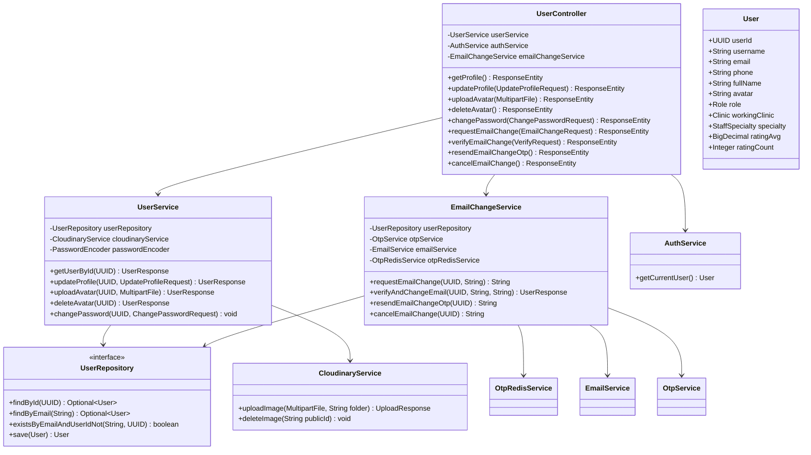

# II. Software Design Document

## TABLE OF CONTENTS
- [1. System Design](#1-system-design)
    - [1.1 System Architecture](#11-system-architecture)
- [2. Database Design](#2-database-design)
- [3. Detailed Design](#3-detailed-design)
    - [3.1 Authentication & Onboarding](#31-authentication--onboarding)
    - [3.2 User Profile & Account Setup](#32-user-profile--account-setup)
    - [3.3 Pet Records & Health Hub](#33-pet-records--health-hub)
    - [3.4 Clinic Discovery Flow](#34-clinic-discovery-flow)
    - [3.5 Clinical Operations & Service Setup](#35-clinical-operations--service-setup)
    - [3.6 Staffing & Scheduling](#36-staffing--scheduling)
    - [3.7 Booking & Appointment Lifecycle](#3.7-booking--appointment-lifecycle)
    - [3.8 Electronic Medical Records (EMR)](#3.8-electronic-medical-records-emr)
    - [3.9 Specialized Services (SOS Emergency)](#3.9-specialized-services-sos-emergency)
    - [3.10 AI Assistance Flow](#3.10-ai-assistance-flow)
    - [3.11 Governance & Reporting Flow](#3.11-governance--reporting-flow)
    - [3.12 AI Vision Pet Health Analysis](#312-ai-vision-pet-health-analysis)
- [4. Technology Stack Summary](#4-technology-stack-summary)

## 1. System Design

### 1.1 System Architecture


**The Petties Platform** is designed with a modern, scalable, and modular architecture, clearly separating frontend and backend responsibilities. This ensures high performance, flexibility for scaling, and easy integration with third-party services.

**1. User Role:**
- **Guest** - Can view clinic listings, search clinics, and view basic information
- **Pet Owner** - Can register pets, book appointments, chat with AI assistant, view EMR history, and manage profile (Mobile only)
- **Vet** - Can view appointments, manage schedule, create EMR records, and access patient history (Web + Mobile)
- **Clinic Manager** - Manages clinic operations, staff scheduling, booking management, and patient records (Web only)
- **Clinic Owner** - Manages clinic profile, services, pricing, staff, and views analytics (Web only)
- **Admin** - Manages the system, user accounts, clinic approvals, AI agent configuration, and oversees system operations (Web only)

**2. Frontend Layer:**
- Built with **React 19** (Web Dashboard) and **Flutter 3.5** (Mobile App) for responsive and real-time user experiences
- Uses **WebSocket clients** to receive live AI chat streaming
- Integrates **Neobrutalism design system** for consistent UI/UX
- Static assets are distributed through **Cloudinary CDN** to improve performance

**3. Backend Layer:**
- **Spring Boot 3.4 Server:** Handles API management, authentication (JWT), REST API endpoints, and business logic for clinics, bookings, users, pets, and EMR
- **Python FastAPI Service:** Processes AI chat requests, runs Single Agent with ReAct pattern, performs RAG queries, and supports real-time WebSocket streaming
- **API Gateway (NGINX):** Manages real-time routing, SSL termination, load balancing, and rate limiting

**4. Store Data:**
- **PostgreSQL 16** - Primary relational database storing users, clinics, bookings, pets, EMR, and AI agent configurations (shared by both services)
- **MongoDB 7** - Used for auditing, logs, and flexible schema data (e.g., patient records or specialized logs)
- **Redis 7** - Caches OTP codes, session data, and rate limiting counters with TTL-based expiration
- **Qdrant Cloud** - Stores vector embeddings for RAG knowledge base (1024 dimensions, Binary Quantization)
- **Cloudinary** - Manages media assets (images, avatars, clinic photos) efficiently with CDN delivery
- **Firebase** - Used for push notifications to mobile devices [Planned]

**5. Deployment & Infrastructure:**
- **Vercel** - Used for frontend (React) deployment with automatic preview deployments
- **AWS EC2** - Provides backend infrastructure and scalable cloud hosting for Spring Boot and FastAPI services
- **Docker** - Containerizes backend services (Spring Boot, FastAPI, NGINX), enabling flexible deployment and CI/CD pipelines
- **GitHub Actions** - Automated CI/CD for building, testing, and deploying all services

---

### 1.2 Package Diagram

#### 1.2.1 Back-End Package Diagram

##### Spring Boot Service (backend-spring)


##### Python AI Agent Service (petties-agent-serivce)


##### Package Descriptions - Spring Boot Service:

| No | Package | Layer Responsibility |
|----|---------|---------------------|
| **Presentation Layer** |
| 01 | controller | **REST API Layer** - Handles HTTP requests and maps them to service methods. Responsible for request validation, authentication checks, and response formatting. Implements `@RestController` pattern with route mapping to `/api/*` endpoints. |
| **Business Layer** |
| 02 | service | **Business Logic Layer** - Contains core business rules, transaction management (`@Transactional`), and orchestration of operations. Implements concrete Service classes for simplicity and direct implementation. Coordinates between repositories and external integrations. |

| **Data Access Layer** |
| 04 | repository | **Data Access Layer** - Provides CRUD operations and custom query methods using Spring Data JPA. Abstracts database interactions with PostgreSQL. Implements Repository pattern with method naming conventions for query generation. |
| **Domain Layer** |
| 05 | model | **Domain Entity Layer** - JPA entities mapped to PostgreSQL tables. Defines data structure, relationships (`@OneToMany`, `@ManyToOne`, `@ManyToMany`), and lifecycle hooks. Uses Hibernate for ORM with auditing fields (createdAt, updatedAt). |
| 06 | model/enums | **Enumeration Types** - Type-safe constants for domain concepts (Role, Status, Type). Ensures data integrity and provides readable code instead of magic strings/numbers. |
| **DTO Layer** |
| 07 | dto | **Data Transfer Objects** - Defines API contracts between client and server. Handles request validation (Jakarta Bean Validation annotations), response shaping, and prevents entity exposure. Organized by feature domain. |
| 08 | mapper | **Object Mapping Layer** - MapStruct-based mappers for Entity ↔ DTO conversion. Eliminates boilerplate mapping code and ensures type-safe transformations between layers. |
| **Cross-Cutting Concerns** |
| 09 | config | **Configuration Layer** - Spring beans for cross-cutting concerns: Security (JWT filter, authentication), external services (Redis, Cloudinary, Google Maps), JPA/Hibernate settings, WebSocket, Swagger/OpenAPI, and CORS configuration. |
| 10 | security | **Security Layer** - JWT token provider, authentication filter, custom `UserDetailsService`, and role-based access control. Implements Spring Security 6.x with stateless session management. |
| 11 | exception | **Error Handling Layer** - Centralized exception handling with `@ControllerAdvice`. Defines custom exceptions (BadRequest, NotFound, Unauthorized, Forbidden) and standardized error responses with Vietnamese messages. |
| 12 | validation | **Custom Validation Layer** - Custom Bean Validation annotations and validators for business rules not covered by standard annotations (e.g., phone format, date range validation). |
| **Infrastructure Layer** |
| 13 | util | **Utility Layer** - Stateless helper classes for common operations (token manipulation, date formatting, string processing, slug generation). Shared across multiple services without business logic. |
| 14 | converter | **Data Conversion Layer** - JPA `AttributeConverter` implementations for complex type mappings (JSON ↔ Object, Enum ↔ String). Enables storing structured data in database columns. |
| 15 | scheduler | **Scheduled Tasks Layer** - Spring `@Scheduled` jobs for background processing (appointment reminders, expired token cleanup, report generation). Implements cron-based and fixed-rate scheduling. |
| 16 | event | **Event Handling Layer** - Spring Application Events for decoupled communication between components. Implements async event publishing and listeners for notifications, audit logging, and side effects. |
| **Database Migration** |
| 17 | db/migration | **Schema Migration Layer** - Flyway SQL migration scripts with versioned naming (`V{timestamp}__{description}.sql`). Manages database schema evolution across environments. |
| **Testing Layer** |
| 18 | test | **Testing Layer** - JUnit 5 + Mockito test suites organized by component type (controller, service, repository). Includes unit tests with mocked dependencies and integration tests with `@SpringBootTest`. Follows Arrange-Act-Assert pattern with test fixtures for data setup. |

##### Package Descriptions - Python AI Agent Service:

| No | Package | Layer Responsibility |
|----|---------|---------------------|
| **API Layer** |
| 01 | api/routes | **REST Endpoint Layer** - FastAPI route handlers exposing AI service capabilities. Manages HTTP endpoints for chat sessions, agent configuration, tool registry, knowledge base, and settings. Uses Pydantic for request/response validation. |
| 02 | api/websocket | **Real-time Communication Layer** - WebSocket endpoints for bidirectional streaming. Enables real-time AI chat with token-by-token streaming and ReAct trace visualization. Handles connection lifecycle and message protocols. |
| 03 | api/middleware | **Request Interception Layer** - Cross-cutting middleware for authentication (JWT validation), logging, and request preprocessing. Integrates with Spring Boot's auth system for user context extraction. |
| 04 | api/schemas | **API Contract Layer** - Pydantic models defining request/response structures. Provides runtime validation, serialization, and OpenAPI documentation generation for all API endpoints. |
| 05 | api/dependencies | **Dependency Injection Layer** - FastAPI dependencies for common operations (database sessions, current user, pagination). Enables reusable request-scoped resources across routes. |
| **Core - Agent Layer** |
| 06 | core/agents | **AI Agent Orchestration** - Implements Single Agent with ReAct pattern (Thought → Action → Observation loop) using LangGraph StateGraph. Manages agent state, decision-making, and response generation. |
| 07 | core/agents/state | **Agent State Management** - TypedDict definitions for ReAct state (messages, steps, current thought, tool calls). Enables stateful conversation and reasoning trace tracking. |
| 08 | core/agents/factory | **Agent Construction Layer** - Factory pattern for dynamic agent instantiation. Loads configuration (prompts, parameters, enabled tools) from PostgreSQL database at runtime. |
| **Core - Tool Layer** |
| 09 | core/tools | **Tool Infrastructure Layer** - FastMCP server setup for tool registration and execution. Provides decorator-based tool definition (`@mcp.tool`) with semantic descriptions for LLM function calling. |
| 10 | core/tools/mcp_tools | **Tool Implementation Layer** - Code-based tools with semantic descriptions. Each tool is a function decorated with `@mcp.tool()` providing capabilities like Q&A, symptom search, clinic lookup, booking creation. |
| 11 | core/tools/scanner | **Tool Discovery Layer** - Auto-scans Python modules for `@mcp.tool` decorated functions. Syncs discovered tools to database for admin management (enable/disable, assign to agents). |
| 12 | core/tools/executor | **Tool Execution Layer** - Validates tool parameters against schema and executes through MCP server. Handles tool errors gracefully and returns structured results to agent. |
| **Core - RAG Layer** |
| 13 | core/rag | **Knowledge Retrieval Layer** - LlamaIndex-based RAG engine with Cohere embeddings (1024 dims) and Qdrant Cloud vector storage. Handles document chunking, embedding, indexing, and semantic search for context augmentation. |
| **Core - Utilities** |
| 14 | core/config_helper | **Dynamic Configuration Layer** - Loads API keys, model settings, and prompts from PostgreSQL. Enables runtime configuration changes without service restart. |
| 15 | core/init_db | **Database Initialization** - Seed data scripts and initial setup for agents, tools, and system settings. Runs on application startup. |
| 16 | core/sentry | **Error Monitoring Layer** - Sentry SDK integration for error tracking, performance monitoring, and distributed tracing across async operations. |
| **Services Layer** |
| 17 | services | **External Integration Layer** - Clients for external APIs (OpenRouter LLM, Cohere embeddings). Handles streaming responses, retry logic, and error handling for cloud AI providers. |
| **Database Layer** |
| 18 | db/postgres/models | **ORM Model Layer** - SQLAlchemy ORM models defining entities (Agent, Tool, ChatSession, ChatMessage, KnowledgeDocument, SystemSetting). Maps Python classes to PostgreSQL tables. |
| 19 | db/postgres/session | **Session Management Layer** - AsyncSession factory for database connections. Manages connection pooling and transaction scopes for async operations. |
| 20 | db/migrations | **Schema Migration Layer** - Alembic migration scripts for database schema versioning. Enables safe schema evolution across environments with up/down migrations. |
| **Configuration Layer** |
| 21 | config | **Environment Configuration** - Pydantic Settings for environment variables. Centralized configuration for database URLs, API keys, and logging setup with validation. |
| 22 | config/logging | **Logging Configuration** - Structured logging setup with JSON formatting for production. Configures log levels, handlers, and formatters per environment. |
| **Testing Layer** |
| 23 | tests | **Testing Layer** - pytest test suites for API endpoints, agent logic, tool execution, and RAG pipeline. Includes unit tests with mocks and integration tests with test database. Uses pytest-asyncio for async testing. |

---

#### 1.2.2 Front-End Package Diagram

##### React Web Dashboard (petties-web)


##### Flutter Mobile App (petties_mobile)


##### Package Descriptions - React Web Dashboard:

| No | Package | Layer Responsibility |
|----|---------|---------------------|
| **Pages Layer** |
| 01 | pages | **Route Page Layer** - Top-level page components mapping to routes. Each page represents a complete view for a specific role (Admin, Clinic Owner, Clinic Manager, Vet). Organized by role and feature domain. |
| 02 | pages/auth | **Authentication Pages** - Login, registration, and password recovery flows with OTP verification. Handles unauthenticated user journeys. |
| 03 | pages/admin | **Admin Dashboard Pages** - System administration views including clinic approvals, AI agent configuration, tool management, knowledge base, and system settings. |
| 04 | pages/clinic-owner | **Clinic Owner Pages** - Clinic management views for owners including profile editing, service configuration, pricing, and staff management. |
| 05 | pages/clinic-manager | **Clinic Manager Pages** - Operational views for daily clinic management including bookings, schedules, and patient records. |
| 06 | pages/vet | **Veterinarian Pages** - Vet-specific views for appointments, patient records, and schedule management. |
| 07 | pages/shared | **Shared Pages** - Cross-role pages like profile management accessible by all authenticated users. |
| **Components Layer** |
| 08 | components | **Reusable UI Components** - Modular, composable UI building blocks organized by domain (auth, clinic, profile, dashboard). Follows atomic design principles with consistent Neobrutalism styling. |
| 09 | components/common | **Shared Components** - Generic UI components used across multiple features (modals, inputs, dialogs, loading states). Framework-agnostic and highly reusable. |
| **Layouts Layer** |
| 10 | layouts | **Page Layout Layer** - Role-based layout wrappers providing consistent navigation, sidebar, and header structure. Implements layout composition pattern for DRY page structure. |
| **Services Layer** |
| 11 | services/api | **API Client Layer** - Axios-based HTTP client with interceptors for JWT handling, error transformation, and request/response logging. Provides typed service methods for each API domain. |
| 12 | services/websocket | **WebSocket Client Layer** - Real-time communication for AI chat streaming. Manages connection lifecycle, reconnection, and message handling. |
| **State Management** |
| 13 | store | **Global State Layer** - Zustand stores for application-wide state (auth, user profile, clinic data). Provides selectors, actions, and persistence for client-side state management. |
| **Hooks Layer** |
| 14 | hooks | **Custom React Hooks** - Reusable stateful logic encapsulation (useAuth, useToast, useDebounce). Abstracts common patterns and side effects for clean component code. |
| **Types Layer** |
| 15 | types | **TypeScript Definitions** - Shared type definitions for API responses, domain models, and component props. Ensures type safety across the application. |
| **Utils Layer** |
| 16 | utils | **Utility Functions** - Pure helper functions for common operations (date formatting, validation, token handling, error processing). Stateless and side-effect free. |
| **Config Layer** |
| 17 | config | **Environment Configuration** - Environment-specific settings (API URLs, feature flags). Centralizes configuration management with type-safe access. |
| **Lib Layer** |
| 18 | lib | **Third-party Integrations** - Wrappers and configurations for external libraries (Sentry error tracking). Isolates vendor-specific code from application logic. |
| **Testing Layer** |
| 19 | __tests__ | **Testing Layer** - Vitest/Jest test suites for components and hooks. Includes unit tests with React Testing Library and integration tests for user flows. Uses MSW for API mocking. |

##### Package Descriptions - Flutter Mobile App:

| No | Package | Layer Responsibility |
|----|---------|---------------------|
| **UI Layer - Screens** |
| 01 | ui/screens | **Screen Layer** - Full-page widget compositions representing complete views. Each screen corresponds to a route and composes widgets for specific user flows. Organized by user role (pet_owner, vet) and feature domain (auth, pet, profile). |
| 02 | ui/auth | **Authentication Screens** - Login, registration, password recovery flows with OTP verification. Handles unauthenticated user journeys with form validation. |
| 03 | ui/pet_owner | **Pet Owner Screens** - Home and feature screens exclusive to pet owners including booking, AI chat, and pet management. |
| 04 | ui/vet | **Veterinarian Screens** - Vet-specific screens for appointments, patient records, and schedule management. |
| **UI Layer - Widgets** |
| 05 | ui/core/widgets | **Core Widgets** - Foundational reusable widgets (buttons, text fields, loaders). Implements Neobrutalism design system with consistent styling across the app. |
| 06 | ui/widgets | **Feature Widgets** - Domain-specific widgets organized by feature (profile, pet, booking). Composable building blocks for screens. |
| **Data Layer** |
| 07 | data/services | **API Service Layer** - Dio-based HTTP services for backend communication. Handles request construction, response parsing, and error transformation. Implements service classes per domain (auth, user, pet). |
| 08 | data/models | **Data Model Layer** - Dart classes representing API responses and domain entities. Provides fromJson/toJson methods for serialization. Immutable data structures with factory constructors. |
| 09 | data/datasources | **Data Source Layer** - Abstracts data retrieval from local (SharedPreferences, Hive) and remote (API) sources. Implements Repository pattern's data source abstraction. |
| 10 | data/repositories | **Repository Layer** - Orchestrates between local and remote data sources. Implements caching strategies, offline-first logic, and data synchronization. Single source of truth for data access. |
| **State Management** |
| 11 | providers | **State Provider Layer** - Provider/Riverpod state management. Exposes reactive state to widgets with notifyListeners for UI updates. Handles async state loading and error states. |
| **Routing Layer** |
| 12 | routing | **Navigation Layer** - GoRouter configuration with role-based route guards. Defines route paths, redirects, and deep linking. Implements declarative navigation pattern. |
| **Config Layer** |
| 13 | config/constants | **App Constants** - Static configuration values (colors, strings, dimensions). Centralizes magic values for consistent UI and easy theming. |
| 14 | config/theme | **Theme Configuration** - MaterialApp theme definition with Neobrutalism styling. Defines colors, typography, component themes, and dark mode support. |
| 15 | config/env | **Environment Configuration** - Environment-specific settings (dev, test, prod). Manages API URLs and feature flags per build configuration. |
| **Core Layer** |
| 16 | core/error | **Error Handling Layer** - Custom exception classes and failure types. Standardizes error representation for consistent handling across the app. |
| 17 | core/network | **Network Layer** - Dio client setup with interceptors for JWT injection, token refresh, and error mapping. Centralizes HTTP configuration. |
| **Utils Layer** |
| 18 | utils | **Utility Layer** - Stateless helper functions for common operations (validators, date formatters, storage helpers, permission handling, API error processing). Shared across all layers without business logic. |
| **Entry Points** |
| 19 | main.dart | **Application Entry** - App initialization including Provider setup, Firebase init, GoRouter configuration, and theme application. |
| **Testing Layer** |
| 20 | test | **Testing Layer** - Flutter test suites for widgets, providers, and services. Includes unit tests with mocktail/mockito, widget tests with WidgetTester, and integration tests with flutter_driver. |

---

## 2. API DESIGN SPECIFICATIONS

> **Note:** API version prefix `/api/v1` (Backend) has been simplified to `/api`. AI Service is accessed via `/ai` prefix through NGINX.

### 2.1 Implemented Modules (Backend - Spring Boot)

> **Base Path:** `/api`
> **Access:** Requires JWT, Public for Auth/Search

#### 2.1.1 Authentication (`/auth`)
| Method | Endpoint | Description | Access |
|--------|----------|-------------|--------|
| POST | `/api/auth/login` | Username/Password login | Public |
| POST | `/api/auth/google` | Google OAuth login/register | Public |
| POST | `/api/auth/register/send-otp` | Init registration with Email OTP | Public |
| POST | `/api/auth/register/verify-otp` | Complete registration | Public |
| POST | `/api/auth/refresh` | Refresh Access Token (Rotation) | Public |
| GET | `/api/auth/me` | Get current user basic info | Auth |
| POST | `/api/auth/forgot-password` | Request password reset OTP | Public |
| POST | `/api/auth/logout` | Revoke token | Auth |

#### 2.1.2 User Profile (`/users`)
| Method | Endpoint | Description | Access |
|--------|----------|-------------|--------|
| GET | `/api/users/profile` | Get detailed profile | Auth |
| PUT | `/api/users/profile` | Update profile info | Auth |
| POST | `/api/users/profile/avatar` | Upload avatar | Auth |
| DELETE | `/api/users/profile/avatar` | Delete avatar | Auth |
| PUT | `/api/users/profile/password` | Change password | Auth |
| POST | `/api/users/profile/email/request-change` | Request email change (Step 1) | Auth |
| POST | `/api/users/profile/email/verify-change` | Verify email change (Step 2) | Auth |

#### 2.1.3 Clinic Management (`/clinics`)
| Method | Endpoint | Description | Access |
|--------|----------|-------------|--------|
| GET | `/api/clinics` | List all clinics (Filter/Page) | Public |
| GET | `/api/clinics/{id}` | Get details | Public |
| POST | `/api/clinics` | Create clinic | Clinic Owner |
| PUT | `/api/clinics/{id}` | Update profile | Clinic Owner |
| POST | `/api/clinics/{id}/images` | Upload gallery image | Clinic Owner |
| POST | `/api/clinics/{id}/logo` | Upload logo | Clinic Owner |
| DELETE | `/api/clinics/{id}/images/{imageId}` | Delete gallery image | Clinic Owner |
| GET | `/api/clinics/nearby` | Geo-search nearby | Public |
| GET | `/api/clinics/search` | Name search | Public |
| GET | `/api/clinics/owner/my-clinics` | Get my clinics | Clinic Owner |

#### 2.1.4 Clinic Staff Management (`/clinics/{id}/staff`)
| Method | Endpoint | Description | Access |
|--------|----------|-------------|--------|
| GET | `/api/clinics/{id}/staff` | List all staff | CM, CO, Admin |
| GET | `/api/clinics/{id}/staff/has-manager` | Check manager logic | CM, CO |
| POST | `/api/clinics/{id}/staff/invite-by-email` | Invite staff by email (Google OAuth) | CM, CO |
| PATCH | `/api/clinics/{id}/staff/{userId}/specialty` | Update staff specialty | CM, CO |
| DELETE | `/api/clinics/{id}/staff/{userId}` | Remove staff | CM, CO |

#### 2.1.5 Shift & Slot Management (`/shifts`, `/slots`)
| Method | Endpoint | Description | Access |
|--------|----------|-------------|--------|
| GET | `/api/clinics/{id}/shifts` | Get shifts in date range (Week/Month) | CM, CO, VET |
| POST | `/api/clinics/{id}/shifts` | Create shifts (Auto-gen slots, Break sync, Repeat weeks, Overnight) | CM, CO |
| GET | `/api/shifts/me` | Get shifts of logged-in vet | VET |
| GET | `/api/shifts/{id}` | Get shift detail with Slots & Bookings | CM, CO, VET |
| DELETE | `/api/shifts/{id}` | Delete individual shift (blocked if has bookings) | CM, CO |
| DELETE | `/api/shifts/bulk` | Delete multiple shifts (Bulk) | CM, CO |
| PATCH | `/api/slots/{id}/block` | Manually block slot | CM, CO |
| PATCH | `/api/slots/{id}/unblock` | Unblock slot | CM, CO |

#### 2.1.6 Clinic Services (`/services`)
| Method | Endpoint | Description | Access |
|--------|----------|-------------|--------|
| GET | `/api/services` | List own services | Clinic Owner |
| POST | `/api/services` | Create service | Clinic Owner |
| PUT | `/api/services/{id}` | Update service | Clinic Owner |
| DELETE | `/api/services/{id}` | Delete service | Clinic Owner |
| PATCH | `/api/services/{id}/status` | Toggle active | Clinic Owner |
| PATCH | `/api/services/{id}/home-visit` | Toggle Home Visit | Clinic Owner |

#### 2.1.6 File Management (`/files`)
| Method | Endpoint | Description | Access |
|--------|----------|-------------|--------|
| POST | `/api/files/upload` | Upload generic file | Auth |
| POST | `/api/files/upload/avatar` | Upload avatar (resize) | Auth |

### 2.2 Implemented Modules (AI Service - Python)

> **Base Path:** `/ai` (Mapped via NGINX to Internal Port 8000)

#### 2.2.1 Chat & Sessions (`/ai/chat`)
| Method | Endpoint | Description | Access |
|--------|----------|-------------|--------|
| POST | `/ai/chat/sessions` | Create new chat session | Auth |
| GET | `/ai/chat/sessions` | List history sessions | Auth |
| GET | `/ai/chat/sessions/{id}` | Get session details | Auth |
| WS | `/ws/chat/{session_id}` | WebSocket Real-time Chat | Auth |

#### 2.2.2 Agent Management (`/ai/agents`)
| Method | Endpoint | Description | Access |
|--------|----------|-------------|--------|
| GET | `/ai/agents` | List agents (Single/Multi) | Auth |
| GET | `/ai/agents/{id}` | Get agent detail | Auth |
| PUT | `/ai/agents/{id}` | Update config (Temp, Model, Params) | Admin |
| PUT | `/ai/agents/{id}/prompt` | Update System Prompt (Versioning) | Admin |
| GET | `/ai/agents/{id}/prompt-history` | View Prompt History | Admin |
| POST | `/ai/agents/{id}/test` | Test Agent (ReAct Trace) | Admin |

#### 2.2.3 Tool Registry (`/ai/tools`)
| Method | Endpoint | Description | Access |
|--------|----------|-------------|--------|
| POST | `/ai/tools/scan` | Scan & Sync Code-based Tools (FastMCP) | Admin |
| GET | `/ai/tools` | List Registered Tools | Admin |
| PUT | `/ai/tools/{id}/enable` | Enable/Disable Tool | Admin |
| POST | `/ai/tools/{id}/assign` | Assign tool to Agent | Admin |

#### 2.2.4 Knowledge Base RAG (`/ai/knowledge`)
| Method | Endpoint | Description | Access |
|--------|----------|-------------|--------|
| POST | `/ai/knowledge/upload` | Upload PDF/Docx | Admin |
| POST | `/ai/knowledge/documents/{id}/process` | Index to Qdrant (Cohere Embedding) | Admin |
| GET | `/ai/knowledge/documents` | List documents status | Admin |
| POST | `/ai/knowledge/query` | Test RAG Retrieval | Admin |
| GET | `/ai/knowledge/status` | KB Status & Stats | Admin |

### 2.3 Planned Modules (Backend)

#### 2.3.1 Patient Management Module

> **Status:** Design Approved. Endpoint paths finalized.

| Method | Endpoint | Description | Access |
|--------|----------|-------------|--------|
| GET | `/api/clinics/{id}/patients` | List patients of clinic | CM, VET |
| GET | `/api/patients/{id}` | Get Patient & Owner details | CM, VET |
| PUT | `/api/pets/{id}` | Update Patient Info | CM, VET |
| GET | `/api/patients/{id}/emrs` | Get EMR History (Shared) | CM, VET |
| POST | `/api/bookings/{id}/emr` | Create EMR for Booking | VET |
| PUT | `/api/emrs/{id}` | Update EMR Content | VET |
| GET | `/api/patients/{id}/vaccinations` | Get Vaccination History | CM, VET |
| POST | `/api/patients/{id}/vaccinations` | Add Vaccination Record | VET |
| PUT | `/api/vaccinations/{id}` | Edit Vaccination Record | VET |
| DELETE | `/api/vaccinations/{id}` | Delete Vaccination Record | VET |

#### 2.3.2 Booking Management Module
| Method | Endpoint | Description | Access |
|--------|----------|-------------|--------|
| POST | `/api/bookings` | Create new booking (Select slot) | Pet Owner |
| GET | `/api/bookings/my-bookings` | List own bookings | Pet Owner |
| GET | `/api/clinics/{id}/bookings` | List clinic bookings | CM, VET |
| PATCH | `/api/bookings/{id}/status` | Update booking status | CM, VET |

#### 2.3.3 Discovery & Search Module
| Method | Endpoint | Description | Access |
|--------|----------|-------------|--------|
| GET | `/api/discovery/nearby` | Find clinics by coordinates (lat, lng, radius) | Public |
| GET | `/api/discovery/search` | Search by keyword, service, area | Public |
| GET | `/api/discovery/geocoding` | Convert address to coordinates (Map API proxy) | Public |

#### 2.3.4 Vaccination History Module (Merged)
| Method | Endpoint | Description | Access |
|--------|----------|-------------|--------|
| GET | `/api/pets/{petId}/vaccinations` | Get full vaccination history | Auth |
| POST | `/api/bookings/{bookingId}/vaccinations` | Add new vaccination record (Must link to Booking) | VET |
| PUT | `/api/vaccinations/{id}` | Edit record | VET |
| DELETE | `/api/vaccinations/{id}` | Delete record | VET |

---

## 3. DETAILED DESIGN

### 3.2 Authentication & Onboarding (UC-PO-01, UC-VT-01, UC-CM-01, UC-CO-01)

#### 3.2.1 Class Diagram - Authentication


#### 3.2.2 User Registration with OTP (UC-PO-01)

**Sequence Diagram:**


#### 3.2.3 Login with Username/Password

**Sequence Diagram:**


#### 3.2.4 Sign in with Google Account

**Sequence Diagram:**


#### 3.2.5 Forgot & Reset Password

**Sequence Diagram:**


#### 3.2.6 Logout & Session Management

**Sequence Diagram:**


### 3.3 User Profile & Account Setup (UC-PO-03, UC-VT-03, UC-CM-02, UC-CO-02, UC-PO-23)

#### 3.3.1 Class Diagram - User Profile



#### 3.3.2 Update Profile & Avatar (UC-PO-03, UC-VT-03, UC-CM-02)


#### 3.3.3 Change Email with OTP (UC-PO-23)


#### 3.3.4 Change Password Flow


### 3.4 Pet Records & Health Hub (UC-PO-04, UC-PO-11, UC-PO-26)

#### 3.4.1 Class Diagram - Pet Records


#### 3.4.2 Add New Pet Record (UC-PO-04)


#### 3.4.3 Update Pet Info (UC-PO-11)


#### 3.4.4 Delete Pet (UC-PO-26)


### 3.5 Clinic Discovery Flow (UC-PO-05)

#### 3.5.1 Class Diagram - Clinic Discovery
*(Logic maps to Clinic Service `findNearbyClinics`)*

#### 3.5.2 Search Nearby Clinics (UC-PO-05)


### 3.6 Clinical Operations & Service Setup (UC-CO-03, UC-CO-04, UC-CO-05)

#### 3.6.1 Class Diagram - Clinic & Services

```mermaid
classDiagram
    class ClinicController {
        -ClinicService clinicService
        -CloudinaryService cloudinaryService
        +getAllClinics(ClinicStatus, String, Pageable) ResponseEntity
        +getClinicById(UUID) ResponseEntity
        +createClinic(ClinicRequest) ResponseEntity
        +updateClinic(UUID, ClinicRequest) ResponseEntity
        +approveClinic(UUID, ApproveRequest) ResponseEntity
        +rejectClinic(UUID, RejectRequest) ResponseEntity
        +uploadClinicImage(UUID, MultipartFile) ResponseEntity
        +searchNearby(BigDecimal lat, BigDecimal lng, Double radius) ResponseEntity
    }

    class ClinicService {
        -ClinicRepository clinicRepository
        -UserRepository userRepository
        -ClinicImageRepository imageRepository
        +getAllClinics(...) Page~ClinicResponse~
        +getClinicById(UUID) ClinicResponse
        +createClinic(ClinicRequest) ClinicResponse
        +updateClinic(UUID, ClinicRequest) ClinicResponse
        +approveClinic(UUID, String) ClinicResponse
        +rejectClinic(UUID, String) ClinicResponse
        +findNearbyClinics(BigDecimal, BigDecimal, Double) List~ClinicResponse~
    }

    class ClinicRepository {
        <<interface>>
        +findById(UUID) Optional~Clinic~
        +findAll(Specification, Pageable) Page~Clinic~
        +save(Clinic) Clinic
        +findNearby(BigDecimal, BigDecimal, Double) List~Clinic~
    }

    class ClinicImageRepository {
        <<interface>>
        +save(ClinicImage) ClinicImage
        +deleteById(UUID) void
    }

    class Clinic {
        +UUID clinicId
        +String name
        +String address
        +BigDecimal latitude
        +BigDecimal longitude
        +BigDecimal ratingAvg
        +Integer ratingCount
        +ClinicStatus status
        +User owner
    }

    class ClinicImage {
        +UUID imageId
        +String imageUrl
        +Boolean isPrimary
    }

    class ClinicStatus {
        <<enumeration>>
        PENDING
        APPROVED
        REJECTED
        SUSPENDED
    }

    class CloudinaryService {
        +uploadImage(MultipartFile, String folder) UploadResponse
        +deleteImage(String publicId) void
    }

    ClinicController --> ClinicService
    ClinicController --> CloudinaryService
    ClinicService --> ClinicRepository
    ClinicService --> ClinicImageRepository
    ClinicRepository ..> Clinic
    ClinicImageRepository ..> ClinicImage
```

#### 3.6.2 Create Clinic (UC-CO-03)

```mermaid
sequenceDiagram
    actor Owner as Clinic Owner
    participant UI as Clinic Register Screen (Web)
    participant CC as ClinicController
    participant CS as ClinicService
    participant AS as AuthService
    participant DB as Database

    Owner->>UI: 1. Input clinic info & click "Register"
    activate UI
    UI->>CC: 2. createClinic(clinicRequest)
    activate CC
    CC->>AS: 3. getCurrentUser()
    activate AS
    AS-->>CC: 4. User Entity (CLINIC_OWNER)
    deactivate AS
    CC->>CS: 5. createClinic(request, ownerId)
    activate CS
    CS->>CR: 6. save(Clinic Entity with status=PENDING)
    activate CR
    CR-->>CS: 7. Saved Clinic
    deactivate CR
    CS-->>CC: 8. ClinicResponse
    deactivate CS
    CC-->>UI: 9. ClinicResponse(created)
    deactivate CC
    UI-->>Owner: 10. Show "Pending Approval" notification
    deactivate UI
```

#### 3.6.3 Approve/Reject Clinic (Admin Approval Flow)

```mermaid
sequenceDiagram
    actor Admin as Administrator
    participant UI as Admin Dashboard
    participant CC as ClinicController
    participant CS as ClinicService
    participant DB as Database

    Admin->>UI: 1. Select clinic & click "Approve"
    activate UI
    UI->>CC: 2. approveClinic(clinicId, reason)
    activate CC
    CC->>CS: 3. approveClinic(id, reason)
    activate CS
    CS->>CR: 4. findById(id)
    activate CR
    CR-->>CS: 5. Clinic Entity
    deactivate CR
    CS->>CS: 6. Validate status == PENDING
    CS->>CR: 7. save(Updated Clinic)
    activate CR
    CR-->>CS: 8. OK
    deactivate CR
    CS-->>CC: 9. ClinicResponse
    deactivate CS
    CC-->>UI: 10. ApproveResponse(success)
    deactivate CC
    UI-->>Admin: 11. Show "Approved" status
    deactivate UI
```

#### 3.6.4 Upload Clinic Image

```mermaid
sequenceDiagram
    actor Owner as Clinic Owner
    participant UI as Clinic Edit Screen
    participant CC as ClinicController
    participant CS as ClinicService
    participant Cloud as CloudinaryService
    participant CIR as ClinicImageRepository

    Owner->>UI: 1. Select image & click "Upload"
    activate UI
    UI->>CC: 2. uploadClinicImage(clinicId, imageFile)
    activate CC
    CC->>CS: 3. uploadClinicImage(clinicId, file)
    activate CS
    CS->>Cloud: 4. uploadImage(file, "clinics")
    activate Cloud
    Cloud-->>CS: 5. Image URL
    deactivate Cloud
    CS->>CIR: 6. save(ClinicImage)
    activate CIR
    CIR-->>CS: 7. Saved Image
    deactivate CIR
    CS-->>CC: 8. ClinicResponse
    deactivate CS
    CC-->>UI: 9. Updated Clinic Data
    deactivate CC
    UI-->>Owner: 10. Show uploaded image
    deactivate UI
```

### 3.7 Staffing & Scheduling Flow (UC-CM-03, UC-CO-06, UC-CM-04)

Tương tác quan trọng nhất là việc mời nhân viên (Vet/Manager) vào phòng khám và quản lý ca trực của họ.

#### 3.7.1 Class Diagram - Staffing & Scheduling

```mermaid
classDiagram
    class ClinicStaffController {
        -ClinicStaffService staffService
        +getStaff(UUID) ResponseEntity
        +hasManager(UUID) ResponseEntity
        +inviteByEmail(UUID, InviteByEmailRequest) ResponseEntity
        +assignManager(UUID, String) ResponseEntity
        +assignVet(UUID, String) ResponseEntity
        +removeStaff(UUID, UUID) ResponseEntity
        +updateStaffSpecialty(UUID, UUID, Map) ResponseEntity
    }

    class ClinicStaffService {
        -ClinicRepository clinicRepository
        -UserRepository userRepository
        -AuthService authService
        -PasswordEncoder passwordEncoder
        +getClinicStaff(UUID) List~StaffResponse~
        +hasManager(UUID) boolean
        +inviteByEmail(UUID, InviteByEmailRequest) void
        +assignManager(UUID, String) void
        +assignVet(UUID, String) void
        +removeStaff(UUID, UUID) void
        +updateStaffSpecialty(UUID, UUID, String) void
    }

    class UserRepository {
        <<interface>>
        +findById(UUID) Optional~User~
        +findByUsernameOrEmailOrPhone(String, String, String) Optional~User~
        +existsByPhone(String) boolean
        +existsByEmail(String) boolean
        +save(User) User
    }

    ClinicStaffController --> ClinicStaffService
    ClinicStaffService --> UserRepository
```

#### 3.7.2 Invite Staff by Email (UC-CM-03, UC-CO-06)

```mermaid
sequenceDiagram
    actor O as Clinic Owner/Manager
    participant UI as Staff List Screen
    participant SC as ClinicStaffController
    participant SS as ClinicStaffService
    participant AS as AuthService
    participant UR as UserRepository
    participant DB as Database

    O->>UI: 1. Fill staff info (Email, Role, Specialty)
    UI->>SC: 2. inviteByEmail(clinicId, request)
    activate SC
    SC->>SS: 3. inviteByEmail(clinicId, request)
    activate SS
    SS->>AS: 4. getCurrentUser()
    activate AS
    AS-->>SS: 5. currentUser
    deactivate AS
    SS->>SS: 6. Validate Permissions (Owner vs Manager)
    SS->>UR: 7. findByEmail(email)
    activate UR
    UR->>DB: 8. Query user
    activate DB
    DB-->>UR: 9. User Entity (or null)
    deactivate DB
    UR-->>SS: 10. User / null
    deactivate UR
    alt User Already Exists
        SS->>SS: 11a. Check if assigned to another clinic
        SS->>SS: 12a. Update Role & WorkingClinic
    else New User
        SS->>SS: 11b. Create User Entity (waiting for Google Login)
        SS->>SS: 12b. Set Random Password & WorkingClinic
    end
    SS->>UR: 13. save(User)
    activate UR
    UR->>DB: 14. Save to DB
    activate DB
    DB-->>UR: 15. OK
    deactivate DB
    UR-->>SS: 16. OK
    deactivate UR
    SS-->>SC: 17. void
    deactivate SS
    SC-->>UI: 18. 200 OK (Success Message)
    deactivate SC
    UI-->>O: 19. "Staff invited successfully" notification
```

#### 3.7.3 Delete Shift & Slot Operations

```mermaid
sequenceDiagram
    actor M as Clinic Manager
    participant UI as Manager Dashboard (Web)
    participant C as VetShiftController
    participant S as VetShiftService
    participant VSR as VetShiftRepository
    participant SR as SlotRepository
    participant DB as Database

    M->>UI: 1. Select shift & click "Delete"
    activate UI
    UI->>C: 2. deleteShift(shiftId)
    activate C
    C->>S: 3. deleteShift(id)
    activate S
    S->>VSR: 4. findById(id)
    activate VSR
    VSR->>DB: 5. Query shift by ID
    activate DB
    DB-->>VSR: 6. VetShift with Slots
    deactivate DB
    VSR-->>S: 7. VetShift Entity
    deactivate VSR
    S->>S: 8. Check all slots AVAILABLE or BLOCKED
    alt Has BOOKED slots
        S-->>C: 9a. throw BadRequestException
        C-->>UI: 10a. 400 Error: Cannot delete shift with bookings
        UI-->>M: 11a. Show error message
    else All slots deletable
        S->>SR: 9b. deleteAll(slots)
        activate SR
        SR->>DB: 10b. Delete all slots of shift
        activate DB
        DB-->>SR: 11b. Deleted
        deactivate DB
        SR-->>S: 12b. OK
        deactivate SR
        S->>VSR: 13b. delete(shift)
        activate VSR
        VSR->>DB: 14b. Delete shift
        activate DB
        DB-->>VSR: 15b. Deleted
        deactivate DB
        VSR-->>S: 16b. OK
        deactivate VSR
        S-->>C: 17b. void
        deactivate S
        C-->>UI: 18b. 204 No Content
        deactivate C
        UI-->>M: 19b. Remove shift from Calendar
        deactivate UI
    end
```
#### 3.7.4 Business Rules

1. **Staff Roles Control:** 
    - CLINIC_OWNER có quyền thêm CLINIC_MANAGER và VET.
    - CLINIC_MANAGER chỉ có quyền thêm Bác sĩ (VET).
2. **Manager Limit:** Mỗi phòng khám chỉ có tối đa 1 Manager.
3. **Invitation Logic:** Hỗ trợ mời staff qua email. Nếu email đã có tài khoản (nhưng chưa thuộc phòng khám nao), hệ thống tự gán role và phòng khám. Nếu chưa có, hệ thống tạo user chờ đăng nhập qua Google OAuth.
4. **Slot Duration:** Tự động tạo slots 30 phút khi tạo shift.
5. **Break Time Sync:** Giờ nghỉ tự động lấy từ Clinic Operating Hours nếu shift nằm trong khoảng đó.
6. **Overnight Shifts:** Nếu endTime < startTime (vd: 22:00 → 06:00), hệ thống tự detect và set isOvernight = true.
7. **Overlap Prevention:** Mỗi vet chỉ có 1 shift/ngày. Sử dụng forceUpdate=true để ghi đè shift cũ.
8. **Delete Protection:** Không thể xóa shift có slots ở trạng thái BOOKED.
9. **Block Permission:** Chỉ CLINIC_OWNER và CLINIC_MANAGER được block/unblock slots.
10. **Repeat Weeks:** Có thể tạo lịch lặp lại tối đa 12 tuần liên tiếp.
11. **Past Date Skip:** Không tạo shift cho ngày trong quá khứ.
12. **Closed Day Skip:** Không tạo shift vào ngày phòng khám đóng cửa.
13. **SSE Notifications:** Gửi batch notification cho Vet khi được assign shifts mới.

### 3.8 Booking & Appointment Lifecycle (UC-PO-06, UC-PO-07, UC-CM-06, BOK-1)

Mô tả vòng đời của một lịch hẹn từ lúc khởi tạo trên Mobile App cho đến khi hoàn tất thanh toán tại phòng khám.

**Last Updated:** 2026-01-18 (Added Manual Vet Selection, Add-on Service)

#### 3.8.0 API Specification Table

| # | Method | Endpoint | Role | Description | Status |
|---|--------|----------|------|-------------|--------|
| 1 | POST | `/bookings` | PET_OWNER | Tạo booking mới | ✅ Done |
| 2 | GET | `/bookings/clinic/{clinicId}` | MANAGER, ADMIN | Lấy danh sách booking của clinic | ✅ Done |
| 3 | GET | `/bookings/vet/{vetId}` | VET, MANAGER, ADMIN | Lấy booking được gán cho vet | ✅ Done |
| 4 | GET | `/bookings/{bookingId}` | All | Lấy chi tiết booking | ✅ Done |
| 5 | GET | `/bookings/code/{bookingCode}` | All | Lấy booking theo mã | ✅ Done |
| 6 | GET | `/bookings/{id}/check-vet-availability` | MANAGER, ADMIN | Kiểm tra vet availability trước confirm | ✅ Done |
| 7 | GET | `/bookings/{id}/available-vets-for-confirm` | MANAGER, ADMIN | Lấy danh sách vet cho dropdown chọn thủ công | ✅ Done |
| 8 | PATCH | `/bookings/{id}/confirm` | MANAGER, ADMIN | Xác nhận booking + auto/manual assign vet | ✅ Done |
| 9 | PATCH | `/bookings/{id}/cancel` | All | Hủy booking với lý do | ✅ Done |
| 10 | GET | `/bookings/{id}/services/{serviceId}/available-vets` | MANAGER, ADMIN | Lấy danh sách vet có thể reassign | ✅ Done |
| 11 | POST | `/bookings/{id}/services/{serviceId}/reassign` | MANAGER, ADMIN | Đổi vet cho dịch vụ | ✅ Done |
| 12 | POST | `/bookings/{id}/add-service` | VET, MANAGER, ADMIN | Thêm dịch vụ phát sinh | ✅ Done |
| 13 | PATCH | `/bookings/{id}/check-in` | VET, MANAGER | Check-in bắt đầu khám | ⏳ Pending |
| 14 | PATCH | `/bookings/{id}/check-out` | VET, MANAGER | Check-out kết thúc khám | ⏳ Pending |
| 15 | PATCH | `/bookings/{id}/complete` | MANAGER | Hoàn thành sau thanh toán | ⏳ Pending |

**Booking Status Flow:**
```
PENDING → CONFIRMED → ASSIGNED → CHECK_IN → IN_PROGRESS → CHECK_OUT → COMPLETED
                                                           ↓
                                                       CANCELLED / NO_SHOW
```

**Notes:**
- IN_CLINIC & HOME_VISIT: Bỏ qua ON_THE_WAY, ARRIVED (đi thẳng từ ASSIGNED → CHECK_IN)
- SOS: Sử dụng ON_THE_WAY → ARRIVED với GPS tracking tự động

#### 3.8.1 Class Diagram - Booking & Appointment

```mermaid
classDiagram
    class BookingController {
        -BookingService bookingService
        +createBooking(BookingRequest, UserDetails) ResponseEntity
        +getBookingsByClinic(UUID, BookingStatus, BookingType, Pageable) ResponseEntity
        +getBookingsByVet(UUID, BookingStatus, Pageable) ResponseEntity
        +getBookingById(UUID) ResponseEntity
        +checkVetAvailability(UUID) ResponseEntity
        +getAvailableVetsForConfirm(UUID) ResponseEntity
        +confirmBooking(UUID, BookingConfirmRequest) ResponseEntity
        +cancelBooking(UUID, String, UserDetails) ResponseEntity
        +getAvailableVetsForReassign(UUID, UUID) ResponseEntity
        +reassignVet(UUID, UUID, ReassignVetRequest) ResponseEntity
        +addServiceToBooking(UUID, AddServiceRequest) ResponseEntity
        +checkIn(UUID) ResponseEntity
        +checkOut(UUID) ResponseEntity
        +complete(UUID) ResponseEntity
    }

    class BookingService {
        -BookingRepository bookingRepository
        -VetAssignmentService vetAssignmentService
        -PricingService pricingService
        -NotificationService notificationService
        +createBooking(BookingRequest, UUID) BookingResponse
        +confirmBooking(UUID, BookingConfirmRequest) BookingResponse
        +cancelBooking(UUID, String, UUID) BookingResponse
        +checkVetAvailability(UUID) VetAvailabilityCheckResponse
        +getAvailableVetsForConfirm(UUID) List~VetOptionDTO~
        +getAvailableVetsForReassign(UUID, UUID) List~AvailableVetResponse~
        +reassignVetForService(UUID, UUID, UUID) BookingResponse
        +addServiceToBooking(UUID, UUID) BookingResponse
        +checkIn(UUID) BookingResponse
        +checkOut(UUID) BookingResponse
        +complete(UUID) BookingResponse
    }

    class VetAssignmentService {
        +checkVetAvailabilityForBooking(Booking) VetAvailabilityCheckResponse
        +getAvailableVetsForConfirm(Booking) List~VetOptionDTO~
        +assignVetsToAllServices(Booking) Map
        +assignSpecificVet(Booking, UUID) void
        +reserveSlotsForBooking(Booking) void
        +releaseSlotsForBooking(Booking) void
        +reassignVetForService(...) void
    }

    class VetOptionDTO {
        +UUID vetId
        +String fullName
        +String avatarUrl
        +String specialty
        +String specialtyLabel
        +boolean isSuggested
        +int bookingCount
        +boolean hasAvailableSlots
        +String unavailableReason
    }

    class Booking {
        +UUID bookingId
        +String bookingCode
        +Pet pet
        +User petOwner
        +Clinic clinic
        +User assignedVet
        +BookingStatus status
        +BookingType type
        +LocalDate bookingDate
        +LocalTime bookingTime
        +BigDecimal totalPrice
        +BigDecimal distanceFee
        +List~BookingServiceItem~ bookingServices
    }

    class BookingServiceItem {
        +UUID bookingServiceId
        +Booking booking
        +ClinicService service
        +User assignedVet
        +BigDecimal unitPrice
        +Integer quantity
        +LocalTime scheduledStartTime
        +LocalTime scheduledEndTime
    }

    BookingController --> BookingService
    BookingService --> VetAssignmentService
    BookingService --> BookingRepository
    VetAssignmentService --> VetOptionDTO
    Booking "1" *-- "many" BookingServiceItem
```

#### 3.8.2 Create Appointment (BOK-1 Mobile Booking Wizard)

```mermaid
sequenceDiagram
    actor PO as Pet Owner
    participant UI as Mobile Wizard (5-Steps)
    participant BC as BookingController
    participant BS as BookingService
    participant SR as SlotRepository
    participant DB as Database

    PO->>UI: 1. Step 1-3: Choose Pet, Service, Vet
    UI->>BC: 2. GET /api/clinics/{id}/available-slots (filtered)
    BC-->>UI: 3. Available Slots List
    PO->>UI: 4. Step 4: Select Slot & Date
    PO->>UI: 5. Step 5: Review & Enter Address (if Home)
    activate UI
    UI->>BC: 6. createBooking(BookingRequest)
    activate BC
    BC->>BS: 7. createBooking(request)
    activate BS
    BS->>BS: 8. Validate slots (availability & distance)
    BS->>BS: 9. Calculate total price (Base + Weight + Distance)
    BS->>DB: 10. saveAll (Booking + link to Slots)
    BS->>SR: 11. Lock Slots (status=BOOKED, TTL=15m for payment)
    BS-->>BC: 12. BookingResponse
    deactivate BS
    BC-->>UI: 13. 201 Created
    deactivate BC
    UI-->>PO: 14. Show "Proceed to Payment" (Step 6)
    deactivate UI
```

#### 3.8.3 Online Payment & Confirmation (UC-PO-10, UC-PO-20)

```mermaid
sequenceDiagram
    actor PO as Pet Owner
    participant UI as Mobile App
    participant BC as BookingController
    participant BS as BookingService
    participant PS as PaymentService/Stripe
    participant DB as Database

    PO->>UI: 1. Click "Pay Now"
    UI->>BC: 2. GET /bookings/{id}/payment-intent
    BC->>PS: 3. Create Stripe Payment Intent
    PS-->>BC: 4. Client Secret
    BC-->>UI: 5. Client Secret
    UI->>PS: 6. Confirm Payment (Stripe SDK)
    PS-->>UI: 7. Payment Success
    UI->>BC: 8. POST /bookings/{id}/confirm-payment
    activate BC
    BC->>BS: 9. confirmPayment(id)
    activate BS
    BS->>DB: 10. Update status to CONFIRMED
    BS-->>BC: 11. BookingResponse
    deactivate BS
    BC-->>UI: 12. 200 OK
    deactivate BC
```

#### 3.8.4 Clinician Assignment with Manual Vet Selection (UC-CM-06)

Manager có thể chọn vet thủ công qua inline dropdown hoặc để hệ thống auto-assign.

```mermaid
sequenceDiagram
    actor M as Clinic Manager
    participant UI as Manager Web Dashboard
    participant BC as BookingController
    participant BS as BookingService
    participant VAS as VetAssignmentService
    participant NS as NotificationService
    participant DB as Database

    M->>UI: 1. Click "Chi tiết" on PENDING booking
    activate UI
    UI->>BC: 2. GET /bookings/{id}/available-vets-for-confirm
    activate BC
    BC->>BS: 3. getAvailableVetsForConfirm(id)
    BS->>VAS: 4. getAvailableVetsForConfirm(booking)
    VAS-->>BS: 5. List<VetOptionDTO> with isSuggested flags
    BS-->>BC: 6. VetOptionDTO list
    BC-->>UI: 7. JSON Array of vets
    deactivate BC
    UI-->>M: 8. Show inline dropdown per service (pre-select suggested)

    M->>UI: 9. (Optional) Change vet via dropdown
    M->>UI: 10. Click "Xác nhận & Gán Vet"
    UI->>BC: 11. PATCH /bookings/{id}/confirm with selectedVetId
    activate BC
    BC->>BS: 12. confirmBooking(id, request with selectedVetId)
    activate BS
    BS->>DB: 13. findById(id)
    DB-->>BS: 14. Booking Entity

    alt selectedVetId provided (Manual Selection)
        BS->>VAS: 15a. assignSpecificVet(booking, selectedVetId)
        VAS->>VAS: 16a. Validate specialty match
        VAS->>VAS: 17a. Reserve slots for selected vet
    else No selectedVetId (Auto-Assign)
        BS->>VAS: 15b. assignVetsToAllServices(booking)
        VAS-->>BS: 16b. Assignment Result
    end

    BS->>NS: 18. sendBookingAssignedNotification(booking)
    BS->>DB: 19. save(Updated Booking)
    BS-->>BC: 20. BookingResponse
    deactivate BS
    BC-->>UI: 21. 200 OK
    deactivate BC
    UI-->>M: 22. Close modal, refresh list
    deactivate UI
```

**Matching Rules (Service Category → Vet Specialty):**
| Service Category | Required Vet Specialty |
|-----------------|------------------------|
| GROOMING_SPA | VET_GROOMING, GROOMER |
| CHECK_UP, VACCINATION, INTERNAL_MEDICINE | VET_GENERAL, VET_VACCINATION |
| SURGERY | VET_SURGERY |
| DENTAL | VET_DENTAL |
| DERMATOLOGY | VET_DERMATOLOGY |
| EMERGENCY | VET_EMERGENCY |

#### 3.8.5 Check Vet Availability

```mermaid
sequenceDiagram
    actor M as Clinic Manager
    participant UI as Manager Dashboard
    participant BC as BookingController
    participant BS as BookingService
    participant VAS as VetAssignmentService

    M->>UI: 1. View Booking Details
    UI->>BC: 2. GET /bookings/{id}/check-vet-availability
    activate BC
    BC->>BS: 3. checkVetAvailability(id)
    activate BS
    BS->>VAS: 4. checkVetAvailabilityForBooking(booking)
    activate VAS
    VAS-->>BS: 5. VetAvailabilityCheckResponse
    deactivate VAS
    BS-->>BC: 6. Response
    deactivate BS
    BC-->>UI: 7. JSON Data
    deactivate BC
    UI-->>M: 8. Show availability status for each service
```

#### 3.8.6 Reassign Vet

```mermaid
sequenceDiagram
    actor M as Clinic Manager
    participant UI as Manager Dashboard
    participant BC as BookingController
    participant BS as BookingService
    participant VAS as VetAssignmentService

    M->>UI: 1. Select specific service in booking
    UI->>BC: 2. GET /.../available-vets
    BC->>BS: 3. getAvailableVetsForReassign(bookingId, serviceId)
    BS-->>BC: 4. List of available vets
    BC-->>UI: 5. Show vet list
    M->>UI: 6. Select new vet & Confirm
    UI->>BC: 7. POST /.../reassign
    activate BC
    BC->>BS: 8. reassignVetForService(bookingId, serviceId, newVetId)
    activate BS
    BS->>VAS: 9. reassignVetForService(...)
    Note over VAS: Release old slots & Reserve new slots
    VAS-->>BS: 10. OK
    BS-->>BC: 11. Updated Booking
    deactivate BS
    BC-->>UI: 12. Success
    deactivate BC
```

#### 3.8.7 Add-on Service During Examination

Thêm dịch vụ phát sinh trong lúc khám (chỉ hiện khi status = IN_PROGRESS hoặc ARRIVED cho SOS).

```mermaid
sequenceDiagram
    actor V as Vet/Manager
    participant UI as Dashboard
    participant BC as BookingController
    participant BS as BookingService
    participant PS as PricingService
    participant DB as Database

    V->>UI: 1. Click "Thêm dịch vụ" (only visible when IN_PROGRESS/ARRIVED)
    UI->>UI: 2. Show AddServiceModal with available services
    V->>UI: 3. Select service to add
    UI->>BC: 4. POST /bookings/{id}/add-service with serviceId
    activate BC
    BC->>BS: 5. addServiceToBooking(bookingId, serviceId)
    activate BS
    BS->>DB: 6. findById(bookingId)
    DB-->>BS: 7. Booking Entity
    BS->>BS: 8. Validate status is IN_PROGRESS or ARRIVED
    BS->>PS: 9. calculateServicePrice(service, petWeight)
    PS-->>BS: 10. Calculated price
    BS->>BS: 11. Create BookingServiceItem
    BS->>BS: 12. Update booking totalPrice (NOT recalculate distance fee)
    BS->>DB: 13. save(Booking with new service)
    BS-->>BC: 14. Updated BookingResponse
    deactivate BS
    BC-->>UI: 15. 200 OK
    deactivate BC
    UI-->>V: 16. Close modal, refresh booking detail
```

**Notes:**
- Distance fee is NOT recalculated when adding services
- Price is calculated based on pet's current weight
- Only services from the same clinic can be added

#### 3.8.8 Receive Payment & Checkout (SRS Screen #46, UC-CM-10)

```mermaid
sequenceDiagram
    actor M as Clinic Manager
    participant UI as Manager Dashboard
    participant BC as BookingController
    participant BS as BookingService
    participant PR as PaymentRepository
    participant DB as Database

    M->>UI: 1. Click "Receive Payment & Checkout"
    activate UI
    UI->>BC: 2. POST /bookings/{id}/checkout
    activate BC
    BC->>BS: 3. processCheckout(id)
    activate BS
    BS->>DB: 4. findById(id)
    activate DB
    DB-->>BS: 5. Booking Entity (Status: CHECK_OUT)
    deactivate DB
    BS->>PR: 6. findByBooking(booking)
    activate PR
    PR-->>BS: 7. Payment Entity
    deactivate PR
    BS->>BS: 8. Mark payment as PAID & update paidAt
    BS->>BS: 9. Set booking status to COMPLETED
    BS->>DB: 10. saveAll (Booking, Payment)
    activate DB
    DB-->>BS: 11. OK
    deactivate DB
    BS-->>BC: 12. BookingResponse
    deactivate BS
    BC-->>UI: 13. 200 OK (Completed)
    deactivate BC
    UI-->>M: 14. Update UI (Move booking to COMPLETED tab)
    deactivate UI
```

### 3.9 Electronic Medical Records (EMR) Flow (UC-VT-02, UC-VT-06, EMR-2)

#### 3.9.1 Class Diagram - EMR

```mermaid
classDiagram
    class PatientController {
        -PatientService patientService
        +searchPatients(UUID, String) ResponseEntity
        +getPetMedicalHistory(UUID) ResponseEntity
        +createEMR(UUID, EMRRequest) ResponseEntity
        +addVaccinationRecord(UUID, VaccinationRequest) ResponseEntity
    }

    class PatientService {
        -PetRepository petRepository
        -EMRRepository emrRepository
        -VaccinationRepository vaccinationRepository
        -BookingRepository bookingRepository
        +searchPatients(UUID, String) List~PatientResponse~
        +getPetMedicalHistory(UUID, UUID) PetHistoryResponse
        +createEMR(UUID, EMRRequest) EMRResponse
        +addVaccinationRecord(UUID, VaccinationRequest) VaccinationResponse
    }

    class EMRRepository {
        <<interface>>
        +findById(UUID) Optional~EMR~
        +findByPet(Pet) List~EMR~
        +save(EMR) EMR
    }

    class VaccinationRepository {
        <<interface>>
        +findByPet(Pet) List~Vaccination~
        +save(Vaccination) Vaccination
    }

    class EMR {
        +UUID emrId
        +Booking booking
        +Pet pet
        +String subjective
        +String objective
        +String assessment
        +String plan
        +List~ClinicService~ additionalServices
        +List~IncurredCost~ miscCosts
    }

    class IncurredCost {
        +UUID costId
        +String itemName
        +BigDecimal amount
        +Integer quantity
    }

    class Vaccination {
        +UUID vaccinationId
        +Pet pet
        +String vaccineName
        +LocalDate administeredDate
        +LocalDate nextDueDate
    }

    PatientController --> PatientService
    PatientService --> EMRRepository
    PatientService --> VaccinationRepository
    EMRRepository ..> EMR
    EMR --> IncurredCost
    VaccinationRepository ..> Vaccination
```

#### 3.9.2 View Pet Medical History (Cross-Clinic) (UC-VT-02)

```mermaid
sequenceDiagram
    actor V as Vet
    participant UI as Vet Dashboard
    participant PC as PatientController
    participant PS as PatientService
    participant BR as BookingRepository
    participant EMRR as EMRRepository
    participant VR as VaccinationRepository
    participant DB as Database

    V->>UI: 1. Search Pet or Select from Booking
    activate UI
    UI->>PC: 2. getPetMedicalHistory(petId)
    activate PC
    PC->>PS: 3. getPetMedicalHistory(petId, clinicId)
    activate PS
    PS->>BR: 4. Check entitlement (petId, clinicId)
    activate BR
    BR->>DB: 5. Query pet bookings for clinic
    activate DB
    DB-->>BR: 6. Booking exists
    deactivate DB
    BR-->>PS: 7. Confirmed
    deactivate BR
    PS->>EMRR: 8. findByPet(petId)
    activate EMRR
    EMRR->>DB: 9. Query EMR records for pet
    activate DB
    DB-->>EMRR: 10. EMR List
    deactivate DB
    EMRR-->>PS: 11. List<EMR>
    deactivate EMRR
    PS->>VR: 12. findByPet(petId)
    activate VR
    VR->>DB: 13. Query vaccination records for pet
    activate DB
    DB-->>VR: 14. Vaccination List
    deactivate DB
    VR-->>PS: 15. List<Vaccination>
    deactivate VR
    PS-->>PC: 16. PetHistoryResponse
    deactivate PS
    PC-->>UI: 17. 200 OK
    deactivate PC
    UI-->>V: 18. Display history timeline
    deactivate UI
```

#### 3.9.3 Create EMR (SOAP Notes) (EMR-2, UC-VT-06)

```mermaid
sequenceDiagram
    actor V as Vet
    participant UI as EMR Form (Mobile/Web)
    participant PC as PatientController
    participant PS as PatientService
    participant BR as BookingRepository
    participant PR as PetRepository
    participant EMRR as EMRRepository
    participant DB as Database

    V->>UI: 1. Fill SOAP form (S, O, A, P + Weight)
    activate UI
    UI->>PC: 2. createEMR(bookingId, EMRRequest)
    activate PC
    PC->>PS: 3. createEMR(bookingId, request)
    activate PS
    PS->>BR: 4. findById(bookingId)
    activate BR
    BR->>DB: 5. Query booking by ID
    activate DB
    DB-->>BR: 6. Booking Entity
    deactivate DB
    BR-->>PS: 7. Booking
    deactivate BR
    PS->>PS: 8. Validate status == IN_PROGRESS
    PS->>PS: 9. Validate Vet is assigned
    PS->>EMRR: 10. save(EMR: subjective, objective, assessment, plan)
    activate EMRR
    EMRR->>DB: 11. Insert new EMR record
    activate DB
    DB-->>EMRR: 12. Inserted
    deactivate DB
    EMRR-->>PS: 13. Saved EMR
    deactivate EMRR
    PS->>PR: 14. updatePetWeight(petId, newWeight)
    activate PR
    PR->>DB: 15. Update pet weight
    activate DB
    DB-->>PR: 16. Updated
    deactivate DB
    PR-->>PS: 17. OK
    deactivate PR
    PS-->>PC: 18. EMRResponse
    deactivate PS
    PC-->>UI: 19. 201 Created
    deactivate PC
    UI-->>V: 20. Show success & update medical timeline
    deactivate UI
```

#### 3.9.4 Add Vaccination Record (UC-VT-08)

```mermaid
sequenceDiagram
    actor V as Vet
    participant UI as Vaccination Form
    participant PC as PatientController
    participant PS as PatientService
    participant PR as PetRepository
    participant VR as VaccinationRepository
    participant DB as Database

    V->>UI: 1. Fill vaccine info & click "Add"
    activate UI
    UI->>PC: 2. addVaccinationRecord(petId, vaccinationRequest)
    activate PC
    PC->>PS: 3. addVaccinationRecord(petId, request)
    activate PS
    PS->>PR: 4. findById(petId)
    activate PR
    PR->>DB: 5. Query pet by ID
    activate DB
    DB-->>PR: 6. Pet Entity
    deactivate DB
    PR-->>PS: 7. Pet
    deactivate PR
    PS->>PS: 8. Validate entitlement
    PS->>VR: 9. save(Vaccination entity)
    activate VR
    VR->>DB: 10. Insert vaccination record
    activate DB
    DB-->>VR: 11. Inserted
    deactivate DB
    VR-->>PS: 12. Saved Vaccination
    deactivate VR
    PS-->>PC: 13. VaccinationResponse
    deactivate PS
    PC-->>UI: 14. 201 Created
    deactivate PC
    UI-->>V: 15. Update vaccination card
    deactivate UI
```

#### 3.9.5 Additional Service & Incurred Costs (UC-VT-10)

```mermaid
sequenceDiagram
    actor V as Vet
    participant UI as EMR Interface
    participant PC as PatientController
    participant PS as PatientService
    participant SR as ServiceRepository
    participant BR as BookingRepository
    participant DB as Database

    alt Standard Service
        V->>UI: 1a. Select from Clinic Catalog
        UI->>PC: 2a. addAdditionalService(bookingId, serviceId)
        PC->>PS: 3a. addAdditionalService(...)
        PS->>SR: 4a. findById(serviceId)
        activate SR
        SR->>DB: 5a. Query clinic service by ID
        activate DB
        DB-->>SR: 6a. Service Entity (Price)
        deactivate DB
        SR-->>PS: 7a. Service
        deactivate SR
    else Custom Incurred Cost
        V->>UI: 1b. Type name & manual price
        UI->>PC: 2b. addIncurredCost(bookingId, costRequest)
        PC->>PS: 3b. addIncurredCost(...)
        Note over PS: Create IncurredCost entity
    end

    PS->>BR: 8. findById(bookingId)
    activate BR
    BR->>DB: 9. Query booking by ID
    activate DB
    DB-->>BR: 10. Booking Entity
    deactivate DB
    BR-->>PS: 11. Booking
    deactivate BR
    
    PS->>PS: 12. Recalculate totalPrice
    Note over PS: Total = Base + Surcharge + Services + Misc
    
    PS->>BR: 13. save(Updated Booking)
    activate BR
    BR->>DB: 14. Update booking total price
    activate DB
    DB-->>BR: 15. Updated
    deactivate DB
    BR-->>PS: 16. OK
    deactivate BR
    
    PS-->>PC: 17. Success
    PC-->>UI: 18. 200 OK (Updated Balance)
    UI-->>V: 19. Update UI with new Total
```


### 3.11 AI Assistance Flow (UC-PO-14, UC-PO-14d)

#### 3.11.1 Class Diagram - AI Service

```mermaid
classDiagram
    class AgentController {
        -AgentService agentService
        +chat(ChatRequest) StreamingResponse
        +clearHistory(UUID) void
    }

    class AgentService {
        -LangGraphEngine engine
        -ToolRegistry toolRegistry
        -RAGEngine ragEngine
        +processQuery(userId, query) Stream
    }

    class LangGraphEngine {
        -StateStore stateStore
        +runReActLoop(prompt) Node
    }

    class ToolRegistry {
        -FastMCPProtocol mcp
        +callTool(toolName, args) ToolOutput
    }

    class RAGEngine {
        -QdrantClient vectorDb
        -CohereEmbedding embedding
        +retrieveContext(query) List~Node~
    }

    AgentController --> AgentService
    AgentService --> LangGraphEngine
    AgentService --> ToolRegistry
    AgentService --> RAGEngine
```

#### 3.11.2 Sequence Diagram: AI ReAct Loop

```mermaid
sequenceDiagram
    actor PO as Pet Owner
    participant UI as Chat UI (Mobile)
    participant AC as AgentController
    participant AS as AgentService
    participant LG as LangGraphEngine
    participant TR as ToolRegistry
    participant RE as RAGEngine

    PO->>UI: 1. Send "Book Vet for Bella tomorrow"
    activate UI
    UI->>AC: 2. chatRequest(query)
    activate AC
    AC->>AS: 3. processQuery(userId, query)
    activate AS
    AS->>LG: 4. runReActLoop(state)
    activate LG
    
    Note over LG: Step 1: Reasoning (Thought)
    LG-->>AS: 5. Request Tool: "find_slots"
    AS->>TR: 6. callTool("find_slots", {pet: "Bella", date: "tomorrow"})
    activate TR
    Note right of TR: Call fast-mcp plugin link to Spring Boot
    TR-->>AS: 7. Observation: "Available slots: 09:00, 10:00"
    deactivate TR
    AS->>LG: 8. Update State with Observation
    
    Note over LG: Step 2: Reasoning (Thought)
    LG-->>AS: 9. Final Answer: "Tôi tìm thấy 2 khung giờ..."
    deactivate LG
    
    AS-->>AC: 10. StreamingResponse (Chunks)
    deactivate AS
    AC-->>UI: 11. WebSocket / SSE Stream
    deactivate AC
    UI-->>PO: 12. Display text progressively
    deactivate UI
```

#### 3.11.3 AI Vision Pet Health Analysis (UC-PO-14d)

```mermaid
classDiagram
    %% === AI SERVICE LAYER ===
    class ChatWebSocket {
        <<FastAPI WebSocket>>
        +connect(websocket, user_id)
        +receive_message(message)
        +send_stream_response(chunks)
    }

    class SingleAgent {
        -llm_client: OpenRouterClient
        -enabled_tools: List~str~
        -system_prompt: str
        +invoke(message: str, context: dict) str
        +stream(message: str) AsyncIterator
        -_think_node(state) dict
        -_act_node(state) dict
        -_observe_node(state) dict
    }

    class OpenRouterClient {
        -api_key: str
        -model: str
        +generate(prompt: str) LLMResponse
        +generate_with_image(prompt: str, image_url: str) LLMResponse
        +stream(prompt: str) AsyncIterator
    }

    %% === VISION TOOLS ===
    class VisionTools {
        <<@mcp.tool>>
        +analyze_pet_image(image_url, pet_type, symptoms) VisionAnalysisResult
    }

    class VisionAnalysisResult {
        +detected_issues: List~DetectedIssue~
        +severity: SeverityLevel
        +recommended_services: List~UUID~
        +urgent_warning: str
        +next_steps: str
    }

    class DetectedIssue {
        +name: str
        +description: str
        +confidence: float
        +affected_area: str
    }

    class SeverityLevel {
        <<enumeration>>
        MILD
        MODERATE
        SEVERE
        URGENT
    }

    %% === BOOKING TOOLS ===
    class BookingTools {
        <<@mcp.tool>>
        +search_nearby_clinics(lat, lng, radius_km) List~ClinicResult~
        +get_user_pets(user_id) List~PetSummary~
        +create_booking_suggestion(pet_id, clinic_id, service_ids, urgency) BookingSuggestion
    }

    class ClinicResult {
        +clinic_id: UUID
        +name: str
        +address: str
        +distance_km: float
        +rating: float
        +available_services: List~str~
    }

    class PetSummary {
        +pet_id: UUID
        +name: str
        +species: str
        +breed: str
        +image_url: str
    }

    class BookingSuggestion {
        +pet_id: UUID
        +clinic_id: UUID
        +clinic_name: str
        +clinic_address: str
        +services: List~ServiceInfo~
        +suggested_date: date
        +suggested_time: time
        +estimated_price: int
        +urgency: str
        +warning_message: str
        +confirmation_action: dict
    }

    %% === WEBSOCKET SCHEMAS ===
    class ImageMessage {
        +type: str = "image"
        +image_url: str
        +latitude: float
        +longitude: float
        +text: str
    }

    class BookingSuggestionMessage {
        +type: str = "booking_suggestion"
        +suggestion: BookingSuggestion
    }

    %% === RELATIONSHIPS ===
    ChatWebSocket --> SingleAgent : uses
    SingleAgent --> OpenRouterClient : uses
    SingleAgent --> VisionTools : calls
    SingleAgent --> BookingTools : calls
    VisionTools --> VisionAnalysisResult : returns
    VisionTools --> OpenRouterClient : calls generate_with_image
    BookingTools --> ClinicResult : returns
    BookingTools --> PetSummary : returns
    BookingTools --> BookingSuggestion : returns
    VisionAnalysisResult --> DetectedIssue : contains
    VisionAnalysisResult --> SeverityLevel : has
    ChatWebSocket --> ImageMessage : receives
    ChatWebSocket --> BookingSuggestionMessage : sends
```

#### 3.11.4 Class Specifications

**1. OpenRouterClient (Extended)**
- **Responsibility:** Giao tiếp với OpenRouter API, hỗ trợ cả text và multimodal (image) input.
- **Key Methods:**
    - `generate_with_image(prompt, image_url)`: Gửi prompt kèm hình ảnh đến Vision LLM (Gemini 2.0 Flash).
    - Trả về structured response với detected issues.

**2. VisionTools (@mcp.tool)**
- **Responsibility:** Phân tích hình ảnh thú cưng để nhận diện vấn đề sức khỏe.
- **Key Methods:**
    - `analyze_pet_image(image_url, pet_type, symptoms_description)`:
        - Gọi Vision LLM với prompt chuyên biệt cho pet health analysis.
        - Parse response để trích xuất detected issues, severity.
        - Map issues sang recommended service categories.

**3. BookingTools (@mcp.tool)**
- **Responsibility:** Hỗ trợ tìm clinic và tạo booking suggestion.
- **Key Methods:**
    - `search_nearby_clinics(lat, lng, radius_km)`: Gọi Spring Boot API `/clinics/nearby` với Haversine distance.
    - `get_user_pets(user_id)`: Gọi API `/pets/my` để lấy danh sách pet của user.
    - `create_booking_suggestion(...)`: Tạo booking suggestion object với thông tin đã điền sẵn.

**4. BookingSuggestion**
- **Responsibility:** Data object chứa thông tin booking được AI đề xuất.
- **Fields:**
    - `confirmation_action`: Deep link params để mobile app navigate đến booking screen.

#### 3.11.5 Sequence Diagram: AI Vision Analysis to Booking

```mermaid
sequenceDiagram
    actor PO as Pet Owner
    participant UI as Chat UI (Mobile)
    participant CD as Cloudinary
    participant WS as ChatWebSocket (FastAPI)
    participant SA as SingleAgent
    participant VT as VisionTools
    participant LLM as OpenRouter (Gemini 2.0)
    participant BT as BookingTools
    participant API as Spring Boot API

    Note over PO, UI: Step 1: Upload Image
    PO->>UI: 1. Tap camera icon, select pet photo
    activate UI
    UI->>CD: 2. Upload image
    activate CD
    CD-->>UI: 3. Return image_url
    deactivate CD

    Note over UI, WS: Step 2: Send Image Message
    UI->>WS: 4. WebSocket: {type: "image", image_url, lat, lng}
    activate WS
    WS->>SA: 5. invoke(message, context)
    activate SA

    Note over SA: Step 3: ReAct - Thought
    SA->>SA: 6. Detect image in message
    SA->>SA: 7. Decide to call analyze_pet_image tool

    Note over SA, LLM: Step 4: Vision Analysis
    SA->>VT: 8. analyze_pet_image(image_url, pet_type)
    activate VT
    VT->>LLM: 9. generate_with_image(prompt, image_url)
    activate LLM
    Note right of LLM: Vision LLM analyzes image
    LLM-->>VT: 10. Analysis result (JSON)
    deactivate LLM
    VT-->>SA: 11. VisionAnalysisResult {issues, severity: "moderate", services}
    deactivate VT

    Note over SA: Step 5: ReAct - Observe & Think
    SA->>SA: 12. Severity >= moderate → Need booking

    Note over SA, API: Step 6: Find Nearby Clinics
    SA->>BT: 13. search_nearby_clinics(lat, lng)
    activate BT
    BT->>API: 14. GET /clinics/nearby?lat=...&lng=...
    activate API
    API-->>BT: 15. List of clinics
    deactivate API
    BT-->>SA: 16. [Clinic A, Clinic B, ...]
    deactivate BT

    Note over SA, API: Step 7: Get User Pets
    SA->>BT: 17. get_user_pets(user_id)
    activate BT
    BT->>API: 18. GET /pets/my
    activate API
    API-->>BT: 19. [Lucky, Mimi, Bella]
    deactivate API
    BT-->>SA: 20. List of pets
    deactivate BT

    Note over SA, UI: Step 8: Ask Pet Selection (if multiple)
    SA-->>WS: 21. Stream: "Bạn muốn đặt lịch cho bé nào?"
    WS-->>UI: 22. Display pet selection
    UI-->>PO: 23. Show pet options
    PO->>UI: 24. Select "Lucky"
    UI->>WS: 25. {type: "text", content: "Lucky"}
    WS->>SA: 26. Continue with pet selection

    Note over SA, BT: Step 9: Create Booking Suggestion
    SA->>BT: 27. create_booking_suggestion(pet_id, clinic_id, services, urgency)
    activate BT
    BT-->>SA: 28. BookingSuggestion object
    deactivate BT

    Note over SA, UI: Step 10: Return Final Response
    SA-->>WS: 29. Stream: Warning + BookingSuggestion
    deactivate SA
    WS-->>UI: 30. {type: "booking_suggestion", suggestion: {...}}
    deactivate WS
    UI-->>PO: 31. Display warning + "Đặt lịch ngay" button
    deactivate UI

    Note over PO, UI: Step 11: Confirm Booking
    PO->>UI: 32. Tap "Đặt lịch ngay"
    UI->>UI: 33. Navigate to BookingScreen with params
```

#### 3.12.4 WebSocket Message Schemas

**1. Image Message (Client → Server)**
```json
{
  "type": "image",
  "image_url": "https://res.cloudinary.com/petties/image/upload/v123/pet_photo.jpg",
  "text": "Bé nhà mình bị như này có sao không?",
  "latitude": 10.7769,
  "longitude": 106.7009
}
```

**2. Booking Suggestion Message (Server → Client)**
```json
{
  "type": "booking_suggestion",
  "warning_message": "⚠️ CẢNH BÁO: Phát hiện dấu hiệu viêm da, nghi ngờ nhiễm nấm. Nên đưa đến bác sĩ thú y trong 24-48h.",
  "suggestion": {
    "pet_id": "uuid-pet",
    "pet_name": "Lucky",
    "clinic_id": "uuid-clinic",
    "clinic_name": "Phòng khám ABC",
    "clinic_address": "123 Nguyễn Văn A, Quận 7",
    "services": [
      {"id": "uuid-service", "name": "Khám da liễu", "price": 200000}
    ],
    "suggested_date": "2026-01-16",
    "suggested_time": "09:00",
    "estimated_price": 200000,
    "urgency": "moderate",
    "confirmation_action": {
      "action": "open_booking",
      "params": {
        "pet_id": "uuid-pet",
        "clinic_id": "uuid-clinic",
        "service_ids": ["uuid-service"],
        "date": "2026-01-16",
        "time": "09:00"
      }
    }
  }
}
```

**3. Pet Selection Message (Server → Client)**
```json
{
  "type": "pet_selection",
  "message": "Bạn muốn đặt lịch cho bé nào?",
  "pets": [
    {"pet_id": "uuid-1", "name": "Lucky", "species": "Chó", "image_url": "..."},
    {"pet_id": "uuid-2", "name": "Mimi", "species": "Mèo", "image_url": "..."}
  ]
}
```

#### 3.12.5 Severity Mapping to Actions

| Severity | Description | AI Action |
|----------|-------------|-----------|
| `MILD` | Không phát hiện vấn đề nghiêm trọng | Chỉ đưa lời khuyên, không đề xuất booking |
| `MODERATE` | Vấn đề cần theo dõi | Đề xuất booking trong 24-48h |
| `SEVERE` | Vấn đề nghiêm trọng | Đề xuất booking trong ngày |
| `URGENT` | Cấp cứu | Cảnh báo mạnh + đề xuất SOS hoặc booking ngay |

---

## 4. TECHNOLOGY STACK SUMMARY

### Frontend (petties-web)
- **Framework:** React 19 + Vite (rolldown-vite)
- **Language:** TypeScript 5.9.x
- **State Management:** Zustand 5.x
- **Routing:** React Router v7.9
- **Styling:** Tailwind CSS v4 (Neobrutalism design)
- **HTTP Client:** Axios
- **Real-time:** Native WebSocket API

### Backend (backend-spring)
- **Framework:** Spring Boot 3.4.x
- **Language:** Java 21
- **Architecture:** Layered (Controller -> Service -> Repository)
- **Security:** Spring Security 6.x + JWT
- **Database Access:** Spring Data JPA + Hibernate
- **Validation:** Jakarta Bean Validation
- **Caching:** Spring Data Redis
- **Image Upload:** Cloudinary SDK

### AI Agent Service (petties-agent-serivce)
- **Framework:** FastAPI 0.115.x
- **Language:** Python 3.12
- **Agent Framework:** LangGraph 0.2.x (Single Agent + ReAct Pattern)
- **RAG Framework:** LlamaIndex 0.11.x
- **Tool Protocol:** FastMCP 2.3.x (@mcp.tool() decorator)
- **LLM Provider:** OpenRouter API (Gemini 2.0 Flash, Llama 3.3 70B)
- **Embeddings:** Cohere embed-multilingual-v3.0 (1024 dimensions)
- **Vector DB:** Qdrant Cloud (Binary Quantization)

### Mobile (petties_mobile)
- **Framework:** Flutter 3.x
- **Language:** Dart SDK 3.x
- **State Management:** Provider 6.x
- **Routing:** GoRouter 14.x
- **HTTP Client:** Dio 5.x
- **Local Storage:** SharedPreferences, Hive
- **Auth:** Google Sign-In, JWT

### Databases
- **PostgreSQL 16:** Primary relational database (Neon Cloud)
- **Redis 7:** OTP, session caching (Upstash Cloud)
- **Qdrant Cloud:** Vector embeddings (1024 dimensions)

### Infrastructure
- **Development:** Docker Compose (local databases)
- **Test Environment:** AWS EC2, Neon Test Branch
- **Production:** AWS EC2 (backend + AI), Vercel (frontend), Neon Main
- **CI/CD:** GitHub Actions
- **Reverse Proxy:** NGINX with SSL (Let's Encrypt)
- **Image Storage:** Cloudinary
- **Push Notifications:** Firebase [Planned]
- **Payments:** Stripe [Planned]

---

**Prepared by:** Petties Development Team
**Document Version:** 1.2.0
**Last Updated:** 2026-01-07
