# PETTIES - SOFTWARE DESIGN DOCUMENT (SDD)
## REPORT 4: SYSTEM DESIGN

**Dự án:** Petties - Nền tảng Đặt lịch Khám Thú y
**Tài liệu:** Software Design Document - System Design & Package Diagrams
**Phiên bản:** 1.2
**Last Updated:** 2025-12-20

---

> **Lưu ý về Phạm vi Tài liệu:**
> 
> Tài liệu này mô tả **kiến trúc mục tiêu (Target Architecture)** của hệ thống Petties.
> - **Đã implement:** Auth, User Management, AI Agent Service, File Upload
> - **Đang phát triển:** Clinic, Booking, Vet, Pet, EMR modules
> - **Kế hoạch:** Payment (Stripe), Firebase Push Notifications
>
> Các phần được đánh dấu `[MVP]` là đã có trong code hiện tại.

---

## NỘI DUNG

1. [System Design](#1-system-design)
   - 1.1 [System Architecture](#11-system-architecture)
   - 1.2 [Package Diagram](#12-package-diagram)

---

## 1. SYSTEM DESIGN

### 1.1 System Architecture

#### 1.1.1 System Architecture Diagram

Petties được xây dựng theo kiến trúc **Monorepo** với 4 services chính, kết nối với nhiều databases và cloud services.

```mermaid
flowchart TB
    subgraph "Client Layer"
        direction LR
        Web["Web Frontend<br/>(React 19 + Vite + TypeScript)"]
        Mobile["Mobile App<br/>(Flutter 3.5)"]
    end

    subgraph "API Gateway & Load Balancer"
        NGINX["NGINX<br/>(Reverse Proxy)"]
    end

    subgraph "Application Layer"
        direction TB

        subgraph "Backend Services"
            direction LR
            SpringBoot["Backend API<br/>(Spring Boot 4.0 + Java 21)<br/>Port 8080"]
            AI["AI Agent Service<br/>(FastAPI + Python 3.12)<br/>Port 8000"]
        end

        SpringBoot -->|"REST API Calls"| AI
        AI -->|"Response"| SpringBoot
    end

    subgraph "Data Layer"
        direction TB

        subgraph "Databases"
            direction LR
            PG[("PostgreSQL 16<br/>(Primary DB)<br/>Port 5432")]
            Mongo[("MongoDB 7<br/>(Document Store)<br/>Port 27017")]
            Redis[("Redis 7<br/>(Cache & OTP)<br/>Port 6379")]
        end

        subgraph "Vector & AI Storage"
            Qdrant[("Qdrant Cloud<br/>(Vector Database)<br/>Binary Quantization")]
        end
    end

    subgraph "External Services"
        direction TB

        subgraph "Cloud APIs"
            OpenRouter["🧠 OpenRouter API<br/>(LLM + Embeddings)<br/>gemini-2.0-flash<br/>llama-3.3-70b<br/>claude-3.5-sonnet"]
            DuckDuckGo["� DuckDuckGo Search<br/>(Web Search API)"]
        end

        subgraph "Other Services [MVP]"
            Cloudinary["Cloudinary<br/>(Image Storage)"]
        end

        subgraph "Planned Services"
            Firebase["Firebase<br/>(Push Notifications)<br/>Planned"]
            Stripe["Stripe<br/>(Payment Gateway)<br/>Planned"]
        end
    end

    %% Client connections
    Web -->|"HTTPS"| NGINX
    Mobile -->|"HTTPS"| NGINX
    NGINX -->|"Route /api/*"| SpringBoot
    NGINX -->|"Route /ai/*"| AI

    %% Backend to Databases
    SpringBoot -->|"JDBC/Hibernate"| PG
    SpringBoot -->|"Spring Data Redis"| Redis
    AI -->|"Motor (Async)"| Mongo
    AI -->|"HTTP + API Key"| Qdrant

    %% AI Service to Cloud APIs
    AI -->|"LLM + Embeddings"| OpenRouter
    AI -->|"Web Search"| DuckDuckGo

    %% Backend to External Services
    SpringBoot -->|"Firebase Admin SDK"| Firebase
    SpringBoot -->|"REST API"| Cloudinary
    SpringBoot -->|"Stripe Java SDK"| Stripe

    %% Styling
    classDef webStyle fill:#fef3c7,stroke:#f59e0b,stroke-width:3px,color:#78350f
    classDef mobileStyle fill:#dbeafe,stroke:#3b82f6,stroke-width:3px,color:#1e3a8a
    classDef backendStyle fill:#d1fae5,stroke:#10b981,stroke-width:3px,color:#065f46
    classDef aiStyle fill:#e9d5ff,stroke:#a855f7,stroke-width:3px,color:#581c87
    classDef dbStyle fill:#fecaca,stroke:#ef4444,stroke-width:3px,color:#7f1d1d
    classDef cloudStyle fill:#f3f4f6,stroke:#6b7280,stroke-width:2px,color:#1f2937

    class Web webStyle
    class Mobile mobileStyle
    class SpringBoot backendStyle
    class AI aiStyle
    class PG,Mongo,Redis,Qdrant dbStyle
    class OpenRouter,DuckDuckGo,Firebase,Cloudinary,Stripe cloudStyle
```



#### Mô tả Kiến trúc

**Client Layer (Tầng Giao diện):**
- **Web Frontend:** React 19 + Vite + TypeScript, phục vụ VET, CLINIC_MANAGER, CLINIC_OWNER, ADMIN
- **Mobile App:** Flutter 3.5, phục vụ PET_OWNER (chính) và VET (phụ)
- **Communication:** HTTPS REST API calls, WebSocket cho real-time features

**Application Layer (Tầng Ứng dụng):**
- **Backend API (Spring Boot 4.0):**
  - Core business logic cho booking, clinic management, user management
  - JWT Authentication & Authorization với Spring Security
  - Layered architecture: Controller → Service → Repository
  - Port: 8080 (dev), 8081 (test), 8080 (production)

- **AI Agent Service (FastAPI):**
  - Single Agent with ReAct pattern (LangGraph orchestration)
  - RAG Pipeline with LlamaIndex
  - FastMCP tools (@mcp.tool decorator)
  - WebSocket streaming responses
  - Port: 8000 (dev), 8001 (test), 8000 (production)

**Data Layer (Tầng Dữ liệu):**
- **PostgreSQL 16:** Primary database cho structured data (users, bookings, clinics, vets, pets)
- **MongoDB 7:** Document storage cho AI conversations, logs, unstructured data
- **Redis 7:** Caching layer và OTP storage (TTL-based)
- **Qdrant Cloud:** Vector database cho embeddings (RAG, semantic search) với Binary Quantization

**External Services (Dịch vụ Bên ngoài):**
- **OpenRouter API:** LLM provider gateway (Gemini, Llama, Claude) + Text Embeddings
- **DuckDuckGo Search:** Web search API cho Research Agent
- **Cloudinary:** Image/file storage `[MVP]`
- **Firebase:** Push notifications `[Planned]`
- **Stripe:** Payment processing `[Planned]`

---

### 1.2 Package Diagram

#### 1.2.1 Frontend Package Diagram (petties-web)


#### Frontend Package Descriptions

> **Ghi chú:** Các package đánh dấu `[MVP]` đã có trong code hiện tại.

| Package | Responsibility | Key Files/Modules | Status |
|---------|----------------|-------------------|--------|
| **main.tsx** | Application entry point, khởi tạo React app và Router | `main.tsx` | `[MVP]` |
| **App.tsx** | Root component, định nghĩa routes và global providers | `App.tsx` | `[MVP]` |
| **pages/auth** | Các trang authentication (Login, Register, Forgot Password) | `LoginPage.tsx`, `RegisterPage.tsx`, `ForgotPasswordPage.tsx`, `OtpVerifyPage.tsx` | `[MVP]` |
| **pages/onboarding** | User onboarding flow sau đăng ký | `RoleSelectionPage.tsx`, `OnboardingPage.tsx` | `[MVP]` |
| **pages/admin** | Dashboard Admin: Agent Management, Tool Config, Knowledge Base | `DashboardPage.tsx`, `AgentConfigPage.tsx`, `ToolManagementPage.tsx`, `KnowledgeBasePage.tsx`, `PlaygroundPage.tsx` | `[MVP]` |
| **pages/clinic-owner** | Dashboard Clinic Owner | `ClinicDashboardPage.tsx` | `[MVP]` (scaffold) |
| **pages/clinic-manager** | Dashboard Clinic Manager | `BookingManagementPage.tsx` | `[MVP]` (scaffold) |
| **pages/vet** | Dashboard Vet | `SchedulePage.tsx`, `AppointmentsPage.tsx` | `[MVP]` (scaffold) |
| **pages/shared** | Shared pages cho tất cả roles | `ProfilePage.tsx`, `SettingsPage.tsx` | `[MVP]` |
| **pages/home** | Landing page công khai | `HomePage.tsx` | `[MVP]` |
| **components/auth** | Authentication forms | `LoginForm.tsx`, `RegisterForm.tsx`, `GoogleLoginButton.tsx` | `[MVP]` |
| **components/onboarding** | Onboarding UI components | `RoleCard.tsx`, `StepIndicator.tsx`, `OnboardingForm.tsx`, `AvatarUploader.tsx` | `[MVP]` |
| **components/common** | Reusable UI primitives (Neobrutalism design) | `OtpInput.tsx`, `Toast.tsx`, `ProtectedRoute.tsx` | `[MVP]` |
| **components/profile** | Profile management components | `AvatarUpload.tsx`, `ProfileForm.tsx`, `PasswordChange.tsx`, `AccountSettings.tsx` | `[MVP]` |
| **components/dashboard** | Dashboard widgets | `StatCard.tsx`, `ChartWidget.tsx` | `[MVP]` |
| **components/admin** | Admin-specific components (AI Agent Management) | `AgentConfigEditor.tsx`, `ToolManager.tsx`, `RAGUploader.tsx`, `PlaygroundChat.tsx`, `SettingsPanel.tsx` | `[MVP]` |
| **services/api** | Centralized Axios client với interceptors | `apiClient.ts`, `interceptors.ts` | `[MVP]` |
| **services/authService** | Authentication business logic | `authService.ts` (login, register, googleAuth, refresh) | `[MVP]` |
| **services/agentService** | AI Agent API calls | `agentService.ts` (chat, tools, knowledge, settings) | `[MVP]` |
| **services/endpoints** | API endpoint functions by domain | `authAPI.ts`, `agentAPI.ts` | `[MVP]` |
| **services/websocket** | WebSocket client cho AI streaming | `websocketClient.ts` | `[MVP]` |
| **store** | Zustand stores cho state management | `authStore.ts`, `userStore.ts`, `index.ts` | `[MVP]` |
| **types** | TypeScript type definitions | `api.ts`, `user.ts`, `index.ts` | `[MVP]` |
| **utils** | Utility functions | `formatters.ts`, `validators.ts`, `helpers.ts` | `[MVP]` |
| **hooks** | Custom React Hooks | `useAuth.ts`, `index.ts` | `[MVP]` |
| **layouts** | Page layouts per role | `AdminLayout.tsx`, `VetLayout.tsx`, `ClinicOwnerLayout.tsx`, `ClinicManagerLayout.tsx`, `AuthLayout.tsx`, `MainLayout.tsx` | `[MVP]` |
| **config** | Environment configuration | `env.ts`, `api.config.ts` | `[MVP]` |
| **styles** | Tailwind CSS config và theme | `tailwind.config.ts`, `neobrutalism.css` | `[MVP]` |
| **assets** | Static assets | `images/`, `icons/` | `[MVP]` |


---

#### 1.2.2 Backend Package Diagram (backend-spring)


#### Backend Package Descriptions

> **Ghi chú:** Các package đánh dấu `[MVP]` đã có trong code hiện tại. `[Planned]` là kế hoạch phát triển.

| Package | Responsibility | Key Classes | Status |
|---------|----------------|-------------|--------|
| **PettiesApplication** | Application entry point, Spring Boot bootstrap | `PettiesApplication.java` | `[MVP]` |
| **controller** | REST API endpoints, HTTP request handling | `AuthController`, `UserController`, `FileController` | `[MVP]` |
| **controller (planned)** | Future controllers cho business features | `ClinicController`, `VetController`, `BookingController`, `PetController`, `EMRController` | `[Planned]` |
| **service** | Business logic implementation | `AuthService`, `UserService`, `CloudinaryService`, `EmailService`, `OtpRedisService`, `PasswordResetService`, `GoogleAuthService`, `RegistrationOtpService` | `[MVP]` |
| **repository** | Data access layer với Spring Data JPA | `UserRepository`, `RefreshTokenRepository`, `BlacklistedTokenRepository` | `[MVP]` |
| **model (entity)** | JPA entities mapping to database tables | `User`, `RefreshToken`, `BlacklistedToken`, `enums/Role` | `[MVP]` |
| **dto/auth** | Auth DTOs cho login/register/token | `LoginRequest`, `RegisterRequest`, `TokenResponse`, `GoogleAuthRequest`, `RefreshTokenRequest`, `ResetPasswordRequest`, `ChangePasswordRequest`, `RegisterOtpRequest`, `VerifyOtpRequest` | `[MVP]` |
| **dto/user** | User profile DTOs | `UserResponse`, `UpdateProfileRequest`, `UserInfoResponse` | `[MVP]` |
| **dto/otp** | OTP verification DTOs | `OtpVerificationRequest`, `OtpResponse` | `[MVP]` |
| **dto/file** | File upload DTOs | `FileUploadResponse` | `[MVP]` |
| **config** | Application configuration beans | `SecurityConfig`, `RedisConfig`, `CloudinaryConfig`, `WebMvcConfig`, `DataInitializer` | `[MVP]` |
| **security** | Authentication & Authorization | `JwtAuthenticationFilter`, `JwtTokenProvider`, `SecurityConfig`, `UserDetailsServiceImpl` | `[MVP]` |
| **exception** | Global exception handling với Vietnamese messages | `GlobalExceptionHandler`, `ResourceNotFoundException`, `UnauthorizedException`, `BadRequestException`, `ForbiddenException`, `ResourceAlreadyExistsException`, `ErrorResponse` | `[MVP]` |
| **util** | Utility classes | `SlugUtil` (nếu có) | `[MVP]` |


---

#### 1.2.3 AI Agent Service Package Diagram (petties-agent-serivce)


#### AI Agent Service Package Descriptions

| Package | Responsibility | Key Files/Modules | Dependencies |
|---------|----------------|-------------------|--------------|
| **app/main.py** | FastAPI application entry point, router registration, lifespan management | `main.py` (@app.on_event), includes all routers | fastapi, uvicorn, routers |
| **api/routes/chat** | Chat session management, REST endpoint cho chat | `chat.py` (POST /chat, GET /sessions) | services/chat_service |
| **api/routes/agents** | Agent CRUD operations, enable/disable agents | `agents.py` (GET /agents, PUT /agents/{id}) | db/postgres/models.Agent, core/config/dynamic_loader |
| **api/routes/tools** | **Tool Management & Scanner Trigger** - Admin scan tools, assign tools to agents, enable/disable tools | `tools.py` (POST /tools/scan, POST /tools/{id}/assign, PUT /tools/{id}/enable) | core/tools/scanner, db/postgres/models.Tool |
| **api/routes/knowledge** | Knowledge Base upload, RAG document indexing | `knowledge.py` (POST /knowledge/upload, GET /knowledge/stats) | core/rag/rag_engine |
| **api/routes/settings** | **System Configuration & API Key Management** - Dynamic secrets, LLM config, seed data | `settings.py` (GET /settings, PUT /settings, POST /settings/seed) | db/postgres/models.SystemSetting, core/config/dynamic_loader |
| **api/websocket/chat** | WebSocket endpoint cho real-time AI chat streaming | `chat.py` (WebSocket /ws/chat/{session_id}) | services/chat_service, core/agents/main_agent |
| **core/agents/main_agent** | **Supervisor Agent** - Intent classification với LLM, routing to Sub-Agents, response synthesis, LangGraph StateGraph orchestration | `main_agent.py` (MainAgent class, supervisor_node, route_to_agent, create_supervisor_graph) | agents/booking_agent, agents/medical_agent, agents/research_agent, agents/state, langgraph, langchain_core |
| **core/agents/booking_agent** | **Booking Worker Agent** - Chuyên xử lý booking, call booking tools | `booking_agent.py` (BookingAgent class, booking_node) | core/tools/executor, tools/mcp_tools/booking_tools |
| **core/agents/medical_agent** | **Medical/Triage Agent (Semi-Autonomous)** - Chẩn đoán, RAG internal knowledge, **tự động gọi Research Agent khi Low Confidence** | `medical_agent.py` (MedicalAgent class, medical_node, confidence_check) | core/rag/rag_engine, agents/research_agent, core/tools/executor |
| **core/agents/research_agent** | **Research Worker Agent** - Web search specialist, citation requirement | `research_agent.py` (ResearchAgent class, research_node, web_search) | DuckDuckGo Search API, tools/mcp_tools/research_tools |
| **core/agents/state** | LangGraph State Schema definition (TypedDict), message history | `state.py` (AgentState, Message) | typing, langchain_core.messages |
| **core/agents/factory** | **Dynamic Agent Builder** - Load agent config từ DB, inject system prompt, build LangGraph nodes | `factory.py` (AgentFactory.create_agent) | core/config/dynamic_loader, core/prompts/loader |
| **core/tools/mcp_server** | **FastMCP Server Initialization** - Central registry cho tất cả code-based tools với `@mcp.tool` decorator | `mcp_server.py` (mcp_server instance, get_mcp_tools_metadata, call_mcp_tool) | fastmcp, các mcp_tools/* modules |
| **core/tools/scanner** | **Tool Scanner Service (TL-01 Critical)** - Auto-discovery tools từ FastMCP, compare với DB, sync new tools, track metadata (input/output schema) | `scanner.py` (ToolScanner class, scan_and_sync_tools, assign_tool_to_agent, enable_tool) | core/tools/mcp_server, db/postgres/models.Tool |
| **core/tools/executor** | **Tool Execution Engine** - Load enabled tools cho agent, validate parameters, execute via FastMCP, batch execution support | `executor.py` (ToolExecutor class, execute, _validate_parameters, execute_batch, get_tool_schemas_for_agent) | core/tools/mcp_server, db/postgres/models.Tool |
| **core/tools/mcp_tools/booking_tools** | **Code-based Booking Tools** - Decorated với @mcp.tool, semantic descriptions cho LLM, gọi Spring Boot API | `booking_tools.py` (@mcp.tool check_slot, @mcp.tool create_booking, @mcp.tool cancel_booking, @mcp.tool get_booking_history) | httpx, config/settings (SPRING_BACKEND_URL) |
| **core/tools/mcp_tools/medical_tools** | **Code-based Medical Tools** - Vaccine history, diagnosis tools | `medical_tools.py` (@mcp.tool check_vaccine_history, @mcp.tool diagnose) | httpx, Spring Boot Medical API |
| **core/tools/mcp_tools/research_tools** | **Code-based Research Tools** - Web search, product search với citation | `research_tools.py` (@mcp.tool web_search, @mcp.tool find_product) | DuckDuckGo Search API |
| **core/rag/rag_engine** | **Main RAG Orchestrator** - Document indexing pipeline, query knowledge base, delete documents | `rag_engine.py` (RAGEngine class - Singleton, index_document, query, delete_document, get_stats) | core/rag/qdrant_client, core/rag/document_processor |
| **core/rag/qdrant_client** | **Qdrant Cloud Manager** - Connection với Qdrant Cloud, Binary Quantization setup, vector upsert/search | `qdrant_client.py` (QdrantManager class, create_collection, upsert_vectors, search) | qdrant_client, config/settings (QDRANT_URL, QDRANT_API_KEY) |
| **core/rag/document_processor** | **LlamaIndex Document Processing** - Parse PDF/Docx, text chunking, Cohere embedding generation | `document_processor.py` (DocumentProcessor class, process_file, embed_chunks, embed_query) | llama_index, Cohere API |
| **core/config/dynamic_loader** | **Dynamic Configuration Loader (Replace .env)** - Load API keys & agent configs từ PostgreSQL instead of environment variables | `dynamic_loader.py` (DynamicConfigLoader class, load_agent_config, load_system_settings, get_setting) | db/postgres/models (Agent, SystemSetting), sqlalchemy |
| **core/prompts/loader** | Dynamic prompt loading từ database (agents table system_prompt column) | `loader.py` (PromptLoader class, load_prompt) | db/postgres/models.Agent |
| **config/settings** | Pydantic Settings - Fallback defaults khi DB chưa có config | `settings.py` (Settings class với BaseSettings) | pydantic, pydantic_settings |
| **services/chat_service** | Chat session business logic, message persistence, agent invocation | `chat_service.py` (ChatService class, create_session, send_message) | core/agents/main_agent, db/postgres/models |
| **services/llm_client** | **OpenRouter API Client** - Unified LLM gateway (Gemini, Llama, Claude), fallback strategy | `llm_client.py` (LLMClient class, chat_completion, streaming) | httpx, config/settings (OPENROUTER_API_KEY) |
| **db/postgres/models** | SQLAlchemy ORM Models cho PostgreSQL | `models.py` (Agent, Tool, SystemSetting, Document, ChatSession, Message models) | sqlalchemy, enum |
| **db/postgres/session** | AsyncSession factory, database connection pool | `session.py` (AsyncSessionLocal, init_db, close_db) | sqlalchemy.ext.asyncio |

---

#### MCP Tool Scanner Flow (Code-based Tools ONLY)

Sequence diagram minh họa cơ chế **Tool Scanner** - Một trong những core features của hệ thống (TL-01 - Critical Priority):

```mermaid
sequenceDiagram
    autonumber
    participant Admin as Admin Dashboard
    participant API as Tool Route API
    participant Scanner as Tool Scanner
    participant MCP as FastMCP Server
    participant Code as Code-based Tools<br/>(mcp_tools/*.py)
    participant DB as PostgreSQL

    Admin->>API: POST /api/v1/tools/scan
    Note over Admin,API: Admin nhấn "Scan Tools"<br/>trên Dashboard

    API->>Scanner: scanner.scan_and_sync_tools()
    Note over API,Scanner: Trigger scan process

    Scanner->>MCP: get_mcp_tools_metadata()
    Note over Scanner,MCP: Lấy metadata của tất cả<br/>registered tools

    MCP->>Code: mcp_server.list_tools()
    Note over MCP,Code: Duyệt tất cả functions<br/>có @mcp.tool decorator

    Code->>Code: Extract schema<br/>từ type hints
    Note over Code: Input Schema: inspect.signature()<br/>Output Schema: get_type_hints()

    Code-->>MCP: Return tool functions<br/>+ metadata
    Note over Code,MCP: {name, description,<br/>input_schema, output_schema}

    MCP-->>Scanner: List of tool metadata
    Note over MCP,Scanner: Total tools found

    Scanner->>DB: SELECT * FROM tools
    Note over Scanner,DB: Query existing tools<br/>để compare

    DB-->>Scanner: Existing tools
    Note over DB,Scanner: Danh sách tools đã có

    Scanner->>Scanner: Compare & Diff
    Note over Scanner: Tìm new tools<br/>vs updated tools

    loop For each new tool
        Scanner->>DB: INSERT INTO tools<br/>(name, description,<br/>input_schema, output_schema,<br/>enabled=False)
        Note over Scanner,DB: New tool mặc định disabled,<br/>admin cần review & enable
    end

    loop For each updated tool
        Scanner->>DB: UPDATE tools SET<br/>description, input_schema,<br/>output_schema<br/>WHERE name = ?
        Note over Scanner,DB: Cập nhật metadata<br/>nếu code thay đổi
    end

    DB-->>Scanner: Commit successful
    Scanner-->>API: Return scan result:<br/>{total_tools, new_tools,<br/>updated_tools, tool_list}
    API-->>Admin: JSON Response
    Note over Admin,API: Admin thấy:<br/>"Found 12 tools<br/>(3 new, 1 updated)"

    Admin->>Admin: Review new tools
    Note over Admin: Admin kiểm tra<br/>tool descriptions,<br/>schemas

    Admin->>API: PUT /api/v1/tools/{id}/enable
    Note over Admin,API: Enable tool sau khi review

    API->>DB: UPDATE tools<br/>SET enabled=True<br/>WHERE id = ?
    DB-->>API: Tool enabled

    Admin->>API: POST /api/v1/tools/{id}/assign
    Note over Admin,API: Gán tool cho agent<br/>(e.g., check_slot → booking_agent)

    API->>DB: UPDATE tools<br/>SET assigned_agents = <br/>assigned_agents || ['booking_agent']
    DB-->>API: Tool assigned

    Note over Admin,DB: Tool đã sẵn sàng<br/>để agent sử dụng
```



#### Tool Scanner Mechanism - Chi tiết kỹ thuật

**1. Code-based Tools Philosophy (QUAN TRỌNG):**

Theo Technical Scope Section 3.C - Tool Management:

> **Triết lý Tool Design:** Tất cả Tools được code thủ công bằng Python với decorator `@mcp.tool`. **KHÔNG** sử dụng Swagger/OpenAPI auto-import vì:
> - API endpoints được thiết kế cho Frontend/Mobile, **KHÔNG** phải cho LLM consumption
> - Tools cần có **mô tả ngữ nghĩa rõ ràng (semantic descriptions)** để LLM hiểu khi nào nên dùng
> - Parameters cần được thiết kế **natural language friendly** (VD: `date="hôm nay"` thay vì `date="2024-01-15"`)

**2. Tool Scanner Workflow:**

**Bước 1: Tool Registration (Developer writes code)**
```python
# File: app/core/tools/mcp_tools/booking_tools.py
from app.core.tools.mcp_server import mcp_server

@mcp_server.tool()
async def check_slot(doctor_id: str, date: str) -> Dict[str, Any]:
    """
    Kiểm tra slot thời gian trống cho booking.

    Sử dụng khi user hỏi về lịch trống, slot khám, thời gian hẹn.

    Args:
        doctor_id: ID của bác sĩ (format: DOC_xxxxx)
        date: Ngày khám (format: YYYY-MM-DD hoặc "hôm nay", "ngày mai")

    Returns:
        Dict chứa available slots
    """
    # Logic gọi Spring Boot API
    ...
```

**Bước 2: Tool Scanner Auto-discovery**
- Admin nhấn "Scan Tools" trên Dashboard
- Backend gọi `ToolScanner.scan_and_sync_tools()`
- Scanner call `get_mcp_tools_metadata()` từ FastMCP server
- FastMCP server duyệt tất cả functions có `@mcp.tool` decorator
- Extract metadata:
  - **Name:** Function name (e.g., `check_slot`)
  - **Description:** Từ docstring (semantic description cho LLM)
  - **Input Schema:** Từ type hints (`inspect.signature()` + `get_type_hints()`)
  - **Output Schema:** Từ return type hint

**Bước 3: Schema Extraction**

Input Schema Example:
```json
{
  "type": "object",
  "properties": {
    "doctor_id": {"type": "string"},
    "date": {"type": "string"}
  },
  "required": ["doctor_id", "date"]
}
```

Output Schema Example:
```json
{
  "type": "object",
  "description": "Output from check_slot",
  "properties": {
    "available": {"type": "boolean"},
    "slots": {"type": "array", "items": {"type": "string"}},
    "doctor_name": {"type": "string"}
  }
}
```

**Bước 4: Sync to PostgreSQL**
- Scanner compare với existing tools trong database
- **New tools:** Insert với `enabled=False` (admin cần review)
- **Updated tools:** Update metadata nếu code thay đổi
- **Unchanged tools:** Skip

**Bước 5: Admin Review & Assignment**
- Admin review tool descriptions và schemas
- Admin enable tool: `PUT /api/v1/tools/{id}/enable`
- Admin gán tool cho agent: `POST /api/v1/tools/{id}/assign`
  - Ví dụ: `check_slot` → `booking_agent`
  - Database: `UPDATE tools SET assigned_agents = assigned_agents || ['booking_agent']`

**3. Tool Execution Flow (Runtime):**

```mermaid
sequenceDiagram
    autonumber
    participant User as User
    participant Agent as Booking Agent
    participant Executor as Tool Executor
    participant DB as PostgreSQL
    participant MCP as FastMCP Server
    participant Tool as check_slot function
    participant API as Spring Boot API

    User->>Agent: "Bác sĩ Nguyễn có slot nào trống ngày mai?"
    Agent->>Agent: LLM decides to call<br/>tool: check_slot

    Agent->>Executor: executor.execute(<br/>tool_name="check_slot",<br/>parameters={<br/>  "doctor_id": "DOC_12345",<br/>  "date": "2026-01-16"<br/>})

    Executor->>DB: Load tool metadata<br/>WHERE name = 'check_slot'
    DB-->>Executor: Tool object<br/>(enabled=True,<br/>assigned_agents=['booking_agent'])

    Executor->>Executor: Validate parameters<br/>against input_schema
    Note over Executor: Check required fields,<br/>type matching

    Executor->>MCP: call_mcp_tool(<br/>"check_slot",<br/>{"doctor_id": "...", "date": "..."})

    MCP->>Tool: await check_slot(<br/>doctor_id="DOC_12345",<br/>date="2026-01-16")

    Tool->>API: GET /api/v1/bookings/check-slot?<br/>doctorId=DOC_12345&<br/>date=2026-01-16

    API-->>Tool: {<br/>  "available": true,<br/>  "slots": ["09:00", "10:00", "14:00"],<br/>  "doctor_name": "Dr. Nguyễn"<br/>}

    Tool-->>MCP: Return result dict
    MCP-->>Executor: {"success": true, "data": {...}}
    Executor-->>Agent: Tool result

    Agent->>Agent: LLM synthesizes response<br/>với tool result

    Agent-->>User: "Bác sĩ Nguyễn có 3 slot trống:<br/>9:00 sáng, 10:00 sáng, 2:00 chiều.<br/>Bạn muốn chọn slot nào?"
```



**4. Key Benefits của Code-based Tools:**

- **Zero Training:** Tool metadata tự động extract từ code → Không cần training model
- **Type Safety:** Python type hints → JSON Schema → Validation
- **Semantic Descriptions:** Docstrings hướng dẫn LLM khi nào nên gọi tool
- **Natural Language Parameters:** Developer design parameters cho LLM (e.g., `date="hôm nay"` supported)
- **Instant Updates:** Code changes → Admin scan → Updated metadata ngay lập tức
- **Agent Isolation:** Tools được gán cho specific agents → Booking Agent chỉ thấy booking tools
- **Centralized Registry:** FastMCP server là single source of truth

**5. Tool Lifecycle:**

```
[Developer writes @mcp.tool]
    → [Admin scans tools]
    → [Scanner syncs to DB]
    → [Admin reviews & enables]
    → [Admin assigns to agent]
    → [Agent loads enabled tools]
    → [Agent calls tool via Executor]
    → [MCP executes function]
    → [Result returns to Agent]
```

---

#### Backend Layered Architecture Flow


---

## PHỤ LỤC: TECHNOLOGY STACK SUMMARY

### Frontend (petties-web) `[MVP]`
- **Framework:** React 19.2 + Vite (rolldown-vite 7.x)
- **Language:** TypeScript 5.9.x
- **State Management:** Zustand 5.x
- **Routing:** React Router v7.9
- **Styling:** Tailwind CSS v4 (Neobrutalism design)
- **HTTP Client:** Axios
- **Real-time:** Native WebSocket API
- **UI Components:** Custom Neobrutalism components

### Backend (backend-spring) `[MVP]`
- **Framework:** Spring Boot 4.0
- **Language:** Java 21
- **Architecture:** Layered (Controller → Service → Repository)
- **Security:** Spring Security 6.x + JWT
- **Database Access:** Spring Data JPA + Hibernate
- **Validation:** Jakarta Bean Validation
- **Caching:** Spring Data Redis
- **Image Upload:** Cloudinary SDK

### AI Agent Service (petties-agent-service) `[MVP]`
- **Framework:** FastAPI 0.115.x
- **Language:** Python 3.12
- **Agent Framework:** LangGraph 0.2.x (Single Agent + ReAct Pattern)
- **RAG Framework:** LlamaIndex 0.11.x
- **Tool Protocol:** FastMCP 2.3.x (@mcp.tool() decorator)
- **LLM Provider:** OpenRouter API (Gemini, Llama, Claude)
- **Embeddings:** Cohere embed-multilingual-v3
- **Vector DB:** Qdrant Cloud (Binary Quantization)
- **Web Search:** DuckDuckGo Search API
- **Real-time:** WebSocket streaming

### Mobile (petties_mobile) `[MVP]`
- **Framework:** Flutter 3.x
- **Language:** Dart SDK 3.x
- **State Management:** Provider 6.x
- **Routing:** GoRouter 14.x
- **HTTP Client:** Dio 5.x
- **Local Storage:** SharedPreferences, Hive
- **Auth:** Google Sign-In, JWT

### Databases
- **PostgreSQL 16:** Primary structured data (Neon Cloud)
- **MongoDB 7:** AI conversations, logs (MongoDB Atlas) `[AI Service only]`
- **Redis 7:** OTP, session caching (Upstash Cloud)
- **Qdrant Cloud:** Vector embeddings (Binary Quantization enabled)

### Infrastructure
- **Development:** Docker Compose (local databases)
- **Test Environment:** AWS EC2, Neon Test Branch
- **Production:** AWS EC2 (backend + AI service), Vercel (frontend), Neon Main (PostgreSQL)
- **CI/CD:** GitHub Actions (auto-deploy on push to main)
- **Reverse Proxy:** NGINX with SSL (Let's Encrypt)
- **Image Storage:** Cloudinary `[MVP]`
- **Push Notifications:** Firebase `[Planned]`
- **Payments:** Stripe `[Planned]`

---

**Tài liệu này mô tả kiến trúc tổng thể và cấu trúc package của hệ thống Petties. Các phần tiếp theo của SDD Report 4 sẽ bao gồm:**
- API Design Specification
- Sequence Diagrams cho các luồng chính
- Class Diagrams chi tiết
- Database Schema Design

---

**Prepared by:** Petties Development Team
**Document Version:** 1.2
**Last Updated:** 2025-12-20
