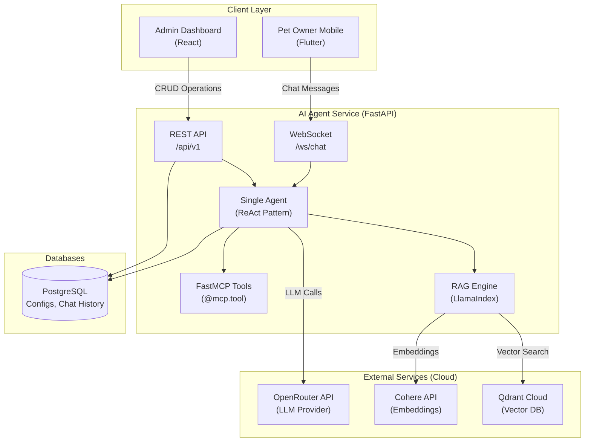
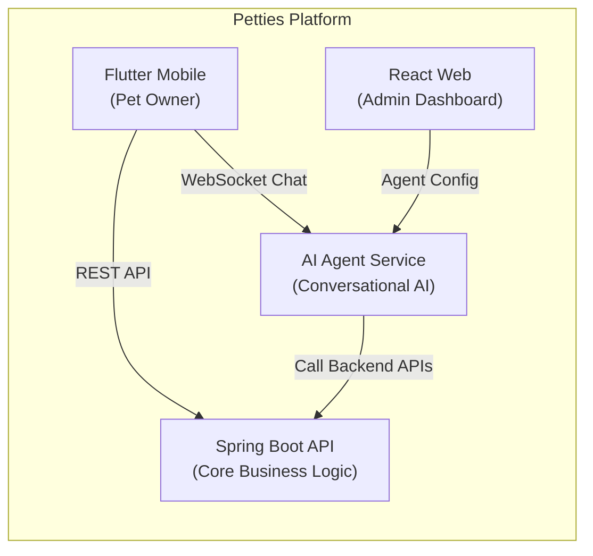
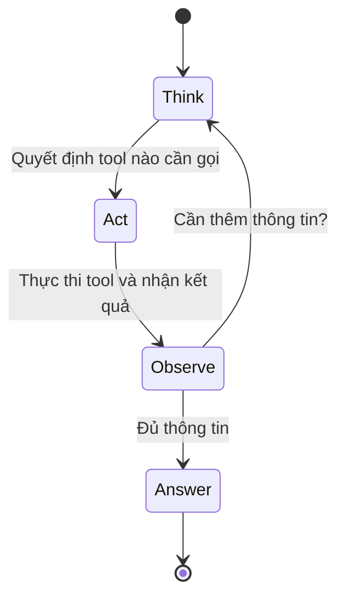
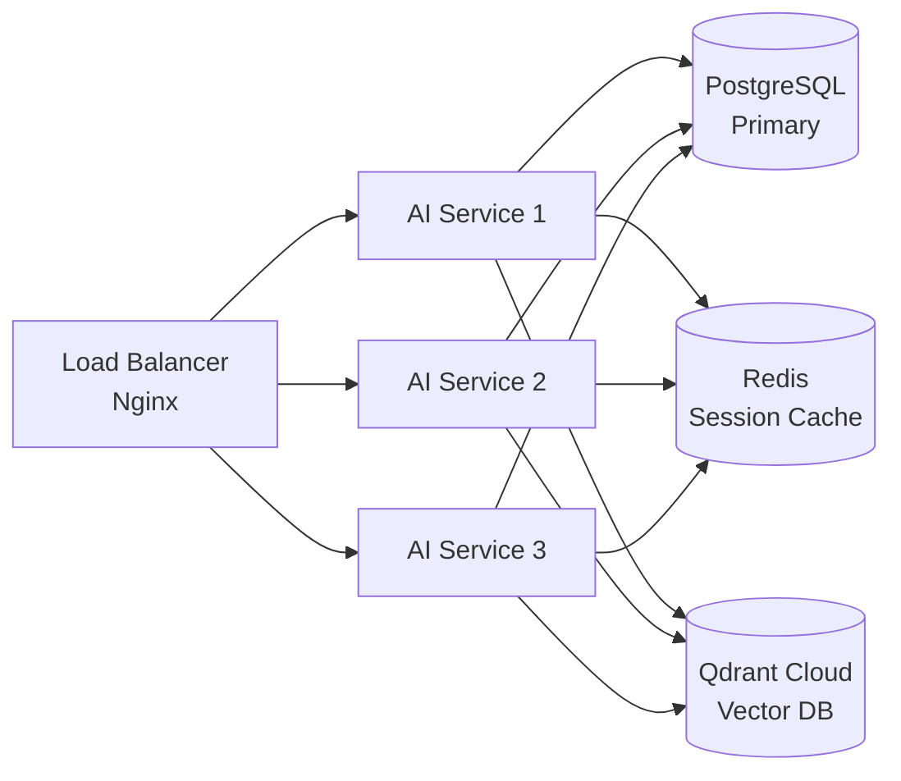
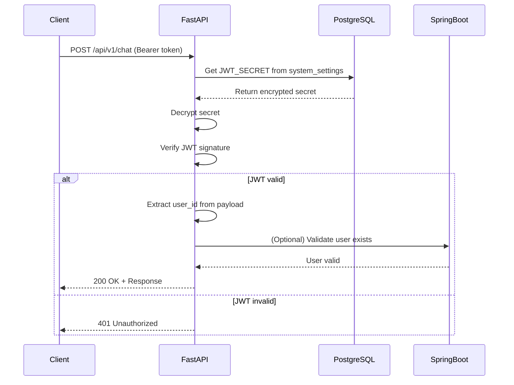
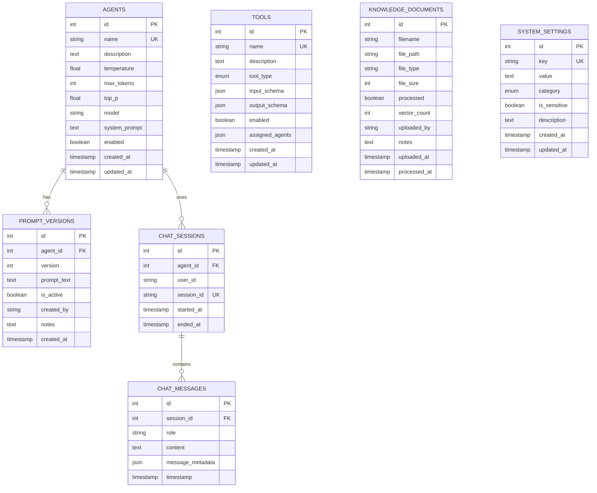

# SRS - PETTIES AI AGENT SERVICE
## Software Requirements Specification

**Project:** Petties - Veterinary Appointment Booking Platform
**Module:** AI Agent Service (FastAPI + LangGraph + RAG)
**Document Type:** Report 3 - Software Requirements Specification
**Version:** 1.6.0
**Last Updated:** 2026-02-02

---

## 1. GIỚI THIỆU

### 1.1 Mục đích tài liệu

Tài liệu SRS này mô tả đầy đủ các yêu cầu chức năng và phi chức năng của **Petties AI Agent Service** - một hệ thống trợ lý AI thông minh sử dụng Single Agent với ReAct pattern, RAG (Retrieval-Augmented Generation), và FastMCP Tools. Hệ thống không chỉ đơn thuần là chatbot mà còn là **trợ lý toàn diện** phục vụ:

- **Pet Owners (Mobile):** Tư vấn chăm sóc thú cưng, chẩn đoán sơ bộ triệu chứng, đặt lịch khám qua chat
- **Clinic Staff & Managers (Web):** Hỗ trợ quản lý lịch hẹn, gợi ý xử lý tình huống, tối ưu hóa quy trình làm việc
- **Administrators (Web):** Quản lý cấu hình Agent, Knowledge Base, và giám sát hệ thống

### 1.2 Phạm vi hệ thống

**AI Agent Service** bao gồm các chức năng chính:

- **Pet Owner Assistant:** Chat AI hỗ trợ tư vấn sức khỏe thú cưng và đặt lịch khám
- **Clinic Assistant:** Trợ lý cho nhân viên phòng khám trong việc quản lý booking và xử lý tình huống
- **Agent Management:** Quản lý cấu hình Single Agent (system prompt, hyperparameters, model selection)
- **Tool Management:** Quản lý FastMCP tools (@mcp.tool) với khả năng enable/disable
- **Knowledge Base:** Upload, indexing và truy vấn tài liệu cho RAG
- **Chat/Conversation:** WebSocket real-time streaming với ReAct trace visualization
- **Settings Management:** Quản lý API keys và cấu hình hệ thống động

### 1.3 Đối tượng sử dụng tài liệu

- **Product Owners:** Hiểu rõ requirements và acceptance criteria
- **Developers:** Backend (Python/FastAPI), Frontend (React), Mobile (Flutter)
- **QA/Testers:** Viết test cases dựa trên functional requirements
- **Stakeholders:** Đánh giá scope và feasibility

### 1.4 Kiến trúc hệ thống



---

## 2. MÔ TẢ TỔNG QUAN

### 2.1 Bối cảnh dự án

Petties là nền tảng đặt lịch khám thú y kết nối chủ thú cưng với các phòng khám. AI Agent Service được phát triển để:

1. **Hỗ trợ Pet Owners:** Tư vấn chăm sóc thú cưng, chẩn đoán sơ bộ triệu chứng, đặt lịch qua chat
2. **Hỗ trợ Clinic Staff:** Tự động trả lời câu hỏi thường gặp, gợi ý xử lý booking, tối ưu lịch làm việc
3. **Hỗ trợ Clinic Managers:** Quản lý thông minh, báo cáo xu hướng, tư vấn cải thiện dịch vụ
4. **Tăng trải nghiệm người dùng:** Chatbot thông minh 24/7 với khả năng hiểu tiếng Việt

### 2.2 Vai trò trong hệ sinh thái Petties



### 2.3 Kiến trúc Single Agent + ReAct

**Khác biệt với Multi-Agent:**

| Aspect | Multi-Agent (Cũ) | Single Agent + ReAct (Hiện tại) |
|--------|-----------------|--------------------------------|
| **Complexity** | Cao (supervisor, handoffs) | Thấp (1 agent + tools) |
| **Development Time** | 3-4 tuần | 1-2 tuần |
| **Debugging** | Khó (trace nhiều agents) | Dễ (1 ReAct loop) |
| **Extensibility** | Thêm agent mới | Thêm @mcp.tool mới |
| **Capability** | Specialized agents | 1 agent với nhiều skills |

**ReAct Pattern:**



**Ví dụ ReAct Flow:**

```
USER: "Mèo nhà tôi bỏ ăn 2 ngày, nên làm gì?"

THOUGHT: User mô tả triệu chứng, cần tra cứu bệnh
ACTION: symptom_search("mèo bỏ ăn 2 ngày")
OBSERVATION: Có thể: Tiêu hóa, Sốt, Stress, Nhiễm trùng

THOUGHT: Cần thêm context từ knowledge base
ACTION: pet_care_qa("mèo bỏ ăn nguyên nhân")
OBSERVATION: 3 chunks từ tài liệu thú y...

THOUGHT: Đủ thông tin để tư vấn sơ bộ
ANSWER: "Dựa trên triệu chứng, mèo có thể bị vấn đề tiêu hóa hoặc nhiễm trùng.
         Bạn nên đưa mèo đến phòng khám để khám chi tiết.
         Có cần tôi tìm phòng khám gần bạn không?"
```

---

## 3. ACTORS & USE CASES

### 3.1 Actors

| Actor | Mô tả | Platform |
|-------|-------|----------|
| **PET_OWNER** | Chủ thú cưng, người dùng chính của chatbot | Mobile only |
| **CLINIC_STAFF** | Nhân viên phòng khám, sử dụng AI để hỗ trợ công việc | Web |
| **CLINIC_MANAGER** | Quản lý phòng khám, sử dụng AI để tối ưu vận hành | Web |
| **ADMIN** | Quản trị viên hệ thống, cấu hình AI Agent | Web only |
| **SYSTEM** | Các background jobs (indexing, cleanup) | Backend |

### 3.2 Use Case Diagram

```mermaid
flowchart TB
    subgraph Actors
        PetOwner["👤 PET_OWNER<br/>(Mobile)"]
        ClinicStaff["👨‍⚕️ CLINIC_STAFF<br/>(Web)"]
        ClinicManager["👔 CLINIC_MANAGER<br/>(Web)"]
        Admin["👨‍💻 ADMIN<br/>(Web Dashboard)"]
        System["⚙️ SYSTEM<br/>(Background)"]
    end

    subgraph UseCases["Use Cases"]
        subgraph Chat["Chat & Conversation (Pet Owner)"]
            UC001["UC-001: Chat với AI Agent"]
            UC002["UC-002: Hỏi đáp chăm sóc pet"]
            UC003["UC-003: Tìm bệnh theo triệu chứng"]
            UC004["UC-004: Đặt lịch qua chat"]
            UC019["UC-019: Phân tích hình ảnh (Vision)"]
        end

        subgraph ClinicAssistant["Clinic Assistant (Staff & Manager)"]
            UC020["UC-020: Hỗ trợ xử lý booking"]
            UC021["UC-021: Gợi ý reassign staff"]
            UC022["UC-022: Trả lời FAQ cho khách"]
            UC023["UC-023: Tổng hợp thông tin bệnh nhân"]
            UC024["UC-024: Báo cáo xu hướng booking"]
            UC025["UC-025: Gợi ý tối ưu lịch làm việc"]
        end

        subgraph AgentMgmt["Agent Management"]
            UC005["UC-005: Cấu hình Agent"]
            UC006["UC-006: Chỉnh sửa System Prompt"]
            UC007["UC-007: Điều chỉnh Hyperparameters"]
            UC008["UC-008: Chọn LLM Model"]
        end

        subgraph ToolMgmt["Tool Management"]
            UC009["UC-009: Xem danh sách Tools"]
            UC010["UC-010: Enable/Disable Tool"]
            UC011["UC-011: Xem Tool Schema"]
        end

        subgraph KnowledgeBase["Knowledge Base"]
            UC012["UC-012: Upload tài liệu"]
            UC013["UC-013: Xóa tài liệu"]
            UC014["UC-014: Test RAG Retrieval"]
        end

        subgraph Settings["System Settings"]
            UC015["UC-015: Cấu hình API Keys"]
            UC016["UC-016: Test Connections"]
        end

        subgraph Background["Background Jobs"]
            UC017["UC-017: Auto-index documents"]
            UC018["UC-018: Cleanup chat history"]
        end
    end

    PetOwner --> UC001
    PetOwner --> UC002
    PetOwner --> UC003
    PetOwner --> UC004
    PetOwner --> UC019

    ClinicStaff --> UC020
    ClinicStaff --> UC021
    ClinicStaff --> UC022
    ClinicStaff --> UC023

    ClinicManager --> UC020
    ClinicManager --> UC021
    ClinicManager --> UC022
    ClinicManager --> UC023
    ClinicManager --> UC024
    ClinicManager --> UC025

    Admin --> UC005
    Admin --> UC006
    Admin --> UC007
    Admin --> UC008
    Admin --> UC009
    Admin --> UC010
    Admin --> UC011
    Admin --> UC012
    Admin --> UC013
    Admin --> UC014
    Admin --> UC015
    Admin --> UC016

    System --> UC017
    System --> UC018
```



---

## 4. FUNCTIONAL REQUIREMENTS - USE CASES

### 4.1 Chat & Conversation

#### **UC-001: Chat với AI Agent**

- **Actor:** PET_OWNER
- **Precondition:**
  - Pet Owner đã đăng nhập vào mobile app
  - AI Agent status = ENABLED
- **Main Flow:**
  1. Pet Owner mở tab "AI Assistant" trong mobile app
  2. System hiển thị chat interface với typing indicator
  3. Pet Owner nhập câu hỏi: "Mèo của tôi bị sổ mũi, nên làm gì?"
  4. System gửi message qua WebSocket đến AI Agent
  5. AI Agent xử lý bằng ReAct pattern:
     - THOUGHT: Phân tích câu hỏi
     - ACTION: Gọi tool `pet_care_qa("mèo sổ mũi")`
     - OBSERVATION: Nhận kết quả từ RAG
     - ANSWER: Trả lời user
  6. System stream response từng token về mobile app
  7. Pet Owner thấy response hiển thị dần (typing effect)
  8. Pet Owner có thể hỏi tiếp (multi-turn conversation)
- **Alternative Flow:**
  - AF1: Nếu Agent disabled → Hiển thị "Trợ lý AI đang bảo trì, vui lòng thử lại sau"
  - AF2: Nếu LLM API error → Retry 3 lần, sau đó hiển thị "Đã có lỗi xảy ra, vui lòng thử lại"
  - AF3: Nếu timeout (>30s) → Hiển thị "Request timeout, vui lòng thử lại"
- **Postcondition:**
  - Chat message được lưu vào database (chat_messages table)
  - Session history được cập nhật
- **Business Rules:**
  - BR-001: Mỗi session giới hạn 50 messages
  - BR-002: Session tự động expire sau 24h không hoạt động
  - BR-003: Response phải có citation nếu dùng RAG

---

#### **UC-002: Hỏi đáp chăm sóc pet (RAG-based)**

- **Actor:** PET_OWNER
- **Precondition:**
  - Knowledge Base đã có tài liệu được index
  - Tool `pet_care_qa` enabled
- **Main Flow:**
  1. Pet Owner hỏi: "Chó con 2 tháng tuổi nên ăn gì?"
  2. AI Agent nhận câu hỏi
  3. Agent quyết định gọi tool `pet_care_qa(question="chó con 2 tháng ăn gì")`
  4. Tool thực thi:
     - Tạo embedding câu hỏi bằng Cohere API
     - Query Qdrant Cloud để tìm top-K chunks (K=3)
     - Format kết quả trả về
  5. Agent nhận OBSERVATION từ tool
  6. Agent tổng hợp thông tin và trả lời với citations
  7. Pet Owner thấy response kèm nguồn tham khảo
- **Alternative Flow:**
  - AF1: Nếu RAG không tìm thấy thông tin → Agent sử dụng general knowledge + cảnh báo "Thông tin này không có trong knowledge base"
  - AF2: Nếu Qdrant Cloud lỗi → Fallback về OpenAI embeddings hoặc trả lời general
- **Postcondition:**
  - Chat message có metadata lưu tool_calls và citations
- **Business Rules:**
  - BR-004: Response phải inline cite nguồn (format: [Tài liệu X, trang Y])
  - BR-005: Nếu confidence < 0.6 → Thêm disclaimer "Tôi không chắc chắn, bạn nên hỏi nhân viên"

---

#### **UC-003: Tìm bệnh theo triệu chứng**

- **Actor:** PET_OWNER
- **Precondition:**
  - Tool `symptom_search` enabled
  - Database có dữ liệu triệu chứng-bệnh
- **Main Flow:**
  1. Pet Owner mô tả: "Mèo bỏ ăn 2 ngày, nôn, tiêu chảy"
  2. Agent nhận diện intent: tìm bệnh theo triệu chứng
  3. Agent gọi tool `symptom_search(symptoms="bỏ ăn, nôn, tiêu chảy, mèo")`
  4. Tool query database bệnh theo keywords
  5. Tool trả về danh sách bệnh có thể (ranked by relevance):
     - Viêm dạ dày ruột (90%)
     - Nhiễm trùng (70%)
     - Ngộ độc thức ăn (65%)
  6. Agent tổng hợp và gợi ý: "Có thể mèo bị viêm dạ dày ruột. Nên đưa đến nhân viên ngay."
  7. Agent hỏi: "Bạn có cần tôi tìm phòng khám gần bạn không?"
- **Alternative Flow:**
  - AF1: Nếu không tìm thấy bệnh phù hợp → Gợi ý hỏi thêm triệu chứng
  - AF2: Nếu triệu chứng nghiêm trọng (keywords: máu, co giật) → Ưu tiên gợi ý cấp cứu
- **Postcondition:**
  - Conversation context được cập nhật với thông tin bệnh
- **Business Rules:**
  - BR-006: Luôn khuyến nghị đi khám thật, không thay thế nhân viên
  - BR-007: Nếu triệu chứng nguy hiểm → Hiển thị warning banner

---

#### **UC-004: Đặt lịch qua chat**

- **Actor:** PET_OWNER
- **Precondition:**
  - Pet Owner đã có tài khoản và ít nhất 1 pet
  - Tools enabled: `search_clinics`, `check_slots`, `create_booking`
- **Main Flow:**
  1. Pet Owner: "Tôi muốn đặt lịch khám cho mèo Mimi ở Quận 7"
  2. Agent gọi `search_clinics(location="Quận 7")`
  3. Tool query Spring Boot API: `GET /api/v1/clinics?district=7`
  4. Tool trả về 3 clinics gần nhất
  5. Agent: "Có 3 phòng khám: ABC, XYZ, DEF. Bạn chọn phòng nào?"
  6. Pet Owner: "ABC, ngày mai có slot không?"
  7. Agent gọi `check_slots(clinic_id="ABC", date="2025-12-28")`
  8. Tool query: `GET /api/v1/clinics/ABC/slots?date=2025-12-28`
  9. Tool trả về: 09:00, 10:30, 14:00, 15:30 available
  10. Agent: "Ngày mai có slot: 09:00, 10:30, 14:00, 15:30"
  11. Pet Owner: "Đặt 14:00, khám tổng quát"
  12. Agent gọi `create_booking(clinic_id="ABC", slot="14:00", pet_id="mimi", service="checkup")`
  13. Tool call API: `POST /api/v1/bookings`
  14. Tool nhận response: Booking created #B123
  15. Agent: "Đã đặt lịch thành công! Mã booking: #B123. Ngày 28/12 lúc 14:00 tại ABC."
- **Alternative Flow:**
  - AF1: Nếu user chưa chọn pet → Hỏi "Bạn muốn đặt cho pet nào?"
  - AF2: Nếu slot đã hết → Gợi ý slot khác hoặc ngày khác
  - AF3: Nếu create booking fail → Rollback và thông báo lỗi
- **Postcondition:**
  - Booking được tạo trong Spring Boot database
  - Pet Owner nhận notification
- **Business Rules:**
  - BR-008: Phải confirm lại trước khi create booking
  - BR-009: Nếu user không phản hồi trong 5 phút → Hủy flow và hỏi lại

#### **UC-019: Phân tích hình ảnh (Vision Health Analysis)**

- **Actor:** PET_OWNER
- **Precondition:**
  - App được cấp quyền Camera/Gallery
  - Vision-capable model (Gemini 2.0 Flash) enabled
- **Main Flow:**
  1. User gửi hình ảnh triệu chứng của pet qua chat interface.
  2. System upload ảnh lên Cloudinary, trả về `image_url`.
  3. AI Agent gọi tool `analyze_pet_image(image_url)`.
  4. Tool phân tích:
     - Nhận diện pet và triệu chứng (ví dụ: viêm da, sưng mắt).
     - Đánh giá mức độ nghiêm trọng (Severity: Mild/Moderate/Urgent).
  5. Agent phản hồi cảnh báo và đề xuất hành động (Ví dụ: Suggest booking nếu severity cao).
- **Business Rules:**
  - BR-031: Phải kèm disclaimer: "Chẩn đoán hình ảnh chỉ mang tính tham khảo".
  - BR-032: Không chẩn đoán xác định bệnh, chỉ nêu dấu hiệu nghi vấn.

---


### 4.1.1 Clinic Assistant (Staff & Manager)

#### **UC-020: Hỗ trợ xử lý booking**

- **Actor:** CLINIC_STAFF, CLINIC_MANAGER
- **Precondition:**
  - Staff/Manager đã đăng nhập vào Web Dashboard
  - AI Agent status = ENABLED
  - Tools: `get_booking_details`, `suggest_actions` enabled
- **Main Flow:**
  1. Staff/Manager vào tab "AI Trợ lý" trên web dashboard
  2. Staff hỏi: "Booking #BK-240202-001 có vấn đề gì không?"
  3. AI Agent gọi tool `get_booking_details(booking_id="BK-240202-001")`
  4. Agent phân tích:
     - Thời gian booking có conflict không?
     - Staff được assign có shift không?
     - Pet có lịch sử dị ứng không?
  5. Agent trả về: "Booking này có vấn đề: Staff Nguyễn Văn A không có ca trực vào thời gian 14:00. Gợi ý: Reassign cho Staff Trần Văn B đang rảnh."
  6. Staff click "Áp dụng gợi ý" hoặc xử lý thủ công
- **Alternative Flow:**
  - AF1: Nếu không tìm thấy booking → "Không tìm thấy booking với mã này"
  - AF2: Nếu booking không có vấn đề → "Booking hợp lệ, không có conflict"
- **Postcondition:**
  - Staff được gợi ý cách xử lý phù hợp
- **Business Rules:**
  - BR-033: AI chỉ gợi ý, Staff quyết định cuối cùng
  - BR-034: Tất cả gợi ý được log để audit

---

#### **UC-021: Gợi ý reassign staff**

- **Actor:** CLINIC_STAFF, CLINIC_MANAGER
- **Precondition:**
  - Booking cần reassign (staff nghỉ, quá tải, etc.)
  - Tool `suggest_staff_reassignment` enabled
- **Main Flow:**
  1. Manager hỏi: "Staff nào có thể thay thế cho ca khám 15:00 hôm nay?"
  2. AI Agent gọi tool `suggest_staff_reassignment(time="15:00", date="today")`
  3. Tool phân tích:
     - Staff nào đang có shift vào thời gian đó
     - Staff nào có specialty phù hợp với dịch vụ
     - Workload hiện tại của mỗi staff
  4. Agent trả về danh sách gợi ý:
     - "1. Trần Văn B (Specialty: Chó) - Đang rảnh, 2 booking hôm nay"
     - "2. Lê Thị C (Specialty: General) - Ca 14:00-18:00, 3 booking"
  5. Manager chọn staff phù hợp và confirm reassign
- **Alternative Flow:**
  - AF1: Nếu không có staff phù hợp → Gợi ý liên hệ staff nghỉ hoặc reschedule
- **Postcondition:**
  - Manager có danh sách staff phù hợp để reassign
- **Business Rules:**
  - BR-035: Ưu tiên staff có specialty khớp với service category
  - BR-036: Hiển thị workload để tránh overload staff

---

#### **UC-022: Trả lời FAQ cho khách**

- **Actor:** CLINIC_STAFF, CLINIC_MANAGER
- **Precondition:**
  - Knowledge Base đã có FAQ của phòng khám
  - Tool `clinic_faq_search` enabled
- **Main Flow:**
  1. Staff đang chat với khách hàng, cần tra cứu nhanh
  2. Staff hỏi AI: "Phòng khám có chính sách hoàn tiền không?"
  3. AI Agent gọi RAG tool `clinic_faq_search(query="chính sách hoàn tiền")`
  4. Agent trả về: "Theo chính sách phòng khám: Hoàn 100% nếu hủy trước 24h, hoàn 50% nếu hủy trước 6h, không hoàn nếu hủy < 6h."
  5. Staff copy/paste câu trả lời gửi cho khách
- **Alternative Flow:**
  - AF1: Nếu không tìm thấy → "Không tìm thấy thông tin. Vui lòng liên hệ quản lý."
- **Postcondition:**
  - Staff có câu trả lời chính xác để hỗ trợ khách
- **Business Rules:**
  - BR-037: Trích dẫn nguồn từ Knowledge Base
  - BR-038: Nếu confidence < 0.7 → Cảnh báo staff xác nhận lại

---

#### **UC-023: Tổng hợp thông tin bệnh nhân**

- **Actor:** CLINIC_STAFF, CLINIC_MANAGER
- **Precondition:**
  - EMR records tồn tại cho pet
  - Tool `summarize_patient_history` enabled
- **Main Flow:**
  1. Staff chuẩn bị khám cho pet, cần review lịch sử
  2. Staff hỏi AI: "Tóm tắt lịch sử khám của mèo Mimi (Pet ID: 123)"
  3. AI Agent gọi tool `summarize_patient_history(pet_id="123")`
  4. Agent tổng hợp từ EMR records:
     - "Mèo Mimi, 2 tuổi, British Shorthair"
     - "Lần khám gần nhất: 15/01/2026 - Tiêm vaccine dại"
     - "Tiền sử: Dị ứng với kháng sinh Amoxicillin (ghi chú 10/2025)"
     - "Gợi ý: Kiểm tra vaccine tiếp theo vào 07/2026"
  5. Staff review thông tin trước khi khám
- **Alternative Flow:**
  - AF1: Nếu pet chưa có EMR → "Bệnh nhân mới, chưa có lịch sử khám"
- **Postcondition:**
  - Staff có overview nhanh về bệnh nhân
- **Business Rules:**
  - BR-039: Highlight cảnh báo dị ứng và thông tin quan trọng
  - BR-040: Chỉ hiển thị cho staff có quyền truy cập EMR

---

#### **UC-024: Báo cáo xu hướng booking** (Manager Only)

- **Actor:** CLINIC_MANAGER
- **Precondition:**
  - Có dữ liệu booking ít nhất 30 ngày
  - Tool `analyze_booking_trends` enabled
- **Main Flow:**
  1. Manager hỏi: "Xu hướng booking tháng này như thế nào?"
  2. AI Agent gọi tool `analyze_booking_trends(period="this_month")`
  3. Agent phân tích và trả về:
     - "Tổng booking tháng này: 156 (+12% so với tháng trước)"
     - "Dịch vụ phổ biến nhất: Tiêm vaccine (35%), Khám tổng quát (28%)"
     - "Thời gian đông nhất: 9:00-11:00 sáng"
     - "Gợi ý: Tăng slot buổi sáng, giảm slot buổi chiều (thường trống 30%)"
  4. Manager sử dụng insights để điều chỉnh operation
- **Alternative Flow:**
  - AF1: Nếu dữ liệu ít → "Chưa đủ dữ liệu để phân tích xu hướng"
- **Postcondition:**
  - Manager có insights để optimize operation
- **Business Rules:**
  - BR-041: Chỉ Manager mới access được báo cáo này
  - BR-042: Dữ liệu được aggregate, không hiển thị thông tin cá nhân khách

---

#### **UC-025: Gợi ý tối ưu lịch làm việc** (Manager Only)

- **Actor:** CLINIC_MANAGER
- **Precondition:**
  - Có dữ liệu shift và booking
  - Tool `suggest_schedule_optimization` enabled
- **Main Flow:**
  1. Manager hỏi: "Lịch làm việc tuần tới có hợp lý không?"
  2. AI Agent gọi tool `suggest_schedule_optimization(week="next_week")`
  3. Agent phân tích workload và trả về:
     - "Thứ 2: Có 20 booking nhưng chỉ 2 staff → Gợi ý thêm 1 staff"
     - "Thứ 4: 4 staff nhưng chỉ 8 booking → Có thể giảm 1 staff"
     - "Specialty gap: Không có staff Dermatology ngày Thứ 6"
  4. Manager điều chỉnh lịch dựa trên gợi ý
- **Alternative Flow:**
  - AF1: Nếu lịch hợp lý → "Lịch tuần tới đã tối ưu, không có gợi ý"
- **Postcondition:**
  - Manager optimize được staff scheduling
- **Business Rules:**
  - BR-043: Đảm bảo mỗi dịch vụ có staff với specialty phù hợp
  - BR-044: Không để staff overload (> 10 booking/ngày)

---

### 4.2 Agent Management

#### **UC-005: Cấu hình Agent**

- **Actor:** ADMIN
- **Precondition:**
  - Admin đã đăng nhập Web Dashboard
  - Có quyền ADMIN
- **Main Flow:**
  1. Admin truy cập menu "AI Configuration" → "Agent Settings"
  2. System load cấu hình hiện tại từ database (agents table)
  3. System hiển thị form:
     - Agent Name: petties_agent (readonly)
     - Description: [textarea editable]
     - Status: [Toggle ENABLED/DISABLED]
     - Model: [Dropdown select OpenRouter models]
     - Temperature: [Slider 0.0 - 1.0]
     - Max Tokens: [Number input 100-4000]
     - Top-P: [Slider 0.0 - 1.0]
  4. Admin chỉnh sửa các trường
  5. Admin click "Save Changes"
  6. System validate input
  7. System update database
  8. System hot-reload agent configuration (không restart server)
  9. System hiển thị toast: "Cập nhật thành công"
- **Alternative Flow:**
  - AF1: Nếu validation fail → Hiển thị error trên field
  - AF2: Nếu update database fail → Rollback và hiển thị error
- **Postcondition:**
  - Agent config được cập nhật trong `agents` table
  - Next chat session sử dụng config mới
- **Business Rules:**
  - BR-010: Temperature phải trong khoảng [0.0, 1.0]
  - BR-011: Max Tokens phải >= 100 và <= 4000
  - BR-012: Top-P phải trong khoảng [0.0, 1.0]

---

#### **UC-006: Chỉnh sửa System Prompt**

- **Actor:** ADMIN
- **Precondition:**
  - Admin có quyền chỉnh sửa agent
- **Main Flow:**
  1. Admin vào tab "System Prompt Editor"
  2. System hiển thị:
     - Code editor với syntax highlighting
     - Prompt hiện tại (active version)
     - Dropdown "Version History" (v1, v2, v3...)
  3. Admin chỉnh sửa prompt:
     ```
     Bạn là trợ lý AI của Petties, chuyên về chăm sóc thú cưng.

     Nhiệm vụ:
     - Trả lời câu hỏi về chăm sóc pet
     - Tìm bệnh dựa trên triệu chứng
     - Hỗ trợ đặt lịch khám

     Quy tắc:
     - Luôn lịch sự và thân thiện
     - Nếu không chắc chắn, gợi ý hỏi nhân viên
     - Cite nguồn khi dùng knowledge base
     ```
  4. Admin click "Save as New Version"
  5. System tạo PromptVersion mới trong database:
     - version = max(version) + 1
     - prompt_text = [nội dung mới]
     - is_active = True
     - created_by = [admin_username]
     - notes = [optional notes]
  6. System set is_active = False cho versions cũ
  7. System update agents.system_prompt
  8. System hiển thị: "Đã lưu version 4"
- **Alternative Flow:**
  - AF1: Admin chọn "Revert to Version X" → Restore prompt cũ
  - AF2: Admin click "Preview" → Test prompt trong playground
- **Postcondition:**
  - Prompt version mới được tạo trong `prompt_versions` table
  - Agent sử dụng prompt mới từ lần chat tiếp theo
- **Business Rules:**
  - BR-013: Prompt không được rỗng
  - BR-014: Prompt phải < 4000 characters
  - BR-015: Luôn versioning, không xóa version cũ

---

#### **UC-007: Điều chỉnh Hyperparameters**

- **Actor:** ADMIN
- **Precondition:**
  - Agent đang tồn tại trong database
- **Main Flow:**
  1. Admin vào tab "Hyperparameters"
  2. System hiển thị sliders:
     - **Temperature** (0.0 - 1.0): Độ sáng tạo của response
       - 0.0 = Deterministic, lặp lại
       - 1.0 = Creative, random
       - Default: 0.7
     - **Max Tokens** (100 - 4000): Độ dài tối đa của response
       - Default: 2000
     - **Top-P** (0.0 - 1.0): Nucleus sampling
       - Default: 0.9
  3. Admin kéo slider Temperature = 0.8
  4. Admin nhập Max Tokens = 1500
  5. Admin kéo slider Top-P = 0.95
  6. Admin click "Apply"
  7. System update agents table
  8. System test với sample query (optional)
  9. System hiển thị: "Parameters updated"
- **Alternative Flow:**
  - AF1: Admin click "Reset to Defaults" → Restore về giá trị mặc định
  - AF2: Admin click "Test in Playground" → Mở playground với params mới
- **Postcondition:**
  - Hyperparameters được cập nhật
  - Next LLM call sử dụng params mới
- **Business Rules:**
  - BR-016: Thay đổi parameters không cần restart server
  - BR-017: Parameters apply ngay lập tức cho session mới

---

#### **UC-008: Chọn LLM Model**

- **Actor:** ADMIN
- **Precondition:**
  - OpenRouter API Key đã được cấu hình
- **Main Flow:**
  1. Admin vào "Agent Settings" → "Model Selection"
  2. System hiển thị dropdown với models:
     - google/gemini-2.0-flash-exp:free (Free, 1M context)
     - meta-llama/llama-3.3-70b-instruct ($0.1/1M tokens)
     - anthropic/claude-3.5-sonnet ($3/1M tokens)
     - deepseek/deepseek-chat ($0.14/1M tokens)
  3. Admin chọn: meta-llama/llama-3.3-70b-instruct
  4. System hiển thị info:
     - Context window: 128K tokens
     - Pricing: $0.1/1M input, $0.15/1M output
     - Performance: Good for Vietnamese
  5. Admin click "Save"
  6. System update agents.model
  7. System test connection với model mới
  8. System hiển thị: "Model updated successfully"
- **Alternative Flow:**
  - AF1: Nếu test connection fail → Không lưu, hiển thị error
  - AF2: Admin set "Fallback Model" để backup
- **Postcondition:**
  - Model được cập nhật
  - Next chat sử dụng model mới
- **Business Rules:**
  - BR-018: Luôn có fallback model
  - BR-019: Nếu primary model fail → Auto switch sang fallback

---

### 4.3 Tool Management

#### **UC-009: Xem danh sách Tools**

- **Actor:** ADMIN
- **Precondition:**
  - Tools đã được code với @mcp.tool
- **Main Flow:**
  1. Admin vào menu "Tool Management"
  2. System query database: `SELECT * FROM tools`
  3. System hiển thị bảng:

     | Tool Name | Description | Type | Status | Actions |
     |-----------|-------------|------|--------|---------|
     | pet_care_qa | RAG-based Q&A | code_based | ✅ Enabled | [View Schema] [Disable] |
     | symptom_search | Symptom → Disease lookup | code_based | ✅ Enabled | [View Schema] [Disable] |
     | search_clinics | Find nearby clinics | api_based | ✅ Enabled | [View Schema] [Disable] |
     | check_slots | Check available slots | api_based | ✅ Enabled | [View Schema] [Disable] |
     | create_booking | Create booking via chat | api_based | ❌ Disabled | [View Schema] [Enable] |
  4. Admin click vào tool name → Mở detail modal
- **Alternative Flow:**
  - AF1: Admin click "Scan New Tools" → System rescan codebase và update DB
- **Postcondition:**
  - Admin có overview về tools trong hệ thống
- **Business Rules:**
  - BR-020: Chỉ hiển thị tools được assign cho current agent

---

#### **UC-010: Enable/Disable Tool**

- **Actor:** ADMIN
- **Precondition:**
  - Tool tồn tại trong database
- **Main Flow:**
  1. Admin vào "Tool Management"
  2. Admin thấy tool `create_booking` đang Disabled
  3. Admin click nút "Enable"
  4. System hiển thị confirm dialog:
     - "Enable tool 'create_booking'?"
     - "Agent sẽ có thể gọi tool này từ lần chat tiếp theo."
  5. Admin click "Confirm"
  6. System update: `UPDATE tools SET enabled = TRUE WHERE name = 'create_booking'`
  7. System reload agent configuration
  8. System hiển thị toast: "Tool enabled"
  9. Tool status badge: ❌ Disabled → ✅ Enabled
- **Alternative Flow:**
  - AF1: Admin disable tool đang enabled → Ngược lại flow trên
  - AF2: Nếu tool đang được dùng trong active session → Warning "Tool đang được sử dụng"
- **Postcondition:**
  - Tool status được update
  - Agent có/không thể gọi tool này
- **Business Rules:**
  - BR-021: Disable tool không ảnh hưởng chat sessions đang chạy
  - BR-022: Enable tool apply ngay lập tức cho session mới

---

#### **UC-011: Xem Tool Schema**

- **Actor:** ADMIN
- **Precondition:**
  - Tool có input_schema và output_schema trong DB
- **Main Flow:**
  1. Admin vào "Tool Management"
  2. Admin click "View Schema" trên tool `create_booking`
  3. System hiển thị modal:

     **Tool: create_booking**

     **Description:**
     Tạo lịch hẹn thú y cho thú cưng qua chat conversation

     **Input Schema:**
     ```json
     {
       "type": "object",
       "properties": {
         "clinic_id": {
           "type": "string",
           "description": "ID của phòng khám"
         },
         "slot_id": {
           "type": "string",
           "description": "ID của slot thời gian"
         },
         "pet_id": {
           "type": "string",
           "description": "ID của thú cưng"
         },
         "service_id": {
           "type": "string",
           "description": "ID của dịch vụ khám"
         }
       },
       "required": ["clinic_id", "slot_id", "pet_id", "service_id"]
     }
     ```

     **Output Schema:**
     ```json
     {
       "type": "object",
       "properties": {
         "booking_id": {
           "type": "string",
           "description": "Mã booking vừa tạo"
         },
         "status": {
           "type": "string",
           "enum": ["PENDING", "CONFIRMED"]
         },
         "message": {
           "type": "string",
           "description": "Thông báo kết quả"
         }
       }
     }
     ```
  4. Admin đọc và hiểu schema
- **Alternative Flow:**
  - AF1: Admin click "Test Tool" → Mở playground để test thử
- **Postcondition:**
  - Admin hiểu rõ tool hoạt động như thế nào
- **Business Rules:**
  - BR-023: Schema phải tuân thủ JSON Schema standard

---

### 4.4 Knowledge Base Management

#### **UC-012: Upload tài liệu**

- **Actor:** ADMIN
- **Precondition:**
  - RAG Engine đã được cấu hình
  - Cohere API Key và Qdrant URL valid
- **Main Flow:**
  1. Admin vào "Knowledge Base" → "Upload Document"
  2. System hiển thị upload form:
     - File input (accept: .pdf, .docx, .txt, .md)
     - Notes (optional)
  3. Admin chọn file: `cham_soc_cho_meo.pdf` (2.5 MB)
  4. Admin nhập notes: "Tài liệu chăm sóc mèo cơ bản"
  5. Admin click "Upload"
  6. System validate:
     - File type allowed
     - File size < 10 MB
  7. System save file vào storage: `uploads/knowledge/cham_soc_cho_meo.pdf`
  8. System tạo record trong `knowledge_documents`:
     - filename: cham_soc_cho_meo.pdf
     - file_path: uploads/knowledge/...
     - file_type: pdf
     - file_size: 2621440 bytes
     - uploaded_by: admin_username
     - processed: False
     - vector_count: 0
  9. System trigger background job: `process_document(doc_id)`
  10. Background job:
      - Parse PDF bằng LlamaIndex
      - Chunk text (chunk_size=512, overlap=50)
      - Generate embeddings với Cohere API
      - Upsert vectors vào Qdrant Cloud
      - Update: processed=True, vector_count=45
  11. Admin thấy status: "Processing..." → "Processed (45 vectors)"
- **Alternative Flow:**
  - AF1: Nếu file quá lớn → Hiển thị "File size exceeds 10 MB"
  - AF2: Nếu file type không hỗ trợ → Hiển thị "Unsupported file type"
  - AF3: Nếu processing fail → Hiển thị error và cho phép retry
- **Postcondition:**
  - Document được lưu trong storage
  - Vectors được index trong Qdrant
  - RAG có thể truy vấn document này
- **Business Rules:**
  - BR-024: Mỗi document có unique filename
  - BR-025: Processing phải hoàn thành trong 5 phút
  - BR-026: Chunk size = 512 tokens, overlap = 50 tokens

---

#### **UC-013: Xóa tài liệu**

- **Actor:** ADMIN
- **Precondition:**
  - Document tồn tại trong knowledge_documents
- **Main Flow:**
  1. Admin vào "Knowledge Base" → Danh sách documents
  2. System hiển thị bảng:

     | Filename | Type | Size | Vectors | Uploaded | Actions |
     |----------|------|------|---------|----------|---------|
     | cham_soc_cho_meo.pdf | PDF | 2.5 MB | 45 | 2025-12-20 | [Delete] |
     | benh_cua_cho.docx | DOCX | 1.2 MB | 32 | 2025-12-18 | [Delete] |
  3. Admin click "Delete" trên `benh_cua_cho.docx`
  4. System hiển thị confirm:
     - "Xóa tài liệu 'benh_cua_cho.docx'?"
     - "32 vectors sẽ bị xóa khỏi Qdrant. Hành động không thể hoàn tác."
  5. Admin click "Confirm"
  6. System:
     - Xóa file vật lý: `os.remove(file_path)`
     - Xóa vectors từ Qdrant: `qdrant_client.delete(filter={"doc_id": X})`
     - Xóa record từ DB: `DELETE FROM knowledge_documents WHERE id = X`
  7. System hiển thị toast: "Document deleted"
- **Alternative Flow:**
  - AF1: Nếu Qdrant delete fail → Rollback transaction
  - AF2: Admin cancel → Không làm gì
- **Postcondition:**
  - Document bị xóa khỏi storage, DB, và Qdrant
  - RAG không còn trả về chunks từ document này
- **Business Rules:**
  - BR-027: Phải confirm trước khi xóa
  - BR-028: Xóa phải atomic (all or nothing)

---

#### **UC-014: Test RAG Retrieval**

- **Actor:** ADMIN
- **Precondition:**
  - Knowledge Base có ít nhất 1 document đã processed
- **Main Flow:**
  1. Admin vào "Knowledge Base" → "Test Retrieval"
  2. System hiển thị form:
     - Query input: [text field]
     - Top-K: [slider 1-10, default 3]
  3. Admin nhập query: "Mèo bị sổ mũi nên làm gì?"
  4. Admin set Top-K = 3
  5. Admin click "Search"
  6. System:
     - Generate embedding cho query bằng Cohere
     - Query Qdrant: `qdrant_client.search(collection, query_vector, limit=3)`
     - Format results
  7. System hiển thị kết quả:

     **Top 3 Results:**

     **Chunk 1** (Score: 0.89)
     Source: cham_soc_cho_meo.pdf (Page 12)
     Text: "Khi mèo bị sổ mũi, cần quan sát thêm các triệu chứng khác như sốt,
            hắt hơi, chảy nước mắt. Nếu kéo dài > 3 ngày, nên đưa đến nhân viên..."

     **Chunk 2** (Score: 0.82)
     Source: benh_thuong_gap_meo.pdf (Page 5)
     Text: "Viêm đường hô hấp trên ở mèo thường biểu hiện qua sổ mũi,
            ho khan, mệt mỏi. Nguyên nhân có thể do virus hoặc vi khuẩn..."

     **Chunk 3** (Score: 0.75)
     Source: cham_soc_cho_meo.pdf (Page 15)
     Text: "Để phòng bệnh đường hô hấp, nên tiêm vaccine định kỳ,
            giữ chuồng trại sạch sẽ, tránh tiếp xúc với mèo bệnh..."
  8. Admin đánh giá kết quả:
     - Relevant chunks?
     - Scores hợp lý?
     - Coverage đủ?
- **Alternative Flow:**
  - AF1: Nếu không tìm thấy chunks → Hiển thị "No results found"
  - AF2: Admin adjust Top-K và search lại
- **Postcondition:**
  - Admin verify RAG hoạt động đúng
- **Business Rules:**
  - BR-029: Score phải >= 0.7 để được coi là relevant
  - BR-030: Hiển thị source filename và page number

---

### 4.5 System Settings

#### **UC-015: Cấu hình API Keys**

- **Actor:** ADMIN
- **Precondition:**
  - Admin có quyền quản lý system settings
- **Main Flow:**
  1. Admin vào "System Settings" → "API Keys"
  2. System hiển thị form với các fields (masked):

     **LLM Provider (OpenRouter)**
     - OPENROUTER_API_KEY: ************ [Edit]
     - OPENROUTER_DEFAULT_MODEL: google/gemini-2.0-flash-exp:free
     - OPENROUTER_FALLBACK_MODEL: meta-llama/llama-3.3-70b-instruct

     **Embeddings (Cohere)**
     - COHERE_API_KEY: ************ [Edit]
     - COHERE_EMBEDDING_MODEL: embed-multilingual-v3.0

     **Vector DB (Qdrant Cloud)**
     - QDRANT_URL: https://xxxxxx.qdrant.io:6333
     - QDRANT_API_KEY: ************ [Edit]
     - QDRANT_COLLECTION_NAME: petties_knowledge_base
  3. Admin click [Edit] trên OPENROUTER_API_KEY
  4. System hiển thị input field (type=password)
  5. Admin nhập key mới: `sk-or-v1-xxxxxxxxxxxxx`
  6. Admin click "Save"
  7. System:
     - Encrypt key bằng AES-256
     - Update `system_settings` table:
       ```sql
       UPDATE system_settings
       SET value = [encrypted_value], updated_at = NOW()
       WHERE key = 'OPENROUTER_API_KEY';
       ```
     - Hot-reload configuration
  8. System test connection với OpenRouter API
  9. System hiển thị toast: "API Key updated successfully"
- **Alternative Flow:**
  - AF1: Nếu test connection fail → Hiển thị error, không lưu
  - AF2: Admin cancel → Không thay đổi gì
- **Postcondition:**
  - API Key được cập nhật và encrypt
  - Next LLM call sử dụng key mới
- **Business Rules:**
  - BR-031: Sensitive values phải encrypt trước khi lưu DB
  - BR-032: Hiển thị masked value (*** thay vì plaintext)
  - BR-033: Phải test connection trước khi lưu

---

#### **UC-016: Test Connections**

- **Actor:** ADMIN
- **Precondition:**
  - API Keys đã được cấu hình
- **Main Flow:**
  1. Admin vào "System Settings" → "Test Connections"
  2. System hiển thị dashboard:

     **Service Health Check**

     | Service | Status | Latency | Last Check |
     |---------|--------|---------|------------|
     | OpenRouter API | 🟢 OK | 234ms | 2 mins ago |
     | Cohere API | 🟢 OK | 189ms | 2 mins ago |
     | Qdrant Cloud | 🟢 OK | 156ms | 2 mins ago |
     | Spring Boot API | 🟢 OK | 45ms | 2 mins ago |
  3. Admin click "Test All"
  4. System thực hiện parallel health checks:
     - **OpenRouter:** `POST /api/v1/chat/completions` với message test
     - **Cohere:** `POST /embed` với text test
     - **Qdrant:** `GET /collections/{collection_name}`
     - **Spring Boot:** `GET /api/v1/health`
  5. System update status realtime
  6. Nếu tất cả OK → Hiển thị "All services healthy"
- **Alternative Flow:**
  - AF1: Nếu service nào fail → Hiển thị 🔴 Error + error message
  - AF2: Admin click "Retry" trên failed service
- **Postcondition:**
  - Admin biết services nào đang hoạt động
- **Business Rules:**
  - BR-034: Health check timeout = 10s
  - BR-035: Auto refresh mỗi 5 phút

---

### 4.6 Background Jobs

#### **UC-017: Auto-index documents**

- **Actor:** SYSTEM
- **Precondition:**
  - Document đã được upload (processed=False)
- **Main Flow:**
  1. Background worker check `knowledge_documents` table:
     ```sql
     SELECT * FROM knowledge_documents
     WHERE processed = FALSE
     LIMIT 1;
     ```
  2. Worker nhận document chưa processed
  3. Worker parse file:
     - PDF: PyPDF2 / pdfplumber
     - DOCX: python-docx
     - TXT/MD: plain text reader
  4. Worker chunk text bằng LlamaIndex:
     - SentenceSplitter(chunk_size=512, chunk_overlap=50)
  5. Worker generate embeddings:
     ```python
     chunks = [chunk1, chunk2, chunk3, ...]
     embeddings = cohere_client.embed(
         texts=chunks,
         model="embed-multilingual-v3.0",
         input_type="search_document"
     ).embeddings
     ```
  6. Worker upsert vào Qdrant:
     ```python
     qdrant_client.upsert(
         collection_name="petties_knowledge_base",
         points=[
             PointStruct(
                 id=uuid4(),
                 vector=embedding,
                 payload={
                     "doc_id": doc.id,
                     "filename": doc.filename,
                     "chunk_index": i,
                     "text": chunk
                 }
             )
             for i, (chunk, embedding) in enumerate(zip(chunks, embeddings))
         ]
     )
     ```
  7. Worker update database:
     ```sql
     UPDATE knowledge_documents
     SET processed = TRUE,
         vector_count = [số chunks],
         processed_at = NOW()
     WHERE id = [doc_id];
     ```
- **Alternative Flow:**
  - AF1: Nếu parse fail → Log error, set processed=False, retry sau 5 phút
  - AF2: Nếu Cohere API limit → Queue job, retry sau 1 phút
  - AF3: Nếu Qdrant timeout → Retry 3 lần, sau đó alert admin
- **Postcondition:**
  - Document được index thành công
  - RAG có thể query document
- **Business Rules:**
  - BR-036: Worker chạy mỗi 30 giây
  - BR-037: Max retry = 3 lần
  - BR-038: Processing timeout = 5 phút/document

---

#### **UC-018: Cleanup chat history**

- **Actor:** SYSTEM
- **Precondition:**
  - Chat sessions tồn tại trong database
- **Main Flow:**
  1. Cronjob chạy hàng ngày lúc 2:00 AM
  2. Job query sessions cũ:
     ```sql
     SELECT id FROM chat_sessions
     WHERE ended_at < NOW() - INTERVAL '30 days'
        OR (started_at < NOW() - INTERVAL '7 days' AND ended_at IS NULL);
     ```
  3. Job xóa messages của sessions này:
     ```sql
     DELETE FROM chat_messages
     WHERE session_id IN ([session_ids]);
     ```
  4. Job xóa sessions:
     ```sql
     DELETE FROM chat_sessions
     WHERE id IN ([session_ids]);
     ```
  5. Job log kết quả: "Deleted X sessions, Y messages"
- **Alternative Flow:**
  - AF1: Nếu có sessions active → Bỏ qua, không xóa
- **Postcondition:**
  - Database được cleanup, giảm storage
- **Business Rules:**
  - BR-039: Giữ chat history 30 ngày
  - BR-040: Xóa inactive sessions (7 ngày không hoạt động)
  - BR-041: Chạy lúc off-peak hours

---

## 5. USER STORIES

### 5.1 Chat & Conversation

**US-001: Chat với AI Assistant**

As a **Pet Owner**, I want **to chat với AI assistant qua mobile app**, so that **tôi có thể hỏi đáp về chăm sóc thú cưng 24/7**.

**Acceptance Criteria:**
- [ ] AC1: Có tab "AI Assistant" trong mobile app với icon robot
- [ ] AC2: Khi mở chat, hiển thị greeting message từ agent
- [ ] AC3: User nhập message và nhấn Send → Message hiển thị trong chat bubble
- [ ] AC4: Agent response được stream từng token (typing effect)
- [ ] AC5: Chat history được lưu và load lại khi mở app
- [ ] AC6: Nếu agent disabled → Hiển thị "Trợ lý AI đang bảo trì"

---

**US-002: Hỏi về triệu chứng bệnh**

As a **Pet Owner**, I want **to mô tả triệu chứng của pet và nhận tư vấn sơ bộ**, so that **tôi biết có cần đưa pet đi khám không**.

**Acceptance Criteria:**
- [ ] AC1: User mô tả triệu chứng (ví dụ: "mèo bỏ ăn, nôn")
- [ ] AC2: Agent gọi tool symptom_search và trả về danh sách bệnh có thể
- [ ] AC3: Agent giải thích từng bệnh với mức độ nghiêm trọng
- [ ] AC4: Agent luôn gợi ý "Nên đưa đến nhân viên để khám chính xác"
- [ ] AC5: Nếu triệu chứng nguy hiểm (máu, co giật) → Hiển thị warning banner

---

**US-003: Đặt lịch qua chat**

As a **Pet Owner**, I want **to đặt lịch khám qua chat thay vì điền form**, so that **trải nghiệm tự nhiên hơn như chat với người thật**.

**Acceptance Criteria:**
- [ ] AC1: User hỏi "Tôi muốn đặt lịch khám cho mèo"
- [ ] AC2: Agent hỏi vị trí → User trả lời "Quận 7"
- [ ] AC3: Agent hiển thị danh sách clinics gần
- [ ] AC4: User chọn clinic → Agent hiển thị slots available
- [ ] AC5: User chọn slot → Agent confirm thông tin
- [ ] AC6: User confirm → Booking được tạo thành công
- [ ] AC7: User nhận notification với mã booking

---

### 5.2 Agent Management

**US-004: Chỉnh sửa system prompt**

As an **Admin**, I want **to chỉnh sửa system prompt của agent**, so that **tôi có thể điều chỉnh tone và behavior của agent**.

**Acceptance Criteria:**
- [ ] AC1: Admin mở "Agent Settings" → Tab "System Prompt"
- [ ] AC2: Hiển thị code editor với syntax highlighting
- [ ] AC3: Admin chỉnh sửa prompt và click "Save as New Version"
- [ ] AC4: System tạo version mới (v2, v3,...) và set is_active=True
- [ ] AC5: Agent sử dụng prompt mới từ chat session tiếp theo
- [ ] AC6: Admin có thể xem version history và revert về version cũ

---

**US-005: Điều chỉnh model parameters**

As an **Admin**, I want **to điều chỉnh temperature, max_tokens, top_p**, so that **tôi có thể optimize chất lượng response**.

**Acceptance Criteria:**
- [ ] AC1: Admin mở "Hyperparameters" tab
- [ ] AC2: Hiển thị 3 sliders: Temperature (0-1), Max Tokens (100-4000), Top-P (0-1)
- [ ] AC3: Admin kéo slider → Giá trị cập nhật realtime
- [ ] AC4: Admin click "Apply" → Parameters được lưu vào DB
- [ ] AC5: Admin click "Test in Playground" → Mở chat test với params mới
- [ ] AC6: Thay đổi apply ngay không cần restart server

---

**US-006: Chọn LLM model**

As an **Admin**, I want **to chọn LLM model từ OpenRouter**, so that **tôi có thể balance giữa cost và quality**.

**Acceptance Criteria:**
- [ ] AC1: Admin mở "Model Selection" dropdown
- [ ] AC2: Hiển thị danh sách models với pricing info
- [ ] AC3: Admin chọn model → Hiển thị specs (context window, pricing)
- [ ] AC4: Admin click "Save" → System test connection
- [ ] AC5: Nếu test OK → Lưu vào DB, nếu fail → Hiển thị error
- [ ] AC6: Admin set "Fallback Model" để backup

---

### 5.3 Tool Management

**US-007: Enable/Disable tools**

As an **Admin**, I want **to enable/disable individual tools**, so that **tôi có thể kiểm soát agent có thể làm gì**.

**Acceptance Criteria:**
- [ ] AC1: Admin mở "Tool Management"
- [ ] AC2: Hiển thị bảng tools với status badge (Enabled/Disabled)
- [ ] AC3: Admin click toggle button → Tool status đổi
- [ ] AC4: Nếu enable → Agent có thể gọi tool này
- [ ] AC5: Nếu disable → Agent không thể gọi tool (LLM không thấy tool trong context)
- [ ] AC6: Thay đổi apply ngay cho session mới

---

**US-008: Xem tool schema**

As an **Admin**, I want **to xem input/output schema của tools**, so that **tôi hiểu tool hoạt động như thế nào**.

**Acceptance Criteria:**
- [ ] AC1: Admin click "View Schema" trên tool
- [ ] AC2: Hiển thị modal với description, input schema, output schema
- [ ] AC3: Schema được format dạng JSON với syntax highlighting
- [ ] AC4: Admin có thể copy schema để reference

---

### 5.4 Knowledge Base

**US-009: Upload tài liệu cho RAG**

As an **Admin**, I want **to upload PDF/DOCX documents**, so that **agent có thể trả lời dựa trên kiến thức chính xác**.

**Acceptance Criteria:**
- [ ] AC1: Admin mở "Knowledge Base" → Click "Upload"
- [ ] AC2: Chọn file (PDF/DOCX/TXT/MD) < 10MB
- [ ] AC3: File được upload và hiển thị status "Processing..."
- [ ] AC4: Background job parse, chunk, embed, upsert vào Qdrant
- [ ] AC5: Sau khi xong → Status: "Processed (X vectors)"
- [ ] AC6: Agent có thể query document này qua RAG

---

**US-010: Test RAG retrieval**

As an **Admin**, I want **to test query với knowledge base**, so that **tôi verify RAG hoạt động đúng**.

**Acceptance Criteria:**
- [ ] AC1: Admin mở "Test Retrieval"
- [ ] AC2: Nhập query test (ví dụ: "mèo bị sổ mũi")
- [ ] AC3: Set Top-K = 3
- [ ] AC4: Click "Search" → Hiển thị top 3 chunks
- [ ] AC5: Mỗi chunk show: score, source filename, page, text preview
- [ ] AC6: Nếu score < 0.7 → Highlight warning

---

### 5.5 System Settings

**US-011: Cấu hình API keys qua Dashboard**

As an **Admin**, I want **to cấu hình API keys qua UI thay vì SSH sửa .env**, so that **deployment đơn giản hơn và secure hơn**.

**Acceptance Criteria:**
- [ ] AC1: Admin mở "System Settings" → "API Keys"
- [ ] AC2: Hiển thị form với sensitive fields masked (************)
- [ ] AC3: Admin click "Edit" → Nhập key mới
- [ ] AC4: Click "Save" → System encrypt và lưu vào DB
- [ ] AC5: System test connection với API
- [ ] AC6: Nếu test OK → Hot-reload config, nếu fail → Rollback

---

**US-012: Test service connections**

As an **Admin**, I want **to test connections với external services**, so that **tôi biết services nào đang down**.

**Acceptance Criteria:**
- [ ] AC1: Admin mở "Test Connections"
- [ ] AC2: Hiển thị dashboard với status icons (🟢/🔴) cho từng service
- [ ] AC3: Admin click "Test All" → System ping tất cả services
- [ ] AC4: Hiển thị latency và last check time
- [ ] AC5: Nếu service fail → Show error message
- [ ] AC6: Auto refresh mỗi 5 phút

---

## 6. FUNCTIONAL REQUIREMENTS TABLE

| ID | Category | Requirement | Priority | Related Feature |
|----|----------|-------------|----------|-----------------|
| **FR-001** | Agent Management | Hệ thống phải cho phép Admin enable/disable AI Agent | High | AG-01 |
| **FR-002** | Agent Management | Hệ thống phải hỗ trợ version control cho System Prompts | High | AG-02 |
| **FR-003** | Agent Management | Hệ thống phải cho phép điều chỉnh Temperature (0.0-1.0) | Medium | AG-03 |
| **FR-004** | Agent Management | Hệ thống phải cho phép điều chỉnh Max Tokens (100-4000) | Medium | AG-03 |
| **FR-005** | Agent Management | Hệ thống phải cho phép điều chỉnh Top-P (0.0-1.0) | Medium | AG-03 |
| **FR-006** | Agent Management | Hệ thống phải cho phép chọn LLM model từ OpenRouter | High | SYS-02 |
| **FR-007** | Tool Management | Hệ thống phải tự động scan và hiển thị danh sách @mcp.tool | High | TL-01 |
| **FR-008** | Tool Management | Hệ thống phải cho phép enable/disable từng tool riêng lẻ | High | TL-02 |
| **FR-009** | Tool Management | Hệ thống phải hiển thị input/output schema của tools | Medium | TL-03 |
| **FR-010** | Knowledge Base | Hệ thống phải hỗ trợ upload PDF, DOCX, TXT, MD < 10MB | High | KB-01 |
| **FR-011** | Knowledge Base | Hệ thống phải tự động parse, chunk, embed documents | High | KB-01 |
| **FR-012** | Knowledge Base | Hệ thống phải upsert embeddings vào Qdrant Cloud | High | KB-01 |
| **FR-013** | Knowledge Base | Hệ thống phải cho phép xóa documents và cleanup vectors | Medium | KB-02 |
| **FR-014** | Knowledge Base | Hệ thống phải cung cấp Test Retrieval với Top-K configurable | Medium | KB-03 |
| **FR-015** | Chat/Conversation | Hệ thống phải hỗ trợ WebSocket real-time streaming | High | PG-01 |
| **FR-016** | Chat/Conversation | Hệ thống phải lưu chat history vào PostgreSQL | High | PG-01 |
| **FR-017** | Chat/Conversation | Hệ thống phải implement ReAct pattern (Think-Act-Observe) | High | PG-02 |
| **FR-018** | Chat/Conversation | Hệ thống phải log tool calls và results vào metadata | Medium | PG-03 |
| **FR-019** | Chat/Conversation | Hệ thống phải cite sources khi sử dụng RAG | High | PG-04 |
| **FR-020** | System Settings | Hệ thống phải cho phép cấu hình API keys qua Dashboard | High | SYS-01 |
| **FR-021** | System Settings | Hệ thống phải encrypt sensitive values (API keys) | High | SYS-01 |
| **FR-022** | System Settings | Hệ thống phải hot-reload config không cần restart | High | SYS-01 |
| **FR-023** | System Settings | Hệ thống phải test connections với external services | Medium | - |
| **FR-024** | Background Jobs | Hệ thống phải auto-process documents chưa indexed | High | - |
| **FR-025** | Background Jobs | Hệ thống phải cleanup chat history > 30 ngày | Low | - |

---

## 7. NON-FUNCTIONAL REQUIREMENTS

### 7.1 Performance

| ID | Requirement | Target | Measurement |
|----|-------------|--------|-------------|
| **NFR-001** | Chat response time (simple query, no tools) | < 2s | P95 latency |
| **NFR-002** | Chat response time (with RAG) | < 5s | P95 latency |
| **NFR-003** | Chat response time (with booking tools) | < 8s | P95 latency |
| **NFR-004** | WebSocket message throughput | > 100 msg/s | Load test |
| **NFR-005** | Document indexing throughput | > 5 docs/min | Background job |
| **NFR-006** | RAG retrieval latency | < 500ms | Qdrant query time |
| **NFR-007** | Concurrent chat sessions | > 100 sessions | Server capacity |

**Justification:**
- Simple query (chỉ LLM, không tools): Phải nhanh để UX tốt
- RAG query: Thêm embedding + vector search → acceptable 5s
- Booking flow: Multi-tool calls → 8s acceptable vì user đang chờ confirmation

---

### 7.2 Scalability

| ID | Requirement | Target |
|----|-------------|--------|
| **NFR-008** | Horizontal scaling | Support 3+ FastAPI instances behind load balancer |
| **NFR-009** | Database connection pooling | Min 10, Max 50 connections per instance |
| **NFR-010** | Qdrant Cloud storage | Up to 1M vectors (~ 500 documents) |
| **NFR-011** | Chat history retention | 30 days with auto-cleanup |
| **NFR-012** | Background workers | 3 workers for document processing |

**Architecture cho scale:**


---

### 7.3 Availability

| ID | Requirement | Target | Strategy |
|----|-------------|--------|----------|
| **NFR-013** | Uptime SLA | 99.5% (monthly) | Health checks + auto-restart |
| **NFR-014** | Graceful degradation | Nếu LLM fail → Fallback model | Multi-provider setup |
| **NFR-015** | Circuit breaker | Nếu service fail 3 lần → Open circuit 30s | Resilience pattern |
| **NFR-016** | Retry mechanism | Retry 3 lần với exponential backoff | Error handling |

**Fallback Strategy:**
1. Primary LLM (OpenRouter) fail → Try fallback model (DeepSeek)
2. Cohere embeddings fail → Try OpenAI embeddings
3. Qdrant Cloud fail → Disable RAG, use general knowledge
4. Spring Boot API fail → Show error "Booking service unavailable"

---

### 7.4 Security

| ID | Requirement | Implementation |
|----|-------------|----------------|
| **NFR-017** | API Key Encryption | AES-256 encryption cho sensitive values trong DB |
| **NFR-018** | Authentication | JWT token validation (shared secret với Spring Boot) |
| **NFR-019** | Authorization | Role-based access (ADMIN only for config endpoints) |
| **NFR-020** | Input Validation | Sanitize user input trước khi pass vào LLM |
| **NFR-021** | Rate Limiting | 10 chat messages/minute per user |
| **NFR-022** | HTTPS Only | All API endpoints phải qua HTTPS (Let's Encrypt) |
| **NFR-023** | Secret Management | Không hardcode secrets, lưu trong DB encrypted |

**JWT Validation Flow:**


---

### 7.5 Usability

| ID | Requirement | Target |
|----|-------------|--------|
| **NFR-024** | Vietnamese Language Support | 100% UI tiếng Việt, LLM hiểu tiếng Việt tốt |
| **NFR-025** | Mobile-first Design | Chat UI optimized cho mobile (Flutter) |
| **NFR-026** | Admin Dashboard Responsive | Desktop + Tablet support (React) |
| **NFR-027** | Error Messages | User-friendly, tiếng Việt, actionable |
| **NFR-028** | Accessibility | WCAG 2.1 Level AA compliance |

**Vietnamese Support:**
- LLM Models: Chọn models hỗ trợ Vietnamese tốt (llama-3.3-70b, gemini-2.0-flash)
- Embeddings: Cohere embed-multilingual-v3 (top-tier cho tiếng Việt)
- System Prompts: Viết bằng tiếng Việt để LLM hiểu context

---

### 7.6 Maintainability

| ID | Requirement | Implementation |
|----|-------------|----------------|
| **NFR-029** | Code Documentation | Docstrings cho tất cả functions, type hints |
| **NFR-030** | API Documentation | OpenAPI/Swagger auto-generated |
| **NFR-031** | Logging | Structured logging (JSON format) với levels |
| **NFR-032** | Monitoring | Health check endpoints (`/health`, `/ready`) |
| **NFR-033** | Configuration Management | DB-based config, không hardcode |
| **NFR-034** | Database Migrations | Alembic migrations cho schema changes |

**Logging Levels:**
- DEBUG: ReAct steps, tool calls
- INFO: Chat messages, API requests
- WARNING: Fallback triggers, slow queries
- ERROR: Exceptions, failed tool calls
- CRITICAL: Service down, DB connection lost

---

### 7.7 Reliability

| ID | Requirement | Strategy |
|----|-------------|----------|
| **NFR-035** | Data Backup | PostgreSQL daily backups (Neon managed) |
| **NFR-036** | Disaster Recovery | Qdrant Cloud auto-replication |
| **NFR-037** | Transaction Integrity | ACID compliance cho database operations |
| **NFR-038** | Idempotency | Tool calls idempotent (retry safe) |

---

## 8. API ENDPOINT SPECIFICATIONS

### 8.1 Chat API

#### **POST /api/v1/chat**

**Description:** Send message đến AI Agent và nhận response

**Authentication:** Bearer Token (PET_OWNER role)

**Request Headers:**
| Header | Value | Required |
|--------|-------|----------|
| Authorization | Bearer {token} | Yes |
| Content-Type | application/json | Yes |

**Request Body:**
```json
{
  "message": "Mèo của tôi bị sổ mũi, nên làm gì?",
  "session_id": "session_abc123",
  "stream": false
}
```

**Field Descriptions:**
| Field | Type | Required | Description |
|-------|------|----------|-------------|
| message | String | Yes | User message content |
| session_id | String | No | Session ID để maintain context (auto-generate nếu null) |
| stream | Boolean | No | True = WebSocket streaming, False = HTTP response (default: false) |

**Response (200 OK):**
```json
{
  "success": true,
  "data": {
    "session_id": "session_abc123",
    "message_id": "msg_xyz789",
    "response": "Mèo sổ mũi có thể do nhiễm trùng đường hô hấp. Nên quan sát thêm các triệu chứng như sốt, hắt hơi...",
    "metadata": {
      "model": "meta-llama/llama-3.3-70b-instruct",
      "react_steps": [
        {
          "type": "thought",
          "content": "User hỏi về triệu chứng sổ mũi ở mèo, cần tra cứu knowledge base"
        },
        {
          "type": "action",
          "tool": "pet_care_qa",
          "input": {"question": "mèo sổ mũi"}
        },
        {
          "type": "observation",
          "result": "Found 3 relevant chunks..."
        }
      ],
      "citations": [
        {
          "source": "cham_soc_meo.pdf",
          "page": 12,
          "score": 0.89
        }
      ]
    }
  }
}
```

**Error Codes:**
| Code | Message | Description |
|------|---------|-------------|
| 400 | Bad Request | Message rỗng hoặc quá dài (> 2000 chars) |
| 401 | Unauthorized | Token invalid hoặc expired |
| 429 | Too Many Requests | Rate limit exceeded (10 msg/min) |
| 503 | Service Unavailable | Agent disabled hoặc LLM API down |

---

#### **GET /api/v1/chat/history**

**Description:** Lấy chat history của user

**Authentication:** Bearer Token (PET_OWNER role)

**Query Parameters:**
| Parameter | Type | Required | Description |
|-----------|------|----------|-------------|
| session_id | String | No | Session ID cụ thể (nếu null → tất cả sessions) |
| limit | Integer | No | Số messages (default: 50, max: 100) |
| offset | Integer | No | Offset cho pagination (default: 0) |

**Response (200 OK):**
```json
{
  "success": true,
  "data": {
    "session_id": "session_abc123",
    "messages": [
      {
        "id": "msg_001",
        "role": "user",
        "content": "Mèo của tôi bị sổ mũi",
        "timestamp": "2025-12-27T10:30:00Z"
      },
      {
        "id": "msg_002",
        "role": "assistant",
        "content": "Mèo sổ mũi có thể do...",
        "timestamp": "2025-12-27T10:30:05Z",
        "metadata": {
          "tool_calls": ["pet_care_qa"]
        }
      }
    ],
    "total": 2,
    "has_more": false
  }
}
```

---

### 8.2 Agent Management API

#### **GET /api/v1/agents**

**Description:** Lấy danh sách agents (Single Agent)

**Authentication:** Bearer Token (ADMIN role)

**Response (200 OK):**
```json
{
  "success": true,
  "data": [
    {
      "id": 1,
      "name": "petties_agent",
      "description": "Single Agent với ReAct pattern cho Petties",
      "temperature": 0.7,
      "max_tokens": 2000,
      "top_p": 0.9,
      "model": "meta-llama/llama-3.3-70b-instruct",
      "enabled": true,
      "system_prompt": "Bạn là trợ lý AI của Petties...",
      "created_at": "2025-12-20T00:00:00Z",
      "updated_at": "2025-12-27T10:00:00Z"
    }
  ]
}
```

---

#### **PUT /api/v1/agents/{agent_id}**

**Description:** Cập nhật agent configuration

**Authentication:** Bearer Token (ADMIN role)

**Path Parameters:**
| Parameter | Type | Description |
|-----------|------|-------------|
| agent_id | Integer | ID của agent |

**Request Body:**
```json
{
  "description": "Updated description",
  "temperature": 0.8,
  "max_tokens": 1500,
  "top_p": 0.95,
  "model": "google/gemini-2.0-flash-exp:free",
  "enabled": true
}
```

**Response (200 OK):**
```json
{
  "success": true,
  "message": "Agent updated successfully",
  "data": {
    "id": 1,
    "name": "petties_agent",
    "temperature": 0.8,
    ...
  }
}
```

**Error Codes:**
| Code | Message | Description |
|------|---------|-------------|
| 400 | Invalid Parameters | Temperature/Top-P out of range |
| 404 | Agent Not Found | Agent ID không tồn tại |

---

#### **POST /api/v1/agents/{agent_id}/prompts**

**Description:** Tạo version mới cho system prompt

**Authentication:** Bearer Token (ADMIN role)

**Request Body:**
```json
{
  "prompt_text": "Bạn là trợ lý AI của Petties, chuyên về thú y...",
  "notes": "Added more details about tone"
}
```

**Response (201 Created):**
```json
{
  "success": true,
  "data": {
    "version": 4,
    "prompt_text": "...",
    "is_active": true,
    "created_by": "admin_user",
    "created_at": "2025-12-27T10:30:00Z"
  }
}
```

---

### 8.3 Tool Management API

#### **GET /api/v1/tools**

**Description:** Lấy danh sách tools

**Authentication:** Bearer Token (ADMIN role)

**Response (200 OK):**
```json
{
  "success": true,
  "data": [
    {
      "id": 1,
      "name": "pet_care_qa",
      "description": "RAG-based Q&A về chăm sóc thú cưng",
      "tool_type": "code_based",
      "enabled": true,
      "input_schema": {
        "type": "object",
        "properties": {
          "question": {"type": "string"}
        }
      },
      "output_schema": {
        "type": "string"
      }
    },
    {
      "id": 2,
      "name": "create_booking",
      "description": "Tạo booking qua chat",
      "tool_type": "api_based",
      "enabled": false,
      "input_schema": {...},
      "output_schema": {...}
    }
  ]
}
```

---

#### **PATCH /api/v1/tools/{tool_id}**

**Description:** Enable/Disable tool

**Authentication:** Bearer Token (ADMIN role)

**Request Body:**
```json
{
  "enabled": true
}
```

**Response (200 OK):**
```json
{
  "success": true,
  "message": "Tool enabled successfully",
  "data": {
    "id": 2,
    "name": "create_booking",
    "enabled": true
  }
}
```

---

### 8.4 Knowledge Base API

#### **POST /api/v1/knowledge/upload**

**Description:** Upload document cho RAG

**Authentication:** Bearer Token (ADMIN role)

**Request:** Multipart Form Data
| Field | Type | Required | Description |
|-------|------|----------|-------------|
| file | File | Yes | PDF/DOCX/TXT/MD < 10MB |
| notes | String | No | Ghi chú về tài liệu |

**Response (201 Created):**
```json
{
  "success": true,
  "data": {
    "id": 123,
    "filename": "cham_soc_meo.pdf",
    "file_type": "pdf",
    "file_size": 2621440,
    "processed": false,
    "uploaded_at": "2025-12-27T10:30:00Z"
  }
}
```

**Error Codes:**
| Code | Message | Description |
|------|---------|-------------|
| 400 | File Too Large | File size > 10MB |
| 400 | Unsupported File Type | File không phải PDF/DOCX/TXT/MD |

---

#### **DELETE /api/v1/knowledge/{doc_id}**

**Description:** Xóa document và cleanup vectors

**Authentication:** Bearer Token (ADMIN role)

**Response (200 OK):**
```json
{
  "success": true,
  "message": "Document deleted successfully",
  "data": {
    "deleted_vectors": 45
  }
}
```

---

#### **POST /api/v1/knowledge/test-retrieval**

**Description:** Test RAG retrieval với query

**Authentication:** Bearer Token (ADMIN role)

**Request Body:**
```json
{
  "query": "Mèo bị sổ mũi nên làm gì?",
  "top_k": 3
}
```

**Response (200 OK):**
```json
{
  "success": true,
  "data": {
    "query": "Mèo bị sổ mũi nên làm gì?",
    "results": [
      {
        "score": 0.89,
        "text": "Khi mèo bị sổ mũi, cần quan sát...",
        "metadata": {
          "doc_id": 123,
          "filename": "cham_soc_meo.pdf",
          "page": 12,
          "chunk_index": 5
        }
      },
      {
        "score": 0.82,
        "text": "Viêm đường hô hấp trên...",
        "metadata": {
          "doc_id": 124,
          "filename": "benh_meo.pdf",
          "page": 8,
          "chunk_index": 2
        }
      }
    ]
  }
}
```

---

### 8.5 System Settings API

#### **GET /api/v1/settings**

**Description:** Lấy tất cả system settings

**Authentication:** Bearer Token (ADMIN role)

**Response (200 OK):**
```json
{
  "success": true,
  "data": [
    {
      "key": "OPENROUTER_API_KEY",
      "value": "************",
      "category": "llm",
      "is_sensitive": true,
      "description": "OpenRouter API Key"
    },
    {
      "key": "COHERE_API_KEY",
      "value": "************",
      "category": "rag",
      "is_sensitive": true
    },
    {
      "key": "QDRANT_URL",
      "value": "https://xxx.qdrant.io:6333",
      "category": "vector_db",
      "is_sensitive": false
    }
  ]
}
```

---

#### **PUT /api/v1/settings/{key}**

**Description:** Cập nhật setting value

**Authentication:** Bearer Token (ADMIN role)

**Request Body:**
```json
{
  "value": "sk-or-v1-xxxxxxxxxxxxx"
}
```

**Response (200 OK):**
```json
{
  "success": true,
  "message": "Setting updated successfully",
  "data": {
    "key": "OPENROUTER_API_KEY",
    "value": "************",
    "updated_at": "2025-12-27T10:30:00Z"
  }
}
```

**Error Codes:**
| Code | Message | Description |
|------|---------|-------------|
| 400 | Invalid Value | Value format không hợp lệ |
| 503 | Connection Test Failed | Test connection với service fail |

---

#### **POST /api/v1/settings/test-connections**

**Description:** Test connections với tất cả external services

**Authentication:** Bearer Token (ADMIN role)

**Response (200 OK):**
```json
{
  "success": true,
  "data": {
    "openrouter": {
      "status": "OK",
      "latency_ms": 234,
      "model": "meta-llama/llama-3.3-70b-instruct"
    },
    "cohere": {
      "status": "OK",
      "latency_ms": 189
    },
    "qdrant": {
      "status": "OK",
      "latency_ms": 156,
      "vectors_count": 2456
    },
    "spring_boot": {
      "status": "OK",
      "latency_ms": 45
    }
  }
}
```

---

## 9. DATA MODELS

### 9.1 Database Schema (PostgreSQL)



### 9.2 Entity Descriptions

#### **agents**
Lưu trữ cấu hình Single Agent

**Unique Constraints:**
- `name` UNIQUE

**Indexes:**
- `name` (BTREE)

**Sample Data:**
```sql
INSERT INTO agents (name, description, temperature, max_tokens, top_p, model, system_prompt, enabled)
VALUES (
    'petties_agent',
    'Single Agent với ReAct pattern cho Petties',
    0.7,
    2000,
    0.9,
    'meta-llama/llama-3.3-70b-instruct',
    'Bạn là trợ lý AI của Petties, chuyên về chăm sóc thú cưng...',
    TRUE
);
```

---

#### **tools**
Lưu trữ metadata của FastMCP tools

**Unique Constraints:**
- `name` UNIQUE

**Indexes:**
- `name` (BTREE)
- `enabled` (BTREE)

**Sample Data:**
```sql
INSERT INTO tools (name, description, tool_type, input_schema, output_schema, enabled, assigned_agents)
VALUES (
    'pet_care_qa',
    'Hỏi đáp về chăm sóc thú cưng dựa trên RAG',
    'code_based',
    '{"type": "object", "properties": {"question": {"type": "string"}}}',
    '{"type": "string"}',
    TRUE,
    '["petties_agent"]'
);
```

---

#### **prompt_versions**
Version control cho system prompts

**Foreign Keys:**
- `agent_id` → `agents(id)` ON DELETE CASCADE

**Indexes:**
- `agent_id` (BTREE)
- `is_active` (BTREE)

**Business Logic:**
- Chỉ 1 version có `is_active = TRUE` cho mỗi agent
- Version number auto-increment

---

#### **chat_sessions**
Lưu chat sessions của users

**Foreign Keys:**
- `agent_id` → `agents(id)` ON DELETE SET NULL

**Unique Constraints:**
- `session_id` UNIQUE

**Indexes:**
- `user_id` (BTREE)
- `session_id` (BTREE)
- `started_at` (BTREE)

---

#### **chat_messages**
Lưu từng message trong session

**Foreign Keys:**
- `session_id` → `chat_sessions(id)` ON DELETE CASCADE

**Indexes:**
- `session_id` (BTREE)
- `timestamp` (BTREE)

**message_metadata Format:**
```json
{
  "model": "meta-llama/llama-3.3-70b-instruct",
  "react_steps": [
    {"type": "thought", "content": "..."},
    {"type": "action", "tool": "pet_care_qa", "input": {...}},
    {"type": "observation", "result": "..."}
  ],
  "citations": [
    {"source": "file.pdf", "page": 12, "score": 0.89}
  ],
  "tool_calls": ["pet_care_qa", "symptom_search"]
}
```

---

#### **knowledge_documents**
Track uploaded documents cho RAG

**Indexes:**
- `filename` (BTREE)
- `processed` (BTREE)
- `uploaded_at` (BTREE)

**File Storage:**
- Local: `uploads/knowledge/{filename}`
- Cloud (future): S3/GCS

---

#### **system_settings**
Lưu cấu hình hệ thống (API keys, URLs)

**Unique Constraints:**
- `key` UNIQUE

**Indexes:**
- `key` (BTREE)
- `category` (BTREE)

**Encryption:**
- Nếu `is_sensitive = TRUE` → `value` được encrypt bằng AES-256 trước khi lưu

---

## 10. DEPENDENCIES & CONSTRAINTS

### 10.1 External Dependencies

| Service | Purpose | SLA | Fallback |
|---------|---------|-----|----------|
| **OpenRouter API** | LLM provider | 99.9% | DeepSeek API |
| **Cohere API** | Embeddings | 99.9% | OpenAI embeddings |
| **Qdrant Cloud** | Vector storage | 99.95% | Disable RAG |
| **Spring Boot API** | Backend services | 99.5% | Error message |
| **PostgreSQL (Neon)** | Primary database | 99.95% | N/A (critical) |

### 10.2 System Constraints

| Constraint | Value | Reason |
|------------|-------|--------|
| Max file upload size | 10 MB | Cohere API limit |
| Max chat message length | 2000 chars | LLM context window |
| Max concurrent sessions | 100 | Server capacity |
| Chat history retention | 30 days | Storage cost |
| Document processing timeout | 5 minutes | Background job limit |
| Rate limit (chat) | 10 msg/min/user | Abuse prevention |
| Max tokens per response | 4000 | LLM provider limit |

### 10.3 Business Rules Summary

| Rule ID | Rule | Impact |
|---------|------|--------|
| BR-001 | Mỗi session giới hạn 50 messages | Prevent spam |
| BR-002 | Session expire sau 24h inactive | Auto cleanup |
| BR-003 | Response phải có citation nếu dùng RAG | Transparency |
| BR-004 | Response phải inline cite nguồn | Traceability |
| BR-005 | Nếu confidence < 0.6 → Disclaimer | Safety |
| BR-006 | Luôn khuyến nghị đi khám thật | Legal protection |
| BR-010-012 | Hyperparameters validation | Model stability |
| BR-013-015 | Prompt versioning rules | Rollback capability |
| BR-020 | Chỉ hiển thị tools cho assigned agent | Access control |
| BR-024 | Mỗi document có unique filename | Prevent overwrite |
| BR-027-028 | Delete phải atomic | Data integrity |
| BR-029 | RAG score >= 0.7 relevant | Quality threshold |
| BR-031-033 | API Key security | Data protection |
| BR-036-038 | Background job constraints | Resource management |

---

## 11. TESTING REQUIREMENTS

### 11.1 Unit Testing

**Coverage Target:** ≥ 80%

**Test Framework:** pytest (Python)

**Test Cases:**
- Tool executors (mocking external APIs)
- RAG engine (chunking, embedding, retrieval)
- Agent state management (ReAct loop)
- Settings encryption/decryption

**Example:**
```python
def test_pet_care_qa_tool():
    """Test pet_care_qa tool với mocked RAG engine"""
    # Setup
    mock_rag = Mock()
    mock_rag.query.return_value = "Mèo sổ mũi do viêm..."

    # Execute
    result = pet_care_qa(question="mèo sổ mũi", rag_engine=mock_rag)

    # Assert
    assert "viêm" in result
    mock_rag.query.assert_called_once()
```

---

### 11.2 Integration Testing

**Scope:**
- API endpoints với PostgreSQL
- RAG pipeline với Qdrant Cloud
- WebSocket chat flow
- Background jobs

**Test Cases:**
- POST /api/v1/chat → Verify message saved trong DB
- Upload document → Verify vectors trong Qdrant
- Enable/Disable tool → Verify agent behavior

---

### 11.3 End-to-End Testing

**Scenarios:**
1. **Pet Owner Chat Flow:**
   - Login → Open chat → Send message → Receive response
2. **Admin Config Flow:**
   - Login → Update agent settings → Test in playground
3. **RAG Flow:**
   - Upload document → Wait processing → Test retrieval → Verify citations

**Tools:** Selenium (Web), Flutter Integration Tests (Mobile)

---

### 11.4 Performance Testing

**Load Test Scenarios:**
- 100 concurrent chat sessions
- 50 documents uploaded đồng thời
- 1000 RAG queries/minute

**Tools:** Locust, Apache JMeter

**Metrics:**
- Response time (P50, P95, P99)
- Throughput (requests/second)
- Error rate (%)

---

### 11.5 Security Testing

**Test Cases:**
- SQL Injection trong chat messages
- JWT token tampering
- Rate limit bypass attempts
- API key exposure in logs

**Tools:** OWASP ZAP, Burp Suite

---

## 12. ACCEPTANCE CRITERIA

### 12.1 MVP Acceptance (Sprint 5)

**Agent Management:**
- [ ] Admin có thể enable/disable agent qua Dashboard
- [ ] Admin có thể chỉnh sửa system prompt và lưu version mới
- [ ] Admin có thể điều chỉnh temperature, max_tokens, top_p
- [ ] Admin có thể chọn LLM model từ dropdown
- [ ] Thay đổi config apply ngay không cần restart

**Tool Management:**
- [ ] Admin xem được danh sách tools với status Enabled/Disabled
- [ ] Admin có thể toggle enable/disable tools
- [ ] Admin xem được input/output schema của tools

**Knowledge Base:**
- [ ] Admin upload được PDF/DOCX/TXT/MD < 10MB
- [ ] Documents được auto-process và index vào Qdrant
- [ ] Admin xóa được documents và cleanup vectors
- [ ] Admin test được RAG retrieval với Top-K configurable

**Chat/Conversation:**
- [ ] Pet Owner chat được với AI Agent qua mobile app
- [ ] Agent trả lời dựa trên ReAct pattern (Think-Act-Observe)
- [ ] Agent cite sources khi dùng RAG
- [ ] Chat history được lưu và load lại
- [ ] [Vision] Agent phân tích được hình ảnh và đưa ra cảnh báo health

**System Settings:**
- [ ] Admin cấu hình được API keys qua Dashboard
- [ ] Sensitive values được encrypt trước khi lưu DB
- [ ] Admin test được connections với external services

---

### 12.2 Performance Acceptance

- [ ] Chat response time (simple query) < 2s (P95)
- [ ] Chat response time (with RAG) < 5s (P95)
- [ ] RAG retrieval latency < 500ms
- [ ] Support 100 concurrent sessions
- [ ] Document indexing < 5 minutes

---

### 12.3 Security Acceptance

- [ ] API keys được encrypt bằng AES-256
- [ ] JWT token validation hoạt động đúng
- [ ] Rate limiting 10 msg/min/user
- [ ] HTTPS only cho tất cả endpoints
- [ ] No secrets hardcoded trong code

---

## 13. GLOSSARY

| Term | Definition |
|------|------------|
| **Single Agent** | Kiến trúc AI sử dụng 1 agent duy nhất với nhiều tools, thay vì multi-agent |
| **ReAct Pattern** | Reason + Act pattern: Thought → Action → Observation → Loop |
| **FastMCP** | Framework để implement MCP (Model Context Protocol) tools với @mcp.tool decorator |
| **RAG** | Retrieval-Augmented Generation: Kỹ thuật enhance LLM response bằng external knowledge |
| **Qdrant Cloud** | Managed vector database service cho similarity search |
| **Cohere** | Cloud API provider cho embeddings (multilingual) |
| **OpenRouter** | Gateway API để access nhiều LLM providers (OpenAI, Anthropic, Meta, Google) |
| **System Prompt** | Instructions cho LLM định nghĩa behavior và personality |
| **Hyperparameters** | Parameters điều chỉnh behavior của LLM (temperature, top_p, max_tokens) |
| **Citation** | Trích dẫn nguồn từ knowledge base trong response |
| **Tool Call** | Hành động agent gọi external function/API để lấy thông tin |
| **Hot-reload** | Cập nhật configuration runtime không cần restart service |
| **Chunking** | Chia documents thành các đoạn nhỏ để embedding |
| **Embedding** | Vector representation của text để similarity search |
| **Top-K** | Số lượng kết quả trả về từ vector search (ví dụ: Top-3 = 3 chunks relevant nhất) |

---

## 14. REFERENCES

- **PETTIES_Features.md** - Danh sách features MVP
- **TECHNICAL SCOPE PETTIES - AGENT MANAGEMENT.md** - Single Agent architecture
- **PETTIES_MVP_HAPPY_FLOWS.md** - Happy flows UC-016 (AI Chatbot)
- **models.py** - PostgreSQL database schema
- **FastAPI Documentation** - https://fastapi.tiangolo.com
- **LangGraph Documentation** - https://langchain-ai.github.io/langgraph
- **Qdrant Documentation** - https://qdrant.tech/documentation
- **Cohere API** - https://docs.cohere.com
- **OpenRouter API** - https://openrouter.ai/docs

---

**Document Status:** ✅ READY FOR REVIEW
**Next Steps:**
1. Review bởi Product Owner & Tech Lead
2. Refinement meeting với Development Team
3. Breakdown thành technical tasks (Report 4 - SDD)
4. Test plan creation (Report 5 - Testing Docs)

---

**Changelog:**

| Version | Date | Author | Changes |
|---------|------|--------|---------|
| 1.0.0 | 2025-12-27 | Technical Documentation Specialist | Initial SRS document cho AI Agent Service |
| 1.4.0 | 2026-01-22 | Petties Development Team | Bổ sung UC-019 (AI Vision Health Analysis) và đồng bộ Version với Petties SRS |
