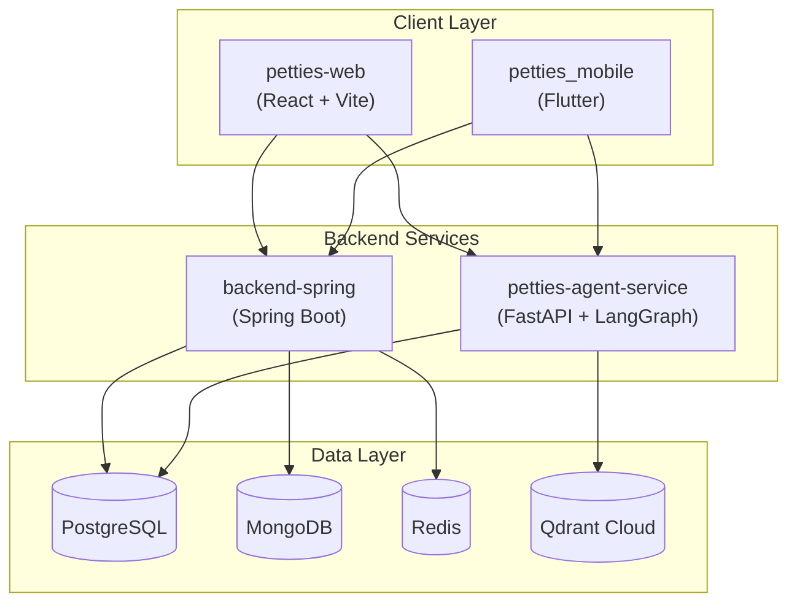
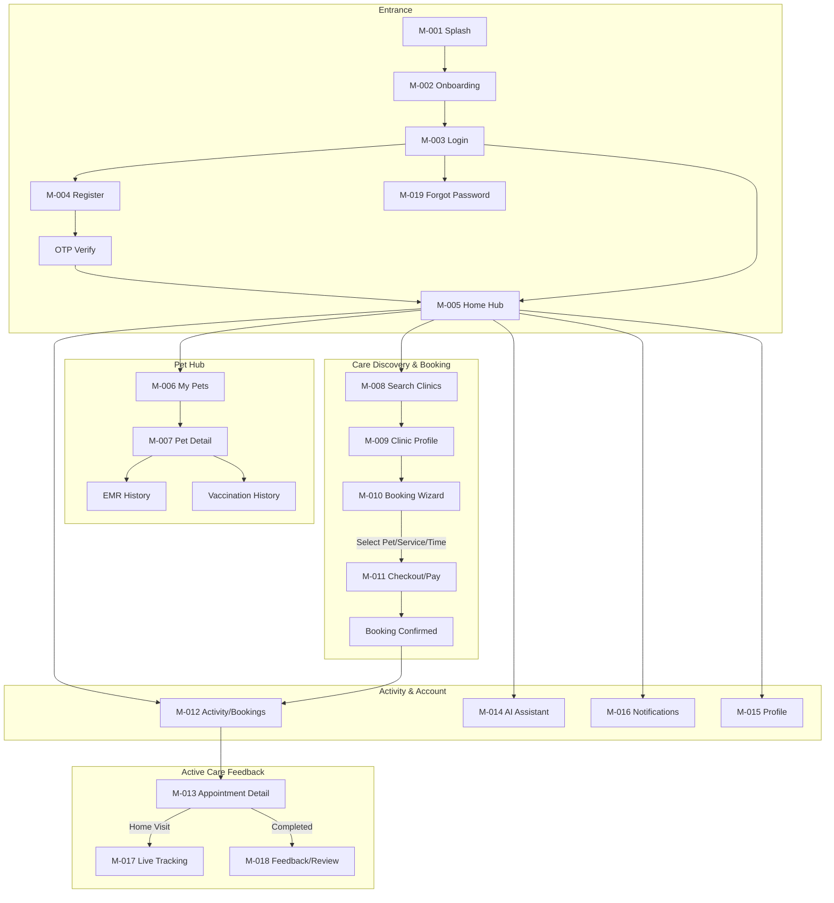
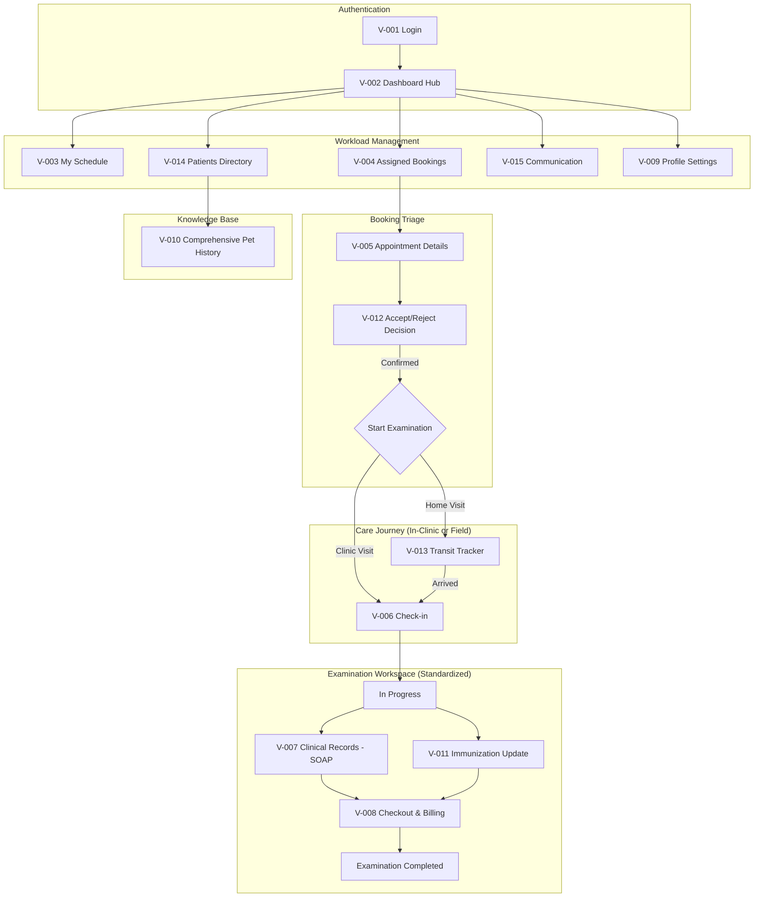
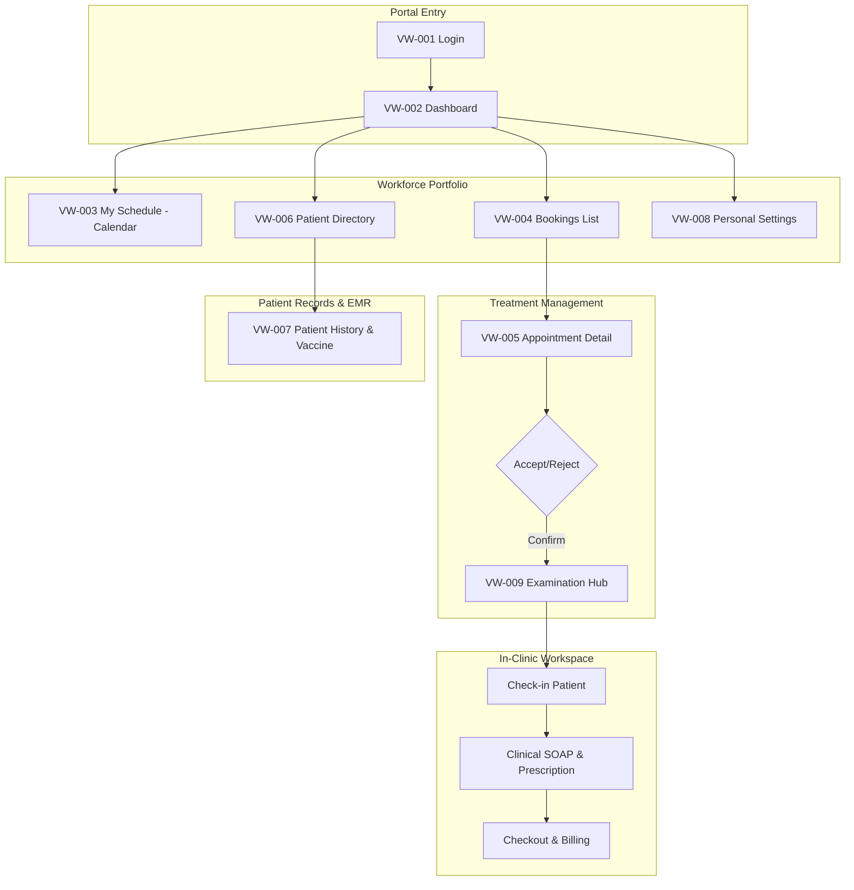
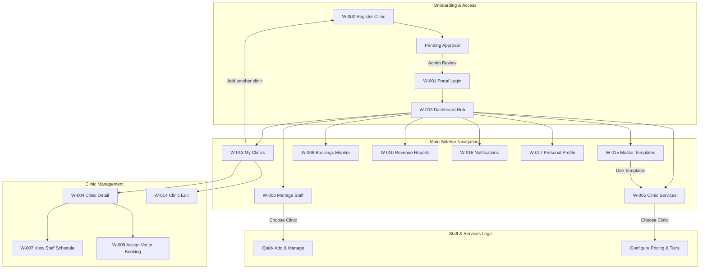
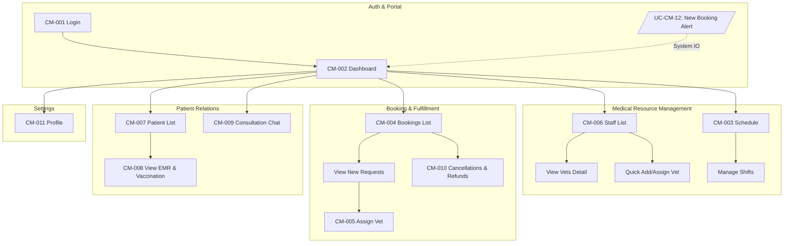
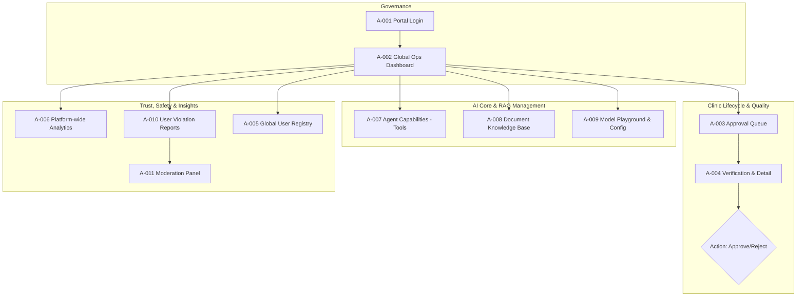
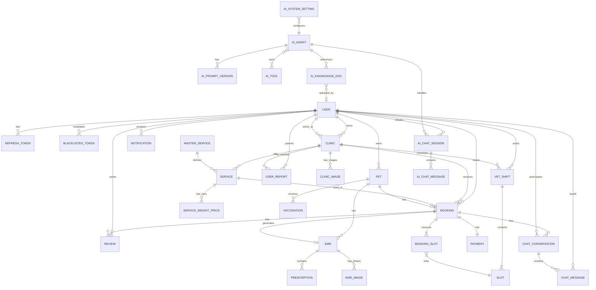

# PETTIES - Software Requirements Specification (SRS)

**Project:** Petties - Veterinary Appointment Booking Platform
**Version:** 1.2.2 (Merged Vaccination Model - 1:N Relationship)
**Last Updated:** 2025-12-29
**Document Status:** In Progress

---

## Table of Contents

1. [Product Overview](#1-product-overview)
2. [User Requirements](#2-user-requirements)
3. [Functional Requirements](#3-functional-requirements)
4. [Non-Functional Requirements](#4-non-functional-requirements)
5. [Requirement Appendix](#5-requirement-appendix)

---

## 1. PRODUCT OVERVIEW

### 1.1 Product Purpose

**Petties** là nền tảng kết nối chủ thú cưng (Pet Owner) với các phòng khám thú y (Veterinary Clinics). Hệ thống cho phép:

- 🐾 Chủ pet đặt lịch khám tại phòng khám hoặc tại nhà
- 🏥 Phòng khám quản lý dịch vụ, bác sĩ, lịch làm việc
- 👨‍⚕️ Bác sĩ quản lý ca làm, khám bệnh, ghi hồ sơ y tế
- 🤖 AI Chatbot hỗ trợ tư vấn chăm sóc thú cưng
- 📊 Admin quản lý toàn bộ nền tảng

### 1.2 Product Scope

| Aspect | Description |
|--------|-------------|
| **Platform** | Web (Admin, Clinic), Mobile (Pet Owner, Vet) |
| **Target Users** | Pet Owners, Veterinary Clinics, Vets, Admins |
| **Geography** | Vietnam (initial), Southeast Asia (future) |
| **Timeline** | 13 Sprints (10/12/2025 - 11/03/2026) |

### 1.3 Intended Audience

| Audience | Description |
|----------|-------------|
| Developers | Xây dựng và bảo trì hệ thống |
| QA/Testers | Kiểm tra chức năng và chất lượng |
| Product Owners | Theo dõi và ưu tiên requirements |
| Stakeholders | Đánh giá tính khả thi và business value |

### 1.4 Product Overview Diagram (Context Diagram)

```mermaid
flowchart TB
    PO["🐾 Pet Owner<br/>(Mobile)"]
    VET["👨‍⚕️ Vet<br/>(Mobile + Web)"]
    CM["👨‍💼 Clinic Manager<br/>(Web)"]
    CO["🏥 Clinic Owner<br/>(Web)"]
    ADMIN["🔧 Admin<br/>(Web)"]
    
    SYSTEM(("🐾 Petties<br/>System"))
    
    %% Pet Owner flows
    PO -->|"Register, Login, Profile Update"| SYSTEM
    PO -->|"Pet Profile (View EMR + Vaccination)"| SYSTEM
    PO -->|"Search Clinic, Create Booking"| SYSTEM
    PO -->|"Payment (Stripe)"| SYSTEM
    PO -->|"Review, AI Chat, Report Violation"| SYSTEM
    SYSTEM -->|"Booking Confirmation, Notifications"| PO
    SYSTEM -->|"Pet Profile (EMR + Vaccination Records)"| PO
    
    %% Vet flows
    VET -->|"Login, View Schedule"| SYSTEM
    VET -->|"Accept/Reject Booking"| SYSTEM
    VET -->|"Check-in, Create/Edit EMR"| SYSTEM
    VET -->|"Add/Edit Vaccination, Check-out"| SYSTEM
    SYSTEM -->|"Assigned Bookings, Schedules"| VET
    SYSTEM -->|"Pet Profile (EMR + Vaccination, READ-ONLY cross-clinic)"| VET
    
    %% Clinic Manager flows
    CM -->|"Add/Remove Vet"| SYSTEM
    CM -->|"Create Vet Schedule, Import Excel"| SYSTEM
    CM -->|"Assign Vet to Booking"| SYSTEM
    SYSTEM -->|"Vet List, Booking List/Pending Bookings"| CM
    SYSTEM -->|"Schedule Overview"| CM
    
    %% Clinic Owner flows
    CO -->|"Register Clinic"| SYSTEM
    CO -->|"Manage Master Services (Templates + Weight Tiers)"| SYSTEM
    CO -->|"Configure Clinic Services (Inherit or Custom)"| SYSTEM
    CO -->|"Add Clinic Manager"| SYSTEM
    SYSTEM -->|"Clinic Status, Revenue Report"| CO
    SYSTEM -->|"Dashboard Analytics"| CO
    
    %% Admin flows
    ADMIN -->|"Login, Approve/Reject Clinic"| SYSTEM
    ADMIN -->|"Configure AI Agents"| SYSTEM
    ADMIN -->|"Manage Knowledge Base, Process Reports"| SYSTEM
    SYSTEM -->|"Pending Clinics, Platform Stats"| ADMIN
    SYSTEM -->|"User Reports, Agent Status"| ADMIN
```



### 1.5 System Architecture Overview



---

## 2. USER REQUIREMENTS

### 2.1 User Roles

| Role | Platform | Description |
|------|----------|-------------|
| **PET_OWNER** | Mobile only | Chủ thú cưng, đặt lịch khám, xem hồ sơ y tế |
| **VET** | Mobile + Web | Bác sĩ thú y, khám bệnh, ghi EMR |
| **CLINIC_MANAGER** | Web only | Quản lý phòng khám, gán booking cho bác sĩ |
| **CLINIC_OWNER** | Web only | Chủ phòng khám, quản lý dịch vụ, doanh thu |
| **ADMIN** | Web only | Admin nền tảng, duyệt phòng khám, quản lý AI |

### 2.2 Use Cases

#### 2.2.1 Pet Owner Use Cases

| UC-ID | Use Case | Priority | Sprint |
|-------|----------|----------|--------|
| UC-PO-01 | Đăng ký và Đăng nhập | High | 1 |
| UC-PO-02 | Đăng nhập bằng Google | High | 1 |
| UC-PO-03 | Quản lý hồ sơ cá nhân | Medium | 2 |
| UC-PO-04 | Tạo/Sửa/Xóa hồ sơ thú cưng | High | 2 |
| UC-PO-05 | Tìm kiếm phòng khám | High | 4 |
| UC-PO-06 | Đặt lịch khám tại phòng (Clinic Visit) | High | 4-6 |
| UC-PO-07 | Đặt lịch khám tại nhà (Home Visit) | High | 4-6 |
| UC-PO-08 | Xem danh sách booking | High | 4 |
| UC-PO-09 | Hủy booking | Medium | 5 |
| UC-PO-10 | Thanh toán online (Stripe) | High | 8 |
| UC-PO-11 | Xem hồ sơ y tế thú cưng (EMR) | Medium | 7 |
| UC-PO-12 | Xem sổ tiêm chủng | Medium | 7 |
| UC-PO-13 | Đánh giá bác sĩ/phòng khám | Low | 9 |
| UC-PO-14 | Chat với AI Chatbot | Medium | 10 |
| UC-PO-15 | **[Out of Scope] Gửi yêu cầu cứu hộ khẩn cấp (SOS)** | Low | 11 |
| UC-PO-16 | Báo cáo vi phạm Clinic/Vet | Low | 9 |
| UC-PO-17 | **[Home Visit] Theo dõi vị trí bác sĩ trên bản đồ** | High | 6 |
| UC-PO-18 | **[Home Visit] Xem lộ trình di chuyển của bác sĩ** | High | 6 |
| UC-PO-19 | **[Home Visit] Nhận thông báo khi bác sĩ sắp đến/đến nơi** | High | 6 |

#### 2.2.2 Vet Use Cases

| UC-ID | Use Case | Priority | Sprint |
|-------|----------|----------|--------|
| UC-VT-01 | Đăng nhập (Account được cấp) | High | 3 |
| UC-VT-02 | Xem lịch làm việc | High | 3 |
| UC-VT-03 | Xem booking được gán | High | 4 |
| UC-VT-04 | Phê duyệt/Từ chối booking | High | 5 |
| UC-VT-05 | Check-in bệnh nhân | High | 6 |
| UC-VT-06 | Ghi hồ sơ bệnh án (EMR) | High | 7 |
| UC-VT-07 | Ghi đơn thuốc | Medium | 7 |
| UC-VT-08 | Cập nhật sổ tiêm chủng | Medium | 7 |
| UC-VT-09 | Checkout bệnh nhân | High | 6 |
| UC-VT-10 | **[Home Visit] Bắt đầu di chuyển (Start Travel)** | High | 6 |
| UC-VT-11 | **[Home Visit] Thông báo đến nơi** | High | 6 |
| UC-VT-12 | **Tra cứu bệnh nhân đã khám** | Medium | 9 |
| UC-VT-13 | **Xem Lịch sử Bệnh nhân (Mobile View)** | High | 6 |

#### 2.2.3 Clinic Manager Use Cases

| UC-ID | Use Case | Priority | Sprint |
|-------|----------|----------|--------|
| UC-CM-01 | Đăng nhập | High | 1 |
| UC-CM-02 | Xem danh sách bác sĩ | High | 3 |
| UC-CM-03 | Thêm nhanh bác sĩ (Quick Add) | High | 3 |
| UC-CM-03b| Gán bác sĩ từ tài khoản có sẵn | Medium | 3 |
| UC-CM-04 | **[Out of Scope] Tải lịch trực từ file Excel** | Medium | 3 |
| UC-CM-05 | Tạo lịch bác sĩ thủ công | High | 3 |
| UC-CM-06 | Xem booking mới | High | 4 |
| UC-CM-07 | Gán bác sĩ cho booking | High | 5 |
| UC-CM-08 | Quản lý hủy & hoàn tiền | Medium | 8 |
| UC-CM-09 | **Xem danh sách bệnh nhân** | Medium | 9 |
| UC-CM-10 | **Xem hồ sơ bệnh nhân (EMR/Vaccination)** | Medium | 9 |

#### 2.2.4 Clinic Owner Use Cases

| UC-ID | Use Case | Priority | Sprint |
|-------|----------|----------|--------|
| UC-CO-01 | Đăng ký phòng khám | High | 2 |
| UC-CO-02 | Quản lý thông tin phòng khám | High | 2 |
| UC-CO-03 | Cấu hình Dịch vụ tại phòng khám (Hybrid) | High | 2 |
| UC-CO-04 | Cấu hình giá & Khung cân nặng | High | 2 |
| UC-CO-08 | Quản lý Danh mục Dịch vụ (Master Services) | High | 2 |
| UC-CO-09 | Cài đặt Khung giá Cân nặng (Weight Tiers) | High | 2 |
| UC-CO-05 | Theo dõi biểu đồ doanh thu | Medium | 9 |
| UC-CO-06 | Thêm nhanh quản lý (Quick Add) | Medium | 3 |
| UC-CO-07 | Quản lý nhân sự (Manager & Vet) | Medium | 3 |

#### 2.2.5 Admin Use Cases

| UC-ID | Use Case | Priority | Sprint |
|-------|----------|----------|--------|
| UC-AD-01 | Đăng nhập | High | 1 |
| UC-AD-02 | Xem danh sách phòng khám pending | High | 2 |
| UC-AD-03 | Xét duyệt/Từ chối phòng khám | High | 2 |
| UC-AD-04 | Theo dõi số liệu thống kê nền tảng | Medium | 9 |
| UC-AD-05 | Quản lý công cụ của Agent (Agent Tools) | Low | 10 |
| UC-AD-06 | Quản lý Knowledge Base (LlamaIndex RAG) | Low | 10 |
| UC-AD-07 | Thử nghiệm & Cấu hình Agent (Playground) | Low | 11 |
| UC-AD-08 | Theo dõi danh sách báo cáo vi phạm | Medium | 9 |
| UC-AD-09 | Xử lý User Report (Warn/Suspend/Ban/Reject) | Medium | 9 |

#### 2.2.6 Use Case Summary Table

> **Summary:** Complete list of all Use Cases with UC-ID, Use Case Name, Actor, and Description.

##### 📱 Pet Owner (19 Use Cases)

| UC-ID | Use Case Name | Actor | Description |
|-------|---------------|-------|-------------|
| UC-PO-01 | Register and Login | Pet Owner | Register new account with Email + OTP verification, or login with existing credentials |
| UC-PO-02 | Google Sign-In | Pet Owner | Login or register using Google OAuth 2.0 |
| UC-PO-03 | Manage Profile | Pet Owner | View/edit personal info, upload avatar, change password |
| UC-PO-04 | Manage Pet Profile | Pet Owner | Create, update, or delete pet profiles with photos and medical info |
| UC-PO-05 | Search Clinics | Pet Owner | Search clinics by name, GPS location, ratings, and service filters |
| UC-PO-05b | View Clinic Details | Pet Owner | View clinic info, services, pricing, reviews, and image gallery |
| UC-PO-06 | Book Clinic Visit | Pet Owner | Create booking for in-clinic appointment with slot selection |
| UC-PO-07 | Book Home Visit | Pet Owner | Create booking for home visit with address and additional fee |
| UC-PO-08 | View My Bookings | Pet Owner | View booking list with tabs: Upcoming, Past, Cancelled |
| UC-PO-09 | Cancel Booking | Pet Owner | Cancel booking (allowed before 4 hours of appointment time) |
| UC-PO-10 | Make Payment | Pet Owner | Pay via Stripe online or Cash on visit |
| UC-PO-11 | View Pet EMR | Pet Owner | View Electronic Medical Records of pets |
| UC-PO-12 | View Vaccination History | Pet Owner | View pet's vaccination records with next due dates |
| UC-PO-13 | Write Review | Pet Owner | Rate and review clinic/vet after completed booking |
| UC-PO-14 | Chat with AI Assistant | Pet Owner | Interact with AI chatbot for pet care advice |
| UC-PO-15 | **Send Emergency SOS Request** | Pet Owner | Request emergency assistance (**[Out of Scope]**) |
| UC-PO-16 | Report Violation | Pet Owner | Report clinic or vet for inappropriate behavior |
| UC-PO-17 | Track Vet Location | Pet Owner | View realtime vet location and travel route on map during Home Visit |
| UC-PO-19 | Receive Travel Updates | Pet Owner | Get notifications when vet is approaching/arrived |

##### 👨‍⚕️ Vet (13 Use Cases)

| UC-ID | Use Case Name | Actor | Description |
|-------|---------------|-------|-------------|
| UC-VT-01 | Login as Staff | Vet | Login with phone number + default password (last 6 digits) |
| UC-VT-02 | View My Schedule | Vet | View work schedule in calendar view (month/week/day) with associated bookings |
| UC-VT-03 | View Assigned Bookings | Vet | View list of bookings assigned by Manager (tabs: Today, Upcoming, Done) |
| UC-VT-04 | Accept/Reject Booking | Vet | Confirm or decline assigned booking with reason |
| UC-VT-05 | Check-in Patient | Vet | Mark start of examination (Clinic Visit or after arrival for Home Visit) |
| UC-VT-06 | Create EMR (SOAP) | Vet | Create comprehensive Electronic Medical Record using SOAP format with prescription |
| UC-VT-07 | Write Prescription | Vet | Add prescription with drug name, dosage, frequency, duration |
| UC-VT-08 | Add Vaccination Record | Vet | Add new vaccination record to pet's vaccination book with batch number, manufacturer and auto-calculated next due date |
| UC-VT-09 | Check-out Patient | Vet | Complete examination, collect payment if Cash |
| UC-VT-10 | Start Travel | Vet | Begin travel to pet owner's address with GPS tracking enabled (Home Visit) |
| UC-VT-11 | Mark Arrived | Vet | Confirm arrival at pet owner's location (Home Visit) |
| UC-VT-12 | Search Patients | Vet | Search previously examined pets at the clinic |
| UC-VT-13 | View Patient History | Vet | View pet's EMR and vaccination history on mobile |

##### 👩‍💼 Clinic Manager (12 Use Cases)

| UC-ID | Use Case Name | Actor | Description |
|-------|---------------|-------|-------------|
| UC-CM-01 | Login as Manager | Clinic Manager | Login with phone number + assigned password |
| UC-CM-02 | View Vet List | Clinic Manager | View list of vets working at the clinic |
| UC-CM-03 | Quick Add Vet | Clinic Manager | Add new vet with phone number and name (auto-creates account) |
| UC-CM-03b | Assign Existing Vet | Clinic Manager | Assign existing vet account to the clinic |
| UC-CM-04 | **Import Schedule Excel** | Clinic Manager | Import vet schedules from Excel file (**[Out of Scope]**) |
| UC-CM-05 | Create Vet Shift | Clinic Manager | Manually create vet shift (auto-generates 30-min slots) |
| UC-CM-06 | View New Bookings | Clinic Manager | View pending bookings that need vet assignment |
| UC-CM-07 | Assign Vet to Booking | Clinic Manager | Assign available vet to a booking |
| UC-CM-08 | Manage Cancellation | Clinic Manager | Handle booking cancellation and refund |
| UC-CM-09 | View Patient List | Clinic Manager | View clinic's patient list with DUE/OVERDUE status |
| UC-CM-10 | View Patient Records | Clinic Manager | View patient's EMR and vaccination history |
| UC-CM-11 | Manage Schedules | Clinic Manager | Create, edit, delete vet schedules in calendar view |
| UC-CM-12 | Receive Booking Alerts | Clinic Manager | Get realtime notifications for new bookings at the clinic |

##### 🏥 Clinic Owner (9 Use Cases)

| UC-ID | Use Case Name | Actor | Description |
|-------|---------------|-------|-------------|
| UC-CO-01 | Register Clinic | Clinic Owner | Register new clinic → status PENDING → await Admin approval |
| UC-CO-02 | Manage Clinic Info | Clinic Owner | Update clinic details, gallery, operating hours |
| UC-CO-03 | Manage Clinic Services | Clinic Owner | Add services from master template or create custom services |
| UC-CO-04 | Configure Pricing | Clinic Owner | Set weight-based tiered pricing for services |
| UC-CO-05 | View Revenue Dashboard | Clinic Owner | View revenue charts with date range filters |
| UC-CO-06 | Quick Add Staff | Clinic Owner | Add manager or vet with phone number (auto-creates account) |
| UC-CO-07 | Manage Staff | Clinic Owner | View, assign, remove staff from clinic |
| UC-CO-08 | Manage Master Services | Clinic Owner | Create and manage service templates |

##### 🔧 Admin (9 Use Cases)

| UC-ID | Use Case Name | Actor | Description |
|-------|---------------|-------|-------------|
| UC-AD-01 | Login as Admin | Admin | Login to Admin Portal |
| UC-AD-02 | View Pending Clinics | Admin | View list of clinics awaiting approval |
| UC-AD-03 | Approve/Reject Clinic | Admin | Approve or reject clinic registration with reason |
| UC-AD-04 | View Platform Statistics | Admin | View system-wide stats: users, clinics, bookings |
| UC-AD-05 | Manage Agent Tools | Admin | Manage MCP Tools, API tools, and custom functions assigned to the AI Agent |
| UC-AD-06 | Manage Knowledge Base | Admin | Upload documents (PDF, DOCX, TXT), LlamaIndex RAG processing with Cohere embeddings, Qdrant Cloud vector storage |
| UC-AD-07 | Configure and Test Agent | Admin | Test chat, configure hyperparameters (model, temperature, etc.) and System Prompt |
| UC-AD-08 | View User Reports | Admin | View violation reports from users |
| UC-AD-09 | Handle User Reports | Admin | Take action: None, Warn, Suspend, or Ban |

##### 📊 Summary

| Actor | Use Cases | Platform | Implementation Status |
|-------|:---------:|----------|----------------------|
| Pet Owner | 19 | Mobile | ~40% Implemented |
| Vet | 13 | Mobile | ~30% Implemented |
| Clinic Manager | 13 | Web | ~25% Implemented |
| Clinic Owner | 8 | Web | ~70% Implemented |
| Admin | 9 | Web | ~30% Implemented |
| **TOTAL** | **62** | - | **~40% Overall** |

---

## 3. FUNCTIONAL REQUIREMENTS

### 3.1 System Functional Overview

#### 3.1.1 Screens Flow

##### 📱 Mobile App - Pet Owner Flow



##### 👨‍⚕️ Mobile App - Vet Flow



##### 👨‍⚕️ Web App - Vet Flow



##### 🏥 Web App - Clinic Owner Flow



##### 👩‍💼 Web App - Clinic Manager Flow



##### 🔧 Web App - Admin Flow



#### 3.1.2 Screen Descriptions

##### 📱 Mobile App - Pet Owner (19 screens)

| # | Feature | Screen | Description |
|---|---------|--------|-------------|
| 1 | Authentication & Onboarding | M-001 Splash | Logo animation and data loading state |
| 2 | Authentication & Onboarding | M-002 Onboarding | 3 introduction slides (first launch only) |
| 3 | Authentication & Onboarding | M-003 Login | Email/Pass, Google Sign-in, and Forgot Password |
| 4 | Authentication & Onboarding | M-004 Register | Account creation with Email, Phone, and OTP verify |
| 5 | Authentication & Onboarding | M-019 Forgot Password | Email input, OTP verification, and new password setup |
| 6 | Dashboard | M-005 Home | Quick actions, pet carousel, and upcoming appointments |
| 7 | Pet Management | M-006 My Pets | List of owned pets (Grid/List) with FAB to add more |
| 8 | Pet Management | M-007 Pet Detail | Detailed pet info with Tabs (Profile, EMR, Vaccine) |
| 9 | Clinic Discovery | M-008 Search Clinics | Clinic search with GPS filters and rating sorting |
| 10 | Clinic Discovery | M-009 Clinic Detail | Gallery, info, services, reviews, and Booking CTA |
| 11 | Booking Management | M-010 Create Booking | Select pet, service, date, time slot, and notes |
| 12 | Booking Management | M-011 Payment | Stripe/Cash checkout with cost breakdown |
| 13 | Appointment & Medical Records | M-012 My Bookings | Appointment list (Upcoming, Completed, Cancelled) |
| 14 | Appointment & Medical Records | M-013 Booking Detail | Real-time status timeline and appointment actions |
| 15 | AI & Communication | M-014 AI Chat | WebSocket chat with Pet Care Assistant AI |
| 16 | Profile Management | M-015 Profile | Personal info, avatar, and account settings |
| 17 | System Notifications | M-016 Notifications | System alerts and appointment reminders |
| 18 | Home Visit Tracking | M-017 Track Vet Location | Real-time map displaying vet GPS (Home Visit only) |
| 19 | Review & Feedback | M-018 Write Review | Star ratings and comments after service completion |

##### 👨‍⚕️ Mobile App - Vet (14 screens)

| # | Feature | Screen | Description |
|---|---------|--------|-------------|
| 1 | Authentication | V-001 Login | Login with Phone and provided Password |
| 2 | Dashboard | V-002 Dashboard | Work overview: Today's bookings and quick stats |
| 3 | Schedule & Booking Management | V-003 My Schedule | Personal Calendar (Month/Week/Day views) |
| 4 | Schedule & Booking Management | V-004 Assigned Bookings | List of assigned bookings (Today, Upcoming, Done) |
| 5 | Schedule & Booking Management | V-005 Booking Detail | Appointment details, pet info, and owner contact |
| 6 | Schedule & Booking Management | V-012 Accept/Reject | Confirmation dialog for accepting/rejecting tasks |
| 7 | Home Visit Operations | V-013 Start Travel | Transit tracking with GPS toggle (Home Visit only) |
| 8 | Clinical Workspace (EMR) | V-006 Check-in | Start examination confirmation |
| 9 | Clinical Workspace (EMR) | V-007 Create EMR (SOAP) | Clinical notes (SOAP format) and prescription entry |
| 10 | Clinical Workspace (EMR) | V-008 Check-out | Finish exam and payment summary (for Cash) |
| 11 | Patient & History Management | V-014 Patients List | Directory of patients previously treated at clinic |
| 12 | Patient & History Management | V-010 Pet History | Comprehensive view of medical history and vaccines |
| 13 | Patient & History Management | V-011 Add Vaccination | Record new immunization entries |
| 14 | Communication | V-015 Communication | Messaging with Manager or Pet Owners |
| 15 | Profile Management | V-009 Profile | Doctor profile info and password management |

##### 👨‍⚕️ Web App - Vet (9 screens)

| # | Feature | Screen | Description |
|---|---------|--------|-------------|
| 1 | Authentication | VW-001 Login | Doctor login on Web platform |
| 2 | Dashboard | VW-002 Dashboard | Shift overview and pending examinations |
| 3 | Schedule & Booking Management | VW-003 My Schedule | Desktop-optimized personal calendar management |
| 4 | Schedule & Booking Management | VW-004 Bookings | List of bookings with advanced table filtering |
| 5 | Schedule & Booking Management | VW-005 Booking Detail | Appointment details and triage actions |
| 6 | Patient & History Management | VW-006 Patient List | Directory of patients treated at the clinic |
| 7 | Patient & History Management | VW-007 Patient History | Detailed medical records and vaccine view (Desktop) |
| 8 | Clinical Workspace (EMR) | VW-009 Examination Hub | Central workspace for Check-in, SOAP, and Prescriptions |
| 9 | Profile Management | VW-008 Profile | Account and security settings |

##### 🏥 Web App - Clinic Owner (15 screens)

| # | Feature | Screen | Description |
|---|---------|--------|-------------|
| 1 | Clinic Registration | W-001 Portal Login | Login portal for Clinic Owners (Email/Google) |
| 2 | Clinic Registration | W-002 Register Clinic | Step wizard for registering a new clinic branch |
| 3 | Global Dashboard | W-003 Dashboard Hub | Overall status of all clinics and revenue analytics |
| 4 | Clinic Management | W-013 My Clinics | List of owned clinics (Card-style interface) |
| 5 | Clinic Management | W-004 Clinic Detail | Legal and operational information of a branch |
| 6 | Clinic Management | W-014 Clinic Edit | Branch data editing and gallery management |
| 7 | Booking & Schedule Oversight | W-008 Bookings Monitor | Global oversight of all appointments |
| 8 | Booking & Schedule Oversight | W-007 View Staff Schedule | Monitor staff shifts across clinic locations |
| 9 | Booking & Schedule Oversight | W-009 Assign Vet | Manual vet assignment for special cases |
| 10 | Staff Management | W-006 Manage Staff | HR directory: Quick add for Managers/Vets |
| 11 | Service Management | W-015 Master Templates | Global service catalog templates management |
| 12 | Service Management | W-005 Clinic Services | Pricing configuration specifically for an individual branch |
| 13 | Financial Analytics | W-010 Revenue Reports | Financial statements and growth charts |
| 14 | Patient & Record Access | W-011 Patient List | Aggregated patient list from all branches |
| 15 | Patient & Record Access | W-012 Patient Records | Detailed view of individual pet medical history |
| 16 | System Notifications | W-016 Notifications | System-wide operational and approval alerts |
| 17 | Profile Management | W-017 Personal Profile | Owner personal info and settings |

##### 👩‍💼 Web App - Clinic Manager (8 screens)

| # | Feature | Screen | Description |
|---|---------|--------|-------------|
| 1 | Authentication | CM-001 Login | Login portal for clinic managers |
| 2 | Dashboard | CM-002 Dashboard | Daily ops: Shifts, pending bookings, and alerts |
| 3 | Schedule Management | CM-003 Vet Schedules | Roster management and shift allocation for doctors |
| 4 | Booking Management | CM-004 Bookings List | Oversight of current branch appointments |
| 5 | Booking Management | CM-005 Assign Vet | Assigning available doctors to incoming requests |
| 6 | Staff Management | CM-006 Staff List | Directory of branch vets and quick addition tools |
| 7 | Patient Management | CM-007 Patient List | Patient directory with immunization alerts |
| 8 | Patient Management | CM-008 Patient Detail | Detailed clinical records view for individual pets |
| 9 | Communication | CM-009 Chat | Operational messaging with vets and owners |
| 10 | Refund Management | CM-010 Refunds | Cancellation management and refund processing |
| 11 | Profile Management | CM-011 Profile | Manager's personal profile and settings |

##### 🔧 Web App - Admin (11 screens)

| # | Feature | Screen | Description |
|---|---------|--------|-------------|
| 1 | Authentication & Monitoring | A-001 Login | Supreme administrator login portal |
| 2 | Platform Analytics | A-002 Dashboard | Global stats: Accounts, Clinics, and Transactions |
| 3 | Clinic Approval Process | A-003 Pending Clinics | Review queue for newly registered clinic branches |
| 4 | Clinic Approval Process | A-004 Clinic Detail | Background and legal verification for approval |
| 5 | AI Service Management | A-007 Agent Tools | Definition of MCP tools and APIs for AI Agents |
| 6 | AI Service Management | A-008 Knowledge Base | RAG data storage and document ingestion |
| 7 | AI Service Management | A-009 Agent Playground | Configuration for prompt, params, and chat testing |
| 8 | Moderation & Reporting | A-010 User Reports | Queue of violation reports submitted by users |
| 9 | Moderation & Reporting | A-011 Report Detail | Panel for moderation actions (Warnings, Bans) |
| 10 | User Management | A-005 Users | Centralized management of all user accounts |
| 11 | Platform Analytics | A-006 Statistics | Specialized reports and data export tools |

#### 3.1.3 Screen Authorization

> **Legend:** ✅ = Full Access | 👁️ = View Only | ❌ = No Access

##### 📱 Mobile App - Pet Owner Screens

| Screen ID | Screen Name | PET_OWNER | VET | CM | CO | ADMIN | Notes |
|-----------|-------------|:---------:|:---:|:--:|:--:|:-----:|-------|
| M-001 → M-005 | Auth & Home | ✅ | ❌ | ❌ | ❌ | ❌ | Mobile only |
| M-006, M-007 | My Pets | ✅ | ❌ | ❌ | ❌ | ❌ | Own pets only |
| M-008, M-009 | Search & Clinic | ✅ | ❌ | ❌ | ❌ | ❌ | View approved clinics |
| M-010, M-011 | Booking & Payment | ✅ | ❌ | ❌ | ❌ | ❌ | Own bookings only |
| M-012, M-013 | My Bookings | ✅ | ❌ | ❌ | ❌ | ❌ | Own bookings only |
| M-014 | AI Chat | ✅ | ❌ | ❌ | ❌ | ❌ | WebSocket required |
| M-015 | Profile | ✅ | ❌ | ❌ | ❌ | ❌ | Own profile only |
| M-016 | Notifications | ✅ | ❌ | ❌ | ❌ | ❌ | Own notifications |
| M-017 | Track Vet Location | ✅ | ❌ | ❌ | ❌ | ❌ | During Home Visit |
| M-018 | Write Review | ✅ | ❌ | ❌ | ❌ | ❌ | After COMPLETED |
| M-019 | Forgot Password | ✅ | ❌ | ❌ | ❌ | ❌ | Public |

##### 👨‍⚕️ Mobile App - Vet Screens

| Screen ID | Screen Name | PET_OWNER | VET | CM | CO | ADMIN | Notes |
|-----------|-------------|:---------:|:---:|:--:|:--:|:-----:|-------|
| V-001 | Login | ❌ | ✅ | ❌ | ❌ | ❌ | SĐT + Password |
| V-002 | Dashboard | ❌ | ✅ | ❌ | ❌ | ❌ | Own clinic data |
| V-003 | My Schedule | ❌ | ✅ | ❌ | ❌ | ❌ | Own schedule |
| V-004, V-005 | Assigned Bookings | ❌ | ✅ | ❌ | ❌ | ❌ | Assigned to this Vet |
| V-006 → V-008 | Check-in/EMR/Checkout | ❌ | ✅ | ❌ | ❌ | ❌ | In-progress bookings |
| V-009 | Profile | ❌ | ✅ | ❌ | ❌ | ❌ | Own profile |
| V-010, V-011 | Pet History/Vaccination | ❌ | ✅ | ❌ | ❌ | ❌ | Clinic's patients |
| V-012 | Accept/Reject | ❌ | ✅ | ❌ | ❌ | ❌ | Assigned bookings |
| V-013 | Start Travel | ❌ | ✅ | ❌ | ❌ | ❌ | Home Visit only |
| V-014 | Patients List | ❌ | ✅ | ❌ | ❌ | ❌ | Clinic's patients |
| V-015 | Chat | ❌ | ✅ | ✅ | ❌ | ❌ | Phản hồi khách hàng |

##### 👨‍⚕️ Web App - Vet Screens

| Screen ID | Screen Name | PET_OWNER | VET | CM | CO | ADMIN | Notes |
|-----------|-------------|:---------:|:---:|:--:|:--:|:-----:|-------|
| VW-001 | Login | ❌ | ✅ | ❌ | ❌ | ❌ | Email/Pass |
| VW-002 → VW-005 | Core Ops | ❌ | ✅ | ❌ | ❌ | ❌ | Schedule, Bookings |
| VW-006, VW-007 | Patients | ❌ | ✅ | ❌ | ❌ | ❌ | View medical records |
| VW-008 | Profile | ❌ | ✅ | ❌ | ❌ | ❌ | Own profile |
| VW-009 | Examination | ❌ | ✅ | ❌ | ❌ | ❌ | Clinical workspace |

##### 🏥 Web App - Clinic Owner Screens

| Screen ID | Screen Name | PET_OWNER | VET | CM | CO | ADMIN | Notes |
|-----------|-------------|:---------:|:---:|:--:|:--:|:-----:|-------|
| W-001 | Login | ❌ | ❌ | ❌ | ✅ | ❌ | Email/Google |
| W-002 | Register Clinic | ❌ | ❌ | ❌ | ✅ | ❌ | Create new clinic |
| W-003 | Dashboard | ❌ | 👁️ | 👁️ | ✅ | ❌ | Own clinics data |
| W-004 | Clinic Profile | ❌ | 👁️ | 👁️ | ✅ | ❌ | View/Edit |
| W-005 | Services | ❌ | 👁️ | 👁️ | ✅ | ❌ | Full CRUD for Owner |
| W-006 | Manage Staff | ❌ | ❌ | 👁️ | ✅ | ❌ | Add Manager/Vet |
| W-007 | Vet Schedules | ❌ | 👁️ | ✅ | ✅ | ❌ | Manager can edit |
| W-008 | Bookings | ❌ | 👁️ | ✅ | 👁️ | ❌ | Manager assigns |
| W-009 | Assign Vet | ❌ | ❌ | ✅ | ❌ | ❌ | Manager only |
| W-010 | Revenue | ❌ | ❌ | ❌ | ✅ | ❌ | Owner only |
| W-011, W-012 | Patient List/Detail | ❌ | ✅ | ✅ | ✅ | ❌ | Clinic's patients |
| W-013 | My Clinics | ❌ | ❌ | ❌ | ✅ | ❌ | Owner's clinics |
| W-014 | Clinic Edit | ❌ | ❌ | ❌ | ✅ | ❌ | Owner only |
| W-015 | Master Services | ❌ | ❌ | ❌ | ✅ | ❌ | Template mgmt |

##### 👩‍💼 Web App - Clinic Manager Screens

| Screen ID | Screen Name | PET_OWNER | VET | CM | CO | ADMIN | Notes |
|-----------|-------------|:---------:|:---:|:--:|:--:|:-----:|-------|
| CM-001 | Login | ❌ | ❌ | ✅ | ❌ | ❌ | SĐT + Password |
| CM-002 | Dashboard | ❌ | ❌ | ✅ | ❌ | ❌ | Assigned clinic |
| CM-003 | Vet Schedules | ❌ | ❌ | ✅ | ❌ | ❌ | CRUD shifts |
| CM-004, CM-005 | Bookings/Assign | ❌ | ❌ | ✅ | ❌ | ❌ | Assign Vet |
| CM-006 | Staff List | ❌ | ❌ | ✅ | ❌ | ❌ | Add Vet only |
| CM-007, CM-008 | Patients | ❌ | ❌ | ✅ | ❌ | ❌ | Clinic's patients |

##### 🔧 Web App - Admin Screens

| Screen ID | Screen Name | PET_OWNER | VET | CM | CO | ADMIN | Notes |
|-----------|-------------|:---------:|:---:|:--:|:--:|:-----:|-------|
| A-001 | Login | ❌ | ❌ | ❌ | ❌ | ✅ | Admin only |
| A-002 | Dashboard | ❌ | ❌ | ❌ | ❌ | ✅ | Platform stats |
| A-003, A-004 | Pending Clinics | ❌ | ❌ | ❌ | ❌ | ✅ | Approve/Reject |
| A-005 | Users | ❌ | ❌ | ❌ | ❌ | ✅ | All users |
| A-006 | Statistics | ❌ | ❌ | ❌ | ❌ | ✅ | System-wide |
| A-007, A-008, A-009 | AI Management | ❌ | ❌ | ❌ | ❌ | ✅ | Agent config |
| A-010, A-011 | User Reports | ❌ | ❌ | ❌ | ❌ | ✅ | Handle violations |

#### 3.1.4 Non-Screen Functions

| Function ID | Function Name | Description | Trigger |
|-------------|---------------|-------------|---------|
| NSF-001 | Auto Slot Generation | Tự động tạo slots (30 phút) khi tạo VET_SHIFT | Khi CLINIC_MANAGER tạo ca |
| NSF-002 | Booking Status Update | Tự động cập nhật status theo thời gian | Scheduled job |
| NSF-003 | Push Notification | Gửi push notification đến mobile | Event-driven |
| NSF-004 | Email Notification | Gửi email xác nhận, nhắc nhở | Event-driven |
| NSF-005 | OTP Generation | Tạo mã OTP 6 số, lưu Redis (TTL 5 phút) | Registration, Forgot Password |
| NSF-006 | JWT Token Refresh | Tự động refresh access token | Middleware |
| NSF-007 | Token Blacklist | Đưa token vào blacklist khi logout | Logout event |
| NSF-008 | Distance Calculation | Tính khoảng cách cho Home Visit | Khi tạo booking Home Visit |
| NSF-009 | Dynamic Pricing | Tính giá dựa trên base + distance fee | Khi tạo booking |
| NSF-010 | Rating Aggregation | Cập nhật rating_avg của Clinic/Vet | Khi có review mới |
| NSF-011 | AI Chatbot Processing | Xử lý tin nhắn qua Single Agent + ReAct | User gửi message |
| NSF-012 | RAG Retrieval | Tìm kiếm trong Knowledge Base | AI Chat query |

#### 3.1.5 Entity Relationship Diagram



##### 📊 Relationship Matrix (Cardinality)

| From (Ent. A) | To (Ent. B) | Relationship | Cardinality | Business Logic |
|:---|:---|:---|:---:|:---|
| **USER** | **PET** | owns | 1 : N | Một người nuôi có thể sở hữu nhiều thú cưng. |
| **USER** | **CLINIC** | owns | 1 : N | Một Clinic Owner có thể sở hữu nhiều chi nhánh phòng khám. |
| **CLINIC** | **USER** | works_at | 1 : N | Một phòng khám có nhiều nhân viên (Vet, Manager). Mỗi nhân viên chỉ thuộc 1 phòng khám. |
| **USER** | **VET_SHIFT** | works | 1 : N | Một bác sĩ có nhiều ca trực. Mỗi ca trực thuộc sở hữu của 1 bác sĩ. |
| **VET_SHIFT** | **SLOT** | contains | 1 : N | Một ca trực được chia thành nhiều ô thời gian 30 phút. |
| **BOOKING** | **SLOT** | reserves | 1 : N | Một lịch hẹn chiếm dùng một hoặc nhiều Slot (thông qua bảng BOOKING_SLOT). |
| **USER** | **BOOKING** | books | 1 : N | Khách hàng tạo nhiều lịch hẹn theo thời gian. |
| **PET** | **VACCINATION** | receives | 1 : N | Một thú cưng có lịch sử tiêm chủng nhiều lần (tương đương với sổ tiêm). |
| **PET** | **BOOKING** | has | 1 : N | Một thú cưng có lịch sử khám nhiều lần. |
| **BOOKING** | **PAYMENT** | has | 1 : 1 | Mỗi lịch hẹn có chính xác một bản ghi thanh toán (Cash/Stripe). |
| **BOOKING** | **EMR** | generates | 1 : 0..1 | Một lịch hẹn chỉ phát sinh tối đa 01 bệnh án (nếu khám thành công). |
| **EMR** | **PRESCRIPTION**| contains | 1 : N | Một bệnh án có thể có nhiều đơn thuốc đi kèm. |
| **EMR** | **EMR_IMAGE** | has_photos | 1 : N | Một bệnh án có thể đính kèm nhiều ảnh y khoa (X-quang, triệu chứng). |
| **BOOKING** | **REVIEW** | receives | 1 : N | Một lịch hẹn nhận được review cho bác sĩ và review cho phòng khám. |
| **USER** | **USER_REPORT** | submits | 1 : N | Một người dùng có thể gửi nhiều báo cáo vi phạm. |
| **USER** | **CHAT_CONV.** | participates | 1 : N | Một người dùng tham gia vào nhiều hội thoại 1-1. |
| **CLINIC** | **SERVICE** | offers | 1 : N | Một phòng khám cung cấp nhiều loại dịch vụ. |
| **CLINIC** | **CLINIC_IMAGE**| has_images | 1 : N | Một phòng khám có nhiều ảnh thực tế/không gian. |
| **SERVICE** | **BOOKING** | used_in | 1 : N | Một loại dịch vụ được sử dụng trong nhiều lịch hẹn khác nhau. |
| **MASTER_SERVICE**| **SERVICE** | defines | 1 : N | Template dịch vụ chung được áp dụng cho nhiều phòng khám. |
| **AI_AGENT** | **AI_CHAT_SESSION** | handles | 1 : N | Một Agent xử lý nhiều phiên chat của nhiều người dùng khác nhau. |
| **AI_AGENT** | **AI_KNOWLEDGE_DOC**| references | N : N | Agent sử dụng các tài liệu tri thức để trả lời câu hỏi (RAG). |
| **AI_KNOWLEDGE_DOC** | **USER** | uploaded_by | N : 0..1 | Tài liệu tri thức được upload bởi admin. |
| **AI_CHAT_MESSAGE** | **AI_CHAT_SESSION**| contains | N : 1 | Thông tin tin nhắn trong phiên chat AI. |
| **AI_SYSTEM_SETTING** | **AI_AGENT** | configures | N : 1 | Cài đặt hệ thống áp dụng cho Agent. |
| **BLACKLISTED_TOKEN** | **USER** | invalidates | N : 1 | Token bị vô hiệu hóa khi người dùng logout. |

#### 3.1.6 Entities Description

Để đảm bảo tính nhất quán giữa tài liệu và mã nguồn, dưới đây là danh sách đầy đủ 30 thực thể được sử dụng trong hệ thống Petties:

| Nhóm | Thực thể | Mô tả | Các trường chính |
|:---:|---|---|---|
| **Auth & User** | **USER** | Tài khoản định danh (5 roles) | id, username, email, password, role, clinic_id, status |
| | **REFRESH_TOKEN** | Token duy trì phiên đăng nhập | id, user_id, token, expires_at |
| | **BLACKLISTED_TOKEN** | Token bị vô hiệu hóa sau logout | id, token, blacklisted_at, expires_at |
| **Clinic** | **CLINIC** | Thông tin phòng khám thú y | id, owner_id, name, address, phone, status, rating_avg |
| | **CLINIC_IMAGE** | Ảnh không gian phòng khám | id, clinic_id, image_url, is_primary |
| | **MASTER_SERVICE** | Bản mẫu dịch vụ (Templates) | id, owner_id, name, service_type, default_base_price |
| | **SERVICE** | Dịch vụ thực tế tại phòng khám | id, clinic_id, master_service_id, base_price, is_home_visit |
| | **SERVICE_WEIGHT_PRICE**| Khung giá cộng thêm theo cân nặng | id, service_id, min_weight, max_weight, price |
| **Pet** | **PET** | Hồ sơ thông tin thú cưng | id, owner_id, name, species, breed, birth_date, weight_kg |
| **Scheduling** | **VET_SHIFT** | Ca trực của bác sĩ tại phòng khám | id, vet_id, clinic_id, work_date, start_time, end_time |
| | **SLOT** | Đơn vị thời gian 30 phút | id, shift_id, start_time, end_time, status |
| **Booking** | **BOOKING** | Lịch hẹn khám (Clinic/Home) | id, booking_code, pet_id, service_id, total_price, status |
| | **BOOKING_SLOT** | Bảng trung gian gán booking vào slot | booking_id, slot_id |
| | **PAYMENT** | Giao dịch thanh toán | id, booking_id, amount, method, status, stripe_payment_id |
| **Medical** | **EMR** | Bệnh án điện tử (Tiêu chuẩn SOAP) | id, booking_id, subjective, objective, assessment, plan |
| | **EMR_IMAGE** | Ảnh y khoa đính kèm bệnh án | id, emr_id, image_url, description |
| | **PRESCRIPTION** | Đơn thuốc kê cho thú cưng | id, emr_id, drug_name, dosage, frequency, duration |
| | **VACCINATION** | Ghi nhận sự kiện tiêm chủng | id, pet_id, vaccine_name, administered_date, next_due_date |
| **Interaction**| **REVIEW** | Đánh giá bác sĩ/phòng khám | id, booking_id, reviewer_id, type, rating, comment |
| | **NOTIFICATION** | Thông báo đẩy/in-app | id, user_id, type, title, content, is_read |
| | **CHAT_CONVERSATION** | Phiên hội thoại 1-1 (Owner-Staff) | id, user1_id, user2_id, booking_id, last_message_at |
| | **CHAT_MESSAGE** | Nội dung tin nhắn chat | id, conversation_id, sender_id, content, is_read |
| | **USER_REPORT** | Báo cáo vi phạm nền tảng | id, reporter_id, reported_user_id, category, status |
| **AI Service** | **AI_AGENT** | Cấu hình trí tuệ nhân tạo | id, name, model, system_prompt, temperature, top_p |
| | **AI_TOOL** | Công cụ (Tools) Agent được dùng | id, name, tool_type, input_schema, enabled |
| | **AI_PROMPT_VERSION**| Version control cho System Prompt | id, agent_id, version, prompt_text, is_active |
| | **AI_CHAT_SESSION** | Phiên hội thoại với AI | id, agent_id, user_id, session_id, started_at |
| | **AI_CHAT_MESSAGE** | Ghi chép tin nhắn AI | id, session_id, role, content, message_metadata |
| | **AI_KNOWLEDGE_DOC** | Tài liệu nạp cho RAG | id, filename, file_path, processed, vector_count |
| | **AI_SYSTEM_SETTING**| Cấu hình API Keys Dashboard | id, key, value, category, is_sensitive |

---

### 3.2 Use Case Specifications

> **Conventions:**
> - **Actor**: Vai trò thực hiện use case
> - **Pre-conditions**: Điều kiện tiên quyết
> - **Basic Flow**: Luồng chính
> - **Alternative Flows**: Luồng thay thế / Xử lý lỗi
> - **Post-conditions**: Kết quả sau khi hoàn thành
> - **API Endpoints**: Các API liên quan (tham khảo)

---

## 📱 AUTHENTICATION USE CASES

#### 3.2.1 UC-PO-01: Đăng ký tài khoản

- **Actor:** Pet Owner, Clinic Owner
- **Description:** Người dùng đăng ký tài khoản mới với email và OTP verification.
- **Pre-conditions:** Chưa có tài khoản trong hệ thống.
- **Basic Flow:**
    1. Actor truy cập màn hình Đăng ký.
    2. Actor nhập thông tin: Email, Mật khẩu, Số điện thoại, Họ tên.
    3. Actor nhấn "Đăng ký" → Hệ thống gọi `POST /api/auth/register/send-otp`.
    4. Hệ thống validate dữ liệu:
        - Email: Format email hợp lệ, chưa tồn tại trong DB.
        - Mật khẩu: Tối thiểu 8 ký tự, có chữ và số.
        - SĐT: 10-11 số, chưa tồn tại.
    5. Hệ thống tạo OTP 6 số, lưu Redis (TTL 5 phút), gửi email.
    6. Actor nhập OTP từ email → `POST /api/auth/register/verify-otp`.
    7. Hệ thống verify OTP, tạo User, generate JWT tokens.
    8. Actor được redirect về Home (đã đăng nhập).
- **Alternative Flows:**
    - **AF-1:** Email đã tồn tại → Hiển thị lỗi "Email đã được đăng ký".
    - **AF-2:** OTP sai → Hiển thị lỗi "Mã OTP không đúng. Bạn còn {n} lần thử."
    - **AF-3:** OTP hết hạn → Hiển thị lỗi, cho phép Resend OTP.
- **Post-conditions:** Tài khoản được tạo, User đã đăng nhập.
- **API Endpoints:**
    | Method | Endpoint | Description |
    |--------|----------|-------------|
    | POST | `/api/auth/register/send-otp` | Gửi OTP đến email |
    | POST | `/api/auth/register/verify-otp` | Xác thực OTP và tạo tài khoản |
    | POST | `/api/auth/register/resend-otp` | Gửi lại OTP |

---

#### 3.2.2 UC-PO-02: Đăng nhập bằng Google

- **Actor:** Pet Owner (Mobile), Clinic Owner (Web)
- **Description:** Đăng nhập nhanh bằng tài khoản Google.
- **Pre-conditions:** Có tài khoản Google.
- **Basic Flow:**
    1. Actor nhấn nút "Đăng nhập bằng Google".
    2. App mở popup Google Sign-In.
    3. Actor chọn tài khoản Google → Google trả về ID Token.
    4. App gửi ID Token về backend: `POST /api/auth/google`.
    5. Backend verify token với Google, lấy email, name, avatar.
    6. **Với user mới:**
        - Tạo tài khoản với Role dựa trên platform:
            - `"mobile"` → `PET_OWNER`
            - `"web"` → `CLINIC_OWNER`
    7. **Với user đã tồn tại:** Đăng nhập bình thường.
    8. Backend trả về JWT tokens, user info.
- **Alternative Flows:**
    - **AF-1:** Người dùng từ chối cấp quyền → Quay lại màn hình login.
    - **AF-2:** ID Token không hợp lệ → Hiển thị lỗi.
- **Post-conditions:** User đã đăng nhập với session hợp lệ.
- **API Endpoints:**
    | Method | Endpoint | Description |
    |--------|----------|-------------|
    | POST | `/api/auth/google` | Login/Register với Google |

---

#### 3.2.3 UC-ALL-LOGIN: Đăng nhập (Email/Password)

- **Actor:** Tất cả roles
- **Description:** Đăng nhập bằng email và mật khẩu.
- **Pre-conditions:** Đã có tài khoản.
- **Basic Flow:**
    1. Actor nhập Email/Username và Mật khẩu.
    2. Actor nhấn "Đăng nhập" → `POST /api/auth/login`.
    3. Hệ thống validate credentials.
    4. Hệ thống generate Access Token (24h) và Refresh Token (7 days).
    5. Client lưu tokens, redirect về Home theo role.
- **Alternative Flows:**
    - **AF-1:** Sai credentials → "Email hoặc mật khẩu không đúng".
    - **AF-2:** Tài khoản bị khóa → "Tài khoản đã bị vô hiệu hóa".
- **Post-conditions:** User đã đăng nhập với JWT tokens.
- **API Endpoints:**
    | Method | Endpoint | Description |
    |--------|----------|-------------|
    | POST | `/api/auth/login` | Đăng nhập |
    | POST | `/api/auth/refresh` | Làm mới Access Token |
    | POST | `/api/auth/logout` | Đăng xuất (blacklist token) |
    | GET | `/api/auth/me` | Lấy thông tin user hiện tại |

---

## 👤 USER PROFILE USE CASES

#### 3.2.4 UC-PO-03: Quản lý hồ sơ cá nhân

- **Actor:** Tất cả roles
- **Description:** Xem và cập nhật thông tin cá nhân.
- **Pre-conditions:** Đã đăng nhập.
- **Basic Flow:**
    1. Actor truy cập màn hình Profile.
    2. Hệ thống hiển thị thông tin: Avatar, Họ tên, Email, SĐT.
    3. **Xem profile:** `GET /api/users/profile`
    4. **Cập nhật profile:** Actor sửa thông tin → `PUT /api/users/profile`
    5. **Upload avatar:** Actor chọn ảnh → `POST /api/users/profile/avatar`
    6. **Xóa avatar:** `DELETE /api/users/profile/avatar`
    7. **Đổi mật khẩu:** `PUT /api/users/profile/password`
    8. **Đổi email:** Quy trình 3 bước với OTP verification:
        - Request: `POST /api/users/profile/email/request-change`
        - Verify: `POST /api/users/profile/email/verify-change`
        - Cancel: `DELETE /api/users/profile/email/cancel-change`
- **Alternative Flows:**
    - **AF-1:** Mật khẩu cũ sai → "Mật khẩu hiện tại không đúng".
    - **AF-2:** Email mới đã tồn tại → "Email này đã được sử dụng".
- **Post-conditions:** Thông tin được cập nhật.
- **API Endpoints:**
    | Method | Endpoint | Description |
    |--------|----------|-------------|
    | GET | `/api/users/profile` | Lấy profile |
    | PUT | `/api/users/profile` | Cập nhật profile |
    | POST | `/api/users/profile/avatar` | Upload avatar |
    | DELETE | `/api/users/profile/avatar` | Xóa avatar |
    | PUT | `/api/users/profile/password` | Đổi mật khẩu |

---

## 🐕 PET MANAGEMENT USE CASES

#### 3.2.5 UC-PO-04: Tạo/Sửa/Xóa hồ sơ thú cưng

- **Actor:** Pet Owner
- **Description:** Quản lý hồ sơ các thú cưng của mình.
- **Pre-conditions:** Đã đăng nhập với role PET_OWNER.
- **Basic Flow (Create Pet):**
    1. Actor truy cập màn hình "My Pets" → nhấn "Thêm thú cưng".
    2. Actor nhập thông tin: Tên, Loài (Dog/Cat/...), Giống, Năm sinh, Giới tính, Cân nặng.
    3. Actor upload ảnh đại diện (optional).
    4. Actor nhấn "Lưu" → `POST /api/pets` (multipart/form-data).
    5. Hệ thống validate, upload ảnh lên Cloudinary, lưu DB.
    6. Pet mới xuất hiện trong danh sách.
- **Basic Flow (Update Pet):**
    1. Actor chọn Pet từ danh sách → nhấn "Sửa".
    2. Actor cập nhật thông tin → `PUT /api/pets/{id}`.
    3. Hệ thống cập nhật DB.
- **Basic Flow (Delete Pet):**
    1. Actor chọn Pet → nhấn "Xóa".
    2. Hệ thống hiển thị confirm dialog.
    3. Actor xác nhận → `DELETE /api/pets/{id}` (soft delete).
- **Alternative Flows:**
    - **AF-1:** Upload ảnh thất bại → Tạo pet không có ảnh, hiển thị warning.
    - **AF-2:** Pet không thuộc về user → 403 Forbidden.
- **Post-conditions:** Pet được tạo/cập nhật/xóa.
- **API Endpoints:**
    | Method | Endpoint | Description |
    |--------|----------|-------------|
    | GET | `/api/pets/me` | Lấy danh sách pet của tôi |
    | GET | `/api/pets/{id}` | Lấy chi tiết pet |
    | POST | `/api/pets` | Tạo pet mới |
    | PUT | `/api/pets/{id}` | Cập nhật pet |
    | DELETE | `/api/pets/{id}` | Xóa pet |

---

## 🔍 CLINIC DISCOVERY USE CASES (Pet Owner)

#### 3.2.6a UC-PO-05: Tìm kiếm phòng khám

- **Actor:** Pet Owner (Mobile)
- **Description:** Pet Owner tìm kiếm và lọc danh sách phòng khám thú y.
- **Pre-conditions:** Đã đăng nhập với role PET_OWNER.
- **Basic Flow:**
    1. Actor truy cập màn hình "Tìm phòng khám" (Search Clinics).
    2. Hệ thống hiển thị danh sách phòng khám APPROVED (mặc định theo rating).
    3. Actor có thể:
        - **Tìm kiếm:** Nhập tên phòng khám → `GET /api/clinics/search?name={keyword}`
        - **Lọc theo vị trí:** Bật GPS → `GET /api/clinics/nearby?lat={lat}&lng={lng}&radius={km}`
        - **Lọc theo dịch vụ:** Chọn loại dịch vụ cần → Filter client-side hoặc API
        - **Sắp xếp:** Theo Rating, Khoảng cách, Tên A-Z
    4. Hệ thống trả về danh sách clinics với thông tin:
        - Tên, Địa chỉ, Ảnh đại diện
        - Rating (0-5 sao), Số lượng reviews
        - Khoảng cách (nếu có GPS)
        - Badge: "Đã xác minh" / "Mới"
    5. Actor click vào clinic để xem chi tiết (UC-PO-05b).
- **Alternative Flows:**
    - **AF-1:** Không tìm thấy kết quả → Hiển thị "Không tìm thấy phòng khám phù hợp".
    - **AF-2:** GPS bị từ chối → Tìm kiếm theo tên thay vì vị trí.
    - **AF-3:** Offline/Lỗi mạng → Hiển thị cached data (nếu có).
- **Post-conditions:** Danh sách clinics phù hợp được hiển thị.
- **UI Design (Mobile):**
    ```
    ┌─────────────────────────────────┐
    │ 🔍 Tìm phòng khám...       📍   │
    ├─────────────────────────────────┤
    │ [Gần tôi] [Rating cao] [Mới]    │
    ├─────────────────────────────────┤
    │ ┌─────────────────────────────┐ │
    │ │ 🏥 Petcare Sài Gòn          │ │
    │ │ ⭐ 4.8 (128 đánh giá)       │ │
    │ │ 📍 2.3 km - Quận 1          │ │
    │ │ ✅ Đã xác minh               │ │
    │ └─────────────────────────────┘ │
    │ ┌─────────────────────────────┐ │
    │ │ 🏥 Bệnh viện Thú Y ABC      │ │
    │ │ ⭐ 4.5 (89 đánh giá)        │ │
    │ │ 📍 3.1 km - Quận 3          │ │
    │ └─────────────────────────────┘ │
    └─────────────────────────────────┘
    ```
- **API Endpoints:**
    | Method | Endpoint | Description |
    |--------|----------|-------------|
    | GET | `/api/clinics` | Lấy tất cả clinics (có pagination) |
    | GET | `/api/clinics/search?name={keyword}` | Tìm theo tên |
    | GET | `/api/clinics/nearby?lat={lat}&lng={lng}&radius={km}` | Tìm gần đây |

---

#### 3.2.6b UC-PO-05b: Xem chi tiết phòng khám

- **Actor:** Pet Owner (Mobile)
- **Description:** Pet Owner xem thông tin chi tiết, dịch vụ và đánh giá của một phòng khám.
- **Pre-conditions:** 
    - Đã đăng nhập với role PET_OWNER.
    - Clinic có status = APPROVED.
- **Basic Flow:**
    1. Actor click vào phòng khám từ danh sách tìm kiếm.
    2. Hệ thống gọi `GET /api/clinics/{id}` để lấy thông tin chi tiết.
    3. Hệ thống hiển thị màn hình chi tiết với các sections:
    
    **Section 1: Header Info**
    - Ảnh bìa / Gallery (swipe để xem)
    - Tên phòng khám
    - Rating trung bình + Số lượng reviews
    - Địa chỉ (click để mở Maps)
    - Số điện thoại (click để gọi)
    - Giờ mở cửa (Operating Hours)
    - Status: "Đang mở" / "Đã đóng"
    
    **Section 2: Dịch vụ (Services)**
    - Gọi `GET /api/clinics/{id}/services` để lấy danh sách
    - Hiển thị dạng cards:
        - Tên dịch vụ
        - Mô tả ngắn
        - Giá (hoặc "Từ xxx VND" nếu có tiered pricing)
        - Duration ước tính
    - Click vào service → Modal chi tiết giá theo cân nặng
    
    **Section 3: Đánh giá (Reviews)**
    - Gọi `GET /api/clinics/{id}/reviews` (pagination)
    - Hiển thị:
        - Rating breakdown (5⭐: xx%, 4⭐: xx%, ...)
        - Danh sách reviews với: Avatar, Tên, Rating, Comment, Date
    - Button "Xem thêm đánh giá"
    
    **Section 4: Actions**
    - **[ĐẶT LỊCH NGAY]** → Chuyển đến Booking Flow (UC-PO-06)
    - **[GỌI NGAY]** → Open dialer với SĐT clinic
    - **[CHỈ ĐƯỜNG]** → Open Maps app

- **Alternative Flows:**
    - **AF-1:** Clinic chưa có reviews → Hiển thị "Chưa có đánh giá nào".
    - **AF-2:** Clinic chưa cấu hình services → Hiển thị "Vui lòng liên hệ để biết dịch vụ".
    - **AF-3:** Clinic đang đóng cửa → Vẫn cho xem, button "Đặt lịch" ghi "Đặt lịch cho ngày mai".
- **Post-conditions:** Pet Owner nắm được thông tin và có thể tiến hành đặt lịch.
- **UI Design (Mobile):**
    ```
    ┌─────────────────────────────────┐
    │ ← Petcare Sài Gòn          ❤️   │
    ├─────────────────────────────────┤
    │ ┌─────────────────────────────┐ │
    │ │     [  GALLERY IMAGE  ]      │ │
    │ │     • • ○ ○ ○                │ │
    │ └─────────────────────────────┘ │
    │                                 │
    │ ⭐ 4.8 (128 đánh giá)           │
    │ 📍 123 Nguyễn Huệ, Q.1, HCM    │
    │ 📞 0901 234 567                 │
    │ 🕐 08:00 - 20:00 (Đang mở)      │
    │                                 │
    │ ━━━━━━━━━━━━━━━━━━━━━━━━━━━━━━━ │
    │ 📋 DỊCH VỤ                      │
    │ ┌─────────────────────────────┐ │
    │ │ 🩺 Khám tổng quát           │ │
    │ │    Từ 150.000đ - 30 phút    │ │
    │ └─────────────────────────────┘ │
    │ ┌─────────────────────────────┐ │
    │ │ 💉 Tiêm vaccine             │ │
    │ │    Từ 200.000đ - 15 phút    │ │
    │ └─────────────────────────────┘ │
    │                                 │
    │ ━━━━━━━━━━━━━━━━━━━━━━━━━━━━━━━ │
    │ ⭐ ĐÁNH GIÁ (128)               │
    │ ┌─────────────────────────────┐ │
    │ │ 👤 Nguyễn Văn A   ⭐⭐⭐⭐⭐    │ │
    │ │ "Bác sĩ rất nhiệt tình..."  │ │
    │ │ 2 ngày trước                │ │
    │ └─────────────────────────────┘ │
    │ [Xem thêm 125 đánh giá →]       │
    │                                 │
    │ ┌─────────────────────────────┐ │
    │ │    [  ĐẶT LỊCH NGAY  ]      │ │
    │ └─────────────────────────────┘ │
    └─────────────────────────────────┘
    ```
- **API Endpoints:**
    | Method | Endpoint | Description |
    |--------|----------|-------------|
    | GET | `/api/clinics/{id}` | Lấy chi tiết clinic |
    | GET | `/api/clinics/{id}/services` | Lấy danh sách dịch vụ |
    | GET | `/api/clinics/{id}/reviews` | Lấy đánh giá (pagination) |
    | GET | `/api/clinics/{id}/images` | Lấy gallery ảnh |

---

#### 3.2.7 UC-PO-06: Đặt lịch khám tại phòng (Clinic Visit)

- **Actor:** Pet Owner
- **Description:** Người dùng đặt lịch hẹn khám trực tiếp tại phòng khám.
- **Pre-conditions:** Đã đăng nhập PET_OWNER, đã có hồ sơ thú cưng.
- **Basic Flow:**
    1. Actor vào màn hình "Clinic Detail" → Nhấn "Đặt lịch ngay".
    2. Actor chọn thú cưng cần khám.
    3. Actor chọn dịch vụ (từ danh sách dịch vụ của phòng khám).
    4. Hệ thống hiển thị Calendar với các ngày có Slot trống.
    5. Actor chọn ngày → Hệ thống load các Time Slot trống (30 phút/slot).
    6. Actor chọn Slot → Nhập ghi chú (optional).
    7. Actor chọn phương thức thanh toán (CASH / STRIPE).
    8. Actor nhấn "Xác nhận đặt lịch".
    9. Hệ thống tạo booking với status = `PENDING`.
    10. Hệ thống giữ (reserve) slot trong 15 phút.
- **Post-conditions:** Booking được tạo, Manager nhận thông báo.

---

#### 3.2.8 UC-PO-07: Đặt lịch khám tại nhà (Home Visit)

- **Actor:** Pet Owner
- **Description:** Người dùng đặt lịch bác sĩ đến khám tại địa chỉ nhà.
- **Pre-conditions:** Đã đăng nhập, clinic có cung cấp dịch vụ Home Visit.
- **Basic Flow:**
    1. Tương tự UC-PO-06 nhưng Actor chọn loại "Home Visit".
    2. Actor nhập địa chỉ nhà (hoặc chọn từ Google Maps).
    3. Hệ thống tính toán khoảng cách và hiển thị Distance Fee (BR-001-04).
    4. Actor xác nhận tổng tiền (Base + Weight + Distance).
    5. Actor thanh toán (Stripe bắt buộc cho Home Visit - optional business rule).
- **Post-conditions:** Booking Home Visit được tạo, trạng thái PENDING.

---

#### 3.2.9 UC-PO-11: Xem hồ sơ y tế thú cưng (EMR)

- **Actor:** Pet Owner, Vet, Manager
- **Description:** User xem lịch sử bệnh án điện tử của thú cưng.
- **Basic Flow:**
    1. Actor vào "Pet Detail" → Chọn tab "Medical History".
    2. Hệ thống hiển thị timeline các lần khám.
    3. Actor click vào một record để xem chi tiết SOAP, đơn thuốc và bác sĩ thực hiện.
- **Business Rules:**
    - BR-009-01: Hồ sơ EMR được chia sẻ giữa các phòng khám (Shared EMR) để đảm bảo bác sĩ nắm bắt được tiền sử bệnh chính xác.
    - BR-009-02: **Quyền truy cập bệnh nhân**: Phòng khám (Manager/Vet) chỉ có quyền xem thông tin chi tiết và lịch sử y khoa của Thú cưng nếu thú cưng đó từng có ít nhất một Lịch hẹn (Booking) tại phòng khám đó. Việc tạo Booking tương đương với việc "Ghi danh bệnh nhân" vào hệ thống của phòng khám.
    - BR-009-03: **Ghi hồ sơ mới**: Mọi hồ sơ bệnh án (EMR) hoặc bản ghi tiêm chủng mới (Vaccination Record) tạo bởi Bác sĩ bắt buộc phải liên kết với một Lịch hẹn đang ở trạng thái `IN_PROGRESS` để đảm bảo tính xác thực và truy vết.

---

#### 3.2.10 UC-PO-12: Xem sổ tiêm chủng (View Vaccination History)

- **Actor:** Pet Owner, Vet, Manager
- **Description:** User xem sổ tiêm chủng điện tử (Vaccination) của Pet và lịch sử các lần tiêm chủng (Vaccination Records) kèm nhắc nhở mũi tiêm tiếp theo.
- **Pre-conditions:**
    - Pet đã có Vaccination (sổ tiêm chủng) được tạo tự động khi tạo Pet.
- **Basic Flow:**
    1. Actor vào "Pet Detail" → Chọn tab "Vaccinations".
    2. Hệ thống lấy Vaccination của Pet (1:1 relationship).
    3. Hệ thống hiển thị danh sách Vaccination Records (các lần tiêm) theo thứ tự thời gian (mới nhất trước).
    4. Mỗi Vaccination Record hiển thị:
        - Tên vaccine, Ngày tiêm, Ngày tái chủng
        - Status badge: [VALID] (xanh), [DUE SOON] (vàng - còn 7 ngày), [OVERDUE] (đỏ)
        - Batch Number, Manufacturer (nếu có)
        - Phòng khám và Bác sĩ thực hiện
    5. Hệ thống highlight các mũi tiêm sắp đến hạn (DUE SOON) hoặc quá hạn (OVERDUE) ở đầu danh sách.
    6. Actor có thể click vào record để xem chi tiết đầy đủ (notes, phản ứng phụ).
- **Alternative Flows:**
    - **AF-1:** Vaccination chưa có record nào → Hiển thị "Chưa có lịch sử tiêm chủng".
    - **AF-2:** Có record từ clinic khác → Hiển thị badge "Nguồn: [Tên Clinic]" (Read-Only).
- **Post-conditions:** Actor xem được lịch sử tiêm chủng đầy đủ của Pet.
- **Business Rules:**
    - BR-006-01: Mỗi Pet có đúng 1 Vaccination (sổ tiêm chủng).
    - BR-006-02: Vaccination chứa nhiều Vaccination Records.
    - BR-006-06: Records từ clinic khác hiển thị Read-Only với source attribution.

---

#### 3.2.10b UC-PO-14: Trò chuyện trực tuyến (AI & Staff Communication)

- **Actor:** Pet Owner, Vet, Clinic Manager
- **Description:** Cho phép các bên trao đổi thông tin trực tiếp qua tin nhắn. Bao gồm: Chat với trợ lý AI và Chat giữa Chủ nuôi với Nhân viên phòng khám.
- **Basic Flow (Chat với AI):**
    1. Pet Owner vào tab "AI Assistant".
    2. Nhập câu hỏi → AI trả lời dựa trên Knowledge Base (RAG).
- **Basic Flow (Chat với Staff):**
    1. Pet Owner vào chi tiết Booking hoặc hồ sơ Clinic.
    2. Nhấn icon "Message". (Xem [BR-010-02] về điều kiện chat với Vet).
    3. Hệ thống mở cửa sổ chat với Clinic Manager/Vet.
    4. Staff nhận thông báo tin nhắn mới trên Web/App mobile.
    5. Staff phản hồi qua màn hình Chat (CM-009 / V-015).
- **Post-conditions:** Tin nhắn được lưu và hiển thị realtime qua WebSocket.

---

## 🏥 CLINIC MANAGEMENT USE CASES

#### 3.2.11 UC-CO-01: Đăng ký phòng khám

- **Actor:** Clinic Owner
- **Description:** Đăng ký phòng khám mới để được Admin phê duyệt.
- **Pre-conditions:** 
    - Đã đăng nhập với role CLINIC_OWNER.
    - Có thể đăng ký nhiều phòng khám.
- **Basic Flow:**
    1. Actor truy cập Dashboard → nhấn "Thêm phòng khám mới".
    2. Hệ thống hiển thị form Registration:
        - **Thông tin cơ bản:** Tên, Mô tả, Địa chỉ, SĐT, Email.
        - **Giờ mở cửa:** Cấu hình cho từng ngày trong tuần.
        - **Ảnh:** Logo, ảnh bìa, gallery (tối đa 10 ảnh).
    3. Actor điền thông tin → nhấn "Đăng ký" → `POST /api/clinics`.
    4. Hệ thống validate dữ liệu, lưu với status = `PENDING`.
    5. Actor được redirect về trang "My Clinics" với status "Chờ duyệt".
- **Post-conditions:** Clinic được tạo với status PENDING, Admin nhận notification.
- **API Endpoints:**
    | Method | Endpoint | Description |
    |--------|----------|-------------|
    | POST | `/api/clinics` | Tạo phòng khám mới |
    | GET | `/api/clinics/owner/my-clinics` | Lấy danh sách phòng khám của tôi |

---

#### 3.2.12 UC-CO-02: Quản lý thông tin phòng khám

- **Actor:** Clinic Owner
- **Description:** Xem và cập nhật thông tin phòng khám đã được duyệt.
- **Pre-conditions:** 
    - Đã đăng nhập với role CLINIC_OWNER.
    - Clinic phải thuộc về Owner (owner_id = current_user).
- **Basic Flow:**
    1. Actor chọn phòng khám từ danh sách → nhấn "Chỉnh sửa".
    2. Hệ thống load thông tin hiện tại: `GET /api/clinics/{id}`.
    3. Actor cập nhật thông tin: Tên, Mô tả, Địa chỉ, Giờ mở cửa, Ảnh.
    4. Actor nhấn "Lưu" → `PUT /api/clinics/{id}`.
    5. **Quản lý ảnh:**
        - Upload ảnh: `POST /api/clinics/{id}/images`
        - Xóa ảnh: `DELETE /api/clinics/{id}/images/{imageId}`
        - Set ảnh chính: `PUT /api/clinics/{id}/images/{imageId}/primary`
- **Alternative Flows:**
    - **AF-1:** Clinic không thuộc về Owner → 403 Forbidden.
    - **AF-2:** Clinic đang PENDING → Chỉ cho phép xem, không cho sửa.
- **Post-conditions:** Thông tin phòng khám được cập nhật.
- **API Endpoints:**
    | Method | Endpoint | Description |
    |--------|----------|-------------|
    | GET | `/api/clinics/{id}` | Lấy chi tiết phòng khám |
    | PUT | `/api/clinics/{id}` | Cập nhật phòng khám |
    | DELETE | `/api/clinics/{id}` | Xóa phòng khám (soft delete) |
    | POST | `/api/clinics/{id}/images` | Upload ảnh |
    | DELETE | `/api/clinics/{id}/images/{imageId}` | Xóa ảnh |
    | PUT | `/api/clinics/{id}/images/{imageId}/primary` | Set ảnh chính |

---

## 🔧 ADMIN USE CASES

#### 3.2.13 UC-AD-02: Kiểm tra danh sách phòng khám chờ duyệt

- **Actor:** Admin
- **Description:** Xem danh sách các phòng khám đang chờ duyệt.
- **Pre-conditions:** Đã đăng nhập với role ADMIN.
- **Basic Flow:**
    1. Actor truy cập Admin Dashboard → chọn "Pending Clinics".
    2. Hệ thống gọi `GET /api/clinics/admin/pending`.
    3. Hệ thống hiển thị danh sách với thông tin:
        - Tên phòng khám, Địa chỉ
        - Chủ phòng khám (Owner name, email)
        - Ngày đăng ký
        - Actions: Xem chi tiết, Duyệt, Từ chối
    4. Actor có thể lọc theo: Ngày đăng ký, Tên.
    5. Actor click vào một clinic để xem chi tiết.
- **Post-conditions:** Danh sách clinics pending được hiển thị.
- **API Endpoints:**
    | Method | Endpoint | Description |
    |--------|----------|-------------|
    | GET | `/api/clinics/admin/pending` | Lấy danh sách pending (ADMIN) |

---

#### 3.2.14 UC-AD-03: Xét duyệt/Từ chối phòng khám

- **Actor:** Admin
- **Description:** Admin xét duyệt hoặc từ chối yêu cầu đăng ký phòng khám.
- **Pre-conditions:** 
    - Đã đăng nhập với role ADMIN.
    - Clinic có status = PENDING.
- **Basic Flow (Approve):**
    1. Actor xem chi tiết clinic từ danh sách pending.
    2. Actor kiểm tra thông tin: Tên, Địa chỉ, Giấy phép (nếu có), Ảnh.
    3. Actor nhấn "Phê duyệt" → `POST /api/clinics/{id}/approve`.
    4. Hệ thống cập nhật status = `APPROVED`.
    5. Clinic Owner nhận notification "Phòng khám đã được duyệt".
    6. Phòng khám xuất hiện trong danh sách public.
- **Basic Flow (Reject):**
    1. Actor nhấn "Từ chối".
    2. Hệ thống hiển thị modal yêu cầu nhập lý do (bắt buộc).
    3. Actor nhập lý do → `POST /api/clinics/{id}/reject`.
    4. Hệ thống cập nhật status = `REJECTED`, lưu reason.
    5. Clinic Owner nhận notification với lý do từ chối.
- **Post-conditions:** Clinic status được cập nhật, Owner được thông báo.
- **API Endpoints:**
    | Method | Endpoint | Description |
    |--------|----------|-------------|
    | POST | `/api/clinics/{id}/approve` | Phê duyệt (ADMIN) |
    | POST | `/api/clinics/{id}/reject` | Từ chối với lý do (ADMIN) |

---

## ⭐ ADMIN: AI MANAGEMENT

#### 3.2.15 UC-AD-05: Quản lý Công cụ của Agent (Agent Tools)

- **Actor:** Admin
- **Description:** Admin quản lý các công cụ (Tools) mà AI Agent có thể sử dụng, bao gồm MCP Tools (Model Context Protocol), API tools và Custom functions.
- **Pre-conditions:** Đã đăng nhập với role ADMIN.
- **Basic Flow:**
    1. Actor truy cập menu "AI Management" → "Agent Tools".
    2. Hệ thống hiển thị danh sách các tools hiện có (từ `ai_tools` table).
    3. Actor có thể:
        - **Bật/Tắt tool:** Toggle trạng thái ENABLED/DISABLED.
        - **Xem chi tiết:** Click vào tool để xem Input Schema (JSON), Output Schema.
        - **Gán cho Agent:** Chọn tool để gán vào Single Agent.
    4. **Add New Tool (API-based):**
        - Actor click "Add Tool".
        - Nhập Name, Description, Endpoint URL, Auth Header.
        - Định nghĩa Input Schema (JSON Schema).
        - Click "Save".
    5. Hệ thống lưu vào database.
- **Post-conditions:** Agent có thể sử dụng các tool mới được bật trong quá trình ReAct.
- **API Endpoints:**
    | Method | Endpoint | Description |
    |--------|----------|-------------|
    | GET | `/ai/api/v1/tools` | Lấy danh sách tools |
    | PUT | `/ai/api/v1/tools/{id}/toggle` | Bật/Tắt tool |
    | POST | `/ai/api/v1/tools` | Thêm tool mới |

---

#### 3.2.16 UC-AD-06: Quản lý Knowledge Base

- **Actor:** Admin
- **Description:** Admin upload, xem, xóa tài liệu và test RAG retrieval cho Knowledge Base.
- **Pre-conditions:** 
    - Đã đăng nhập với role ADMIN.
    - Cohere API Key và Qdrant Cloud đã được cấu hình.
- **Basic Flow (Upload Document):**
    1. Actor truy cập menu "AI Configuration" → "Knowledge Base".
    2. Hệ thống hiển thị danh sách documents đã upload.
    3. Actor click "Upload Document".
    4. Actor chọn file (PDF, DOCX, TXT, MD).
    5. Actor nhập notes (optional).
    6. Actor click "Upload".
    7. Hệ thống validate:
        - File type: pdf, docx, txt, md
        - File size: <= 10 MB
    8. Hệ thống save file và tạo record trong `knowledge_documents`.
    9. Hệ thống trigger background job:
        - Parse document bằng LlamaIndex
        - Chunk text (chunk_size=1000, overlap=200)
        - Generate embeddings với Cohere API (embed-multilingual-v3.0)
        - Upsert vectors vào Qdrant Cloud
    10. Status: "Processing..." → "Processed (X vectors)".
- **Basic Flow (Delete Document):**
    1. Actor click "Delete" trên document.
    2. Hệ thống hiển thị confirm dialog.
    3. Actor confirm.
    4. Hệ thống xóa: file + vectors từ Qdrant + record từ DB.
    5. Hiển thị toast: "Document deleted".
- **Basic Flow (Test RAG Retrieval):**
    1. Actor vào tab "Test Retrieval".
    2. Actor nhập query: "Mèo bị sổ mũi nên làm gì?".
    3. Actor set Top-K = 5.
    4. Actor click "Search".
    5. Hệ thống hiển thị top-K chunks với scores và sources.
- **Alternative Flows:**
    - **AF-1:** File quá lớn → "File size exceeds 10 MB".
    - **AF-2:** File type không hỗ trợ → "Unsupported file type".
    - **AF-3:** Cohere API lỗi → "Embedding service unavailable".
- **Post-conditions:** 
    - Document được lưu và indexed.
    - RAG có thể truy vấn document này.
- **UI Design:**
```
┌──────────────────────────────────────────────────────┐
│ 📚 KNOWLEDGE BASE                                    │
├──────────────────────────────────────────────────────┤
│ [Upload Document]                    [Test Retrieval]│
├──────────────────────────────────────────────────────┤
│ ┌─ Documents ───────────────────────────────────────┐│
│ │ Filename          | Type | Size | Vectors| Actions│
│ │ ─────────────────────────────────────────────────││
│ │ cham_soc_meo.pdf  | PDF  | 2.5MB| 45     | [🗑️]   │
│ │ benh_cho.docx     | DOCX | 1.2MB| 32     | [🗑️]   │
│ │ vaccine_guide.txt | TXT  | 0.5MB| 18     | [🗑️]   │
│ └───────────────────────────────────────────────────┘│
│                                                      │
│ ┌─ Test Retrieval ──────────────────────────────────┐│
│ │ Query: [Mèo bị sổ mũi nên làm gì?___________]    ││
│ │ Top-K: ●────○ 5                                  ││
│ │ [Search]                                          ││
│ │                                                   ││
│ │ Results:                                          ││
│ │ ┌─────────────────────────────────────────────┐  ││
│ │ │ Chunk 1 (Score: 0.89)                      │  ││
│ │ │ Source: cham_soc_meo.pdf (Page 12)         │  ││
│ │ │ "Khi mèo bị sổ mũi, cần quan sát thêm..."  │  ││
│ │ └─────────────────────────────────────────────┘  ││
│ └───────────────────────────────────────────────────┘│
└──────────────────────────────────────────────────────┘
```
- **Business Rules:**
    - BR-AD-06-01: Mỗi document có unique filename.
    - BR-AD-06-02: Processing phải hoàn thành trong 5 phút.
    - BR-AD-06-03: Chunk size = 1000 characters, overlap = 200.
    - BR-AD-06-04: Top-K retrieval default = 5, max = 10.
    - BR-AD-06-05: Similarity threshold >= 0.7 để coi là relevant.
- **API Endpoints:**
    | Method | Endpoint | Description |
    |--------|----------|-------------|
    | GET | `/ai/api/v1/knowledge/documents` | Lấy danh sách documents |
    | POST | `/ai/api/v1/knowledge/upload` | Upload document mới |
    | DELETE | `/ai/api/v1/knowledge/documents/{id}` | Xóa document |
    | POST | `/ai/api/v1/knowledge/query` | Test RAG retrieval |

---

#### 3.2.17 UC-AD-07: Agent Playground & Config

- **Actor:** Admin
- **Description:** Admin thực hiện test hội thoại với AI Agent, xem trace ReAct, đồng thời cấu hình các tham số (hyperparameters) và System Prompt trực tiếp tại panel bên cạnh.
- **Pre-conditions:** 
    - Đã đăng nhập với role ADMIN.
    - AI Agent status = ENABLED.
- **Basic Flow:**
    1. Actor truy cập menu "AI Management" → "Playground".
    2. Hệ thống hiển thị giao diện 3 cột:
        - **Cột 1: Config Panel:** Status (Enable/Disable), Model Selection, Temperature, Max Tokens, System Prompt editor.
        - **Cột 2: Chat Canvas:** Giao diện nhắn tin real-time.
        - **Cột 3: ReAct Trace:** Hiển thị Thought/Action/Observation/Answer.
    3. Actor điều chỉnh tham số ở Cột 1 và nhấn "Apply Settings".
    4. Actor nhập message ở Cột 2.
    5. Hệ thống gọi AI với cấu hình vừa apply.
    6. ReAct logic được log chi tiết tại Cột 3.
- **Alternative Flows:**
    - **AF-1:** Agent disabled → Button "Enable Agent" xuất hiện.
    - **AF-2:** LLM timeout → "Request timeout, please retry".
    - **AF-3:** Tool execution error → Hiển thị error trong trace.
- **Post-conditions:** 
    - Chat history được lưu (optional).
    - Admin có thể debug agent behavior.
- **UI Design:**
```
┌──────────────────────────────────────────────────────┐
│ 🕹️ AGENT PLAYGROUND & CONFIG                         │
├────────────────┬───────────────┬─────────────────────┤
│ ⚙️ CONFIG       │ 💬 CHAT       │ 📊 REACT TRACE      │
├────────────────┼───────────────┼─────────────────────┤
│ Model:         │ [AI Avatar]   │ Step 1: THOUGHT     │
│ [Gemini 2.0 ▼] │ "Dựa trên..." │ "User asking..."    │
│                │               │                     │
│ Temp:  [0.7 ]  │ [User Avatar] │ Step 2: ACTION      │
│ ●──────○       │ "Mèo nhà tôi  │ pet_care_qa(...)    │
│                │ bỏ ăn..."     │                     │
│ Prompt:        │               │ Step 3: OBSERVATION │
│ [ Bạn là... ]  │               │ [3 chunks found]    │
│                │               │                     │
│ [Apply] [Reset]│ [Type msg...] │ [Copy Trace]        │
└────────────────┴───────────────┴─────────────────────┘
```
- **Business Rules:**
    - BR-AD-07-01: WebSocket connection phải được duy trì.
    - BR-AD-07-02: ReAct trace phải show tất cả steps.
    - BR-AD-07-03: Timeout = 30 seconds cho mỗi request.
    - BR-AD-07-04: Max 10 ReAct iterations trước khi force stop.
- **API Endpoints:**
    | Method | Endpoint | Description |
    |--------|----------|-------------|
    | WS | `/ai/ws/chat/{session_id}` | WebSocket chat streaming |
    | POST | `/ai/api/v1/chat` | REST chat (non-streaming) |
    | GET | `/ai/api/v1/chat/sessions/{id}` | Lấy chat history |
    | DELETE | `/ai/api/v1/chat/sessions/{id}` | Xóa chat session |

---

## ⭐ CLINIC OWNER: SERVICE MANAGEMENT

#### 3.2.18 UC-CO-08: Quản lý Danh mục Dịch vụ (Master Services)


- **Actor:** Clinic Owner
- **Description:** Chủ phòng khám tạo các bản mẫu dịch vụ (Template) để áp dụng nhanh cho nhiều chi nhánh/phòng khám con.
- **Pre-conditions:** Clinic Owner đã đăng nhập thành công.
- **Basic Flow:**
    1. Actor truy cập màn hình "Quản lý Danh mục Dịch vụ".
    2. Actor chọn "Thêm dịch vụ mới".
    3. Actor nhập thông tin: Tên, Loại dịch vụ, Mô tả, Icon, Giá mặc định, Khung cân nặng mặc định.
    4. Hệ thống kiểm tra tính hợp lệ của dữ liệu.
    5. Hệ thống lưu dịch vụ vào bảng `MASTER_SERVICE`.
- **Post-conditions:** Dịch vụ mới xuất hiện trong danh sách Danh mục chung, sẵn sàng để gán cho các Clinic.

#### 3.2.19 UC-CO-03: Cấu hình Dịch vụ tại phòng khám (Hybrid Model)

- **Actor:** Clinic Owner/Manager
- **Description:** Cấu hình dịch vụ thực tế cho một phòng khám cụ thể dựa trên danh mục chung hoặc tạo dịch vụ riêng biệt.
- **Basic Flow:**
    1. Actor truy cập màn hình "Quản lý Dịch vụ" của một phòng khám cụ thể.
    2. Actor có 2 lựa chọn:
        - **Option A (Thừa hưởng):** Actor chọn từ danh sách "Master Services". Hệ thống tự động điền các thông tin và giá đã cấu hình sẵn. Actor có thể ghi đè (Override) giá nếu cần.
        - **Option B (Tùy chỉnh):** Actor tự nhập toàn bộ thông tin cho một dịch vụ riêng biệt (master_service_id = null).
    3. Actor thiết lập trạng thái Hoạt động (Active/Inactive).
    4. Hệ thống lưu vào bảng `SERVICE`.
- **Business Rules:**
    - Giá dịch vụ tại phòng khám = Base Price + Tiered Weight Price (nếu có).
    - Mọi thay đổi ở Master Service sẽ không tự động ghi đè các giá đã được Override ở Clinic Service (để bảo toàn cấu hình riêng của chi nhánh).

#### 3.2.20 UC-CO-06: Thêm nhanh Nhân viên (Quick Add Staff)

- **Actor:** Clinic Owner, Clinic Manager
- **Description:** Tạo tài khoản mới cho nhân viên (Manager/Vet) và tự động gán vào phòng khám.
- **Pre-conditions:** 
    - Actor đã đăng nhập thành công.
    - Clinic Owner phải sở hữu phòng khám đó.
    - Clinic Manager phải thuộc phòng khám đó (workingClinic).
- **Basic Flow:**
    1. Actor truy cập màn hình "Quản lý Nhân sự" → Click "THÊM NHÂN VIÊN".
    2. Modal hiển thị form với các trường: Họ tên, Số điện thoại, Vai trò.
    3. Actor nhập thông tin và chọn vai trò:
        - **Clinic Owner:** Có thể chọn VET hoặc CLINIC_MANAGER
        - **Clinic Manager:** Chỉ có thể chọn VET
    4. Hệ thống validate dữ liệu:
        - Họ tên: Bắt buộc, 2-100 ký tự
        - SĐT: 10-11 số, chưa tồn tại trong hệ thống (kể cả tài khoản đã xóa)
    5. Hệ thống tạo tài khoản với mật khẩu mặc định = 6 số cuối SĐT.
    6. Hệ thống gán nhân viên vào `workingClinic`.
- **Alternative Flows:**
    - **AF-1:** SĐT đã tồn tại → Hiển thị lỗi "Số điện thoại này đã được đăng ký".
    - **AF-2:** Phòng khám đã có Manager → Hiển thị lỗi "Mỗi phòng khám chỉ được có 1 Quản lý".
    - **AF-3:** CO không sở hữu clinic → 403 Forbidden.
    - **AF-4:** CM không thuộc clinic → 403 Forbidden.
- **Post-conditions:** Nhân viên mới xuất hiện trong danh sách, có thể đăng nhập ngay.
- **Business Rules:** BR-008-01 đến BR-008-07

---

#### 3.2.21 UC-CO-07: Quản lý Nhân sự (Staff Management)

- **Actor:** Clinic Owner, Clinic Manager
- **Description:** Xem và quản lý danh sách nhân viên thuộc phòng khám.
- **Pre-conditions:** 
    - Actor đã đăng nhập.
    - Clinic Owner phải sở hữu phòng khám.
    - Clinic Manager phải thuộc phòng khám (workingClinic).
- **Basic Flow:**
    1. Actor truy cập màn hình "Quản lý Nhân sự" (sidebar: NHÂN SỰ).
    2. Hệ thống hiển thị danh sách nhân viên với thông tin:
        - Họ tên, Avatar, Tên đăng nhập
        - Vai trò (badge: BÁC SĨ / QUẢN LÝ)
        - Số điện thoại, Email
        - Actions: Xóa
    3. Actor có thể:
        - Thêm nhân viên mới (UC-CO-06)
        - Xóa nhân viên khỏi phòng khám
- **Delete Flow:**
    1. Actor click icon Xóa trên dòng nhân viên.
    2. Hệ thống hiển thị confirm dialog.
    3. Hệ thống kiểm tra quyền:
        - CO chỉ xóa staff của clinic mình sở hữu
        - CM chỉ xóa VET, không được xóa MANAGER
    4. Actor xác nhận → Hệ thống set `workingClinic = null`.
    5. Nhân viên bị xóa khỏi danh sách (tài khoản vẫn tồn tại).
- **Authorization Matrix:**

| Actor | Xem Staff | Thêm Manager | Thêm Vet | Xóa Manager | Xóa Vet |
|-------|:---------:|:------------:|:--------:|:-----------:|:-------:|
| **Clinic Owner** | ✅ Của clinic mình | ✅ | ✅ | ✅ | ✅ |
| **Clinic Manager** | ✅ Của clinic mình | ❌ | ✅ | ❌ | ✅ |

- **API Endpoints:**

| Method | Endpoint | Description | Roles |
|--------|----------|-------------|-------|
| GET | `/clinics/{clinicId}/staff` | Lấy danh sách nhân viên | CO, CM, ADMIN |
| GET | `/clinics/{clinicId}/staff/has-manager` | Kiểm tra đã có Manager | CO, CM, ADMIN |
| POST | `/clinics/{clinicId}/staff/quick-add` | Thêm nhanh nhân viên | CO, CM |
| DELETE | `/clinics/{clinicId}/staff/{userId}` | Xóa nhân viên | CO, CM |

---

## 👨‍⚕️ VET USE CASES (Mobile App)

#### 3.2.22 UC-VT-01: Đăng nhập Staff (Vet/Manager)

- **Actor:** Vet, Clinic Manager
- **Description:** Nhân viên đăng nhập với tài khoản được cấp bởi Clinic Owner/Manager.
- **Pre-conditions:** 
    - Tài khoản đã được tạo qua Quick Add (UC-CO-06).
    - Có SĐT và mật khẩu mặc định (6 số cuối SĐT).
- **Basic Flow:**
    1. Actor mở app/web và chọn "Đăng nhập".
    2. Actor nhập SĐT (username) và Mật khẩu.
    3. Hệ thống gọi `POST /api/auth/login`.
    4. Hệ thống validate credentials và check role (VET hoặc CLINIC_MANAGER).
    5. Hệ thống trả về JWT tokens kèm thông tin:
        - `role`: VET / CLINIC_MANAGER
        - `workingClinicId`: ID phòng khám đang làm việc
        - `workingClinicName`: Tên phòng khám
    6. App redirect về Dashboard tương ứng với role.
- **Alternative Flows:**
    - **AF-1:** Sai credentials → "Số điện thoại hoặc mật khẩu không đúng".
    - **AF-2:** Tài khoản bị vô hiệu hóa → "Tài khoản đã bị vô hiệu hóa".
    - **AF-3:** Chưa được gán phòng khám → "Tài khoản chưa được gán phòng khám".
- **Post-conditions:** Staff đã đăng nhập, có thể truy cập features theo role.
- **Business Rules:**
    - BR-008-05: Nhân viên có thể đăng nhập ngay sau khi được Quick Add.
    - BR-008-06: Hệ thống khuyến khích đổi mật khẩu lần đầu.
- **API Endpoints:**
    | Method | Endpoint | Description |
    |--------|----------|-------------|
    | POST | `/api/auth/login` | Đăng nhập (chung cho tất cả roles) |

---

#### 3.2.23 UC-VT-03: Xem danh sách booking được gán

- **Actor:** Vet (Mobile)
- **Description:** Bác sĩ xem danh sách các booking đã được Manager gán cho mình.
- **Pre-conditions:** 
    - Đã đăng nhập với role VET.
    - Đang thuộc một phòng khám (workingClinic != null).
- **Basic Flow:**
    1. Vet truy cập tab "Lịch hẹn" (My Bookings) trên app.
    2. Hệ thống gọi `GET /api/bookings/vet/assigned`.
    3. Hệ thống hiển thị danh sách bookings với:
        - **Tabs filter:** [Hôm nay] [Sắp tới] [Đã hoàn thành]
        - **Card info:**
            - Tên Pet + Ảnh
            - Tên Pet Owner + SĐT
            - Dịch vụ đã đặt
            - Thời gian (ngày + giờ slot)
            - Loại: Clinic Visit / Home Visit (badge)
            - Trạng thái: ASSIGNED / CONFIRMED / IN_PROGRESS / COMPLETED
    4. Vet click vào booking để xem chi tiết.
- **Alternative Flows:**
    - **AF-1:** Không có booking → Hiển thị Empty State "Chưa có lịch hẹn nào".
    - **AF-2:** Pull-to-refresh để reload danh sách.
- **Post-conditions:** Vet nắm được lịch làm việc và booking của mình.
- **UI Design (Mobile):**
    ```
    ┌─────────────────────────────────┐
    │ ← Lịch hẹn của tôi              │
    ├─────────────────────────────────┤
    │ [Hôm nay] [Sắp tới] [Hoàn thành]│
    ├─────────────────────────────────┤
    │ 📅 Thứ Hai, 30/12/2025          │
    │ ┌─────────────────────────────┐ │
    │ │ 🐕 Bella - Golden Retriever │ │
    │ │ 👤 Nguyễn Văn A - 090xxx    │ │
    │ │ 🩺 Khám tổng quát           │ │
    │ │ ⏰ 09:00 - 09:30            │ │
    │ │ 🏥 Tại phòng khám           │ │
    │ │ [ASSIGNED] ← Status badge   │ │
    │ └─────────────────────────────┘ │
    │ ┌─────────────────────────────┐ │
    │ │ 🐱 Mimi - Persian Cat       │ │
    │ │ 👤 Trần Thị B - 091xxx      │ │
    │ │ 💉 Tiêm vaccine             │ │
    │ │ ⏰ 10:00 - 10:30            │ │
    │ │ 🏠 Tại nhà (Home Visit)     │ │
    │ │ [CONFIRMED]                 │ │
    │ └─────────────────────────────┘ │
    └─────────────────────────────────┘
    ```
- **API Endpoints:**
    | Method | Endpoint | Description |
    |--------|----------|-------------|
    | GET | `/api/bookings/vet/assigned` | Lấy bookings của Vet hiện tại |
    | GET | `/api/bookings/vet/assigned?date={date}` | Lọc theo ngày |
    | GET | `/api/bookings/vet/assigned?status={status}` | Lọc theo status |

---

#### 3.2.24 UC-VT-04: Phê duyệt/Từ chối booking

- **Actor:** Vet (Mobile)
- **Description:** Bác sĩ xác nhận hoặc từ chối booking đã được gán.
- **Pre-conditions:** 
    - Booking đã được Manager gán cho Vet (status = ASSIGNED).
    - Chưa quá thời gian hẹn.
- **Basic Flow (Accept):**
    1. Vet mở chi tiết booking có status ASSIGNED.
    2. Vet xem thông tin: Pet, Owner, Dịch vụ, Thời gian, Địa chỉ (nếu Home Visit).
    3. Vet nhấn "CHẤP NHẬN" → `PUT /api/bookings/{id}/accept`.
    4. Hệ thống cập nhật status = CONFIRMED.
    5. Pet Owner nhận notification "Bác sĩ đã xác nhận lịch hẹn".
- **Basic Flow (Reject):**
    1. Vet nhấn "TỪ CHỐI".
    2. App hiển thị modal yêu cầu nhập lý do (bắt buộc).
    3. Vet nhập lý do → `PUT /api/bookings/{id}/reject`.
    4. Hệ thống cập nhật status = REJECTED, lưu lý do.
    5. Manager nhận notification để gán Vet khác.
- **Alternative Flows:**
    - **AF-1:** Booking đã hết hạn → Disable button, hiển thị "Đã quá thời gian".
    - **AF-2:** Reject không nhập lý do → Validate error.
- **Post-conditions:** 
    - Accept: Booking status = CONFIRMED, ready for Check-in.
    - Reject: Booking quay lại PENDING, Manager cần gán Vet khác.
- **UI Design (Booking Detail Mobile):**
    ```
    ┌─────────────────────────────────┐
    │ ← Chi tiết lịch hẹn            │
    ├─────────────────────────────────┤
    │ 🐕 Bella                        │
    │ Golden Retriever, 3 tuổi        │
    │ ⚠️ Dị ứng: Penicillin           │
    ├─────────────────────────────────┤
    │ 👤 Nguyễn Văn A                 │
    │ 📞 0901 234 567 [CALL]          │
    ├─────────────────────────────────┤
    │ 🩺 Khám tổng quát               │
    │ 📅 30/12/2025, 09:00 - 09:30    │
    │ 🏥 Tại phòng khám               │
    ├─────────────────────────────────┤
    │ 📝 Ghi chú từ Pet Owner:        │
    │ "Bé bị nôn mửa 2 ngày"          │
    ├─────────────────────────────────┤
    │ ┌──────────┐ ┌──────────┐       │
    │ │ TỪ CHỐI  │ │ CHẤP NHẬN │       │
    │ └──────────┘ └──────────┘       │
    └─────────────────────────────────┘
    ```
- **API Endpoints:**
    | Method | Endpoint | Description |
    |--------|----------|-------------|
    | PUT | `/api/bookings/{id}/accept` | Vet chấp nhận booking |
    | PUT | `/api/bookings/{id}/reject` | Vet từ chối booking |

---

#### 3.2.25 UC-VT-05: Check-in bệnh nhân

- **Actor:** Vet (Mobile)
- **Description:** Bác sĩ xác nhận bắt đầu khám cho bệnh nhân.
- **Pre-conditions:** 
    - Booking status = CONFIRMED (Clinic Visit) hoặc ARRIVED (Home Visit).
    - Đã đến thời gian hẹn (hoặc trong khoảng cho phép ±15 phút).
- **Basic Flow (Clinic Visit):**
    1. Pet Owner đến phòng khám.
    2. Vet mở app, vào booking đã CONFIRMED.
    3. Vet nhấn "CHECK-IN" → `PUT /api/bookings/{id}/check-in`.
    4. Hệ thống cập nhật status = IN_PROGRESS.
    5. Hệ thống ghi nhận `check_in_time = now()`.
    6. Pet Owner nhận notification "Đang được khám".
- **Basic Flow (Home Visit):**
    1. Vet đã đến nhà Pet Owner (status = ARRIVED).
    2. Vet nhấn "BẮT ĐẦU KHÁM".
    3. Hệ thống cập nhật status = IN_PROGRESS.
- **Alternative Flows:**
    - **AF-1:** Check-in quá sớm (>15 phút) → Warning "Chưa đến giờ hẹn".
    - **AF-2:** Pet Owner không đến → Xem UC-NO-SHOW.
- **Post-conditions:** 
    - Booking status = IN_PROGRESS.
    - Vet có thể bắt đầu ghi EMR.
- **API Endpoints:**
    | Method | Endpoint | Description |
    |--------|----------|-------------|
    | PUT | `/api/bookings/{id}/check-in` | Check-in bệnh nhân |

---

#### 3.2.26 UC-VT-07: Ghi đơn thuốc (Prescription)

- **Actor:** Vet (Mobile/Web)
- **Description:** Bác sĩ kê đơn thuốc cho bệnh nhân trong khi tạo EMR.
- **Pre-conditions:** 
    - Booking status = IN_PROGRESS.
    - Vet đang ở màn hình Create/Edit EMR.
- **Basic Flow:**
    1. Trong form EMR, section "P - Plan", Vet click "Thêm đơn thuốc".
    2. App hiển thị form nhập thuốc:
        - **Tên thuốc:** Text input (có autocomplete từ database thuốc phổ biến)
        - **Liều lượng:** VD: "500mg", "1 viên"
        - **Cách dùng:** VD: "Uống sau ăn", "Bôi ngoài da"
        - **Tần suất:** VD: "2 lần/ngày", "Sáng - Tối"
        - **Số ngày:** VD: "7 ngày"
        - **Ghi chú:** Optional
    3. Vet nhấn "Thêm" → Thuốc được thêm vào danh sách.
    4. Vet có thể thêm nhiều thuốc.
    5. Khi lưu EMR, prescription được lưu dưới dạng JSON trong field `prescription`.
- **Alternative Flows:**
    - **AF-1:** Thuốc trùng → Warning "Thuốc này đã có trong danh sách".
    - **AF-2:** Xóa thuốc → Swipe left hoặc click icon delete.
- **Post-conditions:** Đơn thuốc được lưu trong EMR, Pet Owner có thể xem.
- **Data Structure (Prescription JSON):**
    ```json
    {
      "prescriptions": [
        {
          "drugName": "Amoxicillin",
          "dosage": "250mg",
          "instructions": "Uống sau ăn",
          "frequency": "2 lần/ngày",
          "duration": "7 ngày",
          "notes": ""
        },
        {
          "drugName": "Vitamin B Complex",
          "dosage": "1 viên",
          "instructions": "Uống cùng thức ăn",
          "frequency": "1 lần/ngày",
          "duration": "14 ngày",
          "notes": "Giúp tăng cường sức khỏe"
        }
      ]
    }
    ```
- **UI Design (Mobile - Add Prescription):**
    ```
    ┌─────────────────────────────────┐
    │ ← Thêm thuốc                    │
    ├─────────────────────────────────┤
    │ Tên thuốc *                     │
    │ ┌─────────────────────────────┐ │
    │ │ Amoxicillin                 │ │
    │ └─────────────────────────────┘ │
    │                                 │
    │ Liều lượng *                    │
    │ ┌─────────────────────────────┐ │
    │ │ 250mg                       │ │
    │ └─────────────────────────────┘ │
    │                                 │
    │ Cách dùng                       │
    │ ┌─────────────────────────────┐ │
    │ │ Uống sau ăn                 │ │
    │ └─────────────────────────────┘ │
    │                                 │
    │ Tần suất *                      │
    │ [1x/ngày] [2x/ngày] [3x/ngày]   │
    │                                 │
    │ Số ngày *                       │
    │ ┌────┐                          │
    │ │ 7  │ ngày                     │
    │ └────┘                          │
    │                                 │
    │ Ghi chú                         │
    │ ┌─────────────────────────────┐ │
    │ │                             │ │
    │ └─────────────────────────────┘ │
    │                                 │
    │ ┌─────────────────────────────┐ │
    │ │        THÊM THUỐC           │ │
    │ └─────────────────────────────┘ │
    └─────────────────────────────────┘
    ```

---

#### 3.2.27 UC-VT-09: Check-out bệnh nhân

- **Actor:** Vet (Mobile)
- **Description:** Bác sĩ hoàn thành khám và kết thúc booking.
- **Pre-conditions:** 
    - Booking status = IN_PROGRESS.
    - Đã tạo EMR (khuyến khích nhưng không bắt buộc).
- **Basic Flow:**
    1. Vet hoàn thành khám và ghi EMR.
    2. Vet nhấn "HOÀN THÀNH KHÁM" (Check-out).
    3. Hệ thống kiểm tra:
        - Nếu chưa có EMR → Warning "Bạn chưa ghi bệnh án. Tiếp tục?"
        - Nếu Payment = CASH → Hiển thị số tiền cần thu
    4. Vet xác nhận → `PUT /api/bookings/{id}/check-out`.
    5. Hệ thống cập nhật:
        - `status = COMPLETED`
        - `check_out_time = now()`
        - Nếu Cash: `payment_status = PAID`
    6. Hệ thống release Slot (slot available lại cho booking khác nếu có).
    7. Pet Owner nhận notification "Khám xong! Hãy đánh giá trải nghiệm".
- **Alternative Flows:**
    - **AF-1:** Pet Owner chưa thanh toán (Stripe) → Không cho Check-out.
    - **AF-2:** Vet cancel Check-out → Quay lại IN_PROGRESS.
- **Post-conditions:** 
    - Booking status = COMPLETED.
    - EMR được lock (không thể sửa).
    - Pet Owner có thể viết Review.
- **UI Design (Mobile - Check-out Confirmation):**
    ```
    ┌─────────────────────────────────┐
    │         HOÀN THÀNH KHÁM         │
    ├─────────────────────────────────┤
    │                                 │
    │ 🐕 Bella                        │
    │ 🩺 Khám tổng quát               │
    │                                 │
    │ ━━━━━━━━━━━━━━━━━━━━━━━━━━━━━━━ │
    │ Chi tiết thanh toán:            │
    │                                 │
    │ Khám tổng quát (5-10kg)  200.000│
    │ Thuốc kháng sinh          50.000│
    │ ─────────────────────────────── │
    │ TỔNG CỘNG              250.000đ │
    │                                 │
    │ 💰 Phương thức: TIỀN MẶT        │
    │                                 │
    │ ━━━━━━━━━━━━━━━━━━━━━━━━━━━━━━━ │
    │ ☑️ Đã thu tiền từ khách hàng    │
    │                                 │
    │ ┌─────────────────────────────┐ │
    │ │    XÁC NHẬN HOÀN THÀNH     │ │
    │ └─────────────────────────────┘ │
    │                                 │
    │        [Quay lại]               │
    └─────────────────────────────────┘
    ```
- **API Endpoints:**
    | Method | Endpoint | Description |
    |--------|----------|-------------|
    | PUT | `/api/bookings/{id}/check-out` | Hoàn thành khám |
    | GET | `/api/bookings/{id}/payment-summary` | Lấy tổng tiền |

---

#### 3.2.28 UC-VT-02: Xem lịch làm việc (My Schedule)

- **Actor:** Vet (Mobile)
- **Description:** Bác sĩ xem lịch làm việc (ca trực) của mình theo tuần/tháng.
- **Pre-conditions:** 
    - Đã đăng nhập với role VET.
    - Manager đã tạo VetShift cho Vet.
- **Basic Flow:**
    1. Vet truy cập tab "Lịch trực" (My Schedule) trên app.
    2. Hệ thống gọi `GET /api/vet-shifts/me?month={month}&year={year}`.
    3. Hệ thống hiển thị Calendar View:
        - **Month View:** Các ngày có ca được đánh dấu chấm màu.
        - **Day Detail:** Click vào ngày → Hiển thị danh sách ca trực.
    4. Mỗi ca trực hiển thị:
        - Thời gian: 08:00 - 17:00
        - Phòng khám (nếu Vet làm nhiều nơi)
        - Số booking đã có
        - Trạng thái: Sắp tới / Đang diễn ra / Đã xong
    5. Click vào ca → Xem danh sách bookings trong ca đó.
- **Alternative Flows:**
    - **AF-1:** Không có lịch → "Bạn chưa có ca trực nào trong tháng này".
    - **AF-2:** Swipe trái/phải để chuyển tháng.
- **Post-conditions:** Vet nắm được lịch làm việc của mình.
- **UI Design (Mobile):**
    ```
    ┌─────────────────────────────────┐
    │ ← Lịch trực              < > 📅 │
    ├─────────────────────────────────┤
    │         Tháng 12, 2025          │
    │  CN  T2  T3  T4  T5  T6  T7     │
    │       1   2   3   4   5   6     │
    │   7   8   9  10  11  12  13     │
    │  14  15  16  17  18  19  20     │
    │  21  22  23  24• 25  26  27     │
    │  28  29• 30• 31•                │
    │         [• = có ca trực]        │
    ├─────────────────────────────────┤
    │ 📅 Thứ Hai, 30/12/2025          │
    │ ┌─────────────────────────────┐ │
    │ │ ⏰ 08:00 - 12:00            │ │
    │ │ 🏥 PK Thú Y Sài Gòn         │ │
    │ │ 📋 3 lịch hẹn               │ │
    │ │ [Đang diễn ra]              │ │
    │ └─────────────────────────────┘ │
    │ ┌─────────────────────────────┐ │
    │ │ ⏰ 14:00 - 18:00            │ │
    │ │ 🏥 PK Thú Y Sài Gòn         │ │
    │ │ 📋 2 lịch hẹn               │ │
    │ │ [Sắp tới]                   │ │
    │ └─────────────────────────────┘ │
    └─────────────────────────────────┘
    ```
- **API Endpoints:**
    | Method | Endpoint | Description |
    |--------|----------|-------------|
    | GET | `/api/vet-shifts/me` | Lấy ca trực của Vet hiện tại |
    | GET | `/api/vet-shifts/me?date={date}` | Lấy ca trực theo ngày |
    | GET | `/api/vet-shifts/{shiftId}/bookings` | Lấy bookings trong ca |

---

#### 3.2.29 UC-VT-06: Ghi hồ sơ bệnh án (Create EMR - SOAP)

- **Actor:** Vet (Mobile/Web)
- **Description:** Bác sĩ ghi hồ sơ bệnh án theo format SOAP (Subjective, Objective, Assessment, Plan).
- **Pre-conditions:** 
    - Booking status = IN_PROGRESS.
    - Vet đã Check-in bệnh nhân (UC-VT-05).
- **Basic Flow:**
    1. Vet mở booking detail → Click "Tạo bệnh án".
    2. Hệ thống hiển thị form EMR với 4 sections SOAP:
    
    **S - Subjective (Chủ quan):**
    - Lý do khám (Chief Complaint)
    - Triệu chứng Pet Owner mô tả
    - Lịch sử bệnh liên quan
    
    **O - Objective (Khách quan):**
    - Cân nặng (Weight) - Có nút cập nhật pet profile
    - Nhiệt độ (Temperature)
    - Nhịp tim (Heart Rate)
    - Nhịp thở (Respiratory Rate)
    - Niêm mạc (Mucous Membrane)
    - Các phát hiện khám lâm sàng khác
    
    **A - Assessment (Đánh giá):**
    - Chẩn đoán chính (Primary Diagnosis)
    - Chẩn đoán phụ (nếu có)
    - Mức độ nghiêm trọng
    
    **P - Plan (Kế hoạch):**
    - Phác đồ điều trị
    - Đơn thuốc (UC-VT-07)
    - Lịch tái khám (nếu có)
    - Dặn dò Pet Owner
    
    4. Hệ thống hiển thị form EMR với 4 sections SOAP:
    
    (Nội dung SOAP...)
    
    5. Vet điền thông tin → Click "Lưu".
    6. Hệ thống gọi `POST /api/bookings/{bookingId}/emr`.
    7. Hệ thống lưu EMR, link với Booking hiện tại.
    6. Nếu có cập nhật Weight → Update pet profile.
- **Alternative Flows:**
    - **AF-1:** Save Draft → Lưu tạm, có thể tiếp tục sau.
    - **AF-2:** Booking đã COMPLETED → EMR Read-Only.
- **Post-conditions:** EMR được tạo, Pet Owner có thể xem sau khi COMPLETED.
- **UI Design (Mobile - EMR Form):**
    ```
    ┌─────────────────────────────────┐
    │ ← Tạo bệnh án                💾 │
    ├─────────────────────────────────┤
    │ 🐕 Bella - Golden Retriever     │
    │ 📅 30/12/2025 | 🩺 Khám tổng quát│
    ├─────────────────────────────────┤
    │ ▼ S - SUBJECTIVE                │
    │ ┌─────────────────────────────┐ │
    │ │ Lý do khám: *               │ │
    │ │ Nôn mửa, bỏ ăn 2 ngày       │ │
    │ └─────────────────────────────┘ │
    │ ┌─────────────────────────────┐ │
    │ │ Triệu chứng:                │ │
    │ │ Mệt mỏi, uống nước nhiều    │ │
    │ └─────────────────────────────┘ │
    ├─────────────────────────────────┤
    │ ▼ O - OBJECTIVE                 │
    │ ┌────────┐  ┌────────┐          │
    │ │Cân:12kg│  │Nhiệt:39°│          │
    │ └────────┘  └────────┘          │
    │ ┌────────┐  ┌────────┐          │
    │ │Tim:100 │  │Thở:25  │          │
    │ └────────┘  └────────┘          │
    │ ┌─────────────────────────────┐ │
    │ │ Khám lâm sàng:              │ │
    │ │ Niêm mạc nhợt, bụng căng... │ │
    │ └─────────────────────────────┘ │
    ├─────────────────────────────────┤
    │ ▼ A - ASSESSMENT                │
    │ ┌─────────────────────────────┐ │
    │ │ Chẩn đoán: *                │ │
    │ │ Viêm dạ dày cấp             │ │
    │ └─────────────────────────────┘ │
    ├─────────────────────────────────┤
    │ ▼ P - PLAN                      │
    │ ┌─────────────────────────────┐ │
    │ │ Phác đồ:                    │ │
    │ │ Truyền dịch, kháng sinh...  │ │
    │ └─────────────────────────────┘ │
    │ 💊 Đơn thuốc (2)  [+ Thêm]      │
    │ ┌─────────────────────────────┐ │
    │ │ • Amoxicillin 250mg x 7 ngày│ │
    │ │ • Smecta 2 gói/ngày x 3 ngày│ │
    │ └─────────────────────────────┘ │
    │ 📅 Tái khám: 07/01/2026         │
    ├─────────────────────────────────┤
    │ ┌─────────────────────────────┐ │
    │ │        LƯU BỆNH ÁN          │ │
    │ └─────────────────────────────┘ │
    └─────────────────────────────────┘
    ```
- **API Endpoints:**
    | Method | Endpoint | Description |
    |--------|----------|-------------|
    | POST | `/api/pets/{petId}/emrs` | Tạo EMR mới |
    | PUT | `/api/emrs/{emrId}` | Cập nhật EMR (nếu chưa lock) |
    | GET | `/api/emrs/{emrId}` | Lấy chi tiết EMR |

---

#### 3.2.30 UC-VT-08: Cập nhật sổ tiêm chủng

- **Actor:** Vet (Mobile/Web)
- **Description:** Bác sĩ ghi nhận mũi tiêm vaccine vào sổ tiêm chủng của thú cưng.
- **Pre-conditions:** 
    - Booking status = IN_PROGRESS.
    - Vet đã Check-in bệnh nhân (UC-VT-05).
- **Basic Flow:**
    1. Vet thực hiện khám/tiêm cho Pet.
    2. Trong màn hình EMR hoặc Booking Detail, Vet nhấn "+ Thêm mũi tiêm".
    3. Hệ thống hiển thị form:
        - **Loại vaccine:** Dropdown (5-in-1, 7-in-1, Rabies, Deworming, v.v.)
        - **Ngày tiêm:** Mặc định = Hôm nay
        - **Ngày tiêm tiếp theo:** Hệ thống tự tính dựa trên loại vaccine
        - **Số lô (Batch Number):** Để truy xuất nguồn gốc
        - **Nhà sản xuất:** Optional
        - **Ghi chú:** Phản ứng sau tiêm (nếu có)
    4. Vet điền form → Click "Lưu".
    5. Hệ thống gọi `POST /api/pets/{petId}/vaccinations`.
    6. Hệ thống tạo scheduled notification cho ngày tiêm tiếp theo.
- **Alternative Flows:**
    - **AF-1:** Trùng vaccine trong 30 ngày → Warning "Pet đã tiêm vaccine này gần đây".
    - **AF-2:** Vaccine từ clinic khác → Read-Only (không sửa được).
- **Post-conditions:** 
    - Vaccination record được lưu.
    - Notification được schedule cho ngày tái chủng (7 ngày trước).
- **Business Rules:**
    - BR-006-02: Có thể thêm vaccination bất kỳ lúc nào.
    - BR-006-03: Chỉ sửa được record do clinic mình tạo, nếu booking chưa COMPLETED.
    - BR-006-07: Gửi nhắc nhở 7 ngày trước ngày tiêm tiếp theo.
- **UI Design (Mobile - Add Vaccination):**
    ```
    ┌─────────────────────────────────┐
    │ ← Thêm mũi tiêm                 │
    ├─────────────────────────────────┤
    │ Loại vaccine *                  │
    │ ┌─────────────────────────────┐ │
    │ │ 7-in-1 (DHPPI+Lepto)    ▼  │ │
    │ └─────────────────────────────┘ │
    │                                 │
    │ Ngày tiêm *                     │
    │ ┌─────────────────────────────┐ │
    │ │ 30/12/2025              📅  │ │
    │ └─────────────────────────────┘ │
    │                                 │
    │ Ngày tiêm tiếp theo             │
    │ ┌─────────────────────────────┐ │
    │ │ 30/12/2026 (tự động tính)   │ │
    │ └─────────────────────────────┘ │
    │ ℹ️ Vaccine này cần tiêm lại     │
    │    sau 1 năm                    │
    │                                 │
    │ Số lô (Batch)                   │
    │ ┌─────────────────────────────┐ │
    │ │ VN-2025-123456              │ │
    │ └─────────────────────────────┘ │
    │                                 │
    │ Nhà sản xuất                    │
    │ ┌─────────────────────────────┐ │
    │ │ Merck                       │ │
    │ └─────────────────────────────┘ │
    │                                 │
    │ Ghi chú (phản ứng sau tiêm)     │
    │ ┌─────────────────────────────┐ │
    │ │ Không có phản ứng bất       │ │
    │ │ thường                      │ │
    │ └─────────────────────────────┘ │
    │                                 │
    │ ┌─────────────────────────────┐ │
    │ │         LƯU MŨI TIÊM        │ │
    │ └─────────────────────────────┘ │
    └─────────────────────────────────┘
    ```
- **API Endpoints:**
    | Method | Endpoint | Description |
    |--------|----------|-------------|
    | POST | `/api/pets/{petId}/vaccinations` | Thêm vaccination |
    | PUT | `/api/vaccinations/{id}` | Sửa vaccination |
    | DELETE | `/api/vaccinations/{id}` | Xóa vaccination |
    | GET | `/api/pets/{petId}/vaccinations` | Lấy lịch sử tiêm chủng |

---

#### 3.2.31 UC-VT-12: Tìm kiếm bệnh nhân trong hệ thống

- **Actor:** Vet (Mobile)
- **Description:** Bác sĩ tra cứu thông tin thú cưng đã từng khám tại phòng khám.
- **Pre-conditions:** 
    - Đã đăng nhập với role VET.
    - Pet đã có ít nhất 1 booking với clinic của Vet.
- **Basic Flow:**
    1. Vet truy cập tab "Bệnh nhân" (Patients) trên app.
    2. Hệ thống gọi `GET /api/clinics/{clinicId}/patients`.
    3. Hệ thống hiển thị danh sách pets đã khám tại clinic.
    4. Vet có thể:
        - **Tìm kiếm:** Nhập tên pet hoặc tên owner.
        - **Lọc:** Theo loài (Dog/Cat), theo status (OK/Due/Overdue).
        - **Sắp xếp:** Theo ngày khám gần nhất.
    5. Click vào pet → Xem hồ sơ chi tiết (EMR, Vaccinations).
- **Alternative Flows:**
    - **AF-1:** Pet chưa từng khám ở clinic này → Không hiển thị.
    - **AF-2:** Tìm không thấy → "Không tìm thấy bệnh nhân".
- **Post-conditions:** Vet xem được thông tin bệnh nhân cũ.
- **Business Rules:**
    - BR-009-03: Chỉ xem được pet đã có booking tại clinic của mình.
    - BR-009-01: EMR/Vaccine từ clinic khác → Read-Only với source attribution.
- **UI Design (Mobile):**
    ```
    ┌─────────────────────────────────┐
    │ 🔍 Tìm bệnh nhân...             │
    ├─────────────────────────────────┤
    │ [Tất cả] [Chó] [Mèo] [Quá hạn]  │
    ├─────────────────────────────────┤
    │ ┌─────────────────────────────┐ │
    │ │ 🐕 Bella                    │ │
    │ │ Golden Retriever, 3 tuổi    │ │
    │ │ 👤 Nguyễn Văn A             │ │
    │ │ 📅 Khám gần nhất: 28/12/2025│ │
    │ │ [OK] ✅                     │ │
    │ └─────────────────────────────┘ │
    │ ┌─────────────────────────────┐ │
    │ │ 🐱 Mimi                     │ │
    │ │ Persian Cat, 2 tuổi         │ │
    │ │ 👤 Trần Thị B               │ │
    │ │ 📅 Khám gần nhất: 15/12/2025│ │
    │ │ [DUE] 🔴 Cần tái chủng      │ │
    │ └─────────────────────────────┘ │
    │ ┌─────────────────────────────┐ │
    │ │ 🐕 Lucky                    │ │
    │ │ Poodle, 5 tuổi              │ │
    │ │ 👤 Lê Văn C                 │ │
    │ │ 📅 Khám gần nhất: 01/12/2025│ │
    │ │ [SOON] 🟡 Sắp đến hạn       │ │
    │ └─────────────────────────────┘ │
    └─────────────────────────────────┘
    ```
- **API Endpoints:**
    | Method | Endpoint | Description |
    |--------|----------|-------------|
    | GET | `/api/clinics/{clinicId}/patients` | Lấy danh sách patients |
    | GET | `/api/clinics/{clinicId}/patients?search={keyword}` | Tìm kiếm |
    | GET | `/api/pets/{petId}` | Lấy chi tiết pet |

---

## 🏠 HOME VISIT USE CASES

#### 3.2.32 UC-VT-10: [Home Visit] Bắt đầu di chuyển (Start Travel)

- **Actor:** Vet
- **Description:** Bác sĩ xác nhận bắt đầu di chuyển đến địa chỉ Pet Owner, bật tracking GPS.
- **Pre-conditions:** 
    - Vet đã được gán booking loại Home Visit.
    - Booking status = CONFIRMED hoặc READY.
- **Basic Flow:**
    1. Vet mở booking detail trên app.
    2. Vet nhấn "BẮT ĐẦU DI CHUYỂN".
    3. App yêu cầu quyền GPS (nếu chưa có).
    4. Hệ thống cập nhật booking status = IN_TRANSIT.
    5. App bắt đầu gửi location updates **mỗi 10 giây** qua WebSocket.
    6. Pet Owner nhận notification "Bác sĩ đang trên đường đến".
- **Post-conditions:** 
    - Booking status = IN_TRANSIT.
    - Pet Owner có thể xem realtime location trên bản đồ.
- **API/Events:**
    - `POST /bookings/{id}/start-travel` - Cập nhật status
    - WebSocket: `vet.location.{bookingId}` - Stream location

---

#### 3.2.33 UC-VT-11: [Home Visit] Thông báo đến nơi (Arrived)

- **Actor:** Vet
- **Description:** Bác sĩ xác nhận đã đến nơi, dừng tracking GPS.
- **Pre-conditions:** 
    - Booking status = IN_TRANSIT.
    - Vet đang trong phạm vi gần địa chỉ (< 100m).
- **Basic Flow:**
    1. Vet nhấn "ĐÃ ĐẾN NƠI" khi đến địa chỉ.
    2. Hệ thống validate vị trí (tùy chọn).
    3. Hệ thống cập nhật booking status = ARRIVED.
    4. Dừng location streaming.
    5. Pet Owner nhận notification "Bác sĩ đã đến".
- **Post-conditions:** Booking status = ARRIVED, Vet có thể Check-in.

---

#### 3.2.34 UC-PO-17: [Home Visit] Xem bản đồ realtime vị trí bác sĩ

- **Actor:** Pet Owner
- **Description:** Pet Owner theo dõi vị trí bác sĩ realtime trên bản đồ khi có booking Home Visit.
- **Pre-conditions:** 
    - Booking loại Home Visit với status = IN_TRANSIT.
- **Basic Flow:**
    1. Pet Owner mở booking detail.
    2. Hệ thống hiển thị bản đồ với:
        - Marker vị trí nhà Pet Owner (điểm đến)
        - Marker vị trí Vet (cập nhật realtime)
        - Đường đi ước tính (polyline)
    3. Location cập nhật mỗi 10 giây qua WebSocket.
    4. Hiển thị ETA (thời gian ước tính đến nơi).
- **UI Components:**
    - Google Maps / Mapbox integration
    - Custom markers (Vet avatar, Home icon)
    - ETA card overlay

---

#### 3.2.35 UC-PO-18: [Home Visit] Xem đường di chuyển của bác sĩ

- **Actor:** Pet Owner
- **Description:** Xem lịch sử đường đi của bác sĩ (sau khi hoàn thành).
- **Pre-conditions:** Booking đã hoàn thành (status = COMPLETED).
- **Basic Flow:**
    1. Pet Owner mở booking history.
    2. Hệ thống hiển thị polyline đường đi từ clinic → nhà.
    3. Hiển thị thời gian di chuyển thực tế.

---

#### 3.2.36 UC-PO-19: [Home Visit] Nhận thông báo cập nhật

- **Actor:** Pet Owner
- **Description:** Nhận push notification về tiến trình di chuyển của bác sĩ.
- **Notifications:**
    | Trigger | Title | Body |
    |---------|-------|------|
    | Vet starts travel | 🚗 Bác sĩ đang đến | Bác sĩ [name] đang trên đường đến. Ước tính: [ETA] |
    | Vet 1km away | 📍 Sắp đến nơi | Bác sĩ còn khoảng 1km. Vui lòng chuẩn bị! |
    | Vet arrived | ✅ Bác sĩ đã đến | Bác sĩ [name] đã đến. Vui lòng ra đón! |
    
---

---

#### 3.2.37 UC-CM-09: Xem Danh sách Bệnh nhân (Patient List Sidebar)

- **Actor:** Clinic Manager, Vet
- **Description:** Sidebar bên trái hiển thị danh sách bệnh nhân để search và chuyển đổi nhanh.
- **UI Design (Visual Reference):**
    - **Header:** Title "Patient List" + Search Bar ("Search pet, owner...").
    - **Filters:** Các chips lọc nhanh: [All] [Dogs] [Cats] [Overdue] (quá hạn tái khám/tiêm).
    - **List Item:**
        - Avatar tròn (Pet image).
        - **Label:** Tên Pet (VD: Bella) + Giống (Golden Retriever) + Tuổi.
        - **Sub-label:** Chủ nuôi (Owner: John Doe).
        - **Status Badge:** [OK] (xanh), [Due] (đỏ - trễ lịch), [Soon] (vàng - sắp đến lịch).
    - **Footer:** Nút [+ New Patient] để thêm nhanh khách vãng lai.
- **Interaction:** Click vào item -> Load nội dung chi tiết sang khung bên phải (UC-CM-10).

#### 3.2.38 UC-CM-10: Hồ sơ Chi tiết & EMR (Patient Detail Main View)

- **Actor:** Clinic Manager, Vet
- **Description:** Màn hình chính hiển thị thông tin y tế toàn diện.
- **UI Design (Header Section):**
    - **Pet Info:** Avatar lớn, Tên, Badge trạng thái (VD: "Compliant" - Tuân thủ lịch).
    - **Owner Info:** Icon người + Tên + SĐT (Click để gọi).
    - **Medical Alerts:** Các tag cảnh báo đỏ (VD: ⚠️ Allergy: Penicillin).
    - **Info Bar:** Hiển thị 4 cột: Species, Breed, Age/Sex, Weight.
    - **Actions:** Button [Edit] (sửa thông tin), [Message] (nhắn tin chủ).
    - **Tabs Navigation:** [Overview] [**EMR/SOAP**] [**Vaccinations**] [Lab Results] [Documents].

- **Tab 1: Medical History (EMR/SOAP):**
    - **Header:** Button [+ Add SOAP Note] (chỉ Vet).
    - **Card Layout (History Item):**
        - Title: Loại khám (VD: Emergency Visit) - Chẩn đoán (Gastritis).
        - Meta: Ngày khám • Bác sĩ thực hiện.
        - **Source Badge:** Hiển thị nổi bật nếu từ nơi khác (VD: "🏷️ Nguồn: Phòng khám Thú Y Sài Gòn").
        - **Content (SOAP Format):**
            - **S**ubjective: Bệnh sử, than phiền của chủ.
            - **O**bjective: Kết quả khám lâm sàng (Nhiệt độ, niêm mạc...).
            - **A**ssessment: Chẩn đoán, đánh giá.
            - **P**lan: Phác đồ điều trị, đơn thuốc.

- **Tab 2: Vaccinations:**
    - **Info:** Hiển thị thông tin Vaccination Book của Pet (được tạo tự động khi tạo Pet).
    - **Section "Add Vaccination Record" (Form):**
        - Input: Vaccine Name, Date Administered, Next Due Date, Batch Number, Manufacturer (optional).
        - Field "Notes/Reactions" để ghi nhận phản ứng thuốc.
        - Button [Add Record].
    - **Section "Vaccination Records History" (Table):**
        - Columns: Vaccine Name, Administered, Next Due, Batch No, Clinic/Vet, Status, Actions.
        - **Status Badge:** [VALID] (xanh), [DUE SOON] (vàng - còn 7 ngày), [OVERDUE] (đỏ).
        - **Source Badge:** Hiển thị "Nguồn: [Tên Clinic]" nếu record từ clinic khác (Read-Only).
        - **Action:** Dấu 3 chấm (Edit/Delete - chỉ với record của clinic mình, chưa COMPLETED).

#### 3.2.21 UC-CM-10b: Xem Hồ sơ Bệnh nhân (View Patient Detail)
... (giữ nguyên UC-CM-10) ...

#### 3.2.39 UC-CM-11: Quản lý Lịch làm việc (Manage Schedule)

- **Actor:** Clinic Manager
- **Description:** Xem, tạo, sửa, xóa ca làm việc (Shift) và phân công lịch trực cho các bác sĩ trong phòng khám.
- **Pre-conditions:**
    - Actor đã login với quyền `CLINIC_MANAGER` hoặc `CLINIC_OWNER`.
    - Đã có danh sách Bác sĩ trong phòng khám.
- **Basic Flow (Resource View):**
    1. Actor truy cập màn hình "Lịch làm việc" (Scheduler).
    2. Hệ thống hiển thị giao diện Timeline:
        - Hàng ngang: Trục thời gian (0h - 24h).
        - Cột dọc: Danh sách các bác sĩ.
    3. **Tạo ca (Manual):**
        - Actor click vào một khoảng trống trên timeline của Bác sĩ A.
        - Hệ thống mở popup "Tạo ca làm việc".
        - Actor chọn giờ bắt đầu, kết thúc.
        - Actor nhấn "Lưu".
    4. **Sửa ca:**
        - Actor kéo thả (drag-drop) block ca làm việc để thay đổi giờ hoặc chuyển sang bác sĩ khác.
        - Hoặc click vào block để sửa chi tiết.
    5. **Xóa ca:**
        - Actor click vào block -> chọn "Xóa".
- **Alternative Flows:**
    - **AF-1: Import Excel:**
        - Actor nhấn nút "Import Lịch".
        - Upload file Excel theo mẫu.
        - Hệ thống validate và tạo hàng loạt ca.
    - **AF-2: Xóa ca đã có Booking:**
        - Hệ thống kiểm tra nếu Shift đã có Slot trạng thái `BOOKED`.
        - Hiển thị lỗi: "Không thể xóa ca này vì đã có lịch hẹn. Vui lòng hủy lịch hẹn trước."
- **Post-conditions:**
    - Record `VET_SHIFT` được tạo/cập nhật.
    - Hệ thống tự động generate các `SLOT` (30 phút/slot) tương ứng (NSF-001).

#### 3.2.23 UC-VT-13: Xem Lịch sử Bệnh nhân (Mobile View V-010)

- **Actor:** Vet (Mobile App)
- **Context:** Sử dụng khi đi khám tại nhà (Home Visit) để tra cứu nhanh.
- **UI Design (Mobile Optimized):**
    - **Header:** Tên Pet + Avatar + Nút [Call Owner].
    - **Warnings:** Hiển thị Dị ứng/Lưu ý ngay dưới Header (Màu đỏ).
    - **Tabs (Vuốt ngang):**
        - **[INFO]:** Thông tin cơ bản (Giống, Cân nặng, Tuổi).
        - **[HISTORY]:** Timeline EMR dạng Card dọc (Ngày - Bác sĩ - Chẩn đoán). Click mở popup xem chi tiết thuốc.
        - **[VACCINE]:** Danh sách mũi tiêm (Tên - Ngày tiêm - Ngày hết hạn). Highlight mũi sắp hết hạn.
    - **Action (Expandable FAB):** Nút nổi **[+]** góc phải dưới. Khi bấm sẽ xòe ra 2 lựa chọn:
        1.  **[Thêm EMR]:** Chuyển sang màn hình V-007.
        2.  **[Thêm Vaccine]:** Chuyển sang màn hình V-011.
- **Business Rule:** Áp dụng shared data rule như Web (BR-009).

#### 3.2.24 UC-VT-14: Xem Lịch làm việc (View Personal Schedule)

- **Actor:** Vet
- **Description:** Xem lịch làm việc cá nhân sắp tới và danh sách các booking đã được phân công trong mỗi ca trực.
- **Pre-conditions:**
    - Actor đã login thành công vào Mobile App với quyền `VET`.
- **Basic Flow (Mobile):**
    1. Actor chọn tab "Lịch trực" (My Schedule) trên thanh điều hướng.
    2. App hiển thị lịch làm việc dưới dạng Calendar (Lịch tháng) mặc định.
        - Các ngày có ca trực được đánh dấu chấm màu.
    3. Actor chọn một ngày cụ thể.
    4. App hiển thị danh sách các ca trực trong ngày (Agenda View) ở nửa dưới màn hình.
        - Thông tin ca: Giờ bắt đầu - Giờ kết thúc, Địa điểm (Clinic/Home).
        - Trạng thái: Sắp tới / Đang diễn ra / Đã xong.
    5. **Xem Booking:**
        - Actor chạm vào một ca làm việc để xem chi tiết.
        - App điều hướng sang màn hình "Chi tiết Ca trực", hiển thị danh sách các Booking đã được gán.
- **Alternative Flows:**
    - **AF-1: Không có lịch:**
        - Trong tháng/tuần không có ca nào.
        - Hiển thị Empty State: "Bạn chưa có lịch làm việc nào trong thời gian này."
    - **AF-2: Mất kết nối:**
        - Hiển thị dữ liệu cache từ lần sync gần nhất.
        - Thông báo "Đang ngoại tuyến".
- **Post-conditions:** Vet nắm được lịch làm việc của mình.

#### 3.2.25 UC-VT-15: Tạo Bệnh án (Create EMR)

- **Actor:** Vet
- **Description:** Bác sĩ ghi lại kết quả khám bệnh, chẩn đoán và phác đồ điều trị vào hồ sơ bệnh nhân (theo chuẩn SOAP).
- **Pre-conditions:**
    - Vet đang thực hiện Booking (status = IN_PROGRESS) hoặc vừa hoàn thành.
    - Vet đã chọn đúng hồ sơ Bệnh nhân.
- **Basic Flow:**
    1. Actor nhấn nút "Add SOAP Note" (Web) hoặc icon Tiêm/Khám (Mobile).
    2. Hệ thống hiển thị form nhập liệu EMR:
        - **Subjective (S):** Triệu chứng, lý do khám.
        - **Objective (O):** Kết quả đo lường (Cân nặng, Nhiệt độ) và quan sát lâm sàng.
        - **Assessment (A):** Chẩn đoán bệnh.
        - **Plan (P):** Kê đơn thuốc, dặn dò.
    3. Actor cập nhật Cân nặng mới nhất của thú cưng (nếu có đo).
    4. Actor nhấn "Lưu".
    5. Hệ thống lưu bản ghi EMR mới và liên kết với Booking hiện tại (nếu có).
    6. Hệ thống cập nhật cân nặng vào hồ sơ gốc của Pet.
- **Post-conditions:** EMR mới được lưu vào lịch sử khám và hiển thị ngay lập tức (Read-Only cho clinic khác).

#### 3.2.26 UC-VT-16: Thêm Bản ghi Tiêm chủng (Add Vaccination Record)

- **Actor:** Vet
- **Description:** Ghi nhận mũi tiêm mới vào sổ tiêm chủng điện tử (Vaccination) của Pet và thiết lập lịch tái chủng.
- **Pre-conditions:**
    - Pet đã có Vaccination (sổ tiêm chủng) được tạo tự động khi tạo Pet.
    - Vet đang trong quá trình khám bệnh hoặc truy cập Patient History.
- **Basic Flow:**
    1. Actor truy cập tab "Vaccinations" của Pet → Nhấn "Add Record".
    2. Hệ thống lấy Vaccination của Pet (1:1 relationship).
    3. Actor điền thông tin mũi tiêm:
        - **Vaccine Name:** Chọn từ danh sách hoặc nhập mới (VD: Rabies, DHPP, 7-in-1).
        - **Date Administered:** Ngày tiêm (Mặc định: Hôm nay).
        - **Next Due Date:** Hệ thống tự động gợi ý dựa trên loại Vaccine (VD: +1 năm), Actor có thể sửa.
        - **Batch Number:** Số lô thuốc (để truy xuất nguồn gốc).
        - **Manufacturer:** Nhà sản xuất (Optional).
        - **Notes:** Ghi chú phản ứng phụ (nếu có).
    4. Actor nhấn "Lưu".
    5. Hệ thống tạo Vaccination Record mới liên kết với Vaccination của Pet.
    6. Hệ thống lưu thông tin clinic_id và vet_id vào record.
    7. Hệ thống tạo lịch nhắc nhở (Notification Schedule) cho ngày tái chủng [BR-006-08].
- **Alternative Flows:**
    - **AF-1:** Trùng vaccine trong 30 ngày → Warning "Pet đã tiêm vaccine này gần đây. Bạn có chắc muốn tiếp tục?"
    - **AF-2:** Next Due Date < Date Administered → Error "Ngày tái chủng phải sau ngày tiêm".
- **Post-conditions:**
    - Vaccination Record mới được thêm vào Vaccination của Pet.
    - Notification được schedule cho Pet Owner (7 ngày trước ngày tái chủng).
- **Business Rules:**
    - BR-006-02: Vaccination Record thuộc về Vaccination của Pet.
    - BR-006-03: Vet có thể thêm Vaccination Record mới bất kỳ lúc nào.
    - BR-006-08: Gửi nhắc nhở 7 ngày trước ngày tiêm tiếp theo.

#### 3.2.17 API Specifications (Patient Module)

> **Chi tiết kỹ thuật:** Vui lòng xem tài liệu **Software Design Document (SDD)** tại `docs-references/documentation/SDD/REPORT_4_SDD_SYSTEM_DESIGN.md` (Mục 2. API Design Specifications).
>
> Bảng dưới đây chỉ tóm tắt các method chính để tham khảo nhanh logic nghiệp vụ.

| Method | Resource | Action | Access |
|--------|----------|--------|--------|
| GET | `/patients` | List & Detail | CM, VET |
| GET | `/emrs` | History View | CM, VET |
| GET | `/vaccinations` | History View | CM, VET |
| POST/PUT | `/emrs` | Create/Update | VET |
| POST/PUT/DEL | `/vaccinations` | Manage Records | VET |

- **Security Note:** CM của Clinic A không được xem patients của Clinic B (trừ khi pet đó cũng từng khám ở Clinic A).

---

## 4. NON-FUNCTIONAL REQUIREMENTS

### 4.1 External Interfaces

#### 4.1.1 User Interfaces

| Platform | Technology | Description |
|----------|------------|-------------|
| Web Frontend | React 19 + Vite + TypeScript | Admin, Clinic Owner, Clinic Manager dashboards |
| Mobile App | Flutter 3.5 | Pet Owner, Vet mobile apps (iOS + Android) |

#### 4.1.2 Hardware Interfaces

| Interface | Description |
|-----------|-------------|
| GPS/Location | Mobile app dùng GPS để tìm clinic gần nhất |
| Camera | Upload ảnh pet, chứng chỉ |
| Push Notification | Firebase Cloud Messaging |

#### 4.1.3 Software Interfaces

| Interface | Provider | Purpose |
|-----------|----------|---------|
| Stripe API | Stripe | Payment processing |
| Google Sign-In | Google | OAuth authentication |
| Firebase | Google | Push notifications, analytics |
| **OpenRouter API** | OpenRouter | LLM inference (Cloud) - Gemini, Llama, Claude |
| **DeepSeek API** | DeepSeek | Alternative LLM provider (deepseek-chat) |
| **LlamaIndex** | LlamaIndex | 100% RAG Framework (VectorStoreIndex, SentenceSplitter, CohereEmbedding, QdrantVectorStore) |
| **Cohere Embeddings** | Cohere | Multilingual embeddings (embed-multilingual-v3, 1024 dims) |
| **Qdrant Cloud** | Qdrant | Vector database with Binary Quantization |
| DuckDuckGo Search | DuckDuckGo | Web search for AI (free, no API key) |
| Gmail SMTP | Google | Email notifications |
| Cloudinary | Cloudinary | Image storage & CDN |

#### 4.1.4 Communication Interfaces

| Protocol | Usage |
|----------|-------|
| HTTPS | All API calls |
| WSS | WebSocket for real-time chat |
| SMTP | Email sending |
| FCM | Push notifications |

### 4.2 Quality Attributes

#### 4.2.1 Usability

| Requirement | Target | Metric |
|-------------|--------|--------|
| Learnability | Users can complete basic tasks within 5 minutes | First-time task completion rate > 80% |
| Accessibility | WCAG 2.1 Level AA compliance | Pass automated accessibility tests |
| Mobile UX | Intuitive touch navigation | Touch target size ≥ 44px |
| Error Messages | Clear, actionable error messages | Vietnamese language support |
| Loading States | Visual feedback during operations | All async operations show loading indicators |

#### 4.2.2 Reliability

| Requirement | Target | Metric |
|-------------|--------|--------|
| Availability | 99.5% uptime | Monthly uptime percentage |
| MTBF (Mean Time Between Failures) | > 720 hours | Failure tracking |
| MTTR (Mean Time To Recovery) | < 1 hour | Incident response time |
| Data Backup | Daily automated backups | Backup success rate 100% |
| Failover | Auto-restart on crash | Docker restart policy: unless-stopped |

#### 4.2.3 Performance

| Requirement | Target | Metric |
|-------------|--------|--------|
| API Response Time | < 200ms (95th percentile) | Server-side latency |
| Page Load Time | < 3 seconds (FCP) | Lighthouse performance score |
| Database Query | < 100ms | Query execution time |
| Concurrent Users | 1000+ simultaneous | Load testing with k6 |
| Mobile App Size | < 50MB (APK) | Bundle size |

#### 4.2.4 Maintainability and Continuous Integration

| Requirement | Description |
|-------------|-------------|
| Version Control | Git with GitHub, branching strategy (main/develop/feature) |
| CI/CD Pipeline | GitHub Actions for automated testing and deployment |
| Documentation | README, API docs (Swagger), Code comments |
| Modularity | Microservices architecture (Backend + AI Service) |
| Logging | Structured logging với Loguru (Python), SLF4J (Java) |
| Monitoring | Docker healthchecks, Actuator endpoints |

#### 4.2.5 Code Quality and Testability

| Requirement | Target | Tools |
|-------------|--------|-------|
| Test Coverage | > 70% | JaCoCo (Java), pytest-cov (Python) |
| Unit Tests | All business logic | JUnit 5 (Java), pytest (Python) |
| Integration Tests | API endpoints | MockMvc (Spring), TestClient (FastAPI) |
| E2E Tests | Critical user flows | Playwright, Flutter integration tests |
| Code Quality | No critical issues | SonarQube (optional) |
| Linting | Consistent code style | ESLint (TS), Black (Python), Checkstyle (Java) |

---

## 5. REQUIREMENT APPENDIX

### 5.1 Business Rules

#### BR-001: Booking Rules

| Rule ID | Rule Description |
|---------|-----------------|
| BR-001-01 | Booking phải được tạo ít nhất 2 giờ trước giờ hẹn |
| BR-001-02 | Pet Owner chỉ được hủy booking trước giờ hẹn 4 giờ |
| BR-001-03 | Booking type HOME_VISIT yêu cầu địa chỉ nhà |
| BR-001-04 | Distance fee = 5,000 VND / km (từ km thứ 3) |
| BR-001-05 | Mỗi service có slots_required (mặc định 1 slot = 30 phút) |

#### BR-002: Payment Rules

| Rule ID | Rule Description |
|---------|-----------------|
| BR-002-01 | Online payment phải hoàn thành trước khi booking confirmed |
| BR-002-02 | Cash payment được thu tại checkout |
| BR-002-03 | Refund chỉ áp dụng cho booking hủy trước 24 giờ |
| BR-002-04 | Refund 100% cho online payment, 0% cho cash |

#### BR-003: User Account Rules

| Rule ID | Rule Description |
|---------|-----------------|
| BR-003-01 | Số điện thoại là định danh chính (Username). Email là optional (có thể để trống) |
| BR-003-02 | Password tối thiểu 8 ký tự, có chữ và số |
| BR-003-03 | OTP có hiệu lực 5 phút, tối đa 5 lần thử |
| BR-003-04 | Staff account (Manager/Vet) được tạo bởi Owner/Manager qua tính năng Quick Add |
| BR-003-05 | Clinic phải được Admin approve trước khi hoạt động |

#### BR-008: Staff Management Rules (Quản lý nhân sự)

| Rule ID | Rule Description |
|---------|-----------------|
| BR-008-01 | Quick Add Staff: Chỉ yêu cầu Họ tên, Số điện thoại và Vai trò |
| BR-008-02 | Mật khẩu mặc định khi Quick Add là **6 số cuối của số điện thoại** |
| BR-008-03 | Clinic Owner có quyền thêm cả Manager và Vet; Clinic Manager chỉ có quyền thêm Vet |
| BR-008-04 | Một nhân viên chỉ thuộc về (đang làm việc tại) duy nhất một chi nhánh phòng khám tại một thời điểm |
| BR-008-05 | Sau khi được thêm, nhân viên có thể đăng nhập ngay lập tức bằng SĐT và MK mặc định |
| BR-008-06 | Hệ thống khuyến khích nhân viên cập nhật email và đổi mật khẩu trong lần đầu đăng nhập |
| BR-008-07 | **Mỗi phòng khám chỉ được có tối đa 1 Quản lý (CLINIC_MANAGER)**. Nếu đã có Manager, nút thêm Manager sẽ bị ẩn/disable |

#### BR-004: Scheduling Rules

| Rule ID | Rule Description |
|---------|-----------------|
| BR-004-01 | Slot duration = 30 phút (cố định) |
| BR-004-02 | Shift có thể có break time (nghỉ trưa) |
| BR-004-03 | Shift đêm (end < start) = kết thúc ngày hôm sau |
| BR-004-04 | Không thể xóa/sửa shift đã có booking |

#### BR-005: EMR Rules (Pet Profile = EMR Central Hub)

> **Core Concept:** Pet Profile là trung tâm lưu trữ tất cả EMR. Mọi Clinic chỉ APPEND EMR mới, không sửa/xóa EMR cũ.

| Rule ID | Rule Description |
|---------|-----------------|
| BR-005-01 | Pet Profile = EMR Central Hub - Tất cả EMR được lưu trực tiếp dưới Pet Profile |
| BR-005-02 | EMR Editable Before COMPLETED - Vet có thể sửa EMR khi booking chưa COMPLETED |
| BR-005-03 | EMR Locked After COMPLETED - Sau khi booking COMPLETED, EMR không thể sửa (Read-Only) |
| BR-005-04 | EMR Read-Only (Cross-Clinic) - Vet từ Clinic khác chỉ READ-ONLY EMR history |
| BR-005-05 | Pet Owner Ownership - Pet Owner sở hữu Pet Profile → sở hữu toàn bộ EMR history |

#### BR-006: Vaccination Rules (Sổ Tiêm Chủng)

> **Core Concept:** Mỗi Pet có đúng 1 Vaccination (sổ tiêm chủng điện tử) chứa nhiều Vaccination Records (các lần tiêm). Vaccination được tạo tự động khi tạo Pet. Vet có thể thêm Vaccination Record mới bất kỳ lúc nào, nhưng record cũ đã COMPLETED thì không sửa được.

| Rule ID | Rule Description |
|---------|-----------------|
| BR-006-01 | **1-1 Relationship** - Mỗi Pet có đúng 1 Vaccination (sổ tiêm chủng), được tạo tự động khi tạo Pet |
| BR-006-02 | **Vaccination Record** - Mỗi lần tiêm là 1 Vaccination Record thuộc Vaccination của Pet |
| BR-006-03 | **Có thể thêm mới** - Vet có thể thêm Vaccination Record mới vào sổ tiêm bất kỳ lúc nào |
| BR-006-04 | **Editable Before COMPLETED** - Vaccination Record có thể sửa khi booking chưa COMPLETED |
| BR-006-05 | **Locked After COMPLETED** - Sau khi COMPLETED, record không thể sửa |
| BR-006-06 | **Read-Only (Cross-Clinic)** - Vet từ Clinic khác chỉ xem Vaccination Records, không sửa |
| BR-006-07 | **Next Due Date** - Hệ thống tự tính ngày tiêm tiếp theo dựa trên loại vaccine |
| BR-006-08 | **Reminder Notification** - Gửi thông báo nhắc Pet Owner trước ngày tiêm 7 ngày |

#### BR-007: User Report Rules (Báo cáo Vi phạm)

> **Core Concept:** Pet Owner/Clinic có thể báo cáo vi phạm. Admin xem xét và xử lý.

| Rule ID | Rule Description |
|---------|-----------------|
| BR-007-01 | Pet Owner có thể báo cáo Clinic/Vet vi phạm sau booking COMPLETED |
| BR-007-02 | Clinic Manager có thể báo cáo Pet Owner vi phạm (NO_SHOW, hành vi xấu) |
| BR-007-03 | Report types: SPAM, INAPPROPRIATE, FRAUD, NO_SHOW, OTHER |
| BR-007-04 | Report status: PENDING (mới tạo) → RESOLVED (đã xử lý) hoặc REJECTED (không hợp lệ) |
| BR-007-05 | Admin actions: NONE (bỏ qua), WARN (cảnh cáo), SUSPEND (tạm khóa), BAN (cấm vĩnh viễn) |
| BR-007-06 | Report từ màn hình: Booking Detail (sau COMPLETED), Clinic/Vet Profile |
| BR-007-07 | Mỗi booking chỉ được report 1 lần |

#### BR-009: Privacy & Shared Data Rules (Quy tắc Chia sẻ dữ liệu)

> **Core Concept:** Phân biệt rõ dữ liệu Y tế (cần chia sẻ để cứu chữa) và dữ liệu Kinh doanh (cần bảo mật).

| Rule ID | Rule Description |
|---------|-----------------|
| BR-009-01 | **Shared Medical Data (Dữ liệu Y tế dùng chung):** Lịch sử khám (EMR) và Sổ tiêm chủng (Vaccination) gắn liền với Pet. Bất kỳ phòng khám nào đang tiếp nhận Pet đều có quyền XEM (Read-Only) toàn bộ lịch sử này, kể cả các record do phòng khám khác tạo. |
| BR-009-02 | **Private Business Data (Dữ liệu Kinh doanh riêng):** Lịch sử đặt hẹn (Booking History), Lịch sử thanh toán (Payment) và Ghi chú nội bộ là tài sản riêng của từng phòng khám. Clinic B KHÔNG ĐƯỢC THẤY các booking mà Pet đã làm tại Clinic A. |
| BR-009-03 | **Access Condition (Điều kiện Tiếp cận):** Clinic/Vet chỉ được quyền truy cập hồ sơ của một Pet khi Pet đó đã có ít nhất 1 Bookiing (pending hoặc confirmed) tại phòng khám của mình (Xác lập quan hệ khám chữa bệnh). |
| BR-009-04 | **Source Attribution:** Khi hiển thị EMR từ phòng khám khác, hệ thống PHẢI hiển thị rõ nguồn gốc (VD: "Nguồn: Phòng khám Thú Y Sài Gòn"). |

#### BR-010: Chat Rules (Quy tắc Nhắn tin)

| Rule ID | Rule Description |
|---------|-----------------|
| BR-010-01 | **Vet Chat Recipients:** Bác sĩ (VET) chỉ được phép nhắn tin với Pet Owner và Clinic Manager (của phòng khám mình đang làm việc). |
| BR-010-02 | **Vet & Pet Owner Chat Condition:** Bác sĩ chỉ có thể nhắn tin với Pet Owner KHI VÀ CHỈ KHI có ít nhất một Booking đang được gán (ASSIGNED) hoặc đang thực hiện (IN_PROGRESS) cho bác sĩ đó. |
| BR-010-03 | **Manager Chat:** Clinic Manager có thể nhắn tin cho tất cả Vets trong clinic và tất cả Pet Owners có booking tại clinic. |
| BR-010-04 | **AI Chat:** Pet Owner có thể chat với AI Assistant bất cứ lúc nào. |

### 5.2 Common Requirements

#### CR-001: Authentication

- JWT-based authentication với Access Token (24h) và Refresh Token (7 days)
- Access Token: Không lưu (stateless)
- Refresh Token: Lưu PostgreSQL (bảng `refresh_tokens`)
- Blacklisted Token: Lưu PostgreSQL (bảng `blacklisted_tokens`)

#### CR-002: Authorization

- Role-based Access Control (RBAC)
- 5 roles: PET_OWNER, VET, CLINIC_MANAGER, CLINIC_OWNER, ADMIN
- Platform restrictions: PET_OWNER (Mobile only), ADMIN/CLINIC_MANAGER (Web only)

#### CR-003: Data Validation

- Server-side validation required cho tất cả input
- Client-side validation cho UX (không thay thế server-side)
- Vietnamese characters support (UTF-8)

#### CR-004: Timezone

- Default timezone: Asia/Ho_Chi_Minh (UTC+7)
- All timestamps stored in UTC, converted for display

#### CR-005: Language

- Primary language: Vietnamese
- Error messages: Vietnamese
- API responses: Vietnamese hoặc English (configurable)

### 5.3 Application Messages List

#### Error Messages

| Code | Message | Description |
|------|---------|-------------|
| AUTH-001 | "Email hoặc mật khẩu không đúng" | Invalid credentials |
| AUTH-002 | "Token đã hết hạn" | JWT expired |
| AUTH-003 | "Bạn không có quyền truy cập" | Unauthorized access |
| AUTH-004 | "Mã OTP không đúng. Bạn còn {n} lần thử." | Invalid OTP |
| AUTH-005 | "Mã OTP đã hết hạn. Vui lòng yêu cầu mã mới." | OTP expired |
| AUTH-006 | "Email đã được đăng ký" | Duplicate email |
| BOOK-001 | "Slot đã được đặt" | Slot already booked |
| BOOK-002 | "Không thể hủy booking trong 4 giờ trước giờ hẹn" | Late cancellation |
| BOOK-003 | "Vui lòng chọn thú cưng" | Pet required |
| PAY-001 | "Thanh toán thất bại" | Payment failed |
| PAY-002 | "Không thể hoàn tiền" | Refund failed |
| VAL-001 | "Dữ liệu không hợp lệ" | Validation error |
| SYS-001 | "Có lỗi xảy ra. Vui lòng thử lại sau." | Internal error |

#### Success Messages

| Code | Message | Description |
|------|---------|-------------|
| AUTH-S01 | "Đăng ký thành công" | Registration success |
| AUTH-S02 | "Đăng nhập thành công" | Login success |
| AUTH-S03 | "Đổi mật khẩu thành công" | Password reset success |
| BOOK-S01 | "Đặt lịch thành công" | Booking created |
| BOOK-S02 | "Hủy lịch thành công" | Booking cancelled |
| PAY-S01 | "Thanh toán thành công" | Payment success |

---

**Document Status:** In Progress  
**Version:** 1.0.0  
**Last Updated:** 2025-12-19  
**Author:** Petties Development Team
