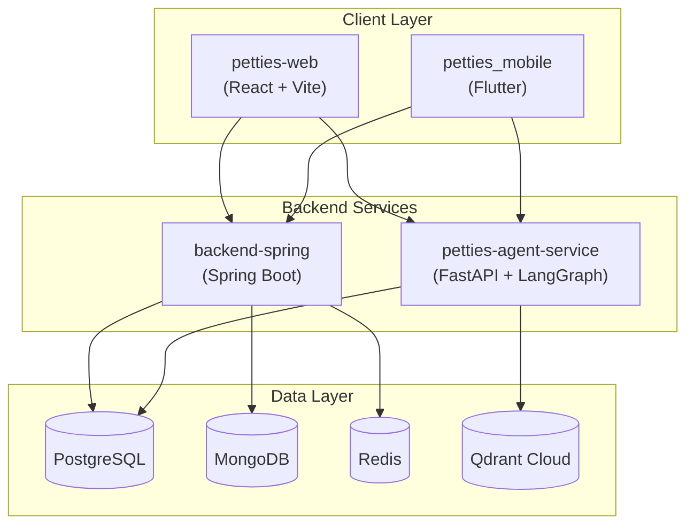
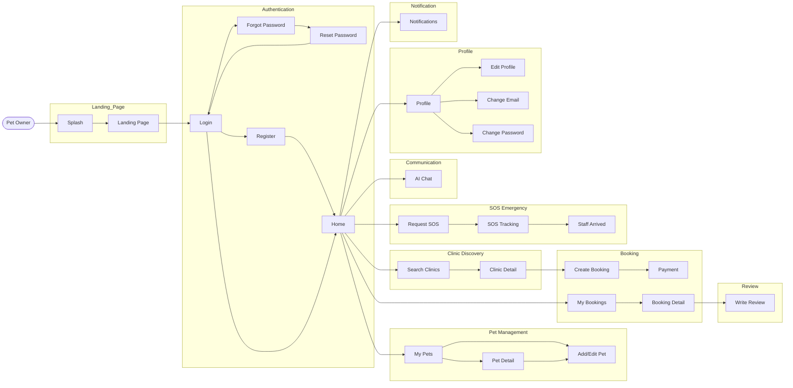
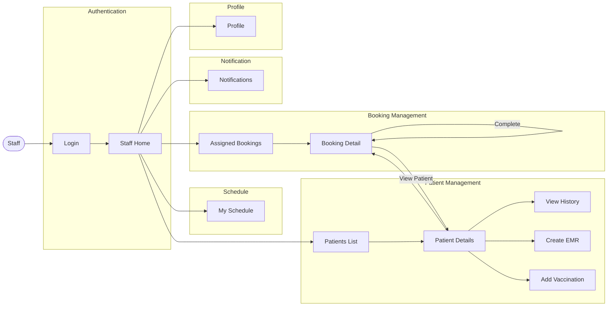
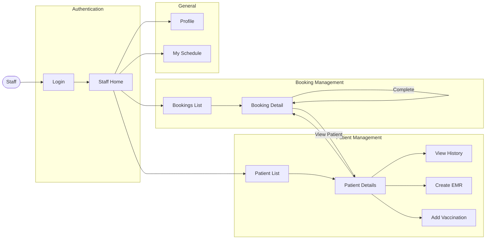
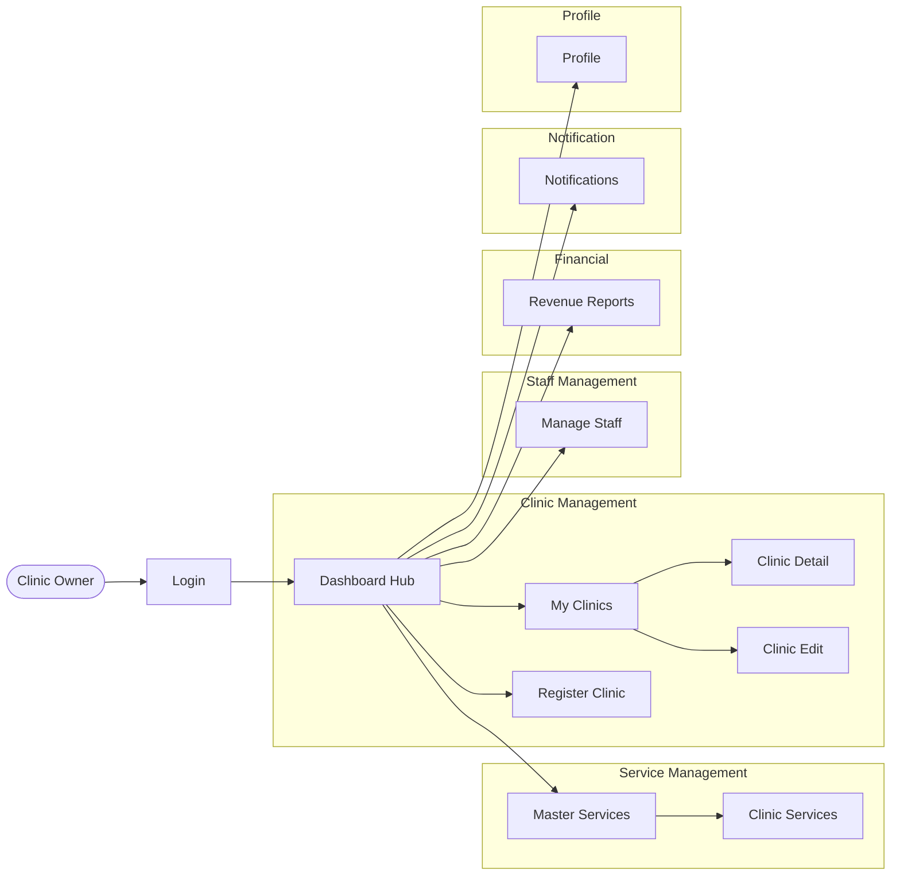
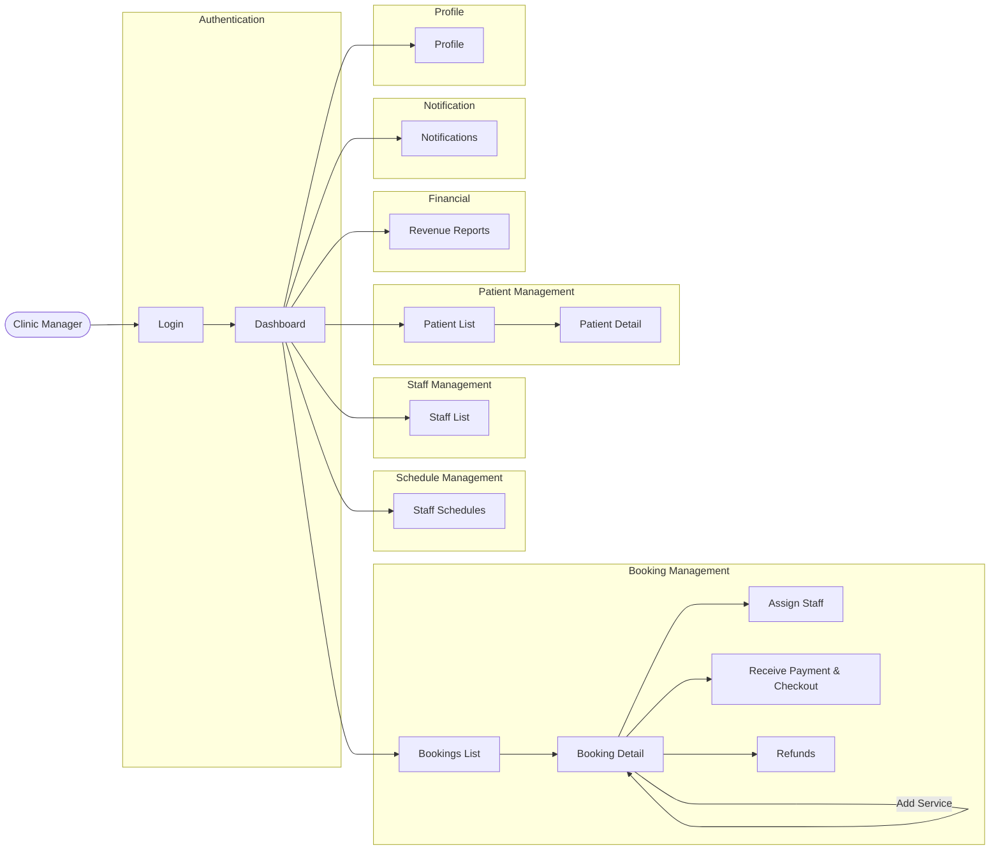
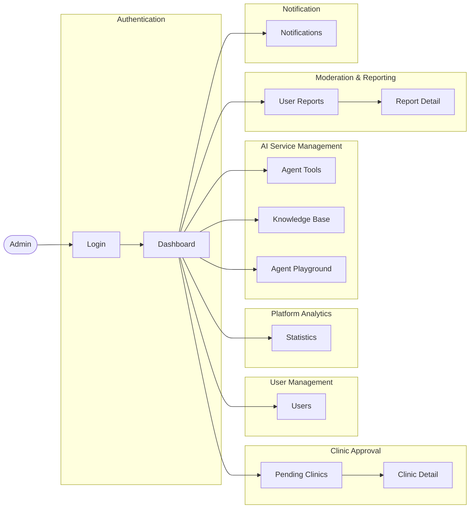
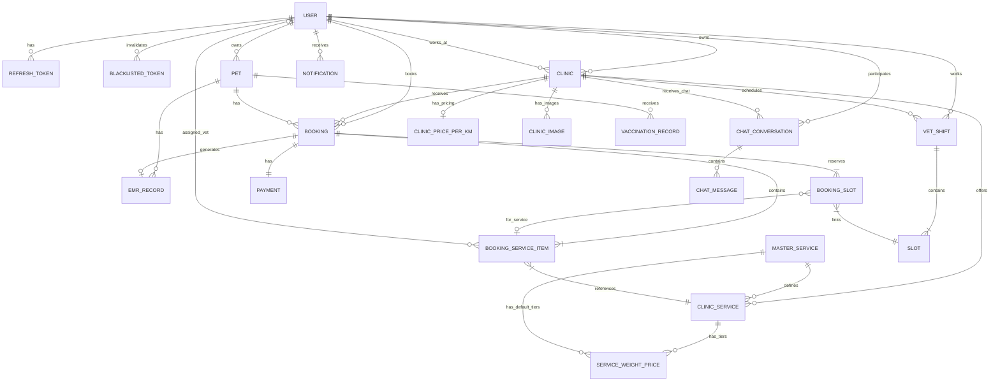

# PETTIES - Software Requirements Specification (SRS)

**Project:** Petties - Veterinary Appointment Booking Platform
**Version:** 1.7.0 (Use Cases organized by Boundary + Updated ERD)
**Last Updated:** 2026-01-28
**Document Status:** In Progress

---

## Table of Contents

1. [Product Overview](#1-product-overview)
2. [User Requirements](#2-user-requirements)
    - [2.3 Use Case Implementation Status Reference](#23-use-case-implementation-status-reference)
3. [Functional Requirements (Screen Flow)](#3-functional-requirements)
    - [3.2 Authentication & Onboarding](#32-authentication--onboarding)
    - [3.3 User Profile & Account Setup](#33-user-profile--account-setup)
    - [3.4 Pet Records & Health Hub](#34-pet-records--health-hub)
    - [3.5 Clinic Discovery Flow](#35-clinic-discovery-flow)
    - [3.6 Clinical Operations & Service Setup](#36-clinical-operations--service-setup)
    - [3.7 Staffing & Scheduling Flow](#37-staffing--scheduling-flow)
    - [3.8 Booking & Appointment Lifecycle Flow](#38-booking--appointment-lifecycle-flow)
    - [3.9 Electronic Medical Records (EMR) Flow](#39-electronic-medical-records-emr-flow)
    - [3.10 Specialized Services (SOS Emergency) Flow](#310-specialized-services-sos-emergency-flow)
    - [3.11 AI Assistance Flow](#311-ai-assistance-flow)
    - [3.12 Governance & Reporting Flow](#312-governance--reporting-flow)
4. [Non-Functional Requirements](#5-non-functional-requirements)
5. [Requirement Appendix](#6-requirement-appendix)

---

## 1. PRODUCT OVERVIEW

### 1.1 Product Purpose

**Petties** là nền tảng kết nối chủ thú cưng (Pet Owner) với các phòng khám thú y (Veterinary Clinics). Hệ thống cho phép:

- 🐾 Chủ pet đặt lịch khám tại phòng khám hoặc tại nhà
- 🏥 Phòng khám quản lý dịch vụ, nhân viên, lịch làm việc
- 👨‍⚕️ Nhân viên quản lý ca làm, khám bệnh, ghi hồ sơ y tế
- 🤖 AI Chatbot hỗ trợ tư vấn chăm sóc thú cưng
- 📊 Admin quản lý toàn bộ nền tảng

### 1.2 Product Scope

| Aspect | Description |
|--------|-------------|
| **Platform** | Web (Admin, Clinic), Mobile (Pet Owner, Staff) |
| **Target Users** | Pet Owners, Veterinary Clinics, Staff, Admins |
| **Geography** | Vietnam (initial), Southeast Asia (future) |
| **Timeline** | 13 Sprints (10/12/2025 - 11/03/2026) |

### 1.3 Intended Audience

| Audience | Description |
|----------|-------------|
| Developers | Xây dựng và bảo trì hệ thống |
| QA/Testers | Kiểm tra chức năng và chất lượng |
| Product Owners | Theo dõi và ưu tiên requirements |
| Stakeholders | Đánh giá tính khả thi và business value |

### 1.4 Product Overview Diagram (Context Diagram)

```mermaid
flowchart TB
    PO["🐾 Pet Owner<br/>(Mobile)"]
    STAFF["👨‍⚕️ Staff<br/>(Mobile + Web)"]
    CM["👨‍💼 Clinic Manager<br/>(Web)"]
    CO["🏥 Clinic Owner<br/>(Web)"]
    ADMIN["🔧 Admin<br/>(Web)"]
    
    SYSTEM(("🐾 Petties<br/>System"))
    
    %% Pet Owner flows
    PO -->|"Register, Login, Profile Update"| SYSTEM
    PO -->|"Pet Profile (View EMR + Vaccination)"| SYSTEM
    PO -->|"Search Clinic, Create Booking"| SYSTEM
    PO -->|"Payment (Stripe)"| SYSTEM
    PO -->|"Review, AI Chat, Report Violation"| SYSTEM
    SYSTEM -->|"Booking Confirmation, Notifications"| PO
    SYSTEM -->|"Pet Profile (EMR + Vaccination Records)"| PO
    
    %% Staff flows
    STAFF -->|"Login, View Schedule"| SYSTEM
    STAFF -->|"View Assigned Bookings"| SYSTEM
    STAFF -->|"Check-in, Create/Edit EMR"| SYSTEM
    STAFF -->|"Add/Edit Vaccination, Check-out"| SYSTEM
    SYSTEM -->|"Assigned Bookings, Schedules"| STAFF
    SYSTEM -->|"Pet Profile (EMR + Vaccination, READ-ONLY cross-clinic)"| STAFF
    
    %% Clinic Manager flows
    CM -->|"Add/Remove Staff"| SYSTEM
    CM -->|"Create Staff Schedule"| SYSTEM
    CM -->|"Assign Staff to Booking"| SYSTEM
    SYSTEM -->|"Staff List, Booking List/Pending Bookings"| CM
    SYSTEM -->|"Schedule Overview"| CM
    
    %% Clinic Owner flows
    CO -->|"Register Clinic"| SYSTEM
    CO -->|"Manage Master Services (Templates + Weight Tiers)"| SYSTEM
    CO -->|"Configure Clinic Services (Inherit or Custom)"| SYSTEM
    CO -->|"Add Clinic Manager"| SYSTEM
    SYSTEM -->|"Clinic Status, Revenue Report"| CO
    SYSTEM -->|"Dashboard Analytics"| CO
    
    %% Admin flows
    ADMIN -->|"Login, Approve/Reject Clinic"| SYSTEM
    ADMIN -->|"Configure AI Agents"| SYSTEM
    ADMIN -->|"Manage Knowledge Base, Process Reports"| SYSTEM
    SYSTEM -->|"Pending Clinics, Platform Stats"| ADMIN
    SYSTEM -->|"User Reports, Agent Status"| ADMIN
```



### 1.5 System Architecture Overview



---

## 2. USER REQUIREMENTS

### 2.1 User Roles

| Role | Platform | Description |
|------|----------|-------------|
| **PET_OWNER** | Mobile only | Chủ thú cưng, đặt lịch khám, xem hồ sơ y tế |
| **STAFF** | Mobile + Web | Nhân viên phòng khám (Nhân viên, Groomer, Lễ tân). Có chuyên môn cụ thể (`specialty`). |
| **CLINIC_MANAGER** | Web only | Quản lý phòng khám, gán booking cho nhân viên |
| **CLINIC_OWNER** | Web only | Chủ phòng khám, quản lý dịch vụ, doanh thu |
| **ADMIN** | Web only | Admin nền tảng, duyệt phòng khám, quản lý AI |

### 2.2 Use Cases (Organized by Boundary/Feature Module)

> **Approach:** Use Cases được nhóm theo **Boundary** (nhóm tính năng) thay vì theo Actor.
> Mỗi Boundary chứa nhiều Use Cases với nhiều Actors khác nhau tham gia.
> Cách tiếp cận này giúp nhìn nhận hệ thống theo góc độ chức năng, phù hợp với Business Workflow.

#### 2.2.1 Authentication & Onboarding (Boundary)

**Actors involved:** Pet Owner, Staff, Clinic Manager, Clinic Owner, Admin

| UC-ID | Use Case Name | Primary Actor | Other Actors | Priority |
|-------|---------------|---------------|--------------|----------|
| UC-AUTH-01 | Register Account (Email/OTP) | Pet Owner | - | High |
| UC-AUTH-02 | Login by Google OAuth | Pet Owner, Staff | - | High |
| UC-AUTH-03 | Staff Login (Invited Account) | Staff | Clinic Manager | High |
| UC-AUTH-04 | Manager Login | Clinic Manager | - | High |
| UC-AUTH-05 | Invite Staff (Quick Add by Email) | Clinic Manager | Staff | High |
| UC-AUTH-06 | Register Clinic (Pending Approval) | Clinic Owner | Admin | High |
| UC-AUTH-07 | Admin Login | Admin | - | High |

#### 2.2.2 User Profile & Account Setup (Boundary)

**Actors involved:** Pet Owner, Staff

| UC-ID | Use Case Name | Primary Actor | Other Actors | Priority |
|-------|---------------|---------------|--------------|----------|
| UC-PROFILE-01 | Manage Personal Profile (Update Info, Avatar) | Pet Owner, Staff | - | Medium |
| UC-PROFILE-02 | Change Password | Pet Owner, Staff | - | Medium |
| UC-PROFILE-03 | Change Email | Pet Owner | - | Low |
| UC-PROFILE-04 | Cancel Email Change Request | Pet Owner | - | Low |

#### 2.2.3 Pet Records & Health Hub (Boundary)

**Actors involved:** Pet Owner, Staff

| UC-ID | Use Case Name | Primary Actor | Other Actors | Priority |
|-------|---------------|---------------|--------------|----------|
| UC-PET-01 | Manage Pet Profiles (Add/Edit/Delete) | Pet Owner | - | High |
| UC-PET-02 | View Pet EMR Records | Pet Owner | Staff | Medium |
| UC-PET-03 | View Vaccination Records | Pet Owner | Staff | Medium |
| UC-PET-04 | View Patient History (Mobile) | Staff | - | High |
| UC-PET-05 | Update Pet Allergies | Pet Owner | - | Low |
| UC-PET-06 | Update Pet Weight (Quick update) | Pet Owner | - | Low |

#### 2.2.4 Clinic Discovery & Search (Boundary)

**Actors involved:** Pet Owner

| UC-ID | Use Case Name | Primary Actor | Other Actors | Priority |
|-------|---------------|---------------|--------------|----------|
| UC-CLINIC-01 | Search Clinics (Location/Filter) | Pet Owner | - | High |
| UC-CLINIC-02 | View Clinic Details | Pet Owner | - | High |

#### 2.2.5 Booking & Appointment Lifecycle (Boundary)

**Actors involved:** Pet Owner, Staff, Clinic Manager

| UC-ID | Use Case Name | Primary Actor | Other Actors | Priority |
|-------|---------------|---------------|--------------|----------|
| UC-BOOK-01 | Book Clinic Visit | Pet Owner | Clinic Manager | High |
| UC-BOOK-02 | Book Home Visit | Pet Owner | Clinic Manager | High |
| UC-BOOK-03 | View My Bookings | Pet Owner | - | High |
| UC-BOOK-04 | Cancel Booking | Pet Owner | Clinic Manager | Medium |
| UC-BOOK-05 | Online Payment (Stripe) | Pet Owner | - | High |
| UC-BOOK-06 | View Assigned Bookings | Staff | - | High |
| UC-BOOK-07 | Update Appointment Progress | Staff | - | High |
| UC-BOOK-08 | Check-in Patient | Staff | - | High |
| UC-BOOK-09 | Mark Treatment Finished | Staff | - | High |
| UC-BOOK-10 | Staff Home Dashboard Summary | Staff | - | Medium |
| UC-BOOK-11 | View New Bookings | Clinic Manager | - | High |
| UC-BOOK-12 | Assign Staff to Booking | Clinic Manager | Staff | High |
| UC-BOOK-13 | Handle Cancellations & Refunds | Clinic Manager | Pet Owner | Medium |
| UC-BOOK-14 | Receive Payment & Checkout | Clinic Manager | Pet Owner | High |
| UC-BOOK-15 | Check Staff Availability | Clinic Manager | Staff | Medium |
| UC-BOOK-16 | Reassign Staff to Service | Clinic Manager | Staff | Medium |

#### 2.2.6 Staffing & Scheduling (Boundary)

**Actors involved:** Staff, Clinic Manager, Clinic Owner

| UC-ID | Use Case Name | Primary Actor | Other Actors | Priority |
|-------|---------------|---------------|--------------|----------|
| UC-SCHED-01 | View Personal Schedule | Staff | - | High |
| UC-SCHED-02 | View Staff List | Clinic Manager | - | High |
| UC-SCHED-03 | Create Staff Shift (Manual Scheduling) | Clinic Manager | Staff | High |
| UC-SCHED-04 | Manage Shifts (Delete/Edit) | Clinic Manager | Staff | Medium |
| UC-SCHED-05 | Quick Add Staff by Email | Clinic Owner | Staff | Medium |
| UC-SCHED-06 | Manage Clinic Staff | Clinic Owner | Staff, Manager | Medium |
| UC-SCHED-07 | Block/Unblock Slot | Clinic Manager | - | Low |
| UC-SCHED-08 | Bulk Shift Delete | Clinic Manager | - | Low |

#### 2.2.7 Clinical Operations & Service Setup (Boundary)

**Actors involved:** Clinic Owner, Clinic Manager

| UC-ID | Use Case Name | Primary Actor | Other Actors | Priority |
|-------|---------------|---------------|--------------|----------|
| UC-OPS-01 | Manage Clinic Info | Clinic Owner | - | High |
| UC-OPS-02 | Configure Clinic Services | Clinic Owner | - | High |
| UC-OPS-03 | Configure Pricing & Weights | Clinic Owner | - | High |
| UC-OPS-04 | Manage Master Services | Clinic Owner | - | High |
| UC-OPS-05 | View Revenue Reports | Clinic Owner | - | Medium |
| UC-OPS-06 | Clinic Geocode (Convert address to GPS) | Clinic Owner | - | Medium |
| UC-OPS-07 | Clinic Distance Calculation | Clinic Owner | - | Medium |
| UC-OPS-08 | Service Home Visit Toggle | Clinic Owner | - | Low |
| UC-OPS-09 | Service Price Per KM | Clinic Owner | - | Low |
| UC-OPS-10 | Bulk Price Per KM Update | Clinic Owner | - | Low |

#### 2.2.8 Electronic Medical Records - EMR (Boundary)

**Actors involved:** Staff, Clinic Manager, Pet Owner

| UC-ID | Use Case Name | Primary Actor | Other Actors | Priority |
|-------|---------------|---------------|--------------|----------|
| UC-EMR-01 | Create EMR Record (SOAP) | Staff | - | High |
| UC-EMR-02 | Prescribe Medication | Staff | - | Medium |
| UC-EMR-03 | Add Vaccination Record | Staff | - | Medium |
| UC-EMR-04 | Patient Lookup | Staff | - | Medium |
| UC-EMR-05 | View Patient List | Clinic Manager | - | Medium |
| UC-EMR-06 | View Patient Records | Clinic Manager, Pet Owner | Staff | Medium |

#### 2.2.9 SOS Emergency Services (Boundary)

**Actors involved:** Pet Owner, Staff, Clinic Manager

| UC-ID | Use Case Name | Primary Actor | Other Actors | Priority |
|-------|---------------|---------------|--------------|----------|
| UC-SOS-01 | Request SOS | Pet Owner | Clinic Manager | High |
| UC-SOS-02 | Track Staff Location | Pet Owner | Staff | High |
| UC-SOS-03 | View ETA & Route | Pet Owner | Staff | High |
| UC-SOS-04 | Receive Arrival Alert | Pet Owner | Staff | High |
| UC-SOS-05 | Receive SOS Assignment | Staff | Clinic Manager | High |
| UC-SOS-06 | Start Emergency Travel (Manual Click) | Staff | - | High |
| UC-SOS-07 | Confirm SOS Arrival | Staff | Pet Owner | High |
| UC-SOS-08 | Dispatch SOS (Manual) | Clinic Manager | Staff | Medium |

#### 2.2.10 AI Assistance & Agents (Boundary)

**Actors involved:** Pet Owner, Admin

| UC-ID | Use Case Name | Primary Actor | Other Actors | Priority |
|-------|---------------|---------------|--------------|----------|
| UC-AI-01 | Ask Pet Care Advice (RAG) | Pet Owner | - | Medium |
| UC-AI-02 | Symptom Check | Pet Owner | - | Medium |
| UC-AI-03 | AI Booking Assistant | Pet Owner | - | Medium |
| UC-AI-04 | Real-time Chat (WebSocket) | Pet Owner | - | Medium |
| UC-AI-05 | Chat Images Gallery | Pet Owner | - | Low |
| UC-AI-06 | Manage Agent Tools | Admin | - | Low |
| UC-AI-07 | Manage Knowledge Base | Admin | - | Low |
| UC-AI-08 | Test Agent Playground | Admin | - | Low |

#### 2.2.11 Platform Administration & Governance (Boundary)

**Actors involved:** Admin, Pet Owner

| UC-ID | Use Case Name | Primary Actor | Other Actors | Priority |
|-------|---------------|---------------|--------------|----------|
| UC-GOV-01 | View Pending Clinics | Admin | - | High |
| UC-GOV-02 | Approve/Reject Clinic | Admin | Clinic Owner | High |
| UC-GOV-03 | View Platform Stats | Admin | - | Medium |
| UC-GOV-04 | View User Reports | Admin | - | Medium |
| UC-GOV-05 | Moderate Users (Ban/Suspend) | Admin | - | Medium |
| UC-GOV-06 | SSE Real-time Notifications | Admin | - | Low |
| UC-GOV-07 | Rate & Review | Pet Owner | Staff, Clinic | Low |
| UC-GOV-08 | Report Violation | Pet Owner | Admin | Low |

### 2.3 Use Case Implementation Status Reference

> **Legend:** ✅ Implemented | 🔄 In Progress | ❌ Not Started | 📋 Documented in SRS

#### Authentication & Account Management

| # | Use Case | UC-ID | SRS Ref | Backend | Frontend | Status |
|---|----------|-------|---------|---------|----------|--------|
| 1 | Register Account | UC-PO-01 | 3.2.1 | ✅ AuthController | ✅ Mobile | ✅ Done |
| 2 | Login | UC-PO-01a | 3.2.2 | ✅ AuthController | ✅ Mobile/Web | ✅ Done |
| 3 | Login by Google | UC-PO-02 | 3.2.2 | ✅ AuthController | ✅ Mobile/Web | ✅ Done |
| 4 | Forgot password | UC-PO-01b | 3.2.3 | ✅ AuthController | ✅ Mobile/Web | ✅ Done |
| 5 | Logout | UC-PO-01c | 3.2.4 | ✅ AuthController | ✅ Mobile/Web | ✅ Done |
| 6 | View profile | UC-PO-03 | 3.3.1 | ✅ UserController | ✅ Mobile/Web | ✅ Done |
| 7 | Edit information | UC-PO-03 | 3.3.1 | ✅ UserController | ✅ Mobile/Web | ✅ Done |
| 8 | Reset password | UC-PO-03d | 3.3.2 | ✅ UserController | ✅ Mobile/Web | ✅ Done |
| 9 | View landing page | - | - | N/A | ✅ Web | ✅ Done |

#### User & Notification Management

| # | Use Case | UC-ID | SRS Ref | Backend | Frontend | Status |
|---|----------|-------|---------|---------|----------|--------|
| 10 | View notification | - | - | ✅ NotificationController | ✅ Mobile/Web | ✅ Done |
| 11 | Receive Notification | - | - | ✅ FCM/SSE | ✅ Mobile/Web | ✅ Done |
| 12 | View user account | - | - | ✅ UserController | ✅ Web | ✅ Done |
| 13 | Create notification | - | - | ✅ NotificationService | ❌ | 🔄 Backend Only |
| 14 | Delete notification | - | - | ❌ | ❌ | ❌ Not Started |
| 109 | Cancel Email Change Request | UC-PO-24 | 2.2.2 | ✅ UserController | ✅ Mobile | ✅ Done |

#### Pet Management

| # | Use Case | UC-ID | SRS Ref | Backend | Frontend | Status |
|---|----------|-------|---------|---------|----------|--------|
| 15 | View Pet Profile | UC-PO-04 | 3.4.1 | ✅ PetController | ✅ Mobile | ✅ Done |
| 16 | Create Pet Profile | UC-PO-04 | 3.4.1 | ✅ PetController | ✅ Mobile | ✅ Done |
| 17 | Edit Pet Profile | UC-PO-04 | 3.4.2 | ✅ PetController | ✅ Mobile | ✅ Done |
| 18 | Delete Pet Profile | UC-PO-04 | 3.4.2 | ✅ PetController | ✅ Mobile | ✅ Done |
| 19 | View Pet vaccination records | UC-PO-12 | 3.4.3 | ✅ VaccinationController | ✅ Mobile | ✅ Done |
| 20 | View medical records | UC-PO-11 | 3.4.3 | ✅ EmrController | ✅ Mobile | ✅ Done |
| 94 | Update Pet Allergies | UC-PO-21 | - | ✅ PetController | ✅ Mobile | ✅ Done |
| 95 | Update Pet Weight | UC-PO-22 | - | ✅ PetController | ✅ Mobile | ✅ Done |

#### Clinic Discovery & Booking

| # | Use Case | UC-ID | SRS Ref | Backend | Frontend | Status |
|---|----------|-------|---------|---------|----------|--------|
| 21 | View Clinic's List | UC-PO-05 | 3.5.1 | ✅ ClinicController | ✅ Mobile/Web | ✅ Done |
| 22 | Search clinics | UC-PO-05 | 3.5.1 | ✅ ClinicController | ✅ Mobile | ✅ Done |
| 23 | View Clinic Details | UC-PO-05b | 3.5.2 | ✅ ClinicController | ✅ Mobile | ✅ Done |
| 24 | View Clinic On Map | - | - | ✅ ClinicController | ✅ Mobile | ✅ Done |
| 25 | Book an appointment | UC-PO-06 | 3.8.1 | ✅ BookingController | ✅ Mobile | ✅ Done |
| 26 | SOS Booking | UC-PO-15 | 3.10 | ✅ BookingController | ✅ Mobile | ✅ Done |
| 27 | Cancel Booking | UC-PO-09 | - | ✅ BookingController | ✅ Mobile | ✅ Done |
| 28 | Make payment | UC-PO-10 | 3.8.2 | 🔄 Stripe Integration | ❌ | 🔄 In Progress |
| 29 | View invoice | - | - | ❌ | ❌ | ❌ Not Started |
| 30 | Receive medication reminders | - | - | ❌ | ❌ | ❌ Not Started |
| 31 | Track Staff location | UC-PO-17 | 3.10.1 | 🔄 | 🔄 Mobile | 🔄 In Progress |
| 96 | Clinic Geocode | UC-CO-09 | - | ✅ ClinicController | ✅ Web | ✅ Done |
| 97 | Clinic Distance Calculation | UC-CO-10 | - | ✅ ClinicController | ✅ Mobile | ✅ Done |

#### AI Assistant

| # | Use Case | UC-ID | SRS Ref | Backend | Frontend | Status |
|---|----------|-------|---------|---------|----------|--------|
| 32 | Booking With ChatBot | UC-PO-14c | 3.11.1 | ✅ Agent Service | ✅ Mobile | ✅ Done |
| 33 | Ask ChatBot To Pet Care | UC-PO-14a | 3.11.1 | ✅ Agent Service | ✅ Mobile | ✅ Done |
| 34 | Chat | UC-PO-14d | 3.11.2 | ✅ ChatController | ✅ Mobile | ✅ Done |
| 98 | Real-time Chat WebSocket | UC-PO-20 | - | ✅ ChatWebSocketController | ✅ Mobile/Web | ✅ Done |
| 99 | Chat Images Gallery | UC-PO-23 | - | ✅ ChatController | ✅ Mobile | ✅ Done |

#### Rating & Reporting

| # | Use Case | UC-ID | SRS Ref | Backend | Frontend | Status |
|---|----------|-------|---------|---------|----------|--------|
| 35 | Rate and review vet | UC-PO-13 | - | ❌ | ❌ | ❌ Not Started |
| 36 | Report clinic, vet | UC-PO-16 | 3.12.1 | ❌ | ❌ | 📋 Documented |

#### Admin Functions

| # | Use Case | UC-ID | SRS Ref | Backend | Frontend | Status |
|---|----------|-------|---------|---------|----------|--------|
| 37 | View list of pending clinics | UC-AD-02 | 3.6.2 | ✅ ClinicController | ✅ Web | ✅ Done |
| 38 | Approve/ Reject clinic | UC-AD-03 | 3.6.2 | ✅ ClinicController | ✅ Web | ✅ Done |
| 39 | View platform statistics | UC-AD-04 | - | ❌ | ❌ | ❌ Not Started |
| 40 | View revenue | UC-CO-05 | - | ❌ | ❌ | ❌ Not Started |
| 41 | View policy | - | - | ❌ | ❌ | ❌ Not Started |
| 42 | Update policy | - | - | ❌ | ❌ | ❌ Not Started |
| 43 | Upload Document To Knowledge Base | UC-AD-06 | - | ✅ Agent Service | ✅ Web | ✅ Done |
| 44 | Accept/ Reject User Reports | UC-AD-09 | - | ❌ | ❌ | ❌ Not Started |
| 45 | View User Report | UC-AD-08 | - | ❌ | ❌ | ❌ Not Started |
| 46 | Turn On/Off Agent Tools | UC-AD-05 | - | ✅ Agent Service | ✅ Web | ✅ Done |
| 47 | Config Agent Parameter | UC-AD-05 | - | ✅ Agent Service | ✅ Web | ✅ Done |
| 48 | Test Agent Playground | UC-AD-07 | - | ✅ Agent Service | ✅ Web | ✅ Done |
| 100 | SSE Real-time Notifications | UC-AD-10 | - | ✅ SseController | ✅ Web | ✅ Done |

#### Clinic Owner Functions

| # | Use Case | UC-ID | SRS Ref | Backend | Frontend | Status |
|---|----------|-------|---------|---------|----------|--------|
| 49 | Register Clinic | UC-CO-01 | 3.6.1 | ✅ ClinicController | ✅ Web | ✅ Done |
| 50 | Edit Clinic | UC-CO-02 | - | ✅ ClinicController | ✅ Web | ✅ Done |
| 51 | Create Clinic Service | UC-CO-03 | - | ✅ ClinicServiceController | ✅ Web | ✅ Done |
| 52 | Update Clinic Service | UC-CO-03 | - | ✅ ClinicServiceController | ✅ Web | ✅ Done |
| 53 | Delete Clinic Service | UC-CO-03 | - | ✅ ClinicServiceController | ✅ Web | ✅ Done |
| 54 | Create Master Services | UC-CO-08 | 3.6.3 | ✅ MasterServiceController | ✅ Web | ✅ Done |
| 55 | View Master Services | UC-CO-08 | - | ✅ MasterServiceController | ✅ Web | ✅ Done |
| 56 | Update Master Services | UC-CO-08 | - | ✅ MasterServiceController | ✅ Web | ✅ Done |
| 57 | Delete Master Services | UC-CO-08 | - | ✅ MasterServiceController | ✅ Web | ✅ Done |
| 58 | Inherit From Master Service | - | - | ✅ ClinicServiceController | ✅ Web | ✅ Done |
| 59 | Handle Clinic (Active/Suspend) | - | - | ✅ ClinicController | ✅ Web | ✅ Done |
| 60 | Configure Pricing And Weight Tiers | UC-CO-04 | 3.6.4 | ✅ ClinicPriceController | ✅ Web | ✅ Done |
| 101 | Service Home Visit Toggle | UC-CO-11 | - | ✅ ClinicServiceController | ✅ Web | ✅ Done |
| 102 | Service Price Per KM | UC-CO-12 | - | ✅ ClinicServiceController | ✅ Web | ✅ Done |
| 103 | Bulk Price Per KM Update | UC-CO-13 | - | ✅ ClinicServiceController | ✅ Web | ✅ Done |

#### Staff Management

| # | Use Case | UC-ID | SRS Ref | Backend | Frontend | Status |
|---|----------|-------|---------|---------|----------|--------|
| 61 | Add Staff | UC-CM-03 | 3.7.1 | ✅ ClinicStaffController | ✅ Web | ✅ Done |
| 62 | Delete Staff | UC-CO-07 | - | ✅ ClinicStaffController | ✅ Web | ✅ Done |
| 63 | View list of staff | UC-CM-02 | - | ✅ ClinicStaffController | ✅ Web | ✅ Done |
| 64 | Add staff | UC-CM-03 | 3.7.1 | ✅ ClinicStaffController | ✅ Web | ✅ Done |
| 65 | Create Staff Shift | UC-CM-04 | 3.7.2 | ✅ StaffShiftController | ✅ Web | ✅ Done |
| 66 | View Staff Shift Detail | UC-ST-02 | - | ✅ StaffShiftController | ✅ Web | ✅ Done |
| 67 | Update Staff Shift | UC-CM-16 | - | ✅ StaffShiftController | ✅ Web | ✅ Done |
| 68 | Block/Unblock Slot | - | - | ✅ StaffShiftController | ✅ Web | ✅ Done |
| 69 | View work schedule | UC-ST-02 | - | ✅ StaffShiftController | ✅ Mobile/Web | ✅ Done |
| 70 | View staff's profile | UC-ST-02 | - | ✅ UserController | ✅ Mobile | ✅ Done |
| 71 | Update Staff's Profile | UC-ST-02 | - | ✅ UserController | ✅ Mobile | ✅ Done |
| 104 | Block/Unblock Slot (Manual) | UC-CM-11 | 2.2.6 | ✅ StaffShiftController | ✅ Web | ✅ Done |
| 105 | Bulk Shift Delete | UC-CM-12 | 2.2.6 | ✅ StaffShiftController | ✅ Web | ✅ Done |

#### Manager Booking Operations

| # | Use Case | UC-ID | SRS Ref | Backend | Frontend | Status |
|---|----------|-------|---------|---------|----------|--------|
| 72 | View New Bookings | UC-CM-05 | - | ✅ BookingController | ✅ Web | ✅ Done |
| 73 | Assign Staff to Booking | UC-CM-06 | 3.8.3 | ✅ BookingController | ✅ Web | ✅ Done |
| 74 | Reassign Staff | UC-CM-06 | 3.8.4 | ✅ BookingController | ✅ Web | ✅ Done |
| 75 | View request cancel booking | UC-CM-07 | - | ✅ BookingController | ✅ Web | ✅ Done |
| 76 | Approve/ Reject Request | UC-CM-07 | - | 🔄 | ❌ | 🔄 In Progress |
| 77 | View Statistics | UC-CO-05 | - | ❌ | ❌ | ❌ Not Started |
| 78 | View Payment Transactions History | - | - | ❌ | ❌ | ❌ Not Started |
| 79 | Process Refund | UC-CM-07 | - | ❌ | ❌ | ❌ Not Started |
| 80 | View List Cancellation And Refund | - | - | ❌ | ❌ | ❌ Not Started |
| 106 | Check Staff Availability | UC-CM-14 | 2.2.5 | ✅ BookingController | ✅ Web | ✅ Done |
| 107 | Reassign Staff to Service | UC-CM-15 | 2.2.5 | ✅ BookingController | ✅ Web | ✅ Done |
| 108 | Staff Home Dashboard Summary | UC-ST-14 | 2.2.5 | ✅ BookingController | ✅ Mobile | ✅ Done |

#### Patient & EMR Management

| # | Use Case | UC-ID | SRS Ref | Backend | Frontend | Status |
|---|----------|-------|---------|---------|----------|--------|
| 81 | View patient list | UC-CM-08 | 3.9.6 | ✅ EmrController | ✅ Web | ✅ Done |
| 82 | View patient record | UC-CM-09 | 3.9.7 | ✅ EmrController | ✅ Web | ✅ Done |
| 83 | Search examined patients | UC-VT-12 | 3.9.5 | ✅ EmrController | ✅ Web | ✅ Done |
| 84 | View patient details | UC-CM-09 | 3.9.7 | ✅ EmrController | ✅ Web | ✅ Done |
| 85 | View patient history list | UC-VT-13 | - | ✅ EmrController | ✅ Mobile | ✅ Done |
| 86 | View pet's medical record | UC-VT-06 | 3.9.1 | ✅ EmrController | ✅ Mobile/Web | ✅ Done |
| 87 | Update pet's medical record | UC-VT-06 | 3.9.1 | ✅ EmrController | ✅ Mobile | ✅ Done |
| 88 | Create prescription | UC-VT-07 | 3.9.2 | ✅ EmrController | ✅ Mobile | ✅ Done |
| 89 | View pet's vaccination record | UC-VT-08 | 3.9.4 | ✅ VaccinationController | ✅ Mobile | ✅ Done |
| 90 | Update pet's vaccination record | UC-VT-08 | 3.9.4 | ✅ VaccinationController | ✅ Mobile | ✅ Done |
| 91 | Check in patient | UC-VT-05 | 3.8.6 | ✅ BookingController | ✅ Mobile/Web | ✅ Done |
| 92 | Checkout patient | UC-CM-10 | 3.8.6 | ✅ BookingController | ✅ Web | ✅ Done |
| 93 | View assigned booking | UC-VT-03 | - | ✅ BookingController | ✅ Mobile | ✅ Done |

#### Implementation Summary

| Status | Count | Percentage |
|--------|-------|------------|
| ✅ Done | 91 | 83.5% |
| 🔄 In Progress | 5 | 4.6% |
| ❌ Not Started | 13 | 11.9% |
| **Total** | **109** | **100%** |

---

## 3. FUNCTIONAL REQUIREMENTS

### 3.1 System Functional Overview

#### 3.1.1 Screens Flow

---

##### 3.1.1.1 Mobile App - Pet Owner Flow (24 screens)



---

##### 3.1.1.2 Mobile App - Staff Flow (16 screens)




---

##### 3.1.1.3 Web App - Staff Flow (9 screens)



---

##### 3.1.1.4 Web App - Clinic Owner Flow (14 screens)



---

##### 3.1.1.5 Web App - Clinic Manager Flow (13 screens)



---

##### 3.1.1.6 Web App - Admin Flow (12 screens)



#### 3.1.2 Screen Descriptions

> **Organized by Module/Feature** - Detailed descriptions of 80 screens grouped by functionality.
>
> **Format:** Table per Module showing ID, Screen Name, Platform/Role, and Description.

---

##### 3.1.2.1 Onboarding & Authentication Modules (#1-11)

| # | Module | Screen Name | Platform/Role | Description |
|:---:|:---|:---|:---|:---|
| 1 | Onboarding | Splash | Mobile/Pet Owner | Logo animation and auto-redirect to onboarding or home |
| 2 | Onboarding | Landing Page | Mobile/Pet Owner | 3 slides (Booking, AI, Health records). Skip and Continue/Start buttons |
| 3 | Auth | Login | Mobile/PO, Staff | Username + Password, Forgot Password link. Google Sign-in (TBI) |
| 4 | Auth | Register | Mobile/PO | 2-step flow: Form (User, Email, Password, Full Name, Phone) → OTP verification |
| 5 | Auth | Forgot Password | Mobile/PO | Enter email → Send OTP → Navigate to Reset Password |
| 6 | Auth | Reset Password | Mobile/PO | Enter OTP 6 digits + New Password to reset password |
| 7 | Auth | Login | Web/Staff, Admin | Shared login portal. Auto-redirect based on role. Blocks PET_OWNER |
| 8 | Auth | Register | Web/Clinic Owner | 2-step OTP registration for Clinic Owner accounts |
| 9 | Auth | Forgot Password | Web | Enter email to receive OTP for password reset |
| 10 | Auth | Reset Password | Web | Enter OTP + New Password to reset password |
| 11 | Auth | Landing Page | Web/Landing | Landing page with feature showcase for visitors |

##### 3.1.2.2 Home & Dashboard Module (#12-18)

| # | Screen Name | Platform/Role | Description |
|:---:|:---|:---|:---|
| 12 | Home | Mobile/PO | Welcome card, Pet stats, Quick actions, Preview pets, Bottom nav |
| 13 | Staff Home | Mobile/Staff | Welcome card, Today stats, Today schedule, Pending bookings |
| 14 | Staff Home | Web/Staff | Shift overview, pending examinations (Placeholder) |
| 15 | Dashboard Hub | Web/Clinic Owner | Today stats (Revenue, Bookings), Clinic info, Monthly revenue |
| 16 | Dashboard | Web/Manager | Today overview, Pending actions (Unassigned, Refunds), Recent table |
| 17 | Dashboard | Web/Admin | Service Health check (AI, Spring), Platform stats, Quick links |

##### 3.1.2.3 Pet Management & Clinic Discovery (#18-22)

| # | Module | Screen Name | Platform/Role | Description |
|:---:|:---|:---|:---|:---|
| 18 | Pet Mgt | My Pets | Mobile/PO | ListView with pet cards, Add (+) button, Empty state |
| 19 | Pet Mgt | Pet Detail | Mobile/PO | Header image, Info card. Actions: Edit, Delete |
| 20 | Pet Mgt | Add/Edit Pet | Mobile/PO | Form to add/edit pet info (image, name, species, breed, dob, weight) |
| 21 | Discovery | Search Clinics | Mobile/PO | Map view, GPS-based search, filters, ratings |
| 22 | Discovery | Clinic Detail | Mobile/PO | Gallery, info, services, reviews, Book button |

##### 3.1.2.4 Clinic & Service Management (#23-30)

| # | Module | Screen Name | Platform/Role | Description |
|:---:|:---|:---|:---|:---|
| 23 | Clinic Mgt | Register Clinic | Web/Owner | 2-step: ClinicForm → Image Upload after creation |
| 24 | Clinic Mgt | My Clinics | Web/Owner | Header with Create, Filters (status, name), ClinicList |
| 25 | Clinic Mgt | Clinic Detail | Web/Owner | Clinic details (info, images, legal documents) |
| 26 | Clinic Mgt | Clinic Edit | Web/Owner | Form to edit clinic info, gallery management |
| 27 | Clinic Mgt | Pending Clinics | Web/Admin | Table of pending clinics, Actions: View/Approve/Reject |
| 28 | Clinic Mgt | Clinic Detail | Web/Admin | Background check, legal verification for approval |
| 29 | Service Mgt | Master Services | Web/Owner | Manage service templates for all branches under this owner |
| 30 | Service Mgt | Clinic Services | Web/Owner | Configure specific pricing and status per clinic branch |

##### 3.1.2.5 Staff, Booking & Clinical Workspace (#31-49)

| # | Module | Screen Name | Platform/Role | Description |
|:---:|:---|:---|:---|:---|
| 31 | Staff Mgt | Manage Staff | Web/Owner | Clinic dropdown, StaffTable, QuickAddStaffModal (STAFF/MANAGER) |
| 32 | Staff Mgt | Staff List | Web/Manager | Manage branch vets directory, quick add tools |
| 33 | Booking | Create Booking | Mobile/PO | Select pet, service, date, time slot, notes |
| 34 | Booking | Payment | Mobile/PO | Stripe/Cash checkout with cost breakdown |
| 35 | Booking | My Bookings | Mobile/PO | Appointment list: Upcoming, Completed, Cancelled |
| 36 | Booking | Booking Detail | Mobile/PO | Real-time status timeline, actions, contact |
| 37 | Booking | Assigned Bookings | Mobile/Staff | List of assigned bookings (Today, Upcoming, Done) |
| 38 | Booking | Booking Detail | Mobile/Staff | Appointment details, pet info, owner contact, start check-in |
| 39 | Booking | Bookings List | Web/Staff | Bookings with advanced table filtering |
| 40 | Booking | Booking Detail | Web/Staff | Appointment details, triage actions |
| 41 | Booking | Bookings List | Web/Manager | Oversight of branch appointments |
| 42 | Booking | Assign Staff | Web/Manager | Assigning available doctors to requests |
| 43 | Booking | Refunds | Web/Manager | Cancellation management, refund processing |
| 44 | Clinical | Examination View | Mobile/Staff | Active examination screen (In-Progress) |
| 45 | Clinical | Create EMR | Mobile/Staff | Clinical notes (SOAP format), prescription entry |
| 46 | Clinical | Checkout | Web/Manager | Receive payment & Close booking (COMPLETED) |
| 47 | Clinical | Add Vaccination | Mobile/Staff | Record new immunization entries |
| 48 | Clinical | Examination Hub | Web/Staff | Main hub for managing active examinations |

##### 3.1.2.6 Patient & Schedule Management (#50-58)

| # | Module | Screen Name | Platform/Role | Description |
|:---:|:---|:---|:---|:---|
| 50 | Patient Mgt | Pet History | Mobile/Staff | Comprehensive view of medical history, vaccines |
| 51 | Patient Mgt | Patients List | Mobile/Staff | Directory of patients treated at clinic |
| 52 | Patient Mgt | Patient List | Web/Staff | Directory of patients treated at clinic |
| 53 | Patient Mgt | Patient History | Web/Staff | Detailed medical records, vaccine view |
| 54 | Patient Mgt | Patient List | Web/Manager | Patient directory with immunization alerts |
| 55 | Patient Mgt | Patient Detail | Web/Manager | Detailed clinical records view (read-only) |
| 56 | Schedule | My Schedule | Mobile/Staff | Personal calendar (Month/Week/Day views) |
| 57 | Schedule | My Schedule | Web/Staff | Desktop-optimized personal calendar |
| 58 | Schedule | Staff Schedules | Web/Manager | Roster management, shift allocation |

##### 3.1.2.7 Other Core Modules (#59-80)

| # | Module | Screen Name | Platform/Role | Description |
|:---:|:---|:---|:---|:---|
| 59 | SOS Emergency | Create SOS Request | Mobile/PO | Wizard to create emergency SOS booking with location, pet selection |
| 60 | SOS Emergency | SOS Tracking | Mobile/PO | Real-time GPS map showing vet location, route, and ETA |
| 61 | SOS Emergency | Start SOS Travel | Mobile/Staff | Emergency GPS toggle, route visual, geofence arrival confirmation |
| 62 | Communication | AI Chat | Mobile/PO | Chat with AI assistant (3 modes: RAG Knowledge, Symptom Checker, AI Booking) |
| 63 | Pet Health | Pet EMR History | Mobile/PO | View pet's medical records timeline (SOAP notes, prescriptions) |
| 64 | Pet Health | Pet Vaccination History | Mobile/PO | View pet's vaccination records with next due dates and reminders |
| 65 | Notification | Notifications | Mobile/PO, Staff | In-app notification center for users and staff |
| 66 | Notification | Notifications | Web/All Staff | Centralized operational and system alerts |
| 67 | Profile | Profile | Mobile/PO, Staff | Avatar, Info, Actions (Edit, Email, Pass, Logout) |
| 68 | Profile | Edit Profile | Mobile/PO, Staff | Form to edit personal info (name, phone, avatar) |
| 69 | Profile | Change Email | Mobile/PO, Staff | Form to change email with OTP verification |
| 70 | Profile | Change Pass | Mobile/PO, Staff | Form to change password (current + new) |
| 71 | Profile | Profile | Web/Staff, Admin | Shared profile page. Account info and security |
| 72 | Review | Write Review | Mobile/PO | 1-5 star rating and comment after booking COMPLETED |
| 73 | Financial | Revenue Reports | Web/Owner, Manager | Financial statements, growth charts (Branch specific for Manager) |
| 74 | User Mgt | Users | Web/Admin | Centralized management of all user accounts |
| 75 | Analytics | Statistics | Web/Admin | Specialized reports, data export tools |
| 76 | AI Mgt | Agent Tools | Web/Admin | Manage MCP tools for AI Agent |
| 77 | AI Mgt | Knowledge Base | Web/Admin | RAG config, Upload docs, Query Tester |
| 78 | AI Mgt | Agent Playground | Web/Admin | Prompt config, params tuning, chat testing |
| 79 | Moderation | User Reports | Web/Admin | Queue of violation reports from users |
| 80 | Moderation | Report Detail | Web/Admin | Panel for moderation actions (Warn/Suspend/Ban) |

#### 3.1.3 Screen Authorization

*Provide the system roles authorization to the system features (down to screens, and event to the screen activities if applicable) in the table form below.*

| Screen | GUEST | PET_OWNER | STAFF | CLINIC_OWNER | CLINIC_MANAGER | ADMIN |
|--------|:-----:|:---------:|:---:|:------------:|:--------------:|:-----:|
| **Authentication Module** | | | | | | |
| Landing Page (Web) | X | X | X | X | X | X |
|   → View features | X | X | X | X | X | X |
|   → Navigate to Login/Register | X | X | X | X | X | X |
| Login Screen (Mobile - PO) | X | | | | | |
|   → Enter email/password | X | | | | | |
|   → Google Sign-in | X | | | | | |
|   → Forgot Password link | X | | | | | |
| Login Screen (Mobile - Staff) | | | X | | | |
|   → Google Sign-in | | | X | | | |
| Login Screen (Web) | | | X | X | X | X |
|   → Google Sign-in (Staff) | | | X | X | X | X |
|   → Email/Password (Admin) | | | | | | X |
|   → Forgot Password link | | | | | | X |
| Register Screen | X | | | X | | |
|   → Fill registration form | X | | | X | | |
|   → Verify OTP | X | | | X | | |
| Forgot Password | X | | | | | |
|   → Enter email | X | | | | | |
|   → Verify OTP | X | | | | | |
|   → Set new password | X | | | | | |
| **Pet Owner Screens** | | | | | | |
| Home (Pet Owner) | | X | | | | |
|   → View quick stats | | X | | | | |
|   → Navigate to features | | X | | | | |
| My Pets | | X | | | | |
|   → View pet list | | X | | | | |
|   → Add new pet | | X | | | | |
|   → Edit pet | | X | | | | |
|   → Delete pet | | X | | | | |
| Pet Detail | | X | | | | |
|   → View pet info | | X | | | | |
|   → Upload photo | | X | | | | |
|   → View EMR history | | X | | | | |
|   → View vaccination | | X | | | | |
| Search Clinics | | X | | | | |
|   → Search by keyword | | X | | | | |
|   → Filter by distance | | X | | | | |
|   → View on map | | X | | | | |
| Clinic Detail | | X | | | | |
|   → View clinic info | | X | | | | |
|   → View services | | X | | | | |
|   → View reviews | | X | | | | |
|   → Book appointment | | X | | | | |
| Create Booking | | X | | | | |
|   → Select service | | X | | | | |
|   → Select pet | | X | | | | |
|   → Select slot | | X | | | | |
|   → Confirm booking | | X | | | | |
| My Bookings | | X | | | | |
|   → View upcoming | | X | | | | |
|   → View past | | X | | | | |
|   → Cancel booking | | X | | | | |
| AI Chat | | X | | | | |
|   → Send message | | X | | | | |
|   → View response | | X | | | | |
| Write Review | | X | | | | |
|   → Rate (1-5 stars) | | X | | | | |
|   → Write comment | | X | | | | |
| **Staff Screens** | | | | | | |
| Dashboard (Staff) | | | X | | | |
|   → View today stats | | | X | | | |
|   → View pending tasks | | | X | | | |
| My Schedule | | | X | | X | |
|   → View calendar | | | X | | X | |
|   → View shift details | | | X | | | |
| Assigned Bookings | | | X | | | |
|   → View booking list | | | X | | | |
|   → View booking details | | | X | | | |
| Check-in | | | X | | | |
|   → Confirm arrival | | | X | | | |
|   → Start examination | | | X | | | |
| Create EMR | | | X | | | |
|   → Fill SOAP form | | | X | | | |
|   → Add prescription | | | X | | | |
|   → Upload photos | | | X | | | |
| Check-out/Checkout | | | | | X | |
|   → Complete booking | | | | | X | |
|   → Collect cash payment/payment | | | | | X | |
| Patient History | | | X | | X | |
|   → View EMR records | | | X | | X | |
|   → View vaccination | | | X | | X | |
| **Clinic Manager Screens** | | | | | | |
| Manager Dashboard | | | | | X | |
|   → View clinic stats | | | | | X | |
|   → View pending tasks | | | | | X | |
| Staff List | | | | X | X | |
|   → View all staff | | | | X | X | |
|   → Add new staff | | | | X | X | |
|   → Remove staff | | | | X | X | |
| Staff Shift Calendar | | | | | X | |
|   → View all shifts | | | | | X | |
|   → Create shift | | | | | X | |
|   → Delete shift | | | | | X | |
| All Bookings | | | | | X | |
|   → View all bookings | | | | | X | |
|   → Assign vet | | | | | X | |
|   → Process refund | | | | | X | |
| **Clinic Owner Screens** | | | | | | |
| Owner Dashboard | | | | X | | |
|   → View revenue stats | | | | X | | |
|   → View clinic status | | | | X | | |
| Register Clinic | | | | X | | |
|   → Fill clinic info | | | | X | | |
|   → Upload images | | | | X | | |
|   → Submit for approval | | | | X | | |
| Clinic Info Edit | | | | X | | |
|   → Edit clinic details | | | | X | | |
|   → Manage gallery | | | | X | | |
| Service Management | | | | X | | |
|   → Add service | | | | X | | |
|   → Edit pricing | | | | X | | |
|   → Configure weight tiers | | | | X | | |
| Manager Assignment | | | | X | | |
|   → Assign manager | | | | X | | |
|   → Remove manager | | | | X | | |
| **Admin Screens** | | | | | | |
| Admin Dashboard | | | | | | X |
|   → View platform stats | | | | | | X |
|   → View pending items | | | | | | X |
| Pending Clinics | | | | | | X |
|   → View clinic list | | | | | | X |
|   → Approve clinic | | | | | | X |
|   → Reject clinic | | | | | | X |
| Master Services | | | | | | X |
|   → Add master service | | | | | | X |
|   → Edit service template | | | | | | X |
| User Reports | | | | | | X |
|   → View report queue | | | | | | X |
|   → Process report | | | | | | X |
|   → Warn/Suspend/Ban user | | | | | | X |
| AI Agent Config | | | | | | X |
|   → Configure agent | | | | | | X |
|   → Manage tools | | | | | | X |
| Knowledge Base | | | | | | X |
|   → Upload documents | | | | | | X |
|   → Delete documents | | | | | | X |
| **Shared Screens** | | | | | | |
| Profile | | X | X | X | X | X |
|   → View info | | X | X | X | X | X |
|   → Edit info | | X | X | X | X | X |
|   → Change password | | X | X | X | X | X |
| Notifications | | X | X | X | X | X |
|   → View list | | X | X | X | X | X |
|   → Mark as read | | X | X | X | X | X |

#### 3.1.4 Non-Screen Functions

*Provide the descriptions for the non-screen system functions, i.e batch/cron job, service, API, etc.*

| # | Feature | System Function | Description |
|---|---------|-----------------|-------------|
| 1 | Slot Generation | AutoSlotGenerationService | Auto-generate 30-minute slots from VET_SHIFT when Manager creates a work shift |
| 2 | Booking Expiration | BookingExpirationJob | Update status PENDING → EXPIRED/RELEASED after 15 minutes of non-payment (Slot reservation TTL) |
| 3 | Push Notification | FCMNotificationService | Send push notifications to mobile devices (booking updates, reminders) |
| 4 | Email Notification | EmailNotificationService | Send confirmation emails and appointment reminders |
| 5 | OTP Generation | OtpGenerationService | Generate 6-digit OTP codes, store in Redis with 5-minute TTL |
| 6 | JWT Token Refresh | TokenRefreshMiddleware | Auto-refresh access token before expiration |
| 7 | Token Blacklist | TokenBlacklistService | Add token to blacklist on logout or revocation |
| 8 | Distance Calculation | GeoDistanceService | Calculate distance from clinic to Home Visit address (Haversine formula) |
| 9 | Dynamic Pricing | PricingCalculationService | Calculate price: Base + Weight Tier + Distance Fee |
| 10 | Rating Aggregation | RatingAggregationService | Update rating_avg of Clinic/Staff after each review |
| 11 | AI Chatbot | AIChatbotService | Process messages via Single Agent + ReAct pattern |
| 12 | RAG Retrieval | RAGRetrievalService | Search Knowledge Base with vector similarity |
| 13 | Document Indexing | DocumentIndexingBatch | Chunking and embedding documents on upload |
| 14 | Vaccination Reminder | VaccinationReminderJob | Send vaccination reminders before due date (daily 8:00 AM) |
| 15 | GPS Location Update | GPSLocationWebSocket | Real-time update of Staff location during SOS Booking (SOS only, not Home Visit) |
| 16 | Slot Availability Check | SlotReservationService | Check and reserve slot when creating booking |
| 17 | Payment Webhook | StripeWebhookHandler | Receive callback from Stripe after payment [Planned] |
| 18 | Image Upload | CloudinaryUploadService | Upload and optimize images (avatar, pet, clinic) |
| 19 | Token Cleanup | TokenCleanupJob | Daily cron to delete expired refresh tokens and blacklisted tokens |
| 20 | No-Show Detection | NoShowDetectionJob | Mark booking as NO_SHOW if not checked-in after 30 minutes |
| 21 | EMR Locking | EMRLockingJob | Hourly job to LOCK EMRs that are >24h old (BR-57) |
| 22 | Patient Auto-Creation | PatientAutoCreationListener | Event listener to create ClinicPatient on first Check-in (BR-58) |


#### 3.1.5 Entity Relationship Diagram



##### Relationship Matrix (Cardinality)

| From (Ent. A) | To (Ent. B) | Relationship | Cardinality | Business Logic |
|:---|:---|:---|:---:|:---|
| **USER** | **PET** | owns | 1 : N | Một người nuôi có thể sở hữu nhiều thú cưng. |
| **USER** | **CLINIC** | owns | 1 : N | Một Clinic Owner có thể sở hữu nhiều chi nhánh phòng khám. |
| **CLINIC** | **USER** | works_at | 1 : N | Một phòng khám có nhiều nhân viên (Staff, Manager). Mỗi nhân viên chỉ thuộc 1 phòng khám. |
| **USER** | **VET_SHIFT** | works | 1 : N | Một nhân viên có nhiều ca trực. Mỗi ca trực thuộc sở hữu của 1 nhân viên. |
| **VET_SHIFT** | **SLOT** | contains | 1 : N | Một ca trực được chia thành nhiều ô thời gian 30 phút. |
| **BOOKING** | **BOOKING_SLOT** | reserves | 1 : N | Một lịch hẹn chiếm dùng một hoặc nhiều Slot (thông qua bảng BOOKING_SLOT). |
| **BOOKING_SLOT** | **SLOT** | links | N : 1 | Mỗi booking_slot liên kết với một slot cụ thể. |
| **USER** | **BOOKING** | books | 1 : N | Khách hàng tạo nhiều lịch hẹn theo thời gian. |
| **PET** | **VACCINATION_RECORD** | receives | 1 : N | Một thú cưng có lịch sử tiêm chủng nhiều lần (tương đương với sổ tiêm). |
| **PET** | **BOOKING** | has | 1 : N | Một thú cưng có lịch sử khám nhiều lần. |
| **BOOKING** | **PAYMENT** | has | 1 : 1 | Mỗi lịch hẹn có chính xác một bản ghi thanh toán (Cash/Stripe). |
| **BOOKING** | **EMR_RECORD** | generates | 1 : 0..1 | Một lịch hẹn chỉ phát sinh tối đa 01 bệnh án (nếu khám thành công). |
| **BOOKING** | **BOOKING_SERVICE_ITEM** | contains | 1 : N | Một lịch hẹn có thể chứa nhiều dịch vụ khác nhau. |
| **BOOKING_SERVICE_ITEM** | **CLINIC_SERVICE** | references | N : 1 | Mỗi item tham chiếu đến một dịch vụ cụ thể. |
| **BOOKING_SERVICE_ITEM** | **USER** | assigned_vet | N : 0..1 | Mỗi dịch vụ trong booking có thể được gán cho một Staff riêng. |
| **BOOKING_SLOT** | **BOOKING_SERVICE_ITEM** | for_service | N : 0..1 | Slot được dành cho service cụ thể trong booking. |
| **USER** | **CHAT_CONVERSATION** | participates | 1 : N | Một người dùng tham gia vào nhiều hội thoại 1-1. |
| **CLINIC** | **CHAT_CONVERSATION** | receives_chat | 1 : N | Một phòng khám nhận nhiều hội thoại từ khách hàng. |
| **CHAT_CONVERSATION** | **CHAT_MESSAGE** | contains | 1 : N | Một cuộc hội thoại chứa nhiều tin nhắn. |
| **CLINIC** | **CLINIC_SERVICE** | offers | 1 : N | Một phòng khám cung cấp nhiều loại dịch vụ. |
| **CLINIC** | **CLINIC_IMAGE** | has_images | 1 : N | Một phòng khám có nhiều ảnh thực tế/không gian. |
| **CLINIC** | **CLINIC_PRICE_PER_KM** | has_pricing | 1 : 0..1 | Một phòng khám có tối đa một cấu hình giá di chuyển. |
| **CLINIC_SERVICE** | **SERVICE_WEIGHT_PRICE** | has_tiers | 1 : N | Một dịch vụ có nhiều mức giá theo cân nặng. |
| **MASTER_SERVICE** | **CLINIC_SERVICE** | defines | 1 : N | Template dịch vụ chung được áp dụng cho nhiều phòng khám. |
| **MASTER_SERVICE** | **SERVICE_WEIGHT_PRICE** | has_default_tiers | 1 : N | Template có các mức giá mặc định theo cân nặng. |
| **BLACKLISTED_TOKEN** | **USER** | invalidates | N : 1 | Token bị vô hiệu hóa khi người dùng logout. |
| **REFRESH_TOKEN** | **USER** | has | N : 1 | Một user có thể có nhiều refresh token (multi-device). |
| **USER** | **NOTIFICATION** | receives | 1 : N | Một người dùng nhận nhiều thông báo. |

#### 3.1.6 Entities Description

Dưới đây là danh sách đầy đủ **24 thực thể** đang được sử dụng trong hệ thống Petties (17 PostgreSQL + 4 MongoDB + 3 Embedded):

##### PostgreSQL Entities (17 tables)

| Nhóm | Thực thể | Mô tả | Các trường chính |
|:---:|---|---|---|
| **Auth & User** | **USER** | Tài khoản định danh (5 roles) | user_id, username, email, password, role, working_clinic_id, specialty, fcm_token |
| | **REFRESH_TOKEN** | Token duy trì phiên đăng nhập | token_id, user_id, token_hash, expires_at |
| | **BLACKLISTED_TOKEN** | Token bị vô hiệu hóa sau logout | token_id, token_hash, user_id, expires_at |
| **Pet** | **PET** | Hồ sơ thông tin thú cưng | pet_id, user_id, name, species, breed, weight, gender, allergies, image_url |
| **Clinic** | **CLINIC** | Thông tin phòng khám thú y | clinic_id, owner_id, name, address, phone, status, latitude, longitude, operating_hours(JSON), rating_avg |
| | **CLINIC_IMAGE** | Ảnh không gian phòng khám | image_id, clinic_id, image_url, is_primary, display_order |
| | **CLINIC_PRICE_PER_KM** | Giá di chuyển theo km | clinic_id, price_per_km |
| | **MASTER_SERVICE** | Bản mẫu dịch vụ (Templates) | master_service_id, name, default_price, duration_time, slots_required, is_home_visit |
| | **CLINIC_SERVICE** | Dịch vụ thực tế tại phòng khám | service_id, clinic_id, master_service_id, name, base_price, is_home_visit, price_per_km, is_active |
| | **SERVICE_WEIGHT_PRICE** | Khung giá theo cân nặng | weight_price_id, service_id, master_service_id, min_weight, max_weight, price |
| **Scheduling** | **STAFF_SHIFT** | Ca trực của nhân viên | shift_id, staff_id, clinic_id, work_date, start_time, end_time, break_start, break_end, is_overnight |
| | **SLOT** | Đơn vị thời gian 30 phút | slot_id, shift_id, start_time, end_time, status (AVAILABLE/BOOKED/BLOCKED) |
| **Booking** | **BOOKING** | Lịch hẹn khám | booking_id, booking_code, pet_id, pet_owner_id, clinic_id, assigned_staff_id, type, status, total_price, distance_fee, home_address |
| | **BOOKING_SERVICE_ITEM** | M:N Booking ↔ Service | booking_service_id, booking_id, service_id, assigned_staff_id, unit_price, base_price, weight_price, quantity |
| | **BOOKING_SLOT** | M:N Booking ↔ Slot | booking_slot_id, booking_id, slot_id, booking_service_id |
| | **PAYMENT** | Giao dịch thanh toán | payment_id, booking_id, amount, method (CASH/STRIPE), status, stripe_payment_id, paid_at |
| **Notification** | **NOTIFICATION** | Thông báo đẩy/in-app | notification_id, user_id, clinic_id, shift_id, type, message, read |

##### MongoDB Documents (4 collections)

| Nhóm | Thực thể | Collection | Mô tả | Các trường chính |
|:---:|---|---|---|---|
| **Medical** | **EMR_RECORD** | emr_records | Bệnh án điện tử (SOAP) | _id, pet_id, booking_id, vet_id, subjective, objective, assessment, plan, weight_kg, temperature_c, prescriptions[], images[] |
| | **VACCINATION_RECORD** | vaccination_records | Sổ tiêm chủng | _id, pet_id, booking_id, vet_id, vaccine_name, batch_number, vaccination_date, next_due_date |
| **Communication** | **CHAT_CONVERSATION** | chat_conversations | Phiên hội thoại 1-1 | _id, pet_owner_id, clinic_id, clinic_name, last_message, last_message_at, unread_count_pet_owner, unread_count_clinic |
| | **CHAT_MESSAGE** | chat_messages | Nội dung tin nhắn | _id, chat_box_id, sender_id, sender_type, content, message_type (TEXT/IMAGE), status, is_read |

##### Embedded Classes (không có table riêng)

| Class | Embedded In | Mô tả | Các trường |
|---|---|---|---|
| **OperatingHours** | Clinic.operating_hours (JSON) | Giờ mở cửa theo ngày | open_time, close_time, break_start, break_end, is_closed |
| **Prescription** | EmrRecord.prescriptions[] | Đơn thuốc | medicine_name, dosage, frequency, duration_days, instructions |
| **EmrImage** | EmrRecord.images[] | Ảnh y khoa | url, description |

##### Future Entities (chưa implement - dành cho các UC còn lại)

| Thực thể | UC liên quan | Mô tả | Dự kiến các trường |
|---|---|---|---|
| **REVIEW** | UC-PO-13 | Đánh giá nhân viên/phòng khám | id, booking_id, reviewer_id, type (STAFF/CLINIC), rating, comment |
| **USER_REPORT** | UC-PO-16 | Báo cáo vi phạm | id, reporter_id, reported_user_id, clinic_id, category, status |

##### AI Service Entities (trong petties-agent-service riêng)

| Thực thể | Mô tả | Ghi chú |
|---|---|---|
| **AI_AGENT** | Cấu hình AI Agent | Managed trong petties-agent-service PostgreSQL |
| **AI_TOOL** | Công cụ (Tools) Agent sử dụng | @mcp.tool decorator |
| **AI_PROMPT_VERSION** | Version control cho System Prompt | Managed trong petties-agent-service |
| **AI_CHAT_SESSION** | Phiên hội thoại với AI | Managed trong petties-agent-service |
| **AI_CHAT_MESSAGE** | Tin nhắn trong phiên AI | Managed trong petties-agent-service |
| **AI_KNOWLEDGE_DOC** | Tài liệu nạp cho RAG | Managed trong Qdrant Cloud |

---

### 3.2 Authentication & Onboarding
 
 #### *3.2.1 Register New Account (UC-PO-01 / UC-CO-01)*
**User Story:**
> *As a Guest (Pet Owner or Clinic Owner), I want to create a new account using my email and OTP verification so that I can securely access the platform's features.*

**Function trigger**
- **Navigation Path (Mobile - Pet Owner):** Onboarding Screen → Login Screen → Registration Screen (Link "Đăng ký ngay").
- **Navigation Path (Web - Clinic Owner):** Landing Page → Login Page → Registration Page (Link "Đăng ký tại đây").
- **Timing frequency:** On demand (whenever a guest wants to join the platform).

**Function description**
- **Actors/Roles:** Guest (Pet Owner, Clinic Owner).
- **Purpose:** Allow a Guest to create a new identity on the platform. Web registration for Pet Owners is supported but requires mobile app for usage.
- **Interface:**
    - Full Name – text input
    - Phone Number – text input
    - Email Address – text input
    - Password, Confirm Password – password inputs
    - OTP Entry – 6-digit numeric input (verification screen)

**Data processing**
1. User submits the registration form.
2. System validates input formats and uniqueness of Phone/Email.
3. System generates a 6-digit OTP (Redis TTL 5m) and sends it via Email.
4. User enters the OTP.
5. System verifies OTP, creates the `USER` record with role `PET_OWNER` or `CLINIC_OWNER`, and issues JWT.

**Screen layout**
Figure 1. Screen User Registration (Mobile) - Data Entry
Figure 2. Screen User Registration (Mobile) - OTP Verification
Figure 3. Screen User Registration (Web) - Data Entry
Figure 4. Screen User Registration (Web) - OTP Verification

**Function details**
- **Data:** FullName, PhoneNumber, Email, Password, ConfirmPassword, OTP.
- **Validation:** 
    - All fields are required.
    - Phone/Email must not exist in the database.
    - Password must be at least 6 characters (BR-12).
    - OTP must match the one stored in Redis (BR-13).
- **Business rules:** BR-11, BR-12, BR-13.
- **Normal case:**
    1. User fills the registration form and submits.
    2. System sends OTP to the provided email.
    3. User enters the correct OTP.
    4. Account is activated and user is logged in.
- **Abnormal/Exception cases:**
    - A1. Phone/Email already registered – Show "Identity already exists".
    - A2. Password mismatch – The confirmation password does not match.
    - A3. Weak password – Does not meet complexity requirements.
    - A4. Invalid OTP – User enters the wrong 6 digits.
    - A5. Expired OTP – User enters code after 5 minutes.
    - E1. Email Service Down – System cannot send the verification code.

 #### *3.2.2 Login to System (UC-PO-01a / UC-VT-01 / UC-CM-01 / UC-AD-01)*
**User Story:**
> *As a user, I want to log in using my username/email or Google account so that I can access my personalized dashboard and features.*

**Function trigger**
- **Navigation Path (Mobile):** Onboarding Screen → Login Screen.
- **Navigation Path (Web):** Landing Page → Login Page.
- **Timing frequency:** Whenever a session expires or user logs out.

**Function description**
- **Actors/Roles:** All Roles (Pet Owner, Staff, Manager, Owner, Admin).
- **Purpose:** Authenticate users and establish a secure session.
- **Interface:**
    - Username – text input
    - Password – password input
    - Google Login Button – OAuth trigger

**Data processing**
1. User enters credentials or clicks Google icon.
2. System verifies credentials against the DB or Google OAuth provider.
3. System checks if account is `ACTIVE`.
4. System issues Access Token (24h) and Refresh Token (7d).
5. System redirects user based on their specific Role.

**Screen layout**
Figure 5. Screen Universal Login (Mobile)
Figure 6. Screen Universal Login (Web)

**Function details**
- **Data:** Username, Password, OAuth ID Token.
- **Validation:** 
    - Valid credentials.
    - Account status must be `ACTIVE`.
    - Role `PET_OWNER` must use Mobile platform.
- **Business rules:** BR-11, BR-16.
- **Normal case:**
    1. User enters correct email and password.
    2. System verifies and redirects to the appropriate dashboard.
- **Abnormal/Exception cases:**
    - A1. Invalid credentials – Show "Email or password incorrect".
    - A2. Banned account – User account is disabled by Admin.
    - A3. Google auth failed – OAuth provider returns an error.
    - A4. Platform mismatch – Pet Owner attempts to access Web dashboard (Redirect to mobile app prompt).
    - E1. Connection Error – Database or Auth service is unreachable.

 #### *3.2.3 Recover Password (UC-PO-01b)*
**User Story:**
> *As a user, I want to recover my account access via email verification if I forget my password so that I can regain entry to the system securely.*

**Function trigger**
- **Navigation Path (Mobile):** Login Screen → "Forgot Password?" Link.
- **Navigation Path (Web):** Login Page → "Khôi phục ngay" Link.
- **Timing frequency:** On demand.

**Function description**
- **Actors/Roles:** All Roles.
- **Purpose:** Recover account access via OTP verification.
- **Interface:**
    - Email – text input
    - OTP – 6-digit numeric input
    - New Password – password input

**Data processing**
1. User submits email.
2. System sends OTP if email exists.
3. User verifies OTP and provides a new password.
4. System updates password and invalidates previous tokens.

**Screen layout**
Figure 7. Screen Forgot Password (Mobile) - Email Request
Figure 8. Screen Reset Password (Mobile) - OTP & New Password
Figure 9. Screen Forgot Password (Web) - Email Request
Figure 10. Screen Reset Password (Web) - OTP & New Password

**Function details**
- **Data:** Email, OTP, NewPassword.
- **Validation:** OTP must be valid.
- **Normal case:**
    1. User verifies email with OTP.
    2. User sets a new password successfully.
- **Abnormal/Exception cases:**
    - A1. Email not found – Show "Identity does not exist".
    - A2. Invalid/Expired OTP – Verification fails.
    - E1. Email service timeout.

 #### *3.2.4 Sign Out (UC-PO-01c)*
**User Story:**
> *As a user, I want to sign out of my account so that my session is invalidated and my data remains secure after I finish using the platform.*

**Function trigger**
- **Navigation Path (Mobile):** Profile Screen → Logout Button.
- **Navigation Path (Web):** Sidebar/Header → Logout Button.
- **Timing frequency:** On demand.

**Function description**
- **Actors/Roles:** All Roles.
- **Purpose:** Terminate session and invalidate tokens.
- **Interface:** Confirmation Dialog (Logout/Cancel).

**Data processing**
1. User confirms logout.
2. System blacklists the Refresh Token in the database.
3. Frontend clears local storage/secure storage.

**Screen layout**
Figure 11. Screen Session Termination (Mobile)
Figure 12. Screen Session Termination (Web)

**Function details**
- **Data:** Authorization Header (Bearer AccessToken).
- **Validation:** 
    - Authorization Header must be present.
    - Token must follow the "Bearer <token>" format.
- **Normal case:**
    1. User clicks the "Logout" button on their profile/settings.
    2. Frontend clears local storage (tokens, user data).
    3. System receives logout request with Bearer token.
    4. Backend blacklists the access token in Redis.
    5. User is redirected to the login/landing screen.
- **Abnormal cases:**
    - A1. Network error – Offline logout clears local tokens but server-side blacklist fails until reconnected.
    - A2. Invalid Token – System returns 401 Unauthorized if the token is already invalid or missing.


### 3.3 User Profile & Account Setup
 
 #### *3.3.1 Update Personal Profile (UC-PO-03 / UC-VT-02 / UC-CM-02)*
**User Story:**
> *As a user, I want to view and update my personal information (Name, Avatar, Phone) so that my profile remains accurate and the clinic can contact me if needed.*

**Function trigger**
- **Navigation path:** Sidebar/Hub → Profile OR Profile Picture → Settings.
- **Timing frequency:** On demand.

**Function description**
- **Actors/Roles:** All Authenticated Users.
- **Purpose:** Update personal identity information and account avatar.
- **Interface:**
    - Full Name – text input
    - Phone Number – text input
    - Email Address – text display (Read-only, change via OTP)
    - Avatar – image upload button

**Data processing**
1. User opens profile settings.
2. User modifies Name or uploads a new Avatar.
3. System validates Name format and image size/type.
4. If Avatar is changed, upload to Cloudinary and update the `image_url` in the database.
5. System saves changes to the `USER` record and returns success.

**Screen layout**
Figure 13. Screen View & Edit Profile (Mobile)
Figure 14. Screen View & Edit Profile (Web)

**Function details**
- **Data:** FullName, PhoneNumber, Avatar (File).
- **Validation:** 
    - Full Name cannot be empty.
    - Avatar must be < 5MB and a valid image format (JPG/PNG).
- **Business rules:** N/A
- **Normal case:**
    1. User modifies their display name and clicks "Save".
    2. System updates the record and displays a success toast.
- **Abnormal/Exception cases:**
    - A1. Invalid file format – User tries to upload a non-image file.
    - A2. File too large – Avatar exceeds 5MB.
    - A3. Network failure – Update fails during Cloudinary upload.

 #### *3.3.2 Security Settings (Credentials Management)*
**Function trigger**
- **Navigation path:** Profile → Security tab.
- **Timing frequency:** On demand.

**Function description**
- **Actors/Roles:** All Authenticated Users.
- **Purpose:** Change critical credentials to maintain account security.
- **Interface:**
    - Current Password – password input
 #### *3.3.2 Manage Account Security (UC-PO-04 / UC-VT-03)*
**User Story:**
> *As a user, I want to manage my login credentials (Change Password, Change Email) so that I can maintain the security of my account over time.*

**Function trigger**
- **Navigation path:** Profile → Security tab.
- **Timing frequency:** On demand (when user wants to change password/email).

**Function description**
- **Actors/Roles:** All Authenticated Users.
- **Purpose:** Update sensitive account credentials.
- **Interface:**
    - Current Password – text input
    - New Password – text input
    - Confirm Password – text input
    - New Email – text input
    - OTP – 6-digit input

**Data processing**
1. Password Change Case: System verifies current password before allowing change.
2. Email Change Case: System requires OTP verification for the new email before updating.
3. System invalidates old tokens upon successful credential change.

**Screen layout**
Figure 15. Screen Change Password (Mobile)
Figure 16. Screen Change Email (Mobile)
Figure 17. Screen Change Password (Web)
Figure 18. Screen Change Email (Web)

**Function details**
- **Data:** CurrentPassword, NewPassword, NewEmail, OTP.
- **Validation:** 
    - Password must be at least 6 characters.
    - OTP is required for email changes (BR-13).
- **Business rules:** BR-12, BR-13, BR-51.
- **Normal case:**
    1. User enters current and new password.
    2. System confirms and updates the credential.
- **Abnormal/Exception cases:**
    - A1. Incorrect Current Password – Access denied.
    - A2. Email already in use – If changing to an existing user's email.
    - A3. OTP mismatch/Invalid – User enters wrong code.
    - A4. OTP Expired – User enters code after 5 minutes.
    - A5. Cooldown Active – User requests new OTP within 60s (BR-51).
    - A6. Max Attempts Reached – User enters wrong OTP 5 times (OTP is invalidated - BR-13).
    - E1. Connection timeout – Auth service is slow.

### 3.4 Pet Records & Health Hub
 
 #### *3.4.1 Manage Pet Profiles (UC-PO-04)*
**User Story:**
> *As a Pet Owner, I want to create a digital profile for my pet so that I can manage their medical history and book veterinary appointments easily.*

**Function trigger**
- **Navigation path:** Mobile Home → Hub → "Add Pet" OR Mobile Home → My Pets → (+) button.
- **Timing frequency:** On demand (when the owner gets a new pet).

**Function description**
- **Actors/Roles:** Pet Owner.
- **Purpose:** Allow users to register basic information for their pets to enable booking and medical tracking.
- **Interface:**
    - Pet Name – text input
    - Species (Dog/Cat/Other) – dropdown
    - Breed – text input or dropdown with suggestions
    - Birth Date – date picker
    - Weight (kg) – numeric input
    - Gender – radio buttons
    - Avatar – image upload

**Data processing**
1. User fills the form details.
2. System validates the birth date (cannot be in the future).
3. System saves the `PET` record linked to the current `USER_ID`.
4. System automatically initializes an empty Immunization Book for the pet.
5. System confirms and redirects the user to the pet list.

**Screen layout**
Figure 19. Screen Create New Pet Profile (Mobile)

**Function details**
- **Data:** PetName, Species, Breed, BirthDate, Weight, Gender, Avatar.
- **Validation:** 
    - Pet Name is mandatory.
    - Birth date must be before the current date.
    - Weight must be > 0.
- **Business rules:** BR-26.
- **Normal case:**
    1. User adds "Bella" (Dog, 2 years old) and saves.
    2. Bella appears in the list and is ready for booking.
- **Abnormal/Exception cases:**
    - A1. Invalid Birth Date – User selects a future date.
    - A2. Upload failure – Issues with Cloudinary service.
    - E1. Database error – Unable to create pet record.

 #### *3.4.2 Update or Delete Pet Profile (UC-PO-04)*
**User Story:**
> *As a Pet Owner, I want to update my pet's information or remove their profile (soft-delete) so that the records remain up-to-date and clutter-free.*

**Function trigger**
- **Navigation path:** My Pets → Select Pet → "Edit Profile".
- **Timing frequency:** On demand.

**Function description**
- **Actors/Roles:** Pet Owner.
- **Purpose:** Update current information or perform a soft-delete of a pet profile.
- **Interface:**
    - Current Details – populated form
    - Delete Pet – red action button

**Data processing**
1. User updates fields (e.g., Weight).
2. Update Case: System validates and saves the modified record.
3. Delete Case: System performs a soft-delete (status → `DELETED`) to preserve medical history.
4. Old EMR records remain accessible via the old Pet ID if requested by a vet.

**Screen layout**
Figure 20. Screen Manage Pet Profile (Mobile)

**Function details**
- **Logic:** Ensures medical integrity by not hard-deleting patient data with existing exam history.
- **Business rules:** BR-005-01 (EMR linking).
- **Abnormal/Exception cases:**
    - A1. Unauthorized Delete – User tries to delete a pet they do not own.

 #### *3.4.3 View Pet Health Records (UC-PO-11 / UC-PO-12)*
**User Story:**
> *As a Pet Owner, I want to see a unified view of my pet's medical events, weight trends, and vaccination status so that I can monitor their health and stay on top of medical needs.*

**Function trigger**
- **Navigation path:** My Pets → Select Pet → "Health Hub".
- **Timing frequency:** On demand.

**Function description**
- **Actors/Roles:** Pet Owner, Staff, Manager.
- **Purpose:** Provide a central dashboard for all medical events for a pet.
- **Interface:**
    - Vaccination Status – badge (Complete / Due / Overdue)
    - Medical History Timeline – list of past EMRs
    - Active Prescriptions – list
    - Weight Trend Chart – visual data

**Data processing**
1. System queries all `EMR`, `VACCINATION`, and `PRESCRIPTION` records for the specific `PET_ID`.
2. System calculates "Next Due Date" for vaccines.
3. System renders the visual dashboard.

**Screen layout**
Figure 21. Screen View Pet Health Hub (Mobile)
Figure 22. Screen View Pet Health Hub (Web)

**Function details**
- **Business rules:** BR-009-01 (Data sharing).
- **Abnormal/Exception cases:**
    - A1. No history – Displays "This pet has no medical records yet."
    - A2. Access denied – Clinic staff without an appointment for the pet attempts to view history (if BR-009-03 is strictly enforced).


### 3.5 Clinic Discovery Flow
 
 #### *3.5.1 Search & Filter Clinics (UC-PO-05)*
**User Story:**
> *As a Guest or Pet Owner, I want to find veterinary clinics based on my location, the services they offer, and their ratings so that I can choose the best medical care for my pet.*

**Function trigger**
- **Navigation path:** Home Screen → Search Bar.
- **Timing frequency:** On demand.

**Function description**
- **Actors/Roles:** Guest, Pet Owner.
- **Purpose:** Locate clinics matching specific criteria.
- **Interface:**
    - Search Bar (Keywords) – text input
    - Filter Button – modal trigger
    - Sort Options – dropdown (Distance, Rating)
    - Results View – list or map toggle

**Data processing**
1. User enters keywords or applies filters.
2. System calls Goong API for geolocation/distance.
3. System queries `CLINIC` and `SERVICE` tables for matches.
4. System ranks results and displays them.

**Screen layout**
Figure 23. Screen Search & Filter (Mobile)

**Function details**
- **Data:** Keywords, Location (Lat/Long), CategoryID, MinRating.
- **Validation:** 
    - At least one search criteria or default "All Nearby" is used.
    - Goong API Key must be valid.
- **Business rules:** BR-003-05 (Only APPROVED clinics shown).
- **Normal case:**
    1. User types "Vaccine" and selects "Near me".
    2. System lists 3 clinics within 5km.
- **Abnormal/Exception cases:**
    - A1. No results – Show friendly empty state.
    - A2. GPS errors – Fallback to default city center.
    - A3. API Limit – Goong fails, system falls back to text-based address search.

 #### *3.5.2 View Clinic Details (UC-PO-05b)*
**User Story:**
> *As a Guest or Pet Owner, I want to view detailed information, photos, and services of a clinic so that I can make an informed decision before booking.*

**Function trigger**
- **Navigation path:** Search Results → Select Clinic Card.
- **Timing frequency:** On demand.

**Function description**
- **Actors/Roles:** Guest, Pet Owner.
- **Purpose:** Present full clinic profile to the user.
- **Interface:**
    - Clinic Hero Image – visual
    - Info Section (Address, Hours, Rating) – text
    - Service Menu – list with prices
    - Staff Team – horizontal scroll list
    - Book Now Button – action trigger

**Data processing**
1. User clicks a clinic.
2. System retrieves Clinic details, Staff list, and Service catalog.
3. System renders the details page.

**Screen layout**
Figure 24. Screen Clinic Details (Mobile)

**Function details**
- **Data:** ClinicID.
- **Validation:** Clinic must be `APPROVED` and `ACTIVE`.
- **Normal case:**
    1. User views "PetCare Center".
    2. User sees they offer "Annual Checkup" for 200k.
    3. User sees Dr. Minh is available.
- **Abnormal/Exception cases:**
    - A1. Clinic not found/Inactive – Redirect to search with "Clinic is no longer available".
    - A2. Missing Services – Show "No services listed".

### 3.6 Clinical Operations & Service Setup
 
 #### *3.6.1 Register New Clinic*
**User Story:**
> *As a Clinic Owner, I want to register a new veterinary branch on the platform with all necessary legal documents so that it can be approved for operation.*

**Function trigger**
- **Navigation path:** Web Portal → Clinic Owner Dashboard → Create Clinic.
- **Timing frequency:** On demand.

**Function description**
- **Actors/Roles:** Clinic Owner.
- **Purpose:** Register a new veterinary branch on the platform to await approval.
- **Interface:**
    - Clinic Name – text input
    - Description – textarea
    - Address – text input (OSM Autocomplete)
    - Location Selection – Province/District/Ward selection
    - Specific Location – text input (Floor, building...)
    - Phone Number – text input
    - Email – text input
    - Operating Hours – 24/7 toggle or daily Slot-based (Open/Close/Break times)
    - Logo & Photos – file upload

**Data processing**
1. User provides identity and geographic information for the clinic.
2. User uploads legal documents.
3. System saves the record with `PENDING` status.
4. System notifies Platform Admins of the new registration request.

**Screen layout**
Figure 26. Screen Clinic Registration (Web)

**Function details**
- **Data:** ClinicName, Address, Phone, Latitude, Longitude, BusinessLicense, Photos.
- **Validation:** 
    - License file is mandatory.
    - Clinic name must be unique on the platform.
- **Business rules:** BR-003-05.
- **Normal case:**
    1. Owner submits "Sai Gon Pet Clinic" with full documentation.
    2. Status becomes `PENDING` awaiting admin review.
- **Abnormal/Exception cases:**
    - A1. Missing documents – Registration is blocked.
    - A2. Invalid coordinates – System cannot locate the address on the map.

 #### *3.6.2 Approve or Reject Clinic*
**User Story:**
> *As a Platform Admin, I want to review and verify clinic registration requests so that only legitimate and qualified clinics are allowed on the platform.*

**Function trigger**
- **Navigation path:** Admin Dashboard → Pending Requests.
- **Timing frequency:** On demand (Admin action).

**Function description**
- **Actors/Roles:** Platform Admin.
- **Purpose:** Verify the validity of a clinic before allowing public operations.
- **Interface:**
    - Document View Link – opens PDF
    - Admin Notes – text area
    - Approve/Reject buttons

**Data processing**
1. Admin reviews attached documents.
2. Admin selects Approve or Reject.
3. If Approved: status → `APPROVED`, clinic appears in search results.
4. If Rejected: status → `REJECTED`, requires rejection reason.
5. Notification is sent to the Clinic Owner.

**Screen layout**
Figure 27. Screen Clinic Approval & Moderation (Web)

**Function details**
- **Logic:** Only `APPROVED` clinics can set up services and accept bookings.
- **Normal case:**
    1. Admin verifies license and approves.
    2. Clinic is now visible on the mobile app.
- **Abnormal/Exception cases:**
    - A1. Rejection without reason – Blocked.
    - E1. Email notification failure – Owner does not receive the decision update.

 #### *3.6.3 Define Master Services (UC-CO-08)*
**User Story:**
> *As a Clinic Owner, I want to define a standardized catalog of services (templates) so that all my clinic branches offer consistent services.*

**Function trigger**
- **Navigation path:** Owner Dashboard → Services → Master Catalog.
- **Timing frequency:** On demand.

**Function description**
- **Actors/Roles:** Clinic Owner.
- **Purpose:** Define standard service templates for all branches.
- **Interface:**
    - Service Template Name – text input
    - Category – dropdown
    - Description – text area

**Data processing**
1. Owner creates a template (e.g., "General Check-up").
2. System saves to the `MASTER_SERVICE` table.
3. These templates become available for branch managers to select and price.

**Screen layout**
Figure 28. Screen Global Service Definition (Web)

**Function details**
- **Data:** Name, Description, Category.
- **Business rules:** N/A
- **Normal case:**
    1. Clinic Owner navigates to Master Services catalog.
    2. Owner clicks "Add Service" and enters "Rabies Vaccination".
    3. Owner selects category "VET_VACCINATION" and adds description.
    4. System saves the template, available for all branches to inherit.

 #### *3.6.4 Configure Branch Pricing (UC-CO-04)*
**User Story:**
> *As a Clinic Manager, I want to configure base prices and weight-based surcharges for services at my branch so that billing is accurate and adapted to local costs.*

**Function trigger**
- **Navigation path:** Manager Dashboard → My Clinic → Service Pricing.
- **Timing frequency:** On demand.

**Function description**
- **Actors/Roles:** Clinic Manager, Clinic Owner.
- **Purpose:** Set specific prices and weight-based surcharges for the current branch.
- **Interface:**
    - Base Price – numeric input
    - Weight Tiers – dynamic list of surcharges

**Data processing**
1. Manager selects a Master Service.
2. Manager sets a Base Price (e.g., 200k).
3. Manager adds tier-based surcharges (e.g., +50k for pets >10kg).
4. System updates the branch-specific service record.

**Screen layout**
Figure 29. Screen Branch Pricing Configuration (Web)

**Function details**
- **Data:** BasePrice, TierSurcharges.
- **Validation:** Price cannot be negative.
- **Logic:** Total price is calculated as `Base + Surcharge` during booking.
- **Business rules:** N/A
- **Normal case:**
    1. Manager navigates to Service Pricing for their branch.
    2. Manager selects "General Checkup" service.
    3. Manager sets base price ₫200,000 and adds surcharge tiers:
       - Small (0-5kg): +₫0
       - Medium (5-15kg): +₫50,000
       - Large (15-30kg): +₫100,000
    4. System saves pricing configuration for the branch.
- **Abnormal cases:**
    - A1. Tier overlap – User defines two prices for the same weight range.

 #### *3.6.5 Edit Clinic Information (UC-CO-02)*
**User Story:**
> *As a Clinic Owner, I want to update my clinic's contact information, description, and photos so that customers have the most current information.*

**Function trigger**
- **Navigation path:** Clinic Dashboard → Settings → Edit Info.
- **Timing frequency:** On demand.

**Function description**
- **Actors/Roles:** Clinic Owner.
- **Purpose:** Modify non-identity clinic details.
- **Interface:** Edit form with existing data pre-filled.

**Data processing**
1. User modifies fields (Description, Phone, Opening Hours).
2. System validates data format.
3. System saves updates to `CLINIC` table.

**Function details**
- **Data:** Description, Phone, Email, WorkingHours.
- **Validation:** Phone must be 10 digits. Email must be valid.

 #### *3.6.6 Create/Update/Delete Clinic Service (UC-CO-03)*
**User Story:**
> *As a Clinic Owner, I want to manage the specific services offered by my clinic branch so that I can control my service catalog.*

**Function trigger**
- **Navigation path:** Clinic Dashboard → Services → Manage Services.
- **Timing frequency:** On demand.

**Function description**
- **Actors/Roles:** Clinic Owner.
- **Purpose:** Full CRUD for branch-specific services.
- **Interface:** Service list with Add/Edit/Delete actions.

**Data processing**
1. Add: Owner creates a new service not from master.
2. Update: Owner modifies service name, description, or status (Active/Inactive).
3. Delete: System soft-deletes the service if it has no active bookings.

**Function details**
- **Business rules:** BR-012 (Deletion blocked if active bookings exist).

 #### *3.6.7 Inherit From Master Service*
**User Story:**
> *As a Clinic Owner, I want to quickly add services to my branch by selecting them from the Master Catalog so that I don't have to re-enter service details.*

**Function trigger**
- **Navigation path:** Manager Dashboard → Services → "Add from Master".
- **Timing frequency:** On demand.

**Function description**
- **Actors/Roles:** Clinic Owner, Manager.
- **Purpose:** Populate branch service catalog from global templates.
- **Interface:** List of Master Services with "Inherit" buttons.

**Data processing**
1. User selects template from Master Catalog.
2. System copies Name, Category, and Description to a new branch-service record.
3. User is prompted to set local pricing immediately.

**Function details**
- **Normal case:**
    1. Manager views Master Catalog.
    2. Manager clicks "Inherit" on "Rabies Vaccination".
    3. System creates local service record.
    4. Manager redirected to Pricing page for that service.

### 3.7 Staff Management & Scheduling
 
 #### *3.7.1 Invite New Staff (UC-CM-03 / UC-CO-06)*
**User Story:**
> *As a Clinic Owner/Manager, I want to invite new staff members via email so that they can securely access their role-specific dashboard using their existing Google accounts.*

**Function trigger**
- **Navigation path:** Staff Management → "Invite New Member".
- **Timing frequency:** On demand.

**Function description**
- **Actors/Roles:** Clinic Owner, Clinic Manager.
- **Purpose:** Add Veterinarians or Managers to the clinic team.
- **Interface:**
    - Email Address – text input
    - Role Selection – dropdown (Staff/Manager)
    - Specialty – dropdown (Visible only if Role is Staff)

**Data processing**
1. Manager enters email and selects role/specialty.
2. System validates email format and uniqueness within the context of active invitations.
3. System creates a `USER` record with `PENDING_INVITE` status (or links existing user).
4. System sends an email with an acceptance link.

**Screen layout**
Figure 30. Screen Staff Invitation (Web)

**Function details**
- **Data:** Email, Role, Specialty.
- **Validation:** 
    - Email required.
    - Specialty required if Role = Staff.
- **Business rules:** BR-35, BR-45, BR-46, BR-47.
- **Normal case:**
    1. Manager invites "dr.tung@gmail.com" as a Staff (Surgery).
    2. Dr. Tung receives an email.
    3. Dr. Tung logs in with Google and is automatically assigned to the clinic.
- **Abnormal/Exception cases:**
    - A1. User already in another clinic – Block invitation (BR-47).
    - A2. User blocked/banned – Prevent invitation.

 #### *3.7.2 View Staff List (UC-CM-02)*
**User Story:**
> *As a Clinic Owner/Manager, I want to view a list of all staff members currently associated with my branch so that I can manage my team.*

**Function trigger**
- **Navigation path:** Dashboard → Staff Management.
- **Timing frequency:** On demand.

**Function description**
- **Actors/Roles:** Clinic Owner, Manager.
- **Purpose:** Provide an overview of active and pending staff.
- **Interface:** Searchable list with name, role, status, and specialty.

 #### *3.7.3 Create Staff Shift (UC-CM-04)*
**User Story:**
> *As a Clinic Manager, I want to assign specific working hours for Staff across multiple dates and weeks so that I can ensure medical coverage for patient appointments and prevent double-booking.*

**Function trigger**
- **Navigation Path (Web - Clinic Owner):** Manager Dashboard → Schedules → "Assign Shift".
- **Timing frequency:** Weekly or monthly planning.

**Function description**
- **Actors/Roles:** Clinic Manager.
- **Purpose:** Allocate specific working hours (shifts) to Veterinarians on specific days.
- **Interface:**
    - Staff: vetId (Selection).
    - Work Dates: workDates[] (Multi-select via calendar or dragging).
    - Start/End Time: startTime, endTime (Time inputs).
    - Overnight Toggle: Boolean (Auto-detected if End < Start).
    - Recurring Option: repeatWeeks (1 to 12 weeks).

**Data processing**
1. Manager selects a Staff, one or more dates, and a time range.
2. System detects if the shift is Overnight (End Time < Start Time).
3. **Conflict Check Logic:**
    - For each selected date:
        - System iterates through the Staff's existing shifts for that day (and the next day if overnight).
        - System uses the `timesOverlap()` helper to compare the new time range with existing shifts.
        - If an overlap is found, the system collects conflict details (Existing Shift vs New Shift).
    - If conflicts are found:
        - System opens a **Conflict Warning Modal** showing specific dates and times of overlap.
        - User Action: Cancel (return to form) or Confirm Override (Force Create).
    - If "Confirm Override" or no conflicts:
        - System creates one or more `STAFF_SHIFT` records.
        - If `forceUpdate = true`, the Backend performs an Upsert (replacing or merging with existing capacity).
4. Automatic Trigger: System generates bookable `SLOT` entries for each shift.

**Screen layout**
Figure 31. Screen Staff Shift Management
Figure 32. Screen Warning overlap modal

**Function details**
- **Data:** VetID, WorkDates (List), StartTime, EndTime, forceUpdate (Boolean).
- **Validation:** 
    - Start/End Time: If `isOvernight` is true, End Time can be earlier than Start Time.
    - Max Duration: Total shift duration must be within limits (e.g., 12h per shift).
    - Date Range: Bulk creation up to 14 days at a time.
- **Business rules:** BR-18, BR-19, BR-20, BR-49.
- **Normal case:**
    1. Manager selects Staff "Dr. Nam".
    2. Manager selects "Mon-Wed-Fri" and "4 weeks" recurring.
    3. Manager sets time "08:00 - 17:00".
    4. System checks for conflicts, finds none, and creates shifts.
- **Abnormal/Exception cases:**
    - A1. Shift overlap – System triggers specific Warning Modal (BR-Conflict).
    - A2. Clinic closed – Shift falls outside of OperatingHours.

 #### *3.7.3 Generate Booking Slots (System Logic)*
**Function trigger**
- **Timing frequency:** Executed concurrently with `UC-SM-02`.
- **Navigation path:** Automated system logic from Backend.

**Function description**
- **Actors/Roles:** System.
- **Purpose:** Automatically slice a shift into bookable time slots for customers.
- **Interface:** N/A (View slot list from Admin side).

**Data processing**
1. System reads shift start/end times and the `isOvernight` flag.
2. System inherits **Break Time** from the Clinic's `OperatingHours` for that specific day of the week.
3. System iterates through the time range (splitting at midnight if overnight), creating a `SLOT` entity for each 30-minute interval.
4. System skips creating slots during defined break times.
5. System marks new slots as `AVAILABLE`.

**Screen layout**
(No separate interface for this automated process)

**Function details**
- **Business rules:** N/A

#### *3.7.4 Manage Shifts - Edit/Delete (UC-CM-16)*
**User Story:**
> As a Clinic Manager, I want to edit or delete existing vet shifts so that I can adjust schedules when plans change.

**Function trigger**
- **Navigation path:** Manager Dashboard → Schedules → Click on existing shift → "Chỉnh sửa" hoặc "Xóa".
- **Timing frequency:** When schedule changes are needed.

**Function description**
- **Actors/Roles:** Clinic Manager
- **Purpose:** Modify shift timing or delete shifts that are no longer needed.
- **Interface:**
    - Shift Detail Modal:
        - Start Time – time input
        - End Time – time input
        - "Lưu thay đổi" – primary action
        - "Xóa ca làm" – danger action

**Data processing**
1. **Edit Shift:**
    - Manager modifies start/end time.
    - System validates conflict with existing bookings.
    - If bookings exist in affected slots → Warning: "Có {n} booking trong khoảng thời gian này".
    - Manager confirm → System:
        - Update `STAFF_SHIFT` record.
        - Regenerate affected `SLOT` entities.
        - Notify affected pet owners if bookings impacted.

2. **Delete Shift:**
    - Manager click "Xóa ca làm" → Confirmation modal.
    - System checks for existing bookings.
    - If bookings exist → Error: "Không thể xóa ca làm có booking".
    - If no bookings → Delete shift and all related `AVAILABLE` slots.

**Screen layout**
Figure 33. Screen Edit Shift Modal (Web)

**Function details**
- **Data:**
    - Request (Edit): `PUT /api/staff-shifts/{id}` + `{ startTime, endTime }`
    - Request (Delete): `DELETE /api/staff-shifts/{id}`
    - Response: `{ success: true, message: "..." }`
- **Validation:**
    - Cannot delete shift with existing bookings (status != AVAILABLE).
    - Edit must not create conflicts with other shifts.
- **Business rules:** BR-SM-16 tại (5.1 Business Rules)
- **Normal case:** Shift updated/deleted, slots regenerated, no booking affected.
- **Abnormal/Exception cases:**
    - A1. Shift has bookings → Toast "Không thể xóa ca làm có lịch hẹn".
    - A2. Time conflict with another shift → Warning modal.

#### *3.7.5 Manage Clinic Staff (UC-CO-07)*
**User Story:**
> As a Clinic Owner, I want to manage all staff in my clinic including viewing details, updating roles, and removing staff so that I can maintain proper team management.

**Function trigger**
- **Navigation path:** Clinic Owner Dashboard → Staff Management → Click staff → Actions menu.
- **Timing frequency:** On demand.

**Function description**
- **Actors/Roles:** Clinic Owner
- **Purpose:** Full staff lifecycle management - view, update, deactivate.
- **Interface:**
    - Staff List Table
    - Staff Detail Modal:
        - Full Name, Email (readonly)
        - Role – dropdown (Staff, Manager)
        - Specialty – dropdown (if Staff)
        - Status – Active/Inactive toggle
        - "Cập nhật" / "Xóa khỏi clinic" buttons

**Data processing**
1. **View Staff:**
    - System displays all `CLINIC_STAFF` where `clinic_id = current_clinic`.
    - Includes: Name, Role, Specialty, Join Date, Status.

2. **Update Staff:**
    - Owner modifies role/specialty/status.
    - System validates:
        - Cannot change own role.
        - Cannot have 0 managers (at least 1 required).
    - Update `CLINIC_STAFF` record.

3. **Remove Staff:**
    - Owner click "Xóa khỏi clinic".
    - System checks pending shifts/bookings.
    - If none → Set `CLINIC_STAFF.status = INACTIVE`.
    - Staff loses access to clinic dashboard.

**Screen layout**
Figure 34. Screen Manage Staff (Web)

**Function details**
- **Data:**
    - Request (Update): `PUT /api/clinic-staff/{id}` + `{ role, specialty, status }`
    - Request (Remove): `DELETE /api/clinic-staff/{id}`
- **Validation:**
    - At least 1 Manager must remain.
    - Cannot remove self.
- **Business rules:** BR-CO-07 tại (5.1 Business Rules)
- **Normal case:** Staff updated/removed, access revoked immediately.
- **Abnormal/Exception cases:**
    - A1. Staff has upcoming shifts → Warning "Staff có ca làm trong tuần tới".
    - A2. Last manager → Error "Phải có ít nhất 1 quản lý".

#### *3.7.6 Block/Unblock Slot (UC-CM-11)*
**User Story:**
> As a Clinic Manager, I want to manually block or unblock specific time slots so that I can handle exceptional situations like equipment maintenance or vet breaks.

**Function trigger**
- **Navigation path:** Manager Dashboard → Schedules → Click on slot → "Khóa slot" hoặc "Mở khóa".
- **Timing frequency:** On demand for exceptional situations.

**Function description**
- **Actors/Roles:** Clinic Manager
- **Purpose:** Manually control slot availability for non-standard situations.
- **Interface:**
    - Calendar/Grid View with slots
    - Right-click context menu: "Khóa slot" / "Mở khóa"
    - Block Reason – dropdown (Bảo trì, Nghỉ đột xuất, Khác)

**Data processing**
1. **Block Slot:**
    - Manager selects slot(s) and chooses "Khóa slot".
    - System validates slot status = `AVAILABLE`.
    - Update `SLOT.status = BLOCKED`.
    - Slot becomes invisible to Pet Owners in booking flow.

2. **Unblock Slot:**
    - Manager selects blocked slot(s) and chooses "Mở khóa".
    - Update `SLOT.status = AVAILABLE`.
    - Slot becomes bookable again.

**Screen layout**
Figure 35. Screen Slot Blocking (Web) - Context menu on calendar.

**Function details**
- **Data:**
    - Request: `PUT /api/slots/block` + `{ slotIds: [...], reason: "..." }`
    - Request: `PUT /api/slots/unblock` + `{ slotIds: [...] }`
- **Validation:**
    - Cannot block slot with existing booking.
    - Can only block `AVAILABLE` slots.
- **Business rules:** BR-CM-11 tại (5.1 Business Rules)
- **Normal case:** Slot status toggled, calendar updated.
- **Abnormal/Exception cases:**
    - A1. Slot đã có booking → Toast "Không thể khóa slot đã có lịch hẹn".
    - A2. Slot đã blocked → Toast "Slot này đã bị khóa".

#### *3.7.7 Bulk Shift Delete (UC-CM-12)*
**User Story:**
> As a Clinic Manager, I want to delete multiple shifts at once so that I can quickly clear schedules when a vet is on extended leave.

**Function trigger**
- **Navigation path:** Manager Dashboard → Schedules → Select multiple shifts → "Xóa hàng loạt".
- **Timing frequency:** When vet takes leave or scheduling overhaul.

**Function description**
- **Actors/Roles:** Clinic Manager
- **Purpose:** Efficiently remove multiple shifts in one operation.
- **Interface:**
    - Calendar with multi-select mode
    - Checkbox on each shift
    - "Xóa {n} ca làm đã chọn" – bulk action button
    - Confirmation Modal with affected shifts list

**Data processing**
1. Manager enables multi-select mode.
2. Manager selects multiple shifts (same vet or different vets).
3. Manager clicks "Xóa hàng loạt".
4. System validates each shift:
    - No existing bookings (status != AVAILABLE).
    - Group by: Can delete, Cannot delete.
5. Confirmation modal shows:
    - "Có thể xóa: {n} ca làm"
    - "Không thể xóa: {m} ca làm (có booking)"
6. Manager confirm → System deletes eligible shifts and slots.
7. Summary toast: "Đã xóa {n}/{total} ca làm".

**Screen layout**
Figure 36. Screen Bulk Shift Delete (Web) - Multi-select calendar.

**Function details**
- **Data:**
    - Request: `DELETE /api/staff-shifts/bulk` + `{ shiftIds: [...] }`
    - Response: `{ deleted: n, failed: m, failedReasons: [...] }`
- **Validation:**
    - Each shift must have no bookings.
- **Business rules:** BR-CM-12 tại (5.1 Business Rules)
- **Normal case:** All selected shifts deleted, slots cleaned up.
- **Abnormal/Exception cases:**
    - A1. Some shifts have bookings → Partial success, list failures.
    - A2. All shifts have bookings → Toast "Không có ca làm nào có thể xóa".

### 3.8 Booking & Appointment Lifecycle Flow

 #### *3.8.1 Book Appointment (UC-PO-06 / UC-PO-07)*
**User Story:**
> *As a Pet Owner, I want to search and book a veterinary service for my pet at a specific time so that I can ensure they get the care they need.*

**Function trigger**
- **Navigation path:** Clinic Details → "Book Now" OR Mobile Home → "Quick Booking".
- **Timing frequency:** On demand.

**Function description**
- **Actors/Roles:** Pet Owner.
- **Purpose:** Pre-book a veterinary service at a specific time and location.
- **Interface:**
    - Pet Selection – dropdown/list
    - Service Selection – dropdown/list
    - Calendar – date selection
    - Slot Grid – select 30-minute intervals
    - "Proceed to Payment" – primary action button

**Data processing**
1. **[BOK-1] Mobile Booking Wizard (3-step Flow):**
    - **Step 1: Service Selection**: Owner selects one or more services.
    - **Step 2: Time Selection (Smart Availability)**: System finds slots where a vet with required specialty is free.
    - **Step 3: Review & Summary**: Calculation of `Base Price` + `Surcharge` + `Distance Fee` (for UC-PO-07).
2. System creates a `BOOKING` record with `PENDING` status.
3. System locks the selected slots for 15 minutes.

 #### *3.8.2 Process Payment (UC-PO-10)*
**User Story:**
> *As a Pet Owner, I want to securely pay for my booking online so that my appointment is confirmed.*

**Data processing**
1. User enters card info (Stripe).
2. Upon success:
    - Booking status: `PENDING` → `CONFIRMED`.
    - Payment status: `UNPAID` → `PAID`.
3. System notifies Clinic Manager via Web Dashboard.

 #### *3.8.3 Lifecycle Stages & Workflow Statuses*
The system tracks the full physical and logistical flow of each appointment using 10 distinct statuses:

| Status | Trigger | Description |
| :--- | :--- | :--- |
| **PENDING** | Booking Created | Waiting for payment completion (15-min TTL). |
| **CONFIRMED** | Payment Success | Appointment is locked. Visible to Manager for assignment. |
| **ASSIGNED** | Manager Action | Staff has been assigned to the booking. (UC-CM-06) |
| **ON_THE_WAY** | Staff Action | For Home Visit/SOS: Staff starts traveling. GPS tracking active. |
| **ARRIVED** | Staff Action / Geofence | Staff confirms arrival at location (or auto-detected). |
| **CHECK_IN** | Staff Action | Physical handover/exam start. Creates EMR shell. (UC-VT-05) |
| **IN_PROGRESS** | System | Medical record being updated by Staff. |
| **PAID** | Manager/Staff Action| Final incurred costs settled (if cash or add-ons). |
| **CHECK_OUT** | Staff Action | Exam finished, EMR locked. (UC-CM-10) |
| **COMPLETED** | System | Final archival status. Review popup triggered for Owner. |

 #### *3.8.4 Assign Staff to Booking (UC-CM-06)*
**User Story:**
> *As a Clinic Manager, I want to assign a qualified veterinarian to each pending appointment so that the service is delivered by the right professional.*

**Function trigger**
- **Navigation path:** Manager Dashboard → Management → Booking Dashboard → Click "Chi tiết" on PENDING/CONFIRMED booking.

**Data processing:**
1. Manager selects vet per service based on specialty matching.
2. System verifies vet availability and assigns.
3. Booking status → `ASSIGNED`.

 #### *3.8.5 Handle Patient Check-in/Out (UC-VT-05 / UC-CM-10)*
**Data processing:**
1. Check-in: Status → `CHECK_IN`. Start EMR.
2. Check-out: Status → `CHECK_OUT` → `COMPLETED`. Lock EMR.

 #### *3.8.6 Add Incurred Service / Final Settlement (UC-VT-09)*
1. Staff adds additional services during exam.
2. System updates `total_price`.
3. Payment method check (CASH vs Online) for final settlement.

#### *3.8.7 View My Bookings (UC-PO-08)*
**User Story:**
> As a Pet Owner, I want to view all my bookings in one place so that I can track appointments, past visits, and their statuses.

**Function trigger**
- **Navigation path:** Mobile Home → Tab "Lịch hẹn" hoặc Profile → "Lịch sử đặt lịch".
- **Timing frequency:** On demand.

**Function description**
- **Actors/Roles:** Pet Owner
- **Purpose:** Xem danh sách tất cả các booking đã tạo, bao gồm cả lịch sử và upcoming appointments.
- **Interface:**
    - Tabs: "Sắp tới" / "Đã hoàn thành" / "Đã hủy"
    - Booking Card – hiển thị: Pet, Clinic, Service, Date/Time, Status badge
    - Filter – lọc theo trạng thái, ngày tháng

**Data processing**
1. System query tất cả bookings có `pet_owner_id = current_user`.
2. Nhóm theo status:
    - **Sắp tới:** `PENDING`, `CONFIRMED`, `ASSIGNED`, `ON_THE_WAY`, `CHECK_IN`, `IN_PROGRESS`
    - **Đã hoàn thành:** `COMPLETED`
    - **Đã hủy:** `CANCELLED`, `NO_SHOW`
3. Hiển thị danh sách với sorting theo `booking_date DESC`.
4. User click vào booking → Xem chi tiết (UC-PO-09 detail view).

**Screen layout**
Figure 38. Screen My Bookings List (Mobile) - Tab-based view.

**Function details**
- **Data:**
    - Request: `GET /api/bookings/my?status={status}&page={page}`
    - Response: `List<BookingDTO>` (id, petName, clinicName, serviceName, bookingDate, bookingTime, status, totalPrice)
- **Validation:** User phải đăng nhập.
- **Business rules:** BR-BOK-08 tại (5.1 Business Rules)
- **Normal case:** Danh sách hiển thị đầy đủ thông tin, status badge màu sắc rõ ràng.
- **Abnormal/Exception cases:**
    - A1. Chưa có booking nào → Hiển thị empty state "Bạn chưa có lịch hẹn nào".
    - A2. Network error → Toast "Không thể tải danh sách lịch hẹn".

#### *3.8.8 Cancel Booking (UC-PO-09)*
**User Story:**
> As a Pet Owner, I want to cancel my booking if I can no longer attend so that the slot becomes available for others.

**Function trigger**
- **Navigation path:** My Bookings → Chọn booking → Nút "Hủy lịch".
- **Timing frequency:** Before check-in.

**Function description**
- **Actors/Roles:** Pet Owner
- **Purpose:** Hủy booking khi chưa đến giờ hẹn hoặc chưa check-in.
- **Interface:**
    - Booking Detail Screen
    - "Hủy lịch hẹn" – danger button
    - Confirmation Modal – yêu cầu xác nhận + nhập lý do (optional)

**Data processing**
1. User click "Hủy lịch hẹn" → Modal xác nhận hiển thị.
2. User confirm → System kiểm tra:
    - Status phải là `PENDING`, `CONFIRMED`, hoặc `ASSIGNED` (chưa `CHECK_IN`).
    - Nếu status ≥ `CHECK_IN` → Không cho phép hủy.
3. System thực hiện:
    - Update `booking.status = CANCELLED`.
    - Restore slots về `AVAILABLE`.
    - Tạo notification cho Staff (nếu đã ASSIGNED) và Clinic Manager.
    - Nếu thanh toán online → Tạo refund request (UC-CM-07).
4. Toast: "Đã hủy lịch hẹn thành công".

**Screen layout**
Figure 39. Screen Cancel Booking Confirmation (Mobile) - Modal dialog.

**Function details**
- **Data:**
    - Request: `PUT /api/bookings/{id}/cancel` + `{ reason: "..." }`
    - Response: `{ success: true, message: "Đã hủy lịch hẹn" }`
- **Validation:**
    - Booking phải thuộc về user hiện tại.
    - Status phải < `CHECK_IN`.
- **Business rules:** BR-BOK-09 tại (5.1 Business Rules)
- **Normal case:** Booking status → `CANCELLED`, slots restored, notifications sent.
- **Abnormal/Exception cases:**
    - A1. Status ≥ `CHECK_IN` → Toast "Không thể hủy lịch đã bắt đầu khám".
    - A2. Booking không tồn tại → Toast "Lịch hẹn không hợp lệ".
    - A3. Network error → Toast "Không thể hủy lịch hẹn. Vui lòng thử lại".

 #### *3.8.9 View Assigned Bookings (UC-ST-03)*
**User Story:**
> As a Staff, I want to see all bookings assigned to me so that I know my schedule and can prepare for appointments.

**Function trigger**
- **Navigation path:** Staff Mobile Home → Tab "Lịch hẹn" OR Staff Web Dashboard → Menu "Lịch của tôi".
- **Timing frequency:** On demand.

**Function description**
- **Actors/Roles:** Staff
- **Purpose:** See bookings assigned to currently logged in staff.
- **Interface:**
    - Calendar View – tháng/tuần/ngày
    - List View – danh sách theo ngày
    - Booking Card – hiển thị: Pet, Owner, Service, Time, Status
    - Filter – lọc theo ngày, status

**Data processing**
1. System query tất cả bookings có `assigned_vet_id = current_vet`.
2. Hiển thị theo 2 chế độ:
    - **Calendar Mode:** Đánh dấu ngày có booking, click vào ngày → List view.
    - **List Mode:** Danh sách chi tiết từng booking, sorted by `booking_date`, `booking_time`.
3. Color-coded badges theo status:
    - `ASSIGNED`: Vàng (Đã gán, chờ khám)
    - `CONFIRMED`: Xanh lá (Đã xác nhận)
    - `CHECK_IN`: Xanh dương (Đang check-in)
    - `IN_PROGRESS`: Tím (Đang khám)
4. User click vào booking → Xem chi tiết pet + owner + EMR cũ.

**Screen layout**
Figure 40. Screen Assigned Bookings (Mobile/Web) - Calendar + List hybrid.

**Function details**
- **Data:**
    - Request: `GET /api/bookings/assigned-to-me?date={date}&status={status}`
    - Response: `List<BookingDetailDTO>` (id, petName, petSpecies, ownerName, ownerPhone, serviceName, bookingDate, bookingTime, status, previousEMR)
- **Validation:** User phải có role `STAFF`.
- **Business rules:** BR-VT-03 tại (5.1 Business Rules)
- **Normal case:** Danh sách hiển thị đầy đủ, có thể filter và sort.
- **Abnormal/Exception cases:**
    - A1. Chưa có booking nào → Hiển thị empty state "Bạn chưa có lịch hẹn nào".
    - A2. Network error → Toast "Không thể tải danh sách lịch hẹn".

#### *3.8.10 Update Appointment Progress (UC-VT-04)*
**User Story:**
> As a Staff, I want to update the appointment status as I progress through check-in, examination, and check-out so that the system reflects real-time appointment state.

**Function trigger**
- **Navigation path:** Assigned Bookings → Chọn booking → Các nút action theo status.
- **Timing frequency:** During appointment lifecycle.

**Function description**
- **Actors/Roles:** Staff
- **Purpose:** Cập nhật trạng thái booking qua các giai đoạn: Check-in → In Progress → Check-out.
- **Interface:**
    - Booking Detail Screen với action buttons tùy status:
        - Status `ASSIGNED` → Nút "Check-in"
        - Status `CHECK_IN` → Nút "Bắt đầu khám"
        - Status `IN_PROGRESS` → Nút "Hoàn thành khám"
        - Status `CHECK_OUT` → (Manager xử lý payment → COMPLETED)

**Data processing**
1. **Check-in Flow (UC-VT-05):**
    - Staff click "Check-in" → Status `ASSIGNED` → `CHECK_IN`.
    - System tạo EMR shell rỗng với `booking_id`, `pet_id`, `vet_id`.
    - Notification → Pet Owner: "Đang được khám".

2. **Start Examination:**
    - Staff click "Bắt đầu khám" → Status `CHECK_IN` → `IN_PROGRESS`.
    - Staff có thể nhập EMR (UC-VT-06).

3. **Mark Treatment Finished (UC-VT-09):**
    - Staff click "Hoàn thành khám" → Modal xác nhận.
    - System kiểm tra: EMR phải có Assessment và Plan (mandatory).
    - Nếu hợp lệ → Status `IN_PROGRESS` → `CHECK_OUT`.
    - Notification → Clinic Manager: "Cần thanh toán & checkout".

**Screen layout**
Figure 41. Screen Appointment Progress Actions (Mobile) - Context-aware buttons.

**Function details**
- **Data:**
    - Request: `PUT /api/bookings/{id}/status` + `{ newStatus: "CHECK_IN" | "IN_PROGRESS" | "CHECK_OUT" }`
    - Response: `{ success: true, newStatus: "..." }`
- **Validation:**
    - Status transitions phải tuân thủ state machine (BOOKING_WORKFLOW.md).
    - Khi chuyển sang `CHECK_OUT`, EMR phải đầy đủ Assessment + Plan.
- **Business rules:** BR-VT-04 tại (5.1 Business Rules)
- **Normal case:** Status update smooth, notifications sent đúng actor.
- **Abnormal/Exception cases:**
    - A1. EMR chưa đầy đủ khi muốn CHECK_OUT → Toast "Vui lòng hoàn thành EMR trước khi kết thúc".
    - A2. Invalid status transition → Toast "Không thể chuyển trạng thái này".

#### *3.8.11 Check-in Patient (UC-VT-05)*
**User Story:**
> As a Staff, I want to check in a patient when they arrive so that the examination process can begin.

**Function trigger**
- **Navigation path:** Assigned Bookings → Chọn booking với status `ASSIGNED` → Nút "Check-in".
- **Timing frequency:** When patient arrives.

**Function description**
- **Actors/Roles:** Staff
- **Purpose:** Xác nhận pet owner và thú cưng đã có mặt, bắt đầu quy trình khám.
- **Interface:**
    - Booking Detail Screen
    - "Check-in" – primary action button
    - Confirmation: "Xác nhận pet owner và thú cưng đã có mặt?"

**Data processing**
1. Staff click "Check-in" → Modal xác nhận hiển thị.
2. Staff confirm → System:
    - Update `booking.status = CHECK_IN`.
    - Tạo EMR shell rỗng (MongoDB).
    - Notification → Pet Owner: "Thú cưng của bạn đang được khám".
3. System tự động chuyển status `CHECK_IN` → `IN_PROGRESS` sau 2 phút (hoặc Staff click "Bắt đầu khám").

**Screen layout**
Figure 42. Screen Check-in Confirmation (Mobile) - Simple modal.

**Function details**
- **Data:**
    - Request: `PUT /api/bookings/{id}/check-in`
    - Response: `{ success: true, emrId: "...", message: "Đã check-in" }`
- **Validation:**
    - Booking phải có status `ASSIGNED`.
    - Staff phải là assigned vet của booking.
- **Business rules:** BR-VT-05 tại (5.1 Business Rules)
- **Normal case:** Status → `CHECK_IN`, EMR shell tạo, notification gửi.
- **Abnormal/Exception cases:**
    - A1. Pet owner chưa đến → Staff có thể đánh dấu `NO_SHOW` (sau 15 phút).
    - A2. Booking đã check-in rồi → Toast "Booking đã được check-in trước đó".

#### *3.8.12 Mark Treatment Finished (UC-VT-09)*
**User Story:**
> As a Staff, I want to mark the treatment as finished after completing the examination and EMR documentation so that the booking can proceed to payment and checkout.

**Function trigger**
- **Navigation path:** Booking Detail (status `IN_PROGRESS`) → Nút "Hoàn thành khám".
- **Timing frequency:** After EMR is complete.

**Function description**
- **Actors/Roles:** Staff
- **Purpose:** Kết thúc quá trình khám, đánh dấu booking sẵn sàng thanh toán.
- **Interface:**
    - Booking Detail Screen với EMR summary
    - "Hoàn thành khám" – success button
    - Final Check Modal – hiển thị summary của EMR, yêu cầu xác nhận

**Data processing**
1. Staff click "Hoàn thành khám" → System validate:
    - EMR phải có `assessment` (mandatory).
    - EMR phải có `plan` (mandatory).
    - Nếu thiếu → Show error toast.
2. Nếu hợp lệ → Modal xác nhận hiển thị:
    - EMR summary (Subjective, Objective, Assessment, Plan).
    - Prescription summary (nếu có).
    - "Xác nhận hoàn thành khám?"
3. Staff confirm → System:
    - Update `booking.status = CHECK_OUT`.
    - Lock EMR (status `FINALIZED`, không thể chỉnh sửa nữa).
    - Notification → Clinic Manager: "Booking cần thanh toán & checkout".
    - Notification → Pet Owner: "Khám xong. Vui lòng thanh toán".

**Screen layout**
Figure 43. Screen Mark Treatment Finished (Mobile) - EMR summary modal.

**Function details**
- **Data:**
    - Request: `PUT /api/bookings/{id}/finish-treatment`
    - Response: `{ success: true, message: "Đã hoàn thành khám" }`
- **Validation:**
    - Booking status phải là `IN_PROGRESS`.
    - EMR phải có `assessment` và `plan`.
- **Business rules:** BR-VT-09 tại (5.1 Business Rules)
- **Normal case:** Status → `CHECK_OUT`, EMR locked, Manager nhận notification.
- **Abnormal/Exception cases:**
    - A1. EMR chưa đầy đủ → Toast "Vui lòng hoàn thành Assessment và Plan trước".
    - A2. Network error → Toast "Không thể hoàn thành khám. Vui lòng thử lại".

#### *3.8.13 Staff Home Dashboard Summary (UC-VT-14)*
**User Story:**
> As a Staff, I want to see a summary of my daily schedule, upcoming appointments, and pending tasks on my home dashboard so that I can quickly understand my workload.

**Function trigger**
- **Navigation path:** Staff Mobile App Launch → Home Screen OR Staff Web Login → Dashboard.
- **Timing frequency:** On login, on refresh.

**Function description**
- **Actors/Roles:** Staff
- **Purpose:** Hiển thị tổng quan nhanh về lịch làm việc hôm nay và các task cần xử lý.
- **Interface:**
    - Dashboard Cards:
        - "Lịch hôm nay" – số ca làm, giờ làm việc
        - "Lịch hẹn hôm nay" – số booking (tổng / đã khám / còn lại)
        - "Cần xử lý" – số booking đang `CHECK_IN` hoặc `IN_PROGRESS`
        - "Upcoming" – booking sắp tới (trong 2 giờ)

**Data processing**
1. System query:
    - **Today's Shifts:** `SELECT * FROM vet_shifts WHERE vet_id = {id} AND work_date = TODAY`.
    - **Today's Bookings:** `SELECT * FROM bookings WHERE assigned_vet_id = {id} AND booking_date = TODAY`.
2. Tính toán:
    - Total bookings hôm nay.
    - Completed bookings (status `COMPLETED`).
    - Pending bookings (status `ASSIGNED`, `CHECK_IN`, `IN_PROGRESS`).
    - Upcoming bookings (booking_time trong 2 giờ tới).
3. Hiển thị cards với số liệu và quick actions:
    - "Xem lịch chi tiết" → Navigate to Calendar.
    - "Xem booking cần xử lý" → Navigate to Assigned Bookings (filter `IN_PROGRESS`).

**Screen layout**
Figure 44. Screen Staff Dashboard Summary (Mobile) - Card-based layout.

**Function details**
- **Data:**
    - Request: `GET /api/vets/dashboard/summary?date=today`
    - Response: `{ totalShifts, shiftHours, totalBookings, completedBookings, pendingBookings, upcomingBookings[] }`
- **Validation:** User phải có role `STAFF`.
- **Business rules:** BR-VT-14 tại (5.1 Business Rules)
- **Normal case:** Dashboard hiển thị đầy đủ thông tin realtime.
- **Abnormal/Exception cases:**
    - A1. Không có ca làm hôm nay → Hiển thị "Bạn không có ca làm hôm nay".
    - A2. Network error → Toast "Không thể tải dashboard".

#### *3.8.14 Handle Cancellations & Refunds (UC-CM-07)*
**User Story:**
> As a Clinic Manager, I want to handle booking cancellations and process refunds so that customers are fairly compensated when appointments are cancelled.

**Function trigger**
- **Navigation path:** Manager Dashboard → "Booking đã hủy" section OR Notification "Booking bị hủy".
- **Timing frequency:** When Pet Owner cancels booking.

**Function description**
- **Actors/Roles:** Clinic Manager
- **Purpose:** Xử lý booking bị hủy, quyết định refund policy.
- **Interface:**
    - Cancelled Bookings List
    - Booking Detail Screen với info: Who cancelled, Reason, Payment status
    - Refund Actions:
        - "Hoàn tiền toàn bộ" – full refund
        - "Hoàn tiền một phần" – partial refund (input percentage)
        - "Không hoàn tiền" – no refund (theo policy)

**Data processing**
1. Pet Owner hủy booking (UC-PO-09) → System:
    - Update `booking.status = CANCELLED`.
    - Tạo notification → Manager.
2. Manager xem cancelled booking → Kiểm tra:
    - Payment method: `ONLINE` (cần refund) hoặc `CASH` (không cần refund).
    - Cancellation timing: Bao lâu trước giờ hẹn?
3. Manager chọn refund action:
    - **Full Refund (100%):** Nếu hủy trước 24h.
    - **Partial Refund (50%):** Nếu hủy trong vòng 24h.
    - **No Refund (0%):** Nếu hủy trong vòng 2h (theo policy BR-CM-07).
4. System thực hiện:
    - Tạo refund request tới Stripe (nếu online payment).
    - Update `payment.status = REFUNDED` hoặc `PARTIALLY_REFUNDED`.
    - Notification → Pet Owner: "Đã hoàn tiền {amount}".

**Screen layout**
Figure 45. Screen Handle Cancellations (Web) - Refund action modal.

**Function details**
- **Data:**
    - Request: `POST /api/bookings/{id}/refund` + `{ refundType: "FULL" | "PARTIAL", percentage: 50 }`
    - Response: `{ success: true, refundAmount: 200000, message: "Đã hoàn tiền" }`
- **Validation:**
    - Booking status phải là `CANCELLED`.
    - Payment status phải là `PAID`.
- **Business rules:** BR-CM-07 tại (5.1 Business Rules)
- **Normal case:** Refund processed, notification sent, payment status updated.
- **Abnormal/Exception cases:**
    - A1. Stripe refund failed → Toast "Hoàn tiền thất bại. Vui lòng thử lại".
    - A2. Payment đã refund rồi → Toast "Booking này đã được hoàn tiền".

#### *3.8.15 Receive Payment & Checkout (UC-CM-10)*
**User Story:**
> As a Clinic Manager, I want to receive payment from the customer and finalize the booking checkout so that the appointment lifecycle is completed.

**Function trigger**
- **Navigation path:** Manager Dashboard → Booking với status `CHECK_OUT` → Nút "Nhận thanh toán & Checkout".
- **Timing frequency:** After Staff marks treatment finished.

**Function description**
- **Actors/Roles:** Clinic Manager
- **Purpose:** Nhận thanh toán từ khách (nếu cash) và đóng booking.
- **Interface:**
    - Booking Detail Screen với payment summary:
        - Total amount (base + add-ons).
        - Payment method (CASH / ONLINE).
    - Action buttons:
        - Nếu `CASH` → "Xác nhận đã nhận tiền" (input amount).
        - Nếu `ONLINE` (đã paid trước) → "Hoàn tất checkout" (direct confirm).

**Data processing**
1. Manager kiểm tra booking status = `CHECK_OUT`.
2. **Case 1: Online Payment (đã thanh toán trước):**
    - Manager click "Hoàn tất checkout" → Status `CHECK_OUT` → `COMPLETED`.
    - Không cần nhập amount.

3. **Case 2: Cash Payment (chưa thanh toán):**
    - Manager click "Xác nhận đã nhận tiền".
    - Modal hiển thị: Total amount, Input field "Số tiền nhận".
    - Manager nhập amount → Click "Xác nhận".
    - System validate: Amount phải ≥ total price.
    - Update `payment.status = PAID`, `booking.status = COMPLETED`.

4. System hoàn tất:
    - Notification → Pet Owner: "Đã hoàn thành khám. Cảm ơn bạn!".
    - Trigger review popup sau 1 phút (UC-PO-13).

**Screen layout**
Figure 46. Screen Receive Payment & Checkout (Web) - Payment confirmation modal.

**Function details**
- **Data:**
    - Request: `POST /api/bookings/{id}/checkout` + `{ amountReceived: 250000 }` (nếu cash).
    - Response: `{ success: true, message: "Đã hoàn thành checkout" }`
- **Validation:**
    - Booking status phải là `CHECK_OUT`.
    - Nếu cash payment: `amountReceived` ≥ `totalPrice`.
- **Business rules:** BR-CM-10 tại (5.1 Business Rules)
- **Normal case:** Payment confirmed, booking completed, review triggered.
- **Abnormal/Exception cases:**
    - A1. Amount nhận < total price → Toast "Số tiền nhận không đủ".
    - A2. Booking chưa CHECK_OUT → Toast "Chưa thể checkout".

#### *3.8.16 Check Staff Availability (UC-CM-14)*
**User Story:**
> As a Clinic Manager, I want to check a vet's availability before assigning them to a booking so that I don't create scheduling conflicts.

**Function trigger**
- **Navigation path:** Manager Dashboard → Booking Detail (PENDING/CONFIRMED) → Click "Gán nhân viên" → Modal hiển thị danh sách Staff.
- **Timing frequency:** Before assigning vet.

**Function description**
- **Actors/Roles:** Clinic Manager
- **Purpose:** Kiểm tra nhân viên nào có slot trống phù hợp với booking time.
- **Interface:**
    - Assign Staff Modal:
        - Dropdown "Chọn nhân viên" với availability indicators
        - "Xem lịch chi tiết" – link to Staff Calendar

**Data processing**
1. Manager chọn booking cần gán vet (booking_date, booking_time, slots_required).
2. System query danh sách vet available tại thời điểm đó.
3. Hiển thị danh sách Staff với:
    - Tên nhân viên.
    - Số slots trống hôm đó.
    - Rating (nếu có).
4. Manager chọn vet → Proceed to UC-CM-06 (Assign Staff).

**Screen layout**
Figure 47. Screen Check Staff Availability (Web) - Modal with vet list.

**Function details**
- **Data:**
    - Request: `GET /api/vets/available?clinicId={id}&date={date}&time={time}&slotsRequired={n}`
    - Response: `[ { vetId, vetName, availableSlots, rating } ]`
- **Validation:** User phải có role `CLINIC_MANAGER`.
- **Business rules:** BR-CM-14 tại (5.1 Business Rules)
- **Normal case:** Danh sách Staff available hiển thị, Manager chọn được.
- **Abnormal/Exception cases:**
    - A1. Không có Staff nào available → Toast "Không có nhân viên khả dụng. Vui lòng chọn giờ khác".
    - A2. Service yêu cầu specialty không có → Toast "Không có nhân viên phù hợp với chuyên môn".

#### *3.8.17 Reassign Staff to Service (UC-CM-15)*
**User Story:**
> As a Clinic Manager, I want to reassign a booking to a different vet if the originally assigned vet is unavailable so that the appointment can still proceed.

**Function trigger**
- **Navigation path:** Manager Dashboard → Booking với status `ASSIGNED` → Nút "Gán lại nhân viên".
- **Timing frequency:** When vet calls in sick, emergency, or overloaded.

**Function description**
- **Actors/Roles:** Clinic Manager
- **Purpose:** Chuyển booking từ Staff A sang Staff B khi có thay đổi nhân sự.
- **Interface:**
    - Booking Detail Screen
    - "Gán lại nhân viên" – action button
    - Reassign Modal:
        - Current Staff: Dr. Minh
        - Reason for reassignment – dropdown (Staff nghỉ, Staff quá tải, Cấp cứu)
        - New Staff – dropdown (danh sách available vets từ UC-CM-14)

**Data processing**
1. Manager click "Gán lại nhân viên" → Modal hiển thị.
2. Manager chọn lý do reassign và vet mới → Click "Xác nhận".
3. System thực hiện:
    - Unlock slots của Staff cũ (nếu chưa check-in).
    - Lock slots mới cho Staff mới.
    - Update `booking.assigned_vet_id = new_vet_id`.
    - Notification → Staff cũ: "Booking đã được gán cho nhân viên khác".
    - Notification → Staff mới: "Bạn được gán booking mới".
    - Notification → Pet Owner: "Nhân viên khám thay đổi thành Dr. {new_vet_name}".
4. Toast: "Đã gán lại nhân viên thành công".

**Screen layout**
Figure 48. Screen Reassign Staff (Web) - Modal with reason and vet selector.

**Function details**
- **Data:**
    - Request: `PUT /api/bookings/{id}/reassign-vet` + `{ newVetId: "...", reason: "..." }`
    - Response: `{ success: true, newVetName: "Dr. Hùng", message: "Đã gán lại nhân viên" }`
- **Validation:**
    - Booking status phải là `ASSIGNED` (chưa check-in).
    - New Staff phải có slot available tại thời điểm booking.
- **Business rules:** BR-CM-15 tại (5.1 Business Rules)
- **Normal case:** Staff reassigned, notifications sent, slots updated.
- **Abnormal/Exception cases:**
    - A1. Booking đã `CHECK_IN` → Toast "Không thể gán lại nhân viên khi đã bắt đầu khám".
    - A2. New Staff không available → Toast "Nhân viên mới không có slot trống".
    - A3. Network error → Toast "Không thể gán lại nhân viên. Vui lòng thử lại".

---

### 3.9 Electronic Medical Records (EMR) Flow

> This section covers all EMR-related functionalities including clinical examination, prescription management, vaccination records, and patient lookup. EMR data is stored in MongoDB for flexible document structure while maintaining references to PostgreSQL entities.

#### *3.9.1 Record Clinical Exam (UC-VT-06)*
**User Story:**
> *As a Staff, I want to document clinical findings using the SOAP method so that the pet's medical history is accurately recorded.*

**Function trigger**
- **Navigation path:** Active Appointment → "Write EMR" OR Examination Hub.
- **Timing frequency:** During the examination.

**Function description**
- **Actors/Roles:** Staff.
- **Purpose:** Document clinical findings and treatment plans according to the SOAP standard.
- **Interface:**
    - [S] Subjective: (Owner symptoms) – text area
    - [O] Objective: (Physical exam/Vital signs) – text area
    - [A] Assessment: (Diagnosis) – text area
    - [P] Plan: (Treatment plan) – text area
    - Clinical Photos – photo upload button

**Data processing**
1. **[EMR-2] Clinical Examination (Mobile/Web SOAP):**
    - System verifies that the Booking status is `IN_PROGRESS` before allowing EMR creation.
    - Staff enters clinical findings:
        - **[S] Subjective**: Owner's observations, pet's behavior.
        - **[O] Objective**: Body temperature, weight (auto-synced to Pet Profile), heart rate, physical status.
        - **[A] Assessment**: Preliminary or final diagnosis. **(Mandatory)**.
        - **[P] Plan**: Treatment steps, follow-up advice. **(Mandatory)**.
2. System auto-populates Pet ID, Booking ID, and Clinic ID based on context.
3. **Clinical Photos (Optional)**: Up to 5 images can be attached to document symptoms or test results (saved to Cloudinary).
4. System saves the record and updates the Pet's master health timeline.

**Screen layout**
Figure 37. Screen Clinical Examination (Mobile) - Optimized for field work (large touch targets).
Figure 38. Screen Clinical Examination (Web) - Tabbed view for history + entry.

**Function details**
- **Data:** Subjective, Objective, Assessment, Plan (Text), Weight (Numeric), Temperature (Numeric), EMR images (List).
- **Validation:** 
    - Diagnosis (A) and Plan (P) are not empty.
    - Weight must be > 0.
- **Normal case:** Staff treats a cat for dehydratation, notes 4.2kg weight, and prescribes electrolytes.
- **Abnormal cases:**
    - A1. Booking not started – "Please check-in the patient before writing EMR."
    - A2. Photo upload failure – System allows saving text and retrying photo upload later.

 #### *3.9.2 Prescribe Medication (UC-VT-07)*
**User Story:**
> *As a Staff, I want to issue digital prescriptions so that the pet owner has a clear record of the required medication and dosage.*

**Function trigger**
- **Navigation path:** EMR Interface → "Add Prescription".
- **Timing frequency:** At the end of the visit.

**Function description**
- **Actors/Roles:** Staff.
- **Purpose:** Issue digital medication orders for the pet.
- **Interface:**
    - Drug Name – text input
    - Dosage – text input
    - Frequency – text input
    - Duration – text input

**Data processing**
1. Staff enters medication info.
2. System records entries in the `PRESCRIPTION` table linked to the current `EMR`.
3. Notifies the owner about the new prescription after Check-out.

**Screen layout**
Figure 39. Screen Digital Prescription (Mobile)
Figure 40. Screen Digital Prescription (Web)

**Function details**
- **Data:** Drug Name, Dosage, Frequency, Duration.
- **Normal case:** Staff prescribes antibiotics for 7 days.

 #### *3.9.3 Add Incurred Services*
**User Story:**
> *As a Staff, I want to record additional services performed during the exam so that the final invoice accurately reflects all costs.*

**Function trigger**
- **Navigation path:** EMR Interface → "Add Additional Service".
- **Timing frequency:** During or at the end of the examination.

**Function description**
- **Actors/Roles:** Staff.
- **Purpose:** Record medical services, procedures, or miscellaneous expenses (e.g., medical supplies, special handling fees) that were not pre-booked but performed during the visit.
- **Interface:**
    - Service Search/Select – dropdown/search for standard services
    - **Miscellaneous Item Name** – text input for non-standard costs
    - **Amount/Price** – number input for custom costs
    - Quantity – number input (default 1)
    - Notes – text input

**Data processing**
1. Staff selects a standard service OR enters a custom item name and its price.
2. System calculates the total additional cost.
3. System links these incurring items to the current `BOOKING` and `EMR`.
4. System updates the `totalPrice` of the Booking (Booking Total = Base Price + Surcharge + Incurred Services + Miscellaneous Costs).

**Screen layout**
Figure 41. Screen Additional Service Recording (Web)

**Function details**
- **Logic:** Only services belonging to the current clinic can be added.
- **Business rules:** BR-53, BR-54.
- **Normal case:** During a basic physical exam, the Staff identifies the need for an ear cleaning service and adds it to the record.

 #### *3.9.4 Add Vaccination Record (UC-VT-08)*
**User Story:**
> *As a Staff, I want to record vaccination details for a pet so that their immunization history is complete and the owner receives reminders for boosters.*

**Function trigger**
- **Navigation path:** EMR Interface → "Add Vaccination" OR Pet Health Hub → "Record Vaccine".
- **Timing frequency:** During or after vaccination service.

**Function description**
- **Actors/Roles:** Staff.
- **Purpose:** Document vaccination administered to a pet, including vaccine type, batch number, and next due date.
- **Interface:**
    - Vaccine Name – dropdown/search
    - Batch Number – text input
    - Administration Date – date picker (default: today)
    - Next Due Date – date picker
    - Notes – text area

**Data processing**
1. Staff selects or enters the vaccine details.
2. System creates a `VACCINATION_RECORD` in MongoDB linked to the Pet ID.
3. System calculates and schedules a reminder notification for the next due date.
4. System updates the Pet's Health Hub vaccination status badge.

**Screen layout**
Figure 42. Screen Add Vaccination Record (Mobile)
Figure 43. Screen Add Vaccination Record (Web)

**Function details**
- **Data:** VaccineName, BatchNumber, AdministrationDate, NextDueDate, Notes, PetID, VetID.
- **Validation:** 
    - Vaccine Name is required.
    - Next Due Date must be after Administration Date.
- **Business rules:** BR-55, BR-56.
- **Normal case:** Staff records Rabies vaccine for a dog, sets booster reminder for 1 year.
- **Abnormal/Exception cases:**
    - A1. Duplicate vaccine on same date – System warns but allows override.

 #### *3.9.5 Lookup Patient (UC-VT-12)*
**User Story:**
> *As a Staff, I want to search for a patient (pet) by name, owner name, or booking ID so that I can quickly access their medical records before or during an appointment.*

**Function trigger**
- **Navigation path:** Staff Dashboard → "Patient Search" OR Quick Search Bar.
- **Timing frequency:** On demand.

**Function description**
- **Actors/Roles:** Staff.
- **Purpose:** Quickly find a specific pet's profile and medical history.
- **Interface:**
    - Search Input – text field (Name, Owner, Booking ID)
    - Filter by Clinic – dropdown (for multi-clinic vets)
    - Results List – cards showing pet avatar, name, species, owner name

**Data processing**
1. Staff enters search query.
2. System queries `PET` and `USER` tables with LIKE matching.
3. System filters results to pets that have visited the vet's current clinic.
4. System returns paginated results.

**Screen layout**
Figure 44. Screen Patient Lookup (Mobile)
Figure 45. Screen Patient Lookup (Web)

**Function details**
- **Data:** SearchQuery, ClinicID.
- **Validation:** Search query must be at least 2 characters.
- **Business rules:** BR-57 (Privacy - only show patients from vet's clinic).
- **Normal case:** Staff searches "Bella" and finds 2 matching pets.
- **Abnormal/Exception cases:**
    - A1. No results – Show "Không tìm thấy kết quả".

 #### *3.9.6 View Patient List (UC-CM-08)*
**User Story:**
> *As a Clinic Manager, I want to view a list of all patients (pets) that have visited my clinic so that I can monitor patient volume and access records.*

**Function trigger**
- **Navigation path:** Manager Dashboard → "Patients" Tab.
- **Timing frequency:** On demand.

**Function description**
- **Actors/Roles:** Clinic Manager.
- **Purpose:** Access a comprehensive list of all pets registered or treated at the clinic.
- **Interface:**
    - Patient List Table – columns: Pet Name, Species, Owner, Last Visit, Total Visits
    - Search/Filter Bar – by name, species, date range
    - Pagination – 20 items per page
    - Export Button – CSV download

**Data processing**
1. System queries all `PET` records linked to `BOOKING` records for the manager's clinic.
2. System aggregates visit count and last visit date.
3. System returns paginated list with sorting options.

**Screen layout**
Figure 46. Screen Patient List (Web)

**Function details**
- **Data:** ClinicID, Filters (species, dateRange), SortBy, Page.
- **Business rules:** BR-58 (Data scope limited to clinic).
- **Normal case:** Manager views 150 patients with filter by "Dog" species.
- **Abnormal/Exception cases:**
    - A1. No patients – Show empty state with onboarding message.

 #### *3.9.7 View Patient Records (UC-CM-09)*
**User Story:**
> *As a Clinic Manager, I want to view the complete medical history of a patient so that I can review treatment quality and handle customer inquiries.*

**Function trigger**
- **Navigation path:** Patient List → Click Patient Row → "View Records".
- **Timing frequency:** On demand.

**Function description**
- **Actors/Roles:** Clinic Manager.
- **Purpose:** Access detailed medical records including EMR, prescriptions, and vaccinations for review.
- **Interface:**
    - Patient Header – Pet info, owner contact
    - Medical Timeline – chronological list of EMR entries
    - Vaccination Tab – immunization history
    - Prescription Tab – medication history
    - Print/Export Button – PDF generation

**Data processing**
1. System retrieves pet profile from PostgreSQL.
2. System queries `EMR_RECORD` and `VACCINATION_RECORD` from MongoDB.
3. System aggregates and sorts records by date.
4. System renders timeline with expandable details.

**Screen layout**
Figure 47. Screen Patient Records Detail (Web)

**Function details**
- **Data:** PetID, ClinicID.
- **Validation:** Manager can only view records from their own clinic.
- **Business rules:** BR-59 (Cross-clinic records hidden for privacy).
- **Normal case:** Manager reviews 5 EMR entries for a returning patient.
- **Abnormal/Exception cases:**
    - A1. No records – Show "Chưa có hồ sơ khám bệnh".

---

### 3.10 Specialized Services (SOS Emergency Flow)

 #### *3.10.1 SOS Emergency Booking (UC-PO-15)*
**User Story:**
> *As a Pet Owner, I want to trigger an emergency SOS alert so that the nearest available clinic and vet can be dispatched to my location immediately.*

**Function trigger**
- **Navigation path:** Mobile Home → "SOS Emergency" (Red Button) OR AI Assistant → "Cấp cứu!".

**Data processing**
1. System identifies user GPS location.
2. System searches for nearest clinic offering `EMERGENCY` service.
3. System creates a `BOOKING` with `SOS` type and `PENDING_ASSIGNMENT` status.
4. Alerts are broadcasted to all Staff in the selected clinic.

 #### *3.10.2 Track Staff Location (UC-PO-17 / UC-PO-18 / UC-PO-19)*
**User Story:**
> *As a Pet Owner requesting SOS, I want to track the vet's real-time location so that I can estimate their arrival time.*

**Function trigger**
- **Navigation path:** SOS Booking Detail → "Track Staff".
- **Timing frequency:** From when the Staff starts travel until they arrive.

**Function description**
- **Actors/Roles:** Pet Owner.
- **Purpose:** Real-time visibility of the vet's approach during an SOS Emergency.
- **Interface:**
    - Live Map View
    - Staff Avatar & License Plate
    - Estimated Time of Arrival (ETA)

**Data processing**
1. System receives GPS coordinates from the Staff's mobile app.
2. System calculates ETA using Goong Maps API.
3. Renders the moving marker on the Owner's map.

**Screen layout**
Figure 41. Screen Proactive Staff Tracking (SOS Emergency - Mobile)

**Function details**
- **Data:** Staff Lat/Lng, Owner Lat/Lng.
- **Logic:** Tracking is disabled once the Staff marks arrival.
- **Business rules:** BR-03, BR-04, BR-52.
- **Normal case:**
    1. Pet Owner opens SOS booking detail after vet is assigned.
    2. Owner taps "Track Staff" button.
    3. Live map displays vet's moving marker and ETA.
    4. ETA updates every 5 seconds as vet approaches.
    5. When vet arrives (within 100m), owner receives arrival notification.

 #### *3.10.3 Manage Emergency Travel (UC-VT-11 / UC-VT-11b)*
**User Story:**
> *As a Staff, I want to broadcast my location and navigate to the emergency site so that I can reach the patient quickly and keep the owner informed.*

**Function trigger**
- **Navigation path:** Assigned Booking → "Start Travel".
- **Timing frequency:** Before arrival.

**Function description**
- **Actors/Roles:** Staff.
- **Purpose:** Enables emergency travel mode and GPS broadcast for SOS.
- **Interface:**
    - Navigation button (Open External Maps)
    - Status Indicator (En Route / Arriving)

**Data processing**
1. Sets booking travel status to `EN_ROUTE`.
2. Continuously sends coordinates to the server.
3. **Automatic Arrival:** System detects when Staff is within 100m of Owner's location and updates status to `ARRIVED` automatically.
4. **Fallback:** Manual "Confirmed Arrival" option if GPS fails.

**Screen layout**
Figure 42. Screen SOS Travel Logistics (Staff Side - Mobile)

**Function details**
- **Data:** Staff Lat/Lng.
- **Normal case:**
    1. Staff receives SOS assignment notification.
    2. Staff clicks "Start Travel" to begin emergency response.
    3. System opens external navigation (Google Maps) to owner's location.
    4. App continuously broadcasts vet's GPS coordinates every 3 seconds.
    5. System detects vet within 100m of destination.
    6. Status automatically updates to ARRIVED.
    7. Owner receives arrival notification.

### 3.11 AI Assistance Flow

 #### *3.11.1 Consult AI Assistant (UC-PO-14a / UC-PO-14b / UC-PO-14c)*
**User Story:**
> *As a Pet Owner, I want to consult an intelligent AI assistant for pet care advice and booking support so that I can get immediate answers 24/7.*

**Function trigger**
- **Navigation path:** Mobile Home → "AI Assistant" (Floating Action Button or Tab).
- **Timing frequency:** On demand (24/7).

**Function description**
- **Actors/Roles:** Pet Owner.
- **Purpose:** Provide an intelligent, conversational interface for pet care, symptom checking, and booking assistance.
- **Interface:**
    - **Chat Window:** Real-time streaming interface.
    - **Intelligent Prompts:** Quick action buttons (e.g., "Kiểm tra triệu chứng", "Tìm phòng khám", "Đặt lịch khám").
    - **Multi-modal Support:** Text input, future support for clinical photos.
    - **Citations:** Link to medical sources (RAG) for transparency.

**UC-PO-14: Chi tiết Use Case Trợ lý AI (Smart AI Assistant)**

| Thành phần | Đặc tả chi tiết |
|:---|:---|
| **Mục tiêu** | Cung cấp các khả năng thông minh qua hội thoại: Tra cứu cẩm nang thú y, gợi ý xử lý triệu chứng và thực hiện đặt lịch khám tự động. |
| **Tác nhân** | Pet Owner (Chủ thú cưng) |
| **Tiền điều kiện** | 1. Người dùng đã đăng nhập vào ứng dụng mobile.<br/>2. Thiết bị có kết nối Internet.<br/>3. AI Agent Service đang hoạt động (Status: ENABLED). |
| **Luồng xử lý chính** | 1. Người dùng chọn chức năng "AI Assistant" trên mobile app.<br/>2. Hệ thống hiển thị khung chat và các gợi ý thông minh.<br/>3. Người dùng nhập tin nhắn hoặc chọn nút gợi ý nhanh.<br/>4. AI Agent (ReAct Pattern) phân tích ý định (intent) và thực hiện:<br/>&nbsp;&nbsp;&nbsp;&nbsp;- Tra cứu kiến thức (RAG) nếu là câu hỏi tư vấn.<br/>&nbsp;&nbsp;&nbsp;&nbsp;- Gọi Tool (FastMCP) nếu cần tìm phòng khám hoặc đặt lịch.<br/>5. Hệ thống hiển thị phản hồi theo dạng streaming (từng từ) để tăng trải nghiệm.<br/>6. Người dùng nhận câu trả lời và có thể tiếp tục hỏi (Multi-turn conversation). |
| **Hậu điều kiện** | 1. Lịch sử trò chuyện được lưu trữ.<br/>2. Đơn đặt lịch được tạo thành công trong hệ thống (nếu có hành động đặt lịch). |
| **Quy tắc nghiệp vụ** | BR-42 (Cảnh báo ý kiến y tế); BR-43 (Không kê đơn thuốc); BR-21 (Gắn hồ sơ pet). |

**Use Case: Interaction Scenarios**

| Scenario | User Actions | AI Agent Logic (ReAct) | System Response |
|----------|--------------|-------------------------|-----------------|
| **General Pet Care** | User asks: "Mèo con 2 tháng tuổi nên tiêm phòng gì?" | Agent calls `pet_care_qa` tool to search knowledge base (RAG). | Agent provides a list of recommended vaccines with citations from veterinary documents. |
| **Symptom Lookup** | User describes: "Chó nhà tôi bỏ ăn và bị nôn, có sao không?" | Agent calls `symptom_search` tool based on keywords. | Agent suggests possible causes (e.g., gastritis, poisoning) and strongly advises visiting a vet. |
| **Clinic Discovery** | User asks: "Tìm phòng khám thú y ở Quận 7." | Agent calls `search_clinics` with parameters `district=7`. | Agent displays top 3 clinics in District 7 with addresses and ratings. |
| **Booking Search** | User says: "Tôi muốn đặt lịch ở phòng khám ABC ngày mai." | Agent calls `check_slots` for Clinic ABC on tomorrow's date. | Agent lists available slots (e.g., 09:00, 14:30) and asks User to pick one. |
| **Guided Booking** | User selects 14:00 and pet "Mimi". | Agent calls `create_booking` with the gathered parameters. | Agent confirms the booking creation: "Đã đặt lịch thành công (#B101) cho Mimi lúc 14:00 ngày mai." |

**Data processing**
1. **User Input:** User submits a message via WebSocket.
2. **Intent Analysis:** The AI Agent (FastAPI - LangGraph) analyzes the intent:
    - If **Information based:** Trigger RAG (Cohere Embedding + Qdrant Vector search).
    - If **Action based:** Trigger FastMCP Tool (Call Spring Boot APIs).
3. **ReAct Loop:** Agent repeats "Thought → Action → Observation" until a final answer is formed.
4. **Streaming Delivery:** Response tokens are sent back live to the mobile app UI.
5. **Context Persistence:** Chat history is saved in PostgreSQL for multi-turn conversation.

**Screen layout**
Figure 43. AI Chat Interface with Streaming Response (Mobile)

**Function details**
- **Safety Constraints:**
    - Must include a disclaimer: "Đây là thông tin tham khảo, không thay thế chẩn đoán của nhân viên."
    - Block medical advice related to controlled narcotics or illegal dosages.
- **Abnormal Cases:**
    - A1. Tool failure: System notifies "Máy chủ đang quá tải, vui lòng thử lại sau".
    - A2. Ambiguous query: Agent asks follow-up questions to narrow down the intent.
- **Business rules:** BR-42, BR-43.

 #### *3.11.2 Analyze Pet Health via Vision (UC-PO-14d)*
**User Story:**
> *As a Pet Owner, I want to upload photos of my pet for AI analysis so that I can identify potential health issues and get booking recommendations.*

**Function trigger**
- **Navigation path:** Mobile Home → "AI Assistant" → Gửi hình ảnh thú cưng qua chat.
- **Timing frequency:** On demand (24/7), đặc biệt khi phát hiện dấu hiệu bất thường trên thú cưng.

**Function description**
- **Actors/Roles:** Pet Owner.
- **Purpose:** Cho phép AI phân tích hình ảnh thú cưng để nhận diện các vấn đề sức khỏe tiềm ẩn, đưa ra cảnh báo và tự động đề xuất đặt lịch khám với dịch vụ phù hợp.
- **Interface:**
    - **Image Upload Button:** Nút camera/gallery trong chat input để chọn hình ảnh.
    - **Image Preview:** Hiển thị preview ảnh trước khi gửi.
    - **Analysis Results:** AI response với:
        - Danh sách vấn đề phát hiện được (detected issues)
        - Mức độ nghiêm trọng (severity indicator)
        - Cảnh báo khẩn cấp (nếu nghiêm trọng)
    - **Booking Suggestion Card:** Card đề xuất booking với:
        - Tên clinic gần nhất
        - Dịch vụ được chọn sẵn
        - Ngày/giờ gợi ý
        - Nút "Đặt lịch ngay"
    - **Pet Selection Dialog:** Popup cho user chọn pet khi có nhiều pet.

**UC-PO-14d: Chi tiết Use Case AI Vision Pet Health Analysis**

| Thành phần | Đặc tả chi tiết |
|:---|:---|
| **Mục tiêu** | Phân tích hình ảnh thú cưng để phát hiện bệnh/triệu chứng, cảnh báo người dùng và tự động đề xuất booking. |
| **Tác nhân** | Pet Owner (Chủ thú cưng) |
| **Tiền điều kiện** | 1. Người dùng đã đăng nhập vào ứng dụng mobile.<br/>2. Thiết bị có kết nối Internet.<br/>3. AI Agent Service đang hoạt động với Vision Model enabled.<br/>4. App đã có quyền truy cập Camera/Gallery.<br/>5. GPS permission đã được cấp để tìm clinic gần nhất. |
| **Luồng chính** | 1. User mở AI Assistant chat.<br/>2. User nhấn nút camera/gallery để chọn hình ảnh thú cưng.<br/>3. Hình ảnh được upload lên Cloudinary, nhận về URL.<br/>4. App gửi message với `image_url` và `user_location` (GPS) qua WebSocket.<br/>5. AI Agent gọi tool `analyze_pet_image` để phân tích hình ảnh.<br/>6. Agent nhận kết quả phân tích với detected issues và severity.<br/>7. Nếu severity là "moderate" hoặc cao hơn:<br/>   - Agent gọi `search_nearby_clinics` với user GPS.<br/>   - Agent gọi `get_user_pets` để lấy danh sách pet của user.<br/>   - Agent hỏi user chọn pet nào (nếu có nhiều pet).<br/>   - Agent gọi `create_booking_suggestion` để tạo đề xuất.<br/>8. AI trả về response với:<br/>   - Cảnh báo về vấn đề phát hiện được<br/>   - Booking Suggestion Card với thông tin đã điền sẵn.<br/>9. User nhấn "Đặt lịch ngay" → Navigate đến Booking Screen với params. |
| **Luồng thay thế** | A1. Hình ảnh không rõ ràng → AI yêu cầu gửi lại ảnh rõ hơn.<br/>A2. Không phát hiện vấn đề (severity: mild) → AI thông báo "Không phát hiện vấn đề nghiêm trọng" và khuyên theo dõi thêm.<br/>A3. User có nhiều pet → AI hiển thị Pet Selection Dialog để chọn.<br/>A4. Không tìm được clinic trong bán kính → AI mở rộng tìm kiếm hoặc thông báo. |
| **Hậu điều kiện** | 1. Lịch sử chat được lưu trữ (bao gồm image URL).<br/>2. Nếu user confirm booking → Đơn đặt lịch được tạo trong hệ thống. |
| **Quy tắc nghiệp vụ** | BR-42 (Cảnh báo ý kiến y tế); BR-43 (Không kê đơn thuốc); BR-44 (Disclaimer cho Vision Analysis). |

**Use Case: AI Vision Interaction Scenarios**

| Scenario | User Actions | AI Agent Logic (ReAct) | System Response |
|----------|--------------|-------------------------|-----------------|
| **Skin Disease Detection** | User uploads photo of dog with skin rash. | Agent calls `analyze_pet_image(image_url, pet_type="dog")`. Vision LLM analyzes image and detects "dermatitis, fungal infection suspected". | Agent responds: "⚠️ CẢNH BÁO: Phát hiện dấu hiệu viêm da, nghi ngờ nhiễm nấm. Nên đưa đến nhân viên thú y trong 24-48h." + Booking Suggestion Card. |
| **Eye Infection** | User uploads photo of cat with red, watery eyes. | Agent analyzes and detects "conjunctivitis, eye infection". Severity: moderate. | Agent warns about eye infection and suggests ophthalmology service. |
| **Wound Assessment** | User uploads photo of bleeding wound on pet. | Agent detects "open wound, bleeding". Severity: urgent. | Agent shows URGENT WARNING: "Vết thương hở, cần xử lý NGAY LẬP TỨC!" + SOS booking suggestion. |
| **Normal Health Check** | User uploads photo of healthy-looking pet asking "Bé có khỏe không?". | Agent analyzes and finds no visible issues. Severity: mild. | Agent responds: "Nhìn bé có vẻ khỏe mạnh! Không phát hiện vấn đề đáng lo ngại. Nhớ tiêm phòng định kỳ nhé." |
| **Multiple Pets Selection** | After analysis, AI needs to create booking but user has 3 pets. | Agent calls `get_user_pets` → returns 3 pets. | Agent asks: "Bạn muốn đặt lịch cho bé nào: 🐕 Lucky, 🐱 Mimi, hay 🐕 Bella?" User selects → Continue booking flow. |

**Data processing**
1. **Image Upload:** User selects image → Upload to Cloudinary → Receive public URL.
2. **WebSocket Message:** App sends `{type: "image", image_url: "...", latitude: 10.xxx, longitude: 106.xxx}`.
3. **Vision Analysis:** AI Agent calls `analyze_pet_image` tool which:
   - Sends image URL to Vision LLM (Gemini 2.0 Flash via OpenRouter).
   - Vision LLM analyzes and returns structured findings.
4. **Severity Assessment:** Agent evaluates severity:
   - `mild`: No action needed, just advice.
   - `moderate`: Suggest booking within 24-48h.
   - `severe`/`urgent`: Strong warning + immediate booking suggestion.
5. **Clinic Discovery:** If booking needed, Agent calls `search_nearby_clinics(lat, lng)`.
6. **Pet Selection:** Agent calls `get_user_pets` → If multiple pets, asks user to choose.
7. **Booking Suggestion:** Agent calls `create_booking_suggestion` to prepare booking data.
8. **Response Delivery:** AI streams response with warning message + BookingSuggestionCard component.
9. **User Confirmation:** User taps "Đặt lịch ngay" → App navigates to BookingScreen with pre-filled params.

**Screen layout**
Figure 45. AI Vision Chat Flow - Image Upload and Analysis (Mobile)
Figure 46. Booking Suggestion Card after Disease Detection (Mobile)
Figure 47. Pet Selection Dialog (Mobile)

**Function details**
- **Data Objects:**
    - `ImageMessage`: `{type: "image", image_url: string, latitude: float, longitude: float}`
    - `VisionAnalysisResult`: `{detected_issues: [], severity: string, recommended_services: [], urgent_warning: string}`
    - `BookingSuggestion`: `{clinic_id, clinic_name, services: [], suggested_date, suggested_time, estimated_price, urgency}`
- **Validation:**
    - Image format: JPEG, PNG (max 10MB).
    - GPS coordinates: Valid latitude (-90 to 90) and longitude (-180 to 180).
    - Image must contain visible pet content (reject non-pet images).
- **Safety Constraints:**
    - Disclaimer: "Phân tích hình ảnh chỉ mang tính tham khảo. Vui lòng đến phòng khám để được chẩn đoán chính xác."
    - Do not provide definitive medical diagnosis.
    - For `urgent` severity, always recommend immediate vet visit.
- **Normal case:**
    1. Pet Owner uploads photo of pet with skin rash via chat.
    2. AI Agent calls `analyze_pet_image` tool with image URL.
    3. Vision LLM analyzes and detects "dermatitis, fungal infection".
    4. Agent evaluates severity as "moderate".
    5. Agent calls `search_nearby_clinics` with owner's GPS.
    6. Agent responds with warning + BookingSuggestionCard.
    7. Owner taps "Đặt lịch ngay" → App navigates to booking screen.
- **Abnormal/Exception Cases:**
    - A1. Blurry/unclear image – Show "Hình ảnh không rõ ràng, vui lòng chụp lại."
    - A2. Non-pet image – Show "Không phát hiện thú cưng trong hình ảnh."
    - A3. User declines booking suggestion – Agent offers alternative care advice.
    - E1. Image upload fails – Show "Không thể tải ảnh lên, vui lòng thử lại."
    - E2. Vision LLM error – Fallback to text-based symptom_search if possible.
    - E3. No clinics found nearby – Expand search radius or show "Không tìm thấy phòng khám trong khu vực."
    - A4. GPS unavailable: Ask user to enable location or enter address manually.
- **Business rules:** BR-42, BR-43, BR-44, BR-45.

| BR-45 | Urgent Severity Handling: Khi phát hiện vấn đề nghiêm trọng (urgent), hệ thống phải hiển thị cảnh báo nổi bật và ưu tiên đề xuất SOS hoặc booking trong ngày. |

 #### *3.11.3 Manage AI Agent & Knowledge Base (UC-AD-05/06)*
**User Story:**
> *As a Platform Admin, I want to manage AI tools, system prompts, and the knowledge documents so that the AI remains accurate and helpful.*

**Function trigger**
- **Navigation path:** Admin Dashboard → AI Management.
- **Timing frequency:** Periodic updates.

**Function description**
- **Actors/Roles:** Platform Admin.
- **Purpose:** Control the behavior and knowledge of the Pet Care AI.
- **Interface:** 
    - Knowledge Base (Upload PDF/Markdown)
    - Prompt Editor (Update system instructions)
    - Tool Toggle (Enable/Disable specific functions like "Appointment Booking Tool")

**Data processing**
1. Admin uploads a document.
2. System processes text, generates vectors, and saves to MongoDB `AI_KNOWLEDGE_DOC`.
3. Admin updates Prompt. System creates a new `AI_PROMPT_VERSION`.

 #### *3.11.4 Test Agent Playground (UC-AD-07)*
**User Story:**
> *As a Platform Admin, I want to test the AI's behavior and tool-calling capabilities in a safe environment before deploying updates.*

**Function trigger**
- **Navigation path:** Admin Dashboard → AI Management → Playground.
- **Timing frequency:** During development/configuration.

**Function description**
- **Actors/Roles:** Platform Admin.
- **Purpose:** Sandbox for AI interaction testing.
- **Interface:** Chat interface with developer logs showing raw JSON tool calls.

### 3.12 Governance & Reporting Flow

 #### *3.12.1 Report Platform Violation (UC-PO-16)*
**User Story:**
> *As a User, I want to report policy violations or malpractice so that the platform admin can investigate and take action.*

**Function trigger**
- **Navigation path:** Booking Detail → "Report Issue".
- **Timing frequency:** After a visit or encounter.

**Function description**
- **Actors/Roles:** Pet Owner, Clinic Manager.
- **Purpose:** Report malpractice or violation of terms.
- **Interface:**
    - Category Selection (Abuse, Hygiene, No-show, etc.)
    - Evidence Upload (Photos)
    - Description text area

**Data processing**
1. User submits the report.
2. System creates a `USER_REPORT` record.
3. Notifies Platform Admin for moderation.

**Screen layout**
Figure 44. Screen Platform Violation Reporting (Mobile)

**Function details**
- **Business rules:** BR-31, BR-32.

 #### *3.12.2 View Platform Statistics & Revenue (UC-AD-04 / UC-CO-05)*
**User Story:**
> *As an Admin or Clinic Owner, I want to see visual charts of growth, revenue, and usage so that I can monitor the health of my business/platform.*

**Function trigger**
- **Navigation path:** Dashboard → Reports.
- **Timing frequency:** On demand.

**Function description**
- **Actors/Roles:** Admin (Platform-wide), Clinic Owner (Own Branch).
- **Purpose:** High-level dashboard for business metrics.
- **Interface:** Charts (Line, Bar, Pie) for Booking count, Revenue, and User growth.

 #### *3.12.3 Moderate Users & Content (UC-AD-09)*
**User Story:**
> *As a Platform Admin, I want to ban or suspend users who violate platform policies so that the community remains safe and professional.*

**Function trigger**
- **Navigation path:** Admin Dashboard → User Management → Select User.
- **Timing frequency:** On demand.

**Function description**
- **Actors/Roles:** Platform Admin.
- **Purpose:** Enforce governance on platform participants.
- **Interface:** User status toggle (Active/Suspended/Banned) and Reason field.

 #### *3.12.4 Manage Platform Policy*
**User Story:**
> *As a Platform Admin, I want to update terms of service and refund policies so that legal requirements are met.*

**Function trigger**
- **Navigation path:** Admin Dashboard → Governance → Policies.
- **Timing frequency:** On demand.

**Function description**
- **Actors/Roles:** Platform Admin.
- **Purpose:** Content management for site-wide legal text.
- **Interface:** Rich text editor.

---

## 4. NON-FUNCTIONAL REQUIREMENTS

### 4.1 External Interfaces

#### 4.1.1 User Interfaces

| Platform | Technology | Description |
|----------|------------|-------------|
| Web Frontend | React 19 + Vite + TypeScript | Admin, Clinic Owner, Clinic Manager dashboards |
| Mobile App | Flutter 3.5 | Pet Owner, Staff mobile apps (iOS + Android) |

 #### *4.1.2 Hardware Interfaces*

| Interface | Description |
|-----------|-------------|
| GPS/Location | Mobile app dùng GPS để tìm clinic gần nhất |
| Camera | Upload ảnh pet, chứng chỉ |
| Push Notification | Firebase Cloud Messaging |

 #### *4.1.3 Software Interfaces*

| Interface | Provider | Purpose |
|-----------|----------|---------|
| Stripe API | Stripe | Payment processing |
| Google Sign-In | Google | OAuth authentication |
| Firebase | Google | Push notifications, analytics |
| OpenRouter API | OpenRouter | LLM inference (Cloud) - Gemini, Llama, Claude |
| DeepSeek API | DeepSeek | Alternative LLM provider (deepseek-chat) |
| LlamaIndex | LlamaIndex | 100% RAG Framework (VectorStoreIndex, SentenceSplitter, CohereEmbedding, QdrantVectorStore) |
| Cohere Embeddings | Cohere | Multilingual embeddings (embed-multilingual-v3, 1024 dims) |
| Qdrant Cloud | Qdrant | Vector database with Binary Quantization |
| DuckDuckGo Search | DuckDuckGo | Web search for AI (free, no API key) |
| Gmail SMTP | Google | Email notifications |
| Cloudinary | Cloudinary | Image storage & CDN |

 #### *4.1.4 Communication Interfaces*

| Protocol | Usage |
|----------|-------|
| HTTPS | All API calls |
| WSS | WebSocket for real-time chat |
| SMTP | Email sending |
| FCM | Push notifications |

### 4.2 Quality Attributes

#### 4.2.1 Usability

| Requirement | Target | Metric |
|-------------|--------|--------|
| Learnability | Users can complete basic tasks within 5 minutes | First-time task completion rate > 80% |
| Accessibility | WCAG 2.1 Level AA compliance | Pass automated accessibility tests |
| Mobile UX | Intuitive touch navigation | Touch target size ≥ 44px |
| Error Messages | Clear, actionable error messages | Vietnamese language support |
| Loading States | Visual feedback during operations | All async operations show loading indicators |

 #### *4.2.2 Reliability*

| Requirement | Target | Metric |
|-------------|--------|--------|
| Availability | 99.5% uptime | Monthly uptime percentage |
| MTBF (Mean Time Between Failures) | > 720 hours | Failure tracking |
| MTTR (Mean Time To Recovery) | < 1 hour | Incident response time |
| Data Backup | Daily automated backups | Backup success rate 100% |
| Failover | Auto-restart on crash | Docker restart policy: unless-stopped |

 #### *4.2.3 Performance*

| Requirement | Target | Metric |
|-------------|--------|--------|
| API Response Time | < 200ms (95th percentile) | Server-side latency |
| Page Load Time | < 3 seconds (FCP) | Lighthouse performance score |
| Database Query | < 100ms | Query execution time |
| Concurrent Users | 1000+ simultaneous | Load testing with k6 |
| Mobile App Size | < 50MB (APK) | Bundle size |

 #### *4.2.4 Maintainability and Continuous Integration*

| Requirement | Description |
|-------------|-------------|
| Version Control | Git with GitHub, branching strategy (main/develop/feature) |
| CI/CD Pipeline | GitHub Actions for automated testing and deployment |
| Documentation | README, API docs (Swagger), Code comments |
| Modularity | Microservices architecture (Backend + AI Service) |
| Logging | Structured logging với Loguru (Python), SLF4J (Java) |
| Monitoring | Docker healthchecks, Actuator endpoints |

 #### *4.2.5 Code Quality and Testability*

| Requirement | Target | Tools |
|-------------|--------|-------|
| Test Coverage | > 70% | JaCoCo (Java), pytest-cov (Python) |
| Unit Tests | All business logic | JUnit 5 (Java), pytest (Python) |
| Integration Tests | API endpoints | MockMvc (Spring), TestClient (FastAPI) |
| E2E Tests | Critical user flows | Playwright, Flutter integration tests |
| Code Quality | No critical issues | SonarQube (optional) |
| Linting | Consistent code style | ESLint (TS), Black (Python), Checkstyle (Java) |

### 4.3 Security Requirements

#### 4.3.1 Authentication & Authorization

| Requirement | Implementation | Description |
|-------------|----------------|-------------|
| JWT Authentication | Access token + Refresh token rotation | Stateless authentication với token expiry |
| Password Hashing | BCrypt (strength 10) | Secure password storage |
| OAuth 2.0 | Google Sign-In | Social login support |
| RBAC | 5 roles: PET_OWNER, STAFF, CLINIC_MANAGER, CLINIC_OWNER, ADMIN | Role-based access control |
| OTP Verification | 6-digit, 5-minute expiry | Email/phone verification |

#### 4.3.2 Anti-Spam & Rate Limiting

| Requirement | Limit | Purpose |
|-------------|-------|---------|
| **Registration Limit** | Max 3 registrations per IP per hour | Prevent spam accounts |
| **OTP Request Limit** | Max 3 OTP requests per email per 15 minutes | Prevent OTP abuse |
| **Login Attempt Limit** | Max 5 failed attempts, then 15-minute lockout | Prevent brute force |
| **API Rate Limit** | 100 requests per minute per user | Prevent API abuse |
| **Booking Limit** | Max 10 pending bookings per user | Prevent slot hoarding |
| **Review Limit** | 1 review per booking | Prevent review spam |

#### 4.3.3 Server-Side Validation

| Validation Type | Description |
|-----------------|-------------|
| Input Validation | All user inputs validated server-side (Jakarta Bean Validation) |
| SQL Injection Prevention | JPA/Hibernate parameterized queries |
| XSS Prevention | Output encoding, Content Security Policy |
| CSRF Protection | Token-based CSRF protection for web |
| File Upload Validation | Max size 10MB, allowed types: image/jpeg, image/png |
| Data Sanitization | HTML/Script tag stripping |

#### 4.3.4 Cloud Budget & Resource Controls

| Control | Limit | Provider |
|---------|-------|----------|
| **LLM API Budget** | $50/month limit with auto-pause | OpenRouter / DeepSeek |
| **Vector DB Storage** | 1GB free tier, monitor usage | Qdrant Cloud |
| **Email Sending** | 500 emails/day (Gmail SMTP) | Google |
| **Image Storage** | 25GB free tier, monitor usage | Cloudinary |
| **EC2 Instance** | t3.medium, auto-stop if idle > 2h | AWS |
| **Database Size** | 10GB limit, alert at 80% | PostgreSQL (RDS/EC2) |

#### 4.3.5 Logging & Monitoring

| Component | Tool | Integration |
|-----------|------|-------------|
| **Error Tracking** | Sentry | Capture exceptions from Backend + AI Service |
| **Discord Alerts** | Sentry → Discord Webhook | Real-time error notifications to #monitoring channel |
| **Application Logs** | SLF4J + Logback (Java), Python logging (Python) | Structured JSON logging |
| **Request Logging** | Spring Boot Actuator, FastAPI middleware | Track request/response metrics |
| **Health Checks** | `/api/actuator/health`, `/health` | Docker healthchecks + monitoring |
| **Uptime Monitoring** | UptimeRobot (optional) | Alert if services down |

**Backend Logging (Spring Boot):**

| File | Purpose | Rotation |
|------|---------|----------|
| `logs/petties-backend.log` | All logs (INFO+) | 10MB, 30 days |
| `logs/petties-error.log` | WARN + ERROR only | 10MB, 60 days |
| `logs/petties-json.log` | JSON structured (prod) | 20MB, 7 days |

Config: `logback-spring.xml`, `application.properties`

**AI Service Logging (FastAPI):**

| File | Purpose | Rotation |
|------|---------|----------|
| `logs/agent_service.log` | All logs | 10MB, 5 backups |
| `logs/agent_service_errors.log` | WARN + ERROR only | 10MB, 10 backups |

Config: `app/config/logging_config.py`, `app/config/settings.py`

**Discord Webhook Configuration:**
```
Channel: #monitoring
Events: Error, Critical, Fatal
Format: [SERVICE_NAME] [ERROR_TYPE] [TIMESTAMP] - Message
Sentry Integration: Enabled with issue alerts
```

#### 4.3.6 Data Protection

| Requirement | Implementation |
|-------------|----------------|
| HTTPS Only | TLS 1.3, HSTS header enabled |
| Data Encryption | AES-256 for sensitive data at rest |
| PII Handling | Minimal collection, user consent required |
| Data Retention | Soft delete with 30-day recovery window |
| Backup Encryption | Encrypted daily backups to S3 |
| GDPR Compliance | Right to erasure, data export available |

---

## 5. REQUIREMENT APPENDIX

### 5.1 Business Rules

*Provide common business rules that you must follow. The information can be provided in the table format as the sample below.*

| ID | Rule Definition |
|----|-----------------|
| BR-01 | Bookings must be created at least 2 hours before the appointment time. |
| BR-02 | Cancellations must be made at least 4 hours before the appointment (Non-refundable after this). |
| BR-03 | HOME_VISIT booking type requires a valid residential address and GPS coordinates. |
| BR-04 | Distance fee: 5,000 VND / km (applied from the 3rd kilometer onwards). |
| BR-05 | Each service has `slots_required` (default 1 slot = 30 minutes). |
| BR-06 | Online payment (Stripe) must be completed before the booking is CONFIRMED. |
| BR-07 | Cash payment is collected by the Staff at the Check-out stage. |
| BR-08 | Fully refundable if cancelled > 24 hours before appointment. |
| BR-09 | 50% refund if cancelled between 4-24 hours. 0% refund if < 4 hours. |
| BR-10 | System calculates refund amount automatically based on effective time of cancellation. |
| BR-11 | Users identify is Email. Staff accounts must use Google OAuth for login. |
| BR-12 | Password must be at least 6 characters. |
| BR-13 | OTP is valid for 5 minutes, with a maximum of 5 attempts for both login and sensitive actions (Email change, Password reset). |
| BR-14 | Staff accounts (Manager/Staff) are created via the Quick Add feature by Owners. |
| BR-15 | Clinics must be approved by Platform Admin before they become visible in search. |
| BR-16 | Pet Owners can register via Web/Mobile but can only log in and use the system via the Mobile app. Web portal access is blocked for this role. |
| BR-17 | Slot duration is fixed at 30 minutes per slot. |
| BR-18 | Shifts can include mandatory break times (e.g., lunch), which hide slots from public view. |
| BR-19 | Night shifts (End time < Start time) are treated as concluding the following day. |
| BR-20 | Active shifts with confirmed bookings cannot be deleted or modified in a way that orphans slots. |
| BR-21 | EMR Central Hub - All medical records are linked directly to the Pet Profile. |
| BR-22 | Staff can only edit an EMR while the booking status is IN_PROGRESS. |
| BR-23 | Once a booking is COMPLETED, the EMR is locked (Read-Only). |
| BR-24 | Authorized Staff from any clinic can read the pet's full EMR history. |
| BR-25 | The Pet Owner holds legal ownership of the records and can export them. |
| BR-26 | A Vaccination Book is automatically created upon pet profile creation. |
| BR-27 | Only Staff can add to or verify vaccination entries in the book. |
| BR-28 | Old vaccination records are never deleted; new entries are appended. |
| BR-29 | System suggests the next due date based on the vaccine's specific interval rules. |
| BR-30 | Vaccination notifications are sent to the owner 7 days and 1 day before the next due date. |
| BR-31 | Owners can report clinics/vets for malpractice or poor service after a COMPLETED visit. |
| BR-32 | Clinics can report Owners for NO_SHOW or abusive behavior. |
| BR-33 | Admin actions include: WARNING, TEMPORARY SUSPENSION, or PERMANENT BAN. |
| BR-34 | A booking can only be the subject of a violation report once. |
| BR-35 | Staff Invitation requires only Email and Role selection (Specialty for STAFF). FullName and Avatar are auto-filled from Google profile on first login. |
| BR-36 | Staff accounts created via email invitation must login via Google OAuth. Password is randomly generated and cannot be used for login. |
| BR-37 | Each clinic branch is limited to exactly one CLINIC_MANAGER. |
| BR-38 | A staff member can only be assigned to one branch at any given time. |
| BR-39 | EMR and Vaccination history are shared across clinics for pet welfare. |
| BR-40 | Booking history and payment details are private to each clinic. |
| BR-41 | A clinic only gains access to a pet's history once a booking is created. |
| BR-42 | The AI Assistant must provide general advice and state it is not a doctor. |
| BR-43 | AI can help search clinics and explain medical terms but cannot prescribe drugs. |
| BR-44 | Rating is possible only after a booking reaches "Completed" status. |
| BR-45 | PLATFORM_ADMIN accounts cannot be created or managed via any clinic-level interface. |
| BR-46 | CLINIC_MANAGER can only add STAFF accounts to their specific assigned branch. |
| BR-47 | CLINIC_OWNER can add both CLINIC_MANAGER and STAFF accounts to the branches they own. |
| BR-48 | System notifications (Welcome, OTP, Status updates) are sent via Email. |
| BR-49 | Staff Shifts and appointment slots must be scheduled for future times; retroactive scheduling (~the past~) is blocked. |
| BR-50 | Check-out for an appointment is blocked until the corresponding EMR (SOAP note) is drafted and saved. |
| BR-51 | Email change requests have a mandatory 60-second cooldown between OTP resend attempts. |
| BR-52 | Real-time GPS tracking is active ONLY for SOS Emergency bookings when the status is EN_ROUTE. Standard Home Visits do not include real-time tracking. |
| BR-53 | Additional services and miscellaneous incurred costs must be visible in the final invoice/summary. |
| BR-54 | Adding additional services or custom costs automatically updates the total price of the booking for final reconciliation. |
| BR-55 | **[EMR]** EMR có thể UPDATE bởi Staff thuộc **cùng phòng khám đã tạo EMR** trong vòng **24 giờ** kể từ lúc tạo. |
| BR-56 | **[EMR]** EMR từ **phòng khám khác** chỉ được phép **READ-ONLY**, không thể chỉnh sửa. |
| BR-57 | **[EMR]** Sau 24 giờ kể từ thời điểm tạo, EMR bị **khóa vĩnh viễn** - chỉ READ-ONLY cho tất cả. |
| BR-58 | **[Patient]** Khi Pet khám **lần đầu** tại Clinic, hệ thống **TỰ ĐỘNG tạo ClinicPatient** record để liên kết Pet với Clinic, giúp hạn chế nhập thủ công. |


### 5.2 Common Requirements

1. Supports PNG, JPG, JPEG image file format, maximum image size 10MB.
2. Data in the form of lists, tables, etc. will be displayed as data tables with paging supported.
3. On each web page, there should be no more than 3 fonts displayed.
4. All changes, updates, and modifications are alerted by pop-up (Toast message).
5. Ensure the platform is accessible 24/7, with maintenance scheduled during off-peak hours.
6. JWT-based authentication with Access Token (24h) and Refresh Token (7 days).
7. Role-based Access Control (RBAC) with 5 roles: PET_OWNER, STAFF, CLINIC_MANAGER, CLINIC_OWNER, ADMIN.
8. Platform restrictions: PET_OWNER (Mobile only), STAFF (Mobile + Web), ADMIN/CLINIC_OWNER/MANAGER (Web only).
9. Server-side validation required for all input; client-side validation for UX only.
10. Vietnamese characters support (UTF-8) for all text fields.
11. Default timezone: Asia/Ho_Chi_Minh (UTC+7); all timestamps stored in UTC.
12. Primary language: Vietnamese; error and success messages displayed in Vietnamese.
13. All passwords must be at least 6 characters.
14. OTP codes are valid for 5 minutes with a maximum of 5 retry attempts before lockout.
15. Booking slots are fixed at 30 minutes per slot.
16. Cancellation policy: Free cancellation > 24h, 50% refund 4-24h, no refund < 4h before appointment.
17. All medical records (EMR, Vaccination) are linked directly to Pet Profile and shared across clinics.
18. AI Assistant provides general advice only and cannot prescribe medication.


 ### 5.3 Application Messages List

| # | Message Code | Message Type | Context | Content |
|---|--------------|--------------|---------|---------|
| 1 | MSG-E01 | Toast message | Invalid login credentials | "Email hoặc mật khẩu không đúng" |
| 2 | MSG-E02 | Toast message | JWT token expired | "Phiên đăng nhập đã hết hạn. Vui lòng đăng nhập lại." |
| 3 | MSG-E03 | Toast message | Unauthorized access attempt | "Bạn không có quyền truy cập" |
| 4 | MSG-E04 | In line | Invalid OTP entered | "Mã OTP không đúng. Bạn còn {n} lần thử." |
| 5 | MSG-E05 | Toast message | OTP has expired | "Mã OTP đã hết hạn. Vui lòng yêu cầu mã mới." |
| 6 | MSG-E06 | In line | Email already registered | "Email đã được đăng ký" |
| 7 | MSG-E07 | Toast message | Slot already booked by another user | "Slot đã được đặt. Vui lòng chọn slot khác." |
| 8 | MSG-E08 | Toast message | Cancellation within 4 hours | "Không thể hủy booking trong 4 giờ trước giờ hẹn" |
| 9 | MSG-E09 | In line | Pet selection required | "Vui lòng chọn thú cưng" |
| 10 | MSG-E10 | Toast message | Payment processing failed | "Thanh toán thất bại. Vui lòng thử lại." |
| 11 | MSG-E11 | Toast message | Refund processing failed | "Không thể hoàn tiền. Vui lòng liên hệ hỗ trợ." |
| 12 | MSG-E12 | In line, under text box | Required field is empty | "Trường này không được để trống" |
| 13 | MSG-E13 | Toast message | Internal server error | "Có lỗi xảy ra. Vui lòng thử lại sau." |
| 14 | MSG-E14 | Toast message | Phone number already exists | "Số điện thoại đã được đăng ký" |
| 15 | MSG-E15 | In line | Invalid phone format | "Số điện thoại không hợp lệ" |
| 16 | MSG-E16 | In line | Password too weak | "Mật khẩu phải có ít nhất 8 ký tự, bao gồm chữ và số" |
| 17 | MSG-E17 | Toast message | Clinic not approved yet | "Phòng khám chưa được phê duyệt" |
| 18 | MSG-E18 | Toast message | PET_OWNER trying to login on Web | "Tài khoản Pet Owner chỉ có thể đăng nhập qua ứng dụng Mobile" |
| 19 | MSG-E19 | Toast message | Shift has active bookings | "Không thể xóa ca làm việc đã có booking" |
| 20 | MSG-E20 | Toast message | No search results found | "Không tìm thấy kết quả" |
| 21 | MSG-S01 | Toast message | Registration completed | "Đăng ký thành công" |
| 22 | MSG-S02 | Toast message | Login successful | "Đăng nhập thành công" |
| 23 | MSG-S03 | Toast message | Password changed | "Đổi mật khẩu thành công" |
| 24 | MSG-S04 | Toast message | Booking created | "Đặt lịch thành công" |
| 25 | MSG-S05 | Toast message | Booking cancelled | "Hủy lịch thành công" |
| 26 | MSG-S06 | Toast message | Payment completed | "Thanh toán thành công" |
| 27 | MSG-S07 | Toast message | Pet profile created | "Thêm thú cưng thành công" |
| 28 | MSG-S08 | Toast message | Pet profile updated | "Cập nhật thông tin thú cưng thành công" |
| 29 | MSG-S09 | Toast message | Pet profile deleted | "Xóa thú cưng thành công" |
| 30 | MSG-S10 | Toast message | Clinic info updated | "Cập nhật thông tin phòng khám thành công" |
| 31 | MSG-S11 | Toast message | Staff added | "Thêm nhân viên thành công" |
| 32 | MSG-S12 | Toast message | Shift created | "Tạo ca làm việc thành công" |
| 33 | MSG-S13 | Toast message | OTP sent | "Mã OTP đã được gửi đến {email/phone}" |
| 34 | MSG-S14 | Toast message | Review submitted | "Gửi đánh giá thành công" |
| 35 | MSG-S15 | Toast message | EMR saved | "Lưu hồ sơ bệnh án thành công" |
| 36 | MSG-S16 | Toast message | Vaccination added | "Thêm thông tin tiêm chủng thành công" |
| 37 | MSG-S17 | Toast message | Check-in completed | "Check-in thành công" |
| 38 | MSG-S18 | Toast message | Check-out completed | "Check-out thành công. Lịch khám đã hoàn tất." |
| 39 | MSG-S19 | Toast message | Image uploaded | "Tải ảnh lên thành công" |
| 40 | MSG-S20 | Toast message | Profile updated | "Cập nhật thông tin cá nhân thành công" |
---

### 5.4 Test Strategy

#### 5.4.1 Test Types Overview

| Test Type | Description | Tools | Responsibility |
|-----------|-------------|-------|----------------|
| Unit Test | Test individual components (services, controllers) | JUnit 5, Mockito | Developer |
| Integration Test | Test component interactions (API endpoints) | Spring Boot Test | Developer |
| Functional Test | Test complete user scenarios (end-to-end) | Manual + Postman | QA Team |
| Security Test | Test authentication, authorization, vulnerabilities | OWASP ZAP, Manual | Security + QA |
| Performance Test | Test load and response time | JMeter, k6 | DevOps + QA |

---

#### 5.4.2 Functional Tests

Functional tests verify that the system behaves correctly from the user's perspective.

##### Authentication & Account

| TC-ID | Test Case | Pre-condition | Steps | Expected Result | Priority |
|-------|-----------|---------------|-------|-----------------|----------|
| TC-AUTH-01 | Register with valid email | User not registered | 1. Enter valid email, password 2. Enter OTP | Account created, redirect to home | High |
| TC-AUTH-02 | Register with existing email | Email already registered | 1. Enter existing email | Show error MSG-E06 | High |
| TC-AUTH-03 | Login with valid credentials | User exists | 1. Enter email/password 2. Submit | Login successful, JWT issued | High |
| TC-AUTH-04 | Login with wrong password | User exists | 1. Enter wrong password | Show error MSG-E01 | High |
| TC-AUTH-05 | Forgot password OTP | User exists | 1. Request OTP 2. Enter OTP 3. Set new password | Password changed | Medium |
| TC-AUTH-06 | OTP expired retry | OTP sent > 5 mins | 1. Enter expired OTP | Show error MSG-E05 | Medium |
| TC-AUTH-07 | Google OAuth login | Google account linked | 1. Click Google login | Login successful | Medium |
| TC-AUTH-08 | Pet Owner login on Web | Pet Owner account | 1. Try login on web | Show error MSG-E18 | High |

##### Pet Management

| TC-ID | Test Case | Pre-condition | Steps | Expected Result | Priority |
|-------|-----------|---------------|-------|-----------------|----------|
| TC-PET-01 | Add new pet | User logged in | 1. Fill pet info 2. Upload avatar 3. Save | Pet created, show MSG-S07 | High |
| TC-PET-02 | Edit pet info | Pet exists | 1. Update pet info 2. Save | Pet updated, show MSG-S08 | High |
| TC-PET-03 | Delete pet with no bookings | Pet has no active booking | 1. Delete pet 2. Confirm | Pet deleted, show MSG-S09 | Medium |
| TC-PET-04 | Delete pet with active booking | Pet has pending booking | 1. Try to delete | Show error, cannot delete | Medium |
| TC-PET-05 | View pet medical history | Pet has EMR records | 1. Open pet profile 2. View history | Show list of EMR records | High |

##### Booking Flow

| TC-ID | Test Case | Pre-condition | Steps | Expected Result | Priority |
|-------|-----------|---------------|-------|-----------------|----------|
| TC-BOOK-01 | Create IN_CLINIC booking | User logged in, pet exists | 1. Select clinic 2. Select service 3. Choose slot 4. Confirm | Booking created, status PENDING | High |
| TC-BOOK-02 | Create HOME_VISIT booking | Clinic supports home visit | 1. Select HOME_VISIT type 2. Enter address | Booking with location created | High |
| TC-BOOK-03 | Slot already booked | Same slot booked by another | 1. Select same slot | Show error MSG-E07 | High |
| TC-BOOK-04 | Cancel booking > 24h | Booking > 24h before | 1. Cancel booking | Full refund, show MSG-S05 | High |
| TC-BOOK-05 | Cancel booking < 4h | Booking < 4h before | 1. Try to cancel | Show error MSG-E08 | High |
| TC-BOOK-06 | Manager confirm booking | Booking status PENDING | 1. Manager clicks confirm | Status → CONFIRMED | High |
| TC-BOOK-07 | Manager assign staff | Booking status CONFIRMED | 1. Select staff 2. Assign | Status → ASSIGNED | High |
| TC-BOOK-08 | Staff check-in | Booking status ASSIGNED | 1. Staff clicks check-in | Status → IN_PROGRESS | High |
| TC-BOOK-09 | Staff checkout | Booking status IN_PROGRESS | 1. Staff clicks checkout | Status → COMPLETED | High |
| TC-BOOK-10 | Reassign staff | Booking status ASSIGNED | 1. Manager selects new staff | Staff changed, slots updated | Medium |

##### Payment Flow

| TC-ID | Test Case | Pre-condition | Steps | Expected Result | Priority |
|-------|-----------|---------------|-------|-----------------|----------|
| TC-PAY-01 | Cash payment | Booking IN_PROGRESS | 1. Select CASH 2. Confirm | Payment recorded | High |
| TC-PAY-02 | QR payment | Booking IN_PROGRESS | 1. Select QR 2. Scan | Payment callback received | High |
| TC-PAY-03 | Add extra service | Booking IN_PROGRESS | 1. Add service 2. Recalculate | Total price updated | Medium |

##### EMR & Patient

| TC-ID | Test Case | Pre-condition | Steps | Expected Result | Priority |
|-------|-----------|---------------|-------|-----------------|----------|
| TC-EMR-01 | Create EMR SOAP | Booking IN_PROGRESS | 1. Fill SOAP form 2. Save | EMR created, show MSG-S15 | High |
| TC-EMR-02 | Edit EMR within 24h | EMR < 24h old, same clinic | 1. Edit EMR 2. Save | EMR updated | Medium |
| TC-EMR-03 | Edit EMR after 24h | EMR > 24h old | 1. Try to edit | Read-only, cannot edit | Medium |
| TC-EMR-04 | View EMR from other clinic | EMR from different clinic | 1. Open EMR | Read-only view | Medium |
| TC-EMR-05 | Staff view patient before exam | Booking assigned | 1. Open patient info | Show pet info + history | High |
| TC-EMR-06 | Add vaccination record | Pet exists | 1. Add vaccine info 2. Save | Vaccination recorded | Medium |

---

#### 5.4.3 Security Tests

Security tests verify that the system is protected against unauthorized access and common vulnerabilities.

##### Authentication Security

| TC-ID | Test Case | Attack Vector | Steps | Expected Behavior | Priority |
|-------|-----------|---------------|-------|-------------------|----------|
| TC-SEC-01 | Brute force login | Multiple wrong passwords | 1. Submit wrong password 10+ times | Account locked after 5 attempts | High |
| TC-SEC-02 | SQL Injection login | Malicious input | 1. Enter `' OR '1'='1` in email | Input sanitized, error returned | High |
| TC-SEC-03 | JWT token tampering | Modified token | 1. Modify JWT payload 2. Send request | 401 Unauthorized | High |
| TC-SEC-04 | Expired token access | Token > 24h | 1. Use expired access token | 401 Unauthorized, MSG-E02 | High |
| TC-SEC-05 | Refresh token reuse | Token already used | 1. Reuse refresh token | Old token invalidated | Medium |
| TC-SEC-06 | Password plain text | Check storage | 1. Query database | Password is BCrypt hashed | High |

##### Authorization Security

| TC-ID | Test Case | Attack Vector | Steps | Expected Behavior | Priority |
|-------|-----------|---------------|-------|-------------------|----------|
| TC-SEC-07 | PET_OWNER access admin API | Role bypass | 1. Call /admin/* endpoint | 403 Forbidden, MSG-E03 | High |
| TC-SEC-08 | STAFF access other clinic data | Horizontal privilege | 1. Query other clinic's bookings | 403 Forbidden | High |
| TC-SEC-09 | Access other user's pet | IDOR attack | 1. GET /pets/{other_pet_id} | 403 Forbidden | High |
| TC-SEC-10 | MANAGER modify other clinic | Cross-clinic access | 1. Try to update other clinic | 403 Forbidden | High |
| TC-SEC-11 | Unauthenticated API access | No token | 1. Call protected endpoint without token | 401 Unauthorized | High |

##### Data Security

| TC-ID | Test Case | Attack Vector | Steps | Expected Behavior | Priority |
|-------|-----------|---------------|-------|-------------------|----------|
| TC-SEC-12 | XSS in user input | Stored XSS | 1. Enter `<script>alert(1)</script>` in name | Input sanitized/escaped | High |
| TC-SEC-13 | File upload malware | Malicious file | 1. Upload .exe as avatar | File type rejected | High |
| TC-SEC-14 | File size limit | DoS attack | 1. Upload file > 10MB | 413 Payload Too Large | Medium |
| TC-SEC-15 | HTTPS enforcement | Man-in-middle | 1. Access http:// | Redirect to https:// | High |
| TC-SEC-16 | Sensitive data in logs | Information leak | 1. Check server logs | No passwords/tokens logged | Medium |

##### API Security

| TC-ID | Test Case | Attack Vector | Steps | Expected Behavior | Priority |
|-------|-----------|---------------|-------|-------------------|----------|
| TC-SEC-17 | Rate limiting | DDoS attack | 1. Send 100+ requests/min | 429 Too Many Requests | Medium |
| TC-SEC-18 | CORS policy | Cross-origin attack | 1. Request from unknown origin | CORS blocked | High |
| TC-SEC-19 | Input validation bypass | Invalid data | 1. Send negative price value | 400 Bad Request | Medium |
| TC-SEC-20 | Mass assignment | Object injection | 1. Add `role: ADMIN` to request | Extra fields ignored | High |

---

**Document Status:** In Progress
**Version:** 1.7.0
**Last Updated:** 2026-01-28
**Author:** Petties Development Team