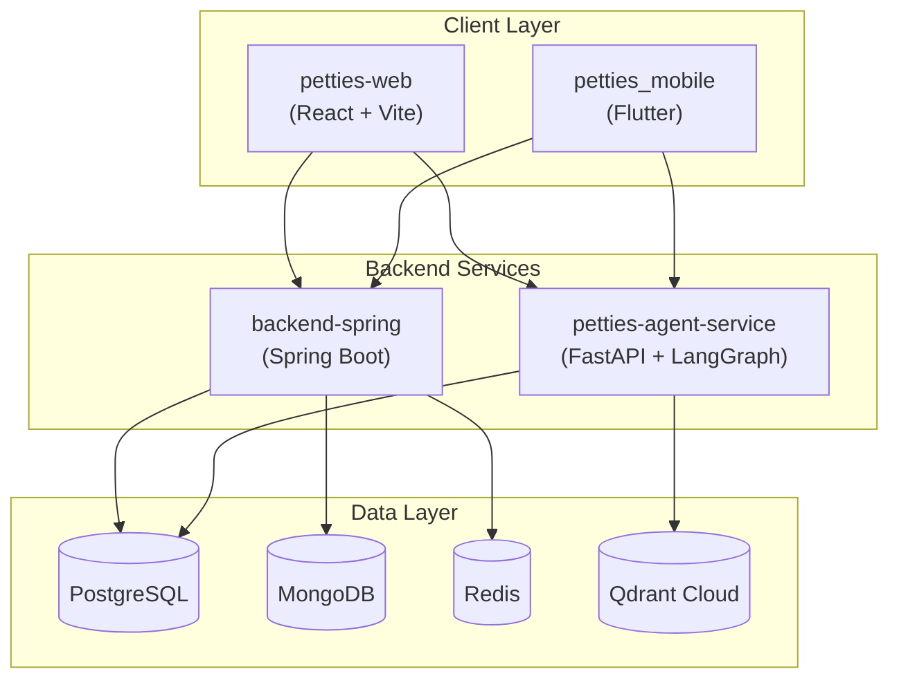
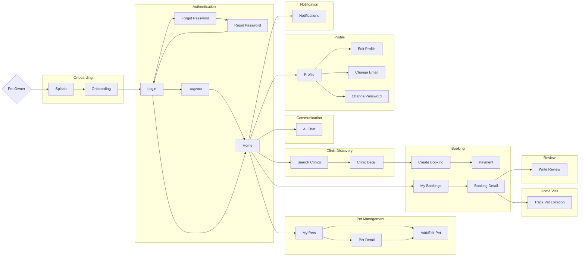
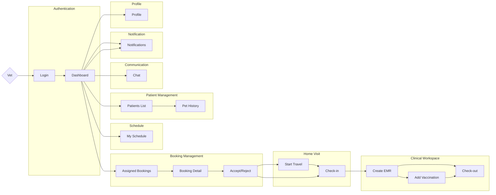
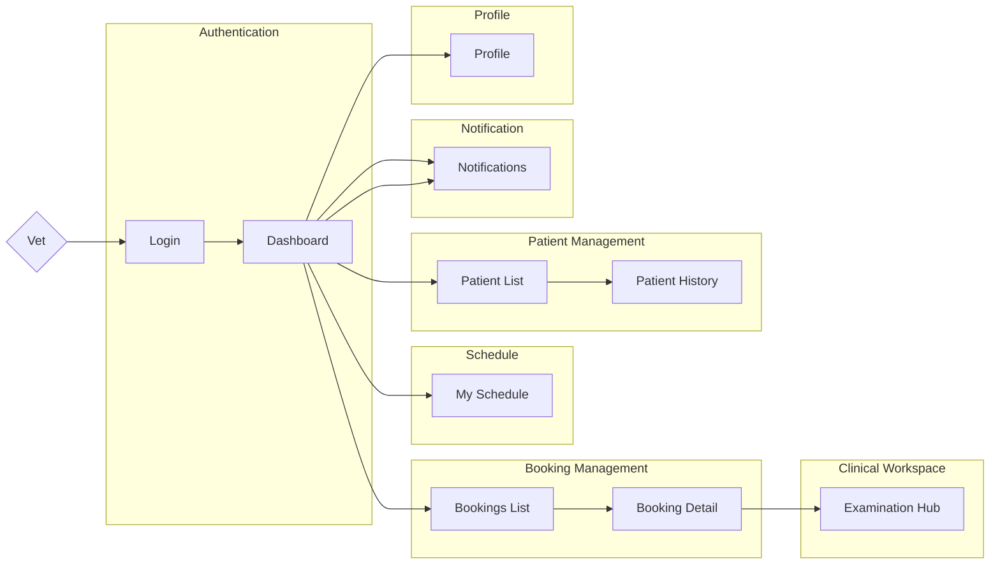
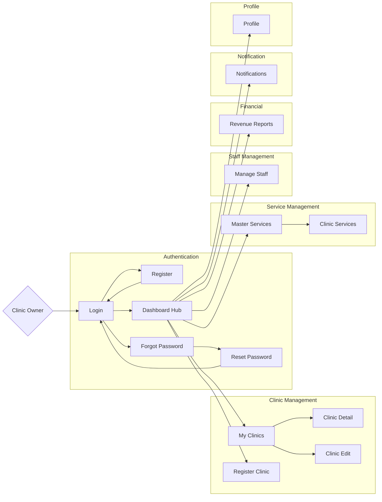
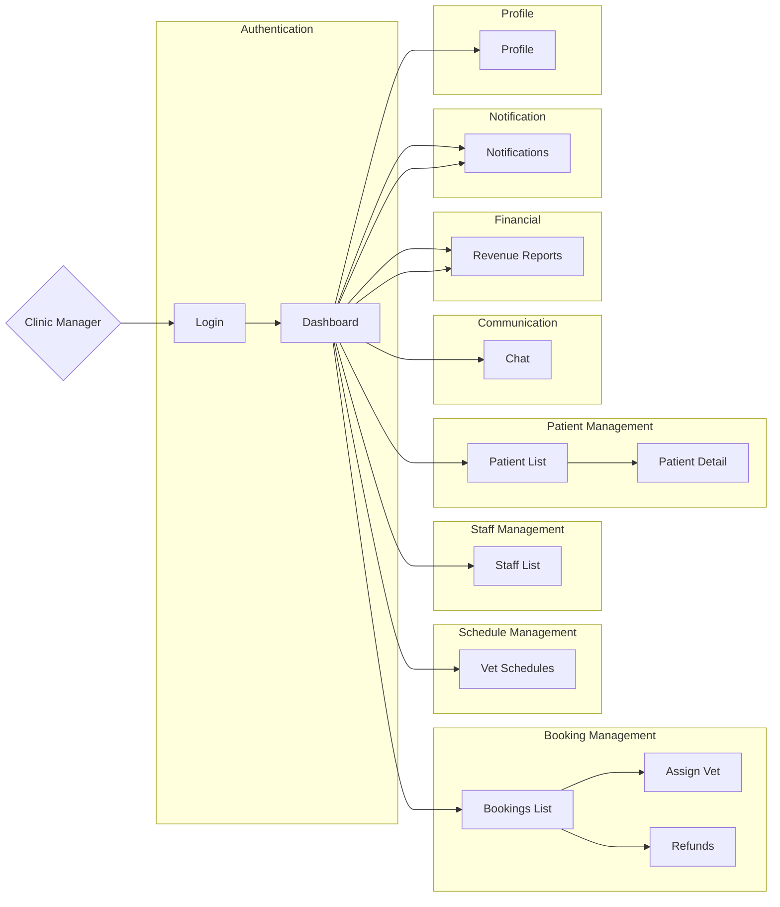
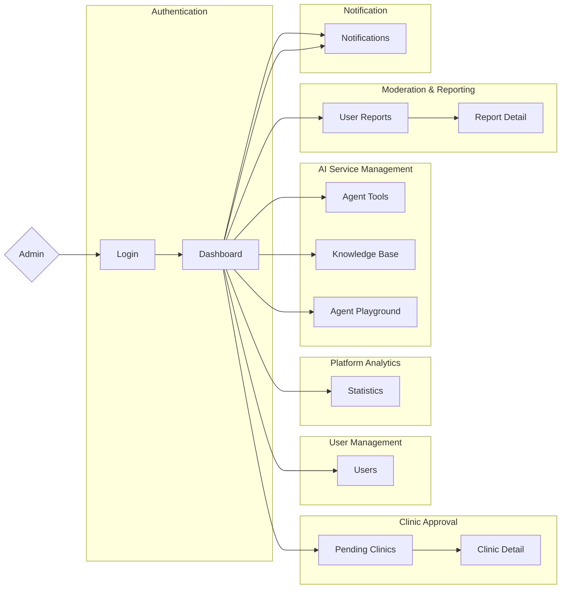
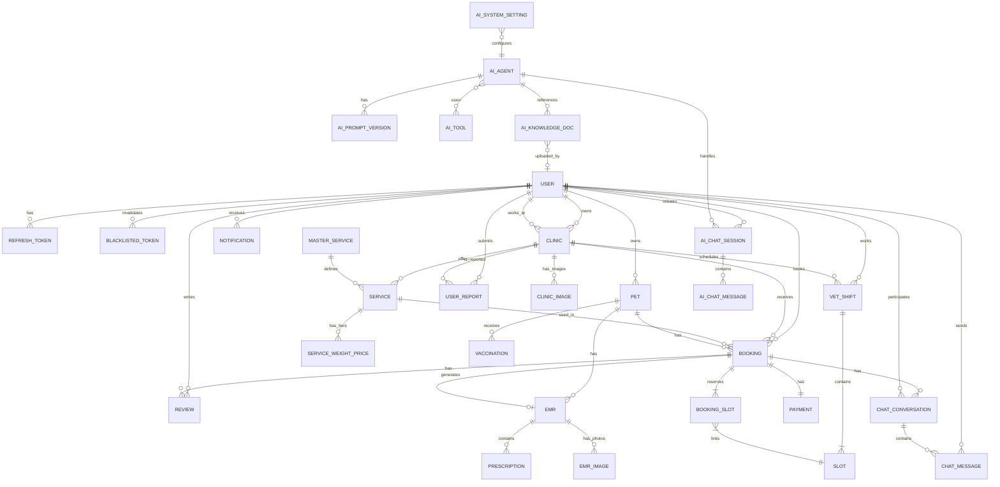

# PETTIES - Software Requirements Specification (SRS)

**Project:** Petties - Veterinary Appointment Booking Platform
**Version:** 1.3.1 (Role-based Screen Flows với Mermaid Diagrams)
**Last Updated:** 2025-12-31
**Document Status:** In Progress

---

## Table of Contents

1. [Product Overview](#1-product-overview)
2. [User Requirements](#2-user-requirements)
3. [Functional Requirements (Screen Flow)](#3-functional-requirements)
    - [3.2 Authentication & Onboarding](#32-authentication--onboarding)
    - [3.3 User Profile & Account Setup](#33-user-profile--account-setup)
    - [3.4 Pet Records & Health Hub](#34-pet-records--health-hub)
    - [3.5 Clinic Discovery Flow](#35-clinic-discovery-flow)
    - [3.6 Clinical Operations & Service Setup](#36-clinical-operations--service-setup)
    - [3.7 Staffing & Scheduling Flow](#37-staffing--scheduling-flow)
    - [3.8 Booking & Appointment Lifecycle Flow](#38-booking--appointment-lifecycle-flow)
    - [3.9 Electronic Medical Records (EMR) Flow](#39-electronic-medical-records-emr-flow)
    - [3.10 Specialized Services (Home Visit) Flow](#310-specialized-services-home-visit-flow)
    - [3.11 AI Assistance Flow](#311-ai-assistance-flow)
    - [3.12 Governance & Reporting Flow](#312-governance--reporting-flow)
4. [Non-Functional Requirements](#5-non-functional-requirements)
5. [Requirement Appendix](#6-requirement-appendix)

---

## 1. PRODUCT OVERVIEW

### 1.1 Product Purpose

**Petties** là nền tảng kết nối chủ thú cưng (Pet Owner) với các phòng khám thú y (Veterinary Clinics). Hệ thống cho phép:

- 🐾 Chủ pet đặt lịch khám tại phòng khám hoặc tại nhà
- 🏥 Phòng khám quản lý dịch vụ, bác sĩ, lịch làm việc
- 👨‍⚕️ Bác sĩ quản lý ca làm, khám bệnh, ghi hồ sơ y tế
- 🤖 AI Chatbot hỗ trợ tư vấn chăm sóc thú cưng
- 📊 Admin quản lý toàn bộ nền tảng

### 1.2 Product Scope

| Aspect | Description |
|--------|-------------|
| **Platform** | Web (Admin, Clinic), Mobile (Pet Owner, Vet) |
| **Target Users** | Pet Owners, Veterinary Clinics, Vets, Admins |
| **Geography** | Vietnam (initial), Southeast Asia (future) |
| **Timeline** | 13 Sprints (10/12/2025 - 11/03/2026) |

### 1.3 Intended Audience

| Audience | Description |
|----------|-------------|
| Developers | Xây dựng và bảo trì hệ thống |
| QA/Testers | Kiểm tra chức năng và chất lượng |
| Product Owners | Theo dõi và ưu tiên requirements |
| Stakeholders | Đánh giá tính khả thi và business value |

### 1.4 Product Overview Diagram (Context Diagram)

```mermaid
flowchart TB
    PO["🐾 Pet Owner<br/>(Mobile)"]
    VET["👨‍⚕️ Vet<br/>(Mobile + Web)"]
    CM["👨‍💼 Clinic Manager<br/>(Web)"]
    CO["🏥 Clinic Owner<br/>(Web)"]
    ADMIN["🔧 Admin<br/>(Web)"]
    
    SYSTEM(("🐾 Petties<br/>System"))
    
    %% Pet Owner flows
    PO -->|"Register, Login, Profile Update"| SYSTEM
    PO -->|"Pet Profile (View EMR + Vaccination)"| SYSTEM
    PO -->|"Search Clinic, Create Booking"| SYSTEM
    PO -->|"Payment (Stripe)"| SYSTEM
    PO -->|"Review, AI Chat, Report Violation"| SYSTEM
    SYSTEM -->|"Booking Confirmation, Notifications"| PO
    SYSTEM -->|"Pet Profile (EMR + Vaccination Records)"| PO
    
    %% Vet flows
    VET -->|"Login, View Schedule"| SYSTEM
    VET -->|"Accept/Reject Booking"| SYSTEM
    VET -->|"Check-in, Create/Edit EMR"| SYSTEM
    VET -->|"Add/Edit Vaccination, Check-out"| SYSTEM
    SYSTEM -->|"Assigned Bookings, Schedules"| VET
    SYSTEM -->|"Pet Profile (EMR + Vaccination, READ-ONLY cross-clinic)"| VET
    
    %% Clinic Manager flows
    CM -->|"Add/Remove Vet"| SYSTEM
    CM -->|"Create Vet Schedule, Import Excel"| SYSTEM
    CM -->|"Assign Vet to Booking"| SYSTEM
    SYSTEM -->|"Vet List, Booking List/Pending Bookings"| CM
    SYSTEM -->|"Schedule Overview"| CM
    
    %% Clinic Owner flows
    CO -->|"Register Clinic"| SYSTEM
    CO -->|"Manage Master Services (Templates + Weight Tiers)"| SYSTEM
    CO -->|"Configure Clinic Services (Inherit or Custom)"| SYSTEM
    CO -->|"Add Clinic Manager"| SYSTEM
    SYSTEM -->|"Clinic Status, Revenue Report"| CO
    SYSTEM -->|"Dashboard Analytics"| CO
    
    %% Admin flows
    ADMIN -->|"Login, Approve/Reject Clinic"| SYSTEM
    ADMIN -->|"Configure AI Agents"| SYSTEM
    ADMIN -->|"Manage Knowledge Base, Process Reports"| SYSTEM
    SYSTEM -->|"Pending Clinics, Platform Stats"| ADMIN
    SYSTEM -->|"User Reports, Agent Status"| ADMIN
```

### 1.5 System Architecture Overview

---

## 2. USER REQUIREMENTS

### 2.1 User Roles

| Role | Platform | Description |
|------|----------|-------------|
| **PET_OWNER** | Mobile only | Chủ thú cưng, đặt lịch khám, xem hồ sơ y tế |
| **VET** | Mobile + Web | Bác sĩ thú y, khám bệnh, ghi EMR |
| **CLINIC_MANAGER** | Web only | Quản lý phòng khám, gán booking cho bác sĩ |
| **CLINIC_OWNER** | Web only | Chủ phòng khám, quản lý dịch vụ, doanh thu |
| **ADMIN** | Web only | Admin nền tảng, duyệt phòng khám, quản lý AI |

### 2.2 Use Cases

#### 2.2.1 Pet Owner Use Cases

| UC-ID | Use Case | Priority | Sprint |
|-------|----------|----------|--------|
| UC-PO-01 | Đăng ký và Đăng nhập | High | 1 |
| UC-PO-02 | Đăng nhập bằng Google | High | 1 |
| UC-PO-03 | Quản lý hồ sơ cá nhân | Medium | 2 |
| UC-PO-04 | Tạo/Sửa/Xóa hồ sơ thú cưng | High | 2 |
| UC-PO-05 | Tìm kiếm phòng khám | High | 4 |
| UC-PO-06 | Đặt lịch khám tại phòng (Clinic Visit) | High | 4-6 |
| UC-PO-07 | Đặt lịch khám tại nhà (Home Visit) | High | 4-6 |
| UC-PO-08 | Xem danh sách booking | High | 4 |
| UC-PO-09 | Hủy booking | Medium | 5 |
| UC-PO-10 | Thanh toán online (Stripe) | High | 8 |
| UC-PO-11 | Xem hồ sơ y tế thú cưng (EMR) | Medium | 7 |
| UC-PO-12 | Xem sổ tiêm chủng | Medium | 7 |
| UC-PO-13 | Đánh giá bác sĩ/phòng khám | Low | 9 |
| UC-PO-14 | Chat với AI Chatbot | Medium | 10 |
| UC-PO-15 | **[Out of Scope] Gửi yêu cầu cứu hộ khẩn cấp (SOS)** | Low | 11 |
| UC-PO-16 | Báo cáo vi phạm Clinic/Vet | Low | 9 |
| UC-PO-17 | **[Home Visit] Theo dõi vị trí bác sĩ trên bản đồ** | High | 6 |
| UC-PO-18 | **[Home Visit] Xem lộ trình di chuyển của bác sĩ** | High | 6 |
| UC-PO-19 | **[Home Visit] Nhận thông báo khi bác sĩ sắp đến/đến nơi** | High | 6 |

#### 2.2.2 Vet Use Cases

| UC-ID | Use Case | Priority | Sprint |
|-------|----------|----------|--------|
| UC-VT-01 | Đăng nhập (Account được cấp) | High | 3 |
| UC-VT-02 | Xem lịch làm việc | High | 3 |
| UC-VT-03 | Xem booking được gán | High | 4 |
| UC-VT-04 | Phê duyệt/Từ chối booking | High | 5 |
| UC-VT-05 | Check-in bệnh nhân | High | 6 |
| UC-VT-06 | Ghi hồ sơ bệnh án (EMR) | High | 7 |
| UC-VT-07 | Ghi đơn thuốc | Medium | 7 |
| UC-VT-08 | Cập nhật sổ tiêm chủng | Medium | 7 |
| UC-VT-09 | Checkout bệnh nhân | High | 6 |
| UC-VT-10 | **[Home Visit] Bắt đầu di chuyển (Start Travel)** | High | 6 |
| UC-VT-11 | **[Home Visit] Thông báo đến nơi** | High | 6 |
| UC-VT-12 | **Tra cứu bệnh nhân đã khám** | Medium | 9 |
| UC-VT-13 | **Xem Lịch sử Bệnh nhân (Mobile View)** | High | 6 |

#### 2.2.3 Clinic Manager Use Cases

| UC-ID | Use Case | Priority | Sprint |
|-------|----------|----------|--------|
| UC-CM-01 | Đăng nhập | High | 1 |
| UC-CM-02 | Xem danh sách bác sĩ | High | 3 |
| UC-CM-03 | Thêm nhanh bác sĩ (Quick Add) | High | 3 |
| UC-CM-03b| Gán bác sĩ từ tài khoản có sẵn | Medium | 3 |
| UC-CM-04 | **[Out of Scope] Tải lịch trực từ file Excel** | Medium | 3 |
| UC-CM-05 | Tạo lịch bác sĩ thủ công | High | 3 |
| UC-CM-06 | Xem booking mới | High | 4 |
| UC-CM-07 | Gán bác sĩ cho booking | High | 5 |
| UC-CM-08 | Quản lý hủy & hoàn tiền | Medium | 8 |
| UC-CM-09 | **Xem danh sách bệnh nhân** | Medium | 9 |
| UC-CM-10 | **Xem hồ sơ bệnh nhân (EMR/Vaccination)** | Medium | 9 |

#### 2.2.4 Clinic Owner Use Cases

| UC-ID | Use Case | Priority | Sprint |
|-------|----------|----------|--------|
| UC-CO-01 | Đăng ký phòng khám | High | 2 |
| UC-CO-02 | Quản lý thông tin phòng khám | High | 2 |
| UC-CO-03 | Cấu hình Dịch vụ tại phòng khám (Hybrid) | High | 2 |
| UC-CO-04 | Cấu hình giá & Khung cân nặng | High | 2 |
| UC-CO-08 | Quản lý Danh mục Dịch vụ (Master Services) | High | 2 |
| UC-CO-09 | Cài đặt Khung giá Cân nặng (Weight Tiers) | High | 2 |
| UC-CO-05 | Theo dõi biểu đồ doanh thu | Medium | 9 |
| UC-CO-06 | Thêm nhanh quản lý (Quick Add) | Medium | 3 |
| UC-CO-07 | Quản lý nhân sự (Manager & Vet) | Medium | 3 |

#### 2.2.5 Admin Use Cases

| UC-ID | Use Case | Priority | Sprint |
|-------|----------|----------|--------|
| UC-AD-01 | Đăng nhập | High | 1 |
| UC-AD-02 | Xem danh sách phòng khám pending | High | 2 |
| UC-AD-03 | Xét duyệt/Từ chối phòng khám | High | 2 |
| UC-AD-04 | Theo dõi số liệu thống kê nền tảng | Medium | 9 |
| UC-AD-05 | Quản lý công cụ của Agent (Agent Tools) | Low | 10 |
| UC-AD-06 | Quản lý Knowledge Base (LlamaIndex RAG) | Low | 10 |
| UC-AD-07 | Thử nghiệm & Cấu hình Agent (Playground) | Low | 11 |
| UC-AD-08 | Theo dõi danh sách báo cáo vi phạm | Medium | 9 |
| UC-AD-09 | Xử lý User Report (Warn/Suspend/Ban/Reject) | Medium | 9 |

#### 2.2.6 Use Case Summary Table

> **Summary:** Complete list of all Use Cases with UC-ID, Use Case Name, Actor, and Description.

##### 📱 Pet Owner (19 Use Cases)

| UC-ID | Use Case Name | Actor | Description |
|-------|---------------|-------|-------------|
| UC-PO-01 | Register and Login | Pet Owner | Register new account with Email + OTP verification, or login with existing credentials |
| UC-PO-02 | Google Sign-In | Pet Owner | Login or register using Google OAuth 2.0 |
| UC-PO-03 | Manage Profile | Pet Owner | View/edit personal info, upload avatar, change password |
| UC-PO-04 | Manage Pet Profile | Pet Owner | Create, update, or delete pet profiles with photos and medical info |
| UC-PO-05 | Search Clinics | Pet Owner | Search clinics by name, GPS location, ratings, and service filters |
| UC-PO-05b | View Clinic Details | Pet Owner | View clinic info, services, pricing, reviews, and image gallery |
| UC-PO-06 | Book Clinic Visit | Pet Owner | Create booking for in-clinic appointment with slot selection |
| UC-PO-07 | Book Home Visit | Pet Owner | Create booking for home visit with address and additional fee |
| UC-PO-08 | View My Bookings | Pet Owner | View booking list with tabs: Upcoming, Past, Cancelled |
| UC-PO-09 | Cancel Booking | Pet Owner | Cancel booking (allowed before 4 hours of appointment time) |
| UC-PO-10 | Make Payment | Pet Owner | Pay via Stripe online or Cash on visit |
| UC-PO-11 | View Pet EMR | Pet Owner | View Electronic Medical Records of pets |
| UC-PO-12 | View Vaccination History | Pet Owner | View pet's vaccination records with next due dates |
| UC-PO-13 | Write Review | Pet Owner | Rate and review clinic/vet after completed booking |
| UC-PO-14 | Chat with AI Assistant | Pet Owner | Interact with AI chatbot for pet care advice |
| UC-PO-15 | **Send Emergency SOS Request** | Pet Owner | Request emergency assistance (**[Out of Scope]**) |
| UC-PO-16 | Report Violation | Pet Owner | Report clinic or vet for inappropriate behavior |
| UC-PO-17 | Track Vet Location | Pet Owner | View realtime vet location and travel route on map during Home Visit |
| UC-PO-19 | Receive Travel Updates | Pet Owner | Get notifications when vet is approaching/arrived |

##### 👨‍⚕️ Vet (13 Use Cases)

| UC-ID | Use Case Name | Actor | Description |
|-------|---------------|-------|-------------|
| UC-VT-01 | Login as Staff | Vet | Login with phone number + default password (last 6 digits) |
| UC-VT-02 | View My Schedule | Vet | View work schedule in calendar view (month/week/day) with associated bookings |
| UC-VT-03 | View Assigned Bookings | Vet | View list of bookings assigned by Manager (tabs: Today, Upcoming, Done) |
| UC-VT-04 | Accept/Reject Booking | Vet | Confirm or decline assigned booking with reason |
| UC-VT-05 | Check-in Patient | Vet | Mark start of examination (Clinic Visit or after arrival for Home Visit) |
| UC-VT-06 | Create EMR (SOAP) | Vet | Create comprehensive Electronic Medical Record using SOAP format with prescription |
| UC-VT-07 | Write Prescription | Vet | Add prescription with drug name, dosage, frequency, duration |
| UC-VT-08 | Add Vaccination Record | Vet | Add new vaccination record to pet's vaccination book with batch number, manufacturer and auto-calculated next due date |
| UC-VT-09 | Check-out Patient | Vet | Complete examination, collect payment if Cash |
| UC-VT-10 | Start Travel | Vet | Begin travel to pet owner's address with GPS tracking enabled (Home Visit) |
| UC-VT-11 | Mark Arrived | Vet | Confirm arrival at pet owner's location (Home Visit) |
| UC-VT-12 | Search Patients | Vet | Search previously examined pets at the clinic |
| UC-VT-13 | View Patient History | Vet | View pet's EMR and vaccination history on mobile |

##### 👩‍💼 Clinic Manager (12 Use Cases)

| UC-ID | Use Case Name | Actor | Description |
|-------|---------------|-------|-------------|
| UC-CM-01 | Login as Manager | Clinic Manager | Login with phone number + assigned password |
| UC-CM-02 | View Vet List | Clinic Manager | View list of vets working at the clinic |
| UC-CM-03 | Quick Add Vet | Clinic Manager | Add new vet with phone number and name (auto-creates account) |
| UC-CM-03b | Assign Existing Vet | Clinic Manager | Assign existing vet account to the clinic |
| UC-CM-04 | **Import Schedule Excel** | Clinic Manager | Import vet schedules from Excel file (**[Out of Scope]**) |
| UC-CM-05 | Create Vet Shift | Clinic Manager | Manually create vet shift (auto-generates 30-min slots) |
| UC-CM-06 | View New Bookings | Clinic Manager | View pending bookings that need vet assignment |
| UC-CM-07 | Assign Vet to Booking | Clinic Manager | Assign available vet to a booking |
| UC-CM-08 | Manage Cancellation | Clinic Manager | Handle booking cancellation and refund |
| UC-CM-09 | View Patient List | Clinic Manager | View clinic's patient list with DUE/OVERDUE status |
| UC-CM-10 | View Patient Records | Clinic Manager | View patient's EMR and vaccination history |
| UC-CM-11 | Manage Schedules | Clinic Manager | Create, edit, delete vet schedules in calendar view |
| UC-CM-12 | Receive Booking Alerts | Clinic Manager | Get realtime notifications for new bookings at the clinic |

##### 🏥 Clinic Owner (9 Use Cases)

| UC-ID | Use Case Name | Actor | Description |
|-------|---------------|-------|-------------|
| UC-CO-01 | Register Clinic | Clinic Owner | Register new clinic → status PENDING → await Admin approval |
| UC-CO-02 | Manage Clinic Info | Clinic Owner | Update clinic details, gallery, operating hours |
| UC-CO-03 | Manage Clinic Services | Clinic Owner | Add services from master template or create custom services |
| UC-CO-04 | Configure Pricing | Clinic Owner | Set weight-based tiered pricing for services |
| UC-CO-05 | View Revenue Dashboard | Clinic Owner | View revenue charts with date range filters |
| UC-CO-06 | Quick Add Staff | Clinic Owner | Add manager or vet with phone number (auto-creates account) |
| UC-CO-07 | Manage Staff | Clinic Owner | View, assign, remove staff from clinic |
| UC-CO-08 | Manage Master Services | Clinic Owner | Create and manage service templates |

##### 🔧 Admin (9 Use Cases)

| UC-ID | Use Case Name | Actor | Description |
|-------|---------------|-------|-------------|
| UC-AD-01 | Login as Admin | Admin | Login to Admin Portal |
| UC-AD-02 | View Pending Clinics | Admin | View list of clinics awaiting approval |
| UC-AD-03 | Approve/Reject Clinic | Admin | Approve or reject clinic registration with reason |
| UC-AD-04 | View Platform Statistics | Admin | View system-wide stats: users, clinics, bookings |
| UC-AD-05 | Manage Agent Tools | Admin | Manage MCP Tools, API tools, and custom functions assigned to the AI Agent |
| UC-AD-06 | Manage Knowledge Base | Admin | Upload documents (PDF, DOCX, TXT), LlamaIndex RAG processing with Cohere embeddings, Qdrant Cloud vector storage |
| UC-AD-07 | Configure and Test Agent | Admin | Test chat, configure hyperparameters (model, temperature, etc.) and System Prompt |
| UC-AD-08 | View User Reports | Admin | View violation reports from users |
| UC-AD-09 | Handle User Reports | Admin | Take action: None, Warn, Suspend, or Ban |

##### 📊 Summary

| Actor | Use Cases | Platform | Implementation Status |
|-------|:---------:|----------|----------------------|
| Pet Owner | 19 | Mobile | ~40% Implemented |
| Vet | 13 | Mobile | ~30% Implemented |
| Clinic Manager | 13 | Web | ~25% Implemented |
| Clinic Owner | 8 | Web | ~70% Implemented |
| Admin | 9 | Web | ~30% Implemented |
| **TOTAL** | **62** | - | **~40% Overall** |

---

## 3. FUNCTIONAL REQUIREMENTS

### 3.1 System Functional Overview

#### 3.1.1 Screens Flow

---

##### 3.1.1.1 Mobile App - Pet Owner Flow (24 screens)

---

##### 3.1.1.2 Mobile App - Vet Flow (16 screens)
##### 3.1.1.2 Mobile App - Vet Flow (16 screens)

---

##### 3.1.1.3 Web App - Vet Flow (9 screens)

---

##### 3.1.1.4 Web App - Clinic Owner Flow (14 screens)

---

##### 3.1.1.5 Web App - Clinic Manager Flow (13 screens)
##### 3.1.1.5 Web App - Clinic Manager Flow (13 screens)

---

##### 3.1.1.6 Web App - Admin Flow (12 screens)
##### 3.1.1.6 Web App - Admin Flow (12 screens)

#### 3.1.2 Screen Descriptions

> **Organized by Module/Feature** - Detailed descriptions of 79 screens grouped by functionality.
>
> **Format:** Table per Module showing ID, Screen Name, Platform/Role, and Description.

---

##### 3.1.2.1 Onboarding & Authentication Modules (#1-11)

| # | Module | Screen Name | Platform/Role | Description |
|:---:|:---|:---|:---|:---|
| 1 | Onboarding | Splash | Mobile/Pet Owner | Logo animation and auto-redirect to onboarding or home |
| 2 | Onboarding | Onboarding | Mobile/Pet Owner | 3 slides (Booking, AI, Health records). Skip and Continue/Start buttons |
| 3 | Auth | Login | Mobile/PO, Vet | Username + Password, Forgot Password link. Google Sign-in (TBI) |
| 4 | Auth | Register | Mobile/PO | 2-step flow: Form (User, Email, Password, Full Name, Phone) → OTP verification |
| 5 | Auth | Forgot Password | Mobile/PO | Enter email → Send OTP → Navigate to Reset Password |
| 6 | Auth | Reset Password | Mobile/PO | Enter OTP 6 digits + New Password to reset password |
| 7 | Auth | Login | Web/Staff, Admin | Shared login portal. Auto-redirect based on role. Blocks PET_OWNER |
| 8 | Auth | Register | Web/Clinic Owner | 2-step OTP registration for Clinic Owner accounts |
| 9 | Auth | Forgot Password | Web | Enter email to receive OTP for password reset |
| 10 | Auth | Reset Password | Web | Enter OTP + New Password to reset password |
| 11 | Auth | Onboarding | Web/Landing | Landing page with feature showcase for visitors |

##### 3.1.2.2 Home & Dashboard Module (#12-18)

| # | Screen Name | Platform/Role | Description |
|:---:|:---|:---|:---|
| 12 | Home | Mobile/PO | Welcome card, Pet stats, Quick actions, Preview pets, Bottom nav |
| 13 | Dashboard | Mobile/Vet | Welcome card, Today stats, Today schedule, Pending bookings |
| 14 | Dashboard | Web/Vet | Shift overview, pending examinations (Placeholder) |
| 15 | Dashboard Hub | Web/Clinic Owner | Today stats (Revenue, Bookings), Clinic info, Monthly revenue |
| 16 | Dashboard | Web/Manager | Today overview, Pending actions (Unassigned, Refunds), Recent table |
| 17 | Dashboard | Web/Admin | Service Health check (AI, Spring), Platform stats, Quick links |

##### 3.1.2.3 Pet Management & Clinic Discovery (#18-22)

| # | Module | Screen Name | Platform/Role | Description |
|:---:|:---|:---|:---|:---|
| 18 | Pet Mgt | My Pets | Mobile/PO | ListView with pet cards, Add (+) button, Empty state |
| 19 | Pet Mgt | Pet Detail | Mobile/PO | Header image, Info card. Actions: Edit, Delete |
| 20 | Pet Mgt | Add/Edit Pet | Mobile/PO | Form to add/edit pet info (image, name, species, breed, dob, weight) |
| 21 | Discovery | Search Clinics | Mobile/PO | Map view, GPS-based search, filters, ratings |
| 22 | Discovery | Clinic Detail | Mobile/PO | Gallery, info, services, reviews, Book button |

##### 3.1.2.4 Clinic & Service Management (#23-30)

| # | Module | Screen Name | Platform/Role | Description |
|:---:|:---|:---|:---|:---|
| 23 | Clinic Mgt | Register Clinic | Web/Owner | 2-step: ClinicForm → Image Upload after creation |
| 24 | Clinic Mgt | My Clinics | Web/Owner | Header with Create, Filters (status, name), ClinicList |
| 25 | Clinic Mgt | Clinic Detail | Web/Owner | Clinic details (info, images, legal documents) |
| 26 | Clinic Mgt | Clinic Edit | Web/Owner | Form to edit clinic info, gallery management |
| 27 | Clinic Mgt | Pending Clinics | Web/Admin | Table of pending clinics, Actions: View/Approve/Reject |
| 28 | Clinic Mgt | Clinic Detail | Web/Admin | Background check, legal verification for approval |
| 29 | Service Mgt | Master Services | Web/Owner | Manage service templates for all branches under this owner |
| 30 | Service Mgt | Clinic Services | Web/Owner | Configure specific pricing and status per clinic branch |

##### 3.1.2.5 Staff, Booking & Clinical Workspace (#31-49)

| # | Module | Screen Name | Platform/Role | Description |
|:---:|:---|:---|:---|:---|
| 31 | Staff Mgt | Manage Staff | Web/Owner | Clinic dropdown, StaffTable, QuickAddStaffModal (VET/MANAGER) |
| 32 | Staff Mgt | Staff List | Web/Manager | Manage branch vets directory, quick add tools |
| 33 | Booking | Create Booking | Mobile/PO | Select pet, service, date, time slot, notes |
| 34 | Booking | Payment | Mobile/PO | Stripe/Cash checkout with cost breakdown |
| 35 | Booking | My Bookings | Mobile/PO | Appointment list: Upcoming, Completed, Cancelled |
| 36 | Booking | Booking Detail | Mobile/PO | Real-time status timeline, actions, contact |
| 37 | Booking | Assigned Bookings | Mobile/Vet | List of assigned bookings (Today, Upcoming, Done) |
| 38 | Booking | Booking Detail | Mobile/Vet | Appointment details, pet info, owner contact |
| 39 | Booking | Accept/Reject | Mobile/Vet | Confirmation dialog for accepting/rejecting booking |
| 40 | Booking | Bookings List | Web/Vet | Bookings with advanced table filtering |
| 41 | Booking | Booking Detail | Web/Vet | Appointment details, triage actions |
| 42 | Booking | Bookings List | Web/Manager | Oversight of branch appointments |
| 43 | Booking | Assign Vet | Web/Manager | Assigning available doctors to requests |
| 44 | Booking | Refunds | Web/Manager | Cancellation management, refund processing |
| 45 | Clinical | Check-in | Mobile/Vet | Start examination confirmation and timestamp |
| 46 | Clinical | Create EMR | Mobile/Vet | Clinical notes (SOAP format), prescription entry |
| 47 | Clinical | Check-out | Mobile/Vet | Finish exam, payment summary (for Cash payments) |
| 48 | Clinical | Add Vaccination | Mobile/Vet | Record new immunization entries |
| 49 | Clinical | Exam Hub | Web/Vet | Central workspace: Check-in, SOAP notes, Prescriptions |

##### 3.1.2.6 Patient & Schedule Management (#50-58)

| # | Module | Screen Name | Platform/Role | Description |
|:---:|:---|:---|:---|:---|
| 50 | Patient Mgt | Pet History | Mobile/Vet | Comprehensive view of medical history, vaccines |
| 51 | Patient Mgt | Patients List | Mobile/Vet | Directory of patients treated at clinic |
| 52 | Patient Mgt | Patient List | Web/Vet | Directory of patients treated at clinic |
| 53 | Patient Mgt | Patient History | Web/Vet | Detailed medical records, vaccine view |
| 54 | Patient Mgt | Patient List | Web/Manager | Patient directory with immunization alerts |
| 55 | Patient Mgt | Patient Detail | Web/Manager | Detailed clinical records view (read-only) |
| 56 | Schedule | My Schedule | Mobile/Vet | Personal calendar (Month/Week/Day views) |
| 57 | Schedule | My Schedule | Web/Vet | Desktop-optimized personal calendar |
| 58 | Schedule | Vet Schedules | Web/Manager | Roster management, shift allocation |

##### 3.1.2.7 Other Core Modules (#59-79)

| # | Module | Screen Name | Platform/Role | Description |
|:---:|:---|:---|:---|:---|
| 59 | Home Visit | Track Vet | Mobile/PO | Real-time GPS map showing vet travel |
| 60 | Home Visit | Start Travel | Mobile/Vet | GPS toggle, view route, mark arrived |
| 61 | Communication | AI Chat | Mobile/PO | Chat with AI assistant, tool calls, citations |
| 62 | Communication | Chat | Mobile/Vet | Messaging with Manager or Pet Owners |
| 63 | Communication | Chat | Web/Manager | Operational messaging with vets, owners |
| 64 | Notification | Notifications | Mobile/PO, Vet, Manager, Clinic Owner, Admin | In-app notification center for users and staff |
| 65 | Notification | Notifications | Web/Vet, Manager, Clinic Owner, Admin | Centralized operational and system alerts |
| 64 | Notification | Notifications | Mobile/PO, Vet, Manager, Clinic Owner, Admin | In-app notification center for users and staff |
| 65 | Notification | Notifications | Web/Vet, Manager, Clinic Owner, Admin | Centralized operational and system alerts |
| 66 | Profile | Profile | Mobile/PO, Vet | Avatar, Info, Actions (Edit, Email, Pass, Logout) |
| 67 | Profile | Edit Profile | Mobile/PO, Vet | Form to edit personal info (name, phone, avatar) |
| 68 | Profile | Change Email | Mobile/PO, Vet | Form to change email with OTP verification |
| 69 | Profile | Change Pass | Mobile/PO, Vet | Form to change password (current + new) |
| 70 | Profile | Profile | Web/Staff, Admin | Shared profile page. Account info and security |
| 71 | Review | Write Review | Mobile/PO | 1-5 star rating and comment after booking COMPLETED |
| 72 | Financial | Revenue Reports | Web/Owner, Manager | Financial statements, growth charts (Branch specific for Manager) |
| 72 | Financial | Revenue Reports | Web/Owner, Manager | Financial statements, growth charts (Branch specific for Manager) |
| 73 | User Mgt | Users | Web/Admin | Centralized management of all user accounts |
| 74 | Analytics | Statistics | Web/Admin | Specialized reports, data export tools |
| 75 | AI Mgt | Agent Tools | Web/Admin | Manage MCP tools for AI Agent |
| 76 | AI Mgt | Knowledge Base| Web/Admin | RAG config, Upload docs, Query Tester |
| 77 | AI Mgt | Agent PG | Web/Admin | Prompt config, params tuning, chat testing |
| 78 | Moderation | User Reports | Web/Admin | Queue of violation reports from users |
| 79 | Moderation | Report Detail | Web/Admin | Panel for moderation actions (Warn/Ban) |

#### 3.1.3 Screen Authorization

*Provide the system roles authorization to the system features (down to screens, and event to the screen activities if applicable) in the table form below.*

| Screen | GUEST | PET_OWNER | VET | CLINIC_OWNER | CLINIC_MANAGER | ADMIN |
|--------|:-----:|:---------:|:---:|:------------:|:--------------:|:-----:|
| **Authentication Module** | | | | | | |
| Landing Page (Web) | X | X | X | X | X | X |
|   → View features | X | X | X | X | X | X |
|   → Navigate to Login/Register | X | X | X | X | X | X |
| Login Screen (Mobile - PO) | X | | | | | |
|   → Enter email/password | X | | | | | |
|   → Google Sign-in | X | | | | | |
|   → Forgot Password link | X | | | | | |
| Login Screen (Mobile - Vet) | X | | | | | |
|   → Enter phone/password | X | | | | | |
| Login Screen (Web) | X | | X | X | X | X |
|   → Enter credentials | X | | X | X | X | X |
|   → Forgot Password link | X | | X | X | X | X |
| Register Screen | X | | | X | | |
|   → Fill registration form | X | | | X | | |
|   → Verify OTP | X | | | X | | |
| Forgot Password | X | | | | | |
|   → Enter email | X | | | | | |
|   → Verify OTP | X | | | | | |
|   → Set new password | X | | | | | |
| **Pet Owner Screens** | | | | | | |
| Home (Pet Owner) | | X | | | | |
|   → View quick stats | | X | | | | |
|   → Navigate to features | | X | | | | |
| My Pets | | X | | | | |
|   → View pet list | | X | | | | |
|   → Add new pet | | X | | | | |
|   → Edit pet | | X | | | | |
|   → Delete pet | | X | | | | |
| Pet Detail | | X | | | | |
|   → View pet info | | X | | | | |
|   → Upload photo | | X | | | | |
|   → View EMR history | | X | | | | |
|   → View vaccination | | X | | | | |
| Search Clinics | | X | | | | |
|   → Search by keyword | | X | | | | |
|   → Filter by distance | | X | | | | |
|   → View on map | | X | | | | |
| Clinic Detail | | X | | | | |
|   → View clinic info | | X | | | | |
|   → View services | | X | | | | |
|   → View reviews | | X | | | | |
|   → Book appointment | | X | | | | |
| Create Booking | | X | | | | |
|   → Select service | | X | | | | |
|   → Select pet | | X | | | | |
|   → Select slot | | X | | | | |
|   → Confirm booking | | X | | | | |
| My Bookings | | X | | | | |
|   → View upcoming | | X | | | | |
|   → View past | | X | | | | |
|   → Cancel booking | | X | | | | |
| AI Chat | | X | | | | |
|   → Send message | | X | | | | |
|   → View response | | X | | | | |
| Write Review | | X | | | | |
|   → Rate (1-5 stars) | | X | | | | |
|   → Write comment | | X | | | | |
| **Vet Screens** | | | | | | |
| Dashboard (Vet) | | | X | | | |
|   → View today stats | | | X | | | |
|   → View pending tasks | | | X | | | |
| My Schedule | | | X | | X | |
|   → View calendar | | | X | | X | |
|   → View shift details | | | X | | | |
| Assigned Bookings | | | X | | | |
|   → View booking list | | | X | | | |
|   → Accept booking | | | X | | | |
|   → Reject booking | | | X | | | |
| Check-in | | | X | | | |
|   → Confirm arrival | | | X | | | |
|   → Start examination | | | X | | | |
| Create EMR | | | X | | | |
|   → Fill SOAP form | | | X | | | |
|   → Add prescription | | | X | | | |
|   → Upload photos | | | X | | | |
| Check-out | | | X | | | |
|   → Complete booking | | | X | | | |
|   → Collect cash payment | | | X | | | |
| Patient History | | | X | | X | |
|   → View EMR records | | | X | | X | |
|   → View vaccination | | | X | | X | |
| **Clinic Manager Screens** | | | | | | |
| Manager Dashboard | | | | | X | |
|   → View clinic stats | | | | | X | |
|   → View pending tasks | | | | | X | |
| Staff List | | | | X | X | |
|   → View all staff | | | | X | X | |
|   → Add new staff | | | | X | X | |
|   → Remove staff | | | | X | X | |
| Vet Shift Calendar | | | | | X | |
|   → View all shifts | | | | | X | |
|   → Create shift | | | | | X | |
|   → Delete shift | | | | | X | |
| All Bookings | | | | | X | |
|   → View all bookings | | | | | X | |
|   → Assign vet | | | | | X | |
|   → Process refund | | | | | X | |
| **Clinic Owner Screens** | | | | | | |
| Owner Dashboard | | | | X | | |
|   → View revenue stats | | | | X | | |
|   → View clinic status | | | | X | | |
| Register Clinic | | | | X | | |
|   → Fill clinic info | | | | X | | |
|   → Upload images | | | | X | | |
|   → Submit for approval | | | | X | | |
| Clinic Info Edit | | | | X | | |
|   → Edit clinic details | | | | X | | |
|   → Manage gallery | | | | X | | |
| Service Management | | | | X | | |
|   → Add service | | | | X | | |
|   → Edit pricing | | | | X | | |
|   → Configure weight tiers | | | | X | | |
| Manager Assignment | | | | X | | |
|   → Assign manager | | | | X | | |
|   → Remove manager | | | | X | | |
| **Admin Screens** | | | | | | |
| Admin Dashboard | | | | | | X |
|   → View platform stats | | | | | | X |
|   → View pending items | | | | | | X |
| Pending Clinics | | | | | | X |
|   → View clinic list | | | | | | X |
|   → Approve clinic | | | | | | X |
|   → Reject clinic | | | | | | X |
| Master Services | | | | | | X |
|   → Add master service | | | | | | X |
|   → Edit service template | | | | | | X |
| User Reports | | | | | | X |
|   → View report queue | | | | | | X |
|   → Process report | | | | | | X |
|   → Warn/Suspend/Ban user | | | | | | X |
| AI Agent Config | | | | | | X |
|   → Configure agent | | | | | | X |
|   → Manage tools | | | | | | X |
| Knowledge Base | | | | | | X |
|   → Upload documents | | | | | | X |
|   → Delete documents | | | | | | X |
| **Shared Screens** | | | | | | |
| Profile | | X | X | X | X | X |
|   → View info | | X | X | X | X | X |
|   → Edit info | | X | X | X | X | X |
|   → Change password | | X | X | X | X | X |
| Notifications | | X | X | X | X | X |
|   → View list | | X | X | X | X | X |
|   → Mark as read | | X | X | X | X | X |

#### 3.1.4 Non-Screen Functions

*Provide the descriptions for the non-screen system functions, i.e batch/cron job, service, API, etc.*

| # | Feature | System Function | Description |
|---|---------|-----------------|-------------|
| 1 | Slot Generation | AutoSlotGenerationService | Auto-generate 30-minute slots from VET_SHIFT when Manager creates a work shift |
| 2 | Booking Expiration | BookingExpirationJob | Update status PENDING → EXPIRED after 24h without confirmation |
| 3 | Push Notification | FCMNotificationService | Send push notifications to mobile devices (booking updates, reminders) |
| 4 | Email Notification | EmailNotificationService | Send confirmation emails and appointment reminders |
| 5 | OTP Generation | OtpGenerationService | Generate 6-digit OTP codes, store in Redis with 5-minute TTL |
| 6 | JWT Token Refresh | TokenRefreshMiddleware | Auto-refresh access token before expiration |
| 7 | Token Blacklist | TokenBlacklistService | Add token to blacklist on logout or revocation |
| 8 | Distance Calculation | GeoDistanceService | Calculate distance from clinic to Home Visit address (Haversine formula) |
| 9 | Dynamic Pricing | PricingCalculationService | Calculate price: Base + Weight Tier + Distance Fee |
| 10 | Rating Aggregation | RatingAggregationService | Update rating_avg of Clinic/Vet after each review |
| 11 | AI Chatbot | AIChatbotService | Process messages via Single Agent + ReAct pattern |
| 12 | RAG Retrieval | RAGRetrievalService | Search Knowledge Base with vector similarity |
| 13 | Document Indexing | DocumentIndexingBatch | Chunking and embedding documents on upload |
| 14 | Vaccination Reminder | VaccinationReminderJob | Send vaccination reminders before due date (daily 8:00 AM) |
| 15 | GPS Location Update | GPSLocationWebSocket | Real-time update of Vet location during Home Visit |
| 16 | Slot Availability Check | SlotReservationService | Check and reserve slot when creating booking |
| 17 | Payment Webhook | StripeWebhookHandler | Receive callback from Stripe after payment [Planned] |
| 18 | Image Upload | CloudinaryUploadService | Upload and optimize images (avatar, pet, clinic) |
| 19 | Token Cleanup | TokenCleanupJob | Daily cron to delete expired refresh tokens and blacklisted tokens |
| 20 | No-Show Detection | NoShowDetectionJob | Mark booking as NO_SHOW if not checked-in after 30 minutes |

#### 3.1.5 Entity Relationship Diagram

##### 📊 Relationship Matrix (Cardinality)

| From (Ent. A) | To (Ent. B) | Relationship | Cardinality | Business Logic |
|:---|:---|:---|:---:|:---|
| **USER** | **PET** | owns | 1 : N | Một người nuôi có thể sở hữu nhiều thú cưng. |
| **USER** | **CLINIC** | owns | 1 : N | Một Clinic Owner có thể sở hữu nhiều chi nhánh phòng khám. |
| **CLINIC** | **USER** | works_at | 1 : N | Một phòng khám có nhiều nhân viên (Vet, Manager). Mỗi nhân viên chỉ thuộc 1 phòng khám. |
| **USER** | **VET_SHIFT** | works | 1 : N | Một bác sĩ có nhiều ca trực. Mỗi ca trực thuộc sở hữu của 1 bác sĩ. |
| **VET_SHIFT** | **SLOT** | contains | 1 : N | Một ca trực được chia thành nhiều ô thời gian 30 phút. |
| **BOOKING** | **SLOT** | reserves | 1 : N | Một lịch hẹn chiếm dùng một hoặc nhiều Slot (thông qua bảng BOOKING_SLOT). |
| **USER** | **BOOKING** | books | 1 : N | Khách hàng tạo nhiều lịch hẹn theo thời gian. |
| **PET** | **VACCINATION** | receives | 1 : N | Một thú cưng có lịch sử tiêm chủng nhiều lần (tương đương với sổ tiêm). |
| **PET** | **BOOKING** | has | 1 : N | Một thú cưng có lịch sử khám nhiều lần. |
| **BOOKING** | **PAYMENT** | has | 1 : 1 | Mỗi lịch hẹn có chính xác một bản ghi thanh toán (Cash/Stripe). |
| **BOOKING** | **EMR** | generates | 1 : 0..1 | Một lịch hẹn chỉ phát sinh tối đa 01 bệnh án (nếu khám thành công). |
| **EMR** | **PRESCRIPTION**| contains | 1 : N | Một bệnh án có thể có nhiều đơn thuốc đi kèm. |
| **EMR** | **EMR_IMAGE** | has_photos | 1 : N | Một bệnh án có thể đính kèm nhiều ảnh y khoa (X-quang, triệu chứng). |
| **BOOKING** | **REVIEW** | receives | 1 : N | Một lịch hẹn nhận được review cho bác sĩ và review cho phòng khám. |
| **USER** | **USER_REPORT** | submits | 1 : N | Một người dùng có thể gửi nhiều báo cáo vi phạm. |
| **USER** | **CHAT_CONV.** | participates | 1 : N | Một người dùng tham gia vào nhiều hội thoại 1-1. |
| **CLINIC** | **SERVICE** | offers | 1 : N | Một phòng khám cung cấp nhiều loại dịch vụ. |
| **CLINIC** | **CLINIC_IMAGE**| has_images | 1 : N | Một phòng khám có nhiều ảnh thực tế/không gian. |
| **SERVICE** | **BOOKING** | used_in | 1 : N | Một loại dịch vụ được sử dụng trong nhiều lịch hẹn khác nhau. |
| **MASTER_SERVICE**| **SERVICE** | defines | 1 : N | Template dịch vụ chung được áp dụng cho nhiều phòng khám. |
| **AI_AGENT** | **AI_CHAT_SESSION** | handles | 1 : N | Một Agent xử lý nhiều phiên chat của nhiều người dùng khác nhau. |
| **AI_AGENT** | **AI_KNOWLEDGE_DOC**| references | N : N | Agent sử dụng các tài liệu tri thức để trả lời câu hỏi (RAG). |
| **AI_KNOWLEDGE_DOC** | **USER** | uploaded_by | N : 0..1 | Tài liệu tri thức được upload bởi admin. |
| **AI_CHAT_MESSAGE** | **AI_CHAT_SESSION**| contains | N : 1 | Thông tin tin nhắn trong phiên chat AI. |
| **AI_SYSTEM_SETTING** | **AI_AGENT** | configures | N : 1 | Cài đặt hệ thống áp dụng cho Agent. |
| **BLACKLISTED_TOKEN** | **USER** | invalidates | N : 1 | Token bị vô hiệu hóa khi người dùng logout. |

#### 3.1.5 Entities Description

Để đảm bảo tính nhất quán giữa tài liệu và mã nguồn, dưới đây là danh sách đầy đủ 30 thực thể được sử dụng trong hệ thống Petties:

| Nhóm | Thực thể | Mô tả | Các trường chính |
|:---:|---|---|---|
| **Auth & User** | **USER** | Tài khoản định danh (5 roles) | id, username, email, password, role, clinic_id, status |
| | **REFRESH_TOKEN** | Token duy trì phiên đăng nhập | id, user_id, token, expires_at |
| | **BLACKLISTED_TOKEN** | Token bị vô hiệu hóa sau logout | id, token, blacklisted_at, expires_at |
| **Clinic** | **CLINIC** | Thông tin phòng khám thú y | id, owner_id, name, address, phone, status, rating_avg |
| | **CLINIC_IMAGE** | Ảnh không gian phòng khám | id, clinic_id, image_url, is_primary |
| | **MASTER_SERVICE** | Bản mẫu dịch vụ (Templates) | id, owner_id, name, service_type, default_base_price |
| | **SERVICE** | Dịch vụ thực tế tại phòng khám | id, clinic_id, master_service_id, base_price, is_home_visit |
| | **SERVICE_WEIGHT_PRICE**| Khung giá cộng thêm theo cân nặng | id, service_id, min_weight, max_weight, price |
| **Pet** | **PET** | Hồ sơ thông tin thú cưng | id, owner_id, name, species, breed, birth_date, weight_kg |
| **Scheduling** | **VET_SHIFT** | Ca trực của bác sĩ tại phòng khám | id, vet_id, clinic_id, work_date, start_time, end_time |
| | **SLOT** | Đơn vị thời gian 30 phút | id, shift_id, start_time, end_time, status |
| **Booking** | **BOOKING** | Lịch hẹn khám (Clinic/Home) | id, booking_code, pet_id, service_id, total_price, status |
| | **BOOKING_SLOT** | Bảng trung gian gán booking vào slot | booking_id, slot_id |
| | **PAYMENT** | Giao dịch thanh toán | id, booking_id, amount, method, status, stripe_payment_id |
| **Medical** | **EMR** | Bệnh án điện tử (Tiêu chuẩn SOAP) | id, booking_id, subjective, objective, assessment, plan |
| | **EMR_IMAGE** | Ảnh y khoa đính kèm bệnh án | id, emr_id, image_url, description |
| | **PRESCRIPTION** | Đơn thuốc kê cho thú cưng | id, emr_id, drug_name, dosage, frequency, duration |
| | **VACCINATION** | Ghi nhận sự kiện tiêm chủng | id, pet_id, vaccine_name, administered_date, next_due_date |
| **Interaction**| **REVIEW** | Đánh giá bác sĩ/phòng khám | id, booking_id, reviewer_id, type, rating, comment |
| | **NOTIFICATION** | Thông báo đẩy/in-app | id, user_id, type, title, content, is_read |
| | **CHAT_CONVERSATION** | Phiên hội thoại 1-1 (Owner-Staff) | id, user1_id, user2_id, booking_id, last_message_at |
| | **CHAT_MESSAGE** | Nội dung tin nhắn chat | id, conversation_id, sender_id, content, is_read |
| | **USER_REPORT** | Báo cáo vi phạm nền tảng | id, reporter_id, reported_user_id, category, status |
| **AI Service** | **AI_AGENT** | Cấu hình trí tuệ nhân tạo | id, name, model, system_prompt, temperature, top_p |
| | **AI_TOOL** | Công cụ (Tools) Agent được dùng | id, name, tool_type, input_schema, enabled |
| | **AI_PROMPT_VERSION**| Version control cho System Prompt | id, agent_id, version, prompt_text, is_active |
| | **AI_CHAT_SESSION** | Phiên hội thoại với AI | id, agent_id, user_id, session_id, started_at |
| | **AI_CHAT_MESSAGE** | Ghi chép tin nhắn AI | id, session_id, role, content, message_metadata |
| | **AI_KNOWLEDGE_DOC** | Tài liệu nạp cho RAG | id, filename, file_path, processed, vector_count |
| | **AI_SYSTEM_SETTING**| Cấu hình API Keys Dashboard | id, key, value, category, is_sensitive |

---

### 3.2 Authentication & Onboarding
 
 #### *3.2.1 User Registration*
**Function trigger**
- **Navigation Path (Mobile - Pet Owner):** Onboarding Screen → Login Screen → Registration Screen (Link "Đăng ký ngay").
- **Navigation Path (Web - Clinic Owner):** Landing Page → Login Page → Registration Page (Link "Đăng ký tại đây").
- **Timing frequency:** On demand (whenever a guest wants to join the platform).

**Function description**
- **Actors/Roles:** Pet Owner (Web/Mobile), Clinic Owner (Web).
- **Purpose:** Allow a Guest to create a new identity on the platform. Web registration for Pet Owners is supported but requires mobile app for usage.
- **Interface:**
    - Full Name – text input
    - Phone Number – text input
    - Email Address – text input
    - Password, Confirm Password – password inputs
    - OTP Entry – 6-digit numeric input (verification screen)

**Data processing**
1. User submits the registration form.
2. System validates input formats and uniqueness of Phone/Email.
3. System generates a 6-digit OTP (Redis TTL 5m) and sends it via Email.
4. User enters the OTP.
5. System verifies OTP, creates the `USER` record with role `PET_OWNER` or `CLINIC_OWNER`, and issues JWT.

**Screen layout**
Figure 1. Screen User Registration (Mobile) - Data Entry
Figure 2. Screen User Registration (Mobile) - OTP Verification
Figure 3. Screen User Registration (Web) - Data Entry
Figure 4. Screen User Registration (Web) - OTP Verification

**Function details**
- **Data:** FullName, PhoneNumber, Email, Password, ConfirmPassword, OTP.
- **Validation:** 
    - All fields are required.
    - Phone/Email must not exist in the database.
    - Password must follow BR-003-02 (8+ chars, letter + number).
    - OTP must match the one stored in Redis.
- **Business rules:** BR-003-01, BR-003-02, BR-003-03, BR-003-06.
- **Normal case:**
    1. User fills the registration form and submits.
    2. System sends OTP to the provided email.
    3. User enters the correct OTP.
    4. Account is activated and user is logged in.
- **Abnormal/Exception cases:**
    - A1. Phone/Email already registered – Show "Identity already exists".
    - A2. Password mismatch – The confirmation password does not match.
    - A3. Weak password – Does not meet complexity requirements.
    - A4. Invalid OTP – User enters the wrong 6 digits.
    - A5. Expired OTP – User enters code after 5 minutes.
    - E1. Email Service Down – System cannot send the verification code.

 #### *3.2.2 Universal Login*
**Function trigger**
- **Navigation Path (Mobile):** Onboarding Screen → Login Screen.
- **Navigation Path (Web):** Landing Page → Login Page.
- **Timing frequency:** Whenever a session expires or user logs out.

**Function description**
- **Actors/Roles:** All Roles (Pet Owner, Vet, Manager, Owner, Admin).
- **Purpose:** Authenticate users and establish a secure session.
- **Interface:**
    - Username/Email – text input
    - Password – password input
    - Google Login Button – OAuth trigger

**Data processing**
1. User enters credentials or clicks Google icon.
2. System verifies credentials against the DB or Google OAuth provider.
3. System checks if account is `ACTIVE`.
4. System issues Access Token (24h) and Refresh Token (7d).
5. System redirects user based on their specific Role.

**Screen layout**
Figure 5. Screen Universal Login (Mobile)
Figure 6. Screen Universal Login (Web)

**Function details**
- **Data:** Email/Username, Password, OAuth ID Token.
- **Validation:** 
    - Valid credentials.
    - Account status must be `ACTIVE`.
    - Role `PET_OWNER` must use Mobile platform.
- **Business rules:** BR-003-01.
- **Normal case:**
    1. User enters correct email and password.
    2. System verifies and redirects to the appropriate dashboard.
- **Abnormal/Exception cases:**
    - A1. Invalid credentials – Show "Email or password incorrect".
    - A2. Banned account – User account is disabled by Admin.
    - A3. Google auth failed – OAuth provider returns an error.
    - E1. Connection Error – Database or Auth service is unreachable.

 #### *3.2.3 Forgot & Reset Password*
**Function trigger**
- **Navigation Path (Mobile):** Login Screen → "Forgot Password?" Link.
- **Navigation Path (Web):** Login Page → "Khôi phục ngay" Link.
- **Timing frequency:** On demand.

**Function description**
- **Actors/Roles:** All Roles.
- **Purpose:** Recover account access via OTP verification.
- **Interface:**
    - Email – text input
    - OTP – 6-digit numeric input
    - New Password – password input

**Data processing**
1. User submits email.
2. System sends OTP if email exists.
3. User verifies OTP and provides a new password.
4. System updates password and invalidates previous tokens.

**Screen layout**
Figure 7. Screen Forgot Password (Mobile) - Email Request
Figure 8. Screen Reset Password (Mobile) - OTP & New Password
Figure 9. Screen Forgot Password (Web) - Email Request
Figure 10. Screen Reset Password (Web) - OTP & New Password

**Function details**
- **Data:** Email, OTP, NewPassword.
- **Validation:** OTP must be valid.
- **Normal case:**
    1. User verifies email with OTP.
    2. User sets a new password successfully.
- **Abnormal/Exception cases:**
    - A1. Email not found – Show "Email does not exist".
    - A2. Invalid/Expired OTP – Verification fails.

 #### *3.2.4 Session Termination (Sign out)*
**Function trigger**
- **Navigation Path (Mobile):** Profile Screen → Logout Button.
- **Navigation Path (Web):** Sidebar/Header → Logout Button.
- **Timing frequency:** On demand.

**Function description**
- **Actors/Roles:** All Roles.
- **Purpose:** Terminate session and invalidate tokens.
- **Interface:** Confirmation Dialog (Logout/Cancel).

**Data processing**
1. User confirms logout.
2. System blacklists the Refresh Token in the database.
3. Frontend clears local storage/secure storage.

**Screen layout**
Figure 11. Screen Session Termination (Mobile)
Figure 12. Screen Session Termination (Web)

**Function details**
- **Normal case:** User logs out and is redirected to the login/landing screen.
- **Abnormal cases:**
    - A1. Network error – Offline logout clears local tokens but server-side blacklist fails until reconnected.

### 3.3 User Profile & Account Setup
 
 #### *3.3.1 View & Edit Profile*
**Function trigger**
- **Navigation path:** Sidebar/Hub → Profile OR Profile Picture → Settings.
- **Timing frequency:** On demand.

**Function description**
- **Actors/Roles:** All Authenticated Users.
- **Purpose:** Update personal identity information and account avatar.
- **Interface:**
    - Full Name – text input
    - Phone Number – text input
    - Email Address – text display (Read-only, change via OTP)
    - Avatar – image upload button

**Data processing**
1. User opens profile settings.
2. User modifies Name or uploads a new Avatar.
3. System validates Name format and image size/type.
4. If Avatar is changed, upload to Cloudinary and update the `image_url` in the database.
5. System saves changes to the `USER` record and returns success.

**Screen layout**
Figure 13. Screen View & Edit Profile (Mobile)
Figure 14. Screen View & Edit Profile (Web)

**Function details**
- **Data:** FullName, PhoneNumber, Avatar (File).
- **Validation:** 
    - Full Name cannot be empty.
    - Avatar must be < 5MB and a valid image format (JPG/PNG).
- **Normal case:**
    1. User modifies their display name and clicks "Save".
    2. System updates the record and displays a success toast.
- **Abnormal/Exception cases:**
    - A1. Invalid file format – User tries to upload a non-image file.
    - A2. File too large – Avatar exceeds 5MB.
    - A3. Network failure – Update fails during Cloudinary upload.

 #### *3.3.2 Security Settings (Credentials Management)*
**Function trigger**
- **Navigation path:** Profile → Security tab.
- **Timing frequency:** On demand.

**Function description**
- **Actors/Roles:** All Authenticated Users.
- **Purpose:** Change critical credentials to maintain account security.
- **Interface:**
    - Current Password – password input
    - New Password, Confirm New Password – password inputs
    - New Email – text input
    - Verification OTP – 6-digit input

**Data processing**
1. User provides current credentials for verification.
2. For Password change: System checks current password match, then updates to new one.
3. For Email change: System sends OTP to the *new* address, then updates once verified.
4. System invalidates old sessions/tokens if necessary.

**Screen layout**
Figure 15. Screen Security Settings (Mobile) - Change Pass/Email
Figure 16. Screen Security Settings (Mobile) - Email OTP Verification
Figure 17. Screen Security Settings (Web) - Change Pass/Email
Figure 18. Screen Security Settings (Web) - Email OTP Verification

**Function details**
- **Data:** CurrentPassword, NewPassword, NewEmail, OTP.
- **Validation:** 
    - Current Password must match the database.
    - New Password must follow BR-003-02.
    - OTP is required for email changes.
- **Business rules:** BR-003-02, BR-003-03.
- **Normal case:**
    1. User enters current and new password.
    2. System confirms and updates the credential.
- **Abnormal/Exception cases:**
    - A1. Incorrect Current Password – Access denied.
    - A2. Email already in use – If changing to an existing user's email.
    - A3. OTP mismatch – Email verification fails.
    - E1. Connection timeout – Auth service is slow.

### 3.4 Pet Records & Health Hub
 
 #### *3.4.1 Create New Pet Profile*
**Function trigger**
- **Navigation path:** Mobile Home → Hub → "Add Pet" OR Mobile Home → My Pets → (+) button.
- **Timing frequency:** On demand (when the owner gets a new pet).

**Function description**
- **Actors/Roles:** Pet Owner.
- **Purpose:** Allow users to register basic information for their pets to enable booking and medical tracking.
- **Interface:**
    - Pet Name – text input
    - Species (Dog/Cat/Other) – dropdown
    - Breed – text input or dropdown with suggestions
    - Birth Date – date picker
    - Weight (kg) – numeric input
    - Gender – radio buttons
    - Avatar – image upload

**Data processing**
1. User fills the form details.
2. System validates the birth date (cannot be in the future).
3. System saves the `PET` record linked to the current `USER_ID`.
4. System automatically initializes an empty Immunization Book for the pet.
5. System confirms and redirects the user to the pet list.

**Screen layout**
Figure 19. Screen Create New Pet Profile (Mobile)

**Function details**
- **Data:** PetName, Species, Breed, BirthDate, Weight, Gender, Avatar.
- **Validation:** 
    - Pet Name is mandatory.
    - Birth date must be before the current date.
    - Weight must be > 0.
- **Business rules:** BR-006-01.
- **Normal case:**
    1. User adds "Bella" (Dog, 2 years old) and saves.
    2. Bella appears in the list and is ready for booking.
- **Abnormal/Exception cases:**
    - A1. Invalid Birth Date – User selects a future date.
    - A2. Upload failure – Issues with Cloudinary service.
    - E1. Database error – Unable to create pet record.

 #### *3.4.2 Manage Pet Profile (Update/Delete)*
**Function trigger**
- **Navigation path:** My Pets → Select Pet → "Edit Profile".
- **Timing frequency:** On demand.

**Function description**
- **Actors/Roles:** Pet Owner.
- **Purpose:** Update current information or perform a soft-delete of a pet profile.
- **Interface:**
    - Current Details – populated form
    - Delete Pet – red action button

**Data processing**
1. User updates fields (e.g., Weight).
2. Update Case: System validates and saves the modified record.
3. Delete Case: System performs a soft-delete (status → `DELETED`) to preserve medical history.
4. Old EMR records remain accessible via the old Pet ID if requested by a vet.

**Screen layout**
Figure 20. Screen Manage Pet Profile (Mobile)

**Function details**
- **Logic:** Ensures medical integrity by not hard-deleting patient data with existing exam history.
- **Business rules:** BR-005-01 (EMR linking).
- **Abnormal/Exception cases:**
    - A1. Unauthorized Delete – User tries to delete a pet they do not own.

 #### *3.4.3 View Pet Health Hub*
**Function trigger**
- **Navigation path:** My Pets → Select Pet → "Health Hub".
- **Timing frequency:** On demand.

**Function description**
- **Actors/Roles:** Pet Owner, Vet, Manager.
- **Purpose:** Provide a central dashboard for all medical events for a pet.
- **Interface:**
    - Vaccination Status – badge (Complete / Due / Overdue)
    - Medical History Timeline – list of past EMRs
    - Active Prescriptions – list
    - Weight Trend Chart – visual data

**Data processing**
1. System queries all `EMR`, `VACCINATION`, and `PRESCRIPTION` records for the specific `PET_ID`.
2. System calculates "Next Due Date" for vaccines.
3. System renders the visual dashboard.

**Screen layout**
Figure 21. Screen View Pet Health Hub (Mobile)
Figure 22. Screen View Pet Health Hub (Web)

**Function details**
- **Business rules:** BR-009-01 (Data sharing).
- **Abnormal/Exception cases:**
    - A1. No history – Displays "This pet has no medical records yet."
    - A2. Access denied – Clinic staff without an appointment for the pet attempts to view history (if BR-009-03 is strictly enforced).

### 3.5 Clinic Discovery Flow
 
 #### *3.5.1 Smart Search & Filter*
**Function trigger**
- **Navigation path:** Mobile Home → Search Bar OR "Explore Clinics" button.
- **Timing frequency:** On demand.

**Function description**
- **Actors/Roles:** Guest, Pet Owner.
- **Purpose:** Find the most suitable veterinary clinics based on location, service, and rating.
- **Interface:**
    - Search Keyword – text input
    - Distance Filter – dropdown
    - Rating Filter – dropdown
    - Service Category – chips/multiselect
    - Home Visit Option – checkbox
    - View Mode – toggle (List / Map)

**Data processing**
1. User enters keywords or applies filters.
2. System retrieves the user's current GPS location (if permitted).
3. System calls Goong API to calculate driving distance or straight-line distance to candidate clinics.
4. System queries the `CLINIC` table for records with `status = 'APPROVED'` matching the filter criteria.
5. System sorts results by distance, rating, or relevance.
6. System displays the localized list or map markers.

**Screen layout**
Figure 23. Screen Smart Search & Filter (Mobile)

**Function details**
- **Data:** SearchKeyword, Latitude, Longitude, FilterCriteria.
- **Validation:** 
    - Search radius must be a positive number.
    - Only `APPROVED` clinics are shown.
- **Business rules:** BR-003-05.
- **Normal case:**
    1. User searches for "District 1" with "Vaccination" service.
    2. System returns a list of matching clinics within the specified radius.
- **Abnormal/Exception cases:**
    - A1. No clinics found – Display "No clinics match your criteria in this area."
    - A2. Location access denied – System defaults to the city center coordinates.
    - E1. Maps API Error – Map view cannot display markers.

 #### *3.5.2 View Clinic Details*
**Function trigger**
- **Navigation path:** Search Results → Select Clinic Card.
- **Timing frequency:** On demand.

**Function description**
- **Actors/Roles:** Guest, Pet Owner.
- **Purpose:** View full information, photos, and services of a specific clinic.
- **Interface:**
    - Image Carousel – swipeable gallery
    - Address Link – opens map app
    - Opening Hours – expandable section
    - Service List – grouped list with pricing
    - Staff Profiles – list of veterinarians

**Data processing**
1. User selects a clinic.
2. System retrieves data from `CLINIC`, `CLINIC_SERVICE`, `OPENING_HOURS`, and `USER` (staff) tables.
3. System calculates if the clinic is currently "OPEN" or "CLOSED" based on real-time server clock.
4. System renders the integrated profile view.

**Screen layout**
Figure 24. Screen View Clinic Details (Mobile)
Figure 25. Screen View Clinic Details (Web)

**Function details**
- **Data:** ClinicID.
- **Normal case:**
    1. User views "Sai Gon Pet Clinic" profile.
    2. User sees services and photos to decide on booking.
- **Abnormal/Exception cases:**
    - A1. Clinic inactive – Record suspended after search results were cached.
    - A2. Missing data – Clinic hasn't uploaded a service list yet.

### 3.6 Clinical Operations & Service Setup
 
 #### *3.6.1 Clinic Registration*
**Function trigger**
- **Navigation path:** Web Portal → Clinic Owner Dashboard → Create Clinic.
- **Timing frequency:** On demand.

**Function description**
- **Actors/Roles:** Clinic Owner.
- **Purpose:** Register a new veterinary branch on the platform to await approval.
- **Interface:**
    - Clinic Name – text input
    - Description – textarea
    - Address – text input (OSM Autocomplete)
    - Location Selection – Province/District/Ward selection
    - Specific Location – text input (Floor, building...)
    - Phone Number – text input
    - Email – text input
    - Operating Hours – 24/7 toggle or daily Slot-based (Open/Close/Break times)
    - Logo & Photos – file upload

**Data processing**
1. User provides identity and geographic information for the clinic.
2. User uploads legal documents.
3. System saves the record with `PENDING` status.
4. System notifies Platform Admins of the new registration request.

**Screen layout**
Figure 26. Screen Clinic Registration (Web)

**Function details**
- **Data:** ClinicName, Address, Phone, Latitude, Longitude, BusinessLicense, Photos.
- **Validation:** 
    - License file is mandatory.
    - Clinic name must be unique on the platform.
- **Business rules:** BR-003-05.
- **Normal case:**
    1. Owner submits "Sai Gon Pet Clinic" with full documentation.
    2. Status becomes `PENDING` awaiting admin review.
- **Abnormal/Exception cases:**
    - A1. Missing documents – Registration is blocked.
    - A2. Invalid coordinates – System cannot locate the address on the map.

 #### *3.6.2 Clinic Approval & Moderation*
**Function trigger**
- **Navigation path:** Admin Dashboard → Pending Requests.
- **Timing frequency:** On demand (Admin action).

**Function description**
- **Actors/Roles:** Platform Admin.
- **Purpose:** Verify the validity of a clinic before allowing public operations.
- **Interface:**
    - Document View Link – opens PDF
    - Admin Notes – text area
    - Approve/Reject buttons

**Data processing**
1. Admin reviews attached documents.
2. Admin selects Approve or Reject.
3. If Approved: status → `APPROVED`, clinic appears in search results.
4. If Rejected: status → `REJECTED`, requires rejection reason.
5. Notification is sent to the Clinic Owner.

**Screen layout**
Figure 27. Screen Clinic Approval & Moderation (Web)

**Function details**
- **Logic:** Only `APPROVED` clinics can set up services and accept bookings.
- **Normal case:**
    1. Admin verifies license and approves.
    2. Clinic is now visible on the mobile app.
- **Abnormal/Exception cases:**
    - A1. Rejection without reason – Blocked.
    - E1. Email notification failure – Owner does not receive the decision update.

 #### *3.6.3 Global Service Definition (Master Catalog)*
**Function trigger**
- **Navigation path:** Owner Dashboard → Services → Master Catalog.
- **Timing frequency:** On demand.

**Function description**
- **Actors/Roles:** Clinic Owner.
- **Purpose:** Define standard service templates for all branches.
- **Interface:**
    - Service Template Name – text input
    - Category – dropdown
    - Description – text area

**Data processing**
1. Owner creates a template (e.g., "General Check-up").
2. System saves to the `MASTER_SERVICE` table.
3. These templates become available for branch managers to select and price.

**Screen layout**
Figure 28. Screen Global Service Definition (Web)

**Function details**
- **Data:** Name, Description, Category.
- **Normal case:** Owner defines "Rabies Vaccination" template for the entire system.

 #### *3.6.4 Branch Pricing Configuration*
**Function trigger**
- **Navigation path:** Manager Dashboard → My Clinic → Service Pricing.
- **Timing frequency:** On demand.

**Function description**
- **Actors/Roles:** Clinic Manager, Clinic Owner.
- **Purpose:** Set specific prices and weight-based surcharges for the current branch.
- **Interface:**
    - Base Price – numeric input
    - Weight Tiers – dynamic list of surcharges

**Data processing**
1. Manager selects a Master Service.
2. Manager sets a Base Price (e.g., 200k).
3. Manager adds tier-based surcharges (e.g., +50k for pets >10kg).
4. System updates the branch-specific service record.

**Screen layout**
Figure 29. Screen Branch Pricing Configuration (Web)

**Function details**
- **Data:** BasePrice, TierSurcharges.
- **Validation:** Price cannot be negative.
- **Logic:** Total price is calculated as `Base + Surcharge` during booking.
- **Abnormal cases:**
    - A1. Tier overlap – User defines two prices for the same weight range.

### 3.7 Staffing & Scheduling Flow
 
 #### *3.7.1 Quick Staff Addition*
**Function trigger**
- **Navigation path:** Owner Dashboard → Staff Management → "Add Staff".
- **Timing frequency:** On demand (new hires).

**Function description**
- **Actors/Roles:** Clinic Owner, Clinic Manager.
- **Purpose:** Register new staff with predefined roles and auto-generate credentials.
- **Interface:**
    - Full Name – text input
    - Phone Number – text input
    - Role – radio selection (Vet, Staff, Manager)

**Data processing**
1. System checks phone number uniqueness.
2. System creates a `USER` record linked to the branch.
3. System sets an auto-generated password (e.g., last 6 digits of phone).
4. System notifies the staff member via SMS/Email.

**Screen layout**
Figure 30. Screen Quick Staff Addition (Web)

**Function details**
- **Data:** FullName, PhoneNumber, Role.
- **Validation:** 
    - Phone number must not conflict with other users.
    - Role must be valid within clinic context.
- **Business rules:** BR-008-01, BR-008-02.
- **Normal case:**
    1. Manager adds "Dr. Nam" as Vet.
    2. Dr. Nam receives login info and can start using the app.
- **Abnormal/Exception cases:**
    - A1. Phone exists – "This number is already linked to another account."

 #### *3.7.2 Clinician Roster Management (Vet Shift)*
**Function trigger**
- **Navigation path:** Manager Dashboard → Schedules → "Assign Shift".
- **Timing frequency:** Weekly or monthly planning.

**Function description**
- **Actors/Roles:** Clinic Manager.
- **Purpose:** Allocate specific working hours (shifts) to Veterinarians on specific days.
- **Interface:**
    - Staff Selection – dropdown
    - Date Selection – date selection
    - Time Slot – start/end time inputs
    - Repeat Options – checkbox

**Data processing**
1. Manager selects a Vet and a time range.
2. System checks for overlaps with the Vet's existing shifts.
3. System creates the `VET_SHIFT` record.
4. Automatic Trigger: System generates bookable `SLOT` entries for that shift.

**Screen layout**
Figure 31. Screen Clinician Roster Management (Web)

**Function details**
- **Data:** VetID, WorkDate, StartTime, EndTime.
- **Validation:** 
    - End time must be after start time.
    - Total shift duration must not exceed labor regulations (e.g., 12h).
- **Business rules:** BR-004-01.
- **Abnormal/Exception cases:**
    - A1. Shift overlap – Vet is already scheduled for this period.
    - A2. Clinic closed – Shift falls outside of `OperatingHours`.

 #### *3.7.3 Logic: Auto Slot Generation*
**Function trigger**
- **Timing frequency:** Executed concurrently with `UC-SM-02`.
- **Navigation path:** Automated system logic from Backend.

**Function description**
- **Actors/Roles:** System.
- **Purpose:** Automatically slice a shift into bookable time slots for customers.
- **Interface:** N/A (View slot list from Admin side).

**Data processing**
1. System reads shift start and end times.
2. System checks Branch Configuration for "Slot Duration" (default 30 mins).
3. System iterates through the time range, creating a `SLOT` entity for each interval.
4. System marks slots as `AVAILABLE`.

**Screen layout**
(No separate interface for this automated process)

**Function details**
### 3.8 Booking & Appointment Lifecycle Flow

 #### *3.8.1 Create New Appointment*
**Function trigger**
- **Navigation path:** Clinic Details → "Book Now" OR Mobile Home → "Quick Booking".
- **Timing frequency:** On demand.

**Function description**
- **Actors/Roles:** Pet Owner.
- **Purpose:** Pre-book a veterinary service at a specific time and location.
- **Interface:**
    - Pet Selection – dropdown/list
    - Service Selection – dropdown/list
    - Calendar – date selection
    - Slot Grid – select 30-minute intervals
    - "Proceed to Payment" – primary action button

**Data processing**
1. User selects a specific pet and service.
2. System calculates price (Base + Weight Surcharge from the pet's latest recorded weight).
3. User selects a date and an `AVAILABLE` slot.
4. System creates a `BOOKING` record with `PENDING_PAYMENT` status.
5. System temporarily locks the slot (TTL 15 minutes) to prevent double-booking.

**Screen layout**
Figure 32. Screen Create New Appointment (Mobile)

**Function details**
- **Data:** PetID, ServiceID, SlotID, BookingDate.
- **Validation:** 
    - Appointment must be booked at least 2 hours in advance (BR-001-01).
    - User cannot book for a pet they do not own.
- **Business rules:** BR-001-01, BR-001-02.
- **Normal case:**
    1. User books a vaccination for "Bella" on Friday at 9:00 AM.
    2. System calculates 250k VND and proceeds to payment.
- **Abnormal/Exception cases:**
    - A1. Slot taken – Another user just completed payment for this slot.
    - A2. Past date – User attempts to select a time that has already passed.

 #### *3.8.2 Payment & Confirmation*
**Function trigger**
- **Navigation path:** Redirected from `UC-BK-01` OR My Bookings → "Pay Now".
- **Timing frequency:** Within 15 minutes of slot selection.

**Function description**
- **Actors/Roles:** Pet Owner.
- **Purpose:** Securely pay for the booked service to confirm the appointment.
- **Interface:**
    - Payment Summary – fee breakdown
    - E-Wallet (MoMo/VNPAY) – radio buttons
    - Credit Card – Stripe element
    - "Confirm Payment" – action button

**Data processing**
1. User selects a payment method.
2. For Electronic Payment: System calls Third-party Payment Gateway (Stripe/VNPAY).
3. Upon Success: System updates `BOOKING` status to `CONFIRMED` and `SLOT` status to `BOOKED`.
4. System issues a Booking QR Code to the user.

**Screen layout**
Figure 33. Screen Payment & Confirmation (Mobile)

**Function details**
- **Data:** PaymentID, TransactionToken.
- **Normal case:** User pays via Stripe; appointment is confirmed immediately.
- **Abnormal/Exception cases:**
    - A1. Payment declined – Show "Insufficient balance or card error".
    - A2. Session expired – User took >15 minutes; slot is released.
    - E1. Gateway delay – Payment status becomes `UNKNOWN`, requiring manual reconciliation.

 #### *3.8.3 Clinician Assignment (Vet Assignment)*
**Function trigger**
- **Navigation path:** Manager Dashboard → Management → Unassigned Bookings.
- **Timing frequency:** Daily or when a new booking arrives.

**Function description**
- **Actors/Roles:** Clinic Manager.
- **Purpose:** Assign a specific veterinarian to an upcoming appointment.
- **Interface:**
    - Booking Info – summary
    - Available Vet List – selection list with workload indicators

**Data processing**
1. Manager selects an unassigned booking.
2. Manager selects an available Vet.
3. System updates `vet_id` and notifies the Vet via FCM.

**Screen layout**
Figure 34. Screen Clinician Assignment (Web)

**Function details**
- **Logic:** Some bookings may have already requested a specific Vet during discovery.
- **Normal case:** Manager assigns Dr. Nam to the 3 PM appointment.
- **Abnormal/Exception cases:**
    - A1. Vet suddenly busy – Manual reassignment for overlapping internal work.

 #### *3.8.4 Patient Arrival & Departure (Check-in/Out)*
**Function trigger**
- **Navigation path:** Clinic Reception Dashboard OR Vet App → Active Bookings.
- **Timing frequency:** When the customer arrives at/leaves the clinic.

**Function description**
- **Actors/Roles:** Vet, Staff, Manager.
- **Purpose:** Record the physical flow of the appointment.
- **Interface:**
    - Check-in Button – "Mark as Arrived"
    - Check-out Button – "Complete Visit"

**Data processing**
1. Check-in: Status → `IN_PROGRESS`, records start time.
2. Check-out: System verifies EMR is complete, status → `COMPLETED`, records end time.
3. System sends a "Thank You" notification to the owner.

**Screen layout**
Figure 35. Screen Patient Arrival & Departure (Mobile)
Figure 36. Screen Patient Arrival & Departure (Web)

**Function details**
- **Logic:** Check-out is blocked if the medical record (EMR) has not been drafted.
- **Business rules:** BR-002-05 (Auto-complete logic).
- **Abnormal cases:**
    - A1. No-show – Status → `CANCELLED_BY_CLINIC`.

### 3.9 Electronic Medical Records (EMR) Flow

 #### *3.9.1 Clinical Examination (SOAP Notes)*
**Function trigger**
- **Navigation path:** Active Appointment → "Write EMR" OR Examination Hub.
- **Timing frequency:** During the examination.

**Function description**
- **Actors/Roles:** Vet.
- **Purpose:** Document clinical findings and treatment plans according to the SOAP standard.
- **Interface:**
    - [S] Subjective: (Owner symptoms) – text area
    - [O] Objective: (Physical exam/Vital signs) – text area
    - [A] Assessment: (Diagnosis) – text area
    - [P] Plan: (Treatment plan) – text area
    - Clinical Photos – photo upload button

**Data processing**
1. Vet enters SOAP details.
2. System auto-populates Pet ID and Booking ID.
3. Photos are saved to Cloudinary and linked in `EMR_IMAGE`.
4. System saves the record and updates the Pet's Health History.

**Screen layout**
Figure 37. Screen Clinical Examination (Mobile)
Figure 38. Screen Clinical Examination (Web)

**Function details**
- **Data:** Subjective, Objective, Assessment, Plan (Text), EMR images.
- **Validation:** Diagnosis (A) and Plan (P) fields are mandatory.
- **Normal case:** Vet notes ear infection symptoms and prescribes cleaning drops.

 #### *3.9.2 Digital Prescription*
**Function trigger**
- **Navigation path:** EMR Interface → "Add Prescription".
- **Timing frequency:** At the end of the visit.

**Function description**
- **Actors/Roles:** Vet.
- **Purpose:** Issue digital medication orders for the pet.
- **Interface:**
    - Drug Name – text input
    - Dosage – text input
    - Frequency – text input
    - Duration – text input

**Data processing**
1. Vet enters medication info.
2. System records entries in the `PRESCRIPTION` table linked to the current `EMR`.
3. Notifies the owner about the new prescription after Check-out.

**Screen layout**
Figure 39. Screen Digital Prescription (Mobile)
Figure 40. Screen Digital Prescription (Web)

**Function details**
- **Data:** Drug Name, Dosage, Frequency, Duration.
- **Logic:** BANNED accounts cannot log in or book appointments.
- **Business rules:** BR-007-03.
- **Abnormal cases:** False reporting -> Admin dismisses and closes the request.

---

### 3.10 Specialized Services (Home Visit) Flow

 #### *3.10.1 Proactive Vet Tracking*
**Function trigger**
- **Navigation path:** Booking Detail (Home Visit) → "Track Vet".
- **Timing frequency:** From when the Vet starts travel until they arrive.

**Function description**
- **Actors/Roles:** Pet Owner.
- **Purpose:** Real-time visibility of the vet's approach to the owner's home.
- **Interface:**
    - Live Map View
    - Vet Avatar & License Plate
    - Estimated Time of Arrival (ETA)

**Data processing**
1. System receives GPS coordinates from the Vet's mobile app.
2. System calculates ETA using Goong Maps API.
3. Renders the moving marker on the Owner's map.

**Screen layout**
Figure 41. Screen Proactive Vet Tracking (Mobile)

**Function details**
- **Data:** Vet Lat/Lng, Owner Lat/Lng.
- **Logic:** Tracking is disabled once the Vet marks arrival.
- **Business rules:** BR-001-03.

 #### *3.10.2 Travel Logistics (Vet Side)*
**Function trigger**
- **Navigation path:** Assigned Booking → "Start Travel".
- **Timing frequency:** Before arrival.

**Function description**
- **Actors/Roles:** Vet.
- **Purpose:** Enables travel mode and GPS broadcast.
- **Interface:**
    - Navigation button (Open External Maps)
    - "Mark Arrived" button

**Data processing**
1. Sets booking travel status to `EN_ROUTE`.
2. Continuously sends coordinates to the server.
3. Upon "Mark Arrived", sets status to `ARRIVED`.

**Screen layout**
Figure 42. Screen Travel Logistics (Vet Side - Mobile)

**Function details**
- **Data:** Vet Lat/Lng.
- **Normal case:** Vet starts travel, owner sees updates on map.

### 3.11 AI Assistance Flow

 #### *3.11.1 Smart Care Consultation*
**Function trigger**
- **Navigation path:** Mobile Home → "AI Assistant".
- **Timing frequency:** On demand.

**Function description**
- **Actors/Roles:** Pet Owner.
- **Purpose:** Get immediate advice on pet health and behavior.
- **Interface:**
    - Chat Input
    - Markdown formatted responses
    - Citation links (RAG sources)

**Data processing**
1. User sends a query.
2. AI Service retrieves context from knowledge base (RAG).
3. LLM generates a response based on retrieved facts and system prompts.

**Screen layout**
Figure 43. Screen Smart Care Consultation (Mobile)

**Function details**
- **Constraints:** AI must state it is not a licensed veterinarian.
- **Business rules:** BR-010-01, BR-010-02.

### 3.12 Governance & Reporting Flow

 #### *3.12.1 Platform Violation Reporting*
**Function trigger**
- **Navigation path:** Booking Detail → "Report Issue".
- **Timing frequency:** After a visit or encounter.

**Function description**
- **Actors/Roles:** Pet Owner, Clinic Manager.
- **Purpose:** Report malpractice or violation of terms.
- **Interface:**
    - Category Selection (Abuse, Hygiene, No-show, etc.)
    - Evidence Upload (Photos)
    - Description text area

**Data processing**
1. User submits the report.
2. System creates a `USER_REPORT` record.
3. Notifies Platform Admin for moderation.

**Screen layout**
Figure 44. Screen Platform Violation Reporting (Mobile)

**Function details**
- **Business rules:** BR-007-01, BR-007-02.

---

## 4. NON-FUNCTIONAL REQUIREMENTS

### 4.1 External Interfaces

#### 4.1.1 User Interfaces

| Platform | Technology | Description |
|----------|------------|-------------|
| Web Frontend | React 19 + Vite + TypeScript | Admin, Clinic Owner, Clinic Manager dashboards |
| Mobile App | Flutter 3.5 | Pet Owner, Vet mobile apps (iOS + Android) |

 #### *4.1.2 Hardware Interfaces*

| Interface | Description |
|-----------|-------------|
| GPS/Location | Mobile app dùng GPS để tìm clinic gần nhất |
| Camera | Upload ảnh pet, chứng chỉ |
| Push Notification | Firebase Cloud Messaging |

 #### *4.1.3 Software Interfaces*

| Interface | Provider | Purpose |
|-----------|----------|---------|
| Stripe API | Stripe | Payment processing |
| Google Sign-In | Google | OAuth authentication |
| Firebase | Google | Push notifications, analytics |
| OpenRouter API | OpenRouter | LLM inference (Cloud) - Gemini, Llama, Claude |
| DeepSeek API | DeepSeek | Alternative LLM provider (deepseek-chat) |
| LlamaIndex | LlamaIndex | 100% RAG Framework (VectorStoreIndex, SentenceSplitter, CohereEmbedding, QdrantVectorStore) |
| Cohere Embeddings | Cohere | Multilingual embeddings (embed-multilingual-v3, 1024 dims) |
| Qdrant Cloud | Qdrant | Vector database with Binary Quantization |
| DuckDuckGo Search | DuckDuckGo | Web search for AI (free, no API key) |
| Gmail SMTP | Google | Email notifications |
| Cloudinary | Cloudinary | Image storage & CDN |

 #### *4.1.4 Communication Interfaces*

| Protocol | Usage |
|----------|-------|
| HTTPS | All API calls |
| WSS | WebSocket for real-time chat |
| SMTP | Email sending |
| FCM | Push notifications |

### 4.2 Quality Attributes

#### 4.2.1 Usability

| Requirement | Target | Metric |
|-------------|--------|--------|
| Learnability | Users can complete basic tasks within 5 minutes | First-time task completion rate > 80% |
| Accessibility | WCAG 2.1 Level AA compliance | Pass automated accessibility tests |
| Mobile UX | Intuitive touch navigation | Touch target size ≥ 44px |
| Error Messages | Clear, actionable error messages | Vietnamese language support |
| Loading States | Visual feedback during operations | All async operations show loading indicators |

 #### *4.2.2 Reliability*

| Requirement | Target | Metric |
|-------------|--------|--------|
| Availability | 99.5% uptime | Monthly uptime percentage |
| MTBF (Mean Time Between Failures) | > 720 hours | Failure tracking |
| MTTR (Mean Time To Recovery) | < 1 hour | Incident response time |
| Data Backup | Daily automated backups | Backup success rate 100% |
| Failover | Auto-restart on crash | Docker restart policy: unless-stopped |

 #### *4.2.3 Performance*

| Requirement | Target | Metric |
|-------------|--------|--------|
| API Response Time | < 200ms (95th percentile) | Server-side latency |
| Page Load Time | < 3 seconds (FCP) | Lighthouse performance score |
| Database Query | < 100ms | Query execution time |
| Concurrent Users | 1000+ simultaneous | Load testing with k6 |
| Mobile App Size | < 50MB (APK) | Bundle size |

 #### *4.2.4 Maintainability and Continuous Integration*

| Requirement | Description |
|-------------|-------------|
| Version Control | Git with GitHub, branching strategy (main/develop/feature) |
| CI/CD Pipeline | GitHub Actions for automated testing and deployment |
| Documentation | README, API docs (Swagger), Code comments |
| Modularity | Microservices architecture (Backend + AI Service) |
| Logging | Structured logging với Loguru (Python), SLF4J (Java) |
| Monitoring | Docker healthchecks, Actuator endpoints |

 #### *4.2.5 Code Quality and Testability*

| Requirement | Target | Tools |
|-------------|--------|-------|
| Test Coverage | > 70% | JaCoCo (Java), pytest-cov (Python) |
| Unit Tests | All business logic | JUnit 5 (Java), pytest (Python) |
| Integration Tests | API endpoints | MockMvc (Spring), TestClient (FastAPI) |
| E2E Tests | Critical user flows | Playwright, Flutter integration tests |
| Code Quality | No critical issues | SonarQube (optional) |
| Linting | Consistent code style | ESLint (TS), Black (Python), Checkstyle (Java) |

---

## 5. REQUIREMENT APPENDIX

### 5.1 Business Rules

*Provide common business rules that you must follow. The information can be provided in the table format as the sample below.*

| ID | Rule Definition |
|----|-----------------|
| BR-01 | Bookings must be created at least 2 hours before the appointment time. |
| BR-02 | Cancellations must be made at least 4 hours before the appointment (Non-refundable after this). |
| BR-03 | HOME_VISIT booking type requires a valid residential address and GPS coordinates. |
| BR-04 | Distance fee: 5,000 VND / km (applied from the 3rd kilometer onwards). |
| BR-05 | Each service has `slots_required` (default 1 slot = 30 minutes). |
| BR-06 | Online payment (Stripe) must be completed before the booking is CONFIRMED. |
| BR-07 | Cash payment is collected by the Vet at the Check-out stage. |
| BR-08 | Fully refundable if cancelled > 24 hours before appointment. |
| BR-09 | 50% refund if cancelled between 4-24 hours. 0% refund if < 4 hours. |
| BR-10 | System calculates refund amount automatically based on effective time of cancellation. |
| BR-11 | Phone number is the primary identifier (Username). Email is required for receipts. |
| BR-12 | Password must be min 8 chars, including at least one letter and one number. |
| BR-13 | OTP is valid for 5 minutes, with a maximum of 5 attempts before lockout. |
| BR-14 | Staff accounts (Manager/Vet) are created via the Quick Add feature by Owners. |
| BR-15 | Clinics must be approved by Platform Admin before they become visible in search. |
| BR-16 | Pet Owners can register via Web/Mobile but can only log in and use the system via the Mobile app. Web portal access is blocked for this role. |
| BR-17 | Slot duration is fixed at 30 minutes per slot. |
| BR-18 | Shifts can include mandatory break times (e.g., lunch), which hide slots from public view. |
| BR-19 | Night shifts (End time < Start time) are treated as concluding the following day. |
| BR-20 | Active shifts with confirmed bookings cannot be deleted or modified in a way that orphans slots. |
| BR-21 | EMR Central Hub - All medical records are linked directly to the Pet Profile. |
| BR-22 | Vets can only edit an EMR while the booking status is IN_PROGRESS. |
| BR-23 | Once a booking is COMPLETED, the EMR is locked (Read-Only). |
| BR-24 | Authorized Vets from any clinic can read the pet's full EMR history. |
| BR-25 | The Pet Owner holds legal ownership of the records and can export them. |
| BR-26 | A Vaccination Book is automatically created upon pet profile creation. |
| BR-27 | Only Vets can add to or verify vaccination entries in the book. |
| BR-28 | Old vaccination records are never deleted; new entries are appended. |
| BR-29 | System suggests the next due date based on the vaccine's specific interval rules. |
| BR-30 | Vaccination notifications are sent to the owner 7 days and 1 day before the next due date. |
| BR-31 | Owners can report clinics/vets for malpractice or poor service after a COMPLETED visit. |
| BR-32 | Clinics can report Owners for NO_SHOW or abusive behavior. |
| BR-33 | Admin actions include: WARNING, TEMPORARY SUSPENSION, or PERMANENT BAN. |
| BR-34 | A booking can only be the subject of a violation report once. |
| BR-35 | Quick Add requires only Name, Phone Number, and Role selection. |
| BR-36 | Default password for Quick Add is the last 6 digits of the staff phone number. |
| BR-37 | Each clinic branch is limited to exactly one CLINIC_MANAGER. |
| BR-38 | A staff member can only be assigned to one branch at any given time. |
| BR-39 | EMR and Vaccination history are shared across clinics for pet welfare. |
| BR-40 | Booking history and payment details are private to each clinic. |
| BR-41 | A clinic only gains access to a pet's history once a booking is created. |
| BR-42 | The AI Assistant must provide general advice and state it is not a doctor. |
| BR-43 | AI can help search clinics and explain medical terms but cannot prescribe drugs. |
| BR-44 | Staff-Owner Chat is enabled only during the window of an active booking (Pending to Completed). |

### 5.2 Common Requirements

1. Supports PNG, JPG, JPEG image file format, maximum image size 10MB.
2. Data in the form of lists, tables, etc. will be displayed as data tables with paging supported.
3. On each web page, there should be no more than 3 fonts displayed.
4. All changes, updates, and modifications are alerted by pop-up (Toast message).
5. Ensure the platform is accessible 24/7, with maintenance scheduled during off-peak hours.
6. JWT-based authentication with Access Token (24h) and Refresh Token (7 days).
7. Role-based Access Control (RBAC) with 5 roles: PET_OWNER, VET, CLINIC_MANAGER, CLINIC_OWNER, ADMIN.
8. Platform restrictions: PET_OWNER (Mobile only), VET (Mobile + Web), ADMIN/CLINIC_OWNER/MANAGER (Web only).
9. Server-side validation required for all input; client-side validation for UX only.
10. Vietnamese characters support (UTF-8) for all text fields.
11. Default timezone: Asia/Ho_Chi_Minh (UTC+7); all timestamps stored in UTC.
12. Primary language: Vietnamese; error and success messages displayed in Vietnamese.
13. All passwords must be at least 8 characters, including at least one letter and one number.
14. OTP codes are valid for 5 minutes with a maximum of 5 retry attempts before lockout.
15. Booking slots are fixed at 30 minutes per slot.
16. Cancellation policy: Free cancellation > 24h, 50% refund 4-24h, no refund < 4h before appointment.
17. All medical records (EMR, Vaccination) are linked directly to Pet Profile and shared across clinics.
18. AI Assistant provides general advice only and cannot prescribe medication.

 ### 5.3 Application Messages List

| # | Message Code | Message Type | Context | Content |
|---|--------------|--------------|---------|---------|
| 1 | MSG-E01 | Toast message | Invalid login credentials | "Email hoặc mật khẩu không đúng" |
| 2 | MSG-E02 | Toast message | JWT token expired | "Phiên đăng nhập đã hết hạn. Vui lòng đăng nhập lại." |
| 3 | MSG-E03 | Toast message | Unauthorized access attempt | "Bạn không có quyền truy cập" |
| 4 | MSG-E04 | In line | Invalid OTP entered | "Mã OTP không đúng. Bạn còn {n} lần thử." |
| 5 | MSG-E05 | Toast message | OTP has expired | "Mã OTP đã hết hạn. Vui lòng yêu cầu mã mới." |
| 6 | MSG-E06 | In line | Email already registered | "Email đã được đăng ký" |
| 7 | MSG-E07 | Toast message | Slot already booked by another user | "Slot đã được đặt. Vui lòng chọn slot khác." |
| 8 | MSG-E08 | Toast message | Cancellation within 4 hours | "Không thể hủy booking trong 4 giờ trước giờ hẹn" |
| 9 | MSG-E09 | In line | Pet selection required | "Vui lòng chọn thú cưng" |
| 10 | MSG-E10 | Toast message | Payment processing failed | "Thanh toán thất bại. Vui lòng thử lại." |
| 11 | MSG-E11 | Toast message | Refund processing failed | "Không thể hoàn tiền. Vui lòng liên hệ hỗ trợ." |
| 12 | MSG-E12 | In line, under text box | Required field is empty | "Trường này không được để trống" |
| 13 | MSG-E13 | Toast message | Internal server error | "Có lỗi xảy ra. Vui lòng thử lại sau." |
| 14 | MSG-E14 | Toast message | Phone number already exists | "Số điện thoại đã được đăng ký" |
| 15 | MSG-E15 | In line | Invalid phone format | "Số điện thoại không hợp lệ" |
| 16 | MSG-E16 | In line | Password too weak | "Mật khẩu phải có ít nhất 8 ký tự, bao gồm chữ và số" |
| 17 | MSG-E17 | Toast message | Clinic not approved yet | "Phòng khám chưa được phê duyệt" |
| 18 | MSG-E18 | Toast message | PET_OWNER trying to login on Web | "Tài khoản Pet Owner chỉ có thể đăng nhập qua ứng dụng Mobile" |
| 19 | MSG-E19 | Toast message | Shift has active bookings | "Không thể xóa ca làm việc đã có booking" |
| 20 | MSG-E20 | Toast message | No search results found | "Không tìm thấy kết quả" |
| 21 | MSG-S01 | Toast message | Registration completed | "Đăng ký thành công" |
| 22 | MSG-S02 | Toast message | Login successful | "Đăng nhập thành công" |
| 23 | MSG-S03 | Toast message | Password changed | "Đổi mật khẩu thành công" |
| 24 | MSG-S04 | Toast message | Booking created | "Đặt lịch thành công" |
| 25 | MSG-S05 | Toast message | Booking cancelled | "Hủy lịch thành công" |
| 26 | MSG-S06 | Toast message | Payment completed | "Thanh toán thành công" |
| 27 | MSG-S07 | Toast message | Pet profile created | "Thêm thú cưng thành công" |
| 28 | MSG-S08 | Toast message | Pet profile updated | "Cập nhật thông tin thú cưng thành công" |
| 29 | MSG-S09 | Toast message | Pet profile deleted | "Xóa thú cưng thành công" |
| 30 | MSG-S10 | Toast message | Clinic info updated | "Cập nhật thông tin phòng khám thành công" |
| 31 | MSG-S11 | Toast message | Staff added | "Thêm nhân viên thành công" |
| 32 | MSG-S12 | Toast message | Shift created | "Tạo ca làm việc thành công" |
| 33 | MSG-S13 | Toast message | OTP sent | "Mã OTP đã được gửi đến {email/phone}" |
| 34 | MSG-S14 | Toast message | Review submitted | "Gửi đánh giá thành công" |
| 35 | MSG-S15 | Toast message | EMR saved | "Lưu hồ sơ bệnh án thành công" |
| 36 | MSG-S16 | Toast message | Vaccination added | "Thêm thông tin tiêm chủng thành công" |
| 37 | MSG-S17 | Toast message | Check-in completed | "Check-in thành công" |
| 38 | MSG-S18 | Toast message | Check-out completed | "Check-out thành công. Lịch khám đã hoàn tất." |
| 39 | MSG-S19 | Toast message | Image uploaded | "Tải ảnh lên thành công" |
| 40 | MSG-S20 | Toast message | Profile updated | "Cập nhật thông tin cá nhân thành công" |

---

**Document Status:** In Progress  
**Version:** 1.0.0  
**Last Updated:** 2025-12-19  
**Author:** Petties Development Team
