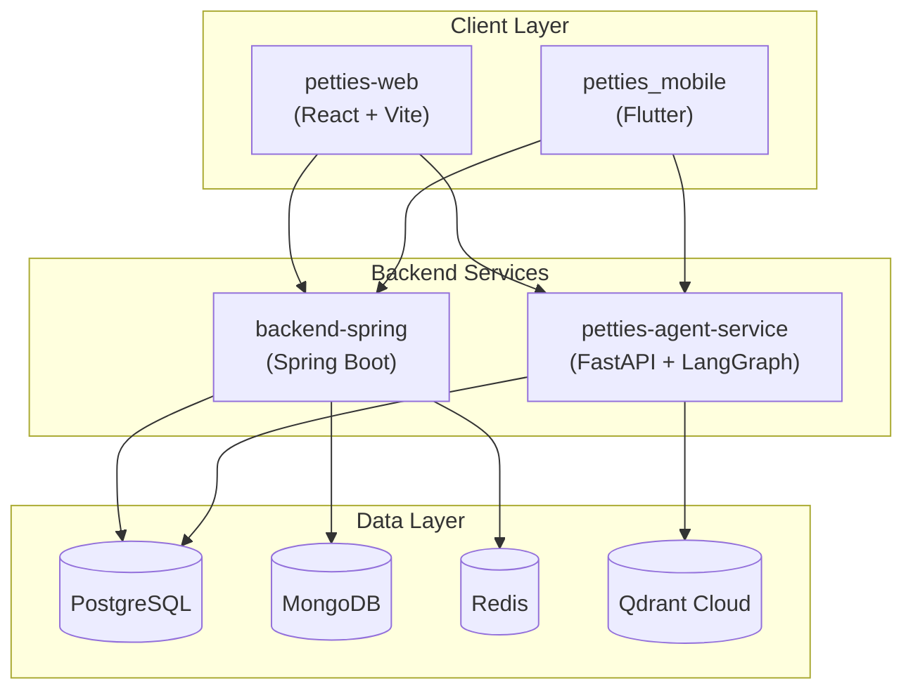
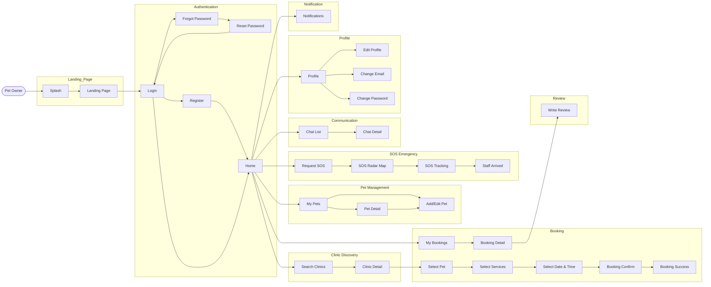
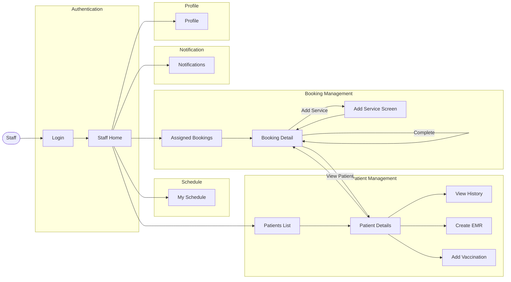
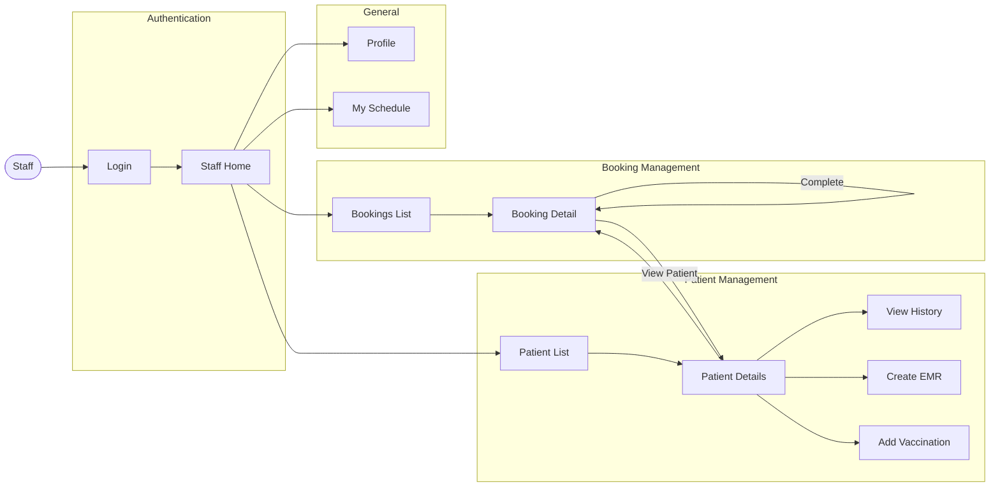
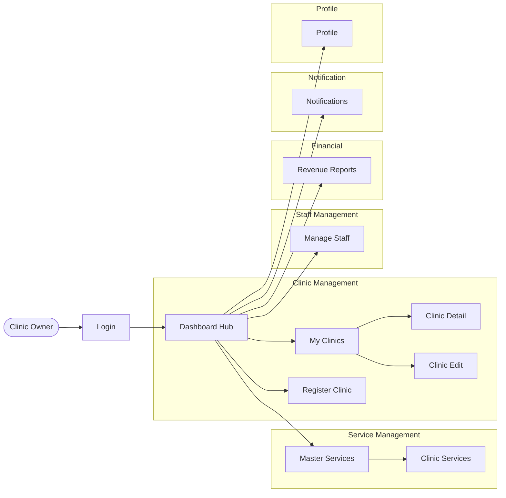
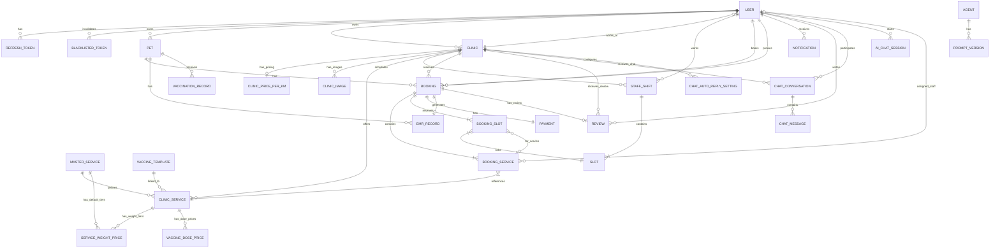

# PETTIES - Software Requirements Specification (SRS)

> Update note dated 2026-03-17: older SRS passages related to `analyze_pet_image`, Visual Case Memory from image feedback, or thumbs up/down should now be treated as historical context only. The active requirements for AI diagnosis are defined in [AI_DIAGNOSIS_FEATURE_PLAN.md](D:/SEP490/petties/docs-references/documentation/AI_DIAGNOSIS_FEATURE_PLAN.md) and [AI_SERVICE_TECHNICAL_SPECIFICATION.md](D:/SEP490/petties/docs-references/documentation/AI_SERVICE_TECHNICAL_SPECIFICATION.md).

**Project:** Petties - Veterinary Appointment Booking Platform
**Version:** 2.3.7 (Standardized AI booking documentation language and completion requirements)
**Last Updated:** 2026-03-20
**Document Status:** In Progress

---

## Table of Contents

1. [Product Overview](#1-product-overview)
2. [User Requirements](#2-user-requirements)
    - [2.3 Use Case Implementation Status Reference](#23-use-case-implementation-status-reference)
3. [Functional Requirements (Screen Flow)](#3-functional-requirements)
    - [3.2 Authentication & Onboarding](#32-authentication--onboarding)
    - [3.3 User Profile & Account Setup](#33-user-profile--account-setup)
    - [3.4 Pet Records & Health Hub](#34-pet-records--health-hub)
    - [3.5 Clinic Discovery Flow](#35-clinic-discovery-flow)
    - [3.6 Clinical Operations & Service Setup](#36-clinical-operations--service-setup)
    - [3.7 Staffing & Scheduling Flow](#37-staffing--scheduling-flow)
    - [3.8 Booking & Appointment Lifecycle Flow](#38-booking--appointment-lifecycle-flow)
    - [3.9 Electronic Medical Records (EMR) Flow](#39-electronic-medical-records-emr-flow)
    - [3.10 Specialized Services (SOS Emergency) Flow](#310-specialized-services-sos-emergency-flow)
    - [3.11 AI Assistance Flow](#311-ai-assistance-flow)
    - [3.12 Governance & Reporting Flow](#312-governance--reporting-flow)
    - [3.13 Clinic Setup AI Agent Flow](#313-clinic-setup-ai-agent-flow)
4. [Non-Functional Requirements](#5-non-functional-requirements)
5. [Requirement Appendix](#6-requirement-appendix)

---

## 1. PRODUCT OVERVIEW

### 1.1 Product Purpose

**Petties** là nền tảng kết nối chủ thú cưng (Pet Owner) với các phòng khám thú y (Veterinary Clinics). Hệ thống cho phép:

- 🐾 Chủ pet đặt lịch khám tại phòng khám hoặc tại nhà
- 🏥 Phòng khám quản lý dịch vụ, nhân viên, lịch làm việc
- 👨‍⚕️ Nhân viên quản lý ca làm, khám bệnh, ghi hồ sơ y tế
- 🤖 AI Chatbot hỗ trợ tư vấn chăm sóc thú cưng
- 📊 Admin quản lý toàn bộ nền tảng

### 1.2 Product Scope

| Aspect | Description |
|--------|-------------|
| **Platform** | Web (Admin, Clinic), Mobile (Pet Owner, Staff) |
| **Target Users** | Pet Owners, Veterinary Clinics, Staff, Admins |
| **Geography** | Vietnam (initial), Southeast Asia (future) |
| **Timeline** | 13 Sprints (10/12/2025 - 11/03/2026) |

### 1.3 Intended Audience

| Audience | Description |
|----------|-------------|
| Developers | Xây dựng và bảo trì hệ thống |
| QA/Testers | Kiểm tra chức năng và chất lượng |
| Product Owners | Theo dõi và ưu tiên requirements |
| Stakeholders | Đánh giá tính khả thi và business value |

### 1.4 Product Overview Diagram (Context Diagram)


```mermaid
flowchart TB
    PO["🐾 Pet Owner<br/>(Mobile)"]
    STAFF["👨‍⚕️ Staff<br/>(Mobile + Web)"]
    CM["👨‍💼 Clinic Manager<br/>(Web)"]
    CO["🏥 Clinic Owner<br/>(Web)"]
    ADMIN["🔧 Admin<br/>(Web)"]
    
    SYSTEM(("🐾 Petties<br/>System"))
    
    %% Pet Owner flows
    PO -->|"Register, Login, Profile Update"| SYSTEM
    PO -->|"Pet Profile (View EMR + Vaccination)"| SYSTEM
    PO -->|"Search Clinic, Create Booking"| SYSTEM
    PO -->|"Payment (Stripe)"| SYSTEM
    PO -->|"Review, AI Chat, Report Violation"| SYSTEM
    SYSTEM -->|"Booking Confirmation, Notifications"| PO
    SYSTEM -->|"Pet Profile (EMR + Vaccination Records)"| PO
    
    %% Staff flows
    STAFF -->|"Login, View Schedule"| SYSTEM
    STAFF -->|"View Assigned Bookings"| SYSTEM
    STAFF -->|"Check-in, Create/Edit EMR"| SYSTEM
    STAFF -->|"Add/Edit Vaccination, Check-out"| SYSTEM
    SYSTEM -->|"Assigned Bookings, Schedules"| STAFF
    SYSTEM -->|"Pet Profile (EMR + Vaccination, READ-ONLY cross-clinic)"| STAFF
    
    %% Clinic Manager flows
    CM -->|"Add/Remove Staff"| SYSTEM
    CM -->|"Create Staff Schedule"| SYSTEM
    CM -->|"Assign Staff to Booking"| SYSTEM
    SYSTEM -->|"Staff List, Booking List/Pending Bookings"| CM
    SYSTEM -->|"Schedule Overview"| CM
    
    %% Clinic Owner flows
    CO -->|"Register Clinic"| SYSTEM
    CO -->|"Manage Master Services (Templates + Weight Tiers)"| SYSTEM
    CO -->|"Configure Clinic Services (Inherit or Custom)"| SYSTEM
    CO -->|"Add Clinic Manager"| SYSTEM
    SYSTEM -->|"Clinic Status, Revenue Report"| CO
    SYSTEM -->|"Dashboard Analytics"| CO
    
    %% Admin flows
    ADMIN -->|"Login, Approve/Reject Clinic"| SYSTEM
    ADMIN -->|"Configure AI Agents"| SYSTEM
    ADMIN -->|"Manage Knowledge Base, Process Reports"| SYSTEM
    SYSTEM -->|"Pending Clinics, Platform Stats"| ADMIN
    SYSTEM -->|"User Reports, Agent Status"| ADMIN
```

### 1.5 System Architecture Overview


```mermaid
graph TB
    subgraph "Client Layer"
        WEB["petties-web<br/>(React + Vite)"]
        MOBILE["petties_mobile<br/>(Flutter)"]
    end
    
    subgraph "Backend Services"
        SPRING["backend-spring<br/>(Spring Boot)"]
        AI["petties-agent-service<br/>(FastAPI + LangGraph)"]
    end
    
    subgraph "Data Layer"
        PG[(PostgreSQL)]
        MONGO[(MongoDB)]
        REDIS[(Redis)]
        QDRANT[(Qdrant Cloud)]
    end
    
    WEB --> SPRING
    WEB --> AI
    MOBILE --> SPRING
    MOBILE --> AI
    SPRING --> PG
    SPRING --> MONGO
    SPRING --> REDIS
    AI --> PG
    AI --> QDRANT
```

---

## 2. USER REQUIREMENTS

### 2.1 User Roles

| Role | Platform | Description |
|------|----------|-------------|
| **PET_OWNER** | Mobile only | Chủ thú cưng, đặt lịch khám, xem hồ sơ y tế |
| **STAFF** | Mobile + Web | Nhân viên phòng khám (Nhân viên, Groomer, Lễ tân). Có chuyên môn cụ thể (`specialty`). |
| **CLINIC_MANAGER** | Web only | Quản lý phòng khám, gán booking cho nhân viên |
| **CLINIC_OWNER** | Web only | Chủ phòng khám, quản lý dịch vụ, doanh thu |
| **ADMIN** | Web only | Admin nền tảng, duyệt phòng khám, quản lý AI |

### 2.2 Use Cases (Organized by Feature Module)

> **Approach:** Trình bày đúng theo bảng **Feature - Function** đã thống nhất, không hiển thị trạng thái.

| Feature | Function |
|---|---|
| Authentication | Register Account |
| Authentication | Login |
| Authentication | Login by Google |
| Authentication | Logout |
| Authentication | Forgot Password |
| Authentication | Reset Password |
| User Profile Management | View Profile |
| User Profile Management | Update Profile |
| Staff and Scheduling Management | Add Staff |
| Staff and Scheduling Management | Delete Staff |
| Staff and Scheduling Management | View List of Staffs |
| Staff and Scheduling Management | View Own Work Schedule |
| Staff and Scheduling Management | View Staff Shift |
| Staff and Scheduling Management | Create Staff Shift |
| Staff and Scheduling Management | Edit Staff Shift |
| Staff and Scheduling Management | Delete Staff Shift |
| Pet Profile Management | View Pet Profile |
| Pet Profile Management | Create Pet Profile |
| Pet Profile Management | Edit Pet Profile |
| Pet Profile Management | Delete Pet Profile |
| Patient Management | View Patient History List |
| Patient Management | View Patient Details |
| EMR & Vaccination Management | View Pet’s Medical Record |
| EMR & Vaccination Management | Update Pet’s Medical Record |
| EMR & Vaccination Management | Create Pet’s Medical Record |
| EMR & Vaccination Management | View Pet’s Vaccination Record |
| EMR & Vaccination Management | Update Pet’s Vaccination Record |
| EMR & Vaccination Management | Create Pet’s Vaccination Record |
| EMR & Vaccination Management | Receive Medication Reminders |
| Service Management | Create Service |
| Service Management | Create Master Service |
| Service Management | Update Service |
| Service Management | Update Master Service |
| Service Management | Delete Service |
| Service Management | Delete Master Service |
| Service Management | View All Service |
| Service Management | View All Master Service |
| Service Management | View Detail Service |
| Service Management | View Detail Master Service |
| Service Management | Inheritance Master Service For Clinics |
| Chat Management | Create Conversation |
| Chat Management | View All Coversation |
| Chat Management | Delete Message |
| Chat Management | Send Message |
| Chat Management | View Chat History |
| Chat Management | Create Auto Reply |
| Chat Management | Update Auto Reply Message |
| Booking Review Management | Create Review |
| Booking Review Management | Delete Review |
| Booking Review Management | Update Review |
| Booking Review Management | View Clinic Review |
| Clinic Management | View Clinic Details |
| Clinic Management | Create Clinic |
| Clinic Management | View Clinic |
| Clinic Management | Delete Clinic |
| Clinic Management | Update Clinic |
| Clinic Management | View clinic pending list |
| Clinic Management | Approve/Reject Clinic |
| Clinic Management | Active/ Suspend Clinic |
| Clinic Management | View Clinic Statistics |
| Booking Management | Book an appointment |
| Booking Management | Book on behalf |
| Booking Management | View My Bookings and Booking Details |
| Booking Management | View booking history |
| Booking Management | Cancel booking |
| Booking Management | Start SOS Matching |
| Booking Management | Track Staff location |
| Booking Management | Reassign Staff for Service Item |
| Booking Management | Assign Staff to Booking |
| Booking Management | Update Booking Progress |
| Booking Management | Add Add-on Service |
| Booking Management | Remove Add-on Service |
| Booking Management | View New Bookings |
| Clinic Discovery Management | View Clinic On Map |
| Clinic Discovery Management | Search clinics |
| Clinic Discovery Management | View Clinic's List |
| Clinic Discovery Management | Filter and Sort |
| Clinic Discovery Management | View Clinic Details |
| Notification Management | Update Notification |
| Notification Management | View Notification |
| Notification Management | Create Notification |
| Notification Management | Delete Notification |
| Payment Management | Create QR Payment |
| Payment Management | View Invoice |
| Payment Management | View Payment Transactions History |
| Payment Management | Process Withdraw |
| Payment Management | View List Withdraw request |
| Payment Management | View wallet's clinic |
| System Management | View platform statistics |
| Report Management | Create Report Clinic |
| Report Management | Create Report Pet Owner |
| Report Management | View All Report |
| Report Management | Active/Suspend Report |
| AI Assistant | Ask ChatBot To Pet Care |
| AI Assistant | Booking With ChatBot |
| AI Assistant | Config Agent Parameter |
| AI Assistant | Test Agent Playground |
| AI Assistant | Turn On/Off Agent Tools |
| AI Assistant | Upload Document To Knowledge Base |

---

### 2.3 Use Case Implementation Status Reference

> **Legend:** ✅ Implemented | 🔄 In Progress | ❌ Not Started | 📋 Documented in SRS

#### Authentication & Account Management

| # | Use Case | UC-ID | SRS Ref | Backend | Frontend | Status |
|---|----------|-------|---------|---------|----------|--------|
| 1 | Register Account | UC-PO-01 | 3.2.1 | ✅ AuthController | ✅ Mobile | ✅ Done |
| 2 | Login | UC-PO-01a | 3.2.2 | ✅ AuthController | ✅ Mobile/Web | ✅ Done |
| 3 | Login by Google | UC-PO-02 | 3.2.2 | ✅ AuthController | ✅ Mobile/Web | ✅ Done |
| 4 | Forgot password | UC-PO-01b | 3.2.3 | ✅ AuthController | ✅ Mobile/Web | ✅ Done |
| 5 | Logout | UC-PO-01c | 3.2.4 | ✅ AuthController | ✅ Mobile/Web | ✅ Done |
| 6 | View profile | UC-PO-03 | 3.3.1 | ✅ UserController | ✅ Mobile/Web | ✅ Done |
| 7 | Edit information | UC-PO-03 | 3.3.1 | ✅ UserController | ✅ Mobile/Web | ✅ Done |
| 8 | Reset password | UC-PO-03d | 3.3.2 | ✅ UserController | ✅ Mobile/Web | ✅ Done |
| 9 | View landing page | - | - | N/A | ✅ Web | ✅ Done |

#### User & Notification Management

| # | Use Case | UC-ID | SRS Ref | Backend | Frontend | Status |
|---|----------|-------|---------|---------|----------|--------|
| 10 | View notification | - | - | ✅ NotificationController | ✅ Mobile/Web | ✅ Done |
| 11 | Receive Notification | - | - | ✅ FCM/SSE | ✅ Mobile/Web | ✅ Done |
| 12 | View user account | - | - | ✅ UserController | ✅ Web | ✅ Done |
| 13 | Create notification | - | - | ✅ NotificationService | ❌ | 🔄 Backend Only |
| 14 | Delete notification | - | - | ❌ | ❌ | ❌ Not Started |
| 109 | Cancel Email Change Request | UC-PROFILE-04 | 2.2.2 | ✅ UserController | ✅ Mobile | ✅ Done |
| 110 | Send FCM Push Notification | UC-NOTIF-01 | 2.2.11 | ✅ FcmController | ✅ Mobile | ✅ Done |
| 111 | Subscribe FCM Topic | UC-NOTIF-02 | 2.2.11 | ✅ FcmService | ✅ Mobile | ✅ Done |
| 112 | SSE Real-time Events | UC-NOTIF-03 | 2.2.11 | ✅ SseController | ✅ Web | ✅ Done |

#### Pet Management

| # | Use Case | UC-ID | SRS Ref | Backend | Frontend | Status |
|---|----------|-------|---------|---------|----------|--------|
| 15 | View Pet Profile | UC-PO-04 | 3.4.1 | ✅ PetController | ✅ Mobile | ✅ Done |
| 16 | Create Pet Profile | UC-PO-04 | 3.4.1 | ✅ PetController | ✅ Mobile | ✅ Done |
| 17 | Edit Pet Profile | UC-PO-04 | 3.4.2 | ✅ PetController | ✅ Mobile | ✅ Done |
| 18 | Delete Pet Profile | UC-PO-04 | 3.4.2 | ✅ PetController | ✅ Mobile | ✅ Done |
| 19 | View Pet vaccination records | UC-PO-12 | 3.4.3 | ✅ VaccinationController | ✅ Mobile | ✅ Done |
| 20 | View medical records | UC-PO-11 | 3.4.3 | ✅ EmrController | ✅ Mobile | ✅ Done |
| 94 | Update Pet Allergies | UC-PO-21 | - | ✅ PetController | ✅ Mobile | ✅ Done |
| 95 | Update Pet Weight | UC-PO-22 | - | ✅ PetController | ✅ Mobile | ✅ Done |

#### Clinic Discovery & Booking

| # | Use Case | UC-ID | SRS Ref | Backend | Frontend | Status |
|---|----------|-------|---------|---------|----------|--------|
| 21 | View Clinic's List | UC-PO-05 | 3.5.1 | ✅ ClinicController | ✅ Mobile/Web | ✅ Done |
| 22 | Search clinics | UC-PO-05 | 3.5.1 | ✅ ClinicController | ✅ Mobile | ✅ Done |
| 23 | View Clinic Details | UC-PO-05b | 3.5.2 | ✅ ClinicController | ✅ Mobile | ✅ Done |
| 24 | View Clinic On Map | - | - | ✅ ClinicController | ✅ Mobile | ✅ Done |
| 25 | Book an appointment | UC-PO-06 | 3.8.1 | ✅ BookingController | ✅ Mobile | ✅ Done |
| 113 | Book on behalf | UC-PO-07 | 3.8.2 | ✅ BookingController | ✅ Mobile | ✅ Done |
| 114 | View My Bookings and Booking Details | UC-PO-08 | 3.8.3 | ✅ BookingController | ✅ Mobile | ✅ Done |
| 26 | Start SOS Matching | UC-PO-15 | 3.10.1 | ✅ SosController | ✅ Mobile | ✅ Done |
| 27 | Receive SOS alert | UC-CM-20 | 3.10.3 | ✅ SosController | ✅ Web | ✅ Done |
| 28 | Confirm/Decline SOS Request | UC-CM-20 | 3.10.3 | ✅ SosController | ✅ Web | ✅ Done |
| 29 | Track Staff location | UC-PO-17 | 3.10.2 | ✅ BookingController | ✅ Mobile | ✅ Done |
| 30 | Cancel SOS Matching | UC-PO-18 | 3.10.4 | ✅ SosController | ✅ Mobile | ✅ Done |
| 31 | Checkout with Custom Fee | UC-STAFF-10 | 3.10.5 | ✅ BookingController | ✅ Mobile | ✅ Done |
| 32 | Cancel Booking | UC-PO-09 | 3.8.4 | ✅ BookingController | ✅ Mobile | ✅ Done |
| 33 | Make payment | UC-PO-10 | 3.8.2 | 🔄 Stripe Integration | ❌ | 🔄 In Progress |
| 34 | View invoice | - | - | ❌ | ❌ | ❌ Not Started |
| 35 | Receive medication reminders | - | - | ❌ | ❌ | ❌ Not Started |
| 96 | Clinic Geocode | UC-CO-09 | - | ✅ ClinicController | ✅ Web | ✅ Done |
| 97 | Clinic Distance Calculation | UC-CO-10 | - | ✅ ClinicController | ✅ Mobile | ✅ Done |

#### AI Assistant

| # | Use Case | UC-ID | SRS Ref | Backend | Frontend | Status |
|---|----------|-------|---------|---------|----------|--------|
| 36 | Booking With ChatBot | UC-PO-14c | 3.11.1 | ✅ Agent Service | ✅ Mobile | 🔄 In Progress |
| 37 | Ask ChatBot To Pet Care | UC-PO-14a | 3.11.1 | ✅ Agent Service | ✅ Mobile | ✅ Done |
| 38 | Chat | UC-PO-14d | 3.11.2 | ✅ ChatController | ✅ Mobile | ✅ Done |
| 107 | Staff Diagnostic Support | UC-STAFF-11 | 3.11.6 | ✅ Agent Service | ✅ Mobile/Web | 📋 Planned |
| 108 | AI Medical Image Diagnosis | UC-AI-01 | 3.11.9 | ✅ Agent Service | ✅ Mobile/Web | 📋 Planned |
| 98 | Real-time Chat WebSocket | UC-PO-20 | - | ✅ ChatWebSocketController | ✅ Mobile/Web | ✅ Done |
| 99 | Chat Images Gallery | UC-PO-23 | - | ✅ ChatController | ✅ Mobile | ✅ Done |
| 123 | AI Feedback Audit | UC-AD-11 | 3.11.7 | ✅ Agent Service | ✅ Web | ✅ Done |
| 124 | Knowledge Graph Visualizer | UC-AD-12 | 3.11.8 | ✅ Agent Service | ✅ Web | ✅ Done |
| 125 | KG Query Testing | UC-AD-13 | 3.11.8 | ✅ Agent Service | ✅ Web | ✅ Done |

#### Rating & Reporting

| # | Use Case | UC-ID | SRS Ref | Backend | Frontend | Status |
|---|----------|-------|---------|---------|----------|--------|
| 39 | Rate and review vet | UC-PO-13 | - | ❌ | ❌ | ❌ Not Started |
| 40 | Report clinic, vet | UC-PO-16 | 3.12.1 | ❌ | ❌ | 📋 Documented |

#### Admin Functions

| # | Use Case | UC-ID | SRS Ref | Backend | Frontend | Status |
|---|----------|-------|---------|---------|----------|--------|
| 41 | View list of pending clinics | UC-AD-02 | 3.6.2 | ✅ ClinicController | ✅ Web | ✅ Done |
| 42 | Approve/ Reject clinic | UC-AD-03 | 3.6.2 | ✅ ClinicController | ✅ Web | ✅ Done |
| 43 | View platform statistics | UC-AD-04 | - | ❌ | ❌ | ❌ Not Started |
| 44 | View revenue | UC-CO-05 | - | ❌ | ❌ | ❌ Not Started |
| 45 | View policy | - | - | ❌ | ❌ | ❌ Not Started |
| 46 | Update policy | - | - | ❌ | ❌ | ❌ Not Started |
| 47 | Upload Document To Knowledge Base | UC-AD-06 | - | ✅ Agent Service | ✅ Web | ✅ Done |
| 48 | Accept/ Reject User Reports | UC-AD-09 | - | ❌ | ❌ | ❌ Not Started |
| 49 | View User Report | UC-AD-08 | - | ❌ | ❌ | ❌ Not Started |
| 50 | Turn On/Off Agent Tools | UC-AD-05 | - | ✅ Agent Service | ✅ Web | ✅ Done |
| 51 | Config Agent Parameter | UC-AD-05 | - | ✅ Agent Service | ✅ Web | ✅ Done |
| 52 | Test Agent Playground | UC-AD-07 | - | ✅ Agent Service | ✅ Web | ✅ Done |
| 100 | SSE Real-time Notifications | UC-AD-10 | - | ✅ SseController | ✅ Web | ✅ Done |

#### Clinic Owner Functions

| # | Use Case | UC-ID | SRS Ref | Backend | Frontend | Status |
|---|----------|-------|---------|---------|----------|--------|
| 49 | Register Clinic | UC-CO-01 | 3.6.1 | ✅ ClinicController | ✅ Web | ✅ Done |
| 50 | Edit Clinic | UC-CO-02 | - | ✅ ClinicController | ✅ Web | ✅ Done |
| 51 | Create Clinic Service | UC-CO-03 | - | ✅ ClinicServiceController | ✅ Web | ✅ Done |
| 52 | Update Clinic Service | UC-CO-03 | - | ✅ ClinicServiceController | ✅ Web | ✅ Done |
| 53 | Delete Clinic Service | UC-CO-03 | - | ✅ ClinicServiceController | ✅ Web | ✅ Done |
| 54 | Create Master Services | UC-CO-08 | 3.6.3 | ✅ MasterServiceController | ✅ Web | ✅ Done |
| 55 | View Master Services | UC-CO-08 | - | ✅ MasterServiceController | ✅ Web | ✅ Done |
| 56 | Update Master Services | UC-CO-08 | - | ✅ MasterServiceController | ✅ Web | ✅ Done |
| 57 | Delete Master Services | UC-CO-08 | - | ✅ MasterServiceController | ✅ Web | ✅ Done |
| 58 | Inherit From Master Service | - | - | ✅ ClinicServiceController | ✅ Web | ✅ Done |
| 59 | Handle Clinic (Active/Suspend) | - | - | ✅ ClinicController | ✅ Web | ✅ Done |
| 60 | Configure Pricing And Weight Tiers | UC-CO-04 | 3.6.4 | ✅ ClinicPriceController | ✅ Web | ✅ Done |
| 101 | Service Home Visit Toggle | UC-CO-11 | - | ✅ ClinicServiceController | ✅ Web | ✅ Done |
| 102 | Service Price Per KM | UC-CO-12 | - | ✅ ClinicServiceController | ✅ Web | ✅ Done |
| 103 | Bulk Price Per KM Update | UC-CO-13 | - | ✅ ClinicServiceController | ✅ Web | ✅ Done |
| 104 | AI Generate Clinic Services | UC-CO-14 | 3.13.1 | ❌ | ❌ | 📋 Documented |

#### Staff Management

| # | Use Case | UC-ID | SRS Ref | Backend | Frontend | Status |
|---|----------|-------|---------|---------|----------|--------|
| 61 | Invite Staff by Email | UC-STAFF-01 | 3.7.1 | ✅ ClinicStaffController | ✅ Web | ✅ Done |
| 62 | Delete Staff | UC-STAFF-02 | 3.7.2 | ✅ ClinicStaffController | ✅ Web | ✅ Done |
| 63 | View List of Staffs | UC-STAFF-03 | 3.7.3 | ✅ ClinicStaffController | ✅ Web | ✅ Done |
| 64 | View Own Work Schedule | UC-STAFF-04 | 3.7.4 | ✅ StaffShiftController | ✅ Mobile/Web | ✅ Done |
| 65 | Create Staff Shift | UC-STAFF-05 | 3.7.5 | ✅ StaffShiftController | ✅ Web | ✅ Done |
| 66 | View Staff Shift | UC-STAFF-06 | 3.7.6 | ✅ StaffShiftController | ✅ Web | ✅ Done |
| 67 | Delete Staff Shift | UC-STAFF-07 | 3.7.7 | ✅ StaffShiftController | ✅ Web | ✅ Done |
| 68 | Block/Unblock Slot (Manual) | - | - | ✅ StaffShiftController | ✅ Web | ✅ Done |
| 69 | Bulk Delete Staff Shifts | - | - | ✅ StaffShiftController | ✅ Web | ✅ Done |
| 70 | View staff's profile | UC-ST-02 | - | ✅ UserController | ✅ Mobile | ✅ Done |
| 71 | Update Staff's Profile | UC-ST-02 | - | ✅ UserController | ✅ Mobile | ✅ Done |
| 104 | Assign Existing Staff to Clinic | - | - | ✅ ClinicStaffController | ✅ Web | ✅ Done |
| 105 | Assign Clinic Manager to Clinic | - | - | ✅ ClinicStaffController | ✅ Web | ✅ Done |

#### Manager Booking Operations

| # | Use Case | UC-ID | SRS Ref | Backend | Frontend | Status |
|---|----------|-------|---------|---------|----------|--------|
| 72 | View New Bookings | UC-BOOK-05 | 3.8.5 | ✅ BookingController | ✅ Web | ✅ Done |
| 73 | Assign Staff to Booking | UC-BOOK-06 | 3.8.6 | ✅ BookingController | ✅ Web | ✅ Done |
| 74 | Reassign Staff for Service Item | UC-BOOK-07 | 3.8.7 | ✅ BookingController | ✅ Web | ✅ Done |
| 75 | View request cancel booking | UC-CM-07 | - | ✅ BookingController | ✅ Web | ✅ Done |
| 76 | Approve/ Reject Request | UC-CM-07 | - | 🔄 | ❌ | 🔄 In Progress |
| 77 | View Statistics | UC-CO-05 | - | ❌ | ❌ | ❌ Not Started |
| 78 | View Payment Transactions History | - | - | ❌ | ❌ | ❌ Not Started |
| 79 | Process Refund | UC-CM-07 | - | ❌ | ❌ | ❌ Not Started |
| 80 | View List Cancellation And Refund | - | - | ❌ | ❌ | ❌ Not Started |
| 106 | Check Staff Availability | UC-BOOK-06 | 3.8.6 | ✅ BookingController | ✅ Web | ✅ Done |
| 107 | Reassign Staff to Service | UC-BOOK-07 | 3.8.7 | ✅ BookingController | ✅ Web | ✅ Done |
| 108 | View Staff Home Summary | UC-BOOK-10 | 3.8.10 | ✅ BookingController | ✅ Mobile | ✅ Done |
| 115 | View Assigned Bookings | UC-BOOK-09 | 3.8.9 | ✅ BookingController | ✅ Mobile/Web | ✅ Done |
| 116 | Add Add-on Service | UC-BOOK-11 | 3.8.11 | ✅ BookingController | ✅ Mobile/Web | ✅ Done |
| 117 | Remove Add-on Service | UC-BOOK-12 | 3.8.12 | ✅ BookingController | ✅ Mobile/Web | ✅ Done |

#### File & Media Management

| # | Use Case | UC-ID | SRS Ref | Backend | Frontend | Status |
|---|----------|-------|---------|----------|----------|--------|
| 113 | Upload Pet Image | UC-FILE-01 | 2.2.12 | ✅ FileController | ✅ Mobile | ✅ Done |
| 114 | Upload Medical Document | UC-FILE-02 | 2.2.12 | ✅ FileController | ✅ Mobile | ✅ Done |
| 115 | Upload Clinic Logo/Banner | UC-FILE-03 | 2.2.12 | ✅ CloudinaryService | ✅ Web | ✅ Done |
| 116 | Upload Knowledge Base Doc | UC-FILE-04 | 2.2.12 | ✅ FileController | ✅ Web | ✅ Done |
| 117 | Delete Uploaded File | UC-FILE-05 | 2.2.12 | ✅ FileController | ✅ Mobile/Web | ✅ Done |
| 118 | View File Gallery | UC-FILE-06 | 2.2.12 | ✅ FileController | ✅ Mobile | ✅ Done |

#### Patient & EMR Management

| # | Use Case | UC-ID | SRS Ref | Backend | Frontend | Status |
|---|----------|-------|---------|---------|----------|--------|
| 81 | View patient list | UC-CM-08 | 3.9.6 | ✅ EmrController | ✅ Web | ✅ Done |
| 82 | View patient record | UC-CM-09 | 3.9.7 | ✅ EmrController | ✅ Web | ✅ Done |
| 83 | Search examined patients | UC-VT-12 | 3.9.5 | ✅ EmrController | ✅ Web | ✅ Done |
| 84 | View patient details | UC-CM-09 | 3.9.7 | ✅ EmrController | ✅ Web | ✅ Done |
| 85 | View patient history list | UC-VT-13 | - | ✅ EmrController | ✅ Mobile | ✅ Done |
| 86 | View pet's medical record | UC-VT-06 | 3.9.1 | ✅ EmrController | ✅ Mobile/Web | ✅ Done |
| 87 | Update pet's medical record | UC-VT-06 | 3.9.1 | ✅ EmrController | ✅ Mobile | ✅ Done |
| 88 | Create prescription | UC-VT-07 | 3.9.2 | ✅ EmrController | ✅ Mobile | ✅ Done |
| 89 | View pet's vaccination record | UC-VT-08 | 3.9.4 | ✅ VaccinationController | ✅ Mobile | ✅ Done |
| 90 | Update pet's vaccination record | UC-VT-08 | 3.9.4 | ✅ VaccinationController | ✅ Mobile | ✅ Done |
| 91 | Check in patient | UC-BOOK-08 | 3.8.8 | ✅ BookingController | ✅ Mobile/Web | ✅ Done |
| 92 | Checkout patient | UC-BOOK-08 | 3.8.8 | ✅ BookingController | ✅ Web | ✅ Done |
| 93 | View Assigned Bookings | UC-BOOK-09 | 3.8.9 | ✅ BookingController | ✅ Mobile | ✅ Done |

#### Vaccination Reminders

| # | Use Case | UC-ID | SRS Ref | Backend | Frontend | Status |
|---|----------|-------|---------|---------|----------|--------|
| 119 | Schedule Vaccination Reminder | UC-VAC-01 | 2.2.3 | ✅ VaccinationReminderService | ✅ System | ✅ Done |
| 120 | Send Vaccination Due Notification | UC-VAC-02 | 2.2.3 | ✅ VaccinationReminderService | ✅ Mobile | ✅ Done |
| 121 | View Upcoming Vaccinations | UC-VAC-03 | 2.2.3 | ✅ VaccinationController | ✅ Mobile | ✅ Done |
| 122 | Mark Vaccination Completed | UC-VAC-04 | 2.2.3 | ✅ VaccinationController | ✅ Mobile | ✅ Done |

#### Implementation Summary

| Status | Count | Percentage |
|--------|-------|------------|
| ✅ Done | 104 | 85.2% |
| 🔄 In Progress | 5 | 4.1% |
| ❌ Not Started | 13 | 10.7% |
| **Total** | **122** | **100%** |

### 2.4 Cross-Reference: Use Case to SDD Mapping

Bảng tham chiếu giữa Use Cases trong SRS và các Module Implementation trong SDD (REPORT_4_SDD_SYSTEM_DESIGN.md):

#### Authentication & Account Management Mapping

| UC-ID | Use Case Name | SDD Module | SDD Section |
|-------|---------------|------------|-------------|
| UC-AUTH-01 | Register Account (Email/OTP) | Authentication Management | 3.1 |
| UC-AUTH-02 | Login by Google OAuth | Authentication Management | 3.1 |
| UC-AUTH-03 | Staff Login (Invited Account) | Authentication Management | 3.1 |
| UC-AUTH-04 | Manager Login | Authentication Management | 3.1 |
| UC-AUTH-05 | Invite Staff (Quick Add by Email) | Staff Management | 3.7 |
| UC-AUTH-06 | Register Clinic (Pending Approval) | Clinic Registration | 3.3 |
| UC-AUTH-07 | Admin Login | Authentication Management | 3.1 |

#### Pet Records & Health Hub Mapping

| UC-ID | Use Case Name | SDD Module | SDD Section |
|-------|---------------|------------|-------------|
| UC-PET-01 | Manage Pet Profiles | Pet Management | 3.5 |
| UC-PET-02 | View Pet EMR Records | EMR Management | 3.9 |
| UC-PET-03 | View Vaccination Records | Vaccination Management | 3.9.4 |
| UC-PET-04 | View Patient History (Mobile) | EMR Management | 3.9.7 |
| UC-PET-05 | Update Pet Allergies | Pet Management | 3.5 |
| UC-PET-06 | Update Pet Weight | Pet Management | 3.5 |
| UC-VAC-01 | Schedule Vaccination Reminder | Vaccination Reminders | 3.14 (New) |
| UC-VAC-02 | Send Vaccination Due Notification | Vaccination Reminders | 3.14 (New) |
| UC-VAC-03 | View Upcoming Vaccination Schedule | Vaccination Management | 3.9.4 |
| UC-VAC-04 | Mark Vaccination as Completed | Vaccination Management | 3.9.4 |

#### Booking & Appointment Mapping

| UC-ID | Use Case Name | SDD Module | SDD Section |
|-------|---------------|------------|-------------|
| UC-BOOK-01 | Book an Appointment | Booking Management | 3.8.1 |
| UC-BOOK-02 | Book on Behalf | Booking Management | 3.8.2 |
| UC-BOOK-03 | View My Bookings and Booking Details | Booking Management | 3.8.3 |
| UC-BOOK-04 | Cancel Booking | Booking Management | 3.8.4 |
| UC-BOOK-05 | View New Bookings | Booking Management | 3.8.5 |
| UC-BOOK-06 | Assign Staff to Booking | Booking Management | 3.8.6 |
| UC-BOOK-07 | Reassign Staff for Service Item | Booking Management | 3.8.7 |
| UC-BOOK-08 | Update Booking Progress | Booking Management | 3.8.8 |
| UC-BOOK-09 | View Assigned Bookings | Booking Management | 3.8.9 |
| UC-BOOK-10 | View Staff Home Summary | Booking Management | 3.8.10 |
| UC-BOOK-11 | Add Add-on Service | Booking Management | 3.8.11 |
| UC-BOOK-12 | Remove Add-on Service | Booking Management | 3.8.12 |

#### Clinical Operations Mapping

| UC-ID | Use Case Name | SDD Module | SDD Section |
|-------|---------------|------------|-------------|
| UC-SERVICE-01 | Configure Master Services | Service Management | 3.6.1 |
| UC-SERVICE-02 | Customize Clinic Services | Service Management | 3.6.1 |
| UC-SERVICE-03 | Configure Service Weight Tiers | Service Management | 3.6.1 |
| UC-STAFF-01 | Invite Staff by Email | Staff and Scheduling Management | 3.7.1 |
| UC-STAFF-02 | Delete Staff | Staff and Scheduling Management | 3.7.2 |
| UC-STAFF-03 | View List of Staffs | Staff and Scheduling Management | 3.7.3 |
| UC-STAFF-04 | View Own Work Schedule | Staff and Scheduling Management | 3.7.4 |
| UC-STAFF-05 | Create Staff Shift | Staff and Scheduling Management | 3.7.5 |
| UC-STAFF-06 | View Staff Shift | Staff and Scheduling Management | 3.7.6 |
| UC-STAFF-07 | Delete Staff Shift | Staff and Scheduling Management | 3.7.7 |

#### SOS Emergency Mapping

| UC-ID | Use Case Name | SDD Module | SDD Section |
|-------|---------------|------------|-------------|
| UC-PO-15 | Start SOS Matching | SOS Emergency | 3.10.1 |
| UC-PO-17 | Track Staff location | SOS Emergency | 3.10.2 |
| UC-CM-20 | Receive SOS alert | SOS Emergency | 3.10.3 |
| UC-PO-18 | Cancel SOS Matching | SOS Emergency | 3.10.4 |
| UC-STAFF-10 | Checkout with Custom Fee | SOS Emergency | 3.10.5 |

#### AI Assistance Mapping
 
| UC-ID | Use Case Name | SDD Module | SDD Section |
|-------|---------------|------------|-------------|
| UC-AI-01 | Ask Pet Care Advice (RAG) | AI Agent Service | 3.11.1 |
| UC-AI-02 | Symptom Check | AI Agent Tools | 3.11.2 |
| UC-AI-03 | AI Booking Assistant | AI Agent Tools | 3.11.2 |
| UC-AI-04 | Real-time Chat (WebSocket) | Chat Management | 3.11.3 |
| UC-AI-05 | Chat Images Gallery | Chat Management | 3.11.3 |
| UC-AI-06 | Manage Agent Tools | Agent Configuration | 3.11.4 |
| UC-AI-07 | Manage Knowledge Base | Knowledge Base | 3.11.5 |
| UC-AI-08 | Test Agent Playground | Agent Testing | 3.11.6 |
| UC-AI-09 | EMR Analysis with Image Support | AI Agent Service | 3.11.7 |
| UC-STAFF-11 | AI Staff Diagnostic Support | AI Agent Service | 3.11.6 |
| UC-AI-10 | AI Feedback Audit | AI Agent Service | 3.11.8 |
| UC-AI-11 | Knowledge Graph Management | AI Agent Service | 3.11.9 |
| UC-CO-14 | AI Generate Clinic Services | AI Agent Service | 3.13.1 |

#### Notification Management Mapping

| UC-ID | Use Case Name | SDD Module | SDD Section |
|-------|---------------|------------|-------------|
| UC-NOTIF-01 | Send FCM Push Notification | FCM Push Notifications | 3.13 (New) |
| UC-NOTIF-02 | Subscribe to FCM Topic | FCM Push Notifications | 3.13 (New) |
| UC-NOTIF-03 | Send SSE Real-time Event | SSE Real-time Notifications | 3.12 (New) |
| UC-NOTIF-04 | Subscribe to SSE Stream | SSE Real-time Notifications | 3.12 (New) |
| UC-NOTIF-05 | Send Batch Notifications | Notification Service | 3.4.3 |

#### File & Media Management Mapping

| UC-ID | Use Case Name | SDD Module | SDD Section |
|-------|---------------|------------|-------------|
| UC-FILE-01 | Upload Pet Image | File Upload Management | 3.15 (New) |
| UC-FILE-02 | Upload Medical Document | File Upload Management | 3.15 (New) |
| UC-FILE-03 | Upload Clinic Logo/Banner | File Upload Management | 3.15 (New) |
| UC-FILE-04 | Upload Knowledge Base Document | File Upload Management | 3.15 (New) |
| UC-FILE-05 | Delete Uploaded File | File Upload Management | 3.15 (New) |
| UC-FILE-06 | View File Gallery | File Upload Management | 3.15 (New) |

#### Governance & Administration Mapping

| UC-ID | Use Case Name | SDD Module | SDD Section |
|-------|---------------|------------|-------------|
| UC-GOV-01 | View Pending Clinics | Clinic Approval | 3.3.2 |
| UC-GOV-02 | Approve/Reject Clinic | Clinic Approval | 3.3.2 |
| UC-GOV-03 | View Platform Stats | Admin Dashboard | 3.12.1 |
| UC-GOV-04 | View User Reports | Reporting & Moderation | 3.12.2 |
| UC-GOV-05 | Moderate Users | User Management | 3.2.5 |
| UC-GOV-07 | Rate & Review | Review System | 3.12.3 |
| UC-GOV-08 | Report Violation | Reporting System | 3.12.2 |

> **Note:** Các section đánh dấu "(New)" cần được bổ sung vào SDD Document. Tham khảo existing sections để maintain consistency về format và structure.

---

### 2.5 Use Case Alignment by Feature (Updated: 04/03/2026)

Mục này ghi nhận **các use case còn thiếu** theo feature, đối chiếu từ code đã implement hiện tại (backend + AI service + web).

| Feature | Use case còn thiếu (mức tổng quát) | Hướng placement SDD |
|---|---|---|
| Notification Management | Create Notification; Delete Notification | 4.13.x |
| Payment Management | Process Withdraw; View List Withdraw request; View wallet's clinic | 4.12.x (hoặc tách 4.17.x Wallet/Settlement) |
| Report Management | Create Report Clinic; Create Report Pet Owner; View All Report; Active/Suspend Report | 4.15.x |
| System Management | View platform statistics (dashboard-level tổng hợp) | 4.14.x / 4.15.x |
| Clinic Management | View Clinic Statistics (analytics theo clinic) | 4.4.x / 4.15.x |
| Clinic Discovery Management | Filter and Sort (business rule/filter set đầy đủ theo spec) | 4.4.x |
| Chat Management | Delete Message (hard/soft delete ở level message) | 4.10.x |
| EMR & Vaccination Management | Receive Medication Reminders (luồng nhắc thuốc rõ ràng cho người dùng) | 4.9.x |
| AI Assistant (Staff) | AI Staff Diagnostic Support | 4.18.21.x |
| AI Assistant (Clinic Setup) | AI Generate Clinic Services | 4.18.8.x |

> Ghi chú: Các use case không nằm trong bảng trên được xem là đã có implementation nền tảng trong code hiện tại ở mức feature-function.

> Alignment rule: Từ mốc 04/03/2026, mọi use case mới phải đặt theo feature group ở mục 2.5 và đồng bộ tên 1-1 giữa SRS và SDD.

---

## 3. FUNCTIONAL REQUIREMENTS

### 3.1 System Functional Overview

#### 3.1.1 Screens Flow

---

##### 3.1.1.1 Mobile App - Pet Owner Flow (24 screens)


```mermaid
flowchart LR
    PO([Pet Owner]) --> Splash

    subgraph Landing_Page
        Splash --> LandingPage[Landing Page]
    end

    subgraph Authentication
        LandingPage --> Login
        Login --> Register
        Login --> ForgotPassword[Forgot Password]
        ForgotPassword --> ResetPassword[Reset Password]
        ResetPassword --> Login
        Register --> Home
        Login --> Home
    end

    subgraph Pet_Management[Pet Management]
        Home --> MyPets[My Pets]
        MyPets --> PetDetail[Pet Detail]
        MyPets --> AddEditPet[Add/Edit Pet]
        PetDetail --> AddEditPet
    end

    subgraph Clinic_Discovery[Clinic Discovery]
        Home --> SearchClinics[Search Clinics]
        SearchClinics --> ClinicDetail[Clinic Detail]
    end

    subgraph Booking
        ClinicDetail --> SelectPet[Select Pet]
        SelectPet --> SelectServices[Select Services]
        SelectServices --> SelectDateTime[Select Date & Time]
        SelectDateTime --> BookingConfirm[Booking Confirm]
        BookingConfirm --> BookingSuccess[Booking Success]
        Home --> MyBookings[My Bookings]
        MyBookings --> BookingDetail[Booking Detail]
    end

    subgraph SOS_Emergency[SOS Emergency]
        Home --> SOSRequest[Request SOS]
        SOSRequest --> SOSRadar[SOS Radar Map]
        SOSRadar --> SOSTracking[SOS Tracking]
        SOSTracking --> SOSArrived[Staff Arrived]
    end
    subgraph Review
        BookingDetail --> WriteReview[Write Review]
    end

    subgraph Communication
        Home --> ChatList[Chat List]
        ChatList --> ChatDetail[Chat Detail]
    end

    subgraph Profile
        Home --> ProfileScreen[Profile]
        ProfileScreen --> EditProfile[Edit Profile]
        ProfileScreen --> ChangeEmail[Change Email]
        ProfileScreen --> ChangePassword[Change Password]
    end

    subgraph Notification
        Home --> Notifications
    end
```

---

##### 3.1.1.2 Mobile App - Staff Flow (16 screens)



```mermaid
flowchart LR
    STAFF([Staff]) --> Login

    subgraph Authentication
        Login --> StaffHome[Staff Home]
    end

    subgraph Schedule
        StaffHome --> MySchedule[My Schedule]
    end

    subgraph Booking_Management[Booking Management]
        StaffHome --> AssignedBookings[Assigned Bookings]
        AssignedBookings --> BookingDetail[Booking Detail]
        BookingDetail -- "Check-In" --> BookingDetail
        BookingDetail -- "Add Service" --> AddService[Add Service Screen]
        AddService --> BookingDetail
        BookingDetail -- "Complete" --> BookingDetail
    end

    subgraph Patient_Management[Patient Management]
        StaffHome --> PatientsList[Patients List]
        PatientsList --> PatientDetails[Patient Details]
        BookingDetail -- "View Patient" --> PatientDetails
        PatientDetails --> ViewHistory[View History]
        PatientDetails --> CreateEMR[Create EMR]
        PatientDetails --> AddVaccination[Add Vaccination]
        PatientDetails --> BookingDetail
    end

    subgraph Notification
        StaffHome --> Notifications
    end

    subgraph Profile
        StaffHome --> ProfileScreen[Profile]
    end
```

---

##### 3.1.1.3 Web App - Staff Flow (9 screens)


```mermaid
flowchart LR
    STAFF([Staff]) --> Login

    subgraph Authentication
        Login --> StaffHome[Staff Home]
    end

    subgraph Booking_Management[Booking Management]
        StaffHome --> BookingsList[Bookings List]
        BookingsList --> BookingDetail[Booking Detail]
        BookingDetail -- "Check-In" --> BookingDetail
        BookingDetail -- "Add Service" --> BookingDetail
        BookingDetail -- "Complete" --> BookingDetail
    end

    subgraph Patient_Management[Patient Management]
        StaffHome --> PatientList[Patient List]
        PatientList --> PatientDetails[Patient Details]
        BookingDetail -- "View Patient" --> PatientDetails
        PatientDetails --> ViewHistory[View History]
        PatientDetails --> CreateEMR[Create EMR]
        PatientDetails --> AddVaccination[Add Vaccination]
        PatientDetails --> BookingDetail
    end

    subgraph General
        StaffHome --> ProfileScreen[Profile]
        StaffHome --> MySchedule[My Schedule]
    end
```

---

##### 3.1.1.4 Web App - Clinic Owner Flow (14 screens)


```mermaid
flowchart LR
    CO([Clinic Owner]) --> Login
    Login --> DashboardHub[Dashboard Hub]


    subgraph Clinic_Management[Clinic Management]
        DashboardHub --> MyClinics[My Clinics]
        MyClinics --> ClinicDetail[Clinic Detail]
        MyClinics --> ClinicEdit[Clinic Edit]
        DashboardHub --> RegisterClinic[Register Clinic]
    end

    subgraph Service_Management[Service Management]
        DashboardHub --> MasterServices[Master Services]
        MasterServices --> ClinicServices[Clinic Services]
    end

    subgraph Staff_Management[Staff Management]
        DashboardHub --> ManageStaff[Manage Staff]
    end

    subgraph Financial
        DashboardHub --> RevenueReports[Revenue Reports]
    end

    subgraph Notification
        DashboardHub --> Notifications
    end

    subgraph Profile
        DashboardHub --> ProfileScreen[Profile]
    end
```

---

##### 3.1.1.5 Web App - Clinic Manager Flow (13 screens)


```mermaid
flowchart LR
    CM([Clinic Manager]) --> Login

    subgraph Authentication
        Login --> Dashboard
    end

    subgraph Schedule_Management[Schedule Management]
        Dashboard --> StaffSchedules[Staff Schedules]
    end

    subgraph Booking_Management[Booking Management]
        Dashboard --> BookingsList[Bookings List]
        BookingsList --> BookingDetailModal[Booking Detail Modal]
        BookingDetailModal --> AssignStaff[Assign Staff]
        BookingDetailModal --> ReassignStaff[Reassign Staff]
        BookingDetailModal -- "Add Service" --> BookingDetailModal
        BookingDetailModal --> PaymentCheckout[Receive Payment & Checkout]
    end

    subgraph Staff_Management[Staff Management]
        Dashboard --> StaffList[Staff List]
    end

    subgraph Schedule_And_Service[Schedule & Services]
        Dashboard --> StaffSchedules[Staff Schedules]
        Dashboard --> ServicesView[Services View]
    end

    subgraph Communication
        Dashboard --> ManagerChat[Clinic Chat]
    end

    subgraph Clinic_Management[Clinic Management]
        Dashboard --> ClinicInfo[Clinic Info]
        ClinicInfo --> ClinicEdit[Clinic Edit]
    end

    subgraph Notification
        Dashboard --> Notifications
    end

    subgraph Profile
        Dashboard --> ProfileScreen[Profile]
    end
```

---

##### 3.1.1.6 Web App - Admin Flow (12 screens)


```mermaid
flowchart LR
    ADMIN([Admin]) --> Login

    subgraph Authentication
        Login --> Dashboard
    end

    subgraph Clinic_Approval[Clinic Approval]
        Dashboard --> PendingClinics[Pending Clinics]
        PendingClinics --> ClinicDetail[Clinic Detail]
    end

    subgraph AI_Service_Management[AI Service Management]
        Dashboard --> AgentTools[Agent Tools]
        Dashboard --> KnowledgeBase[Knowledge Base]
        Dashboard --> AgentPlayground[Agent Playground]
    end

    subgraph Notification
        Dashboard --> Notifications
    end

    subgraph Profile
        Dashboard --> ProfileScreen[Profile]
    end
```

#### 3.1.2 Screen Descriptions

> **Organized by Module/Feature** - Detailed descriptions of 80 screens grouped by functionality.
>
> **Format:** Table per Module showing ID, Screen Name, Platform/Role, and Description.

---

##### 3.1.2.1 Onboarding & Authentication Modules (#1-11)

| # | Module | Screen Name | Platform/Role | Description |
|:---:|:---|:---|:---|:---|
| 1 | Onboarding | Splash | Mobile/Pet Owner | Logo animation and auto-redirect to onboarding or home |
| 2 | Onboarding | Landing Page | Mobile/Pet Owner | 3 slides (Booking, AI, Health records). Skip and Continue/Start buttons |
| 3 | Auth | Login | Mobile/PO, Staff | Username + Password, Forgot Password link. Google Sign-in (TBI) |
| 4 | Auth | Register | Mobile/PO | 2-step flow: Form (User, Email, Password, Full Name, Phone) → OTP verification |
| 5 | Auth | Forgot Password | Mobile/PO | Enter email → Send OTP → Navigate to Reset Password |
| 6 | Auth | Reset Password | Mobile/PO | Enter OTP 6 digits + New Password to reset password |
| 7 | Auth | Login | Web/Staff, Admin | Shared login portal. Auto-redirect based on role. Blocks PET_OWNER |
| 8 | Auth | Register | Web/Clinic Owner | 2-step OTP registration for Clinic Owner accounts |
| 9 | Auth | Forgot Password | Web | Enter email to receive OTP for password reset |
| 10 | Auth | Reset Password | Web | Enter OTP + New Password to reset password |
| 11 | Auth | Landing Page | Web/Landing | Landing page with feature showcase for visitors |

##### 3.1.2.2 Home & Dashboard Module (#12-18)

| # | Screen Name | Platform/Role | Description |
|:---:|:---|:---|:---|
| 12 | Home | Mobile/PO | Welcome card, Pet stats, Quick actions, Preview pets, Bottom nav |
| 13 | Staff Home | Mobile/Staff | Welcome card, Today stats, Today schedule, Pending bookings |
| 14 | Staff Home | Web/Staff | Shift overview, pending examinations (Placeholder) |
| 15 | Dashboard Hub | Web/Clinic Owner | Today stats (Revenue, Bookings), Clinic info, Monthly revenue |
| 16 | Dashboard | Web/Manager | Today overview, Pending actions (Unassigned, Refunds), Recent table |
| 17 | Dashboard | Web/Admin | Service Health check (AI, Spring), Platform stats, Quick links |

##### 3.1.2.3 Pet Management & Clinic Discovery (#18-22)

| # | Module | Screen Name | Platform/Role | Description |
|:---:|:---|:---|:---|:---|
| 18 | Pet Mgt | My Pets | Mobile/PO | ListView with pet cards, Add (+) button, Empty state |
| 19 | Pet Mgt | Pet Detail | Mobile/PO | Header image, Info card. Actions: Edit, Delete |
| 20 | Pet Mgt | Add/Edit Pet | Mobile/PO | Form to add/edit pet info (image, name, species, breed, dob, weight) |
| 21 | Discovery | Search Clinics | Mobile/PO | Map view, GPS-based search, filters, ratings |
| 22 | Discovery | Clinic Detail | Mobile/PO | Gallery, info, services, reviews, Book button |

##### 3.1.2.4 Clinic & Service Management (#23-30)

| # | Module | Screen Name | Platform/Role | Description |
|:---:|:---|:---|:---|:---|
| 23 | Clinic Mgt | Register Clinic | Web/Owner | 2-step: ClinicForm → Image Upload after creation |
| 24 | Clinic Mgt | My Clinics | Web/Owner | Header with Create, Filters (status, name), ClinicList |
| 25 | Clinic Mgt | Clinic Detail | Web/Owner | Clinic details (info, images, legal documents) |
| 26 | Clinic Mgt | Clinic Edit | Web/Owner | Form to edit clinic info, gallery management |
| 27 | Clinic Mgt | Pending Clinics | Web/Admin | Table of pending clinics, Actions: View/Approve/Reject |
| 28 | Clinic Mgt | Clinic Detail | Web/Admin | Background check, legal verification for approval |
| 29 | Service Mgt | Master Services | Web/Owner | Manage service templates for all branches under this owner |
| 30 | Service Mgt | Clinic Services | Web/Owner | Configure specific pricing and status per clinic branch |

##### 3.1.2.5 Staff, Booking & Clinical Workspace (#31-49)

| # | Module | Screen Name | Platform/Role | Description |
|:---:|:---|:---|:---|:---|
| 31 | Staff Mgt | Manage Staff | Web/Owner | Clinic dropdown, StaffTable, QuickAddStaffModal (STAFF/MANAGER) |
| 32 | Staff Mgt | Staff List | Web/Manager | Manage branch vets directory, quick add tools |
| 33 | Booking | Booking Wizard | Mobile/PO | Multi-step flow: Select pet, services, date/time, confirm, success |
| 34 | Booking | My Bookings | Mobile/PO | Appointment list with tabs and support for direct/proxy bookings |
| 35 | Booking | Booking Detail | Mobile/PO | Booking detail, cancel/rebook actions, SOS tracking entry point |
| 36 | Booking | Assigned Bookings | Mobile/Staff | Staff worklist with status filters and booking detail access |
| 37 | Booking | Booking Detail | Mobile/Staff | Appointment details, owner contact, execution actions, add-on actions |
| 38 | Booking | Add Service | Mobile/Staff | Dedicated screen for selecting add-on services from booking detail |
| 39 | Booking | Bookings List | Web/Staff | Assigned bookings with filters, detail panel, add-on actions |
| 40 | Booking | Booking Detail | Web/Staff | Detail panel for assigned booking execution and add-on removal |
| 41 | Booking | Booking Management Dashboard | Web/Manager | Branch booking oversight with filters and pending actions |
| 42 | Booking | Booking Detail Modal | Web/Manager | Booking detail modal for confirm, add service, cancel, checkout |
| 43 | Booking | Reassign Staff Modal | Web/Manager | Reassign one booking service item to another staff member |
| 44 | Clinical | Booking Detail | Mobile/Staff | Active-care view with check-in, start-moving, arrived, checkout |
| 45 | Clinical | Create EMR | Mobile/Staff | Clinical notes (SOAP format), prescription entry |
| 46 | Clinical | Checkout Action | Web/Manager | Receive payment and finalize booking from booking detail modal |
| 47 | Clinical | Add Vaccination | Mobile/Staff | Record new immunization entries |
| 48 | Clinical | Examination Workspace | Web/Staff | Booking detail plus EMR/vaccination access from clinical workflow |

##### 3.1.2.6 Patient & Schedule Management (#50-58)

| # | Module | Screen Name | Platform/Role | Description |
|:---:|:---|:---|:---|:---|
| 50 | Patient Mgt | Pet History | Mobile/Staff | Comprehensive view of medical history, vaccines |
| 51 | Patient Mgt | Patients List | Mobile/Staff | Directory of patients treated at clinic |
| 52 | Patient Mgt | Patient List | Web/Staff | Directory of patients treated at clinic |
| 53 | Patient Mgt | Patient History | Web/Staff | Detailed medical records, vaccine view |
| 54 | Patient Mgt | Patient List | Web/Manager | Patient directory with immunization alerts |
| 55 | Patient Mgt | Patient Detail | Web/Manager | Detailed clinical records view (read-only) |
| 56 | Schedule | My Schedule | Mobile/Staff | Personal calendar (Month/Week/Day views) |
| 57 | Schedule | My Schedule | Web/Staff | Desktop-optimized personal calendar |
| 58 | Schedule | Staff Schedules | Web/Manager | Roster management, shift allocation |

##### 3.1.2.7 Other Core Modules (#59-80)

| # | Module | Screen Name | Platform/Role | Description |
|:---:|:---|:---|:---|:---|
| 59 | SOS Emergency | Create SOS Request | Mobile/PO | Wizard to create SOS booking: address selection (Location Picker / GPS), pet selection, symptoms input. Includes cancel button and lat/lng coordinates. |
| 60 | SOS Emergency | SOS Tracking | Mobile/PO | Real-time GPS map showing vet location, route, and ETA |
| 61 | SOS Emergency | Start SOS Travel | Mobile/Staff | Emergency GPS toggle, route visual, geofence arrival confirmation |
| 62 | Communication | Chat List | Mobile/PO | Conversation list with clinics, unread counters, realtime updates |
| 63 | Pet Health | Pet EMR History | Mobile/PO | View pet's medical records timeline (SOAP notes, prescriptions) |
| 64 | Pet Health | Pet Vaccination History | Mobile/PO | View pet's vaccination records with next due dates and reminders |
| 65 | Notification | Notifications | Mobile/PO, Staff | In-app notification center for users and staff |
| 66 | Notification | Notifications | Web/All Staff | Centralized operational and system alerts |
| 67 | Profile | Profile | Mobile/PO, Staff | Avatar, Info, Actions (Edit, Email, Pass, Logout) |
| 68 | Profile | Edit Profile | Mobile/PO, Staff | Form to edit personal info (name, phone, avatar) |
| 69 | Profile | Change Email | Mobile/PO, Staff | Form to change email with OTP verification |
| 70 | Profile | Change Pass | Mobile/PO, Staff | Form to change password (current + new) |
| 71 | Profile | Profile | Web/Staff, Admin | Shared profile page. Account info and security |
| 72 | Review | Write Review | Mobile/PO | 1-5 star rating and comment after booking COMPLETED |
| 73 | Financial | Revenue Reports | Web/Owner, Manager | Financial statements, growth charts (Branch specific for Manager) |
| 74 | User Mgt | Users | Web/Admin | Centralized management of all user accounts |
| 75 | Analytics | Statistics | Web/Admin | Specialized reports, data export tools |
| 76 | AI Mgt | Agent Tools | Web/Admin | Manage MCP tools for AI Agent |
| 77 | AI Mgt | Knowledge Base | Web/Admin | RAG config, upload docs, and document management |
| 78 | AI Mgt | Agent Playground | Web/Admin | Playground session list, prompt testing, trace review |
| 79 | Notification | Notifications | Web/Admin | Operational and system notifications |
| 80 | Profile | Profile | Web/Admin | Account information and profile management |

#### 3.1.3 Screen Authorization

*Provide the system roles authorization to the system features (down to screens, and event to the screen activities if applicable) in the table form below.*

| Screen | GUEST | PET_OWNER | STAFF | CLINIC_OWNER | CLINIC_MANAGER | ADMIN |
|--------|:-----:|:---------:|:---:|:------------:|:--------------:|:-----:|
| **Authentication Module** | | | | | | |
| Landing Page (Web) | X | X | X | X | X | X |
|   → View features | X | X | X | X | X | X |
|   → Navigate to Login/Register | X | X | X | X | X | X |
| Login Screen (Mobile - PO) | X | | | | | |
|   → Enter email/password | X | | | | | |
|   → Google Sign-in | X | | | | | |
|   → Forgot Password link | X | | | | | |
| Login Screen (Mobile - Staff) | | | X | | | |
|   → Google Sign-in | | | X | | | |
| Login Screen (Web) | | | X | X | X | X |
|   → Google Sign-in (Staff) | | | X | X | X | X |
|   → Email/Password (Admin) | | | | | | X |
|   → Forgot Password link | | | | | | X |
| Register Screen | X | | | X | | |
|   → Fill registration form | X | | | X | | |
|   → Verify OTP | X | | | X | | |
| Forgot Password | X | | | | | |
|   → Enter email | X | | | | | |
|   → Verify OTP | X | | | | | |
|   → Set new password | X | | | | | |
| **Pet Owner Screens** | | | | | | |
| Home (Pet Owner) | | X | | | | |
|   → View quick stats | | X | | | | |
|   → Navigate to features | | X | | | | |
| My Pets | | X | | | | |
|   → View pet list | | X | | | | |
|   → Add new pet | | X | | | | |
|   → Edit pet | | X | | | | |
|   → Delete pet | | X | | | | |
| Pet Detail | | X | | | | |
|   → View pet info | | X | | | | |
|   → Upload photo | | X | | | | |
|   → View EMR history | | X | | | | |
|   → View vaccination | | X | | | | |
| Search Clinics | | X | | | | |
|   → Search by keyword | | X | | | | |
|   → Filter by distance | | X | | | | |
|   → View on map | | X | | | | |
| Clinic Detail | | X | | | | |
|   → View clinic info | | X | | | | |
|   → View services | | X | | | | |
|   → View reviews | | X | | | | |
|   → Book appointment | | X | | | | |
| Create Booking | | X | | | | |
|   → Select service | | X | | | | |
|   → Select pet | | X | | | | |
|   → Select slot | | X | | | | |
|   → Confirm booking | | X | | | | |
| My Bookings | | X | | | | |
|   → View upcoming | | X | | | | |
|   → View past | | X | | | | |
|   → Cancel booking | | X | | | | |
| AI Chat | | X | | | | |
|   → Send message | | X | | | | |
|   → View response | | X | | | | |
| Write Review | | X | | | | |
|   → Rate (1-5 stars) | | X | | | | |
|   → Write comment | | X | | | | |
| **Staff Screens** | | | | | | |
| Dashboard (Staff) | | | X | | | |
|   → View today stats | | | X | | | |
|   → View pending tasks | | | X | | | |
| My Schedule | | | X | | X | |
|   → View calendar | | | X | | X | |
|   → View shift details | | | X | | | |
| Assigned Bookings | | | X | | | |
|   → View booking list | | | X | | | |
|   → View booking details | | | X | | | |
| Check-in | | | X | | | |
|   → Confirm arrival | | | X | | | |
|   → Start examination | | | X | | | |
| Create EMR | | | X | | | |
|   → Fill SOAP form | | | X | | | |
|   → Add prescription | | | X | | | |
|   → Upload photos | | | X | | | |
| Check-out/Checkout | | | | | X | |
|   → Complete booking | | | | | X | |
|   → Collect cash payment/payment | | | | | X | |
| Patient History | | | X | | X | |
|   → View EMR records | | | X | | X | |
|   → View vaccination | | | X | | X | |
| **Clinic Manager Screens** | | | | | | |
| Manager Dashboard | | | | | X | |
|   → View clinic stats | | | | | X | |
|   → View pending tasks | | | | | X | |
| Staff List | | | | X | X | |
|   → View all staff | | | | X | X | |
|   → Add new staff | | | | X | X | |
|   → Remove staff | | | | X | X | |
| Staff Shift Calendar | | | | | X | |
|   → View all shifts | | | | | X | |
|   → Create shift | | | | | X | |
|   → Delete shift | | | | | X | |
| All Bookings | | | | | X | |
|   → View all bookings | | | | | X | |
|   → Assign vet | | | | | X | |
|   → Process refund | | | | | X | |
| **Clinic Owner Screens** | | | | | | |
| Owner Dashboard | | | | X | | |
|   → View revenue stats | | | | X | | |
|   → View clinic status | | | | X | | |
| Register Clinic | | | | X | | |
|   → Fill clinic info | | | | X | | |
|   → Upload images | | | | X | | |
|   → Submit for approval | | | | X | | |
| Clinic Info Edit | | | | X | | |
|   → Edit clinic details | | | | X | | |
|   → Manage gallery | | | | X | | |
| Service Management | | | | X | | |
|   → Add service | | | | X | | |
|   → Edit pricing | | | | X | | |
|   → Configure weight tiers | | | | X | | |
| Manager Assignment | | | | X | | |
|   → Assign manager | | | | X | | |
|   → Remove manager | | | | X | | |
| **Admin Screens** | | | | | | |
| Admin Dashboard | | | | | | X |
|   → View platform stats | | | | | | X |
|   → View pending items | | | | | | X |
| Pending Clinics | | | | | | X |
|   → View clinic list | | | | | | X |
|   → Approve clinic | | | | | | X |
|   → Reject clinic | | | | | | X |
| Master Services | | | | | | X |
|   → Add master service | | | | | | X |
|   → Edit service template | | | | | | X |
| User Reports | | | | | | X |
|   → View report queue | | | | | | X |
|   → Process report | | | | | | X |
|   → Warn/Suspend/Ban user | | | | | | X |
| AI Agent Config | | | | | | X |
|   → Configure agent | | | | | | X |
|   → Manage tools | | | | | | X |
| Knowledge Base | | | | | | X |
|   → Upload documents | | | | | | X |
|   → Delete documents | | | | | | X |
| **Shared Screens** | | | | | | |
| Profile | | X | X | X | X | X |
|   → View info | | X | X | X | X | X |
|   → Edit info | | X | X | X | X | X |
|   → Change password | | X | X | X | X | X |
| Notifications | | X | X | X | X | X |
|   → View list | | X | X | X | X | X |
|   → Mark as read | | X | X | X | X | X |

#### 3.1.4 Non-Screen Functions

*Provide the descriptions for the non-screen system functions, i.e batch/cron job, service, API, etc.*

| # | Feature | System Function | Description |
|---|---------|-----------------|-------------|
| 1 | Slot Generation | AutoSlotGenerationService | Auto-generate 30-minute slots from STAFF_SHIFT when Manager creates a work shift |
| 2 | Booking Expiration | BookingExpirationJob | Update status PENDING → EXPIRED/RELEASED after 15 minutes of non-payment (Slot reservation TTL) |
| 3 | Push Notification | FCMNotificationService | Send push notifications to mobile devices (booking updates, reminders) |
| 4 | Email Notification | EmailNotificationService | Send confirmation emails and appointment reminders |
| 5 | OTP Generation | OtpGenerationService | Generate 6-digit OTP codes, store in Redis with 5-minute TTL |
| 6 | JWT Token Refresh | TokenRefreshMiddleware | Auto-refresh access token before expiration |
| 7 | Token Blacklist | TokenBlacklistService | Add token to blacklist on logout or revocation |
| 8 | Distance Calculation | GeoDistanceService | Calculate distance from clinic to Home Visit address (Haversine formula) |
| 9 | Dynamic Pricing | PricingCalculationService | Calculate price: Base + Weight Tier + Distance Fee |
| 10 | Rating Aggregation | RatingAggregationService | Update rating_avg of Clinic/Staff after each review |
| 11 | AI Chatbot | AIChatbotService | Process messages via Single Agent + ReAct pattern |
| 12 | RAG Retrieval | RAGRetrievalService | Search Knowledge Base with vector similarity |
| 13 | Document Indexing | DocumentIndexingBatch | Chunking and embedding documents on upload |
| 14 | Vaccination Reminder | VaccinationReminderJob | Send vaccination reminders before due date (daily 8:00 AM) |
| 15 | GPS Location Update | GPSLocationWebSocket | Real-time update of Staff location during SOS Booking (SOS only, not Home Visit) |
| 16 | Slot Availability Check | SlotReservationService | Check and reserve slot when creating booking |
| 17 | Payment Webhook | StripeWebhookHandler | Receive callback from Stripe after payment [Planned] |
| 18 | Image Upload | CloudinaryUploadService | Upload and optimize images (avatar, pet, clinic) |
| 19 | Token Cleanup | TokenCleanupJob | Daily cron to delete expired refresh tokens and blacklisted tokens |
| 20 | No-Show Detection | NoShowDetectionJob | Mark booking as NO_SHOW if not checked-in after 30 minutes |
| 21 | EMR Locking | EMRLockingJob | Hourly job to LOCK EMRs that are >24h old (BR-57) |
| 22 | Patient Auto-Creation | PatientAutoCreationListener | Event listener to create ClinicPatient on first Check-in (BR-58) |


#### 3.1.5 Entity Relationship Diagram


```mermaid
erDiagram
    %% ==================== AUTH & USER ====================
    USER ||--o{ REFRESH_TOKEN : has
    USER ||--o{ BLACKLISTED_TOKEN : invalidates
    USER ||--o{ PET : owns
    USER ||--o{ CLINIC : owns
    USER }o--|| CLINIC : works_at
    USER ||--o{ STAFF_SHIFT : works
    USER ||--o{ BOOKING : books
    USER ||--o{ BOOKING : proxies
    USER ||--o{ NOTIFICATION : receives
    USER ||--o{ REVIEW : writes
    USER ||--o{ CHAT_CONVERSATION : participates
    USER ||--o{ AI_CHAT_SESSION : starts

    %% ==================== CLINIC & SERVICES ====================
    CLINIC ||--o| CLINIC_PRICE_PER_KM : has_pricing
    CLINIC ||--o{ CLINIC_IMAGE : has_images
    CLINIC ||--o{ CLINIC_SERVICE : offers
    CLINIC ||--o{ STAFF_SHIFT : schedules
    CLINIC ||--o{ BOOKING : receives
    CLINIC ||--o{ REVIEW : receives_review
    CLINIC ||--o{ CHAT_CONVERSATION : receives_chat
    CLINIC ||--o{ CHAT_AUTO_REPLY_SETTING : configures
    MASTER_SERVICE ||--o{ CLINIC_SERVICE : defines
    MASTER_SERVICE ||--o{ SERVICE_WEIGHT_PRICE : has_default_tiers
    VACCINE_TEMPLATE ||--o{ CLINIC_SERVICE : linked_to
    CLINIC_SERVICE ||--o{ SERVICE_WEIGHT_PRICE : has_weight_tiers
    CLINIC_SERVICE ||--o{ VACCINE_DOSE_PRICE : has_dose_prices

    %% ==================== BOOKING (M:N via Junction Tables) ====================
    BOOKING ||--|{ BOOKING_SERVICE : contains
    BOOKING ||--|{ BOOKING_SLOT : reserves
    BOOKING ||--|| PAYMENT : has
    BOOKING ||--o| EMR_RECORD : generates
    BOOKING ||--o| REVIEW : has_review
    BOOKING_SERVICE }|--|| CLINIC_SERVICE : references
    BOOKING_SERVICE }o--o| USER : assigned_staff
    BOOKING_SLOT }|--|| SLOT : links
    BOOKING_SLOT }o--o| BOOKING_SERVICE : for_service

    %% ==================== PET & MEDICAL ====================
    PET ||--o{ BOOKING : has
    PET ||--o{ EMR_RECORD : has
    PET ||--o{ VACCINATION_RECORD : receives

    %% ==================== SCHEDULING ====================
    STAFF_SHIFT ||--|{ SLOT : contains

    %% ==================== COMMUNICATION (MongoDB) ====================
    CHAT_CONVERSATION ||--o{ CHAT_MESSAGE : contains

    %% ==================== AI SERVICE ====================
    AGENT ||--o{ PROMPT_VERSION : has
    %% Logical relation only in application layer:
    %% AGENT .. TOOL : assigned_via_JSON
    %% AI chat runtime is stored in MongoDB, not PostgreSQL
```

##### Relationship Matrix (Cardinality)

| From (Ent. A) | To (Ent. B) | Relationship | Cardinality | Business Logic |
|:---|:---|:---|:---:|:---|
| **USER** | **PET** | owns | 1 : N | Một người nuôi có thể sở hữu nhiều thú cưng. |
| **USER** | **CLINIC** | owns | 1 : N | Một Clinic Owner có thể sở hữu nhiều chi nhánh phòng khám. |
| **CLINIC** | **USER** | works_at | 1 : N | Một phòng khám có nhiều nhân viên. Mỗi nhân viên chỉ thuộc 1 phòng khám tại một thời điểm. |
| **USER** | **STAFF_SHIFT** | works | 1 : N | Một nhân viên có nhiều ca trực. Mỗi ca trực thuộc về một nhân viên cụ thể. |
| **STAFF_SHIFT** | **SLOT** | contains | 1 : N | Một ca trực được chia thành nhiều slot 30 phút. |
| **USER** | **BOOKING** | books | 1 : N | Chủ thú cưng có thể tạo nhiều lịch hẹn theo thời gian. |
| **USER** | **BOOKING** | proxies | 1 : N | Một người dùng có thể đặt hộ lịch cho chủ thú cưng khác trong một số nghiệp vụ đặc biệt. |
| **PET** | **BOOKING** | has | 1 : N | Một thú cưng có thể có nhiều lịch hẹn. |
| **PET** | **EMR_RECORD** | has | 1 : N | Một thú cưng có nhiều bệnh án điện tử. |
| **PET** | **VACCINATION_RECORD** | receives | 1 : N | Một thú cưng có nhiều bản ghi tiêm chủng. |
| **BOOKING** | **BOOKING_SERVICE** | contains | 1 : N | Một booking có thể gồm nhiều dịch vụ cụ thể. |
| **BOOKING_SERVICE** | **CLINIC_SERVICE** | references | N : 1 | Mỗi dòng dịch vụ trong booking tham chiếu một clinic service. |
| **BOOKING_SERVICE** | **USER** | assigned_staff | N : 0..1 | Mỗi dịch vụ trong booking có thể được gán cho một staff cụ thể. |
| **BOOKING** | **BOOKING_SLOT** | reserves | 1 : N | Một booking chiếm một hoặc nhiều slot thông qua bảng trung gian. |
| **BOOKING_SLOT** | **SLOT** | links | N : 1 | Mỗi booking_slot liên kết với đúng một slot. |
| **BOOKING_SLOT** | **BOOKING_SERVICE** | for_service | N : 0..1 | Slot có thể được gắn với một dịch vụ cụ thể trong booking. |
| **BOOKING** | **PAYMENT** | has | 1 : 1 | Mỗi booking có một bản ghi thanh toán chính. |
| **BOOKING** | **EMR_RECORD** | generates | 1 : 0..1 | Một booking có thể sinh ra tối đa một EMR khi hoàn tất khám. |
| **BOOKING** | **REVIEW** | has_review | 1 : 0..1 | Một booking chỉ được đánh giá tối đa một lần. |
| **USER** | **REVIEW** | writes | 1 : N | Một người dùng có thể viết nhiều đánh giá cho các booking khác nhau. |
| **CLINIC** | **REVIEW** | receives_review | 1 : N | Một phòng khám nhận nhiều đánh giá. |
| **CLINIC** | **CLINIC_SERVICE** | offers | 1 : N | Một phòng khám cung cấp nhiều loại dịch vụ. |
| **CLINIC** | **CLINIC_IMAGE** | has_images | 1 : N | Một phòng khám có nhiều ảnh. |
| **CLINIC** | **CLINIC_PRICE_PER_KM** | has_pricing | 1 : 0..1 | Một phòng khám có tối đa một cấu hình giá di chuyển. |
| **CLINIC** | **CHAT_AUTO_REPLY_SETTING** | configures | 1 : N | Phòng khám có thể lưu một hoặc nhiều bản ghi cấu hình auto-reply theo phiên bản cấu hình. |
| **MASTER_SERVICE** | **CLINIC_SERVICE** | defines | 1 : N | Master service làm template cho nhiều clinic service. |
| **MASTER_SERVICE** | **SERVICE_WEIGHT_PRICE** | has_default_tiers | 1 : N | Template dịch vụ có thể định nghĩa khung giá mặc định theo cân nặng. |
| **VACCINE_TEMPLATE** | **CLINIC_SERVICE** | linked_to | 1 : N | Một vaccine template có thể được nhiều clinic service tiêm chủng tham chiếu. |
| **CLINIC_SERVICE** | **SERVICE_WEIGHT_PRICE** | has_weight_tiers | 1 : N | Một clinic service có thể có nhiều mức giá theo cân nặng. |
| **CLINIC_SERVICE** | **VACCINE_DOSE_PRICE** | has_dose_prices | 1 : N | Dịch vụ tiêm chủng có thể có nhiều mức giá theo mũi tiêm. |
| **USER** | **NOTIFICATION** | receives | 1 : N | Một người dùng nhận nhiều thông báo. |
| **USER** | **CHAT_CONVERSATION** | participates | 1 : N | Một chủ thú cưng có thể tham gia nhiều cuộc hội thoại với các phòng khám khác nhau. |
| **CLINIC** | **CHAT_CONVERSATION** | receives_chat | 1 : N | Một phòng khám có nhiều cuộc hội thoại với khách hàng. |
| **CHAT_CONVERSATION** | **CHAT_MESSAGE** | contains | 1 : N | Một cuộc hội thoại chứa nhiều tin nhắn. |
| **AGENT** | **PROMPT_VERSION** | has | 1 : N | Một AI agent có nhiều phiên bản system prompt. |
| **AGENT** | **TOOL** | enables | 1 : N (logical) | Agent sử dụng tool theo cấu hình logic `assigned_agents`, không phải foreign key trực tiếp. |
| **USER** | **AI_CHAT_SESSION** | starts | 1 : N (logical) | User được tham chiếu logic trong MongoDB AI chat session, không phải FK PostgreSQL. |
| **AGENT** | **AI_CHAT_SESSION** | handles | 1 : N (logical) | Agent xử lý nhiều phiên chat AI ở MongoDB runtime layer. |
| **AI_CHAT_SESSION** | **AI_CHAT_MESSAGE** | contains | 1 : N (logical) | Một phiên AI chat chứa nhiều message và ReAct trace ở MongoDB. |
| **AI_CHAT_MESSAGE** | **CHAT_FEEDBACK** | receives_feedback | 1 : 0..N (logical) | Feedback AI được lưu ở MongoDB runtime layer. |

#### 3.1.6 Entities Description

Dưới đây là danh sách các thực thể và cấu trúc dữ liệu chính đang được sử dụng trong hệ thống Petties, được tách theo từng storage và service để tránh nhầm lẫn giữa backend nghiệp vụ và AI service.

##### Backend PostgreSQL Entities (21 tables)

| Nhóm | Thực thể | Mô tả | Các trường chính |
|:---:|---|---|---|
| **Auth & User** | **USER** | Tài khoản định danh (5 roles) | user_id, username, email, password, role, working_clinic_id, specialty, fcm_token |
| | **REFRESH_TOKEN** | Token duy trì phiên đăng nhập | token_id, user_id, token_hash, expires_at |
| | **BLACKLISTED_TOKEN** | Token bị vô hiệu hóa sau logout | token_id, token_hash, user_id, expires_at |
| **Pet** | **PET** | Hồ sơ thông tin thú cưng | pet_id, user_id, name, species, breed, date_of_birth, weight, gender, allergies, image_url |
| **Clinic** | **CLINIC** | Thông tin phòng khám thú y | clinic_id, owner_id, name, address, phone, status, latitude, longitude, operating_hours(JSON), rating_avg |
| | **CLINIC_IMAGE** | Ảnh không gian phòng khám | image_id, clinic_id, image_url, is_primary, display_order |
| | **CLINIC_PRICE_PER_KM** | Giá di chuyển theo km và phụ phí SOS | clinic_id, price_per_km, sos_fee |
| **Services** | **MASTER_SERVICE** | Bản mẫu dịch vụ dùng chung | master_service_id, name, description, default_price, duration_time, slots_required, is_home_visit, default_price_per_km, service_category, pet_type, icon |
| | **CLINIC_SERVICE** | Dịch vụ thực tế tại phòng khám | service_id, clinic_id, master_service_id, vaccine_template_id, is_custom, name, description, base_price, duration_time, slots_required, is_active, is_home_visit, reminder_interval, reminder_unit, service_category, pet_type |
| | **SERVICE_WEIGHT_PRICE** | Khung giá theo cân nặng | weight_price_id, service_id, master_service_id, min_weight, max_weight, price |
| | **VACCINE_TEMPLATE** | Dữ liệu mẫu vắc-xin và lịch nhắc | vaccine_template_id, name, manufacturer, description, default_price, min_age_weeks, repeat_interval_days, series_doses, is_annual_repeat, min_interval_days, target_species |
| | **VACCINE_DOSE_PRICE** | Giá theo mũi tiêm của dịch vụ vắc-xin | id, service_id, dose_number, dose_label, price, is_active |
| **Scheduling** | **STAFF_SHIFT** | Ca trực của nhân viên | shift_id, staff_id, clinic_id, work_date, start_time, end_time, break_start, break_end, is_overnight |
| | **SLOT** | Đơn vị thời gian 30 phút | slot_id, shift_id, start_time, end_time, status (AVAILABLE/BOOKED/BLOCKED) |
| **Booking** | **BOOKING** | Lịch hẹn khám | booking_id, booking_code, pet_id, pet_owner_id, clinic_id, assigned_staff_id, proxy_booker_id, type, status, total_price, distance_fee, home_address |
| | **BOOKING_SERVICE_ITEM** | M:N Booking ↔ Service | booking_service_id, booking_id, service_id, assigned_staff_id, unit_price, base_price, weight_price, quantity |
| | **BOOKING_SLOT** | M:N Booking ↔ Slot | booking_slot_id, booking_id, slot_id, booking_service_id |
| | **PAYMENT** | Giao dịch thanh toán | payment_id, booking_id, amount, method, status, payment_description, stripe_payment_id, paid_at |
| | **REVIEW** | Đánh giá sau khám | review_id, booking_id, clinic_id, user_id, rating, comment, created_at |
| **Operations** | **NOTIFICATION** | Thông báo đẩy/in-app | notification_id, user_id, clinic_id, shift_id, emr_id, type, message, reason, read, action_type, action_data |
| | **CHAT_AUTO_REPLY_SETTING** | Cấu hình trả lời tự động theo phòng khám | setting_id, clinic_id, quick_reply_enabled, quick_reply_message, away_message_enabled, away_condition |

##### Backend MongoDB Documents (4 collections)

| Nhóm | Thực thể | Collection | Mô tả | Các trường chính |
|:---:|---|---|---|---|
| **Medical** | **EMR_RECORD** | emr_records | Bệnh án điện tử (SOAP) | _id, pet_id, booking_id, staff_id, clinic_id, clinic_name, staff_name, subjective, objective, assessment, plan, notes, weight_kg, temperature_c, heart_rate, bcs, re_examination_date, prescriptions[], images[] |
| | **VACCINATION_RECORD** | vaccination_records | Sổ tiêm chủng | _id, pet_id, booking_id, staff_id, clinic_id, vaccine_name, batch_number, status, vaccination_date, next_due_date, reminder_sent, vaccine_template_id, dose_number, total_doses, series_id |
| **Communication** | **CHAT_CONVERSATION** | chat_conversations | Phiên hội thoại 1-1 Pet Owner <-> Clinic | _id, pet_owner_id, clinic_id, clinic_name, clinic_logo, pet_owner_name, last_message, last_message_sender, unread_count_pet_owner, unread_count_clinic, last_auto_reply_at |
| | **CHAT_MESSAGE** | chat_messages | Nội dung tin nhắn trong hội thoại | _id, chat_box_id, sender_id, sender_type, sender_name, content, message_type, image_url, status, is_read, action_buttons[] |

##### Embedded Classes (không có table riêng)

| Class | Embedded In | Mô tả | Các trường |
|---|---|---|---|
| **OperatingHours** | Clinic.operating_hours (JSON) | Giờ mở cửa theo ngày | open_time, close_time, break_start, break_end, is_closed |
| **Prescription** | EmrRecord.prescriptions[] | Đơn thuốc | medicine_name, dosage, frequency, duration_days, instructions |
| **EmrImage** | EmrRecord.images[] | Ảnh y khoa | url, description |
| **ActionButton** | ChatMessage.action_buttons[] | Nút tương tác trong auto-reply/chat | id, label, type |

##### AI Service PostgreSQL Entities (5 tables)

| Thực thể | Mô tả | Ghi chú |
|---|---|---|
| **AGENT** | Cấu hình single agent | Lưu model, temperature, top_p, max_tokens, system_prompt |
| **TOOL** | Metadata của tool mà agent có thể sử dụng | Gán agent theo `assigned_agents` JSON, không dùng foreign key trực tiếp |
| **PROMPT_VERSION** | Version control cho system prompt | Gắn với AGENT qua `agent_id` |
| **KNOWLEDGE_DOCUMENT** | Metadata tài liệu RAG | Metadata ở PostgreSQL, vector embeddings ở Qdrant Cloud |
| **SYSTEM_SETTING** | Cấu hình runtime cho AI service | Lưu API key, model mặc định, Qdrant URL, Cohere config |

##### AI Service MongoDB Documents (4 collections)

| Thực thể | Collection | Mô tả | Ghi chú |
|---|---|---|---|
| **AI_CHAT_SESSION** | ai_chat_sessions | Phiên hội thoại giữa user và AI | Lưu session metadata, context_type, timestamps, logical refs tới user/agent |
| **AI_CHAT_MESSAGE** | ai_chat_messages | Tin nhắn AI chat và ReAct trace | Lưu tool calls, observations, thinking steps theo session MongoDB |
| **AI_PROACTIVE_NOTIFICATION** | ai_proactive_notifications | Log thông báo/chủ động gợi ý từ AI | Runtime collection cho AI proactive workflows |
| **CHAT_FEEDBACK** | chat_feedback | Phản hồi chất lượng câu trả lời AI | Lưu thumbs up/down và feedback theo message |

##### Future Entities (chưa implement - dành cho các UC còn lại)

| Thực thể | UC liên quan | Mô tả | Dự kiến các trường |
|---|---|---|---|
| **USER_REPORT** | UC-PO-16 | Báo cáo vi phạm | id, reporter_id, reported_user_id, clinic_id, category, status |

---

### 3.2 Authentication & Onboarding
 
 #### *3.2.1 Register New Account (UC-PO-01 / UC-CO-01)*
**User Story:**
> *As a Guest (Pet Owner or Clinic Owner), I want to create a new account using my email and OTP verification so that I can securely access the platform's features.*

**Function trigger**
- **Navigation Path (Mobile - Pet Owner):** Onboarding Screen → Login Screen → Registration Screen (Link "Đăng ký ngay").
- **Navigation Path (Web - Clinic Owner):** Landing Page → Login Page → Registration Page (Link "Đăng ký tại đây").
- **Timing frequency:** On demand (whenever a guest wants to join the platform).

**Function description**
- **Actors/Roles:** Guest (Pet Owner, Clinic Owner).
- **Purpose:** Allow a Guest to create a new identity on the platform. Web registration for Pet Owners is supported but requires mobile app for usage.
- **Interface:**
    - Full Name – text input
    - Phone Number – text input
    - Email Address – text input
    - Password, Confirm Password – password inputs
    - OTP Entry – 6-digit numeric input (verification screen)

**Data processing**
1. User submits the registration form.
2. System validates input formats and uniqueness of Phone/Email.
3. System generates a 6-digit OTP (Redis TTL 5m) and sends it via Email.
4. User enters the OTP.
5. System verifies OTP, creates the `USER` record with role `PET_OWNER` or `CLINIC_OWNER`, and issues JWT.

**Screen layout**
Figure 1. Screen User Registration (Mobile) - Data Entry
Figure 2. Screen User Registration (Mobile) - OTP Verification
Figure 3. Screen User Registration (Web) - Data Entry
Figure 4. Screen User Registration (Web) - OTP Verification

**Function details**
- **Data:**
    - **Input fields:** `fullName`, `phoneNumber`, `email`, `password`, `confirmPassword`, `otp`.
    - **Output fields:** account activation result, issued token data, and created user profile summary.
- **Validation:** 
    - All fields are required.
    - Phone/Email must not exist in the database.
    - Password must be at least 6 characters (BR-12).
    - OTP must match the one stored in Redis (BR-13).
- **Business rules:**
    - BR-11
    - BR-12
    - BR-13
- **Normal case:**
    1. User fills the registration form and submits.
    2. System sends OTP to the provided email.
    3. User enters the correct OTP.
    4. Account is activated and user is logged in.
- **Abnormal/Exception cases:**
    - A1. Phone/Email already registered – Show "Identity already exists".
    - A2. Password mismatch – The confirmation password does not match.
    - A3. Weak password – Does not meet complexity requirements.
    - A4. Invalid OTP – User enters the wrong 6 digits.
    - A5. Expired OTP – User enters code after 5 minutes.
    - E1. Email Service Down – System cannot send the verification code.

 #### *3.2.2 Login to System (UC-PO-01a / UC-VT-01 / UC-CM-01 / UC-AD-01)*
**User Story:**
> *As a user, I want to log in using my username/email or Google account so that I can access my personalized dashboard and features.*

**Function trigger**
- **Navigation Path (Mobile):** Onboarding Screen → Login Screen.
- **Navigation Path (Web):** Landing Page → Login Page.
- **Timing frequency:** Whenever a session expires or user logs out.

**Function description**
- **Actors/Roles:** All Roles (Pet Owner, Staff, Manager, Owner, Admin).
- **Purpose:** Authenticate users and establish a secure session.
- **Interface:**
    - Username – text input
    - Password – password input
    - Google Login Button – OAuth trigger

**Data processing**
1. User enters credentials or clicks Google icon.
2. System verifies credentials against the DB or Google OAuth provider.
3. System checks if account is `ACTIVE`.
4. System issues Access Token (24h) and Refresh Token (7d).
5. System redirects user based on their specific Role.

**Screen layout**
Figure 5. Screen Universal Login (Mobile)
Figure 6. Screen Universal Login (Web)

**Function details**
- **Data:**
    - **Input fields:** `usernameOrEmail`, `password`, optional `oauthIdToken`.
    - **Output fields:** authenticated user summary, role, access token, refresh token, and redirect target context.
- **Validation:** 
    - Valid credentials.
    - Account status must be `ACTIVE`.
    - Role `PET_OWNER` must use Mobile platform.
- **Business rules:**
    - BR-11
    - BR-16
- **Normal case:**
    1. User enters correct email and password.
    2. System verifies and redirects to the appropriate dashboard.
- **Abnormal/Exception cases:**
    - A1. Invalid credentials – Show "Email or password incorrect".
    - A2. Banned account – User account is disabled by Admin.
    - A3. Google auth failed – OAuth provider returns an error.
    - A4. Platform mismatch – Pet Owner attempts to access Web dashboard (Redirect to mobile app prompt).
    - E1. Connection Error – Database or Auth service is unreachable.

 #### *3.2.3 Recover Password (UC-PO-01b)*
**User Story:**
> *As a user, I want to recover my account access via email verification if I forget my password so that I can regain entry to the system securely.*

**Function trigger**
- **Navigation Path (Mobile):** Login Screen → "Forgot Password?" Link.
- **Navigation Path (Web):** Login Page → "Khôi phục ngay" Link.
- **Timing frequency:** On demand.

**Function description**
- **Actors/Roles:** All Roles.
- **Purpose:** Recover account access via OTP verification.
- **Interface:**
    - Email – text input
    - OTP – 6-digit numeric input
    - New Password – password input

**Data processing**
1. User submits email.
2. System sends OTP if email exists.
3. User verifies OTP and provides a new password.
4. System updates password and invalidates previous tokens.

**Screen layout**
Figure 7. Screen Forgot Password (Mobile) - Email Request
Figure 8. Screen Reset Password (Mobile) - OTP & New Password
Figure 9. Screen Forgot Password (Web) - Email Request
Figure 10. Screen Reset Password (Web) - OTP & New Password

**Function details**
- **Data:**
    - **Input fields:** `email`, `otp`, `newPassword`.
    - **Output fields:** password reset result and session invalidation confirmation.
- **Validation:** OTP must be valid.
- **Normal case:**
    1. User verifies email with OTP.
    2. User sets a new password successfully.
- **Abnormal/Exception cases:**
    - A1. Email not found – Show "Identity does not exist".
    - A2. Invalid/Expired OTP – Verification fails.
    - E1. Email service timeout.

 #### *3.2.4 Sign Out (UC-PO-01c)*
**User Story:**
> *As a user, I want to sign out of my account so that my session is invalidated and my data remains secure after I finish using the platform.*

**Function trigger**
- **Navigation Path (Mobile):** Profile Screen → Logout Button.
- **Navigation Path (Web):** Sidebar/Header → Logout Button.
- **Timing frequency:** On demand.

**Function description**
- **Actors/Roles:** All Roles.
- **Purpose:** Terminate session and invalidate tokens.
- **Interface:** Confirmation Dialog (Logout/Cancel).

**Data processing**
1. User confirms logout.
2. System blacklists the Refresh Token in the database.
3. Frontend clears local storage/secure storage.

**Screen layout**
Figure 11. Screen Session Termination (Mobile)
Figure 12. Screen Session Termination (Web)

**Function details**
- **Data:**
    - **Input fields:** authenticated session token from request header.
    - **Output fields:** logout confirmation and token invalidation result.
- **Validation:** 
    - Authorization Header must be present.
    - Token must follow the "Bearer <token>" format.
- **Normal case:**
    1. User clicks the "Logout" button on their profile/settings.
    2. Frontend clears local storage (tokens, user data).
    3. System receives logout request with Bearer token.
    4. Backend blacklists the access token in Redis.
    5. User is redirected to the login/landing screen.
- **Abnormal cases:**
    - A1. Network error – Offline logout clears local tokens but server-side blacklist fails until reconnected.
    - A2. Invalid Token – System returns 401 Unauthorized if the token is already invalid or missing.


### 3.3 User Profile & Account Setup
 
 #### *3.3.1 View & Update Profile (UC-PO-03 / UC-VT-02 / UC-CM-02)*
**User Story:**
> *As a user, I want to view and update my personal information (Name, Avatar, Phone) so that my profile remains accurate and the clinic can contact me if needed.*


### 3.4 Pet Records & Health Hub
 
 #### *3.4.1 Manage Pet Profiles (UC-PO-04)*
**User Story:**
> *As a Pet Owner, I want to create a digital profile for my pet so that I can manage their medical history and book veterinary appointments easily.*

**Function trigger**
- **Navigation path:** Mobile Home → Hub → "Add Pet" OR Mobile Home → My Pets → (+) button.
- **Timing frequency:** On demand (when the owner gets a new pet).

**Function description**
- **Actors/Roles:** Pet Owner.
- **Purpose:** Allow users to register basic information for their pets to enable booking and medical tracking.
- **Interface:**
    - Pet Name – text input
    - Species (Dog/Cat/Other) – dropdown
    - Breed – text input or dropdown with suggestions
    - Birth Date – date picker
    - Weight (kg) – numeric input
    - Gender – radio buttons
    - Avatar – image upload

**Data processing**
1. User fills the form details.
2. System validates the birth date (cannot be in the future).
3. System saves the `PET` record linked to the current `USER_ID`.
4. System automatically initializes an empty Immunization Book for the pet.
5. System confirms and redirects the user to the pet list.

**Screen layout**
Figure 19. Screen Create New Pet Profile (Mobile)

**Function details**
- **Data:**
    - **Input fields:** `petName`, `species`, `breed`, `birthDate`, `weight`, `gender`, `avatar`.
    - **Output fields:** created pet profile summary and initialized health-hub context.
- **Validation:** 
    - Pet Name is mandatory.
    - Birth date must be before the current date.
    - Weight must be > 0.
- **Business rules:**
    - BR-26
- **Normal case:**
    1. User adds "Bella" (Dog, 2 years old) and saves.
    2. Bella appears in the list and is ready for booking.
- **Abnormal/Exception cases:**
    - A1. Invalid Birth Date – User selects a future date.
    - A2. Upload failure – Issues with Cloudinary service.
    - E1. Database error – Unable to create pet record.

 #### *3.4.2 Update or Delete Pet Profile (UC-PO-04)*
**User Story:**
> *As a Pet Owner, I want to update my pet's information or remove their profile (soft-delete) so that the records remain up-to-date and clutter-free.*

**Function trigger**
- **Navigation path:** My Pets → Select Pet → "Edit Profile".
- **Timing frequency:** On demand.

**Function description**
- **Actors/Roles:** Pet Owner.
- **Purpose:** Update current information or perform a soft-delete of a pet profile.
- **Interface:**
    - Current Details – populated form
    - Delete Pet – red action button

**Data processing**
1. User updates fields (e.g., Weight).
2. Update Case: System validates and saves the modified record.
3. Delete Case: System performs a soft-delete (status → `DELETED`) to preserve medical history.
4. Old EMR records remain accessible via the old Pet ID if requested by a vet.

**Screen layout**
Figure 20. Screen Manage Pet Profile (Mobile)

**Function details**
- **Logic:** Ensures medical integrity by not hard-deleting patient data with existing exam history.
- **Business rules:**
    - BR-21
- **Abnormal/Exception cases:**
    - A1. Unauthorized Delete – User tries to delete a pet they do not own.

 #### *3.4.3 View Pet Health Records (UC-PO-11 / UC-PO-12)*
**User Story:**
> *As a Pet Owner, I want to see a unified view of my pet's medical events, weight trends, and vaccination status so that I can monitor their health and stay on top of medical needs.*

**Function trigger**
- **Navigation path:** My Pets → Select Pet → "Health Hub".
- **Timing frequency:** On demand.

**Function description**
- **Actors/Roles:** Pet Owner, Staff, Manager.
- **Purpose:** Provide a central dashboard for all medical events for a pet.
- **Interface:**
    - Vaccination Status – badge (Complete / Due / Overdue)
    - Medical History Timeline – list of past EMRs
    - Active Prescriptions – list
    - Weight Trend Chart – visual data

**Data processing**
1. System queries all `EMR`, `VACCINATION`, and `PRESCRIPTION` records for the specific `PET_ID`.
2. System calculates "Next Due Date" for vaccines.
3. System renders the visual dashboard.

**Screen layout**
Figure 21. Screen View Pet Health Hub (Mobile)
Figure 22. Screen View Pet Health Hub (Web)

**Function details**
- **Business rules:**
    - BR-21
    - BR-24
    - BR-25
    - BR-39
    - BR-41
- **Abnormal/Exception cases:**
    - A1. No history – Displays "This pet has no medical records yet."
    - A2. Access denied – Clinic staff without an appointment for the pet attempts to view history (if BR-009-03 is strictly enforced).


### 3.5 Clinic Discovery Flow
 
 #### *3.5.1 Search & Filter Clinics (UC-PO-05)*
**User Story:**
> *As a Guest or Pet Owner, I want to find veterinary clinics based on my location, the services they offer, and their ratings so that I can choose the best medical care for my pet.*

**Function trigger**
- **Navigation path:** Home Screen → Search Bar.
- **Timing frequency:** On demand.

**Function description**
- **Actors/Roles:** Guest, Pet Owner.
- **Purpose:** Locate clinics matching specific criteria.
- **Interface:**
    - Search Bar (Keywords) – text input
    - Filter Button – modal trigger
    - Sort Options – dropdown (Distance, Rating)
    - Results View – list or map toggle

**Data processing**
1. User enters keywords or applies filters.
2. System calls Goong API for geolocation/distance.
3. System queries `CLINIC` and `SERVICE` tables for matches.
4. System ranks results and displays them.

**Screen layout**
Figure 23. Screen Search & Filter (Mobile)

**Function details**
- **Data:**
    - **Input fields:** `keywords`, `location`, `latitude`, `longitude`, `categoryId`, `minRating`.
    - **Output fields:** filtered clinic list with distance, rating, and service-match summary.
- **Validation:** 
    - At least one search criteria or default "All Nearby" is used.
    - Goong API Key must be valid.
- **Business rules:**
    - BR-15
- **Normal case:**
    1. User types "Vaccine" and selects "Near me".
    2. System lists 3 clinics within 5km.
- **Abnormal/Exception cases:**
    - A1. No results – Show friendly empty state.
    - A2. GPS errors – Fallback to default city center.
    - A3. API Limit – Goong fails, system falls back to text-based address search.

 #### *3.5.2 View Clinic Details (UC-PO-05b)*
**User Story:**
> *As a Guest or Pet Owner, I want to view detailed information, photos, and services of a clinic so that I can make an informed decision before booking.*

**Function trigger**
- **Navigation path:** Search Results → Select Clinic Card.
- **Timing frequency:** On demand.

**Function description**
- **Actors/Roles:** Guest, Pet Owner.
- **Purpose:** Present full clinic profile to the user.
- **Interface:**
    - Clinic Hero Image – visual
    - Info Section (Address, Hours, Rating) – text
    - Service Menu – list with prices
    - Staff Team – horizontal scroll list
    - Book Now Button – action trigger

**Data processing**
1. User clicks a clinic.
2. System retrieves Clinic details, Staff list, and Service catalog.
3. System renders the details page.

**Screen layout**
Figure 24. Screen Clinic Details (Mobile)

**Function details**
- **Data:**
    - **Input fields:** `clinicId`.
    - **Output fields:** clinic profile, address, hours, service list, staff summary, and booking entry options.
- **Validation:** Clinic must be `APPROVED` and `ACTIVE`.
- **Normal case:**
    1. User views "PetCare Center".
    2. User sees they offer "Annual Checkup" for 200k.
    3. User sees Dr. Minh is available.
- **Abnormal/Exception cases:**
    - A1. Clinic not found/Inactive – Redirect to search with "Clinic is no longer available".
    - A2. Missing Services – Show "No services listed".

### 3.6 Clinical Operations & Service Setup
 
 #### *3.6.1 Register New Clinic*
**User Story:**
> *As a Clinic Owner, I want to register a new veterinary branch on the platform with all necessary legal documents so that it can be approved for operation.*

**Function trigger**
- **Navigation path:** Web Portal → Clinic Owner Dashboard → Create Clinic.
- **Timing frequency:** On demand.

**Function description**
- **Actors/Roles:** Clinic Owner.
- **Purpose:** Register a new veterinary branch on the platform to await approval.
- **Interface:**
    - Clinic Name – text input
    - Description – textarea
    - Address – text input (OSM Autocomplete)
    - Location Selection – Province/District/Ward selection
    - Specific Location – text input (Floor, building...)
    - Phone Number – text input
    - Email – text input
    - Operating Hours – 24/7 toggle or daily Slot-based (Open/Close/Break times)
    - Logo & Photos – file upload

**Data processing**
1. User provides identity and geographic information for the clinic.
2. User uploads legal documents.
3. System saves the record with `PENDING` status.
4. System notifies Platform Admins of the new registration request.

**Screen layout**
Figure 26. Screen Clinic Registration (Web)

**Function details**
- **Data:**
    - **Input fields:** `clinicName`, `address`, `phone`, `latitude`, `longitude`, `businessLicense`, `photos`.
    - **Output fields:** created clinic registration record with `PENDING` approval state and owner linkage.
- **Validation:** 
    - License file is mandatory.
    - Clinic name must be unique on the platform.
- **Business rules:**
    - BR-15
- **Normal case:**
    1. Owner submits "Sai Gon Pet Clinic" with full documentation.
    2. Status becomes `PENDING` awaiting admin review.
- **Abnormal/Exception cases:**
    - A1. Missing documents – Registration is blocked.
    - A2. Invalid coordinates – System cannot locate the address on the map.

 #### *3.6.2 Approve or Reject Clinic*
**User Story:**
> *As a Platform Admin, I want to review and verify clinic registration requests so that only legitimate and qualified clinics are allowed on the platform.*

**Function trigger**
- **Navigation path:** Admin Dashboard → Pending Requests.
- **Timing frequency:** On demand (Admin action).

**Function description**
- **Actors/Roles:** Platform Admin.
- **Purpose:** Verify the validity of a clinic before allowing public operations.
- **Interface:**
    - Document View Link – opens PDF
    - Admin Notes – text area
    - Approve/Reject buttons

**Data processing**
1. Admin reviews attached documents.
2. Admin selects Approve or Reject.
3. If Approved: status → `APPROVED`, clinic appears in search results.
4. If Rejected: status → `REJECTED`, requires rejection reason.
5. Notification is sent to the Clinic Owner.

**Screen layout**
Figure 27. Screen Clinic Approval & Moderation (Web)

**Function details**
- **Logic:** Only `APPROVED` clinics can set up services and accept bookings.
- **Normal case:**
    1. Admin verifies license and approves.
    2. Clinic is now visible on the mobile app.
- **Abnormal/Exception cases:**
    - A1. Rejection without reason – Blocked.
    - E1. Email notification failure – Owner does not receive the decision update.

 #### *3.6.3 Define Master Services (UC-CO-08)*
**User Story:**
> *As a Clinic Owner, I want to define a standardized catalog of services (templates) so that all my clinic branches offer consistent services.*

**Function trigger**
- **Navigation path:** Owner Dashboard → Services → Master Catalog.
- **Timing frequency:** On demand.

**Function description**
- **Actors/Roles:** Clinic Owner.
- **Purpose:** Define standard service templates for all branches.
- **Interface:**
    - Service Template Name – text input
    - Category – dropdown
    - Description – text area

**Data processing**
1. Owner creates a template (e.g., "General Check-up").
2. System saves to the `MASTER_SERVICE` table.
3. These templates become available for branch managers to select and price.

**Screen layout**
Figure 28. Screen Global Service Definition (Web)

**Function details**
- **Data:**
    - **Input fields:** `name`, `description`, `category`.
    - **Output fields:** created or updated master-service template summary.
- **Business rules:** N/A
- **Normal case:**
    1. Clinic Owner navigates to Master Services catalog.
    2. Owner clicks "Add Service" and enters "Rabies Vaccination".
    3. Owner selects category "VACCINATION" and adds description.
    4. System saves the template, available for all branches to inherit.

 #### *3.6.4 Configure Branch Pricing (UC-CO-04)*
**User Story:**
> *As a Clinic Manager, I want to configure base prices and weight-based surcharges for services at my branch so that billing is accurate and adapted to local costs.*

**Function trigger**
- **Navigation path:** Manager Dashboard → My Clinic → Service Pricing.
- **Timing frequency:** On demand.

**Function description**
- **Actors/Roles:** Clinic Manager, Clinic Owner.
- **Purpose:** Set specific prices and weight-based surcharges for the current branch.
- **Interface:**
    - Base Price – numeric input
    - Weight Tiers – dynamic list of surcharges

**Data processing**
1. Manager selects a Master Service.
2. Manager sets a Base Price (e.g., 200k).
3. Manager adds tier-based surcharges (e.g., +50k for pets >10kg).
4. System updates the branch-specific service record.

**Screen layout**
Figure 29. Screen Branch Pricing Configuration (Web)

**Function details**
- **Data:**
    - **Input fields:** `basePrice`, `tierSurcharges`.
    - **Output fields:** branch pricing configuration with calculated tier structure.
- **Validation:** Price cannot be negative.
- **Logic:** Total price is calculated as `Base + Surcharge` during booking.
- **Business rules:** N/A
- **Normal case:**
    1. Manager navigates to Service Pricing for their branch.
    2. Manager selects "General Checkup" service.
    3. Manager sets base price ₫200,000 and adds surcharge tiers:
       - Small (0-5kg): +₫0
       - Medium (5-15kg): +₫50,000
       - Large (15-30kg): +₫100,000
    4. System saves pricing configuration for the branch.
- **Abnormal cases:**
    - A1. Tier overlap – User defines two prices for the same weight range.

 #### *3.6.5 Edit Clinic Information (UC-CO-02)*
**User Story:**
> *As a Clinic Owner, I want to update my clinic's contact information, description, and photos so that customers have the most current information.*

**Function trigger**
- **Navigation path:** Clinic Dashboard → Settings → Edit Info.
- **Timing frequency:** On demand.

**Function description**
- **Actors/Roles:** Clinic Owner.
- **Purpose:** Modify non-identity clinic details.
- **Interface:** Edit form with existing data pre-filled.

**Data processing**
1. User modifies fields (Description, Phone, Opening Hours).
2. System validates data format.
3. System saves updates to `CLINIC` table.

**Function details**
- **Data:**
    - **Input fields:** `description`, `phone`, `email`, `workingHours`.
    - **Output fields:** updated clinic information summary.
- **Validation:** Phone must be 10 digits. Email must be valid.

 #### *3.6.6 Create/Update/Delete Clinic Service (UC-CO-03)*
**User Story:**
> *As a Clinic Owner, I want to manage the specific services offered by my clinic branch so that I can control my service catalog.*

**Function trigger**
- **Navigation path:** Clinic Dashboard → Services → Manage Services.
- **Timing frequency:** On demand.

**Function description**
- **Actors/Roles:** Clinic Owner.
- **Purpose:** Full CRUD for branch-specific services.
- **Interface:** Service list with Add/Edit/Delete actions.

**Data processing**
1. Add: Owner creates a new service not from master.
2. Update: Owner modifies service name, description, or status (Active/Inactive).
3. Delete: System soft-deletes the service if it has no active bookings.

**Function details**
- **Business rules:**
    - BR-20

 #### *3.6.7 Inherit From Master Service*
**User Story:**
> *As a Clinic Owner, I want to quickly add services to my branch by selecting them from the Master Catalog so that I don't have to re-enter service details.*

**Function trigger**
- **Navigation path:** Manager Dashboard → Services → "Add from Master".
- **Timing frequency:** On demand.

**Function description**
- **Actors/Roles:** Clinic Owner, Manager.
- **Purpose:** Populate branch service catalog from global templates.
- **Interface:** List of Master Services with "Inherit" buttons.

**Data processing**
1. User selects template from Master Catalog.
2. System copies Name, Category, and Description to a new branch-service record.
3. User is prompted to set local pricing immediately.

**Function details**
- **Normal case:**
    1. Manager views Master Catalog.
    2. Manager clicks "Inherit" on "Rabies Vaccination".
    3. System creates local service record.
    4. Manager redirected to Pricing page for that service.

### 3.7 Staff Management & Scheduling

This section documents the seven primary staff and scheduling use cases currently normalized for Petties. Supporting backend operations such as assigning an existing account to a clinic, assigning a clinic manager, blocking or unblocking slots, and bulk deleting shifts remain implemented in code but are treated as secondary operations rather than primary use cases in this section.

#### *3.7.1 Invite Staff by Email (UC-STAFF-01)*
**Function trigger:**
- **Navigation path:** Web Dashboard -> Staff Management -> Invite Staff.
- **Timing Frequency:** On demand.

**Function description:**
- **Actors/Roles:** Clinic Owner, Clinic Manager.
- **Purpose:** Link an existing user account or create a new user shell by email, then assign that account to the clinic with the selected role.
- **Interface:** Email input, role selector, specialty selector for `STAFF`.
- **Data processing:**
  1. User enters email, role, and optional specialty.
  2. System validates clinic access and role permissions.
  3. System checks whether the clinic already has a manager when the requested role is `CLINIC_MANAGER`.
  4. System looks up an existing user by email.
  5. System either updates that user with clinic assignment and role data or creates a new user record with the submitted email.

**Screen layout:**
Figure 30. Screen Staff Invitation (Web)

**Function details:**
- **Data:**
  - **Input fields:** `clinicId`, `email`, `role`, optional `specialty`.
  - **Output fields:** updated clinic membership result and invited or linked staff summary.
- **Validation:** Email is required; specialty is required for `STAFF`; a clinic can have only one manager; an account already linked to another clinic cannot be invited into this clinic.
- **Business rules:** Clinic Managers can invite only `STAFF`; invited users sign in later with the same Google email; invitation currently persists assignment data in the backend and does not depend on a separate invitation-mail workflow.
- **Normal case:** Owner invites `vet.a@clinic.com` as `STAFF`, the system creates or updates the account, and the account becomes associated with the clinic.
- **Abnormal case:** Existing user already belongs to another clinic, or a manager tries to invite another manager.

#### *3.7.2 Delete Staff (UC-STAFF-02)*
**Function trigger:**
- **Navigation path:** Web Dashboard -> Staff Management -> Staff row -> Delete Staff.
- **Timing Frequency:** On demand.

**Function description:**
- **Actors/Roles:** Clinic Owner, Clinic Manager.
- **Purpose:** Remove a staff member's current clinic assignment.
- **Interface:** Staff list row, delete action, confirmation UI.
- **Data processing:**
  1. User selects a staff member from the clinic roster.
  2. System loads the clinic, the target user, and the current authenticated user.
  3. System validates that the target user belongs to the clinic and that the caller has sufficient permission.
  4. System clears `workingClinic` on the target user.
  5. System saves the updated user record.

**Screen layout:**
Figure 31. Screen Staff Removal Confirmation (Web)

**Function details:**
- **Data:**
  - **Input fields:** `clinicId`, `userId`.
  - **Output fields:** detached staff result and updated clinic roster state.
- **Validation:** The target user must exist and already belong to the clinic; Clinic Managers cannot remove another clinic manager; clinic-level authorization is required.
- **Business rules:** The current backend flow removes clinic association only; it does not automatically delete the staff member's shifts in `ClinicStaffService`.
- **Normal case:** Clinic Manager removes a veterinarian from the clinic roster and the account is detached from the clinic.
- **Abnormal case:** Target user does not belong to the clinic, or Clinic Manager attempts to remove another manager.

#### *3.7.3 View List of Staffs (UC-STAFF-03)*
**Function trigger:**
- **Navigation path:** Web Dashboard -> Staff Management.
- **Timing Frequency:** On demand.

**Function description:**
- **Actors/Roles:** Clinic Owner, Clinic Manager, Admin.
- **Purpose:** View the current clinic roster for management and scheduling operations.
- **Interface:** Staff table with avatar, name, username, email, role, phone, and specialty.
- **Data processing:**
  1. User opens the clinic staff screen.
  2. System loads the clinic by `clinicId`.
  3. System reads the clinic's assigned staff collection.
  4. System maps each user to `StaffResponse` and returns the list.

**Screen layout:**
Figure 32. Screen Staff List Management (Web)

**Function details:**
- **Data:**
  - **Input fields:** `clinicId`.
  - **Output fields:** clinic roster list with staff identity, role, specialty, and contact summary.
- **Validation:** Caller must have one of the allowed roles for clinic staff viewing.
- **Business rules:** The roster is sourced from the clinic's assigned staff set; the response includes role and specialty information needed by management screens.
- **Normal case:** Clinic Owner opens the roster and sees all current managers and staff of the clinic.
- **Abnormal case:** Clinic does not exist, or caller is not authorized to view the clinic roster.

#### *3.7.4 View Own Work Schedule (UC-STAFF-04)*
**Function trigger:**
- **Navigation path:** Staff Mobile/Web -> My Schedule.
- **Timing Frequency:** On demand.

**Function description:**
- **Actors/Roles:** Staff.
- **Purpose:** Let a staff member view their own shifts within a selected date range.
- **Interface:** Date-range filter, schedule list or calendar, shift detail entry point.
- **Data processing:**
  1. Staff selects a date range.
  2. Controller resolves the authenticated user.
  3. System loads shifts for that staff within the range.
  4. System also loads overnight shifts from the previous day that continue into the range.
  5. System returns sorted shift responses with slot statistics.

**Screen layout:**
Figure 33. Screen My Work Schedule (Mobile)
Figure 34. Screen My Work Schedule (Web)

**Function details:**
- **Data:**
  - **Input fields:** `startDate`, `endDate`.
  - **Output fields:** staff shift list with display date, time range, and slot statistics.
- **Validation:** Only `STAFF` can access `/shifts/me`; the user can view only their own schedule through this flow.
- **Business rules:** Overnight shifts are shown as continuation items on the following display date; shift responses include total, available, booked, and blocked slot counts.
- **Normal case:** Staff opens the current-week schedule and sees assigned shifts with slot statistics.
- **Abnormal case:** No assigned shifts exist in the selected range.

#### *3.7.5 Create Staff Shift (UC-STAFF-05)*
**Function trigger:**
- **Navigation path:** Web Dashboard -> Scheduling -> Create Shift.
- **Timing Frequency:** Weekly planning or on demand.

**Function description:**
- **Actors/Roles:** Clinic Owner, Clinic Manager.
- **Purpose:** Create one or more shifts for a staff member and auto-generate booking slots.
- **Interface:** Staff selector, work-date list, start time, end time, repeat weeks, overnight flag, force-update option, notes.
- **Data processing:**
  1. User submits shift data for a selected staff member.
  2. System validates staff-clinic ownership, work dates, time range, and overnight rules.
  3. System validates each requested day against clinic operating hours unless `forceUpdate` is enabled.
  4. System creates a new shift or updates the existing same-day shift when force-update is allowed.
  5. System generates 30-minute slots and saves the shift.
  6. System sends batch notifications for newly assigned or updated shifts.

**Screen layout:**
Figure 35. Screen Create Staff Shift (Web)

**Function details:**
- **Data:**
  - **Input fields:** `staffId`, `workDates`, `startTime`, `endTime`, `repeatWeeks`, `isOvernight`, `forceUpdate`, `notes`.
  - **Output fields:** created or updated shift items with generated slot summaries and skipped-date result details.
- **Validation:** Staff must belong to the clinic; at least one work date is required; maximum 14 work dates per request; past dates are skipped; booked-slot conflicts block force-updating for the affected day.
- **Business rules:** Slots are auto-generated in 30-minute intervals; break time is derived from clinic operating hours when available; overnight shifts are supported; unsuccessful days may be skipped while valid days are still created.
- **Normal case:** Clinic Manager creates shifts for one staff member across several dates and receives a success response with created shift items.
- **Abnormal case:** All requested days are invalid because the clinic is closed, shifts already exist, or booked-slot conflicts prevent updates.

#### *3.7.6 View Staff Shift (UC-STAFF-06)*
**Function trigger:**
- **Navigation path:** Web Dashboard -> Scheduling -> Shift Calendar/List.
- **Timing Frequency:** On demand.

**Function description:**
- **Actors/Roles:** Clinic Owner, Clinic Manager, Staff.
- **Purpose:** View clinic shift data by date range and inspect a specific shift in detail.
- **Interface:** Date-range filter, clinic schedule list or calendar, shift detail panel.
- **Data processing:**
  1. User requests clinic shifts for a date range.
  2. System loads all shifts for that clinic within the range.
  3. System appends overnight continuations from the previous day.
  4. User opens one shift item.
  5. System loads shift detail together with slots and booking-related slot metadata.

**Screen layout:**
Figure 36. Screen Staff Shift Calendar (Web)
Figure 37. Screen Staff Shift Detail (Web)

**Function details:**
- **Data:**
  - **Input fields:** `clinicId`, `startDate`, `endDate`, optional `shiftId`.
  - **Output fields:** clinic shift list and shift-detail data using `StaffShiftResponse` with nested `SlotResponse`.
- **Validation:** Clinic schedule listing requires clinic-level access; shift detail requires one of the allowed roles.
- **Business rules:** Clinic view includes overnight continuation records; shift detail can expose booked slot context such as booking, pet, owner, and service information.
- **Normal case:** Clinic Manager opens the weekly schedule, then opens one shift to review slots and booking occupancy.
- **Abnormal case:** No shifts exist in the selected range, or the requested shift does not exist.

#### *3.7.7 Delete Staff Shift (UC-STAFF-07)*
**Function trigger:**
- **Navigation path:** Web Dashboard -> Scheduling -> Shift Detail -> Delete Shift.
- **Timing Frequency:** On demand.

**Function description:**
- **Actors/Roles:** Clinic Owner, Clinic Manager.
- **Purpose:** Remove a shift that is no longer needed.
- **Interface:** Shift detail view, delete action, confirmation UI.
- **Data processing:**
  1. User selects a shift to remove.
  2. System loads the shift with its slots.
  3. System checks whether any slot is already booked.
  4. If no booked slot exists, system deletes the shift and its related slots.
  5. System notifies the affected staff member about the deleted shift.

**Screen layout:**
Figure 38. Screen Delete Staff Shift Confirmation (Web)

**Function details:**
- **Data:**
  - **Input fields:** `shiftId`.
  - **Output fields:** deletion result and refreshed schedule state.
- **Validation:** Only Clinic Owner and Clinic Manager can perform this operation; a shift with `BOOKED` slots cannot be deleted.
- **Business rules:** Deleting a shift cascades to its non-booked slots through persistence rules; notification is sent after successful deletion.
- **Normal case:** Manager deletes an unbooked shift and the staff member receives a schedule update notification.
- **Abnormal case:** Shift contains active bookings or the shift ID is not found.

---

### 3.8 Booking Management & Lifecycle

This section covers standard booking management flows for regular appointments and home-visit execution. SOS-specific flows are documented separately in Section 3.10.

#### *3.8.1 Book an Appointment (UC-PO-06)*
**User Story:**
> *As a Pet Owner, I want to create a booking for my pet so that I can reserve services at a clinic with a valid date and time slot.*

**Function trigger:**
- **Navigation path:** Pet Owner Mobile -> Clinic Detail Screen -> `Đặt lịch ngay` -> Select Pet -> Select Services -> Select Date & Time -> Booking Confirm.
- **Timing frequency:** On demand.

**Function description:**
- **Actors/Roles:** Pet Owner.
- **Purpose:** Create a standard appointment booking by selecting service, date, and available time slot.
- **Interface:**
  - Service selection step
  - Date picker
  - Available slot grid
  - Estimated completion summary
  - Final review and confirm action
- **Data processing:**
  1. User selects clinic services and the desired booking date.
  2. System loads available time slots and estimated completion information for the selected options.
  3. User confirms pet, clinic, services, and schedule data.
  4. System validates ownership, pricing, and slot availability, then creates the booking with its initial status.

**Screen layout:**
Figure 38. Mobile Booking Wizard with service, date, slot, and review steps.

**Function details:**
- **Data:**
  - **Input fields:** `petId`, `clinicId`, `bookingDate`, `bookingTime`, `serviceIds`, `type`, optional pricing-preview inputs for slot and completion estimation.
  - **Output fields:** available slot options, estimated completion information, and created booking data such as `bookingId`, `bookingCode`, `status`, `totalPrice`.
- **Validation:**
  - Pet must belong to the authenticated user.
  - Clinic and selected services must be valid and active.
  - Selected slot must remain available at submission time.
- **Business rules:**
  - BR-01
  - BR-03
  - BR-04
  - BR-05
  - BR-06
  - BR-17
- **Normal case:** User selects service, date, and slot, reviews the summary, and the booking is created successfully.
- **Abnormal/Exception cases:**
  - A1. User selects a valid slot but another user books it first; the system asks the user to choose a different slot.
  - E1. User attempts to book less than 2 hours before the appointment time; the system rejects the booking.
  - A2. User selects a `HOME_VISIT` service without complete address or GPS data; the flow stays on the booking wizard until the location is completed.
  - E2. Pet ownership, clinic validity, or pricing validation fails; the system rejects booking creation.

#### *3.8.2 Book on Behalf (UC-PO-07)*
**User Story:**
> *As a Pet Owner, I want to create a booking on behalf of another recipient so that I can help someone else reserve a clinic appointment.*

**Function trigger:**
- **Navigation path:** Pet Owner Mobile -> Clinic Detail Screen -> booking flow -> Select Pet screen -> enable `Đặt hộ` / beneficiary information flow.
- **Timing frequency:** On demand.

**Function description:**
- **Actors/Roles:** Pet Owner.
- **Purpose:** Create a booking for a recipient who is different from the logged-in user.
- **Interface:**
  - Recipient information form
  - Proxy pet information form
  - Service and schedule selection
  - Review and confirm action
- **Data processing:**
  1. User fills recipient and proxy pet data.
  2. User confirms the selected clinic, services, and schedule for the recipient.
  3. System validates recipient information, requested services, and schedule.
  4. System creates the booking and links it to the proxy booker for later lookup.

**Screen layout:**
Figure 39. Proxy Booking Flow with recipient and proxy pet information.

**Function details:**
- **Data:**
  - **Input fields:** recipient information, proxy pet information, `clinicId`, `bookingDate`, `bookingTime`, selected `serviceIds`, booking `type`.
  - **Output fields:** created booking data such as `bookingId`, `bookingCode`, `status`, recipient summary, and total price.
- **Validation:**
  - Recipient information must be complete.
  - Clinic, services, and schedule must be valid.
- **Business rules:**
  - BR-01
  - BR-03
  - BR-04
  - BR-05
  - BR-17
- **Normal case:** User fills recipient data and successfully creates a booking on behalf of another person.
- **Abnormal/Exception cases:**
  - A1. User switches to proxy mode and enters recipient information incompletely; the screen keeps the user in the form until all required fields are filled.
  - E1. The selected schedule violates the minimum lead-time rule or slot availability rule; the system rejects the proxy booking.
  - A2. User prepares a home-visit proxy booking but has not completed recipient address information; the booking cannot proceed.
  - E2. Recipient data, clinic data, or service data is invalid; the system rejects booking creation.

#### *3.8.3 View My Bookings, Booking History, and Booking Details (UC-PO-08)*
**User Story:**
> *As a Pet Owner, I want to view my bookings and booking details so that I can track upcoming appointments, completed visits, and cancellations in one place.*

**Function trigger:**
- **Navigation path:** Pet Owner Mobile -> Home -> My Bookings tab -> Booking card -> Booking Detail.
- **Timing frequency:** On demand.

**Function description:**
- **Actors/Roles:** Pet Owner.
- **Purpose:** Display current bookings, booking history, and detailed information for a selected booking.
- **Interface:**
  - Booking list tabs: Upcoming, Completed, Cancelled
  - Booking card with pet, clinic, services, date, and status
  - Booking detail screen
  - Optional lookup by booking code
- **Data processing:**
  1. System loads the authenticated user's booking list with upcoming and history groupings.
  2. User selects one booking card to open its detail view.
  3. If needed, the user can search or open a booking directly by booking code.
  4. System returns grouped booking information and full booking detail.

**Screen layout:**
Figure 40. My Bookings List and Booking Detail Screen.

**Function details:**
- **Data:**
  - **Input fields:** pagination and filter inputs for booking list, selected `bookingId`, optional `bookingCode` for direct lookup.
  - **Output fields:** paged booking list items and booking detail fields such as pet info, clinic info, services, schedule, status, totals, and assignment details.
- **Validation:**
  - User must be authenticated.
  - User can only access bookings they are allowed to view.
- **Business rules:**
  - BR-40
- **Normal case:** User opens My Bookings, selects one item, and views its detail successfully.
- **Abnormal/Exception cases:**
  - A1. User has no direct or proxy bookings in the selected tab; the system shows an empty state.
  - E1. User attempts to open a booking that does not belong to them; the system blocks access.
  - A2. User opens a valid booking code that resolves to their own booking; the detail is shown successfully.
  - E2. User enters an invalid or unauthorized booking code; the system returns a not-found or forbidden result.

#### *3.8.4 Cancel Booking (UC-PO-09)*
**User Story:**
> *As a Pet Owner or Clinic Manager, I want to cancel a booking before execution so that invalid or no-longer-needed appointments can be removed correctly.*

**Function trigger:**
- **Navigation path:**
  - **Pet Owner Mobile:** My Bookings -> Booking Detail -> `Hủy lịch hẹn`.
  - **Clinic Manager Web:** Booking Management Dashboard -> Booking Detail Modal -> `Hủy lịch`.
- **Timing frequency:** Before service execution starts.

**Function description:**
- **Actors/Roles:** Pet Owner, Clinic Manager.
- **Purpose:** Cancel a valid booking and stop the appointment lifecycle before execution.
- **Interface:**
  - Booking detail screen
  - Cancel action with reason input
  - Confirmation modal
- **Data processing:**
  1. User enters a cancellation reason.
  2. User confirms the cancellation action.
  3. System validates current status and actor permission.
  4. System updates status to `CANCELLED` and sends related notifications.

**Screen layout:**
Figure 41. Cancel Booking Confirmation Modal.

**Function details:**
- **Data:**
  - **Input fields:** `bookingId`, cancellation `reason`, actor identity from authenticated session.
  - **Output fields:** updated booking data such as `bookingId`, `status`, cancellation reason, and audit timestamps.
- **Validation:**
  - Booking must be cancellable.
  - Actor must have permission over the booking.
- **Business rules:**
  - BR-02
  - BR-08
  - BR-09
  - BR-10
- **Normal case:** User confirms cancellation and the booking is updated to `CANCELLED`.
- **Abnormal/Exception cases:**
  - A1. User cancels early enough and the booking moves to `CANCELLED` with the correct refund policy applied.
  - E1. User tries to cancel within the blocked time window or after execution starts; the system rejects cancellation.
  - A2. Clinic Manager cancels a valid booking in their clinic before execution and the system keeps the audit reason.
  - E2. Unauthorized user or unrelated clinic attempts cancellation; the system blocks the action.

#### *3.8.5 View New Bookings (UC-BOOK-05)*
**User Story:**
> *As a Clinic Manager, I want to view new clinic bookings so that I can review pending work and decide the next operational action.*

**Function trigger:**
- **Navigation path:** Manager Dashboard -> Booking Management -> New Bookings.
- **Timing frequency:** On demand and after new booking notifications.

**Function description:**
- **Actors/Roles:** Clinic Manager.
- **Purpose:** Load newly created or still-actionable bookings for the manager's clinic so the manager can review, assign staff, or continue operational handling.
- **Interface:**
  - Booking list table
  - Status and type filters
  - Booking detail drawer or modal
- **Data processing:**
  1. Clinic Manager opens the clinic booking dashboard with selected status and type filters.
  2. System loads paged clinic booking data for the manager's clinic.
  3. Manager opens one row to continue with assignment, cancellation, or review.

**Screen layout:**
Figure 42. Manager Booking Dashboard with filterable booking list.

**Function details:**
- **Data:**
  - **Input fields:** `clinicId`, optional `status`, optional `type`, pagination inputs.
  - **Output fields:** paged clinic booking items with booking code, customer/pet info, schedule, booking type, status, and actionable assignment context.
- **Validation:**
  - Only Clinic Manager can use this viewing flow.
  - Manager must belong to the clinic.
- **Business rules:**
  - BR-40
- **Normal case:** Clinic Manager loads the clinic booking list and reviews new items.
- **Abnormal/Exception cases:**
  - A1. Clinic Manager opens the dashboard and sees new `PENDING` bookings that need operational action.
  - E1. Manager tries to open another clinic's booking list; the system blocks access.
  - A2. Manager applies filters and reviews only the booking subset needed for assignment or follow-up.
  - E2. No booking matches the selected filters; the system returns an empty result.

#### *3.8.6 Assign Staff to Booking (UC-BOOK-06)*
**User Story:**
> *As a Clinic Manager, I want to check staff availability and assign staff to a booking so that each service item is handled by a qualified available staff member.*

**Function trigger:**
- **Navigation path:** Clinic Manager Web -> Booking Management Dashboard -> Booking Detail Modal -> availability list / assign staff controls -> `Xác nhận`.
- **Timing frequency:** After booking review and before service execution.

**Function description:**
- **Actors/Roles:** Clinic Manager.
- **Purpose:** Verify staff availability, view assignment options, and confirm booking with assigned staff.
- **Interface:**
  - Availability panel
  - Staff options list
  - Confirm and assign action
- **Data processing:**
  1. Manager opens staff availability and assignment options for the selected booking.
  2. System evaluates specialty fit, workload, slot availability, and available staff candidates.
  3. Manager selects manual or suggested staff assignments and confirms the booking.
  4. System validates the final assignment and reserves the booking for execution.

**Screen layout:**
Figure 43. Assign Staff Modal with availability indicators and suggested options.

**Function details:**
- **Data:**
  - **Input fields:** `bookingId`, selected staff information when manual assignment is used, and optional confirm options such as removing unavailable services.
  - **Output fields:** availability summary, suggested or selectable staff options, and confirmed booking data with assignment results.
- **Validation:**
  - Only Clinic Manager can perform availability review and booking confirmation in this flow.
  - Staff must belong to the same clinic and satisfy service constraints.
  - Booking must be in an assignable state.
- **Business rules:**
  - BR-05
  - BR-17
  - BR-40
- **Normal case:** Manager reviews staff options, confirms the booking, and assignment succeeds.
- **Abnormal/Exception cases:**
  - A1. Manager opens a pending booking, reviews available staff, and confirms assignment successfully.
  - E1. No suitable staff matches specialty, shift, or slot requirements; the system blocks confirmation.
  - A2. Manager confirms with suggested or manual staff assignments that fit the booking constraints.
  - E2. Booking is no longer in an assignable state when confirmation is attempted; the system rejects the action.

#### *3.8.7 Reassign Staff for Service Item (UC-BOOK-07)*
**User Story:**
> *As a Clinic Manager, I want to reassign a specific booking service item so that service delivery can continue when staffing changes occur.*

**Function trigger:**
- **Navigation path:** Clinic Manager Web -> Booking Management Dashboard -> Booking Detail Modal -> selected service item -> Reassign Staff modal.
- **Timing frequency:** When operational reassignment is needed.

**Function description:**
- **Actors/Roles:** Clinic Manager.
- **Purpose:** Replace the assigned staff for one booking service item without recreating the booking.
- **Interface:**
  - Available staff list for one service item
  - Reassign action with new staff selection
- **Data processing:**
  1. Manager opens the reassignment options for one booking service item.
  2. System loads eligible replacement staff for that service item.
  3. Manager selects the replacement staff.
  4. System updates the booking service item assignment.

**Screen layout:**
Figure 44. Reassign Staff Modal for a selected booking service item.

**Function details:**
- **Data:**
  - **Input fields:** `bookingId`, `serviceId`, replacement `staffId`.
  - **Output fields:** updated booking data with revised service-item assignment, affected staff information, and current booking status.
- **Validation:**
  - Only Clinic Manager can perform reassignment in this flow.
  - New staff must be eligible and available.
  - Reassignment must respect booking state constraints.
- **Business rules:**
  - BR-05
  - BR-17
  - BR-40
- **Normal case:** Manager selects a new staff member and the service item is reassigned successfully.
- **Abnormal/Exception cases:**
  - A1. Manager selects one service item and successfully assigns it to a different eligible staff member.
  - E1. Replacement staff is unavailable, ineligible, or outside the clinic scope; the system rejects reassignment.
  - A2. Only one affected service item is reassigned while the rest of the booking remains unchanged.
  - E2. Booking state no longer permits reassignment; the system blocks the operation.

#### *3.8.8 Update Booking Progress (UC-BOOK-08)*
**User Story:**
> *As a Staff or Clinic Manager, I want to update booking execution progress so that the system reflects the actual stage of service delivery.*

**Function trigger:**
- **Navigation path:**
  - **Staff Mobile:** Staff Bookings -> Booking Detail -> execution action buttons.
  - **Staff Web:** Staff Bookings -> Booking Detail panel/modal -> execution action buttons.
  - **Clinic Manager Web:** Booking Management Dashboard -> Booking Detail Modal -> checkout action when booking is already in progress.
- **Timing frequency:** During appointment execution.

**Function description:**
- **Actors/Roles:** Staff, Clinic Manager.
- **Purpose:** Move the booking through execution milestones such as check-in, on-the-way, arrival, and checkout.
- **Interface:**
  - Check-in button
  - Start moving button for home visit execution
  - Arrived button for home visit execution
  - Checkout button
- **Data processing:**
  1. User performs one execution action such as check-in, start moving, arrived, or checkout.
  2. System validates the current state and actor permission.
  3. System updates booking execution data and emits related notifications.

**Screen layout:**
Figure 45. Booking Progress Actions by execution state.

**Function details:**
- **Data:**
  - **Input fields:** `bookingId`, action type (`check-in`, `start-moving`, `arrived`, `checkout`), optional checkout values such as overridden SOS fee, actor identity from authenticated session.
  - **Output fields:** updated booking progress fields such as `status`, `arrivedAt`, recalculated totals, and completion-related values.
- **Validation:**
  - Only valid transitions are accepted.
  - Checkout requires an executable booking in progress.
- **Business rules:**
  - BR-07
  - BR-50
- **Normal case:** Booking moves from `CONFIRMED` to `IN_PROGRESS`, then to completed operational state.
- **Abnormal/Exception cases:**
  - A1. Assigned staff checks in or starts movement from a valid `CONFIRMED` booking and execution begins normally.
  - E1. User attempts an invalid status transition; the system rejects the action.
  - A2. Booking reaches checkout after required clinical work is completed and final totals are confirmed.
  - E2. EMR is missing or the actor lacks permission for the current booking stage; checkout is blocked.

#### *3.8.9 View Assigned Bookings (UC-BOOK-09)*
**User Story:**
> *As a Staff, I want to view bookings assigned to me so that I can manage my daily worklist and open each booking detail when needed.*

**Function trigger:**
- **Navigation path:** Staff Mobile/Web -> Staff Bookings list -> Booking card -> Booking Detail.
- **Timing frequency:** On demand.

**Function description:**
- **Actors/Roles:** Staff.
- **Purpose:** Load the current staff worklist and support direct access to booking detail.
- **Interface:**
  - Assigned bookings list
  - Status filter
  - Booking detail entry point
- **Data processing:**
  1. Staff opens the assigned booking list with optional status filters.
  2. System returns paged booking data for the selected staff member.
  3. Staff opens a selected booking to continue execution or review.

**Screen layout:**
Figure 46. Staff Assigned Bookings Screen.

**Function details:**
- **Data:**
  - **Input fields:** `staffId`, optional status filter, pagination inputs.
  - **Output fields:** paged assigned booking items with pet, clinic, schedule, status, and service summary fields.
- **Validation:**
  - Staff role is required.
- **Business rules:**
  - BR-40
- **Normal case:** Staff loads assigned bookings and opens one booking detail successfully.
- **Abnormal/Exception cases:**
  - A1. Staff opens the assigned booking list and sees bookings currently assigned to them.
  - E1. Staff tries to access a booking outside their authorized scope; the system blocks the detail.
  - A2. Staff filters the list by status to focus on current work.
  - E2. No booking matches the selected filters; the system returns an empty result.

#### *3.8.10 View Staff Home Summary (UC-BOOK-10)*
**User Story:**
> *As a Staff, I want to view a compact summary of my booking workload so that I can quickly understand today’s tasks and upcoming appointments.*

**Function trigger:**
- **Navigation path:** Staff Mobile/Web -> Staff Home dashboard.
- **Timing frequency:** On app open and on manual refresh.

**Function description:**
- **Actors/Roles:** Staff.
- **Purpose:** Show an operational summary for the logged-in staff user.
- **Interface:**
  - Summary cards
  - Today counts
  - Upcoming booking preview
- **Data processing:**
  1. Staff opens the home dashboard.
  2. System aggregates today's workload and returns summary data.
  3. Staff navigates from summary cards to the detailed booking list if needed.

**Screen layout:**
Figure 47. Staff Home Summary Cards and Upcoming Booking Preview.

**Function details:**
- **Data:**
  - **Input fields:** authenticated staff identity.
  - **Output fields:** summary fields such as `todayBookingsCount`, `pendingCount`, `inProgressCount`, and `upcomingBookings`.
- **Validation:**
  - Staff role is required.
- **Business rules:**
  - BR-40
- **Normal case:** Staff opens the app and immediately sees today’s workload summary.
- **Abnormal/Exception cases:**
  - A1. Staff opens the dashboard and sees today's assigned workload summary immediately.
  - E1. Temporary data-loading failure prevents summary retrieval; the system shows fallback or retry state.
  - A2. Staff uses the summary cards to navigate into detailed booking worklists.
  - E2. Staff has no current workload; the dashboard shows zero-state summary cards.

#### *3.8.11 Add Add-on Service (UC-BOOK-11)*
**User Story:**
> *As a Staff or Clinic Manager, I want to add permitted add-on services during booking execution so that the final invoice reflects the actual delivered services.*

**Function trigger:**
- **Navigation path:**
  - **Staff Mobile:** Staff Bookings -> Booking Detail -> `THÊM DỊCH VỤ PHÁT SINH` / `THÊM DỊCH VỤ` -> Add Service Screen.
  - **Staff Web:** Staff Bookings -> Booking Detail -> `Thêm dịch vụ phát sinh` modal.
  - **Clinic Manager Web:** Booking Management Dashboard -> Booking Detail Modal -> `Thêm dịch vụ` modal.
- **Timing frequency:** During booking execution.

**Function description:**
- **Actors/Roles:** Staff, Clinic Manager.
- **Purpose:** Add one permitted add-on service to an active booking.
- **Interface:**
  - Available add-on service list
  - Add service action
  - Search/filter service list when supported by platform
- **Data processing:**
  1. User opens the list of eligible add-on services for the current booking.
  2. User selects one eligible add-on service.
  3. System adds the selected service to the booking.
  4. System updates booking totals and service items.

**Screen layout:**
Figure 48. Add Add-on Service Screen or Modal from Booking Detail.

**Function details:**
- **Data:**
  - **Input fields:** `bookingId`, selected add-on `serviceId`, actor identity from authenticated session.
  - **Output fields:** available add-on service list, updated booking service items, newly added add-on item, and recalculated booking totals.
- **Validation:**
  - Booking must be in a state that allows add-on management.
  - Only eligible clinic services can be added.
- **Business rules:**
  - BR-53
  - BR-54
- **Normal case:** User selects a valid add-on service and the booking total is recalculated.
- **Abnormal/Exception cases:**
  - A1. Staff or Clinic Manager adds a valid add-on service and the invoice total is updated immediately.
  - E1. Booking is not in a state that permits add-on management; the system blocks the add action.
  - A2. The newly added service appears separately from the original booking services in the invoice summary.
  - E2. Selected service is not eligible for add-on use in that booking; the system rejects the add operation.

#### *3.8.12 Remove Add-on Service (UC-BOOK-12)*
**User Story:**
> *As a Staff or Clinic Manager, I want to remove an added add-on service from a booking so that the invoice only contains services that were actually delivered.*

**Function trigger:**
- **Navigation path:**
  - **Staff Mobile:** Staff Bookings -> Booking Detail -> existing add-on service item -> remove confirmation dialog.
  - **Staff Web:** Staff Bookings -> Booking Detail -> add-on service list -> remove action.
  - **Clinic Manager Web:** Booking Management Dashboard -> Booking Detail Modal -> add-on service item -> remove confirmation modal.
- **Timing frequency:** During booking execution, after an add-on item has already been added.

**Function description:**
- **Actors/Roles:** Staff, Clinic Manager.
- **Purpose:** Remove one existing add-on service item from an active booking.
- **Interface:**
  - Current add-on service list
  - Remove add-on action
  - Confirmation modal or inline confirm action
- **Data processing:**
  1. User opens the current add-on service list in booking detail.
  2. User selects one removable add-on item.
  3. User confirms the removal action.
  4. System removes the selected add-on item and updates booking totals.

**Screen layout:**
Figure 49. Remove Add-on Service Confirmation from Booking Detail.

**Function details:**
- **Data:**
  - **Input fields:** `bookingId`, removable add-on `serviceId`, actor identity from authenticated session.
  - **Output fields:** updated booking service items, removed add-on result, and recalculated booking totals.
- **Validation:**
  - Booking must be in a state that allows add-on management.
  - Only add-on service items can be removed.
  - Original booking services cannot be removed through this flow.
- **Business rules:**
  - BR-53
  - BR-54
- **Normal case:** User removes a valid add-on service and the booking total is recalculated.
- **Abnormal/Exception cases:**
  - A1. Staff or Clinic Manager removes a valid add-on service and the invoice total is recalculated correctly.
  - E1. User attempts to remove an original protected booking service; the system blocks the action.
  - A2. The removed add-on disappears from the current booking summary while remaining audit history is preserved.
  - E2. Booking state no longer allows add-on modification; the system rejects the removal.

#### *3.8.13 Vaccination Booking Advisory in Standard Flow (UC-PO-10)*
**User Story:**
> *As a Pet Owner, I want vaccination booking to stay in the normal booking flow while still seeing dose pricing and relevant reminders from my pet's vaccination history so that I can choose the appropriate shot without a separate complicated process.*

**Function trigger:**
- **Navigation path:**
    - **Pet Owner Mobile:** Clinic Detail -> `Đặt lịch ngay` -> Select Services -> chọn dịch vụ tiêm chủng.
    - **Pet Owner AI Chat:** AI booking conversation -> chọn phòng khám/dịch vụ tiêm chủng -> AI tóm tắt dịch vụ và tư vấn mũi phù hợp nếu có dữ liệu lịch sử tiêm.
- **Timing frequency:** Khi người dùng chọn dịch vụ tiêm chủng trong luồng booking thông thường.

**Function description:**
- **Actors/Roles:** Pet Owner.
- **Purpose:** Giữ tiêm chủng là một dịch vụ bình thường trong booking flow, đồng thời bổ sung thông tin giá theo mũi và gợi ý nhẹ dựa trên lịch sử tiêm hiện có của pet.
- **Interface:**
    - Service card hiển thị giá cơ bản hoặc giá theo mũi
    - Booking summary tiêu chuẩn
    - AI advisory message trong chat booking (không mở flow riêng)
- **Data processing:**
    1. Người dùng chọn pet và dịch vụ tiêm chủng trong flow booking thông thường.
    2. Hệ thống tải metadata dịch vụ tiêm chủng, bao gồm `vaccineTemplateId`, `dosePrices`, species compatibility và trạng thái hỗ trợ home visit nếu có.
    3. Nếu đi qua AI booking flow, AI có thể đọc lịch sử tiêm và danh sách mũi sắp tới của pet để tư vấn ngắn gọn mũi phù hợp hoặc mũi kế tiếp.
    4. Người dùng vẫn chọn dịch vụ và thời gian như booking thông thường; hệ thống không yêu cầu một flow chuyên biệt riêng cho tiêm chủng.

**Screen layout:**
Figure 50. Vaccination Service Card in Standard Booking Flow.
Figure 51. AI Booking Advisory for Vaccination with dose price and due-shot reminder.

**Function details:**
- **Data:**
    - **Input fields:** `petId`, `clinicId`, `serviceIds`, optional `vaccineTemplateId`, optional vaccination-history context when AI booking is used.
    - **Output fields:** service pricing detail (`basePrice`, `dosePrices`), optional vaccination advisory (`lastDose`, `recommendedDose`, `nextDueDate`), and standard booking payload.
- **Validation:**
    - Tiêm chủng phải vẫn là dịch vụ đang hoạt động và tương thích với loài của pet.
    - AI chỉ được dùng dữ liệu lịch sử tiêm của chính pet đang booking.
    - Nếu không có lịch sử tiêm, flow vẫn tiếp tục bình thường và không bị chặn.
- **Business rules:**
    - BR-01
    - BR-03
    - BR-04
    - BR-17
    - BR-40
- **Normal case:** Người dùng thấy giá theo mũi, nhận gợi ý nhẹ nếu có lịch sử tiêm, rồi tiếp tục booking như một dịch vụ bình thường.
- **Abnormal/Exception cases:**
    - A1. Dịch vụ tiêm chủng có nhiều mức giá theo mũi; hệ thống hiển thị rõ để người dùng tự chọn như flow thủ công.
    - E1. Dịch vụ tiêm chủng không tương thích với species của pet; hệ thống không cho chọn dịch vụ đó.
    - A2. AI không lấy được lịch sử tiêm; hệ thống vẫn giữ flow booking thông thường và chỉ bỏ qua advisory.
    - E2. Metadata tiêm chủng không đầy đủ; hệ thống fallback về thông tin giá cơ bản hiện có và không tạo flow riêng.

---

### 3.9 Electronic Medical Records (EMR) Flow

> This section covers all EMR-related functionalities including clinical examination, prescription management, vaccination records, and patient lookup. EMR data is stored in MongoDB for flexible document structure while maintaining references to PostgreSQL entities.

#### *3.9.1 Record Clinical Exam (UC-VT-06)*
**User Story:**
> *As a Staff, I want to document clinical findings using the SOAP method so that the pet's medical history is accurately recorded.*

**Function trigger**
- **Navigation path:** Active Appointment → "Write EMR" OR Examination Hub.
- **Timing frequency:** During the examination.

**Function description**
- **Actors/Roles:** Staff.
- **Purpose:** Document clinical findings and treatment plans according to the SOAP standard.
- **Interface:**
    - [S] Subjective: (Owner symptoms) – text area
    - [O] Objective: (Physical exam/Vital signs) – text area
    - [A] Assessment: (Diagnosis) – text area
    - [P] Plan: (Treatment plan) – text area
    - Clinical Photos – photo upload button

**Data processing**
1. **[EMR-2] Clinical Examination (Mobile/Web SOAP):**
    - System verifies that the Booking status is `IN_PROGRESS` before allowing EMR creation.
    - Staff enters clinical findings:
        - **[S] Subjective**: Owner's observations, pet's behavior.
        - **[O] Objective**: Body temperature, weight (auto-synced to Pet Profile), heart rate, physical status.
        - **[A] Assessment**: Preliminary or final diagnosis. **(Mandatory)**.
        - **[P] Plan**: Treatment steps, follow-up advice. **(Mandatory)**.
2. System auto-populates Pet ID, Booking ID, and Clinic ID based on context.
3. **Clinical Photos (Optional)**: Up to 5 images can be attached to document symptoms or test results (saved to Cloudinary).
4. System saves the record and updates the Pet's master health timeline.

**Screen layout**
Figure 37. Screen Clinical Examination (Mobile) - Optimized for field work (large touch targets).
Figure 38. Screen Clinical Examination (Web) - Tabbed view for history + entry.

**Function details**
- **Data:**
    - **Input fields:** `subjective`, `objective`, `assessment`, `plan`, `weight`, `temperature`, `emrImages`.
    - **Output fields:** saved EMR record, timeline update, and linked examination summary.
- **Validation:** 
    - Diagnosis (A) and Plan (P) are not empty.
    - Weight must be > 0.
- **Normal case:** Staff treats a cat for dehydratation, notes 4.2kg weight, and prescribes electrolytes.
- **Abnormal cases:**
    - A1. Booking not started – "Please check-in the patient before writing EMR."
    - A2. Photo upload failure – System allows saving text and retrying photo upload later.

 #### *3.9.2 Prescribe Medication (UC-VT-07)*
**User Story:**
> *As a Staff, I want to issue digital prescriptions so that the pet owner has a clear record of the required medication and dosage.*

**Function trigger**
- **Navigation path:** EMR Interface → "Add Prescription".
- **Timing frequency:** At the end of the visit.

**Function description**
- **Actors/Roles:** Staff.
- **Purpose:** Issue digital medication orders for the pet.
- **Interface:**
    - Drug Name – text input
    - Dosage – text input
    - Frequency – text input
    - Duration – text input

**Data processing**
1. Staff enters medication info.
2. System records entries in the `PRESCRIPTION` table linked to the current `EMR`.
3. Notifies the owner about the new prescription after Check-out.

**Screen layout**
Figure 39. Screen Digital Prescription (Mobile)
Figure 40. Screen Digital Prescription (Web)

**Function details**
- **Data:**
    - **Input fields:** `drugName`, `dosage`, `frequency`, `duration`.
    - **Output fields:** saved prescription items linked to the current EMR.
- **Normal case:** Staff prescribes antibiotics for 7 days.

 #### *3.9.3 Add Incurred Services*
**User Story:**
> *As a Staff, I want to record additional services performed during the exam so that the final invoice accurately reflects all costs.*

**Function trigger**
- **Navigation path:** EMR Interface → "Add Additional Service".
- **Timing frequency:** During or at the end of the examination.

**Function description**
- **Actors/Roles:** Staff.
- **Purpose:** Record medical services, procedures, or miscellaneous expenses (e.g., medical supplies, special handling fees) that were not pre-booked but performed during the visit.
- **Interface:**
    - Service Search/Select – dropdown/search for standard services
    - **Miscellaneous Item Name** – text input for non-standard costs
    - **Amount/Price** – number input for custom costs
    - Quantity – number input (default 1)
    - Notes – text input

**Data processing**
1. Staff selects a standard service OR enters a custom item name and its price.
2. System calculates the total additional cost.
3. System links these incurring items to the current `BOOKING` and `EMR`.
4. System updates the `totalPrice` of the Booking (Booking Total = Base Price + Surcharge + Incurred Services + Miscellaneous Costs).

**Screen layout**
Figure 41. Screen Additional Service Recording (Web)

**Function details**
- **Logic:** Only services belonging to the current clinic can be added.
- **Business rules:**
    - BR-53
    - BR-54
- **Normal case:** During a basic physical exam, the Staff identifies the need for an ear cleaning service and adds it to the record.

 #### *3.9.4 Add Vaccination Record (UC-VT-08)*
**User Story:**
> *As a Staff, I want to record vaccination details for a pet so that their immunization history is complete and the owner receives reminders for boosters.*

**Function trigger**
- **Navigation path:** EMR Interface → "Add Vaccination" OR Pet Health Hub → "Record Vaccine".
- **Timing frequency:** During or after vaccination service.

**Function description**
- **Actors/Roles:** Staff.
- **Purpose:** Document vaccination administered to a pet, including vaccine type, batch number, and next due date.
- **Interface:**
    - Vaccine Name – dropdown/search
    - Batch Number – text input
    - Administration Date – date picker (default: today)
    - Next Due Date – date picker
    - Notes – text area

**Data processing**
1. Staff selects or enters the vaccine details.
2. System creates a `VACCINATION_RECORD` in MongoDB linked to the Pet ID.
3. System calculates and schedules a reminder notification for the next due date.
4. System updates the Pet's Health Hub vaccination status badge.

**Screen layout**
Figure 42. Screen Add Vaccination Record (Mobile)
Figure 43. Screen Add Vaccination Record (Web)

**Function details**
- **Data:**
    - **Input fields:** `vaccineName`, `batchNumber`, `administrationDate`, `nextDueDate`, `notes`, `petId`, `vetId`.
    - **Output fields:** created vaccination record, reminder scheduling result, and updated vaccination status.
- **Validation:** 
    - Vaccine Name is required.
    - Next Due Date must be after Administration Date.
- **Business rules:**
    - BR-27
    - BR-28
    - BR-29
    - BR-30
- **Normal case:** Staff records Rabies vaccine for a dog, sets booster reminder for 1 year.
- **Abnormal/Exception cases:**
    - A1. Duplicate vaccine on same date – System warns but allows override.

 #### *3.9.5 Lookup Patient (UC-VT-12)*
**User Story:**
> *As a Staff, I want to search for a patient (pet) by name, owner name, or booking ID so that I can quickly access their medical records before or during an appointment.*

**Function trigger**
- **Navigation path:** Staff Dashboard → "Patient Search" OR Quick Search Bar.
- **Timing frequency:** On demand.

**Function description**
- **Actors/Roles:** Staff.
- **Purpose:** Quickly find a specific pet's profile and medical history.
- **Interface:**
    - Search Input – text field (Name, Owner, Booking ID)
    - Filter by Clinic – dropdown (for multi-clinic vets)
    - Results List – cards showing pet avatar, name, species, owner name

**Data processing**
1. Staff enters search query.
2. System queries `PET` and `USER` tables with LIKE matching.
3. System filters results to pets that have visited the vet's current clinic.
4. System returns paginated results.

**Screen layout**
Figure 44. Screen Patient Lookup (Mobile)
Figure 45. Screen Patient Lookup (Web)

**Function details**
- **Data:**
    - **Input fields:** `searchQuery`, `clinicId`.
    - **Output fields:** patient search results with pet identity, owner info, and clinic-visit relevance.
- **Validation:** Search query must be at least 2 characters.
- **Business rules:**
    - BR-58
- **Normal case:** Staff searches "Bella" and finds 2 matching pets.
- **Abnormal/Exception cases:**
    - A1. No results – Show "Không tìm thấy kết quả".

 #### *3.9.6 View Patient List (UC-CM-08)*
**User Story:**
> *As a Clinic Manager, I want to view a list of all patients (pets) that have visited my clinic so that I can monitor patient volume and access records.*

**Function trigger**
- **Navigation path:** Manager Dashboard → "Patients" Tab.
- **Timing frequency:** On demand.

**Function description**
- **Actors/Roles:** Clinic Manager.
- **Purpose:** Access a comprehensive list of all pets registered or treated at the clinic.
- **Interface:**
    - Patient List Table – columns: Pet Name, Species, Owner, Last Visit, Total Visits
    - Search/Filter Bar – by name, species, date range
    - Pagination – 20 items per page
    - Export Button – CSV download

**Data processing**
1. System queries all `PET` records linked to `BOOKING` records for the manager's clinic.
2. System aggregates visit count and last visit date.
3. System returns paginated list with sorting options.

**Screen layout**
Figure 46. Screen Patient List (Web)

**Function details**
- **Data:**
    - **Input fields:** `clinicId`, filters such as `species` and `dateRange`, `sortBy`, `page`.
    - **Output fields:** paged patient list with visit count, last visit date, and patient summary rows.
- **Business rules:**
    - BR-58
- **Normal case:** Manager views 150 patients with filter by "Dog" species.
- **Abnormal/Exception cases:**
    - A1. No patients – Show empty state with onboarding message.

 #### *3.9.7 View Patient Records (UC-CM-09)*
**User Story:**
> *As a Clinic Manager, I want to view the complete medical history of a patient so that I can review treatment quality and handle customer inquiries.*

**Function trigger**
- **Navigation path:** Patient List → Click Patient Row → "View Records".
- **Timing frequency:** On demand.

**Function description**
- **Actors/Roles:** Clinic Manager.
- **Purpose:** Access detailed medical records including EMR, prescriptions, and vaccinations for review.
- **Interface:**
    - Patient Header – Pet info, owner contact
    - Medical Timeline – chronological list of EMR entries
    - Vaccination Tab – immunization history
    - Prescription Tab – medication history
    - Print/Export Button – PDF generation

**Data processing**
1. System retrieves pet profile from PostgreSQL.
2. System queries `EMR_RECORD` and `VACCINATION_RECORD` from MongoDB.
3. System aggregates and sorts records by date.
4. System renders timeline with expandable details.

**Screen layout**
Figure 47. Screen Patient Records Detail (Web)

**Function details**
- **Data:**
    - **Input fields:** `petId`, `clinicId`.
    - **Output fields:** patient medical timeline with EMR, prescription, and vaccination history.
- **Validation:** Manager can only view records from their own clinic.
- **Business rules:**
    - BR-59
- **Normal case:** Manager reviews 5 EMR entries for a returning patient.
- **Abnormal/Exception cases:**
    - A1. No records – Show "Chưa có hồ sơ khám bệnh".

---

### 3.10 Specialized Services (SOS Emergency Flow)

 #### *3.10.1 Start SOS Matching (UC-PO-15)*
**User Story:**
> *As a Pet Owner, I want to create an emergency SOS booking so that the system automatically finds and contacts nearby clinics, and I can track the matching process in real-time.*

**Function trigger**
- **Navigation path:** Pet Owner Mobile Home → red “SOS Emergency” button → SOS Request Screen → Fill form → Click “Request SOS” → Navigate to SOS Radar Map Screen.
- **Timing frequency:** On-demand (24/7). At any moment, a Pet Owner may have **at most one** active SOS booking (BR-62).

**Function description**
- **Actors/Roles:** Pet Owner (Mobile only).
- **Purpose:** Create SOS emergency booking and initiate automatic matching with nearby clinics within 10km radius.
- **Interface:**
    1. **SOS Request Screen (Mobile - Pet Owner):**
       - **Pet Selector:** Dropdown list of owner’s pets
       - **Symptoms Field:** Multi-line text input for emergency symptoms description
       - **Location Fields:**
           - “Use Current Location” button (GPS)
           - Manual address input with Location Picker (Goong API)
           - Display: Latitude, Longitude, Address (reverse-geocoded)
       - **”Request SOS” Button:** Primary action (disabled if fields invalid)
    2. **SOS Radar Map Screen (Mobile - Pet Owner):**
       - **Full-screen Map:** Google Maps with owner location marker
       - **Radar Animation:** Visual search animation with 10km radius circle
       - **Clinic Markers:** Show nearby clinics (max 5) sorted by distance
       - **Status Banner:**
           - “Đang tìm phòng khám gần bạn...” (SEARCHING)
           - “Đang chờ phòng khám {name} xác nhận...” (PENDING_CLINIC_CONFIRM) with clinic name + distance
           - “Phòng khám {name} đã xác nhận!” (CONFIRMED) → Auto-navigate to SOS Tracking Screen
           - “Không tìm thấy phòng khám khả dụng” (NO_CLINIC/CANCELLED)
       - **Countdown Timer:** 60-second countdown per clinic (shows remainingSeconds from WebSocket)
       - **Current Clinic Index:** “Clinic 1/5”, “Clinic 2/5” (shows progress through clinic list)
       - **”Cancel SOS” Button:** Visible when status is SEARCHING or PENDING_CLINIC_CONFIRM
       - **WebSocket Subscription:** Subscribes to `/topic/sos-matching/{bookingId}` for real-time updates

**Data processing**
1. User opens SOS Request Screen and selects pet, enters symptoms, and location (GPS or manual).
2. User clicks “Request SOS” → System validates and creates SOS booking.
3. System finds nearby clinics (10km radius, max 5) and contacts first clinic.
4. App navigates to Radar Map Screen showing clinic markers, countdown timer (60s per clinic).
5. System sends real-time status updates: “Waiting for clinic confirmation...”, “Clinic declined, trying next...”, or “Confirmed!”.
6. When clinic confirms → App auto-navigates to Tracking Screen with staff details.
7. If no clinics available → Show error message with hotline number.

**Screen layout**
Figure 40. SOS Request Screen (Mobile - Pet Owner)
Figure 41. SOS Radar Map Screen with Countdown Timer (Mobile - Pet Owner)

**Function details**
- **Data:**
    - **Input fields:**
        - `petId` (UUID, required) - Pet ID requiring emergency care
        - `latitude` (BigDecimal, required) - GPS latitude coordinate (-90 to 90)
        - `longitude` (BigDecimal, required) - GPS longitude coordinate (-180 to 180)
        - `symptoms` (String, optional) - Emergency symptom description (max 500 chars)
        - `notes` (String, optional) - Additional notes (max 500 chars)
        - `address` (String, required) - Full address from reverse geocoding
    - **Output fields:**
        - `bookingId` (UUID) - Created SOS booking ID
        - `status` (BookingStatus) - Current status such as SEARCHING, PENDING_CLINIC_CONFIRM, CONFIRMED, CANCELLED
        - `message` (String) - User-facing status message
        - `clinicId`, `clinicName`, `clinicPhone`, `clinicAddress` (optional) - Contacted clinic information
        - `clinicLat`, `clinicLng`, `distanceKm` (optional) - Clinic location and distance data
        - `wsTopicUrl` (String) - WebSocket subscription topic
        - `createdAt`, `expiresAt` (DateTime) - Session timing fields
        - `currentClinicIndex`, `totalClinicsInRange`, `remainingSeconds` (optional) - Matching progress fields
        - `staffId`, `staffName`, `staffPhone`, `staffAvatarUrl` (optional) - Assigned staff information when confirmed
    - **Realtime status fields:**
        - `event` (MatchingEvent) - CLINIC_NOTIFIED / WAITING_NEXT / CONFIRMED / NO_CLINIC / CANCELLED
        - `bookingId`, `status`, `message`
        - `currentClinicIndex`, `totalClinicsInRange`, `remainingSeconds`
        - optional clinic fields and staff fields when available
- **Validation:**
    - **Error Handling:**
        - E1. Pet not owned by user → Error: “Bạn không sở hữu thú cưng này”
        - E2. Active SOS already exists → Show dialog: “Continue tracking” / “Cancel and create new”
        - E3. No clinics within 10km → Response: status=CANCELLED, message=”Không tìm thấy phòng khám...”
        - E4. Invalid coordinates (out of range) → Error: “Tọa độ không hợp lệ”
        - E5. Booking code collision (rare) → Backend retries with new random suffix (max 5 retries)
    - **Field Validation:**
        - petId: Must belong to authenticated user
        - latitude: -90 ≤ lat ≤ 90
        - longitude: -180 ≤ lng ≤ 180
        - symptoms: Max 500 characters
        - address: Required, not blank
- **Business rules:**
    - BR-59
    - BR-60
    - BR-61
    - BR-62
    - BR-63
    - BR-64
    - BR-65
    - BR-66
- **Normal case:**
    1. Pet Owner opens SOS Request Screen (no active SOS).
    2. App auto-fills current GPS location + reverse-geocoded address.
    3. Owner selects pet “Milo”, enters symptoms “Chó nôn liên tục, lả”.
    4. Owner clicks “Request SOS” → App submits request.
    5. Backend creates booking, finds 3 clinics within 10km, notifies Clinic A (closest, 2.5km).
    6. App navigates to Radar Screen, shows “Đang chờ Clinic A xác nhận...” + countdown 60s.
    7. After 30s, Clinic A accepts → WebSocket event CONFIRMED received.
    8. Radar Screen shows “Clinic A đã xác nhận! Staff: Dr. Tùng” + clinic phone.
    9. After 2s delay, app auto-navigates to SOS Tracking Screen (UC-PO-17).
- **Abnormal/Exception cases:**
    - A1. Active SOS exists: App shows dialog → Owner clicks “Continue tracking” → Navigate to Radar/Tracking Screen based on current status.
    - A2. No clinics found: Backend returns status=CANCELLED → App shows toast “Không tìm thấy phòng khám trong bán kính 10km. Vui lòng gọi hotline: 1900-xxx” → Stay on Request Screen.
    - A3. Clinic A times out (60s): Backend auto-escalates to Clinic B → WebSocket event WAITING_NEXT → Radar shows “Đang chờ Clinic B...” + countdown resets to 60s.
    - A4. All clinics exhausted: Backend sends NO_CLINIC event → Radar shows error message + hotline → “Back to Home” button appears.
    - A5. User cancels during matching: Owner clicks “Cancel SOS” → Navigate to UC-PO-18 → Booking cancelled, Redis session cleared → Navigate back to Home.
    - E1. GPS unavailable: App shows error “Không thể lấy vị trí GPS. Vui lòng bật định vị.” → Request button disabled until location obtained.
    - E2. Backend timeout: API request takes >30s → App shows loading spinner, then timeout error “Không thể kết nối máy chủ” → Retry button.

 #### *3.10.2 Track Staff location (UC-PO-17)*
**User Story:**
> *As a Pet Owner, I want to track the assigned staff's real-time location during SOS emergency so that I know when they will arrive and can prepare accordingly.*

**Function trigger**
- **Navigation path:**
  - **Automatic:** After clinic confirms SOS (status=CONFIRMED) → App auto-navigates from SOS Radar Map Screen to SOS Tracking Screen.
  - **Manual:** My Bookings Tab → Select SOS Booking (status=CONFIRMED/IN_PROGRESS) → Click "Track" button → Navigate to SOS Tracking Screen.
- **Timing frequency:** Continuous tracking from when booking is CONFIRMED until status changes to COMPLETED or CANCELLED.

**Function description**
- **Actors/Roles:** Pet Owner (Mobile only).
- **Purpose:** Provide real-time visibility of assigned staff's location, route, and estimated arrival time during SOS emergency response.
- **Interface:**
    1. **SOS Tracking Screen (Mobile - Pet Owner):**
       - **Full-screen Map:** Google Maps with:
           - **Home Marker:** Pet owner's emergency location (red house icon)
           - **Clinic Marker:** Clinic location (clinic icon with name)
           - **Staff Marker:** Staff current location (moving marker with avatar, snapped to route polyline)
       - **Route Polyline:** Blue line showing route from clinic to home (Goong Direction API)
       - **Auto-fit Camera:** Map auto-zooms to show both home and staff positions
       - **Info Card (Bottom Sheet):**
           - **Staff Avatar & Name:** Profile picture + full name
           - **Staff Phone:** Click-to-call button
           - **Distance Display:** "Còn cách {X} km" (only shown when staff is moving)
           - **ETA Display:** "Dự kiến đến sau {Y} phút" (only shown when staff is moving)
           - **Status Text:** Dynamic messages based on distance:
               - "Bác sĩ đang trên đường đến..." (distance > 0.5 km)
               - "Bác sĩ gần đến nơi..." (distance ≤ 0.5 km)
               - "Bác sĩ rất gần..." (distance ≤ 0.1 km)
               - "Bác sĩ đã đến!" (distance < 0.05 km or arrived=true)
       - **Refresh Button:** Manual refresh button (top-right) for immediate location update
       - **Back Button:** Exit tracking screen
    2. **My Bookings Tab - SOS Booking Card:**
       - Shows "Track" button when status is CONFIRMED or IN_PROGRESS
       - Button disabled when status is COMPLETED or CANCELLED

**Data processing**
1. App navigates to Tracking Screen (auto after confirmation or manual from My Bookings).
2. Map initializes with 3 markers: home, clinic, and staff location with route polyline.
3. System polls staff location updates every 5 seconds, calculates distance and ETA.
4. Info card displays staff details, distance ("Còn cách X km"), and ETA ("Dự kiến đến sau Y phút").
5. Staff marker animates smoothly along route as location updates.
6. When staff arrives (distance < 0.05 km) → Show arrival notification, auto-navigate back to My Bookings after 3s.

**Screen layout**
Figure 42. SOS Tracking Screen with Staff Location, Route, and ETA (Mobile - Pet Owner)

**Function details**
- **Data:**
    - **Input fields:**
        - `bookingId` (UUID) - Booking ID to track
    - **Output fields:**
        - `bookingId` (UUID) - Booking ID
        - `status` (BookingStatus) - Current status such as CONFIRMED, IN_PROGRESS, COMPLETED, CANCELLED
        - `type` (BookingType) - SOS
        - `homeAddress`, `homeLat`, `homeLong` - Emergency location data
        - `clinicName`, `clinicAddress`, `clinicLat`, `clinicLng` - Clinic information
        - `assignedStaff` (optional object) with `staffId`, `staffName`, `staffPhone`, `staffAvatar`, optional `staffLat`, `staffLng`
        - `distanceKm` (optional) - Distance from staff to home
        - `estimatedArrival` (optional) - Estimated arrival in minutes
        - `arrivedAt` (optional) - Staff arrival timestamp
        - `pollingFrequency` - 5-second refresh setting
        - `trackingTopic` - realtime tracking topic identifier when available
- **Validation:**
    - **Error Handling:**
        - E1. Booking not found → Navigate back, show toast "Không tìm thấy booking"
        - E2. Booking not SOS type → Navigate back, show toast "Booking không phải SOS"
        - E3. Staff not assigned → Show message "Chưa có nhân viên được phân công"
        - E4. Staff location unavailable → Show message "Đang chờ nhân viên bắt đầu di chuyển..."
        - E5. Network error (API timeout) → Retry 3 times, then show persistent error banner "Mất kết nối. Đang thử lại..."
        - E6. GPS permission denied (staff side) → Show message "Nhân viên chưa bật GPS"
    - **Business Validation:**
        - Tracking only available when booking status is CONFIRMED or IN_PROGRESS.
        - Distance/ETA only shown when staffLat and staffLng are not null.
        - Cannot track if booking is COMPLETED or CANCELLED → Hide "Track" button.
- **Business rules:**
    - BR-64
    - BR-73
    - BR-74
    - BR-75
    - BR-76
    - BR-77
    - BR-78
- **Normal case:**
    1. Clinic confirms SOS, assigns staff "Dr. Tùng" → Owner auto-navigates to Tracking Screen.
    2. Map initializes with 3 markers: home (red), clinic (blue), staff (avatar).
    3. Route polyline from clinic to home is drawn.
    4. Staff starts travelling → staffLat/staffLng become available.
    5. App polls every 5s, receives updates: staffLat=10.762, staffLng=106.682, distanceKm=3.2, estimatedArrival=5.
    6. Info card shows: "Còn cách 3.2 km", "Dự kiến đến sau 5 phút", "Bác sĩ đang trên đường đến...".
    7. Staff marker animates smoothly along route polyline.
    8. After 5 minutes, distance reduces to 0.03 km → Status text: "Bác sĩ đã đến!".
    9. App plays notification sound, shows success message.
    10. After 3s delay, app auto-navigates back to My Bookings Tab.
- **Abnormal/Exception cases:**
    - A1. Staff not moving (staffLat/staffLng null): Info card shows "Đang chờ nhân viên bắt đầu di chuyển...", distance/ETA hidden.
    - A2. WebSocket connection fails: App shows toast "Không thể kết nối real-time, đang dùng chế độ polling", continues with 5s polling.
    - A3. Staff takes wrong route (deviates >500m from polyline): App refetches route from Goong API, redraws polyline.
    - A4. Booking status changes to CANCELLED during tracking: App receives status update → Show toast "SOS đã bị hủy" → Navigate back.
    - A5. Booking status changes to COMPLETED during tracking: App receives status update → Show toast "Đã hoàn tất khám SOS" → Navigate back.
    - E1. User denies location permission (owner side): Map cannot center on home → Use default center, show warning "Cần quyền vị trí để hiển thị bản đồ".
    - E2. Polling timeout (3 consecutive failures): Show persistent error banner "Mất kết nối. Vui lòng kiểm tra mạng.", keep retrying every 10s.
    - E3. Staff location jumps erratically (GPS inaccuracy): App applies smoothing filter (Kalman), ignores outliers >2km from previous position.

 #### *3.10.3 Receive SOS alert (UC-CM-20)*
**User Story:**
> *As a Clinic Manager, I want to receive real-time SOS emergency alerts so that I can quickly accept or decline requests based on clinic availability.*

**Function trigger**
- **Navigation path:** Manager Dashboard → SOS Alerts section (real-time notifications).
- **Timing frequency:** When SOS matching system contacts the clinic (60-second timeout per clinic).

**Function description**
- **Actors/Roles:** Clinic Manager.
- **Purpose:** Provide real-time SOS alert information with pet/owner details and countdown timer so the clinic manager can review and respond quickly.
- **Interface:**
    1. **SOS Alert Modal (Web)**:
       - **Pet Information:** Pet name, species, breed, weight
       - **Owner Contact:** Owner name, phone number (click-to-call)
       - **Emergency Details:** Symptoms, home address with GPS coordinates
       - **Distance:** Distance from clinic to emergency location (km)
       - **Countdown Timer:** 60-second countdown showing remaining time to respond
       - **Actions:**
           - **"Accept & Assign Staff"** → Opens staff selection dropdown
           - **"Decline"** → Optional decline reason field
    2. **Staff Selection Dropdown:**
       - Lists available STAFF with specialty VETERINARIAN
       - Filters: Only staff from current clinic

**Data processing**
1. System finds nearby clinics and sends the SOS alert to the first clinic via WebSocket.
2. Manager sees the SOS Alert Modal with pet/owner details, symptoms, distance, and 60-second countdown.
3. Manager reviews the alert and decides to accept (selects staff) or decline (optional reason).
4. If accepted, the system confirms the booking, assigns staff, and notifies the pet owner.
5. If declined or timed out, the system escalates to the next clinic and updates the alert state.

**Screen layout**
Figure 44. SOS Alert Modal with Countdown (Web - Manager Dashboard)

**Function details**
- **Data:**
    - **Input fields:**
        - `bookingId` (UUID) - SOS booking ID
        - `accepted` (Boolean) - Accept or decline decision
        - `assignedStaffId` (UUID, optional) - Selected staff ID when accepting
        - `declineReason` (String, optional) - Decline reason when rejecting
    - **Output fields:**
        - `event` (String) - Alert event such as `CLINIC_NOTIFIED`
        - `bookingId` (UUID) - Booking ID
        - `petName`, `petSpecies`, `symptoms` - Emergency pet information
        - `petOwnerName`, `petOwnerPhone` - Owner contact information
        - `homeAddress` (String) - Emergency address
        - `distanceKm` (Double) - Distance from clinic
        - `remainingSeconds` (Long) - Remaining response time
- **Validation:**
    - **Error Handling:**
        - E1. Manager not authorized for clinic → HTTP 403
        - E2. Booking no longer in PENDING_CLINIC_CONFIRM status → HTTP 400
        - E3. Assigned staff not from manager's clinic → HTTP 400
    - **Business Validation:**
        - Manager can only confirm SOS requests assigned to their clinic.
        - Assigned staff must have role = STAFF and belong to manager's clinic.
- **Business rules:**
    - BR-59
    - BR-60
    - BR-61
    - BR-67
- **Normal case:**
    1. SOS matching system contacts Clinic A (closest).
    2. Manager sees modal with pet "Milo" needing emergency care.
    3. Manager reviews symptoms: "Chó bỏ ăn, nôn" and distance: 2.5 km.
    4. Manager selects staff "Dr. Tùng" and clicks "Accept".
    5. System confirms booking, assigns staff, notifies pet owner.
    6. Modal closes, manager sees booking in "Pending Bookings" list.
- **Abnormal/Exception cases:**
    - A1. Timeout: No response within 60s → System escalates to next clinic, modal shows "Đã chuyển sang phòng khám tiếp theo".
    - A2. Decline: Manager declines → System escalates, logs decline reason.
    - A3. Multiple Managers: If multiple managers online, first to click "Accept" wins; others see "Đã được xử lý bởi manager khác".

 #### *3.10.4 Cancel SOS Matching (UC-PO-18)*
**User Story:**
> *As a Pet Owner, I want to cancel my SOS request before confirmation so that I can stop the matching process if the emergency is resolved.*

**Function trigger**
- **Navigation path:** SOS Radar Map Screen → "Cancel SOS" button (visible when status is SEARCHING or PENDING_CLINIC_CONFIRM).
- **Timing frequency:** Available until booking status changes to CONFIRMED.

**Function description**
- **Actors/Roles:** Pet Owner (Mobile).
- **Purpose:** Allow pet owners to cancel SOS matching process before clinic confirmation.
- **Interface:**
    1. **Cancel Button:** Displayed on SOS Radar Map Screen.
    2. **Confirmation Dialog:**
       - Title: "Hủy yêu cầu SOS?"
       - Message: "Bạn có chắc muốn hủy yêu cầu cấp cứu? Bạn có thể tạo yêu cầu mới sau."
       - Actions: "Hủy yêu cầu" (danger) / "Quay lại" (secondary)

**Data processing**
1. User clicks "Cancel SOS" button on radar screen.
2. App shows confirmation dialog: "Bạn có chắc muốn hủy yêu cầu cấp cứu?".
3. User confirms cancellation → System validates and updates booking status to CANCELLED.
4. System notifies pet owner and current clinic (if any) via WebSocket.
5. App navigates back to Home, shows toast "Đã hủy yêu cầu SOS".

**Screen layout**
Figure 45. Cancel SOS Confirmation Dialog (Mobile)

**Function details**
- **Data:**
    - **Input fields:**
        - `bookingId` (UUID) - Booking ID to cancel
    - **Output fields:**
        - `event` (String) - `CANCELLED`
        - `bookingId` (UUID) - Booking ID
        - `status` (String) - `CANCELLED`
        - `message` (String) - Cancellation status message for the pet owner
- **Validation:**
    - **Error Handling:**
        - E1. Booking not owned by user → HTTP 403
        - E2. Booking already CONFIRMED or COMPLETED → HTTP 400 "Không thể hủy booking ở trạng thái: {status}"
- **Business rules:**
    - BR-68
    - BR-69
- **Normal case:**
    1. Pet owner creates SOS request for pet "Milo".
    2. Radar screen shows "Đang chờ phòng khám xác nhận...".
    3. Owner's emergency situation improves (e.g., vomiting stopped).
    4. Owner clicks "Cancel SOS" → Confirmation dialog appears.
    5. Owner confirms → Booking cancelled, returns to Home.
- **Abnormal/Exception cases:**
    - A1. Clinic just confirmed (race condition): Backend returns 400 → App shows "Phòng khám đã xác nhận, không thể hủy".

 #### *3.10.5 Checkout with Custom Fee (UC-STAFF-10)*
**User Story:**
> *As a Staff, I want to checkout SOS bookings with custom SOS fees included in total price so that I can properly finalize emergency services and collect payment.*

**Function trigger**
- **Navigation path:** Staff Mobile App → My Bookings Tab → Select SOS Booking (status = IN_PROGRESS) → Booking Detail Screen → "Hoàn tất khám" button.
- **Timing frequency:** After completing emergency medical examination and EMR documentation.

**Function description**
- **Actors/Roles:** Staff (Mobile).
- **Purpose:** Finalize SOS booking, apply SOS emergency fee, and complete payment for emergency service.
- **Interface:**
    1. **Booking Detail Screen (Mobile - Staff)**:
       - **Patient Info Card:**
           - Pet Name, Species, Owner Name
           - Booking Code (e.g., SOS-12345)
           - Booking Type Badge: "SOS Emergency"
       - **EMR Summary Section:**
           - Assessment, Plan preview
           - "View Full EMR" link
       - **Fee Breakdown Card:**
           - Base Services: {amount} VND (if services added during visit)
           - **SOS Emergency Fee**: {sosFee} VND (default from clinic config, editable)
           - **Total Amount**: {totalPrice} VND (auto-calculated)
       - **SOS Fee Override (Optional):**
           - Text input field "Điều chỉnh phí SOS (nếu cần)"
           - Hint: "Để trống nếu dùng phí mặc định"
       - **Action Button:**
           - "Hoàn tất khám" (primary button, full width)
           - "Hủy" (secondary, navigate back)

**Data processing**
1. Staff completes EMR documentation for SOS booking (status = IN_PROGRESS).
2. Staff navigates to Booking Detail screen, taps "Hoàn tất khám".
3. System displays fee breakdown with default SOS fee from clinic configuration.
4. (Optional) Staff can override SOS fee by entering custom amount (e.g., for discount).
5. Staff reviews total amount and taps "Hoàn tất khám" to confirm.
6. System sends checkout request with optional `overriddenSosFee` parameter.
7. Backend updates booking status to COMPLETED, recalculates total price with SOS fee.
8. System sends notification to pet owner: "Đã hoàn tất khám SOS cho {petName}".
9. Mobile app navigates back to bookings list, booking moves to "Completed" tab.

**Screen layout**
Figure 46. Booking Detail with Checkout (Mobile - Staff App)
Figure 47. SOS Fee Override Dialog (Mobile - Staff App)

**Function details**
- **Data:**
    - **Input fields:**
        - `bookingId` (UUID) - Booking ID
        - `overriddenSosFee` (BigDecimal, optional) - Custom SOS fee adjustment when needed
    - **Output fields:**
        - `success` (Boolean) - Checkout success flag
        - `message` (String) - Checkout result message
        - `bookingId` (UUID) - Booking ID
        - `status` (String) - `COMPLETED`
        - `totalPrice` (BigDecimal) - Final total amount including SOS fee
        - `sosFee` (BigDecimal) - Applied SOS emergency fee
        - `completedAt` (DateTime) - Completion timestamp
- **Validation:**
    - **Error Handling:**
        - E1. Booking not in IN_PROGRESS status → HTTP 400 "Booking không ở trạng thái IN_PROGRESS"
        - E2. Staff not assigned to this booking → HTTP 403 "Không có quyền checkout lịch hẹn này"
        - E3. Overridden SOS fee is negative → HTTP 400 "SOS fee không thể âm"
        - E4. EMR not created yet → Warning dialog "Chưa tạo hồ sơ bệnh án, tiếp tục checkout?"
    - **Business Validation:**
        - If `overriddenSosFee` not provided, use clinic-configured SOS fee or default 50,000 VND.
        - Total price recalculated: Base Services + overriddenSosFee (or default SOS fee).
        - Total price must be non-negative.
        - Staff must be assigned to this booking (security check).
- **Business rules:**
    - BR-70
    - BR-71
    - BR-72
    - BR-73
- **Normal case:**
    1. Staff completes emergency examination for pet "Milo" (SOS booking).
    2. Staff creates EMR with assessment and treatment plan.
    3. Staff opens booking detail, sees status = IN_PROGRESS.
    4. Staff taps "Hoàn tất khám" → Fee breakdown displays:
        - Base Services: 0 VND (no additional services)
        - SOS Emergency Fee: 50,000 VND (clinic default)
        - **Total: 50,000 VND**
    5. Staff taps "Hoàn tất khám" to confirm (no override).
    6. System completes booking with totalPrice = 50,000 VND.
    7. Notification sent to owner: "Đã hoàn tất khám SOS cho Milo".
    8. App navigates back, booking appears in "Completed" tab.
- **Abnormal/Exception cases:**
    - A1. Staff overrides SOS fee to 30,000 VND (special discount) → Staff enters "30000" in override field → Total recalculated to 30,000 VND → Checkout successful.
    - A2. Checkout before EMR created → Warning dialog "Chưa tạo hồ sơ bệnh án, tiếp tục checkout?" → Staff can choose "Tạo EMR" or "Tiếp tục" (force checkout).
    - A3. Network error during checkout → App shows retry dialog with "Thử lại" button.
    - A4. Staff tries to checkout booking assigned to another staff → HTTP 403 "Không có quyền checkout lịch hẹn này".


### 3.11 AI Assistance Flow

 #### *3.11.1 Consult AI Assistant (UC-PO-14a / UC-PO-14b / UC-PO-14c)*
**User Story:**
> *As a Pet Owner, I want to consult an intelligent AI assistant for pet care advice and booking support so that I can get immediate answers 24/7.*

**Function trigger**
- **Navigation path:** Mobile Home → "AI Assistant" (Floating Action Button or Tab).
- **Timing frequency:** On demand (24/7).

**Function description**
- **Actors/Roles:** Pet Owner.
- **Purpose:** Provide an intelligent, conversational interface for pet care, symptom checking, and booking assistance.
- **Interface:**
    - **Chat Window:** Real-time streaming interface.
    - **Intelligent Prompts:** Quick action buttons (e.g., "Kiểm tra triệu chứng", "Tìm phòng khám", "Đặt lịch khám").
    - **Multi-modal Support:** Text input, future support for clinical photos.
    - **Citations:** Link to medical sources (RAG) for transparency.

> **Implementation status (2026-03-19):** `Ask ChatBot To Pet Care` da hoat dong on dinh tren mobile business chat. `Booking With ChatBot` tiep tuc duoc nang cap theo huong `Semantic ReAct + Thin Validator + Deterministic Context Snapshot`: agent van chon tool dua tren nghia prompt va schema, nhung truoc khi goi booking tool he thong phai chuan hoa context booking tu `latest_message`, `transcript`, runtime datetime, va runtime location de giam tinh mong manh cua LLM khi xu ly ngay gio tu nhien nhu `thu bay nay`, `sang mai`, hoac cac turn override context. Use case nay van duoc giu `In Progress` cho den khi pass E2E validation va acceptance checklist cho cac kich ban kham tai phong kham, tiem chung, kham tai nha, va cac truong hop loi quan trong.

**UC-PO-14: Chi tiết Use Case Trợ lý AI (Smart AI Assistant)**

| Thành phần | Đặc tả chi tiết |
|:---|:---|
| **Mục tiêu** | Cung cấp các khả năng thông minh qua hội thoại: Tra cứu cẩm nang thú y, gợi ý xử lý triệu chứng và thực hiện đặt lịch khám tự động. |
| **Tác nhân** | Pet Owner (Chủ thú cưng) |
| **Tiền điều kiện** | 1. Người dùng đã đăng nhập vào ứng dụng mobile.<br/>2. Thiết bị có kết nối Internet.<br/>3. AI Agent Service đang hoạt động (Status: ENABLED). |
| **Luồng xử lý chính** | 1. Người dùng chọn chức năng "AI Assistant" trên mobile app.<br/>2. Hệ thống hiển thị khung chat và các gợi ý thông minh.<br/>3. Người dùng nhập tin nhắn hoặc chọn nút gợi ý nhanh.<br/>4. AI Agent (ReAct Pattern) phân tích ý định (intent) và thực hiện:<br/>&nbsp;&nbsp;&nbsp;&nbsp;- Tra cứu kiến thức (RAG) nếu là câu hỏi tư vấn.<br/>&nbsp;&nbsp;&nbsp;&nbsp;- Gọi Tool (FastMCP) nếu cần tìm phòng khám hoặc đặt lịch.<br/>5. Hệ thống hiển thị phản hồi theo dạng streaming (từng từ) để tăng trải nghiệm.<br/>6. Người dùng nhận câu trả lời và có thể tiếp tục hỏi (Multi-turn conversation). |
| **Hậu điều kiện** | 1. Lịch sử trò chuyện được lưu trữ.<br/>2. Nếu người dùng cung cấp đủ dữ liệu và xác nhận rõ ràng, hệ thống có thể tạo đơn đặt lịch thành công qua AI booking tools.<br/>3. Việc đánh dấu use case `Booking With ChatBot` là hoàn thành chỉ được thực hiện sau khi pass acceptance checklist và E2E validation. |
| **Quy tắc nghiệp vụ** | BR-42; BR-43; BR-21 |

**Use Case: Interaction Scenarios**

| Scenario | User Actions | AI Agent Logic (ReAct) | System Response |
|----------|--------------|-------------------------|-----------------|
| **General Pet Care** | User asks: "Mèo con 2 tháng tuổi nên tiêm phòng gì?" | Agent calls `pet_knowledge_search` tool to search the veterinary knowledge base (RAG). | Agent provides a list of recommended vaccines with citations from veterinary documents. |
| **Symptom Lookup** | User describes: "Chó nhà tôi bỏ ăn và bị nôn, có sao không?" | Agent calls `pet_knowledge_search` to retrieve relevant symptom and care information from the knowledge base. | Agent suggests possible causes (e.g., gastritis, poisoning) and strongly advises visiting a vet. |
| **Clinic Discovery** | User asks: "Tìm phòng khám thú y ở Quận 7." | Agent calls `search_clinics_nearby` with location-aware parameters and optional service filters. | Agent displays nearby clinics with address, distance and relevant services. |
| **Booking Search** | User says: "Tôi muốn đặt lịch ở phòng khám ABC ngày mai." | Agent calls `get_user_pets`, `get_clinic_services`, then `check_available_slots` for the selected clinic/date/services. | Agent lists available slots (e.g., 09:00, 14:30) and asks User to pick one. |
| **Guided Booking (Interactive Components)** | The user selects a Pet Card, then a service option, then a Clinic Card, then available time slot chips, and finally reviews the Booking Summary Card before pressing **CONFIRM BOOKING**. | The agent calls tools step by step: `get_user_pets` -> `search_clinics_nearby` -> `get_clinic_services` -> `check_available_slots`. Before creating a booking, the system must render a Booking Summary Card. Only after the user explicitly presses **CONFIRM BOOKING** may the agent call `create_booking_for_user` to create a **PENDING** booking request, which still requires clinic manager confirmation. | The agent returns the booking code and status. The clinic manager may confirm the booking or propose another time if the requested slot is no longer suitable. |

**Acceptance note for UC-PO-14c - Booking With ChatBot**
- Chat booking UX must always render a **Booking Summary Card** before creating a booking, and the system may call the booking creation tool only after the user explicitly presses **CONFIRM BOOKING**.
- The feature may be marked `Done` only after all required end-to-end scenarios pass: in-clinic consultation, vaccination, and home visit.
- Reference WebSocket contract: `docs-references/documentation/technical/AI_CHAT_WEBSOCKET_CONTRACT.md`.
- Verification must cover the main failure classes: missing token, no available slots, invalid clinic/service combinations, and backend validation failures.
- The mobile confirmation flow must not depend mainly on heuristic text parsing before final acceptance.
- AI booking must prioritize the full conversation context. If the user already stated pet, clinic, service, date, or time preference in previous turns, the system must not ask again for the same field.
- When multiple values of the same type appear in the conversation, the system must apply `latest explicit fact wins`; the newest explicit user statement takes precedence over older context.
- When the user names a specific clinic, the system must prioritize resolving that clinic. GPS should be used only when the user asks for nearby options or when no target clinic is known yet.
- The system must include runtime current datetime in the user timezone so relative expressions such as `today`, `tomorrow`, `this Saturday`, and `this weekend` are resolved deterministically without asking again for a concrete date when resolution is already possible.
- If the user already provided a clear text area, for example `Ngu Hanh Son Da Nang`, or already named a clinic, AI booking may resolve location and start clinic lookup without forcing an immediate GPS permission request.
- The mobile Booking Summary Card must provide `quick actions` so the user can quickly change pet, clinic, service, date, or time without typing free-form text in the normal flow.
- When the user selects a quick action on the Booking Summary Card, the system must preserve all still-valid booking fields and ask only for the missing field or the field explicitly requested for change.
- These quick actions must send a structured `ui_action` to the AI service and must not depend on the mobile app generating long preset text for the LLM to reinterpret.
- While the user is typing, the mobile chat composer must provide `autocomplete prompt suggestions` based on the current booking context so the user can complete the booking in the first 1-2 turns.
- During booking resolution, the mobile app must show a compact `booking tracker` so the user can see how the system currently understands pet, clinic, service, date, and time and can detect misalignment before confirmation.
- If the prompt clearly names a clinic and the system resolves exactly one valid clinic, AI booking must auto-select that clinic and continue the flow. It must not force the user to choose the same clinic again through a clinic card picker.
- When the mobile app receives multiple intermediate events within one booking turn, the UI must show only one primary assistant response. Streaming, tool, and status events must be merged into the same bubble or status line instead of creating multiple scattered bubbles.
- The clinic suggestion card must show enough information for a quick decision: clinic name, address, distance, rating, match reason, starting estimated price, main matched services, and image/logo when available from the backend.
- After a booking is created, the mobile `booking_created` card must expose a `View my bookings` CTA. The system should open booking detail when `bookingId` or `bookingCode` can be resolved, and otherwise fall back to the Pet Owner bookings tab.

**Data processing**
1. **User Input:** User submits a message via WebSocket.
2. **Intent Analysis:** The AI Agent (FastAPI - LangGraph) analyzes the intent:
    - If **Information based:** Trigger RAG (Cohere Embedding + Qdrant Vector search).
    - If **Action based:** Trigger FastMCP Tool (Call Spring Boot APIs).
3. **ReAct Loop:** The agent repeats `Thought -> Action -> Observation` until a final answer is formed.
4. **Streaming Delivery:** Response tokens are sent back live to the mobile app UI.
5. **Context Persistence:** Chat history is saved in MongoDB (`ai_chat_sessions`, `ai_chat_messages`) for multi-turn conversation.
6. **Session Isolation:** Every business chat session must be tagged with `context_type=BUSINESS_CHAT`, `user_id`, `user_role`, and `clinic_id` when the role is within clinic scope, so history never leaks across users or roles.

**Screen layout**
Figure 43. AI Chat Interface with Streaming Response (Mobile)

**Function details**
- **Safety Constraints:**
    - Must include a disclaimer: "Đây là thông tin tham khảo, không thay thế chẩn đoán của nhân viên."
    - Block medical advice related to controlled narcotics or illegal dosages.
- **Abnormal Cases:**
    - A1. Tool failure: System notifies "Máy chủ đang quá tải, vui lòng thử lại sau".
    - A2. Ambiguous query: Agent asks follow-up questions to narrow down the intent.
- **Business rules:**
    - BR-42
    - BR-43

 #### *3.11.2 Analyze Pet Health via Vision (Planned / Future Scope)*
**User Story:**
> *As a Pet Owner, I want to upload photos of my pet for AI analysis so that I can identify potential health issues and get booking recommendations.*

**Function trigger**
- **Navigation path:** Mobile Home → "AI Assistant" → Gửi hình ảnh thú cưng qua chat.
- **Timing frequency:** On demand (24/7), đặc biệt khi phát hiện dấu hiệu bất thường trên thú cưng.

**Function description**
- **Actors/Roles:** Pet Owner.
- **Purpose:** Planned capability cho phép AI phân tích hình ảnh thú cưng để nhận diện các vấn đề sức khỏe tiềm ẩn, đưa ra cảnh báo và đề xuất hướng xử lý phù hợp.
- **Interface:**
    - **Image Upload Button:** Nút camera/gallery trong chat input để chọn hình ảnh.
    - **Image Preview:** Hiển thị preview ảnh trước khi gửi.
    - **Analysis Results:** AI response với:
        - Danh sách vấn đề phát hiện được (detected issues)
        - Mức độ nghiêm trọng (severity indicator)
        - Cảnh báo khẩn cấp (nếu nghiêm trọng)
    - **Booking Suggestion Card:** Card đề xuất booking với:
        - Tên clinic gần nhất
        - Dịch vụ được chọn sẵn
        - Ngày/giờ gợi ý
        - Nút "Đặt lịch ngay"
    - **Pet Selection Dialog:** Popup cho user chọn pet khi có nhiều pet.

> **Implementation status:** Chưa được implement trong codebase AI service hiện tại. Giữ section này như future scope để định hướng phát triển sau MVP.

**UC-PO-14d: Chi tiết Use Case AI Vision Pet Health Analysis**

| Thành phần | Đặc tả chi tiết |
|:---|:---|
| **Mục tiêu** | Phân tích hình ảnh thú cưng để phát hiện bệnh/triệu chứng, cảnh báo người dùng và tự động đề xuất booking. |
| **Tác nhân** | Pet Owner (Chủ thú cưng) |
| **Tiền điều kiện** | 1. Người dùng đã đăng nhập vào ứng dụng mobile.<br/>2. Thiết bị có kết nối Internet.<br/>3. AI Agent Service đang hoạt động với Vision Model enabled.<br/>4. App đã có quyền truy cập Camera/Gallery.<br/>5. GPS permission đã được cấp để tìm clinic gần nhất. |
| **Luồng chính** | 1. User mở AI Assistant chat.<br/>2. User nhấn nút camera/gallery để chọn hình ảnh thú cưng.<br/>3. Hình ảnh được upload và gửi vào luồng AI chat.<br/>4. Vision-capable AI workflow phân tích hình ảnh và phát hiện vấn đề sức khỏe tiềm ẩn.<br/>5. Nếu mức độ nghiêm trọng cao, hệ thống có thể gợi ý clinic nearby và booking flow phù hợp.<br/>6. AI trả về response với cảnh báo và hướng dẫn tiếp theo.<br/>7. User có thể tiếp tục sang booking flow nếu tính năng này được implement trong tương lai. |
| **Luồng thay thế** | A1. Hình ảnh không rõ ràng → AI yêu cầu gửi lại ảnh rõ hơn.<br/>A2. Không phát hiện vấn đề (severity: mild) → AI thông báo "Không phát hiện vấn đề nghiêm trọng" và khuyên theo dõi thêm.<br/>A3. User có nhiều pet → AI hiển thị Pet Selection Dialog để chọn.<br/>A4. Không tìm được clinic trong bán kính → AI mở rộng tìm kiếm hoặc thông báo. |
| **Hậu điều kiện** | 1. Lịch sử chat được lưu trữ (bao gồm image URL).<br/>2. Nếu user confirm booking → Đơn đặt lịch được tạo trong hệ thống. |
| **Quy tắc nghiệp vụ** | BR-42; BR-43; BR-45 |

**Use Case: AI Vision Interaction Scenarios**

| Scenario | User Actions | AI Agent Logic (ReAct) | System Response |
|----------|--------------|-------------------------|-----------------|
| **Skin Disease Detection** | User uploads photo of dog with skin rash. | Agent calls `analyze_pet_image(image_url, pet_type="dog")`. Vision LLM analyzes image and detects "dermatitis, fungal infection suspected". | Agent responds: "⚠️ CẢNH BÁO: Phát hiện dấu hiệu viêm da, nghi ngờ nhiễm nấm. Nên đưa đến nhân viên thú y trong 24-48h." + Booking Suggestion Card. |
| **Eye Infection** | User uploads photo of cat with red, watery eyes. | Agent analyzes and detects "conjunctivitis, eye infection". Severity: moderate. | Agent warns about eye infection and suggests ophthalmology service. |
| **Wound Assessment** | User uploads photo of bleeding wound on pet. | Agent detects "open wound, bleeding". Severity: urgent. | Agent shows URGENT WARNING: "Vết thương hở, cần xử lý NGAY LẬP TỨC!" + SOS booking suggestion. |
| **Normal Health Check** | User uploads photo of healthy-looking pet asking "Bé có khỏe không?". | Agent analyzes and finds no visible issues. Severity: mild. | Agent responds: "Nhìn bé có vẻ khỏe mạnh! Không phát hiện vấn đề đáng lo ngại. Nhớ tiêm phòng định kỳ nhé." |
| **Multiple Pets Selection** | After analysis, AI needs to create booking but user has 3 pets. | Agent calls `get_user_pets` → returns 3 pets. | Agent asks: "Bạn muốn đặt lịch cho bé nào: 🐕 Lucky, 🐱 Mimi, hay 🐕 Bella?" User selects → Continue booking flow. |

**Data processing**
1. **Image Upload:** User selects image → Upload to Cloudinary → Receive public URL.
2. **WebSocket Message:** App sends `{type: "image", image_url: "...", latitude: 10.xxx, longitude: 106.xxx}`.
3. **Vision Analysis:** Planned AI workflow phân tích hình ảnh và:
   - Sends image URL to Vision LLM (Gemini 2.0 Flash via OpenRouter).
   - Vision LLM analyzes and returns structured findings.
4. **Severity Assessment:** Agent evaluates severity:
   - `mild`: No action needed, just advice.
   - `moderate`: Suggest booking within 24-48h.
   - `severe`/`urgent`: Strong warning + immediate booking suggestion.
5. **Clinic Discovery:** If booking is recommended, hệ thống sẽ cần clinic discovery flow phù hợp với vị trí người dùng.
6. **Pet Selection:** Agent calls `get_user_pets` → If multiple pets, asks user to choose.
7. **Booking Suggestion:** Planned booking suggestion flow prepares pre-filled booking data.
8. **Response Delivery:** AI streams response with warning message + BookingSuggestionCard component.
9. **User Confirmation:** User taps "Đặt lịch ngay" → App navigates to BookingScreen with pre-filled params.

**Screen layout**
Figure 45. AI Vision Chat Flow - Image Upload and Analysis (Mobile)
Figure 46. Booking Suggestion Card after Disease Detection (Mobile)
Figure 47. Pet Selection Dialog (Mobile)

**Function details**
- **Data Objects:**
    - `ImageMessage`: `{type: "image", image_url: string, latitude: float, longitude: float}`
    - `VisionAnalysisResult`: `{detected_issues: [], severity: string, recommended_services: [], urgent_warning: string}`
    - `BookingSuggestion`: `{clinic_id, clinic_name, services: [], suggested_date, suggested_time, estimated_price, urgency}`
- **Validation:**
    - Image format: JPEG, PNG (max 10MB).
    - GPS coordinates: Valid latitude (-90 to 90) and longitude (-180 to 180).
    - Image must contain visible pet content (reject non-pet images).
- **Safety Constraints:**
    - Disclaimer: "Phân tích hình ảnh chỉ mang tính tham khảo. Vui lòng đến phòng khám để được chẩn đoán chính xác."
    - Do not provide definitive medical diagnosis.
    - For `urgent` severity, always recommend immediate vet visit.
- **Normal case:**
    1. Pet Owner uploads photo of pet with skin rash via chat.
    2. Vision-capable AI workflow analyzes the uploaded image.
    3. Vision LLM analyzes and detects "dermatitis, fungal infection".
    4. Agent evaluates severity as "moderate".
    5. Hệ thống gợi ý clinic phù hợp gần owner nếu mức độ nghiêm trọng đủ cao.
    6. Agent responds with warning + BookingSuggestionCard.
    7. Owner taps "Đặt lịch ngay" → App navigates to booking screen.
- **Abnormal/Exception Cases:**
    - A1. Blurry/unclear image – Show "Hình ảnh không rõ ràng, vui lòng chụp lại."
    - A2. Non-pet image – Show "Không phát hiện thú cưng trong hình ảnh."
    - A3. User declines booking suggestion – Agent offers alternative care advice.
    - E1. Image upload fails – Show "Không thể tải ảnh lên, vui lòng thử lại."
    - E2. Vision LLM error - fallback to text-based `pet_knowledge_search` if possible.
    - E3. No clinics found nearby – Expand search radius or show "Không tìm thấy phòng khám trong khu vực."
    - A4. GPS unavailable: Ask user to enable location or enter address manually.
- **Business rules:**
    - BR-42
    - BR-43
    - BR-45

**Feedback & Learning from Confirmed Vision Cases (Case Memory)**

- **Overview:**  
  - Historical note: this feedback-driven Case Memory approach is no longer active in runtime and is kept here only for design history.
  - The active implementation uses confirmed EMR records as the source for Case Memory retrieval.

- **Current scope (Phase 1 - Updated 2026-03-17):**
  > **⚠️ Lưu ý quan trọng:** Nguồn cũ từ thumbs up/down feedback đã bị loại bỏ. Case memory hiện tại được cập nhật theo hướng EMR-driven (xem [AI_DIAGNOSIS_FEATURE_PLAN.md](./AI_DIAGNOSIS_FEATURE_PLAN.md)).

  - **Image storage:**  
    - All pet health images are uploaded to **Cloudinary** via the Spring Boot backend.  
    - Only the **Cloudinary image URL** is stored in the AI service; no raw image files are stored locally.
  - **Vision analysis:**  
    - The AI Agent sends the **image_url + text context** to OpenRouter vision-capable models (e.g. Gemini 2.0 Flash), receives a structured analysis (visual description, suspected diagnosis, severity, recommendations).
  - **Feedback loop:**  
    - ~~Pet Owner can rate each AI answer as *helpful* / *not helpful* and optionally provide a free-text explanation.~~  
    - ~~The AI service exposes `POST /api/v1/chat/feedback`, which is handled by `FeedbackService`.~~  
    - ~~`FeedbackService` classifies interactions (medical, booking, clinic_ops, general) and decides whether a feedback is **positive/trustworthy** enough to be learned from.~~  
    - **Feedback service đã bị loại bỏ** khỏi pipeline học tập. Chỉ còn lưu trữ feedback để phân tích UX, không dùng làm ground truth.
  - **Case Memory (EMR-driven):**
    - **Nguồn mới:** EMR confirmed (final_diagnosis từ bác sĩ), không còn từ thumbs up/down.
    - Khi EMR được tạo/sửa với final_diagnosis, `EmrCaseMemorySyncService` extract case và upsert vào Qdrant.
    - Case memory phục vụ staff diagnosis flow: tra cứu ca tương tự để hỗ trợ chẩn đoán phân biệt.
    - Metadata lưu trữ: species, breed, symptoms, final_diagnosis, image_urls (nếu có).

- **Planned extension (Phase 2 – Gemini Vision + EMR-driven):**
  - Staff diagnosis flow không dùng web_search, chỉ dùng:
    - Knowledge base nội bộ
    - EMR confirmed / case memory
    - Gemini Vision cho phân tích ảnh
  - Nếu không tìm thấy thông tin trong nguồn nội bộ, trả lời: "Hiện chưa có thông tin về bệnh này trong hệ thống tri thức nội bộ."

> **📝 Implementation Update (2026-03-17):** Kiến trúc đã được cập nhật theo AI_DIAGNOSIS_FEATURE_PLAN.md
> - **Vision:** Gemini Vision thay thế custom vision model
> - **Case Memory:** EMR-driven (thay thế feedback-driven)
> - **Feedback:** Chỉ còn lưu trữ để phân tích UX, không dùng làm ground truth
> 
> Reference: SDD Section 4.18.7a

| BR-45 | Urgent Severity Handling: Khi phát hiện vấn đề nghiêm trọng (urgent), hệ thống phải hiển thị cảnh báo nổi bật và ưu tiên đề xuất SOS hoặc booking trong ngày. |

 #### *3.11.3 Manage AI Agent & Knowledge Base (UC-AD-05/06)*
**User Story:**
> *As a Platform Admin, I want to manage AI tools, system prompts, and the knowledge documents so that the AI remains accurate and helpful.*

**Function trigger**
- **Navigation path:** Admin Dashboard → AI Management.
- **Timing frequency:** Periodic updates.

**Function description**
- **Actors/Roles:** Platform Admin.
- **Purpose:** Control the behavior and knowledge of the Pet Care AI.
- **Interface:** 
    - Knowledge Base (Upload PDF/Markdown)
    - Prompt Editor (Update system instructions)
    - Tool Toggle (Enable/Disable specific functions like "Appointment Booking Tool")

**Data processing**
1. Admin uploads a document.
2. System processes text, generates vectors, stores metadata in PostgreSQL `knowledge_documents`, and upserts vectors to Qdrant.
3. Admin updates Prompt. System creates a new row in PostgreSQL `prompt_versions`.

 #### *3.11.4 Test Agent Playground (UC-AD-07)*
**User Story:**
> *As a Platform Admin, I want to test the AI's behavior and tool-calling capabilities in a safe environment before deploying updates.*

**Function trigger**
- **Navigation path:** Admin Dashboard → AI Management → Playground.
- **Timing frequency:** During development/configuration.

**Function description**
- **Actors/Roles:** Platform Admin.
- **Purpose:** Sandbox for AI interaction testing.
- **Interface:** Chat interface with developer logs showing raw JSON tool calls.

**Data processing**
1. Admin mở Playground từ Web Dashboard.
2. Hệ thống tạo hoặc khôi phục session test với `context_type=PLAYGROUND_TEST`.
3. WebSocket chỉ nạp tool và prompt nằm trong phạm vi admin governance/testing.
4. Hệ thống stream ReAct trace, tool call và final answer theo thời gian thực.
5. Tất cả test messages được lưu riêng vào MongoDB với metadata session test, không được trộn vào business chat history.
6. Admin có thể xóa hoặc reset session test mà không ảnh hưởng hội thoại nghiệp vụ của người dùng thật.

**Function details**
- **Data:**
    - **Input fields:** `playgroundSessionId`, `adminUserId`, `contextType`, `agentId`, optional `providerOverride`, optional `modelOverride`.
    - **Output fields:** `reactTrace`, tool-call log, streamed messages, and isolated playground session metadata.
- **Validation:** Chỉ `ADMIN` mới được tạo/kết nối Playground session; token không hợp lệ phải bị từ chối kết nối.
- **Business rules:**
    - Playground không được đọc business chat history.
    - Lịch sử Playground không được hiển thị trong mobile/web AI chat của Pet Owner, Staff, Clinic Manager, Clinic Owner.
    - Tool test trong Playground phải tuân theo tool governance hiện hành nhưng được log đầy đủ để audit.
- **Normal case:** Admin gửi prompt thử nghiệm, xem trace tool call, điều chỉnh prompt hoặc model và chạy lại.
- **Abnormal case:** Nếu model/tool lỗi, hệ thống vẫn log đầy đủ lỗi trong session test để phục vụ debug.

 #### *3.11.5 Role-Based AI Session Isolation & Context Governance (UC-AI-09 / UC-AD-08)*
**User Story:**
> *As a platform user or administrator, I want AI conversations to be isolated by business context, role, and ownership so that chat history remains secure, accurate, and auditable.*

**Function trigger**
- **Navigation path:**
    - Mobile/Web Business AI Chat → mở hội thoại AI nghiệp vụ.
    - Admin Dashboard → AI Management → Playground.
- **Timing frequency:** Every time a new AI session is created, resumed, listed, or cleared.

**Function description**
- **Actors/Roles:** Pet Owner, Staff, Clinic Manager, Clinic Owner, Platform Admin.
- **Purpose:** Bảo đảm mỗi phiên AI được cô lập đúng theo mục đích sử dụng: hội thoại nghiệp vụ (`BUSINESS_CHAT`) hoặc kiểm thử quản trị (`PLAYGROUND_TEST`).
- **Interface:**
    - Business AI chat history list cho từng người dùng.
    - Admin Playground session list riêng.
    - Không hiển thị chéo session giữa hai context.

**Screen layout:** *(Business AI Chat History / Admin Playground Session List)*

**Function details**
- **Data:**
    - Session metadata: `session_id`, `user_id`, `user_role`, `clinic_id`, `context_type`, `agent_id`, `created_at`, `updated_at`.
    - Message metadata: `message_id`, `session_id`, `role`, `content`, `react_trace`, `tool_calls`, `sources`, `timestamp`.
- **Validation:**
    - Chỉ owner của session mới được truy cập session nghiệp vụ của mình.
    - Session `PLAYGROUND_TEST` chỉ thuộc về admin tạo ra nó.
    - Nếu `clinic_id` tồn tại, hệ thống phải xác thực session đang dùng đúng clinic scope của user.
    - Kết nối WebSocket phải bị đóng khi `session_id` không thuộc quyền truy cập của token hiện tại.
- **Business rules:**
    - `BUSINESS_CHAT` và `PLAYGROUND_TEST` là hai context bắt buộc và không được trộn lẫn.
    - Business chat của Pet Owner không được nhìn thấy bởi Staff/Clinic Manager/Clinic Owner/Admin, trừ khi có chức năng audit riêng được thiết kế sau.
    - Tool whitelist và context prompt phải được áp dụng theo `user_role`.
    - Session history phải được lưu tại MongoDB để tiếp tục multi-turn conversation đúng context.
- **Normal case:**
    1. User mở AI chat nghiệp vụ.
    2. Hệ thống tạo session `BUSINESS_CHAT` với owner metadata.
    3. Khi user quay lại, hệ thống chỉ nạp lại history đúng session thuộc user đó.
    4. Agent trả lời dựa trên context, role và tool policy tương ứng.
- **Abnormal case:**
    - A1. User cố truy cập session của người khác → trả về `403` hoặc đóng WebSocket.
    - A2. Session context không khớp role/token → từ chối nạp history.
    - A3. Nếu session cần clinic scope, hệ thống phải validate `clinic_id` phù hợp với token và context nghiệp vụ; nếu không hợp lệ thì từ chối truy cập hoặc từ chối nạp history.
    - A4. MongoDB unavailable → không tạo session mới, trả thông báo lỗi an toàn và không fallback sang in-memory production path.

 #### *3.11.6 AI Staff Diagnostic Support (UC-STAFF-11)*
**User Story:**
> *As a Staff member, I want to describe symptoms and attach clinical images in AI Assistant so that I can assess the case faster and prepare a more informed examination.*

**Function trigger**
- **Navigation path:** Staff Mobile/Web -> Booking Detail hoặc Patient Detail -> "AI Assistant" -> "Hỗ trợ chẩn đoán".
- **Timing frequency:** On demand trước khi khám, trong lúc xem bệnh án, hoặc khi cần đối chiếu triệu chứng phức tạp.

**Function description**
- **Actors/Roles:** Staff.
- **Purpose:** Hỗ trợ nhân viên thú y tổng hợp triệu chứng, bệnh sử liên quan và hình ảnh lâm sàng để đưa ra chẩn đoán phân biệt sơ bộ và gợi ý bước kiểm tra tiếp theo.
- **Interface:**
    - **Symptom Input:** Ô nhập mô tả triệu chứng tự do.
    - **Clinical Image Upload:** Nút đính kèm ảnh vùng tổn thương, da, mắt, vết thương hoặc kết quả kiểm tra.
    - **Quick Actions:** "Tóm tắt bệnh nhân", "Phân tích triệu chứng", "Cảnh báo dấu hiệu nguy hiểm".
    - **Analysis Result Card:** Hiển thị tóm tắt lâm sàng, chẩn đoán phân biệt sơ bộ, mức độ ưu tiên và bước kiểm tra gợi ý.

**Data processing**
1. Staff mở AI Assistant từ booking hoặc hồ sơ bệnh nhân đang xử lý.
2. Hệ thống nạp context gồm `patient summary`, lịch sử EMR, lịch sử tiêm chủng và booking hiện tại nếu có.
3. Staff nhập triệu chứng quan sát được và có thể đính kèm hình ảnh lâm sàng.
4. AI Agent phân tích ý định theo ReAct pattern.
5. Nếu cần dữ liệu hồ sơ, agent gọi các tool nội bộ như `get_patient_summary`, `get_emr_history`, `check_vaccination_status`.
6. Nếu cần tra cứu kiến thức thú y, agent gọi `pet_knowledge_search`; nếu vision capability được bật ở giai đoạn sau, agent có thể phân tích thêm ảnh lâm sàng.
7. Hệ thống trả về đánh giá sơ bộ gồm triệu chứng chính, chẩn đoán phân biệt, red flags và khuyến nghị bước kiểm tra tiếp theo.
8. Kết quả được lưu vào session AI của Staff để tiếp tục hội thoại theo ngữ cảnh ca khám.

**Function details**
- **Data:**
    - `booking_id` - UUID - optional - Lịch hẹn hiện tại đang được Staff xử lý.
    - `patient_id` - UUID - required - Bệnh nhân/thú cưng cần hỗ trợ đánh giá.
    - `symptoms_text` - string - required - Mô tả triệu chứng quan sát được.
    - `clinical_images[]` - image list - optional - Ảnh lâm sàng minh họa triệu chứng.
    - `clinical_summary` - string - output - Tóm tắt ca bệnh do AI tổng hợp.
    - `differential_diagnoses[]` - list - output - Danh sách chẩn đoán phân biệt sơ bộ.
    - `recommended_checks[]` - list - output - Các bước khám/kiểm tra nên thực hiện tiếp.
- **Validation:**
    - Chỉ Staff thuộc đúng clinic và có quyền xem hồ sơ mới được truy cập use case này.
    - Ảnh tải lên phải là JPEG/PNG, tối đa 10MB mỗi ảnh.
    - AI không được trả về kết luận tuyệt đối theo kiểu xác nhận bệnh cuối cùng.
- **Business rules:**
    - Kết quả AI chỉ là clinical decision support, không thay thế kết luận chuyên môn cuối cùng của Staff.
    - Nếu phát hiện dấu hiệu nguy hiểm, hệ thống phải ưu tiên hiển thị cảnh báo nổi bật và đề xuất xử trí ngay.
    - Nếu dữ liệu chưa đủ, AI phải hỏi tiếp thay vì suy đoán quá mức.
- **Normal case:**
    1. Staff mở hồ sơ bệnh nhân từ booking đang khám.
    2. Staff nhập "Mèo bỏ ăn 2 ngày, nôn, lờ đờ" và tải lên ảnh mắt/da nếu có.
    3. AI tổng hợp dữ liệu hồ sơ cũ và tra cứu nguồn tham khảo.
    4. AI trả về chẩn đoán phân biệt sơ bộ, mức độ nghi ngờ và các bước kiểm tra nên làm tiếp.
- **Abnormal case:**
    - A1. Không có EMR trước đó -> AI chỉ phân tích dựa trên triệu chứng hiện tại và báo rõ giới hạn dữ liệu.
    - A2. Hình ảnh không rõ -> yêu cầu chụp lại hoặc bỏ qua ảnh để tiếp tục bằng văn bản.
    - A3. Staff không có quyền truy cập hồ sơ -> từ chối truy cập và trả lỗi phân quyền.
    - E1. Tool tra cứu lỗi -> trả thông báo an toàn và khuyến nghị xem xét lâm sàng trực tiếp.

 #### *3.11.7 AI Feedback Audit (UC-AD-11)*
**User Story:**
> *As a Platform Admin, I want to audit AI feedback for analytics and operational monitoring so that I can track answer quality without mutating historical feedback records.*

**Function trigger**
- **Navigation path:** Admin Dashboard -> AI Insights -> Feedback Audit.
- **Timing frequency:** Frequently to monitor AI quality and user satisfaction trends.

**Function description**
- **Actors/Roles:** Admin.
- **Purpose:** Review feedback records from users for analytics, audit, and monitoring. Feedback is append-only and is not used to enrich AI diagnosis data. Case memory is updated from confirmed EMR.
- **Interface:**
    - **Feedback List:** Table of feedback records with message content, tool used, role, timestamp, and auto-classified category.
    - **Filters and Metrics:** Filter by type, category, role, and date range; review aggregate statistics for monitoring.
    - **Audit Status:** Feedback records are retained for traceability and cannot be deleted from the admin UI.

**Data processing**
1. Admin opens AI Insights.
2. System loads feedback statistics and paginated feedback records from MongoDB.
3. Admin filters and reviews the dataset for quality monitoring and audit purposes.
4. Historical feedback remains immutable; deleting feedback is not supported.

 #### *3.11.8 Knowledge Graph Visualizer & Query Testing (UC-AD-12 / UC-AD-13)*
**User Story:**
> *As a Platform Admin, I want to visualize the Knowledge Graph and test its query capabilities so that I can verify the structured knowledge extracted from documents.*

**Function trigger**
- **Navigation path:** Admin Dashboard → AI Insights → Knowledge Graph.
- **Timing frequency:** Sau khi build KG từ tài liệu mới hoặc khi cần kiểm tra logic tri thức.

**Function description**
- **Actors/Roles:** Admin.
- **Purpose:** Hiển thị trực quan mối quan hệ Thực thể - Quan hệ và cung cấp công cụ truy vấn thử nghiệm KG engine.
- **Interface:**
    - **D3.js Graph:** Đồ thị động hiển thị các nodes (Subject/Object) và links (Predicate).
    - **Graph Stats:** Hiển thị tổng số Nodes và Edges hiện có.
    - **KG Query Tool:** Ô nhập câu hỏi và bảng kết quả hiển thị các Triplets liên quan nhất kèm Score và Nguồn dẫn.

**Normal case:**
1. Admin chọn tính năng Knowledge Graph build.
2. Sau khi build xong, hệ thống hiển thị đồ thị 2D trực quan.
3. Admin nhập "mèo bị nấm" vào ô truy vấn KG.
4. Hệ thống trả về các triplet: `(Mèo, có triệu chứng, Ngứa)`, `(Nấm da, điều trị, Thuốc nội khoa)`...


 #### *3.11.10 AI Tool Booking API Orchestration (Internal System Support for UC-PO-14c)*
**User Story:**
> *As the Petties AI booking workflow, I want dedicated Spring Boot APIs for booking orchestration so that one-prompt chat booking can resolve context, clinics, services, and slot suggestions reliably without depending on UI-oriented endpoints.*

**Function trigger**
- **Navigation path:** Mobile Home -> AI Assistant -> User sends a booking-related prompt in business chat.
- **Timing frequency:** Every time the AI assistant needs to resolve booking context, clinic options, slot options, booking draft, or booking creation from chat.

**Function description**
- **Actors/Roles:** Pet Owner, AI Agent Service, Spring Boot backend, Clinic Manager.
- **Purpose:** Provide dedicated orchestration APIs for AI tool calls so the booking flow stays chat-first, supports one-prompt booking when enough information is present, and reduces brittle multi-endpoint chaining.

- **Interface:**
    - **Internal API Group:** /api/ai-tools/booking/* used by AI service only.
    - **Chat UI Output:** Natural language reply, clinic cards, slot suggestions, and booking summary card rendered in mobile chat.
    - **Confirmation Step:** AI must render a booking summary before creating the booking request.

**Data processing**
1. AI service receives a booking-related prompt from WebSocket chat.
2. AI service sends the available conversation context to POST /api/ai-tools/booking/context.
3. Spring Boot resolves known data from the full chat context, including pet, booking type, location, service intent, and date/time preference.
4. If enough data exists, AI service calls POST /api/ai-tools/booking/clinic-options to retrieve clinics already matched by distance, service compatibility, and booking type.
5. AI service calls POST /api/ai-tools/booking/slot-options to retrieve the best slot candidates:
    - Follow the exact date/time if the user provided a concrete time.
    - Otherwise return up to 3 recommended slots for the requested day or nearest valid date.
6. AI service calls POST /api/ai-tools/booking/draft to generate a booking summary card shown in chat.
7. Only after explicit user confirmation does AI service call POST /api/ai-tools/booking/create.
8. The created booking stays in PENDING, and Clinic Manager remains the final confirmer of the appointment time.

**Screen layout**
Figure 48. AI Booking Summary Card in Chat (Mobile)
Figure 49. AI Clinic and Slot Suggestion Cards Rendered from Internal Tool APIs (Mobile)

**Function details**
- **Data:**
    - BookingContextRequest: {sessionId, userId, transcript, latestMessage, gps, petHint, clinicHint, serviceHint, bookingTypeHint, dateHint, timeHint}
    - BookingContextResponse: {resolvedPet, resolvedBookingType, resolvedLocation, missingFields, readyForClinicSearch}
    - ClinicOptionsResponse: {clinics: [{clinicId, clinicName, distanceKm, matchedServices, supportsHomeVisit, estimatedPriceFrom, reasonMatched}], totalFound}
    - SlotOptionsResponse: {recommendedSlots, exactMatch, alternatives, managerConfirmationRequired}
    - BookingDraftResponse: {bookingSummary, draftPayload, readyToConfirm}
    - CreateBookingResponse: {bookingId, bookingCode, status, managerWillConfirm}
- **Validation:**
    - AI booking APIs must evaluate the full recent conversation, not only the latest user message.
    - If GPS is already available in session context, the system must use it immediately and must not ask for location again.
    - If the user states a specific pet name, clinic, date, or time, the system must reuse that information instead of asking again.
    - If booking type is still ambiguous between in-clinic and home visit, the AI may ask one short clarifying question.
- **Business rules:**
    - AI booking remains chat-first; it must not force the user into a manual multi-step wizard.
    - If the user provides enough information in one prompt, the system should complete context resolution, clinic search, slot suggestion, and booking draft preparation in the same turn.
    - If no exact slot is available, AI should propose up to 3 alternatives before asking the user to choose.
    - Clinic Manager is always the final authority for confirmation and may adjust the final appointment time.
- **Normal case:**
    1. Pet Owner sends: Dat lich cho Hadine tai phong kham gan toi o Ngu Hanh Son vao sang thu bay nay.
    2. AI resolves pet, location, booking type, and service intent from chat context.
    3. AI returns clinic suggestions and up to 3 slot suggestions in the same conversation flow.
    4. AI renders the booking summary card.
    5. Pet Owner taps confirm.
    6. System creates a PENDING booking request for clinic-side confirmation.
- **Abnormal case:**
    - A1. Missing required context after transcript analysis -> AI asks the shortest possible follow-up question.
    - A2. No compatible clinic found -> AI expands search radius or informs the user that no suitable clinic is available nearby.
    - A3. Clinic exists but services cannot be resolved -> AI informs the user naturally and offers another nearby clinic instead of returning raw system JSON.
    - A4. No exact slot found -> AI returns alternative slots and states that Clinic Manager will confirm the final time.
    - A5. Internal AI tool API timeout or backend failure -> AI responds with a user-friendly retry message and preserves the chat context.
#### *3.11.11 Hỗ trợ AI chẩn đoán trong không gian làm việc EMR (UC-STAFF-11)*
**Function trigger:**
- **Navigation path:** Web Staff -> Danh sách lịch hẹn -> Tạo EMR hoặc Chi tiết EMR -> mở `Panel AI chẩn đoán`; hoặc Web Staff -> AI Chat -> mở `Side panel hồ sơ bệnh án`.
- **Timing Frequency:** Theo yêu cầu trong lúc khám, trước khi hoàn tất SOAP notes, hoặc khi cần đối chiếu ca tương tự trong quá trình điền bệnh án.

**Function description:**
- **Actors/Roles:** Staff.
- **Purpose:** Hỗ trợ bác sĩ hoặc nhân viên chuyên môn tổng hợp mô tả lâm sàng, ảnh tổn thương, EMR đã xác nhận và kho tri thức nội bộ để gợi ý chẩn đoán phân biệt, câu hỏi cần hỏi thêm và bản nháp SOAP có thể chèn trực tiếp vào bệnh án đang mở.
- **Interface:**
    - **Điểm vào 1:** Panel AI nằm ngay trong màn hình tạo EMR.
    - **Điểm vào 2:** AI Chat của staff mở theo kiểu side panel, dock cạnh bệnh án hiện tại.
    - **Tương tác EMR:** Side panel phải có các nút `Chèn vào Subjective`, `Chèn vào Objective`, `Chèn vào Assessment`, `Chèn vào Plan` để cập nhật trực tiếp form bệnh án.
    - **Dữ liệu lâm sàng:** Ô nhập `Mô tả lâm sàng`, `Vùng tổn thương`, `Triệu chứng chính`, danh sách ảnh lâm sàng và lịch sử EMR liên quan.
    - **Kết quả:** Các card `Chẩn đoán phân biệt`, `Dấu hiệu từ ảnh`, `Ca EMR tương tự`, `Tóm tắt tri thức nội bộ`, `Thông tin cần hỏi thêm`.
- **Data processing:**
    1. Staff mở form EMR hoặc AI chat side panel khi đang xử lý một pet cụ thể.
    2. Hệ thống lấy ngữ cảnh pet, booking hiện tại, SOAP draft đang nhập, EMR cũ và dữ liệu tiêm chủng liên quan nếu có.
    3. Nếu có ảnh, AI service gửi ảnh cùng mô tả bác sĩ sang Gemini Vision để lấy `visual findings` và `top conditions`.
    4. AI service tra cứu knowledge base nội bộ và case memory được làm giàu từ EMR đã xác nhận.
    5. Hệ thống map nhãn bệnh về `canonical_code`, tổng hợp bằng chứng theo nguồn và tạo response theo contract chuẩn.
    6. Staff có thể chèn từng phần nội dung vào EMR ngay từ panel hoặc side panel mà không cần rời khỏi bệnh án.
    7. Sau khi bác sĩ lưu EMR, bản ghi đủ điều kiện sẽ trở thành nguồn dữ liệu để làm giàu case memory trong tương lai.

**Screen layout:** *(Add screen UI here)*
- Màn hình Web Staff Create EMR với layout 2 cột.
- Cột trái là form SOAP notes hiện tại.
- Cột phải là `Panel AI chẩn đoán`.
- Ở trang AI Chat của staff, side panel EMR được dock bên phải và đồng bộ với SOAP draft đang mở.

**Function details:**
- **Data:**
    - **Input fields:** `petId`, `bookingId`, `species`, `breed`, `sex`, `ageMonths`, `doctorDescription`, `bodyPart`, `symptoms[]`, `imageUrls[]`, `soapDraft.subjective`, `soapDraft.objective`, `soapDraft.assessment`, `soapDraft.plan`.
    - **Output fields:** `topDifferentials[]`, `visualFindings[]`, `matchedEmrCases[]`, `knowledgeBaseSummary`, `suggestedQuestions[]`, `soapSuggestions.subjectiveDraft`, `soapSuggestions.objectiveDraft`, `soapSuggestions.assessmentDraft`, `soapSuggestions.planDraft`, `disclaimer`.
- **Validation:**
    - Chỉ `STAFF` có quyền sử dụng luồng này.
    - Staff chỉ được truy cập ca khám thuộc phạm vi clinic của mình.
    - Chỉ chấp nhận ảnh JPEG/PNG và giới hạn dung lượng theo chính sách upload EMR hiện hành.
    - AI diagnosis cho `STAFF` không được gọi `web_search`.
    - Nếu knowledge base và dữ liệu nội bộ không đủ, hệ thống phải trả về thông báo “Hiện chưa có thông tin về bệnh này trong hệ thống tri thức nội bộ”.
- **Business rules:**
    - Kết quả AI chỉ là hỗ trợ ra quyết định lâm sàng, không phải chẩn đoán cuối cùng.
    - Chỉ sử dụng nguồn nội bộ đáng tin cậy: knowledge base, EMR đã xác nhận, case memory sinh từ EMR, và Gemini Vision để hiểu ảnh.
    - Dữ liệu feedback thumbs up/down không được dùng làm ground truth chẩn đoán.
    - Bản ghi EMR được bác sĩ hoàn tất mới là nguồn dữ liệu chính để làm giàu case memory.
    - Hệ thống phải hiển thị nguồn bằng chứng theo từng nhóm: `Từ ảnh`, `Từ EMR tương tự`, `Từ kho tri thức`.
- **Normal case:**
    - Staff nhập “Chó Poodle ngứa, rụng lông vùng bụng 2 tuần”, tải 2 ảnh lâm sàng, bấm `Phân tích ca bệnh`.
    - Hệ thống trả về top 3 chẩn đoán phân biệt, dấu hiệu nhìn thấy trên ảnh, 2 ca EMR tương tự và bản nháp `Assessment`.
    - Staff chọn `Chèn vào Assessment` ngay từ panel hoặc side panel, chỉnh sửa lại câu chữ và lưu EMR.
- **Abnormal case:**
    - Không có ảnh: hệ thống bỏ qua nhánh vision, chỉ dùng knowledge base và EMR nội bộ.
    - Ảnh mờ hoặc không phù hợp: hệ thống yêu cầu chụp lại hoặc tiếp tục bằng mô tả văn bản.
    - Không đủ dữ liệu nội bộ: hệ thống không suy đoán quá mức và trả về thông báo an toàn.
    - AI service hoặc nguồn dữ liệu nội bộ lỗi: hiển thị thông báo lỗi tiếng Việt và cho phép staff tiếp tục ghi EMR thủ công.

#### *3.11.12 AI Health Summary cho Pet Owner (UC-PO-EMR-01)*

**User Story:**
> *As a Pet Owner, I want to see an AI-generated health summary of my pet when viewing their profile so that I can quickly understand my pet's health status without asking the AI chatbot.*

**Function trigger**
- **Navigation path:** Mobile Pet Detail → Auto-load on page enter
- **Timing frequency:** Mỗi khi Pet Owner mở trang Pet Detail

**Function description**
- **Actors/Roles:** PET_OWNER
- **Purpose:** Tự động tổng hợp và hiển thị thông tin sức khỏe của pet bao gồm EMR gần nhất, cảnh báo nghiêm trọng (nếu có), và gợi ý hành động.
- **Interface:**
  - **AI Health Summary Card:** Hiển thị ngay trên Pet Detail page
  - **Nội dung:** Pet info, last visit, latest diagnosis, warnings, medication reminders
  - **Actions:** [Xem chi tiết EMR] [Hỏi AI thêm] [Đặt lịch khám]

**Screen layout:**
```
┌─────────────────────────────────────────┐
│ Pet Detail Page (PET_OWNER)              │
├─────────────────────────────────────────┤
│ ┌─ Pet Info ──────────────────────────┐ │
│ │ 🐕 Max - Golden - 3 tuổi - 25kg    │ │
│ └─────────────────────────────────────┘ │
│                                         │
│ ┌─ AI Health Summary ─────────────────┐ │
│ │ 📋 Lần khám gần nhất: 15/03/2026  │ │
│ │ 🏥 Chẩn đoán: Viêm da dị ứng     │ │
│ │ ⚠️ Cảnh báo: Cần tái khám 30 ngày│ │
│ │ 💊 Đang dùng: Thuốc kháng histamine│ │
│ │                                     │ │
│ │ [Xem chi tiết] [Hỏi AI] [Đặt lịch]│ │
│ └─────────────────────────────────────┘ │
│                                         │
│ Actions: [Lịch sử khám] [Sổ tiêm]     │
└─────────────────────────────────────────┘
```

**Function details:**
- **Data:**
  - **Input:** `petId` (từ URL params)
  - **Output:** `petInfo`, `latestEmrSummary`, `healthWarnings[]`, `medicationReminders[]`, `suggestedActions[]`, `disclaimer`
- **Validation:**
  - Chỉ PET_OWNER sở hữu pet mới được xem health summary
  - Nếu pet không có EMR nào, hiển thị "Chưa có lịch sử khám"
  - AI summary chỉ mang tính tham khảo, không thay thế tư vấn bác sĩ
- **Business rules:**
  - Tự động gọi AI synthesis khi vào Pet Detail (không cần user click)
  - Ưu tiên hiển thị cảnh báo nghiêm trọng (tái khám bắt buộc, dị ứng thuốc)
  - Bao gồm thông tin pet: species, breed, age, weight
  - Gợi ý hành động dựa trên EMR gần nhất
- **Normal case:**
  - Pet Owner mở Pet Detail → AI tổng hợp EMR gần nhất + pet info → Hiển thị summary card
  - User có thể click "Hỏi AI thêm" để mở chat với context pet
- **Abnormal case:**
  - Không có EMR: Hiển thị "Chưa có lịch sử khám. Đặt lịch ngay!"
  - AI lỗi: Hiển thị pet info cơ bản, ẩn phần AI summary, log lỗi

### 3.12 Governance & Reporting Flow

 #### *3.12.1 Report Platform Violation (UC-PO-16)*
**User Story:**
> *As a User, I want to report policy violations or malpractice so that the platform admin can investigate and take action.*

**Function trigger**
- **Navigation path:** Booking Detail → "Report Issue".
- **Timing frequency:** After a visit or encounter.

**Function description**
- **Actors/Roles:** Pet Owner, Clinic Manager.
- **Purpose:** Report malpractice or violation of terms.
- **Interface:**
    - Category Selection (Abuse, Hygiene, No-show, etc.)
    - Evidence Upload (Photos)
    - Description text area

**Data processing**
1. User submits the report.
2. System creates a `USER_REPORT` record.
3. Notifies Platform Admin for moderation.

**Screen layout**
Figure 44. Screen Platform Violation Reporting (Mobile)

**Function details**
- **Business rules:**
    - BR-31
    - BR-32

 #### *3.12.2 View Platform Statistics & Revenue (UC-AD-04 / UC-CO-05)*
**User Story:**
> *As an Admin or Clinic Owner, I want to see visual charts of growth, revenue, and usage so that I can monitor the health of my business/platform.*

**Function trigger**
- **Navigation path:** Dashboard → Reports.
- **Timing frequency:** On demand.

**Function description**
- **Actors/Roles:** Admin (Platform-wide), Clinic Owner (Own Branch).
- **Purpose:** High-level dashboard for business metrics.
- **Interface:** Charts (Line, Bar, Pie) for Booking count, Revenue, and User growth.

 #### *3.12.3 Moderate Users & Content (UC-AD-09)*
**User Story:**
> *As a Platform Admin, I want to ban or suspend users who violate platform policies so that the community remains safe and professional.*

**Function trigger**
- **Navigation path:** Admin Dashboard → User Management → Select User.
- **Timing frequency:** On demand.

**Function description**
- **Actors/Roles:** Platform Admin.
- **Purpose:** Enforce governance on platform participants.
- **Interface:** User status toggle (Active/Suspended/Banned) and Reason field.

 #### *3.12.4 Manage Platform Policy*
**User Story:**
> *As a Platform Admin, I want to update terms of service and refund policies so that legal requirements are met.*

**Function trigger**
- **Navigation path:** Admin Dashboard → Governance → Policies.
- **Timing frequency:** On demand.

**Function description**
- **Actors/Roles:** Platform Admin.
- **Purpose:** Content management for site-wide legal text.
- **Interface:** Rich text editor.

### 3.13 Clinic Setup AI Agent Flow

#### *3.13.1 AI Generate Clinic Services (UC-CO-14)*

**User Story:**
> *As a Clinic Owner, I want AI to generate an initial service catalog for my clinic so that I can finish clinic setup faster with less manual entry.*

**Function trigger**
- **Navigation path:** Web Dashboard -> Clinic Setup -> "AI Generate Services".
- **Timing frequency:** Khi tạo mới phòng khám hoặc khi cần khởi tạo lại danh mục dịch vụ ban đầu.

**Function description**
- **Actors/Roles:** Clinic Owner (primary), Clinic Manager (secondary review/edit only nếu được phân quyền).
- **Purpose:** Hỗ trợ tạo nhanh danh mục dịch vụ khởi tạo dựa trên loại hình phòng khám, nhóm thú cưng phục vụ và phạm vi dịch vụ mong muốn.
- **Interface:**
    - **Setup Form:** Chọn loại hình phòng khám, nhóm thú cưng phục vụ, phạm vi dịch vụ mong muốn.
    - **Service Preview Cards:** Hiển thị tên dịch vụ, nhóm dịch vụ, mô tả ngắn, thời lượng dự kiến.
    - **Review Actions:** "Chấp nhận", "Chỉnh sửa", "Tạo lại", "Xóa" cho từng dịch vụ.
    - **Bulk Actions:** "Tạo danh sách", "Chấp nhận tất cả", "Lưu danh mục".

> **Implementation status:** Chưa được implement trong codebase Backend + AI service hiện tại. Section này là scope đã được chốt cho giai đoạn tiếp theo của clinic setup.

**Data processing**
1. Owner mở màn hình thiết lập dịch vụ bằng AI từ Web Dashboard.
2. Hệ thống thu thập thông tin đầu vào gồm loại hình phòng khám, nhóm thú cưng phục vụ và các nhóm dịch vụ muốn khởi tạo.
3. AI Agent gọi `generate_clinic_services` để tạo danh sách dịch vụ mẫu phù hợp với profile của clinic.
4. Hệ thống hiển thị danh sách dịch vụ gợi ý để Owner xem lại.
5. Owner có thể chỉnh sửa thủ công, xóa hoặc yêu cầu tạo lại một số dịch vụ chưa phù hợp.
6. Sau khi Owner xác nhận, hệ thống lưu các dịch vụ đã được duyệt vào danh mục của clinic.

**Function details**
- **Data:**
    - `clinic_id` - UUID - required - Phòng khám đang được thiết lập.
    - `clinic_type` - enum - required - Loại hình phòng khám.
    - `pet_types[]` - list - required - Nhóm thú cưng clinic phục vụ.
    - `service_scope[]` - list - optional - Nhóm dịch vụ muốn AI ưu tiên tạo.
    - `generated_services[]` - list - output - Danh sách dịch vụ AI đề xuất.
    - `approved_services[]` - list - output - Danh sách dịch vụ Owner duyệt để lưu.
- **Validation:**
    - Chỉ `CLINIC_OWNER` hoặc người được phân quyền thiết lập dịch vụ mới được dùng chức năng này.
    - Mỗi dịch vụ tạo ra phải có tên, nhóm dịch vụ và mô tả ngắn trước khi được lưu.
    - Owner phải xác nhận danh sách cuối cùng trước khi hệ thống lưu.
- **Business rules:**
    - AI chỉ gợi ý danh mục dịch vụ; không tự động publish nếu chưa có xác nhận từ người dùng.
    - Nội dung AI tạo phải cho phép chỉnh sửa thủ công trước khi lưu.
    - Danh mục dịch vụ sau khi lưu phải tuân theo quy tắc quản lý dịch vụ hiện có của clinic.
- **Normal case:**
    1. Owner chọn loại hình clinic và nhóm thú cưng phục vụ.
    2. AI sinh danh sách dịch vụ phù hợp.
    3. Owner duyệt, chỉnh sửa một vài mục và nhấn lưu.
    4. Hệ thống tạo danh mục dịch vụ ban đầu cho clinic.
- **Abnormal case:**
    - A1. AI tạo danh sách chưa phù hợp -> Owner yêu cầu tạo lại hoặc chỉnh sửa thủ công.
    - A2. Clinic profile chưa đủ dữ liệu -> hệ thống yêu cầu bổ sung trước khi generate.
    - E1. Tool generate lỗi -> trả thông báo an toàn và cho phép Owner nhập dịch vụ thủ công.

---

## 4. NON-FUNCTIONAL REQUIREMENTS

### 4.1 External Interfaces

#### 4.1.1 User Interfaces

| Platform | Technology | Description |
|----------|------------|-------------|
| Web Frontend | React 19 + Vite + TypeScript | Admin, Clinic Owner, Clinic Manager dashboards |
| Mobile App | Flutter 3.5 | Pet Owner, Staff mobile apps (iOS + Android) |

 #### *4.1.2 Hardware Interfaces*

| Interface | Description |
|-----------|-------------|
| GPS/Location | Mobile app dùng GPS để tìm clinic gần nhất |
| Camera | Upload ảnh pet, chứng chỉ |
| Push Notification | Firebase Cloud Messaging |

 #### *4.1.3 Software Interfaces*

| Interface | Provider | Purpose |
|-----------|----------|---------|
| Stripe API | Stripe | Payment processing |
| Google Sign-In | Google | OAuth authentication |
| Firebase | Google | Push notifications, analytics |
| OpenRouter API | OpenRouter | LLM inference (Cloud) - Gemini, Llama, Claude |
| DeepSeek API | DeepSeek | Alternative LLM provider (deepseek-chat) |
| LlamaIndex | LlamaIndex | 100% RAG Framework (VectorStoreIndex, SentenceSplitter, CohereEmbedding, QdrantVectorStore) |
| Cohere Embeddings | Cohere | Multilingual embeddings (embed-multilingual-v3, 1024 dims) |
| Qdrant Cloud | Qdrant | Vector database with Binary Quantization |
| DuckDuckGo Search | DuckDuckGo | Web search for AI (free, no API key) |
| Gmail SMTP | Google | Email notifications |
| Cloudinary | Cloudinary | Image storage & CDN |

 #### *4.1.4 Communication Interfaces*

| Protocol | Usage |
|----------|-------|
| HTTPS | All API calls |
| WSS | WebSocket for real-time chat |
| SMTP | Email sending |
| FCM | Push notifications |

### 4.2 Quality Attributes

#### 4.2.1 Usability

| Requirement | Target | Metric |
|-------------|--------|--------|
| Learnability | Users can complete basic tasks within 5 minutes | First-time task completion rate > 80% |
| Accessibility | WCAG 2.1 Level AA compliance | Pass automated accessibility tests |
| Mobile UX | Intuitive touch navigation | Touch target size ≥ 44px |
| Error Messages | Clear, actionable error messages | Vietnamese language support |
| Loading States | Visual feedback during operations | All async operations show loading indicators |

 #### *4.2.2 Reliability*

| Requirement | Target | Metric |
|-------------|--------|--------|
| Availability | 99.5% uptime | Monthly uptime percentage |
| MTBF (Mean Time Between Failures) | > 720 hours | Failure tracking |
| MTTR (Mean Time To Recovery) | < 1 hour | Incident response time |
| Data Backup | Daily automated backups | Backup success rate 100% |
| Failover | Auto-restart on crash | Docker restart policy: unless-stopped |

 #### *4.2.3 Performance*

| Requirement | Target | Metric |
|-------------|--------|--------|
| API Response Time | < 200ms (95th percentile) | Server-side latency |
| Page Load Time | < 3 seconds (FCP) | Lighthouse performance score |
| Database Query | < 100ms | Query execution time |
| Concurrent Users | 1000+ simultaneous | Load testing with k6 |
| Mobile App Size | < 50MB (APK) | Bundle size |

 #### *4.2.4 Maintainability and Continuous Integration*

| Requirement | Description |
|-------------|-------------|
| Version Control | Git with GitHub, branching strategy (main/develop/feature) |
| CI/CD Pipeline | GitHub Actions for automated testing and deployment |
| Documentation | README, API docs (Swagger), Code comments |
| Modularity | Microservices architecture (Backend + AI Service) |
| Logging | Structured logging với Loguru (Python), SLF4J (Java) |
| Monitoring | Docker healthchecks, Actuator endpoints |

 #### *4.2.5 Code Quality and Testability*

| Requirement | Target | Tools |
|-------------|--------|-------|
| Test Coverage | > 70% | JaCoCo (Java), pytest-cov (Python) |
| Unit Tests | All business logic | JUnit 5 (Java), pytest (Python) |
| Integration Tests | API endpoints | MockMvc (Spring), TestClient (FastAPI) |
| E2E Tests | Critical user flows | Playwright, Flutter integration tests |
| Code Quality | No critical issues | SonarQube (optional) |
| Linting | Consistent code style | ESLint (TS), Black (Python), Checkstyle (Java) |

### 4.3 Security Requirements

#### 4.3.1 Authentication & Authorization

| Requirement | Implementation | Description |
|-------------|----------------|-------------|
| JWT Authentication | Access token + Refresh token rotation | Stateless authentication với token expiry |
| Password Hashing | BCrypt (strength 10) | Secure password storage |
| OAuth 2.0 | Google Sign-In | Social login support |
| RBAC | 5 roles: PET_OWNER, STAFF, CLINIC_MANAGER, CLINIC_OWNER, ADMIN | Role-based access control |
| OTP Verification | 6-digit, 5-minute expiry | Email/phone verification |

#### 4.3.2 Anti-Spam & Rate Limiting

| Requirement | Limit | Purpose |
|-------------|-------|---------|
| **Registration Limit** | Max 3 registrations per IP per hour | Prevent spam accounts |
| **OTP Request Limit** | Max 3 OTP requests per email per 15 minutes | Prevent OTP abuse |
| **Login Attempt Limit** | Max 5 failed attempts, then 15-minute lockout | Prevent brute force |
| **API Rate Limit** | 100 requests per minute per user | Prevent API abuse |
| **Booking Limit** | Max 10 pending bookings per user | Prevent slot hoarding |
| **Review Limit** | 1 review per booking | Prevent review spam |

#### 4.3.3 Server-Side Validation

| Validation Type | Description |
|-----------------|-------------|
| Input Validation | All user inputs validated server-side (Jakarta Bean Validation) |
| SQL Injection Prevention | JPA/Hibernate parameterized queries |
| XSS Prevention | Output encoding, Content Security Policy |
| CSRF Protection | Token-based CSRF protection for web |
| File Upload Validation | Max size 10MB, allowed types: image/jpeg, image/png |
| Data Sanitization | HTML/Script tag stripping |

#### 4.3.4 Cloud Budget & Resource Controls

| Control | Limit | Provider |
|---------|-------|----------|
| **LLM API Budget** | $50/month limit with auto-pause | OpenRouter / DeepSeek |
| **Vector DB Storage** | 1GB free tier, monitor usage | Qdrant Cloud |
| **Email Sending** | 500 emails/day (Gmail SMTP) | Google |
| **Image Storage** | 25GB free tier, monitor usage | Cloudinary |
| **EC2 Instance** | t3.medium, auto-stop if idle > 2h | AWS |
| **Database Size** | 10GB limit, alert at 80% | PostgreSQL (RDS/EC2) |

#### 4.3.5 Logging & Monitoring

| Component | Tool | Integration |
|-----------|------|-------------|
| **Error Tracking** | Sentry | Capture exceptions from Backend + AI Service |
| **Discord Alerts** | Sentry → Discord Webhook | Real-time error notifications to #monitoring channel |
| **Application Logs** | SLF4J + Logback (Java), Python logging (Python) | Structured JSON logging |
| **Request Logging** | Spring Boot Actuator, FastAPI middleware | Track request/response metrics |
| **Health Checks** | `/api/actuator/health`, `/health` | Docker healthchecks + monitoring |
| **Uptime Monitoring** | UptimeRobot (optional) | Alert if services down |

**Backend Logging (Spring Boot):**

| File | Purpose | Rotation |
|------|---------|----------|
| `logs/petties-backend.log` | All logs (INFO+) | 10MB, 30 days |
| `logs/petties-error.log` | WARN + ERROR only | 10MB, 60 days |
| `logs/petties-json.log` | JSON structured (prod) | 20MB, 7 days |

Config: `logback-spring.xml`, `application.properties`

**AI Service Logging (FastAPI):**

| File | Purpose | Rotation |
|------|---------|----------|
| `logs/agent_service.log` | All logs | 10MB, 5 backups |
| `logs/agent_service_errors.log` | WARN + ERROR only | 10MB, 10 backups |

Config: `app/config/logging_config.py`, `app/config/settings.py`

**Discord Webhook Configuration:**
```
Channel: #monitoring
Events: Error, Critical, Fatal
Format: [SERVICE_NAME] [ERROR_TYPE] [TIMESTAMP] - Message
Sentry Integration: Enabled with issue alerts
```

#### 4.3.6 Data Protection

| Requirement | Implementation |
|-------------|----------------|
| HTTPS Only | TLS 1.3, HSTS header enabled |
| Data Encryption | AES-256 for sensitive data at rest |
| PII Handling | Minimal collection, user consent required |
| Data Retention | Soft delete with 30-day recovery window |
| Backup Encryption | Encrypted daily backups to S3 |
| GDPR Compliance | Right to erasure, data export available |

---

## 5. REQUIREMENT APPENDIX

### 5.1 Business Rules

*Provide common business rules that you must follow. The information can be provided in the table format as the sample below.*

| ID | Rule Definition |
|----|-----------------|
| BR-01 | Bookings must be created at least 2 hours before the appointment time. |
| BR-02 | Cancellations must be made at least 4 hours before the appointment (Non-refundable after this). |
| BR-03 | HOME_VISIT booking type requires a valid residential address and GPS coordinates. |
| BR-04 | Distance fee: 5,000 VND / km (applied from the 3rd kilometer onwards). |
| BR-05 | Each service has `slots_required` (default 1 slot = 30 minutes). |
| BR-06 | Online payment (Stripe) must be completed before the booking is CONFIRMED. |
| BR-07 | Cash payment is collected by the Staff at the Check-out stage. |
| BR-08 | Fully refundable if cancelled > 24 hours before appointment. |
| BR-09 | 50% refund if cancelled between 4-24 hours. 0% refund if < 4 hours. |
| BR-10 | System calculates refund amount automatically based on effective time of cancellation. |
| BR-11 | Users identify is Email. Staff accounts must use Google OAuth for login. |
| BR-12 | Password must be at least 6 characters. |
| BR-13 | OTP is valid for 5 minutes, with a maximum of 5 attempts for both login and sensitive actions (Email change, Password reset). |
| BR-14 | Staff accounts (Manager/Staff) are created via the Quick Add feature by Owners. |
| BR-15 | Clinics must be approved by Platform Admin before they become visible in search. |
| BR-16 | Pet Owners can register via Web/Mobile but can only log in and use the system via the Mobile app. Web portal access is blocked for this role. |
| BR-17 | Slot duration is fixed at 30 minutes per slot. |
| BR-18 | Shifts can include mandatory break times (e.g., lunch), which hide slots from public view. |
| BR-19 | Night shifts (End time < Start time) are treated as concluding the following day. |
| BR-20 | Active shifts with confirmed bookings cannot be deleted or modified in a way that orphans slots. |
| BR-21 | EMR Central Hub - All medical records are linked directly to the Pet Profile. |
| BR-22 | Staff can only edit an EMR while the booking status is IN_PROGRESS. |
| BR-23 | Once a booking is COMPLETED, the EMR is locked (Read-Only). |
| BR-24 | Authorized Staff from any clinic can read the pet's full EMR history. |
| BR-25 | The Pet Owner holds legal ownership of the records and can export them. |
| BR-26 | A Vaccination Book is automatically created upon pet profile creation. |
| BR-27 | Only Staff can add to or verify vaccination entries in the book. |
| BR-28 | Old vaccination records are never deleted; new entries are appended. |
| BR-29 | System suggests the next due date based on the vaccine's specific interval rules. |
| BR-30 | Vaccination notifications are sent to the owner 7 days and 1 day before the next due date. |
| BR-31 | Owners can report clinics/vets for malpractice or poor service after a COMPLETED visit. |
| BR-32 | Clinics can report Owners for NO_SHOW or abusive behavior. |
| BR-33 | Admin actions include: WARNING, TEMPORARY SUSPENSION, or PERMANENT BAN. |
| BR-34 | A booking can only be the subject of a violation report once. |
| BR-35 | Staff Invitation requires only Email and Role selection (Specialty for STAFF). FullName and Avatar are auto-filled from Google profile on first login. |
| BR-36 | Staff accounts created via email invitation must login via Google OAuth. Password is randomly generated and cannot be used for login. |
| BR-37 | Each clinic branch is limited to exactly one CLINIC_MANAGER. |
| BR-38 | A staff member can only be assigned to one branch at any given time. |
| BR-39 | EMR and Vaccination history are shared across clinics for pet welfare. |
| BR-40 | Booking history and payment details are private to each clinic. |
| BR-41 | A clinic only gains access to a pet's history once a booking is created. |
| BR-42 | The AI Assistant must provide general advice and state it is not a doctor. |
| BR-43 | AI can help search clinics and explain medical terms but cannot prescribe drugs. |
| BR-44 | Rating is possible only after a booking reaches "Completed" status. |
| BR-45 | PLATFORM_ADMIN accounts cannot be created or managed via any clinic-level interface. |
| BR-46 | CLINIC_MANAGER can only add STAFF accounts to their specific assigned branch. |
| BR-47 | CLINIC_OWNER can add both CLINIC_MANAGER and STAFF accounts to the branches they own. |
| BR-48 | System notifications (Welcome, OTP, Status updates) are sent via Email. |
| BR-49 | Staff Shifts and appointment slots must be scheduled for future times; retroactive scheduling (~the past~) is blocked. |
| BR-50 | Check-out for an appointment is blocked until the corresponding EMR (SOAP note) is drafted and saved. |
| BR-51 | Email change requests have a mandatory 60-second cooldown between OTP resend attempts. |
| BR-52 | Real-time GPS tracking is active ONLY for SOS Emergency bookings when the status is IN_PROGRESS (during movement). Standard Home Visits do not include real-time tracking. |
| BR-53 | Additional services and miscellaneous incurred costs must be visible in the final invoice/summary. |
| BR-54 | Adding additional services or custom costs automatically updates the total price of the booking for final reconciliation. |
| BR-55 | **[EMR]** EMR có thể UPDATE bởi Staff thuộc **cùng phòng khám đã tạo EMR** trong vòng **24 giờ** kể từ lúc tạo. |
| BR-56 | **[EMR]** EMR từ **phòng khám khác** chỉ được phép **READ-ONLY**, không thể chỉnh sửa. |
| BR-57 | **[EMR]** Sau 24 giờ kể từ thời điểm tạo, EMR bị **khóa vĩnh viễn** - chỉ READ-ONLY cho tất cả. |
| BR-58 | **[Patient]** Khi Pet khám **lần đầu** tại Clinic, hệ thống **TỰ ĐỘNG tạo ClinicPatient** record để liên kết Pet với Clinic, giúp hạn chế nhập thủ công. |
| BR-59 | **[SOS]** SOS Emergency bookings must search for clinics within 10km radius from pet owner's location. |
| BR-60 | **[SOS]** SOS Auto-Match attempts maximum 5 clinics per request. |
| BR-61 | **[SOS]** Each clinic has 60 seconds to respond to SOS request before escalation to next clinic. |
| BR-62 | **[SOS]** Pet Owner cannot create new SOS booking if existing SOS booking is in active status (SEARCHING, PENDING_CLINIC_CONFIRM, CONFIRMED, IN_PROGRESS). |
| BR-63 | **[SOS]** SOS bookings bypass specialty check - any available staff can be assigned regardless of specialty. |
| BR-64 | **[SOS]** SOS booking status flow: SEARCHING → PENDING_CLINIC_CONFIRM → CONFIRMED → IN_PROGRESS → COMPLETED/CANCELLED. |
| BR-65 | **[SOS]** If no clinic accepts SOS within timeout period, system cancels booking and provides hotline number (1900-PETTIES). |
| BR-66 | **[SOS]** SOS booking code format: "SOS-" + timestamp (must be unique). |
| BR-67 | **[SOS]** Clinic Manager must assign a staff member when accepting an SOS request. |
| BR-68 | **[SOS]** Pet Owner can only cancel SOS matching before clinic confirmation. |
| BR-69 | **[SOS]** Cancelling SOS matching must clear the active matching session and stop escalation immediately. |
| BR-70 | **[SOS]** SOS fee is configured per clinic and used as the default emergency surcharge. |
| BR-71 | **[SOS]** SOS fee is added to the booking during confirmation and may be overridden at checkout by authorized staff. |
| BR-72 | **[SOS]** SOS checkout updates booking status to COMPLETED and stores the final total price. |
| BR-73 | **[SOS]** Only the assigned Staff can perform SOS checkout. |
| BR-74 | **[SOS]** Pet Owner tracking refresh interval is 5 seconds to limit excessive calls while keeping location updates timely. |
| BR-75 | **[SOS]** Staff is considered arrived when the distance to destination is below 0.05 km or an arrival marker is explicitly recorded. |
| BR-76 | **[SOS]** ETA is calculated from current distance and travel-speed assumption configured by the system. |
| BR-77 | **[SOS]** Route polyline should be cached for the active SOS tracking session instead of being recalculated on every update. |
| BR-78 | **[SOS]** Staff marker movement on tracking map should be smoothly animated between location updates. |


### 5.2 Common Requirements

1. Supports PNG, JPG, JPEG image file format, maximum image size 10MB.
2. Data in the form of lists, tables, etc. will be displayed as data tables with paging supported.
3. On each web page, there should be no more than 3 fonts displayed.
4. All changes, updates, and modifications are alerted by pop-up (Toast message).
5. Ensure the platform is accessible 24/7, with maintenance scheduled during off-peak hours.
6. JWT-based authentication with Access Token (24h) and Refresh Token (7 days).
7. Role-based Access Control (RBAC) with 5 roles: PET_OWNER, STAFF, CLINIC_MANAGER, CLINIC_OWNER, ADMIN.
8. Platform restrictions: PET_OWNER (Mobile only), STAFF (Mobile + Web), ADMIN/CLINIC_OWNER/MANAGER (Web only).
9. Server-side validation required for all input; client-side validation for UX only.
10. Vietnamese characters support (UTF-8) for all text fields.
11. Default timezone: Asia/Ho_Chi_Minh (UTC+7); all timestamps stored in UTC.
12. Primary language: Vietnamese; error and success messages displayed in Vietnamese.
13. All passwords must be at least 6 characters.
14. OTP codes are valid for 5 minutes with a maximum of 5 retry attempts before lockout.
15. Booking slots are fixed at 30 minutes per slot.
16. Cancellation policy: Free cancellation > 24h, 50% refund 4-24h, no refund < 4h before appointment.
17. All medical records (EMR, Vaccination) are linked directly to Pet Profile and shared across clinics.
18. AI Assistant provides general advice only and cannot prescribe medication.


 ### 5.3 Application Messages List

| # | Message Code | Message Type | Context | Content |
|---|--------------|--------------|---------|---------|
| 1 | MSG-E01 | Toast message | Invalid login credentials | "Email hoặc mật khẩu không đúng" |
| 2 | MSG-E02 | Toast message | JWT token expired | "Phiên đăng nhập đã hết hạn. Vui lòng đăng nhập lại." |
| 3 | MSG-E03 | Toast message | Unauthorized access attempt | "Bạn không có quyền truy cập" |
| 4 | MSG-E04 | In line | Invalid OTP entered | "Mã OTP không đúng. Bạn còn {n} lần thử." |
| 5 | MSG-E05 | Toast message | OTP has expired | "Mã OTP đã hết hạn. Vui lòng yêu cầu mã mới." |
| 6 | MSG-E06 | In line | Email already registered | "Email đã được đăng ký" |
| 7 | MSG-E07 | Toast message | Slot already booked by another user | "Slot đã được đặt. Vui lòng chọn slot khác." |
| 8 | MSG-E08 | Toast message | Cancellation within 4 hours | "Không thể hủy booking trong 4 giờ trước giờ hẹn" |
| 9 | MSG-E09 | In line | Pet selection required | "Vui lòng chọn thú cưng" |
| 10 | MSG-E10 | Toast message | Payment processing failed | "Thanh toán thất bại. Vui lòng thử lại." |
| 11 | MSG-E11 | Toast message | Refund processing failed | "Không thể hoàn tiền. Vui lòng liên hệ hỗ trợ." |
| 12 | MSG-E12 | In line, under text box | Required field is empty | "Trường này không được để trống" |
| 13 | MSG-E13 | Toast message | Internal server error | "Có lỗi xảy ra. Vui lòng thử lại sau." |
| 14 | MSG-E14 | Toast message | Phone number already exists | "Số điện thoại đã được đăng ký" |
| 15 | MSG-E15 | In line | Invalid phone format | "Số điện thoại không hợp lệ" |
| 16 | MSG-E16 | In line | Password too weak | "Mật khẩu phải có ít nhất 8 ký tự, bao gồm chữ và số" |
| 17 | MSG-E17 | Toast message | Clinic not approved yet | "Phòng khám chưa được phê duyệt" |
| 18 | MSG-E18 | Toast message | PET_OWNER trying to login on Web | "Tài khoản Pet Owner chỉ có thể đăng nhập qua ứng dụng Mobile" |
| 19 | MSG-E19 | Toast message | Shift has active bookings | "Không thể xóa ca làm việc đã có booking" |
| 20 | MSG-E20 | Toast message | No search results found | "Không tìm thấy kết quả" |
| 21 | MSG-S01 | Toast message | Registration completed | "Đăng ký thành công" |
| 22 | MSG-S02 | Toast message | Login successful | "Đăng nhập thành công" |
| 23 | MSG-S03 | Toast message | Password changed | "Đổi mật khẩu thành công" |
| 24 | MSG-S04 | Toast message | Booking created | "Đặt lịch thành công" |
| 25 | MSG-S05 | Toast message | Booking cancelled | "Hủy lịch thành công" |
| 26 | MSG-S06 | Toast message | Payment completed | "Thanh toán thành công" |
| 27 | MSG-S07 | Toast message | Pet profile created | "Thêm thú cưng thành công" |
| 28 | MSG-S08 | Toast message | Pet profile updated | "Cập nhật thông tin thú cưng thành công" |
| 29 | MSG-S09 | Toast message | Pet profile deleted | "Xóa thú cưng thành công" |
| 30 | MSG-S10 | Toast message | Clinic info updated | "Cập nhật thông tin phòng khám thành công" |
| 31 | MSG-S11 | Toast message | Staff added | "Thêm nhân viên thành công" |
| 32 | MSG-S12 | Toast message | Shift created | "Tạo ca làm việc thành công" |
| 33 | MSG-S13 | Toast message | OTP sent | "Mã OTP đã được gửi đến {email/phone}" |
| 34 | MSG-S14 | Toast message | Review submitted | "Gửi đánh giá thành công" |
| 35 | MSG-S15 | Toast message | EMR saved | "Lưu hồ sơ bệnh án thành công" |
| 36 | MSG-S16 | Toast message | Vaccination added | "Thêm thông tin tiêm chủng thành công" |
| 37 | MSG-S17 | Toast message | Check-in completed | "Check-in thành công" |
| 38 | MSG-S18 | Toast message | Check-out completed | "Check-out thành công. Lịch khám đã hoàn tất." |
| 39 | MSG-S19 | Toast message | Image uploaded | "Tải ảnh lên thành công" |
| 40 | MSG-S20 | Toast message | Profile updated | "Cập nhật thông tin cá nhân thành công" |
---

### 5.4 Test Strategy

#### 5.4.1 Test Types Overview

| Test Type | Description | Tools | Responsibility |
|-----------|-------------|-------|----------------|
| Unit Test | Test individual components (services, controllers) | JUnit 5, Mockito | Developer |
| Integration Test | Test component interactions (API endpoints) | Spring Boot Test | Developer |
| Functional Test | Test complete user scenarios (end-to-end) | Manual + Postman | QA Team |
| Security Test | Test authentication, authorization, vulnerabilities | OWASP ZAP, Manual | Security + QA |
| Performance Test | Test load and response time | JMeter, k6 | DevOps + QA |

---

#### 5.4.2 Functional Tests

Functional tests verify that the system behaves correctly from the user's perspective.

##### Authentication & Account

| TC-ID | Test Case | Pre-condition | Steps | Expected Result | Priority |
|-------|-----------|---------------|-------|-----------------|----------|
| TC-AUTH-01 | Register with valid email | User not registered | 1. Enter valid email, password 2. Enter OTP | Account created, redirect to home | High |
| TC-AUTH-02 | Register with existing email | Email already registered | 1. Enter existing email | Show error MSG-E06 | High |
| TC-AUTH-03 | Login with valid credentials | User exists | 1. Enter email/password 2. Submit | Login successful, JWT issued | High |
| TC-AUTH-04 | Login with wrong password | User exists | 1. Enter wrong password | Show error MSG-E01 | High |
| TC-AUTH-05 | Forgot password OTP | User exists | 1. Request OTP 2. Enter OTP 3. Set new password | Password changed | Medium |
| TC-AUTH-06 | OTP expired retry | OTP sent > 5 mins | 1. Enter expired OTP | Show error MSG-E05 | Medium |
| TC-AUTH-07 | Google OAuth login | Google account linked | 1. Click Google login | Login successful | Medium |
| TC-AUTH-08 | Pet Owner login on Web | Pet Owner account | 1. Try login on web | Show error MSG-E18 | High |

##### Pet Management

| TC-ID | Test Case | Pre-condition | Steps | Expected Result | Priority |
|-------|-----------|---------------|-------|-----------------|----------|
| TC-PET-01 | Add new pet | User logged in | 1. Fill pet info 2. Upload avatar 3. Save | Pet created, show MSG-S07 | High |
| TC-PET-02 | Edit pet info | Pet exists | 1. Update pet info 2. Save | Pet updated, show MSG-S08 | High |
| TC-PET-03 | Delete pet with no bookings | Pet has no active booking | 1. Delete pet 2. Confirm | Pet deleted, show MSG-S09 | Medium |
| TC-PET-04 | Delete pet with active booking | Pet has pending booking | 1. Try to delete | Show error, cannot delete | Medium |
| TC-PET-05 | View pet medical history | Pet has EMR records | 1. Open pet profile 2. View history | Show list of EMR records | High |

##### Booking Flow

| TC-ID | Test Case | Pre-condition | Steps | Expected Result | Priority |
|-------|-----------|---------------|-------|-----------------|----------|
| TC-BOOK-01 | Create IN_CLINIC booking | User logged in, pet exists | 1. Select clinic 2. Select service 3. Choose slot 4. Confirm | Booking created, status PENDING | High |
| TC-BOOK-02 | Create HOME_VISIT booking | Clinic supports home visit | 1. Select HOME_VISIT type 2. Enter address | Booking with location created | High |
| TC-BOOK-03 | Slot already booked | Same slot booked by another | 1. Select same slot | Show error MSG-E07 | High |
| TC-BOOK-04 | Cancel booking > 24h | Booking > 24h before | 1. Cancel booking | Full refund, show MSG-S05 | High |
| TC-BOOK-05 | Cancel booking < 4h | Booking < 4h before | 1. Try to cancel | Show error MSG-E08 | High |
| TC-BOOK-06 | Manager confirm booking | Booking status PENDING | 1. Manager clicks confirm | Status → CONFIRMED | High |
| TC-BOOK-07 | Manager assign staff | Booking status CONFIRMED | 1. Select staff 2. Assign | Status → CONFIRMED (Staff assigned) | High |
| TC-BOOK-08 | Staff start moving / check-in | Booking status CONFIRMED | 1. Staff clicks start moving / check-in | Status → IN_PROGRESS | High |
| TC-BOOK-09 | Staff checkout | Booking status IN_PROGRESS | 1. Staff clicks checkout | Status → COMPLETED | High |
| TC-BOOK-10 | Reassign staff | Booking status CONFIRMED | 1. Manager selects new staff | Staff changed, logic updated | Medium |

##### Payment Flow

| TC-ID | Test Case | Pre-condition | Steps | Expected Result | Priority |
|-------|-----------|---------------|-------|-----------------|----------|
| TC-PAY-01 | Cash payment | Booking IN_PROGRESS | 1. Select CASH 2. Confirm | Payment recorded | High |
| TC-PAY-02 | QR payment | Booking IN_PROGRESS | 1. Select QR 2. Scan | Payment callback received | High |
| TC-PAY-03 | Add extra service | Booking IN_PROGRESS | 1. Add service 2. Recalculate | Total price updated | Medium |

##### EMR & Patient

| TC-ID | Test Case | Pre-condition | Steps | Expected Result | Priority |
|-------|-----------|---------------|-------|-----------------|----------|
| TC-EMR-01 | Create EMR SOAP | Booking IN_PROGRESS | 1. Fill SOAP form 2. Save | EMR created, show MSG-S15 | High |
| TC-EMR-02 | Edit EMR within 24h | EMR < 24h old, same clinic | 1. Edit EMR 2. Save | EMR updated | Medium |
| TC-EMR-03 | Edit EMR after 24h | EMR > 24h old | 1. Try to edit | Read-only, cannot edit | Medium |
| TC-EMR-04 | View EMR from other clinic | EMR from different clinic | 1. Open EMR | Read-only view | Medium |
| TC-EMR-05 | Staff view patient before exam | Booking assigned | 1. Open patient info | Show pet info + history | High |
| TC-EMR-06 | Add vaccination record | Pet exists | 1. Add vaccine info 2. Save | Vaccination recorded | Medium |

---

#### 5.4.3 Security Tests

Security tests verify that the system is protected against unauthorized access and common vulnerabilities.

##### Authentication Security

| TC-ID | Test Case | Attack Vector | Steps | Expected Behavior | Priority |
|-------|-----------|---------------|-------|-------------------|----------|
| TC-SEC-01 | Brute force login | Multiple wrong passwords | 1. Submit wrong password 10+ times | Account locked after 5 attempts | High |
| TC-SEC-02 | SQL Injection login | Malicious input | 1. Enter `' OR '1'='1` in email | Input sanitized, error returned | High |
| TC-SEC-03 | JWT token tampering | Modified token | 1. Modify JWT payload 2. Send request | 401 Unauthorized | High |
| TC-SEC-04 | Expired token access | Token > 24h | 1. Use expired access token | 401 Unauthorized, MSG-E02 | High |
| TC-SEC-05 | Refresh token reuse | Token already used | 1. Reuse refresh token | Old token invalidated | Medium |
| TC-SEC-06 | Password plain text | Check storage | 1. Query database | Password is BCrypt hashed | High |

##### Authorization Security

| TC-ID | Test Case | Attack Vector | Steps | Expected Behavior | Priority |
|-------|-----------|---------------|-------|-------------------|----------|
| TC-SEC-07 | PET_OWNER access admin API | Role bypass | 1. Call /admin/* endpoint | 403 Forbidden, MSG-E03 | High |
| TC-SEC-08 | STAFF access other clinic data | Horizontal privilege | 1. Query other clinic's bookings | 403 Forbidden | High |
| TC-SEC-09 | Access other user's pet | IDOR attack | 1. GET /pets/{other_pet_id} | 403 Forbidden | High |
| TC-SEC-10 | MANAGER modify other clinic | Cross-clinic access | 1. Try to update other clinic | 403 Forbidden | High |
| TC-SEC-11 | Unauthenticated API access | No token | 1. Call protected endpoint without token | 401 Unauthorized | High |

##### Data Security

| TC-ID | Test Case | Attack Vector | Steps | Expected Behavior | Priority |
|-------|-----------|---------------|-------|-------------------|----------|
| TC-SEC-12 | XSS in user input | Stored XSS | 1. Enter `<script>alert(1)</script>` in name | Input sanitized/escaped | High |
| TC-SEC-13 | File upload malware | Malicious file | 1. Upload .exe as avatar | File type rejected | High |
| TC-SEC-14 | File size limit | DoS attack | 1. Upload file > 10MB | 413 Payload Too Large | Medium |
| TC-SEC-15 | HTTPS enforcement | Man-in-middle | 1. Access http:// | Redirect to https:// | High |
| TC-SEC-16 | Sensitive data in logs | Information leak | 1. Check server logs | No passwords/tokens logged | Medium |

##### API Security

| TC-ID | Test Case | Attack Vector | Steps | Expected Behavior | Priority |
|-------|-----------|---------------|-------|-------------------|----------|
| TC-SEC-17 | Rate limiting | DDoS attack | 1. Send 100+ requests/min | 429 Too Many Requests | Medium |
| TC-SEC-18 | CORS policy | Cross-origin attack | 1. Request from unknown origin | CORS blocked | High |
| TC-SEC-19 | Input validation bypass | Invalid data | 1. Send negative price value | 400 Bad Request | Medium |
| TC-SEC-20 | Mass assignment | Object injection | 1. Add `role: ADMIN` to request | Extra fields ignored | High |

---

**Document Status:** In Progress
**Version:** 2.3.3 (Added AI Tool Booking API orchestration requirements for chat-first booking)
**Last Updated:** 2026-03-16
**Author:** Petties Development Team


