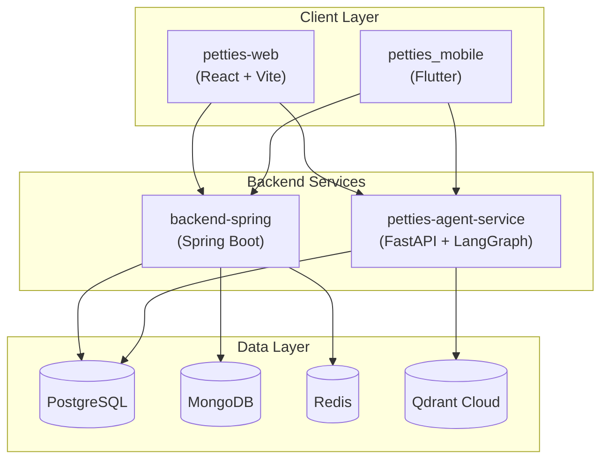
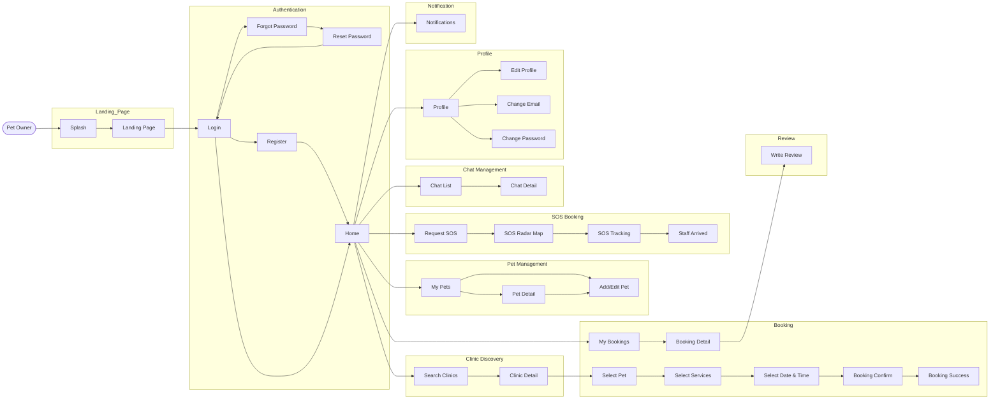
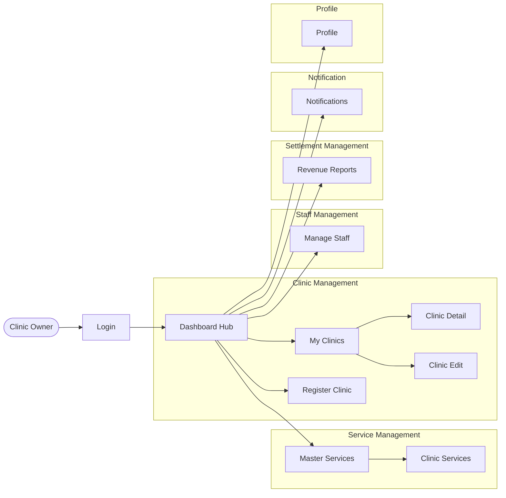
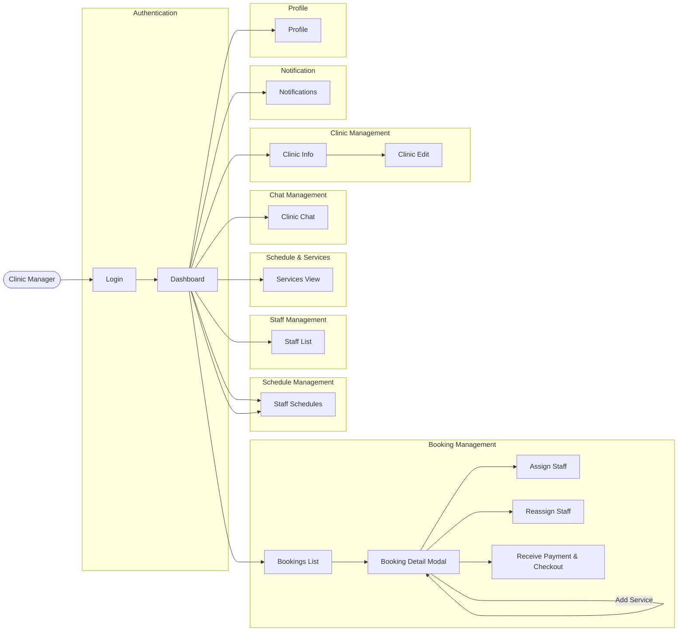
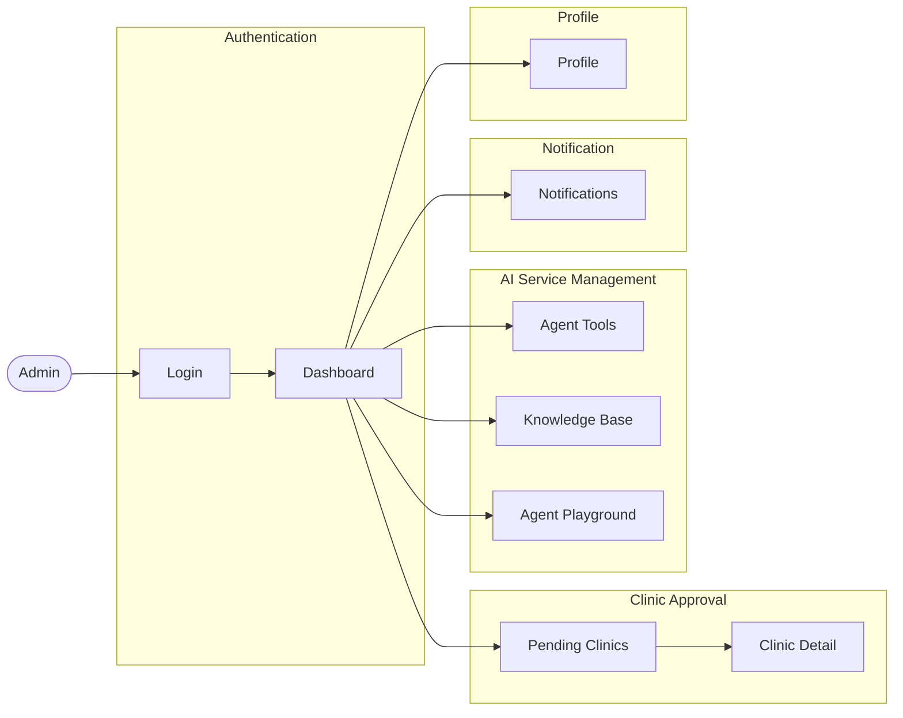
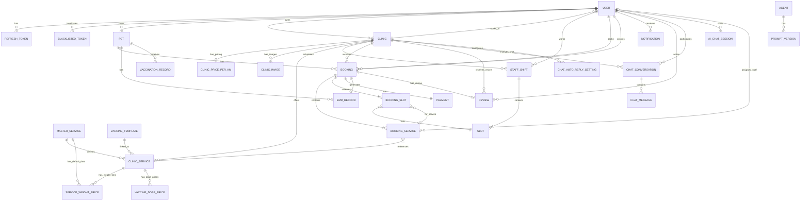

# PETTIES - Software Requirements Specification (SRS)


> Update note dated 2026-04-01: older SRS passages related to `analyze_pet_image`, Visual Case Memory from image feedback, or thumbs up/down should now be treated as historical context only. The active requirements for AI diagnosis are defined in [ai_diagnose_service/](D:/SEP490/petties/docs-references/ai_diagnose_service/) and [AI_SERVICE_TECHNICAL_SPECIFICATION.md](D:/SEP490/petties/docs-references/documentation/AI_SERVICE_TECHNICAL_SPECIFICATION.md).


**Project:** Petties - Veterinary Appointment Booking Platform

**Version:** 2.4.4 (Voucher functional requirement completion)
**Last Updated:** 2026-04-11
**Document Status:** In Progress


---


## Table of Contents


1. [Product Overview](#1-product-overview)

2. [User Requirements](#2-user-requirements)

    - [2.3 Use Case Implementation Status Reference](#23-use-case-implementation-status-reference)

3. [Functional Requirements (Screen Flow)](#3-functional-requirements)

    - [3.2 Authentication](#32-authentication)

    - [3.3 User Profile Management](#33-user-profile-management)

    - [3.4 Pet Profile Management](#34-pet-profile-management)

    - [3.5 Clinic Discovery Management](#35-clinic-discovery-management)

    - [3.6 Clinic Management](#36-clinic-management)

    - [3.7 Staff and Scheduling Management](#37-staff-and-scheduling-management)

    - [3.8 Booking Management](#38-booking-management)

    - [3.9 EMR & Vaccination Management](#39-emr--vaccination-management)

    - [3.10 SOS Booking](#310-sos-booking)

    - [3.11 AI Assistant](#311-ai-assistant)
    - [3.12 Report Management](#312-report-management)

    - [3.13 AI Subcriptions Management](#313-ai-subcriptions-management)

    - [3.21 Voucher Management](#321-voucher-management)

4. [Non-Functional Requirements](#5-non-functional-requirements)

5. [Requirement Appendix](#6-requirement-appendix)


---


## 1. PRODUCT OVERVIEW


### 1.1 Product Purpose


**Petties** là nền tảng kết nối chủ thú cưng (Pet Owner) với các phòng khám thú y (Veterinary Clinics). Hệ thống cho phép:


- 🐾 Chủ pet đặt lịch khám tại phòng khám hoặc tại nhà

- 🏥 Phòng khám quản lý dịch vụ, nhân viên, lịch làm việc

- 👨‍⚕️ Nhân viên quản lý ca làm, khám bệnh, ghi hồ sơ y tế

- 🤖 AI Chatbot hỗ trợ tư vấn chăm sóc thú cưng

- 📊 Admin quản lý toàn bộ nền tảng


### 1.2 Product Scope


| Aspect | Description |

|--------|-------------|

| **Platform** | Web (Admin, Clinic), Mobile (Pet Owner, Staff) |

| **Target Users** | Pet Owners, Veterinary Clinics, Staff, Admins |

| **Geography** | Vietnam (initial), Southeast Asia (future) |

| **Timeline** | 13 Sprints (10/12/2025 - 11/03/2026) |


### 1.3 Intended Audience


| Audience | Description |

|----------|-------------|

| Developers | Xây dựng và bảo trì hệ thống |

| QA/Testers | Kiểm tra chức năng và chất lượng |

| Product Owners | Theo dõi và ưu tiên requirements |

| Stakeholders | Đánh giá tính khả thi và business value |


### 1.4 Product Overview Diagram (Context Diagram)



```mermaid

flowchart TB

    PO["🐾 Pet Owner<br/>(Mobile)"]

    STAFF["👨‍⚕️ Staff<br/>(Mobile + Web)"]

    CM["👨‍💼 Clinic Manager<br/>(Web)"]

    CO["🏥 Clinic Owner<br/>(Web)"]

    ADMIN["🔧 Admin<br/>(Web)"]

    

    SYSTEM(("🐾 Petties<br/>System"))

    

    %% Pet Owner flows

    PO -->|"Register, Login, Profile Update"| SYSTEM

    PO -->|"Pet Profile (View EMR + Vaccination)"| SYSTEM

    PO -->|"Search Clinic, Create Booking"| SYSTEM

    PO -->|"Payment (Stripe)"| SYSTEM

    PO -->|"Review, AI Chat, Report Violation"| SYSTEM

    SYSTEM -->|"Booking Confirmation, Notifications"| PO

    SYSTEM -->|"Pet Profile (EMR + Vaccination Records)"| PO

    

    %% Staff flows

    STAFF -->|"Login, View Schedule"| SYSTEM

    STAFF -->|"View New Bookings"| SYSTEM

    STAFF -->|"Check-in, Create/Edit EMR"| SYSTEM

    STAFF -->|"Add/Edit Vaccination, Check-out"| SYSTEM

    SYSTEM -->|"Assigned Bookings, Schedules"| STAFF

    SYSTEM -->|"Pet Profile (EMR + Vaccination, READ-ONLY cross-clinic)"| STAFF

    

    %% Clinic Manager flows

    CM -->|"Add/Remove Staff"| SYSTEM

    CM -->|"Create Staff Schedule"| SYSTEM

    CM -->|"Assign Staff to Booking"| SYSTEM

    SYSTEM -->|"Staff List, Booking List/Pending Bookings"| CM

    SYSTEM -->|"Schedule Overview"| CM

    

    %% Clinic Owner flows

    CO -->|"Register Clinic"| SYSTEM

    CO -->|"Manage Master Services (Templates + Weight Tiers)"| SYSTEM

    CO -->|"Configure Clinic Services (Inherit or Custom)"| SYSTEM

    CO -->|"Add Clinic Manager"| SYSTEM

    SYSTEM -->|"Clinic Status, Revenue Report"| CO

    SYSTEM -->|"Dashboard Analytics"| CO

    

    %% Admin flows

    ADMIN -->|"Login, Approve/Reject Clinic"| SYSTEM

    ADMIN -->|"Configure AI Agents"| SYSTEM

    ADMIN -->|"Manage Knowledge Base, Process Reports"| SYSTEM

    SYSTEM -->|"Pending Clinics, Platform Stats"| ADMIN

    SYSTEM -->|"User Reports, Agent Status"| ADMIN

```


### 1.5 System Architecture Overview



```mermaid

graph TB

    subgraph "Client Layer"

        WEB["petties-web<br/>(React + Vite)"]

        MOBILE["petties_mobile<br/>(Flutter)"]

    end

    

    subgraph "Backend Services"

        SPRING["backend-spring<br/>(Spring Boot)"]

        AI["petties-agent-service<br/>(FastAPI + LangGraph)"]

    end

    

    subgraph "Data Layer"

        PG[(PostgreSQL)]

        MONGO[(MongoDB)]

        REDIS[(Redis)]

        QDRANT[(Qdrant Cloud)]

    end

    

    WEB --> SPRING

    WEB --> AI

    MOBILE --> SPRING

    MOBILE --> AI

    SPRING --> PG

    SPRING --> MONGO

    SPRING --> REDIS

    AI --> PG

    AI --> QDRANT

```


---


## 2. USER REQUIREMENTS


### 2.1 User Roles


| Role | Platform | Description |

|------|----------|-------------|

| **PET_OWNER** | Mobile only | Chủ thú cưng, đặt lịch khám, xem hồ sơ y tế |

| **STAFF** | Mobile + Web | Nhân viên phòng khám (Nhân viên, Groomer, Lễ tân). Có chuyên môn cụ thể (`specialty`). |

| **CLINIC_MANAGER** | Web only | Quản lý phòng khám, gán booking cho nhân viên |

| **CLINIC_OWNER** | Web only | Chủ phòng khám, quản lý dịch vụ, doanh thu |

| **ADMIN** | Web only | Admin nền tảng, duyệt phòng khám, quản lý AI |


### 2.2 Use Cases (Organized by Feature Module)

> Canonical naming lock: this section is the only approved function naming source for SRS and SDD. All names are kept exactly as approved.

#### 1. Authentication
- Sign up
- Login
- Login by Google
- Logout
- Forgot Password
- Reset Password

#### 2. Clinic Management
- Register Clinic
- View Clinic List
- Update Clinic
- View My Clinic Details
- View clinic pending list
- Approve/Reject Clinic
- Active/ Suspend Clinic
- View Clinic Dashboard

#### 3. User Profile Management
- View Profile
- Update Profile
- Change Password or change email

#### 4. Service Management
- Create Service
- Create Master Service
- Update Service
- Update Master Service
- Delete Service
- Delete Master Service
- View All Service
- View All Master Service
- View Detail Service
- View Detail Master Service
- Inheritance Master Service For Clinics

#### 5. Clinic Discovery Management
- View Clinic On Map
- Search clinics
- View Service List
- View Clinic Details

#### 6. SOS Booking
- Start SOS Matching
- Receive SOS alert
- Track Staff location
- Cancel SOS Matching
- Checkout with Custom Fee

#### 7. Booking Management
- Book an appointment
- Book on behalf
- View Appointment Details
- View My Appointment Status
- Cancel booking
- Reassign Staff
- Assign Staff to Booking
- Update Booking Progress
- Add Add-on Services
- Remove Add-on Services
- View New Bookings

#### 8. Patient Management
- View Patient History List
- View Patient Details

#### 9. Pet Profile Management
- View Pet Profile
- Create Pet Profile
- Edit Pet Profile
- Delete Pet Profile

#### 10. EMR & Vaccination Management
- View Pet’s Medical Record
- Update Pet’s Medical Record
- Create Pet’s Medical Record
- View Pet’s Vaccination Record
- Update Pet’s Vaccination Record
- Create Pet’s Vaccination Record
- Receive Medication Reminders

#### 11. Staff and Scheduling Management
- View Staff Dashboard
- Invite Staff by Email
- View List of Staffs
- View Own Work Schedule
- Create Staff Shift
- View Staff Shift
- Delete Staff Shift

#### 12. Chat Management
- Create Conversation
- View All Coversation
- Send Message
- View Chat History
- Create Auto Reply
- Update Auto Reply Message

#### 13. Booking Review Management
- Create Review
- Delete Review
- Update Review
- View Clinic Review

#### 14. Notification Management
- Update Notification
- View Notification
- Create Notification
- Delete Notification

#### 15. Settlement Management
- View clinic revenue and withdrawable balance
- Submit withdraw request
- Approve/Reject withdraw request
- View list withdraw request
- Process withdrawal transfer

#### 16. Payment Management
- Create QR payment
- View QR payment status verification
- View booking payment details
- View payment transaction history

#### 17. System Management
- View Platform Statistics

#### 18. Report Management
- Create Report
- View My Report
- Delete Report
- Update Report
- View All Report
- Approve/ Reject Report

#### 19. AI Assistant
- Interact with ChatBot
- Config Agent Parameter
- Test Agent Playground
- Turn On/Off Agent Tools
- Upload Document To Knowledge Base
- Delete Document from Knowledge Base
- View Case Memory
- Delete Case Memory
- Use AI-Assisted Clinic Setup, Operation
- Use Summarize patient info & EMR
- Use Summarize pet's EMR
- View aggregate feedback stats
- Provide AI's Response Feedback
- Use AI Diagnostic Support

#### 20. AI Subcriptions Management
- Create subscription information
- Edit subscription information
- View subscription information
- View subscriber badge
- View my subscriber details

#### 21. Voucher Management
- Create Voucher
- Edit Voucher
- Delete Voucher
- Applied Voucher For Clinic
- Use Voucher

---

### 2.3 Use Case Implementation Status Reference

> Status tracking is maintained by canonical function names only. Deprecated aliases are not allowed.

| Module | Status tracking key |
|---|---|
| 1-21 | Use exact function names from section 2.2 |

---

### 2.4 Cross-Reference: Canonical Feature Mapping to SDD

| Feature Module | Canonical Source in SRS | Primary SDD Section |
|---|---|---|
| 1. Authentication | 2.2 + 3.2 | 4.1 |
| 2. Clinic Management | 2.2 + 3.6 | 4.10 |
| 3. User Profile Management | 2.2 + 3.3 | 4.2 |
| 4. Service Management | 2.2 + 3.6 | 4.7 |
| 5. Clinic Discovery Management | 2.2 + 3.5 | 4.14 |
| 6. SOS Booking | 2.2 + 3.10 | 4.11, 4.13 |
| 7. Booking Management | 2.2 + 3.8 | 4.12 |
| 8. Patient Management | 2.2 + 3.9 | 4.5 |
| 9. Pet Profile Management | 2.2 + 3.4 | 4.4 |
| 10. EMR & Vaccination Management | 2.2 + 3.9 | 4.6 |
| 11. Staff and Scheduling Management | 2.2 + 3.7 | 4.3 |
| 12. Chat Management | 2.2 | 4.8 |
| 13. Booking Review Management | 2.2 | 4.9 |
| 14. Notification Management | 2.2 | 4.15 |
| 15. Settlement Management | 2.2 | 4.16 |
| 16. Payment Management | 2.2 | 4.16 |
| 17. System Management | 2.2 | 4.17 |
| 18. Report Management | 2.2 + 3.12 | 4.18 |
| 19. AI Assistant | 2.2 + 3.11 | 4.19, 4.21, 4.22, 4.23, 4.25 |
| 20. AI Subcriptions Management | 2.2 + 3.13 | 3.1.9, 4.16 |
| 21. Voucher Management | 2.2 + 3.21 | 3.1.9, 4.16 |

---

### 2.4.1 Canonical Function-Level Traceability (SRS <-> SDD)

| # | Feature | Function (exact canonical name) | SRS Reference | SDD Reference |
|---|---|---|---|---|
| 1 | Authentication | Sign up | 3.2 | 4.1 |
| 2 | Authentication | Login | 3.2 | 4.1 |
| 3 | Authentication | Login by Google | 3.2 | 4.1 |
| 4 | Authentication | Logout | 3.2 | 4.1 |
| 5 | Authentication | Forgot Password | 3.2 | 4.1 |
| 6 | Authentication | Reset Password | 3.2 | 4.1 |
| 7 | Clinic Management | Register Clinic | 3.6 | 4.10 |
| 8 | Clinic Management | View Clinic List | 3.6 | 4.10 |
| 9 | Clinic Management | Update Clinic | 3.6 | 4.10 |
| 10 | Clinic Management | View My Clinic Details | 3.6 | 4.10 |
| 11 | Clinic Management | View clinic pending list | 3.6 | 4.10 |
| 12 | Clinic Management | Approve/Reject Clinic | 3.6 | 4.10 |
| 13 | Clinic Management | Active/ Suspend Clinic | 3.6 | 4.10 |
| 14 | Clinic Management | View Clinic Dashboard | 3.6 | 4.10 |
| 15 | User Profile Management | View Profile | 3.3 | 4.2 |
| 16 | User Profile Management | Update Profile | 3.3 | 4.2 |
| 17 | User Profile Management | Change Password or change email | 3.3 | 4.2 |
| 18 | Service Management | Create Service | 3.6 | 4.7 |
| 19 | Service Management | Create Master Service | 3.6 | 4.7 |
| 20 | Service Management | Update Service | 3.6 | 4.7 |
| 21 | Service Management | Update Master Service | 3.6 | 4.7 |
| 22 | Service Management | Delete Service | 3.6 | 4.7 |
| 23 | Service Management | Delete Master Service | 3.6 | 4.7 |
| 24 | Service Management | View All Service | 3.6 | 4.7 |
| 25 | Service Management | View All Master Service | 3.6 | 4.7 |
| 26 | Service Management | View Detail Service | 3.6 | 4.7 |
| 27 | Service Management | View Detail Master Service | 3.6 | 4.7 |
| 28 | Service Management | Inheritance Master Service For Clinics | 3.6 | 4.7 |
| 29 | Clinic Discovery Management | View Clinic On Map | 3.5 | 4.14 |
| 30 | Clinic Discovery Management | Search clinics | 3.5 | 4.14 |
| 31 | Clinic Discovery Management | View Service List | 3.5 | 4.14 |
| 32 | Clinic Discovery Management | View Clinic Details | 3.5 | 4.14 |
| 33 | SOS Booking | Start SOS Matching | 3.10 | 4.11, 4.13 |
| 34 | SOS Booking | Receive SOS alert | 3.10 | 4.11, 4.13 |
| 35 | SOS Booking | Track Staff location | 3.10 | 4.11, 4.13 |
| 36 | SOS Booking | Cancel SOS Matching | 3.10 | 4.11, 4.13 |
| 37 | SOS Booking | Checkout with Custom Fee | 3.10 | 4.11, 4.13 |
| 38 | Booking Management | Book an appointment | 3.8 | 4.12 |
| 39 | Booking Management | Book on behalf | 3.8 | 4.12 |
| 40 | Booking Management | View Appointment Details | 3.8 | 4.12 |
| 41 | Booking Management | View My Appointment Status | 3.8 | 4.12 |
| 42 | Booking Management | Cancel booking | 3.8 | 4.12 |
| 43 | Booking Management | Reassign Staff | 3.8 | 4.12 |
| 44 | Booking Management | Assign Staff to Booking | 3.8 | 4.12 |
| 45 | Booking Management | Update Booking Progress | 3.8 | 4.12 |
| 46 | Booking Management | Add Add-on Services | 3.8 | 4.12 |
| 47 | Booking Management | Remove Add-on Services | 3.8 | 4.12 |
| 48 | Booking Management | View New Bookings | 3.8 | 4.12 |
| 49 | Patient Management | View Patient History List | 3.9 | 4.5 |
| 50 | Patient Management | View Patient Details | 3.9 | 4.5 |
| 51 | Pet Profile Management | View Pet Profile | 3.4 | 4.4 |
| 52 | Pet Profile Management | Create Pet Profile | 3.4 | 4.4 |
| 53 | Pet Profile Management | Edit Pet Profile | 3.4 | 4.4 |
| 54 | Pet Profile Management | Delete Pet Profile | 3.4 | 4.4 |
| 55 | EMR & Vaccination Management | View Pet’s Medical Record | 3.9 | 4.6 |
| 56 | EMR & Vaccination Management | Update Pet’s Medical Record | 3.9 | 4.6 |
| 57 | EMR & Vaccination Management | Create Pet’s Medical Record | 3.9 | 4.6 |
| 58 | EMR & Vaccination Management | View Pet’s Vaccination Record | 3.9 | 4.6 |
| 59 | EMR & Vaccination Management | Update Pet’s Vaccination Record | 3.9 | 4.6 |
| 60 | EMR & Vaccination Management | Create Pet’s Vaccination Record | 3.9 | 4.6 |
| 61 | EMR & Vaccination Management | Receive Medication Reminders | 3.9 | 4.6 |
| 62 | Staff and Scheduling Management | View Staff Dashboard | 3.7 | 4.3 |
| 63 | Staff and Scheduling Management | Invite Staff by Email | 3.7 | 4.3 |
| 64 | Staff and Scheduling Management | View List of Staffs | 3.7 | 4.3 |
| 65 | Staff and Scheduling Management | View Own Work Schedule | 3.7 | 4.3 |
| 66 | Staff and Scheduling Management | Create Staff Shift | 3.7 | 4.3 |
| 67 | Staff and Scheduling Management | View Staff Shift | 3.7 | 4.3 |
| 68 | Staff and Scheduling Management | Delete Staff Shift | 3.7 | 4.3 |
| 69 | Chat Management | Create Conversation | 3.1 / 4.2 | 4.8 |
| 70 | Chat Management | View All Coversation | 3.1 / 4.2 | 4.8 |
| 71 | Chat Management | Send Message | 3.1 / 4.2 | 4.8 |
| 72 | Chat Management | View Chat History | 3.1 / 4.2 | 4.8 |
| 73 | Chat Management | Create Auto Reply | 3.1 / 4.2 | 4.8 |
| 74 | Chat Management | Update Auto Reply Message | 3.1 / 4.2 | 4.8 |
| 75 | Booking Review Management | Create Review | 3.12 | 4.9 |
| 76 | Booking Review Management | Delete Review | 3.12 | 4.9 |
| 77 | Booking Review Management | Update Review | 3.12 | 4.9 |
| 78 | Booking Review Management | View Clinic Review | 3.12 | 4.9 |
| 79 | Notification Management | Update Notification | 3.1 / 4.2 | 4.15 |
| 80 | Notification Management | View Notification | 3.1 / 4.2 | 4.15 |
| 81 | Notification Management | Create Notification | 3.1 / 4.2 | 4.15 |
| 82 | Notification Management | Delete Notification | 3.1 / 4.2 | 4.15 |
| 83 | Settlement Management | View clinic revenue and withdrawable balance | 3.1 / 3.12 | 4.16 |
| 84 | Settlement Management | Submit withdraw request | 3.1 / 3.12 | 4.16 |
| 85 | Settlement Management | Approve/Reject withdraw request | 3.1 / 3.12 | 4.16 |
| 86 | Settlement Management | View list withdraw request | 3.1 / 3.12 | 4.16 |
| 87 | Settlement Management | Process withdrawal transfer | 3.1 / 3.12 | 4.16 |
| 88 | Payment Management | Create QR payment | 3.8 | 4.16 |
| 89 | Payment Management | View QR payment status verification | 3.8 | 4.16 |
| 90 | Payment Management | View booking payment details | 3.8 | 4.16 |
| 91 | Payment Management | View payment transaction history | 3.8 | 4.16 |
| 92 | System Management | View Platform Statistics | 3.12 | 4.17 |
| 93 | Report Management | Create Report | 3.12 | 4.18 |
| 94 | Report Management | View My Report | 3.12 | 4.18 |
| 95 | Report Management | Delete Report | 3.12 | 4.18 |
| 96 | Report Management | Update Report | 3.12 | 4.18 |
| 97 | Report Management | View All Report | 3.12 | 4.18 |
| 98 | Report Management | Approve/ Reject Report | 3.12 | 4.18 |
| 99 | AI Assistant | Interact with ChatBot | 3.11 | 4.19, 4.21, 4.22, 4.23, 4.25 |
| 100 | AI Assistant | Config Agent Parameter | 3.11 | 4.19, 4.21, 4.22, 4.23, 4.25 |
| 101 | AI Assistant | Test Agent Playground | 3.11 | 4.19, 4.21, 4.22, 4.23, 4.25 |
| 102 | AI Assistant | Turn On/Off Agent Tools | 3.11 | 4.19, 4.21, 4.22, 4.23, 4.25 |
| 103 | AI Assistant | Upload Document To Knowledge Base | 3.11 | 4.19, 4.21, 4.22, 4.23, 4.25 |
| 104 | AI Assistant | Delete Document from Knowledge Base | 3.11 | 4.19, 4.21, 4.22, 4.23, 4.25 |
| 105 | AI Assistant | View Case Memory | 3.11 | 4.19, 4.21, 4.22, 4.23, 4.25 |
| 106 | AI Assistant | Delete Case Memory | 3.11 | 4.19, 4.21, 4.22, 4.23, 4.25 |
| 107 | AI Assistant | Use AI-Assisted Clinic Setup, Operation | 3.11 | 4.19, 4.21, 4.22, 4.23, 4.25 |
| 108 | AI Assistant | Use Summarize patient info & EMR | 3.11 | 4.19, 4.21, 4.22, 4.23, 4.25 |
| 109 | AI Assistant | Use Summarize pet's EMR | 3.11 | 4.19, 4.21, 4.22, 4.23, 4.25 |
| 110 | AI Assistant | View aggregate feedback stats | 3.11 | 4.19, 4.21, 4.22, 4.23, 4.25 |
| 111 | AI Assistant | Provide AI's Response Feedback | 3.11 | 4.19, 4.21, 4.22, 4.23, 4.25 |
| 112 | AI Assistant | Use AI Diagnostic Support | 3.11 | 4.19, 4.21, 4.22, 4.23, 4.25 |
| 113 | AI Subcriptions Management | Create subscription information | 3.13 | 3.1.9, 4.16 |
| 114 | AI Subcriptions Management | Edit subscription information | 3.13 | 3.1.9, 4.16 |
| 115 | AI Subcriptions Management | View subscription information | 3.13 | 3.1.9, 4.16 |
| 116 | AI Subcriptions Management | View subscriber badge | 3.13 | 3.1.9, 4.16 |
| 117 | AI Subcriptions Management | View my subscriber details | 3.13 | 3.1.9, 4.16 |
| 118 | Voucher Management | Create Voucher | 3.21 | 3.1.9, 4.16 |
| 119 | Voucher Management | Edit Voucher | 3.21 | 3.1.9, 4.16 |
| 120 | Voucher Management | Delete Voucher | 3.21 | 3.1.9, 4.16 |
| 121 | Voucher Management | Applied Voucher For Clinic | 3.21 | 3.1.9, 4.16 |
| 122 | Voucher Management | Use Voucher | 3.21 | 3.1.9, 4.16 |

---

### 2.5 Canonical Naming Enforcement Rule

- Only names listed in section 2.2 are valid function names.
- Any synonym, alias, or renamed phrase outside section 2.2 is invalid and must be removed from SRS/SDD catalogs.
- SRS and SDD must keep one-to-one naming consistency using exact function text.

---


## 3. FUNCTIONAL REQUIREMENTS


### 3.1 System Functional Overview


#### 3.1.1 Screens Flow


---


##### 3.1.1.1 Mobile App - Pet Owner Flow (24 screens)



```mermaid

flowchart LR

    PO([Pet Owner]) --> Splash


    subgraph Landing_Page

        Splash --> LandingPage[Landing Page]

    end


    subgraph Authentication

        LandingPage --> Login

        Login --> Register

        Login --> ForgotPassword[Forgot Password]

        ForgotPassword --> ResetPassword[Reset Password]

        ResetPassword --> Login

        Register --> Home

        Login --> Home

    end


    subgraph Pet_Management[Pet Management]

        Home --> MyPets[My Pets]

        MyPets --> PetDetail[Pet Detail]

        MyPets --> AddEditPet[Add/Edit Pet]

        PetDetail --> AddEditPet

    end


    subgraph Clinic_Discovery[Clinic Discovery]

        Home --> SearchClinics[Search Clinics]

        SearchClinics --> ClinicDetail[Clinic Detail]

    end


    subgraph Booking

        ClinicDetail --> SelectPet[Select Pet]

        SelectPet --> SelectServices[Select Services]

        SelectServices --> SelectDateTime[Select Date & Time]

        SelectDateTime --> BookingConfirm[Booking Confirm]

        BookingConfirm --> BookingSuccess[Booking Success]

        Home --> MyBookings[My Bookings]

        MyBookings --> BookingDetail[Booking Detail]

    end


    subgraph SOS_Booking[SOS Booking]

        Home --> SOSRequest[Request SOS]

        SOSRequest --> SOSRadar[SOS Radar Map]

        SOSRadar --> SOSTracking[SOS Tracking]

        SOSTracking --> SOSArrived[Staff Arrived]

    end

    subgraph Review

        BookingDetail --> WriteReview[Write Review]

    end


    subgraph Chat_Management[Chat Management]

        Home --> ChatList[Chat List]

        ChatList --> ChatDetail[Chat Detail]

    end


    subgraph Profile

        Home --> ProfileScreen[Profile]

        ProfileScreen --> EditProfile[Edit Profile]

        ProfileScreen --> ChangeEmail[Change Email]

        ProfileScreen --> ChangePassword[Change Password]

    end


    subgraph Notification

        Home --> Notifications

    end

```


---


##### 3.1.1.2 Mobile App - Staff Flow (16 screens)


```mermaid

flowchart LR

    STAFF([Staff]) --> Login


    subgraph Authentication

        Login --> StaffHome[Staff Home]

    end


    subgraph Schedule

        StaffHome --> MySchedule[My Schedule]

    end


    subgraph Booking_Management[Booking Management]

        StaffHome --> AssignedBookings[Assigned Bookings]

        AssignedBookings --> BookingDetail[Booking Detail]

        BookingDetail -- "Check-In" --> BookingDetail

        BookingDetail -- "Add Service" --> AddService[Add Service Screen]

        AddService --> BookingDetail

        BookingDetail -- "Complete" --> BookingDetail

    end


    subgraph Patient_Management[Patient Management]

        StaffHome --> PatientsList[Patients List]

        PatientsList --> PatientDetails[Patient Details]

        BookingDetail -- "View Patient" --> PatientDetails

        PatientDetails --> ViewHistory[View History]

        PatientDetails --> CreateEMR[Create EMR]

        PatientDetails --> AddVaccination[Add Vaccination]

        PatientDetails --> BookingDetail

    end


    subgraph Notification

        StaffHome --> Notifications

    end


    subgraph Profile

        StaffHome --> ProfileScreen[Profile]

    end

```


---


##### 3.1.1.3 Web App - Staff Flow (9 screens)


```mermaid

flowchart LR

    STAFF([Staff]) --> Login


    subgraph Authentication

        Login --> StaffHome[Staff Home]

    end


    subgraph Booking_Management[Booking Management]

        StaffHome --> BookingsList[Bookings List]

        BookingsList --> BookingDetail[Booking Detail]

        BookingDetail -- "Check-In" --> BookingDetail

        BookingDetail -- "Add Service" --> BookingDetail

        BookingDetail -- "Complete" --> BookingDetail

    end


    subgraph Patient_Management[Patient Management]

        StaffHome --> PatientList[Patient List]

        PatientList --> PatientDetails[Patient Details]

        BookingDetail -- "View Patient" --> PatientDetails

        PatientDetails --> ViewHistory[View History]

        PatientDetails --> CreateEMR[Create EMR]

        PatientDetails --> AddVaccination[Add Vaccination]

        PatientDetails --> BookingDetail

    end


    subgraph General

        StaffHome --> ProfileScreen[Profile]

        StaffHome --> MySchedule[My Schedule]

    end

```


---


##### 3.1.1.4 Web App - Clinic Owner Flow (14 screens)



```mermaid

flowchart LR

    CO([Clinic Owner]) --> Login

    Login --> DashboardHub[Dashboard Hub]


    subgraph Clinic_Management[Clinic Management]

        DashboardHub --> MyClinics[My Clinics]

        MyClinics --> ClinicDetail[Clinic Detail]

        MyClinics --> ClinicEdit[Clinic Edit]

        DashboardHub --> RegisterClinic[Register Clinic]

    end


    subgraph Service_Management[Service Management]

        DashboardHub --> MasterServices[Master Services]

        MasterServices --> ClinicServices[Clinic Services]

    end


    subgraph Staff_Management[Staff Management]

        DashboardHub --> ManageStaff[Manage Staff]

    end


    subgraph Settlement_Management[Settlement Management]

        DashboardHub --> RevenueReports[Revenue Reports]

    end


    subgraph Notification

        DashboardHub --> Notifications

    end


    subgraph Profile

        DashboardHub --> ProfileScreen[Profile]

    end

```


---


##### 3.1.1.5 Web App - Clinic Manager Flow (13 screens)



```mermaid

flowchart LR

    CM([Clinic Manager]) --> Login


    subgraph Authentication

        Login --> Dashboard

    end


    subgraph Schedule_Management[Schedule Management]

        Dashboard --> StaffSchedules[Staff Schedules]

    end


    subgraph Booking_Management[Booking Management]

        Dashboard --> BookingsList[Bookings List]

        BookingsList --> BookingDetailModal[Booking Detail Modal]

        BookingDetailModal --> AssignStaff[Assign Staff]

        BookingDetailModal --> ReassignStaff[Reassign Staff]

        BookingDetailModal -- "Add Service" --> BookingDetailModal

        BookingDetailModal --> PaymentCheckout[Receive Payment & Checkout]

    end


    subgraph Staff_Management[Staff Management]

        Dashboard --> StaffList[Staff List]

    end


    subgraph Schedule_And_Service[Schedule & Services]

        Dashboard --> StaffSchedules[Staff Schedules]

        Dashboard --> ServicesView[Services View]

    end


    subgraph Chat_Management_Web[Chat Management]

        Dashboard --> ManagerChat[Clinic Chat]

    end


    subgraph Clinic_Management[Clinic Management]

        Dashboard --> ClinicInfo[Clinic Info]

        ClinicInfo --> ClinicEdit[Clinic Edit]

    end


    subgraph Notification

        Dashboard --> Notifications

    end


    subgraph Profile

        Dashboard --> ProfileScreen[Profile]

    end

```


---


##### 3.1.1.6 Web App - Admin Flow (12 screens)



```mermaid

flowchart LR

    ADMIN([Admin]) --> Login


    subgraph Authentication

        Login --> Dashboard

    end


    subgraph Clinic_Approval[Clinic Approval]

        Dashboard --> PendingClinics[Pending Clinics]

        PendingClinics --> ClinicDetail[Clinic Detail]

    end


    subgraph AI_Service_Management[AI Service Management]

        Dashboard --> AgentTools[Agent Tools]

        Dashboard --> KnowledgeBase[Knowledge Base]

        Dashboard --> AgentPlayground[Agent Playground]

    end


    subgraph Notification

        Dashboard --> Notifications

    end


    subgraph Profile

        Dashboard --> ProfileScreen[Profile]

    end

```


#### 3.1.2 Screen Descriptions


> **Organized by Module/Feature** - Detailed descriptions of 80 screens grouped by functionality.

>

> **Format:** Table per Module showing ID, Screen Name, Platform/Role, and Description.


---


##### 3.1.2.1 Authentication Screens (#1-11)


| # | Module | Screen Name | Platform/Role | Description |

|:---:|:---|:---|:---|:---|

| 1 | Authentication | Splash | Mobile/Pet Owner | Logo animation and auto-redirect to login or home |

| 2 | Authentication | Landing Page | Mobile/Pet Owner | 3 slides (Booking, AI, Health records). Skip and Continue/Start buttons |

| 3 | Auth | Login | Mobile/PO, Staff | Username + Password, Forgot Password link. Google Sign-in (TBI) |

| 4 | Auth | Register | Mobile/PO | 2-step flow: Form (User, Email, Password, Full Name, Phone) → OTP verification |

| 5 | Auth | Forgot Password | Mobile/PO | Enter email → Send OTP → Navigate to Reset Password |

| 6 | Auth | Reset Password | Mobile/PO | Enter OTP 6 digits + New Password to reset password |

| 7 | Auth | Login | Web/Staff, Admin | Shared login portal. Auto-redirect based on role. Blocks PET_OWNER |

| 8 | Auth | Register | Web/Clinic Owner | 2-step OTP registration for Clinic Owner accounts |

| 9 | Auth | Forgot Password | Web | Enter email to receive OTP for password reset |

| 10 | Auth | Reset Password | Web | Enter OTP + New Password to reset password |

| 11 | Auth | Landing Page | Web/Landing | Landing page with feature showcase for visitors |


##### 3.1.2.2 Home & Dashboard Module (#12-18)


| # | Screen Name | Platform/Role | Description |

|:---:|:---|:---|:---|

| 12 | Home | Mobile/PO | Welcome card, Pet stats, Quick actions, Preview pets, Bottom nav |

| 13 | Staff Home | Mobile/Staff | Welcome card, Today stats, Today schedule, Pending bookings |

| 14 | Staff Home | Web/Staff | Shift overview, pending examinations (Placeholder) |

| 15 | Dashboard Hub | Web/Clinic Owner | Today stats (Revenue, Bookings), Clinic info, Monthly revenue |

| 16 | Dashboard | Web/Manager | Today overview, Pending actions (Unassigned, Refunds), Recent table |

| 17 | Dashboard | Web/Admin | Service Health check (AI, Spring), Platform stats, Quick links |


##### 3.1.2.3 Pet Management & Clinic Discovery (#18-22)


| # | Module | Screen Name | Platform/Role | Description |

|:---:|:---|:---|:---|:---|

| 18 | Pet Mgt | My Pets | Mobile/PO | ListView with pet cards, Add (+) button, Empty state |

| 19 | Pet Mgt | Pet Detail | Mobile/PO | Header image, Info card. Actions: Edit, Delete |

| 20 | Pet Mgt | Add/Edit Pet | Mobile/PO | Form to add/edit pet info (image, name, species, breed, dob, weight) |

| 21 | Discovery | Search Clinics | Mobile/PO | Map view, GPS-based search, filters, ratings |

| 22 | Discovery | Clinic Detail | Mobile/PO | Gallery, info, services, reviews, Book button |


##### 3.1.2.4 Clinic & Service Management (#23-30)


| # | Module | Screen Name | Platform/Role | Description |

|:---:|:---|:---|:---|:---|

| 23 | Clinic Mgt | Register Clinic | Web/Owner | 2-step: ClinicForm → Image Upload after creation |

| 24 | Clinic Mgt | My Clinics | Web/Owner | Header with Create, Filters (status, name), ClinicList |

| 25 | Clinic Mgt | Clinic Detail | Web/Owner | Clinic details (info, images, legal documents) |

| 26 | Clinic Mgt | Clinic Edit | Web/Owner | Form to edit clinic info, gallery management |

| 27 | Clinic Mgt | Pending Clinics | Web/Admin | Table of pending clinics, Actions: View/Approve/Reject |

| 28 | Clinic Mgt | Clinic Detail | Web/Admin | Background check, legal verification for approval |

| 29 | Service Mgt | Master Services | Web/Owner | Manage service templates for all branches under this owner |

| 30 | Service Mgt | Clinic Services | Web/Owner | Configure specific pricing and status per clinic branch |


##### 3.1.2.5 Staff, Booking & Clinical Workspace (#31-49)


| # | Module | Screen Name | Platform/Role | Description |

|:---:|:---|:---|:---|:---|

| 31 | Staff Mgt | Manage Staff | Web/Owner | Clinic dropdown, StaffTable, QuickAddStaffModal (STAFF/MANAGER) |

| 32 | Staff Mgt | Staff List | Web/Manager | Manage branch vets directory, quick add tools |

| 33 | Booking | Booking Wizard | Mobile/PO | Multi-step flow: Select pet, services, date/time, confirm, success |

| 34 | Booking | My Bookings | Mobile/PO | Appointment list with tabs and support for direct/proxy bookings |

| 35 | Booking | Booking Detail | Mobile/PO | Booking detail, cancel/rebook actions, SOS tracking entry point |

| 36 | Booking | Assigned Bookings | Mobile/Staff | Staff worklist with status filters and booking detail access |

| 37 | Booking | Booking Detail | Mobile/Staff | Appointment details, owner contact, execution actions, add-on actions |

| 38 | Booking | Add Service | Mobile/Staff | Dedicated screen for selecting add-on services from booking detail |

| 39 | Booking | Bookings List | Web/Staff | Assigned bookings with filters, detail panel, add-on actions |

| 40 | Booking | Booking Detail | Web/Staff | Detail panel for assigned booking execution and add-on removal |

| 41 | Booking | Booking Management Dashboard | Web/Manager | Branch booking oversight with filters and pending actions |

| 42 | Booking | Booking Detail Modal | Web/Manager | Booking detail modal for confirm, add service, cancel, checkout |

| 43 | Booking | Reassign Staff Modal | Web/Manager | Reassign one booking service item to another staff member |

| 44 | Clinical | Booking Detail | Mobile/Staff | Active-care view with check-in, start-moving, arrived, checkout |

| 45 | Clinical | Create EMR | Mobile/Staff | Clinical notes (SOAP format), prescription entry |

| 46 | Clinical | Checkout Action | Web/Manager | Receive payment and finalize booking from booking detail modal |

| 47 | Clinical | Add Vaccination | Mobile/Staff | Record new immunization entries |

| 48 | Clinical | Examination Workspace | Web/Staff | Booking detail plus EMR/vaccination access from clinical workflow |


##### 3.1.2.6 Patient & Schedule Management (#50-58)


| # | Module | Screen Name | Platform/Role | Description |

|:---:|:---|:---|:---|:---|

| 50 | Patient Mgt | Pet History | Mobile/Staff | Comprehensive view of medical history, vaccines |

| 51 | Patient Mgt | Patients List | Mobile/Staff | Directory of patients treated at clinic |

| 52 | Patient Mgt | Patient List | Web/Staff | Directory of patients treated at clinic |

| 53 | Patient Mgt | Patient History | Web/Staff | Detailed medical records, vaccine view |

| 54 | Patient Mgt | Patient List | Web/Manager | Patient directory with immunization alerts |

| 55 | Patient Mgt | Patient Detail | Web/Manager | Detailed clinical records view (read-only) |

| 56 | Schedule | My Schedule | Mobile/Staff | Personal calendar (Month/Week/Day views) |

| 57 | Schedule | My Schedule | Web/Staff | Desktop-optimized personal calendar |

| 58 | Schedule | Staff Schedules | Web/Manager | Roster management, shift allocation |


##### 3.1.2.7 Other Core Modules (#59-80)


| # | Module | Screen Name | Platform/Role | Description |

|:---:|:---|:---|:---|:---|

| 59 | SOS Booking | Create SOS Request | Mobile/PO | Wizard to create SOS booking: address selection (Location Picker / GPS), pet selection, symptoms input. Includes cancel button and lat/lng coordinates. |

| 60 | SOS Booking | SOS Tracking | Mobile/PO | Real-time GPS map showing vet location, route, and ETA |

| 61 | SOS Booking | Start SOS Travel | Mobile/Staff | Emergency GPS toggle, route visual, geofence arrival confirmation |

| 62 | Chat Management | Chat List | Mobile/PO | Conversation list with clinics, unread counters, realtime updates |

| 63 | EMR & Vaccination Management | Pet EMR History | Mobile/PO | View pet's medical records timeline (SOAP notes, prescriptions) |

| 64 | EMR & Vaccination Management | Pet Vaccination History | Mobile/PO | View pet's vaccination records with next due dates and reminders |

| 65 | Notification Management | Notifications | Mobile/PO, Staff | In-app notification center for users and staff |

| 66 | Notification Management | Notifications | Web/All Staff | Centralized operational and system alerts |

| 67 | User Profile Management | Profile | Mobile/PO, Staff | Avatar, Info, Actions (Edit, Email, Pass, Logout) |

| 68 | User Profile Management | Edit Profile | Mobile/PO, Staff | Form to edit personal info (name, phone, avatar) |

| 69 | User Profile Management | Change Email | Mobile/PO, Staff | Form to change email with OTP verification |

| 70 | User Profile Management | Change Pass | Mobile/PO, Staff | Form to change password (current + new) |

| 71 | User Profile Management | Profile | Web/Staff, Admin | Shared profile page. Account info and security |

| 72 | Booking Review Management | Write Review | Mobile/PO | 1-5 star rating and comment after booking COMPLETED |

| 73 | Settlement Management | Revenue Reports | Web/Owner, Manager | Financial statements, growth charts (Branch specific for Manager) |

| 74 | System Management | Users | Web/Admin | Centralized management of all user accounts |

| 75 | System Management | Statistics | Web/Admin | Specialized reports, data export tools |

| 76 | AI Assistant | Agent Tools | Web/Admin | Manage MCP tools for AI Agent |

| 77 | AI Assistant | Knowledge Base | Web/Admin | RAG config, upload docs, and document management |

| 78 | AI Assistant | Agent Playground | Web/Admin | Playground session list, prompt testing, trace review |

| 79 | Notification Management | Notifications | Web/Admin | Operational and system notifications |

| 80 | User Profile Management | Profile | Web/Admin | Account information and profile management |


#### 3.1.3 Screen Authorization


*Provide the system roles authorization to the system features (down to screens, and event to the screen activities if applicable) in the table form below.*


| Screen | GUEST | PET_OWNER | STAFF | CLINIC_OWNER | CLINIC_MANAGER | ADMIN |

|--------|:-----:|:---------:|:---:|:------------:|:--------------:|:-----:|

| **Authentication Module** | | | | | | |

| Landing Page (Web) | X | X | X | X | X | X |

|   → View features | X | X | X | X | X | X |

|   → Navigate to Login/Register | X | X | X | X | X | X |

| Login Screen (Mobile - PO) | X | | | | | |

|   → Enter email/password | X | | | | | |

|   → Google Sign-in | X | | | | | |

|   → Forgot Password link | X | | | | | |

| Login Screen (Mobile - Staff) | | | X | | | |

|   → Google Sign-in | | | X | | | |

| Login Screen (Web) | | | X | X | X | X |

|   → Google Sign-in (Staff) | | | X | X | X | X |

|   → Email/Password (Admin) | | | | | | X |

|   → Forgot Password link | | | | | | X |

| Register Screen | X | | | X | | |

|   → Fill registration form | X | | | X | | |

|   → Verify OTP | X | | | X | | |

| Forgot Password | X | | | | | |

|   → Enter email | X | | | | | |

|   → Verify OTP | X | | | | | |

|   → Set new password | X | | | | | |

| **Pet Owner Screens** | | | | | | |

| Home (Pet Owner) | | X | | | | |

|   → View quick stats | | X | | | | |

|   → Navigate to features | | X | | | | |

| My Pets | | X | | | | |

|   → View pet list | | X | | | | |

|   → Add new pet | | X | | | | |

|   → Edit pet | | X | | | | |

|   → Delete pet | | X | | | | |

| Pet Detail | | X | | | | |

|   → View pet info | | X | | | | |

|   → Upload photo | | X | | | | |

|   → View EMR history | | X | | | | |

|   → View vaccination | | X | | | | |

| Search Clinics | | X | | | | |

|   → Search by keyword | | X | | | | |

|   → Filter by distance | | X | | | | |

|   → View on map | | X | | | | |

| Clinic Detail | | X | | | | |

|   → View clinic info | | X | | | | |

|   → View services | | X | | | | |

|   → View reviews | | X | | | | |

|   → Book appointment | | X | | | | |

| Create Booking | | X | | | | |

|   → Select service | | X | | | | |

|   → Select pet | | X | | | | |

|   → Select slot | | X | | | | |

|   → Confirm booking | | X | | | | |

| My Bookings | | X | | | | |

|   → View upcoming | | X | | | | |

|   → View past | | X | | | | |

|   → Cancel booking | | X | | | | |

| AI Chat | | X | | | | |

|   → Send message | | X | | | | |

|   → View response | | X | | | | |

| Write Review | | X | | | | |

|   → Rate (1-5 stars) | | X | | | | |

|   → Write comment | | X | | | | |

| **Staff Screens** | | | | | | |

| Dashboard (Staff) | | | X | | | |

|   → View today stats | | | X | | | |

|   → View pending tasks | | | X | | | |

| My Schedule | | | X | | X | |

|   → View calendar | | | X | | X | |

|   → View shift details | | | X | | | |

| Assigned Bookings | | | X | | | |

|   → View booking list | | | X | | | |

|   → View booking details | | | X | | | |

| Check-in | | | X | | | |

|   → Confirm arrival | | | X | | | |

|   → Start examination | | | X | | | |

| Create EMR | | | X | | | |

|   → Fill SOAP form | | | X | | | |

|   → Add prescription | | | X | | | |

|   → Upload photos | | | X | | | |

| Check-out/Checkout | | | | | X | |

|   → Complete booking | | | | | X | |

|   → Collect cash payment/payment | | | | | X | |

| Patient History | | | X | | X | |

|   → View EMR records | | | X | | X | |

|   → View vaccination | | | X | | X | |

| **Clinic Manager Screens** | | | | | | |

| Manager Dashboard | | | | | X | |

|   → View clinic stats | | | | | X | |

|   → View pending tasks | | | | | X | |

| Staff List | | | | X | X | |

|   → View all staff | | | | X | X | |

|   → Add new staff | | | | X | X | |

|   → Remove staff | | | | X | X | |

| Staff Shift Calendar | | | | | X | |

|   → View all shifts | | | | | X | |

|   → Create shift | | | | | X | |

|   → Delete shift | | | | | X | |

| All Bookings | | | | | X | |

|   → View all bookings | | | | | X | |

|   → Assign vet | | | | | X | |

|   → Process refund | | | | | X | |

| **Clinic Owner Screens** | | | | | | |

| Owner Dashboard | | | | X | | |

|   → View revenue stats | | | | X | | |

|   → View clinic status | | | | X | | |

| Register Clinic | | | | X | | |

|   → Fill clinic info | | | | X | | |

|   → Upload images | | | | X | | |

|   → Submit for approval | | | | X | | |

| Clinic Info Edit | | | | X | | |

|   → Edit clinic details | | | | X | | |

|   → Manage gallery | | | | X | | |

| Service Management | | | | X | | |

|   → Add service | | | | X | | |

|   → Edit pricing | | | | X | | |

|   → Configure weight tiers | | | | X | | |

| Manager Assignment | | | | X | | |

|   → Assign manager | | | | X | | |

|   → Remove manager | | | | X | | |

| **Admin Screens** | | | | | | |

| Admin Dashboard | | | | | | X |

|   → View platform stats | | | | | | X |

|   → View pending items | | | | | | X |

| Pending Clinics | | | | | | X |

|   → View clinic list | | | | | | X |

|   → Approve clinic | | | | | | X |

|   → Reject clinic | | | | | | X |

| Master Services | | | | | | X |

|   → Add master service | | | | | | X |

|   → Edit service template | | | | | | X |

| User Reports | | | | | | X |

|   → View report queue | | | | | | X |

|   → Process report | | | | | | X |

|   → Warn/Suspend/Ban user | | | | | | X |

| AI Agent Config | | | | | | X |

|   → Configure agent | | | | | | X |

|   → Manage tools | | | | | | X |

| Knowledge Base | | | | | | X |

|   → Upload documents | | | | | | X |

|   → Delete documents | | | | | | X |

| **Shared Screens** | | | | | | |

| Profile | | X | X | X | X | X |

|   → View info | | X | X | X | X | X |

|   → Edit info | | X | X | X | X | X |

|   → Change password | | X | X | X | X | X |

| Notifications | | X | X | X | X | X |

|   → View list | | X | X | X | X | X |

|   → Mark as read | | X | X | X | X | X |


#### 3.1.4 Non-Screen Functions


*Provide the descriptions for the non-screen system functions, i.e batch/cron job, service, API, etc.*


| # | Feature | System Function | Description |

|---|---------|-----------------|-------------|

| 1 | Slot Generation | AutoSlotGenerationService | Auto-generate 30-minute slots from STAFF_SHIFT when Manager creates a work shift |

| 2 | Booking Expiration | BookingExpirationJob | Update status PENDING → EXPIRED/RELEASED after 15 minutes of non-payment (Slot reservation TTL) |

| 3 | Push Notification | FCMNotificationService | Send push notifications to mobile devices (booking updates, reminders) |

| 4 | Email Notification | EmailNotificationService | Send confirmation emails and appointment reminders |

| 5 | OTP Generation | OtpGenerationService | Generate 6-digit OTP codes, store in Redis with 5-minute TTL |

| 6 | JWT Token Refresh | TokenRefreshMiddleware | Auto-refresh access token before expiration |

| 7 | Token Blacklist | TokenBlacklistService | Add token to blacklist on logout or revocation |

| 8 | Distance Calculation | GeoDistanceService | Calculate distance from clinic to Home Visit address (Haversine formula) |

| 9 | Dynamic Pricing | PricingCalculationService | Calculate price: Base + Weight Tier + Distance Fee |

| 10 | Rating Aggregation | RatingAggregationService | Update rating_avg of Clinic/Staff after each review |

| 11 | AI Chatbot | AIChatbotService | Process messages via Single Agent + ReAct pattern |

| 12 | RAG Retrieval | RAGRetrievalService | Search Knowledge Base with vector similarity |

| 13 | Document Indexing | DocumentIndexingBatch | Chunking and embedding documents on upload |

| 14 | Vaccination Reminder | VaccinationReminderJob | Send vaccination reminders before due date (daily 8:00 AM) |

| 15 | GPS Location Update | GPSLocationWebSocket | Real-time update of Staff location during SOS Booking (SOS only, not Home Visit) |

| 16 | Slot Availability Check | SlotReservationService | Check and reserve slot when creating booking |

| 17 | Payment Webhook | StripeWebhookHandler | Receive callback from Stripe after payment [Planned] |

| 18 | Image Upload | CloudinaryUploadService | Upload and optimize images (avatar, pet, clinic) |

| 19 | Token Cleanup | TokenCleanupJob | Daily cron to delete expired refresh tokens and blacklisted tokens |

| 20 | No-Show Detection | NoShowDetectionJob | Mark booking as NO_SHOW if not checked-in after 30 minutes |

| 21 | EMR Locking | EMRLockingJob | Hourly job to LOCK EMRs after booking reaches COMPLETED (BR-23) |

| 22 | Patient Auto-Creation | PatientAutoCreationListener | Event listener to create ClinicPatient on first Check-in (BR-41) |


#### 3.1.5 Entity Relationship Diagram



```mermaid

erDiagram

    %% ==================== AUTH & USER ====================

    USER ||--o{ REFRESH_TOKEN : has

    USER ||--o{ BLACKLISTED_TOKEN : invalidates

    USER ||--o{ PET : owns

    USER ||--o{ CLINIC : owns

    USER }o--|| CLINIC : works_at

    USER ||--o{ STAFF_SHIFT : works

    USER ||--o{ BOOKING : books

    USER ||--o{ BOOKING : proxies

    USER ||--o{ NOTIFICATION : receives

    USER ||--o{ REVIEW : writes

    USER ||--o{ CHAT_CONVERSATION : participates

    USER ||--o{ AI_CHAT_SESSION : starts


    %% ==================== CLINIC & SERVICES ====================

    CLINIC ||--o| CLINIC_PRICE_PER_KM : has_pricing

    CLINIC ||--o{ CLINIC_IMAGE : has_images

    CLINIC ||--o{ CLINIC_SERVICE : offers

    CLINIC ||--o{ STAFF_SHIFT : schedules

    CLINIC ||--o{ BOOKING : receives

    CLINIC ||--o{ REVIEW : receives_review

    CLINIC ||--o{ CHAT_CONVERSATION : receives_chat

    CLINIC ||--o{ CHAT_AUTO_REPLY_SETTING : configures

    MASTER_SERVICE ||--o{ CLINIC_SERVICE : defines

    MASTER_SERVICE ||--o{ SERVICE_WEIGHT_PRICE : has_default_tiers

    VACCINE_TEMPLATE ||--o{ CLINIC_SERVICE : linked_to

    CLINIC_SERVICE ||--o{ SERVICE_WEIGHT_PRICE : has_weight_tiers

    CLINIC_SERVICE ||--o{ VACCINE_DOSE_PRICE : has_dose_prices


    %% ==================== BOOKING (M:N via Junction Tables) ====================

    BOOKING ||--|{ BOOKING_SERVICE : contains

    BOOKING ||--|{ BOOKING_SLOT : reserves

    BOOKING ||--|| PAYMENT : has

    BOOKING ||--o| EMR_RECORD : generates

    BOOKING ||--o| REVIEW : has_review

    BOOKING_SERVICE }|--|| CLINIC_SERVICE : references

    BOOKING_SERVICE }o--o| USER : assigned_staff

    BOOKING_SLOT }|--|| SLOT : links

    BOOKING_SLOT }o--o| BOOKING_SERVICE : for_service


    %% ==================== PET & MEDICAL ====================

    PET ||--o{ BOOKING : has

    PET ||--o{ EMR_RECORD : has

    PET ||--o{ VACCINATION_RECORD : receives


    %% ==================== SCHEDULING ====================

    STAFF_SHIFT ||--|{ SLOT : contains


    %% ==================== COMMUNICATION (MongoDB) ====================

    CHAT_CONVERSATION ||--o{ CHAT_MESSAGE : contains


    %% ==================== AI SERVICE ====================

    AGENT ||--o{ PROMPT_VERSION : has

    %% Logical relation only in application layer:

    %% AGENT .. TOOL : assigned_via_JSON

    %% AI chat runtime is stored in MongoDB, not PostgreSQL

```


##### Relationship Matrix (Cardinality)


| From (Ent. A) | To (Ent. B) | Relationship | Cardinality | Business Logic |

|:---|:---|:---|:---:|:---|

| **USER** | **PET** | owns | 1 : N | Một người nuôi có thể sở hữu nhiều thú cưng. |

| **USER** | **CLINIC** | owns | 1 : N | Một Clinic Owner có thể sở hữu nhiều chi nhánh phòng khám. |

| **CLINIC** | **USER** | works_at | 1 : N | Một phòng khám có nhiều nhân viên. Mỗi nhân viên chỉ thuộc 1 phòng khám tại một thời điểm. |

| **USER** | **STAFF_SHIFT** | works | 1 : N | Một nhân viên có nhiều ca trực. Mỗi ca trực thuộc về một nhân viên cụ thể. |

| **STAFF_SHIFT** | **SLOT** | contains | 1 : N | Một ca trực được chia thành nhiều slot 30 phút. |

| **USER** | **BOOKING** | books | 1 : N | Chủ thú cưng có thể tạo nhiều lịch hẹn theo thời gian. |

| **USER** | **BOOKING** | proxies | 1 : N | Một người dùng có thể đặt hộ lịch cho chủ thú cưng khác trong một số nghiệp vụ đặc biệt. |

| **PET** | **BOOKING** | has | 1 : N | Một thú cưng có thể có nhiều lịch hẹn. |

| **PET** | **EMR_RECORD** | has | 1 : N | Một thú cưng có nhiều bệnh án điện tử. |

| **PET** | **VACCINATION_RECORD** | receives | 1 : N | Một thú cưng có nhiều bản ghi tiêm chủng. |

| **BOOKING** | **BOOKING_SERVICE** | contains | 1 : N | Một booking có thể gồm nhiều dịch vụ cụ thể. |

| **BOOKING_SERVICE** | **CLINIC_SERVICE** | references | N : 1 | Mỗi dòng dịch vụ trong booking tham chiếu một clinic service. |

| **BOOKING_SERVICE** | **USER** | assigned_staff | N : 0..1 | Mỗi dịch vụ trong booking có thể được gán cho một staff cụ thể. |

| **BOOKING** | **BOOKING_SLOT** | reserves | 1 : N | Một booking chiếm một hoặc nhiều slot thông qua bảng trung gian. |

| **BOOKING_SLOT** | **SLOT** | links | N : 1 | Mỗi booking_slot liên kết với đúng một slot. |

| **BOOKING_SLOT** | **BOOKING_SERVICE** | for_service | N : 0..1 | Slot có thể được gắn với một dịch vụ cụ thể trong booking. |

| **BOOKING** | **PAYMENT** | has | 1 : 1 | Mỗi booking có một bản ghi thanh toán chính. |

| **BOOKING** | **EMR_RECORD** | generates | 1 : 0..1 | Một booking có thể sinh ra tối đa một EMR khi hoàn tất khám. |

| **BOOKING** | **REVIEW** | has_review | 1 : 0..1 | Một booking chỉ được đánh giá tối đa một lần. |

| **USER** | **REVIEW** | writes | 1 : N | Một người dùng có thể viết nhiều đánh giá cho các booking khác nhau. |

| **CLINIC** | **REVIEW** | receives_review | 1 : N | Một phòng khám nhận nhiều đánh giá. |

| **CLINIC** | **CLINIC_SERVICE** | offers | 1 : N | Một phòng khám cung cấp nhiều loại dịch vụ. |

| **CLINIC** | **CLINIC_IMAGE** | has_images | 1 : N | Một phòng khám có nhiều ảnh. |

| **CLINIC** | **CLINIC_PRICE_PER_KM** | has_pricing | 1 : 0..1 | Một phòng khám có tối đa một cấu hình giá di chuyển. |

| **CLINIC** | **CHAT_AUTO_REPLY_SETTING** | configures | 1 : N | Phòng khám có thể lưu một hoặc nhiều bản ghi cấu hình auto-reply theo phiên bản cấu hình. |

| **MASTER_SERVICE** | **CLINIC_SERVICE** | defines | 1 : N | Master service làm template cho nhiều clinic service. |

| **MASTER_SERVICE** | **SERVICE_WEIGHT_PRICE** | has_default_tiers | 1 : N | Template dịch vụ có thể định nghĩa khung giá mặc định theo cân nặng. |

| **VACCINE_TEMPLATE** | **CLINIC_SERVICE** | linked_to | 1 : N | Một vaccine template có thể được nhiều clinic service tiêm chủng tham chiếu. |

| **CLINIC_SERVICE** | **SERVICE_WEIGHT_PRICE** | has_weight_tiers | 1 : N | Một clinic service có thể có nhiều mức giá theo cân nặng. |

| **CLINIC_SERVICE** | **VACCINE_DOSE_PRICE** | has_dose_prices | 1 : N | Dịch vụ tiêm chủng có thể có nhiều mức giá theo mũi tiêm. |

| **USER** | **NOTIFICATION** | receives | 1 : N | Một người dùng nhận nhiều thông báo. |

| **USER** | **CHAT_CONVERSATION** | participates | 1 : N | Một chủ thú cưng có thể tham gia nhiều cuộc hội thoại với các phòng khám khác nhau. |

| **CLINIC** | **CHAT_CONVERSATION** | receives_chat | 1 : N | Một phòng khám có nhiều cuộc hội thoại với khách hàng. |

| **CHAT_CONVERSATION** | **CHAT_MESSAGE** | contains | 1 : N | Một cuộc hội thoại chứa nhiều tin nhắn. |


| **AGENT** | **TOOL** | enables | 1 : N (logical) | Single-agent runtime discovers and enables tools by policy. There is no `prompt_versions` table and no `assigned_agents` JSON relation in the current schema. |

| **USER** | **AI_CHAT_SESSION** | starts | 1 : N (logical) | User được tham chiếu logic trong MongoDB AI chat session, không phải FK PostgreSQL. |

| **AGENT** | **AI_CHAT_SESSION** | handles | 1 : N (logical) | Agent xử lý nhiều phiên chat AI ở MongoDB runtime layer. |

| **AI_CHAT_SESSION** | **AI_CHAT_MESSAGE** | contains | 1 : N (logical) | Một phiên AI chat chứa nhiều message và ReAct trace ở MongoDB. |

| **AI_CHAT_MESSAGE** | **CHAT_FEEDBACK** | receives_feedback | 1 : 0..N (logical) | Feedback AI được lưu ở MongoDB runtime layer. |


#### 3.1.6 Entities Description

The following catalog lists the active storage structures used by the current Petties codebase. The section is grouped by storage engine so business data, AI governance data, runtime chat data, and vector indexes are not mixed together.

##### Backend PostgreSQL Entities (30 tables)

| Group | Entity | Description | Key Fields |
|:---:|---|---|---|
| **Auth & User** | **USER** | Identity and access account for all platform roles | user_id, username, email, password, role, working_clinic_id, specialty, fcm_token |
| | **REFRESH_TOKEN** | Refresh token persistence for login sessions | token_id, user_id, token_hash, expires_at |
| | **BLACKLISTED_TOKEN** | Revoked access token registry after logout/logout-all | token_id, token_hash, user_id, expires_at |
| **Pet** | **PET** | Pet profile owned by a pet owner | pet_id, user_id, name, species, breed, date_of_birth, weight, gender, allergies, image_url |
| **Clinic** | **CLINIC** | Registered veterinary clinic profile | clinic_id, owner_id, name, address, phone, status, latitude, longitude, operating_hours, rating_avg |
| | **CLINIC_IMAGE** | Clinic gallery and cover images | image_id, clinic_id, image_url, is_primary, display_order |
| | **CLINIC_PRICE_PER_KM** | Distance pricing and SOS transport fee configuration | clinic_id, price_per_km, sos_fee |
| **Services** | **MASTER_SERVICE** | Shared service template catalog | master_service_id, name, description, default_price, duration_time, slots_required, is_home_visit, service_category, pet_type |
| | **CLINIC_SERVICE** | Clinic-specific service offering | service_id, clinic_id, master_service_id, vaccine_template_id, is_custom, name, description, base_price, duration_time, slots_required, is_active |
| | **SERVICE_WEIGHT_PRICE** | Weight-based pricing tiers | weight_price_id, service_id, master_service_id, min_weight, max_weight, price |
| | **VACCINE_TEMPLATE** | Vaccination master template and schedule rule | vaccine_template_id, name, manufacturer, default_price, repeat_interval_days, series_doses, target_species |
| | **VACCINE_DOSE_PRICE** | Dose-level pricing for vaccine services | id, service_id, dose_number, dose_label, price, is_active |
| **Scheduling** | **STAFF_SHIFT** | Staff work shifts | shift_id, staff_id, clinic_id, work_date, start_time, end_time, break_start, break_end, is_overnight |
| | **SLOT** | Bookable 30-minute slot inside a shift | slot_id, shift_id, start_time, end_time, status |
| **Booking & Payment** | **BOOKING** | Appointment / home-visit / SOS booking | booking_id, booking_code, pet_id, pet_owner_id, clinic_id, assigned_staff_id, proxy_booker_id, type, status, total_price |
| | **BOOKING_SERVICE_ITEM** | Booking-to-service line item | booking_service_id, booking_id, service_id, assigned_staff_id, unit_price, base_price, weight_price, quantity |
| | **BOOKING_SLOT** | Booking-to-slot reservation link | booking_slot_id, booking_id, slot_id, booking_service_id |
| | **PAYMENT** | Payment transaction record for booking or subscription | payment_id, booking_id, subscription_id, amount, method, status, payment_description, paid_at |
| | **REFUND_APPLICATION** | Refund request and admin processing workflow | refund_application_id, booking_id, requester_id, clinic_id, refund_amount, status, reason |
| | **CLINIC_BALANCE** | Clinic wallet and withdrawable balance snapshot | clinic_balance_id, clinic_id, available_balance, pending_balance, total_earned, total_withdrawn |
| | **WITHDRAWAL** | Clinic withdrawal request and settlement result | withdrawal_id, clinic_id, requested_by, amount, status, bank_name, account_number, processed_at |
| **Report / AI Subcriptions / Voucher Governance** | **REPORT** | Booking or service incident report submitted by users | report_id, booking_id, reporter_id, clinic_id, type, status, description |
| | **SUBSCRIPTION_PLAN** | Sellable AI subscription plan definition | plan_id, name, code, price, duration_days, is_active, features |
| | **USER_SUBSCRIPTION** | Purchased plan attached to a clinic owner or user | subscription_id, user_id, plan_id, status, start_date, end_date, auto_renew |
| | **VOUCHER** | Voucher definition and usage rule | voucher_id, code, name, discount_type, discount_value, min_order_value, valid_from, valid_to |
| | **CLINIC_VOUCHER** | Clinic-specific voucher activation and quota | clinic_voucher_id, clinic_id, voucher_id, quantity, remaining_quantity, is_active |
| | **CLINIC_STRIKE_CONFIG** | Strike policy configuration for clinic violations | clinic_strike_config_id, clinic_id, strike_count, suspension_threshold, last_strike_at |
| | **USER_STRIKE_CONFIG** | Strike policy configuration for pet owner violations | user_strike_config_id, user_id, strike_count, suspension_threshold, last_strike_at |
| **Operations** | **NOTIFICATION** | In-app / push notification event | notification_id, user_id, clinic_id, shift_id, emr_id, type, message, reason, read, action_type |
| | **CHAT_AUTO_REPLY_SETTING** | Clinic auto-reply and away-message setting | setting_id, clinic_id, quick_reply_enabled, quick_reply_message, away_message_enabled, away_condition |

##### Backend MongoDB Documents (4 collections)

| Group | Entity | Collection | Description | Key Fields |
|:---:|---|---|---|---|
| **Medical** | **EMR_RECORD** | emr_records | SOAP-based electronic medical record | _id, pet_id, booking_id, staff_id, clinic_id, subjective, objective, assessment, plan, prescriptions[], images[] |
| | **VACCINATION_RECORD** | vaccination_records | Vaccination history and reminder schedule | _id, pet_id, booking_id, staff_id, clinic_id, vaccine_name, vaccination_date, next_due_date, vaccine_template_id, dose_number |
| **Chat Management** | **CHAT_CONVERSATION** | chat_conversations | Direct chat thread between pet owner and clinic | _id, pet_owner_id, clinic_id, clinic_name, pet_owner_name, last_message, unread_count_pet_owner, unread_count_clinic |
| | **CHAT_MESSAGE** | chat_messages | Individual messages inside clinic chat | _id, chat_box_id, sender_id, sender_type, content, message_type, image_url, status, is_read, action_buttons[] |

##### Embedded Classes (no standalone table)

| Class | Embedded In | Description | Fields |
|---|---|---|---|
| **OperatingHours** | Clinic.operating_hours (JSON) | Daily clinic opening schedule | open_time, close_time, break_start, break_end, is_closed |
| **Prescription** | EmrRecord.prescriptions[] | Medication instruction item | medicine_name, dosage, frequency, duration_days, instructions |
| **EmrImage** | EmrRecord.images[] | Medical image attachment metadata | url, description |
| **ActionButton** | ChatMessage.action_buttons[] | Auto-reply / interactive message button | id, label, type |

##### AI Service PostgreSQL Entities (7 tables)

| Entity | Description | Notes |
|---|---|---|
| **AGENT** | Single-agent runtime configuration | Stores model, temperature, top_p, max_tokens, enabled flag. System prompt is hardcoded in code, not stored in PostgreSQL. |
| **TOOL** | Tool registry metadata | Stores semantic description and JSON schemas for FastMCP tools. No per-agent assignment field exists in the active schema. |
| **KNOWLEDGE_DOCUMENT** | Knowledge-base document metadata | File metadata in PostgreSQL; embeddings and search payloads live in Qdrant. |
| **DISEASE_CATALOG** | Normalized disease taxonomy for staff AI diagnosis | Supports canonical disease names and metadata used in diagnosis flows. |
| **DISEASE_ALIAS** | Alias/synonym mapping for disease names | Links colloquial or legacy names to canonical disease entries. |
| **DISEASE_MAPPING_REVIEW_ITEM** | Review queue for disease normalization | Stores unresolved or review-needed diagnosis mapping candidates. |
| **SYSTEM_SETTING** | Runtime configuration for AI service | Stores API keys, model defaults, Qdrant/Cohere/Jina/Tavily settings. |

##### AI Service MongoDB Documents (5 collections)

| Entity | Collection | Description | Notes |
|---|---|---|---|
| **AI_CHAT_SESSION** | ai_chat_sessions | AI conversation session between user and assistant | Stores context type, user_id, agent name, timestamps, and logical references to business actors. |
| **AI_CHAT_MESSAGE** | ai_chat_messages | AI messages and ReAct trace payloads | Stores tool calls, observations, sources, thinking metadata, and streaming output history. |
| **AI_PROACTIVE_NOTIFICATION** | ai_proactive_notifications | AI-generated proactive notification log | Used for AI-driven reminders and suggestion workflows. |
| **CHAT_FEEDBACK** | chat_feedback | User feedback on AI answers | Stores thumbs up/down and optional textual feedback per message. |

##### Future / Runtime-Managed Structures

| Structure | Scope | Description | Expected Fields |
|---|---|---|---|
| **LANGGRAPH_CHECKPOINT** | Optional AI runtime table | Runtime checkpoint state created only when LangGraph checkpoint persistence is enabled in deployment. It is not part of the canonical DBML baseline. | thread_id, checkpoint_ns, checkpoint_id, parent_checkpoint_id, state_json, created_at |

---


#### 3.1.7 Functional Requirement Entry Template (Mandatory)

> This template is mandatory for all function entries from section 3.2 onward. Every function must include both Normal case and Abnormal/Exception cases.

```markdown
#### *3.X.Y [Exact canonical function name from section 2.2]*

**User Story:**
> *As a [Role], I want [goal] so that [business value].*

**Function trigger**
- **Navigation path:** [Screen A] -> [Screen B] -> [Action].
- **Timing frequency:** [On demand / scheduled / event-based].

**Function description**
- **Actors/Roles:** [Role list]
- **Purpose:** [Functional objective]
- **Interface:** [UI/API surface and key controls]

**Data processing**
1. [Step 1]
2. [Step 2]
3. [Step 3]

**Screen layout**
- Figure [ID]. [Screen name]

**Function details**
- **Data:**
  - **Input fields:** `fieldA`, `fieldB`, ...
  - **Output fields:** `fieldX`, `fieldY`, ...
- **Validation:** [Validation rules]
- **Business rules:** [Rule list mapped to implementation]
- **Normal case:**
  1. [Happy path]
  2. [Happy path]
- **Abnormal/Exception cases:**
  - A1. [Business validation error]
  - A2. [Permission or state error]
  - E1. [External/system dependency failure]
```

**Minimum quality gate**
- Function name must match section 2.2 exactly.
- Navigation path, interface, and data fields must map to actual codebase behavior.
- Normal case and Abnormal/Exception cases are mandatory for every function entry.

---


### 3.2 Authentication

 

#### *3.2.1 Sign up (UC-PO-01 / UC-CO-01)*

**Function trigger:**

- Navigation Path (Mobile - Pet Owner): Landing Page → Login Screen → Registration Screen (Link "Đăng ký ngay").
- Navigation Path (Web - Clinic Owner): Landing Page → Login Page → Registration Page (Link "Đăng ký tại đây").
- Timing frequency: On demand (whenever a guest wants to join the platform).

**Function description:**

Actors/Roles: Pet Owner (Web/Mobile), Clinic Owner (Web).
Purpose: Allow a Guest to create a new identity on the platform.

**Interface:**

Full Name – text input
Phone Number – text input
Email Address – text input
Password, Confirm Password – password inputs
OTP Entry – 6-digit numeric input (verification screen)

**Data processing:**

User submits the registration form.
System validates input formats and uniqueness of Phone/Email.
System generates a 6-digit OTP (Redis TTL 5m) and sends it via Email.
User enters the OTP.
System verifies OTP, creates the USER record with role PET_OWNER or CLINIC_OWNER, and issues JWT.

**Screen Layout:**

Figure 1. Screen User Registration (Mobile) - Data Entry
Figure 2. Screen User Registration (Mobile) - OTP Verification
Figure 3. Screen User Registration (Web) - Data Entry
Figure 4. Screen User Registration (Web) - OTP Verification

**Function Details:**

Data: FullName, PhoneNumber, Email, Password, ConfirmPassword, OTP.
Validation:
- All fields are required.
- Phone/Email must not exist in the database.
- Password must follow BR-12.
- OTP must match the one stored in Redis.
Business rules: BR-11, BR-12, BR-13.
Normal case:
User fills the registration form and submits.
System sends OTP to the provided email.
User enters the correct OTP.
Account is activated and user is logged in.
Abnormal/Exception cases:
A1. Phone/Email already registered – Show "Identity already exists".
A2. Password mismatch – The confirmation password does not match.
A3. Weak password – Does not meet complexity requirements.
A4. Invalid OTP – User enters the wrong 6 digits.
A5. Expired OTP – User enters code after 5 minutes.
E1. Email Service Down – System cannot send the verification code.


#### *3.2.2 Login (UC-PO-01a / UC-VT-01 / UC-CM-01 / UC-AD-01)*

**Function trigger:**

- Navigation Path (Mobile): Landing Page → Login Screen.
- Navigation Path (Web): Landing Page → Login Page.
- Timing frequency: Whenever a session expires or user logs out.

**Function description:**

Actors/Roles: All Roles (Pet Owner, Staff, Manager, Owner, Admin).
Purpose: Authenticate users and establish a secure session.

**Interface:**

Username – text input
Password – password input
Google Login Button – OAuth trigger

**Data processing:**

User enters credentials or clicks Google icon.
System verifies credentials against DB or Google OAuth provider.
System checks if account is ACTIVE.
System issues Access Token (24h) and Refresh Token (7d).
System redirects user based on their specific Role.

**Screen Layout:**

Figure 5. Screen Universal Login (Mobile)
Figure 6. Screen Universal Login (Web)

**Function Details:**

Data: usernameOrEmail, password, oauthIdToken (optional).
Validation:
- Valid credentials.
- Account status must be ACTIVE.
- Role PET_OWNER must use Mobile platform.
Business rules: BR-11, BR-16.
Normal case:
User enters correct email and password.
System verifies and redirects to appropriate dashboard.
Abnormal/Exception cases:
A1. Invalid credentials – Show "Email or password incorrect".
A2. Banned account – User account is disabled by Admin.
A3. Google auth failed – OAuth provider returns an error.
A4. Platform mismatch – Pet Owner attempts to access Web dashboard (Redirect to mobile app prompt).
E1. Connection Error – Database or Auth service is unreachable.


#### *3.2.3 Forgot Password (UC-PO-01b)*

**Function trigger:**

- Navigation Path (Mobile): Login Screen → "Forgot Password?" Link.
- Navigation Path (Web): Login Page → "Khôi phục ngay" Link.
- Timing frequency: On demand.

**Function description:**

Actors/Roles: All Roles.
Purpose: Recover account access via OTP verification.

**Interface:**

Email – text input
OTP – 6-digit numeric input
New Password – password input

**Data processing:**

User submits email.
System sends OTP if email exists.
User verifies OTP and provides a new password.
System updates password and invalidates previous tokens.

**Screen Layout:**

Figure 7. Screen Forgot Password (Mobile) - Email Request
Figure 8. Screen Reset Password (Mobile) - OTP & New Password
Figure 9. Screen Forgot Password (Web) - Email Request
Figure 10. Screen Reset Password (Web) - OTP & New Password

**Function Details:**

Data: email, otp, newPassword.
Validation: OTP must be valid.
Normal case:
User verifies email with OTP.
User sets a new password successfully.
Abnormal/Exception cases:
A1. Email not found – Show "Identity does not exist".
A2. Invalid/Expired OTP – Verification fails.
E1. Email service timeout.


 #### *3.2.4 Logout (UC-PO-01c)*

**Function trigger:**

- Navigation Path (Mobile): Profile Screen → Logout Button.
- Navigation Path (Web): Sidebar/Header → Logout Button.
- Timing frequency: On demand.

**Function description:**

Actors/Roles: All Roles.
Purpose: Terminate session and invalidate tokens.

**Interface:**

Confirmation Dialog – Logout/Cancel buttons.

**Data processing:**

User confirms logout.
System blacklists Refresh Token in database.
Frontend clears local storage/secure storage.

**Screen Layout:**

Figure 11. Screen Session Termination (Mobile)
Figure 12. Screen Session Termination (Web)

**Function Details:**

Data: Authenticated session token from request header.
Validation: Authorization Header must be present.
Normal case:
User confirms logout → token blacklisted → redirected to login.
Abnormal/Exception cases:
A1. Token already invalid – Show session expired message.
E1. Database error – Show error, suggest retry.

Business rules: BR-11.

    - Token must follow the "Bearer <token>" format.

- **Normal case:**

    1. User clicks the "Logout" button on their profile/settings.

    2. Frontend clears local storage (tokens, user data).

    3. System receives logout request with Bearer token.

    4. Backend blacklists the access token in Redis.

    5. User is redirected to the login/landing screen.

- **Abnormal cases:**

    - A1. Network error — Offline logout clears local tokens but server-side blacklist fails until reconnected.

    - A2. Invalid Token — System returns 401 Unauthorized if the token is already invalid or missing.


### 3.3 User Profile Management

 

 #### *3.3.1 View Profile / Update Profile (UC-PO-03 / UC-VT-02 / UC-CM-02)*

**Function trigger:**

- Navigation path: Mobile Profile → Edit Profile; Web Profile → Edit.
- Timing frequency: On demand.

**Function description:**

Actors/Roles: All Roles.
Purpose: View and update personal information (name, avatar, phone).

**Interface:**

Name – text input
Avatar – image upload
Phone – text input
Email – display (read-only)

**Data processing:**

User opens profile.
Views current info.
Edits fields → saves.
System updates USER record.

**Screen Layout:**

Figure 11. Profile View (Mobile)
Figure 12. Profile Edit (Mobile)

**Function Details:**

Data: Name, avatar, phone.
Validation: Required fields non-empty.
Normal case:
User edits → saves → updated.
Abnormal/Exception cases:
A1. Save failure – Show error.
E1. Network error – Show retry.


### 3.4 Pet Profile Management

 

#### *3.4.1 View Pet Profile / Create Pet Profile (UC-PO-04)*

**Function trigger:**

- Navigation path: Mobile Home → Hub → "Add Pet" OR Mobile Home → My Pets → (+) button.
- Timing frequency: On demand (when owner gets a new pet).

**Function description:**

Actors/Roles: Pet Owner.
Purpose: Allow users to register basic information for their pets to enable booking and medical tracking.

**Interface:**

Pet Name – text input
Species (Dog/Cat/Other) – dropdown
Breed – text input or dropdown with suggestions
Birth Date – date picker
Weight (kg) – numeric input
Gender – radio buttons
Avatar – image upload

**Data processing:**

User fills form details.
System validates birth date (cannot be in future).
System saves PET record linked to current USER_ID.
System initializes empty Immunization Book for pet.

**Screen Layout:**

Figure 12. Pet Profile Creation (Mobile)

**Function Details:**

Data: Name, species, breed, birthDate, weight, gender, avatar.
Validation: Birth date not in future, required fields.
Normal case:
User fills form → validates → PET created.
Abnormal/Exception cases:
A1. Duplicate pet name – Allowed (unique not required).
A2. Invalid birth date – Show error.
E1. Save failure – Show error message.

5. System confirms and redirects the user to the pet list.


**Screen layout**

Figure 19. Screen Create New Pet Profile (Mobile)


**Function details**

- **Data:**

    - **Input fields:** `petName`, `species`, `breed`, `birthDate`, `weight`, `gender`, `avatar`.

    - **Output fields:** created pet profile summary and initialized health-hub context.

- **Validation:** 

    - Pet Name is mandatory.

    - Birth date must be before the current date.

    - Weight must be > 0.

- **Business rules:**

    - BR-26

- **Normal case:**

    1. User adds "Bella" (Dog, 2 years old) and saves.

    2. Bella appears in the list and is ready for booking.

- **Abnormal/Exception cases:**

    - A1. Invalid Birth Date — User selects a future date.

    - A2. Upload failure — Issues with Cloudinary service.

    - E1. Database error — Unable to create pet record.


 #### *3.4.2 Edit Pet Profile / Delete Pet Profile (UC-PO-04)*

**User Story:**

> *As a Pet Owner, I want to update my pet's information or remove their profile (soft-delete) so that the records remain up-to-date and clutter-free.*


**Function trigger**

- **Navigation path:** My Pets → Select Pet → "Edit Profile".

- **Timing frequency:** On demand.


**Function description**

- **Actors/Roles:** Pet Owner.

- **Purpose:** Update current information or perform a soft-delete of a pet profile.

- **Interface:**

    - Current Details — populated form

    - Delete Pet — red action button


**Data processing**

1. User updates fields (e.g., Weight).

2. Update Case: System validates and saves the modified record.

3. Delete Case: System performs a soft-delete (status → `DELETED`) to preserve medical history.

4. Old EMR records remain accessible via the old Pet ID if requested by a vet.


**Screen layout**

Figure 20. Screen Manage Pet Profile (Mobile)


**Function details**

- **Logic:** Ensures medical integrity by not hard-deleting patient data with existing exam history.

- **Business rules:**

    - BR-21

- **Abnormal/Exception cases:**

    - A1. Unauthorized Delete — User tries to delete a pet they do not own.


 #### *3.4.3 View Pet’s Medical Record / View Pet’s Vaccination Record (UC-PO-11 / UC-PO-12)*

**User Story:**

> *As a Pet Owner, I want to see a unified view of my pet's medical events, weight trends, and vaccination status so that I can monitor their health and stay on top of medical needs.*


**Function trigger**

- **Navigation path:** My Pets → Select Pet → "Health Hub".

- **Timing frequency:** On demand.


**Function description**

- **Actors/Roles:** Pet Owner, Staff, Manager.

- **Purpose:** Provide a central dashboard for all medical events for a pet.

- **Interface:**

    - Vaccination Status — badge (Complete / Due / Overdue)

    - Medical History Timeline — list of past EMRs

    - Active Prescriptions — list

    - Weight Trend Chart — visual data


**Data processing**

1. System queries all `EMR`, `VACCINATION`, and `PRESCRIPTION` records for the specific `PET_ID`.

2. System calculates "Next Due Date" for vaccines.

3. System renders the visual dashboard.


**Screen layout**

Figure 21. Screen View EMR & Vaccination Management (Mobile)

Figure 22. Screen View EMR & Vaccination Management (Web)


**Function details**

- **Business rules:**

    - BR-21

    - BR-24

    - BR-25

    - BR-39

    - BR-41

- **Abnormal/Exception cases:**

    - A1. No history — Displays "This pet has no medical records yet."

    - A2. Access denied — Clinic staff without an appointment for the pet attempts to view history (if BR-41 is strictly enforced).


### 3.5 Clinic Discovery Management

 

 #### *3.5.1 Search clinics / View Clinic List / View Service List (UC-PO-05)*

**User Story:**

> *As a Guest or Pet Owner, I want to find veterinary clinics based on my location, the services they offer, and their ratings so that I can choose the best medical care for my pet.*


**Function trigger**

- **Navigation path:** Home Screen → Search Bar.

- **Timing frequency:** On demand.


**Function description**

- **Actors/Roles:** Guest, Pet Owner.

- **Purpose:** Locate clinics matching specific criteria.

- **Interface:**

    - Search Bar (Keywords) — text input

    - Filter Button — modal trigger

    - Sort Options — dropdown (Distance, Rating)

    - Results View — list or map toggle


**Data processing**

1. User enters keywords or applies filters.

2. System calls Goong API for geolocation/distance.

3. System queries `CLINIC` and `SERVICE` tables for matches.

4. System ranks results and displays them.


**Screen layout**

Figure 23. Screen Search & Filter (Mobile)


**Function details**

- **Data:**

    - **Input fields:** `keywords`, `location`, `latitude`, `longitude`, `categoryId`, `minRating`.

    - **Output fields:** filtered clinic list with distance, rating, and service-match summary.

- **Validation:** 

    - At least one search criteria or default "All Nearby" is used.

    - Goong API Key must be valid.

- **Business rules:**

    - BR-15

- **Normal case:**

    1. User types "Vaccine" and selects "Near me".

    2. System lists 3 clinics within 5km.

- **Abnormal/Exception cases:**

    - A1. No results — Show friendly empty state.

    - A2. GPS errors — Fallback to default city center.

    - A3. API Limit — Goong fails, system falls back to text-based address search.


 #### *3.5.2 View Clinic Details (UC-PO-05b)*

**User Story:**

> *As a Guest or Pet Owner, I want to view detailed information, photos, and services of a clinic so that I can make an informed decision before booking.*


**Function trigger**

- **Navigation path:** Search Results → Select Clinic Card.

- **Timing frequency:** On demand.


**Function description**

- **Actors/Roles:** Guest, Pet Owner.

- **Purpose:** Present full clinic profile to the user.

- **Interface:**

    - Clinic Hero Image — visual

    - Info Section (Address, Hours, Rating) — text

    - Service Menu — list with prices

    - Staff Team — horizontal scroll list

    - Book Now Button — action trigger


**Data processing**

1. User clicks a clinic.

2. System retrieves Clinic details, Staff list, and Service catalog.

3. System renders the details page.


**Screen layout**

Figure 24. Screen Clinic Details (Mobile)


**Function details**

- **Data:**

    - **Input fields:** `clinicId`.

    - **Output fields:** clinic profile, address, hours, service list, staff summary, and booking entry options.

- **Validation:** Clinic must be `APPROVED` and `ACTIVE`.

- **Normal case:**

    1. User views "PetCare Center".

    2. User sees they offer "Annual Checkup" for 200k.

    3. User sees Dr. Minh is available.

- **Abnormal/Exception cases:**

    - A1. Clinic not found/Inactive — Redirect to search with "Clinic is no longer available".

    - A2. Missing Services — Show "No services listed".


### 3.6 Clinic Management

 

 #### *3.6.1 Register Clinic*

**User Story:**

> *As a Clinic Owner, I want to register a new veterinary branch on the platform with all necessary legal documents so that it can be approved for operation.*


**Function trigger**

- **Navigation path:** Web Portal → Clinic Owner Dashboard → Create Clinic.

- **Timing frequency:** On demand.


**Function description**

- **Actors/Roles:** Clinic Owner.

- **Purpose:** Register a new veterinary branch on the platform to await approval.

- **Interface:**

    - Clinic Name — text input

    - Description — textarea

    - Address — text input (OSM Autocomplete)

    - Location Selection — Province/District/Ward selection

    - Specific Location — text input (Floor, building...)

    - Phone Number — text input

    - Email — text input

    - Operating Hours — 24/7 toggle or daily Slot-based (Open/Close/Break times)

    - Logo & Photos — file upload


**Data processing**

1. User provides identity and geographic information for the clinic.

2. User uploads legal documents.

3. System saves the record with `PENDING` status.

4. System notifies Platform Admins of the new registration request.


**Screen layout**

Figure 26. Screen Clinic Registration (Web)


**Function details**

- **Data:**

    - **Input fields:** `clinicName`, `address`, `phone`, `latitude`, `longitude`, `businessLicense`, `photos`.

    - **Output fields:** created clinic registration record with `PENDING` approval state and owner linkage.

- **Validation:** 

    - License file is mandatory.

    - Clinic name must be unique on the platform.

- **Business rules:**

    - BR-15

- **Normal case:**

    1. Owner submits "Sai Gon Pet Clinic" with full documentation.

    2. Status becomes `PENDING` awaiting admin review.

- **Abnormal/Exception cases:**

    - A1. Missing documents — Registration is blocked.

    - A2. Invalid coordinates — System cannot locate the address on the map.


 #### *3.6.2 Approve/Reject Clinic*

**User Story:**

> *As a Platform Admin, I want to review and verify clinic registration requests so that only legitimate and qualified clinics are allowed on the platform.*


**Function trigger**

- **Navigation path:** Admin Dashboard → Pending Requests.

- **Timing frequency:** On demand (Admin action).


**Function description**

- **Actors/Roles:** Platform Admin.

- **Purpose:** Verify the validity of a clinic before allowing public operations.

- **Interface:**

    - Document View Link — opens PDF

    - Admin Notes — text area

    - Approve/Reject buttons


**Data processing**

1. Admin reviews attached documents.

2. Admin selects Approve or Reject.

3. If Approved: status → `APPROVED`, clinic appears in search results.

4. If Rejected: status → `REJECTED`, requires rejection reason.

5. Notification is sent to the Clinic Owner.


**Screen layout**

Figure 27. Screen Clinic Approval & Moderation (Web)


**Function details**

- **Logic:** Only `APPROVED` clinics can set up services and accept bookings.

- **Normal case:**

    1. Admin verifies license and approves.

    2. Clinic is now visible on the mobile app.

- **Abnormal/Exception cases:**

    - A1. Rejection without reason — Blocked.

    - E1. Email notification failure — Owner does not receive the decision update.


 #### *3.6.3 Create Master Service / View All Master Service / View Detail Master Service / Update Master Service / Delete Master Service (UC-CO-08)*

**User Story:**

> *As a Clinic Owner, I want to define a standardized catalog of services (templates) so that all my clinic branches offer consistent services.*


**Function trigger**

- **Navigation path:** Owner Dashboard → Services → Master Catalog.

- **Timing frequency:** On demand.


**Function description**

- **Actors/Roles:** Clinic Owner.

- **Purpose:** Define standard service templates for all branches.

- **Interface:**

    - Service Template Name — text input

    - Category — dropdown

    - Description — text area


**Data processing**

1. Owner creates a template (e.g., "General Check-up").

2. System saves to the `MASTER_SERVICE` table.

3. These templates become available for branch managers to select and price.


**Screen layout**

Figure 28. Screen Global Service Definition (Web)


**Function details**

- **Data:**

    - **Input fields:** `name`, `description`, `category`.

    - **Output fields:** created or updated master-service template summary.

- **Business rules:** N/A

- **Normal case:**

    1. Clinic Owner navigates to Master Services catalog.

    2. Owner clicks "Add Service" and enters "Rabies Vaccination".

    3. Owner selects category "VACCINATION" and adds description.

    4. System saves the template, available for all branches to inherit.


 #### *3.6.4 Update Service (pricing configuration) (UC-CO-04)*

**User Story:**

> *As a Clinic Manager, I want to configure base prices and weight-based surcharges for services at my branch so that billing is accurate and adapted to local costs.*


**Function trigger**

- **Navigation path:** Manager Dashboard → My Clinic → Service Pricing.

- **Timing frequency:** On demand.


**Function description**

- **Actors/Roles:** Clinic Manager, Clinic Owner.

- **Purpose:** Set specific prices and weight-based surcharges for the current branch.

- **Interface:**

    - Base Price — numeric input

    - Weight Tiers — dynamic list of surcharges


**Data processing**

1. Manager selects a Master Service.

2. Manager sets a Base Price (e.g., 200k).

3. Manager adds tier-based surcharges (e.g., +50k for pets >10kg).

4. System updates the branch-specific service record.


**Screen layout**

Figure 29. Screen Branch Pricing Configuration (Web)


**Function details**

- **Data:**

    - **Input fields:** `basePrice`, `tierSurcharges`.

    - **Output fields:** branch pricing configuration with calculated tier structure.

- **Validation:** Price cannot be negative.

- **Logic:** Total price is calculated as `Base + Surcharge` during booking.

- **Business rules:** N/A

- **Normal case:**

    1. Manager navigates to Service Pricing for their branch.

    2. Manager selects "General Checkup" service.

    3. Manager sets base price ₫200,000 and adds surcharge tiers:

       - Small (0-5kg): +₫0

       - Medium (5-15kg): +₫50,000

       - Large (15-30kg): +₫100,000

    4. System saves pricing configuration for the branch.

- **Abnormal cases:**

    - A1. Tier overlap — User defines two prices for the same weight range.


 #### *3.6.5 Update Clinic (UC-CO-02)*

**User Story:**

> *As a Clinic Owner, I want to update my clinic's contact information, description, and photos so that customers have the most current information.*


**Function trigger**

- **Navigation path:** Clinic Dashboard → Settings → Edit Info.

- **Timing frequency:** On demand.


**Function description**

- **Actors/Roles:** Clinic Owner.

- **Purpose:** Modify non-identity clinic details.

- **Interface:** Edit form with existing data pre-filled.


**Data processing**

1. User modifies fields (Description, Phone, Opening Hours).

2. System validates data format.

3. System saves updates to `CLINIC` table.


**Function details**

- **Data:**

    - **Input fields:** `description`, `phone`, `email`, `workingHours`.

    - **Output fields:** updated clinic information summary.

- **Validation:** Phone must be 10 digits. Email must be valid.


 #### *3.6.6 Create Service / Update Service / Delete Service (UC-CO-03)*

**User Story:**

> *As a Clinic Owner, I want to manage the specific services offered by my clinic branch so that I can control my service catalog.*


**Function trigger**

- **Navigation path:** Clinic Dashboard → Services → Manage Services.

- **Timing frequency:** On demand.


**Function description**

- **Actors/Roles:** Clinic Owner.

- **Purpose:** Full CRUD for branch-specific services.

- **Interface:** Service list with Add/Edit/Delete actions.


**Data processing**

1. Add: Owner creates a new service not from master.

2. Update: Owner modifies service name, description, or status (Active/Inactive).

3. Delete: System soft-deletes the service if it has no active bookings.


**Function details**

- **Business rules:**

    - BR-20


 #### *3.6.7 Inheritance Master Service For Clinics*

**User Story:**

> *As a Clinic Owner, I want to quickly add services to my branch by selecting them from the Master Catalog so that I don't have to re-enter service details.*


**Function trigger**

- **Navigation path:** Manager Dashboard → Services → "Add from Master".

- **Timing frequency:** On demand.


**Function description**

- **Actors/Roles:** Clinic Owner, Manager.

- **Purpose:** Populate branch service catalog from global templates.

- **Interface:** List of Master Services with "Inherit" buttons.


**Data processing**

1. User selects template from Master Catalog.

2. System copies Name, Category, and Description to a new branch-service record.

3. User is prompted to set local pricing immediately.


**Function details**

- **Normal case:**

    1. Manager views Master Catalog.

    2. Manager clicks "Inherit" on "Rabies Vaccination".

    3. System creates local service record.

    4. Manager redirected to Pricing page for that service.


<<<<<<< HEAD
#### *3.6.8 Clinic Owner Sandbox Guided Clinic Management*

**User Story:**

> *As a Clinic Owner, I want to enter a guided sandbox clinic-management flow so that I can learn the list, detail, edit, and create-clinic workflow using temporary demo data before touching real records.*


**Function trigger**

- **Navigation path:** Clinic Owner Dashboard → Quản lý phòng khám → Hướng dẫn sandbox.

- **Timing frequency:** On demand.


**Function description**

- **Actors/Roles:** Clinic Owner.

- **Purpose:** Create a temporary demo clinic, guide the user through the clinic list, detail page, edit page, and create-clinic form, then clean up sandbox data when the flow ends.

- **Interface:** Sandbox header, floating guide panel, highlighted demo clinic card, detail/edit/create forms, yes/no branch dialog.


**Data processing**

1. System creates a sandbox clinic immediately when the owner enters the guided sandbox.

2. User learns the list screen: register button, search/filter controls, and clinic cards.

3. System highlights the demo clinic card and requires the user to open it.

4. System guides the clinic detail sections, then the edit page, and asks whether the user wants to continue to the create-clinic section.

5. If the user chooses yes, the system keeps sandbox mode active, returns to `/clinic-owner/clinics`, and guides the create-clinic form.

6. If the user chooses no, the system exits sandbox mode and deletes the demo clinic.

7. The demo clinic is also removed when the user completes the sandbox or when the 2-hour TTL expires.


**Function details**

- **Data:**

    - **Input:** sandbox feature key, clinic description update, branch choice (yes/no).

    - **Output:** sandbox clinic summary, guided checklist state, exit cleanup status.

- **Validation:** Demo clinic actions must target the highlighted sandbox clinic; non-sandbox clinics remain protected by the write guard.

- **Business rules:**

    - Sandbox data is temporary and must be deleted on exit, completion, or TTL expiry.

    - The detail/edit/create guidance must always return to `/clinic-owner/clinics` when the branch decision is made.

    - Step 5 only becomes available after the user chooses to continue from step 4.

- **Normal case:**

    1. Owner enters sandbox.

    2. System creates demo clinic.

    3. Owner reviews list, opens demo clinic, reads details, edits description, and chooses to continue.

    4. System returns to list, keeps sandbox active, and shows create-clinic guidance.

- **Abnormal case:**

    1. Owner exits sandbox or the TTL expires.

    2. System deletes the demo clinic and all linked sandbox data.

    3. Owner listing no longer shows the sandbox card.


### 3.7 Staff Management & Scheduling
=======
### 3.7 Staff and Scheduling Management
>>>>>>> 216415515b836ac0515d52ad65bd6f01fc8ae69b


This section documents the seven primary staff and scheduling use cases currently normalized for Petties. Supporting backend operations such as assigning an existing account to a clinic, assigning a clinic manager, blocking or unblocking slots, and bulk deleting shifts remain implemented in code but are treated as secondary operations rather than primary use cases in this section.


#### *3.7.1 Invite Staff by Email (UC-STAFF-01)*

**Function trigger:**

- **Navigation path:** Web Dashboard -> Staff Management -> Invite Staff.

- **Timing Frequency:** On demand.


**Function description:**

- **Actors/Roles:** Clinic Owner, Clinic Manager.

- **Purpose:** Link an existing user account or create a new user shell by email, then assign that account to the clinic with the selected role.

- **Interface:** Email input, role selector, specialty selector for `STAFF`.

- **Data processing:**

  1. User enters email, role, and optional specialty.

  2. System validates clinic access and role permissions.

  3. System checks whether the clinic already has a manager when the requested role is `CLINIC_MANAGER`.

  4. System looks up an existing user by email.

  5. System either updates that user with clinic assignment and role data or creates a new user record with the submitted email.


**Screen layout:**

Figure 30. Screen Staff Invitation (Web)


**Function details:**

- **Data:**

  - **Input fields:** `clinicId`, `email`, `role`, optional `specialty`.

  - **Output fields:** updated clinic membership result and invited or linked staff summary.

- **Validation:** Email is required; specialty is required for `STAFF`; a clinic can have only one manager; an account already linked to another clinic cannot be invited into this clinic.

- **Business rules:** Clinic Managers can invite only `STAFF`; invited users sign in later with the same Google email; invitation currently persists assignment data in the backend and does not depend on a separate invitation-mail workflow.

- **Normal case:** Owner invites `vet.a@clinic.com` as `STAFF`, the system creates or updates the account, and the account becomes associated with the clinic.

- **Abnormal case:** Existing user already belongs to another clinic, or a manager tries to invite another manager.


#### *3.7.2 View List of Staffs (UC-STAFF-02)*

**Function trigger:**

- **Navigation path:** Web Dashboard -> Staff Management -> Staff row -> View List of Staffs.

- **Timing Frequency:** On demand.


**Function description:**

- **Actors/Roles:** Clinic Owner, Clinic Manager.

- **Purpose:** Remove a staff member's current clinic assignment.

- **Interface:** Staff list row, delete action, confirmation UI.

- **Data processing:**

  1. User selects a staff member from the clinic roster.

  2. System loads the clinic, the target user, and the current authenticated user.

  3. System validates that the target user belongs to the clinic and that the caller has sufficient permission.

  4. System clears `workingClinic` on the target user.

  5. System saves the updated user record.


**Screen layout:**

Figure 31. Screen Staff Removal Confirmation (Web)


**Function details:**

- **Data:**

  - **Input fields:** `clinicId`, `userId`.

  - **Output fields:** detached staff result and updated clinic roster state.

- **Validation:** The target user must exist and already belong to the clinic; Clinic Managers cannot remove another clinic manager; clinic-level authorization is required.

- **Business rules:** The current backend flow removes clinic association only; it does not automatically delete the staff member's shifts in `ClinicStaffService`.

- **Normal case:** Clinic Manager removes a veterinarian from the clinic roster and the account is detached from the clinic.

- **Abnormal case:** Target user does not belong to the clinic, or Clinic Manager attempts to remove another manager.


#### *3.7.3 View List of Staffs (UC-STAFF-03)*

**Function trigger:**

- **Navigation path:** Web Dashboard -> Staff Management.

- **Timing Frequency:** On demand.


**Function description:**

- **Actors/Roles:** Clinic Owner, Clinic Manager, Admin.

- **Purpose:** View the current clinic roster for management and scheduling operations.

- **Interface:** Staff table with avatar, name, username, email, role, phone, and specialty.

- **Data processing:**

  1. User opens the clinic staff screen.

  2. System loads the clinic by `clinicId`.

  3. System reads the clinic's assigned staff collection.

  4. System maps each user to `StaffResponse` and returns the list.


**Screen layout:**

Figure 32. Screen Staff List Management (Web)


**Function details:**

- **Data:**

  - **Input fields:** `clinicId`.

  - **Output fields:** clinic roster list with staff identity, role, specialty, and contact summary.

- **Validation:** Caller must have one of the allowed roles for clinic staff viewing.

- **Business rules:** The roster is sourced from the clinic's assigned staff set; the response includes role and specialty information needed by management screens.

- **Normal case:** Clinic Owner opens the roster and sees all current managers and staff of the clinic.

- **Abnormal case:** Clinic does not exist, or caller is not authorized to view the clinic roster.


#### *3.7.4 View Own Work Schedule (UC-STAFF-04)*

**Function trigger:**

- **Navigation path:** Staff Mobile/Web -> My Schedule.

- **Timing Frequency:** On demand.


**Function description:**

- **Actors/Roles:** Staff.

- **Purpose:** Let a staff member view their own shifts within a selected date range.

- **Interface:** Date-range filter, schedule list or calendar, shift detail entry point.

- **Data processing:**

  1. Staff selects a date range.

  2. Controller resolves the authenticated user.

  3. System loads shifts for that staff within the range.

  4. System also loads overnight shifts from the previous day that continue into the range.

  5. System returns sorted shift responses with slot statistics.


**Screen layout:**

Figure 33. Screen My Work Schedule (Mobile)

Figure 34. Screen My Work Schedule (Web)


**Function details:**

- **Data:**

  - **Input fields:** `startDate`, `endDate`.

  - **Output fields:** staff shift list with display date, time range, and slot statistics.

- **Validation:** Only `STAFF` can access `/shifts/me`; the user can view only their own schedule through this flow.

- **Business rules:** Overnight shifts are shown as continuation items on the following display date; shift responses include total, available, booked, and blocked slot counts.

- **Normal case:** Staff opens the current-week schedule and sees assigned shifts with slot statistics.

- **Abnormal case:** No assigned shifts exist in the selected range.


#### *3.7.5 Create Staff Shift (UC-STAFF-05)*

**Function trigger:**

- **Navigation path:** Web Dashboard -> Scheduling -> Create Shift.

- **Timing Frequency:** Weekly planning or on demand.


**Function description:**

- **Actors/Roles:** Clinic Owner, Clinic Manager.

- **Purpose:** Create one or more shifts for a staff member and auto-generate booking slots.

- **Interface:** Staff selector, work-date list, start time, end time, repeat weeks, overnight flag, force-update option, notes.

- **Data processing:**

  1. User submits shift data for a selected staff member.

  2. System validates staff-clinic ownership, work dates, time range, and overnight rules.

  3. System validates each requested day against clinic operating hours unless `forceUpdate` is enabled.

  4. System creates a new shift or updates the existing same-day shift when force-update is allowed.

  5. System generates 30-minute slots and saves the shift.

  6. System sends batch notifications for newly assigned or updated shifts.


**Screen layout:**

Figure 35. Screen Create Staff Shift (Web)


**Function details:**

- **Data:**

  - **Input fields:** `staffId`, `workDates`, `startTime`, `endTime`, `repeatWeeks`, `isOvernight`, `forceUpdate`, `notes`.

  - **Output fields:** created or updated shift items with generated slot summaries and skipped-date result details.

- **Validation:** Staff must belong to the clinic; at least one work date is required; maximum 14 work dates per request; past dates are skipped; booked-slot conflicts block force-updating for the affected day.

- **Business rules:** Slots are auto-generated in 30-minute intervals; break time is derived from clinic operating hours when available; overnight shifts are supported; unsuccessful days may be skipped while valid days are still created.

- **Normal case:** Clinic Manager creates shifts for one staff member across several dates and receives a success response with created shift items.

- **Abnormal case:** All requested days are invalid because the clinic is closed, shifts already exist, or booked-slot conflicts prevent updates.


#### *3.7.6 View Staff Shift (UC-STAFF-06)*

**Function trigger:**

- **Navigation path:** Web Dashboard -> Scheduling -> Shift Calendar/List.

- **Timing Frequency:** On demand.


**Function description:**

- **Actors/Roles:** Clinic Owner, Clinic Manager, Staff.

- **Purpose:** View clinic shift data by date range and inspect a specific shift in detail.

- **Interface:** Date-range filter, clinic schedule list or calendar, shift detail panel.

- **Data processing:**

  1. User requests clinic shifts for a date range.

  2. System loads all shifts for that clinic within the range.

  3. System appends overnight continuations from the previous day.

  4. User opens one shift item.

  5. System loads shift detail together with slots and booking-related slot metadata.


**Screen layout:**

Figure 36. Screen Staff Shift Calendar (Web)

Figure 37. Screen Staff Shift Detail (Web)


**Function details:**

- **Data:**

  - **Input fields:** `clinicId`, `startDate`, `endDate`, optional `shiftId`.

  - **Output fields:** clinic shift list and shift-detail data using `StaffShiftResponse` with nested `SlotResponse`.

- **Validation:** Clinic schedule listing requires clinic-level access; shift detail requires one of the allowed roles.

- **Business rules:** Clinic view includes overnight continuation records; shift detail can expose booked slot context such as booking, pet, owner, and service information.

- **Normal case:** Clinic Manager opens the weekly schedule, then opens one shift to review slots and booking occupancy.

- **Abnormal case:** No shifts exist in the selected range, or the requested shift does not exist.


#### *3.7.7 Delete Staff Shift (UC-STAFF-07)*

**Function trigger:**

- **Navigation path:** Web Dashboard -> Scheduling -> Shift Detail -> Delete Shift.

- **Timing Frequency:** On demand.


**Function description:**

- **Actors/Roles:** Clinic Owner, Clinic Manager.

- **Purpose:** Remove a shift that is no longer needed.

- **Interface:** Shift detail view, delete action, confirmation UI.

- **Data processing:**

  1. User selects a shift to remove.

  2. System loads the shift with its slots.

  3. System checks whether any slot is already booked.

  4. If no booked slot exists, system deletes the shift and its related slots.

  5. System notifies the affected staff member about the deleted shift.


**Screen layout:**

Figure 38. Screen Delete Staff Shift Confirmation (Web)


**Function details:**

- **Data:**

  - **Input fields:** `shiftId`.

  - **Output fields:** deletion result and refreshed schedule state.

- **Validation:** Only Clinic Owner and Clinic Manager can perform this operation; a shift with `BOOKED` slots cannot be deleted.

- **Business rules:** Deleting a shift cascades to its non-booked slots through persistence rules; notification is sent after successful deletion.

- **Normal case:** Manager deletes an unbooked shift and the staff member receives a schedule update notification.

- **Abnormal case:** Shift contains active bookings or the shift ID is not found.


---


### 3.8 Booking Management


This section covers standard booking management flows for regular appointments and home-visit execution. SOS-specific flows are documented separately in Section 3.10.


#### *3.8.1 Book an appointment (UC-PO-06)*

**User Story:**

> *As a Pet Owner, I want to create a booking for my pet so that I can reserve services at a clinic with a valid date and time slot.*


**Function trigger:**

- **Navigation path:** Pet Owner Mobile -> Clinic Detail Screen -> `Đặt lịch ngay` -> Select Pet -> Select Services -> Select Date & Time -> Booking Confirm.

- **Timing frequency:** On demand.


**Function description:**

- **Actors/Roles:** Pet Owner.

- **Purpose:** Create a standard appointment booking by selecting service, date, and available time slot.

- **Interface:**

  - Service selection step

  - Date picker

  - Available slot grid

  - Estimated completion summary

  - Final review and confirm action

- **Data processing:**

  1. User selects clinic services and the desired booking date.

  2. System loads available time slots and estimated completion information for the selected options.

  3. User confirms pet, clinic, services, and schedule data.

  4. System validates ownership, pricing, and slot availability, then creates the booking with its initial status.


**Screen layout:**

Figure 38. Mobile Booking Wizard with service, date, slot, and review steps.


**Function details:**

- **Data:**

  - **Input fields:** `petId`, `clinicId`, `bookingDate`, `bookingTime`, `serviceIds`, `type`, optional pricing-preview inputs for slot and completion estimation.

  - **Output fields:** available slot options, estimated completion information, and created booking data such as `bookingId`, `bookingCode`, `status`, `totalPrice`.

- **Validation:**

  - Pet must belong to the authenticated user.

  - Clinic and selected services must be valid and active.

  - Selected slot must remain available at submission time.

- **Business rules:**

  - BR-01

  - BR-03

  - BR-04

  - BR-05

  - BR-06

  - BR-17

- **Normal case:** User selects service, date, and slot, reviews the summary, and the booking is created successfully.

- **Abnormal/Exception cases:**

  - A1. User selects a valid slot but another user books it first; the system asks the user to choose a different slot.

  - E1. User attempts to book less than 2 hours before the appointment time; the system rejects the booking.

  - A2. User selects a `HOME_VISIT` service without complete address or GPS data; the flow stays on the booking wizard until the location is completed.

  - E2. Pet ownership, clinic validity, or pricing validation fails; the system rejects booking creation.


#### *3.8.2 Book on Behalf (UC-PO-07)*

**User Story:**

> *As a Pet Owner, I want to create a booking on behalf of another recipient so that I can help someone else reserve a clinic appointment.*


**Function trigger:**

- **Navigation path:** Pet Owner Mobile -> Clinic Detail Screen -> booking flow -> Select Pet screen -> enable `Đặt hộ` / beneficiary information flow.

- **Timing frequency:** On demand.


**Function description:**

- **Actors/Roles:** Pet Owner.

- **Purpose:** Create a booking for a recipient who is different from the logged-in user.

- **Interface:**

  - Recipient information form

  - Proxy pet information form

  - Service and schedule selection

  - Review and confirm action

- **Data processing:**

  1. User fills recipient and proxy pet data.

  2. User confirms the selected clinic, services, and schedule for the recipient.

  3. System validates recipient information, requested services, and schedule.

  4. System creates the booking and links it to the proxy booker for later lookup.


**Screen layout:**

Figure 39. Proxy Booking Flow with recipient and proxy pet information.


**Function details:**

- **Data:**

  - **Input fields:** recipient information, proxy pet information, `clinicId`, `bookingDate`, `bookingTime`, selected `serviceIds`, booking `type`.

  - **Output fields:** created booking data such as `bookingId`, `bookingCode`, `status`, recipient summary, and total price.

- **Validation:**

  - Recipient information must be complete.

  - Clinic, services, and schedule must be valid.

- **Business rules:**

  - BR-01

  - BR-03

  - BR-04

  - BR-05

  - BR-17

- **Normal case:** User fills recipient data and successfully creates a booking on behalf of another person.

- **Abnormal/Exception cases:**

  - A1. User switches to proxy mode and enters recipient information incompletely; the screen keeps the user in the form until all required fields are filled.

  - E1. The selected schedule violates the minimum lead-time rule or slot availability rule; the system rejects the proxy booking.

  - A2. User prepares a home-visit proxy booking but has not completed recipient address information; the booking cannot proceed.

  - E2. Recipient data, clinic data, or service data is invalid; the system rejects booking creation.


#### *3.8.3 View Appointment Details / View My Appointment Status (UC-PO-08)*

**User Story:**

> *As a Pet Owner, I want to view my bookings and booking details so that I can track upcoming appointments, completed visits, and cancellations in one place.*


**Function trigger:**

- **Navigation path:** Pet Owner Mobile -> Home -> My Bookings tab -> Booking card -> Booking Detail.

- **Timing frequency:** On demand.


**Function description:**

- **Actors/Roles:** Pet Owner.

- **Purpose:** Display current bookings, booking history, and detailed information for a selected booking.

- **Interface:**

  - Booking list tabs: Upcoming, Completed, Cancelled

  - Booking card with pet, clinic, services, date, and status

  - Booking detail screen

  - Optional lookup by booking code

- **Data processing:**

  1. System loads the authenticated user's booking list with upcoming and history groupings.

  2. User selects one booking card to open its detail view.

  3. If needed, the user can search or open a booking directly by booking code.

  4. System returns grouped booking information and full booking detail.


**Screen layout:**

Figure 40. My Bookings List and Booking Detail Screen.


**Function details:**

- **Data:**

  - **Input fields:** pagination and filter inputs for booking list, selected `bookingId`, optional `bookingCode` for direct lookup.

  - **Output fields:** paged booking list items and booking detail fields such as pet info, clinic info, services, schedule, status, totals, and assignment details.

- **Validation:**

  - User must be authenticated.

  - User can only access bookings they are allowed to view.

- **Business rules:**

  - BR-40

- **Normal case:** User opens My Bookings, selects one item, and views its detail successfully.

- **Abnormal/Exception cases:**

  - A1. User has no direct or proxy bookings in the selected tab; the system shows an empty state.

  - E1. User attempts to open a booking that does not belong to them; the system blocks access.

  - A2. User opens a valid booking code that resolves to their own booking; the detail is shown successfully.

  - E2. User enters an invalid or unauthorized booking code; the system returns a not-found or forbidden result.


#### *3.8.4 Cancel Booking (UC-PO-09)*

**User Story:**

> *As a Pet Owner or Clinic Manager, I want to cancel a booking before execution so that invalid or no-longer-needed appointments can be removed correctly.*


**Function trigger:**

- **Navigation path:**

  - **Pet Owner Mobile:** My Bookings -> Booking Detail -> `Hủy lịch hẹn`.

  - **Clinic Manager Web:** Booking Management Dashboard -> Booking Detail Modal -> `Hủy lịch`.

- **Timing frequency:** Before service execution starts.


**Function description:**

- **Actors/Roles:** Pet Owner, Clinic Manager.

- **Purpose:** Cancel a valid booking and stop the appointment lifecycle before execution.

- **Interface:**

  - Booking detail screen

  - Cancel action with reason input

  - Confirmation modal

- **Data processing:**

  1. User enters a cancellation reason.

  2. User confirms the cancellation action.

  3. System validates current status and actor permission.

  4. System updates status to `CANCELLED` and sends related notifications.


**Screen layout:**

Figure 41. Cancel Booking Confirmation Modal.


**Function details:**

- **Data:**

  - **Input fields:** `bookingId`, cancellation `reason`, actor identity from authenticated session.

  - **Output fields:** updated booking data such as `bookingId`, `status`, cancellation reason, and audit timestamps.

- **Validation:**

  - Booking must be cancellable.

  - Actor must have permission over the booking.

- **Business rules:**

  - BR-02

  - BR-08

  - BR-09

  - BR-10

- **Normal case:** User confirms cancellation and the booking is updated to `CANCELLED`.

- **Abnormal/Exception cases:**

  - A1. User cancels early enough and the booking moves to `CANCELLED` with the correct refund policy applied.

  - E1. User tries to cancel within the blocked time window or after execution starts; the system rejects cancellation.

  - A2. Clinic Manager cancels a valid booking in their clinic before execution and the system keeps the audit reason.

  - E2. Unauthorized user or unrelated clinic attempts cancellation; the system blocks the action.


#### *3.8.5 View New Bookings (UC-BOOK-05)*

**User Story:**

> *As a Clinic Manager, I want to view new clinic bookings so that I can review pending work and decide the next operational action.*


**Function trigger:**

- **Navigation path:** Manager Dashboard -> Booking Management -> New Bookings.

- **Timing frequency:** On demand and after new booking notifications.


**Function description:**

- **Actors/Roles:** Clinic Manager.

- **Purpose:** Load newly created or still-actionable bookings for the manager's clinic so the manager can review, assign staff, or continue operational handling.

- **Interface:**

  - Booking list table

  - Status and type filters

  - Booking detail drawer or modal

- **Data processing:**

  1. Clinic Manager opens the clinic booking dashboard with selected status and type filters.

  2. System loads paged clinic booking data for the manager's clinic.

  3. Manager opens one row to continue with assignment, cancellation, or review.


**Screen layout:**

Figure 42. Manager Booking Dashboard with filterable booking list.


**Function details:**

- **Data:**

  - **Input fields:** `clinicId`, optional `status`, optional `type`, pagination inputs.

  - **Output fields:** paged clinic booking items with booking code, customer/pet info, schedule, booking type, status, and actionable assignment context.

- **Validation:**

  - Only Clinic Manager can use this viewing flow.

  - Manager must belong to the clinic.

- **Business rules:**

  - BR-40

- **Normal case:** Clinic Manager loads the clinic booking list and reviews new items.

- **Abnormal/Exception cases:**

  - A1. Clinic Manager opens the dashboard and sees new `PENDING` bookings that need operational action.

  - E1. Manager tries to open another clinic's booking list; the system blocks access.

  - A2. Manager applies filters and reviews only the booking subset needed for assignment or follow-up.

  - E2. No booking matches the selected filters; the system returns an empty result.


#### *3.8.6 Assign Staff to Booking (UC-BOOK-06)*

**User Story:**

> *As a Clinic Manager, I want to check staff availability and assign staff to a booking so that each service item is handled by a qualified available staff member.*


**Function trigger:**

- **Navigation path:** Clinic Manager Web -> Booking Management Dashboard -> Booking Detail Modal -> availability list / assign staff controls -> `Xác nhận`.

- **Timing frequency:** After booking review and before service execution.


**Function description:**

- **Actors/Roles:** Clinic Manager.

- **Purpose:** Verify staff availability, view assignment options, and confirm booking with assigned staff.

- **Interface:**

  - Availability panel

  - Staff options list

  - Confirm and assign action

- **Data processing:**

  1. Manager opens staff availability and assignment options for the selected booking.

  2. System evaluates specialty fit, workload, slot availability, and available staff candidates.

  3. Manager selects manual or suggested staff assignments and confirms the booking.

  4. System validates the final assignment and reserves the booking for execution.


**Screen layout:**

Figure 43. Assign Staff Modal with availability indicators and suggested options.


**Function details:**

- **Data:**

  - **Input fields:** `bookingId`, selected staff information when manual assignment is used, and optional confirm options such as removing unavailable services.

  - **Output fields:** availability summary, suggested or selectable staff options, and confirmed booking data with assignment results.

- **Validation:**

  - Only Clinic Manager can perform availability review and booking confirmation in this flow.

  - Staff must belong to the same clinic and satisfy service constraints.

  - Booking must be in an assignable state.

- **Business rules:**

  - BR-05

  - BR-17

  - BR-40

- **Normal case:** Manager reviews staff options, confirms the booking, and assignment succeeds.

- **Abnormal/Exception cases:**

  - A1. Manager opens a pending booking, reviews available staff, and confirms assignment successfully.

  - E1. No suitable staff matches specialty, shift, or slot requirements; the system blocks confirmation.

  - A2. Manager confirms with suggested or manual staff assignments that fit the booking constraints.

  - E2. Booking is no longer in an assignable state when confirmation is attempted; the system rejects the action.


#### *3.8.7 Reassign Staff (UC-BOOK-07)*

**User Story:**

> *As a Clinic Manager, I want to reassign a specific booking service item so that service delivery can continue when staffing changes occur.*


**Function trigger:**

- **Navigation path:** Clinic Manager Web -> Booking Management Dashboard -> Booking Detail Modal -> selected service item -> Reassign Staff modal.

- **Timing frequency:** When operational reassignment is needed.


**Function description:**

- **Actors/Roles:** Clinic Manager.

- **Purpose:** Replace the assigned staff for one booking service item without recreating the booking.

- **Interface:**

  - Available staff list for one service item

  - Reassign action with new staff selection

- **Data processing:**

  1. Manager opens the reassignment options for one booking service item.

  2. System loads eligible replacement staff for that service item.

  3. Manager selects the replacement staff.

  4. System updates the booking service item assignment.


**Screen layout:**

Figure 44. Reassign Staff Modal for a selected booking service item.


**Function details:**

- **Data:**

  - **Input fields:** `bookingId`, `serviceId`, replacement `staffId`.

  - **Output fields:** updated booking data with revised service-item assignment, affected staff information, and current booking status.

- **Validation:**

  - Only Clinic Manager can perform reassignment in this flow.

  - New staff must be eligible and available.

  - Reassignment must respect booking state constraints.

- **Business rules:**

  - BR-05

  - BR-17

  - BR-40

- **Normal case:** Manager selects a new staff member and the service item is reassigned successfully.

- **Abnormal/Exception cases:**

  - A1. Manager selects one service item and successfully assigns it to a different eligible staff member.

  - E1. Replacement staff is unavailable, ineligible, or outside the clinic scope; the system rejects reassignment.

  - A2. Only one affected service item is reassigned while the rest of the booking remains unchanged.

  - E2. Booking state no longer permits reassignment; the system blocks the operation.


#### *3.8.8 Update Booking Progress (UC-BOOK-08)*

**User Story:**

> *As a Staff or Clinic Manager, I want to update booking execution progress so that the system reflects the actual stage of service delivery.*


**Function trigger:**

- **Navigation path:**

  - **Staff Mobile:** Staff Bookings -> Booking Detail -> execution action buttons.

  - **Staff Web:** Staff Bookings -> Booking Detail panel/modal -> execution action buttons.

  - **Clinic Manager Web:** Booking Management Dashboard -> Booking Detail Modal -> checkout action when booking is already in progress.

- **Timing frequency:** During appointment execution.


**Function description:**

- **Actors/Roles:** Staff, Clinic Manager.

- **Purpose:** Move the booking through execution milestones such as check-in, on-the-way, arrival, and checkout.

- **Interface:**

  - Check-in button

  - Start moving button for home visit execution

  - Arrived button for home visit execution

  - Checkout button

- **Data processing:**

  1. User performs one execution action such as check-in, start moving, arrived, or checkout.

  2. System validates the current state and actor permission.

  3. System updates booking execution data and emits related notifications.


**Screen layout:**

Figure 45. Booking Progress Actions by execution state.


**Function details:**

- **Data:**

  - **Input fields:** `bookingId`, action type (`check-in`, `start-moving`, `arrived`, `checkout`), optional checkout values such as overridden SOS fee, actor identity from authenticated session.

  - **Output fields:** updated booking progress fields such as `status`, `arrivedAt`, recalculated totals, and completion-related values.

- **Validation:**

  - Only valid transitions are accepted.

  - Checkout requires an executable booking in progress.

- **Business rules:**

  - BR-07

  - BR-50

- **Normal case:** Booking moves from `CONFIRMED` to `IN_PROGRESS`, then to completed operational state.

- **Abnormal/Exception cases:**

  - A1. Assigned staff checks in or starts movement from a valid `CONFIRMED` booking and execution begins normally.

  - E1. User attempts an invalid status transition; the system rejects the action.

  - A2. Booking reaches checkout after required clinical work is completed and final totals are confirmed.

  - E2. EMR is missing or the actor lacks permission for the current booking stage; checkout is blocked.


#### *3.8.9 View New Bookings (UC-BOOK-09)*

**User Story:**

> *As a Staff, I want to view bookings assigned to me so that I can manage my daily worklist and open each booking detail when needed.*


**Function trigger:**

- **Navigation path:** Staff Mobile/Web -> Staff Bookings list -> Booking card -> Booking Detail.

- **Timing frequency:** On demand.


**Function description:**

- **Actors/Roles:** Staff.

- **Purpose:** Load the current staff worklist and support direct access to booking detail.

- **Interface:**

  - Assigned bookings list

  - Status filter

  - Booking detail entry point

- **Data processing:**

  1. Staff opens the assigned booking list with optional status filters.

  2. System returns paged booking data for the selected staff member.

  3. Staff opens a selected booking to continue execution or review.


**Screen layout:**

Figure 46. Staff Assigned Bookings Screen.


**Function details:**

- **Data:**

  - **Input fields:** `staffId`, optional status filter, pagination inputs.

  - **Output fields:** paged assigned booking items with pet, clinic, schedule, status, and service summary fields.

- **Validation:**

  - Staff role is required.

- **Business rules:**

  - BR-40

- **Normal case:** Staff loads assigned bookings and opens one booking detail successfully.

- **Abnormal/Exception cases:**

  - A1. Staff opens the assigned booking list and sees bookings currently assigned to them.

  - E1. Staff tries to access a booking outside their authorized scope; the system blocks the detail.

  - A2. Staff filters the list by status to focus on current work.

  - E2. No booking matches the selected filters; the system returns an empty result.


#### *3.8.10 View Staff Dashboard (UC-BOOK-10)*

**User Story:**

> *As a Staff, I want to view a compact summary of my booking workload so that I can quickly understand today’s tasks and upcoming appointments.*


**Function trigger:**

- **Navigation path:** Staff Mobile/Web -> Staff Home dashboard.

- **Timing frequency:** On app open and on manual refresh.


**Function description:**

- **Actors/Roles:** Staff.

- **Purpose:** Show an operational summary for the logged-in staff user.

- **Interface:**

  - Summary cards

  - Today counts

  - Upcoming booking preview

- **Data processing:**

  1. Staff opens the home dashboard.

  2. System aggregates today's workload and returns summary data.

  3. Staff navigates from summary cards to the detailed booking list if needed.


**Screen layout:**

Figure 47. Staff Home Summary Cards and Upcoming Booking Preview.


**Function details:**

- **Data:**

  - **Input fields:** authenticated staff identity.

  - **Output fields:** summary fields such as `todayBookingsCount`, `pendingCount`, `inProgressCount`, and `upcomingBookings`.

- **Validation:**

  - Staff role is required.

- **Business rules:**

  - BR-40

- **Normal case:** Staff opens the app and immediately sees today’s workload summary.

- **Abnormal/Exception cases:**

  - A1. Staff opens the dashboard and sees today's assigned workload summary immediately.

  - E1. Temporary data-loading failure prevents summary retrieval; the system shows fallback or retry state.

  - A2. Staff uses the summary cards to navigate into detailed booking worklists.

  - E2. Staff has no current workload; the dashboard shows zero-state summary cards.


#### *3.8.11 Add Add-on Services (UC-BOOK-11)*

**User Story:**

> *As a Staff or Clinic Manager, I want to add permitted add-on services during booking execution so that the final invoice reflects the actual delivered services.*


**Function trigger:**

- **Navigation path:**

  - **Staff Mobile:** Staff Bookings -> Booking Detail -> `THÊM DỊCH VỤ PHÁT SINH` / `THÊM DỊCH VỤ` -> Add Service Screen.

  - **Staff Web:** Staff Bookings -> Booking Detail -> `Thêm dịch vụ phát sinh` modal.

  - **Clinic Manager Web:** Booking Management Dashboard -> Booking Detail Modal -> `Thêm dịch vụ` modal.

- **Timing frequency:** During booking execution.


**Function description:**

- **Actors/Roles:** Staff, Clinic Manager.

- **Purpose:** Add one permitted add-on service to an active booking.

- **Interface:**

  - Available add-on service list

  - Add service action

  - Search/filter service list when supported by platform

- **Data processing:**

  1. User opens the list of eligible add-on services for the current booking.

  2. User selects one eligible add-on service.

  3. System adds the selected service to the booking.

  4. System updates booking totals and service items.


**Screen layout:**

Figure 48. Add Add-on Services Screen or Modal from Booking Detail.


**Function details:**

- **Data:**

  - **Input fields:** `bookingId`, selected add-on `serviceId`, actor identity from authenticated session.

  - **Output fields:** available add-on service list, updated booking service items, newly added add-on item, and recalculated booking totals.

- **Validation:**

  - Booking must be in a state that allows add-on management.

  - Only eligible clinic services can be added.

- **Business rules:**

  - BR-53

  - BR-54

- **Normal case:** User selects a valid add-on service and the booking total is recalculated.

- **Abnormal/Exception cases:**

  - A1. Staff or Clinic Manager adds a valid add-on service and the invoice total is updated immediately.

  - E1. Booking is not in a state that permits add-on management; the system blocks the add action.

  - A2. The newly added service appears separately from the original booking services in the invoice summary.

  - E2. Selected service is not eligible for add-on use in that booking; the system rejects the add operation.


#### *3.8.12 Remove Add-on Services (UC-BOOK-12)*

**User Story:**

> *As a Staff or Clinic Manager, I want to remove an added add-on service from a booking so that the invoice only contains services that were actually delivered.*


**Function trigger:**

- **Navigation path:**

  - **Staff Mobile:** Staff Bookings -> Booking Detail -> existing add-on service item -> remove confirmation dialog.

  - **Staff Web:** Staff Bookings -> Booking Detail -> add-on service list -> remove action.

  - **Clinic Manager Web:** Booking Management Dashboard -> Booking Detail Modal -> add-on service item -> remove confirmation modal.

- **Timing frequency:** During booking execution, after an add-on item has already been added.


**Function description:**

- **Actors/Roles:** Staff, Clinic Manager.

- **Purpose:** Remove one existing add-on service item from an active booking.

- **Interface:**

  - Current add-on service list

  - Remove add-on action

  - Confirmation modal or inline confirm action

- **Data processing:**

  1. User opens the current add-on service list in booking detail.

  2. User selects one removable add-on item.

  3. User confirms the removal action.

  4. System removes the selected add-on item and updates booking totals.


**Screen layout:**

Figure 49. Remove Add-on Services Confirmation from Booking Detail.


**Function details:**

- **Data:**

  - **Input fields:** `bookingId`, removable add-on `serviceId`, actor identity from authenticated session.

  - **Output fields:** updated booking service items, removed add-on result, and recalculated booking totals.

- **Validation:**

  - Booking must be in a state that allows add-on management.

  - Only add-on service items can be removed.

  - Original booking services cannot be removed through this flow.

- **Business rules:**

  - BR-53

  - BR-54

- **Normal case:** User removes a valid add-on service and the booking total is recalculated.

- **Abnormal/Exception cases:**

  - A1. Staff or Clinic Manager removes a valid add-on service and the invoice total is recalculated correctly.

  - E1. User attempts to remove an original protected booking service; the system blocks the action.

  - A2. The removed add-on disappears from the current booking summary while remaining audit history is preserved.

  - E2. Booking state no longer allows add-on modification; the system rejects the removal.


#### *3.8.13 Book an appointment (UC-PO-10)*

**User Story:**

> *As a Pet Owner, I want vaccination booking to stay in the normal booking flow while still seeing dose pricing and relevant reminders from my pet's vaccination history so that I can choose the appropriate shot without a separate complicated process.*


**Function trigger:**

- **Navigation path:**

    - **Pet Owner Mobile:** Clinic Detail -> `Đặt lịch ngay` -> Select Services -> chọn dịch vụ tiêm chủng.

    - **Pet Owner AI Chat:** AI booking conversation -> chọn phòng khám/dịch vụ tiêm chủng -> AI tóm tắt dịch vụ và tư vấn mũi phù hợp nếu có dữ liệu lịch sử tiêm.

- **Timing frequency:** Khi người dùng chọn dịch vụ tiêm chủng trong luồng booking thông thường.


**Function description:**

- **Actors/Roles:** Pet Owner.

- **Purpose:** Giữ tiêm chủng là một dịch vụ bình thường trong booking flow, đồng thời bổ sung thông tin giá theo mũi và gợi ý nhẹ dựa trên lịch sử tiêm hiện có của pet.

- **Interface:**

    - Service card hiển thị giá cơ bản hoặc giá theo mũi

    - Booking summary tiêu chuẩn

    - AI advisory message trong chat booking (không mở flow riêng)

- **Data processing:**

    1. Người dùng chọn pet và dịch vụ tiêm chủng trong flow booking thông thường.

    2. Hệ thống tải metadata dịch vụ tiêm chủng, bao gồm `vaccineTemplateId`, `dosePrices`, species compatibility và trạng thái hỗ trợ home visit nếu có.

    3. Nếu đi qua AI booking flow, AI có thể đọc lịch sử tiêm và danh sách mũi sắp tới của pet để tư vấn ngắn gọn mũi phù hợp hoặc mũi kế tiếp.

    4. Người dùng vẫn chọn dịch vụ và thời gian như booking thông thường; hệ thống không yêu cầu một flow chuyên biệt riêng cho tiêm chủng.


**Screen layout:**

Figure 50. Vaccination Service Card in Standard Booking Flow.

Figure 51. AI Booking Advisory for Vaccination with dose price and due-shot reminder.


**Function details:**

- **Data:**

    - **Input fields:** `petId`, `clinicId`, `serviceIds`, optional `vaccineTemplateId`, optional vaccination-history context when AI booking is used.

    - **Output fields:** service pricing detail (`basePrice`, `dosePrices`), optional vaccination advisory (`lastDose`, `recommendedDose`, `nextDueDate`), and standard booking payload.

- **Validation:**

    - Tiêm chủng phải vẫn là dịch vụ đang hoạt động và tương thích với loài của pet.

    - AI chỉ được dùng dữ liệu lịch sử tiêm của chính pet đang booking.

    - Nếu không có lịch sử tiêm, flow vẫn tiếp tục bình thường và không bị chặn.

- **Business rules:**

    - BR-01

    - BR-03

    - BR-04

    - BR-17

    - BR-40

- **Normal case:** Người dùng thấy giá theo mũi, nhận gợi ý nhẹ nếu có lịch sử tiêm, rồi tiếp tục booking như một dịch vụ bình thường.

- **Abnormal/Exception cases:**

    - A1. Dịch vụ tiêm chủng có nhiều mức giá theo mũi; hệ thống hiển thị rõ để người dùng tự chọn như flow thủ công.

    - E1. Dịch vụ tiêm chủng không tương thích với species của pet; hệ thống không cho chọn dịch vụ đó.

    - A2. AI không lấy được lịch sử tiêm; hệ thống vẫn giữ flow booking thông thường và chỉ bỏ qua advisory.

    - E2. Metadata tiêm chủng không đầy đủ; hệ thống fallback về thông tin giá cơ bản hiện có và không tạo flow riêng.


---


#### *3.8.18 View All Report (UC-PO-16 / UC-CM-17 / UC-AD-05)*
**User Story:**
> *As a Pet Owner or Clinic Staff/Manager, I want to report issues related to a booking so that the platform admin can review and take necessary actions.*

**Function trigger**
- **Navigation path (Pet Owner - Mobile):** My Bookings → Booking Detail → "Báo cáo".
- **Navigation path (Clinic - Web):** Booking Dashboard → Booking Detail Modal → "Báo cáo".
- **Timing frequency:** On demand, after or during the booking.

**Function description**
- **Actors/Roles:** Pet Owner, Staff, Clinic Manager, Admin.
- **Purpose:** Submit and resolve booking-related reports.
- **Interface:**
    - Report modal với lý do báo cáo.
    - Admin report management screen với bộ lọc trạng thái và modal xử lý.

**Data processing**
1. User mở report modal từ booking detail và nhập lý do.
2. System kiểm tra người gửi thuộc booking và chưa có pending report trùng.
3. System tạo `REPORT` record với trạng thái `PENDING`.
4. System gửi thông báo cho Platform Admin.
5. Admin review báo cáo, nhập ghi chú xử lý, rồi chọn `APPROVED` hoặc `REJECTED`.
6. System cập nhật trạng thái báo cáo và gửi thông báo cho các bên liên quan.

**Screen layout**
Figure 49. Screen Submit Report (Mobile/Web Modal)
Figure 50. Screen Admin Report Management (Web)

**Function details**
- **Data:**
    - **Submit request:** `POST /api/reports` + `{ bookingId, reason }`
    - **Resolve request:** `PUT /api/admin/reports/{id}/resolve` + `{ status, adminNote }`
- **Validation:**
    - Lý do báo cáo tối thiểu 10 ký tự.
    - Ghi chú xử lý của admin tối thiểu 5 ký tự.
- **Normal case:** Người dùng báo cáo vấn đề của lịch hẹn, admin duyệt và hệ thống lưu kết quả xử lý.
- **Abnormal/Exception cases:**
    - A1. Duplicate report — System báo người dùng đã gửi báo cáo cho lịch hẹn này.
    - A2. Missing reason — System chặn submit và yêu cầu nhập lý do báo cáo.

### 3.9 EMR & Vaccination Management


> This section covers all EMR-related functionalities including clinical examination, prescription management, vaccination records, and patient lookup. EMR data is stored in MongoDB for flexible document structure while maintaining references to PostgreSQL entities.


 #### *3.9.1 Create Pet’s Medical Record / Update Pet’s Medical Record (UC-VT-06)*

**User Story:**

> *As a Staff, I want to document clinical findings using the SOAP method so that the pet's medical history is accurately recorded.*


**Function trigger**

- **Navigation path:** Active Appointment → "Write EMR" OR Examination Hub.

- **Timing frequency:** During the examination.


**Function description**

- **Actors/Roles:** Staff.

- **Purpose:** Document clinical findings and treatment plans according to the SOAP standard.

- **Interface:**

    - [S] Subjective: (Owner symptoms) — text area

    - [O] Objective: (Physical exam/Vital signs) — text area

    - [A] Assessment: (Diagnosis) — text area

    - [P] Plan: (Treatment plan) — text area

    - Clinical Photos — photo upload button


**Data processing**

1. **[EMR-2] Clinical Examination (Mobile/Web SOAP):**
    - System verifies that the Booking status is `IN_PROGRESS` before allowing EMR creation.
    - System loads an **AI Health Summary** card generated from `PetHealthSummaryLLMService` and an **EMR History Summary** panel showing the 3 most recent EMR entries for the same pet.
    - Staff enters clinical findings:

        - **[S] Subjective**: Owner's observations, pet's behavior.

        - **[O] Objective**: Body temperature, weight (auto-synced to Pet Profile), heart rate, physical status.

        - **[A] Assessment**: Preliminary or final diagnosis. **(Mandatory)**.

        - **[P] Plan**: Treatment steps, follow-up advice. **(Mandatory)**.

2. System auto-populates Pet ID, Booking ID, and Clinic ID based on context.
3. System only returns the AI Health Summary to staff when the pet already has booking or EMR data in the staff's current clinic context.
4. **Clinical Photos (Optional)**: Up to 5 images can be attached to document symptoms or test results (saved to Cloudinary).
5. System saves the record and updates the Pet's master health timeline.


**Screen layout**

Figure 37. Screen Clinical Examination (Mobile) - Optimized for field work (large touch targets).

Figure 38. Screen Clinical Examination (Web) - Tabbed view for history + entry.


**Function details**

- **Data:**

    - **Input fields:** `subjective`, `objective`, `assessment`, `plan`, `weight`, `temperature`, `emrImages`.

    - **Output fields:** saved EMR record, timeline update, linked examination summary, AI health summary card, and recent EMR history summary.
- **Validation:** 

    - Diagnosis (A) and Plan (P) are not empty.

    - Weight must be > 0.

- **Normal case:** Staff treats a cat for dehydratation, notes 4.2kg weight, and prescribes electrolytes.

- **Abnormal cases:**

    - A1. Booking not started — "Please check-in the patient before writing EMR."

    - A2. Photo upload failure — System allows saving text and retrying photo upload later.


    - A3. AI health summary is unavailable —“ System keeps the SOAP form and EMR history available, hides the AI card or shows a non-blocking notice.

 #### *3.9.2 Create Pet’s Medical Record (Medication details) (UC-VT-07)*
**User Story:**

> *As a Staff, I want to issue digital prescriptions so that the pet owner has a clear record of the required medication and dosage.*


**Function trigger**

- **Navigation path:** EMR Interface → "Add Prescription".

- **Timing frequency:** At the end of the visit.


**Function description**

- **Actors/Roles:** Staff.

- **Purpose:** Issue digital medication orders for the pet.

- **Interface:**

    - Drug Name — text input

    - Dosage — text input

    - Frequency — text input

    - Duration — text input


**Data processing**

1. Staff enters medication info.

2. System records entries in the `PRESCRIPTION` table linked to the current `EMR`.

3. Notifies the owner about the new prescription after Check-out.


**Screen layout**

Figure 39. Screen Digital Prescription (Mobile)

Figure 40. Screen Digital Prescription (Web)


**Function details**

- **Data:**

    - **Input fields:** `drugName`, `dosage`, `frequency`, `duration`.

    - **Output fields:** saved prescription items linked to the current EMR.

- **Normal case:** Staff prescribes antibiotics for 7 days.


 #### *3.9.3 Update Pet’s Medical Record*

**User Story:**

> *As a Staff, I want to record additional services performed during the exam so that the final invoice accurately reflects all costs.*


**Function trigger**

- **Navigation path:** EMR Interface → "Add Additional Service".

- **Timing frequency:** During or at the end of the examination.


**Function description**

- **Actors/Roles:** Staff.

- **Purpose:** Record medical services, procedures, or miscellaneous expenses (e.g., medical supplies, special handling fees) that were not pre-booked but performed during the visit.

- **Interface:**

    - Service Search/Select — dropdown/search for standard services

    - **Miscellaneous Item Name** — text input for non-standard costs

    - **Amount/Price** — number input for custom costs

    - Quantity — number input (default 1)

    - Notes — text input


**Data processing**

1. Staff selects a standard service OR enters a custom item name and its price.

2. System calculates the total additional cost.

3. System links these incurring items to the current `BOOKING` and `EMR`.

4. System updates the `totalPrice` of the Booking (Booking Total = Base Price + Surcharge + Incurred Services + Miscellaneous Costs).


**Screen layout**

Figure 41. Screen Additional Service Recording (Web)


**Function details**

- **Logic:** Only services belonging to the current clinic can be added.

- **Business rules:**

    - BR-53

    - BR-54

- **Normal case:** During a basic physical exam, the Staff identifies the need for an ear cleaning service and adds it to the record.


 #### *3.9.4 Create Pet’s Vaccination Record / Update Pet’s Vaccination Record (UC-VT-08)*

**User Story:**

> *As a Staff, I want to record vaccination details for a pet so that their immunization history is complete and the owner receives reminders for boosters.*


**Function trigger**

- **Navigation path:** EMR Interface → "Add Vaccination" OR EMR & Vaccination Management → "Record Vaccine".

- **Timing frequency:** During or after vaccination service.


**Function description**

- **Actors/Roles:** Staff.

- **Purpose:** Document vaccination administered to a pet, including vaccine type, batch number, and next due date.

- **Interface:**

    - Vaccine Name — dropdown/search

    - Batch Number — text input

    - Administration Date — date picker (default: today)

    - Next Due Date — date picker

    - Notes — text area


**Data processing**

1. Staff selects or enters the vaccine details.

2. System creates a `VACCINATION_RECORD` in MongoDB linked to the Pet ID.

3. System calculates and schedules a reminder notification for the next due date.

4. System updates the Pet's Health Hub vaccination status badge.


**Screen layout**

Figure 42. Screen Create Pet’s Vaccination Record / Update Pet’s Vaccination Record (Mobile)

Figure 43. Screen Create Pet’s Vaccination Record / Update Pet’s Vaccination Record (Web)


**Function details**

- **Data:**

    - **Input fields:** `vaccineName`, `batchNumber`, `administrationDate`, `nextDueDate`, `notes`, `petId`, `vetId`.

    - **Output fields:** created vaccination record, reminder scheduling result, and updated vaccination status.

- **Validation:** 

    - Vaccine Name is required.

    - Next Due Date must be after Administration Date.

- **Business rules:**

    - BR-27

    - BR-28

    - BR-29

    - BR-30

- **Normal case:** Staff records Rabies vaccine for a dog, sets booster reminder for 1 year.

- **Abnormal/Exception cases:**

    - A1. Duplicate vaccine on same date — System warns but allows override.


 #### *3.9.5 View Patient Details (UC-VT-12)*

**User Story:**

> *As a Staff, I want to search for a patient (pet) by name, owner name, or booking ID so that I can quickly access their medical records before or during an appointment.*


**Function trigger**

- **Navigation path:** Staff Dashboard → "Patient Search" OR Quick Search Bar.

- **Timing frequency:** On demand.


**Function description**

- **Actors/Roles:** Staff.

- **Purpose:** Quickly find a specific pet's profile and medical history.

- **Interface:**

    - Search Input — text field (Name, Owner, Booking ID)

    - Filter by Clinic — dropdown (for multi-clinic vets)

    - Results List — cards showing pet avatar, name, species, owner name


**Data processing**

1. Staff enters search query.

2. System queries `PET` and `USER` tables with LIKE matching.

3. System filters results to pets that have visited the vet's current clinic.

4. System returns paginated results.


**Screen layout**

Figure 44. Screen Patient Lookup (Mobile)

Figure 45. Screen Patient Lookup (Web)


**Function details**

- **Data:**

    - **Input fields:** `searchQuery`, `clinicId`.

    - **Output fields:** patient search results with pet identity, owner info, and clinic-visit relevance.

- **Validation:** Search query must be at least 2 characters.

- **Business rules:**

    - BR-41

- **Normal case:** Staff searches "Bella" and finds 2 matching pets.

- **Abnormal/Exception cases:**

    - A1. No results — Show "Không tìm thấy kết quả".


 #### *3.9.6 View Patient History List (UC-CM-08)*

**User Story:**

> *As a Clinic Manager, I want to view a list of all patients (pets) that have visited my clinic so that I can monitor patient volume and access records.*


**Function trigger**

- **Navigation path:** Manager Dashboard → "Patients" Tab.

- **Timing frequency:** On demand.


**Function description**

- **Actors/Roles:** Clinic Manager.

- **Purpose:** Access a comprehensive list of all pets registered or treated at the clinic.

- **Interface:**

    - Patient List Table — columns: Pet Name, Species, Owner, Last Visit, Total Visits

    - Search/Filter Bar — by name, species, date range

    - Pagination — 20 items per page

    - Export Button — CSV download


**Data processing**

1. System queries all `PET` records linked to `BOOKING` records for the manager's clinic.

2. System aggregates visit count and last visit date.

3. System returns paginated list with sorting options.


**Screen layout**

Figure 46. Screen Patient List (Web)


**Function details**

- **Data:**

    - **Input fields:** `clinicId`, filters such as `species` and `dateRange`, `sortBy`, `page`.

    - **Output fields:** paged patient list with visit count, last visit date, and patient summary rows.

- **Business rules:**

    - BR-41

- **Normal case:** Manager views 150 patients with filter by "Dog" species.

- **Abnormal/Exception cases:**

    - A1. No patients — Show empty state with onboarding message.


 #### *3.9.7 View Patient Details (UC-CM-09)*

**User Story:**

> *As a Clinic Manager, I want to view the complete medical history of a patient so that I can review treatment quality and handle customer inquiries.*


**Function trigger**

- **Navigation path:** Patient List → Click Patient Row → "View Records".

- **Timing frequency:** On demand.


**Function description**

- **Actors/Roles:** Clinic Manager.

- **Purpose:** Access detailed medical records including EMR, prescriptions, and vaccinations for review.

- **Interface:**

    - Patient Header — Pet info, owner contact

    - Medical Timeline — chronological list of EMR entries

    - Vaccination Tab — immunization history

    - Prescription Tab — medication history

    - Print/Export Button — PDF generation


**Data processing**

1. System retrieves pet profile from PostgreSQL.

2. System queries `EMR_RECORD` and `VACCINATION_RECORD` from MongoDB.

3. System aggregates and sorts records by date.

4. System renders timeline with expandable details.


**Screen layout**

Figure 47. Screen Patient Records Detail (Web)


**Function details**

- **Data:**

    - **Input fields:** `petId`, `clinicId`.

    - **Output fields:** patient medical timeline with EMR, prescription, and vaccination history.

- **Validation:** Manager can only view records from their own clinic.

- **Business rules:**

    - BR-24

- **Normal case:** Manager reviews 5 EMR entries for a returning patient.

- **Abnormal/Exception cases:**

    - A1. No records — Show "Chưa có hồ sơ khám bệnh".


---


### 3.10 SOS Booking


 #### *3.10.1 Start SOS Matching (UC-PO-15)*

**User Story:**

> *As a Pet Owner, I want to create an emergency SOS booking so that the system automatically finds and contacts nearby clinics, and I can track the matching process in real-time.*


**Function trigger**

- **Navigation path:** Pet Owner Mobile Home → red “SOS Booking” button → SOS Request Screen → Fill form → Click “Request SOS” → Navigate to SOS Radar Map Screen.

- **Timing frequency:** On-demand (24/7). At any moment, a Pet Owner may have **at most one** active SOS booking (BR-62).


**Function description**

- **Actors/Roles:** Pet Owner (Mobile only).

- **Purpose:** Create SOS emergency booking and initiate automatic matching with nearby clinics within 10km radius.

- **Interface:**

    1. **SOS Request Screen (Mobile - Pet Owner):**

       - **Pet Selector:** Dropdown list of owner’s pets

       - **Symptoms Field:** Multi-line text input for emergency symptoms description

       - **Location Fields:**

           - “Use Current Location” button (GPS)

           - Manual address input with Location Picker (Goong API)

           - Display: Latitude, Longitude, Address (reverse-geocoded)

       - **”Request SOS” Button:** Primary action (disabled if fields invalid)

    2. **SOS Radar Map Screen (Mobile - Pet Owner):**

       - **Full-screen Map:** Google Maps with owner location marker

       - **Radar Animation:** Visual search animation with 10km radius circle

       - **Clinic Markers:** Show nearby clinics (max 5) sorted by distance

       - **Status Banner:**

           - “Đang tìm phòng khám gần bạn...” (SEARCHING)

           - “Đang chờ phòng khám {name} xác nhận...” (PENDING_CLINIC_CONFIRM) with clinic name + distance

           - “Phòng khám {name} đã xác nhận!” (CONFIRMED) → Auto-navigate to SOS Tracking Screen

           - “Không tìm thấy phòng khám khả dụng” (NO_CLINIC/CANCELLED)

       - **Countdown Timer:** 60-second countdown per clinic (shows remainingSeconds from WebSocket)

       - **Current Clinic Index:** “Clinic 1/5”, “Clinic 2/5” (shows progress through clinic list)

       - **”Cancel SOS” Button:** Visible when status is SEARCHING or PENDING_CLINIC_CONFIRM

       - **WebSocket Subscription:** Subscribes to `/topic/sos-matching/{bookingId}` for real-time updates


**Data processing**

1. User opens SOS Request Screen and selects pet, enters symptoms, and location (GPS or manual).

2. User clicks “Request SOS” → System validates and creates SOS booking.

3. System finds nearby clinics (10km radius, max 5) and contacts first clinic.

4. App navigates to Radar Map Screen showing clinic markers, countdown timer (60s per clinic).

5. System sends real-time status updates: “Waiting for clinic confirmation...”, “Clinic declined, trying next...”, or “Confirmed!”.

6. When clinic confirms → App auto-navigates to Tracking Screen with staff details.

7. If no clinics available → Show error message with hotline number.


**Screen layout**

Figure 40. SOS Request Screen (Mobile - Pet Owner)

Figure 41. SOS Radar Map Screen with Countdown Timer (Mobile - Pet Owner)


**Function details**

- **Data:**

    - **Input fields:**

        - `petId` (UUID, required) - Pet ID requiring emergency care

        - `latitude` (BigDecimal, required) - GPS latitude coordinate (-90 to 90)

        - `longitude` (BigDecimal, required) - GPS longitude coordinate (-180 to 180)

        - `symptoms` (String, optional) - Emergency symptom description (max 500 chars)

        - `notes` (String, optional) - Additional notes (max 500 chars)

        - `address` (String, required) - Full address from reverse geocoding

    - **Output fields:**

        - `bookingId` (UUID) - Created SOS booking ID

        - `status` (BookingStatus) - Current status such as SEARCHING, PENDING_CLINIC_CONFIRM, CONFIRMED, CANCELLED

        - `message` (String) - User-facing status message

        - `clinicId`, `clinicName`, `clinicPhone`, `clinicAddress` (optional) - Contacted clinic information

        - `clinicLat`, `clinicLng`, `distanceKm` (optional) - Clinic location and distance data

        - `wsTopicUrl` (String) - WebSocket subscription topic

        - `createdAt`, `expiresAt` (DateTime) - Session timing fields

        - `currentClinicIndex`, `totalClinicsInRange`, `remainingSeconds` (optional) - Matching progress fields

        - `staffId`, `staffName`, `staffPhone`, `staffAvatarUrl` (optional) - Assigned staff information when confirmed

    - **Realtime status fields:**

        - `event` (MatchingEvent) - CLINIC_NOTIFIED / WAITING_NEXT / CONFIRMED / NO_CLINIC / CANCELLED

        - `bookingId`, `status`, `message`

        - `currentClinicIndex`, `totalClinicsInRange`, `remainingSeconds`

        - optional clinic fields and staff fields when available

- **Validation:**

    - **Error Handling:**

        - E1. Pet not owned by user → Error: “Bạn không sở hữu thú cưng này”

        - E2. Active SOS already exists → Show dialog: “Continue tracking” / “Cancel and create new”

        - E3. No clinics within 10km → Response: status=CANCELLED, message=”Không tìm thấy phòng khám...”

        - E4. Invalid coordinates (out of range) → Error: “Tọa độ không hợp lệ”

        - E5. Booking code collision (rare) → Backend retries with new random suffix (max 5 retries)

    - **Field Validation:**

        - petId: Must belong to authenticated user

        - latitude: -90 ≤ lat ≤ 90

        - longitude: -180 ≤ lng ≤ 180

        - symptoms: Max 500 characters

        - address: Required, not blank

- **Business rules:**

    - BR-03

    - BR-49

    - N/A in source BR set: SOS matching radius, escalation order, and per-clinic timeout behavior are product constraints not explicitly codified in BR-01..BR-72.

- **Normal case:**

    1. Pet Owner opens SOS Request Screen (no active SOS).

    2. App auto-fills current GPS location + reverse-geocoded address.

    3. Owner selects pet “Milo”, enters symptoms “Chó nôn liên tục, lả”.

    4. Owner clicks “Request SOS” → App submits request.

    5. Backend creates booking, finds 3 clinics within 10km, notifies Clinic A (closest, 2.5km).

    6. App navigates to Radar Screen, shows “Đang chờ Clinic A xác nhận...” + countdown 60s.

    7. After 30s, Clinic A accepts → WebSocket event CONFIRMED received.

    8. Radar Screen shows “Clinic A đã xác nhận! Staff: Dr. Tùng” + clinic phone.

    9. After 2s delay, app auto-navigates to SOS Tracking Screen (UC-PO-17).

- **Abnormal/Exception cases:**

    - A1. Active SOS exists: App shows dialog → Owner clicks “Continue tracking” → Navigate to Radar/Tracking Screen based on current status.

    - A2. No clinics found: Backend returns status=CANCELLED → App shows toast “Không tìm thấy phòng khám trong bán kính 10km. Vui lòng gọi hotline: 1900-xxx” → Stay on Request Screen.

    - A3. Clinic A times out (60s): Backend auto-escalates to Clinic B → WebSocket event WAITING_NEXT → Radar shows “Đang chờ Clinic B...” + countdown resets to 60s.

    - A4. All clinics exhausted: Backend sends NO_CLINIC event → Radar shows error message + hotline → “Back to Home” button appears.

    - A5. User cancels during matching: Owner clicks “Cancel SOS” → Navigate to UC-PO-18 → Booking cancelled, Redis session cleared → Navigate back to Home.

    - E1. GPS unavailable: App shows error “Không thể lấy vị trí GPS. Vui lòng bật định vị.” → Request button disabled until location obtained.

    - E2. Backend timeout: API request takes >30s → App shows loading spinner, then timeout error “Không thể kết nối máy chủ” → Retry button.


 #### *3.10.2 Track Staff location (UC-PO-17)*

**User Story:**

> *As a Pet Owner, I want to track the assigned staff's real-time location during SOS emergency so that I know when they will arrive and can prepare accordingly.*


**Function trigger**

- **Navigation path:**

  - **Automatic:** After clinic confirms SOS (status=CONFIRMED) → App auto-navigates from SOS Radar Map Screen to SOS Tracking Screen.

  - **Manual:** My Bookings Tab → Select SOS Booking (status=CONFIRMED/IN_PROGRESS) → Click "Track" button → Navigate to SOS Tracking Screen.

- **Timing frequency:** Continuous tracking from when booking is CONFIRMED until status changes to COMPLETED or CANCELLED.


**Function description**

- **Actors/Roles:** Pet Owner (Mobile only).

- **Purpose:** Provide real-time visibility of assigned staff's location, route, and estimated arrival time during SOS emergency response.

- **Interface:**

    1. **SOS Tracking Screen (Mobile - Pet Owner):**

       - **Full-screen Map:** Google Maps with:

           - **Home Marker:** Pet owner's emergency location (red house icon)

           - **Clinic Marker:** Clinic location (clinic icon with name)

           - **Staff Marker:** Staff current location (moving marker with avatar, snapped to route polyline)

       - **Route Polyline:** Blue line showing route from clinic to home (Goong Direction API)

       - **Auto-fit Camera:** Map auto-zooms to show both home and staff positions

       - **Info Card (Bottom Sheet):**

           - **Staff Avatar & Name:** Profile picture + full name

           - **Staff Phone:** Click-to-call button

           - **Distance Display:** "Còn cách {X} km" (only shown when staff is moving)

           - **ETA Display:** "Dự kiến đến sau {Y} phút" (only shown when staff is moving)

           - **Status Text:** Dynamic messages based on distance:

               - "Bác sĩ đang trên đường đến..." (distance > 0.5 km)

               - "Bác sĩ gần đến nơi..." (distance ≤ 0.5 km)

               - "Bác sĩ rất gần..." (distance ≤ 0.1 km)

               - "Bác sĩ đã đến!" (distance < 0.05 km or arrived=true)

       - **Refresh Button:** Manual refresh button (top-right) for immediate location update

       - **Back Button:** Exit tracking screen

    2. **My Bookings Tab - SOS Booking Card:**

       - Shows "Track" button when status is CONFIRMED or IN_PROGRESS

       - Button disabled when status is COMPLETED or CANCELLED


**Data processing**

1. App navigates to Tracking Screen (auto after confirmation or manual from My Bookings).

2. Map initializes with 3 markers: home, clinic, and staff location with route polyline.

3. System polls staff location updates every 5 seconds, calculates distance and ETA.

4. Info card displays staff details, distance ("Còn cách X km"), and ETA ("Dự kiến đến sau Y phút").

5. Staff marker animates smoothly along route as location updates.

6. When staff arrives (distance < 0.05 km) → Show arrival notification, auto-navigate back to My Bookings after 3s.


**Screen layout**

Figure 42. SOS Tracking Screen with Staff Location, Route, and ETA (Mobile - Pet Owner)


**Function details**

- **Data:**

    - **Input fields:**

        - `bookingId` (UUID) - Booking ID to track

    - **Output fields:**

        - `bookingId` (UUID) - Booking ID

        - `status` (BookingStatus) - Current status such as CONFIRMED, IN_PROGRESS, COMPLETED, CANCELLED

        - `type` (BookingType) - SOS

        - `homeAddress`, `homeLat`, `homeLong` - Emergency location data

        - `clinicName`, `clinicAddress`, `clinicLat`, `clinicLng` - Clinic information

        - `assignedStaff` (optional object) with `staffId`, `staffName`, `staffPhone`, `staffAvatar`, optional `staffLat`, `staffLng`

        - `distanceKm` (optional) - Distance from staff to home

        - `estimatedArrival` (optional) - Estimated arrival in minutes

        - `arrivedAt` (optional) - Staff arrival timestamp

        - `pollingFrequency` - 5-second refresh setting

        - `trackingTopic` - realtime tracking topic identifier when available

- **Validation:**

    - **Error Handling:**

        - E1. Booking not found → Navigate back, show toast "Không tìm thấy booking"

        - E2. Booking not SOS type → Navigate back, show toast "Booking không phải SOS"

        - E3. Staff not assigned → Show message "Chưa có nhân viên được phân công"

        - E4. Staff location unavailable → Show message "Đang chờ nhân viên bắt đầu di chuyển..."

        - E5. Network error (API timeout) → Retry 3 times, then show persistent error banner "Mất kết nối. Đang thử lại..."

        - E6. GPS permission denied (staff side) → Show message "Nhân viên chưa bật GPS"

    - **Business Validation:**

        - Tracking only available when booking status is CONFIRMED or IN_PROGRESS.

        - Distance/ETA only shown when staffLat and staffLng are not null.

        - Cannot track if booking is COMPLETED or CANCELLED → Hide "Track" button.

- **Business rules:**

    - BR-03

    - N/A in source BR set: Real-time staff location tracking cadence, ETA computation, and map rendering behavior are operational constraints not explicitly codified in BR-01..BR-72.

- **Normal case:**

    1. Clinic confirms SOS, assigns staff "Dr. Tùng" → Owner auto-navigates to Tracking Screen.

    2. Map initializes with 3 markers: home (red), clinic (blue), staff (avatar).

    3. Route polyline from clinic to home is drawn.

    4. Staff starts travelling → staffLat/staffLng become available.

    5. App polls every 5s, receives updates: staffLat=10.762, staffLng=106.682, distanceKm=3.2, estimatedArrival=5.

    6. Info card shows: "Còn cách 3.2 km", "Dự kiến đến sau 5 phút", "Bác sĩ đang trên đường đến...".

    7. Staff marker animates smoothly along route polyline.

    8. After 5 minutes, distance reduces to 0.03 km → Status text: "Bác sĩ đã đến!".

    9. App plays notification sound, shows success message.

    10. After 3s delay, app auto-navigates back to My Bookings Tab.

- **Abnormal/Exception cases:**

    - A1. Staff not moving (staffLat/staffLng null): Info card shows "Đang chờ nhân viên bắt đầu di chuyển...", distance/ETA hidden.

    - A2. WebSocket connection fails: App shows toast "Không thể kết nối real-time, đang dùng chế độ polling", continues with 5s polling.

    - A3. Staff takes wrong route (deviates >500m from polyline): App refetches route from Goong API, redraws polyline.

    - A4. Booking status changes to CANCELLED during tracking: App receives status update → Show toast "SOS đã bị hủy" → Navigate back.

    - A5. Booking status changes to COMPLETED during tracking: App receives status update → Show toast "Đã hoàn tất khám SOS" → Navigate back.

    - E1. User denies location permission (owner side): Map cannot center on home → Use default center, show warning "Cần quyền vị trí để hiển thị bản đồ".

    - E2. Polling timeout (3 consecutive failures): Show persistent error banner "Mất kết nối. Vui lòng kiểm tra mạng.", keep retrying every 10s.

    - E3. Staff location jumps erratically (GPS inaccuracy): App applies smoothing filter (Kalman), ignores outliers >2km from previous position.


 #### *3.10.3 Receive SOS alert (UC-CM-20)*

**User Story:**

> *As a Clinic Manager, I want to receive real-time SOS emergency alerts so that I can quickly accept or decline requests based on clinic availability.*


**Function trigger**

- **Navigation path:** Manager Dashboard → SOS Alerts section (real-time notifications).

- **Timing frequency:** When SOS matching system contacts the clinic (60-second timeout per clinic).


**Function description**

- **Actors/Roles:** Clinic Manager.

- **Purpose:** Provide real-time SOS alert information with pet/owner details and countdown timer so the clinic manager can review and respond quickly.

- **Interface:**

    1. **SOS Alert Modal (Web)**:

       - **Pet Information:** Pet name, species, breed, weight

       - **Owner Contact:** Owner name, phone number (click-to-call)

       - **Emergency Details:** Symptoms, home address with GPS coordinates

       - **Distance:** Distance from clinic to emergency location (km)

       - **Countdown Timer:** 60-second countdown showing remaining time to respond

       - **Actions:**

           - **"Accept & Assign Staff"** → Opens staff selection dropdown

           - **"Decline"** → Optional decline reason field

    2. **Staff Selection Dropdown:**

       - Lists available STAFF with specialty VETERINARIAN

       - Filters: Only staff from current clinic


**Data processing**

1. System finds nearby clinics and sends the SOS alert to the first clinic via WebSocket.

2. Manager sees the SOS Alert Modal with pet/owner details, symptoms, distance, and 60-second countdown.

3. Manager reviews the alert and decides to accept (selects staff) or decline (optional reason).

4. If accepted, the system confirms the booking, assigns staff, and notifies the pet owner.

5. If declined or timed out, the system escalates to the next clinic and updates the alert state.


**Screen layout**

Figure 44. SOS Alert Modal with Countdown (Web - Manager Dashboard)


**Function details**

- **Data:**

    - **Input fields:**

        - `bookingId` (UUID) - SOS booking ID

        - `accepted` (Boolean) - Accept or decline decision

        - `assignedStaffId` (UUID, optional) - Selected staff ID when accepting

        - `declineReason` (String, optional) - Decline reason when rejecting

    - **Output fields:**

        - `event` (String) - Alert event such as `CLINIC_NOTIFIED`

        - `bookingId` (UUID) - Booking ID

        - `petName`, `petSpecies`, `symptoms` - Emergency pet information

        - `petOwnerName`, `petOwnerPhone` - Owner contact information

        - `homeAddress` (String) - Emergency address

        - `distanceKm` (Double) - Distance from clinic

        - `remainingSeconds` (Long) - Remaining response time

- **Validation:**

    - **Error Handling:**

        - E1. Manager not authorized for clinic → HTTP 403

        - E2. Booking no longer in PENDING_CLINIC_CONFIRM status → HTTP 400

        - E3. Assigned staff not from manager's clinic → HTTP 400

    - **Business Validation:**

        - Manager can only confirm SOS requests assigned to their clinic.

        - Assigned staff must have role = STAFF and belong to manager's clinic.

- **Business rules:**

    - BR-49

    - N/A in source BR set: SOS alert fan-out, manager response timeout, and escalation-to-next-clinic behavior are operational constraints not explicitly codified in BR-01..BR-72.

- **Normal case:**

    1. SOS matching system contacts Clinic A (closest).

    2. Manager sees modal with pet "Milo" needing emergency care.

    3. Manager reviews symptoms: "Chó bỏ ăn, nôn" and distance: 2.5 km.

    4. Manager selects staff "Dr. Tùng" and clicks "Accept".

    5. System confirms booking, assigns staff, notifies pet owner.

    6. Modal closes, manager sees booking in "Pending Bookings" list.

- **Abnormal/Exception cases:**

    - A1. Timeout: No response within 60s → System escalates to next clinic, modal shows "Đã chuyển sang phòng khám tiếp theo".

    - A2. Decline: Manager declines → System escalates, logs decline reason.

    - A3. Multiple Managers: If multiple managers online, first to click "Accept" wins; others see "Đã được xử lý bởi manager khác".


 #### *3.10.4 Cancel SOS Matching (UC-PO-18)*

**User Story:**

> *As a Pet Owner, I want to cancel my SOS request before confirmation so that I can stop the matching process if the emergency is resolved.*


**Function trigger**

- **Navigation path:** SOS Radar Map Screen → "Cancel SOS" button (visible when status is SEARCHING or PENDING_CLINIC_CONFIRM).

- **Timing frequency:** Available until booking status changes to CONFIRMED.


**Function description**

- **Actors/Roles:** Pet Owner (Mobile).

- **Purpose:** Allow pet owners to cancel SOS matching process before clinic confirmation.

- **Interface:**

    1. **Cancel Button:** Displayed on SOS Radar Map Screen.

    2. **Confirmation Dialog:**

       - Title: "Hủy yêu cầu SOS?"

       - Message: "Bạn có chắc muốn hủy yêu cầu cấp cứu? Bạn có thể tạo yêu cầu mới sau."

       - Actions: "Hủy yêu cầu" (danger) / "Quay lại" (secondary)


**Data processing**

1. User clicks "Cancel SOS" button on radar screen.

2. App shows confirmation dialog: "Bạn có chắc muốn hủy yêu cầu cấp cứu?".

3. User confirms cancellation → System validates and updates booking status to CANCELLED.

4. System notifies pet owner and current clinic (if any) via WebSocket.

5. App navigates back to Home, shows toast "Đã hủy yêu cầu SOS".


**Screen layout**

Figure 45. Cancel SOS Confirmation Dialog (Mobile)


**Function details**

- **Data:**

    - **Input fields:**

        - `bookingId` (UUID) - Booking ID to cancel

    - **Output fields:**

        - `event` (String) - `CANCELLED`

        - `bookingId` (UUID) - Booking ID

        - `status` (String) - `CANCELLED`

        - `message` (String) - Cancellation status message for the pet owner

- **Validation:**

    - **Error Handling:**

        - E1. Booking not owned by user → HTTP 403

        - E2. Booking already CONFIRMED or COMPLETED → HTTP 400 "Không thể hủy booking ở trạng thái: {status}"

- **Business rules:**

    - N/A in source BR set: SOS cancellation window before clinic confirmation is a flow-specific constraint not explicitly codified in BR-01..BR-72.

- **Normal case:**

    1. Pet owner creates SOS request for pet "Milo".

    2. Radar screen shows "Đang chờ phòng khám xác nhận...".

    3. Owner's emergency situation improves (e.g., vomiting stopped).

    4. Owner clicks "Cancel SOS" → Confirmation dialog appears.

    5. Owner confirms → Booking cancelled, returns to Home.

- **Abnormal/Exception cases:**

    - A1. Clinic just confirmed (race condition): Backend returns 400 → App shows "Phòng khám đã xác nhận, không thể hủy".


 #### *3.10.5 Checkout with Custom Fee (UC-STAFF-10)*

**User Story:**

> *As a Staff, I want to checkout SOS bookings with custom SOS fees included in total price so that I can properly finalize emergency services and collect payment.*


**Function trigger**

- **Navigation path:** Staff Mobile App → My Bookings Tab → Select SOS Booking (status = IN_PROGRESS) → Booking Detail Screen → "Hoàn tất khám" button.

- **Timing frequency:** After completing emergency medical examination and EMR documentation.


**Function description**

- **Actors/Roles:** Staff (Mobile).

- **Purpose:** Finalize SOS booking, apply SOS emergency fee, and complete payment for emergency service.

- **Interface:**

    1. **Booking Detail Screen (Mobile - Staff)**:

       - **Patient Info Card:**

           - Pet Name, Species, Owner Name

           - Booking Code (e.g., SOS-12345)

           - Booking Type Badge: "SOS Booking"

       - **EMR Summary Section:**

           - Assessment, Plan preview

           - "View Full EMR" link

       - **Fee Breakdown Card:**

           - Base Services: {amount} VND (if services added during visit)

           - **SOS Booking Fee**: {sosFee} VND (default from clinic config, editable)

           - **Total Amount**: {totalPrice} VND (auto-calculated)

       - **SOS Fee Override (Optional):**

           - Text input field "Điều chỉnh phí SOS (nếu cần)"

           - Hint: "Để trống nếu dùng phí mặc định"

       - **Action Button:**

           - "Hoàn tất khám" (primary button, full width)

           - "Hủy" (secondary, navigate back)


**Data processing**

1. Staff completes EMR documentation for SOS booking (status = IN_PROGRESS).

2. Staff navigates to Booking Detail screen, taps "Hoàn tất khám".

3. System displays fee breakdown with default SOS fee from clinic configuration.

4. (Optional) Staff can override SOS fee by entering custom amount (e.g., for discount).

5. Staff reviews total amount and taps "Hoàn tất khám" to confirm.

6. System sends checkout request with optional `overriddenSosFee` parameter.

7. Backend updates booking status to COMPLETED, recalculates total price with SOS fee.

8. System sends notification to pet owner: "Đã hoàn tất khám SOS cho {petName}".

9. Mobile app navigates back to bookings list, booking moves to "Completed" tab.


**Screen layout**

Figure 46. Booking Detail with Checkout (Mobile - Staff App)

Figure 47. SOS Fee Override Dialog (Mobile - Staff App)


**Function details**

- **Data:**

    - **Input fields:**

        - `bookingId` (UUID) - Booking ID

        - `overriddenSosFee` (BigDecimal, optional) - Custom SOS fee adjustment when needed

    - **Output fields:**

        - `success` (Boolean) - Checkout success flag

        - `message` (String) - Checkout result message

        - `bookingId` (UUID) - Booking ID

        - `status` (String) - `COMPLETED`

        - `totalPrice` (BigDecimal) - Final total amount including SOS fee

        - `sosFee` (BigDecimal) - Applied SOS emergency fee

        - `completedAt` (DateTime) - Completion timestamp

- **Validation:**

    - **Error Handling:**

        - E1. Booking not in IN_PROGRESS status → HTTP 400 "Booking không ở trạng thái IN_PROGRESS"

        - E2. Staff not assigned to this booking → HTTP 403 "Không có quyền checkout lịch hẹn này"

        - E3. Overridden SOS fee is negative → HTTP 400 "SOS fee không thể âm"

        - E4. EMR not created yet → Warning dialog "Chưa tạo hồ sơ bệnh án, tiếp tục checkout?"

    - **Business Validation:**

        - If `overriddenSosFee` not provided, use clinic-configured SOS fee or default 50,000 VND.

        - Total price recalculated: Base Services + overriddenSosFee (or default SOS fee).

        - Total price must be non-negative.

        - Staff must be assigned to this booking (security check).

- **Business rules:**

    - BR-07

    - BR-48

    - N/A in source BR set: SOS custom emergency fee override and related checkout policy are SOS-specific constraints not explicitly codified in BR-01..BR-72.

- **Normal case:**

    1. Staff completes emergency examination for pet "Milo" (SOS booking).

    2. Staff creates EMR with assessment and treatment plan.

    3. Staff opens booking detail, sees status = IN_PROGRESS.

    4. Staff taps "Hoàn tất khám" → Fee breakdown displays:

        - Base Services: 0 VND (no additional services)

        - SOS Booking Fee: 50,000 VND (clinic default)

        - **Total: 50,000 VND**

    5. Staff taps "Hoàn tất khám" to confirm (no override).

    6. System completes booking with totalPrice = 50,000 VND.

    7. Notification sent to owner: "Đã hoàn tất khám SOS cho Milo".

    8. App navigates back, booking appears in "Completed" tab.

- **Abnormal/Exception cases:**

    - A1. Staff overrides SOS fee to 30,000 VND (special discount) → Staff enters "30000" in override field → Total recalculated to 30,000 VND → Checkout successful.

    - A2. Checkout before EMR created → Warning dialog "Chưa tạo hồ sơ bệnh án, tiếp tục checkout?" → Staff can choose "Tạo EMR" or "Tiếp tục" (force checkout).

    - A3. Network error during checkout → App shows retry dialog with "Thử lại" button.

    - A4. Staff tries to checkout booking assigned to another staff → HTTP 403 "Không có quyền checkout lịch hẹn này".


### 3.11 AI Assistant

#### *3.11.1 Interact with ChatBot (UC-PO-14a / UC-PO-14c / UC-PO-14d)*

**User Story:**
> *As a Pet Owner/Staff/Clinic Role, I want to chat with AI assistant so that I can get instant help with pet care questions, booking support, or clinic operations tasks.*

**Function trigger:**
- Mobile PET_OWNER: At Home screen, tap `AI Assistant` card to open chat frame.
- Mobile STAFF: At Staff Home screen, tap floating `AI Support` button at bottom right.
- Web STAFF/CLINIC_MANAGER/CLINIC_OWNER: At current dashboard, click mascot icon at bottom right then enter message in dock panel.
- Timing frequency: On demand (24/7).

**Function description:**
- Actors/Roles: PET_OWNER, STAFF, CLINIC_MANAGER, CLINIC_OWNER.
- Purpose: Provide role-aware conversational assistance for pet care questions, booking support, and clinic operations tasks.

**Interface:**
- Chat thread with streaming responses.
- Message composer with quick actions and context cards.
- Booking suggestion cards and confirmation card when booking flow is triggered.

**Data processing:**
- User sends message through WebSocket session.
- Agent classifies intent and selects appropriate knowledge retrieval or tool calls.
- Agent streams thinking status and final answer.
- Chat session persists in MongoDB with role and clinic/user scope.

**Screen Layout:**
- Figure 43. AI Chat Interface (Mobile `/chat/ai`)
- Figure 44. Mascot Dock Panel (Web Staff/Manager/Owner)

**Function Details:**
- Data:
  - Input fields: `userMessage` (string), optional `bookingContext` (object), optional `petContext` (object).
  - Output fields: `assistantMessage` (string), `toolResults` (array), optional `bookingSummaryCard` (object).
- Validation:
  - User must be authenticated with valid JWT token.
  - Session must be scoped by role and owner/clinic context.
  - Booking creation from chat requires explicit user confirmation via ConfirmationModal.
  - Message length must not exceed 2000 characters.
- Business rules:
  - BR-42 (AI must respond in Vietnamese for user-facing text)
  - BR-43 (Booking requires human-in-the-loop confirmation)
- Normal case:
  1. User opens chat and sends a request.
  2. Agent returns response with relevant suggestions in Vietnamese.
  3. If booking intent exists, agent renders booking summary card with pet/clinic/service/slot.
  4. Booking is created only after explicit user confirmation via native booking confirmation screen.
  5. Chat session persists for future restoration.
- Abnormal/Exception cases:
  - A1. Tool failure: System retains chat session and offers retry guidance with Vietnamese error message.
  - A2. Missing critical context: Agent asks for clarification (e.g., "Vui lòng chọn thú cưng trước khi đặt lịch").
  - A3. Message exceeds length limit: Show validation error "Tin nhắn không được vượt quá 2000 ký tự".
  - E1. AI service unavailable: Show fallback message "AI tạm thời không khả dụng. Vui lòng thử lại sau" and preserve draft input.
  - E2. WebSocket disconnect: Auto-reconnect with up to 3 attempts, then show re-login option.

#### *3.11.2 Config Agent Parameter (UC-AD-05)*

**User Story:**
> *As an Admin, I want to configure AI agent parameters so that I can control model behavior and performance for different use cases.*

**Function trigger:**
- Web ADMIN: On left menu, click `Agent Config`, enter `Model Parameters` block, adjust settings and click `Save`.
- Timing frequency: On demand by platform governance.

**Function description:**
- Actors/Roles: ADMIN.
- Purpose: Configure runtime model parameters for the AI agent including model type, temperature, top P, and max tokens.

**Interface:**
- Parameter form for Model Type, Temperature, Top P, Max Tokens.
- Sliders for numeric parameters with real-time value display.
- Save action and result notification.

**Data processing:**
- Admin updates parameters through configuration form.
- System validates ranges and persists configuration to database.
- New requests utilize updated configuration instantly.

**Screen Layout:**
- Figure 45. Agent Parameter Configuration (Admin Playground)

**Function Details:**
- Data:
  - Input fields: model name, temperature value, top P value, max tokens value.
  - Output fields: updated configuration snapshot with timestamp.
- Validation:
  - Access restricted to ADMIN role only.
  - Temperature must be between 0.0 and 1.0.
  - Top P must be between 0.0 and 1.0.
  - Max tokens must be positive integer not exceeding platform limit.
  - Model name must be from approved list of available models.
- Business rules:
  - BR-45 (Admin-only configuration with audit trail)
- Normal case:
  1. Admin navigates to Agent Config page.
  2. Admin adjusts parameters using sliders and dropdowns.
  3. Admin clicks Save button.
  4. System validates all values within safe bounds.
  5. System saves configuration successfully.
  6. New sessions apply updated values immediately.
- Abnormal/Exception cases:
  - A1. Invalid Range: Reject save and display validation error with specific field highlighted.
  - A2. Missing required field: Show error message and prevent save until all fields completed.
  - E1. Persistence failure: Show error and retain previous active configuration without changes.
  - E2. Network timeout during save: Retry once, then show connection error message.

#### *3.11.3 Test Agent Playground (UC-AD-07)*

**User Story:**
> *As an Admin, I want to test AI agent in isolated playground so that I can verify agent behavior and tune parameters safely.*

**Function trigger:**
- Web ADMIN: On left menu, click `Playground`, enter prompt in chat area and click send button.
- Timing frequency: During verification, tuning, and release checks.

**Function description:**
- Actors/Roles: ADMIN.
- Purpose: Run isolated test conversations and inspect agent logic/traces safely without affecting production chat sessions.

**Interface:**
- Playground conversation panel with message thread.
- Tool/Trace visibility panel showing ReAct steps (Thought, Action, Observation).
- Session controls (New Session, Clear History).

**Data processing:**
- Admin sends prompt in playground session.
- System executes in isolated test context separate from business chat.
- Traces and outputs are displayed and logged for administrative review.
- Playground history stored separately from user chat sessions.

**Screen Layout:**
- Figure 46. Agent Playground (Admin)

**Function Details:**
- Data:
  - Input fields: prompt message, optional test parameters (model override, temperature for this session only).
  - Output fields: assistant response, execution trace, tool call outcomes with parameters and results.
- Validation:
  - Access restricted to ADMIN role only.
  - Playground context must remain isolated from user business chat contexts.
  - Playground sessions cannot access production user data.
- Business rules:
  - BR-42 (AI responds in Vietnamese for user-facing text)
  - BR-45 (Admin-only access with full trace visibility)
- Normal case:
  1. Admin opens Playground page.
  2. Admin enters test prompt and clicks Send.
  3. System processes prompt through agent with full ReAct cycle.
  4. System returns response and detailed tool trace showing each step.
  5. Admin reviews trace and iterates with adjusted prompts.
  6. Admin can create new session to test different scenarios.
- Abnormal/Exception cases:
  - A1. Unauthorized Access: Deny request and redirect to Admin dashboard with error message.
  - A2. Empty prompt: Show validation message "Vui lòng nhập nội dung test".
  - E1. Tool Timeout: Indicate timeout state in trace and allow retry with adjusted parameters.
  - E2. Agent crash: Show error "Agent gặp lỗi. Vui lòng kiểm tra cấu hình" and offer reset to new session.

#### *3.11.4 Turn On/Off Agent Tools (UC-AD-05)*

**User Story:**
> *As an Admin, I want to enable/disable AI tools so that I can control which capabilities are available to users.*

**Function trigger:**
- Web ADMIN: On left menu, click `Tools`, toggle the `On/Off` switch for specific tools in the registry.
- Timing frequency: On demand for maintenance or safety governance.

**Function description:**
- Actors/Roles: ADMIN.
- Purpose: Control the availability of specific AI tools (e.g., Knowledge Search, Booking Tool, Clinic Search) at runtime.

**Interface:**
- Tool registry list with status toggles (On/Off switches).
- Tool metadata display (name, description, required inputs, current status).
- Bulk actions (Enable All Selected, Disable All Selected).

**Data processing:**
- Admin toggles tool state on or off.
- System validates permissions and updates tool registry in database.
- Agent ignores disabled tools in subsequent ReAct loops.
- Changes apply immediately to all active sessions.

**Screen Layout:**
- Figure 47. Tool Management (Admin)

**Function Details:**
- Data:
  - Input fields: tool identifier, enabled status (boolean flag).
  - Output fields: updated tool status with audit timestamp.
- Validation:
  - Access restricted to ADMIN role only.
  - Cannot disable all tools simultaneously (at least one tool must remain active).
  - Warning shown when disabling critical tools used in booking flow.
- Business rules:
  - BR-45 (Admin-only tool governance)
- Normal case:
  1. Admin opens Tools management page.
  2. Admin views list of all registered tools with current status.
  3. Admin toggles specific tool On or Off.
  4. System confirms change with toast message "Đã cập nhật công cụ".
  5. System persists change and refreshes status.
  6. AI agent stops using disabled tool immediately.
- Abnormal/Exception cases:
  - A1. Update Conflict: Show latest state from database and request re-toggle if another admin changed it.
  - A2. Attempt to disable last remaining tool: Block action and show error "Phải có ít nhất một công cụ hoạt động".
  - E1. Database write failure: Show error and revert toggle to previous state.
  - E2. Network disconnect during bulk update: Show partial success message and allow retry for failed items.

#### *3.11.5 Upload Document To Knowledge Base (UC-AD-06)*

**User Story:**
> *As an Admin, I want to upload documents to knowledge base so that AI can retrieve accurate information when answering user questions.*

**Function trigger:**
- Web ADMIN: On left menu, click `Knowledge`, click `Upload Document`, select file and confirm upload.
- Timing frequency: On demand when expanding AI knowledge capacity.

**Function description:**
- Actors/Roles: ADMIN.
- Purpose: Add domain-specific documents to the retrieval index for RAG (Retrieval-Augmented Generation).

**Interface:**
- File upload form (supports PDF, DOCX, TXT, MD formats).
- Document list with processing status (Indexing, Complete, Failed).
- Progress indicator during upload and indexing.

**Data processing:**
- Admin uploads document file through upload form.
- System stores file in document storage.
- System extracts text content from document.
- System generates embeddings and updates the vector database.
- Document becomes available for AI retrieval once indexing completes.

**Screen Layout:**
- Figure 48. Knowledge Upload (Admin)

**Function Details:**
- Data:
  - Input fields: file source (document file), title, optional tags for categorization.
  - Output fields: document record identifier, ingestion status (pending, indexing, complete, failed).
- Validation:
  - Access restricted to ADMIN role only.
  - Document size must not exceed 10 MB.
  - Document format must be PDF, DOCX, TXT, or MD.
  - Document title must not be empty.
  - Duplicate file detection based on content hash.
- Business rules:
  - BR-45 (Admin-only knowledge management)
- Normal case:
  1. Admin opens Knowledge Base page.
  2. Admin clicks Upload Document button.
  3. Admin selects valid document file and enters title.
  4. Admin confirms upload.
  5. System shows progress bar during upload and indexing.
  6. Indexing completes successfully and status changes to "Complete".
  7. Document content becomes available for AI retrieval.
  8. Document appears in knowledge base list.
- Abnormal/Exception cases:
  - A1. Invalid Format/Size: Reject upload immediately with error message "File không đúng định dạng hoặc vượt quá 10MB".
  - A2. Missing title: Show validation error "Vui lòng nhập tiêu đề tài liệu".
  - A3. Duplicate file detected: Show warning "Tài liệu này đã tồn tại" with options to Overwrite or Cancel.
  - E1. Embedding Error: Mark document as "Failed" with error details and allow manual retry of indexing.
  - E2. Storage service unavailable: Show error "Hệ thống lưu trữ tạm thời không khả dụng" and preserve upload for retry.
  - E3. Vector database connection lost: Queue indexing job and notify admin when connection restored.

#### *3.11.6 Delete Document from Knowledge Base (UC-AD-06)*

**User Story:**
> *As an Admin, I want to remove outdated documents from knowledge base so that AI does not retrieve incorrect information.*

**Function trigger:**
- Web ADMIN: On `Knowledge` page, in document list, click `Delete` icon on the specific row then confirm.
- Timing frequency: On demand.

**Function description:**
- Actors/Roles: ADMIN.
- Purpose: Remove obsolete or incorrect documents from the knowledge retrieval index.

**Interface:**
- Document registry table with delete action per row.
- Confirmation modal to prevent accidental removal.
- Bulk delete option with multi-select checkboxes.

**Data processing:**
- Admin confirms deletion through confirmation modal.
- System removes document metadata from database.
- System removes associated vector index entries from vector database.
- Document no longer available for AI retrieval.

**Screen Layout:**
- Figure 49. Knowledge Deletion (Admin)

**Function Details:**
- Data:
  - Input fields: document identifier.
  - Output fields: deletion success flag and audit log identifier.
- Validation:
  - Access restricted to ADMIN role only.
  - Confirmation required before deletion proceeds.
  - Cannot delete document that is currently being indexed (must wait for completion or cancel indexing first).
- Business rules:
  - BR-45 (Admin-only knowledge governance)
- Normal case:
  1. Admin opens Knowledge Base page.
  2. Admin locates document to remove from list.
  3. Admin clicks Delete icon on document row.
  4. System shows confirmation modal "Bạn có chắc muốn xóa tài liệu này?".
  5. Admin confirms deletion.
  6. System removes document entries and vector embeddings.
  7. System refreshes document list.
  8. Toast message confirms "Đã xóa tài liệu thành công".
- Abnormal/Exception cases:
  - A1. Document Already Deleted: Return success (idempotent) with informational message "Tài liệu này đã được xóa trước đó".
  - A2. Document Currently Indexing: Show message "Vui lòng đợi quá trình indexing hoàn tất hoặc hủy indexing trước khi xóa".
  - E1. Vector database connection failed: Remove from local list but queue vector cleanup for later. Show warning to admin.
  - E2. Permission denied: Show error "Bạn không có quyền xóa tài liệu này" and keep document in list.

#### *3.11.7 View Case Memory (UC-AD-11)*

**User Story:**
> *As an Admin, I want to view historical cases in case memory so that I can monitor AI learning quality and ensure cases are accurate.*

**Function trigger:**
- Web ADMIN: On left menu, click `AI Insights`, scroll to `Case Memory` section and select a record to view.
- Timing frequency: On demand for AI quality oversight.

**Function description:**
- Actors/Roles: ADMIN.
- Purpose: Review historical cases verified by medical staff that are used as "Few-Shot" memory for AI diagnosis.

**Interface:**
- Case memory list with filters (Diagnosis, Date Range, Clinic).
- Case details view showing Symptoms, AI Diagnosis vs Final Diagnosis, Verified By staff member.
- Pagination controls for large case lists.

**Data processing:**
- Admin requests case list with optional filters.
- System fetches records from vector/document storage.
- System displays cases with clinical details and quality scores.
- Admin can drill down into individual case details.

**Screen Layout:**
- Figure 50. View Case Memory (Admin Insights)

**Function Details:**
- Data:
  - Input fields: filter keywords (diagnosis name, pet name), date range, clinic filter.
  - Output fields: case identifier, clinical symptoms, verified diagnosis, quality weight, verified by staff member, date.
- Validation:
  - Access restricted to ADMIN role only.
  - Date range must have start date before end date.
  - Filter text minimum 2 characters to trigger search.
- Business rules:
  - BR-45 (Admin-only case memory oversight)
- Normal case:
  1. Admin navigates to AI Insights page.
  2. Admin scrolls to Case Memory section.
  3. System displays list of confirmed cases with summary info.
  4. Admin applies filters to narrow down cases.
  5. Admin clicks on specific case to view full details.
  6. System shows complete case including symptoms, AI diagnosis, final confirmed diagnosis, and staff verifier info.
- Abnormal/Exception cases:
  - A1. No Records: Show empty filter message "Không tìm thấy ca nào phù hợp với bộ lọc hiện tại".
  - A2. Invalid date range: Show validation error "Ngày bắt đầu phải trước ngày kết thúc".
  - E1. Storage fetch failure: Show error "Không thể tải dữ liệu ca. Vui lòng thử lại sau" with retry button.
  - E2. Case detail incomplete: Display available fields with warning "Thông tin ca này chưa đầy đủ" and show what is missing.

#### *3.11.8 Delete Case Memory (UC-AD-11)*

**User Story:**
> *As an Admin, I want to remove low-quality or invalid cases from case memory so that AI does not learn from incorrect data.*

**Function trigger:**
- Web ADMIN: In `Case Memory` section of `AI Insights` page, click `Delete` on a specific case and confirm.
- Timing frequency: On demand for data correction.

**Function description:**
- Actors/Roles: ADMIN.
- Purpose: Remove invalid or low-quality verification cases from the AI memory pool.

**Interface:**
- Case list with delete action per row.
- Confirmation modal with case summary before deletion.
- Warning indicator for high-quality cases (quality score > 0.9).

**Data processing:**
- Admin confirms deletion through confirmation modal.
- System removes case embedding and document from vector storage.
- AI agent no longer retrieves this case for future diagnosis prompts.
- Audit log records deletion action with admin identity.

**Screen Layout:**
- Figure 51. Delete Case Memory (Admin Insights)

**Function Details:**
- Data:
  - Input fields: case memory identifier.
  - Output fields: deletion audit log with timestamp and admin identity.
- Validation:
  - Access restricted to ADMIN role only.
  - Extra confirmation required for high-quality cases (score > 0.9).
  - Cannot delete case that is currently referenced by active diagnosis session.
- Business rules:
  - BR-45 (Admin-only case memory management)
- Normal case:
  1. Admin views Case Memory list.
  2. Admin identifies case to remove (incorrect diagnosis, low quality, or noisy data).
  3. Admin clicks Delete action on case.
  4. System shows confirmation modal with case summary.
  5. Admin confirms deletion.
  6. System removes case from memory and logs deletion.
  7. AI no longer retrieves this case for future prompts.
  8. Toast message confirms "Đã xóa ca thành công".
- Abnormal/Exception cases:
  - A1. High-Quality Case Warning: Show additional warning "Ca này có điểm chất lượng cao (>0.9). Bạn có chắc muốn xóa?" with extra confirm step.
  - A2. Case Referenced by Active Session: Show message "Ca này đang được sử dụng trong phiên chẩn đoán. Vui lòng đợi phiên kết thúc".
  - E1. Deletion failure: Show error "Không thể xóa ca này. Vui lòng thử lại sau" and keep case in list.
  - E2. Network disconnect: Queue deletion and notify admin "Đã lên lịch xóa. Sẽ xử lý khi kết nối ổn định".

#### *3.11.9 Use AI-Assisted Clinic Setup, Operation (UC-CM-10 / UC-CO-14)*

**User Story:**
> *As a Clinic Manager or Clinic Owner, I want AI assistance for clinic operations and setup so that I can make informed decisions quickly.*

**Function trigger:**
- Web CLINIC_MANAGER: From dashboard, open mascot panel and enter operational command (e.g., "Summarize revenue this week").
- Web CLINIC_OWNER: From dashboard, open mascot panel and enter setup/expansion commands.
- Timing frequency: On demand during daily operation and setup planning.

**Function description:**
- Actors/Roles: CLINIC_MANAGER, CLINIC_OWNER.
- Purpose: Provide operational intelligence and guided setup for clinic management using AI tools.

**Interface:**
- Mascot dock panel on web dashboard.
- Result cards showing summaries, charts, or guided checklists.
- Action buttons for suggested operations (confirm, apply, view details).

**Data processing:**
- User sends operation/setup request through mascot panel.
- System loads clinic-scoped context including bookings, staff, services.
- Agent executes clinic-scoped tools and returns guided response with actionable suggestions.
- User can confirm actions which trigger clinic operations.

**Screen Layout:**
- Figure 52. AI-Assisted Operations (Web Mascot Panel)

**Function Details:**
- Data:
  - Input fields: operational query or setup request.
  - Output fields: summary text, suggested actions, contextual data cards (revenue charts, staff schedules, service lists).
- Validation:
  - Access restricted to CLINIC_MANAGER or CLINIC_OWNER roles only.
  - Data scope strictly limited to the user's assigned clinic.
  - Cannot perform operations outside user's permission level.
  - Actionable operations require explicit user confirmation before execution.
- Business rules:
  - BR-42 (AI responds in Vietnamese for user-facing text)
  - BR-43 (Critical operations require human-in-the-loop confirmation)
- Normal case:
  1. Clinic Manager opens mascot panel from dashboard.
  2. Manager asks AI to summarize weekly revenue or optimize staff shifts.
  3. AI retrieves clinic data and returns summary with charts or suggestions.
  4. AI suggests actionable items (e.g., "Tăng ca vào thứ 7", "Gán thêm nhân viên cho khung giờ cao điểm").
  5. Manager reviews and confirms action.
  6. System executes confirmed operation and updates clinic data.
  7. Toast message confirms "Đã cập nhật lịch làm việc" or similar.
- Abnormal/Exception cases:
  - A1. Out-of-scope action request: Deny and provide allowed alternatives with message "Bạn không có quyền thực hiện thao tác này. Các lựa chọn cho phép: ..."
  - A2. Missing clinic context: Show error "Không tìm thấy thông tin phòng khám. Vui lòng liên hệ quản trị viên."
  - E1. Clinic data fetch failure: Show error "Không thể tải dữ liệu phòng khám. Vui lòng thử lại sau."
  - E2. Operation execution failure: Rollback changes and show error "Thao tác không thành công. Dữ liệu được giữ nguyên."

#### *3.11.10 Use Summarize patient info & EMR (UC-STAFF-12)*

**User Story:**
> *As a Staff member, I want to quickly understand a patient's medical history so that I can provide better care during consultation.*

**Function trigger:**
- Web STAFF: In dashboard or EMR page, open mascot panel and type "Summarize patient".
- Mobile STAFF: In booking detail or patient view, tap AI summary button.
- Timing frequency: During consultation or shift handover.

**Function description:**
- Actors/Roles: STAFF.
- Purpose: Generate a concise summary of a pet's medical history and recent EMR entries for clinical decision support.

**Interface:**
- Mascot chat panel with summary response.
- Summary widget displaying vaccination status, chronic issues, and last visit notes.
- Expandable sections for detailed timeline if needed.

**Data processing:**
- Staff requests summary for specific patient.
- System resolves clinic-scoped patient context from current view or selection.
- Agent queries pet data, recent EMR records, and vaccination history.
- AI generates concise clinical summary with key highlights and warnings.

**Screen Layout:**
- Figure 53. EMR Summary Widget (Staff view)

**Function Details:**
- Data:
  - Input fields: patient identifier or context from current booking/EMR view.
  - Output fields: health summary text, key warnings (allergies, chronic conditions), clinical timeline, vaccination status.
- Validation:
  - Staff must be authorized to view the patient's clinic records.
  - Patient must belong to staff's clinic or be accessible through current booking.
  - Cannot summarize patient from different clinic without proper authorization.
- Business rules:
  - BR-42 (AI responds in Vietnamese with professional medical terminology)
- Normal case:
  1. Staff opens patient record or booking detail.
  2. Staff asks AI to summarize patient information or EMR history.
  3. AI retrieves patient's medical records and recent EMR entries.
  4. AI returns concise timeline and key points in Vietnamese with medical terminology.
  5. Summary includes: recent diagnoses, medications, allergies, vaccination status, last visit notes.
  6. Staff reviews summary to inform current consultation.
- Abnormal/Exception cases:
  - A1. No EMR history: Show message "Bệnh nhân chưa có hồ sơ y tế. Có thể tạo hồ sơ mới trong quá trình khám."
  - A2. Patient not found: Show error "Không tìm thấy thông tin bệnh nhân. Vui lòng chọn lại."
  - E1. EMR data fetch failure: Show error "Không thể tải hồ sơ bệnh án. Vui lòng thử lại sau."
  - E2. Authorization denied: Show error "Bạn không có quyền xem hồ sơ bệnh nhân này."

#### *3.11.11 Use Summarize pet's EMR (UC-PO-EMR-01)*

**User Story:**
> *As a Pet Owner, I want to see a friendly health overview of my pet so that I can stay informed about their medical history.*

**Function trigger:**
- Mobile PET_OWNER: Tap a pet profile from the list to view Details.
- Timing frequency: Auto-runs upon pet profile entry or on-demand refresh.

**Function description:**
- Actors/Roles: PET_OWNER.
- Purpose: Present a friendly, non-technical health overview to the pet owner for their pet.

**Interface:**
- "AI Health Note" card at the top of the Pet Details screen.
- Friendly tone with simple language, avoiding medical jargon.
- Next action reminders (upcoming vaccination, recommended check-up).

**Data processing:**
- App detects pet profile open event.
- System fetches pet's EMR records and vaccination history.
- AI generates friendly health summary suitable for pet owner understanding.
- Summary displayed in card format with highlights and reminders.

**Screen Layout:**
- Figure 54. AI Health Card (Mobile Pet Profile)

**Function Details:**
- Data:
  - Input fields: pet identifier from current profile view.
  - Output fields: friendly health summary text, next vaccine reminder date, recent visit highlights.
- Validation:
  - Restricted to the registered owner of the pet only.
  - Cannot view summary for pets owned by other users.
  - Pet must have at least one EMR record or vaccination record to generate summary.
- Business rules:
  - BR-21 (Pet owner can only access their own pet data)
  - BR-42 (AI responds in Vietnamese with friendly, easy-to-understand language)
- Normal case:
  1. Pet owner opens pet detail screen from pet list.
  2. System automatically generates or retrieves cached health summary.
  3. AI Health Note card renders at top of screen with friendly greeting.
  4. Summary includes: recent visits summary, vaccination status, upcoming reminders, general health tips.
  5. Pet owner can tap reminders to book appointment or view vaccination details.
- Abnormal/Exception cases:
  - A1. No EMR records: Show encouraging message "Bé chưa có lịch sử khám. Hãy đặt lịch khám đầu tiên để theo dõi sức khỏe nhé!"
  - A2. No upcoming reminders: Hide reminder section and show only health summary.
  - E1. Summary generation failure: Show fallback "Tạm thời không thể tải tóm tắt. Vui lòng thử lại sau."
  - E2. Not pet owner: Show error "Bạn không có quyền xem thông tin thú cưng này."

#### *3.11.12 View aggregate feedback stats (UC-AD-11)*

**User Story:**
> *As an Admin, I want to monitor AI feedback statistics so that I can track AI performance and identify areas for improvement.*

**Function trigger:**
- Web ADMIN: On left menu, click `AI Insights`, select time range and metrics view.
- Timing frequency: On demand for periodic quality reviews.

**Function description:**
- Actors/Roles: ADMIN.
- Purpose: Monitor platform-wide AI performance via aggregated user feedback including sentiment trends and category accuracy.

**Interface:**
- Analytics dashboard with interactive charts (line charts for sentiment trends, pie charts for feedback distribution).
- Time range selector (7 days, 30 days, 90 days, custom range).
- Filter controls for role, feature category, and feedback type.
- Export button for report generation.

**Data processing:**
- Admin selects time range and filters.
- System aggregates feedback documents from MongoDB by role, type, and category.
- System calculates statistics: average rating, positive/negative ratio, trends over time.
- System renders charts and summary metrics on dashboard.

**Screen Layout:**
- Figure 55. AI Performance Dashboard (Admin Insights)

**Function Details:**
- Data:
  - Input fields: date range selector, filter options (role, category, feedback type).
  - Output fields: total feedback count, positive/negative ratio, average rating, trend chart data points.
- Validation:
  - Access restricted to ADMIN role only.
  - Date range must have valid start and end dates.
  - Maximum date range limited to 90 days for performance.
- Business rules:
  - BR-42 (Dashboard labels in Vietnamese)
  - BR-45 (Admin-only analytics access)
- Normal case:
  1. Admin navigates to AI Insights page.
  2. Dashboard loads with default time range (last 7 days).
  3. Charts display feedback trends and distribution.
  4. Admin changes time range or applies filters.
  5. Charts and metrics update accordingly.
  6. Admin can export report for offline analysis.
- Abnormal/Exception cases:
  - A1. No feedback data: Show empty state message "Chưa có dữ liệu đánh giá trong khoảng thời gian này."
  - A2. Invalid date range: Show validation error "Khoảng thời gian không hợp lệ."
  - E1. Aggregation query timeout: Show error "Không thể tải thống kê. Vui lòng thử lại với khoảng thời gian ngắn hơn."
  - E2. Chart render failure: Show fallback text summary instead of broken charts.

#### *3.11.13 Provide AI's Response Feedback (UC-AD-11)*

**User Story:**
> *As a user, I want to rate AI responses so that the system can improve answer quality over time.*

**Function trigger:**
- Mobile/Web: Click rating icon (thumbs up/down) on any AI chat bubble.
- Timing frequency: Post-interaction after receiving AI response.

**Function description:**
- Actors/Roles: All registered roles (PET_OWNER, STAFF, CLINIC_MANAGER, CLINIC_OWNER).
- Purpose: Collect granular feedback to refine agent behavior and medical knowledge quality.

**Interface:**
- Thumbs up/down buttons on each AI chat bubble.
- Feedback Bottom Sheet (Mobile) or Popover (Web) for detailed reason selection when rating negative.
- Confirmation toast after feedback submitted.

**Data processing:**
- User clicks rating button on AI message.
- For negative ratings, optional reason selection bottom sheet appears.
- System saves feedback record with message context, rating value, and optional reason.
- Feedback weighted by user role for governance analytics.

**Screen Layout:**
- Figure 56. AI Response Feedback Action

**Function Details:**
- Data:
  - Input fields: message identifier, feedback type (positive/negative), optional reason note.
  - Output fields: feedback submission confirmation with thank you message.
- Validation:
  - User must be authenticated to submit feedback.
  - Cannot rate own messages or other users' messages.
  - Can only rate each AI message once (prevent duplicate ratings).
  - Reason note max length 500 characters.
- Business rules:
  - BR-42 (Feedback confirmation in Vietnamese)
- Normal case:
  1. User receives AI response in chat.
  2. User clicks thumbs up for helpful response or thumbs down for unhelpful response.
  3. If thumbs down, optional bottom sheet appears asking "Lý do phản hồi chưa hữu ích?" with predefined reasons.
  4. User can select reason or skip.
  5. System saves feedback and shows confirmation toast "Cảm ơn phản hồi của bạn".
  6. Rating icon changes to show submitted state (filled icon).
- Abnormal/Exception cases:
  - A1. Already rated: Show toast "Bạn đã đánh giá tin nhắn này rồi."
  - A2. Not authenticated: Redirect to login screen with message "Vui lòng đăng nhập để đánh giá."
  - E1. Feedback save failure: Show error "Không thể gửi đánh giá. Vui lòng thử lại sau."
  - E2. Network disconnect: Queue feedback and retry when connection restored.

#### *3.11.14 Use AI Diagnostic Support (UC-STAFF-11)*

**User Story:**
> *As a Staff veterinarian, I want AI assistance with diagnosis so that I can consider more differential diagnoses and improve documentation quality.*

**Function trigger:**
- Web STAFF: In EMR editor, open `AI Diagnosis Panel` on the side.
- Mobile STAFF: In EMR editor, tap AI button on AppBar to open `AI Diagnosis Sheet`.
- Timing frequency: During clinical consultation before finalizing EMR.

**Function description:**
- Actors/Roles: STAFF (veterinarians and clinical staff).
- Purpose: Assist veterinarians with differential diagnosis suggestions and SOAP documentation drafting based on clinical findings.

**Interface:**
- Integrated diagnosis panel with symptom input fields and analysis results section.
- List of suggested differential diagnoses with confidence scores.
- "Apply to EMR" buttons for Subjective, Objective, Assessment, and Plan fields.
- Image upload button for clinical photos (X-rays, lesions, lab results).

**Data processing:**
- Staff enters clinical findings (symptoms, observed signs, test results).
- Optional: Staff uploads clinical images for analysis.
- Agent analyzes clinical text and images using medical knowledge base.
- Agent retrieves similar cases from Case Memory for few-shot guidance.
- Agent returns differential diagnoses with confidence levels and SOAP draft.
- Staff reviews, edits, and selectively applies AI suggestions to EMR.

**Screen Layout:**
- Figure 57. AI Diagnosis Assistant in EMR

**Function Details:**
- Data:
  - Input fields: clinical findings (symptoms, observations), optional images, patient context.
  - Output fields: differential diagnoses list with confidence scores, SOAP draft text, recommended tests.
- Validation:
  - AI results are advisory only; Veterinarian must review and manually commit to EMR.
  - Cannot auto-fill EMR fields without staff confirmation.
  - Staff must have permission to edit the current EMR record.
  - Image uploads must be valid medical image formats under size limit.
- Business rules:
  - BR-42 (AI diagnosis suggestions in Vietnamese with professional medical terminology)
  - BR-43 (Human-in-the-loop: Staff must review and approve before EMR commit)
- Normal case:
  1. Staff opens EMR editor for current patient visit.
  2. Staff enters clinical findings (symptoms: "Sốt, bỏ ăn, nôn mửa").
  3. Staff opens AI Diagnosis Panel and clicks "Phân tích".
  4. AI analyzes findings and retrieves similar cases from memory.
  5. AI returns differential diagnoses list (e.g., "Viêm dạ dày ruột (75%), Parvovirus (60%), Ngộ độc (40%)").
  6. AI provides SOAP draft with Subjective, Objective, Assessment, and Plan sections.
  7. Staff reviews suggestions and applies relevant sections to EMR.
  8. Staff edits applied content as needed and saves EMR.
- Abnormal/Exception cases:
  - A1. Insufficient evidence: Show message "Không đủ thông tin để đưa ra chẩn đoán. Vui lòng bổ sung triệu chứng hoặc kết quả xét nghiệm."
  - A2. No matching cases: Show message "Không tìm thấy ca tương tự trong cơ sở dữ liệu. Đề nghị tham khảo ý kiến chuyên gia."
  - E1. Diagnosis service unavailable: Show error "Dịch vụ hỗ trợ chẩn đoán tạm thời không khả dụng. Vui lòng thử lại sau."
  - E2. Image analysis failure: Show error "Không thể phân tích hình ảnh. Vui lòng kiểm tra chất lượng hình và thử lại."
  - E3. Case Memory retrieval failure: Show warning "Không thể truy xuất ca tương tự. Chẩn đoán dựa trên kiến thức cơ bản."

### 3.12 Report Management

#### *3.12.1 Create Report (UC-PO-16)*

**User Story:**
> *As a User, I want to report policy violations or malpractice so that the platform admin can investigate and take action.*

**Function trigger:**
- Navigation path: Booking Detail -> "Report Issue".
- Timing frequency: After a visit or encounter.

**Function description:**
- Actors/Roles: PET_OWNER, CLINIC_OWNER, CLINIC_MANAGER, STAFF.
- Purpose: Submit a report linked to a booking with evidence attachments.

**Interface:**
- Report form with `bookingId`, `reason`, image attachments.
- Submission result with report status.

**Data processing:**
1. User submits multipart request `POST /reports`.
2. Backend validates reporter role and booking context.
3. Backend uploads evidence images and creates report record.
4. System sets initial status for moderation and returns `ReportResponse`.

**Screen layout:**
- Figure 44. Screen Platform Violation Reporting (Mobile/Web)

**Function details:**
- Data:
  - Input fields: `bookingId`, `reason`, `files[]` (optional).
  - Output fields: `id`, `bookingId`, `reason`, `status`, `attachments`, `createdAt`.
- Validation:
  - Authenticated user with allowed role.
  - `bookingId` and `reason` are required.
  - Attachment files must be valid image types under upload limit.
- Business rules:
  - BR-31
  - BR-32
- Normal case:
  1. Reporter enters reason and optional photos.
  2. System creates report successfully.
  3. Reporter sees report in "My Reports" list with pending status.
- Abnormal/Exception cases:
  - A1. Missing reason or invalid booking -> validation error.
  - A2. Invalid file format/size -> reject attachment.
  - E1. Media upload failure -> create request fails and returns error.

#### *3.12.2 View My Report*

**User Story:**
> *As a Reporter, I want to view all reports I submitted so that I can track processing status and review report details.*

**Function trigger:**
- Navigation path: Mobile/Web -> My Reports.
- Timing frequency: On demand.

**Function description:**
- Actors/Roles: PET_OWNER, CLINIC_OWNER, CLINIC_MANAGER, STAFF.
- Purpose: View paginated list of personal reports and current statuses.

**Interface:**
- Report list table/cards with status chips and created date.

**Data processing:**
1. User opens "My Reports".
2. Frontend calls `GET /reports/my` with pageable params.
3. Backend returns reporter-scoped paginated `ReportResponse` list.

**Screen layout:**
- Figure 45. Screen My Reports (Mobile/Web)

**Function details:**
- Data:
  - Input fields: `page`, `size`, optional sort.
  - Output fields: paged report list, `totalElements`, `totalPages`.
- Validation:
  - Authenticated user only.
  - Data scope limited to current reporter.
- Business rules:
  - BR-31
- Normal case:
  1. User opens report history.
  2. System returns latest reports first.
  3. User can open report details for each item.
- Abnormal/Exception cases:
  - A1. No report found -> return empty list.
  - E1. Query failure -> return error and keep current UI state.

#### *3.12.3 Delete Report*

**User Story:**
> *As a Reporter, I want to delete my report while it is pending so that I can withdraw a report created by mistake.*

**Function trigger:**
- Navigation path: My Reports -> Report Detail -> "Delete Report".
- Timing frequency: On demand.

**Function description:**
- Actors/Roles: PET_OWNER, CLINIC_OWNER, CLINIC_MANAGER, STAFF.
- Purpose: Withdraw own report before final resolution.

**Interface:**
- Delete action with confirmation modal.

**Data processing:**
1. User confirms delete action.
2. Frontend calls `DELETE /reports/{reportId}`.
3. Backend checks ownership and report status policy.
4. System marks report as withdrawn and returns updated response.

**Screen layout:**
- Figure 46. Screen Delete Report Confirmation (Mobile/Web)

**Function details:**
- Data:
  - Input fields: `reportId`.
  - Output fields: updated report status result.
- Validation:
  - User must be report owner.
  - Report must be in allowed state for withdrawal.
- Business rules:
  - BR-31
  - BR-32
- Normal case:
  1. Reporter deletes a pending report.
  2. System updates status and refreshes list.
- Abnormal/Exception cases:
  - A1. Report already resolved -> delete denied.
  - A2. User is not owner -> forbidden.
  - E1. Persistence failure -> action fails and shows error.

#### *3.12.4 Update Report*

**User Story:**
> *As a Reporter, I want to update reason and attachments of my pending report so that I can provide more accurate evidence before review.*

**Function trigger:**
- Navigation path: My Reports -> Report Detail -> "Update Report".
- Timing frequency: On demand.

**Function description:**
- Actors/Roles: PET_OWNER, CLINIC_OWNER, CLINIC_MANAGER, STAFF.
- Purpose: Edit report reason and attachment set while report is still editable.

**Interface:**
- Edit form with reason, new files, and retained existing attachment list.

**Data processing:**
1. User edits report information.
2. Frontend sends multipart request (`POST /reports/{reportId}/update` or `PUT /reports/{reportId}`).
3. Backend parses `existingAttachmentUrlsJson`, uploads new files if any, and updates report.
4. System returns updated `ReportResponse`.

**Screen layout:**
- Figure 47. Screen Update Report (Mobile/Web)

**Function details:**
- Data:
  - Input fields: `reportId`, `reason`, `files[]` (optional), `existingAttachmentUrlsJson` (optional).
  - Output fields: updated report reason, attachments, status.
- Validation:
  - User must be report owner.
  - Report must remain editable by policy.
  - `existingAttachmentUrlsJson` must be valid JSON list if provided.
- Business rules:
  - BR-31
  - BR-32
- Normal case:
  1. Reporter updates reason and keeps selected old attachments.
  2. System stores the new version.
  3. Report detail displays updated content.
- Abnormal/Exception cases:
  - A1. Invalid attachment list JSON -> reject request.
  - A2. Update on non-editable report status -> denied.
  - E1. Upload/update transaction fails -> rollback and return error.

#### *3.12.5 View All Report*

**User Story:**
> *As a Platform Admin, I want to view all submitted reports so that I can review incidents across the platform.*

**Function trigger:**
- Navigation path: Admin Dashboard -> Report Management.
- Timing frequency: On demand.

**Function description:**
- Actors/Roles: ADMIN.
- Purpose: Provide global moderation queue with status filtering.

**Interface:**
- Admin report table with status filter and detail drawer/modal.

**Data processing:**
1. Admin opens Report Management.
2. Frontend calls `GET /admin/reports` with optional `status` and paging.
3. Backend returns paginated report list for moderation.

**Screen layout:**
- Figure 48. Screen Admin Report Moderation Queue (Web)

**Function details:**
- Data:
  - Input fields: `status` (optional), `page`, `size`, sort.
  - Output fields: paged report list across platform.
- Validation:
  - ADMIN role required.
- Business rules:
  - BR-31
  - BR-32
- Normal case:
  1. Admin filters by `PENDING`.
  2. System returns matching reports for review.
  3. Admin opens detail and proceeds to resolution.
- Abnormal/Exception cases:
  - A1. Invalid status filter -> validation error.
  - E1. Query failure -> return error and keep prior list.

#### *3.12.6 Approve/ Reject Report*

**User Story:**
> *As a Platform Admin, I want to approve or reject pending reports so that enforcement actions are handled consistently and transparently.*

**Function trigger:**
- Navigation path: Admin Dashboard -> Report Management -> Report Detail -> Approve/Reject.
- Timing frequency: On demand.

**Function description:**
- Actors/Roles: ADMIN.
- Purpose: Resolve pending reports with final status and moderation note.

**Interface:**
- Resolution action buttons and admin note input.

**Data processing:**
1. Admin submits resolve action.
2. Frontend calls `PUT /admin/reports/{reportId}/resolve` with `ResolveReportRequest`.
3. Backend validates current status transition and stores resolver metadata.
4. System returns resolved `ReportResponse`.

**Screen layout:**
- Figure 49. Screen Resolve Report (Web)

**Function details:**
- Data:
  - Input fields: `reportId`, `status` (APPROVED/REJECTED), `adminNote`.
  - Output fields: resolved report status, `resolvedBy`, `resolvedAt`.
- Validation:
  - ADMIN role required.
  - Only unresolved report can be resolved.
- Business rules:
  - BR-31
  - BR-32
- Normal case:
  1. Admin reviews evidence.
  2. Admin chooses approve or reject with note.
  3. System updates report status and timeline.
- Abnormal/Exception cases:
  - A1. Report already resolved -> reject duplicate resolution.
  - A2. Invalid state transition -> return validation error.
  - E1. Save failure -> resolution not persisted.

### 3.13 AI Subcriptions Management

#### *3.13.1 Create subscription information*

**User Story:**
> *As a Clinic Owner, I want to create subscription information so that I can activate a valid AI subscription plan for my clinic.*

**Function trigger:**
- Navigation path: Web Dashboard -> Subscription -> "Create subscription".
- Timing frequency: On demand.

**Function description:**
- Actors/Roles: CLINIC_OWNER.
- Purpose: Start a new subscription request with selected plan and payment method.

**Interface:**
- Plan selector, payment method selector, confirmation CTA.

**Data processing:**
1. Owner submits `SubscribeRequestDto`.
2. Frontend calls `POST /subscriptions/subscribe`.
3. Backend verifies clinic ownership, plan availability, and pending/active constraints.
4. System creates subscription in `PENDING_PAYMENT` and creates initial payment metadata (QR when applicable).

**Screen layout:**
- Figure 50. Screen Create AI Subscription (Web)

**Function details:**
- Data:
  - Input fields: `clinicId`, `planId`, `paymentMethod`.
  - Output fields: `subscriptionId`, `status`, `plan`, `paymentDescription`, `qrUrl` (when QR).
- Validation:
  - User must be clinic owner of `clinicId`.
  - Plan must be active.
  - System blocks duplicate pending subscription and blocks early repurchase when active period remains more than policy threshold.
- Business rules:
  - BR-45
- Normal case:
  1. Owner selects a valid plan.
  2. System creates pending subscription and payment info.
  3. Owner sees subscription summary and payment instructions.
- Abnormal/Exception cases:
  - A1. Clinic not owned by current user -> deny request.
  - A2. Existing pending subscription -> reject creation.
  - A3. Plan inactive or not found -> reject creation.
  - E1. Payment record creation failure -> transaction fails.

#### *3.13.2 Edit subscription information*

**User Story:**
> *As a Clinic Owner, I want to edit subscription information so that plan details and billing settings stay accurate.*

**Function trigger:**
- Navigation path: Web Dashboard -> Subscription Details -> Change subscription state (cancel/reconfigure flow).
- Timing frequency: On demand.

**Function description:**
- Actors/Roles: CLINIC_OWNER.
- Purpose: Update subscription lifecycle decision (cancel pending request or set cancel-at-period-end for active subscription).

**Interface:**
- Subscription action controls: cancel pending / cancel active at period end.

**Data processing:**
1. Owner selects edit action on existing subscription.
2. Frontend calls `PUT /subscriptions/my-clinic/{clinicId}/cancel` or `PUT /subscriptions/{subscriptionId}/cancel`.
3. Backend validates current status and applies allowed state change.
4. System returns updated subscription state.

**Screen layout:**
- Figure 51. Screen Edit Subscription Lifecycle (Web)

**Function details:**
- Data:
  - Input fields: `clinicId` or `subscriptionId` with cancel action.
  - Output fields: updated `status` and `cancelAtPeriodEnd`.
- Validation:
  - CLINIC_OWNER role required.
  - Only `PENDING_PAYMENT` and `ACTIVE` states are editable by cancel flow.
- Business rules:
  - BR-45
- Normal case:
  1. Owner cancels pending subscription before payment.
  2. System updates status to `CANCELLED`.
  3. UI reflects updated state immediately.
- Abnormal/Exception cases:
  - A1. Attempt to edit non-editable status -> reject request.
  - A2. Duplicate cancel request on already cancelled item -> return business error.
  - E1. Persistence failure -> edit action not applied.

#### *3.13.3 View subscription information*

**User Story:**
> *As a Clinic Owner, I want to view subscription information so that I can monitor plan status, renewal date, and usage.*

**Function trigger:**
- Navigation path: Web Dashboard -> Subscription.
- Timing frequency: On demand.

**Function description:**
- Actors/Roles: CLINIC_OWNER, CLINIC_MANAGER, STAFF (read-only scope by clinic access), ADMIN (global list through admin endpoint).
- Purpose: Display subscription profile, active/pending status, and history.

**Interface:**
- Subscription summary card, status panel, history list.

**Data processing:**
1. UI calls `GET /subscriptions/my-clinic/{clinicId}` and optional `GET /subscriptions/my-clinic/{clinicId}/status`.
2. For owner history view, UI calls `GET /subscriptions/my-clinic/{clinicId}/history`.
3. For admin global monitoring, UI calls `GET /subscriptions/admin/all`.

**Screen layout:**
- Figure 52. Screen Subscription Overview and History (Web)

**Function details:**
- Data:
  - Input fields: `clinicId` and optional filter context.
  - Output fields: current subscription, active/pending snapshot, historical records.
- Validation:
  - Role-based authorization by endpoint.
  - Clinic scope must match user permission.
- Business rules:
  - BR-45
- Normal case:
  1. User opens subscription page.
  2. System loads current plan and status timeline.
  3. User reviews history and current entitlement.
- Abnormal/Exception cases:
  - A1. Clinic has no subscription yet -> return not-found/empty state.
  - A2. Unauthorized clinic access -> forbidden.
  - E1. Query error -> show failure and allow retry.

#### *3.13.4 View subscriber badge*

**User Story:**
> *As a Clinic Owner, I want to view subscriber badge so that premium subscription state is visible in relevant interfaces.*

**Function trigger:**
- Navigation path: Header/dashboard widgets where entitlement badge is rendered.
- Timing frequency: On page load and after subscription state changes.

**Function description:**
- Actors/Roles: Authenticated users with clinic context (primary: CLINIC_OWNER/CLINIC_MANAGER/STAFF).
- Purpose: Surface current subscription entitlement state in UI.

**Interface:**
- Badge component (ACTIVE, PENDING, NOT_SUBSCRIBED) and optional tooltip.

**Data processing:**
1. Client requests `GET /subscriptions/my-status`.
2. Backend resolves role and working clinic context.
3. System returns badge-ready fields (`status`, `planName`, `isPetOwner`, `isDevMode`).

**Screen layout:**
- Figure 53. Screen Subscriber Badge in Dashboard Header (Web)

**Function details:**
- Data:
  - Input fields: none (current user context).
  - Output fields: `status`, `planName`, `clinicId`, `clinicName`, `isPetOwner`, `isDevMode`.
- Validation:
  - Authenticated session required.
- Business rules:
  - BR-45
- Normal case:
  1. User loads dashboard.
  2. Badge reflects real-time subscription status.
- Abnormal/Exception cases:
  - A1. No working clinic -> return `NOT_SUBSCRIBED` fallback.
  - E1. Status resolution failure -> hide badge and show default state.

#### *3.13.5 View my subscriber details*

**User Story:**
> *As a Clinic Owner, I want to view my subscriber details so that I can audit my subscription record and related entitlements.*

**Function trigger:**
- Navigation path: Web Dashboard -> Subscription -> "My subscriber details".
- Timing frequency: On demand.

**Function description:**
- Actors/Roles: CLINIC_OWNER.
- Purpose: Show owner-focused detailed subscription data including active, pending, and history snapshots.

**Interface:**
- Detailed info panel with plan metadata, period window, payment method, and cancellation flags.

**Data processing:**
1. Owner opens detail page.
2. Frontend loads `GET /subscriptions/my-clinic/{clinicId}/status` and `GET /subscriptions/my-clinic/{clinicId}/history`.
3. System composes detailed timeline and entitlement information.

**Screen layout:**
- Figure 54. Screen My Subscriber Details (Web)

**Function details:**
- Data:
  - Input fields: `clinicId`.
  - Output fields: active subscription detail, pending subscription detail, historical subscription list.
- Validation:
  - Owner must have permission on target clinic.
- Business rules:
  - BR-45
- Normal case:
  1. Owner opens subscriber details.
  2. System displays full lifecycle and plan information.
- Abnormal/Exception cases:
  - A1. No historical records -> return empty history section.
  - A2. Invalid clinic ID or permission mismatch -> forbidden/not found.
  - E1. Multi-endpoint load failure -> partial data warning with retry option.

### 3.21 Voucher Management

#### *3.21.1 Create Voucher*

**User Story:**
> *As an Admin, I want to create voucher definitions so that the platform can run discount programs with controlled conditions.*

**Function trigger**
- **Navigation path:** Web Admin -> Voucher Management (`/admin/vouchers`) -> "Tạo Voucher".
- **Timing frequency:** On demand.

**Function description**
- **Actors/Roles:** ADMIN.
- **Purpose:** Create a global voucher that can later be applied by clinics.
- **Interface:**
  - Voucher code, voucher name, description.
  - Discount type/value, max discount amount, min order amount.
  - Applicable service category, start date, end date.
  - Options: require online payment, limit one per user.

**Data processing**
1. Admin submits voucher form from `petties-web/src/pages/admin/vouchers/AdminVoucherPage.tsx`.
2. Backend receives `POST /vouchers/admin` (`VoucherCreateRequest`).
3. `VoucherService.createVoucher` validates uniqueness, date range, and discount constraints.
4. System saves voucher with `isActive=true` and creator metadata.
5. API returns `VoucherResponse` and frontend shows success toast.

**Screen layout**
- Figure 57. Screen Admin Voucher Management (Web)
- Figure 58. Screen Create Voucher Modal (Web)

**Function details**
- **Data:**
  - **Input fields:** `code`, `name`, `description`, `discountType`, `discountValue`, `maxDiscountAmount`, `minOrderAmount`, `applicableCategory`, `startDate`, `endDate`, `requireOnlinePayment`, `limitOnePerUser`.
  - **Output fields:** `voucherId`, `code`, `name`, `isActive`, `isValid`, `createdAt`, `createdByName`.
- **Validation:**
  - `code` is required, 3-50 chars, uppercase pattern `[A-Z0-9_-]+`.
  - `name`, `discountType`, `discountValue`, `startDate`, `endDate` are required.
  - `endDate` must not be before `startDate`.
  - If `discountType=PERCENTAGE`, `discountValue` must not exceed 100.
- **Business rules:**
  - Voucher code must be unique (case-insensitive).
  - New voucher is active by default.
- **Normal case:**
  1. Admin enters valid voucher data and clicks create.
  2. System creates voucher and returns success.
  3. New voucher appears in admin voucher list.
- **Abnormal/Exception cases:**
  - A1. Duplicate code -> reject with "Mã voucher ... đã tồn tại".
  - A2. Invalid date range -> reject create request.
  - A3. Percentage discount > 100 -> reject create request.
  - A4. Missing required fields -> request validation error.
  - E1. Database/service failure -> create action fails and returns error.

#### *3.21.2 Edit Voucher*

**User Story:**
> *As an Admin, I want to edit voucher conditions so that discount policies remain accurate over time.*

**Function trigger**
- **Navigation path:** Web Admin -> Voucher Management -> Select voucher -> "Cập Nhật Voucher".
- **Timing frequency:** On demand.

**Function description**
- **Actors/Roles:** ADMIN.
- **Purpose:** Update existing voucher terms without changing voucher identity.
- **Interface:** Edit modal reusing create form, with immutable voucher code.

**Data processing**
1. Admin opens edit action from voucher card.
2. Frontend sends `PUT /vouchers/admin/{voucherId}` (`VoucherUpdateRequest`).
3. `VoucherService.updateVoucher` validates date range and updates editable fields.
4. System saves updated voucher and refreshes admin list.

**Screen layout**
- Figure 59. Screen Edit Voucher Modal (Web)

**Function details**
- **Data:**
  - **Input fields:** `name`, `description`, `discountType`, `discountValue`, `maxDiscountAmount`, `minOrderAmount`, `applicableCategory`, `startDate`, `endDate`, `requireOnlinePayment`, `limitOnePerUser`.
  - **Output fields:** updated `VoucherResponse`.
- **Validation:**
  - `startDate` must not be after `endDate`.
  - Required fields in update request must be present.
- **Business rules:**
  - Voucher `code` is immutable in edit flow.
  - Updated conditions apply to subsequent usage checks.
- **Normal case:**
  1. Admin edits voucher settings and submits.
  2. System updates voucher successfully.
  3. Voucher list displays latest values.
- **Abnormal/Exception cases:**
  - A1. `voucherId` not found -> return not found error.
  - A2. Start date after end date -> reject update.
  - A3. Invalid payload values -> validation error.
  - E1. Database save failure -> update fails and returns error.

#### *3.21.3 Delete Voucher*

**User Story:**
> *As an Admin, I want to delete unused vouchers so that obsolete campaigns are removed safely.*

**Function trigger**
- **Navigation path:** Web Admin -> Voucher Management -> Select voucher -> "Xóa Voucher".
- **Timing frequency:** On demand.

**Function description**
- **Actors/Roles:** ADMIN.
- **Purpose:** Remove voucher records that have never been used in booking history.
- **Interface:** Delete confirmation modal in admin voucher page.

**Data processing**
1. Admin confirms deletion.
2. Backend calls `DELETE /vouchers/admin/{voucherId}`.
3. `VoucherService.deleteVoucher` checks booking usage via `BookingRepository.existsByVoucher_VoucherId`.
4. If unused, system deletes related `ClinicVoucher` mappings, then deletes voucher.

**Screen layout**
- Figure 60. Screen Delete Voucher Confirmation (Web)

**Function details**
- **Data:**
  - **Input fields:** `voucherId` (path param).
  - **Output fields:** success flag and message.
- **Validation:**
  - Voucher must exist.
  - Voucher must not have historical booking usage.
- **Business rules:**
  - Used vouchers are not hard-deleted to preserve historical invoices and booking records.
  - If voucher was used, admin must disable instead of deleting.
- **Normal case:**
  1. Admin deletes an unused voucher.
  2. System removes voucher links and voucher record.
  3. Voucher disappears from admin list.
- **Abnormal/Exception cases:**
  - A1. Voucher already used in bookings -> delete blocked, suggest toggle disable.
  - A2. Voucher not found -> return not found error.
  - A3. Insufficient permission -> access denied.
  - E1. Database transaction failure -> delete rollback.

#### *3.21.4 Applied Voucher For Clinic*

**User Story:**
> *As a Clinic Manager, I want to apply platform vouchers to my clinic so that pet owners can use those discounts at checkout.*

**Function trigger**
- **Navigation path:** Web Clinic Manager -> Voucher page (`/clinic-manager/vouchers`) -> "Áp Dụng Voucher".
- **Timing frequency:** On demand.

**Function description**
- **Actors/Roles:** CLINIC_MANAGER (apply/remove), STAFF (view my clinic vouchers).
- **Purpose:** Link an active global voucher to manager's working clinic.
- **Interface:**
  - Applied vouchers list (`my-vouchers`).
  - Available voucher modal (`available` list + apply action).
  - Remove action for a linked clinic voucher.

**Data processing**
1. Manager opens picker; frontend fetches `GET /vouchers/clinic-manager/available`.
2. Manager selects a voucher; frontend posts `POST /vouchers/clinic-manager/apply/{voucherId}`.
3. `VoucherService.applyVoucherToMyClinic` verifies manager working clinic, voucher active status, and duplicate mapping.
4. System creates `ClinicVoucher` with `isEnabled=true`.
5. Applied voucher appears in `GET /vouchers/clinic-manager/my-vouchers` and becomes discoverable to pet owners.

**Screen layout**
- Figure 61. Screen Clinic Manager Voucher Dashboard (Web)
- Figure 62. Screen Apply Voucher Picker Modal (Web)

**Function details**
- **Data:**
  - **Input fields:** `voucherId` (path param), manager context (JWT/working clinic).
  - **Output fields:** `ClinicVoucherResponse` (`clinicVoucherId`, `voucherId`, `isEnabled`, `appliedAt`, `appliedByName`).
- **Validation:**
  - Manager must be assigned to a working clinic.
  - Voucher must exist and be active.
  - Same voucher cannot be applied twice to the same clinic.
- **Business rules:**
  - Clinic-level link is independent of global voucher data but still constrained by global active/valid state.
  - Admin can later toggle `isEnabled` at clinic-voucher level.
- **Normal case:**
  1. Manager selects an active voucher from available list.
  2. System creates clinic-voucher mapping.
  3. Voucher appears in clinic voucher list as active.
- **Abnormal/Exception cases:**
  - A1. Manager has no working clinic -> apply blocked.
  - A2. Voucher is globally disabled -> apply blocked.
  - A3. Voucher already applied to clinic -> duplicate blocked.
  - A4. Voucher not found -> return not found error.
  - E1. Database save failure -> apply fails.

#### *3.21.5 Use Voucher*

**User Story:**
> *As a Pet Owner, I want to select and apply eligible vouchers to my booking so that I can reduce payable amount before checkout.*

**Function trigger**
- **Navigation path:** Mobile Booking flow -> Confirm step -> "Chọn Voucher" bottom sheet.
- **Timing frequency:** On demand before checkout while booking is not COMPLETED/CANCELLED.

**Function description**
- **Actors/Roles:** PET_OWNER (primary), CLINIC_MANAGER/STAFF/ADMIN (operational support via booking endpoint).
- **Purpose:** Show eligible vouchers, preview discount, and apply/remove voucher on a booking.
- **Interface:**
  - `VoucherPickerBottomSheet` (`petties_mobile/lib/ui/booking/components/voucher_picker_bottom_sheet.dart`).
  - Voucher availability API (`GET /vouchers/available`).
  - Discount preview API (`GET /vouchers/calculate`).
  - Apply/remove booking voucher API (`POST /bookings/{bookingId}/apply-voucher`).

**Data processing**
1. Mobile app loads available vouchers by `clinicId`, `orderAmount`, optional `paymentMethod`, and `serviceCategories`.
2. Backend filters by clinic mapping, enabled/valid state, payment method, category, and one-time-per-user rule.
3. User selects voucher and previews discount.
4. App submits `voucherId` to booking apply endpoint (or `null` to remove).
5. `BookingService.applyVoucherToBooking` updates `discountAmount`, `finalPrice`, and pending payment amount; QR payment description is regenerated if needed.

**Screen layout**
- Figure 63. Screen Voucher Picker Bottom Sheet (Mobile)
- Figure 64. Screen Booking Confirm with Applied Voucher (Mobile)

**Function details**
- **Data:**
  - **Input fields:**
    - Availability query: `clinicId`, `orderAmount`, `paymentMethod`, `serviceCategories[]`.
    - Apply request: `bookingId`, `voucherId` (nullable for remove).
  - **Output fields:**
    - Voucher list with `discountAmount` preview.
    - Updated booking data (`voucher`, `discountAmount`, `finalPrice`, payment amount).
- **Validation:**
  - Voucher must be linked to the clinic and enabled.
  - Voucher must be currently valid and order must satisfy `minOrderAmount`.
  - For one-time vouchers, user must not have prior usage.
  - Pet owner can only apply voucher to own booking.
  - Booking status `COMPLETED`/`CANCELLED` cannot be updated.
- **Business rules:**
  - If payment method is CASH, vouchers requiring online payment are hidden from candidate list.
  - Passing `voucherId=null` removes voucher and restores total payable amount.
- **Normal case:**
  1. Pet owner opens voucher picker and sees eligible vouchers.
  2. Pet owner selects one voucher and confirms.
  3. System applies discount and updates final booking amount.
  4. Booking detail reflects voucher and recalculated payment amount.
- **Abnormal/Exception cases:**
  - A1. Voucher not linked to selected clinic -> apply blocked.
  - A2. Voucher expired or disabled -> apply blocked.
  - A3. Order amount below minimum -> apply blocked.
  - A4. User already used one-time voucher -> apply blocked.
  - A5. User has no permission for booking -> forbidden.
  - A6. Booking already completed/cancelled -> update blocked.
  - E1. Payment/booking update transaction fails -> rollback and return error.


---


## 4. NON-FUNCTIONAL REQUIREMENTS


### 4.1 External Interfaces


#### 4.1.1 User Interfaces


| Platform | Technology | Description |

|----------|------------|-------------|

| Web Frontend | React 19 + Vite + TypeScript | Admin, Clinic Owner, Clinic Manager dashboards |

| Mobile App | Flutter 3.5 | Pet Owner, Staff mobile apps (iOS + Android) |


 #### *4.1.2 Hardware Interfaces*


| Interface | Description |

|-----------|-------------|

| GPS/Location | Mobile app dùng GPS để tìm clinic gần nhất |

| Camera | Upload ảnh pet, chứng chỉ |

| Push Notification | Firebase Cloud Messaging |


 #### *4.1.3 Software Interfaces*


| Interface | Provider | Purpose |

|-----------|----------|---------|

| Stripe API | Stripe | Payment processing |

| Google Sign-In | Google | OAuth authentication |

| Firebase | Google | Push notifications, analytics |

| OpenRouter API | OpenRouter | LLM inference (Cloud) - Gemini, Llama, Claude |

| LlamaIndex | LlamaIndex | 100% RAG Framework (VectorStoreIndex, SentenceSplitter, CohereEmbedding, QdrantVectorStore) |

| Cohere Embeddings | Cohere | Multilingual embeddings (embed-multilingual-v3, 1024 dims) |

| Qdrant Cloud | Qdrant | Vector database with Binary Quantization |

| DuckDuckGo Search | DuckDuckGo | Web search for AI (free, no API key) |

| Gmail SMTP | Google | Email notifications |

| Cloudinary | Cloudinary | Image storage & CDN |


 #### *4.1.4 Communication Interfaces*


| Protocol | Usage |

|----------|-------|

| HTTPS | All API calls |

| WSS | WebSocket for real-time chat |

| SMTP | Email sending |

| FCM | Push notifications |


### 4.2 Quality Attributes


#### 4.2.1 Usability


| Requirement | Target | Metric |

|-------------|--------|--------|

| Learnability | Users can complete basic tasks within 5 minutes | First-time task completion rate > 80% |

| Accessibility | WCAG 2.1 Level AA compliance | Pass automated accessibility tests |

| Mobile UX | Intuitive touch navigation | Touch target size ≥ 44px |

| Error Messages | Clear, actionable error messages | Vietnamese language support |

| Loading States | Visual feedback during operations | All async operations show loading indicators |


 #### *4.2.2 Reliability*


| Requirement | Target | Metric |

|-------------|--------|--------|

| Availability | 99.5% uptime | Monthly uptime percentage |

| MTBF (Mean Time Between Failures) | > 720 hours | Failure tracking |

| MTTR (Mean Time To Recovery) | < 1 hour | Incident response time |

| Data Backup | Daily automated backups | Backup success rate 100% |

| Failover | Auto-restart on crash | Docker restart policy: unless-stopped |


 #### *4.2.3 Performance*


| Requirement | Target | Metric |

|-------------|--------|--------|

| API Response Time | < 200ms (95th percentile) | Server-side latency |

| Page Load Time | < 3 seconds (FCP) | Lighthouse performance score |

| Database Query | < 100ms | Query execution time |

| Concurrent Users | 1000+ simultaneous | Load testing with k6 |

| Mobile App Size | < 50MB (APK) | Bundle size |


 #### *4.2.4 Maintainability and Continuous Integration*


| Requirement | Description |

|-------------|-------------|

| Version Control | Git with GitHub, branching strategy (main/develop/feature) |

| CI/CD Pipeline | GitHub Actions for automated testing and deployment |

| Documentation | README, API docs (Swagger), Code comments |

| Modularity | Microservices architecture (Backend + AI Service) |

| Logging | Structured logging với Loguru (Python), SLF4J (Java) |

| Monitoring | Docker healthchecks, Actuator endpoints |


 #### *4.2.5 Code Quality and Testability*


| Requirement | Target | Tools |

|-------------|--------|-------|

| Test Coverage | > 70% | JaCoCo (Java), pytest-cov (Python) |

| Unit Tests | All business logic | JUnit 5 (Java), pytest (Python) |

| Integration Tests | API endpoints | MockMvc (Spring), TestClient (FastAPI) |

| E2E Tests | Critical user flows | Playwright, Flutter integration tests |

| Code Quality | No critical issues | SonarQube (optional) |

| Linting | Consistent code style | ESLint (TS), Black (Python), Checkstyle (Java) |


### 4.3 Security Requirements


#### 4.3.1 Authentication & Authorization


| Requirement | Implementation | Description |

|-------------|----------------|-------------|

| JWT Authentication | Access token + Refresh token rotation | Stateless authentication với token expiry |

| Password Hashing | BCrypt (strength 10) | Secure password storage |

| OAuth 2.0 | Google Sign-In | Social login support |

| RBAC | 5 roles: PET_OWNER, STAFF, CLINIC_MANAGER, CLINIC_OWNER, ADMIN | Role-based access control |

| OTP Verification | 6-digit, 5-minute expiry | Email/phone verification |


#### 4.3.2 Anti-Spam & Rate Limiting


| Requirement | Limit | Purpose |

|-------------|-------|---------|

| **Registration Limit** | Max 3 registrations per IP per hour | Prevent spam accounts |

| **OTP Request Limit** | Max 3 OTP requests per email per 15 minutes | Prevent OTP abuse |

| **Login Attempt Limit** | Max 5 failed attempts, then 15-minute lockout | Prevent brute force |

| **API Rate Limit** | 100 requests per minute per user | Prevent API abuse |

| **Booking Limit** | Max 10 pending bookings per user | Prevent slot hoarding |

| **Review Limit** | 1 review per booking | Prevent review spam |


#### 4.3.3 Server-Side Validation


| Validation Type | Description |

|-----------------|-------------|

| Input Validation | All user inputs validated server-side (Jakarta Bean Validation) |

| SQL Injection Prevention | JPA/Hibernate parameterized queries |

| XSS Prevention | Output encoding, Content Security Policy |

| CSRF Protection | Token-based CSRF protection for web |

| File Upload Validation | Max size 10MB, allowed types: image/jpeg, image/png |

| Data Sanitization | HTML/Script tag stripping |


#### 4.3.4 Cloud Budget & Resource Controls


| Control | Limit | Provider |

|---------|-------|----------|

| **LLM API Budget** | $50/month limit with auto-pause | OpenRouter |

| **Vector DB Storage** | 1GB free tier, monitor usage | Qdrant Cloud |

| **Email Sending** | 500 emails/day (Gmail SMTP) | Google |

| **Image Storage** | 25GB free tier, monitor usage | Cloudinary |

| **EC2 Instance** | t3.medium, auto-stop if idle > 2h | AWS |

| **Database Size** | 10GB limit, alert at 80% | PostgreSQL (RDS/EC2) |


#### 4.3.5 Logging & Monitoring


| Component | Tool | Integration |

|-----------|------|-------------|

| **Error Tracking** | Sentry | Capture exceptions from Backend + AI Service |

| **Discord Alerts** | Sentry → Discord Webhook | Real-time error notifications to #monitoring channel |

| **Application Logs** | SLF4J + Logback (Java), Python logging (Python) | Structured JSON logging |

| **Request Logging** | Spring Boot Actuator, FastAPI middleware | Track request/response metrics |

| **Health Checks** | `/api/actuator/health`, `/health` | Docker healthchecks + monitoring |

| **Uptime Monitoring** | UptimeRobot (optional) | Alert if services down |


**Backend Logging (Spring Boot):**


| File | Purpose | Rotation |

|------|---------|----------|

| `logs/petties-backend.log` | All logs (INFO+) | 10MB, 30 days |

| `logs/petties-error.log` | WARN + ERROR only | 10MB, 60 days |

| `logs/petties-json.log` | JSON structured (prod) | 20MB, 7 days |


Config: `logback-spring.xml`, `application.properties`


**AI Service Logging (FastAPI):**


| File | Purpose | Rotation |

|------|---------|----------|

| `logs/agent_service.log` | All logs | 10MB, 5 backups |

| `logs/agent_service_errors.log` | WARN + ERROR only | 10MB, 10 backups |


Config: `app/config/logging_config.py`, `app/config/settings.py`


**Discord Webhook Configuration:**

```

Channel: #monitoring

Events: Error, Critical, Fatal

Format: [SERVICE_NAME] [ERROR_TYPE] [TIMESTAMP] - Message

Sentry Integration: Enabled with issue alerts

```


#### 4.3.6 Data Protection


| Requirement | Implementation |

|-------------|----------------|

| HTTPS Only | TLS 1.3, HSTS header enabled |

| Data Encryption | AES-256 for sensitive data at rest |

| PII Handling | Minimal collection, user consent required |

| Data Retention | Soft delete with 30-day recovery window |

| Backup Encryption | Encrypted daily backups to S3 |

| GDPR Compliance | Right to erasure, data export available |


---


## 5. REQUIREMENT APPENDIX


### 5.1 Business Rules


*Provide common business rules that you must follow. The information can be provided in the table format as the sample below.*


| ID | Rule Definition |

|----|-----------------|

| BR-01 | Bookings must be created at least 2 hours before the appointment time. |

| BR-02 | Cancellations must be made at least 4 hours before the appointment (Non-refundable after this). |

| BR-03 | HOME_VISIT booking type requires a valid residential address and GPS coordinates. |

| BR-04 | Distance fee: 5,000 VND / km (applied from the 3rd kilometer onwards). |

| BR-05 | Each service has slots_required (default 1 slot = 30 minutes). |

| BR-06 | Online payment (Stripe) must be completed before the booking is CONFIRMED. |

| BR-07 | Cash payment is collected by the Staff at the Check-out stage. |

| BR-08 | Fully refundable if cancelled > 24 hours before appointment. |

| BR-09 | 50% refund if cancelled between 4-24 hours. 0% refund if < 4 hours. |

| BR-10 | System calculates refund amount automatically based on effective time of cancellation. |

| BR-11 | Username is the primary login identifier. For staff (Staff/Manager), the username is their phone number. For users registered via Google, the username is their email. |

| BR-12 | Password must be at least 6 characters. |

| BR-13 | OTP is valid for 5 minutes, with a maximum of 5 attempts before lockout. |

| BR-14 | Staff accounts (Manager/Staff) are created via the Quick Add feature by Owners. |

| BR-15 | Clinics must be approved by Platform Admin before they become visible in search. |

| BR-16 | Pet Owners can register via Web/Mobile but can only log in and use the system via the Mobile app. Web portal access is blocked for this role. |

| BR-17 | Slot duration is fixed at 30 minutes per slot. |

| BR-18 | Shifts can include mandatory break times (e.g., lunch), which hide slots from public view. |

| BR-19 | Night shifts (End time < Start time) are treated as concluding the following day. |

| BR-20 | Active shifts with confirmed bookings cannot be deleted or modified in a way that orphans slots. |

| BR-21 | EMR Central Hub - All medical records are linked directly to the Pet Profile. |

| BR-22 | Staffs can only edit an EMR while the booking status is IN_PROGRESS. |

| BR-23 | Once a booking is COMPLETED, the EMR is locked (Read-Only). |

| BR-24 | Authorized Staffs from any clinic can read the pet's full EMR history. |

| BR-25 | The Pet Owner holds legal ownership of the records and can export them. |

| BR-26 | A Vaccination Book is automatically created upon pet profile creation. |

| BR-27 | Only Staffs can add to or verify vaccination entries in the book. |

| BR-28 | Old vaccination records are never deleted; new entries are appended. |

| BR-29 | System suggests the next due date based on the vaccine's specific interval rules. |

| BR-30 | Vaccination notifications are sent to the owner 7 days and 1 day before the next due date. |

| BR-31 | Owners can report clinics for malpractice or poor service after a COMPLETED visit. |

| BR-32 | Clinics can report Owners for NO_SHOW or abusive behavior. |

| BR-33 | Admin actions include: WARNING, TEMPORARY SUSPENSION, or PERMANENT BAN. |

| BR-34 | A booking can only be the subject of a violation report once. |

| BR-35 | Quick Add requires only Name, Phone Number, and Role selection. |

| BR-36 | Default password for Quick Add is the last 6 digits of the staff phone number. |

| BR-37 | Each clinic branch is limited to exactly one CLINIC_MANAGER. |

| BR-38 | A staff member can only be assigned to one branch at any given time. |

| BR-39 | EMR and Vaccination history are shared across clinics for pet welfare. |

| BR-40 | Booking history and payment details are private to each clinic. |

| BR-41 | A clinic only gains access to a pet's history once a booking is created. |

| BR-42 | The AI Assistant must provide general advice and state it is not a doctor. |

| BR-43 | AI can help search clinics and explain medical terms but cannot prescribe drugs. |

| BR-44 | Staff-Owner Chat is enabled only during the window of an active booking (Pending to Completed). |

| BR-45 | Only users with the ROLE_ADMIN are allowed to approve or reject clinics. |

| BR-46 | In case of concurrent approve or reject attempts, only the first valid request shall be processed; all subsequent requests shall be rejected. |

| BR-47 | Available slots shall be calculated based on clinic operating hours, staff schedules, existing bookings, and required consecutive slots. |

| BR-48 | Total amount booking shall be calculated as: Σ(service.price × pet_weight_multiplier) + home_visit_fee (if applicable). Home visit fee = distance_km × service.homeVisitFeePerKm. |

| BR-49 | The system shall prevent double booking using optimistic locking. |

| BR-50 | Only conversation participants can view/send messages. Messages are delivered in real time and retained per policy. |

| BR-51 | Messages can be sent only in existing conversations and stored for history. Sender info is saved as a snapshot at send time. |

| BR-52 | Only image messages are allowed. Images are stored on Cloudinary and shown inline. Preview shows "[Image]". |

| BR-53 | Messages are automatically marked as read when the chat is opened. Read status updates in real time via WebSocket. |

| BR-54 | The system shall allow a Clinic Manager or Clinic Owner to create and manage auto-reply message settings for their clinic, ensuring valid content before saving. |

| BR-55 | The system shall automatically send an appropriate auto-reply message to a Pet Owner after they send a message, based on the clinic’s configuration and operating status, with a limit of once per day per conversation. |

| BR-56 | The system shall allow a Pet Owner to submit a review and rating (1–5 stars) for a clinic only after a booking is completed, ensuring the booking belongs to the user and has not been reviewed before. |

| BR-57 | The system shall allow users to view all reviews and rating summaries of a clinic, including average rating and total review count, sorted by the most recent reviews. |

| BR-58 | The system shall allow a Pet Owner to update their previously submitted review and rating, ensuring that the review exists and belongs to the user. |

| BR-59 | The system shall allow a Clinic Owner to create a Master Service template with defined service information and pricing rules, which can later be inherited by clinics across the platform |

| BR-60 | The system shall allow a Clinic Owner to view all Master Service templates available on the platform. |

| BR-61 | The system shall allow a Clinic Owner to update an existing Master Service template while ensuring the service exists and the updated information is valid. |

| BR-62 | The system shall allow a Clinic Owner to permanently delete a Master Service template from the platform. |

| BR-63 | The system shall allow a Clinic Owner to create a custom service for their clinic with specific service details and pricing. |

| BR-64 | The system shall allow a Clinic Owner to create a clinic service by inheriting data from an existing Master Service template.The system shall allow a Clinic Owner to create a clinic service by inheriting data from an existing Master Service template. |

| BR-65 | The system shall allow a Clinic Owner to view all services configured for their clinic, including custom and inherited services. |

| BR-66 | The system shall allow a Clinic Owner to update an existing clinic service that belongs to their clinic. |

| BR-67 | The system shall allow a Clinic Owner to permanently remove a service from their clinic. |

| BR-68 | The system shall ensure that a Clinic Owner can only manage services that belong to their clinics. |

| BR-69 | The system shall validate service information such as name, price, duration, and slots before creating or updating a service. |

| BR-70 | The system shall ensure that a Master Service can only be inherited once per clinic. |

| BR-71 | The system shall automatically calculate service duration based on the number of required slots when creating or updating a clinic service. |

| BR-72 | A report can only be updated or deleted when its status is "Pending". |


### 5.2 Common Requirements


1. Supports PNG, JPG, JPEG image file format, maximum image size 10MB.

2. Data in the form of lists, tables, etc. will be displayed as data tables with paging supported.

3. On each web page, there should be no more than 3 fonts displayed.

4. All changes, updates, and modifications are alerted by pop-up (Toast message).

5. Ensure the platform is accessible 24/7, with maintenance scheduled during off-peak hours.

6. JWT-based authentication with Access Token (24h) and Refresh Token (7 days).

7. Role-based Access Control (RBAC) with 5 roles: PET_OWNER, STAFF, CLINIC_MANAGER, CLINIC_OWNER, ADMIN.

8. Platform restrictions: PET_OWNER (Mobile only), STAFF (Mobile + Web), ADMIN/CLINIC_OWNER/MANAGER (Web only).

9. Server-side validation required for all input; client-side validation for UX only.

10. Vietnamese characters support (UTF-8) for all text fields.

11. Default timezone: Asia/Ho_Chi_Minh (UTC+7); all timestamps stored in UTC.

12. Primary language: Vietnamese; error and success messages displayed in Vietnamese.

13. All passwords must be at least 6 characters.

14. OTP codes are valid for 5 minutes with a maximum of 5 retry attempts before lockout.

15. Booking slots are fixed at 30 minutes per slot.

16. Cancellation policy: Free cancellation > 24h, 50% refund 4-24h, no refund < 4h before appointment.

17. All medical records (EMR, Vaccination) are linked directly to Pet Profile and shared across clinics.

18. AI Assistant provides general advice only and cannot prescribe medication.


 ### 5.3 Application Messages List


| # | Message Code | Message Type | Context | Content |

|---|--------------|--------------|---------|---------|

| 1 | MSG-E01 | Toast message | Invalid login credentials | "Email hoặc mật khẩu không đúng" |

| 2 | MSG-E02 | Toast message | JWT token expired | "Phiên đăng nhập đã hết hạn. Vui lòng đăng nhập lại." |

| 3 | MSG-E03 | Toast message | Unauthorized access attempt | "Bạn không có quyền truy cập" |

| 4 | MSG-E04 | In line | Invalid OTP entered | "Mã OTP không đúng. Bạn còn {n} lần thử." |

| 5 | MSG-E05 | Toast message | OTP has expired | "Mã OTP đã hết hạn. Vui lòng yêu cầu mã mới." |

| 6 | MSG-E06 | In line | Email already registered | "Email đã được đăng ký" |

| 7 | MSG-E07 | Toast message | Slot already booked by another user | "Slot đã được đặt. Vui lòng chọn slot khác." |

| 8 | MSG-E08 | Toast message | Cancellation within 4 hours | "Không thể hủy booking trong 4 giờ trước giờ hẹn" |

| 9 | MSG-E09 | In line | Pet selection required | "Vui lòng chọn thú cưng" |

| 10 | MSG-E10 | Toast message | Payment processing failed | "Thanh toán thất bại. Vui lòng thử lại." |

| 11 | MSG-E11 | Toast message | Refund processing failed | "Không thể hoàn tiền. Vui lòng liên hệ hỗ trợ." |

| 12 | MSG-E12 | In line, under text box | Required field is empty | "Trường này không được để trống" |

| 13 | MSG-E13 | Toast message | Internal server error | "Có lỗi xảy ra. Vui lòng thử lại sau." |

| 14 | MSG-E14 | Toast message | Phone number already exists | "Số điện thoại đã được đăng ký" |

| 15 | MSG-E15 | In line | Invalid phone format | "Số điện thoại không hợp lệ" |

| 16 | MSG-E16 | In line | Password too weak | "Mật khẩu phải có ít nhất 8 ký tự, bao gồm chữ và số" |

| 17 | MSG-E17 | Toast message | Clinic not approved yet | "Phòng khám chưa được phê duyệt" |

| 18 | MSG-E18 | Toast message | PET_OWNER trying to login on Web | "Tài khoản Pet Owner chỉ có thể đăng nhập qua ứng dụng Mobile" |

| 19 | MSG-E19 | Toast message | Shift has active bookings | "Không thể xóa ca làm việc đã có booking" |

| 20 | MSG-E20 | Toast message | No search results found | "Không tìm thấy kết quả" |

| 21 | MSG-S01 | Toast message | Registration completed | "Đăng ký thành công" |

| 22 | MSG-S02 | Toast message | Login successful | "Đăng nhập thành công" |

| 23 | MSG-S03 | Toast message | Password changed | "Đổi mật khẩu thành công" |

| 24 | MSG-S04 | Toast message | Booking created | "Đặt lịch thành công" |

| 25 | MSG-S05 | Toast message | Booking cancelled | "Hủy lịch thành công" |

| 26 | MSG-S06 | Toast message | Payment completed | "Thanh toán thành công" |

| 27 | MSG-S07 | Toast message | Pet profile created | "Thêm thú cưng thành công" |

| 28 | MSG-S08 | Toast message | Pet profile updated | "Cập nhật thông tin thú cưng thành công" |

| 29 | MSG-S09 | Toast message | Pet profile deleted | "Xóa thú cưng thành công" |

| 30 | MSG-S10 | Toast message | Clinic info updated | "Cập nhật thông tin phòng khám thành công" |

| 31 | MSG-S11 | Toast message | Staff added | "Thêm nhân viên thành công" |

| 32 | MSG-S12 | Toast message | Shift created | "Tạo ca làm việc thành công" |

| 33 | MSG-S13 | Toast message | OTP sent | "Mã OTP đã được gửi đến {email/phone}" |

| 34 | MSG-S14 | Toast message | Review submitted | "Gửi đánh giá thành công" |

| 35 | MSG-S15 | Toast message | EMR saved | "Lưu hồ sơ bệnh án thành công" |

| 36 | MSG-S16 | Toast message | Vaccination added | "Thêm thông tin tiêm chủng thành công" |

| 37 | MSG-S17 | Toast message | Check-in completed | "Check-in thành công" |

| 38 | MSG-S18 | Toast message | Check-out completed | "Check-out thành công. Lịch khám đã hoàn tất." |

| 39 | MSG-S19 | Toast message | Image uploaded | "Tải ảnh lên thành công" |

| 40 | MSG-S20 | Toast message | Profile updated | "Cập nhật thông tin cá nhân thành công" |

---


### 5.4 Test Strategy


#### 5.4.1 Test Types Overview


| Test Type | Description | Tools | Responsibility |

|-----------|-------------|-------|----------------|

| Unit Test | Test individual components (services, controllers) | JUnit 5, Mockito | Developer |

| Integration Test | Test component interactions (API endpoints) | Spring Boot Test | Developer |

| Functional Test | Test complete user scenarios (end-to-end) | Manual + Postman | QA Team |

| Security Test | Test authentication, authorization, vulnerabilities | OWASP ZAP, Manual | Security + QA |

| Performance Test | Test load and response time | JMeter, k6 | DevOps + QA |


---


#### 5.4.2 Functional Tests


Functional tests verify that the system behaves correctly from the user's perspective.


##### Authentication & Account


| TC-ID | Test Case | Pre-condition | Steps | Expected Result | Priority |

|-------|-----------|---------------|-------|-----------------|----------|

| TC-AUTH-01 | Register with valid email | User not registered | 1. Enter valid email, password 2. Enter OTP | Account created, redirect to home | High |

| TC-AUTH-02 | Register with existing email | Email already registered | 1. Enter existing email | Show error MSG-E06 | High |

| TC-AUTH-03 | Login with valid credentials | User exists | 1. Enter email/password 2. Submit | Login successful, JWT issued | High |

| TC-AUTH-04 | Login with wrong password | User exists | 1. Enter wrong password | Show error MSG-E01 | High |

| TC-AUTH-05 | Forgot password OTP | User exists | 1. Request OTP 2. Enter OTP 3. Set new password | Password changed | Medium |

| TC-AUTH-06 | OTP expired retry | OTP sent > 5 mins | 1. Enter expired OTP | Show error MSG-E05 | Medium |

| TC-AUTH-07 | Google OAuth login | Google account linked | 1. Click Google login | Login successful | Medium |

| TC-AUTH-08 | Pet Owner login on Web | Pet Owner account | 1. Try login on web | Show error MSG-E18 | High |


##### Pet Management


| TC-ID | Test Case | Pre-condition | Steps | Expected Result | Priority |

|-------|-----------|---------------|-------|-----------------|----------|

| TC-PET-01 | Add new pet | User logged in | 1. Fill pet info 2. Upload avatar 3. Save | Pet created, show MSG-S07 | High |

| TC-PET-02 | Edit pet info | Pet exists | 1. Update pet info 2. Save | Pet updated, show MSG-S08 | High |

| TC-PET-03 | Delete pet with no bookings | Pet has no active booking | 1. Delete pet 2. Confirm | Pet deleted, show MSG-S09 | Medium |

| TC-PET-04 | Delete pet with active booking | Pet has pending booking | 1. Try to delete | Show error, cannot delete | Medium |

| TC-PET-05 | View pet medical history | Pet has EMR records | 1. Open pet profile 2. View history | Show list of EMR records | High |


##### Booking Flow


| TC-ID | Test Case | Pre-condition | Steps | Expected Result | Priority |

|-------|-----------|---------------|-------|-----------------|----------|

| TC-BOOK-01 | Create IN_CLINIC booking | User logged in, pet exists | 1. Select clinic 2. Select service 3. Choose slot 4. Confirm | Booking created, status PENDING | High |

| TC-BOOK-02 | Create HOME_VISIT booking | Clinic supports home visit | 1. Select HOME_VISIT type 2. Enter address | Booking with location created | High |

| TC-BOOK-03 | Slot already booked | Same slot booked by another | 1. Select same slot | Show error MSG-E07 | High |

| TC-BOOK-04 | Cancel booking > 24h | Booking > 24h before | 1. Cancel booking | Full refund, show MSG-S05 | High |

| TC-BOOK-05 | Cancel booking < 4h | Booking < 4h before | 1. Try to cancel | Show error MSG-E08 | High |

| TC-BOOK-06 | Manager confirm booking | Booking status PENDING | 1. Manager clicks confirm | Status → CONFIRMED | High |

| TC-BOOK-07 | Manager assign staff | Booking status CONFIRMED | 1. Select staff 2. Assign | Status → CONFIRMED (Staff assigned) | High |

| TC-BOOK-08 | Staff start moving / check-in | Booking status CONFIRMED | 1. Staff clicks start moving / check-in | Status → IN_PROGRESS | High |

| TC-BOOK-09 | Staff checkout | Booking status IN_PROGRESS | 1. Staff clicks checkout | Status → COMPLETED | High |

| TC-BOOK-10 | Reassign staff | Booking status CONFIRMED | 1. Manager selects new staff | Staff changed, logic updated | Medium |


##### Payment Flow


| TC-ID | Test Case | Pre-condition | Steps | Expected Result | Priority |

|-------|-----------|---------------|-------|-----------------|----------|

| TC-PAY-01 | Cash payment | Booking IN_PROGRESS | 1. Select CASH 2. Confirm | Payment recorded | High |

| TC-PAY-02 | QR payment | Booking IN_PROGRESS | 1. Select QR 2. Scan | Payment callback received | High |

| TC-PAY-03 | Add extra service | Booking IN_PROGRESS | 1. Add service 2. Recalculate | Total price updated | Medium |


##### EMR & Patient


| TC-ID | Test Case | Pre-condition | Steps | Expected Result | Priority |

|-------|-----------|---------------|-------|-----------------|----------|

| TC-EMR-01 | Create EMR SOAP | Booking IN_PROGRESS | 1. Fill SOAP form 2. Save | EMR created, show MSG-S15 | High |

| TC-EMR-02 | Edit EMR within 24h | EMR < 24h old, same clinic | 1. Edit EMR 2. Save | EMR updated | Medium |

| TC-EMR-03 | Edit EMR after 24h | EMR > 24h old | 1. Try to edit | Read-only, cannot edit | Medium |

| TC-EMR-04 | View EMR from other clinic | EMR from different clinic | 1. Open EMR | Read-only view | Medium |

| TC-EMR-05 | Staff view patient before exam | Booking assigned | 1. Open patient info | Show pet info + history | High |

| TC-EMR-06 | Add vaccination record | Pet exists | 1. Add vaccine info 2. Save | Vaccination recorded | Medium |


---


#### 5.4.3 Security Tests


Security tests verify that the system is protected against unauthorized access and common vulnerabilities.


##### Authentication Security


| TC-ID | Test Case | Attack Vector | Steps | Expected Behavior | Priority |

|-------|-----------|---------------|-------|-------------------|----------|

| TC-SEC-01 | Brute force login | Multiple wrong passwords | 1. Submit wrong password 10+ times | Account locked after 5 attempts | High |

| TC-SEC-02 | SQL Injection login | Malicious input | 1. Enter `' OR '1'='1` in email | Input sanitized, error returned | High |

| TC-SEC-03 | JWT token tampering | Modified token | 1. Modify JWT payload 2. Send request | 401 Unauthorized | High |

| TC-SEC-04 | Expired token access | Token > 24h | 1. Use expired access token | 401 Unauthorized, MSG-E02 | High |

| TC-SEC-05 | Refresh token reuse | Token already used | 1. Reuse refresh token | Old token invalidated | Medium |

| TC-SEC-06 | Password plain text | Check storage | 1. Query database | Password is BCrypt hashed | High |


##### Authorization Security


| TC-ID | Test Case | Attack Vector | Steps | Expected Behavior | Priority |

|-------|-----------|---------------|-------|-------------------|----------|

| TC-SEC-07 | PET_OWNER access admin API | Role bypass | 1. Call /admin/* endpoint | 403 Forbidden, MSG-E03 | High |

| TC-SEC-08 | STAFF access other clinic data | Horizontal privilege | 1. Query other clinic's bookings | 403 Forbidden | High |

| TC-SEC-09 | Access other user's pet | IDOR attack | 1. GET /pets/{other_pet_id} | 403 Forbidden | High |

| TC-SEC-10 | MANAGER modify other clinic | Cross-clinic access | 1. Try to update other clinic | 403 Forbidden | High |

| TC-SEC-11 | Unauthenticated API access | No token | 1. Call protected endpoint without token | 401 Unauthorized | High |


##### Data Security


| TC-ID | Test Case | Attack Vector | Steps | Expected Behavior | Priority |

|-------|-----------|---------------|-------|-------------------|----------|

| TC-SEC-12 | XSS in user input | Stored XSS | 1. Enter `<script>alert(1)</script>` in name | Input sanitized/escaped | High |

| TC-SEC-13 | File upload malware | Malicious file | 1. Upload .exe as avatar | File type rejected | High |

| TC-SEC-14 | File size limit | DoS attack | 1. Upload file > 10MB | 413 Payload Too Large | Medium |

| TC-SEC-15 | HTTPS enforcement | Man-in-middle | 1. Access http:// | Redirect to https:// | High |

| TC-SEC-16 | Sensitive data in logs | Information leak | 1. Check server logs | No passwords/tokens logged | Medium |


##### API Security


| TC-ID | Test Case | Attack Vector | Steps | Expected Behavior | Priority |

|-------|-----------|---------------|-------|-------------------|----------|

| TC-SEC-17 | Rate limiting | DDoS attack | 1. Send 100+ requests/min | 429 Too Many Requests | Medium |

| TC-SEC-18 | CORS policy | Cross-origin attack | 1. Request from unknown origin | CORS blocked | High |

| TC-SEC-19 | Input validation bypass | Invalid data | 1. Send negative price value | 400 Bad Request | Medium |

| TC-SEC-20 | Mass assignment | Object injection | 1. Add `role: ADMIN` to request | Extra fields ignored | High |


---


**Snapshot Status:** Historical reference block

**Snapshot Version:** 2.3.9 (Aligned documentation baseline with approved 20-module checklist)

**Snapshot Updated:** 2026-03-25

**Author:** Petties Development Team


