# PETTIES - Software Requirements Specification (SRS)

**Project:** Petties - Veterinary Appointment Booking Platform  
**Version:** 1.1.0 (AI Agent 100% LlamaIndex)  
**Last Updated:** 2025-12-27  
**Document Status:** In Progress

---

## Table of Contents

1. [Product Overview](#1-product-overview)
2. [User Requirements](#2-user-requirements)
3. [Functional Requirements](#3-functional-requirements)
4. [Non-Functional Requirements](#4-non-functional-requirements)
5. [Requirement Appendix](#5-requirement-appendix)

---

## 1. PRODUCT OVERVIEW

### 1.1 Product Purpose

**Petties** là nền tảng kết nối chủ thú cưng (Pet Owner) với các phòng khám thú y (Veterinary Clinics). Hệ thống cho phép:

- 🐾 Chủ pet đặt lịch khám tại phòng khám hoặc tại nhà
- 🏥 Phòng khám quản lý dịch vụ, bác sĩ, lịch làm việc
- 👨‍⚕️ Bác sĩ quản lý ca làm, khám bệnh, ghi hồ sơ y tế
- 🤖 AI Chatbot hỗ trợ tư vấn chăm sóc thú cưng
- 📊 Admin quản lý toàn bộ nền tảng

### 1.2 Product Scope

| Aspect | Description |
|--------|-------------|
| **Platform** | Web (Admin, Clinic), Mobile (Pet Owner, Vet) |
| **Target Users** | Pet Owners, Veterinary Clinics, Vets, Admins |
| **Geography** | Vietnam (initial), Southeast Asia (future) |
| **Timeline** | 13 Sprints (10/12/2025 - 11/03/2026) |

### 1.3 Intended Audience

| Audience | Description |
|----------|-------------|
| Developers | Xây dựng và bảo trì hệ thống |
| QA/Testers | Kiểm tra chức năng và chất lượng |
| Product Owners | Theo dõi và ưu tiên requirements |
| Stakeholders | Đánh giá tính khả thi và business value |

### 1.4 Product Overview Diagram (Context Diagram)

```mermaid
flowchart TB
    PO["🐾 Pet Owner<br/>(Mobile)"]
    VET["👨‍⚕️ Vet<br/>(Mobile + Web)"]
    CM["👨‍💼 Clinic Manager<br/>(Web)"]
    CO["🏥 Clinic Owner<br/>(Web)"]
    ADMIN["🔧 Admin<br/>(Web)"]
    
    SYSTEM(("🐾 Petties<br/>System"))
    
    %% Pet Owner flows
    PO -->|"Register, Login, Profile Update"| SYSTEM
    PO -->|"Pet Profile (View EMR + Vaccination)"| SYSTEM
    PO -->|"Search Clinic, Create Booking"| SYSTEM
    PO -->|"Payment (Stripe)"| SYSTEM
    PO -->|"Review, AI Chat, Report Violation"| SYSTEM
    SYSTEM -->|"Booking Confirmation, Notifications"| PO
    SYSTEM -->|"Pet Profile (EMR + Vaccination Records)"| PO
    
    %% Vet flows
    VET -->|"Login, View Schedule"| SYSTEM
    VET -->|"Accept/Reject Booking"| SYSTEM
    VET -->|"Check-in, Create/Edit EMR"| SYSTEM
    VET -->|"Add/Edit Vaccination, Check-out"| SYSTEM
    SYSTEM -->|"Assigned Bookings, Schedules"| VET
    SYSTEM -->|"Pet Profile (EMR + Vaccination, READ-ONLY cross-clinic)"| VET
    
    %% Clinic Manager flows
    CM -->|"Add/Remove Vet"| SYSTEM
    CM -->|"Create Vet Schedule, Import Excel"| SYSTEM
    CM -->|"Assign Vet to Booking"| SYSTEM
    SYSTEM -->|"Vet List, Booking List/Pending Bookings"| CM
    SYSTEM -->|"Schedule Overview"| CM
    
    %% Clinic Owner flows
    CO -->|"Register Clinic"| SYSTEM
    CO -->|"Manage Master Services (Templates + Weight Tiers)"| SYSTEM
    CO -->|"Configure Clinic Services (Inherit or Custom)"| SYSTEM
    CO -->|"Add Clinic Manager"| SYSTEM
    SYSTEM -->|"Clinic Status, Revenue Report"| CO
    SYSTEM -->|"Dashboard Analytics"| CO
    
    %% Admin flows
    ADMIN -->|"Login, Approve/Reject Clinic"| SYSTEM
    ADMIN -->|"Configure AI Agents"| SYSTEM
    ADMIN -->|"Manage Knowledge Base, Process Reports"| SYSTEM
    SYSTEM -->|"Pending Clinics, Platform Stats"| ADMIN
    SYSTEM -->|"User Reports, Agent Status"| ADMIN
```

### 1.5 System Architecture Overview

---

## 2. USER REQUIREMENTS

### 2.1 User Roles

| Role | Platform | Description |
|------|----------|-------------|
| **PET_OWNER** | Mobile only | Chủ thú cưng, đặt lịch khám, xem hồ sơ y tế |
| **VET** | Mobile + Web | Bác sĩ thú y, khám bệnh, ghi EMR |
| **CLINIC_MANAGER** | Web only | Quản lý phòng khám, gán booking cho bác sĩ |
| **CLINIC_OWNER** | Web only | Chủ phòng khám, quản lý dịch vụ, doanh thu |
| **ADMIN** | Web only | Admin nền tảng, duyệt phòng khám, quản lý AI |

### 2.2 Use Cases

#### 2.2.1 Pet Owner Use Cases

| UC-ID | Use Case | Priority | Sprint |
|-------|----------|----------|--------|
| UC-PO-01 | Đăng ký / Đăng nhập | High | 1 |
| UC-PO-02 | Đăng nhập bằng Google | High | 1 |
| UC-PO-03 | Quản lý hồ sơ cá nhân | Medium | 2 |
| UC-PO-04 | Tạo/Sửa/Xóa hồ sơ thú cưng | High | 2 |
| UC-PO-05 | Tìm kiếm phòng khám | High | 4 |
| UC-PO-06 | Đặt lịch khám tại phòng (Clinic Visit) | High | 4-6 |
| UC-PO-07 | Đặt lịch khám tại nhà (Home Visit) | High | 4-6 |
| UC-PO-08 | Xem danh sách booking | High | 4 |
| UC-PO-09 | Hủy booking | Medium | 5 |
| UC-PO-10 | Thanh toán online (Stripe) | High | 8 |
| UC-PO-11 | Xem hồ sơ y tế thú cưng (EMR) | Medium | 7 |
| UC-PO-12 | Xem sổ tiêm chủng | Medium | 7 |
| UC-PO-13 | Đánh giá bác sĩ/phòng khám | Low | 9 |
| UC-PO-14 | Chat với AI Chatbot | Medium | 10 |
| UC-PO-15 | SOS - Cấp cứu khẩn cấp | Low | 11 |
| UC-PO-16 | Báo cáo vi phạm Clinic/Vet | Low | 9 |
| UC-PO-17 | **[Home Visit] Xem bản đồ realtime vị trí bác sĩ** | High | 6 |
| UC-PO-18 | **[Home Visit] Xem đường di chuyển của bác sĩ** | High | 6 |
| UC-PO-19 | **[Home Visit] Nhận thông báo khi bác sĩ sắp đến/đến nơi** | High | 6 |

#### 2.2.2 Vet Use Cases

| UC-ID | Use Case | Priority | Sprint |
|-------|----------|----------|--------|
| UC-VT-01 | Đăng nhập (Account được cấp) | High | 3 |
| UC-VT-02 | Xem lịch làm việc | High | 3 |
| UC-VT-03 | Xem booking được gán | High | 4 |
| UC-VT-04 | Phê duyệt/Từ chối booking | High | 5 |
| UC-VT-05 | Check-in bệnh nhân | High | 6 |
| UC-VT-06 | Ghi hồ sơ bệnh án (EMR) | High | 7 |
| UC-VT-07 | Ghi đơn thuốc | Medium | 7 |
| UC-VT-08 | Cập nhật sổ tiêm chủng | Medium | 7 |
| UC-VT-09 | Checkout bệnh nhân | High | 6 |
| UC-VT-10 | **[Home Visit] Bắt đầu di chuyển (Start Travel)** | High | 6 |
| UC-VT-11 | **[Home Visit] Thông báo đến nơi** | High | 6 |
| UC-VT-12 | **Tra cứu bệnh nhân đã khám** | Medium | 9 |
| UC-VT-13 | **Xem Lịch sử Bệnh nhân (Mobile View)** | High | 6 |

#### 2.2.3 Clinic Manager Use Cases

| UC-ID | Use Case | Priority | Sprint |
|-------|----------|----------|--------|
| UC-CM-01 | Đăng nhập | High | 1 |
| UC-CM-02 | Xem danh sách bác sĩ | High | 3 |
| UC-CM-03 | Thêm nhanh bác sĩ (Quick Add) | High | 3 |
| UC-CM-03b| Gán bác sĩ từ tài khoản có sẵn | Medium | 3 |
| UC-CM-04 | Import lịch bác sĩ từ Excel | Medium | 3 |
| UC-CM-05 | Tạo lịch bác sĩ thủ công | High | 3 |
| UC-CM-06 | Xem booking mới | High | 4 |
| UC-CM-07 | Gán bác sĩ cho booking | High | 5 |
| UC-CM-08 | Quản lý hủy & hoàn tiền | Medium | 8 |
| UC-CM-09 | **Xem danh sách bệnh nhân** | Medium | 9 |
| UC-CM-10 | **Xem hồ sơ bệnh nhân (EMR/Vaccination)** | Medium | 9 |

#### 2.2.4 Clinic Owner Use Cases

| UC-ID | Use Case | Priority | Sprint |
|-------|----------|----------|--------|
| UC-CO-01 | Đăng ký phòng khám | High | 2 |
| UC-CO-02 | Quản lý thông tin phòng khám | High | 2 |
| UC-CO-03 | Quản lý Dịch vụ tại phòng khám (Hybrid) | High | 2 |
| UC-CO-04 | Cấu hình giá & Khung cân nặng | High | 2 |
| UC-CO-08 | Quản lý Danh mục Dịch vụ (Master Services) | High | 2 |
| UC-CO-09 | Cài đặt Khung giá Cân nặng (Weight Tiers) | High | 2 |
| UC-CO-05 | Xem Dashboard doanh thu | Medium | 9 |
| UC-CO-06 | Thêm nhanh quản lý (Quick Add) | Medium | 3 |
| UC-CO-07 | Quản lý nhân sự (Manager & Vet) | Medium | 3 |

#### 2.2.5 Admin Use Cases

| UC-ID | Use Case | Priority | Sprint |
|-------|----------|----------|--------|
| UC-AD-01 | Đăng nhập | High | 1 |
| UC-AD-02 | Xem danh sách phòng khám pending | High | 2 |
| UC-AD-03 | Phê duyệt/Từ chối phòng khám | High | 2 |
| UC-AD-04 | Xem thống kê nền tảng | Medium | 9 |
| UC-AD-05 | Quản lý AI Agents | Low | 10 |
| UC-AD-06 | Quản lý Knowledge Base (RAG) | Low | 10 |
| UC-AD-07 | Agent Playground & Debugging | Low | 11 |
| UC-AD-08 | Xem danh sách User Reports | Medium | 9 |
| UC-AD-09 | Xử lý User Report (Warn/Suspend/Ban/Reject) | Medium | 9 |

---

## 3. FUNCTIONAL REQUIREMENTS

### 3.1 System Functional Overview

#### 3.1.1 Screens Flow

#### 3.1.2 Screen Descriptions

##### Mobile App - Pet Owner

| Screen ID | Screen Name | Description |
|-----------|-------------|-------------|
| M-001 | Splash | Logo, loading |
| M-002 | Onboarding | 3 slides giới thiệu app |
| M-003 | Login | Email/Password, Google Sign-in |
| M-004 | Register | Email, Password, OTP verification |
| M-005 | Home | Quick actions, My Pets, Upcoming Bookings |
| M-006 | My Pets | Danh sách thú cưng |
| M-007 | Pet Detail | Thông tin pet, EMR, Vaccination |
| M-008 | Search Clinics | Tìm kiếm theo location, filter |
| M-009 | Clinic Detail | Thông tin, dịch vụ, đánh giá |
| M-010 | Create Booking | Chọn service, date, time slot, pet |
| M-011 | Payment | Stripe checkout / Cash option |
| M-012 | My Bookings | Danh sách booking (tabs: Upcoming, Past) |
| M-013 | Booking Detail | Chi tiết booking, status, actions |
| M-014 | AI Chat | Chat với Pet Care Assistant |
| M-015 | Profile | Thông tin cá nhân, settings |
| M-016 | Notifications | Danh sách thông báo |

##### Mobile App - Vet

| Screen ID | Screen Name | Description |
|-----------|-------------|-------------|
| V-001 | Login | Đăng nhập với account được cấp |
| V-002 | Dashboard | Tổng quan: hôm nay, bookings, schedule |
| V-003 | My Schedule | Calendar view ca làm việc |
| V-004 | Assigned Bookings | Danh sách booking được gán |
| V-005 | Booking Detail | Chi tiết booking + Tab "Lịch sử bệnh án/Vaccine" (Mobile View) |
| V-006 | Check-in | Xác nhận pet owner đến (hoặc Vet đến nhà) |
| V-007 | Create EMR (SOAP) | Form nhập SOAP (S-O-A-P), kê đơn thuốc ngay trên mobile |
| V-008 | Check-out | Hoàn thành khám, thu tiền (nếu Cash) |
| V-009 | Profile | Thông tin bác sĩ |
| V-010 | Pet History | Xem EMR/Vaccine + Menu Action (Thêm mới) |
| V-011 | Add Vaccination | Form nhập thông tin mũi tiêm mới trên mobile |

##### Web App - Clinic Owner/Manager

| Screen ID | Screen Name | Description |
|-----------|-------------|-------------|
| W-001 | Login | Đăng nhập |
| W-002 | Register Clinic | Form đăng ký phòng khám |
| W-003 | Dashboard | Tổng quan: bookings hôm nay, doanh thu |
| W-004 | Clinic Profile | Thông tin phòng khám |
| W-005 | Services | CRUD dịch vụ, pricing |
| W-006 | Manage Vets | Danh sách, thêm, xóa bác sĩ |
| W-007 | Vet Schedules | Calendar, import Excel, tạo ca |
| W-008 | Bookings | Danh sách booking, filter by status |
| W-009 | Assign Vet | Popup gán bác sĩ cho booking |
| W-010 | Revenue | Báo cáo doanh thu |
| W-011 | Patient List | Danh sách bệnh nhân của phòng khám |
| W-012 | Patient Detail | Hồ sơ thú cưng, lịch sử EMR & Vaccine |

##### Web App - Admin

| Screen ID | Screen Name | Description |
|-----------|-------------|-------------|
| A-001 | Login | Đăng nhập Admin |
| A-002 | Dashboard | Thống kê tổng quan |
| A-003 | Pending Clinics | Danh sách phòng khám chờ duyệt |
| A-004 | Clinic Detail | Chi tiết để review, approve/reject |
| A-005 | Users | Quản lý users |
| A-006 | Statistics | Báo cáo chi tiết |
| A-007 | AI Agents | Quản lý, cấu hình agents |
| A-008 | Knowledge Base | Upload documents, RAG management |
| A-009 | Agent Playground | Test và debug agents |

#### 3.1.3 Screen Authorization

| Screen | PET_OWNER | VET | CLINIC_MANAGER | CLINIC_OWNER | ADMIN |
|--------|:--------:|:--:|:--------------:|:------------:|:-----:|
| **Mobile - Pet Owner** |
| Home, My Pets, Search | ✅ | ❌ | ❌ | ❌ | ❌ |
| Create Booking, Payment | ✅ | ❌ | ❌ | ❌ | ❌ |
| My Bookings, EMR, Vaccine | ✅ | ❌ | ❌ | ❌ | ❌ |
| AI Chat | ✅ | ❌ | ❌ | ❌ | ❌ |
| **Mobile - Vet** |
| Vet Dashboard, Schedule | ❌ | ✅ | ❌ | ❌ | ❌ |
| Assigned Bookings | ❌ | ✅ | ❌ | ❌ | ❌ |
| Check-in, EMR, Check-out | ❌ | ✅ | ❌ | ❌ | ❌ |
| **Web - Clinic** |
| Clinic Dashboard | ❌ | ✅ | ✅ | ✅ | ❌ |
| Services | ❌ | ❌ | ❌ | ✅ | ❌ |
| Manage Vets, Schedules | ❌ | ❌ | ✅ | ✅ | ❌ |
| Bookings, Assign Vet | ❌ | ❌ | ✅ | ❌ | ❌ |
| Revenue | ❌ | ❌ | ❌ | ✅ | ❌ |
| **Web - Admin** |
| Admin Dashboard | ❌ | ❌ | ❌ | ❌ | ✅ |
| Pending Clinics | ❌ | ❌ | ❌ | ❌ | ✅ |
| AI Agents, Knowledge Base | ❌ | ❌ | ❌ | ❌ | ✅ |

#### 3.1.4 Non-Screen Functions

| Function ID | Function Name | Description | Trigger |
|-------------|---------------|-------------|---------|
| NSF-001 | Auto Slot Generation | Tự động tạo slots (30 phút) khi tạo VET_SHIFT | Khi CLINIC_MANAGER tạo ca |
| NSF-002 | Booking Status Update | Tự động cập nhật status theo thời gian | Scheduled job |
| NSF-003 | Push Notification | Gửi push notification đến mobile | Event-driven |
| NSF-004 | Email Notification | Gửi email xác nhận, nhắc nhở | Event-driven |
| NSF-005 | OTP Generation | Tạo mã OTP 6 số, lưu Redis (TTL 5 phút) | Registration, Forgot Password |
| NSF-006 | JWT Token Refresh | Tự động refresh access token | Middleware |
| NSF-007 | Token Blacklist | Đưa token vào blacklist khi logout | Logout event |
| NSF-008 | Distance Calculation | Tính khoảng cách cho Home Visit | Khi tạo booking Home Visit |
| NSF-009 | Dynamic Pricing | Tính giá dựa trên base + distance fee | Khi tạo booking |
| NSF-010 | Rating Aggregation | Cập nhật rating_avg của Clinic/Vet | Khi có review mới |
| NSF-011 | AI Chatbot Processing | Xử lý tin nhắn qua Single Agent + ReAct | User gửi message |
| NSF-012 | RAG Retrieval | Tìm kiếm trong Knowledge Base | AI Chat query |

#### 3.1.5 Entity Relationship Diagram

#### 3.1.6 Entities Description

| **NOTIFICATION** | Thông báo | id, user_id, title, content, is_read |
| **MASTER_SERVICE**| Danh mục dịch vụ chung (Template) | id, owner_id, name, service_type, default_base_price |
| **SERVICE_WEIGHT_PRICE** | Khung giá theo cân nặng | id, service_id, min_weight, max_weight, price |

---

### 3.2 Use Case Specifications

#### 3.2.1 UC-CO-08: Quản lý Danh mục Dịch vụ (Master Services)

- **Actor:** Clinic Owner
- **Description:** Chủ phòng khám tạo các bản mẫu dịch vụ (Template) để áp dụng nhanh cho nhiều chi nhánh/phòng khám con.
- **Pre-conditions:** Clinic Owner đã đăng nhập thành công.
- **Basic Flow:**
    1. Actor truy cập màn hình "Quản lý Danh mục Dịch vụ".
    2. Actor chọn "Thêm dịch vụ mới".
    3. Actor nhập thông tin: Tên, Loại dịch vụ, Mô tả, Icon, Giá mặc định, Khung cân nặng mặc định.
    4. Hệ thống kiểm tra tính hợp lệ của dữ liệu.
    5. Hệ thống lưu dịch vụ vào bảng `MASTER_SERVICE`.
- **Post-conditions:** Dịch vụ mới xuất hiện trong danh sách Danh mục chung, sẵn sàng để gán cho các Clinic.

#### 3.2.2 UC-CO-03: Quản lý Dịch vụ tại phòng khám (Hybrid Model)

- **Actor:** Clinic Owner/Manager
- **Description:** Cấu hình dịch vụ thực tế cho một phòng khám cụ thể dựa trên danh mục chung hoặc tạo dịch vụ riêng biệt.
- **Basic Flow:**
    1. Actor truy cập màn hình "Quản lý Dịch vụ" của một phòng khám cụ thể.
    2. Actor có 2 lựa chọn:
        - **Option A (Thừa hưởng):** Actor chọn từ danh sách "Master Services". Hệ thống tự động điền các thông tin và giá đã cấu hình sẵn. Actor có thể ghi đè (Override) giá nếu cần.
        - **Option B (Tùy chỉnh):** Actor tự nhập toàn bộ thông tin cho một dịch vụ riêng biệt (master_service_id = null).
    3. Actor thiết lập trạng thái Hoạt động (Active/Inactive).
    4. Hệ thống lưu vào bảng `SERVICE`.
- **Business Rules:**
    - Giá dịch vụ tại phòng khám = Base Price + Tiered Weight Price (nếu có).
    - Mọi thay đổi ở Master Service sẽ không tự động ghi đè các giá đã được Override ở Clinic Service (để bảo toàn cấu hình riêng của chi nhánh).

#### 3.2.3 UC-CO-06: Thêm nhanh Nhân viên (Quick Add Staff)

- **Actor:** Clinic Owner, Clinic Manager
- **Description:** Tạo tài khoản mới cho nhân viên (Manager/Vet) và tự động gán vào phòng khám.
- **Pre-conditions:** 
    - Actor đã đăng nhập thành công.
    - Clinic Owner phải sở hữu phòng khám đó.
    - Clinic Manager phải thuộc phòng khám đó (workingClinic).
- **Basic Flow:**
    1. Actor truy cập màn hình "Quản lý Nhân sự" → Click "THÊM NHÂN VIÊN".
    2. Modal hiển thị form với các trường: Họ tên, Số điện thoại, Vai trò.
    3. Actor nhập thông tin và chọn vai trò:
        - **Clinic Owner:** Có thể chọn VET hoặc CLINIC_MANAGER
        - **Clinic Manager:** Chỉ có thể chọn VET
    4. Hệ thống validate dữ liệu:
        - Họ tên: Bắt buộc, 2-100 ký tự
        - SĐT: 10-11 số, chưa tồn tại trong hệ thống (kể cả tài khoản đã xóa)
    5. Hệ thống tạo tài khoản với mật khẩu mặc định = 6 số cuối SĐT.
    6. Hệ thống gán nhân viên vào `workingClinic`.
- **Alternative Flows:**
    - **AF-1:** SĐT đã tồn tại → Hiển thị lỗi "Số điện thoại này đã được đăng ký".
    - **AF-2:** Phòng khám đã có Manager → Hiển thị lỗi "Mỗi phòng khám chỉ được có 1 Quản lý".
    - **AF-3:** CO không sở hữu clinic → 403 Forbidden.
    - **AF-4:** CM không thuộc clinic → 403 Forbidden.
- **Post-conditions:** Nhân viên mới xuất hiện trong danh sách, có thể đăng nhập ngay.
- **Business Rules:** BR-008-01 đến BR-008-07

---

#### 3.2.4 UC-CO-07: Quản lý Nhân sự (Staff Management)

- **Actor:** Clinic Owner, Clinic Manager
- **Description:** Xem và quản lý danh sách nhân viên thuộc phòng khám.
- **Pre-conditions:** 
    - Actor đã đăng nhập.
    - Clinic Owner phải sở hữu phòng khám.
    - Clinic Manager phải thuộc phòng khám (workingClinic).
- **Basic Flow:**
    1. Actor truy cập màn hình "Quản lý Nhân sự" (sidebar: NHÂN SỰ).
    2. Hệ thống hiển thị danh sách nhân viên với thông tin:
        - Họ tên, Avatar, Tên đăng nhập
        - Vai trò (badge: BÁC SĨ / QUẢN LÝ)
        - Số điện thoại, Email
        - Actions: Xóa
    3. Actor có thể:
        - Thêm nhân viên mới (UC-CO-06)
        - Xóa nhân viên khỏi phòng khám
- **Delete Flow:**
    1. Actor click icon Xóa trên dòng nhân viên.
    2. Hệ thống hiển thị confirm dialog.
    3. Hệ thống kiểm tra quyền:
        - CO chỉ xóa staff của clinic mình sở hữu
        - CM chỉ xóa VET, không được xóa MANAGER
    4. Actor xác nhận → Hệ thống set `workingClinic = null`.
    5. Nhân viên bị xóa khỏi danh sách (tài khoản vẫn tồn tại).
- **Authorization Matrix:**

| Actor | Xem Staff | Thêm Manager | Thêm Vet | Xóa Manager | Xóa Vet |
|-------|:---------:|:------------:|:--------:|:-----------:|:-------:|
| **Clinic Owner** | ✅ Của clinic mình | ✅ | ✅ | ✅ | ✅ |
| **Clinic Manager** | ✅ Của clinic mình | ❌ | ✅ | ❌ | ✅ |

- **API Endpoints:**

| Method | Endpoint | Description | Roles |
|--------|----------|-------------|-------|
| GET | `/clinics/{clinicId}/staff` | Lấy danh sách nhân viên | CO, CM, ADMIN |
| GET | `/clinics/{clinicId}/staff/has-manager` | Kiểm tra đã có Manager | CO, CM, ADMIN |
| POST | `/clinics/{clinicId}/staff/quick-add` | Thêm nhanh nhân viên | CO, CM |
| DELETE | `/clinics/{clinicId}/staff/{userId}` | Xóa nhân viên | CO, CM |

---

#### 3.2.5 UC-VT-10: [Home Visit] Bắt đầu di chuyển (Start Travel)

- **Actor:** Vet
- **Description:** Bác sĩ xác nhận bắt đầu di chuyển đến địa chỉ Pet Owner, bật tracking GPS.
- **Pre-conditions:** 
    - Vet đã được gán booking loại Home Visit.
    - Booking status = CONFIRMED hoặc READY.
- **Basic Flow:**
    1. Vet mở booking detail trên app.
    2. Vet nhấn "BẮT ĐẦU DI CHUYỂN".
    3. App yêu cầu quyền GPS (nếu chưa có).
    4. Hệ thống cập nhật booking status = IN_TRANSIT.
    5. App bắt đầu gửi location updates **mỗi 10 giây** qua WebSocket.
    6. Pet Owner nhận notification "Bác sĩ đang trên đường đến".
- **Post-conditions:** 
    - Booking status = IN_TRANSIT.
    - Pet Owner có thể xem realtime location trên bản đồ.
- **API/Events:**
    - `POST /bookings/{id}/start-travel` - Cập nhật status
    - WebSocket: `vet.location.{bookingId}` - Stream location

---

#### 3.2.6 UC-VT-11: [Home Visit] Thông báo đến nơi (Arrived)

- **Actor:** Vet
- **Description:** Bác sĩ xác nhận đã đến nơi, dừng tracking GPS.
- **Pre-conditions:** 
    - Booking status = IN_TRANSIT.
    - Vet đang trong phạm vi gần địa chỉ (< 100m).
- **Basic Flow:**
    1. Vet nhấn "ĐÃ ĐẾN NƠI" khi đến địa chỉ.
    2. Hệ thống validate vị trí (tùy chọn).
    3. Hệ thống cập nhật booking status = ARRIVED.
    4. Dừng location streaming.
    5. Pet Owner nhận notification "Bác sĩ đã đến".
- **Post-conditions:** Booking status = ARRIVED, Vet có thể Check-in.

---

#### 3.2.7 UC-PO-17: [Home Visit] Xem bản đồ realtime vị trí bác sĩ

- **Actor:** Pet Owner
- **Description:** Pet Owner theo dõi vị trí bác sĩ realtime trên bản đồ khi có booking Home Visit.
- **Pre-conditions:** 
    - Booking loại Home Visit với status = IN_TRANSIT.
- **Basic Flow:**
    1. Pet Owner mở booking detail.
    2. Hệ thống hiển thị bản đồ với:
        - Marker vị trí nhà Pet Owner (điểm đến)
        - Marker vị trí Vet (cập nhật realtime)
        - Đường đi ước tính (polyline)
    3. Location cập nhật mỗi 10 giây qua WebSocket.
    4. Hiển thị ETA (thời gian ước tính đến nơi).
- **UI Components:**
    - Google Maps / Mapbox integration
    - Custom markers (Vet avatar, Home icon)
    - ETA card overlay

---

#### 3.2.8 UC-PO-18: [Home Visit] Xem đường di chuyển của bác sĩ

- **Actor:** Pet Owner
- **Description:** Xem lịch sử đường đi của bác sĩ (sau khi hoàn thành).
- **Pre-conditions:** Booking đã hoàn thành (status = COMPLETED).
- **Basic Flow:**
    1. Pet Owner mở booking history.
    2. Hệ thống hiển thị polyline đường đi từ clinic → nhà.
    3. Hiển thị thời gian di chuyển thực tế.

---

#### 3.2.9 UC-PO-19: [Home Visit] Nhận thông báo cập nhật

- **Actor:** Pet Owner
- **Description:** Nhận push notification về tiến trình di chuyển của bác sĩ.
- **Notifications:**
    | Trigger | Title | Body |
    |---------|-------|------|
    | Vet starts travel | 🚗 Bác sĩ đang đến | Bác sĩ [name] đang trên đường đến. Ước tính: [ETA] |
    | Vet 1km away | 📍 Sắp đến nơi | Bác sĩ còn khoảng 1km. Vui lòng chuẩn bị! |
    | Vet arrived | ✅ Bác sĩ đã đến | Bác sĩ [name] đã đến. Vui lòng ra đón! |
    
---

---

#### 3.2.10 UC-CM-09: Xem Danh sách Bệnh nhân (Patient List Sidebar)

- **Actor:** Clinic Manager, Vet
- **Description:** Sidebar bên trái hiển thị danh sách bệnh nhân để search và chuyển đổi nhanh.
- **UI Design (Visual Reference):**
    - **Header:** Title "Patient List" + Search Bar ("Search pet, owner...").
    - **Filters:** Các chips lọc nhanh: [All] [Dogs] [Cats] [Overdue] (quá hạn tái khám/tiêm).
    - **List Item:**
        - Avatar tròn (Pet image).
        - **Label:** Tên Pet (VD: Bella) + Giống (Golden Retriever) + Tuổi.
        - **Sub-label:** Chủ nuôi (Owner: John Doe).
        - **Status Badge:** [OK] (xanh), [Due] (đỏ - trễ lịch), [Soon] (vàng - sắp đến lịch).
    - **Footer:** Nút [+ New Patient] để thêm nhanh khách vãng lai.
- **Interaction:** Click vào item -> Load nội dung chi tiết sang khung bên phải (UC-CM-10).

#### 3.2.11 UC-CM-10: Hồ sơ Chi tiết & EMR (Patient Detail Main View)

- **Actor:** Clinic Manager, Vet
- **Description:** Màn hình chính hiển thị thông tin y tế toàn diện.
- **UI Design (Header Section):**
    - **Pet Info:** Avatar lớn, Tên, Badge trạng thái (VD: "Compliant" - Tuân thủ lịch).
    - **Owner Info:** Icon người + Tên + SĐT (Click để gọi).
    - **Medical Alerts:** Các tag cảnh báo đỏ (VD: ⚠️ Allergy: Penicillin).
    - **Info Bar:** Hiển thị 4 cột: Species, Breed, Age/Sex, Weight.
    - **Actions:** Button [Edit] (sửa thông tin), [Message] (nhắn tin chủ).
    - **Tabs Navigation:** [Overview] [**EMR/SOAP**] [**Vaccinations**] [Lab Results] [Documents].

- **Tab 1: Medical History (EMR/SOAP):**
    - **Header:** Button [+ Add SOAP Note] (chỉ Vet).
    - **Card Layout (History Item):**
        - Title: Loại khám (VD: Emergency Visit) - Chẩn đoán (Gastritis).
        - Meta: Ngày khám • Bác sĩ thực hiện.
        - **Source Badge:** Hiển thị nổi bật nếu từ nơi khác (VD: "🏷️ Nguồn: Phòng khám Thú Y Sài Gòn").
        - **Content (SOAP Format):**
            - **S**ubjective: Bệnh sử, than phiền của chủ.
            - **O**bjective: Kết quả khám lâm sàng (Nhiệt độ, niêm mạc...).
            - **A**ssessment: Chẩn đoán, đánh giá.
            - **P**lan: Phác đồ điều trị, đơn thuốc.

- **Tab 2: Vaccinations:**
    - **Section "Record New Vaccination" (Form):**
        - Input: Vaccine Type, Date Administered, Next Due Date, Batch No.
        - Field "Notes/Reactions" để ghi nhận phản ứng thuốc.
        - Button [Add Record].
    - **Section "Vaccination History" (Table):**
        - Columns: Vaccine Name, Administered, Next Due, Batch No, Vet, Status, Actions.
        - **Status Badge:** [Valid] (xanh), [Expiring Soon] (vàng), [Overdue] (đỏ).
        - **Action:** Dấu 3 chấm (Edit/Delete - chỉ với record của clinic mình).

#### 3.2.11 UC-CM-10: Xem Hồ sơ Bệnh nhân (View Patient Detail)
... (giữ nguyên UC-CM-10) ...

#### 3.2.12 UC-CM-11: Quản lý Lịch làm việc (Manage Schedule)

- **Actor:** Clinic Manager
- **Description:** Xem, tạo, sửa, xóa ca làm việc (Shift) và phân công lịch trực cho các bác sĩ trong phòng khám.
- **Pre-conditions:**
    - Actor đã login với quyền `CLINIC_MANAGER` hoặc `CLINIC_OWNER`.
    - Đã có danh sách Bác sĩ trong phòng khám.
- **Basic Flow (Resource View):**
    1. Actor truy cập màn hình "Lịch làm việc" (Scheduler).
    2. Hệ thống hiển thị giao diện Timeline:
        - Hàng ngang: Trục thời gian (0h - 24h).
        - Cột dọc: Danh sách các bác sĩ.
    3. **Tạo ca (Manual):**
        - Actor click vào một khoảng trống trên timeline của Bác sĩ A.
        - Hệ thống mở popup "Tạo ca làm việc".
        - Actor chọn giờ bắt đầu, kết thúc.
        - Actor nhấn "Lưu".
    4. **Sửa ca:**
        - Actor kéo thả (drag-drop) block ca làm việc để thay đổi giờ hoặc chuyển sang bác sĩ khác.
        - Hoặc click vào block để sửa chi tiết.
    5. **Xóa ca:**
        - Actor click vào block -> chọn "Xóa".
- **Alternative Flows:**
    - **AF-1: Import Excel:**
        - Actor nhấn nút "Import Lịch".
        - Upload file Excel theo mẫu.
        - Hệ thống validate và tạo hàng loạt ca.
    - **AF-2: Xóa ca đã có Booking:**
        - Hệ thống kiểm tra nếu Shift đã có Slot trạng thái `BOOKED`.
        - Hiển thị lỗi: "Không thể xóa ca này vì đã có lịch hẹn. Vui lòng hủy lịch hẹn trước."
- **Post-conditions:**
    - Record `VET_SHIFT` được tạo/cập nhật.
    - Hệ thống tự động generate các `SLOT` (30 phút/slot) tương ứng (NSF-001).

#### 3.2.13 UC-VT-13: Xem Lịch sử Bệnh nhân (Mobile View V-010)

- **Actor:** Vet (Mobile App)
- **Context:** Sử dụng khi đi khám tại nhà (Home Visit) để tra cứu nhanh.
- **UI Design (Mobile Optimized):**
    - **Header:** Tên Pet + Avatar + Nút [Call Owner].
    - **Warnings:** Hiển thị Dị ứng/Lưu ý ngay dưới Header (Màu đỏ).
    - **Tabs (Vuốt ngang):**
        - **[INFO]:** Thông tin cơ bản (Giống, Cân nặng, Tuổi).
        - **[HISTORY]:** Timeline EMR dạng Card dọc (Ngày - Bác sĩ - Chẩn đoán). Click mở popup xem chi tiết thuốc.
        - **[VACCINE]:** Danh sách mũi tiêm (Tên - Ngày tiêm - Ngày hết hạn). Highlight mũi sắp hết hạn.
    - **Action (Expandable FAB):** Nút nổi **[+]** góc phải dưới. Khi bấm sẽ xòe ra 2 lựa chọn:
        1.  **[Thêm EMR]:** Chuyển sang màn hình V-007.
        2.  **[Thêm Vaccine]:** Chuyển sang màn hình V-011.
- **Business Rule:** Áp dụng shared data rule như Web (BR-009).

#### 3.2.14 UC-VT-14: Xem Lịch làm việc (View Personal Schedule)

- **Actor:** Vet
- **Description:** Xem lịch làm việc cá nhân sắp tới và danh sách các booking đã được phân công trong mỗi ca trực.
- **Pre-conditions:**
    - Actor đã login thành công vào Mobile App với quyền `VET`.
- **Basic Flow (Mobile):**
    1. Actor chọn tab "Lịch trực" (My Schedule) trên thanh điều hướng.
    2. App hiển thị lịch làm việc dưới dạng Calendar (Lịch tháng) mặc định.
        - Các ngày có ca trực được đánh dấu chấm màu.
    3. Actor chọn một ngày cụ thể.
    4. App hiển thị danh sách các ca trực trong ngày (Agenda View) ở nửa dưới màn hình.
        - Thông tin ca: Giờ bắt đầu - Giờ kết thúc, Địa điểm (Clinic/Home).
        - Trạng thái: Sắp tới / Đang diễn ra / Đã xong.
    5. **Xem Booking:**
        - Actor chạm vào một ca làm việc để xem chi tiết.
        - App điều hướng sang màn hình "Chi tiết Ca trực", hiển thị danh sách các Booking đã được gán.
- **Alternative Flows:**
    - **AF-1: Không có lịch:**
        - Trong tháng/tuần không có ca nào.
        - Hiển thị Empty State: "Bạn chưa có lịch làm việc nào trong thời gian này."
    - **AF-2: Mất kết nối:**
        - Hiển thị dữ liệu cache từ lần sync gần nhất.
        - Thông báo "Đang ngoại tuyến".
- **Post-conditions:** Vet nắm được lịch làm việc của mình.

#### 3.2.15 UC-VT-15: Tạo Bệnh án (Create EMR)

- **Actor:** Vet
- **Description:** Bác sĩ ghi lại kết quả khám bệnh, chẩn đoán và phác đồ điều trị vào hồ sơ bệnh nhân (theo chuẩn SOAP).
- **Pre-conditions:**
    - Vet đang thực hiện Booking (status = IN_PROGRESS) hoặc vừa hoàn thành.
    - Vet đã chọn đúng hồ sơ Bệnh nhân.
- **Basic Flow:**
    1. Actor nhấn nút "Add SOAP Note" (Web) hoặc icon Tiêm/Khám (Mobile).
    2. Hệ thống hiển thị form nhập liệu EMR:
        - **Subjective (S):** Triệu chứng, lý do khám.
        - **Objective (O):** Kết quả đo lường (Cân nặng, Nhiệt độ) và quan sát lâm sàng.
        - **Assessment (A):** Chẩn đoán bệnh.
        - **Plan (P):** Kê đơn thuốc, dặn dò.
    3. Actor cập nhật Cân nặng mới nhất của thú cưng (nếu có đo).
    4. Actor nhấn "Lưu".
    5. Hệ thống lưu bản ghi EMR mới và liên kết với Booking hiện tại (nếu có).
    6. Hệ thống cập nhật cân nặng vào hồ sơ gốc của Pet.
- **Post-conditions:** EMR mới được lưu vào lịch sử khám và hiển thị ngay lập tức (Read-Only cho clinic khác).

#### 3.2.16 UC-VT-16: Thêm Tiêm chủng (Add Vaccination)

- **Actor:** Vet
- **Description:** Ghi nhận mũi tiêm mới vào sổ tiêm chủng điện tử và thiết lập lịch tái chủng.
- **Basic Flow:**
    1. Actor truy cập tab "Vaccinations" -> Nhấn "Add Record".
    2. Actor điền thông tin mũi tiêm:
        - **Vaccine:** Chọn từ danh sách hoặc nhập mới.
        - **Date Administered:** Ngày tiêm (Mặc định: Hôm nay).
        - **Next Due Date:** Hệ thống tự động gợi ý dựa trên loại Vaccine (VD: +1 năm), Actor có thể sửa.
        - **Batch No:** Số lô thuốc (để truy xuất nguồn gốc).
        - **Notes:** Ghi chú phản ứng phụ (nếu có).
    3. Actor nhấn "Lưu".
    4. Hệ thống lưu record.
    5. Hệ thống tạp lịch nhắc nhở (Notification Schedule) cho ngày tái chủng [BR-006-07].
- **Post-conditions:** Sổ tiêm chủng được cập nhật.

#### 3.2.17 API Specifications (Patient Module)

> **Chi tiết kỹ thuật:** Vui lòng xem tài liệu **Software Design Document (SDD)** tại `docs-references/documentation/SDD/REPORT_4_SDD_SYSTEM_DESIGN.md` (Mục 2. API Design Specifications).
>
> Bảng dưới đây chỉ tóm tắt các method chính để tham khảo nhanh logic nghiệp vụ.

| Method | Resource | Action | Access |
|--------|----------|--------|--------|
| GET | `/patients` | List & Detail | CM, VET |
| GET | `/emrs` | History View | CM, VET |
| GET | `/vaccinations` | History View | CM, VET |
| POST/PUT | `/emrs` | Create/Update | VET |
| POST/PUT/DEL | `/vaccinations` | Manage Records | VET |

- **Security Note:** CM của Clinic A không được xem patients của Clinic B (trừ khi pet đó cũng từng khám ở Clinic A).

---

## 4. NON-FUNCTIONAL REQUIREMENTS

### 4.1 External Interfaces

#### 4.1.1 User Interfaces

| Platform | Technology | Description |
|----------|------------|-------------|
| Web Frontend | React 19 + Vite + TypeScript | Admin, Clinic Owner, Clinic Manager dashboards |
| Mobile App | Flutter 3.5 | Pet Owner, Vet mobile apps (iOS + Android) |

#### 4.1.2 Hardware Interfaces

| Interface | Description |
|-----------|-------------|
| GPS/Location | Mobile app dùng GPS để tìm clinic gần nhất |
| Camera | Upload ảnh pet, chứng chỉ |
| Push Notification | Firebase Cloud Messaging |

#### 4.1.3 Software Interfaces

| Interface | Provider | Purpose |
|-----------|----------|---------|
| Stripe API | Stripe | Payment processing |
| Google Sign-In | Google | OAuth authentication |
| Firebase | Google | Push notifications, analytics |
| **OpenRouter API** | OpenRouter | LLM inference (Cloud) - Gemini, Llama, Claude |
| **DeepSeek API** | DeepSeek | Alternative LLM provider (deepseek-chat) |
| **LlamaIndex** | LlamaIndex | 100% RAG Framework (VectorStoreIndex, SentenceSplitter, CohereEmbedding, QdrantVectorStore) |
| **Cohere Embeddings** | Cohere | Multilingual embeddings (embed-multilingual-v3, 1024 dims) |
| **Qdrant Cloud** | Qdrant | Vector database with Binary Quantization |
| DuckDuckGo Search | DuckDuckGo | Web search for AI (free, no API key) |
| Gmail SMTP | Google | Email notifications |
| Cloudinary | Cloudinary | Image storage & CDN |

#### 4.1.4 Communication Interfaces

| Protocol | Usage |
|----------|-------|
| HTTPS | All API calls |
| WSS | WebSocket for real-time chat |
| SMTP | Email sending |
| FCM | Push notifications |

### 4.2 Quality Attributes

#### 4.2.1 Usability

| Requirement | Target | Metric |
|-------------|--------|--------|
| Learnability | Users can complete basic tasks within 5 minutes | First-time task completion rate > 80% |
| Accessibility | WCAG 2.1 Level AA compliance | Pass automated accessibility tests |
| Mobile UX | Intuitive touch navigation | Touch target size ≥ 44px |
| Error Messages | Clear, actionable error messages | Vietnamese language support |
| Loading States | Visual feedback during operations | All async operations show loading indicators |

#### 4.2.2 Reliability

| Requirement | Target | Metric |
|-------------|--------|--------|
| Availability | 99.5% uptime | Monthly uptime percentage |
| MTBF (Mean Time Between Failures) | > 720 hours | Failure tracking |
| MTTR (Mean Time To Recovery) | < 1 hour | Incident response time |
| Data Backup | Daily automated backups | Backup success rate 100% |
| Failover | Auto-restart on crash | Docker restart policy: unless-stopped |

#### 4.2.3 Performance

| Requirement | Target | Metric |
|-------------|--------|--------|
| API Response Time | < 200ms (95th percentile) | Server-side latency |
| Page Load Time | < 3 seconds (FCP) | Lighthouse performance score |
| Database Query | < 100ms | Query execution time |
| Concurrent Users | 1000+ simultaneous | Load testing with k6 |
| Mobile App Size | < 50MB (APK) | Bundle size |

#### 4.2.4 Maintainability and Continuous Integration

| Requirement | Description |
|-------------|-------------|
| Version Control | Git with GitHub, branching strategy (main/develop/feature) |
| CI/CD Pipeline | GitHub Actions for automated testing and deployment |
| Documentation | README, API docs (Swagger), Code comments |
| Modularity | Microservices architecture (Backend + AI Service) |
| Logging | Structured logging với Loguru (Python), SLF4J (Java) |
| Monitoring | Docker healthchecks, Actuator endpoints |

#### 4.2.5 Code Quality and Testability

| Requirement | Target | Tools |
|-------------|--------|-------|
| Test Coverage | > 70% | JaCoCo (Java), pytest-cov (Python) |
| Unit Tests | All business logic | JUnit 5 (Java), pytest (Python) |
| Integration Tests | API endpoints | MockMvc (Spring), TestClient (FastAPI) |
| E2E Tests | Critical user flows | Playwright, Flutter integration tests |
| Code Quality | No critical issues | SonarQube (optional) |
| Linting | Consistent code style | ESLint (TS), Black (Python), Checkstyle (Java) |

---

## 5. REQUIREMENT APPENDIX

### 5.1 Business Rules

#### BR-001: Booking Rules

| Rule ID | Rule Description |
|---------|-----------------|
| BR-001-01 | Booking phải được tạo ít nhất 2 giờ trước giờ hẹn |
| BR-001-02 | Pet Owner chỉ được hủy booking trước giờ hẹn 4 giờ |
| BR-001-03 | Booking type HOME_VISIT yêu cầu địa chỉ nhà |
| BR-001-04 | Distance fee = 5,000 VND / km (từ km thứ 3) |
| BR-001-05 | Mỗi service có slots_required (mặc định 1 slot = 30 phút) |

#### BR-002: Payment Rules

| Rule ID | Rule Description |
|---------|-----------------|
| BR-002-01 | Online payment phải hoàn thành trước khi booking confirmed |
| BR-002-02 | Cash payment được thu tại checkout |
| BR-002-03 | Refund chỉ áp dụng cho booking hủy trước 24 giờ |
| BR-002-04 | Refund 100% cho online payment, 0% cho cash |

#### BR-003: User Account Rules

| Rule ID | Rule Description |
|---------|-----------------|
| BR-003-01 | Số điện thoại là định danh chính (Username). Email là optional (có thể để trống) |
| BR-003-02 | Password tối thiểu 8 ký tự, có chữ và số |
| BR-003-03 | OTP có hiệu lực 5 phút, tối đa 5 lần thử |
| BR-003-04 | Staff account (Manager/Vet) được tạo bởi Owner/Manager qua tính năng Quick Add |
| BR-003-05 | Clinic phải được Admin approve trước khi hoạt động |

#### BR-008: Staff Management Rules (Quản lý nhân sự)

| Rule ID | Rule Description |
|---------|-----------------|
| BR-008-01 | Quick Add Staff: Chỉ yêu cầu Họ tên, Số điện thoại và Vai trò |
| BR-008-02 | Mật khẩu mặc định khi Quick Add là **6 số cuối của số điện thoại** |
| BR-008-03 | Clinic Owner có quyền thêm cả Manager và Vet; Clinic Manager chỉ có quyền thêm Vet |
| BR-008-04 | Một nhân viên chỉ thuộc về (đang làm việc tại) duy nhất một chi nhánh phòng khám tại một thời điểm |
| BR-008-05 | Sau khi được thêm, nhân viên có thể đăng nhập ngay lập tức bằng SĐT và MK mặc định |
| BR-008-06 | Hệ thống khuyến khích nhân viên cập nhật email và đổi mật khẩu trong lần đầu đăng nhập |
| BR-008-07 | **Mỗi phòng khám chỉ được có tối đa 1 Quản lý (CLINIC_MANAGER)**. Nếu đã có Manager, nút thêm Manager sẽ bị ẩn/disable |

#### BR-004: Scheduling Rules

| Rule ID | Rule Description |
|---------|-----------------|
| BR-004-01 | Slot duration = 30 phút (cố định) |
| BR-004-02 | Shift có thể có break time (nghỉ trưa) |
| BR-004-03 | Shift đêm (end < start) = kết thúc ngày hôm sau |
| BR-004-04 | Không thể xóa/sửa shift đã có booking |

#### BR-005: EMR Rules (Pet Profile = EMR Central Hub)

> **Core Concept:** Pet Profile là trung tâm lưu trữ tất cả EMR. Mọi Clinic chỉ APPEND EMR mới, không sửa/xóa EMR cũ.

| Rule ID | Rule Description |
|---------|-----------------|
| BR-005-01 | Pet Profile = EMR Central Hub - Tất cả EMR được lưu trực tiếp dưới Pet Profile |
| BR-005-02 | EMR Editable Before COMPLETED - Vet có thể sửa EMR khi booking chưa COMPLETED |
| BR-005-03 | EMR Locked After COMPLETED - Sau khi booking COMPLETED, EMR không thể sửa (Read-Only) |
| BR-005-04 | EMR Read-Only (Cross-Clinic) - Vet từ Clinic khác chỉ READ-ONLY EMR history |
| BR-005-05 | Pet Owner Ownership - Pet Owner sở hữu Pet Profile → sở hữu toàn bộ EMR history |

#### BR-006: Vaccination Rules (Sổ Tiêm Chủng)

> **Core Concept:** Sổ tiêm chủng thuộc về Pet (Pet Profile). Có thể thêm vaccination mới bất kỳ lúc nào, nhưng record cũ đã COMPLETED thì không sửa được.

| Rule ID | Rule Description |
|---------|-----------------|
| BR-006-01 | Vaccination thuộc về Pet - Sổ tiêm lưu trực tiếp dưới Pet Profile |
| BR-006-02 | Có thể thêm mới - Vet có thể thêm vaccination mới vào sổ tiêm bất kỳ lúc nào |
| BR-006-03 | Editable Before COMPLETED - Vaccination record có thể sửa khi booking chưa COMPLETED |
| BR-006-04 | Locked After COMPLETED - Sau khi COMPLETED, record không thể sửa |
| BR-006-05 | Read-Only (Cross-Clinic) - Vet từ Clinic khác chỉ xem, không sửa |
| BR-006-06 | Next Due Date - Hệ thống tự tính ngày tiêm tiếp theo dựa trên loại vaccine |
| BR-006-07 | Reminder Notification - Gửi thông báo nhắc Pet Owner trước ngày tiêm 7 ngày |

#### BR-007: User Report Rules (Báo cáo Vi phạm)

> **Core Concept:** Pet Owner/Clinic có thể báo cáo vi phạm. Admin xem xét và xử lý.

| Rule ID | Rule Description |
|---------|-----------------|
| BR-007-01 | Pet Owner có thể báo cáo Clinic/Vet vi phạm sau booking COMPLETED |
| BR-007-02 | Clinic Manager có thể báo cáo Pet Owner vi phạm (NO_SHOW, hành vi xấu) |
| BR-007-03 | Report types: SPAM, INAPPROPRIATE, FRAUD, NO_SHOW, OTHER |
| BR-007-04 | Report status: PENDING (mới tạo) → RESOLVED (đã xử lý) hoặc REJECTED (không hợp lệ) |
| BR-007-05 | Admin actions: NONE (bỏ qua), WARN (cảnh cáo), SUSPEND (tạm khóa), BAN (cấm vĩnh viễn) |
| BR-007-06 | Report từ màn hình: Booking Detail (sau COMPLETED), Clinic/Vet Profile |
| BR-007-07 | Mỗi booking chỉ được report 1 lần |

#### BR-009: Privacy & Shared Data Rules (Quy tắc Chia sẻ dữ liệu)

> **Core Concept:** Phân biệt rõ dữ liệu Y tế (cần chia sẻ để cứu chữa) và dữ liệu Kinh doanh (cần bảo mật).

| Rule ID | Rule Description |
|---------|-----------------|
| BR-009-01 | **Shared Medical Data (Dữ liệu Y tế dùng chung):** Lịch sử khám (EMR) và Sổ tiêm chủng (Vaccination) gắn liền với Pet. Bất kỳ phòng khám nào đang tiếp nhận Pet đều có quyền XEM (Read-Only) toàn bộ lịch sử này, kể cả các record do phòng khám khác tạo. |
| BR-009-02 | **Private Business Data (Dữ liệu Kinh doanh riêng):** Lịch sử đặt hẹn (Booking History), Lịch sử thanh toán (Payment) và Ghi chú nội bộ là tài sản riêng của từng phòng khám. Clinic B KHÔNG ĐƯỢC THẤY các booking mà Pet đã làm tại Clinic A. |
| BR-009-03 | **Access Condition (Điều kiện Tiếp cận):** Clinic/Vet chỉ được quyền truy cập hồ sơ của một Pet khi Pet đó đã có ít nhất 1 Bookiing (pending hoặc confirmed) tại phòng khám của mình (Xác lập quan hệ khám chữa bệnh). |
| BR-009-04 | **Source Attribution:** Khi hiển thị EMR từ phòng khám khác, hệ thống PHẢI hiển thị rõ nguồn gốc (VD: "Nguồn: Phòng khám Thú Y Sài Gòn"). |

### 5.2 Common Requirements

#### CR-001: Authentication

- JWT-based authentication với Access Token (24h) và Refresh Token (7 days)
- Access Token: Không lưu (stateless)
- Refresh Token: Lưu PostgreSQL (bảng `refresh_tokens`)
- Blacklisted Token: Lưu PostgreSQL (bảng `blacklisted_tokens`)

#### CR-002: Authorization

- Role-based Access Control (RBAC)
- 5 roles: PET_OWNER, VET, CLINIC_MANAGER, CLINIC_OWNER, ADMIN
- Platform restrictions: PET_OWNER (Mobile only), ADMIN/CLINIC_MANAGER (Web only)

#### CR-003: Data Validation

- Server-side validation required cho tất cả input
- Client-side validation cho UX (không thay thế server-side)
- Vietnamese characters support (UTF-8)

#### CR-004: Timezone

- Default timezone: Asia/Ho_Chi_Minh (UTC+7)
- All timestamps stored in UTC, converted for display

#### CR-005: Language

- Primary language: Vietnamese
- Error messages: Vietnamese
- API responses: Vietnamese hoặc English (configurable)

### 5.3 Application Messages List

#### Error Messages

| Code | Message | Description |
|------|---------|-------------|
| AUTH-001 | "Email hoặc mật khẩu không đúng" | Invalid credentials |
| AUTH-002 | "Token đã hết hạn" | JWT expired |
| AUTH-003 | "Bạn không có quyền truy cập" | Unauthorized access |
| AUTH-004 | "Mã OTP không đúng. Bạn còn {n} lần thử." | Invalid OTP |
| AUTH-005 | "Mã OTP đã hết hạn. Vui lòng yêu cầu mã mới." | OTP expired |
| AUTH-006 | "Email đã được đăng ký" | Duplicate email |
| BOOK-001 | "Slot đã được đặt" | Slot already booked |
| BOOK-002 | "Không thể hủy booking trong 4 giờ trước giờ hẹn" | Late cancellation |
| BOOK-003 | "Vui lòng chọn thú cưng" | Pet required |
| PAY-001 | "Thanh toán thất bại" | Payment failed |
| PAY-002 | "Không thể hoàn tiền" | Refund failed |
| VAL-001 | "Dữ liệu không hợp lệ" | Validation error |
| SYS-001 | "Có lỗi xảy ra. Vui lòng thử lại sau." | Internal error |

#### Success Messages

| Code | Message | Description |
|------|---------|-------------|
| AUTH-S01 | "Đăng ký thành công" | Registration success |
| AUTH-S02 | "Đăng nhập thành công" | Login success |
| AUTH-S03 | "Đổi mật khẩu thành công" | Password reset success |
| BOOK-S01 | "Đặt lịch thành công" | Booking created |
| BOOK-S02 | "Hủy lịch thành công" | Booking cancelled |
| PAY-S01 | "Thanh toán thành công" | Payment success |

---

**Document Status:** In Progress  
**Version:** 1.0.0  
**Last Updated:** 2025-12-19  
**Author:** Petties Development Team
