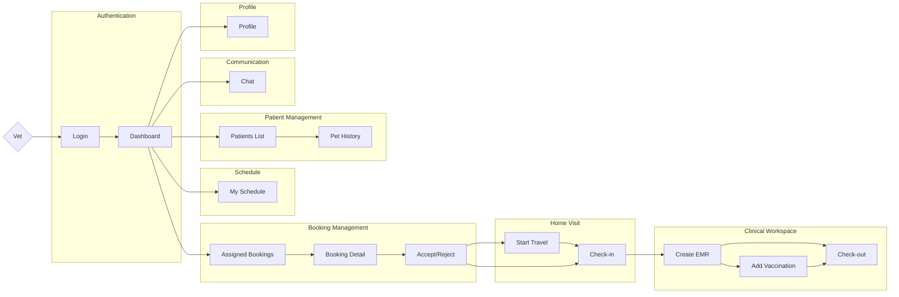
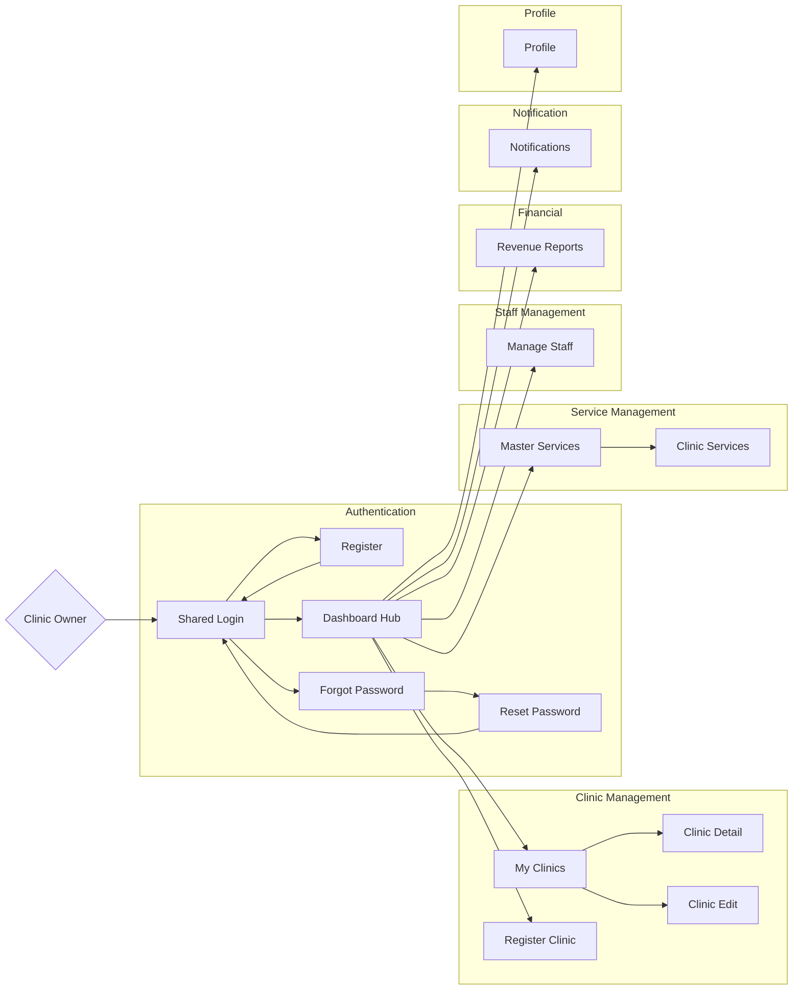

# PETTIES - Software Requirements Specification (SRS)

**Project:** Petties - Veterinary Appointment Booking Platform
**Version:** 1.3.1 (Role-based Screen Flows với Mermaid Diagrams)
**Last Updated:** 2025-12-31
**Document Status:** In Progress

---

## Table of Contents

1. [Product Overview](#1-product-overview)
2. [User Requirements](#2-user-requirements)
3. [Functional Requirements](#3-functional-requirements)
4. [Non-Functional Requirements](#4-non-functional-requirements)
5. [Requirement Appendix](#5-requirement-appendix)

---

## 1. PRODUCT OVERVIEW

### 1.1 Product Purpose

**Petties** là nền tảng kết nối chủ thú cưng (Pet Owner) với các phòng khám thú y (Veterinary Clinics). Hệ thống cho phép:

- 🐾 Chủ pet đặt lịch khám tại phòng khám hoặc tại nhà
- 🏥 Phòng khám quản lý dịch vụ, bác sĩ, lịch làm việc
- 👨‍⚕️ Bác sĩ quản lý ca làm, khám bệnh, ghi hồ sơ y tế
- 🤖 AI Chatbot hỗ trợ tư vấn chăm sóc thú cưng
- 📊 Admin quản lý toàn bộ nền tảng

### 1.2 Product Scope

| Aspect | Description |
|--------|-------------|
| **Platform** | Web (Admin, Clinic), Mobile (Pet Owner, Vet) |
| **Target Users** | Pet Owners, Veterinary Clinics, Vets, Admins |
| **Geography** | Vietnam (initial), Southeast Asia (future) |
| **Timeline** | 13 Sprints (10/12/2025 - 11/03/2026) |

### 1.3 Intended Audience

| Audience | Description |
|----------|-------------|
| Developers | Xây dựng và bảo trì hệ thống |
| QA/Testers | Kiểm tra chức năng và chất lượng |
| Product Owners | Theo dõi và ưu tiên requirements |
| Stakeholders | Đánh giá tính khả thi và business value |

### 1.4 Product Overview Diagram (Context Diagram)

```mermaid
flowchart TB
    PO["🐾 Pet Owner<br/>(Mobile)"]
    VET["👨‍⚕️ Vet<br/>(Mobile + Web)"]
    CM["👨‍💼 Clinic Manager<br/>(Web)"]
    CO["🏥 Clinic Owner<br/>(Web)"]
    ADMIN["🔧 Admin<br/>(Web)"]
    
    SYSTEM(("🐾 Petties<br/>System"))
    
    %% Pet Owner flows
    PO -->|"Register, Login, Profile Update"| SYSTEM
    PO -->|"Pet Profile (View EMR + Vaccination)"| SYSTEM
    PO -->|"Search Clinic, Create Booking"| SYSTEM
    PO -->|"Payment (Stripe)"| SYSTEM
    PO -->|"Review, AI Chat, Report Violation"| SYSTEM
    SYSTEM -->|"Booking Confirmation, Notifications"| PO
    SYSTEM -->|"Pet Profile (EMR + Vaccination Records)"| PO
    
    %% Vet flows
    VET -->|"Login, View Schedule"| SYSTEM
    VET -->|"Accept/Reject Booking"| SYSTEM
    VET -->|"Check-in, Create/Edit EMR"| SYSTEM
    VET -->|"Add/Edit Vaccination, Check-out"| SYSTEM
    SYSTEM -->|"Assigned Bookings, Schedules"| VET
    SYSTEM -->|"Pet Profile (EMR + Vaccination, READ-ONLY cross-clinic)"| VET
    
    %% Clinic Manager flows
    CM -->|"Add/Remove Vet"| SYSTEM
    CM -->|"Create Vet Schedule, Import Excel"| SYSTEM
    CM -->|"Assign Vet to Booking"| SYSTEM
    SYSTEM -->|"Vet List, Booking List/Pending Bookings"| CM
    SYSTEM -->|"Schedule Overview"| CM
    
    %% Clinic Owner flows
    CO -->|"Register Clinic"| SYSTEM
    CO -->|"Manage Master Services (Templates + Weight Tiers)"| SYSTEM
    CO -->|"Configure Clinic Services (Inherit or Custom)"| SYSTEM
    CO -->|"Add Clinic Manager"| SYSTEM
    SYSTEM -->|"Clinic Status, Revenue Report"| CO
    SYSTEM -->|"Dashboard Analytics"| CO
    
    %% Admin flows
    ADMIN -->|"Login, Approve/Reject Clinic"| SYSTEM
    ADMIN -->|"Configure AI Agents"| SYSTEM
    ADMIN -->|"Manage Knowledge Base, Process Reports"| SYSTEM
    SYSTEM -->|"Pending Clinics, Platform Stats"| ADMIN
    SYSTEM -->|"User Reports, Agent Status"| ADMIN
```



### 1.5 System Architecture Overview


---

## 2. USER REQUIREMENTS

### 2.1 User Roles

| Role | Platform | Description |
|------|----------|-------------|
| **PET_OWNER** | Mobile only | Chủ thú cưng, đặt lịch khám, xem hồ sơ y tế |
| **VET** | Mobile + Web | Bác sĩ thú y, khám bệnh, ghi EMR |
| **CLINIC_MANAGER** | Web only | Quản lý phòng khám, gán booking cho bác sĩ |
| **CLINIC_OWNER** | Web only | Chủ phòng khám, quản lý dịch vụ, doanh thu |
| **ADMIN** | Web only | Admin nền tảng, duyệt phòng khám, quản lý AI |

### 2.2 Use Cases

#### 2.2.1 Pet Owner Use Cases

| UC-ID | Use Case | Priority | Sprint |
|-------|----------|----------|--------|
| UC-PO-01 | Đăng ký và Đăng nhập | High | 1 |
| UC-PO-02 | Đăng nhập bằng Google | High | 1 |
| UC-PO-03 | Quản lý hồ sơ cá nhân | Medium | 2 |
| UC-PO-04 | Tạo/Sửa/Xóa hồ sơ thú cưng | High | 2 |
| UC-PO-05 | Tìm kiếm phòng khám | High | 4 |
| UC-PO-06 | Đặt lịch khám tại phòng (Clinic Visit) | High | 4-6 |
| UC-PO-07 | Đặt lịch khám tại nhà (Home Visit) | High | 4-6 |
| UC-PO-08 | Xem danh sách booking | High | 4 |
| UC-PO-09 | Hủy booking | Medium | 5 |
| UC-PO-10 | Thanh toán online (Stripe) | High | 8 |
| UC-PO-11 | Xem hồ sơ y tế thú cưng (EMR) | Medium | 7 |
| UC-PO-12 | Xem sổ tiêm chủng | Medium | 7 |
| UC-PO-13 | Đánh giá bác sĩ/phòng khám | Low | 9 |
| UC-PO-14 | Chat với AI Chatbot | Medium | 10 |
| UC-PO-15 | **[Out of Scope] Gửi yêu cầu cứu hộ khẩn cấp (SOS)** | Low | 11 |
| UC-PO-16 | Báo cáo vi phạm Clinic/Vet | Low | 9 |
| UC-PO-17 | **[Home Visit] Theo dõi vị trí bác sĩ trên bản đồ** | High | 6 |
| UC-PO-18 | **[Home Visit] Xem lộ trình di chuyển của bác sĩ** | High | 6 |
| UC-PO-19 | **[Home Visit] Nhận thông báo khi bác sĩ sắp đến/đến nơi** | High | 6 |

#### 2.2.2 Vet Use Cases

| UC-ID | Use Case | Priority | Sprint |
|-------|----------|----------|--------|
| UC-VT-01 | Đăng nhập (Account được cấp) | High | 3 |
| UC-VT-02 | Xem lịch làm việc | High | 3 |
| UC-VT-03 | Xem booking được gán | High | 4 |
| UC-VT-04 | Phê duyệt/Từ chối booking | High | 5 |
| UC-VT-05 | Check-in bệnh nhân | High | 6 |
| UC-VT-06 | Ghi hồ sơ bệnh án (EMR) | High | 7 |
| UC-VT-07 | Ghi đơn thuốc | Medium | 7 |
| UC-VT-08 | Cập nhật sổ tiêm chủng | Medium | 7 |
| UC-VT-09 | Checkout bệnh nhân | High | 6 |
| UC-VT-10 | **[Home Visit] Bắt đầu di chuyển (Start Travel)** | High | 6 |
| UC-VT-11 | **[Home Visit] Thông báo đến nơi** | High | 6 |
| UC-VT-12 | **Tra cứu bệnh nhân đã khám** | Medium | 9 |
| UC-VT-13 | **Xem Lịch sử Bệnh nhân (Mobile View)** | High | 6 |

#### 2.2.3 Clinic Manager Use Cases

| UC-ID | Use Case | Priority | Sprint |
|-------|----------|----------|--------|
| UC-CM-01 | Đăng nhập | High | 1 |
| UC-CM-02 | Xem danh sách bác sĩ | High | 3 |
| UC-CM-03 | Thêm nhanh bác sĩ (Quick Add) | High | 3 |
| UC-CM-03b| Gán bác sĩ từ tài khoản có sẵn | Medium | 3 |
| UC-CM-04 | **[Out of Scope] Tải lịch trực từ file Excel** | Medium | 3 |
| UC-CM-05 | Tạo lịch bác sĩ thủ công | High | 3 |
| UC-CM-06 | Xem booking mới | High | 4 |
| UC-CM-07 | Gán bác sĩ cho booking | High | 5 |
| UC-CM-08 | Quản lý hủy & hoàn tiền | Medium | 8 |
| UC-CM-09 | **Xem danh sách bệnh nhân** | Medium | 9 |
| UC-CM-10 | **Xem hồ sơ bệnh nhân (EMR/Vaccination)** | Medium | 9 |

#### 2.2.4 Clinic Owner Use Cases

| UC-ID | Use Case | Priority | Sprint |
|-------|----------|----------|--------|
| UC-CO-01 | Đăng ký phòng khám | High | 2 |
| UC-CO-02 | Quản lý thông tin phòng khám | High | 2 |
| UC-CO-03 | Cấu hình Dịch vụ tại phòng khám (Hybrid) | High | 2 |
| UC-CO-04 | Cấu hình giá & Khung cân nặng | High | 2 |
| UC-CO-08 | Quản lý Danh mục Dịch vụ (Master Services) | High | 2 |
| UC-CO-09 | Cài đặt Khung giá Cân nặng (Weight Tiers) | High | 2 |
| UC-CO-05 | Theo dõi biểu đồ doanh thu | Medium | 9 |
| UC-CO-06 | Thêm nhanh quản lý (Quick Add) | Medium | 3 |
| UC-CO-07 | Quản lý nhân sự (Manager & Vet) | Medium | 3 |

#### 2.2.5 Admin Use Cases

| UC-ID | Use Case | Priority | Sprint |
|-------|----------|----------|--------|
| UC-AD-01 | Đăng nhập | High | 1 |
| UC-AD-02 | Xem danh sách phòng khám pending | High | 2 |
| UC-AD-03 | Xét duyệt/Từ chối phòng khám | High | 2 |
| UC-AD-04 | Theo dõi số liệu thống kê nền tảng | Medium | 9 |
| UC-AD-05 | Quản lý công cụ của Agent (Agent Tools) | Low | 10 |
| UC-AD-06 | Quản lý Knowledge Base (LlamaIndex RAG) | Low | 10 |
| UC-AD-07 | Thử nghiệm & Cấu hình Agent (Playground) | Low | 11 |
| UC-AD-08 | Theo dõi danh sách báo cáo vi phạm | Medium | 9 |
| UC-AD-09 | Xử lý User Report (Warn/Suspend/Ban/Reject) | Medium | 9 |

#### 2.2.6 Use Case Summary Table

> **Summary:** Complete list of all Use Cases with UC-ID, Use Case Name, Actor, and Description.

##### 📱 Pet Owner (19 Use Cases)

| UC-ID | Use Case Name | Actor | Description |
|-------|---------------|-------|-------------|
| UC-PO-01 | Register and Login | Pet Owner | Register new account with Email + OTP verification, or login with existing credentials |
| UC-PO-02 | Google Sign-In | Pet Owner | Login or register using Google OAuth 2.0 |
| UC-PO-03 | Manage Profile | Pet Owner | View/edit personal info, upload avatar, change password |
| UC-PO-04 | Manage Pet Profile | Pet Owner | Create, update, or delete pet profiles with photos and medical info |
| UC-PO-05 | Search Clinics | Pet Owner | Search clinics by name, GPS location, ratings, and service filters |
| UC-PO-05b | View Clinic Details | Pet Owner | View clinic info, services, pricing, reviews, and image gallery |
| UC-PO-06 | Book Clinic Visit | Pet Owner | Create booking for in-clinic appointment with slot selection |
| UC-PO-07 | Book Home Visit | Pet Owner | Create booking for home visit with address and additional fee |
| UC-PO-08 | View My Bookings | Pet Owner | View booking list with tabs: Upcoming, Past, Cancelled |
| UC-PO-09 | Cancel Booking | Pet Owner | Cancel booking (allowed before 4 hours of appointment time) |
| UC-PO-10 | Make Payment | Pet Owner | Pay via Stripe online or Cash on visit |
| UC-PO-11 | View Pet EMR | Pet Owner | View Electronic Medical Records of pets |
| UC-PO-12 | View Vaccination History | Pet Owner | View pet's vaccination records with next due dates |
| UC-PO-13 | Write Review | Pet Owner | Rate and review clinic/vet after completed booking |
| UC-PO-14 | Chat with AI Assistant | Pet Owner | Interact with AI chatbot for pet care advice |
| UC-PO-15 | **Send Emergency SOS Request** | Pet Owner | Request emergency assistance (**[Out of Scope]**) |
| UC-PO-16 | Report Violation | Pet Owner | Report clinic or vet for inappropriate behavior |
| UC-PO-17 | Track Vet Location | Pet Owner | View realtime vet location and travel route on map during Home Visit |
| UC-PO-19 | Receive Travel Updates | Pet Owner | Get notifications when vet is approaching/arrived |

##### 👨‍⚕️ Vet (13 Use Cases)

| UC-ID | Use Case Name | Actor | Description |
|-------|---------------|-------|-------------|
| UC-VT-01 | Login as Staff | Vet | Login with phone number + default password (last 6 digits) |
| UC-VT-02 | View My Schedule | Vet | View work schedule in calendar view (month/week/day) with associated bookings |
| UC-VT-03 | View Assigned Bookings | Vet | View list of bookings assigned by Manager (tabs: Today, Upcoming, Done) |
| UC-VT-04 | Accept/Reject Booking | Vet | Confirm or decline assigned booking with reason |
| UC-VT-05 | Check-in Patient | Vet | Mark start of examination (Clinic Visit or after arrival for Home Visit) |
| UC-VT-06 | Create EMR (SOAP) | Vet | Create comprehensive Electronic Medical Record using SOAP format with prescription |
| UC-VT-07 | Write Prescription | Vet | Add prescription with drug name, dosage, frequency, duration |
| UC-VT-08 | Add Vaccination Record | Vet | Add new vaccination record to pet's vaccination book with batch number, manufacturer and auto-calculated next due date |
| UC-VT-09 | Check-out Patient | Vet | Complete examination, collect payment if Cash |
| UC-VT-10 | Start Travel | Vet | Begin travel to pet owner's address with GPS tracking enabled (Home Visit) |
| UC-VT-11 | Mark Arrived | Vet | Confirm arrival at pet owner's location (Home Visit) |
| UC-VT-12 | Search Patients | Vet | Search previously examined pets at the clinic |
| UC-VT-13 | View Patient History | Vet | View pet's EMR and vaccination history on mobile |

##### 👩‍💼 Clinic Manager (12 Use Cases)

| UC-ID | Use Case Name | Actor | Description |
|-------|---------------|-------|-------------|
| UC-CM-01 | Login as Manager | Clinic Manager | Login with phone number + assigned password |
| UC-CM-02 | View Vet List | Clinic Manager | View list of vets working at the clinic |
| UC-CM-03 | Quick Add Vet | Clinic Manager | Add new vet with phone number and name (auto-creates account) |
| UC-CM-03b | Assign Existing Vet | Clinic Manager | Assign existing vet account to the clinic |
| UC-CM-04 | **Import Schedule Excel** | Clinic Manager | Import vet schedules from Excel file (**[Out of Scope]**) |
| UC-CM-05 | Create Vet Shift | Clinic Manager | Manually create vet shift (auto-generates 30-min slots) |
| UC-CM-06 | View New Bookings | Clinic Manager | View pending bookings that need vet assignment |
| UC-CM-07 | Assign Vet to Booking | Clinic Manager | Assign available vet to a booking |
| UC-CM-08 | Manage Cancellation | Clinic Manager | Handle booking cancellation and refund |
| UC-CM-09 | View Patient List | Clinic Manager | View clinic's patient list with DUE/OVERDUE status |
| UC-CM-10 | View Patient Records | Clinic Manager | View patient's EMR and vaccination history |
| UC-CM-11 | Manage Schedules | Clinic Manager | Create, edit, delete vet schedules in calendar view |
| UC-CM-12 | Receive Booking Alerts | Clinic Manager | Get realtime notifications for new bookings at the clinic |

##### 🏥 Clinic Owner (9 Use Cases)

| UC-ID | Use Case Name | Actor | Description |
|-------|---------------|-------|-------------|
| UC-CO-01 | Register Clinic | Clinic Owner | Register new clinic → status PENDING → await Admin approval |
| UC-CO-02 | Manage Clinic Info | Clinic Owner | Update clinic details, gallery, operating hours |
| UC-CO-03 | Manage Clinic Services | Clinic Owner | Add services from master template or create custom services |
| UC-CO-04 | Configure Pricing | Clinic Owner | Set weight-based tiered pricing for services |
| UC-CO-05 | View Revenue Dashboard | Clinic Owner | View revenue charts with date range filters |
| UC-CO-06 | Quick Add Staff | Clinic Owner | Add manager or vet with phone number (auto-creates account) |
| UC-CO-07 | Manage Staff | Clinic Owner | View, assign, remove staff from clinic |
| UC-CO-08 | Manage Master Services | Clinic Owner | Create and manage service templates |

##### 🔧 Admin (9 Use Cases)

| UC-ID | Use Case Name | Actor | Description |
|-------|---------------|-------|-------------|
| UC-AD-01 | Login as Admin | Admin | Login to Admin Portal |
| UC-AD-02 | View Pending Clinics | Admin | View list of clinics awaiting approval |
| UC-AD-03 | Approve/Reject Clinic | Admin | Approve or reject clinic registration with reason |
| UC-AD-04 | View Platform Statistics | Admin | View system-wide stats: users, clinics, bookings |
| UC-AD-05 | Manage Agent Tools | Admin | Manage MCP Tools, API tools, and custom functions assigned to the AI Agent |
| UC-AD-06 | Manage Knowledge Base | Admin | Upload documents (PDF, DOCX, TXT), LlamaIndex RAG processing with Cohere embeddings, Qdrant Cloud vector storage |
| UC-AD-07 | Configure and Test Agent | Admin | Test chat, configure hyperparameters (model, temperature, etc.) and System Prompt |
| UC-AD-08 | View User Reports | Admin | View violation reports from users |
| UC-AD-09 | Handle User Reports | Admin | Take action: None, Warn, Suspend, or Ban |

##### 📊 Summary

| Actor | Use Cases | Platform | Implementation Status |
|-------|:---------:|----------|----------------------|
| Pet Owner | 19 | Mobile | ~40% Implemented |
| Vet | 13 | Mobile | ~30% Implemented |
| Clinic Manager | 13 | Web | ~25% Implemented |
| Clinic Owner | 8 | Web | ~70% Implemented |
| Admin | 9 | Web | ~30% Implemented |
| **TOTAL** | **62** | - | **~40% Overall** |

---

## 3. FUNCTIONAL REQUIREMENTS

### 3.1 System Functional Overview

#### 3.1.1 Screens Flow

---

##### 3.1.1.1 Mobile App - Pet Owner Flow (24 screens)


---

##### 3.1.1.2 Mobile App - Vet Flow (15 screens)



---

##### 3.1.1.3 Web App - Vet Flow (9 screens)


---

##### 3.1.1.4 Web App - Clinic Owner Flow (14 screens)



---

##### 3.1.1.5 Web App - Clinic Manager Flow (11 screens)


---

##### 3.1.1.6 Web App - Admin Flow (11 screens)


#### 3.1.2 Screen Descriptions

> **Organized by Module/Feature** - Detailed descriptions of 79 screens grouped by functionality.
>
> **Format:** Table per Module showing ID, Screen Name, Platform/Role, and Description.

---

##### 3.1.2.1 Onboarding & Authentication Modules (#1-11)

| # | Module | Screen Name | Platform/Role | Description |
|:---:|:---|:---|:---|:---|
| 1 | Onboarding | Splash | Mobile/Pet Owner | Logo animation and auto-redirect to onboarding or home |
| 2 | Onboarding | Onboarding | Mobile/Pet Owner | 3 slides (Booking, AI, Health records). Skip and Continue/Start buttons |
| 3 | Auth | Login | Mobile/PO, Vet | Username + Password, Forgot Password link. Google Sign-in (TBI) |
| 4 | Auth | Register | Mobile/PO | 2-step flow: Form (User, Email, Password, Full Name, Phone) → OTP verification |
| 5 | Auth | Forgot Password | Mobile/PO | Enter email → Send OTP → Navigate to Reset Password |
| 6 | Auth | Reset Password | Mobile/PO | Enter OTP 6 digits + New Password to reset password |
| 7 | Auth | Login | Web/Staff, Admin | Shared login portal. Auto-redirect based on role. Blocks PET_OWNER |
| 8 | Auth | Register | Web/Clinic Owner | 2-step OTP registration for Clinic Owner accounts |
| 9 | Auth | Forgot Password | Web | Enter email to receive OTP for password reset |
| 10 | Auth | Reset Password | Web | Enter OTP + New Password to reset password |
| 11 | Auth | Onboarding | Web/Landing | Landing page with feature showcase for visitors |

##### 3.1.2.2 Home & Dashboard Module (#12-18)

| # | Screen Name | Platform/Role | Description |
|:---:|:---|:---|:---|
| 12 | Home | Mobile/PO | Welcome card, Pet stats, Quick actions, Preview pets, Bottom nav |
| 13 | Dashboard | Mobile/Vet | Welcome card, Today stats, Today schedule, Pending bookings |
| 14 | Dashboard | Web/Vet | Shift overview, pending examinations (Placeholder) |
| 15 | Dashboard Hub | Web/Clinic Owner | Today stats (Revenue, Bookings), Clinic info, Monthly revenue |
| 16 | Dashboard | Web/Manager | Today overview, Pending actions (Unassigned, Refunds), Recent table |
| 17 | Dashboard | Web/Admin | Service Health check (AI, Spring), Platform stats, Quick links |

##### 3.1.2.3 Pet Management & Clinic Discovery (#18-22)

| # | Module | Screen Name | Platform/Role | Description |
|:---:|:---|:---|:---|:---|
| 18 | Pet Mgt | My Pets | Mobile/PO | ListView with pet cards, Add (+) button, Empty state |
| 19 | Pet Mgt | Pet Detail | Mobile/PO | Header image, Info card. Actions: Edit, Delete |
| 20 | Pet Mgt | Add/Edit Pet | Mobile/PO | Form to add/edit pet info (image, name, species, breed, dob, weight) |
| 21 | Discovery | Search Clinics | Mobile/PO | Map view, GPS-based search, filters, ratings |
| 22 | Discovery | Clinic Detail | Mobile/PO | Gallery, info, services, reviews, Book button |

##### 3.1.2.4 Clinic & Service Management (#23-30)

| # | Module | Screen Name | Platform/Role | Description |
|:---:|:---|:---|:---|:---|
| 23 | Clinic Mgt | Register Clinic | Web/Owner | 2-step: ClinicForm → Image Upload after creation |
| 24 | Clinic Mgt | My Clinics | Web/Owner | Header with Create, Filters (status, name), ClinicList |
| 25 | Clinic Mgt | Clinic Detail | Web/Owner | Clinic details (info, images, legal documents) |
| 26 | Clinic Mgt | Clinic Edit | Web/Owner | Form to edit clinic info, gallery management |
| 27 | Clinic Mgt | Pending Clinics | Web/Admin | Table of pending clinics, Actions: View/Approve/Reject |
| 28 | Clinic Mgt | Clinic Detail | Web/Admin | Background check, legal verification for approval |
| 29 | Service Mgt | Master Services | Web/Owner | Manage service templates for all branches under this owner |
| 30 | Service Mgt | Clinic Services | Web/Owner | Configure specific pricing and status per clinic branch |

##### 3.1.2.5 Staff, Booking & Clinical Workspace (#31-49)

| # | Module | Screen Name | Platform/Role | Description |
|:---:|:---|:---|:---|:---|
| 31 | Staff Mgt | Manage Staff | Web/Owner | Clinic dropdown, StaffTable, QuickAddStaffModal (VET/MANAGER) |
| 32 | Staff Mgt | Staff List | Web/Manager | Manage branch vets directory, quick add tools |
| 33 | Booking | Create Booking | Mobile/PO | Select pet, service, date, time slot, notes |
| 34 | Booking | Payment | Mobile/PO | Stripe/Cash checkout with cost breakdown |
| 35 | Booking | My Bookings | Mobile/PO | Appointment list: Upcoming, Completed, Cancelled |
| 36 | Booking | Booking Detail | Mobile/PO | Real-time status timeline, actions, contact |
| 37 | Booking | Assigned Bookings | Mobile/Vet | List of assigned bookings (Today, Upcoming, Done) |
| 38 | Booking | Booking Detail | Mobile/Vet | Appointment details, pet info, owner contact |
| 39 | Booking | Accept/Reject | Mobile/Vet | Confirmation dialog for accepting/rejecting booking |
| 40 | Booking | Bookings List | Web/Vet | Bookings with advanced table filtering |
| 41 | Booking | Booking Detail | Web/Vet | Appointment details, triage actions |
| 42 | Booking | Bookings List | Web/Manager | Oversight of branch appointments |
| 43 | Booking | Assign Vet | Web/Manager | Assigning available doctors to requests |
| 44 | Booking | Refunds | Web/Manager | Cancellation management, refund processing |
| 45 | Clinical | Check-in | Mobile/Vet | Start examination confirmation and timestamp |
| 46 | Clinical | Create EMR | Mobile/Vet | Clinical notes (SOAP format), prescription entry |
| 47 | Clinical | Check-out | Mobile/Vet | Finish exam, payment summary (for Cash payments) |
| 48 | Clinical | Add Vaccination | Mobile/Vet | Record new immunization entries |
| 49 | Clinical | Exam Hub | Web/Vet | Central workspace: Check-in, SOAP notes, Prescriptions |

##### 3.1.2.6 Patient & Schedule Management (#50-58)

| # | Module | Screen Name | Platform/Role | Description |
|:---:|:---|:---|:---|:---|
| 50 | Patient Mgt | Pet History | Mobile/Vet | Comprehensive view of medical history, vaccines |
| 51 | Patient Mgt | Patients List | Mobile/Vet | Directory of patients treated at clinic |
| 52 | Patient Mgt | Patient List | Web/Vet | Directory of patients treated at clinic |
| 53 | Patient Mgt | Patient History | Web/Vet | Detailed medical records, vaccine view |
| 54 | Patient Mgt | Patient List | Web/Manager | Patient directory with immunization alerts |
| 55 | Patient Mgt | Patient Detail | Web/Manager | Detailed clinical records view (read-only) |
| 56 | Schedule | My Schedule | Mobile/Vet | Personal calendar (Month/Week/Day views) |
| 57 | Schedule | My Schedule | Web/Vet | Desktop-optimized personal calendar |
| 58 | Schedule | Vet Schedules | Web/Manager | Roster management, shift allocation |

##### 3.1.2.7 Other Core Modules (#59-79)

| # | Module | Screen Name | Platform/Role | Description |
|:---:|:---|:---|:---|:---|
| 59 | Home Visit | Track Vet | Mobile/PO | Real-time GPS map showing vet travel |
| 60 | Home Visit | Start Travel | Mobile/Vet | GPS toggle, view route, mark arrived |
| 61 | Communication | AI Chat | Mobile/PO | Chat with AI assistant, tool calls, citations |
| 62 | Communication | Chat | Mobile/Vet | Messaging with Manager or Pet Owners |
| 63 | Communication | Chat | Web/Manager | Operational messaging with vets, owners |
| 64 | Notif. | Notifications | Mobile/PO | In-app notification center with mark-as-read |
| 65 | Notif. | Notifications | Web/Owner | System-wide operational alerts |
| 66 | Profile | Profile | Mobile/PO, Vet | Avatar, Info, Actions (Edit, Email, Pass, Logout) |
| 67 | Profile | Edit Profile | Mobile/PO, Vet | Form to edit personal info (name, phone, avatar) |
| 68 | Profile | Change Email | Mobile/PO, Vet | Form to change email with OTP verification |
| 69 | Profile | Change Pass | Mobile/PO, Vet | Form to change password (current + new) |
| 70 | Profile | Profile | Web/Staff, Admin | Shared profile page. Account info and security |
| 71 | Review | Write Review | Mobile/PO | 1-5 star rating and comment after booking COMPLETED |
| 72 | Financial | Revenue Rpts | Web/Owner | Financial statements, growth charts |
| 73 | User Mgt | Users | Web/Admin | Centralized management of all user accounts |
| 74 | Analytics | Statistics | Web/Admin | Specialized reports, data export tools |
| 75 | AI Mgt | Agent Tools | Web/Admin | Manage MCP tools for AI Agent |
| 76 | AI Mgt | Knowledge Base| Web/Admin | RAG config, Upload docs, Query Tester |
| 77 | AI Mgt | Agent PG | Web/Admin | Prompt config, params tuning, chat testing |
| 78 | Moderation | User Reports | Web/Admin | Queue of violation reports from users |
| 79 | Moderation | Report Detail | Web/Admin | Panel for moderation actions (Warn/Ban) |

#### 3.1.3 Screen Authorization

> **Legend:** ✅ = Full Access | 👁️ = View Only | ❌ = No Access
>
> **Roles:** PET_OWNER (PO), VET (V), CLINIC_MANAGER (CM), CLINIC_OWNER (CO), ADMIN (A)

##### 📱 Mobile App - Pet Owner Screens

| Screen Name | PO | V | CM | CO | A | Screen Activities & Permissions |
|-------------|:--:|:-:|:--:|:--:|:-:|--------------------------------|
| Splash | ✅ | ❌ | ❌ | ❌ | ❌ | View only (auto-redirect) |
| Onboarding | ✅ | ❌ | ❌ | ❌ | ❌ | View slides, Skip, Get Started |
| Login | ✅ | ❌ | ❌ | ❌ | ❌ | Enter credentials, Google Sign-in, Forgot Password link |
| Register | ✅ | ❌ | ❌ | ❌ | ❌ | Fill form, Submit, Verify OTP |
| Home | ✅ | ❌ | ❌ | ❌ | ❌ | View stats, Quick actions, Navigate to features |
| My Pets | ✅ | ❌ | ❌ | ❌ | ❌ | View list, Add pet, Edit pet, Delete pet |
| Pet Detail | ✅ | ❌ | ❌ | ❌ | ❌ | View info, Edit info, Upload photo, View EMR/Vaccination |
| Search Clinics | ✅ | ❌ | ❌ | ❌ | ❌ | Search, Filter, View map, Select clinic |
| Clinic Detail | ✅ | ❌ | ❌ | ❌ | ❌ | View info, View services, View reviews, Book appointment |
| Create Booking | ✅ | ❌ | ❌ | ❌ | ❌ | Select service, Select pet, Select slot, Confirm |
| Payment | ✅ | ❌ | ❌ | ❌ | ❌ | View summary, Choose payment method, Pay |
| My Bookings | ✅ | ❌ | ❌ | ❌ | ❌ | View list (Upcoming/Past/Cancelled), Filter |
| Booking Detail | ✅ | ❌ | ❌ | ❌ | ❌ | View details, Cancel booking (before 4h), Contact clinic |
| AI Chat | ✅ | ❌ | ❌ | ❌ | ❌ | Send message, View response, View citations |
| Profile | ✅ | ❌ | ❌ | ❌ | ❌ | View info, Edit info, Upload avatar, Change password |
| Notifications | ✅ | ❌ | ❌ | ❌ | ❌ | View list, Mark as read, Navigate to related screen |
| Track Vet | ✅ | ❌ | ❌ | ❌ | ❌ | View map, View ETA, View vet location (Home Visit only) |
| Write Review | ✅ | ❌ | ❌ | ❌ | ❌ | Rate (1-5 stars), Write comment, Submit (after COMPLETED) |
| Forgot Password | ✅ | ❌ | ❌ | ❌ | ❌ | Enter email, Verify OTP, Set new password |

##### 👨‍⚕️ Mobile App - Vet Screens

| Screen Name | PO | V | CM | CO | A | Screen Activities & Permissions |
|-------------|:--:|:-:|:--:|:--:|:-:|--------------------------------|
| Login | ❌ | ✅ | ❌ | ❌ | ❌ | Enter phone + password (provided by clinic) |
| Dashboard | ❌ | ✅ | ❌ | ❌ | ❌ | View today's stats, View pending tasks, Quick actions |
| My Schedule | ❌ | ✅ | ❌ | ❌ | ❌ | View calendar (Month/Week/Day), View shift details |
| Assigned Bookings | ❌ | ✅ | ❌ | ❌ | ❌ | View list (Today/Upcoming/Done), Filter, Select booking |
| Booking Detail | ❌ | ✅ | ❌ | ❌ | ❌ | View details, View pet info, Contact owner, Start actions |
| Check-in | ❌ | ✅ | ❌ | ❌ | ❌ | Confirm check-in, Start examination |
| Create EMR | ❌ | ✅ | ❌ | ❌ | ❌ | Fill SOAP form, Add prescription, Upload photos, Save |
| Check-out | ❌ | ✅ | ❌ | ❌ | ❌ | Review summary, Collect payment (Cash), Complete |
| Profile | ❌ | ✅ | ❌ | ❌ | ❌ | View info, Change password |
#### 3.1.3 Screen Authorization

> **Legend:** ✅ = Full Access | 👁️ = View Only | ❌ = No Access
>
> **Roles:** PET_OWNER (PO), VET (V), CLINIC_MANAGER (CM), CLINIC_OWNER (CO), ADMIN (A)

##### 📱 Mobile App Screens (#1-13, #18-22, #33-39, #45-48, #50-51, #56, #59-62, #64, #66-69, #71)

| ID | Screen Name | PO | V | CM | CO | A | Key Activities |
|:---:|:---|:--:|:--:|:--:|:--:|:--:|:---|
| 1-2 | Onboarding/Splash | ✅ | ❌ | ❌ | ❌ | ❌ | View splash, Intro slides |
| 3-6 | Authentication (PO) | ✅ | ❌ | ❌ | ❌ | ❌ | Login, Register, Forgot/Reset Pass |
| 12 | Home (Pet Owner) | ✅ | ❌ | ❌ | ❌ | ❌ | View stats, Quick actions |
| 13 | Dashboard (Vet) | ❌ | ✅ | ❌ | ❌ | ❌ | View today stats, Schedule preview |
| 18-20| Pet Management | ✅ | ❌ | ❌ | ❌ | ❌ | CRUD Pet profiles |
| 21-22| Clinic Discovery | ✅ | ❌ | ❌ | ❌ | ❌ | Search, View clinic info |
| 33-36| Booking (PO) | ✅ | ❌ | ❌ | ❌ | ❌ | Create, Pay, View booking list/detail |
| 37-39| Booking (Vet) | ❌ | ✅ | ❌ | ❌ | ❌ | View assigned, Accept/Reject |
| 45-48| Clinical Workspace | ❌ | ✅ | ❌ | ❌ | ❌ | Check-in/out, EMR, Vaccination |
| 50-51| Patient Mgt (Vet) | ❌ | ✅ | ❌ | ❌ | ❌ | View patient list, Cross-clinic history |
| 56 | My Schedule (Vet) | ❌ | ✅ | ❌ | ❌ | ❌ | View personal calendar |
| 59-60| Home Visit | ✅ | ✅ | ❌ | ❌ | ❌ | Track location (PO), Travel mgt (V) |
| 61-62| Communication | ✅ | ✅ | ❌ | ❌ | ❌ | AI Chat (PO), Staff/Owner Chat (V) |
| 64 | Notifications | ✅ | ✅ | ❌ | ❌ | ❌ | View device alerts |
| 66-69| Profile (Mobile) | ✅ | ✅ | ❌ | ❌ | ❌ | Edit info, Email/Pass changes |
| 71 | Write Review | ✅ | ❌ | ❌ | ❌ | ❌ | Rate clinic/vet after completion |

##### 💻 Web App Screens (#7-11, #14-17, #23-32, #40-44, #49, #52-55, #57-58, #63, #65, #70, #72-79)

| ID | Screen Name | PO | V | CM | CO | A | Key Activities |
|:---:|:---|:--:|:--:|:--:|:--:|:--:|:---|
| 7-10 | Authentication (Web) | ❌ | ✅ | ✅ | ✅ | ✅ | Shared login, Forgot/Reset Pass |
| 11 | Onboarding (Landing) | ✅ | ✅ | ✅ | ✅ | ✅ | Feature showcase for visitors |
| 14-17| Dashboard (Web) | ❌ | ✅ | ✅ | ✅ | ✅ | Role-specific work metrics |
| 23-26| Clinic Mgt (CO) | ❌ | ❌ | ❌ | ✅ | ❌ | Register & Edit clinics, My clinics |
| 27-28| Clinic Approval (A) | ❌ | ❌ | ❌ | ❌ | ✅ | Review/Approve/Reject clinics |
| 29-30| Service Management | ❌ | ❌ | ❌ | ✅ | ❌ | Global templates, Clinic pricing |
| 31-32| Staff Management | ❌ | ❌ | ✅ | ✅ | ❌ | HR directory, Add/Remove staff |
| 40-41| Booking (Vet Web) | ❌ | ✅ | ❌ | ❌ | ❌ | Detailed triage, Booking list |
| 42-44| Booking (Manager) | ❌ | ❌ | ✅ | ❌ | ❌ | Oversight, Assign Vet, Refunds |
| 49 | Examination Hub | ❌ | ✅ | ❌ | ❌ | ❌ | Desktop clinical workspace |
| 52-55| Patient Mgt (Web) | ❌ | ✅ | ✅ | ❌ | ❌ | Search patients, View records (V/CM) |
| 57-58| Schedule (Web) | ❌ | ✅ | ✅ | ❌ | ❌ | My schedule (V), Roster mgt (CM) |
| 63 | Chat (Manager) | ❌ | ❌ | ✅ | ❌ | ❌ | Multi-chat with vets/owners |
| 65 | Notifications | ❌ | ❌ | ❌ | ✅ | ❌ | Operational alerts (Owner) |
| 70 | Shared Profile (Web)| ❌ | ✅ | ✅ | ✅ | ✅ | Shared profile & security settings |
| 72 | Revenue Reports (CO)| ❌ | ❌ | ❌ | ✅ | ❌ | Financial analytics |
| 73 | User Management | ❌ | ❌ | ❌ | ❌ | ✅ | Global user directory |
| 74-77| AI & Admin Tools | ❌ | ❌ | ❌ | ❌ | ✅ | Agent config, Knowledge base |
| 78-79| Moderation | ❌ | ❌ | ❌ | ❌ | ✅ | Violation reporting, Moderation |

#### 3.1.3 Non-Screen Functions

> **Description:** Các chức năng hệ thống không có giao diện người dùng trực tiếp, bao gồm batch jobs, cron jobs, services, APIs, và background processes.

| Function ID | Function Name | Type | Description | Trigger | Technology |
|-------------|---------------|------|-------------|---------|------------|
| NSF-001 | Auto Slot Generation | Service | Tự động tạo slots 30 phút từ VET_SHIFT | Khi CLINIC_MANAGER tạo ca làm việc | Spring Boot Service |
| NSF-002 | Booking Status Update | Cron Job | Cập nhật status PENDING → EXPIRED sau 24h không xác nhận | Scheduled (mỗi 15 phút) | Spring @Scheduled |
| NSF-003 | Push Notification | Service | Gửi push notification đến mobile devices | Event-driven (booking updates, reminders) | Firebase Cloud Messaging |
| NSF-004 | Email Notification | Service | Gửi email xác nhận, nhắc nhở lịch hẹn | Event-driven (registration, booking) | Spring Mail + SMTP |
| NSF-005 | OTP Generation | Service | Tạo mã OTP 6 số, lưu Redis với TTL 5 phút | Registration, Forgot Password, Email Change | Redis TTL |
| NSF-006 | JWT Token Refresh | Middleware | Tự động refresh access token trước khi hết hạn | API request với expired token | Spring Security Filter |
| NSF-007 | Token Blacklist | Service | Đưa token vào blacklist khi logout hoặc bị revoke | Logout event, Security violation | Redis Set |
| NSF-008 | Distance Calculation | API | Tính khoảng cách từ clinic đến địa chỉ Home Visit | Khi tạo booking Home Visit | Haversine Formula |
| NSF-009 | Dynamic Pricing | Service | Tính giá: Base + Weight Tier + Distance Fee | Khi tạo booking, chọn service | Business Logic Layer |
| NSF-010 | Rating Aggregation | Service | Cập nhật rating_avg của Clinic/Vet sau mỗi review | Khi có review mới được submit | Async Event Handler |
| NSF-011 | AI Chatbot Processing | Service | Xử lý tin nhắn qua Single Agent + ReAct pattern | User gửi message trong AI Chat | FastAPI + LangGraph |
| NSF-012 | RAG Retrieval | Service | Tìm kiếm trong Knowledge Base với vector similarity | AI Chat query cần tham khảo tài liệu | LlamaIndex + Qdrant |
| NSF-013 | Document Indexing | Batch | Chunking và embedding documents khi upload | Admin upload document vào Knowledge Base | LlamaIndex + Cohere |
| NSF-014 | Vaccination Reminder | Cron Job | Gửi nhắc nhở tiêm chủng trước ngày đến hạn | Scheduled (daily at 8:00 AM) | Spring @Scheduled |
| NSF-015 | GPS Location Update | WebSocket | Cập nhật realtime vị trí Vet trong Home Visit | Vet bật GPS tracking | WebSocket + Redis Pub/Sub |
| NSF-016 | Slot Availability Check | Service | Kiểm tra và reserve slot khi tạo booking | Create Booking API call | Database Transaction |
| NSF-017 | Payment Webhook | API | Nhận callback từ Stripe sau khi thanh toán | Stripe payment completed | Stripe Webhook Handler |
| NSF-018 | Cloudinary Upload | Service | Upload and optimize images (avatar, pet, clinic) | User upload image | Cloudinary SDK |
| NSF-019 | AI RAG Sync | Service | Incremental indexing and cache invalidation for Knowledge Base | Admin document upload/delete | FastAPI + Qdrant |
| NSF-020 | GPS Battery Optimization | Service | Throttles GPS updates based on distance and speed | Home Visit tracking active | Mobile Background Service |
| NSF-021 | Auto Delay Alert | Service | Notifies owner if Vet is >15 mins late for Home Visit arrival | Scheduled check against ETA | Spring Boot + FCM |

#### 3.1.4 Entity Relationship Diagram


##### 📊 Relationship Matrix (Cardinality)

| From (Ent. A) | To (Ent. B) | Relationship | Cardinality | Business Logic |
|:---|:---|:---|:---:|:---|
| **USER** | **PET** | owns | 1 : N | Một người nuôi có thể sở hữu nhiều thú cưng. |
| **USER** | **CLINIC** | owns | 1 : N | Một Clinic Owner có thể sở hữu nhiều chi nhánh phòng khám. |
| **CLINIC** | **USER** | works_at | 1 : N | Một phòng khám có nhiều nhân viên (Vet, Manager). Mỗi nhân viên chỉ thuộc 1 phòng khám. |
| **USER** | **VET_SHIFT** | works | 1 : N | Một bác sĩ có nhiều ca trực. Mỗi ca trực thuộc sở hữu của 1 bác sĩ. |
| **VET_SHIFT** | **SLOT** | contains | 1 : N | Một ca trực được chia thành nhiều ô thời gian 30 phút. |
| **BOOKING** | **SLOT** | reserves | 1 : N | Một lịch hẹn chiếm dùng một hoặc nhiều Slot (thông qua bảng BOOKING_SLOT). |
| **USER** | **BOOKING** | books | 1 : N | Khách hàng tạo nhiều lịch hẹn theo thời gian. |
| **PET** | **VACCINATION** | receives | 1 : N | Một thú cưng có lịch sử tiêm chủng nhiều lần (tương đương với sổ tiêm). |
| **PET** | **BOOKING** | has | 1 : N | Một thú cưng có lịch sử khám nhiều lần. |
| **BOOKING** | **PAYMENT** | has | 1 : 1 | Mỗi lịch hẹn có chính xác một bản ghi thanh toán (Cash/Stripe). |
| **BOOKING** | **EMR** | generates | 1 : 0..1 | Một lịch hẹn chỉ phát sinh tối đa 01 bệnh án (nếu khám thành công). |
| **EMR** | **PRESCRIPTION**| contains | 1 : N | Một bệnh án có thể có nhiều đơn thuốc đi kèm. |
| **EMR** | **EMR_IMAGE** | has_photos | 1 : N | Một bệnh án có thể đính kèm nhiều ảnh y khoa (X-quang, triệu chứng). |
| **BOOKING** | **REVIEW** | receives | 1 : N | Một lịch hẹn nhận được review cho bác sĩ và review cho phòng khám. |
| **USER** | **USER_REPORT** | submits | 1 : N | Một người dùng có thể gửi nhiều báo cáo vi phạm. |
| **USER** | **CHAT_CONV.** | participates | 1 : N | Một người dùng tham gia vào nhiều hội thoại 1-1. |
| **CLINIC** | **SERVICE** | offers | 1 : N | Một phòng khám cung cấp nhiều loại dịch vụ. |
| **CLINIC** | **CLINIC_IMAGE**| has_images | 1 : N | Một phòng khám có nhiều ảnh thực tế/không gian. |
| **SERVICE** | **BOOKING** | used_in | 1 : N | Một loại dịch vụ được sử dụng trong nhiều lịch hẹn khác nhau. |
| **MASTER_SERVICE**| **SERVICE** | defines | 1 : N | Template dịch vụ chung được áp dụng cho nhiều phòng khám. |
| **AI_AGENT** | **AI_CHAT_SESSION** | handles | 1 : N | Một Agent xử lý nhiều phiên chat của nhiều người dùng khác nhau. |
| **AI_AGENT** | **AI_KNOWLEDGE_DOC**| references | N : N | Agent sử dụng các tài liệu tri thức để trả lời câu hỏi (RAG). |
| **AI_KNOWLEDGE_DOC** | **USER** | uploaded_by | N : 0..1 | Tài liệu tri thức được upload bởi admin. |
| **AI_CHAT_MESSAGE** | **AI_CHAT_SESSION**| contains | N : 1 | Thông tin tin nhắn trong phiên chat AI. |
| **AI_SYSTEM_SETTING** | **AI_AGENT** | configures | N : 1 | Cài đặt hệ thống áp dụng cho Agent. |
| **BLACKLISTED_TOKEN** | **USER** | invalidates | N : 1 | Token bị vô hiệu hóa khi người dùng logout. |

#### 3.1.5 Entities Description

Để đảm bảo tính nhất quán giữa tài liệu và mã nguồn, dưới đây là danh sách đầy đủ 30 thực thể được sử dụng trong hệ thống Petties:

| Nhóm | Thực thể | Mô tả | Các trường chính |
|:---:|---|---|---|
| **Auth & User** | **USER** | Tài khoản định danh (5 roles) | id, username, email, password, role, clinic_id, status |
| | **REFRESH_TOKEN** | Token duy trì phiên đăng nhập | id, user_id, token, expires_at |
| | **BLACKLISTED_TOKEN** | Token bị vô hiệu hóa sau logout | id, token, blacklisted_at, expires_at |
| **Clinic** | **CLINIC** | Thông tin phòng khám thú y | id, owner_id, name, address, phone, status, rating_avg |
| | **CLINIC_IMAGE** | Ảnh không gian phòng khám | id, clinic_id, image_url, is_primary |
| | **MASTER_SERVICE** | Bản mẫu dịch vụ (Templates) | id, owner_id, name, service_type, default_base_price |
| | **SERVICE** | Dịch vụ thực tế tại phòng khám | id, clinic_id, master_service_id, base_price, is_home_visit |
| | **SERVICE_WEIGHT_PRICE**| Khung giá cộng thêm theo cân nặng | id, service_id, min_weight, max_weight, price |
| **Pet** | **PET** | Hồ sơ thông tin thú cưng | id, owner_id, name, species, breed, birth_date, weight_kg |
| **Scheduling** | **VET_SHIFT** | Ca trực của bác sĩ tại phòng khám | id, vet_id, clinic_id, work_date, start_time, end_time |
| | **SLOT** | Đơn vị thời gian 30 phút | id, shift_id, start_time, end_time, status |
| **Booking** | **BOOKING** | Lịch hẹn khám (Clinic/Home) | id, booking_code, pet_id, service_id, total_price, status |
| | **BOOKING_SLOT** | Bảng trung gian gán booking vào slot | booking_id, slot_id |
| | **PAYMENT** | Giao dịch thanh toán | id, booking_id, amount, method, status, stripe_payment_id |
| **Medical** | **EMR** | Bệnh án điện tử (Tiêu chuẩn SOAP) | id, booking_id, subjective, objective, assessment, plan |
| | **EMR_IMAGE** | Ảnh y khoa đính kèm bệnh án | id, emr_id, image_url, description |
| | **PRESCRIPTION** | Đơn thuốc kê cho thú cưng | id, emr_id, drug_name, dosage, frequency, duration |
| | **VACCINATION** | Ghi nhận sự kiện tiêm chủng | id, pet_id, vaccine_name, administered_date, next_due_date |
| **Interaction**| **REVIEW** | Đánh giá bác sĩ/phòng khám | id, booking_id, reviewer_id, type, rating, comment |
| | **NOTIFICATION** | Thông báo đẩy/in-app | id, user_id, type, title, content, is_read |
| | **CHAT_CONVERSATION** | Phiên hội thoại 1-1 (Owner-Staff) | id, user1_id, user2_id, booking_id, last_message_at |
| | **CHAT_MESSAGE** | Nội dung tin nhắn chat | id, conversation_id, sender_id, content, is_read |
| | **USER_REPORT** | Báo cáo vi phạm nền tảng | id, reporter_id, reported_user_id, category, status |
| **AI Service** | **AI_AGENT** | Cấu hình trí tuệ nhân tạo | id, name, model, system_prompt, temperature, top_p |
| | **AI_TOOL** | Công cụ (Tools) Agent được dùng | id, name, tool_type, input_schema, enabled |
| | **AI_PROMPT_VERSION**| Version control cho System Prompt | id, agent_id, version, prompt_text, is_active |
| | **AI_CHAT_SESSION** | Phiên hội thoại với AI | id, agent_id, user_id, session_id, started_at |
| | **AI_CHAT_MESSAGE** | Ghi chép tin nhắn AI | id, session_id, role, content, message_metadata |
| | **AI_KNOWLEDGE_DOC** | Tài liệu nạp cho RAG | id, filename, file_path, processed, vector_count |
| | **AI_SYSTEM_SETTING**| Cấu hình API Keys Dashboard | id, key, value, category, is_sensitive |

---

### 3.2 Functional Requirements

#### 3.2.1 User Registration with OTP
**Function trigger:**
- **Navigation path:** Splash Screen (M-001) -> Onboarding (M-002) -> Join Now -> Register (M-004)
- **Timing Frequency:** On demand (whenever a new user profile needs to be created).

**Function description:**
- **Actors/Roles:** Pet Owner, Clinic Owner
- **Purpose:** Allow new users to create an account and verify their identity via a one-time password (OTP).
- **Interface:**
    - **Register Screen:**
        1. **"Email"**: Text Input - User enters their valid email address.
        2. **"Password"**: Password Input - User sets their login password.
        3. **"Full Name"**: Text Input - User's display name.
        4. **"Phone"**: Text Input - User's contact number.
        5. **"Register"**: Button - Triggers the registration process.
- **Data processing:**
    1. User fills the registration form and clicks "Register".
    2. System validates data (Email format, Password strength, Unique Email/Phone).
    3. If valid, system generates a 6-digit OTP, stores it in Redis (5 min TTL), and sends it to the user's email.
    4. Screen redirects to OTP Verification screen.
    5. User enters the OTP.
    6. System verifies the OTP; if correct, creates a new User record in the database.
    7. System generates JWT tokens and redirects user to Home.

**Screen layout:**
*(User will add screen UI here)*

**Function details:**
- **Data:** RegisterRequest (email, password, fullName, phone), OtpToken.
- **Validation:**
    - **Error Handling:** System handles cases where email or phone already exists.
    - **OTP Validation:** OTP must be 6 digits and not expired.
- **Business rules:**
    - OTP expires after 5 minutes.
    - Max 3 verification attempts before requiring a new OTP.
- **Normal case:** User enters valid details, verifies OTP correctly, and is redirected to Dashboard.
- **Abnormal case:** User enters an already registered email -> System displays "Email already exists".

#### 3.2.2 Login (Email/Password & Google)
**Function trigger:**
- **Navigation path:** Splash Screen (M-001) -> Login (M-003 / W-001 / V-001 / VW-001 / CM-001 / A-001)
- **Timing Frequency:** On demand (whenever a user wants to log in to the system).

**Function description:**
- **Actors/Roles:** All Roles (Pet Owner, Vet, Manager, Owner, Admin)
- **Purpose:** Allow users to authenticate and access platform features based on their role.
- **Interface:**
    - **Login Screen:**
        1. **"Username/Email"**: Text Input.
        2. **"Password"**: Password Input.
        3. **"Login"**: Button.
        4. **"Google Login"**: Button - Social authentication.
- **Data processing:**
    - **Standard Login:**
        1. User enters credentials and clicks "Login".
        2. System validates credentials against the database.
        3. If successful, system returns Access Token and Refresh Token.
    - **Google Login:**
        1. User clicks "Google Login".
        2. System redirects to Google's OAuth2 consent page.
        3. User authenticates with Google account.
        4. Google returns an ID Token to the application.
        5. Application sends ID Token to Backend; Backend verifies and generates system tokens.

**Screen layout:**
*(User will add screen UI here)*

**Function details:**
- **Data:** LoginRequest (username, password), GoogleIdToken.
- **Validation:**
    - **Error Handling:** Invalid credentials -> "Invalid username or password".
    - **Role Check:** Users are redirected to screens appropriate for their role (e.g., Pet Owner to Home, Admin to Admin Dashboard).
- **Business rules:**
    - Refresh token used to silently renew access tokens.
- **Normal case:** User enters valid credentials -> Redirect to Home.
- **Abnormal case:** Account is locked -> "Your account has been suspended".

#### 3.2.3 Sign out
**Function trigger:**
- **Navigation path:** Profile Screen (M-015) / Sidebar -> Logout Button
- **Timing Frequency:** On demand (whenever a user wants to terminate their session).

**Function description:**
- **Actors/Roles:** All Roles
- **Purpose:** Securely log the user out and invalidate their current session tokens.
- **Interface:**
    - **Logout Option:** A button or menu item in the profile/sidebar.
- **Data processing:**
    1. User clicks "Log out".
    2. System calls `/api/auth/logout` with the Refresh Token.
    3. Backend adds the Refresh Token to a blacklist (Redis) to prevent reuse.
    4. Frontend clears local storage (tokens, user info) and redirects to Login Screen.

**Screen layout:**
*(User will add screen UI here)*

**Function details:**
- **Data:** Refresh Token.
- **Validation:**
    - **Error Handling:** If token is already invalid, proceed to redirect anyway.
- **Business rules:** Blacklisted tokens are stored in Redis until their original expiration time.
- **Normal case:** User logs out and is returned to the login page.
- **Abnormal case:** Network error during logout -> App should still clear local tokens and redirect.

#### 3.2.4 User Profile Management
**Function trigger:**
- **Navigation path:** Home -> Profile Menu (M-015) -> "My Profile"
- **Timing Frequency:** On demand (whenever a user wants to update their information).

**Function description:**
- **Actors/Roles:** All authenticated users.
- **Purpose:** Allow users to manage their personal information and security settings.
- **Interface:**
    - **Profile View:** Displays name, email, phone, and avatar.
    - **"Edit Profile" Button**: Enables editing of name and phone.
    - **"Change Password" Button**: Opens a password update modal.
    - **Avatar Upload**: Click on avatar to upload a new one.
- **Data processing:**
    1. User updates fields and clicks "Save".
    2. System validates the format of the profile data.
    3. If changing password, system verifies the current password before applying the new one.
    4. Profile data is updated in the database.

**Screen layout:**
*(User will add screen UI here)*

**Function details:**
- **Data:** UserEntity (fullName, phone, avatarUrl).
- **Validation:** Phone number must follow the regional format.
- **Normal case:** User updates their phone number -> New number is reflected in the profile view.

#### 3.2.5 Clinic Discovery (Search & Filter)
**Function trigger:**
- **Navigation path:** Splash Screen -> "Find Clinics" or Home (M-005) -> Search bar.
- **Timing Frequency:** On demand (whenever a pet owner looks for a clinic).

**Function description:**
- **Actors/Roles:** Guest, Pet Owner
- **Purpose:** Search for veterinary clinics by name, location, or service.
- **Interface:**
    - **Search Bar**: Text input for keywords.
    - **Distance Filter**: Slider to filter by proximity (e.g., within 5km, 10km).
    - **Clinic List**: Scrollable cards showing clinic name, rating, address, and distance.
    - **Map View**: Toggle to show clinic markers on a map.
- **Data processing:**
    1. User enters keywords or adjusts filters.
    2. System queries clinics based on the criteria.
    3. Results are ordered by distance (if location is available) or rating.
    4. For each clinic, system calculates the distance from the user's current coordinates.

**Screen layout:**
*(User will add screen UI here)*

**Function details:**
- **Data:** Clinic Search Query, Location (lat, lng).
- **Validation:** Ensure coordinates are valid if filtering by distance.
- **Business rules:** Only `APPROVED` clinics are displayed.
- **Normal case:** User searches for "Petties" -> System displays the clinic "Petties Sài Gòn" with its distance.

---

#### 3.2.6 Clinic Registration
**Function trigger:**
- **Navigation path:** Sidebar -> "My Clinics" (W-013) -> "Register New Clinic" (W-002)
- **Timing Frequency:** On demand (whenever an owner wants to add a new clinic branch).

**Function description:**
- **Actors/Roles:** Clinic Owner
- **Purpose:** Allow owners to register their clinics on the platform to begin offering services.
- **Interface:**
    - **Register Clinic Form:**
        1. **"Clinic Name"**: Text Input.
        2. **"Address"**: Searchable Map Input (Google Maps integration).
        3. **"Phone/Email"**: Contact details.
        4. **"Description"**: Text Area.
        5. **"Operating Hours"**: Time picker for each day of the week.
        6. **"Photos"**: Multiple file upload (Logo, Clinic Gallery).
- **Data processing:**
    1. Owner fills out the multi-step registration form.
    2. System validates contact information and address.
    3. Photos are uploaded to Cloudinary.
    4. A new Clinic record is created with status `PENDING`.
    5. Admin is notified of the new registration.

**Screen layout:**
*(User will add screen UI here)*

**Function details:**
- **Data:** ClinicEntity (name, address, lat, lng, phone, email, description), ClinicImageEntity, OperatingHours.
- **Validation:**
    - **Unique Name/Address:** System checks for potential duplicates.
    - **Complete Data:** All mandatory fields must be filled.
- **Business rules:**
    - Clinics remain `PENDING` until approved by an Admin.
    - Pending clinics do not appear in user search results.
- **Normal case:** Owner registers valid clinic -> Status becomes "Waiting for Approval".
- **Abnormal case:** Incomplete form -> System highlights missing fields.

#### 3.2.7 Clinic Approval (Admin)
**Function trigger:**
- **Navigation path:** Admin Dashboard (A-002) -> "Pending Clinics" (A-003)
- **Timing Frequency:** Whenever an administrator reviews registration requests.

**Function description:**
- **Actors/Roles:** Admin
- **Purpose:** Allow admins to verify clinic legitimacy and enable them on the platform.
- **Interface:**
    - **Approval Queue:** List of clinics with `PENDING` status.
    - **Detail View (A-004):** Review all data and photos submitted by the owner.
    - **"Approve" / "Reject"**: Action buttons.
- **Data processing:**
    1. Admin reviews clinic details.
    2. **Approval:** Admin clicks "Approve". Status changes to `APPROVED`.
    3. **Rejection:** Admin clicks "Reject" and provides a reason. Status changes to `REJECTED`.
    4. Owner is notified of the decision via in-app notification.

**Screen layout:**
*(User will add screen UI here)*

**Function details:**
- **Data:** Clinic ID, Status, Admin Notes.
- **Validation:** Only users with `ADMIN` role can access this function.
- **Business rules:** Approved clinics are instantly searchable by Pet Owners.
- **Normal case:** Admin approves valid clinic -> Clinic goes live.
- **Abnormal case:** Admin rejects due to invalid photos -> Owner notified to update registration.

#### 3.2.8 Master Service Management (Clinic Owner)
**Function trigger:**
- **Navigation path:** Dashboard Sidebar -> "Master Services" (W-015)
- **Timing Frequency:** On demand (to manage global service templates for all branches).

**Function description:**
- **Actors/Roles:** Clinic Owner
- **Purpose:** Define standard service templates (e.g., "General Checkup", "Vaccination") that can be reused across multiple clinics.
- **Interface:**
    - **Master Service List:** Table showing all templates.
    - **"Add Template"**: Button.
    - **Input Form:** Name, Category, Default Base Price, Description.
- **Data processing:**
    1. Owner defines a service template.
    2. System saves it to the `MASTER_SERVICE` table.
    3. These templates become available for clinics to "inherit".

**Screen layout:**
*(User will add screen UI here)*

**Function details:**
- **Data:** MasterServiceEntity (name, category, defaultPrice).
- **Validation:** Every owner has their own set of master services.
- **Business rules:** Master services act as a "Catalog" for the owner's organization.
- **Normal case:** Owner creates "Grooming" master service -> Available for all their clinics.

#### 3.2.9 Clinic Service Configuration
**Function trigger:**
- **Navigation path:** "My Clinics" -> "Edit Clinic" -> "Services" (W-005)
- **Timing Frequency:** On demand (to set specific pricing for a branch).

**Function description:**
- **Actors/Roles:** Clinic Owner, Clinic Manager
- **Purpose:** Set up services offered by a specific clinic branch, including tiered pricing based on pet weight.
- **Interface:**
    - **Service Setup Page:**
        1. **"Import from Master"**: Select from predefined templates.
        2. **"Base Price"**: Branch-specific cost.
        3. **"Weight Price Configuration"**: Add tiers (e.g., 0-5kg: +20,000 VND).
        4. **"Toggle Home Visit"**: Enable/Disable mobile services.
- **Data processing:**
    1. User selects a master service or creates a custom one.
    2. User configures specific pricing and weight tiers.
    3. System saves to the `SERVICE` and `SERVICE_WEIGHT_PRICE` tables.

**Screen layout:**
*(User will add screen UI here)*

**Function details:**
- **Data:** ServiceEntity, List<ServiceWeightPrice>.
- **Business rules:**
    - Total price for booking = Base Price + Weight-tier Price.
    - If no weight tier matches, the Base Price is used.
- **Normal case:** Manager sets "Vaccination" price to 150k at Branch A.
- **Abnormal case:** Overlapping weight tiers -> System prevents saving.

#### 3.2.10 Create Pet Profile
**Function trigger:**
- **Navigation path:** Home (M-005) -> My Pets (M-006) -> Add Pet [+]
- **Timing Frequency:** On demand (whenever a pet owner brings a new pet to the system).

**Function description:**
- **Actors/Roles:** Pet Owner
- **Purpose:** Allow owners to digitize their pet's health records and profiles.
- **Interface:**
    - **Pet Creation Form:**
        1. **"Pet Name"**: Text Input.
        2. **"Species"**: Dropdown (Dog, Cat, Bird, etc.).
        3. **"Breed"**: Text Input.
        4. **"Birth Date"**: Date Picker.
        5. **"Gender"**: Selection (Male/Female/Neutered).
        6. **"Weight"**: Decimal Input (kg).
        7. **"Photo"**: Image upload.
- **Data processing:**
    1. Owner enters pet details and uploads a photo.
    2. System validates that the name is present and other fields are within range.
    3. Photo is uploaded to Cloudinary.
    4. A new Pet record is created and linked to the Pet Owner's user ID.
    5. A Vaccination book (Vaccination Entity) is automatically initialized for the new pet.

**Screen layout:**
*(User will add screen UI here)*

**Function details:**
- **Data:** PetEntity (name, species, breed, birthDate, weightKg, photoUrl).
- **Validation:** Birth date cannot be in the future.
- **Business rules:**
    - Each pet must have at least a Name and Species.
    - An owner can have an unlimited number of pets.
- **Normal case:** Owner creates "Bella" (Golden Retriever) -> Bella appears in "My Pets" list.

#### 3.2.11 Update/Delete Pet Profile
**Function trigger:**
- **Navigation path:** My Pets (M-006) -> Select Pet -> Pet Detail (M-007) -> Edit/Delete icon
- **Timing Frequency:** On demand.

**Function description:**
- **Actors/Roles:** Pet Owner
- **Purpose:** Maintain up-to-date information about the pet or remove profiles of pets no longer in care.
- **Interface:**
    - **Edit Form:** Similar to creation but pre-filled.
    - **Delete Button:** Triggers a confirmation modal.
- **Data processing:**
    - **Update:** System updates the database record with new values.
    - **Delete:** System performs a "Soft Delete" (setting `deleted_at` timestamp) to preserve medical history for archive purposes.

**Screen layout:**
*(User will add screen UI here)*

**Function details:**
- **Data:** Pet ID, Update fields.
- **Validation:** Only the owner who created the pet can update or delete it (ownership check).
- **Business rules:**
    - Deleting a pet does not immediately delete its existing Medical Records (EMRs) for archive integrity.
- **Normal case:** Owner updates weight after a vet visit -> Profile shows new weight.

---

#### 3.2.12 Vet Shift & Slot Management (Clinic Manager)

**Function trigger:**
- **Navigation path:** Manager Dashboard (CM-002) -> Vet Schedules (CM-003)
- **Timing Frequency:** On demand (weekly or daily roster management).

**Function description:**
- **Actors/Roles:** Clinic Manager
- **Purpose:** Schedule work shifts for vets and automatically generate bookable time slots for customers.
- **Interface:**
    - **Calendar View:** A weekly/daily grid showing vet names and their assigned shifts.
    - **Add Shift Modal:** 
        1. **Vet Selector**: Dropdown of vets in the clinic.
        2. **Date Picker**: Selection of the workday.
        3. **Shift Times**: Start Time and End Time (e.g., 08:00 - 17:00).
        4. **Lunch Break**: Break Start and Break End (Pre-filled from Clinic's `OperatingHours` default for that specific weekday).
- **Data processing:**
    1. Manager selects a vet and a date.
    2. System auto-populates the default working hours and lunch breaks from `OperatingHours` (Recurrent settings).
    3. Manager adjusts times if necessary and clicks "Save".
    4. **Backend Constraint Check**: System checks if the new shift overlaps with any existing shift for the same vet.
    5. **Slot Generation Logic**: Upon saving, the system automatically creates `SLOT` records:
        - Each slot is 30 minutes long.
        - **Skip Break logic**: No slots are generated during the period between `break_start` and `break_end`.
        - Example: Shift 08:00-12:00, 13:00-17:00 -> Slots created: 08:00, 08:30, 09:00, 09:30, 10:00, 10:30, 11:00, 11:30, 13:00, 13:30, 14:00, 14:30, 15:00, 15:30, 16:00, 16:30.
    6. System notifies the Vet of the new schedule.

**Function details:**
- **Data:** `VetShift` (vet_id, clinic_id, work_date, start_time, end_time, break_start, break_end).
- **Validation:** 
    - Shift must be within Clinic's `OperatingHours`.
    - `break_start` < `break_end`.
    - No overlapping shifts for the same vet.
- **Normal case:** Manager creates a standard 8 AM - 5 PM shift. System generates available slots skipping the 12 PM - 1 PM lunch hour.
- **Emergency Case (Overriding):**
    - Clinic Manager has the "Manual Override" privilege to create a booking during a "Blocked" or "Break" period for emergency cases.
    - The Public App (Pet Owner) does not show these slots, but the Manager Dashboard allows forced booking creation.

#### 3.2.13 View Schedule & Manage Bookings (Vet)

**Function trigger:**
- **Navigation path:** Vet Dashboard (V-002) -> My Schedule (V-003) or Assigned Bookings (V-004)
- **Timing Frequency:** Daily.

**Function description:**
- **Actors/Roles:** Vet
- **Purpose:** Allow Vets to see their work roster and manage pet appointments assigned to them.
- **Interface:**
    - **Schedule Screen:** Monthly/Weekly calendar showing shift blocks.
    - **Booking List:** View bookings filtered by "Today", "Upcoming", or "History".
- **Data processing:**
    1. Vet views assigned slots that have been booked by customers.
    2. Vet can "Approve" or "Reject" (with reason) an assignment.
    3. Vet marks "Check-in" upon patient arrival and "Check-out" after completing the medical record.

---

## ⭐ ADMIN: AI MANAGEMENT

#### 3.2.14 AI Agent Tool Management
**Function trigger:**
- **Navigation path:** Admin Dashboard -> AI Management -> Agent Tools (A-010)
- **Timing Frequency:** Whenever an admin adds a new capability to the AI.

**Function description:**
- **Actors/Roles:** Admin
- **Purpose:** Manage tools (functions) that the AI Agent can invoke using the ReAct (Reasoning and Acting) pattern.
- **Interface:**
    - **Tool List:** Table showing tool name, type (MCP/REST), and status.
    - **"Add Tool" Button**: Opens a JSON schema editor.
- **Data processing:**
    1. Admin defines the tool's name, description, and JSON schema for arguments.
    2. System validates the JSON schema.
    3. Tool is registered in the AI's "Toolbox".
    4. During a conversation, the Agent can choose to "Call" this tool if it matches the user's intent.

**Screen layout:**
*(User will add screen UI here)*

**Function details:**
- **Data:** ToolEntity (name, description, inputSchema, endpoint).
- **Business rules:** Only approved tools can be used in production chats.
- **Normal case:** Admin adds "Search Clinic" tool -> AI can now search clinics for the user.

---

#### 3.2.15 AI Knowledge Base Management
**Function trigger:**
- **Navigation path:** Admin Dashboard -> AI Management -> Knowledge Base (A-011)
- **Timing Frequency:** Periodically (to update veterinary knowledge or clinic FAQs).

**Function description:**
- **Actors/Roles:** Admin
- **Purpose:** Upload and index documents for the AI to use in RAG (Retrieval-Augmented Generation).
- **Interface:**
    - **Upload Zone:** Drag-and-drop file upload.
    - **Document List:** Shows status (Indexing / Processed).
- **Data processing:**
    1. Admin uploads a PDF or Markdown file.
    2. System parses the text using LlamaIndex.
    3. Text is split into chunks (1000 chars, 200 overlap).
    4. Chunks are converted to vectors using Cohere API.
    5. Vectors are stored in Qdrant Cloud.

**Screen layout:**
*(User will add screen UI here)*

**Function details:**
- **Data:** KnowledgeDocumentEntity, Vector Storage (Qdrant).
- **Business rules:**
    - Max file size: 10MB.
    - Supported formats: PDF, TXT, MD.
- **Normal case:** Admin uploads "Vaccination Guide" -> AI can now answer questions about vaccine schedules.

---

#### 3.2.16 AI Agent Playground
**Function trigger:**
- **Navigation path:** Admin Dashboard -> AI Management -> Playground (A-012)
- **Timing Frequency:** During testing and prompt engineering.

**Function description:**
- **Actors/Roles:** Admin
- **Purpose:** Test and debug AI responses, system prompts, and tool execution in a controlled environment.
- **Interface:**
    - **Three-Panel Layout:**
        1. **Config Panel**: Model selection, Temperature, System Prompt.
        2. **Chat Canvas**: The conversation interface.
        3. **Trace Panel**: Real-time display of the Agent's "Thought" process and "Action" calls.
- **Data processing:**
    1. Admin adjusts hyperparameters (e.g., Temperature).
    2. Admin sends a message.
    3. System streams the AI's internal ReAct logs to the Trace Panel.

**Screen layout:**
*(User will add screen UI here)*

**Function details:**
- **Data:** Hyperparameters, System Prompt, Conversation History.
- **Validation:** JSON config must be valid.
- **Normal case:** Admin tests a complex query -> Observes which tools the AI picks.

---

## ⭐ CLINIC OWNER: SERVICE MANAGEMENT

#### 3.2.17 Staff Management (Quick Add & List)
**Function trigger:**
- **Navigation path:** Sidebar -> "Staff Management" (CM-010 / VW-010)
- **Timing Frequency:** On demand (to manage clinic personnel).

**Function description:**
- **Actors/Roles:** Clinic Owner, Clinic Manager
- **Purpose:** Allow management of clinic staff, including onboarding and offboarding.
- **Interface:**
    - **Staff List:** Table showing name, role (Vet/Manager), and phone.
    - **"Quick Add Staff" Button**: Opens a modal to enter name, phone, and role.
    - **Delete Icon**: Next to each staff member to remove them.
- **Data processing:**
    - **Quick Add:**
        1. User enters staff details.
        2. System generates a default password (e.g., last 6 digits of phone).
        3. System creates a User record with the chosen role and links it to the current clinic.
    - **Removal:**
        1. User clicks "Delete" and confirms.
        2. System sets `workingClinicId` to null for that user (unassigns them).

**Screen layout:**
*(User will add screen UI here)*

**Function details:**
- **Data:** UserEntity (fullName, phone, role, workingClinicId).
- **Validation:**
    - Phone number must be unique.
    - Managers cannot delete other Managers.
- **Business rules:**
    - Each clinic can have multiple Vets but usually only one Manager.
- **Normal case:** Owner adds a new Vet -> Vet can now log in using their phone and default password.

---

---

## 👨‍⚕️ VET USE CASES (Mobile App)

#### 3.2.18 Staff Login
**Function trigger:**
- **Navigation path:** Splash Screen -> Login -> "Staff Login"
- **Timing Frequency:** On demand (whenever a Vet or Manager needs to access their workspace).

**Function description:**
- **Actors/Roles:** Vet, Clinic Manager
- **Purpose:** Provide secure access to the professional tools of the Petties platform.
- **Interface:**
    - **Login Form:** Phone Number and Password inputs.
- **Data processing:**
    1. Staff enters their credentials.
    2. System validates the credentials and checks the user's role.
    3. If valid, the system returns tokens along with the `workingClinicId` and `workingClinicName`.
    4. The app redirects the user to the appropriate dashboard (Manager Web or Vet Mobile).

**Screen layout:**
*(User will add screen UI here)*

**Function details:**
- **Data:** LoginRequest (phone, password).
- **Validation:** Only users with `VET` or `CLINIC_MANAGER` roles can log in through the professional portal.
- **Business rules:** Staff accounts are usually created via "Quick Add" with a temporary password.
- **Normal case:** Vet enters correct credentials -> Redirected to "My Bookings" mobile screen.

#### 3.2.19 View Assigned Bookings (Mobile)
**Function trigger:**
- **Navigation path:** Vet Mobile App -> "My Bookings" Tab
- **Timing Frequency:** On demand (to check daily schedule).

**Function description:**
- **Actors/Roles:** Vet
- **Purpose:** Allow Vets to see a consolidated list of pet appointments assigned to them.
- **Interface:**
    - **Booking List:** Organized by date, showing Pet Name, Owner Name, and Time Slot.
    - **Tabs**: "Assigned", "In Progress", "Completed".
- **Data processing:**
    1. System fetches all bookings where `vetId` matches the current user and the status is within the selected tab.
    2. Results are filtered by the selected date (default: Today).

**Screen layout:**
*(User will add screen UI here)*

**Function details:**
- **Data:** BookingEntity, PetEntity, UserEntity.
- **Normal case:** Vet opens the app -> Sees 3 appointments for today.
- **Abnormal case:** No bookings assigned -> "No appointments scheduled for today".

---

#### 3.2.20 Accept/Reject Booking (Mobile)
**Function trigger:**
- **Navigation path:** View Assigned Bookings -> Select Booking -> Detail View
- **Timing Frequency:** On demand (whenever a new booking is assigned).

**Function description:**
- **Actors/Roles:** Vet
- **Purpose:** Confirm availability for an assigned appointment or reject it with a reason.
- **Interface:**
    - **Detail View:** Shows pet info, service, and time.
    - **"Accept" Button**: Sets status to `CONFIRMED`.
    - **"Reject" Button**: Opens a reason modal.
- **Data processing:**
    - **Accept:** Status updated to `CONFIRMED`.
    - **Reject:** Vet enters a reason; status is reset to `PENDING` (or `REJECTED` from the Vet's perspective), and the Manager is notified to re-assign.

**Screen layout:**
*(User will add screen UI here)*

**Function details:**
- **Business rules:** Rejection requires a mandatory reason.
- **Normal case:** Vet accepts early morning booking -> Pet owner receives confirmation.

#### 3.2.21 Patient Check-in (Mobile)
**Function trigger:**
- **Navigation path:** Booking Detail (Status: CONFIRMED) -> "Check-in"
- **Timing Frequency:** When the pet arrives at the clinic or when the Vet arrives for a Home Visit.

**Function description:**
- **Actors/Roles:** Vet
- **Purpose:** Officially start the medical examination and log the arrival time.
- **Interface:**
    - **"Check-in" Button**: Available once the appointment time is near.
- **Data processing:**
    1. System records the `checkInTime`.
    2. Booking status changes to `IN_PROGRESS`.
    3. The pet owner is notified that the examination has started.

**Screen layout:**
*(User will add screen UI here)*

**Function details:**
- **Validation:** Check-in usually occurs within 15-30 minutes of the scheduled time.

#### 3.2.22 Electronic Medical Record (EMR) & SOAP (Mobile)
**Function trigger:**
- **Navigation path:** Booking Detail (Status: IN_PROGRESS) -> "Create EMR"
- **Timing Frequency:** During or immediately after the examination.

**Function description:**
- **Actors/Roles:** Vet
- **Purpose:** Record medical findings and treatment plans using the standard SOAP (Subjective, Objective, Assessment, Plan) format.
- **Interface:**
    - **EMR Form:**
        - **Subjective**: Owner's observations, pet's symptoms.
        - **Objective**: Vital signs (Weight, Temperature, Heart Rate).
        - **Assessment**: Vet's diagnosis.
        - **Plan**: Treatment protocol and follow-up.
- **Data processing:**
    1. Vet enters data into the respective fields.
    2. System validates that mandatory fields (Diagnosis) are filled.
    3. EMR is saved and linked to the Booking ID.
    4. If pet weight is updated in EMR, it automatically updates the Pet Profile.

**Screen layout:**
*(User will add screen UI here)*

**Function details:**
- **Data:** EmrEntity (subjective, objective, assessment, plan, weight, temperature).
- **Business rules:** EMRs are generally read-only once the booking is completed to ensure record integrity.

---

#### 3.2.23 UC-VT-09: Check-out bệnh nhân (Mobile)

- **Actor:** Vet (Mobile)
- **Description:** Bác sĩ hoàn thành khám và kết thúc booking.
- **Pre-conditions:** 
    - Booking status = IN_PROGRESS.
    - Đã tạo EMR (khuyến khích nhưng không bắt buộc).
- **Basic Flow:**
    1. Vet hoàn thành khám và ghi EMR.
    2. Vet nhấn "HOÀN THÀNH KHÁM" (Check-out).
    3. Hệ thống kiểm tra:
        - Nếu chưa có EMR → Warning "Bạn chưa ghi bệnh án. Tiếp tục?"
        - Nếu Payment = CASH → Hiển thị số tiền cần thu
    4. Vet xác nhận → `PUT /api/bookings/{id}/check-out`.
    5. Hệ thống cập nhật:
        - `status = COMPLETED`
        - `check_out_time = now()`
        - Nếu Cash: `payment_status = PAID`
    6. Hệ thống release Slot (slot available lại cho booking khác nếu có).
    7. Pet Owner nhận notification "Khám xong! Hãy đánh giá trải nghiệm".
- **Alternative Flows:**
    - **AF-1:** Pet Owner chưa thanh toán (Stripe) → Không cho Check-out.
    - **AF-2:** Vet cancel Check-out → Quay lại IN_PROGRESS.
- **Post-conditions:** 
    - Booking status = COMPLETED.
    - EMR được lock (không thể sửa).
    - Pet Owner có thể viết Review.
- **UI Design (Mobile - Check-out Confirmation):**
    ```
    ┌─────────────────────────────────┐
    │         HOÀN THÀNH KHÁM         │
    ├─────────────────────────────────┤
    │                                 │
    │ 🐕 Bella                        │
    │ 🩺 Khám tổng quát               │
    │                                 │
    │ ━━━━━━━━━━━━━━━━━━━━━━━━━━━━━━━ │
    │ Chi tiết thanh toán:            │
    │                                 │
    │ Khám tổng quát (5-10kg)  200.000│
    │ Thuốc kháng sinh          50.000│
    │ ─────────────────────────────── │
    │ TỔNG CỘNG              250.000đ │
    │                                 │
    │ 💰 Phương thức: TIỀN MẶT        │
    │                                 │
    │ ━━━━━━━━━━━━━━━━━━━━━━━━━━━━━━━ │
    │ ☑️ Đã thu tiền từ khách hàng    │
    │                                 │
    │ ┌─────────────────────────────┐ │
    │ │    XÁC NHẬN HOÀN THÀNH     │ │
    │ └─────────────────────────────┘ │
    │                                 │
    │        [Quay lại]               │
    └─────────────────────────────────┘
    ```
- **API Endpoints:**
    | Method | Endpoint | Description |
    |--------|----------|-------------|
    | PUT | `/api/bookings/{id}/check-out` | Hoàn thành khám |
    | GET | `/api/bookings/{id}/payment-summary` | Lấy tổng tiền |

---

#### 3.2.24 UC-VT-02: Xem lịch làm việc (My Schedule) (Mobile)

- **Actor:** Vet (Mobile)
- **Description:** Bác sĩ xem lịch làm việc (ca trực) của mình theo tuần/tháng.
- **Pre-conditions:** 
    - Đã đăng nhập với role VET.
    - Manager đã tạo VetShift cho Vet.
- **Basic Flow:**
    1. Vet truy cập tab "Lịch trực" (My Schedule) trên app.
    2. Hệ thống gọi `GET /api/vet-shifts/me?month={month}&year={year}`.
    3. Hệ thống hiển thị Calendar View:
        - **Month View:** Các ngày có ca được đánh dấu chấm màu.
        - **Day Detail:** Click vào ngày → Hiển thị danh sách ca trực.
    4. Mỗi ca trực hiển thị:
        - Thời gian: 08:00 - 17:00
        - Phòng khám (nếu Vet làm nhiều nơi)
        - Số booking đã có
        - Trạng thái: Sắp tới / Đang diễn ra / Đã xong
    5. Click vào ca → Xem danh sách bookings trong ca đó.
- **Alternative Flows:**
    - **AF-1:** Không có lịch → "Bạn chưa có ca trực nào trong tháng này".
    - **AF-2:** Swipe trái/phải để chuyển tháng.
- **Post-conditions:** Vet nắm được lịch làm việc của mình.
- **UI Design (Mobile):**
    ```
    ┌─────────────────────────────────┐
    │ ← Lịch trực              < > 📅 │
    ├─────────────────────────────────┤
    │         Tháng 12, 2025          │
    │  CN  T2  T3  T4  T5  T6  T7     │
    │       1   2   3   4   5   6     │
    │   7   8   9  10  11  12  13     │
    │  14  15  16  17  18  19  20     │
    │  21  22  23  24• 25  26  27     │
    │  28  29• 30• 31•                │
    │         [• = có ca trực]        │
    ├─────────────────────────────────┤
    │ 📅 Thứ Hai, 30/12/2025          │
    │ ┌─────────────────────────────┐ │
    │ │ ⏰ 08:00 - 12:00            │ │
    │ │ 🏥 PK Thú Y Sài Gòn         │ │
    │ │ 📋 3 lịch hẹn               │ │
    │ │ [Đang diễn ra]              │ │
    │ └─────────────────────────────┘ │
    │ ┌─────────────────────────────┐ │
    │ │ ⏰ 14:00 - 18:00            │ │
    │ │ 🏥 PK Thú Y Sài Gòn         │ │
    │ │ 📋 2 lịch hẹn               │ │
    │ │ [Sắp tới]                   │ │
    │ └─────────────────────────────┘ │
    └─────────────────────────────────┘
    ```
- **API Endpoints:**
    | Method | Endpoint | Description |
    |--------|----------|-------------|
    | GET | `/api/vet-shifts/me` | Lấy ca trực của Vet hiện tại |
    | GET | `/api/vet-shifts/me?date={date}` | Lấy ca trực theo ngày |
    | GET | `/api/vet-shifts/{shiftId}/bookings` | Lấy bookings trong ca |

---

#### 3.2.25 Prescription Management (Mobile)
**Function trigger:**
- **Navigation path:** EMR Form -> "Prescriptions" Section -> "Add Medication"
- **Timing Frequency:** During or after the examination.

**Function description:**
- **Actors/Roles:** Vet
- **Purpose:** Prescribe medications as part of the treatment plan.
- **Interface:**
    - **Prescription Form:** Name of drug, dosage, frequency, and duration.
- **Data processing:**
    1. Vet adds medications to the list.
    2. Data is stored as a structured JSON object within the EMR.
    3. The prescription becomes visible to the pet owner in the booking details.

**Screen layout:**
*(User will add screen UI here)*

**Function details:**
- **Data:** Drug List (JSON: name, dose, frequency, days).

#### 3.2.26 Patient Check-out (Mobile) (Legacy)
**Function trigger:**
- **Navigation path:** Booking Detail (Status: IN_PROGRESS) -> "Check-out"
- **Timing Frequency:** When the consultation and treatment are finished.

**Function description:**
- **Actors/Roles:** Vet
- **Purpose:** Finalize the appointment and record the completion time.
- **Interface:**
    - **"Complete Booking" Button**: Visible only if EMR has been saved.
- **Data processing:**
    1. System verifies if mandatory medical records are present.
    2. Booking status changes to `COMPLETED`.
    3. System records the `checkOutTime`.
    4. The pet owner is notified and prompted to provide a rating/review.

**Screen layout:**
*(User will add screen UI here)*

**Function details:**
- **Business rules:** A booking cannot be checked out until the EMR is finalized.

#### 3.2.27 Veterinary Schedule (My Schedule) (Mobile) (Legacy)
**Function trigger:**
- **Navigation path:** Vet Mobile App -> "Schedule" Tab (V-002)
- **Timing Frequency:** Daily/Weekly overview.

**Function description:**
- **Actors/Roles:** Vet
- **Purpose:** Manage clinical shifts and personal availability.
- **Interface:**
    - **Calendar View:** Shows working hours and assigned bookings.
- **Data processing:**
    1. System fetches slots from the `SLOT` table filtered by the Vet's ID and clinic.
    2. Distinguishes between "Booked" and "Available" time slots.

**Screen layout:**
*(User will add screen UI here)*

**Function details:**
- **Normal case:** Vet views their 8 AM - 5 PM shift with 4 confirmed bookings.

---

---

#### 3.2.28 Vaccination Record Management (Mobile)
**Function trigger:**
- **Navigation path:** Patient Search -> Pet Profile -> "Vaccination Book"
- **Timing Frequency:** During or after a vaccination appointment.

**Function description:**
- **Actors/Roles:** Vet, Pet Owner
- **Purpose:** Track the pet's immunization history and upcoming boosters.
- **Interface:**
    - **Vaccination List:** Shows vaccine name, date given, and next due date.
    - **"Add Entry"**: Vet can add a new record (Vaccine type, Lot #, Date).
- **Data processing:**
    1. System saves the entry to `VACCINATION_RECORD`.
    2. System calculates and suggests the next booster date based on the vaccine type.

**Screen layout:**
*(User will add screen UI here)*

**Function details:**
- **Validation:** Only authenticated Vets can verify vaccination records.

---

---

#### 3.2.29 Patient Search & Medical History Retrieval (Mobile)
**Function trigger:**
- **Navigation path:** Vet Dashboard -> Search Icon
- **Timing Frequency:** Before or during an examination.

**Function description:**
- **Actors/Roles:** Vet
- **Purpose:** Look up existing patients to review their medical background.
- **Interface:**
    - **Search Bar**: Search by Pet Name, Owner Phone, or Microchip ID.
    - **Patient Profile**: Aggregated view of all past EMRs and Vaccinations.
- **Data processing:**
    1. User enters search term.
    2. System queries the database for matching pets registered at the Vet's clinic.

**Screen layout:**
*(User will add screen UI here)*

**Function details:**
- **Business rules:** Vets can only search for pets that have previously visited their clinic or have an active booking.

---

## 🏠 HOME VISIT USE CASES

#### 3.2.30 Home Visit Real-time Tracking (Vet) (Mobile)
**Function trigger:**
- **Navigation path:** Booking Detail (Type: HOME_VISIT) -> "Start Travel"
- **Timing Frequency:** When the Vet departs for the appointment.

**Function description:**
- **Actors/Roles:** Vet
- **Purpose:** Share live location with the pet owner to provide an ETA.
- **Interface:**
    - **"Start Travel" Button**: Triggers GPS tracking.
- **Data processing:**
    1. System updates status to `IN_TRANSIT`.
    2. Mobile app begins streaming GPS coordinates to the server.
    3. Server broadcasts these coordinates via WebSocket to the pet owner.

**Screen layout:**
*(User will add screen UI here)*

**Function details:**
- **Validation:** Requires GPS permission.

#### 3.2.31 Home Visit Real-time Tracking (Pet Owner) (Mobile)
**Function trigger:**
- **Navigation path:** Home App -> Booking Detail (Status: IN_TRANSIT) -> "Track Vet"
- **Timing Frequency:** While the Vet is on the way.

**Function description:**
- **Actors/Roles:** Pet Owner
- **Purpose:** Monitor the Vet's arrival progress on a map.
- **Interface:**
    - **Map View:** Shows the Vet's current position and the destination.

**Screen layout:**
*(User will add screen UI here)*

---


---


## 4. NON-FUNCTIONAL REQUIREMENTS

### 4.1 External Interfaces

#### 4.1.1 User Interfaces

| Platform | Technology | Description |
|----------|------------|-------------|
| Web Frontend | React 19 + Vite + TypeScript | Admin, Clinic Owner, Clinic Manager dashboards |
| Mobile App | Flutter 3.5 | Pet Owner, Vet mobile apps (iOS + Android) |

#### 4.1.2 Hardware Interfaces

| Interface | Description |
|-----------|-------------|
| GPS/Location | Mobile app dùng GPS để tìm clinic gần nhất |
| Camera | Upload ảnh pet, chứng chỉ |
| Push Notification | Firebase Cloud Messaging |

#### 4.1.3 Software Interfaces

| Interface | Provider | Purpose |
|-----------|----------|---------|
| Stripe API | Stripe | Payment processing |
| Google Sign-In | Google | OAuth authentication |
| Firebase | Google | Push notifications, analytics |
| **OpenRouter API** | OpenRouter | LLM inference (Cloud) - Gemini, Llama, Claude |
| **DeepSeek API** | DeepSeek | Alternative LLM provider (deepseek-chat) |
| **LlamaIndex** | LlamaIndex | 100% RAG Framework (VectorStoreIndex, SentenceSplitter, CohereEmbedding, QdrantVectorStore) |
| **Cohere Embeddings** | Cohere | Multilingual embeddings (embed-multilingual-v3, 1024 dims) |
| **Qdrant Cloud** | Qdrant | Vector database with Binary Quantization |
| DuckDuckGo Search | DuckDuckGo | Web search for AI (free, no API key) |
| Gmail SMTP | Google | Email notifications |
| Cloudinary | Cloudinary | Image storage & CDN |

#### 4.1.4 Communication Interfaces

| Protocol | Usage |
|----------|-------|
| HTTPS | All API calls |
| WSS | WebSocket for real-time chat |
| SMTP | Email sending |
| FCM | Push notifications |

### 4.2 Quality Attributes

#### 4.2.1 Usability

| Requirement | Target | Metric |
|-------------|--------|--------|
| Learnability | Users can complete basic tasks within 5 minutes | First-time task completion rate > 80% |
| Accessibility | WCAG 2.1 Level AA compliance | Pass automated accessibility tests |
| Mobile UX | Intuitive touch navigation | Touch target size ≥ 44px |
| Error Messages | Clear, actionable error messages | Vietnamese language support |
| Loading States | Visual feedback during operations | All async operations show loading indicators |

#### 4.2.2 Reliability

| Requirement | Target | Metric |
|-------------|--------|--------|
| Availability | 99.5% uptime | Monthly uptime percentage |
| MTBF (Mean Time Between Failures) | > 720 hours | Failure tracking |
| MTTR (Mean Time To Recovery) | < 1 hour | Incident response time |
| Data Backup | Daily automated backups | Backup success rate 100% |
| Failover | Auto-restart on crash | Docker restart policy: unless-stopped |

#### 4.2.3 Performance

| Requirement | Target | Metric |
|-------------|--------|--------|
| API Response Time | < 200ms (95th percentile) | Server-side latency |
| Page Load Time | < 3 seconds (FCP) | Lighthouse performance score |
| Database Query | < 100ms | Query execution time |
| Concurrent Users | 1000+ simultaneous | Load testing with k6 |
| Mobile App Size | < 50MB (APK) | Bundle size |

#### 4.2.4 Maintainability and Continuous Integration

| Requirement | Description |
|-------------|-------------|
| Version Control | Git with GitHub, branching strategy (main/develop/feature) |
| CI/CD Pipeline | GitHub Actions for automated testing and deployment |
| Documentation | README, API docs (Swagger), Code comments |
| Modularity | Microservices architecture (Backend + AI Service) |
| Logging | Structured logging với Loguru (Python), SLF4J (Java) |
| Monitoring | Docker healthchecks, Actuator endpoints |

#### 4.2.5 Code Quality and Testability

| Requirement | Target | Tools |
|-------------|--------|-------|
| Test Coverage | > 70% | JaCoCo (Java), pytest-cov (Python) |
| Unit Tests | All business logic | JUnit 5 (Java), pytest (Python) |
| Integration Tests | API endpoints | MockMvc (Spring), TestClient (FastAPI) |
| E2E Tests | Critical user flows | Playwright, Flutter integration tests |
| Code Quality | No critical issues | SonarQube (optional) |
| Linting | Consistent code style | ESLint (TS), Black (Python), Checkstyle (Java) |

---

## ⭐ ADMIN: AI MANAGEMENT

#### 3.2.14 AI Agent Tool Management
**Function trigger:**
- **Navigation path:** Admin Dashboard -> AI Management -> Agent Tools (A-010)
- **Timing Frequency:** Whenever an admin adds a new capability to the AI.

**Function description:**
- **Actors/Roles:** Admin
- **Purpose:** Manage tools (functions) that the AI Agent can invoke using the ReAct (Reasoning and Acting) pattern.
- **Interface:**
    - **Tool List:** Table showing tool name, type (MCP/REST), and status.
    - **"Add Tool" Button**: Opens a JSON schema editor.
- **Data processing:**
    1. Admin defines the tool's name, description, and JSON schema for arguments.
    2. System validates the JSON schema.
    3. Tool is registered in the AI's "Toolbox".
    4. During a conversation, the Agent can choose to "Call" this tool if it matches the user's intent.

**Screen layout:**
*(User will add screen UI here)*

**Function details:**
- **Data:** ToolEntity (name, description, inputSchema, endpoint).
- **Business rules:** Only approved tools can be used in production chats.
- **Normal case:** Admin adds "Search Clinic" tool -> AI can now search clinics for the user.

---

#### 3.2.15 AI Knowledge Base Management
**Function trigger:**
- **Navigation path:** Admin Dashboard -> AI Management -> Knowledge Base (A-011)
- **Timing Frequency:** Periodically (to update veterinary knowledge or clinic FAQs).

**Function description:**
- **Actors/Roles:** Admin
- **Purpose:** Upload and index documents for the AI to use in RAG (Retrieval-Augmented Generation).
- **Interface:**
    - **Upload Zone:** Drag-and-drop file upload.
    - **Document List:** Shows status (Indexing / Processed).
- **Data processing:**
    1. Admin uploads a PDF or Markdown file.
    2. System parses the text using LlamaIndex.
    3. Text is split into chunks (1000 chars, 200 overlap).
    4. Chunks are converted to vectors using Cohere API.
    5. Vectors are stored in Qdrant Cloud.

**Screen layout:**
*(User will add screen UI here)*

**Function details:**
- **Data:** KnowledgeDocumentEntity, Vector Storage (Qdrant).
- **Business rules:**
    - Max file size: 10MB.
    - Supported formats: PDF, TXT, MD.
- **Normal case:** Admin uploads "Vaccination Guide" -> AI can now answer questions about vaccine schedules.

---

#### 3.2.16 AI Agent Playground
**Function trigger:**
- **Navigation path:** Admin Dashboard -> AI Management -> Playground (A-012)
- **Timing Frequency:** During testing and prompt engineering.

**Function description:**
- **Actors/Roles:** Admin
- **Purpose:** Test and debug AI responses, system prompts, and tool execution in a controlled environment.
- **Interface:**
    - **Three-Panel Layout:**
        1. **Config Panel**: Model selection, Temperature, System Prompt.
        2. **Chat Canvas**: The conversation interface.
        3. **Trace Panel**: Real-time display of the Agent's "Thought" process and "Action" calls.
- **Data processing:**
    1. Admin adjusts hyperparameters (e.g., Temperature).
    2. Admin sends a message.
    3. System streams the AI's internal ReAct logs to the Trace Panel.

**Screen layout:**
*(User will add screen UI here)*

**Function details:**
- **Data:** Hyperparameters, System Prompt, Conversation History.
- **Validation:** JSON config must be valid.
- **Normal case:** Admin tests a complex query -> Observes which tools the AI picks.

---

## ⭐ CLINIC OWNER: SERVICE MANAGEMENT

#### 3.2.17 Staff Management (Quick Add & List)
**Function trigger:**
- **Navigation path:** Sidebar -> "Staff Management" (CM-010 / VW-010)
- **Timing Frequency:** On demand (to manage clinic personnel).

**Function description:**
- **Actors/Roles:** Clinic Owner, Clinic Manager
- **Purpose:** Allow management of clinic staff, including onboarding and offboarding.
- **Interface:**
    - **Staff List:** Table showing name, role (Vet/Manager), and phone.
    - **"Quick Add Staff" Button**: Opens a modal to enter name, phone, and role.
    - **Delete Icon**: Next to each staff member to remove them.
- **Data processing:**
    - **Quick Add:**
        1. User enters staff details.
        2. System generates a default password (e.g., last 6 digits of phone).
        3. System creates a User record with the chosen role and links it to the current clinic.
    - **Removal:**
        1. User clicks "Delete" and confirms.
        2. System sets `workingClinicId` to null for that user (unassigns them).

**Screen layout:**
*(User will add screen UI here)*

**Function details:**
- **Data:** UserEntity (fullName, phone, role, workingClinicId).
- **Validation:**
    - Phone number must be unique.
    - Managers cannot delete other Managers.
- **Business rules:**
    - Each clinic can have multiple Vets but usually only one Manager.
- **Normal case:** Owner adds a new Vet -> Vet can now log in using their phone and default password.

---

---

## 👨‍⚕️ VET USE CASES (Mobile App)

#### 3.2.18 Staff Login
**Function trigger:**
- **Navigation path:** Splash Screen -> Login -> "Staff Login"
- **Timing Frequency:** On demand (whenever a Vet or Manager needs to access their workspace).

**Function description:**
- **Actors/Roles:** Vet, Clinic Manager
- **Purpose:** Provide secure access to the professional tools of the Petties platform.
- **Interface:**
    - **Login Form:** Phone Number and Password inputs.
- **Data processing:**
    1. Staff enters their credentials.
    2. System validates the credentials and checks the user's role.
    3. If valid, the system returns tokens along with the `workingClinicId` and `workingClinicName`.
    4. The app redirects the user to the appropriate dashboard (Manager Web or Vet Mobile).

**Screen layout:**
*(User will add screen UI here)*

**Function details:**
- **Data:** LoginRequest (phone, password).
- **Validation:** Only users with `VET` or `CLINIC_MANAGER` roles can log in through the professional portal.
- **Business rules:** Staff accounts are usually created via "Quick Add" with a temporary password.
- **Normal case:** Vet enters correct credentials -> Redirected to "My Bookings" mobile screen.

#### 3.2.19 View Assigned Bookings (Mobile)
**Function trigger:**
- **Navigation path:** Vet Mobile App -> "My Bookings" Tab
- **Timing Frequency:** On demand (to check daily schedule).

**Function description:**
- **Actors/Roles:** Vet
- **Purpose:** Allow Vets to see a consolidated list of pet appointments assigned to them.
- **Interface:**
    - **Booking List:** Organized by date, showing Pet Name, Owner Name, and Time Slot.
    - **Tabs**: "Assigned", "In Progress", "Completed".
- **Data processing:**
    1. System fetches all bookings where `vetId` matches the current user and the status is within the selected tab.
    2. Results are filtered by the selected date (default: Today).

**Screen layout:**
*(User will add screen UI here)*

**Function details:**
- **Data:** BookingEntity, PetEntity, UserEntity.
- **Normal case:** Vet opens the app -> Sees 3 appointments for today.
- **Abnormal case:** No bookings assigned -> "No appointments scheduled for today".

---

#### 3.2.20 Accept/Reject Booking (Mobile)
**Function trigger:**
- **Navigation path:** View Assigned Bookings -> Select Booking -> Detail View
- **Timing Frequency:** On demand (whenever a new booking is assigned).

**Function description:**
- **Actors/Roles:** Vet
- **Purpose:** Confirm availability for an assigned appointment or reject it with a reason.
- **Interface:**
    - **Detail View:** Shows pet info, service, and time.
    - **"Accept" Button**: Sets status to `CONFIRMED`.
    - **"Reject" Button**: Opens a reason modal.
- **Data processing:**
    - **Accept:** Status updated to `CONFIRMED`.
    - **Reject:** Vet enters a reason; status is reset to `PENDING` (or `REJECTED` from the Vet's perspective), and the Manager is notified to re-assign.

**Screen layout:**
*(User will add screen UI here)*

**Function details:**
- **Business rules:** Rejection requires a mandatory reason.
- **Normal case:** Vet accepts early morning booking -> Pet owner receives confirmation.

#### 3.2.21 Patient Check-in (Mobile)
**Function trigger:**
- **Navigation path:** Booking Detail (Status: CONFIRMED) -> "Check-in"
- **Timing Frequency:** When the pet arrives at the clinic or when the Vet arrives for a Home Visit.

**Function description:**
- **Actors/Roles:** Vet
- **Purpose:** Officially start the medical examination and log the arrival time.
- **Interface:**
    - **"Check-in" Button**: Available once the appointment time is near.
- **Data processing:**
    1. System records the `checkInTime`.
    2. Booking status changes to `IN_PROGRESS`.
    3. The pet owner is notified that the examination has started.

**Screen layout:**
*(User will add screen UI here)*

**Function details:**
- **Validation:** Check-in usually occurs within 15-30 minutes of the scheduled time.

#### 3.2.22 Electronic Medical Record (EMR) & SOAP (Mobile)
**Function trigger:**
- **Navigation path:** Booking Detail (Status: IN_PROGRESS) -> "Create EMR"
- **Timing Frequency:** During or immediately after the examination.

**Function description:**
- **Actors/Roles:** Vet
- **Purpose:** Record medical findings and treatment plans using the standard SOAP (Subjective, Objective, Assessment, Plan) format.
- **Interface:**
    - **EMR Form:**
        - **Subjective**: Owner's observations, pet's symptoms.
        - **Objective**: Vital signs (Weight, Temperature, Heart Rate).
        - **Assessment**: Vet's diagnosis.
        - **Plan**: Treatment protocol and follow-up.
- **Data processing:**
    1. Vet enters data into the respective fields.
    2. System validates that mandatory fields (Diagnosis) are filled.
    3. EMR is saved and linked to the Booking ID.
    4. If pet weight is updated in EMR, it automatically updates the Pet Profile.

**Screen layout:**
*(User will add screen UI here)*

**Function details:**
- **Data:** EmrEntity (subjective, objective, assessment, plan, weight, temperature).
- **Business rules:** EMRs are generally read-only once the booking is completed to ensure record integrity.

---

#### 3.2.23 UC-VT-09: Check-out bệnh nhân (Mobile)

- **Actor:** Vet (Mobile)
- **Description:** Bác sĩ hoàn thành khám và kết thúc booking.
- **Pre-conditions:** 
    - Booking status = IN_PROGRESS.
    - Đã tạo EMR (khuyến khích nhưng không bắt buộc).
- **Basic Flow:**
    1. Vet hoàn thành khám và ghi EMR.
    2. Vet nhấn "HOÀN THÀNH KHÁM" (Check-out).
    3. Hệ thống kiểm tra:
        - Nếu chưa có EMR → Warning "Bạn chưa ghi bệnh án. Tiếp tục?"
        - Nếu Payment = CASH → Hiển thị số tiền cần thu
    4. Vet xác nhận → `PUT /api/bookings/{id}/check-out`.
    5. Hệ thống cập nhật:
        - `status = COMPLETED`
        - `check_out_time = now()`
        - Nếu Cash: `payment_status = PAID`
    6. Hệ thống release Slot (slot available lại cho booking khác nếu có).
    7. Pet Owner nhận notification "Khám xong! Hãy đánh giá trải nghiệm".
- **Alternative Flows:**
    - **AF-1:** Pet Owner chưa thanh toán (Stripe) → Không cho Check-out.
    - **AF-2:** Vet cancel Check-out → Quay lại IN_PROGRESS.
- **Post-conditions:** 
    - Booking status = COMPLETED.
    - EMR được lock (không thể sửa).
    - Pet Owner có thể viết Review.
- **UI Design (Mobile - Check-out Confirmation):**
    ```
    ┌─────────────────────────────────┐
    │         HOÀN THÀNH KHÁM         │
    ├─────────────────────────────────┤
    │                                 │
    │ 🐕 Bella                        │
    │ 🩺 Khám tổng quát               │
    │                                 │
    │ ━━━━━━━━━━━━━━━━━━━━━━━━━━━━━━━ │
    │ Chi tiết thanh toán:            │
    │                                 │
    │ Khám tổng quát (5-10kg)  200.000│
    │ Thuốc kháng sinh          50.000│
    │ ─────────────────────────────── │
    │ TỔNG CỘNG              250.000đ │
    │                                 │
    │ 💰 Phương thức: TIỀN MẶT        │
    │                                 │
    │ ━━━━━━━━━━━━━━━━━━━━━━━━━━━━━━━ │
    │ ☑️ Đã thu tiền từ khách hàng    │
    │                                 │
    │ ┌─────────────────────────────┐ │
    │ │    XÁC NHẬN HOÀN THÀNH     │ │
    │ └─────────────────────────────┘ │
    │                                 │
    │        [Quay lại]               │
    └─────────────────────────────────┘
    ```
- **API Endpoints:**
    | Method | Endpoint | Description |
    |--------|----------|-------------|
    | PUT | `/api/bookings/{id}/check-out` | Hoàn thành khám |
    | GET | `/api/bookings/{id}/payment-summary` | Lấy tổng tiền |

---

#### 3.2.24 UC-VT-02: Xem lịch làm việc (My Schedule) (Mobile)

- **Actor:** Vet (Mobile)
- **Description:** Bác sĩ xem lịch làm việc (ca trực) của mình theo tuần/tháng.
- **Pre-conditions:** 
    - Đã đăng nhập với role VET.
    - Manager đã tạo VetShift cho Vet.
- **Basic Flow:**
    1. Vet truy cập tab "Lịch trực" (My Schedule) trên app.
    2. Hệ thống gọi `GET /api/vet-shifts/me?month={month}&year={year}`.
    3. Hệ thống hiển thị Calendar View:
        - **Month View:** Các ngày có ca được đánh dấu chấm màu.
        - **Day Detail:** Click vào ngày → Hiển thị danh sách ca trực.
    4. Mỗi ca trực hiển thị:
        - Thời gian: 08:00 - 17:00
        - Phòng khám (nếu Vet làm nhiều nơi)
        - Số booking đã có
        - Trạng thái: Sắp tới / Đang diễn ra / Đã xong
    5. Click vào ca → Xem danh sách bookings trong ca đó.
- **Alternative Flows:**
    - **AF-1:** Không có lịch → "Bạn chưa có ca trực nào trong tháng này".
    - **AF-2:** Swipe trái/phải để chuyển tháng.
- **Post-conditions:** Vet nắm được lịch làm việc của mình.
- **UI Design (Mobile):**
    ```
    ┌─────────────────────────────────┐
    │ ← Lịch trực              < > 📅 │
    ├─────────────────────────────────┤
    │         Tháng 12, 2025          │
    │  CN  T2  T3  T4  T5  T6  T7     │
    │       1   2   3   4   5   6     │
    │   7   8   9  10  11  12  13     │
    │  14  15  16  17  18  19  20     │
    │  21  22  23  24• 25  26  27     │
    │  28  29• 30• 31•                │
    │         [• = có ca trực]        │
    ├─────────────────────────────────┤
    │ 📅 Thứ Hai, 30/12/2025          │
    │ ┌─────────────────────────────┐ │
    │ │ ⏰ 08:00 - 12:00            │ │
    │ │ 🏥 PK Thú Y Sài Gòn         │ │
    │ │ 📋 3 lịch hẹn               │ │
    │ │ [Đang diễn ra]              │ │
    │ └─────────────────────────────┘ │
    │ ┌─────────────────────────────┐ │
    │ │ ⏰ 14:00 - 18:00            │ │
    │ │ 🏥 PK Thú Y Sài Gòn         │ │
    │ │ 📋 2 lịch hẹn               │ │
    │ │ [Sắp tới]                   │ │
    │ └─────────────────────────────┘ │
    └─────────────────────────────────┘
    ```
- **API Endpoints:**
    | Method | Endpoint | Description |
    |--------|----------|-------------|
    | GET | `/api/vet-shifts/me` | Lấy ca trực của Vet hiện tại |
    | GET | `/api/vet-shifts/me?date={date}` | Lấy ca trực theo ngày |
    | GET | `/api/vet-shifts/{shiftId}/bookings` | Lấy bookings trong ca |

---

#### 3.2.25 Prescription Management (Mobile)
**Function trigger:**
- **Navigation path:** EMR Form -> "Prescriptions" Section -> "Add Medication"
- **Timing Frequency:** During or after the examination.

**Function description:**
- **Actors/Roles:** Vet
- **Purpose:** Prescribe medications as part of the treatment plan.
- **Interface:**
    - **Prescription Form:** Name of drug, dosage, frequency, and duration.
- **Data processing:**
    1. Vet adds medications to the list.
    2. Data is stored as a structured JSON object within the EMR.
    3. The prescription becomes visible to the pet owner in the booking details.

**Screen layout:**
*(User will add screen UI here)*

**Function details:**
- **Data:** Drug List (JSON: name, dose, frequency, days).

#### 3.2.26 Patient Check-out (Mobile) (Legacy)
**Function trigger:**
- **Navigation path:** Booking Detail (Status: IN_PROGRESS) -> "Check-out"
- **Timing Frequency:** When the consultation and treatment are finished.

**Function description:**
- **Actors/Roles:** Vet
- **Purpose:** Finalize the appointment and record the completion time.
- **Interface:**
    - **"Complete Booking" Button**: Visible only if EMR has been saved.
- **Data processing:**
    1. System verifies if mandatory medical records are present.
    2. Booking status changes to `COMPLETED`.
    3. System records the `checkOutTime`.
    4. The pet owner is notified and prompted to provide a rating/review.

**Screen layout:**
*(User will add screen UI here)*

**Function details:**
- **Business rules:** A booking cannot be checked out until the EMR is finalized.

#### 3.2.27 Veterinary Schedule (My Schedule) (Mobile) (Legacy)
**Function trigger:**
- **Navigation path:** Vet Mobile App -> "Schedule" Tab (V-002)
- **Timing Frequency:** Daily/Weekly overview.

**Function description:**
- **Actors/Roles:** Vet
- **Purpose:** Manage clinical shifts and personal availability.
- **Interface:**
    - **Calendar View:** Shows working hours and assigned bookings.
- **Data processing:**
    1. System fetches slots from the `SLOT` table filtered by the Vet's ID and clinic.
    2. Distinguishes between "Booked" and "Available" time slots.

**Screen layout:**
*(User will add screen UI here)*

**Function details:**
- **Normal case:** Vet views their 8 AM - 5 PM shift with 4 confirmed bookings.

---

---

#### 3.2.28 Vaccination Record Management (Mobile)
**Function trigger:**
- **Navigation path:** Patient Search -> Pet Profile -> "Vaccination Book"
- **Timing Frequency:** During or after a vaccination appointment.

**Function description:**
- **Actors/Roles:** Vet, Pet Owner
- **Purpose:** Track the pet's immunization history and upcoming boosters.
- **Interface:**
    - **Vaccination List:** Shows vaccine name, date given, and next due date.
    - **"Add Entry"**: Vet can add a new record (Vaccine type, Lot #, Date).
- **Data processing:**
    1. System saves the entry to `VACCINATION_RECORD`.
    2. System calculates and suggests the next booster date based on the vaccine type.

**Screen layout:**
*(User will add screen UI here)*

**Function details:**
- **Validation:** Only authenticated Vets can verify vaccination records.

---

---

#### 3.2.29 Patient Search & Medical History Retrieval (Mobile)
**Function trigger:**
- **Navigation path:** Vet Dashboard -> Search Icon
- **Timing Frequency:** Before or during an examination.

**Function description:**
- **Actors/Roles:** Vet
- **Purpose:** Look up existing patients to review their medical background.
- **Interface:**
    - **Search Bar**: Search by Pet Name, Owner Phone, or Microchip ID.
    - **Patient Profile**: Aggregated view of all past EMRs and Vaccinations.
- **Data processing:**
    1. User enters search term.
    2. System queries the database for matching pets registered at the Vet's clinic.

**Screen layout:**
*(User will add screen UI here)*

**Function details:**
- **Business rules:** Vets can only search for pets that have previously visited their clinic or have an active booking.

---

## 🏠 HOME VISIT USE CASES

#### 3.2.30 Home Visit Real-time Tracking (Vet) (Mobile)
**Function trigger:**
- **Navigation path:** Booking Detail (Type: HOME_VISIT) -> "Start Travel"
- **Timing Frequency:** When the Vet departs for the appointment.

**Function description:**
- **Actors/Roles:** Vet
- **Purpose:** Share live location with the pet owner to provide an ETA.
- **Interface:**
    - **"Start Travel" Button**: Triggers GPS tracking.
- **Data processing:**
    1. System updates status to `IN_TRANSIT`.
    2. Mobile app begins streaming GPS coordinates to the server.
    3. Server broadcasts these coordinates via WebSocket to the pet owner.

**Screen layout:**
*(User will add screen UI here)*

**Function details:**
- **Validation:** Requires GPS permission.

#### 3.2.31 Home Visit Real-time Tracking (Pet Owner) (Mobile)
**Function trigger:**
- **Navigation path:** Home App -> Booking Detail (Status: IN_TRANSIT) -> "Track Vet"
- **Timing Frequency:** While the Vet is on the way.

**Function description:**
- **Actors/Roles:** Pet Owner
- **Purpose:** Monitor the Vet's arrival progress on a map.
- **Interface:**
    - **Map View:** Shows the Vet's current position and the destination.

**Screen layout:**
*(User will add screen UI here)*

---


---


## 4. NON-FUNCTIONAL REQUIREMENTS

### 4.1 External Interfaces

#### 4.1.1 User Interfaces

| Platform | Technology | Description |
|----------|------------|-------------|
| Web Frontend | React 19 + Vite + TypeScript | Admin, Clinic Owner, Clinic Manager dashboards |
| Mobile App | Flutter 3.5 | Pet Owner, Vet mobile apps (iOS + Android) |

#### 4.1.2 Hardware Interfaces

| Interface | Description |
|-----------|-------------|
| GPS/Location | Mobile app dùng GPS để tìm clinic gần nhất |
| Camera | Upload ảnh pet, chứng chỉ |
| Push Notification | Firebase Cloud Messaging |

#### 4.1.3 Software Interfaces

| Interface | Provider | Purpose |
|-----------|----------|---------|
| Stripe API | Stripe | Payment processing |
| Google Sign-In | Google | OAuth authentication |
| Firebase | Google | Push notifications, analytics |
| OpenRouter API | OpenRouter | LLM inference (Cloud) - Gemini, Llama, Claude |
| DeepSeek API | DeepSeek | Alternative LLM provider (deepseek-chat) |
| LlamaIndex | LlamaIndex | 100% RAG Framework (VectorStoreIndex, SentenceSplitter, CohereEmbedding, QdrantVectorStore) |
| Cohere Embeddings | Cohere | Multilingual embeddings (embed-multilingual-v3, 1024 dims) |
| Qdrant Cloud | Qdrant | Vector database with Binary Quantization |
| DuckDuckGo Search | DuckDuckGo | Web search for AI (free, no API key) |
| Gmail SMTP | Google | Email notifications |
| Cloudinary | Cloudinary | Image storage & CDN |

#### 4.1.4 Communication Interfaces

| Protocol | Usage |
|----------|-------|
| HTTPS | All API calls |
| WSS | WebSocket for real-time chat |
| SMTP | Email sending |
| FCM | Push notifications |

### 4.2 Quality Attributes

#### 4.2.1 Usability

| Requirement | Target | Metric |
|-------------|--------|--------|
| Learnability | Users can complete basic tasks within 5 minutes | First-time task completion rate > 80% |
| Accessibility | WCAG 2.1 Level AA compliance | Pass automated accessibility tests |
| Mobile UX | Intuitive touch navigation | Touch target size ≥ 44px |
| Error Messages | Clear, actionable error messages | Vietnamese language support |
| Loading States | Visual feedback during operations | All async operations show loading indicators |

#### 4.2.2 Reliability

| Requirement | Target | Metric |
|-------------|--------|--------|
| Availability | 99.5% uptime | Monthly uptime percentage |
| MTBF (Mean Time Between Failures) | > 720 hours | Failure tracking |
| MTTR (Mean Time To Recovery) | < 1 hour | Incident response time |
| Data Backup | Daily automated backups | Backup success rate 100% |
| Failover | Auto-restart on crash | Docker restart policy: unless-stopped |

#### 4.2.3 Performance

| Requirement | Target | Metric |
|-------------|--------|--------|
| API Response Time | < 200ms (95th percentile) | Server-side latency |
| Page Load Time | < 3 seconds (FCP) | Lighthouse performance score |
| Database Query | < 100ms | Query execution time |
| Concurrent Users | 1000+ simultaneous | Load testing with k6 |
| Mobile App Size | < 50MB (APK) | Bundle size |

#### 4.2.4 Maintainability and Continuous Integration

| Requirement | Description |
|-------------|-------------|
| Version Control | Git with GitHub, branching strategy (main/develop/feature) |
| CI/CD Pipeline | GitHub Actions for automated testing and deployment |
| Documentation | README, API docs (Swagger), Code comments |
| Modularity | Microservices architecture (Backend + AI Service) |
| Logging | Structured logging với Loguru (Python), SLF4J (Java) |
| Monitoring | Docker healthchecks, Actuator endpoints |

#### 4.2.5 Code Quality and Testability

| Requirement | Target | Tools |
|-------------|--------|-------|
| Test Coverage | > 70% | JaCoCo (Java), pytest-cov (Python) |
| Unit Tests | All business logic | JUnit 5 (Java), pytest (Python) |
| Integration Tests | API endpoints | MockMvc (Spring), TestClient (FastAPI) |
| E2E Tests | Critical user flows | Playwright, Flutter integration tests |
| Code Quality | No critical issues | SonarQube (optional) |
| Linting | Consistent code style | ESLint (TS), Black (Python), Checkstyle (Java) |

---

## 5. REQUIREMENT APPENDIX

### 5.1 Business Rules

#### BR-001: Booking Rules

| Rule ID | Rule Description |
|---------|-----------------|
| BR-001-01 | Bookings must be created at least 2 hours before the appointment time. |
| BR-001-02 | Cancellations must be made at least 4 hours before the appointment (Non-refundable after this). |
| BR-001-03 | HOME_VISIT booking type requires a valid residential address and GPS coordinates. |
| BR-001-04 | Distance fee: 5,000 VND / km (applied from the 3rd kilometer onwards). |
| BR-001-05 | Each service has `slots_required` (default 1 slot = 30 minutes). |

#### BR-002: Payment & Refund Rules

| Rule ID | Rule Description |
|---------|-----------------|
| BR-002-01 | Online payment (Stripe) must be completed before the booking is CONFIRMED. |
| BR-002-02 | Cash payment is collected by the Vet at the Check-out stage. |
| BR-002-03 | Fully refundable if cancelled > 24 hours before appointment. |
| BR-002-04 | 50% refund if cancelled between 4-24 hours. 0% refund if < 4 hours. |
| BR-002-05 | System calculates refund amount automatically based on effective time of cancellation. |

#### BR-003: User Account & Registration

| Rule ID | Rule Description |
|---------|-----------------|
| BR-003-01 | Phone number is the primary identifier (Username). Email is required for receipts. |
| BR-003-02 | Password must be min 8 chars, including at least one letter and one number. |
| BR-003-03 | OTP is valid for 5 minutes, with a maximum of 5 attempts before lockout. |
| BR-003-04 | Staff accounts (Manager/Vet) are created via the Quick Add feature by Owners. |
| BR-003-05 | Clinics must be approved by Platform Admin before they become visible in search. |

#### BR-004: Scheduling & Slots

| Rule ID | Rule Description |
|---------|-----------------|
| BR-004-01 | Slot duration is fixed at 30 minutes per slot. |
| BR-004-02 | Shifts can include mandatory break times (e.g., lunch), which hide slots from public view. |
| BR-004-03 | Night shifts (End time < Start time) are treated as concluding the following day. |
| BR-004-04 | Active shifts with confirmed bookings cannot be deleted or modified in a way that orphans slots. |

#### BR-005: EMR (Medical Records) - The Central Hub Concept

| Rule ID | Rule Description |
|---------|-----------------|
| BR-005-01 | **EMR Central Hub** - All medical records are linked directly to the Pet Profile. |
| BR-005-02 | **Write Access** - Vets can only edit an EMR while the booking status is IN_PROGRESS. |
| BR-005-03 | **Record Integrity** - Once a booking is COMPLETED, the EMR is locked (Read-Only). |
| BR-005-04 | **Data Transparency** - Authorized Vets from any clinic can read the pet's full EMR history. |
| BR-005-05 | **Legal Ownership** - The Pet Owner holds legal ownership of the records and can export them. |

#### BR-006: Vaccination (Immunization Book)

| Rule ID | Rule Description |
|---------|-----------------|
| BR-006-01 | **Auto-initiation** - A Vaccination Book is automatically created upon pet profile creation. |
| BR-006-02 | **Verifiable Records** - Only Vets can add to or verify vaccination entries in the book. |
| BR-006-03 | **Continuous History** - Old records are never deleted; new entries are appended. |
| BR-006-04 | **Due Date logic** - System suggests the next due date based on the vaccine's specific interval rules. |
| BR-006-05 | **Proactive Alerts** - Notifications are sent to the owner 7 days and 1 day before the next due date. |

#### BR-007: Moderation & Reporting

| Rule ID | Rule Description |
|---------|-----------------|
| BR-007-01 | Owners can report clinics/vets for malpractice or poor service after a COMPLETED visit. |
| BR-007-02 | Clinics can report Owners for NO_SHOW or abusive behavior. |
| BR-007-03 | Admin actions include: WARNING, TEMPORARY SUSPENSION, or PERMANENT BAN. |
| BR-007-04 | A booking can only be the subject of a violation report once. |

#### BR-008: Staff Management (Quick Add)

| Rule ID | Rule Description |
|---------|-----------------|
| BR-008-01 | Quick Add requires only Name, Phone Number, and Role selection. |
| BR-008-02 | Default password for Quick Add is the **last 6 digits of the staff phone number**. |
| BR-008-03 | **One Manager Limit** - Each clinic branch is limited to exactly one CLINIC_MANAGER. |
| BR-008-04 | **Branch Exclusivity** - A staff member can only be assigned to one branch at any given time. |

#### BR-009: Data Privacy & Access Logic (BR-009-03)

| Rule ID | Rule Description |
|---------|-----------------|
| BR-009-01 | **Medical Data Sharing:** EMR and Vaccination history are shared across clinics for pet welfare. |
| BR-009-02 | **Business Data Segregation:** Booking history and payment details are private to each clinic. |
| BR-009-03 | **Entitlement Rule:** A clinic only gains access to a pet's history once a booking is created. |

#### BR-010: AI Behavior & Communication

| Rule ID | Rule Description |
|---------|-----------------|
| BR-010-01 | **Non-Clinical Diagnosis:** The AI Assistant must provide general advice and state it is not a doctor. |
| BR-010-02 | **Supportive Tool:** AI can help search clinics and explain medical terms but cannot prescribe drugs. |
| BR-010-03 | **Staff-Owner Chat:** Enabled only during the window of an active booking (Pending to Completed). |

### 5.2 Common Requirements

#### CR-001: Authentication

- JWT-based authentication với Access Token (24h) và Refresh Token (7 days)
- Access Token: Không lưu (stateless)
- Refresh Token: Lưu PostgreSQL (bảng `refresh_tokens`)
- Blacklisted Token: Lưu PostgreSQL (bảng `blacklisted_tokens`)

#### CR-002: Authorization

- Role-based Access Control (RBAC)
- 5 roles: PET_OWNER, VET, CLINIC_MANAGER, CLINIC_OWNER, ADMIN
- Platform restrictions: PET_OWNER (Mobile only), ADMIN/CLINIC_MANAGER (Web only)

#### CR-003: Data Validation

- Server-side validation required cho tất cả input
- Client-side validation cho UX (không thay thế server-side)
- Vietnamese characters support (UTF-8)

#### CR-004: Timezone

- Default timezone: Asia/Ho_Chi_Minh (UTC+7)
- All timestamps stored in UTC, converted for display

#### CR-005: Language

- Primary language: Vietnamese
- Error messages: Vietnamese
- API responses: Vietnamese hoặc English (configurable)

### 5.3 Application Messages List

#### Error Messages

| Code | Message | Description |
|------|---------|-------------|
| AUTH-001 | "Email hoặc mật khẩu không đúng" | Invalid credentials |
| AUTH-002 | "Token đã hết hạn" | JWT expired |
| AUTH-003 | "Bạn không có quyền truy cập" | Unauthorized access |
| AUTH-004 | "Mã OTP không đúng. Bạn còn {n} lần thử." | Invalid OTP |
| AUTH-005 | "Mã OTP đã hết hạn. Vui lòng yêu cầu mã mới." | OTP expired |
| AUTH-006 | "Email đã được đăng ký" | Duplicate email |
| BOOK-001 | "Slot đã được đặt" | Slot already booked |
| BOOK-002 | "Không thể hủy booking trong 4 giờ trước giờ hẹn" | Late cancellation |
| BOOK-003 | "Vui lòng chọn thú cưng" | Pet required |
| PAY-001 | "Thanh toán thất bại" | Payment failed |
| PAY-002 | "Không thể hoàn tiền" | Refund failed |
| VAL-001 | "Dữ liệu không hợp lệ" | Validation error |
| SYS-001 | "Có lỗi xảy ra. Vui lòng thử lại sau." | Internal error |

#### Success Messages

| Code | Message | Description |
|------|---------|-------------|
| AUTH-S01 | "Đăng ký thành công" | Registration success |
| AUTH-S02 | "Đăng nhập thành công" | Login success |
| AUTH-S03 | "Đổi mật khẩu thành công" | Password reset success |
| BOOK-S01 | "Đặt lịch thành công" | Booking created |
| BOOK-S02 | "Hủy lịch thành công" | Booking cancelled |
| PAY-S01 | "Thanh toán thành công" | Payment success |

---

**Document Status:** In Progress  
**Version:** 1.0.0  
**Last Updated:** 2025-12-19  
**Author:** Petties Development Team
