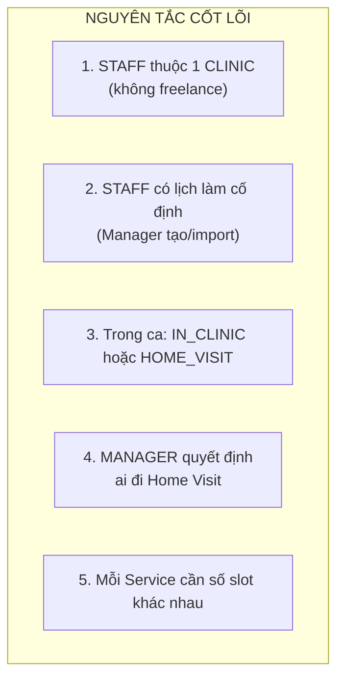
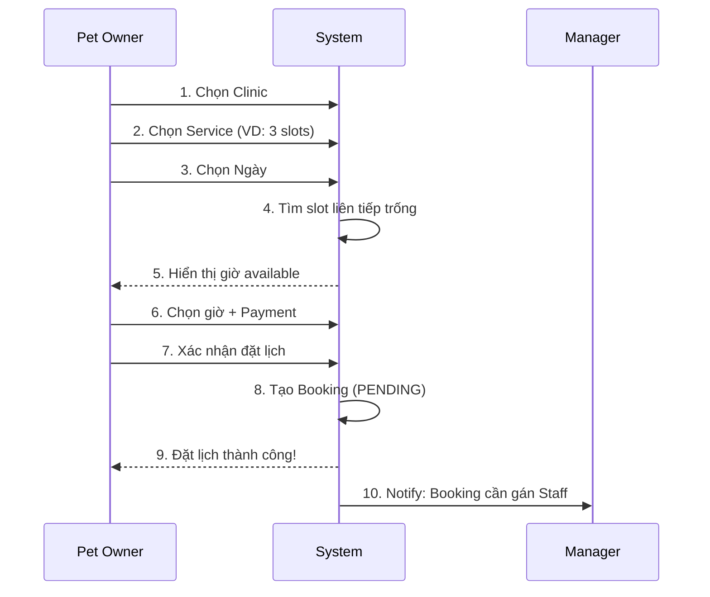
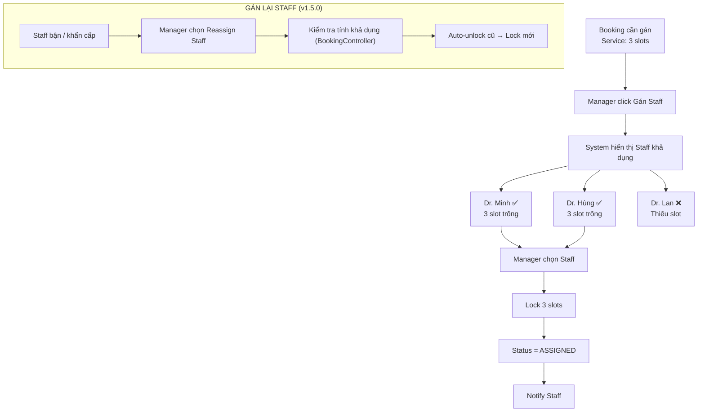
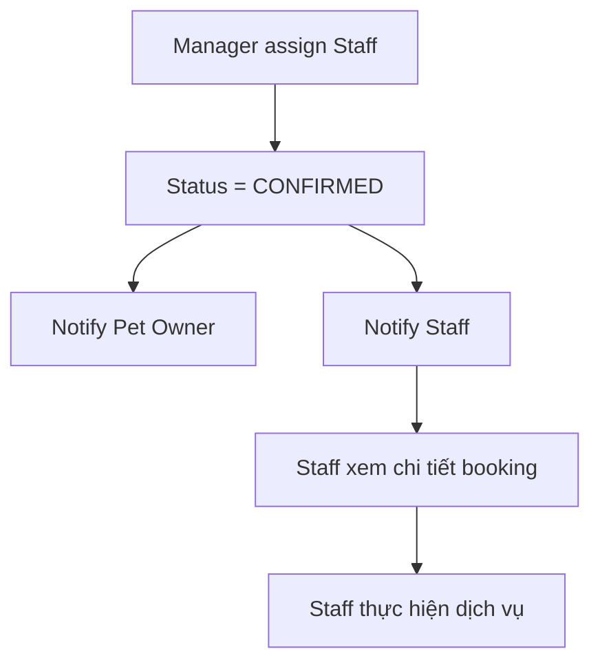
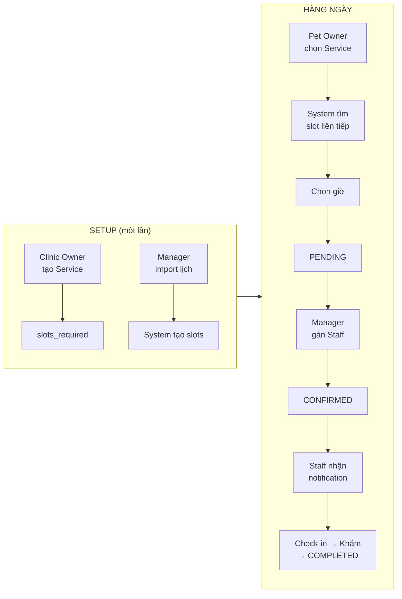

# Staff Scheduling & Dispatching Strategy

**Version:** 1.6.0
**Last Updated:** 2026-01-27
**Update Note:** Đổi Role.STAFF → Role.STAFF để phù hợp với kiến trúc mới (StaffSpecialty: VET_GENERAL, GROOMER, etc.)

## 1. Nguyên Tắc Cốt Lõi

1. **STAFF luôn thuộc về 1 CLINIC** (không freelance)

2. **STAFF có lịch làm việc cố định tại Clinic**
   - Được Manager tạo/import lịch
   - Mỗi ngày có ca làm (shift) với giờ bắt đầu/kết thúc

3. **Trong ca làm, Staff có thể được assign:**
   - `IN_CLINIC`: Khám tại phòng khám (mặc định)
   - `HOME_VISIT`: Đi khám tại nhà khách (khi được assign)

4. **Manager quyết định ai đi Home Visit**, không phải Staff tự chọn

5. **Mỗi Service có thời gian khác nhau** → cần số slot khác nhau



---

## 2. Service & Slots Required

### 2.1 Mỗi Service định nghĩa số slot cần thiết

| Service | Thời gian ước tính | Slots Required |
|---------|-------------------|----------------|
| Tiêm vaccine | ~15-20 phút | 1 slot |
| Khám tổng quát | ~30 phút | 1 slot |
| Khám + xét nghiệm | ~45-60 phút | 2 slots |
| Phẫu thuật nhỏ | ~90 phút | 3 slots |
| Grooming cơ bản | ~60 phút | 2 slots |
| Grooming full spa | ~120 phút | 4 slots |
| Khám tại nhà (Home Visit) | ~45-60 phút | 2 slots |
| Cấp cứu | ~60-90 phút | 2-3 slots |

### 2.2 Cấu hình Service (by Clinic Owner)

Khi tạo Service, Clinic Owner cần định nghĩa:

| Field | Ví dụ |
|-------|-------|
| Tên dịch vụ | Khám tổng quát + Xét nghiệm máu |
| Mô tả | Khám sức khỏe định kỳ kèm xét nghiệm... |
| Giá cơ bản | 350,000 VND |
| Thời gian ước tính | 60 phút |
| **Số slot cần thiết** | **2** ← QUAN TRỌNG |
| Hỗ trợ Home Visit | ✓ Có |
| Phí Home Visit/km | 15,000 VND |

**Quy tắc tính `slots_required`:**
- Mỗi slot = 30 phút
- `slots_required = MAX(1, CEIL(thời_gian_phút / 30))`
- Ví dụ: 45 phút → CEIL(45/30) = 2 slots
- Ví dụ: 10 phút → MAX(1, CEIL(10/30)) = 1 slot (minimum)

---

### 2.3 Design Decision: Minimum Slot Rule ✅

**Quyết định:** Mọi dịch vụ dù ngắn hơn 30 phút vẫn chiếm **tối thiểu 1 slot (30 phút)**.

**Ví dụ thực tế:**

| Service | Thời gian thực | Slots Required | Thời gian slot | Ghi chú |
|---------|----------------|----------------|----------------|---------|
| Tiêm vaccine | 10 phút | **1 slot** | 30 phút | +20 phút buffer |
| Khám nhanh | 15 phút | **1 slot** | 30 phút | +15 phút buffer |
| Tư vấn | 20 phút | **1 slot** | 30 phút | +10 phút buffer |
| Khám tổng quát | 30 phút | **1 slot** | 30 phút | Vừa đủ |

**Lý do chọn phương án này:**

1. **Buffer Time cho Staff:**
   - Chuẩn bị dụng cụ trước khi khám
   - Ghi chú EMR, vaccination record sau khi khám
   - Vệ sinh, khử trùng thiết bị
   - Nghỉ ngơi giữa các ca

2. **Tính biến động của dịch vụ:**
   - Pet có thể không hợp tác → thời gian kéo dài
   - Phát hiện vấn đề bất ngờ → cần thêm thời gian
   - Chủ pet có câu hỏi → tư vấn thêm

3. **Đơn giản hóa hệ thống:**
   - Không cần thêm entity SUB_SLOT
   - Logic assign Staff đơn giản
   - Calendar UI dễ render
   - Dễ debug và maintain

4. **Chất lượng dịch vụ:**
   - Không áp lực thời gian cho Staff
   - Pet owner không phải chờ đợi
   - Trải nghiệm tốt hơn rushed service

**Các phương án đã cân nhắc:**

| Phương án | Mô tả | Lý do không chọn |
|-----------|-------|------------------|
| Sub-Slot | Chia slot 30 phút thành 3 sub-slot 10 phút | Complexity cao, áp lực thời gian |
| Dynamic Duration | Slot duration linh hoạt theo service | Refactor lớn, overlap check phức tạp |
| Slot Grouping | Nhiều booking nhỏ share 1 slot | Delay cascading, khó quản lý |

> 📌 **Final Decision:** Chấp nhận "lãng phí" thời gian để đổi lấy sự đơn giản và chất lượng dịch vụ.

---

## 3. Mô Hình Slot

### 3.1 Cấu trúc ca làm việc

**Ví dụ: Dr. Minh - Thứ 2, 16/12/2025**
- Ca làm: 08:00 - 18:00 (nghỉ trưa 12:00-14:00)
- Mỗi Slot = 30 phút
- Tổng: 16 slots/ngày (8 buổi sáng + 8 buổi chiều)

| Buổi sáng | S1 | S2 | S3 | S4 | S5 | S6 | S7 | S8 |
|-----------|----|----|----|----|----|----|----|----|
| Giờ | 08:00 | 08:30 | 09:00 | 09:30 | 10:00 | 10:30 | 11:00 | 11:30 |

| Buổi chiều | S9 | S10 | S11 | S12 | S13 | S14 | S15 | S16 |
|------------|----|----|----|----|----|----|----|----|
| Giờ | 14:00 | 14:30 | 15:00 | 15:30 | 16:00 | 16:30 | 17:00 | 17:30 |

### 3.2 Booking chiếm nhiều slot

**Ví dụ Timeline sáng của Dr. Minh:**

| Slot | S1 | S2 | S3 | S4 | S5 | S6 | S7 | S8 |
|------|----|----|----|----|----|----|----|----|
| Booking | B1 | B1 | B2 | B2 | B2 | B3 | FREE | FREE |

- **B1** (08:00-09:00): "Grooming cơ bản" - 2 slots
- **B2** (09:00-10:30): "Phẫu thuật nhỏ" - 3 slots
- **B3** (10:30-11:00): "Tiêm vaccine" - 1 slot
- **FREE**: 11:00-12:00 - 2 slots trống

> 💡 1 Booking có thể chiếm 1, 2, 3, hoặc nhiều slot tùy Service
> 
> ⚠️ Các slot phải LIÊN TIẾP (không được ngắt quãng)

---

## 4. Flow Đặt Lịch (Pet Owner)

### 4.1 Bước chọn giờ - Hiển thị giờ có đủ slot

**Ví dụ:** Pet Owner chọn Service "Khám + xét nghiệm" (cần 2 slots = 60 phút)

System kiểm tra từng giờ:

| Giờ | Slot 1 | Slot 2 | Kết quả |
|-----|--------|--------|---------|
| 08:00 | Trống | Booked | ❌ Không đủ |
| 08:30 | Booked | - | ❌ Không available |
| 09:00 | Trống | Trống | ✅ Đủ 2 slot |
| 09:30 | Trống | Trống | ✅ Đủ 2 slot |
| 10:00 | Trống | Booked | ❌ Không đủ |
| 11:00 | Trống | Trống | ✅ Đủ 2 slot |

→ Chỉ hiển thị: 09:00, 09:30, 11:00 (và các giờ buổi chiều tương tự)

### 4.2 BPMN Diagram - Booking Flow



---

## 5. Flow Điều Phối (Manager)

### 5.1 Manager gán Staff

**Khi có Booking mới (PENDING):**

1. Manager xem danh sách Booking cần gán
2. Click "Gán Staff" → System hiển thị danh sách Staff có đủ slot liên tiếp
3. Manager chọn Staff phù hợp

**System xử lý sau khi Manager chọn Staff:**
1. Lock tất cả slots cần thiết
2. Đánh dấu slots = BOOKED
3. Gắn booking_id vào các slots
4. Update booking: `vet_id`, `status = ASSIGNED`
5. Notify Staff



### 5.2 Dashboard Timeline cho Manager

**Legend:**
- ████ Confirmed (In-Clinic)
- ▓▓▓▓ Confirmed (Home Visit)
- ░░░░ Pending (chờ Staff confirm)
- FREE Slot trống

> 💡 Booking dài sẽ hiển thị gộp nhiều slot thành 1 block

---

## 6. Staff Receives Assignment

**Flow khi Staff nhận notification:**

1. Staff nhận notification về booking mới được assign
2. Staff xem chi tiết Booking (Pet, Service, Thời gian, Loại)
3. Staff tiến hành thực hiện dịch vụ (không cần accept/reject)

**System xử lý sau khi Manager assign:**
- `status = CONFIRMED` (tự động sau khi assign)
- Notify Pet Owner: "Lịch hẹn đã xác nhận"
- Notify Staff: "Bạn có lịch hẹn mới"

> 💡 **Lưu ý:** Staff KHÔNG có quyền Accept/Reject. Manager quyết định assign Staff nào.



---

## 7. Xử Lý Các Tình Huống Đặc Biệt

### 7.1 Service dài vượt qua giờ nghỉ trưa

**Ví dụ:** Service "Grooming full spa" cần 4 slots (2 tiếng), Pet Owner muốn đặt lúc 11:00

- Cần 4 slot liên tiếp: 11:00, 11:30, 12:00, 12:30
- Nhưng 12:00 và 12:30 là NGHỈ TRƯA
- → ❌ **KHÔNG AVAILABLE** (slot bị ngắt bởi giờ nghỉ)

**Kết quả:** 11:00 KHÔNG hiển thị trong danh sách giờ available

**Giờ available gần nhất:**
- 14:00 - 16:00 (nếu có đủ 4 slot trống liên tiếp)
- Hoặc sáng sớm: 08:00 - 10:00

### 7.2 Hủy booking multi-slot

**Ví dụ:** Booking #123 với 3 slots (S9, S10, S11)

**System xử lý:**
1. Kiểm tra chính sách hủy (cancellation policy)
   - \> 24h trước: Hoàn 100%
   - 12-24h: Hoàn 50%
   - < 12h: Không hoàn
2. Restore TẤT CẢ slots về AVAILABLE
3. Update booking `status = CANCELLED`
4. Xử lý hoàn tiền (nếu có)
5. Notify Staff và Manager

### 7.4 Block/Unblock Slot thủ công (Manual Slot Control) ✅
**Tính năng mới v1.5.0:** Manager có thể block từng slot cụ thể của Staff (ví dụ nghỉ đột xuất 30p) mà không cần xóa cả ca trực.
- Tác vụ: `BlockSlot` / `UnblockSlot`
- Status: `BLOCKED` (không hiển thị cho khách)

### 7.5 Xóa ca trực hàng loạt (Bulk Shift Delete) ✅
**Tính năng mới v1.5.0:** Xóa toàn bộ shifts của Staff trong 1 khoảng thời gian (ví dụ Staff xin nghỉ phép 1 tuần).
- Tác vụ: `DeleteShiftsByRange`
- System: Tự động xóa các Slots chưa được Booked. Booking đã Booked cần Manager Reassign trước.

→ Các slots giờ lại trống, có thể nhận booking mới

### 7.3 Home Visit với service dài

**Cùng logic với In-Clinic:**
- System tìm slot liên tiếp trống
- Manager gán Staff
- Book tất cả slot

**Khác biệt:**
- `appointment_type = 'HOME_VISIT'`
- Có `home_address`, `home_lat`, `home_lng`
- Giá = `base_price + (distance_km × price_per_km)`

**Lưu ý cho Manager:**
- Slot TRƯỚC Home Visit: Staff cần thời gian di chuyển đi
- Slot SAU Home Visit: Staff cần thời gian di chuyển về
- → Đây là **QUYẾT ĐỊNH CỦA MANAGER**, system không tự động block

### 7.4 No-Show handling

**Khi Pet Owner không đến sau 30 phút:**

1. Staff hoặc Manager đánh dấu NO_SHOW (hoặc System tự động)
2. Booking `status = NO_SHOW`
3. **2 lựa chọn cho slots:**
   - **Option A (mặc định):** Giữ slots để thống kê
   - **Option B:** Manager restore slots để nhận booking mới
4. Ghi nhận No-Show vào hồ sơ Pet Owner (cảnh báo nếu nhiều lần)

---

## 8. Clinic 24/7 & Ca Đêm

### 8.1 Mô hình Clinic 24/7

Clinic hoạt động 24/7 nhưng nhân viên **làm theo ca** (không làm 24h liên tục).

**Ví dụ chia ca:**

| Ca | Giờ | Nhân viên |
|----|-----|--------|
| Ca sáng | 06:00 - 14:00 | Dr. Minh |
| Ca chiều | 14:00 - 22:00 | Dr. Lan |
| Ca đêm | 22:00 - 06:00 | Dr. Hùng |

### 8.2 Xử lý ca đêm (qua 00:00)

**Quy tắc:** Nếu `end_time < start_time` → Ca đêm, kết thúc ngày hôm sau.

**Ví dụ VET_SHIFT:**

| Staff | work_date | start_time | end_time | Ý nghĩa |
|-----|-----------|------------|----------|---------|
| Dr. Hùng | 17/12 | 22:00 | 06:00 | Ca đêm 17/12 22:00 → 18/12 06:00 |

**Logic Backend:**
```java
// Kiểm tra ca đêm
boolean isNightShift = endTime.isBefore(startTime);

if (isNightShift) {
    // Slots từ startTime → 24:00 (ngày work_date)
    // + Slots từ 00:00 → endTime (ngày work_date + 1)
    actualEndDate = workDate.plusDays(1);
}
```

### 8.3 Cấu hình CLINIC.operating_hours

```json
{
  "monday": { "open": "00:00", "close": "24:00", "is24h": true },
  "tuesday": { "open": "00:00", "close": "24:00", "is24h": true },
  "wednesday": { "open": "08:00", "close": "20:00", "is24h": false }
}
```

---

## 9. Tóm Tắt Nghiệp Vụ

### 9.1 Roles & Responsibilities

| Role | Làm gì |
|------|--------|
| **Clinic Owner** | Tạo Service, định nghĩa `slots_required` cho mỗi service |
| **Manager** | Tạo/Import lịch Staff, Gán Staff cho booking, Xử lý cancel |
| **Staff** | Nhận assignment, Thực hiện dịch vụ, Check-in/out |
| **Pet Owner** | Chọn Service → Chọn giờ (từ list available) → Đặt lịch |
| **System** | Tạo slots từ shift, Tìm slot liên tiếp, Lock/Restore slots |

### 9.2 Quy tắc cốt lõi

1. **MỖI SERVICE CÓ SỐ SLOT CẦN THIẾT**
   - Tiêm vaccine: 1 slot
   - Khám tổng quát: 1 slot
   - Phẫu thuật: 3 slots
   - Grooming full: 4 slots

2. **SLOT PHẢI LIÊN TIẾP**
   - Không được có slot trống/booked xen giữa
   - Không được vượt qua giờ nghỉ trưa

3. **BOOK/HỦY TẤT CẢ CÙNG LÚC**
   - Khi assign: Book tất cả slot cần thiết
   - Khi hủy: Restore tất cả slot
   - Khi reject: Restore tất cả slot

4. **MANAGER QUYẾT ĐỊNH**
   - Manager chọn Staff (không auto-assign)
   - Manager quyết định ai đi Home Visit
   - Manager cân nhắc thời gian di chuyển (không tự động)

5. **HIỂN THỊ CHỈ GIỜ KHẢ DỤNG**
   - Pet Owner chỉ thấy giờ có đủ slot liên tiếp
   - Không hiện giờ không đủ slot

### 9.3 Flow tổng quan



---

**Last Updated:** 2026-01-27
**Author:** Petties Team
**Change Log:**
- 2026-01-27: Đổi Role.STAFF → Role.STAFF, cập nhật thuật ngữ trong toàn bộ document
