# PROJECT WORK BREAKDOWN STRUCTURE
## PETTIES - Veterinary Appointment Booking Platform

**Project Duration:** 13 Sprints (1 Week/Sprint)  
**Timeline:** 10/12/2025 - 11/03/2026  
**Last Updated:** December 18, 2025

---

> **(*) Level Complexity Rating:**
> - **Simple:** ≤7 fields, ≤3 transactions
> - **Medium:** ≤15 fields, ≤7 transactions  
> - **Complex:** >15 fields, >7 transactions
>
> *Fields: screen components or database table fields*  
> *Transactions: action buttons, user or database transactions*

---

> **Reports Schedule:**
> - **Report 1:** Project Introduction
> - **Report 2:** Project Planning  
> - **Report 3:** Software Requirements Documents (SRS)
> - **Report 4:** Software Design Documents (SDD)
> - **Report 5:** Software Testing Documents
> - **Report 6:** Software User Guide Documents
> - **Report 7:** Final Report

---

## Sprint 1: Project Setup, Infrastructure & Authentication (Week 1: 10/12 - 16/12/2025)

| Sprint | Product Backlog Item | Task | Description | Task Type | # | PIC | Level* | Estimate (h) | Actual Effort | Start | End | Actual Start | Actual End | Status |
|--------|---------------------|------|-------------|-----------|---|-----|--------|--------------|---------------|-------|-----|--------------|------------|--------|
| Sprint 1 | Set CI/CD for project | CI/CD for Web | Tạo workflow cho Web, kết nối Vercel auto-deploy khi push main branch. Domain: petties.world | DevOps | 1 | TânPIC | Medium | 4 | 4 | 10/12/2025 | 10/12/2025 | 10/12/2025 | 10/12/2025 | Done |
| | | CI/CD for Test Environment | Tạo ci.yml (build+test), deploy-test.yml, docker-compose.test.yml, nginx config cho api-test.petties.world | DevOps | 1.1 | TânPIC | Complex | 8 | 8 | 15/12/2025 | 16/12/2025 | 15/12/2025 | 16/12/2025 | Done |
| | | CI/CD for Mobile | Tạo workflow build APK/IPA, upload to Firebase App Distribution cho internal testing | DevOps | 2 | TânPIC | Medium | 4 | 6 | 10/12/2025 | 10/12/2025 | 16/12/2025 | 18/12/2025 | Done |
| | Design database schema | Design database system | Thiết kế ERD diagram với 15+ tables: users, pets, clinics, vets, services, bookings, emr, payments, reviews, notifications | Design | 3 | TânPIC | Complex | 16 | 16 | 10/12/2025 | 11/12/2025 | 10/12/2025 | 11/12/2025 | Done |
| | Draft Report | Draft Report 1 - Project Introduction | Viết bản nháp giới thiệu dự án: tên dự án, team members, problem statement, project objectives, scope, stakeholders, expected outcomes | Docs | 4 | Ổn | Medium | 4 | 4 | 14/12/2025 | 15/12/2025 | 14/12/2025 | 18/12/2025 | Done |
| | | Draft Report 2 - Project Planning | Viết bản nháp kế hoạch dự án: project timeline (Gantt chart), milestones, resource allocation, risk management plan, communication plan | Docs | 5 | Ổn | Medium | 4 | 4 | 15/12/2025 | 16/12/2025 | 15/12/2025 | 18/12/2025 | Done |
| | | Draft Report 3 - Software Requirements | Viết bản nháp tài liệu yêu cầu phần mềm: functional requirements (use cases), non-functional requirements, user stories, acceptance criteria | Docs | 6 | Ổn | Medium | 4 | 4 | 15/12/2025 | 16/12/2025 | 15/12/2025 | 18/12/2025 | Done |
| | Code Authentication | JWT Authentication | Tạo AuthController với endpoints: /auth/login, /auth/register, /auth/refresh-token. Implement JwtTokenProvider | Backend | 7 | All | Medium | 4 | 4 | 10/12/2025 | 10/12/2025 | 10/12/2025 | 10/12/2025 | Done |
| | | Google OAuth Integration | Tạo endpoint /auth/google nhận ID token từ Google, verify với Google API, tự động tạo user nếu chưa có | Backend | 8 | | Medium | 4 | 4 | 10/12/2025 | 10/12/2025 | 10/12/2025 | 10/12/2025 | Done |
| | | Password Reset | Tạo endpoints: /auth/forgot-password gửi OTP email, /auth/verify-otp kiểm tra mã, /auth/reset-password đổi mật khẩu mới | Backend | 9 | TânPIC | Medium | 4 | | 15/12/2025 | 16/12/2025 | | | Pending |
| | | Role-based Authorization | Tạo enum Role với 5 giá trị: PET_OWNER, VET, CLINIC_MANAGER, CLINIC_OWNER, ADMIN. Implement UserDetailsService | Backend | 10 | | Medium | 4 | 4 | 10/12/2025 | 10/12/2025 | 10/12/2025 | 10/12/2025 | Done |
| | Code Web UI for Authentication | Onboarding & Auth Screens for web | Tạo Onboarding Page và Login Page chung cho tất cả roles (VET, CLINIC_MANAGER, CLINIC_OWNER, ADMIN) với Google OAuth, Register Page | Frontend Web | 11 | Frontend Web | Medium | 8 | 8 | 10/12/2025 | 11/12/2025 | 10/12/2025 | 11/12/2025 | Done |
| | | Role Protection Components | Tạo ProtectedRoute và RoleGuard components: bảo vệ routes theo role, chặn PET_OWNER (chỉ dùng mobile) | Frontend | 12 | TânPIC | Medium | 8 | 8 | 11/12/2025 | 12/12/2025 | 11/12/2025 | 12/12/2025 | Done |
| | Code Mobile UI for Authentication | Onboarding & Auth Screens for mobile | Tạo Onboarding (3 slides), Login Screen, Register Screen với Google Sign-In cho PET_OWNER và VET | Mobile | 13 | | Medium | 8 | 8 | 10/12/2025 | 11/12/2025 | 10/12/2025 | 11/12/2025 | Done |
| | | Role-based Routing | Cấu hình GoRouter: PET_OWNER → Pet Owner Home, VET → Vet Home, other roles → redirect về login (chỉ dùng Web) | Mobile | 14 | TânPIC | Medium | 4 | 4 | 11/12/2025 | 11/12/2025 | 11/12/2025 | 11/12/2025 | Done |
| | Code Web Dashboard layout for Admin, Clinic Owner, Clinic Manager, Vet | Admin Dashboard Layout | Dashboard cho ADMIN: stats cards (users, clinics, bookings, revenue), charts, recent activities, pending approvals | Frontend Web | 15 | Frontend Web | Medium | 4 | 4 | 11/12/2025 | 12/12/2025 | 11/12/2025 | 12/12/2025 | Done |
| | | Clinic Owner Dashboard Layout | Dashboard cho CLINIC_OWNER: clinic stats, revenue overview, service management entry point | Frontend Web | 16 | | Medium | 4 | 4 | 12/12/2025 | 12/12/2025 | 12/12/2025 | 12/12/2025 | Done |
| | | Clinic Manager Dashboard Layout | Dashboard cho CLINIC_MANAGER: today bookings, vet schedules, pending tasks | Frontend Web | 17 | TânPIC | Medium | 4 | 4 | 12/12/2025 | 13/12/2025 | 16/12/2025 | 18/12/2025 | Done |
| | | Vet Dashboard Layout | Dashboard cho VET: assigned appointments, schedule view, quick actions | Frontend Web | 18 | TânPIC | Medium | 4 | 4 | 13/12/2025 | 13/12/2025 | 16/12/2025 | 18/12/2025 | Done |
| | Code Mobile Screen for Pet Owner and Vet | Pet Owner Home Screen | Màn hình chính cho PET_OWNER: pet cards, quick actions (đặt lịch, tìm phòng khám), bottom navigation | Mobile | 19 | | Medium | 6 | 6 | 13/12/2025 | 14/12/2025 | 13/12/2025 | 14/12/2025 | Done |
| | | Vet Home Screen | Màn hình chính cho VET: today appointments, schedule calendar, notifications | Mobile | 20 | | Medium | 6 | 6 | 14/12/2025 | 14/12/2025 | 14/12/2025 | 14/12/2025 | Done |
| | Code User Profile | User Profile APIs | APIs: get/update user profile, upload avatar Cloudinary, change password | Backend | 21 | TânPIC | Medium | 4 | | 15/12/2025 | 16/12/2025 | | | Pending |

---

## Sprint 2: Pet & Clinic Basic Management (Week 2: 17/12 - 23/12/2025)

| Sprint | Product Backlog Item | Task | Description | Task Type | # | PIC | Level* | Estimate | Actual Effort | Start | End | Actual Start | Actual End | Status |
|--------|---------------------|------|-------------|-----------|---|-----|--------|----------|---------------|-------|-----|--------------|------------|--------|
| Sprint 2 | Code Pet Management | Pet CRUD APIs | APIs: create/read/update/delete pet với photo upload, species, breed, age, characteristics | Backend | 1 | Triết | Complex | 12 | | 17/12/2025 | 19/12/2025 | | | Pending |
| | | Pet Management Mobile UI | Màn hình cho PET_OWNER: pet list, pet detail, add/edit pet form, photo picker, delete | Mobile | 2 | Uyên | Medium | 10 | | 17/12/2025 | 19/12/2025 | | | Pending |
| | Code Clinic Management | Clinic CRUD APIs | APIs cho CLINIC_OWNER: update clinic info, operating hours, photos, address với geocoding | Backend | 3 | Triết | Complex | 10 | | 19/12/2025 | 21/12/2025 | | | Pending |
| | | Service CRUD APIs | APIs cho CLINIC_OWNER: create/update/delete services, cấu hình giá cơ bản + giá theo km | Backend | 4 | Triết | Complex | 8 | | 20/12/2025 | 21/12/2025 | | | Pending |
| | | Google Maps Integration | Tích hợp Google Maps API: geocoding address, distance calculation cho pricing | Integration | 5 | Triết | Medium | 4 | | 21/12/2025 | 21/12/2025 | | | Pending |
| | | Clinic Management Web UI | UI cho CLINIC_OWNER: clinic info form, operating hours config, photo gallery | Frontend | 6 | Huyền | Medium | 8 | | 19/12/2025 | 20/12/2025 | | | Pending |
| | | Service Management Web UI | UI cho CLINIC_OWNER: service list, create/edit service form, pricing config | Frontend | 7 | Huyền | Medium | 6 | | 20/12/2025 | 21/12/2025 | | | Pending |
| | Code Admin Approval | Clinic Approval APIs | APIs cho ADMIN: list pending clinics, approve/reject với reason, notify owner | Backend | 8 | Tuân | Medium | 6 | | 21/12/2025 | 22/12/2025 | | | Pending |
| | | Clinic Approval Web UI | UI cho ADMIN: pending clinics table, detail modal, approve/reject buttons | Frontend | 9 | Huyền | Medium | 4 | | 22/12/2025 | 22/12/2025 | | | Pending |
| | Finalize Reports | Finalize Report 1 - Project Introduction | Hoàn thiện Report 1: bổ sung scope chi tiết, refine objectives, add diagrams | Docs | 10 | Tân | Simple | 2 | | 22/12/2025 | 23/12/2025 | | | Pending |
| | | Update Report 3 - Add Pet/Clinic/Service Requirements | Cập nhật SRS: use cases cho Pet, Clinic, Service Management, thêm wireframes | Docs | 11 | Triết | Medium | 3 | | 22/12/2025 | 23/12/2025 | | | Pending |

---

## Sprint 3: Vet Management & Scheduling (Week 3: 24/12 - 30/12/2025)

| Sprint | Product Backlog Item | Task | Description | Task Type | # | PIC | Level* | Estimate | Actual Effort | Start | End | Actual Start | Actual End | Status |
|--------|---------------------|------|-------------|-----------|---|-----|--------|----------|---------------|-------|-----|--------------|------------|--------|
| Sprint 3 | Code Vet Management | Vet CRUD APIs | APIs: add vet to clinic, assign specializations, update profile, deactivate | Backend | 1 | Tuân | Complex | 10 | | 24/12/2025 | 26/12/2025 | | | Pending |
| | | Schedule/Shift APIs | APIs: create shifts, weekly schedule template, slot generation, availability check | Backend | 2 | Tuân | Complex | 12 | | 25/12/2025 | 27/12/2025 | | | Pending |
| | | Excel Import Service | Import lịch làm việc từ Excel: parse file, validate data, batch insert shifts | Backend | 3 | Tuân | Complex | 8 | | 27/12/2025 | 28/12/2025 | | | Pending |
| | Code Clinic Dashboard | Vet Management Web UI | Screens: vet list table, add vet form, schedule calendar view, shift editor | Frontend | 4 | Huyền | Medium | 12 | | 24/12/2025 | 27/12/2025 | | | Pending |
| | Code Vet Mobile | Vet Schedule Mobile UI | Screen: weekly calendar view, daily appointments, shift details, availability toggle | Mobile | 5 | Uyên | Medium | 4 | | 28/12/2025 | 28/12/2025 | | | Pending |
| | Report Updates | Finalize Report 2 - Project Planning | Hoàn thiện kế hoạch dự án: update Gantt chart theo actual progress, refine milestones | Docs | 6 | Tân | Medium | 2 | | 29/12/2025 | 30/12/2025 | | | Pending |
| | | Update Report 3 - Add Vet/Schedule Requirements | Cập nhật SRS với Vet Management use cases, scheduling workflows | Docs | 7 | Tuân | Medium | 2 | | 29/12/2025 | 30/12/2025 | | | Pending |
| | | Draft Report 4 - Software Design (Part 1) | Bắt đầu viết SDD: system architecture diagram, database design (ERD) | Docs | 8 | Tân | Medium | 4 | | 29/12/2025 | 30/12/2025 | | | Pending |

---

## Sprint 4: Booking System - Create & View (Week 4: 31/12/2025 - 06/01/2026)

| Sprint | Product Backlog Item | Task | Description | Task Type | # | PIC | Level* | Estimate | Actual Effort | Start | End | Actual Start | Actual End | Status |
|--------|---------------------|------|-------------|-----------|---|-----|--------|----------|---------------|-------|-----|--------------|------------|--------|
| Sprint 4 | Code Search & Discovery | Search APIs | APIs: search clinics by location/service, search vets by specialization, filter/sort | Backend | 1 | Triết | Complex | 16 | | 31/12/2025 | 03/01/2026 | | | Pending |
| | | Dynamic Pricing Logic | Tính giá: base price + service fee + distance fee (cho home visit), seasonal pricing | Backend | 2 | Triết | Complex | 8 | | 03/01/2026 | 04/01/2026 | | | Pending |
| | Code Booking Creation | Booking APIs | APIs: check available slots, create booking, booking detail, cancel booking | Backend | 3 | Triết | Complex | 12 | | 04/01/2026 | 06/01/2026 | | | Pending |
| | Code Booking Mobile | Search & Booking UI | Screens: clinic search, clinic detail, vet selection, slot picker, booking confirm | Mobile | 4 | Uyên | Complex | 14 | | 31/12/2025 | 04/01/2026 | | | Pending |
| | Report Updates | Update Report 4 - Add Booking Design | Cập nhật SDD với booking system design: state machine diagram, sequence diagrams | Docs | 5 | Triết | Medium | 3 | | 05/01/2026 | 06/01/2026 | | | Pending |

---

## Sprint 5: Booking System - Workflow (Week 5: 07/01 - 13/01/2026)

| Sprint | Product Backlog Item | Task | Description | Task Type | # | PIC | Level* | Estimate | Actual Effort | Start | End | Actual Start | Actual End | Status |
|--------|---------------------|------|-------------|-----------|---|-----|--------|----------|---------------|-------|-----|--------------|------------|--------|
| Sprint 5 | Code Booking Workflow | Booking State Machine | State machine: PENDING → ASSIGNED → CONFIRMED → CHECK_IN → IN_PROGRESS → COMPLETED | Backend | 1 | Triết | Complex | 16 | | 07/01/2026 | 10/01/2026 | | | Pending |
| | | Assignment & Approval APIs | APIs: clinic assign vet, vet approve/reject, auto-restore slot on reject | Backend | 2 | Triết | Complex | 8 | | 10/01/2026 | 11/01/2026 | | | Pending |
| | Code Clinic Booking Web | Booking Management UI | Screens: new bookings queue, assign vet modal, today dashboard, booking timeline | Frontend | 3 | Huyền | Complex | 12 | | 07/01/2026 | 10/01/2026 | | | Pending |
| | Code Booking Mobile | Vet Booking Mobile UI | Screens: assigned bookings list, booking detail, approve/reject buttons | Mobile | 4 | Uyên | Medium | 8 | | 10/01/2026 | 11/01/2026 | | | Pending |
| | | Pet Owner Booking UI | Screens: my bookings list, booking detail, cancel button, status tracking | Mobile | 5 | Uyên | Medium | 6 | | 11/01/2026 | 12/01/2026 | | | Pending |
| | Report Updates | Finalize Report 3 - SRS Complete | Hoàn thiện SRS với toàn bộ booking requirements | Docs | 6 | All | Complex | 4 | | 12/01/2026 | 13/01/2026 | | | Pending |

---

## Sprint 6: Booking Execution & Check-in/out (Week 6: 14/01 - 20/01/2026)

| Sprint | Product Backlog Item | Task | Description | Task Type | # | PIC | Level* | Estimate | Actual Effort | Start | End | Actual Start | Actual End | Status |
|--------|---------------------|------|-------------|-----------|---|-----|--------|----------|---------------|-------|-----|--------------|------------|--------|
| Sprint 6 | Code Appointment Execution | Check-in/out APIs | APIs: vet check-in patient, start appointment, complete, check-out với notes | Backend | 1 | Triết | Complex | 12 | | 14/01/2026 | 16/01/2026 | | | Pending |
| | | Booking Timeline APIs | APIs: get booking history, status changes log, duration tracking | Backend | 2 | Triết | Medium | 6 | | 16/01/2026 | 17/01/2026 | | | Pending |
| | Code Vet Execution Mobile | Vet Check-in/out UI | Screens: check-in button, appointment timer, notes input, complete/check-out | Mobile | 3 | Uyên | Medium | 14 | | 14/01/2026 | 18/01/2026 | | | Pending |
| | Code Pet Owner Tracking | Booking Tracking UI | Screen: real-time status updates, timeline view, push notifications | Mobile | 4 | Uyên | Medium | 8 | | 18/01/2026 | 19/01/2026 | | | Pending |
| | Report Updates | Update Report 4 - Add Execution Design | Cập nhật SDD với check-in/out flow: activity diagrams | Docs | 5 | Triết | Medium | 2 | | 19/01/2026 | 20/01/2026 | | | Pending |

---

## Sprint 7: EMR & Medical Records (Week 7: 21/01 - 27/01/2026)

| Sprint | Product Backlog Item | Task | Description | Task Type | # | PIC | Level* | Estimate | Actual Effort | Start | End | Actual Start | Actual End | Status |
|--------|---------------------|------|-------------|-----------|---|-----|--------|----------|---------------|-------|-----|--------------|------------|--------|
| Sprint 7 | Code EMR Backend | EMR CRUD APIs | APIs: create EMR entry, diagnosis, treatment notes, prescription, attachments | Backend | 1 | Tuân | Complex | 20 | | 21/01/2026 | 25/01/2026 | | | Pending |
| | | EMR Sharing Logic | Logic: pet owner share EMR với clinic, cross-clinic access với permission | Backend | 2 | Tuân | Complex | 8 | | 24/01/2026 | 25/01/2026 | | | Pending |
| | Code Vet EMR Web | EMR Entry Web UI | Screens: EMR form, diagnosis input, prescription builder, vaccination record | Frontend | 3 | Huyền | Complex | 16 | | 21/01/2026 | 25/01/2026 | | | Pending |
| | Code Pet Owner EMR Mobile | EMR Mobile UI | Screens: EMR history list, detail view, prescription view, share toggle | Mobile | 4 | Uyên | Medium | 10 | | 23/01/2026 | 26/01/2026 | | | Pending |
| | Report Updates | Update Report 4 - Add EMR Design | Cập nhật SDD với EMR system design: data model, sharing permission matrix | Docs | 5 | Tuân | Medium | 2 | | 26/01/2026 | 27/01/2026 | | | Pending |
| | | Finalize Report 4 - SDD Complete | Hoàn thiện Software Design Document | Docs | 6 | Tân | Complex | 4 | | 26/01/2026 | 27/01/2026 | | | Pending |

---

## Sprint 8: Payment Integration (Week 8: 28/01 - 03/02/2026)

| Sprint | Product Backlog Item | Task | Description | Task Type | # | PIC | Level* | Estimate | Actual Effort | Start | End | Actual Start | Actual End | Status |
|--------|---------------------|------|-------------|-----------|---|-----|--------|----------|---------------|-------|-----|--------------|------------|--------|
| Sprint 8 | Code Payment Backend | Stripe Integration | Tích hợp Stripe: payment intents, webhook handling, refund processing | Integration | 1 | Tuân | Complex | 24 | | 28/01/2026 | 01/02/2026 | | | Pending |
| | | Revenue Calculation | Logic: commission calculation (10%), clinic payout, transaction history | Backend | 2 | Tuân | Complex | 8 | | 01/02/2026 | 02/02/2026 | | | Pending |
| | Code Payment Mobile | Payment Mobile UI | Screens: payment amount display, card input (Stripe Elements), confirmation | Mobile | 3 | Uyên | Complex | 12 | | 28/01/2026 | 31/01/2026 | | | Pending |
| | Code Revenue Dashboard | Revenue Web UI | Screen: revenue charts, transaction table, payout history, export reports | Frontend | 4 | Huyền | Complex | 6 | | 01/02/2026 | 02/02/2026 | | | Pending |
| | Report Updates | Draft Report 5 - Testing (Part 1) | Bắt đầu viết Test Document: test strategy, test plan outline | Docs | 5 | Tuân | Medium | 3 | | 02/02/2026 | 03/02/2026 | | | Pending |

---

## Sprint 9: Notifications & Reviews (Week 9: 04/02 - 10/02/2026)

| Sprint | Product Backlog Item | Task | Description | Task Type | # | PIC | Level* | Estimate | Actual Effort | Start | End | Actual Start | Actual End | Status |
|--------|---------------------|------|-------------|-----------|---|-----|--------|----------|---------------|-------|-----|--------------|------------|--------|
| Sprint 9 | Code Notification Backend | Firebase & Email Service | Tích hợp Firebase Cloud Messaging, email templates, notification scheduler | Integration | 1 | Tuân | Complex | 20 | | 04/02/2026 | 07/02/2026 | | | Pending |
| | Code Review Backend | Review & Rating APIs | APIs: create review, star rating (1-5), response from clinic, average calculation | Backend | 2 | Triết | Complex | 8 | | 07/02/2026 | 08/02/2026 | | | Pending |
| | Code Notification Mobile | Notification Mobile UI | Screens: notification list, mark as read, notification preferences, push handling | Mobile | 3 | Uyên | Medium | 10 | | 05/02/2026 | 08/02/2026 | | | Pending |
| | Report Updates | Update Report 5 - Add Test Cases | Cập nhật Test Document với test cases cho các features đã implement | Docs | 4 | All | Medium | 3 | | 09/02/2026 | 10/02/2026 | | | Pending |

---

## Sprint 10: AI Chatbot - Basic (Week 10: 11/02 - 17/02/2026)

| Sprint | Product Backlog Item | Task | Description | Task Type | # | PIC | Level* | Estimate | Actual Effort | Start | End | Actual Start | Actual End | Status |
|--------|---------------------|------|-------------|-----------|---|-----|--------|----------|---------------|-------|-----|--------------|------------|--------|
| Sprint 10 | Code AI Service Core | LangGraph Multi-Agent | Setup LangGraph: Main Agent (Supervisor), state management, agent handoffs | AI | 1 | Tân | Complex | 28 | | 11/02/2026 | 16/02/2026 | | | Pending |
| | | WebSocket Streaming | WebSocket endpoint cho real-time chat, token streaming, thinking process | AI | 2 | Tân | Complex | 8 | | 15/02/2026 | 16/02/2026 | | | Pending |
| | Code AI Chat Mobile | Chat Mobile UI | Screens: chat interface, message bubbles, typing indicator, citation display | Mobile | 3 | Uyên | Complex | 12 | | 13/02/2026 | 15/02/2026 | | | Pending |
| | Report Updates | Draft Report 6 - User Guide (Part 1) | Bắt đầu viết User Guide: Introduction, System Requirements | Docs | 4 | Huyền | Medium | 3 | | 16/02/2026 | 17/02/2026 | | | Pending |

---

## Sprint 11: AI Chatbot - Sub-Agents (Week 11: 18/02 - 24/02/2026)

| Sprint | Product Backlog Item | Task | Description | Task Type | # | PIC | Level* | Estimate | Actual Effort | Start | End | Actual Start | Actual End | Status |
|--------|---------------------|------|-------------|-----------|---|-----|--------|----------|---------------|-------|-----|--------------|------------|--------|
| Sprint 11 | Code Sub-Agents | Medical & Booking Agents | Implement Medical Agent (symptom analysis), Booking Agent (slot check, create booking) | AI | 1 | Tân | Complex | 28 | | 18/02/2026 | 23/02/2026 | | | Pending |
| | | Agent Routing Logic | Intent classification, confidence check, auto-escalation khi confidence < 80% | AI | 2 | Tân | Complex | 12 | | 22/02/2026 | 23/02/2026 | | | Pending |
| | Code Admin Agent Web | Agent Management Web UI | Screens: agent list, system prompt editor, hyperparameters config, enable/disable | Frontend | 3 | Huyền | Medium | 14 | | 19/02/2026 | 22/02/2026 | | | Pending |
| | Report Updates | Update Report 6 - Add User Guides | Cập nhật User Guide: Pet Owner Mobile App guide, Vet Mobile App guide | Docs | 4 | Uyên | Medium | 4 | | 23/02/2026 | 24/02/2026 | | | Pending |

---

## Sprint 12: RAG, Tools & SOS (Week 12: 25/02 - 03/03/2026)

| Sprint | Product Backlog Item | Task | Description | Task Type | # | PIC | Level* | Estimate | Actual Effort | Start | End | Actual Start | Actual End | Status |
|--------|---------------------|------|-------------|-----------|---|-----|--------|----------|---------------|-------|-----|--------------|------------|--------|
| Sprint 12 | Code RAG Pipeline | RAG & Vector Store | LlamaIndex pipeline: document chunking, embedding với Qdrant, citation tracking | AI | 1 | Tân | Complex | 24 | | 25/02/2026 | 01/03/2026 | | | Pending |
| | Code Tool Management | Tool Scanner & Execution | FastMCP tools: auto-scan @mcp.tool decorators, tool execution engine | AI | 2 | Tân | Complex | 16 | | 01/03/2026 | 02/03/2026 | | | Pending |
| | Code Admin KB Web | Knowledge Base Web UI | Screens: document upload, indexing status, vector count, test RAG queries | Frontend | 3 | Huyền | Medium | 10 | | 26/02/2026 | 28/02/2026 | | | Pending |
| | Code SOS Mobile | SOS Feature Mobile UI | Screens: SOS button, nearest emergency clinic finder, one-tap call, emergency booking | Mobile | 4 | Uyên | Medium | 10 | | 01/03/2026 | 02/03/2026 | | | Pending |
| | Report Updates | Finalize Report 5 - Testing Complete | Hoàn thiện Test Document: complete test cases, test execution results | Docs | 5 | Tuân | Complex | 3 | | 02/03/2026 | 03/03/2026 | | | Pending |
| | | Finalize Report 6 - User Guide Complete | Hoàn thiện User Guide: Admin Web guide, troubleshooting section | Docs | 6 | Huyền | Complex | 3 | | 02/03/2026 | 03/03/2026 | | | Pending |

---

## Sprint 13: Testing, Bug Fixes & Deployment (Week 13: 04/03 - 11/03/2026)

| Sprint | Product Backlog Item | Task | Description | Task Type | # | PIC | Level* | Estimate | Actual Effort | Start | End | Actual Start | Actual End | Status |
|--------|---------------------|------|-------------|-----------|---|-----|--------|----------|---------------|-------|-----|--------------|------------|--------|
| Sprint 13 | Testing | Unit Tests All Services | JUnit cho Backend, Jest cho Web, Flutter test cho Mobile, Pytest cho AI | Testing | 1 | All | Complex | 32 | | 04/03/2026 | 07/03/2026 | | | Pending |
| | | Integration & E2E Tests | API integration tests, E2E tests với Playwright (Web), integration_test (Mobile) | Testing | 2 | All | Complex | 18 | | 07/03/2026 | 09/03/2026 | | | Pending |
| | | Security Testing | OWASP testing, SQL injection, XSS prevention, JWT security audit | Testing | 3 | Tuân | Complex | 8 | | 09/03/2026 | 09/03/2026 | | | Pending |
| | Bug Fixes | Fix Critical & High Bugs | Fix all P0/P1 bugs từ testing phase, regression testing | Bug Fix | 4 | All | Complex | 24 | | 04/03/2026 | 08/03/2026 | | | Pending |
| | | UI/UX Polish | Final UI tweaks, responsive fixes, animation polish, accessibility | Bug Fix | 5 | Huyền/Uyên | Medium | 8 | | 08/03/2026 | 09/03/2026 | | | Pending |
| | Deployment | Setup Production Servers | EC2 setup, Docker compose, SSL certificates, domain configuration | DevOps | 6 | Tân | Complex | 12 | | 09/03/2026 | 10/03/2026 | | | Pending |
| | | Build Mobile App | Build release APK/IPA, Play Store/App Store submission preparation | DevOps | 7 | Uyên | Complex | 6 | | 10/03/2026 | 11/03/2026 | | | Pending |
| | Final Documentation | Update Report 5 - Test Results | Cập nhật Test Document với actual test results: execution report, coverage | Docs | 8 | Tuân | Medium | 2 | | 10/03/2026 | 10/03/2026 | | | Pending |
| | | Finalize Report 7 - Final Report | Viết Final Report: Executive Summary, Achievements, Lessons Learned | Docs | 9 | Tân | Complex | 6 | | 10/03/2026 | 11/03/2026 | | | Pending |
| | | Complete All Reports Package | Review và package tất cả reports: Report 1-7 với formatting nhất quán | Docs | 10 | All | Medium | 4 | | 11/03/2026 | 11/03/2026 | | | Pending |

---

## Summary

| Sprint | Week | Start Date | End Date | Total Tasks | Done | Pending | Progress |
|--------|------|------------|----------|-------------|------|---------|----------|
| Sprint 1 | 1 | 10/12/2025 | 16/12/2025 | 22 | 20 | 2 | 91% |
| Sprint 2 | 2 | 17/12/2025 | 23/12/2025 | 11 | 0 | 11 | 0% |
| Sprint 3 | 3 | 24/12/2025 | 30/12/2025 | 8 | 0 | 8 | 0% |
| Sprint 4 | 4 | 31/12/2025 | 06/01/2026 | 5 | 0 | 5 | 0% |
| Sprint 5 | 5 | 07/01/2026 | 13/01/2026 | 6 | 0 | 6 | 0% |
| Sprint 6 | 6 | 14/01/2026 | 20/01/2026 | 5 | 0 | 5 | 0% |
| Sprint 7 | 7 | 21/01/2026 | 27/01/2026 | 6 | 0 | 6 | 0% |
| Sprint 8 | 8 | 28/01/2026 | 03/02/2026 | 5 | 0 | 5 | 0% |
| Sprint 9 | 9 | 04/02/2026 | 10/02/2026 | 4 | 0 | 4 | 0% |
| Sprint 10 | 10 | 11/02/2026 | 17/02/2026 | 4 | 0 | 4 | 0% |
| Sprint 11 | 11 | 18/02/2026 | 24/02/2026 | 4 | 0 | 4 | 0% |
| Sprint 12 | 12 | 25/02/2026 | 03/03/2026 | 6 | 0 | 6 | 0% |
| Sprint 13 | 13 | 04/03/2026 | 11/03/2026 | 10 | 0 | 10 | 0% |
| **Total** | **13** | **10/12/2025** | **11/03/2026** | **96** | **20** | **76** | **20.8%** |

---

## 🔄 Sprint Development Workflow

Mỗi Sprint tuân theo quy trình phát triển lặp đi lặp lại (Iterative Development Cycle):

```mermaid
flowchart LR
    subgraph SPRINT["SPRINT DEVELOPMENT CYCLE"]
        A["1. Chia Việc 📋"] --> B["2. Implement Tính Năng 💻"]
        B --> C["3. Viết Docs RP3/RP4 📝"]
        C --> D["4. Viết Test Case 🧪"]
        D --> E["5. Code & Test ⌨️"]
        E --> F["6. Merge 🔀"]
        F --> G["7. Fix Bug 🐛"]
        G --> H["✅ Sprint Done"]
    end
    
    H --> A
```

### Các bước chi tiết:

| Step | Phase | Mô tả | Output | Responsible |
|------|-------|-------|--------|-------------|
| **1** | 📋 **Chia Việc** | Sprint Planning: phân công tasks cho từng thành viên dựa trên WBS | Task assignments, Sprint backlog | Team Lead |
| **2** | 💻 **Implement Tính Năng** | Phát triển Backend APIs, Frontend UI, Mobile screens theo task được giao | Working code trên feature branch | Developers |
| **3** | 📝 **Viết Docs RP3/RP4** | Cập nhật SRS (Report 3) và SDD (Report 4) với các features mới | Updated documentation | PIC của feature |
| **4** | 🧪 **Viết Test Case** | Tạo unit tests, integration tests, và test cases trong Report 5 | Test cases, test code | Tester/Developer |
| **5** | ⌨️ **Code & Test** | Hoàn thiện code, chạy tests locally, đảm bảo pass tất cả tests | Tested code ready for review | Developer |
| **6** | 🔀 **Merge** | Code review → Approve → Merge vào develop branch → Deploy test env | Code merged, deployed to staging | Team |
| **7** | 🐛 **Fix Bug** | Test trên staging, phát hiện và fix bugs trước khi close Sprint | Bug-free release | All |

### Branch Strategy trong Workflow:

### Definition of Done (DoD) cho mỗi Task:

- [ ] Code đã implement đúng requirements
- [ ] Unit tests đã viết và pass 100%
- [ ] Code review đã approve
- [ ] Documentation (RP3/RP4) đã cập nhật
- [ ] Merge vào develop branch thành công
- [ ] Deploy lên test environment và test pass
- [ ] Không còn critical/high bugs

---

## Reports Schedule Summary

| Report | Sprint Draft | Sprint Finalize | Owner | Description |
|--------|-------------|-----------------|-------|-------------|
| Report 1 - Project Introduction | Sprint 1 | Sprint 2 | Ổn/Tân | Giới thiệu dự án, objectives, scope, stakeholders |
| Report 2 - Project Planning | Sprint 1 | Sprint 3 | Tân | Gantt chart, milestones, resources, risks |
| Report 3 - SRS | Sprint 1 | Sprint 5 | Triết | Use cases, requirements, user stories |
| Report 4 - SDD | Sprint 3 | Sprint 7 | Tân | Architecture, database design, API design |
| Report 5 - Testing | Sprint 8 | Sprint 12 | Tuân | Test plan, test cases, results |
| Report 6 - User Guide | Sprint 10 | Sprint 12 | Huyền | Installation, usage guide, troubleshooting |
| Report 7 - Final Report | Sprint 13 | Sprint 13 | Tân | Summary, achievements, lessons learned |

---

## Task Type Legend

| Task Type | Description |
|-----------|-------------|
| Setup | Initial setup & configuration |
| Design | Database, UI/UX, architecture design |
| Backend | Server-side API development |
| Frontend | Web interface development |
| Frontend Web | Web-specific frontend tasks |
| Mobile | Mobile app development |
| AI | AI/ML service development |
| Integration | Third-party service integration |
| Testing | Unit, integration, E2E tests |
| Bug Fix | Bug fixes & UI polish |
| DevOps | CI/CD & deployment |
| Docs | Documentation & Reports |

---

**Document Version:** 12.0  
**Last Updated:** December 18, 2025  
**Maintained By:** Petties Team
