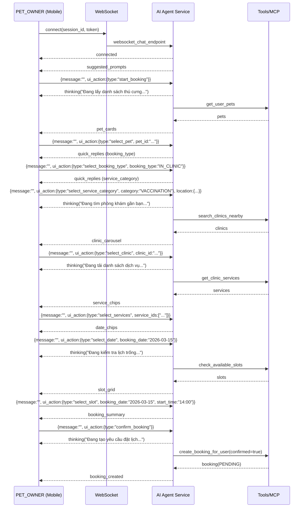

# Hợp Đồng WebSocket AI Chat (Interactive Booking)

Ngày cập nhật: 2026-03-14

Tài liệu này mô tả hợp đồng dữ liệu WebSocket giữa Mobile App (PET_OWNER) và AI Agent Service cho trải nghiệm chat ReAct + đặt lịch bằng Interactive Components.

## Mục tiêu UX
- Giảm nhập liệu: ưu tiên chips/cards/carousel/slot grid.
- Minh bạch trạng thái: luôn có một dòng trạng thái ngắn để người dùng biết AI đang làm gì.
- Không tạo booking ngoài ý muốn: chỉ tạo booking khi người dùng bấm nút **XÁC NHẬN ĐẶT LỊCH**.
- Clinic manager là người xác nhận thời gian cuối: booking được tạo ở trạng thái chờ xác nhận.

## Kết nối
- Endpoint: `ws(s)://<AI_SERVICE_ROOT>/ws/chat/{session_id}?token=<JWT>&context_type=BUSINESS_CHAT`
- Client gửi/nhận JSON.

## Client -> Server (Outgoing)

### 1) Gửi tin nhắn thường
```json
{ "message": "Tôi muốn đặt lịch tiêm phòng cho bé Lu" }
```

### 2) Gửi UI action (bắt buộc có `message: ""`)
Lưu ý: để tránh server lưu nguyên JSON string vào chat history, client luôn gửi `message` rỗng.

```json
{
  "message": "",
  "ui_action": { "type": "start_booking" },
  "location": { "lat": 10.7626, "lng": 106.6602 }
}
```

Các `ui_action.type` chính (Interactive Booking):
- `start_booking`
- `select_pet` (`pet_id`)
- `select_booking_type` (`booking_type`: `IN_CLINIC` | `HOME_VISIT`)
- `select_service_category` (`category`: `CONSULT` | `VACCINATION` | `GROOMING`)
- `select_clinic` (`clinic_id`)
- `select_services` (`service_ids`: string[])
- `select_date` (`booking_date`: `YYYY-MM-DD`)
- `select_slot` (`booking_date`, `start_time`)
- `confirm_booking`
- `cancel_or_change`

## Server -> Client (Incoming)

### A) Event tiêu chuẩn (ReAct streaming)
- `connected`: handshake OK
- `history`: restore lịch sử message
- `ack`: server đã nhận message
- `thinking`: trạng thái ngắn (hoặc thought trong ReAct)
- `tool_call`: AI đang gọi tool nào
- `tool_result`: tool trả về (có thể dùng để debug)
- `stream`: token text trả về theo luồng
- `complete`: kết thúc lượt trả lời
- `error`: lỗi
- `clinic_suggestion`: gợi ý phòng khám (legacy)

### B) Event cho Interactive Components (Booking)
- `suggested_prompts`: chips gợi ý khi mở chat
- `pet_cards`: danh sách thú cưng dạng card
- `quick_replies`: lựa chọn nhanh (hình thức khám / nhóm dịch vụ)
- `clinic_carousel`: danh sách phòng khám dạng carousel
- `service_chips`: chips chọn dịch vụ (multi-select)
- `date_chips`: chips chọn ngày
- `slot_grid`: chips chọn giờ theo ngày
- `booking_summary`: thẻ tóm tắt + 2 nút hành động
- `booking_created`: thông báo đã tạo yêu cầu đặt lịch

Ví dụ `booking_summary`:
```json
{
  "type": "booking_summary",
  "title": "Bạn kiểm tra lại thông tin đặt lịch:",
  "summary": {
    "pet_id": "...",
    "clinic_id": "...",
    "clinic_name": "Phòng khám A",
    "service_ids": ["..."],
    "booking_date": "2026-03-15",
    "start_time": "14:00",
    "booking_type": "IN_CLINIC",
    "estimated_price": 200000
  },
  "actions": [
    { "label": "XÁC NHẬN ĐẶT LỊCH", "ui_action": { "type": "confirm_booking" } },
    { "label": "HỦY / THAY ĐỔI", "ui_action": { "type": "cancel_or_change" } }
  ],
  "timestamp": "..."
}
```

## Quy tắc xác nhận (đảm bảo an toàn)
- Server chỉ gọi tool `create_booking_for_user` khi:
  - Flow Interactive nhận `ui_action.type = confirm_booking`, hoặc
  - Tool call có `confirmed=true` từ UI action.
- Text-based booking trong `BUSINESS_CHAT` của `PET_OWNER` bị chặn không cho “confirm ngầm”.

## Trạng thái ngắn (Status Line)
- Client hiển thị status dựa trên các event: `thinking`, `tool_call`, `tool_result`, `stream`.
- Với Interactive Booking, server gửi `thinking` trước khi gọi từng tool để người dùng không sốt ruột.

## Streaming mượt
- Client nên buffer token `stream` và flush theo cụm (ví dụ 50-80ms) để tránh giật.

## Khôi phục khi reconnect
- Server lưu `metadata.last_ui_event` (chỉ với UI event có thể tương tác) và gửi lại sau `history` để người dùng tiếp tục flow.

## Sequence Diagram (Interactive Booking)

