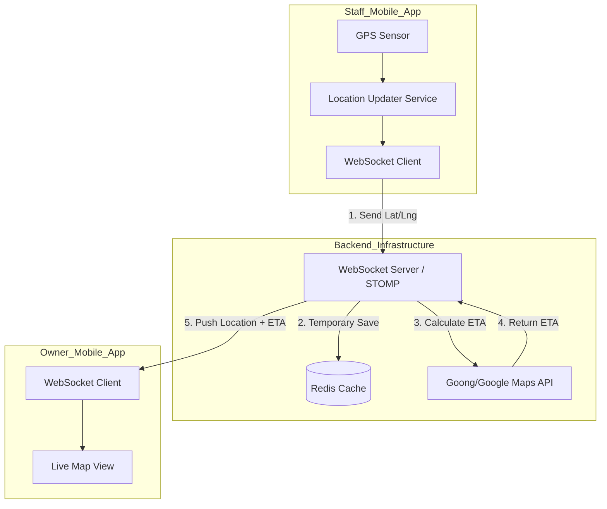

# Technical Design Document: Real-time Staff Location Tracking

## 1. Introduction
This document outlines the technical design for tracking the real-time location of Staff during "Home Visit" bookings. This feature enhances user experience by providing Pet Owners with an Estimated Time of Arrival (ETA) and a live map of the Staff's progress.

## 2. Objectives
- Provide real-time location updates for Staff when traveling to a client's location.
- Calculate and share accurate ETA (Estimated Time of Arrival).
- Ensure privacy by restricting tracking to specific booking states and authorized users.
- Optimize for mobile battery consumption and network latency.

## 3. High-Level Architecture



## 4. Technical Stack
- **Real-time Protocol:** WebSockets with STOMP (over Spring Message Broker).
- **In-memory Storage:** Redis (to store current coordinates of active Staff).
- **Map Services:**
  - **Goong Maps API:** For Routing and ETA calculation (optimized for Vietnam traffic).
  - **Google Maps SDK/Flutter Map:** For in-app map rendering.
- **Mobile Tracking:** Flutter `geolocator` + `flutter_background_service`.

## 5. Detailed Implementation Flow

### 5.1 Activation Logic
Tracking is enabled only when:
1. The booking type is **SOS** or **HOME_VISIT**.
2. The booking status is exactly **ON_THE_WAY**.
3. Monitoring ends immediately when status changes to **IN_PROGRESS**, **COMPLETED**, or **CANCELLED**.

### 5.2 Staff Side
- The app starts a background task when Staff clicks "Start Travel".
- Updates are sent every **5-10 seconds** or when Staff has moved more than **10 meters**.
- Payload:

```json
{
  "bookingId": "uuid",
  "latitude": 10.12345,
  "longitude": 106.6789,
  "currentSpeed": 35.5,
  "timestamp": "iso-date"
}
```

### 5.3 Backend Logic
- **WebSocket Endpoint:** `/ws/tracking`
- **Topic Structure:** `/topic/booking.{bookingId}.location`
- **Processing Steps:**
  1. Validate `bookingId` and user association.
  2. Check if status is `ON_THE_WAY`.
  3. Update Staff's location in Redis: `SET staff_location:{bookingId} {lat, lng}` (Expiration: 1 hour).
  4. Call Goong Maps Distance Matrix API.
  5. Broadcast enriched data to the Owner topic.

### 5.4 Owner Side
- The Owner app subscribes to the topic for the active booking.
- UI renders a moving Staff marker and ETA text.

## 6. Security and Privacy
- WebSocket connection requires a valid JWT token.
- The backend only broadcasts to the Pet Owner associated with the booking.
- Real-time trace is cleared from Redis after completion.

## 7. Edge Cases
- If no update is received for more than 30 seconds, the Owner UI shows that Staff is offline.
- ETA is recalculated when traffic or route changes significantly.
- If Staff stops unexpectedly for too long, notify the Owner.

## 8. Data Schema
| Key | Type | Description |
|---|---|---|
| `tracking:{bookingId}` | Hash | `{ "lat": 10.x, "lng": 106.x, "eta": "5 mins", "last_updated": "..." }` |
