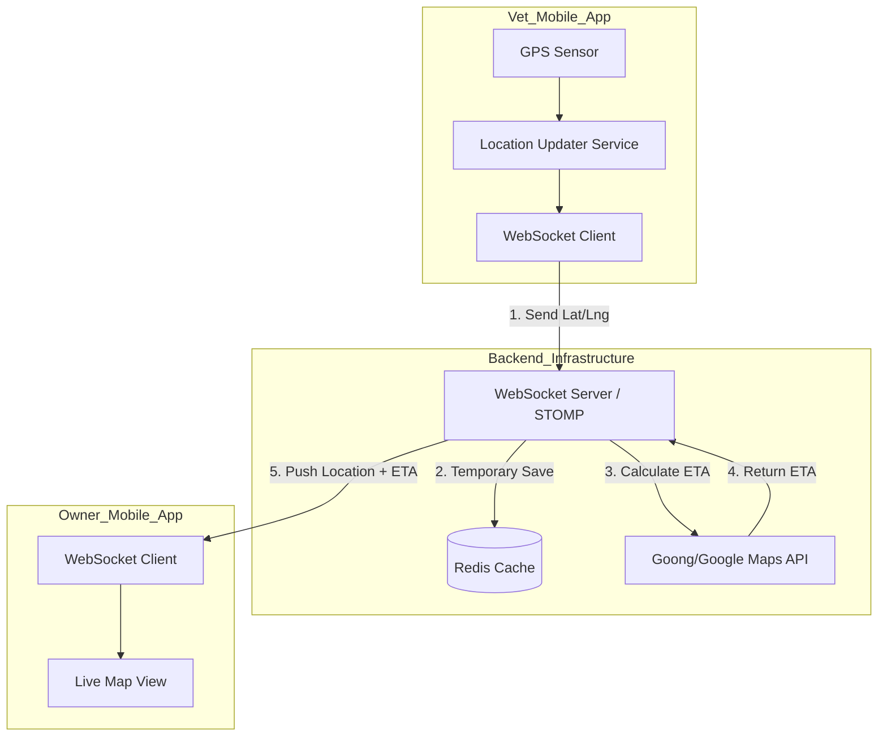

# Technical Design Document: Real-time Vet Location Tracking

## 1. Introduction
This document outlines the technical design for tracking the real-time location of Veterinarians (Vets) during "Home Visit" bookings. This feature aims to enhance user experience by providing Pet Owners with an Estimated Time of Arrival (ETA) and a visual map of the Vet's progress.

## 2. Objectives
- Provide real-time location updates for Vets when traveling to a client's location.
- Calculate and share accurate ETA (Estimated Time of Arrival).
- Ensure privacy by restricting tracking to specific booking states and authorized users.
- Optimize for mobile battery consumption and network latency.

## 3. High-Level Architecture



## 4. Technical Stack
- **Real-time Protocol:** WebSockets with STOMP (over Spring Message Broker).
- **In-memory Storage:** Redis (to store current coordinates of active Vets).
- **Map Services:** 
    - **Goong Maps API:** For Routing and ETA calculation (optimized for Vietnam traffic).
    - **Google Maps SDK/Flutter Map:** For in-app map rendering.
- **Mobile Tracking:** Flutter `geolocator` + `flutter_background_service`.

## 5. Detailed Implementation Flow

### 5.1 Activation Logic (Safety & Privacy)
Tracking is **ONLY** enabled when:
1. The Booking type is **HOME_VISIT**.
2. The Booking status is exactly **EN_ROUTE**.
3. Monitoring ends immediately when status changes to **ARRIVED** or **CANCELLED**.

### 5.2 Vet Side (Producer)
- **Background Service:** The app starts a background task when the Vet clicks "Start Travel".
- **Throttle:** Updates are sent every **5-10 seconds** or when the Vet has moved more than **10 meters** to save battery.
- **Payload:**
  ```json
  {
    "bookingId": "uuid",
    "latitude": 10.12345,
    "longitude": 106.6789,
    "currentSpeed": 35.5,
    "timestamp": "iso-date"
  }
  ```

### 5.3 Backend Logic (Broker & Processor)
- **WebSocket Endpoint:** `/ws/tracking`.
- **Topic Structure:** `/topic/booking.{bookingId}.location`.
- **Processing Steps:**
    1. Validate `bookingId` and user association.
    2. Check if status is `EN_ROUTE`.
    3. Update Vet's location in Redis: `SET vet_location:{bookingId} {lat, lng}` (Expiration: 1 hour).
    4. Call Goong Maps Distance Matrix API:
        - Origin: Vet Current Location.
        - Destination: Booking Address Location.
    5. Broadcast enriched data to Owner's topic.

### 5.4 Owner Side (Consumer)
- **Subscription:** The Owner app subscribes to the specific topic for their active booking.
- **Rendering:**
    - Animates a custom Vet Marker on the map.
    - Displays a sticky toast/bottom sheet: *"Vet is approximately 1.5km away (ETA: 5 mins)"*.

## 6. Security and Privacy
- **Authorization:** WebSocket connection requires a valid JWT token.
- **Filtering:** The backend only broadcasts to the Pet Owner associated with the `bookingId`.
- **Audit Log:** Final location is saved in the EMR as a "Check-in Point" for verification, but real-time trace is cleared from Redis after completion.

## 7. Edge Case Handling
- **Lost Connection:** If no update is received for > 30s, the Owner UI shows "Vet is currently offline/signal lost".
- **Traffic Jams:** ETA is recalculated every 2 minutes or when the route significantly deviates.
- **Manual Stop:** If the Vet stops for > 5 mins (e.g., breakdown), a notification is sent to the Owner.

## 8. Data Schema (Redis)
| Key | Type | Description |
|---|---|---|
| `tracking:{bookingId}` | Hash | `{ "lat": 10.x, "lng": 106.x, "eta": "5 mins", "last_updated": "..." }` |
