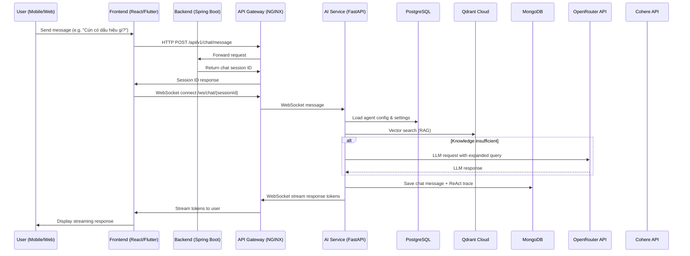
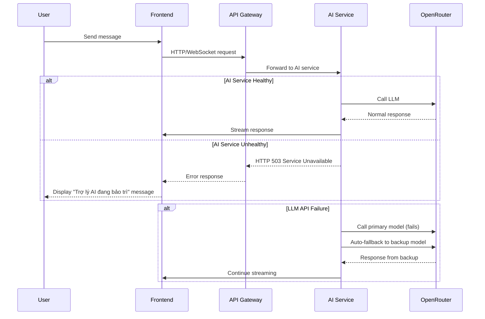
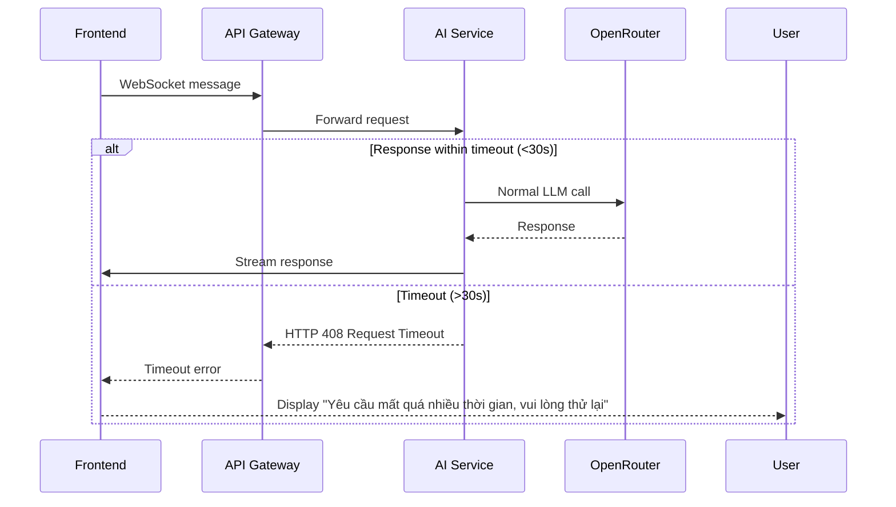
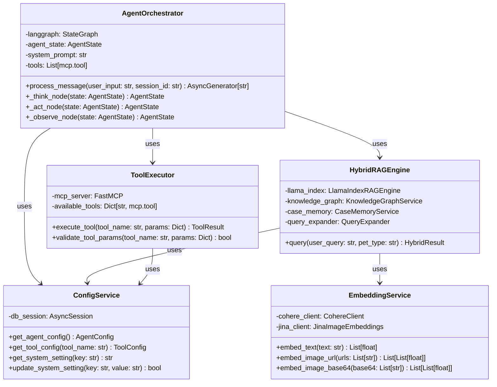
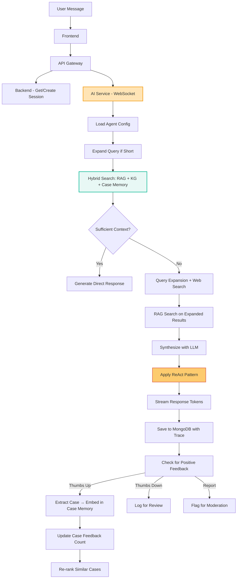
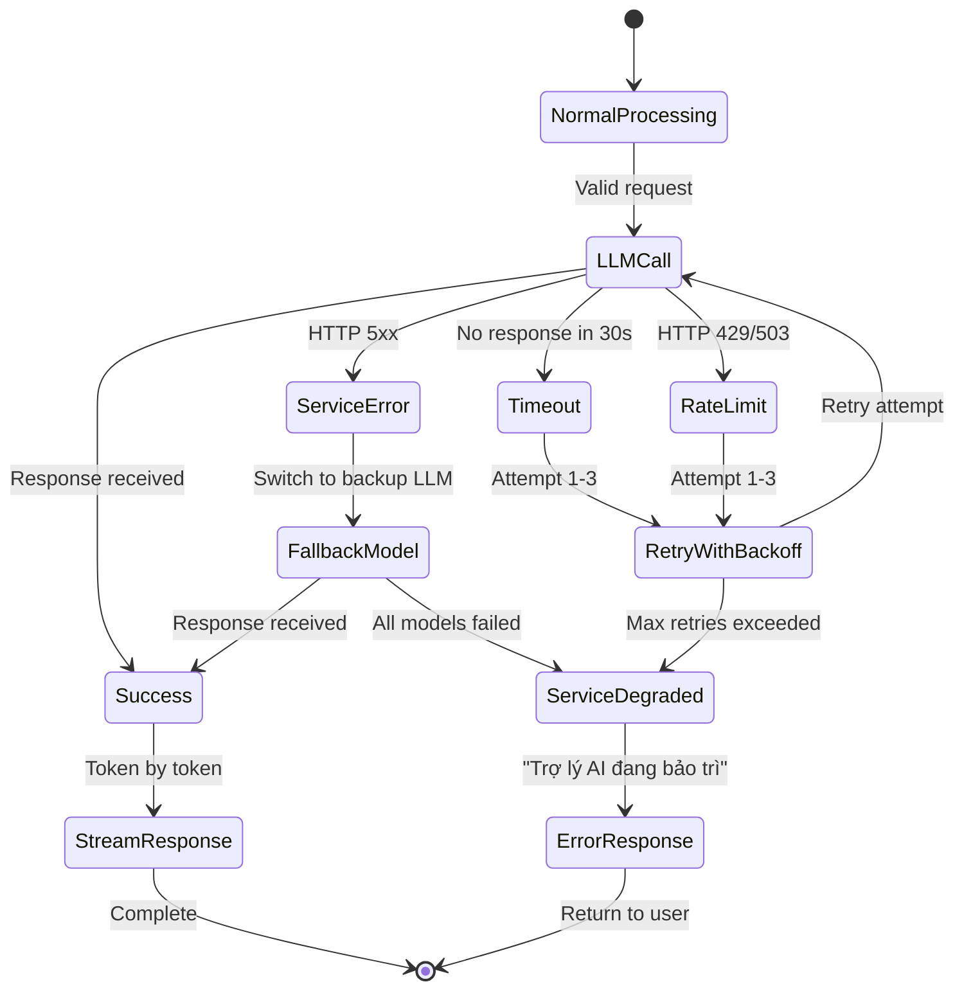

# AI Service Architecture Presentation

> Lưu ý cập nhật ngày 2026-03-17: slide này có thể còn chứa tham chiếu lịch sử tới AI Diagnose cũ, thumbs feedback và visual case memory. Kiến trúc hiện hành là knowledge base + EMR xác nhận + Gemini Vision.
## Petties - Veterinary Appointment Booking Platform

---

## 1. AI Service as a Separate Component

### System Architecture Overview
```
┌─────────────────┐    ┌──────────────────┐    ┌─────────────────┐
│   Frontend      │    │  API Gateway     │    │   Backend       │
│  (Web/Mobile)   │◄──►│  (NGINX)         │◄──►│ (Spring Boot)   │
└─────────────────┘    └──────────────────┘    └─────────────────┘
                                   │
                                   ▼
                        ┌──────────────────┐
                        │   AI Service     │
                        │  (FastAPI/Python)│
                        └──────────────────┘
                                   │
                                   ▼
                ┌─────────────────────────────┐
                │       Data Stores           │
                │  PostgreSQL • MongoDB •     │
                │   Qdrant • Redis • Cloudinary│
                └─────────────────────────────┘
```

### Key Points:
- AI Service is deployed as a separate microservice (FastAPI/Python 3.12)
- Communicates with backend via REST APIs
- Has independent access to data stores (PostgreSQL for config, Qdrant for vectors, MongoDB for chat history)
- Deployed on separate port (8000) vs Backend (8080)

---

## 2. Package Diagram - AI Service Layer

```
petties-agent-serivce (FastAPI + Python 3.12)
├── api/
│   ├── routes/          # REST Endpoint Layer
│   ├── websocket/       # Real-time Communication Layer  
│   ├── middleware/      # Request Interception Layer
│   ├── schemas/         # API Contract Layer
│   └── dependencies/    # Dependency Injection Layer
├── core/
│   ├── agents/          # AI Agent Orchestration (LangGraph + ReAct)
│   ├── tools/           # Tool Infrastructure (FastMCP @mcp.tool)
│   ├── rag/             # Knowledge Retrieval Layer (LlamaIndex)
│   ├── config_helper/   # Dynamic Configuration Layer
│   └── sentry/          # Error Monitoring Layer
├── services/            # External Integration Layer (OpenRouter, Cohere)
├── db/
│   └── postgres/        # ORM Models & Session Management
├── config/              # Environment Configuration
└── tests/               # Test Suite
```

### Dependencies:
- API Layer → Core Layer
- Core Layer → Services Layer + Database Layer
- Services Layer → Configuration Layer
- All layers depend on Configuration Layer

---

## 3. Sequence Diagrams: System ↔ AI Communication

### 3.1 Standard Request Flow


### 3.2 Error Handling Flow


### 3.3 Timeout Handling


---

## 4. Database Design for AI Data Storage

### 4.1 What Gets Stored & Where

| Data Type | Storage Location | Purpose | Retention |
|-----------|------------------|---------|-----------|
| **Agent Config** | PostgreSQL (`agents`, `tools`, `prompt_versions`) | Runtime configuration, tool management, prompt versioning | Persistent (until changed) |
| **Encrypted API Keys** | PostgreSQL (`system_settings`) | Secure storage of OpenRouter, Cohere, Qdrant keys | Persistent (encrypted) |
| **Chat Sessions** | MongoDB (`ai_chat_sessions`) | Session metadata, user_id, timestamps | 30 days (configurable) |
| **Chat Messages** | MongoDB (`ai_chat_messages`) | Full conversation history with ReAct traces (thought/action/observation) | 30 days (configurable) |
| **User Feedback** | MongoDB (`chat_feedback`) | Thumbs up/down, reports, feedback text (chỉ dùng cho UX analysis, không dùng làm nguồn học) | 90 days (for analysis) |
| **Knowledge Base** | PostgreSQL (`knowledge_documents`) + Qdrant (`petties_knowledge`) | Document metadata + vector embeddings | Persistent |
| **Case Memory** | Qdrant (`petties_case_memory_v2`) | **EMR-confirmed cases** (thay thế feedback-driven): text + image vectors | Persistent (with pruning) |
| **Tool Usage Logs** | MongoDB (implicit in chat_messages) | Audit trail of tool calls with parameters/results | 30 days |

### 4.2 AI-Related Tables in PostgreSQL
```sql
-- Core AI Configuration Tables
agents                 -- Single agent configuration
tools                  -- Tool registry (@mcp.tool metadata)
prompt_versions        -- System prompt version control (FK to agents)
knowledge_documents    -- RAG document metadata
system_settings        -- Encrypted API keys & runtime config
```

### 4.3 AI-Related Collections in MongoDB
```javascript
// Chat History Storage
ai_chat_sessions       // { sessionId, userId, createdAt, lastActive }
ai_chat_messages       // { sessionId, messageId, role, content, reactTrace, timestamp }
chat_feedback          // { messageId, sessionId, userRole, feedbackType, category, ... }
```

### 4.4 Qdrant Collections for AI
```json
// Vector Stores
petties_knowledge      // RAG knowledge base (Cohere embeddings, 1024-dim)
petties_case_memory_v2 // Case memory with named vectors:
//                      //   - text: Cohere embed-multilingual-v3 (1024-dim)
//                      //   - image: Jina CLIP v2 (1024-dim)
```

---

## 5. Class Diagram: AI Processing Components

### 5.1 Core AI Component Structure


### 5.2 Key Processing Classes
| Class | Responsibility | Location |
|-------|----------------|----------|
| **AgentOrchestrator** | Implements ReAct loop using LangGraph StateGraph | `app/core/agents/orchestrator.py` |
| **ToolExecutor** | Executes @mcp.tool decorated functions with parameter validation | `app/core/tools/executor.py` |
| **HybridRAGEngine** | Combines RAG + Knowledge Graph + Case Memory with re-ranking | `app/core/rag/hybrid_engine.py` |
| **EmbeddingService** | Handles text (Cohere) and image (Jina CLIP v2) embeddings | `app/core/embeddings/` |
| **ConfigService** | Loads dynamic configuration from PostgreSQL (hot-reload capable) | `app/core/config_helper.py` |
| **FeedbackService** | Processes user feedback and updates case memory | `app/core/services/feedback_service.py` |

---

## 6. Data Flow for AI Processing

### 6.1 Detailed Processing Pipeline


### 6.2 ReAct Loop Implementation
```python
# Simplified ReAct loop in AgentOrchestrator
async def process_message(self, user_input: str, session_id: str):
    # Initialize state
    state = AgentState(
        messages=[{"role": "user", "content": user_input}],
        tool_calls=[],
        observations=[]
    )
    
    # ReAct Loop: Think → Act → Observe → (Repeat if needed)
    while not self._should_end(state):
        # THINK: LLM reasoning
        state = await self._think_node(state)
        
        # ACT: Execute tools if needed
        if state.get("tool_calls"):
            state = await self._act_node(state)
        
        # OBSERVE: Process tool results
        state = await self._observe_node(state)
    
    # FINALIZE: Generate and stream response
    async for token in self._generate_response(state):
        yield token
```

### 6.3 Error Handling & Fallbacks


---

## 7. Verification & Analysis Capabilities

### 7.1 Data Available for Later Analysis
From the storage mechanisms described above, the following data is available for verification and analysis:

1. **Conversation Analysis**
   - Full chat history with user/AI turns (MongoDB)
   - ReAct traces showing AI reasoning process (thought/action/observation)
   - Tool usage patterns and effectiveness

2. **Performance Metrics**
   - Response latency measurements
   - Token usage per request
   - Success/failure rates of tool calls
   - Feedback distribution by category and user role

3. **Knowledge Base Effectiveness**
   - RAG retrieval relevance scores
   - Case memory hit rates
   - Knowledge gap identification (queries requiring web search)

4. **User Satisfaction**
   - Feedback scores (thumbs up/down) by interaction type
   - Common complaint patterns from "report" feedback
   - Improvement tracking over time

### 7.2 Verification Queries Possible
```sql
-- Check AI response quality over time
SELECT 
    DATE(created_at) as date,
    AVG(CASE WHEN feedback_type = 'THUMBS_UP' THEN 1.0 ELSE 0.0 END) as satisfaction_rate,
    COUNT(*) as total_interactions
FROM mongodb.chat_feedback 
WHERE created_at > DATE_SUB(NOW(), INTERVAL 30 DAY)
GROUP BY DATE(created_at)
ORDER BY date;

-- Analyze tool usage effectiveness
SELECT 
    tool_used,
    COUNT(*) as usage_count,
    SUM(CASE WHEN feedback_type = 'THUMBS_UP' THEN 1 ELSE 0 END) as positive_feedback,
    ROUND(SUM(CASE WHEN feedback_type = 'THUMBS_UP' THEN 1 ELSE 0 END) / COUNT(*), 2) as success_rate
FROM mongodb.chat_feedback
WHERE tool_used IS NOT NULL
GROUP BY tool_used
ORDER BY success_rate DESC;

-- Identify knowledge gaps
SELECT 
    SUBSTRING(feedback_text, 1, 100) as query_preview,
    COUNT(*) as frequency
FROM mongodb.chat_feedback
WHERE feedback_category = 'KNOWLEDGE' 
  AND feedback_reason = 'INCORRECT_INFO'
GROUP BY SUBSTRING(feedback_text, 1, 100)
ORDER BY frequency DESC
LIMIT 10;
```

### 7.3 Real-time Monitoring Capabilities
- **WebSocket Message Tracing**: Full visibility into request/response flow
- **ReAct Trace Inspection**: See exactly how AI arrived at each conclusion
- **Tool Call Monitoring**: Track which tools are called, with what parameters, and what they returned
- **Performance Metrics**: Latency, token usage, error rates exposed via monitoring endpoints

---

## 8. Summary: AI Service Architecture Compliance

### ✅ Addresses All Requirements:

1. **System Architecture/Package Diagram** 
   - AI Service shown as separate microservice in architecture diagrams
   - Detailed package structure provided showing clear separation of concerns

2. **Sequence Diagrams for System-AI Communication**
   - Standard request/response flows with WebSocket streaming
   - Error handling and timeout scenarios clearly documented
   - Fallback mechanisms for LLM API failures shown

3. **Database Design for AI Data Storage**
   - PostgreSQL stores configuration, encrypted API keys, prompt versions
   - MongoDB stores complete chat history with ReAct traces for audit/analysis
   - Qdrant stores vector embeddings for knowledge base and case memory
   - All data required for later analysis and verification is preserved

4. **Class Diagram Shows Modular AI Processing**
   - Separate classes for: Agent Orchestration, Tool Execution, RAG Engine, Embedding Services
   - Clear separation between AI logic (core/) and integration (services/, db/)
   - Configuration is externalized and dynamically reloadable

### 🔧 Implementation Status:
- **Completed**: Core AI service with ReAct pattern, tool system, RAG pipeline
- **Completed**: Dynamic configuration, feedback loop, case memory with hybrid vectors
- **Completed**: Monitoring, error handling, and fallback mechanisms
- **In Progress**: Advanced analytics dashboard for AI performance metrics
- **Planned**: Knowledge Graph enhancement (Phase 2)

This architecture ensures the AI service is a well-integrated, separately deployable component with full observability, data persistence for verification, and robust error handling.
