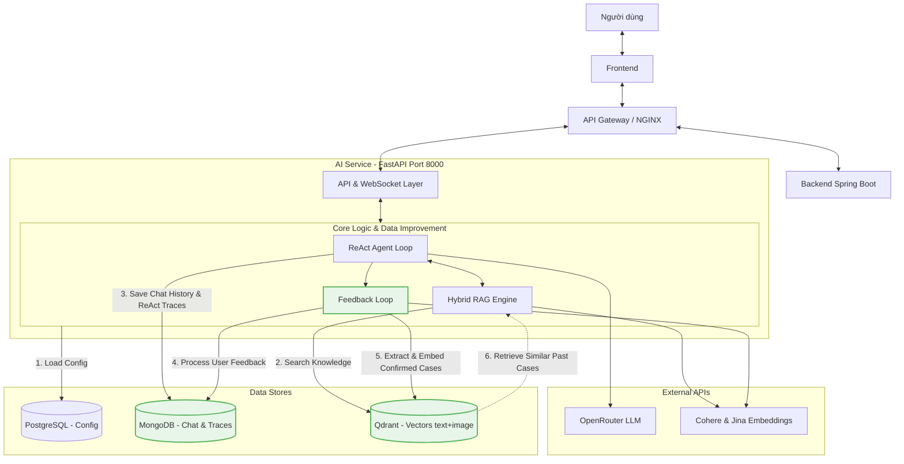

# AI Service Architecture - Simple Diagram with Data Improvement

> Lưu ý cập nhật ngày 2026-03-17: sơ đồ này chứa hướng cải thiện dữ liệu cũ dựa trên thumbs up/down và visual case memory. Kiến trúc hiện hành chuyển sang EMR xác nhận + knowledge base + Gemini Vision.
**Petties Veterinary Platform**

## Script Trình Bày (1.5 Phút)

**[Slide Mở Đầu - 15s]**
"Đây là sơ đồ kiến trúc tổng thể của AI Service - bộ não của Petties. AI Service chạy như một microservice độc lập trên cổng 8000, giao tiếp qua WebSocket để stream dữ liệu realtime về frontend."

**[Giải Thích Luồng Xử Lý Cơ Bản - 30s]**
"Luồng xử lý cơ bản đi từ trên xuống dưới:
1. Người dùng gửi tin nhắn → Frontend → API Gateway.
2. Backend tạo session chat, sau đó Frontend kết nối WebSocket trực tiếp đến AI Service.
3. Trong AI Service, **ReAct Agent** (suy nghĩ, gọi công cụ, quan sát) sử dụng **Hybrid RAG** để tìm kiếm bối cảnh. Hệ thống sử dụng OpenRouter (để gọi các LLM mạnh mẽ) và Cohere/Jina để chuyển đổi văn bản/hình ảnh thành vector (embeddings).
4. Cấu hình hệ thống được tải động từ PostgreSQL (hỗ trợ hot-reload)."

**[Cơ Chế Cải Thiện Dữ Liệu AI - 45s (Phần Màu Xanh Lá)]**
"Điểm đặc biệt nhất của kiến trúc này là **cơ chế tự cải thiện dữ liệu theo thời gian (Data Improvement Loop)**, thể hiện ở nửa dưới sơ đồ:
1. **Lưu Trữ Chi Tiết**: Mọi cuộc trò chuyện và luồng suy nghĩ (ReAct traces) của AI đều được lưu vào **MongoDB** để đội ngũ phát triển phân tích và audit.
2. **Thu Thập Phản Hồi**: Khi người dùng nhấn Thumbs Up/Down, hệ thống ghi nhận feedback vào MongoDB để analytics, audit, và monitoring.
3. **EMR-Driven Case Memory**: Khi bác sĩ lưu EMR đã xác nhận, hệ thống đồng bộ thông tin (triệu chứng, chẩn đoán, hình ảnh, SOAP, toa thuốc) vào **Qdrant**.
4. **Tái Sử Dụng Ca Đã Xác Nhận**: Trong các lần hỏi sau, **Hybrid RAG** sẽ truy vấn lại Case Memory từ EMR confirmed để tăng chất lượng grounding cho câu trả lời.

**[Kết Luận - 10s]**
"Cơ chế này giúp AI của Petties càng dùng càng thông minh, cá nhân hóa kiến thức theo đúng nghiệp vụ của phòng khám mà không cần fine-tune model tốn kém."
