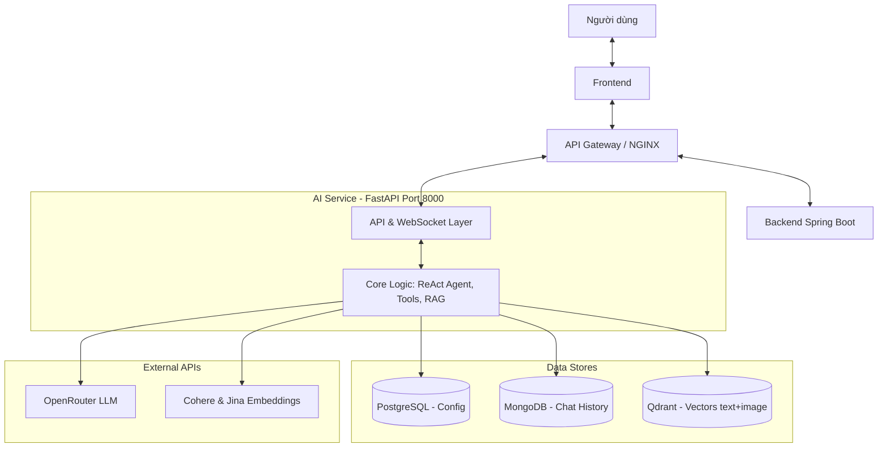

# AI Service Architecture - Simple Diagram
**Petties Veterinary Platform**

## Script Trình Bày (1 Phút)

**[Slide Mở Đầu]**
"Đây là sơ đồ kiến trúc đơn giản hóa của AI Service - bộ não của Petties. AI Service được thiết kế như một microservice hoàn toàn độc lập chạy trên cổng 8000 bằng FastAPI."

**[Giải Thích Sơ Đồ]**
"Luồng dữ liệu đi từ trên xuống dưới:
1. **Giao tiếp**: Người dùng gửi tin nhắn qua Frontend → API Gateway. Gateway sẽ gọi Backend Spring Boot để tạo session, sau đó mở kết nối WebSocket trực tiếp đến AI Service.
2. **Bên trong AI Service**: Xử lý qua 2 tầng chính. Tầng API nhận request, chuyển cho tầng Core Logic xử lý vòng lặp ReAct (suy nghĩ, gọi tool, trả lời) và hệ thống tìm kiếm Hybrid RAG.
3. **Lưu trữ dữ liệu**: Điểm đặc biệt là AI Service có kho dữ liệu riêng:
   - PostgreSQL để tải cấu hình động (hot-reload).
   - MongoDB lưu toàn bộ lịch sử chat và luồng suy nghĩ của AI để phân tích.
   - Qdrant lưu trữ vector kiến thức và case memory (kết hợp cả vector văn bản và hình ảnh).
4. **Tích hợp ngoài**: AI Service gọi Cloud APIs như OpenRouter (LLM) và Cohere/Jina để tạo embeddings, không cần GPU server đắt tiền."

**[Kết Luận]**
"Kiến trúc này giúp cô lập hoàn toàn lỗi giữa AI và hệ thống core booking, dễ dàng scale độc lập, đồng thời lưu trữ đầy đủ dữ liệu chat/feedback để huấn luyện AI chính xác hơn trong tương lai."