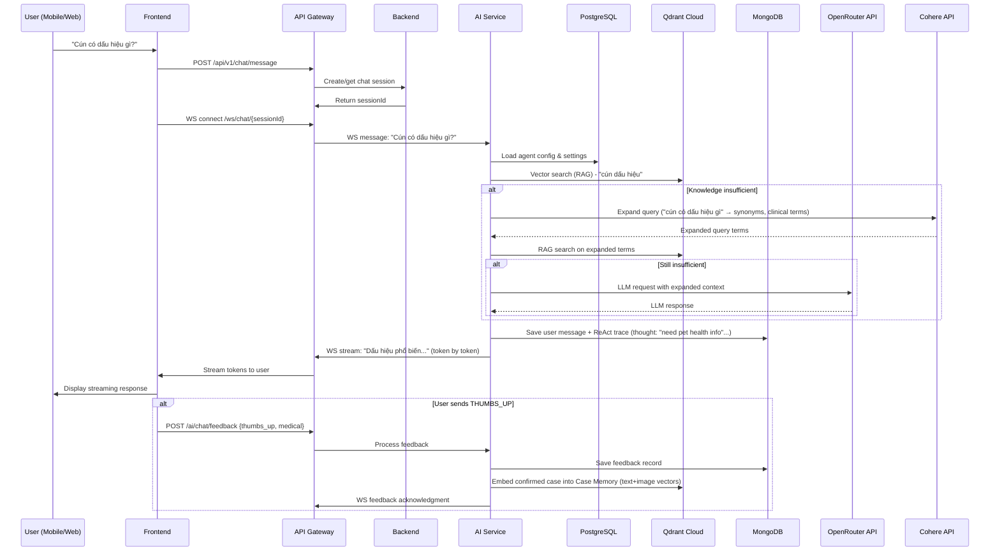
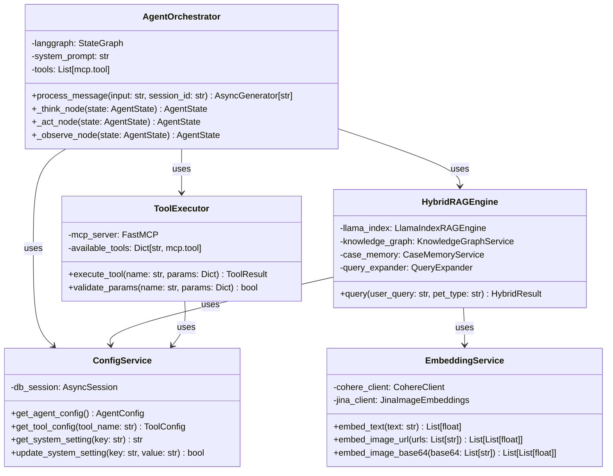

# AI Service Deep Dive

> Lưu ý cập nhật ngày 2026-03-17: một số tham chiếu AI Diagnose trong slide này chỉ còn giá trị lịch sử. Luồng chẩn đoán hiện tại cho bác sĩ dùng knowledge base nội bộ + EMR xác nhận + Gemini Vision, không dùng `web_search`.
## Petties Veterinary Platform

---

### Slide 1: AI Service as Separate Microservice
**System Context (Following Overall Architecture)**

```
┌─────────────────┐    ┌──────────────────┐    ┌─────────────────┐
│   Frontend      │    │  API Gateway     │    │   Backend       │
│  (Web/Mobile)   │◄──►│  (NGINX)         │◄──►│ (Spring Boot)   │
└─────────────────┘    └──────────────────┘    └─────────────────┘
                                   │
                                   ▼
                        ┌──────────────────┐
                        │    AI Service    │
                        │  (FastAPI/Python)│
                        └──────────────────┘
                                   │
                                   ▼
                ┌─────────────────────────────┐
                │       Data Stores           │
                │  PostgreSQL • MongoDB •     │
                │   Qdrant • Redis • Cloudinary│
                └─────────────────────────────┘
```

**Key Characteristics:**
- ✅ **Separate Deployable Service**: Port 8000 (vs Backend 8080)
- ✅ **Cloud-Native AI Stack**: Zero local GPU/RAM required
- ✅ **Independent Scaling**: Scale AI service separately from backend
- ✅ **Technology Isolation**: Python/FastAPI vs Java/Spring Boot
- ✅ **Fault Isolation**: AI service failure doesn't bring down booking system

---

### Slide 2: AI Service Package Structure
**petties-agent-serivce (FastAPI + Python 3.12)**

```
├── api/                          # Presentation Layer
│   ├── routes/                   # REST endpoints (/chat, /feedback, /config)
│   ├── websocket/                # Real-time streaming endpoints
│   ├── middleware/               # Auth, logging, request processing
│   ├── schemas/                  # Pydantic models (request/validation)
│   └── dependencies/             # DB sessions, current user, pagination
│
├── core/                         # Business Logic Layer
│   ├── agents/                   # LangGraph ReAct orchestrator
│   ├── tools/                    # FastMCP @mcp.tool infrastructure
│   ├── rag/                      # Hybrid RAG engine (RAG+KG+CaseMemory)
│   ├── config_helper/            # Dynamic PostgreSQL config loader
│   └── sentry/                   # Error monitoring & tracing
│
├── services/                     # External Integrations
│   ├── openrouter_client.py      # LLM API with fallback
│   ├── cohere_client.py          # Embeddings API
│   └── jina_client.py            # Image embeddings (Jina CLIP v2)
│
├── db/                           # Data Access Layer
│   └── postgres/                 # SQLAlchemy models & session mgmt
│
├── config/                       # Environment Configuration
│   └── settings.py               # Pydantic settings with validation
│
└── tests/                        # Test Suite (pytest)
```

**Layer Dependencies:**
```
API Layer → Core Layer
Core Layer → {Services Layer, Data Access Layer}
Services Layer → Configuration Layer
All Layers ← Configuration Layer
```

---

### Slide 3: Request Flow & Data Handling
**End-to-End AI Processing Pipeline**



**Data Storage for Analysis & Verification:**
| Data Type | Storage | Purpose | Retention |
|-----------|---------|---------|-----------|
| **Full Chat History** | MongoDB (`ai_chat_messages`) | User/AI turns + ReAct traces (thought/action/observation) | 30 days |
| **User Feedback** | MongoDB (`chat_feedback`) | Thumbs up/down, reports, feedback text (chỉ dùng cho UX analysis) | 90 days |
| **Agent Config** | PostgreSQL (`agents`, `tools`, `prompt_versions`) | Runtime configuration, tool management, prompt versioning | Persistent |
| **Encrypted API Keys** | PostgreSQL (`system_settings`) | Secure storage of OpenRouter, Cohere, Qdrant keys | Persistent (encrypted) |
| **Knowledge Base** | PostgreSQL (`knowledge_documents`) + Qdrant (`petties_knowledge`) | Doc metadata + vector embeddings | Persistent |
| **Case Memory** | Qdrant (`petties_case_memory_v2`) | **EMR-confirmed cases** (thay thế feedback-driven):<br>- `text`: Cohere embed-multilingual-v3 (1024-dim)<br>- `image`: Jina CLIP v2 (1024-dim) | Persistent (with pruning) |

> **⚠️ 2026-03-17 Update:** Case Memory nguồn từ EMR confirmed, không còn từ thumbs up/down feedback.

**Verification Queries Possible:**
```sql
-- AI response quality over time
SELECT 
    DATE(created_at) as date,
    AVG(CASE WHEN feedback_type = 'THUMBS_UP' THEN 1.0 ELSE 0.0 END) as satisfaction_rate
FROM mongodb.chat_feedback 
WHERE created_at > DATE_SUB(NOW(), INTERVAL 30 DAY)
GROUP BY DATE(created_at);

-- Tool usage effectiveness
SELECT 
    tool_used,
    COUNT(*) as usage_count,
    SUM(CASE WHEN feedback_type = 'THUMBS_UP' THEN 1 ELSE 0 END) as positive_feedback
FROM mongodb.chat_feedback
GROUP BY tool_used
ORDER BY positive_feedback DESC;
```

---

### Slide 4: Modular AI Processing Components
**Class Diagram: Separation of Concerns**



**Key Processing Classes & Responsibilities:**
| Class | Responsibility | Location |
|-------|----------------|----------|
| **AgentOrchestrator** | Implements ReAct loop (Think→Act→Observe) using LangGraph | `app/core/agents/orchestrator.py` |
| **ToolExecutor** | Executes @mcp.tool functions with parameter validation | `app/core/tools/executor.py` |
| **HybridRAGEngine** | Combines RAG + Knowledge Graph + Case Memory with re-ranking | `app/core/rag/hybrid_engine.py` |
| **EmbeddingService** | Handles text (Cohere) and image (Jina CLIP v2) embeddings | `app/core/embeddings/` |
| **ConfigService** | Loads dynamic configuration from PostgreSQL (hot-reload capable) | `app/core/config_helper.py` |
| **FeedbackService** | Processes user feedback and updates case memory | `app/core/services/feedback_service.py` |

**Critical Architecture Points:**
- ✅ **Separation of Concerns**: Each layer has single responsibility
- ✅ **Dependency Injection**: Configuration and services injected, not hardcoded
- ✅ **Testability**: Each component can be unit tested in isolation
- ✅ **Extensibility**: New tools added via @mcp.tool without touching core logic
- ✅ **Hot Reload**: Configuration changes take effect without restart (PostgreSQL polling)
