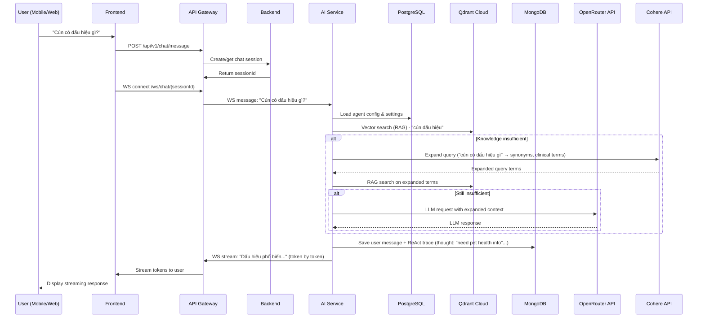
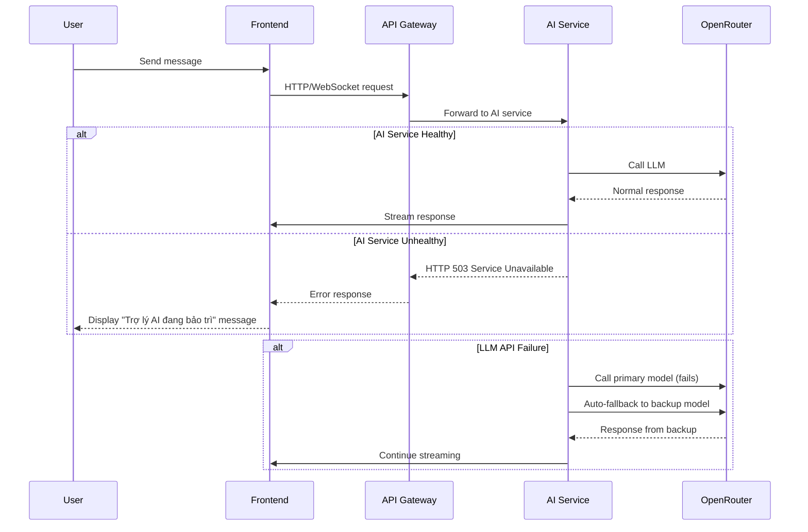
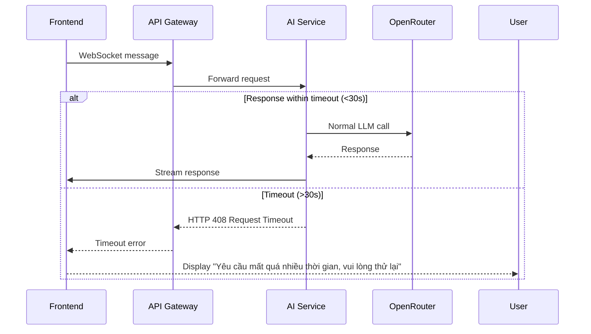
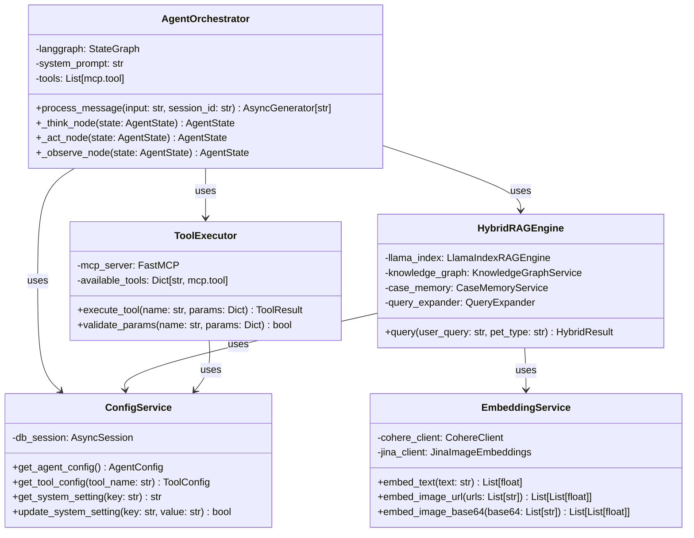

# AI Service Deep Dive
## Petties Veterinary Platform

### 1. AI Service as Separate Microservice
**Position in Overall System Architecture**

```
┌─────────────────┐    ┌──────────────────┐    ┌─────────────────┐
│   Frontend      │    │  API Gateway     │    │   Backend       │
│  (Web/Mobile)   │◄──►│  (NGINX)         │◄──►│ (Spring Boot)   │
└─────────────────┘    └──────────────────┘    └─────────────────┘
                                   │
                                   ▼
                        ┌──────────────────┐
                        │    AI Service    │
                        │  (FastAPI/Python)│
                        └──────────────────┘
                                   │
                                   ▼
                ┌─────────────────────────────┐
                │       Data Stores           │
                │  PostgreSQL • MongoDB •     │
                │   Qdrant • Redis • Cloudinary│
                └─────────────────────────────┘
```

**Key Points Demonstrating Separation:**
- ✅ **Independent Deployment**: AI Service runs on port 8000 (Backend on 8080)
- ✅ **Separate Technology Stack**: Python/FastAPI vs Java/Spring Boot
- ✅ **Independent Scaling**: Can scale AI service separately from backend
- ✅ **Fault Isolation**: AI service issues don't affect booking/core functionality
- ✅ **Clear Interface**: Communicates via well-defined REST/WebSocket APIs
- ✅ **Data Store Access**: Has direct, independent access to required data stores

### 2. Sequence Diagrams: System ↔ AI Communication

#### Standard Request Flow


#### Error Handling & Fallback Flow


#### Timeout Handling


### 3. Database Design for AI Data Storage & Verification

#### What Gets Stored & Where (For Later Analysis)
| Data Type | Storage Location | Purpose | Retention |
|-----------|------------------|---------|-----------|
| **Full Chat History** | MongoDB (`ai_chat_messages`) | User/AI turns + ReAct traces (thought/action/observation) | 30 days |
| **User Feedback** | MongoDB (`chat_feedback`) | Thumbs up/down, reports, feedback text | 90 days |
| **Agent Config** | PostgreSQL (`agents`, `tools`, `prompt_versions`) | Runtime configuration, tool management, prompt versioning | Persistent |
| **Encrypted API Keys** | PostgreSQL (`system_settings`) | Secure storage of OpenRouter, Cohere, Qdrant keys | Persistent (encrypted) |
| **Knowledge Base** | PostgreSQL (`knowledge_documents`) + Qdrant (`petties_knowledge`) | Doc metadata + vector embeddings | Persistent |
| **Case Memory** | Qdrant (`petties_case_memory_v2`) | Confirmed cases with **named vectors**:<br>- `text`: Cohere embed-multilingual-v3 (1024-dim)<br>- `image`: Jina CLIP v2 (1024-dim) | Persistent (with pruning) |

#### Verification Queries Possible
```sql
-- AI response quality over time
SELECT 
    DATE(created_at) as date,
    AVG(CASE WHEN feedback_type = 'THUMBS_UP' THEN 1.0 ELSE 0.0 END) as satisfaction_rate
FROM mongodb.chat_feedback 
WHERE created_at > DATE_SUB(NOW(), INTERVAL 30 DAY)
GROUP BY DATE(created_at);

-- Tool usage effectiveness
SELECT 
    tool_used,
    COUNT(*) as usage_count,
    SUM(CASE WHEN feedback_type = 'THUMBS_UP' THEN 1 ELSE 0 END) as positive_feedback
FROM mongodb.chat_feedback
GROUP BY tool_used
ORDER BY positive_feedback DESC;

-- Identify knowledge gaps
SELECT 
    SUBSTRING(feedback_text, 1, 100) as query_preview,
    COUNT(*) as frequency
FROM mongodb.chat_feedback
WHERE feedback_category = 'KNOWLEDGE' 
  AND feedback_reason = 'INCORRECT_INFO'
GROUP BY SUBSTRING(feedback_text, 1, 100)
ORDER BY frequency DESC
LIMIT 10;
```

### 4. How the System Calls AI & Handles Responses

#### Calling the AI (From Backend Perspective)
1. **Session Management**: Backend creates/gets chat session ID
2. **WebSocket Initiation**: Frontend opens WS connection to `/ws/chat/{sessionId}` via API Gateway
3. **Message Forwarding**: API Gateway forwards WS messages to AI Service (port 8000)
4. **Stateless Processing**: Each message processed independently with session context loaded from DB

#### Waiting for Response (Streaming Model)
- **Token-by-token Streaming**: AI Service yields response tokens as generated
- **WebSocket Forwarding**: API Gateway forwards each token immediately to frontend
- **Progressive Display**: Frontend shows streaming response without waiting for completion
- **Timeout Protection**: 30-second hard timeout on LLM calls with fallback mechanisms

#### Handling AI Failures
1. **Service Unavailable**: Returns HTTP 503 with "Trợ lý AI đang bảo trì" message
2. **LLM API Failure**: Automatic fallback to backup model (e.g., Gemini → Llama → Claude)
3. **Timeout**: Returns HTTP 408 with user-friendly message
4. **Validation Errors**: Returns HTTP 400 with specific error details in Vietnamese
5. **Circuit Breaker**: Temporary service degradation after repeated failures

#### Response Processing Pipeline
1. **Input Validation**: Check message length, session validity
2. **Configuration Load**: Fetch agent settings from PostgreSQL (hot-reload capable)
3. **Query Expansion**: Expand short queries using LLM if < 5 words
4. **Hybrid Search**: Parallel search in RAG (Qdrant), Knowledge Graph, Case Memory
5. **Result Fusion**: Merge & re-rank results using feedback counts & staff verification
6. **ReAct Loop**: Thought → Action (tool calls) → Observation → Repeat if needed
7. **Response Synthesis**: LLM generates final answer from gathered evidence
8. **Streaming Output**: Tokens sent via WebSocket as generated
9. **Persistence**: Save conversation + ReAct trace to MongoDB
10. **Feedback Processing**: If thumbs-up, extract case & embed in Case Memory

### 5. Modular AI Processing Components
**Class Diagram: Separation of Concerns**



**Key Processing Classes & Responsibilities:**
| Class | Responsibility | Location |
|-------|----------------|----------|
| **AgentOrchestrator** | Implements ReAct loop (Think→Act→Observe) using LangGraph | `app/core/agents/orchestrator.py` |
| **ToolExecutor** | Executes @mcp.tool functions with parameter validation | `app/core/tools/executor.py` |
| **HybridRAGEngine** | Combines RAG + Knowledge Graph + Case Memory with re-ranking | `app/core/rag/hybrid_engine.py` |
| **EmbeddingService** | Handles text (Cohere) and image (Jina CLIP v2) embeddings | `app/core/embeddings/` |
| **ConfigService** | Loads dynamic configuration from PostgreSQL (hot-reload capable) | `app/core/config_helper.py` |
| **FeedbackService** | Processes user feedback and updates case memory | `app/core/services/feedback_service.py` |

**Critical Architecture Points:**
- ✅ **Separation of Concerns**: Each layer has single responsibility
- ✅ **Dependency Injection**: Configuration and services injected, not hardcoded
- ✅ **Testability**: Each component can be unit tested in isolation
- ✅ **Extensibility**: New tools added via @mcp.tool without touching core logic
- ✅ **Hot Reload**: Configuration changes take effect without restart (PostgreSQL polling)