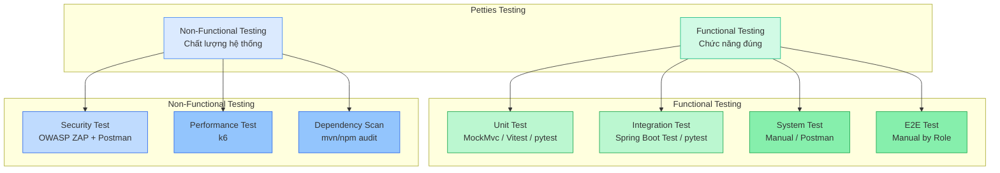

# Petties Testing Overview

**Version:** 1.0  
**Last Updated:** 2026-04-22  
**Project:** Petties - Veterinary Appointment Booking Platform  
**Timeline:** 14 Sprints (10/12/2025 - 11/03/2026)

---

## 1. Overview

Tài liệu này tổng hợp toàn bộ các loại testing trong Petties, bao gồm **Functional Testing** và **Non-Functional Testing**, kèm tools sử dụng, cách chạy, và cách đọc kết quả.

> **Mục tiêu:** ≥ 80% Controller test coverage, 0 Critical/High bugs tại release, ≥ 95% test pass rate.

---

## 2. Testing Types



### 2.1 Phân loại chi tiết

| Loại test | Mức | Mục đích | Tool | Khi nào chạy |
|---|---|---|---|---|
| **Unit Test** | Code level | Verify từng function/component riêng lẻ | JUnit 5, Vitest, pytest | Mỗi PR (CI tự động) |
| **Integration Test** | API layer | Verify endpoints, validation, exception | MockMvc, pytest | Mỗi PR (CI tự động) |
| **Functional Test** | User flow | Verify scenarios hoàn chỉnh | Manual + Postman | Sprint review |
| **System Test** | Toàn hệ thống | E2E business flows | Manual | Pre-release |
| **Security Test** | Vulnerability | AuthN/AuthZ, injection, CVE | OWASP ZAP + Postman | Pre-release |
| **Performance Test** | Load/Latency | p95 latency, error rate | k6 | Pre-release |

---

## 3. Testing Tools

### 3.1 Functional Testing Tools

| Tool | Service | Loại test | Framework |
|------|---------|----------|----------|
| **JUnit 5 + Mockito** | Backend | Unit + Controller | `@WebMvcTest`, `MockMvc` |
| **Vitest + React Testing Library** | Frontend (Web) | Unit component | React Testing Library |
| **pytest** | AI Service | Unit API | pytest-asyncio |
| **Flutter Test** | Mobile | Widget + unit | flutter_test |
| **Postman + Newman** | Tất cả | API functional | Postman Collections |
| **Spring Boot Test** | Backend | Integration | `@SpringBootTest` |

### 3.2 Non-Functional Testing Tools

| Tool | Mục đích | Loại |
|------|-----------|-----|
| **OWASP ZAP** | Security vulnerability scan (API + web) | Security |
| **k6** | Load test, measure latency, throughput | Performance |
| **Postman + Newman** | AuthN/AuthZ test cases | Security |
| **mvn dependency:analyze** | Dependency CVE scan (JAR) | Security |
| **npm audit** | Dependency CVE scan (JS/TS) | Security |
| **pip-audit** | Dependency CVE scan (Python) | Security |

---

## 4. Quick Reference - Chạy Tests

```bash
# === Functional Tests ===

# Backend Unit Tests (Spring Boot)
cd backend-spring/petties
mvn test                                    # All tests
mvn test -Dtest="*ControllerUnitTest"      # Controller tests only
mvn test -Dtest=AuthControllerUnitTest  # Single test class
mvn clean test jacoco:report             # With coverage report
# Report: target/site/jacoco/index.html

# Frontend Unit Tests (React/Web)
cd petties-web
npm test -- --run                        # All tests (CI mode)
npm run test:ui                     # With UI (dev)
npm run test:coverage               # With coverage

# AI Service Unit Tests (FastAPI)
cd petties-agent-serivce
pytest                                  # All tests
pytest tests/test_api.py -v          # Single file
pytest -k "test_name"            # By keyword

# Mobile Unit Tests (Flutter)
cd petties_mobile
flutter test                          # All tests
flutter test test/file_test.dart     # Single file

# === Non-Functional Tests ===

# Security - Dependency Scan
cd backend-spring/petties && mvn dependency:analyze  # Backend CVE
cd petties-web && npm audit --audit-level=high           # Frontend CVE
cd petties-agent-serivce && pip-audit              # AI CVE

# Security - OWASP ZAP Desktop (Baseline Scan)
# 1. Mở ZAP Desktop → Automated Scan
# 2. URL Test:  https://test.petties.world/api
#    URL Prod: https://www.petties.world/api
# 3. Start Scan → Xem Alerts → Export HTML Report

# Performance - k6 Load Test
# Test: k6 run docs-references/testing/performance/smoke-test.js --env BASE_DOMAIN=test.petties.world --out json=report.json
# Prod: k6 run docs-references/testing/performance/smoke-test.js --env BASE_DOMAIN=www.petties.world --out json=report.json

# Security - AuthN/AuthZ with Newman
# Requires: newman run Petties-API.postman_collection.json \
#   -e Petties-Test.postman_environment.json \
#   --folder "Security Tests"
```

---

## 5. Test Environments

| Môi trường | Frontend | Unified API | Database | Dùng cho |
|-------------|---------|-----------|---------|---------|
| **Local Dev** | localhost:5173 | localhost:8080 (Nginx) | Docker | Development |
| **Test** | test.petties.world | test.petties.world/api | Neon Test | Pre-release test |
| **Production** | www.petties.world | www.petties.world/api | Neon Main | Live |

---

## 6. Related Documentation

| File | Nội dung |
|------|----------|
| [TESTING_STRATEGY.md](./TESTING_STRATEGY.md) | Chiến lược testing chi tiết |
| [UNIT_TEST_GUIDE.md](./UNIT_TEST_GUIDE.md) | Hướng dẫn viết unit tests |
| [CONTROLLER_TESTING_GUIDE.md](./CONTROLLER_TESTING_GUIDE.md) | Hướng dẫn controller tests |
| [SYSTEM_TEST_GUIDE.md](./SYSTEM_TEST_GUIDE.md) | Hướng dẫn system testing |
| [E2E_TEST_GUIDE_BY_ROLE.md](./../documentation/testing/E2E_TEST_GUIDE_BY_ROLE.md) | E2E test theo role |
| [FRONTEND_TESTING.md](./FRONTEND_TESTING.md) | Frontend unit testing |
| [NONFUNCTIONAL_TESTING.md](./NONFUNCTIONAL_TESTING.md) | **Non-functional testing (Security + Performance)** |
| [TEST_CASES.md](./TEST_CASES.md) | Tổng hợp test cases |
| `docs-references/testing/features/*.md` | API test reports |
| `docs-references/testing/ai-service-unit-tests/*.csv` | AI service test results |

---

## 7. Slide Content - Testing Summary

Khi cần trình bày vào slide, sử dụng nội dung rút gọn sau:

### Testing Stack

| Loại | Tool | Coverage Target |
|------|------|-------------|
| Unit + Integration | JUnit 5, Vitest, pytest | 80% code coverage |
| API Functional | Postman + Newman | All critical endpoints |
| System / E2E | Manual + Admin Playground | All user flows |
| **Security** | **OWASP ZAP + Postman** | **0 Critical/High** |
| **Performance** | **k6** | **p95 ≤ 500ms, error ≤ 1%** |

### Non-Functional Results (Basic)

**Security Testing**
- OWASP ZAP Baseline: Critical 0 | High 0 | Medium 2 | Low 7
- RBAC AuthZ tests: 100% PASS
- Input validation: 100% PASS

**Performance Testing**
- Tool: k6 (smoke, 20 VUs / 5 phút)
- Success rate: ≥ 99%
- Error rate: < 1%
- p95 latency: ≤ 500ms (API core)