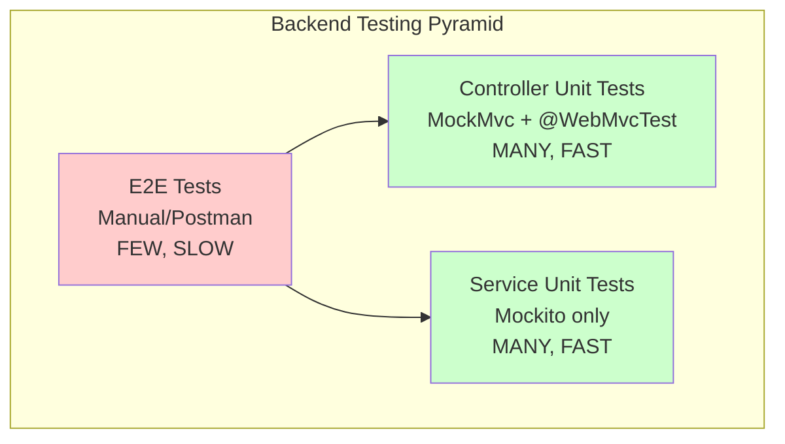

# PETTIES - Testing Strategy Document

**Version:** 3.0
**Last Updated:** 2025-12-20
**Project:** Petties - Veterinary Appointment Booking Platform

---

## 1. Overview

This document outlines the testing strategy for the Petties project, covering all testing levels from unit testing to system testing. The goal is to ensure software quality, reliability, and maintainability throughout the development lifecycle.

---

## 2. Testing Levels

Dự án Petties áp dụng **testing pyramid** với focus vào Unit Tests và System Testing:



### 2.1 Controller Unit Tests (with MockMvc)

**Objective:** Verify controller endpoints hoạt động đúng với HTTP layer (request mapping, validation, status codes).

**Approach:**
- Dùng `@WebMvcTest` để load web layer (nhưng VẪN LÀ UNIT TEST)
- Mock all services với `@MockBean`
- Test HTTP requests/responses với `MockMvc`
- KHÔNG connect database, KHÔNG connect internet
- Isolated, fast, repeatable

**What to Test:**
- HTTP status codes (200, 400, 401, 404, 500)
- Request validation (`@Valid`, `@NotBlank`, `@Size`)
- JSON serialization/deserialization
- URL path mapping (`@GetMapping`, `@PostMapping`)
- Exception handling (GlobalExceptionHandler)
- Response structure

**Tools:**

| Tool | Purpose |
|------|---------|
| JUnit 5 | Test framework |
| MockMvc | Simulate HTTP requests (in-memory, no network) |
| `@WebMvcTest` | Load web layer only (no DB, no full context) |
| `@MockBean` | Mock service layer |
| Jackson ObjectMapper | JSON parsing |
| AssertJ | Assertions |

**Test Structure:**
```
src/test/java/com/petties/petties/
└── controller/
    ├── AuthControllerUnitTest.java
    ├── UserControllerUnitTest.java
    ├── PetControllerUnitTest.java
    └── BookingControllerUnitTest.java
```

**Naming Convention:**
- Files: `*ControllerUnitTest.java`
- Methods: `methodName_condition_expectedResult`

Examples:
- `login_validCredentials_returns200`
- `login_blankUsername_returns400`
- `getProfile_authenticatedUser_returns200`

**Example Pattern:**
```java
@WebMvcTest(UserController.class)
@DisplayName("UserController Unit Tests")
class UserControllerUnitTest {

    @Autowired private MockMvc mockMvc;
    @MockBean private UserService userService;
    @Autowired private ObjectMapper objectMapper;

    @Test
    void getProfile_authenticatedUser_returns200() throws Exception {
        when(userService.getUserById(any())).thenReturn(mockResponse);

        mockMvc.perform(get("/api/users/profile")
                .header("Authorization", "Bearer token"))
            .andExpect(status().isOk())
            .andExpect(jsonPath("$.username").exists());
    }

    @Test
    void updateProfile_blankFullName_returns400() throws Exception {
        UpdateProfileRequest request = new UpdateProfileRequest("", "0987654321");

        mockMvc.perform(put("/api/users/profile")
                .contentType(MediaType.APPLICATION_JSON)
                .content(objectMapper.writeValueAsString(request)))
            .andExpect(status().isBadRequest());
    }
}
```

**Coverage Target:** ≥ 80% for controller classes

---

### 2.2 System Testing

**Objective:** Validate the complete application in a production-like environment.

**Types:**

| Type | Description | Tools |
|------|-------------|-------|
| Functional Testing | Verify features match requirements | Manual, Postman |
| API Testing | Validate all REST endpoints | Postman Collections |
| UI Testing | Test web and mobile interfaces | Manual, Browser DevTools |
| Performance Testing | Verify response times | JMeter (if needed) |
| Security Testing | Identify vulnerabilities | OWASP guidelines |

**Test Environment:**

> **✅ Trạng thái:** Tất cả environments đã được deploy và hoạt động.

| Environment | Service | URL | Port | Branch |
|-------------|---------|-----|------|--------|
| **Development** | Backend API | `http://localhost:8080/api` | 8080 | `feature/*` |
| | AI Service | `http://localhost:8000` | 8000 | |
| | Frontend | `http://localhost:5173` | 5173 | |
| **Test/Staging** | Backend API | `https://api-test.petties.world/api` | 8081 | `develop` |
| | AI Service | `https://api-test.petties.world/ai` | 8001 | |
| | Frontend | `https://test.petties.world` | - | |
| **Production** | Backend API | `https://api.petties.world/api` | 8080 | `main` |
| | AI Service | `https://ai.petties.world` | 8000 | |
| | Frontend | `https://www.petties.world` | - | |

**Firebase Console:** https://console.firebase.google.com/project/petties-cd84e

**GitHub Repository:** https://github.com/espresso23/Petties-Veterinary-Appointment-Booking-Platform

---

### 2.3 Beta Testing (Internal Testing)

**Objective:** Distribute app builds to internal testers for real-device testing before production release.

**Platforms:**

| Platform | Distribution Tool | Testers |
|----------|-------------------|---------|
| Android | **Firebase App Distribution** | Internal team, QA |
| iOS | **TestFlight** | Internal team, QA |

#### 2.3.1 Firebase App Distribution (Android)

**Workflow:**

```
Developer Push to develop
        ↓
GitHub Actions (mobile-ci-cd.yml)
        ↓
Build APK (staging flavor)
        ↓
Upload to Firebase App Distribution
        ↓
Testers receive email notification
        ↓
Install via Firebase App Tester app
        ↓
Test and report bugs
```

**Tester Groups:**

| Group | Members | Khi nào nhận build |
|-------|---------|-------------------|
| `petties-test` | Dev team, QA | Push to `develop` |
| `production-testers` | Stakeholders, PO | Push to `main` (pre-release) |

**Environments trong build:**

| Branch | Flavor | API URL |
|--------|--------|---------|
| `develop` | staging | api-test.petties.world |
| `main` | prod | api.petties.world |

#### 2.3.2 TestFlight (iOS)

**Requirements:**
- Apple Developer Account ($99/năm)
- App created on App Store Connect

**Tester Types:**

| Type | Số lượng | Review |
|------|----------|--------|
| Internal Testers | 100 | Không cần |
| External Testers | 10,000 | Cần Apple review (~24h) |

#### 2.3.3 Beta Testing Checklist

**Trước khi distribute:**
- [ ] Build thành công trên CI/CD
- [ ] Đúng flavor/environment
- [ ] Release notes rõ ràng
- [ ] Không có crash lớn

**Testers kiểm tra:**
- [ ] App install và launch thành công
- [ ] Login/Register hoạt động
- [ ] Core features hoạt động (Booking, Pet management)
- [ ] Push notifications nhận được
- [ ] UI hiển thị đúng trên device

**Sau khi test:**
- [ ] Bugs được report trên GitHub Issues
- [ ] Feedback được ghi nhận
- [ ] Fix bugs và release build mới

#### 2.3.4 Bug Report Template (từ Testers)

```markdown
**Device:** iPhone 14 / Android 13
**App Version:** 1.0.0-staging (build #45)
**Steps to reproduce:**
1. Open app
2. Navigate to Booking
3. Select date

**Expected:** Calendar shows available slots
**Actual:** App crashes

**Screenshot/Video:** [Attach]
```

#### 2.3.5 Tools & Links

| Tool | Purpose | Link |
|------|---------|------|
| Firebase App Distribution | Android distribution | https://console.firebase.google.com/project/petties-cd84e/appdistribution |
| TestFlight | iOS distribution | https://appstoreconnect.apple.com |
| Firebase App Tester | Android app for testers | [Play Store](https://play.google.com/store/apps/details?id=com.google.firebase.appdistribution.testerapp) |
| TestFlight App | iOS app for testers | [App Store](https://apps.apple.com/app/testflight/id899247664) |
| GitHub Actions | CI/CD Workflows | https://github.com/espresso23/Petties-Veterinary-Appointment-Booking-Platform/actions |
| Postman | API Testing | https://www.postman.com |

## 3. Test Execution Process

### 3.1 Automated Testing (CI Pipeline)

```
Developer Push Code
       ↓
GitHub Actions (ci.yml)
       ↓
Build Application
       ↓
Run Unit Tests
       ↓
Run Integration Tests
       ↓
Report Results
       ↓
Pass/Fail Status on PR
```

### 3.2 Manual Testing

1. **Before PR:** Developer tests feature locally
2. **After PR Approved:** QA tests on Test environment
3. **Before Release:** Full regression testing

---

## 4. Test Case Template

### 4.1 API Test Case

| Field | Value |
|-------|-------|
| **Test ID** | TC-AUTH-001 |
| **API Endpoint** | POST /api/auth/login |
| **Description** | Verify successful login with valid credentials |
| **Preconditions** | User exists with email: test@example.com |
| **Request Body** | `{"email": "test@example.com", "password": "password123"}` |
| **Expected Response** | Status: 200, Body contains accessToken and refreshToken |
| **Actual Result** | (To be filled during execution) |
| **Status** | Pass/Fail |

---

## 5. Defect Management

### 5.1 Defect Severity

| Severity | Description | Example |
|----------|-------------|---------|
| Critical | System crash, data loss | Payment fails silently |
| High | Major feature not working | Cannot create booking |
| Medium | Feature partially working | Validation message incorrect |
| Low | Minor issues, cosmetic | Typo in error message |

### 5.2 Defect Workflow

```
New → Assigned → In Progress → Fixed → Verified → Closed
                      ↓
                  Reopened
```

---

## 6. Test Metrics

| Metric | Target |
|--------|--------|
| Unit Test Coverage | ≥ 70% |
| Test Pass Rate | ≥ 95% |
| Critical Bugs at Release | 0 |
| High Bugs at Release | 0 |
| Defect Detection Rate | ≥ 80% before production |

---

## 7. Testing Schedule

| Sprint | Testing Activities |
|--------|-------------------|
| Sprint 1-3 | Unit tests for Auth, Pet, Clinic APIs |
| Sprint 4-6 | Integration tests for Booking flow |
| Sprint 7-9 | System testing, Performance testing |
| Sprint 10-12 | Regression testing, Security testing |
| Sprint 13 | Final QA, User Acceptance Testing |

---

## 8. Responsibilities

| Role | Responsibilities |
|------|-----------------|
| **Developers** | Write unit tests, fix defects |
| **Team Leader** | Review test coverage, approve releases |
| **QA (All members)** | Execute manual tests, report defects |

---

**Document Status:** Approved  
**Maintained By:** Petties Team
