# PETTIES - Testing Strategy Document

**Version:** 4.3  
**Last Updated:** 2025-12-27  
**Project:** Petties - Veterinary Appointment Booking Platform  
**Timeline:** 14 Sprints (10/12/2025 - 11/03/2026)

---

## 1. Overview

This document outlines the testing strategy for the Petties project, focusing on **Unit Testing (Controller/API)** và **System Testing**.

> **📖 Chi tiết về cách viết Controller Tests:** Xem [CONTROLLER_TESTING_GUIDE.md](./CONTROLLER_TESTING_GUIDE.md)

### 1.1 Testing Approach

```mermaid
flowchart TB
    subgraph "Petties Testing Strategy"
        direction TB
        System[🧪 SYSTEM TESTING\nManual Testing\nAPI Testing với Postman\nBeta Testing\nUAT]
        Unit[⚙️ UNIT TESTING\nController Tests với MockMvc\n@WebMvcTest + @MockitoBean]
    end

    System --> Unit

    style System fill:#dbeafe,stroke:#3b82f6,stroke-width:3px
    style Unit fill:#d1fae5,stroke:#10b981,stroke-width:3px
```



### 1.2 Testing Objectives

| Objective | Target |
|-----------|--------|
| **Controller Test Coverage** | ≥ 80% |
| **Critical Bugs at Release** | 0 |
| **High Bugs at Release** | 0 |
| **Test Pass Rate** | ≥ 95% |

---

## 2. Test Strategy Overview

The Petties test strategy follows a hybrid approach, combining **Automated Unit Testing** and **Manual System Verification** to ensure a high-quality veterinary ecosystem.

### 2.1 Testing Strategy Table

| Level | Objective | Technique | Completion Criteria |
| :--- | :--- | :--- | :--- |
| **Unit** | To verify that individual Controller endpoints and API components handle requests, validation, and exceptions correctly. | Automated White-box testing using **MockMvc** (Backend) and **pytest** (AI). | 100% of unit tests pass; Minimum of **80% code coverage** for all Controllers. |
| **System** | To validate complete end-to-end business workflows and AI ReAct logic against the requirements. | Manual Black-box testing on **Flutter/React**; Behavioral testing via **Admin Playground**. | **Zero open Critical/High bugs**; All primary features and edge cases verified. |

### 2.2 Test Levels
*Table 2. Test Levels*

| Type of Tests | Unit | System |
| :--- | :---: | :---: |
| Whitebox | X | |
| Blackbox | | X |

#### Unit Testing:
Unit testing involves testing individual parts of a software system separately to verify their correct operation. These units may include functions, methods, or modules. The purpose is to ensure each part operates accurately based on given inputs, allowing early detection and correction of issues during development. This testing confirms that each component works as intended before integration with the larger system.

---

## 3. Test Plan

### 3.1 Human Resources
*Table 4. Human resources*

| Worker/Doer | Role | Specific Responsibilities/Comments |
| :--- | :--- | :--- |
| **Project/Tech Lead** | Management | Oversee the entire testing process, define testing scope, and ensure milestone delivery. |
| **Backend Developers** | Backend Dev | Write unit tests for Spring Boot Controllers, address API bugs, and optimize backend performance. |
| **AI Developers** | AI Engineer | Develop and test AI Service logic (Python/pytest) and ensure RAG knowledge base accuracy. |
| **Frontend Developers** | Frontend Dev | Write unit tests for Flutter mobile components and resolve UI/UX inconsistencies. |
| **QA/Testers** | QA Engineer | Design and execute manual test cases, perform functional testing, and manage defect tracking. |

### 3.2 Test Environment
*Table 5. Test environment*

| Purpose | Tool | Provider | Version | Information |
| :--- | :--- | :--- | :--- | :--- |
| **Development Environment** | Docker Compose | Developers' PC | Latest | localhost:8080 |
| **Testing/Staging Environment**| AWS EC2 (Ubuntu) | Amazon Web Services| Latest | • Backend: https://api-test.petties.world/api<br>• AI: https://api-test.petties.world/ai |
| **Unit Testing Framework** | JUnit 5, Mockito, pytest | Open Source | Latest | N/A |
| **Beta Testing (Mobile)** | Firebase App Distribution| Google | N/A | Firebase Console |
| **API Testing Infrastructure** | Postman Collections | Postman Inc. | Latest | N/A |

### 3.3 Test Milestones
*Table 6. Test milestones*

| Milestone Task | Start Date | End Date |
| :--- | :--- | :--- |
| Init Test Plan | 30/12/2024 | 30/12/2024 |
| Define test case for sprint 1 | 30/12/2024 | 12/01/2025 |
| Execute test for sprint 1 | 30/12/2024 | 12/01/2025 |
| Define test case for sprint 2 | 13/01/2025 | 27/01/2025 |
| Execute test for sprint 2 | 13/01/2025 | 27/01/2025 |
| Define test case for sprint 3 | 27/01/2025 | 10/02/2025 |
| Execute test for sprint 3 | 27/01/2025 | 10/02/2025 |
| Define test case for sprint 4 | 10/02/2025 | 24/02/2025 |
| Execute test for sprint 4 | 10/02/2025 | 24/02/2025 |
| Define test case for sprint 5 | 24/02/2025 | 10/03/2025 |
| Execute test for sprint 5 | 24/02/2025 | 10/03/2025 |
| Define test case for sprint 6 | 10/03/2025 | 24/03/2025 |
| Execute test for sprint 6 | 10/03/2025 | 24/03/2025 |
| Define test case for sprint 7 | 24/03/2025 | 07/04/2025 |
| Execute test for sprint 7 | 24/03/2025 | 07/04/2025 |
| Define test case for sprint 8 | 24/03/2025 | 07/04/2025 |
| Execute test for sprint 8 | 24/03/2025 | 07/04/2025 |

---

## 4. Unit Testing Details (Controller Only)

### 4.1 Overview

Unit Testing tập trung vào **HTTP layer** của Controllers - đảm bảo API endpoints hoạt động đúng.

| Test | NOT Test |
|------|----------|
| HTTP status codes | Business logic |
| Request validation | Database queries |
| JSON serialization | External APIs |
| Exception handling | Service layer logic |

> **📖 Full guide:** [CONTROLLER_TESTING_GUIDE.md](./CONTROLLER_TESTING_GUIDE.md)

### 4.2 Technical Stack

| Component | Technology |
|-----------|------------|
| Test Framework | JUnit 5 |
| Mock Framework | Mockito (`@MockitoBean`) |
| Web Layer Test | `@WebMvcTest` |
| HTTP Simulation | MockMvc |
| JSON Handling | Jackson ObjectMapper |
| Assertions | AssertJ |

### 3.3 Test Template

```java
@WebMvcTest(YourController.class)
@DisplayName("YourController Unit Tests")
class YourControllerUnitTest {

    @Autowired
    private MockMvc mockMvc;

    @MockitoBean
    private YourService yourService;

    @Autowired
    private ObjectMapper objectMapper;

    // ==================== GET TESTS ====================

    @Test
    void getResource_validId_returns200() throws Exception {
        when(yourService.getById(any())).thenReturn(mockData);

        mockMvc.perform(get("/api/resource/{id}", resourceId)
                .header("Authorization", "Bearer token"))
            .andExpect(status().isOk())
            .andExpect(jsonPath("$.id").exists());
    }

    @Test
    void getResource_notFound_returns404() throws Exception {
        when(yourService.getById(any()))
            .thenThrow(new ResourceNotFoundException("Not found"));

        mockMvc.perform(get("/api/resource/{id}", resourceId))
            .andExpect(status().isNotFound());
    }

    // ==================== POST TESTS ====================

    @Test
    void createResource_validData_returns201() throws Exception {
        CreateRequest request = new CreateRequest("name", "value");
        when(yourService.create(any())).thenReturn(mockResponse);

        mockMvc.perform(post("/api/resource")
                .contentType(MediaType.APPLICATION_JSON)
                .content(objectMapper.writeValueAsString(request)))
            .andExpect(status().isCreated());
    }

    @Test
    void createResource_blankName_returns400() throws Exception {
        CreateRequest request = new CreateRequest("", "value"); // @NotBlank violation

        mockMvc.perform(post("/api/resource")
                .contentType(MediaType.APPLICATION_JSON)
                .content(objectMapper.writeValueAsString(request)))
            .andExpect(status().isBadRequest());
    }
}
```

### 3.4 Naming Convention

| Type | Convention | Example |
|------|------------|---------|
| File | `*ControllerUnitTest.java` | `AuthControllerUnitTest.java` |
| Method | `methodName_condition_expectedResult` | `login_validCredentials_returns200` |

### 3.5 Test Cases per Endpoint

| Status | When to Test |
|--------|--------------|
| **200 OK** | Request thành công |
| **201 Created** | Tạo resource mới thành công |
| **400 Bad Request** | Validation errors (`@NotBlank`, `@Size`) |
| **401 Unauthorized** | Missing/invalid token |
| **403 Forbidden** | Token valid nhưng không có quyền |
| **404 Not Found** | Resource không tồn tại |

### 3.6 Controllers to Test

| Controller | Priority | APIs |
|------------|----------|------|
| `AuthController` | High | login, register, verifyOtp, refreshToken |
| `UserController` | High | getProfile, updateProfile, uploadAvatar |
| `ClinicController` | High | create, getById, search, approve |
| `ClinicStaffController` | High | quickAdd, getList, hasManager, remove |
| `BookingController` | High | create, getList, cancel, checkIn |
| `PetController` | Medium | create, update, delete, getByOwner |

### 3.7 File Structure

```
backend-spring/petties/src/test/java/com/petties/petties/controller/
├── AuthControllerUnitTest.java
├── UserControllerUnitTest.java
├── ClinicControllerUnitTest.java
├── ClinicStaffControllerUnitTest.java
├── BookingControllerUnitTest.java
└── PetControllerUnitTest.java
```

### 3.8 Running Tests

```bash
# Run all controller tests
mvn test -Dtest="*ControllerUnitTest"

# Run single test class
mvn test -Dtest=AuthControllerUnitTest

# Run with coverage report
mvn clean test jacoco:report
# Report: target/site/jacoco/index.html
```

---

## 5. System Testing Details

### 4.1 Overview

System Testing validate ứng dụng hoàn chỉnh trên môi trường thật.

| Type | Description | Tool |
|------|-------------|------|
| Manual Testing | Tester test thủ công | Browser, Mobile |
| API Testing | Test APIs manually | Postman |
| Beta Testing | Internal testing | Firebase, TestFlight |

### 4.2 Test Environments

| Environment | Backend | Frontend |
|-------------|---------|----------|
| **Development** | localhost:8080 | localhost:5173 |
| **Test** | api-test.petties.world | test.petties.world |
| **Production** | api.petties.world | www.petties.world |

### 4.3 Manual Testing Process

```mermaid
flowchart LR
    A[Feature Done] --> B[Deploy to Test]
    B --> C[Tester Tests]
    C --> D{Bugs?}
    D -->|Yes| E[Report Bug]
    D -->|No| F[✅ Approve]
    E --> G[Dev Fix]
    G --> B
    F --> H[Ready for Prod]
```



### 4.4 API Testing with Postman

| Collection | Key Endpoints |
|------------|---------------|
| Auth | POST /auth/login, /register, /verify-otp |
| User | GET /users/profile, PUT /users/profile |
| Clinic | POST /clinics, GET /clinics/search |
| Staff | POST /clinics/{id}/staff/quick-add |
| Booking | POST /bookings, PUT /bookings/{id}/cancel |

### 4.5 Beta Testing

| Platform | Tool | Trigger |
|----------|------|---------|
| Android | Firebase App Distribution | Push to `develop` |
| iOS | TestFlight | Push to `develop` |

### 3.6 UAT (Sprint 13-14)

| Feature | Scenario | Tester |
|---------|----------|--------|
| Registration | Register → OTP → Login | PO |
| Booking | Search → Select → Book | PO |
| AI Chat | Ask → Get answer | PO |

---

## 6. Tester ↔ Developer Communication

### 5.1 Bug Flow

```mermaid
flowchart TD
    Start([Dev Push]) --> CI[CI: Run Unit Tests]
    CI --> Pass{Pass?}
    Pass -->|No| Fix[Dev Fix]
    Fix --> CI
    Pass -->|Yes| Deploy[Deploy to Test]
    
    Deploy --> Test[👤 Tester Tests]
    Test --> Bug{Bug?}
    Bug -->|No| OK[✅ Approve]
    Bug -->|Yes| Report[📝 Create Issue]
    
    Report --> Triage[Team Lead Triage]
    Triage --> Assign[Assign Dev]
    Assign --> DevFix[Dev Fix]
    DevFix --> CI
    
    OK --> Prod([Production])
```



### 5.2 Communication Protocol

```mermaid
sequenceDiagram
    participant T as 👤 Tester
    participant GH as 📁 GitHub
    participant TL as 👨‍💼 Lead
    participant D as 👨‍💻 Developer
    
    T->>T: Bug found on Test env
    T->>GH: Create Issue + Screenshots
    T->>GH: Set severity label
    
    TL->>GH: Review & assign
    GH-->>D: Notification
    
    D->>GH: Fix → PR → Merge
    D->>GH: Comment: Ready to verify
    
    T->>T: Re-test on Test env
    
    alt Fixed
        T->>GH: Close issue ✅
    else Not Fixed
        T->>GH: Reopen + comment
    end
```



### 5.3 Response Time SLA

| Severity | Triage | Fix | Verify |
|----------|--------|-----|--------|
| 🔴 Critical | < 1h | Same day | < 2h |
| 🟠 High | < 2h | 1-2 days | < 4h |
| 🟡 Medium | < 4h | This sprint | < 1 day |
| 🟢 Low | < 1 day | Next sprint | < 2 days |

### 5.4 Bug Report Template

```markdown
## 🐛 Bug Report

**Environment:** Test / Production
**Platform:** Web / Android / iOS

### Steps
1. Go to...
2. Click...
3. Enter...

### Expected
[What should happen]

### Actual
[What happens]

### Screenshot
[Attach]

### Severity
- [ ] 🔴 Critical
- [ ] 🟠 High
- [ ] 🟡 Medium
- [ ] 🟢 Low
```

---

## 7. Testing Schedule (14 Sprints)

| Sprint | Unit Tests (Controller) | System Tests |
|--------|------------------------|--------------|
| **1** | AuthControllerUnitTest | Manual: Login/Register |
| **2** | UserControllerUnitTest | Manual: Profile |
| **3** | ClinicControllerUnitTest, ClinicStaffControllerUnitTest | Manual: Clinic CRUD |
| **4** | - | Manual: Search |
| **5** | SlotControllerUnitTest | Manual: Slots |
| **6** | BookingControllerUnitTest | Manual: Booking flow |
| **7** | EMRControllerUnitTest | Manual: Medical |
| **8** | PaymentControllerUnitTest | Manual: Stripe |
| **9** | DashboardControllerUnitTest | Manual: Reports |
| **10** | - | Manual: AI Chatbot |
| **11** | - | Beta Testing |
| **12** | - | Beta + Bug fix |
| **13** | - | **UAT** |
| **14** | - | Production go-live |

---

## 8. Definition of Done

### Developer DoD
- [ ] Controller tests written (≥ 80% coverage)
- [ ] CI green
- [ ] Code reviewed
- [ ] Self-tested on Test env

### Tester DoD
- [ ] All features tested
- [ ] Critical/High bugs verified fixed
- [ ] Sign-off provided

### Release DoD
- [ ] All controller tests passing
- [ ] UAT approved
- [ ] No Critical/High bugs open

---

## 9. Related Documents

| Document | Description |
|----------|-------------|
| [CONTROLLER_TESTING_GUIDE.md](./CONTROLLER_TESTING_GUIDE.md) | Chi tiết cách viết Controller tests |
| [features/*.md](./features/) | Test reports per feature |

---

**Document Status:** ✅ Approved  
**Maintained By:** Petties Team
